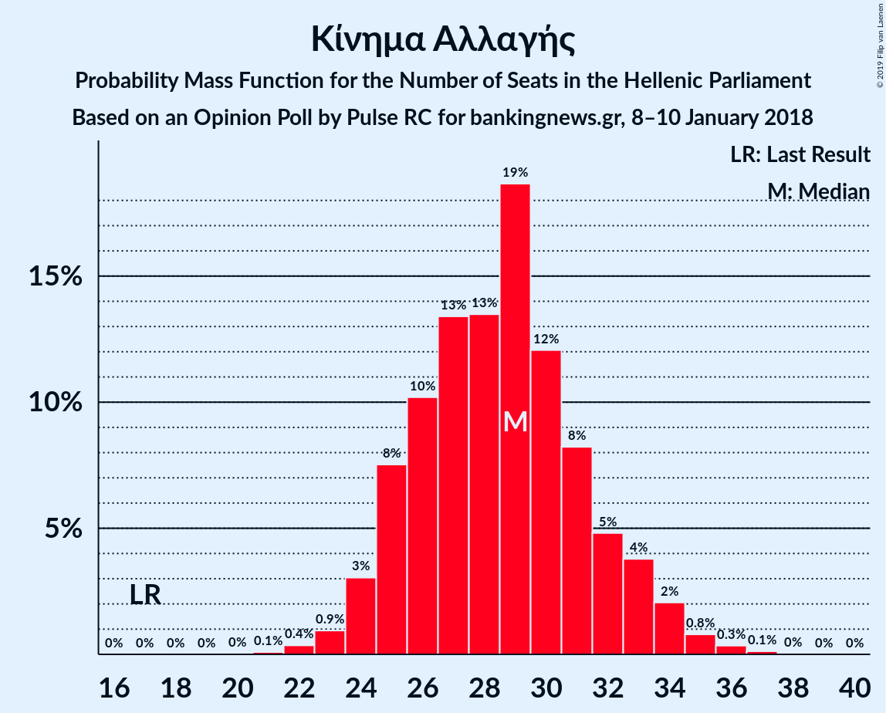
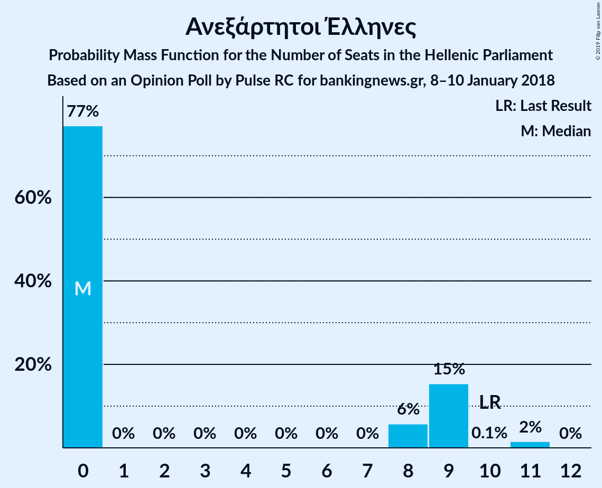

# Opinion Poll by Pulse RC for bankingnews.gr, 8–10 January 2018

<a href="#voting-intentions">Voting Intentions</a> | <a href="#seats">Seats</a> | <a href="#coalitions">Coalitions</a> | <a href="#technical-information">Technical Information</a>

## Voting Intentions

### Confidence Intervals

| Party | Last Result | Poll Result | 80% Confidence Interval | 90% Confidence Interval | 95% Confidence Interval | 99% Confidence Interval |
|:-----:|:-----------:|:-----------:|:-----------------------:|:-----------------------:|:-----------------------:|:-----------------------:|
| Νέα Δημοκρατία | 28.1% | 36.5% | 34.8–38.3% |34.3–38.9% |33.9–39.3% |33.0–40.2% |
| Συνασπισμός Ριζοσπαστικής Αριστεράς | 35.5% | 25.0% | 23.5–26.7% |23.0–27.1% |22.6–27.6% |21.9–28.3% |
| Κίνημα Αλλαγής | 6.3% | 10.0% | 9.0–11.2% |8.7–11.6% |8.4–11.9% |8.0–12.5% |
| Χρυσή Αυγή | 7.0% | 8.5% | 7.6–9.7% |7.3–10.0% |7.1–10.3% |6.6–10.8% |
| Κομμουνιστικό Κόμμα Ελλάδας | 5.6% | 6.5% | 5.6–7.5% |5.4–7.7% |5.2–8.0% |4.8–8.5% |
| Ανεξάρτητοι Έλληνες | 3.7% | 2.5% | 2.0–3.2% |1.9–3.4% |1.7–3.5% |1.5–3.9% |
| Ένωση Κεντρώων | 3.4% | 2.5% | 2.0–3.2% |1.9–3.4% |1.7–3.5% |1.5–3.9% |

*Note:* The poll result column reflects the actual value used in the calculations. Published results may vary slightly, and in addition be rounded to fewer digits.

## Seats

### Confidence Intervals

| Party | Last Result | Median | 80% Confidence Interval | 90% Confidence Interval | 95% Confidence Interval | 99% Confidence Interval |
|:-----:|:-----------:|:------:|:-----------------------:|:-----------------------:|:-----------------------:|:-----------------------:|
| <a href="#νέα-δημοκρατία">Νέα Δημοκρατία</a> | 75 | 154 | 148–159 |146–161 |145–162 |142–165 |
| <a href="#συνασπισμός-ριζοσπαστικής-αριστεράς">Συνασπισμός Ριζοσπαστικής Αριστεράς</a> | 145 | 71 | 66–76 |65–78 |64–79 |62–81 |
| <a href="#κίνημα-αλλαγής">Κίνημα Αλλαγής</a> | 17 | 29 | 25–32 |25–33 |24–34 |23–36 |
| <a href="#χρυσή-αυγή">Χρυσή Αυγή</a> | 18 | 24 | 21–28 |21–28 |20–29 |19–31 |
| <a href="#κομμουνιστικό-κόμμα-ελλάδας">Κομμουνιστικό Κόμμα Ελλάδας</a> | 15 | 18 | 16–21 |15–22 |15–23 |14–24 |
| <a href="#ανεξάρτητοι-έλληνες">Ανεξάρτητοι Έλληνες</a> | 10 | 0 | 0–9 |0–9 |0–9 |0–11 |
| <a href="#ένωση-κεντρώων">Ένωση Κεντρώων</a> | 9 | 0 | 0–9 |0–9 |0–10 |0–11 |

### Νέα Δημοκρατία

*For a full overview of the results for this party, see the [Νέα Δημοκρατία](party-νέαδημοκρατία.html) page.*

| Number of Seats | Probability | Accumulated | Special Marks |
|:---------------:|:-----------:|:-----------:|:-------------:|
| 75 | 0% | 100% | Last Result |
| 76 | 0% | 100% |  |
| 77 | 0% | 100% |  |
| 78 | 0% | 100% |  |
| 79 | 0% | 100% |  |
| 80 | 0% | 100% |  |
| 81 | 0% | 100% |  |
| 82 | 0% | 100% |  |
| 83 | 0% | 100% |  |
| 84 | 0% | 100% |  |
| 85 | 0% | 100% |  |
| 86 | 0% | 100% |  |
| 87 | 0% | 100% |  |
| 88 | 0% | 100% |  |
| 89 | 0% | 100% |  |
| 90 | 0% | 100% |  |
| 91 | 0% | 100% |  |
| 92 | 0% | 100% |  |
| 93 | 0% | 100% |  |
| 94 | 0% | 100% |  |
| 95 | 0% | 100% |  |
| 96 | 0% | 100% |  |
| 97 | 0% | 100% |  |
| 98 | 0% | 100% |  |
| 99 | 0% | 100% |  |
| 100 | 0% | 100% |  |
| 101 | 0% | 100% |  |
| 102 | 0% | 100% |  |
| 103 | 0% | 100% |  |
| 104 | 0% | 100% |  |
| 105 | 0% | 100% |  |
| 106 | 0% | 100% |  |
| 107 | 0% | 100% |  |
| 108 | 0% | 100% |  |
| 109 | 0% | 100% |  |
| 110 | 0% | 100% |  |
| 111 | 0% | 100% |  |
| 112 | 0% | 100% |  |
| 113 | 0% | 100% |  |
| 114 | 0% | 100% |  |
| 115 | 0% | 100% |  |
| 116 | 0% | 100% |  |
| 117 | 0% | 100% |  |
| 118 | 0% | 100% |  |
| 119 | 0% | 100% |  |
| 120 | 0% | 100% |  |
| 121 | 0% | 100% |  |
| 122 | 0% | 100% |  |
| 123 | 0% | 100% |  |
| 124 | 0% | 100% |  |
| 125 | 0% | 100% |  |
| 126 | 0% | 100% |  |
| 127 | 0% | 100% |  |
| 128 | 0% | 100% |  |
| 129 | 0% | 100% |  |
| 130 | 0% | 100% |  |
| 131 | 0% | 100% |  |
| 132 | 0% | 100% |  |
| 133 | 0% | 100% |  |
| 134 | 0% | 100% |  |
| 135 | 0% | 100% |  |
| 136 | 0% | 100% |  |
| 137 | 0% | 100% |  |
| 138 | 0% | 100% |  |
| 139 | 0% | 100% |  |
| 140 | 0.1% | 99.9% |  |
| 141 | 0.1% | 99.9% |  |
| 142 | 0.3% | 99.7% |  |
| 143 | 0.4% | 99.5% |  |
| 144 | 0.8% | 99.1% |  |
| 145 | 1.5% | 98% |  |
| 146 | 2% | 97% |  |
| 147 | 3% | 94% |  |
| 148 | 3% | 91% |  |
| 149 | 4% | 88% |  |
| 150 | 7% | 84% |  |
| 151 | 7% | 77% | Majority |
| 152 | 8% | 70% |  |
| 153 | 9% | 62% |  |
| 154 | 9% | 53% | Median |
| 155 | 11% | 44% |  |
| 156 | 7% | 33% |  |
| 157 | 7% | 26% |  |
| 158 | 5% | 19% |  |
| 159 | 4% | 13% |  |
| 160 | 3% | 9% |  |
| 161 | 2% | 6% |  |
| 162 | 1.4% | 3% |  |
| 163 | 0.8% | 2% |  |
| 164 | 0.5% | 1.0% |  |
| 165 | 0.3% | 0.5% |  |
| 166 | 0.1% | 0.2% |  |
| 167 | 0.1% | 0.1% |  |
| 168 | 0% | 0% |  |

### Συνασπισμός Ριζοσπαστικής Αριστεράς

*For a full overview of the results for this party, see the [Συνασπισμός Ριζοσπαστικής Αριστεράς](party-συνασπισμόςριζοσπαστικήςαριστεράς.html) page.*

| Number of Seats | Probability | Accumulated | Special Marks |
|:---------------:|:-----------:|:-----------:|:-------------:|
| 59 | 0% | 100% |  |
| 60 | 0.1% | 99.9% |  |
| 61 | 0.2% | 99.8% |  |
| 62 | 0.4% | 99.6% |  |
| 63 | 1.3% | 99.1% |  |
| 64 | 2% | 98% |  |
| 65 | 2% | 96% |  |
| 66 | 5% | 94% |  |
| 67 | 6% | 89% |  |
| 68 | 7% | 83% |  |
| 69 | 9% | 76% |  |
| 70 | 11% | 67% |  |
| 71 | 12% | 56% | Median |
| 72 | 10% | 45% |  |
| 73 | 9% | 35% |  |
| 74 | 7% | 26% |  |
| 75 | 6% | 18% |  |
| 76 | 5% | 12% |  |
| 77 | 2% | 8% |  |
| 78 | 2% | 5% |  |
| 79 | 1.5% | 3% |  |
| 80 | 0.4% | 1.1% |  |
| 81 | 0.4% | 0.7% |  |
| 82 | 0.2% | 0.3% |  |
| 83 | 0.1% | 0.1% |  |
| 84 | 0% | 0.1% |  |
| 85 | 0% | 0% |  |
| 86 | 0% | 0% |  |
| 87 | 0% | 0% |  |
| 88 | 0% | 0% |  |
| 89 | 0% | 0% |  |
| 90 | 0% | 0% |  |
| 91 | 0% | 0% |  |
| 92 | 0% | 0% |  |
| 93 | 0% | 0% |  |
| 94 | 0% | 0% |  |
| 95 | 0% | 0% |  |
| 96 | 0% | 0% |  |
| 97 | 0% | 0% |  |
| 98 | 0% | 0% |  |
| 99 | 0% | 0% |  |
| 100 | 0% | 0% |  |
| 101 | 0% | 0% |  |
| 102 | 0% | 0% |  |
| 103 | 0% | 0% |  |
| 104 | 0% | 0% |  |
| 105 | 0% | 0% |  |
| 106 | 0% | 0% |  |
| 107 | 0% | 0% |  |
| 108 | 0% | 0% |  |
| 109 | 0% | 0% |  |
| 110 | 0% | 0% |  |
| 111 | 0% | 0% |  |
| 112 | 0% | 0% |  |
| 113 | 0% | 0% |  |
| 114 | 0% | 0% |  |
| 115 | 0% | 0% |  |
| 116 | 0% | 0% |  |
| 117 | 0% | 0% |  |
| 118 | 0% | 0% |  |
| 119 | 0% | 0% |  |
| 120 | 0% | 0% |  |
| 121 | 0% | 0% |  |
| 122 | 0% | 0% |  |
| 123 | 0% | 0% |  |
| 124 | 0% | 0% |  |
| 125 | 0% | 0% |  |
| 126 | 0% | 0% |  |
| 127 | 0% | 0% |  |
| 128 | 0% | 0% |  |
| 129 | 0% | 0% |  |
| 130 | 0% | 0% |  |
| 131 | 0% | 0% |  |
| 132 | 0% | 0% |  |
| 133 | 0% | 0% |  |
| 134 | 0% | 0% |  |
| 135 | 0% | 0% |  |
| 136 | 0% | 0% |  |
| 137 | 0% | 0% |  |
| 138 | 0% | 0% |  |
| 139 | 0% | 0% |  |
| 140 | 0% | 0% |  |
| 141 | 0% | 0% |  |
| 142 | 0% | 0% |  |
| 143 | 0% | 0% |  |
| 144 | 0% | 0% |  |
| 145 | 0% | 0% | Last Result |

### Κίνημα Αλλαγής

*For a full overview of the results for this party, see the [Κίνημα Αλλαγής](party-κίνημααλλαγής.html) page.*

| Number of Seats | Probability | Accumulated | Special Marks |
|:---------------:|:-----------:|:-----------:|:-------------:|
| 17 | 0% | 100% | Last Result |
| 18 | 0% | 100% |  |
| 19 | 0% | 100% |  |
| 20 | 0% | 100% |  |
| 21 | 0.1% | 100% |  |
| 22 | 0.4% | 99.9% |  |
| 23 | 0.9% | 99.5% |  |
| 24 | 3% | 98.6% |  |
| 25 | 8% | 96% |  |
| 26 | 10% | 88% |  |
| 27 | 13% | 78% |  |
| 28 | 13% | 64% |  |
| 29 | 19% | 51% | Median |
| 30 | 12% | 32% |  |
| 31 | 8% | 20% |  |
| 32 | 5% | 12% |  |
| 33 | 4% | 7% |  |
| 34 | 2% | 3% |  |
| 35 | 0.8% | 1.3% |  |
| 36 | 0.3% | 0.5% |  |
| 37 | 0.1% | 0.2% |  |
| 38 | 0% | 0.1% |  |
| 39 | 0% | 0% |  |

### Χρυσή Αυγή

*For a full overview of the results for this party, see the [Χρυσή Αυγή](party-χρυσήαυγή.html) page.*

| Number of Seats | Probability | Accumulated | Special Marks |
|:---------------:|:-----------:|:-----------:|:-------------:|
| 17 | 0% | 100% |  |
| 18 | 0.3% | 99.9% | Last Result |
| 19 | 0.9% | 99.7% |  |
| 20 | 3% | 98.7% |  |
| 21 | 6% | 96% |  |
| 22 | 10% | 90% |  |
| 23 | 17% | 80% |  |
| 24 | 14% | 63% | Median |
| 25 | 17% | 49% |  |
| 26 | 12% | 32% |  |
| 27 | 9% | 20% |  |
| 28 | 6% | 11% |  |
| 29 | 2% | 4% |  |
| 30 | 1.3% | 2% |  |
| 31 | 0.4% | 0.6% |  |
| 32 | 0.1% | 0.2% |  |
| 33 | 0% | 0.1% |  |
| 34 | 0% | 0% |  |

### Κομμουνιστικό Κόμμα Ελλάδας

*For a full overview of the results for this party, see the [Κομμουνιστικό Κόμμα Ελλάδας](party-κομμουνιστικόκόμμαελλάδας.html) page.*

| Number of Seats | Probability | Accumulated | Special Marks |
|:---------------:|:-----------:|:-----------:|:-------------:|
| 13 | 0.3% | 100% |  |
| 14 | 1.5% | 99.6% |  |
| 15 | 4% | 98% | Last Result |
| 16 | 10% | 94% |  |
| 17 | 16% | 83% |  |
| 18 | 20% | 67% | Median |
| 19 | 18% | 48% |  |
| 20 | 14% | 30% |  |
| 21 | 8% | 16% |  |
| 22 | 5% | 8% |  |
| 23 | 2% | 3% |  |
| 24 | 0.9% | 1.2% |  |
| 25 | 0.2% | 0.3% |  |
| 26 | 0.1% | 0.1% |  |
| 27 | 0% | 0% |  |

### Ανεξάρτητοι Έλληνες

*For a full overview of the results for this party, see the [Ανεξάρτητοι Έλληνες](party-ανεξάρτητοιέλληνες.html) page.*

| Number of Seats | Probability | Accumulated | Special Marks |
|:---------------:|:-----------:|:-----------:|:-------------:|
| 0 | 77% | 100% | Median |
| 1 | 0% | 23% |  |
| 2 | 0% | 23% |  |
| 3 | 0% | 23% |  |
| 4 | 0% | 23% |  |
| 5 | 0% | 23% |  |
| 6 | 0% | 23% |  |
| 7 | 0% | 23% |  |
| 8 | 6% | 23% |  |
| 9 | 15% | 17% |  |
| 10 | 0.1% | 2% | Last Result |
| 11 | 2% | 2% |  |
| 12 | 0% | 0% |  |

### Ένωση Κεντρώων

*For a full overview of the results for this party, see the [Ένωση Κεντρώων](party-ένωσηκεντρώων.html) page.*

| Number of Seats | Probability | Accumulated | Special Marks |
|:---------------:|:-----------:|:-----------:|:-------------:|
| 0 | 81% | 100% | Median |
| 1 | 0% | 19% |  |
| 2 | 0% | 19% |  |
| 3 | 0% | 19% |  |
| 4 | 0% | 19% |  |
| 5 | 0% | 19% |  |
| 6 | 0% | 19% |  |
| 7 | 0% | 19% |  |
| 8 | 4% | 19% |  |
| 9 | 11% | 15% | Last Result |
| 10 | 3% | 4% |  |
| 11 | 0.6% | 0.8% |  |
| 12 | 0.1% | 0.1% |  |
| 13 | 0% | 0% |  |

## Coalitions

### Confidence Intervals

| Coalition | Last Result | Median | Majority? | 80% Confidence Interval | 90% Confidence Interval | 95% Confidence Interval | 99% Confidence Interval |
|:---------:|:-----------:|:------:|:---------:|:-----------------------:|:-----------------------:|:-----------------------:|:-----------------------:|
| Νέα Δημοκρατία – Κίνημα Αλλαγής | 92 | 182 | 100% | 176–188 | 174–190 | 173–191 | 170–194 |
| Νέα Δημοκρατία | 75 | 154 | 77% | 148–159 | 146–161 | 145–162 | 142–165 |
| Συνασπισμός Ριζοσπαστικής Αριστεράς – Ανεξάρτητοι Έλληνες | 155 | 73 | 0% | 68–80 | 66–81 | 65–83 | 63–85 |
| Συνασπισμός Ριζοσπαστικής Αριστεράς | 145 | 71 | 0% | 66–76 | 65–78 | 64–79 | 62–81 |

### Νέα Δημοκρατία – Κίνημα Αλλαγής

| Number of Seats | Probability | Accumulated | Special Marks |
|:---------------:|:-----------:|:-----------:|:-------------:|
| 92 | 0% | 100% | Last Result |
| 93 | 0% | 100% |  |
| 94 | 0% | 100% |  |
| 95 | 0% | 100% |  |
| 96 | 0% | 100% |  |
| 97 | 0% | 100% |  |
| 98 | 0% | 100% |  |
| 99 | 0% | 100% |  |
| 100 | 0% | 100% |  |
| 101 | 0% | 100% |  |
| 102 | 0% | 100% |  |
| 103 | 0% | 100% |  |
| 104 | 0% | 100% |  |
| 105 | 0% | 100% |  |
| 106 | 0% | 100% |  |
| 107 | 0% | 100% |  |
| 108 | 0% | 100% |  |
| 109 | 0% | 100% |  |
| 110 | 0% | 100% |  |
| 111 | 0% | 100% |  |
| 112 | 0% | 100% |  |
| 113 | 0% | 100% |  |
| 114 | 0% | 100% |  |
| 115 | 0% | 100% |  |
| 116 | 0% | 100% |  |
| 117 | 0% | 100% |  |
| 118 | 0% | 100% |  |
| 119 | 0% | 100% |  |
| 120 | 0% | 100% |  |
| 121 | 0% | 100% |  |
| 122 | 0% | 100% |  |
| 123 | 0% | 100% |  |
| 124 | 0% | 100% |  |
| 125 | 0% | 100% |  |
| 126 | 0% | 100% |  |
| 127 | 0% | 100% |  |
| 128 | 0% | 100% |  |
| 129 | 0% | 100% |  |
| 130 | 0% | 100% |  |
| 131 | 0% | 100% |  |
| 132 | 0% | 100% |  |
| 133 | 0% | 100% |  |
| 134 | 0% | 100% |  |
| 135 | 0% | 100% |  |
| 136 | 0% | 100% |  |
| 137 | 0% | 100% |  |
| 138 | 0% | 100% |  |
| 139 | 0% | 100% |  |
| 140 | 0% | 100% |  |
| 141 | 0% | 100% |  |
| 142 | 0% | 100% |  |
| 143 | 0% | 100% |  |
| 144 | 0% | 100% |  |
| 145 | 0% | 100% |  |
| 146 | 0% | 100% |  |
| 147 | 0% | 100% |  |
| 148 | 0% | 100% |  |
| 149 | 0% | 100% |  |
| 150 | 0% | 100% |  |
| 151 | 0% | 100% | Majority |
| 152 | 0% | 100% |  |
| 153 | 0% | 100% |  |
| 154 | 0% | 100% |  |
| 155 | 0% | 100% |  |
| 156 | 0% | 100% |  |
| 157 | 0% | 100% |  |
| 158 | 0% | 100% |  |
| 159 | 0% | 100% |  |
| 160 | 0% | 100% |  |
| 161 | 0% | 100% |  |
| 162 | 0% | 100% |  |
| 163 | 0% | 100% |  |
| 164 | 0% | 100% |  |
| 165 | 0% | 100% |  |
| 166 | 0% | 100% |  |
| 167 | 0.1% | 99.9% |  |
| 168 | 0.1% | 99.9% |  |
| 169 | 0.2% | 99.8% |  |
| 170 | 0.4% | 99.6% |  |
| 171 | 0.6% | 99.2% |  |
| 172 | 0.8% | 98.5% |  |
| 173 | 1.4% | 98% |  |
| 174 | 2% | 96% |  |
| 175 | 3% | 94% |  |
| 176 | 4% | 91% |  |
| 177 | 4% | 87% |  |
| 178 | 5% | 83% |  |
| 179 | 6% | 79% |  |
| 180 | 7% | 73% |  |
| 181 | 8% | 66% |  |
| 182 | 9% | 58% |  |
| 183 | 9% | 49% | Median |
| 184 | 8% | 40% |  |
| 185 | 7% | 32% |  |
| 186 | 8% | 25% |  |
| 187 | 6% | 18% |  |
| 188 | 3% | 12% |  |
| 189 | 3% | 9% |  |
| 190 | 2% | 6% |  |
| 191 | 1.2% | 3% |  |
| 192 | 0.9% | 2% |  |
| 193 | 0.5% | 1.1% |  |
| 194 | 0.3% | 0.6% |  |
| 195 | 0.1% | 0.3% |  |
| 196 | 0.1% | 0.1% |  |
| 197 | 0% | 0% |  |

### Νέα Δημοκρατία

| Number of Seats | Probability | Accumulated | Special Marks |
|:---------------:|:-----------:|:-----------:|:-------------:|
| 75 | 0% | 100% | Last Result |
| 76 | 0% | 100% |  |
| 77 | 0% | 100% |  |
| 78 | 0% | 100% |  |
| 79 | 0% | 100% |  |
| 80 | 0% | 100% |  |
| 81 | 0% | 100% |  |
| 82 | 0% | 100% |  |
| 83 | 0% | 100% |  |
| 84 | 0% | 100% |  |
| 85 | 0% | 100% |  |
| 86 | 0% | 100% |  |
| 87 | 0% | 100% |  |
| 88 | 0% | 100% |  |
| 89 | 0% | 100% |  |
| 90 | 0% | 100% |  |
| 91 | 0% | 100% |  |
| 92 | 0% | 100% |  |
| 93 | 0% | 100% |  |
| 94 | 0% | 100% |  |
| 95 | 0% | 100% |  |
| 96 | 0% | 100% |  |
| 97 | 0% | 100% |  |
| 98 | 0% | 100% |  |
| 99 | 0% | 100% |  |
| 100 | 0% | 100% |  |
| 101 | 0% | 100% |  |
| 102 | 0% | 100% |  |
| 103 | 0% | 100% |  |
| 104 | 0% | 100% |  |
| 105 | 0% | 100% |  |
| 106 | 0% | 100% |  |
| 107 | 0% | 100% |  |
| 108 | 0% | 100% |  |
| 109 | 0% | 100% |  |
| 110 | 0% | 100% |  |
| 111 | 0% | 100% |  |
| 112 | 0% | 100% |  |
| 113 | 0% | 100% |  |
| 114 | 0% | 100% |  |
| 115 | 0% | 100% |  |
| 116 | 0% | 100% |  |
| 117 | 0% | 100% |  |
| 118 | 0% | 100% |  |
| 119 | 0% | 100% |  |
| 120 | 0% | 100% |  |
| 121 | 0% | 100% |  |
| 122 | 0% | 100% |  |
| 123 | 0% | 100% |  |
| 124 | 0% | 100% |  |
| 125 | 0% | 100% |  |
| 126 | 0% | 100% |  |
| 127 | 0% | 100% |  |
| 128 | 0% | 100% |  |
| 129 | 0% | 100% |  |
| 130 | 0% | 100% |  |
| 131 | 0% | 100% |  |
| 132 | 0% | 100% |  |
| 133 | 0% | 100% |  |
| 134 | 0% | 100% |  |
| 135 | 0% | 100% |  |
| 136 | 0% | 100% |  |
| 137 | 0% | 100% |  |
| 138 | 0% | 100% |  |
| 139 | 0% | 100% |  |
| 140 | 0.1% | 99.9% |  |
| 141 | 0.1% | 99.9% |  |
| 142 | 0.3% | 99.7% |  |
| 143 | 0.4% | 99.5% |  |
| 144 | 0.8% | 99.1% |  |
| 145 | 1.5% | 98% |  |
| 146 | 2% | 97% |  |
| 147 | 3% | 94% |  |
| 148 | 3% | 91% |  |
| 149 | 4% | 88% |  |
| 150 | 7% | 84% |  |
| 151 | 7% | 77% | Majority |
| 152 | 8% | 70% |  |
| 153 | 9% | 62% |  |
| 154 | 9% | 53% | Median |
| 155 | 11% | 44% |  |
| 156 | 7% | 33% |  |
| 157 | 7% | 26% |  |
| 158 | 5% | 19% |  |
| 159 | 4% | 13% |  |
| 160 | 3% | 9% |  |
| 161 | 2% | 6% |  |
| 162 | 1.4% | 3% |  |
| 163 | 0.8% | 2% |  |
| 164 | 0.5% | 1.0% |  |
| 165 | 0.3% | 0.5% |  |
| 166 | 0.1% | 0.2% |  |
| 167 | 0.1% | 0.1% |  |
| 168 | 0% | 0% |  |

### Συνασπισμός Ριζοσπαστικής Αριστεράς – Ανεξάρτητοι Έλληνες

| Number of Seats | Probability | Accumulated | Special Marks |
|:---------------:|:-----------:|:-----------:|:-------------:|
| 60 | 0% | 100% |  |
| 61 | 0.1% | 99.9% |  |
| 62 | 0.2% | 99.9% |  |
| 63 | 0.6% | 99.7% |  |
| 64 | 0.7% | 99.1% |  |
| 65 | 1.2% | 98% |  |
| 66 | 3% | 97% |  |
| 67 | 3% | 94% |  |
| 68 | 5% | 91% |  |
| 69 | 7% | 86% |  |
| 70 | 9% | 79% |  |
| 71 | 10% | 70% | Median |
| 72 | 7% | 60% |  |
| 73 | 9% | 52% |  |
| 74 | 8% | 43% |  |
| 75 | 7% | 36% |  |
| 76 | 7% | 29% |  |
| 77 | 4% | 22% |  |
| 78 | 4% | 18% |  |
| 79 | 3% | 13% |  |
| 80 | 3% | 10% |  |
| 81 | 3% | 7% |  |
| 82 | 1.2% | 4% |  |
| 83 | 1.3% | 3% |  |
| 84 | 0.8% | 2% |  |
| 85 | 0.4% | 0.8% |  |
| 86 | 0.1% | 0.4% |  |
| 87 | 0.2% | 0.2% |  |
| 88 | 0% | 0.1% |  |
| 89 | 0% | 0% |  |
| 90 | 0% | 0% |  |
| 91 | 0% | 0% |  |
| 92 | 0% | 0% |  |
| 93 | 0% | 0% |  |
| 94 | 0% | 0% |  |
| 95 | 0% | 0% |  |
| 96 | 0% | 0% |  |
| 97 | 0% | 0% |  |
| 98 | 0% | 0% |  |
| 99 | 0% | 0% |  |
| 100 | 0% | 0% |  |
| 101 | 0% | 0% |  |
| 102 | 0% | 0% |  |
| 103 | 0% | 0% |  |
| 104 | 0% | 0% |  |
| 105 | 0% | 0% |  |
| 106 | 0% | 0% |  |
| 107 | 0% | 0% |  |
| 108 | 0% | 0% |  |
| 109 | 0% | 0% |  |
| 110 | 0% | 0% |  |
| 111 | 0% | 0% |  |
| 112 | 0% | 0% |  |
| 113 | 0% | 0% |  |
| 114 | 0% | 0% |  |
| 115 | 0% | 0% |  |
| 116 | 0% | 0% |  |
| 117 | 0% | 0% |  |
| 118 | 0% | 0% |  |
| 119 | 0% | 0% |  |
| 120 | 0% | 0% |  |
| 121 | 0% | 0% |  |
| 122 | 0% | 0% |  |
| 123 | 0% | 0% |  |
| 124 | 0% | 0% |  |
| 125 | 0% | 0% |  |
| 126 | 0% | 0% |  |
| 127 | 0% | 0% |  |
| 128 | 0% | 0% |  |
| 129 | 0% | 0% |  |
| 130 | 0% | 0% |  |
| 131 | 0% | 0% |  |
| 132 | 0% | 0% |  |
| 133 | 0% | 0% |  |
| 134 | 0% | 0% |  |
| 135 | 0% | 0% |  |
| 136 | 0% | 0% |  |
| 137 | 0% | 0% |  |
| 138 | 0% | 0% |  |
| 139 | 0% | 0% |  |
| 140 | 0% | 0% |  |
| 141 | 0% | 0% |  |
| 142 | 0% | 0% |  |
| 143 | 0% | 0% |  |
| 144 | 0% | 0% |  |
| 145 | 0% | 0% |  |
| 146 | 0% | 0% |  |
| 147 | 0% | 0% |  |
| 148 | 0% | 0% |  |
| 149 | 0% | 0% |  |
| 150 | 0% | 0% |  |
| 151 | 0% | 0% | Majority |
| 152 | 0% | 0% |  |
| 153 | 0% | 0% |  |
| 154 | 0% | 0% |  |
| 155 | 0% | 0% | Last Result |

### Συνασπισμός Ριζοσπαστικής Αριστεράς

| Number of Seats | Probability | Accumulated | Special Marks |
|:---------------:|:-----------:|:-----------:|:-------------:|
| 59 | 0% | 100% |  |
| 60 | 0.1% | 99.9% |  |
| 61 | 0.2% | 99.8% |  |
| 62 | 0.4% | 99.6% |  |
| 63 | 1.3% | 99.1% |  |
| 64 | 2% | 98% |  |
| 65 | 2% | 96% |  |
| 66 | 5% | 94% |  |
| 67 | 6% | 89% |  |
| 68 | 7% | 83% |  |
| 69 | 9% | 76% |  |
| 70 | 11% | 67% |  |
| 71 | 12% | 56% | Median |
| 72 | 10% | 45% |  |
| 73 | 9% | 35% |  |
| 74 | 7% | 26% |  |
| 75 | 6% | 18% |  |
| 76 | 5% | 12% |  |
| 77 | 2% | 8% |  |
| 78 | 2% | 5% |  |
| 79 | 1.5% | 3% |  |
| 80 | 0.4% | 1.1% |  |
| 81 | 0.4% | 0.7% |  |
| 82 | 0.2% | 0.3% |  |
| 83 | 0.1% | 0.1% |  |
| 84 | 0% | 0.1% |  |
| 85 | 0% | 0% |  |
| 86 | 0% | 0% |  |
| 87 | 0% | 0% |  |
| 88 | 0% | 0% |  |
| 89 | 0% | 0% |  |
| 90 | 0% | 0% |  |
| 91 | 0% | 0% |  |
| 92 | 0% | 0% |  |
| 93 | 0% | 0% |  |
| 94 | 0% | 0% |  |
| 95 | 0% | 0% |  |
| 96 | 0% | 0% |  |
| 97 | 0% | 0% |  |
| 98 | 0% | 0% |  |
| 99 | 0% | 0% |  |
| 100 | 0% | 0% |  |
| 101 | 0% | 0% |  |
| 102 | 0% | 0% |  |
| 103 | 0% | 0% |  |
| 104 | 0% | 0% |  |
| 105 | 0% | 0% |  |
| 106 | 0% | 0% |  |
| 107 | 0% | 0% |  |
| 108 | 0% | 0% |  |
| 109 | 0% | 0% |  |
| 110 | 0% | 0% |  |
| 111 | 0% | 0% |  |
| 112 | 0% | 0% |  |
| 113 | 0% | 0% |  |
| 114 | 0% | 0% |  |
| 115 | 0% | 0% |  |
| 116 | 0% | 0% |  |
| 117 | 0% | 0% |  |
| 118 | 0% | 0% |  |
| 119 | 0% | 0% |  |
| 120 | 0% | 0% |  |
| 121 | 0% | 0% |  |
| 122 | 0% | 0% |  |
| 123 | 0% | 0% |  |
| 124 | 0% | 0% |  |
| 125 | 0% | 0% |  |
| 126 | 0% | 0% |  |
| 127 | 0% | 0% |  |
| 128 | 0% | 0% |  |
| 129 | 0% | 0% |  |
| 130 | 0% | 0% |  |
| 131 | 0% | 0% |  |
| 132 | 0% | 0% |  |
| 133 | 0% | 0% |  |
| 134 | 0% | 0% |  |
| 135 | 0% | 0% |  |
| 136 | 0% | 0% |  |
| 137 | 0% | 0% |  |
| 138 | 0% | 0% |  |
| 139 | 0% | 0% |  |
| 140 | 0% | 0% |  |
| 141 | 0% | 0% |  |
| 142 | 0% | 0% |  |
| 143 | 0% | 0% |  |
| 144 | 0% | 0% |  |
| 145 | 0% | 0% | Last Result |

## Technical Information

### Opinion Poll

+ **Polling firm:** Pulse RC
+ **Commissioner(s):** bankingnews.gr
+ **Fieldwork period:** 8–10 January 2018

### Calculations

+ **Sample size:** 1207
+ **Simulations done:** 1,048,576
+ **Error estimate:** 1.19%

