# Opinion Poll by Marc for Πρώτο ΘΕΜΑ, 13 January 2018

<a href="#voting-intentions">Voting Intentions</a> | <a href="#seats">Seats</a> | <a href="#coalitions">Coalitions</a> | <a href="#technical-information">Technical Information</a>

## Voting Intentions

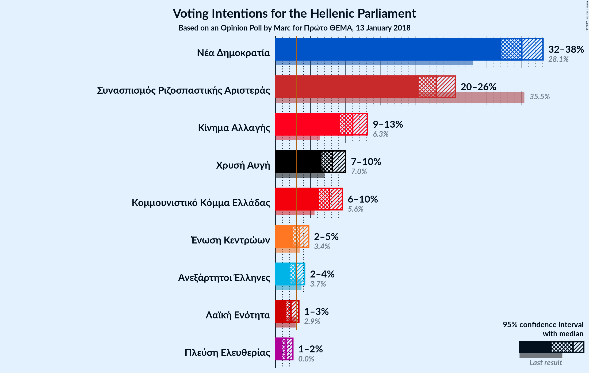

### Confidence Intervals

| Party | Last Result | Poll Result | 80% Confidence Interval | 90% Confidence Interval | 95% Confidence Interval | 99% Confidence Interval |
|:-----:|:-----------:|:-----------:|:-----------------------:|:-----------------------:|:-----------------------:|:-----------------------:|
| Νέα Δημοκρατία | 28.1% | 35.1% | 33.2–37.1% |32.7–37.6% |32.2–38.1% |31.3–39.1% |
| Συνασπισμός Ριζοσπαστικής Αριστεράς | 35.5% | 22.9% | 21.3–24.7% |20.8–25.2% |20.4–25.6% |19.6–26.5% |
| Κίνημα Αλλαγής | 6.3% | 11.0% | 9.8–12.4% |9.5–12.8% |9.2–13.1% |8.7–13.8% |
| Χρυσή Αυγή | 7.0% | 8.1% | 7.1–9.3% |6.8–9.7% |6.6–10.0% |6.1–10.6% |
| Κομμουνιστικό Κόμμα Ελλάδας | 5.6% | 7.7% | 6.7–8.9% |6.4–9.2% |6.2–9.5% |5.8–10.1% |
| Ένωση Κεντρώων | 3.4% | 3.4% | 2.8–4.3% |2.6–4.5% |2.4–4.7% |2.2–5.2% |
| Ανεξάρτητοι Έλληνες | 3.7% | 2.9% | 2.3–3.7% |2.2–3.9% |2.0–4.1% |1.8–4.6% |
| Λαϊκή Ενότητα | 2.9% | 2.2% | 1.7–2.9% |1.6–3.1% |1.4–3.3% |1.2–3.7% |
| Πλεύση Ελευθερίας | 0.0% | 1.5% | 1.1–2.1% |1.0–2.3% |0.9–2.5% |0.7–2.8% |

*Note:* The poll result column reflects the actual value used in the calculations. Published results may vary slightly, and in addition be rounded to fewer digits.

## Seats

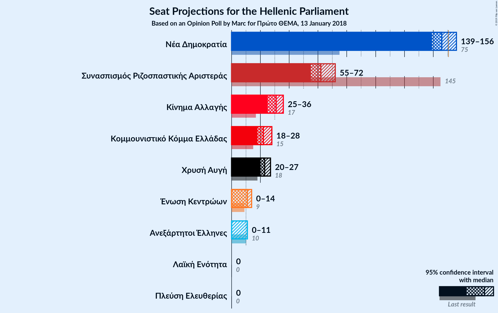

### Confidence Intervals

| Party | Last Result | Median | 80% Confidence Interval | 90% Confidence Interval | 95% Confidence Interval | 99% Confidence Interval |
|:-----:|:-----------:|:------:|:-----------------------:|:-----------------------:|:-----------------------:|:-----------------------:|
| <a href="#νέα-δημοκρατία">Νέα Δημοκρατία</a> | 75 | 146 | 141–155 |139–155 |139–156 |136–160 |
| <a href="#συνασπισμός-ριζοσπαστικής-αριστεράς">Συνασπισμός Ριζοσπαστικής Αριστεράς</a> | 145 | 62 | 59–69 |57–69 |55–72 |53–75 |
| <a href="#κίνημα-αλλαγής">Κίνημα Αλλαγής</a> | 17 | 31 | 28–35 |26–36 |25–36 |24–39 |
| <a href="#χρυσή-αυγή">Χρυσή Αυγή</a> | 18 | 23 | 21–25 |20–26 |20–27 |18–29 |
| <a href="#κομμουνιστικό-κόμμα-ελλάδας">Κομμουνιστικό Κόμμα Ελλάδας</a> | 15 | 22 | 19–25 |18–27 |18–28 |16–29 |
| <a href="#ένωση-κεντρώων">Ένωση Κεντρώων</a> | 9 | 11 | 0–13 |0–13 |0–14 |0–15 |
| <a href="#ανεξάρτητοι-έλληνες">Ανεξάρτητοι Έλληνες</a> | 10 | 0 | 0–10 |0–11 |0–11 |0–13 |
| <a href="#λαϊκή-ενότητα">Λαϊκή Ενότητα</a> | 0 | 0 | 0 |0 |0 |0–10 |
| <a href="#πλεύση-ελευθερίας">Πλεύση Ελευθερίας</a> | 0 | 0 | 0 |0 |0 |0 |

### Νέα Δημοκρατία

*For a full overview of the results for this party, see the [Νέα Δημοκρατία](party-νέαδημοκρατία.html) page.*

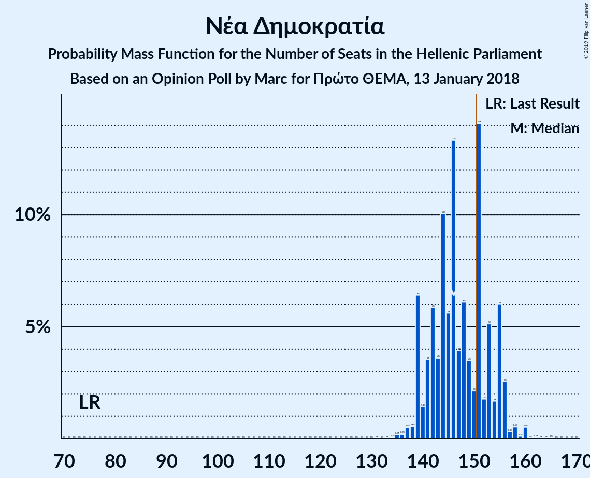

| Number of Seats | Probability | Accumulated | Special Marks |
|:---------------:|:-----------:|:-----------:|:-------------:|
| 75 | 0% | 100% | Last Result |
| 76 | 0% | 100% |  |
| 77 | 0% | 100% |  |
| 78 | 0% | 100% |  |
| 79 | 0% | 100% |  |
| 80 | 0% | 100% |  |
| 81 | 0% | 100% |  |
| 82 | 0% | 100% |  |
| 83 | 0% | 100% |  |
| 84 | 0% | 100% |  |
| 85 | 0% | 100% |  |
| 86 | 0% | 100% |  |
| 87 | 0% | 100% |  |
| 88 | 0% | 100% |  |
| 89 | 0% | 100% |  |
| 90 | 0% | 100% |  |
| 91 | 0% | 100% |  |
| 92 | 0% | 100% |  |
| 93 | 0% | 100% |  |
| 94 | 0% | 100% |  |
| 95 | 0% | 100% |  |
| 96 | 0% | 100% |  |
| 97 | 0% | 100% |  |
| 98 | 0% | 100% |  |
| 99 | 0% | 100% |  |
| 100 | 0% | 100% |  |
| 101 | 0% | 100% |  |
| 102 | 0% | 100% |  |
| 103 | 0% | 100% |  |
| 104 | 0% | 100% |  |
| 105 | 0% | 100% |  |
| 106 | 0% | 100% |  |
| 107 | 0% | 100% |  |
| 108 | 0% | 100% |  |
| 109 | 0% | 100% |  |
| 110 | 0% | 100% |  |
| 111 | 0% | 100% |  |
| 112 | 0% | 100% |  |
| 113 | 0% | 100% |  |
| 114 | 0% | 100% |  |
| 115 | 0% | 100% |  |
| 116 | 0% | 100% |  |
| 117 | 0% | 100% |  |
| 118 | 0% | 100% |  |
| 119 | 0% | 100% |  |
| 120 | 0% | 100% |  |
| 121 | 0% | 100% |  |
| 122 | 0% | 100% |  |
| 123 | 0% | 100% |  |
| 124 | 0% | 100% |  |
| 125 | 0% | 100% |  |
| 126 | 0% | 100% |  |
| 127 | 0% | 100% |  |
| 128 | 0% | 100% |  |
| 129 | 0% | 100% |  |
| 130 | 0% | 100% |  |
| 131 | 0% | 100% |  |
| 132 | 0% | 100% |  |
| 133 | 0% | 100% |  |
| 134 | 0.1% | 99.9% |  |
| 135 | 0.2% | 99.9% |  |
| 136 | 0.2% | 99.7% |  |
| 137 | 0.5% | 99.5% |  |
| 138 | 0.6% | 99.0% |  |
| 139 | 6% | 98% |  |
| 140 | 1.4% | 92% |  |
| 141 | 4% | 91% |  |
| 142 | 6% | 87% |  |
| 143 | 4% | 81% |  |
| 144 | 10% | 78% |  |
| 145 | 6% | 68% |  |
| 146 | 13% | 62% | Median |
| 147 | 4% | 49% |  |
| 148 | 6% | 45% |  |
| 149 | 4% | 39% |  |
| 150 | 2% | 35% |  |
| 151 | 14% | 33% | Majority |
| 152 | 2% | 19% |  |
| 153 | 5% | 17% |  |
| 154 | 2% | 12% |  |
| 155 | 6% | 10% |  |
| 156 | 3% | 4% |  |
| 157 | 0.3% | 2% |  |
| 158 | 0.5% | 1.3% |  |
| 159 | 0.1% | 0.8% |  |
| 160 | 0.5% | 0.7% |  |
| 161 | 0% | 0.2% |  |
| 162 | 0.1% | 0.2% |  |
| 163 | 0% | 0.1% |  |
| 164 | 0% | 0.1% |  |
| 165 | 0% | 0% |  |

### Συνασπισμός Ριζοσπαστικής Αριστεράς

*For a full overview of the results for this party, see the [Συνασπισμός Ριζοσπαστικής Αριστεράς](party-συνασπισμόςριζοσπαστικήςαριστεράς.html) page.*

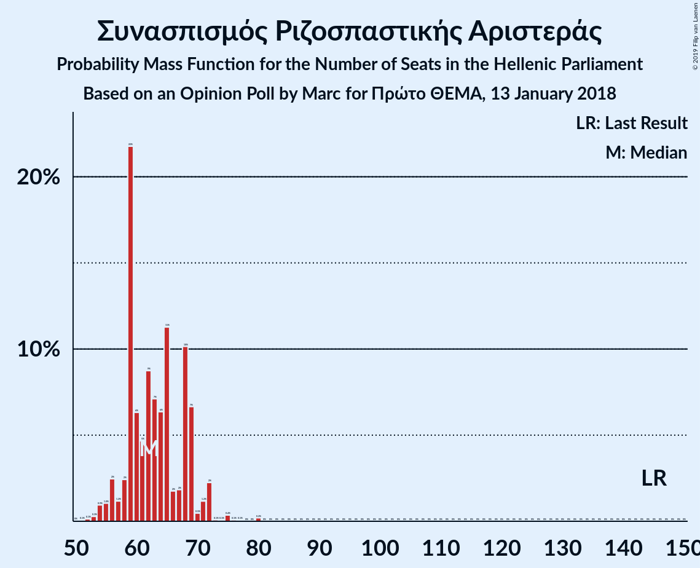

| Number of Seats | Probability | Accumulated | Special Marks |
|:---------------:|:-----------:|:-----------:|:-------------:|
| 50 | 0% | 100% |  |
| 51 | 0.1% | 99.9% |  |
| 52 | 0.1% | 99.9% |  |
| 53 | 0.3% | 99.7% |  |
| 54 | 0.9% | 99.5% |  |
| 55 | 1.0% | 98.5% |  |
| 56 | 2% | 97% |  |
| 57 | 1.2% | 95% |  |
| 58 | 2% | 94% |  |
| 59 | 22% | 91% |  |
| 60 | 6% | 70% |  |
| 61 | 5% | 63% |  |
| 62 | 9% | 59% | Median |
| 63 | 7% | 50% |  |
| 64 | 6% | 43% |  |
| 65 | 11% | 36% |  |
| 66 | 2% | 25% |  |
| 67 | 2% | 23% |  |
| 68 | 10% | 22% |  |
| 69 | 7% | 11% |  |
| 70 | 0.5% | 5% |  |
| 71 | 1.2% | 4% |  |
| 72 | 2% | 3% |  |
| 73 | 0.1% | 0.9% |  |
| 74 | 0.1% | 0.8% |  |
| 75 | 0.4% | 0.7% |  |
| 76 | 0.1% | 0.4% |  |
| 77 | 0.1% | 0.3% |  |
| 78 | 0% | 0.2% |  |
| 79 | 0% | 0.2% |  |
| 80 | 0.2% | 0.2% |  |
| 81 | 0% | 0% |  |
| 82 | 0% | 0% |  |
| 83 | 0% | 0% |  |
| 84 | 0% | 0% |  |
| 85 | 0% | 0% |  |
| 86 | 0% | 0% |  |
| 87 | 0% | 0% |  |
| 88 | 0% | 0% |  |
| 89 | 0% | 0% |  |
| 90 | 0% | 0% |  |
| 91 | 0% | 0% |  |
| 92 | 0% | 0% |  |
| 93 | 0% | 0% |  |
| 94 | 0% | 0% |  |
| 95 | 0% | 0% |  |
| 96 | 0% | 0% |  |
| 97 | 0% | 0% |  |
| 98 | 0% | 0% |  |
| 99 | 0% | 0% |  |
| 100 | 0% | 0% |  |
| 101 | 0% | 0% |  |
| 102 | 0% | 0% |  |
| 103 | 0% | 0% |  |
| 104 | 0% | 0% |  |
| 105 | 0% | 0% |  |
| 106 | 0% | 0% |  |
| 107 | 0% | 0% |  |
| 108 | 0% | 0% |  |
| 109 | 0% | 0% |  |
| 110 | 0% | 0% |  |
| 111 | 0% | 0% |  |
| 112 | 0% | 0% |  |
| 113 | 0% | 0% |  |
| 114 | 0% | 0% |  |
| 115 | 0% | 0% |  |
| 116 | 0% | 0% |  |
| 117 | 0% | 0% |  |
| 118 | 0% | 0% |  |
| 119 | 0% | 0% |  |
| 120 | 0% | 0% |  |
| 121 | 0% | 0% |  |
| 122 | 0% | 0% |  |
| 123 | 0% | 0% |  |
| 124 | 0% | 0% |  |
| 125 | 0% | 0% |  |
| 126 | 0% | 0% |  |
| 127 | 0% | 0% |  |
| 128 | 0% | 0% |  |
| 129 | 0% | 0% |  |
| 130 | 0% | 0% |  |
| 131 | 0% | 0% |  |
| 132 | 0% | 0% |  |
| 133 | 0% | 0% |  |
| 134 | 0% | 0% |  |
| 135 | 0% | 0% |  |
| 136 | 0% | 0% |  |
| 137 | 0% | 0% |  |
| 138 | 0% | 0% |  |
| 139 | 0% | 0% |  |
| 140 | 0% | 0% |  |
| 141 | 0% | 0% |  |
| 142 | 0% | 0% |  |
| 143 | 0% | 0% |  |
| 144 | 0% | 0% |  |
| 145 | 0% | 0% | Last Result |

### Κίνημα Αλλαγής

*For a full overview of the results for this party, see the [Κίνημα Αλλαγής](party-κίνημααλλαγής.html) page.*

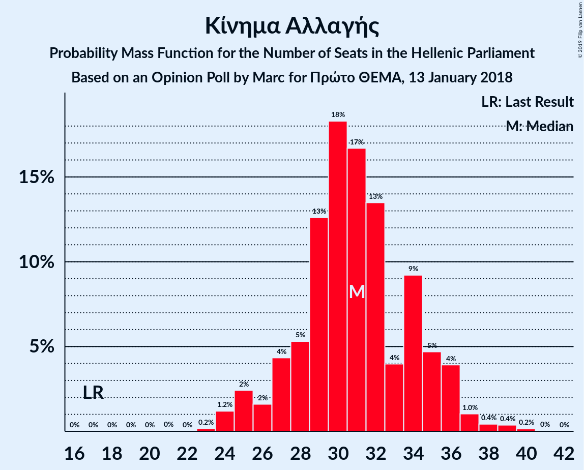

| Number of Seats | Probability | Accumulated | Special Marks |
|:---------------:|:-----------:|:-----------:|:-------------:|
| 17 | 0% | 100% | Last Result |
| 18 | 0% | 100% |  |
| 19 | 0% | 100% |  |
| 20 | 0% | 100% |  |
| 21 | 0% | 100% |  |
| 22 | 0% | 100% |  |
| 23 | 0.2% | 100% |  |
| 24 | 1.2% | 99.8% |  |
| 25 | 2% | 98.6% |  |
| 26 | 2% | 96% |  |
| 27 | 4% | 95% |  |
| 28 | 5% | 90% |  |
| 29 | 13% | 85% |  |
| 30 | 18% | 72% |  |
| 31 | 17% | 54% | Median |
| 32 | 13% | 37% |  |
| 33 | 4% | 24% |  |
| 34 | 9% | 20% |  |
| 35 | 5% | 11% |  |
| 36 | 4% | 6% |  |
| 37 | 1.0% | 2% |  |
| 38 | 0.4% | 1.0% |  |
| 39 | 0.4% | 0.6% |  |
| 40 | 0.2% | 0.2% |  |
| 41 | 0% | 0.1% |  |
| 42 | 0% | 0% |  |

### Χρυσή Αυγή

*For a full overview of the results for this party, see the [Χρυσή Αυγή](party-χρυσήαυγή.html) page.*

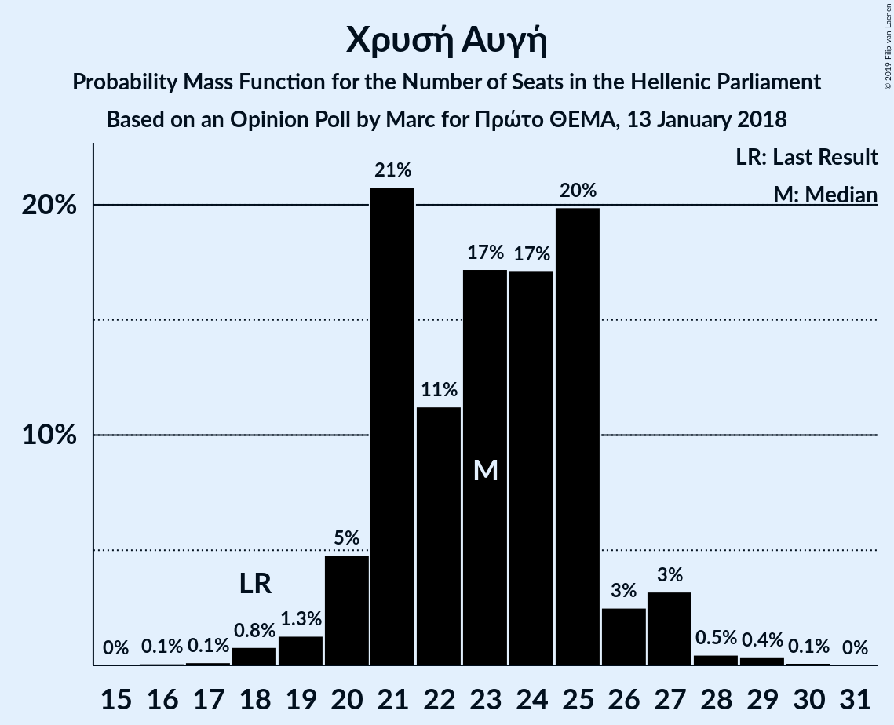

| Number of Seats | Probability | Accumulated | Special Marks |
|:---------------:|:-----------:|:-----------:|:-------------:|
| 16 | 0.1% | 100% |  |
| 17 | 0.1% | 99.9% |  |
| 18 | 0.8% | 99.8% | Last Result |
| 19 | 1.3% | 99.0% |  |
| 20 | 5% | 98% |  |
| 21 | 21% | 93% |  |
| 22 | 11% | 72% |  |
| 23 | 17% | 61% | Median |
| 24 | 17% | 44% |  |
| 25 | 20% | 27% |  |
| 26 | 3% | 7% |  |
| 27 | 3% | 4% |  |
| 28 | 0.5% | 1.0% |  |
| 29 | 0.4% | 0.5% |  |
| 30 | 0.1% | 0.1% |  |
| 31 | 0% | 0% |  |

### Κομμουνιστικό Κόμμα Ελλάδας

*For a full overview of the results for this party, see the [Κομμουνιστικό Κόμμα Ελλάδας](party-κομμουνιστικόκόμμαελλάδας.html) page.*

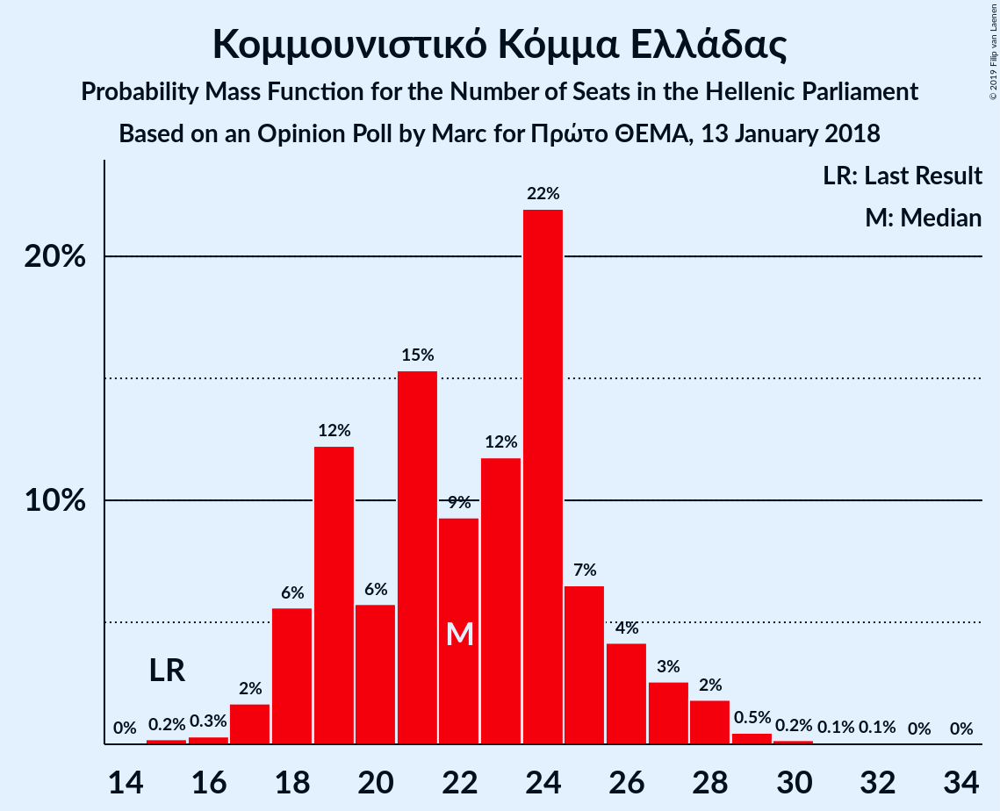

| Number of Seats | Probability | Accumulated | Special Marks |
|:---------------:|:-----------:|:-----------:|:-------------:|
| 14 | 0% | 100% |  |
| 15 | 0.2% | 99.9% | Last Result |
| 16 | 0.3% | 99.7% |  |
| 17 | 2% | 99.4% |  |
| 18 | 6% | 98% |  |
| 19 | 12% | 92% |  |
| 20 | 6% | 80% |  |
| 21 | 15% | 74% |  |
| 22 | 9% | 59% | Median |
| 23 | 12% | 50% |  |
| 24 | 22% | 38% |  |
| 25 | 7% | 16% |  |
| 26 | 4% | 9% |  |
| 27 | 3% | 5% |  |
| 28 | 2% | 3% |  |
| 29 | 0.5% | 0.8% |  |
| 30 | 0.2% | 0.3% |  |
| 31 | 0.1% | 0.2% |  |
| 32 | 0.1% | 0.1% |  |
| 33 | 0% | 0% |  |

### Ένωση Κεντρώων

*For a full overview of the results for this party, see the [Ένωση Κεντρώων](party-ένωσηκεντρώων.html) page.*

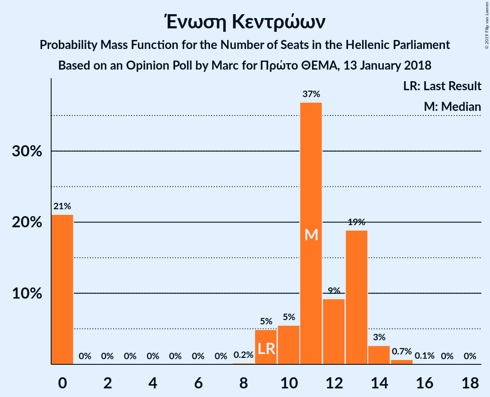

| Number of Seats | Probability | Accumulated | Special Marks |
|:---------------:|:-----------:|:-----------:|:-------------:|
| 0 | 21% | 100% |  |
| 1 | 0% | 79% |  |
| 2 | 0% | 79% |  |
| 3 | 0% | 79% |  |
| 4 | 0% | 79% |  |
| 5 | 0% | 79% |  |
| 6 | 0% | 79% |  |
| 7 | 0% | 79% |  |
| 8 | 0.2% | 79% |  |
| 9 | 5% | 79% | Last Result |
| 10 | 5% | 74% |  |
| 11 | 37% | 68% | Median |
| 12 | 9% | 31% |  |
| 13 | 19% | 22% |  |
| 14 | 3% | 3% |  |
| 15 | 0.7% | 0.7% |  |
| 16 | 0.1% | 0.1% |  |
| 17 | 0% | 0% |  |

### Ανεξάρτητοι Έλληνες

*For a full overview of the results for this party, see the [Ανεξάρτητοι Έλληνες](party-ανεξάρτητοιέλληνες.html) page.*

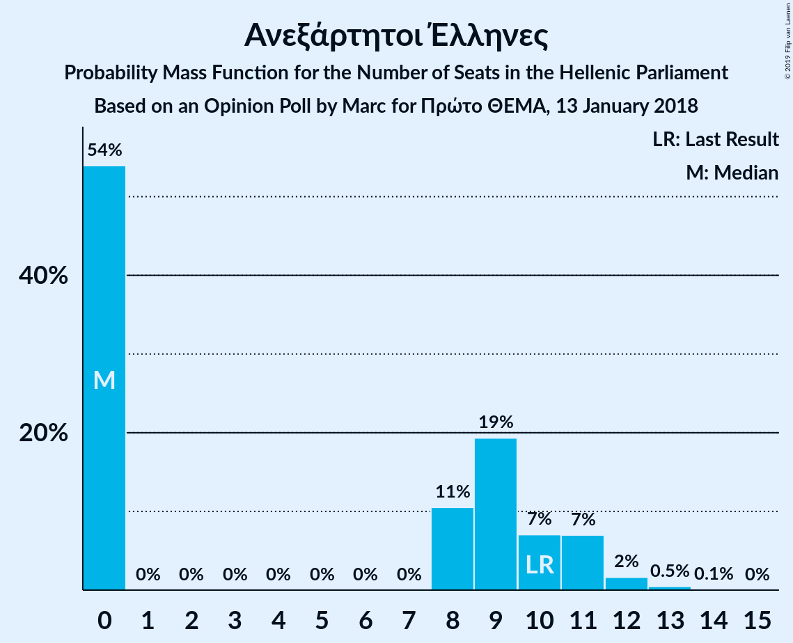

| Number of Seats | Probability | Accumulated | Special Marks |
|:---------------:|:-----------:|:-----------:|:-------------:|
| 0 | 54% | 100% | Median |
| 1 | 0% | 46% |  |
| 2 | 0% | 46% |  |
| 3 | 0% | 46% |  |
| 4 | 0% | 46% |  |
| 5 | 0% | 46% |  |
| 6 | 0% | 46% |  |
| 7 | 0% | 46% |  |
| 8 | 11% | 46% |  |
| 9 | 19% | 36% |  |
| 10 | 7% | 16% | Last Result |
| 11 | 7% | 9% |  |
| 12 | 2% | 2% |  |
| 13 | 0.5% | 0.5% |  |
| 14 | 0.1% | 0.1% |  |
| 15 | 0% | 0% |  |

### Λαϊκή Ενότητα

*For a full overview of the results for this party, see the [Λαϊκή Ενότητα](party-λαϊκήενότητα.html) page.*

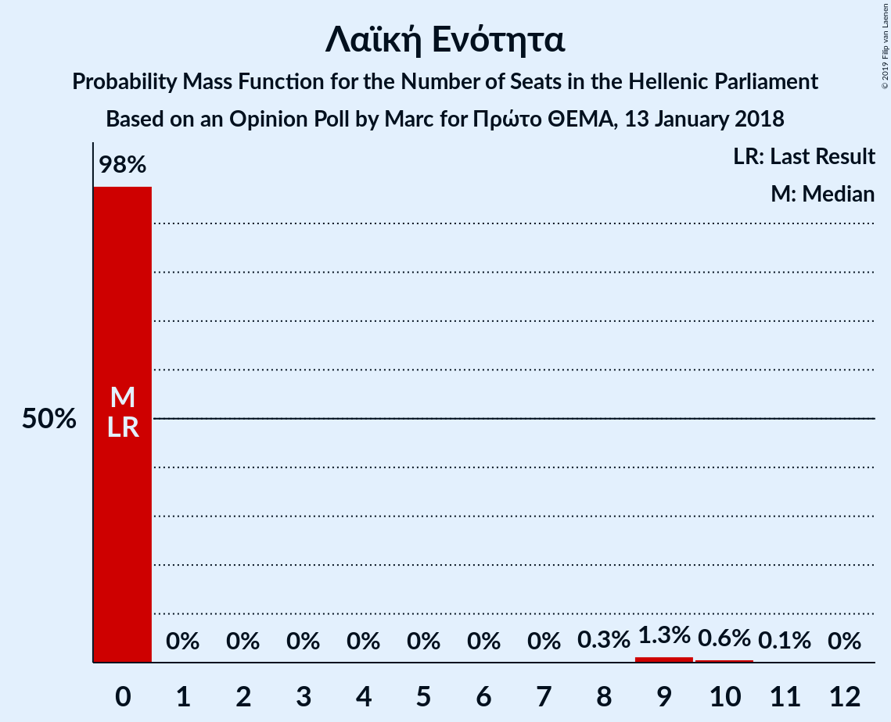

| Number of Seats | Probability | Accumulated | Special Marks |
|:---------------:|:-----------:|:-----------:|:-------------:|
| 0 | 98% | 100% | Last Result, Median |
| 1 | 0% | 2% |  |
| 2 | 0% | 2% |  |
| 3 | 0% | 2% |  |
| 4 | 0% | 2% |  |
| 5 | 0% | 2% |  |
| 6 | 0% | 2% |  |
| 7 | 0% | 2% |  |
| 8 | 0.3% | 2% |  |
| 9 | 1.3% | 2% |  |
| 10 | 0.6% | 0.8% |  |
| 11 | 0.1% | 0.2% |  |
| 12 | 0% | 0% |  |

### Πλεύση Ελευθερίας

*For a full overview of the results for this party, see the [Πλεύση Ελευθερίας](party-πλεύσηελευθερίας.html) page.*

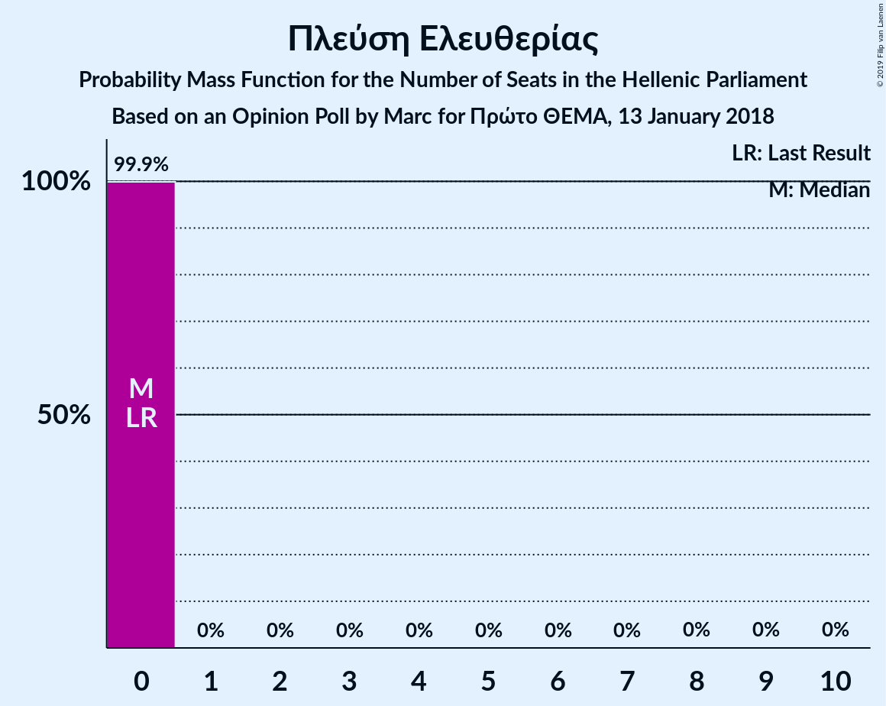

| Number of Seats | Probability | Accumulated | Special Marks |
|:---------------:|:-----------:|:-----------:|:-------------:|
| 0 | 99.9% | 100% | Last Result, Median |
| 1 | 0% | 0.1% |  |
| 2 | 0% | 0.1% |  |
| 3 | 0% | 0.1% |  |
| 4 | 0% | 0.1% |  |
| 5 | 0% | 0.1% |  |
| 6 | 0% | 0.1% |  |
| 7 | 0% | 0.1% |  |
| 8 | 0% | 0.1% |  |
| 9 | 0% | 0.1% |  |
| 10 | 0% | 0% |  |

## Coalitions

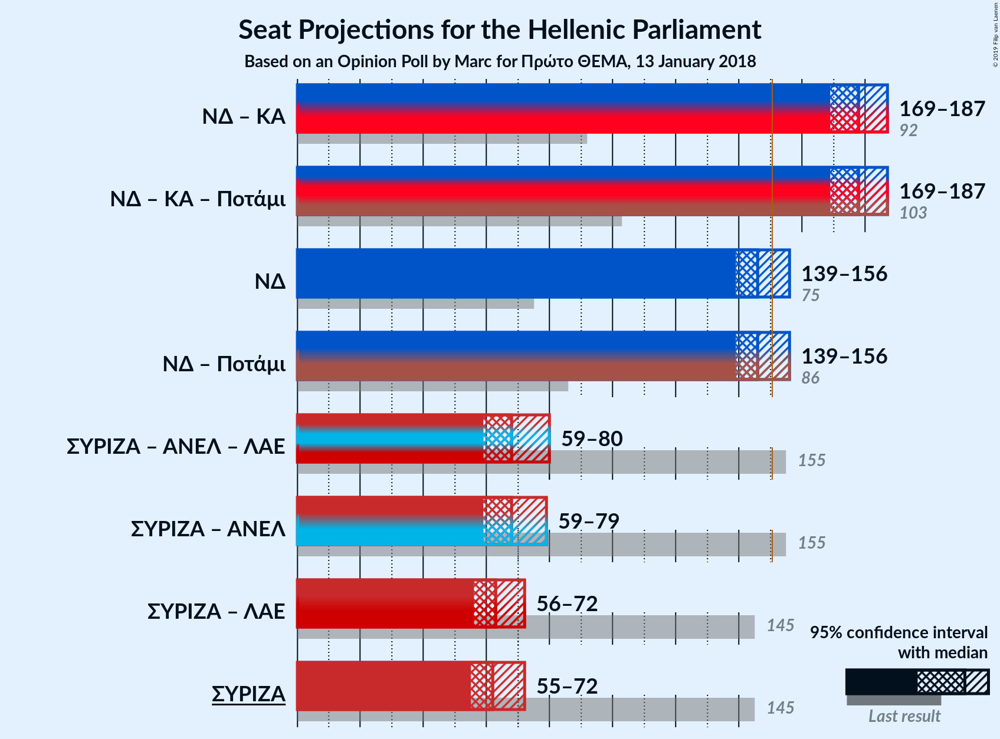

### Confidence Intervals

| Coalition | Last Result | Median | Majority? | 80% Confidence Interval | 90% Confidence Interval | 95% Confidence Interval | 99% Confidence Interval |
|:---------:|:-----------:|:------:|:---------:|:-----------------------:|:-----------------------:|:-----------------------:|:-----------------------:|
| Νέα Δημοκρατία – Κίνημα Αλλαγής | 92 | 178 | 100% | 171–185 | 170–186 | 169–187 | 165–194 |
| Νέα Δημοκρατία | 75 | 146 | 33% | 141–155 | 139–155 | 139–156 | 136–160 |
| Συνασπισμός Ριζοσπαστικής Αριστεράς – Ανεξάρτητοι Έλληνες – Λαϊκή Ενότητα | 155 | 68 | 0% | 59–74 | 59–75 | 59–80 | 56–84 |
| Συνασπισμός Ριζοσπαστικής Αριστεράς – Ανεξάρτητοι Έλληνες | 155 | 68 | 0% | 59–74 | 59–74 | 59–79 | 56–84 |
| Συνασπισμός Ριζοσπαστικής Αριστεράς – Λαϊκή Ενότητα | 145 | 63 | 0% | 59–69 | 57–71 | 56–72 | 54–77 |
| Συνασπισμός Ριζοσπαστικής Αριστεράς | 145 | 62 | 0% | 59–69 | 57–69 | 55–72 | 53–75 |

### Νέα Δημοκρατία – Κίνημα Αλλαγής

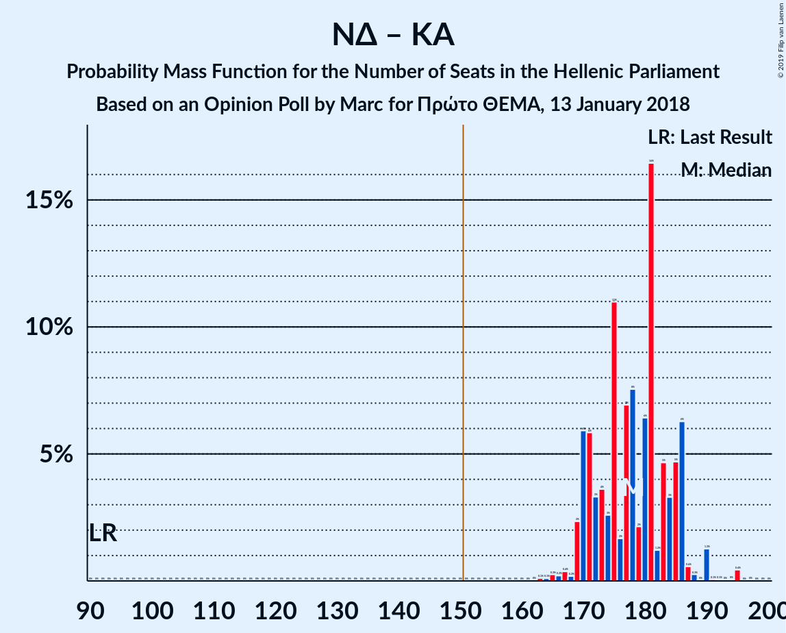

| Number of Seats | Probability | Accumulated | Special Marks |
|:---------------:|:-----------:|:-----------:|:-------------:|
| 92 | 0% | 100% | Last Result |
| 93 | 0% | 100% |  |
| 94 | 0% | 100% |  |
| 95 | 0% | 100% |  |
| 96 | 0% | 100% |  |
| 97 | 0% | 100% |  |
| 98 | 0% | 100% |  |
| 99 | 0% | 100% |  |
| 100 | 0% | 100% |  |
| 101 | 0% | 100% |  |
| 102 | 0% | 100% |  |
| 103 | 0% | 100% |  |
| 104 | 0% | 100% |  |
| 105 | 0% | 100% |  |
| 106 | 0% | 100% |  |
| 107 | 0% | 100% |  |
| 108 | 0% | 100% |  |
| 109 | 0% | 100% |  |
| 110 | 0% | 100% |  |
| 111 | 0% | 100% |  |
| 112 | 0% | 100% |  |
| 113 | 0% | 100% |  |
| 114 | 0% | 100% |  |
| 115 | 0% | 100% |  |
| 116 | 0% | 100% |  |
| 117 | 0% | 100% |  |
| 118 | 0% | 100% |  |
| 119 | 0% | 100% |  |
| 120 | 0% | 100% |  |
| 121 | 0% | 100% |  |
| 122 | 0% | 100% |  |
| 123 | 0% | 100% |  |
| 124 | 0% | 100% |  |
| 125 | 0% | 100% |  |
| 126 | 0% | 100% |  |
| 127 | 0% | 100% |  |
| 128 | 0% | 100% |  |
| 129 | 0% | 100% |  |
| 130 | 0% | 100% |  |
| 131 | 0% | 100% |  |
| 132 | 0% | 100% |  |
| 133 | 0% | 100% |  |
| 134 | 0% | 100% |  |
| 135 | 0% | 100% |  |
| 136 | 0% | 100% |  |
| 137 | 0% | 100% |  |
| 138 | 0% | 100% |  |
| 139 | 0% | 100% |  |
| 140 | 0% | 100% |  |
| 141 | 0% | 100% |  |
| 142 | 0% | 100% |  |
| 143 | 0% | 100% |  |
| 144 | 0% | 100% |  |
| 145 | 0% | 100% |  |
| 146 | 0% | 100% |  |
| 147 | 0% | 100% |  |
| 148 | 0% | 100% |  |
| 149 | 0% | 100% |  |
| 150 | 0% | 100% |  |
| 151 | 0% | 100% | Majority |
| 152 | 0% | 100% |  |
| 153 | 0% | 100% |  |
| 154 | 0% | 100% |  |
| 155 | 0% | 100% |  |
| 156 | 0% | 100% |  |
| 157 | 0% | 100% |  |
| 158 | 0% | 100% |  |
| 159 | 0% | 100% |  |
| 160 | 0% | 100% |  |
| 161 | 0% | 100% |  |
| 162 | 0% | 100% |  |
| 163 | 0.1% | 99.9% |  |
| 164 | 0.1% | 99.8% |  |
| 165 | 0.3% | 99.7% |  |
| 166 | 0.2% | 99.5% |  |
| 167 | 0.4% | 99.3% |  |
| 168 | 0.2% | 98.9% |  |
| 169 | 2% | 98.7% |  |
| 170 | 6% | 96% |  |
| 171 | 6% | 90% |  |
| 172 | 3% | 85% |  |
| 173 | 4% | 81% |  |
| 174 | 3% | 78% |  |
| 175 | 11% | 75% |  |
| 176 | 2% | 64% |  |
| 177 | 7% | 62% | Median |
| 178 | 8% | 55% |  |
| 179 | 2% | 48% |  |
| 180 | 6% | 46% |  |
| 181 | 16% | 39% |  |
| 182 | 1.2% | 23% |  |
| 183 | 5% | 22% |  |
| 184 | 3% | 17% |  |
| 185 | 5% | 14% |  |
| 186 | 6% | 9% |  |
| 187 | 0.6% | 3% |  |
| 188 | 0.3% | 2% |  |
| 189 | 0% | 2% |  |
| 190 | 1.3% | 2% |  |
| 191 | 0.1% | 0.7% |  |
| 192 | 0.1% | 0.6% |  |
| 193 | 0% | 0.6% |  |
| 194 | 0% | 0.5% |  |
| 195 | 0.4% | 0.5% |  |
| 196 | 0% | 0.1% |  |
| 197 | 0% | 0% |  |

### Νέα Δημοκρατία

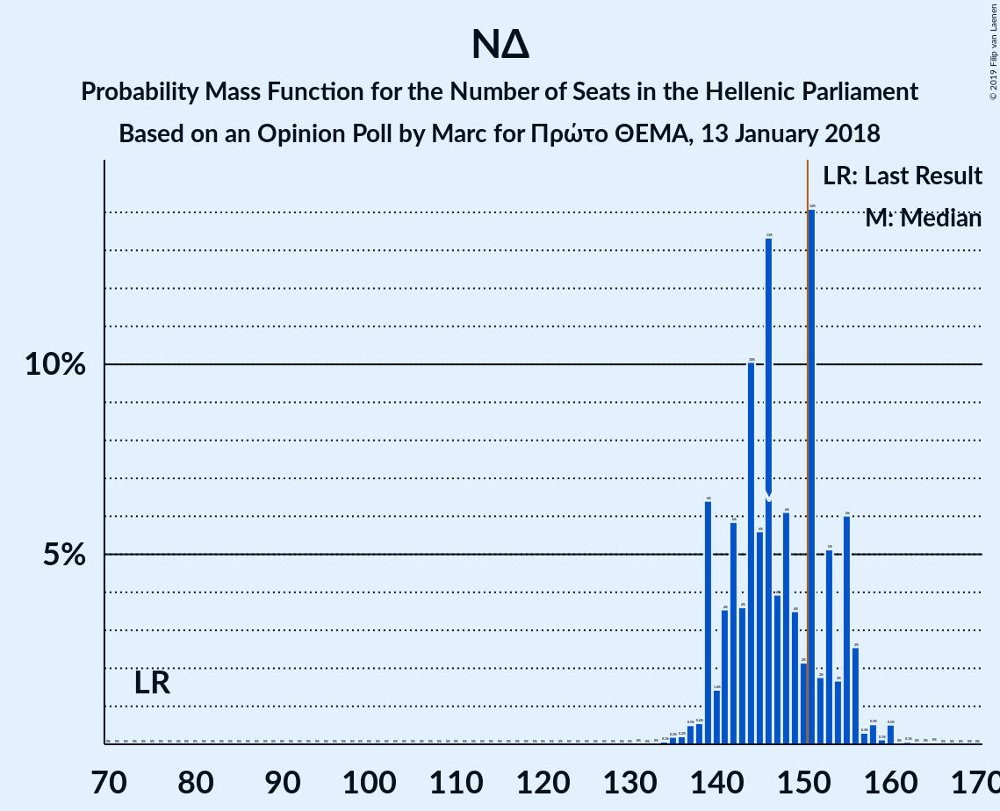

| Number of Seats | Probability | Accumulated | Special Marks |
|:---------------:|:-----------:|:-----------:|:-------------:|
| 75 | 0% | 100% | Last Result |
| 76 | 0% | 100% |  |
| 77 | 0% | 100% |  |
| 78 | 0% | 100% |  |
| 79 | 0% | 100% |  |
| 80 | 0% | 100% |  |
| 81 | 0% | 100% |  |
| 82 | 0% | 100% |  |
| 83 | 0% | 100% |  |
| 84 | 0% | 100% |  |
| 85 | 0% | 100% |  |
| 86 | 0% | 100% |  |
| 87 | 0% | 100% |  |
| 88 | 0% | 100% |  |
| 89 | 0% | 100% |  |
| 90 | 0% | 100% |  |
| 91 | 0% | 100% |  |
| 92 | 0% | 100% |  |
| 93 | 0% | 100% |  |
| 94 | 0% | 100% |  |
| 95 | 0% | 100% |  |
| 96 | 0% | 100% |  |
| 97 | 0% | 100% |  |
| 98 | 0% | 100% |  |
| 99 | 0% | 100% |  |
| 100 | 0% | 100% |  |
| 101 | 0% | 100% |  |
| 102 | 0% | 100% |  |
| 103 | 0% | 100% |  |
| 104 | 0% | 100% |  |
| 105 | 0% | 100% |  |
| 106 | 0% | 100% |  |
| 107 | 0% | 100% |  |
| 108 | 0% | 100% |  |
| 109 | 0% | 100% |  |
| 110 | 0% | 100% |  |
| 111 | 0% | 100% |  |
| 112 | 0% | 100% |  |
| 113 | 0% | 100% |  |
| 114 | 0% | 100% |  |
| 115 | 0% | 100% |  |
| 116 | 0% | 100% |  |
| 117 | 0% | 100% |  |
| 118 | 0% | 100% |  |
| 119 | 0% | 100% |  |
| 120 | 0% | 100% |  |
| 121 | 0% | 100% |  |
| 122 | 0% | 100% |  |
| 123 | 0% | 100% |  |
| 124 | 0% | 100% |  |
| 125 | 0% | 100% |  |
| 126 | 0% | 100% |  |
| 127 | 0% | 100% |  |
| 128 | 0% | 100% |  |
| 129 | 0% | 100% |  |
| 130 | 0% | 100% |  |
| 131 | 0% | 100% |  |
| 132 | 0% | 100% |  |
| 133 | 0% | 100% |  |
| 134 | 0.1% | 99.9% |  |
| 135 | 0.2% | 99.9% |  |
| 136 | 0.2% | 99.7% |  |
| 137 | 0.5% | 99.5% |  |
| 138 | 0.6% | 99.0% |  |
| 139 | 6% | 98% |  |
| 140 | 1.4% | 92% |  |
| 141 | 4% | 91% |  |
| 142 | 6% | 87% |  |
| 143 | 4% | 81% |  |
| 144 | 10% | 78% |  |
| 145 | 6% | 68% |  |
| 146 | 13% | 62% | Median |
| 147 | 4% | 49% |  |
| 148 | 6% | 45% |  |
| 149 | 4% | 39% |  |
| 150 | 2% | 35% |  |
| 151 | 14% | 33% | Majority |
| 152 | 2% | 19% |  |
| 153 | 5% | 17% |  |
| 154 | 2% | 12% |  |
| 155 | 6% | 10% |  |
| 156 | 3% | 4% |  |
| 157 | 0.3% | 2% |  |
| 158 | 0.5% | 1.3% |  |
| 159 | 0.1% | 0.8% |  |
| 160 | 0.5% | 0.7% |  |
| 161 | 0% | 0.2% |  |
| 162 | 0.1% | 0.2% |  |
| 163 | 0% | 0.1% |  |
| 164 | 0% | 0.1% |  |
| 165 | 0% | 0% |  |

### Συνασπισμός Ριζοσπαστικής Αριστεράς – Ανεξάρτητοι Έλληνες – Λαϊκή Ενότητα

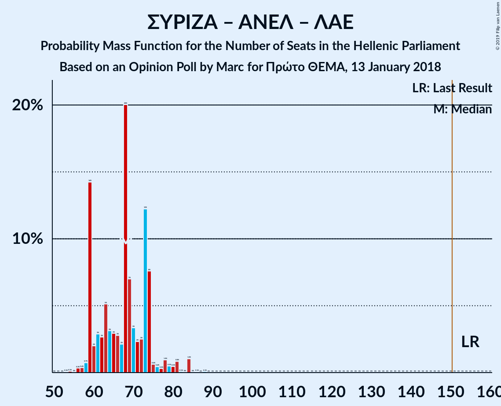

| Number of Seats | Probability | Accumulated | Special Marks |
|:---------------:|:-----------:|:-----------:|:-------------:|
| 53 | 0.1% | 100% |  |
| 54 | 0.1% | 99.9% |  |
| 55 | 0% | 99.8% |  |
| 56 | 0.3% | 99.8% |  |
| 57 | 0.4% | 99.5% |  |
| 58 | 0.7% | 99.1% |  |
| 59 | 14% | 98% |  |
| 60 | 2% | 84% |  |
| 61 | 3% | 82% |  |
| 62 | 3% | 79% | Median |
| 63 | 5% | 77% |  |
| 64 | 3% | 71% |  |
| 65 | 3% | 68% |  |
| 66 | 3% | 65% |  |
| 67 | 2% | 63% |  |
| 68 | 20% | 60% |  |
| 69 | 7% | 40% |  |
| 70 | 3% | 33% |  |
| 71 | 2% | 30% |  |
| 72 | 3% | 28% |  |
| 73 | 12% | 25% |  |
| 74 | 8% | 13% |  |
| 75 | 0.6% | 5% |  |
| 76 | 0.4% | 5% |  |
| 77 | 0.3% | 4% |  |
| 78 | 1.0% | 4% |  |
| 79 | 0.5% | 3% |  |
| 80 | 0.5% | 3% |  |
| 81 | 0.8% | 2% |  |
| 82 | 0.1% | 1.3% |  |
| 83 | 0% | 1.2% |  |
| 84 | 1.0% | 1.2% |  |
| 85 | 0% | 0.2% |  |
| 86 | 0.1% | 0.2% |  |
| 87 | 0% | 0.1% |  |
| 88 | 0.1% | 0.1% |  |
| 89 | 0% | 0% |  |
| 90 | 0% | 0% |  |
| 91 | 0% | 0% |  |
| 92 | 0% | 0% |  |
| 93 | 0% | 0% |  |
| 94 | 0% | 0% |  |
| 95 | 0% | 0% |  |
| 96 | 0% | 0% |  |
| 97 | 0% | 0% |  |
| 98 | 0% | 0% |  |
| 99 | 0% | 0% |  |
| 100 | 0% | 0% |  |
| 101 | 0% | 0% |  |
| 102 | 0% | 0% |  |
| 103 | 0% | 0% |  |
| 104 | 0% | 0% |  |
| 105 | 0% | 0% |  |
| 106 | 0% | 0% |  |
| 107 | 0% | 0% |  |
| 108 | 0% | 0% |  |
| 109 | 0% | 0% |  |
| 110 | 0% | 0% |  |
| 111 | 0% | 0% |  |
| 112 | 0% | 0% |  |
| 113 | 0% | 0% |  |
| 114 | 0% | 0% |  |
| 115 | 0% | 0% |  |
| 116 | 0% | 0% |  |
| 117 | 0% | 0% |  |
| 118 | 0% | 0% |  |
| 119 | 0% | 0% |  |
| 120 | 0% | 0% |  |
| 121 | 0% | 0% |  |
| 122 | 0% | 0% |  |
| 123 | 0% | 0% |  |
| 124 | 0% | 0% |  |
| 125 | 0% | 0% |  |
| 126 | 0% | 0% |  |
| 127 | 0% | 0% |  |
| 128 | 0% | 0% |  |
| 129 | 0% | 0% |  |
| 130 | 0% | 0% |  |
| 131 | 0% | 0% |  |
| 132 | 0% | 0% |  |
| 133 | 0% | 0% |  |
| 134 | 0% | 0% |  |
| 135 | 0% | 0% |  |
| 136 | 0% | 0% |  |
| 137 | 0% | 0% |  |
| 138 | 0% | 0% |  |
| 139 | 0% | 0% |  |
| 140 | 0% | 0% |  |
| 141 | 0% | 0% |  |
| 142 | 0% | 0% |  |
| 143 | 0% | 0% |  |
| 144 | 0% | 0% |  |
| 145 | 0% | 0% |  |
| 146 | 0% | 0% |  |
| 147 | 0% | 0% |  |
| 148 | 0% | 0% |  |
| 149 | 0% | 0% |  |
| 150 | 0% | 0% |  |
| 151 | 0% | 0% | Majority |
| 152 | 0% | 0% |  |
| 153 | 0% | 0% |  |
| 154 | 0% | 0% |  |
| 155 | 0% | 0% | Last Result |

### Συνασπισμός Ριζοσπαστικής Αριστεράς – Ανεξάρτητοι Έλληνες

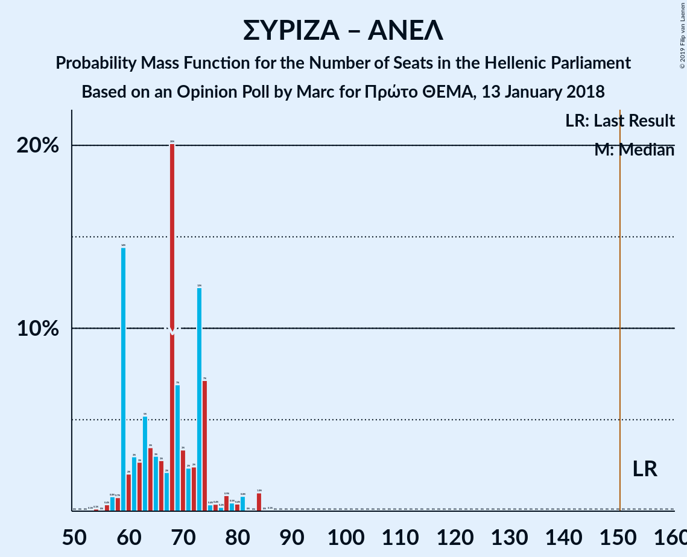

| Number of Seats | Probability | Accumulated | Special Marks |
|:---------------:|:-----------:|:-----------:|:-------------:|
| 53 | 0.1% | 100% |  |
| 54 | 0.1% | 99.9% |  |
| 55 | 0% | 99.8% |  |
| 56 | 0.4% | 99.8% |  |
| 57 | 0.8% | 99.4% |  |
| 58 | 0.7% | 98.6% |  |
| 59 | 14% | 98% |  |
| 60 | 2% | 83% |  |
| 61 | 3% | 81% |  |
| 62 | 3% | 78% | Median |
| 63 | 5% | 76% |  |
| 64 | 3% | 71% |  |
| 65 | 3% | 67% |  |
| 66 | 3% | 64% |  |
| 67 | 2% | 61% |  |
| 68 | 20% | 59% |  |
| 69 | 7% | 39% |  |
| 70 | 3% | 32% |  |
| 71 | 2% | 29% |  |
| 72 | 2% | 26% |  |
| 73 | 12% | 24% |  |
| 74 | 7% | 12% |  |
| 75 | 0.4% | 5% |  |
| 76 | 0.4% | 4% |  |
| 77 | 0.2% | 4% |  |
| 78 | 0.9% | 4% |  |
| 79 | 0.5% | 3% |  |
| 80 | 0.4% | 2% |  |
| 81 | 0.8% | 2% |  |
| 82 | 0% | 1.1% |  |
| 83 | 0% | 1.1% |  |
| 84 | 1.0% | 1.1% |  |
| 85 | 0% | 0.1% |  |
| 86 | 0.1% | 0.1% |  |
| 87 | 0% | 0% |  |
| 88 | 0% | 0% |  |
| 89 | 0% | 0% |  |
| 90 | 0% | 0% |  |
| 91 | 0% | 0% |  |
| 92 | 0% | 0% |  |
| 93 | 0% | 0% |  |
| 94 | 0% | 0% |  |
| 95 | 0% | 0% |  |
| 96 | 0% | 0% |  |
| 97 | 0% | 0% |  |
| 98 | 0% | 0% |  |
| 99 | 0% | 0% |  |
| 100 | 0% | 0% |  |
| 101 | 0% | 0% |  |
| 102 | 0% | 0% |  |
| 103 | 0% | 0% |  |
| 104 | 0% | 0% |  |
| 105 | 0% | 0% |  |
| 106 | 0% | 0% |  |
| 107 | 0% | 0% |  |
| 108 | 0% | 0% |  |
| 109 | 0% | 0% |  |
| 110 | 0% | 0% |  |
| 111 | 0% | 0% |  |
| 112 | 0% | 0% |  |
| 113 | 0% | 0% |  |
| 114 | 0% | 0% |  |
| 115 | 0% | 0% |  |
| 116 | 0% | 0% |  |
| 117 | 0% | 0% |  |
| 118 | 0% | 0% |  |
| 119 | 0% | 0% |  |
| 120 | 0% | 0% |  |
| 121 | 0% | 0% |  |
| 122 | 0% | 0% |  |
| 123 | 0% | 0% |  |
| 124 | 0% | 0% |  |
| 125 | 0% | 0% |  |
| 126 | 0% | 0% |  |
| 127 | 0% | 0% |  |
| 128 | 0% | 0% |  |
| 129 | 0% | 0% |  |
| 130 | 0% | 0% |  |
| 131 | 0% | 0% |  |
| 132 | 0% | 0% |  |
| 133 | 0% | 0% |  |
| 134 | 0% | 0% |  |
| 135 | 0% | 0% |  |
| 136 | 0% | 0% |  |
| 137 | 0% | 0% |  |
| 138 | 0% | 0% |  |
| 139 | 0% | 0% |  |
| 140 | 0% | 0% |  |
| 141 | 0% | 0% |  |
| 142 | 0% | 0% |  |
| 143 | 0% | 0% |  |
| 144 | 0% | 0% |  |
| 145 | 0% | 0% |  |
| 146 | 0% | 0% |  |
| 147 | 0% | 0% |  |
| 148 | 0% | 0% |  |
| 149 | 0% | 0% |  |
| 150 | 0% | 0% |  |
| 151 | 0% | 0% | Majority |
| 152 | 0% | 0% |  |
| 153 | 0% | 0% |  |
| 154 | 0% | 0% |  |
| 155 | 0% | 0% | Last Result |

### Συνασπισμός Ριζοσπαστικής Αριστεράς – Λαϊκή Ενότητα

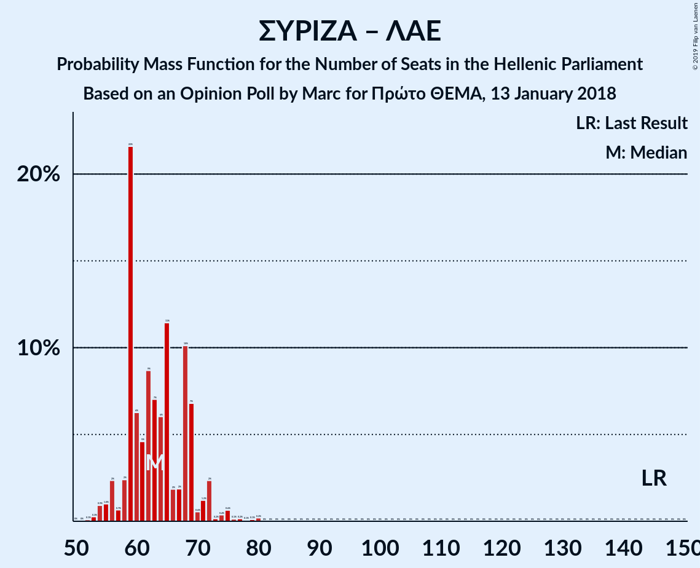

| Number of Seats | Probability | Accumulated | Special Marks |
|:---------------:|:-----------:|:-----------:|:-------------:|
| 51 | 0% | 100% |  |
| 52 | 0.1% | 99.9% |  |
| 53 | 0.3% | 99.8% |  |
| 54 | 0.9% | 99.6% |  |
| 55 | 1.0% | 98.7% |  |
| 56 | 2% | 98% |  |
| 57 | 0.7% | 95% |  |
| 58 | 2% | 95% |  |
| 59 | 22% | 92% |  |
| 60 | 6% | 71% |  |
| 61 | 5% | 64% |  |
| 62 | 9% | 60% | Median |
| 63 | 7% | 51% |  |
| 64 | 6% | 44% |  |
| 65 | 11% | 38% |  |
| 66 | 2% | 27% |  |
| 67 | 2% | 25% |  |
| 68 | 10% | 23% |  |
| 69 | 7% | 13% |  |
| 70 | 0.6% | 6% |  |
| 71 | 1.2% | 5% |  |
| 72 | 2% | 4% |  |
| 73 | 0.2% | 2% |  |
| 74 | 0.4% | 2% |  |
| 75 | 0.6% | 1.3% |  |
| 76 | 0.1% | 0.7% |  |
| 77 | 0.2% | 0.5% |  |
| 78 | 0.1% | 0.4% |  |
| 79 | 0.1% | 0.3% |  |
| 80 | 0.2% | 0.2% |  |
| 81 | 0% | 0% |  |
| 82 | 0% | 0% |  |
| 83 | 0% | 0% |  |
| 84 | 0% | 0% |  |
| 85 | 0% | 0% |  |
| 86 | 0% | 0% |  |
| 87 | 0% | 0% |  |
| 88 | 0% | 0% |  |
| 89 | 0% | 0% |  |
| 90 | 0% | 0% |  |
| 91 | 0% | 0% |  |
| 92 | 0% | 0% |  |
| 93 | 0% | 0% |  |
| 94 | 0% | 0% |  |
| 95 | 0% | 0% |  |
| 96 | 0% | 0% |  |
| 97 | 0% | 0% |  |
| 98 | 0% | 0% |  |
| 99 | 0% | 0% |  |
| 100 | 0% | 0% |  |
| 101 | 0% | 0% |  |
| 102 | 0% | 0% |  |
| 103 | 0% | 0% |  |
| 104 | 0% | 0% |  |
| 105 | 0% | 0% |  |
| 106 | 0% | 0% |  |
| 107 | 0% | 0% |  |
| 108 | 0% | 0% |  |
| 109 | 0% | 0% |  |
| 110 | 0% | 0% |  |
| 111 | 0% | 0% |  |
| 112 | 0% | 0% |  |
| 113 | 0% | 0% |  |
| 114 | 0% | 0% |  |
| 115 | 0% | 0% |  |
| 116 | 0% | 0% |  |
| 117 | 0% | 0% |  |
| 118 | 0% | 0% |  |
| 119 | 0% | 0% |  |
| 120 | 0% | 0% |  |
| 121 | 0% | 0% |  |
| 122 | 0% | 0% |  |
| 123 | 0% | 0% |  |
| 124 | 0% | 0% |  |
| 125 | 0% | 0% |  |
| 126 | 0% | 0% |  |
| 127 | 0% | 0% |  |
| 128 | 0% | 0% |  |
| 129 | 0% | 0% |  |
| 130 | 0% | 0% |  |
| 131 | 0% | 0% |  |
| 132 | 0% | 0% |  |
| 133 | 0% | 0% |  |
| 134 | 0% | 0% |  |
| 135 | 0% | 0% |  |
| 136 | 0% | 0% |  |
| 137 | 0% | 0% |  |
| 138 | 0% | 0% |  |
| 139 | 0% | 0% |  |
| 140 | 0% | 0% |  |
| 141 | 0% | 0% |  |
| 142 | 0% | 0% |  |
| 143 | 0% | 0% |  |
| 144 | 0% | 0% |  |
| 145 | 0% | 0% | Last Result |

### Συνασπισμός Ριζοσπαστικής Αριστεράς

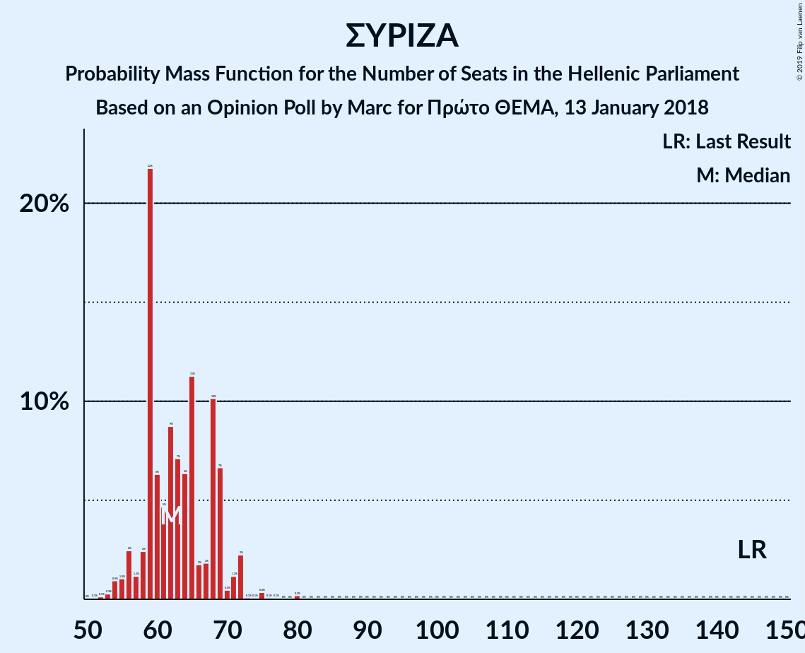

| Number of Seats | Probability | Accumulated | Special Marks |
|:---------------:|:-----------:|:-----------:|:-------------:|
| 50 | 0% | 100% |  |
| 51 | 0.1% | 99.9% |  |
| 52 | 0.1% | 99.9% |  |
| 53 | 0.3% | 99.7% |  |
| 54 | 0.9% | 99.5% |  |
| 55 | 1.0% | 98.5% |  |
| 56 | 2% | 97% |  |
| 57 | 1.2% | 95% |  |
| 58 | 2% | 94% |  |
| 59 | 22% | 91% |  |
| 60 | 6% | 70% |  |
| 61 | 5% | 63% |  |
| 62 | 9% | 59% | Median |
| 63 | 7% | 50% |  |
| 64 | 6% | 43% |  |
| 65 | 11% | 36% |  |
| 66 | 2% | 25% |  |
| 67 | 2% | 23% |  |
| 68 | 10% | 22% |  |
| 69 | 7% | 11% |  |
| 70 | 0.5% | 5% |  |
| 71 | 1.2% | 4% |  |
| 72 | 2% | 3% |  |
| 73 | 0.1% | 0.9% |  |
| 74 | 0.1% | 0.8% |  |
| 75 | 0.4% | 0.7% |  |
| 76 | 0.1% | 0.4% |  |
| 77 | 0.1% | 0.3% |  |
| 78 | 0% | 0.2% |  |
| 79 | 0% | 0.2% |  |
| 80 | 0.2% | 0.2% |  |
| 81 | 0% | 0% |  |
| 82 | 0% | 0% |  |
| 83 | 0% | 0% |  |
| 84 | 0% | 0% |  |
| 85 | 0% | 0% |  |
| 86 | 0% | 0% |  |
| 87 | 0% | 0% |  |
| 88 | 0% | 0% |  |
| 89 | 0% | 0% |  |
| 90 | 0% | 0% |  |
| 91 | 0% | 0% |  |
| 92 | 0% | 0% |  |
| 93 | 0% | 0% |  |
| 94 | 0% | 0% |  |
| 95 | 0% | 0% |  |
| 96 | 0% | 0% |  |
| 97 | 0% | 0% |  |
| 98 | 0% | 0% |  |
| 99 | 0% | 0% |  |
| 100 | 0% | 0% |  |
| 101 | 0% | 0% |  |
| 102 | 0% | 0% |  |
| 103 | 0% | 0% |  |
| 104 | 0% | 0% |  |
| 105 | 0% | 0% |  |
| 106 | 0% | 0% |  |
| 107 | 0% | 0% |  |
| 108 | 0% | 0% |  |
| 109 | 0% | 0% |  |
| 110 | 0% | 0% |  |
| 111 | 0% | 0% |  |
| 112 | 0% | 0% |  |
| 113 | 0% | 0% |  |
| 114 | 0% | 0% |  |
| 115 | 0% | 0% |  |
| 116 | 0% | 0% |  |
| 117 | 0% | 0% |  |
| 118 | 0% | 0% |  |
| 119 | 0% | 0% |  |
| 120 | 0% | 0% |  |
| 121 | 0% | 0% |  |
| 122 | 0% | 0% |  |
| 123 | 0% | 0% |  |
| 124 | 0% | 0% |  |
| 125 | 0% | 0% |  |
| 126 | 0% | 0% |  |
| 127 | 0% | 0% |  |
| 128 | 0% | 0% |  |
| 129 | 0% | 0% |  |
| 130 | 0% | 0% |  |
| 131 | 0% | 0% |  |
| 132 | 0% | 0% |  |
| 133 | 0% | 0% |  |
| 134 | 0% | 0% |  |
| 135 | 0% | 0% |  |
| 136 | 0% | 0% |  |
| 137 | 0% | 0% |  |
| 138 | 0% | 0% |  |
| 139 | 0% | 0% |  |
| 140 | 0% | 0% |  |
| 141 | 0% | 0% |  |
| 142 | 0% | 0% |  |
| 143 | 0% | 0% |  |
| 144 | 0% | 0% |  |
| 145 | 0% | 0% | Last Result |

## Technical Information

### Opinion Poll

+ **Polling firm:** Marc
+ **Commissioner(s):** Πρώτο ΘΕΜΑ
+ **Fieldwork period:** 13 January 2018

### Calculations

+ **Sample size:** 1000
+ **Simulations done:** 131,072
+ **Error estimate:** 1.91%

