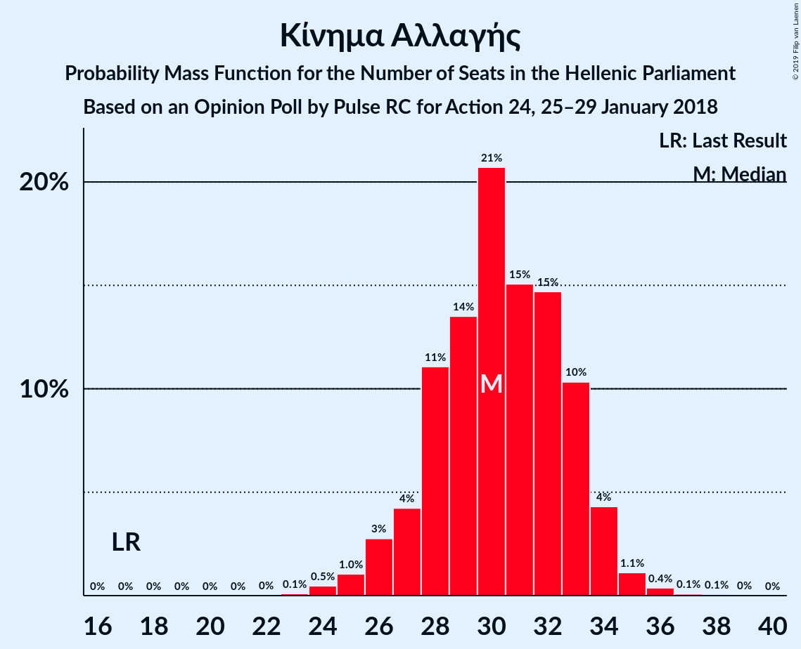
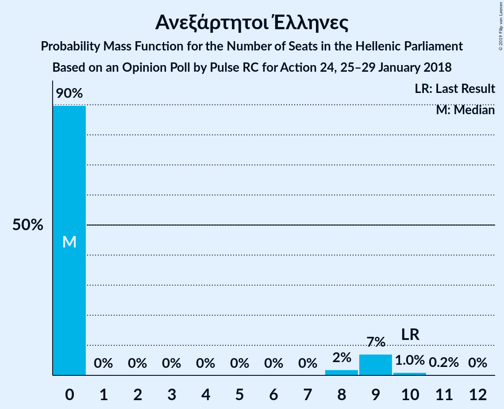
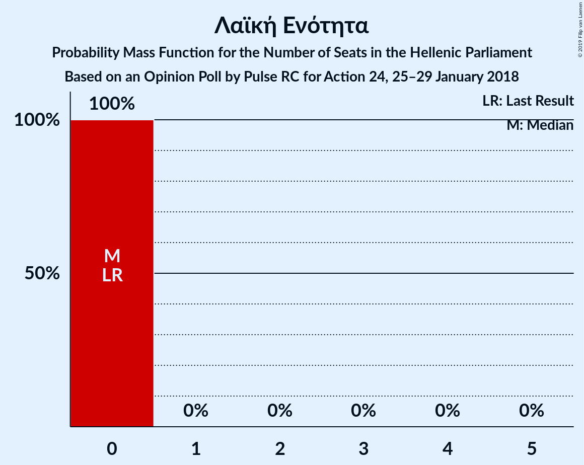
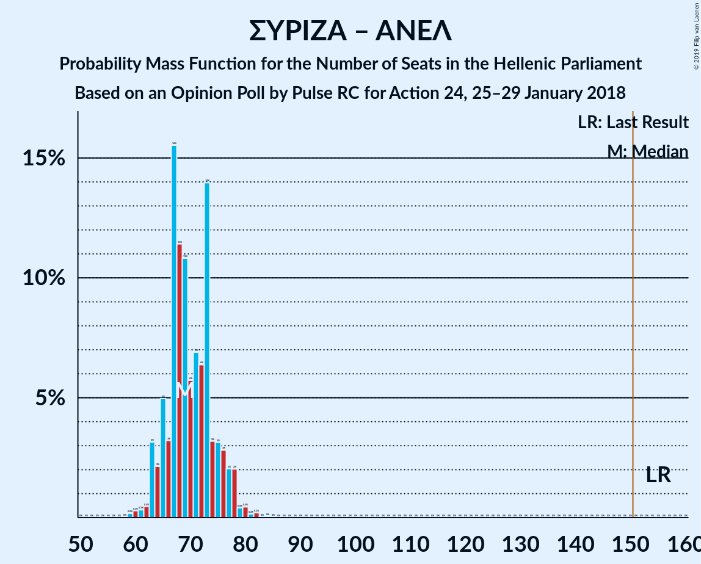

# Opinion Poll by Pulse RC for Action 24, 25–29 January 2018

<a href="#voting-intentions">Voting Intentions</a> | <a href="#seats">Seats</a> | <a href="#coalitions">Coalitions</a> | <a href="#technical-information">Technical Information</a>

## Voting Intentions

### Confidence Intervals

| Party | Last Result | Poll Result | 80% Confidence Interval | 90% Confidence Interval | 95% Confidence Interval | 99% Confidence Interval |
|:-----:|:-----------:|:-----------:|:-----------------------:|:-----------------------:|:-----------------------:|:-----------------------:|
| Νέα Δημοκρατία | 28.1% | 36.5% | 34.9–38.1% |34.5–38.6% |34.1–39.0% |33.4–39.7% |
| Συνασπισμός Ριζοσπαστικής Αριστεράς | 35.5% | 24.0% | 22.6–25.4% |22.2–25.8% |21.9–26.2% |21.2–26.9% |
| Κίνημα Αλλαγής | 6.3% | 10.5% | 9.5–11.6% |9.3–11.9% |9.0–12.1% |8.6–12.7% |
| Χρυσή Αυγή | 7.0% | 9.5% | 8.6–10.5% |8.3–10.8% |8.1–11.1% |7.7–11.6% |
| Κομμουνιστικό Κόμμα Ελλάδας | 5.6% | 6.5% | 5.8–7.4% |5.6–7.7% |5.4–7.9% |5.0–8.3% |
| Ανεξάρτητοι Έλληνες | 3.7% | 2.5% | 2.1–3.1% |1.9–3.3% |1.8–3.4% |1.6–3.7% |
| Ένωση Κεντρώων | 3.4% | 2.5% | 2.1–3.1% |1.9–3.3% |1.8–3.4% |1.6–3.7% |
| Λαϊκή Ενότητα | 2.9% | 1.0% | 0.7–1.4% |0.7–1.5% |0.6–1.6% |0.5–1.9% |
| Πλεύση Ελευθερίας | 0.0% | 1.0% | 0.7–1.4% |0.7–1.5% |0.6–1.6% |0.5–1.9% |
| Ελληνική Λύση | 0.0% | 1.0% | 0.7–1.4% |0.7–1.5% |0.6–1.6% |0.5–1.9% |

*Note:* The poll result column reflects the actual value used in the calculations. Published results may vary slightly, and in addition be rounded to fewer digits.

## Seats

### Confidence Intervals

| Party | Last Result | Median | 80% Confidence Interval | 90% Confidence Interval | 95% Confidence Interval | 99% Confidence Interval |
|:-----:|:-----------:|:------:|:-----------------------:|:-----------------------:|:-----------------------:|:-----------------------:|
| <a href="#νέα-δημοκρατία">Νέα Δημοκρατία</a> | 75 | 152 | 152–156 |150–161 |147–161 |145–164 |
| <a href="#συνασπισμός-ριζοσπαστικής-αριστεράς">Συνασπισμός Ριζοσπαστικής Αριστεράς</a> | 145 | 67 | 67–72 |65–72 |63–74 |60–76 |
| <a href="#κίνημα-αλλαγής">Κίνημα Αλλαγής</a> | 17 | 32 | 28–34 |27–34 |26–34 |25–35 |
| <a href="#χρυσή-αυγή">Χρυσή Αυγή</a> | 18 | 30 | 25–30 |24–32 |23–32 |22–32 |
| <a href="#κομμουνιστικό-κόμμα-ελλάδας">Κομμουνιστικό Κόμμα Ελλάδας</a> | 15 | 19 | 16–19 |16–21 |16–22 |15–23 |
| <a href="#ανεξάρτητοι-έλληνες">Ανεξάρτητοι Έλληνες</a> | 10 | 0 | 0 |0 |0–9 |0–10 |
| <a href="#ένωση-κεντρώων">Ένωση Κεντρώων</a> | 9 | 0 | 0 |0–9 |0–9 |0–10 |
| <a href="#λαϊκή-ενότητα">Λαϊκή Ενότητα</a> | 0 | 0 | 0 |0 |0 |0 |
| <a href="#πλεύση-ελευθερίας">Πλεύση Ελευθερίας</a> | 0 | 0 | 0 |0 |0 |0 |
| <a href="#ελληνική-λύση">Ελληνική Λύση</a> | 0 | 0 | 0 |0 |0 |0 |

### Νέα Δημοκρατία

*For a full overview of the results for this party, see the [Νέα Δημοκρατία](party-νέαδημοκρατία.html) page.*

| Number of Seats | Probability | Accumulated | Special Marks |
|:---------------:|:-----------:|:-----------:|:-------------:|
| 75 | 0% | 100% | Last Result |
| 76 | 0% | 100% |  |
| 77 | 0% | 100% |  |
| 78 | 0% | 100% |  |
| 79 | 0% | 100% |  |
| 80 | 0% | 100% |  |
| 81 | 0% | 100% |  |
| 82 | 0% | 100% |  |
| 83 | 0% | 100% |  |
| 84 | 0% | 100% |  |
| 85 | 0% | 100% |  |
| 86 | 0% | 100% |  |
| 87 | 0% | 100% |  |
| 88 | 0% | 100% |  |
| 89 | 0% | 100% |  |
| 90 | 0% | 100% |  |
| 91 | 0% | 100% |  |
| 92 | 0% | 100% |  |
| 93 | 0% | 100% |  |
| 94 | 0% | 100% |  |
| 95 | 0% | 100% |  |
| 96 | 0% | 100% |  |
| 97 | 0% | 100% |  |
| 98 | 0% | 100% |  |
| 99 | 0% | 100% |  |
| 100 | 0% | 100% |  |
| 101 | 0% | 100% |  |
| 102 | 0% | 100% |  |
| 103 | 0% | 100% |  |
| 104 | 0% | 100% |  |
| 105 | 0% | 100% |  |
| 106 | 0% | 100% |  |
| 107 | 0% | 100% |  |
| 108 | 0% | 100% |  |
| 109 | 0% | 100% |  |
| 110 | 0% | 100% |  |
| 111 | 0% | 100% |  |
| 112 | 0% | 100% |  |
| 113 | 0% | 100% |  |
| 114 | 0% | 100% |  |
| 115 | 0% | 100% |  |
| 116 | 0% | 100% |  |
| 117 | 0% | 100% |  |
| 118 | 0% | 100% |  |
| 119 | 0% | 100% |  |
| 120 | 0% | 100% |  |
| 121 | 0% | 100% |  |
| 122 | 0% | 100% |  |
| 123 | 0% | 100% |  |
| 124 | 0% | 100% |  |
| 125 | 0% | 100% |  |
| 126 | 0% | 100% |  |
| 127 | 0% | 100% |  |
| 128 | 0% | 100% |  |
| 129 | 0% | 100% |  |
| 130 | 0% | 100% |  |
| 131 | 0% | 100% |  |
| 132 | 0% | 100% |  |
| 133 | 0% | 100% |  |
| 134 | 0% | 100% |  |
| 135 | 0% | 100% |  |
| 136 | 0% | 100% |  |
| 137 | 0% | 100% |  |
| 138 | 0% | 100% |  |
| 139 | 0% | 100% |  |
| 140 | 0% | 100% |  |
| 141 | 0% | 100% |  |
| 142 | 0% | 100% |  |
| 143 | 0% | 99.9% |  |
| 144 | 0.1% | 99.9% |  |
| 145 | 0.9% | 99.8% |  |
| 146 | 0.9% | 98.9% |  |
| 147 | 0.6% | 98% |  |
| 148 | 0.8% | 97% |  |
| 149 | 0.9% | 97% |  |
| 150 | 3% | 96% |  |
| 151 | 1.4% | 93% | Majority |
| 152 | 74% | 91% | Median |
| 153 | 1.2% | 17% |  |
| 154 | 4% | 16% |  |
| 155 | 0.8% | 12% |  |
| 156 | 3% | 11% |  |
| 157 | 0.1% | 8% |  |
| 158 | 0.3% | 8% |  |
| 159 | 1.1% | 7% |  |
| 160 | 0.4% | 6% |  |
| 161 | 4% | 6% |  |
| 162 | 0.9% | 2% |  |
| 163 | 0% | 0.6% |  |
| 164 | 0.5% | 0.6% |  |
| 165 | 0% | 0% |  |

### Συνασπισμός Ριζοσπαστικής Αριστεράς

*For a full overview of the results for this party, see the [Συνασπισμός Ριζοσπαστικής Αριστεράς](party-συνασπισμόςριζοσπαστικήςαριστεράς.html) page.*

| Number of Seats | Probability | Accumulated | Special Marks |
|:---------------:|:-----------:|:-----------:|:-------------:|
| 58 | 0% | 100% |  |
| 59 | 0.4% | 99.9% |  |
| 60 | 0.1% | 99.6% |  |
| 61 | 0.9% | 99.5% |  |
| 62 | 0.4% | 98.6% |  |
| 63 | 1.2% | 98% |  |
| 64 | 2% | 97% |  |
| 65 | 3% | 95% |  |
| 66 | 2% | 92% |  |
| 67 | 64% | 91% | Median |
| 68 | 8% | 27% |  |
| 69 | 2% | 19% |  |
| 70 | 1.3% | 17% |  |
| 71 | 5% | 16% |  |
| 72 | 7% | 11% |  |
| 73 | 1.4% | 4% |  |
| 74 | 1.0% | 3% |  |
| 75 | 0.8% | 2% |  |
| 76 | 0.7% | 0.9% |  |
| 77 | 0% | 0.2% |  |
| 78 | 0.2% | 0.2% |  |
| 79 | 0% | 0% |  |
| 80 | 0% | 0% |  |
| 81 | 0% | 0% |  |
| 82 | 0% | 0% |  |
| 83 | 0% | 0% |  |
| 84 | 0% | 0% |  |
| 85 | 0% | 0% |  |
| 86 | 0% | 0% |  |
| 87 | 0% | 0% |  |
| 88 | 0% | 0% |  |
| 89 | 0% | 0% |  |
| 90 | 0% | 0% |  |
| 91 | 0% | 0% |  |
| 92 | 0% | 0% |  |
| 93 | 0% | 0% |  |
| 94 | 0% | 0% |  |
| 95 | 0% | 0% |  |
| 96 | 0% | 0% |  |
| 97 | 0% | 0% |  |
| 98 | 0% | 0% |  |
| 99 | 0% | 0% |  |
| 100 | 0% | 0% |  |
| 101 | 0% | 0% |  |
| 102 | 0% | 0% |  |
| 103 | 0% | 0% |  |
| 104 | 0% | 0% |  |
| 105 | 0% | 0% |  |
| 106 | 0% | 0% |  |
| 107 | 0% | 0% |  |
| 108 | 0% | 0% |  |
| 109 | 0% | 0% |  |
| 110 | 0% | 0% |  |
| 111 | 0% | 0% |  |
| 112 | 0% | 0% |  |
| 113 | 0% | 0% |  |
| 114 | 0% | 0% |  |
| 115 | 0% | 0% |  |
| 116 | 0% | 0% |  |
| 117 | 0% | 0% |  |
| 118 | 0% | 0% |  |
| 119 | 0% | 0% |  |
| 120 | 0% | 0% |  |
| 121 | 0% | 0% |  |
| 122 | 0% | 0% |  |
| 123 | 0% | 0% |  |
| 124 | 0% | 0% |  |
| 125 | 0% | 0% |  |
| 126 | 0% | 0% |  |
| 127 | 0% | 0% |  |
| 128 | 0% | 0% |  |
| 129 | 0% | 0% |  |
| 130 | 0% | 0% |  |
| 131 | 0% | 0% |  |
| 132 | 0% | 0% |  |
| 133 | 0% | 0% |  |
| 134 | 0% | 0% |  |
| 135 | 0% | 0% |  |
| 136 | 0% | 0% |  |
| 137 | 0% | 0% |  |
| 138 | 0% | 0% |  |
| 139 | 0% | 0% |  |
| 140 | 0% | 0% |  |
| 141 | 0% | 0% |  |
| 142 | 0% | 0% |  |
| 143 | 0% | 0% |  |
| 144 | 0% | 0% |  |
| 145 | 0% | 0% | Last Result |

### Κίνημα Αλλαγής

*For a full overview of the results for this party, see the [Κίνημα Αλλαγής](party-κίνημααλλαγής.html) page.*

| Number of Seats | Probability | Accumulated | Special Marks |
|:---------------:|:-----------:|:-----------:|:-------------:|
| 17 | 0% | 100% | Last Result |
| 18 | 0% | 100% |  |
| 19 | 0% | 100% |  |
| 20 | 0% | 100% |  |
| 21 | 0% | 100% |  |
| 22 | 0% | 100% |  |
| 23 | 0% | 100% |  |
| 24 | 0.4% | 100% |  |
| 25 | 0.3% | 99.6% |  |
| 26 | 2% | 99.3% |  |
| 27 | 7% | 97% |  |
| 28 | 4% | 90% |  |
| 29 | 5% | 86% |  |
| 30 | 1.1% | 81% |  |
| 31 | 1.0% | 80% |  |
| 32 | 68% | 79% | Median |
| 33 | 1.3% | 11% |  |
| 34 | 8% | 10% |  |
| 35 | 2% | 2% |  |
| 36 | 0% | 0.4% |  |
| 37 | 0% | 0.3% |  |
| 38 | 0.3% | 0.3% |  |
| 39 | 0% | 0% |  |

### Χρυσή Αυγή

*For a full overview of the results for this party, see the [Χρυσή Αυγή](party-χρυσήαυγή.html) page.*

| Number of Seats | Probability | Accumulated | Special Marks |
|:---------------:|:-----------:|:-----------:|:-------------:|
| 18 | 0% | 100% | Last Result |
| 19 | 0% | 100% |  |
| 20 | 0% | 100% |  |
| 21 | 0.1% | 100% |  |
| 22 | 2% | 99.9% |  |
| 23 | 1.2% | 98% |  |
| 24 | 2% | 97% |  |
| 25 | 13% | 94% |  |
| 26 | 4% | 81% |  |
| 27 | 4% | 77% |  |
| 28 | 3% | 73% |  |
| 29 | 1.1% | 70% |  |
| 30 | 61% | 69% | Median |
| 31 | 0.9% | 8% |  |
| 32 | 7% | 7% |  |
| 33 | 0% | 0.4% |  |
| 34 | 0.3% | 0.3% |  |
| 35 | 0% | 0% |  |

### Κομμουνιστικό Κόμμα Ελλάδας

*For a full overview of the results for this party, see the [Κομμουνιστικό Κόμμα Ελλάδας](party-κομμουνιστικόκόμμαελλάδας.html) page.*

| Number of Seats | Probability | Accumulated | Special Marks |
|:---------------:|:-----------:|:-----------:|:-------------:|
| 14 | 0.1% | 100% |  |
| 15 | 2% | 99.9% | Last Result |
| 16 | 11% | 98% |  |
| 17 | 9% | 87% |  |
| 18 | 4% | 79% |  |
| 19 | 66% | 74% | Median |
| 20 | 4% | 9% |  |
| 21 | 2% | 5% |  |
| 22 | 2% | 3% |  |
| 23 | 0.5% | 0.8% |  |
| 24 | 0.2% | 0.3% |  |
| 25 | 0.1% | 0.1% |  |
| 26 | 0% | 0% |  |

### Ανεξάρτητοι Έλληνες

*For a full overview of the results for this party, see the [Ανεξάρτητοι Έλληνες](party-ανεξάρτητοιέλληνες.html) page.*

| Number of Seats | Probability | Accumulated | Special Marks |
|:---------------:|:-----------:|:-----------:|:-------------:|
| 0 | 95% | 100% | Median |
| 1 | 0% | 5% |  |
| 2 | 0% | 5% |  |
| 3 | 0% | 5% |  |
| 4 | 0% | 5% |  |
| 5 | 0% | 5% |  |
| 6 | 0% | 5% |  |
| 7 | 0% | 5% |  |
| 8 | 0.2% | 5% |  |
| 9 | 3% | 5% |  |
| 10 | 0.9% | 1.2% | Last Result |
| 11 | 0.3% | 0.3% |  |
| 12 | 0% | 0% |  |

### Ένωση Κεντρώων

*For a full overview of the results for this party, see the [Ένωση Κεντρώων](party-ένωσηκεντρώων.html) page.*

| Number of Seats | Probability | Accumulated | Special Marks |
|:---------------:|:-----------:|:-----------:|:-------------:|
| 0 | 94% | 100% | Median |
| 1 | 0% | 6% |  |
| 2 | 0% | 6% |  |
| 3 | 0% | 6% |  |
| 4 | 0% | 6% |  |
| 5 | 0% | 6% |  |
| 6 | 0% | 6% |  |
| 7 | 0% | 6% |  |
| 8 | 0.2% | 6% |  |
| 9 | 4% | 5% | Last Result |
| 10 | 1.1% | 1.2% |  |
| 11 | 0.1% | 0.1% |  |
| 12 | 0% | 0% |  |

### Λαϊκή Ενότητα

*For a full overview of the results for this party, see the [Λαϊκή Ενότητα](party-λαϊκήενότητα.html) page.*

| Number of Seats | Probability | Accumulated | Special Marks |
|:---------------:|:-----------:|:-----------:|:-------------:|
| 0 | 100% | 100% | Last Result, Median |

### Πλεύση Ελευθερίας

*For a full overview of the results for this party, see the [Πλεύση Ελευθερίας](party-πλεύσηελευθερίας.html) page.*

| Number of Seats | Probability | Accumulated | Special Marks |
|:---------------:|:-----------:|:-----------:|:-------------:|
| 0 | 100% | 100% | Last Result, Median |

### Ελληνική Λύση

*For a full overview of the results for this party, see the [Ελληνική Λύση](party-ελληνικήλύση.html) page.*

| Number of Seats | Probability | Accumulated | Special Marks |
|:---------------:|:-----------:|:-----------:|:-------------:|
| 0 | 100% | 100% | Last Result, Median |

## Coalitions

### Confidence Intervals

| Coalition | Last Result | Median | Majority? | 80% Confidence Interval | 90% Confidence Interval | 95% Confidence Interval | 99% Confidence Interval |
|:---------:|:-----------:|:------:|:---------:|:-----------------------:|:-----------------------:|:-----------------------:|:-----------------------:|
| Νέα Δημοκρατία – Κίνημα Αλλαγής | 92 | 184 | 100% | 182–186 | 179–188 | 177–188 | 173–194 |
| Νέα Δημοκρατία | 75 | 152 | 93% | 152–156 | 150–161 | 147–161 | 145–164 |
| Συνασπισμός Ριζοσπαστικής Αριστεράς – Ανεξάρτητοι Έλληνες – Λαϊκή Ενότητα | 155 | 67 | 0% | 67–72 | 66–74 | 64–75 | 61–80 |
| Συνασπισμός Ριζοσπαστικής Αριστεράς – Ανεξάρτητοι Έλληνες | 155 | 67 | 0% | 67–72 | 66–74 | 64–75 | 61–80 |
| Συνασπισμός Ριζοσπαστικής Αριστεράς – Λαϊκή Ενότητα | 145 | 67 | 0% | 67–72 | 65–72 | 63–74 | 60–76 |
| Συνασπισμός Ριζοσπαστικής Αριστεράς | 145 | 67 | 0% | 67–72 | 65–72 | 63–74 | 60–76 |

### Νέα Δημοκρατία – Κίνημα Αλλαγής

| Number of Seats | Probability | Accumulated | Special Marks |
|:---------------:|:-----------:|:-----------:|:-------------:|
| 92 | 0% | 100% | Last Result |
| 93 | 0% | 100% |  |
| 94 | 0% | 100% |  |
| 95 | 0% | 100% |  |
| 96 | 0% | 100% |  |
| 97 | 0% | 100% |  |
| 98 | 0% | 100% |  |
| 99 | 0% | 100% |  |
| 100 | 0% | 100% |  |
| 101 | 0% | 100% |  |
| 102 | 0% | 100% |  |
| 103 | 0% | 100% |  |
| 104 | 0% | 100% |  |
| 105 | 0% | 100% |  |
| 106 | 0% | 100% |  |
| 107 | 0% | 100% |  |
| 108 | 0% | 100% |  |
| 109 | 0% | 100% |  |
| 110 | 0% | 100% |  |
| 111 | 0% | 100% |  |
| 112 | 0% | 100% |  |
| 113 | 0% | 100% |  |
| 114 | 0% | 100% |  |
| 115 | 0% | 100% |  |
| 116 | 0% | 100% |  |
| 117 | 0% | 100% |  |
| 118 | 0% | 100% |  |
| 119 | 0% | 100% |  |
| 120 | 0% | 100% |  |
| 121 | 0% | 100% |  |
| 122 | 0% | 100% |  |
| 123 | 0% | 100% |  |
| 124 | 0% | 100% |  |
| 125 | 0% | 100% |  |
| 126 | 0% | 100% |  |
| 127 | 0% | 100% |  |
| 128 | 0% | 100% |  |
| 129 | 0% | 100% |  |
| 130 | 0% | 100% |  |
| 131 | 0% | 100% |  |
| 132 | 0% | 100% |  |
| 133 | 0% | 100% |  |
| 134 | 0% | 100% |  |
| 135 | 0% | 100% |  |
| 136 | 0% | 100% |  |
| 137 | 0% | 100% |  |
| 138 | 0% | 100% |  |
| 139 | 0% | 100% |  |
| 140 | 0% | 100% |  |
| 141 | 0% | 100% |  |
| 142 | 0% | 100% |  |
| 143 | 0% | 100% |  |
| 144 | 0% | 100% |  |
| 145 | 0% | 100% |  |
| 146 | 0% | 100% |  |
| 147 | 0% | 100% |  |
| 148 | 0% | 100% |  |
| 149 | 0% | 100% |  |
| 150 | 0% | 100% |  |
| 151 | 0% | 100% | Majority |
| 152 | 0% | 100% |  |
| 153 | 0% | 100% |  |
| 154 | 0% | 100% |  |
| 155 | 0% | 100% |  |
| 156 | 0% | 100% |  |
| 157 | 0% | 100% |  |
| 158 | 0% | 100% |  |
| 159 | 0% | 100% |  |
| 160 | 0% | 100% |  |
| 161 | 0% | 100% |  |
| 162 | 0% | 100% |  |
| 163 | 0% | 100% |  |
| 164 | 0% | 100% |  |
| 165 | 0% | 100% |  |
| 166 | 0% | 100% |  |
| 167 | 0% | 100% |  |
| 168 | 0% | 100% |  |
| 169 | 0% | 100% |  |
| 170 | 0% | 100% |  |
| 171 | 0% | 99.9% |  |
| 172 | 0% | 99.9% |  |
| 173 | 0.4% | 99.9% |  |
| 174 | 1.0% | 99.5% |  |
| 175 | 0.2% | 98% |  |
| 176 | 0.1% | 98% |  |
| 177 | 1.0% | 98% |  |
| 178 | 2% | 97% |  |
| 179 | 0.5% | 95% |  |
| 180 | 2% | 95% |  |
| 181 | 0.5% | 93% |  |
| 182 | 3% | 92% |  |
| 183 | 3% | 89% |  |
| 184 | 67% | 86% | Median |
| 185 | 3% | 19% |  |
| 186 | 8% | 16% |  |
| 187 | 1.3% | 9% |  |
| 188 | 6% | 7% |  |
| 189 | 0.1% | 2% |  |
| 190 | 0% | 2% |  |
| 191 | 0% | 1.5% |  |
| 192 | 0.3% | 1.4% |  |
| 193 | 0.4% | 1.2% |  |
| 194 | 0.5% | 0.8% |  |
| 195 | 0.2% | 0.3% |  |
| 196 | 0.1% | 0.1% |  |
| 197 | 0% | 0% |  |

### Νέα Δημοκρατία

| Number of Seats | Probability | Accumulated | Special Marks |
|:---------------:|:-----------:|:-----------:|:-------------:|
| 75 | 0% | 100% | Last Result |
| 76 | 0% | 100% |  |
| 77 | 0% | 100% |  |
| 78 | 0% | 100% |  |
| 79 | 0% | 100% |  |
| 80 | 0% | 100% |  |
| 81 | 0% | 100% |  |
| 82 | 0% | 100% |  |
| 83 | 0% | 100% |  |
| 84 | 0% | 100% |  |
| 85 | 0% | 100% |  |
| 86 | 0% | 100% |  |
| 87 | 0% | 100% |  |
| 88 | 0% | 100% |  |
| 89 | 0% | 100% |  |
| 90 | 0% | 100% |  |
| 91 | 0% | 100% |  |
| 92 | 0% | 100% |  |
| 93 | 0% | 100% |  |
| 94 | 0% | 100% |  |
| 95 | 0% | 100% |  |
| 96 | 0% | 100% |  |
| 97 | 0% | 100% |  |
| 98 | 0% | 100% |  |
| 99 | 0% | 100% |  |
| 100 | 0% | 100% |  |
| 101 | 0% | 100% |  |
| 102 | 0% | 100% |  |
| 103 | 0% | 100% |  |
| 104 | 0% | 100% |  |
| 105 | 0% | 100% |  |
| 106 | 0% | 100% |  |
| 107 | 0% | 100% |  |
| 108 | 0% | 100% |  |
| 109 | 0% | 100% |  |
| 110 | 0% | 100% |  |
| 111 | 0% | 100% |  |
| 112 | 0% | 100% |  |
| 113 | 0% | 100% |  |
| 114 | 0% | 100% |  |
| 115 | 0% | 100% |  |
| 116 | 0% | 100% |  |
| 117 | 0% | 100% |  |
| 118 | 0% | 100% |  |
| 119 | 0% | 100% |  |
| 120 | 0% | 100% |  |
| 121 | 0% | 100% |  |
| 122 | 0% | 100% |  |
| 123 | 0% | 100% |  |
| 124 | 0% | 100% |  |
| 125 | 0% | 100% |  |
| 126 | 0% | 100% |  |
| 127 | 0% | 100% |  |
| 128 | 0% | 100% |  |
| 129 | 0% | 100% |  |
| 130 | 0% | 100% |  |
| 131 | 0% | 100% |  |
| 132 | 0% | 100% |  |
| 133 | 0% | 100% |  |
| 134 | 0% | 100% |  |
| 135 | 0% | 100% |  |
| 136 | 0% | 100% |  |
| 137 | 0% | 100% |  |
| 138 | 0% | 100% |  |
| 139 | 0% | 100% |  |
| 140 | 0% | 100% |  |
| 141 | 0% | 100% |  |
| 142 | 0% | 100% |  |
| 143 | 0% | 99.9% |  |
| 144 | 0.1% | 99.9% |  |
| 145 | 0.9% | 99.8% |  |
| 146 | 0.9% | 98.9% |  |
| 147 | 0.6% | 98% |  |
| 148 | 0.8% | 97% |  |
| 149 | 0.9% | 97% |  |
| 150 | 3% | 96% |  |
| 151 | 1.4% | 93% | Majority |
| 152 | 74% | 91% | Median |
| 153 | 1.2% | 17% |  |
| 154 | 4% | 16% |  |
| 155 | 0.8% | 12% |  |
| 156 | 3% | 11% |  |
| 157 | 0.1% | 8% |  |
| 158 | 0.3% | 8% |  |
| 159 | 1.1% | 7% |  |
| 160 | 0.4% | 6% |  |
| 161 | 4% | 6% |  |
| 162 | 0.9% | 2% |  |
| 163 | 0% | 0.6% |  |
| 164 | 0.5% | 0.6% |  |
| 165 | 0% | 0% |  |

### Συνασπισμός Ριζοσπαστικής Αριστεράς – Ανεξάρτητοι Έλληνες – Λαϊκή Ενότητα

| Number of Seats | Probability | Accumulated | Special Marks |
|:---------------:|:-----------:|:-----------:|:-------------:|
| 59 | 0.4% | 100% |  |
| 60 | 0.1% | 99.6% |  |
| 61 | 0.5% | 99.5% |  |
| 62 | 0.2% | 99.0% |  |
| 63 | 1.1% | 98.9% |  |
| 64 | 1.0% | 98% |  |
| 65 | 0.9% | 97% |  |
| 66 | 1.2% | 96% |  |
| 67 | 64% | 95% | Median |
| 68 | 8% | 31% |  |
| 69 | 1.4% | 23% |  |
| 70 | 1.3% | 21% |  |
| 71 | 5% | 20% |  |
| 72 | 7% | 15% |  |
| 73 | 1.5% | 8% |  |
| 74 | 4% | 6% |  |
| 75 | 0.9% | 3% |  |
| 76 | 0.8% | 2% |  |
| 77 | 0.1% | 1.0% |  |
| 78 | 0.3% | 0.9% |  |
| 79 | 0% | 0.6% |  |
| 80 | 0.2% | 0.6% |  |
| 81 | 0.1% | 0.4% |  |
| 82 | 0% | 0.2% |  |
| 83 | 0% | 0.2% |  |
| 84 | 0.2% | 0.2% |  |
| 85 | 0% | 0% |  |
| 86 | 0% | 0% |  |
| 87 | 0% | 0% |  |
| 88 | 0% | 0% |  |
| 89 | 0% | 0% |  |
| 90 | 0% | 0% |  |
| 91 | 0% | 0% |  |
| 92 | 0% | 0% |  |
| 93 | 0% | 0% |  |
| 94 | 0% | 0% |  |
| 95 | 0% | 0% |  |
| 96 | 0% | 0% |  |
| 97 | 0% | 0% |  |
| 98 | 0% | 0% |  |
| 99 | 0% | 0% |  |
| 100 | 0% | 0% |  |
| 101 | 0% | 0% |  |
| 102 | 0% | 0% |  |
| 103 | 0% | 0% |  |
| 104 | 0% | 0% |  |
| 105 | 0% | 0% |  |
| 106 | 0% | 0% |  |
| 107 | 0% | 0% |  |
| 108 | 0% | 0% |  |
| 109 | 0% | 0% |  |
| 110 | 0% | 0% |  |
| 111 | 0% | 0% |  |
| 112 | 0% | 0% |  |
| 113 | 0% | 0% |  |
| 114 | 0% | 0% |  |
| 115 | 0% | 0% |  |
| 116 | 0% | 0% |  |
| 117 | 0% | 0% |  |
| 118 | 0% | 0% |  |
| 119 | 0% | 0% |  |
| 120 | 0% | 0% |  |
| 121 | 0% | 0% |  |
| 122 | 0% | 0% |  |
| 123 | 0% | 0% |  |
| 124 | 0% | 0% |  |
| 125 | 0% | 0% |  |
| 126 | 0% | 0% |  |
| 127 | 0% | 0% |  |
| 128 | 0% | 0% |  |
| 129 | 0% | 0% |  |
| 130 | 0% | 0% |  |
| 131 | 0% | 0% |  |
| 132 | 0% | 0% |  |
| 133 | 0% | 0% |  |
| 134 | 0% | 0% |  |
| 135 | 0% | 0% |  |
| 136 | 0% | 0% |  |
| 137 | 0% | 0% |  |
| 138 | 0% | 0% |  |
| 139 | 0% | 0% |  |
| 140 | 0% | 0% |  |
| 141 | 0% | 0% |  |
| 142 | 0% | 0% |  |
| 143 | 0% | 0% |  |
| 144 | 0% | 0% |  |
| 145 | 0% | 0% |  |
| 146 | 0% | 0% |  |
| 147 | 0% | 0% |  |
| 148 | 0% | 0% |  |
| 149 | 0% | 0% |  |
| 150 | 0% | 0% |  |
| 151 | 0% | 0% | Majority |
| 152 | 0% | 0% |  |
| 153 | 0% | 0% |  |
| 154 | 0% | 0% |  |
| 155 | 0% | 0% | Last Result |

### Συνασπισμός Ριζοσπαστικής Αριστεράς – Ανεξάρτητοι Έλληνες

| Number of Seats | Probability | Accumulated | Special Marks |
|:---------------:|:-----------:|:-----------:|:-------------:|
| 59 | 0.4% | 100% |  |
| 60 | 0.1% | 99.6% |  |
| 61 | 0.5% | 99.5% |  |
| 62 | 0.2% | 99.0% |  |
| 63 | 1.1% | 98.9% |  |
| 64 | 1.0% | 98% |  |
| 65 | 0.9% | 97% |  |
| 66 | 1.2% | 96% |  |
| 67 | 64% | 95% | Median |
| 68 | 8% | 31% |  |
| 69 | 1.4% | 23% |  |
| 70 | 1.3% | 21% |  |
| 71 | 5% | 20% |  |
| 72 | 7% | 15% |  |
| 73 | 1.5% | 8% |  |
| 74 | 4% | 6% |  |
| 75 | 0.9% | 3% |  |
| 76 | 0.8% | 2% |  |
| 77 | 0.1% | 1.0% |  |
| 78 | 0.3% | 0.9% |  |
| 79 | 0% | 0.6% |  |
| 80 | 0.2% | 0.6% |  |
| 81 | 0.1% | 0.4% |  |
| 82 | 0% | 0.2% |  |
| 83 | 0% | 0.2% |  |
| 84 | 0.2% | 0.2% |  |
| 85 | 0% | 0% |  |
| 86 | 0% | 0% |  |
| 87 | 0% | 0% |  |
| 88 | 0% | 0% |  |
| 89 | 0% | 0% |  |
| 90 | 0% | 0% |  |
| 91 | 0% | 0% |  |
| 92 | 0% | 0% |  |
| 93 | 0% | 0% |  |
| 94 | 0% | 0% |  |
| 95 | 0% | 0% |  |
| 96 | 0% | 0% |  |
| 97 | 0% | 0% |  |
| 98 | 0% | 0% |  |
| 99 | 0% | 0% |  |
| 100 | 0% | 0% |  |
| 101 | 0% | 0% |  |
| 102 | 0% | 0% |  |
| 103 | 0% | 0% |  |
| 104 | 0% | 0% |  |
| 105 | 0% | 0% |  |
| 106 | 0% | 0% |  |
| 107 | 0% | 0% |  |
| 108 | 0% | 0% |  |
| 109 | 0% | 0% |  |
| 110 | 0% | 0% |  |
| 111 | 0% | 0% |  |
| 112 | 0% | 0% |  |
| 113 | 0% | 0% |  |
| 114 | 0% | 0% |  |
| 115 | 0% | 0% |  |
| 116 | 0% | 0% |  |
| 117 | 0% | 0% |  |
| 118 | 0% | 0% |  |
| 119 | 0% | 0% |  |
| 120 | 0% | 0% |  |
| 121 | 0% | 0% |  |
| 122 | 0% | 0% |  |
| 123 | 0% | 0% |  |
| 124 | 0% | 0% |  |
| 125 | 0% | 0% |  |
| 126 | 0% | 0% |  |
| 127 | 0% | 0% |  |
| 128 | 0% | 0% |  |
| 129 | 0% | 0% |  |
| 130 | 0% | 0% |  |
| 131 | 0% | 0% |  |
| 132 | 0% | 0% |  |
| 133 | 0% | 0% |  |
| 134 | 0% | 0% |  |
| 135 | 0% | 0% |  |
| 136 | 0% | 0% |  |
| 137 | 0% | 0% |  |
| 138 | 0% | 0% |  |
| 139 | 0% | 0% |  |
| 140 | 0% | 0% |  |
| 141 | 0% | 0% |  |
| 142 | 0% | 0% |  |
| 143 | 0% | 0% |  |
| 144 | 0% | 0% |  |
| 145 | 0% | 0% |  |
| 146 | 0% | 0% |  |
| 147 | 0% | 0% |  |
| 148 | 0% | 0% |  |
| 149 | 0% | 0% |  |
| 150 | 0% | 0% |  |
| 151 | 0% | 0% | Majority |
| 152 | 0% | 0% |  |
| 153 | 0% | 0% |  |
| 154 | 0% | 0% |  |
| 155 | 0% | 0% | Last Result |

### Συνασπισμός Ριζοσπαστικής Αριστεράς – Λαϊκή Ενότητα

| Number of Seats | Probability | Accumulated | Special Marks |
|:---------------:|:-----------:|:-----------:|:-------------:|
| 58 | 0% | 100% |  |
| 59 | 0.4% | 99.9% |  |
| 60 | 0.1% | 99.6% |  |
| 61 | 0.9% | 99.5% |  |
| 62 | 0.4% | 98.6% |  |
| 63 | 1.2% | 98% |  |
| 64 | 2% | 97% |  |
| 65 | 3% | 95% |  |
| 66 | 2% | 92% |  |
| 67 | 64% | 91% | Median |
| 68 | 8% | 27% |  |
| 69 | 2% | 19% |  |
| 70 | 1.3% | 17% |  |
| 71 | 5% | 16% |  |
| 72 | 7% | 11% |  |
| 73 | 1.4% | 4% |  |
| 74 | 1.0% | 3% |  |
| 75 | 0.8% | 2% |  |
| 76 | 0.7% | 0.9% |  |
| 77 | 0% | 0.2% |  |
| 78 | 0.2% | 0.2% |  |
| 79 | 0% | 0% |  |
| 80 | 0% | 0% |  |
| 81 | 0% | 0% |  |
| 82 | 0% | 0% |  |
| 83 | 0% | 0% |  |
| 84 | 0% | 0% |  |
| 85 | 0% | 0% |  |
| 86 | 0% | 0% |  |
| 87 | 0% | 0% |  |
| 88 | 0% | 0% |  |
| 89 | 0% | 0% |  |
| 90 | 0% | 0% |  |
| 91 | 0% | 0% |  |
| 92 | 0% | 0% |  |
| 93 | 0% | 0% |  |
| 94 | 0% | 0% |  |
| 95 | 0% | 0% |  |
| 96 | 0% | 0% |  |
| 97 | 0% | 0% |  |
| 98 | 0% | 0% |  |
| 99 | 0% | 0% |  |
| 100 | 0% | 0% |  |
| 101 | 0% | 0% |  |
| 102 | 0% | 0% |  |
| 103 | 0% | 0% |  |
| 104 | 0% | 0% |  |
| 105 | 0% | 0% |  |
| 106 | 0% | 0% |  |
| 107 | 0% | 0% |  |
| 108 | 0% | 0% |  |
| 109 | 0% | 0% |  |
| 110 | 0% | 0% |  |
| 111 | 0% | 0% |  |
| 112 | 0% | 0% |  |
| 113 | 0% | 0% |  |
| 114 | 0% | 0% |  |
| 115 | 0% | 0% |  |
| 116 | 0% | 0% |  |
| 117 | 0% | 0% |  |
| 118 | 0% | 0% |  |
| 119 | 0% | 0% |  |
| 120 | 0% | 0% |  |
| 121 | 0% | 0% |  |
| 122 | 0% | 0% |  |
| 123 | 0% | 0% |  |
| 124 | 0% | 0% |  |
| 125 | 0% | 0% |  |
| 126 | 0% | 0% |  |
| 127 | 0% | 0% |  |
| 128 | 0% | 0% |  |
| 129 | 0% | 0% |  |
| 130 | 0% | 0% |  |
| 131 | 0% | 0% |  |
| 132 | 0% | 0% |  |
| 133 | 0% | 0% |  |
| 134 | 0% | 0% |  |
| 135 | 0% | 0% |  |
| 136 | 0% | 0% |  |
| 137 | 0% | 0% |  |
| 138 | 0% | 0% |  |
| 139 | 0% | 0% |  |
| 140 | 0% | 0% |  |
| 141 | 0% | 0% |  |
| 142 | 0% | 0% |  |
| 143 | 0% | 0% |  |
| 144 | 0% | 0% |  |
| 145 | 0% | 0% | Last Result |

### Συνασπισμός Ριζοσπαστικής Αριστεράς

| Number of Seats | Probability | Accumulated | Special Marks |
|:---------------:|:-----------:|:-----------:|:-------------:|
| 58 | 0% | 100% |  |
| 59 | 0.4% | 99.9% |  |
| 60 | 0.1% | 99.6% |  |
| 61 | 0.9% | 99.5% |  |
| 62 | 0.4% | 98.6% |  |
| 63 | 1.2% | 98% |  |
| 64 | 2% | 97% |  |
| 65 | 3% | 95% |  |
| 66 | 2% | 92% |  |
| 67 | 64% | 91% | Median |
| 68 | 8% | 27% |  |
| 69 | 2% | 19% |  |
| 70 | 1.3% | 17% |  |
| 71 | 5% | 16% |  |
| 72 | 7% | 11% |  |
| 73 | 1.4% | 4% |  |
| 74 | 1.0% | 3% |  |
| 75 | 0.8% | 2% |  |
| 76 | 0.7% | 0.9% |  |
| 77 | 0% | 0.2% |  |
| 78 | 0.2% | 0.2% |  |
| 79 | 0% | 0% |  |
| 80 | 0% | 0% |  |
| 81 | 0% | 0% |  |
| 82 | 0% | 0% |  |
| 83 | 0% | 0% |  |
| 84 | 0% | 0% |  |
| 85 | 0% | 0% |  |
| 86 | 0% | 0% |  |
| 87 | 0% | 0% |  |
| 88 | 0% | 0% |  |
| 89 | 0% | 0% |  |
| 90 | 0% | 0% |  |
| 91 | 0% | 0% |  |
| 92 | 0% | 0% |  |
| 93 | 0% | 0% |  |
| 94 | 0% | 0% |  |
| 95 | 0% | 0% |  |
| 96 | 0% | 0% |  |
| 97 | 0% | 0% |  |
| 98 | 0% | 0% |  |
| 99 | 0% | 0% |  |
| 100 | 0% | 0% |  |
| 101 | 0% | 0% |  |
| 102 | 0% | 0% |  |
| 103 | 0% | 0% |  |
| 104 | 0% | 0% |  |
| 105 | 0% | 0% |  |
| 106 | 0% | 0% |  |
| 107 | 0% | 0% |  |
| 108 | 0% | 0% |  |
| 109 | 0% | 0% |  |
| 110 | 0% | 0% |  |
| 111 | 0% | 0% |  |
| 112 | 0% | 0% |  |
| 113 | 0% | 0% |  |
| 114 | 0% | 0% |  |
| 115 | 0% | 0% |  |
| 116 | 0% | 0% |  |
| 117 | 0% | 0% |  |
| 118 | 0% | 0% |  |
| 119 | 0% | 0% |  |
| 120 | 0% | 0% |  |
| 121 | 0% | 0% |  |
| 122 | 0% | 0% |  |
| 123 | 0% | 0% |  |
| 124 | 0% | 0% |  |
| 125 | 0% | 0% |  |
| 126 | 0% | 0% |  |
| 127 | 0% | 0% |  |
| 128 | 0% | 0% |  |
| 129 | 0% | 0% |  |
| 130 | 0% | 0% |  |
| 131 | 0% | 0% |  |
| 132 | 0% | 0% |  |
| 133 | 0% | 0% |  |
| 134 | 0% | 0% |  |
| 135 | 0% | 0% |  |
| 136 | 0% | 0% |  |
| 137 | 0% | 0% |  |
| 138 | 0% | 0% |  |
| 139 | 0% | 0% |  |
| 140 | 0% | 0% |  |
| 141 | 0% | 0% |  |
| 142 | 0% | 0% |  |
| 143 | 0% | 0% |  |
| 144 | 0% | 0% |  |
| 145 | 0% | 0% | Last Result |

## Technical Information

### Opinion Poll

+ **Polling firm:** Pulse RC
+ **Commissioner(s):** Action 24
+ **Fieldwork period:** 25–29 January 2018

### Calculations

+ **Sample size:** 1518
+ **Simulations done:** 131,072
+ **Error estimate:** 3.17%

