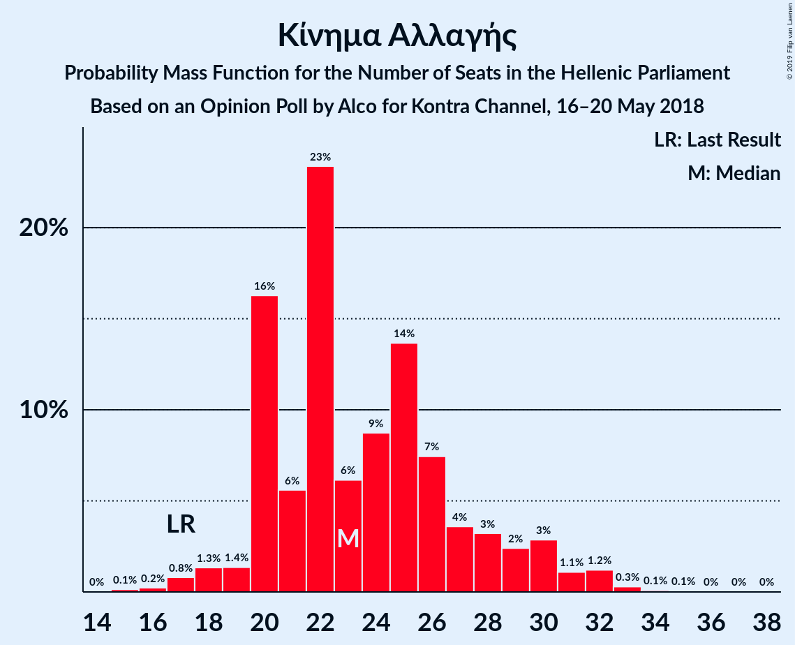
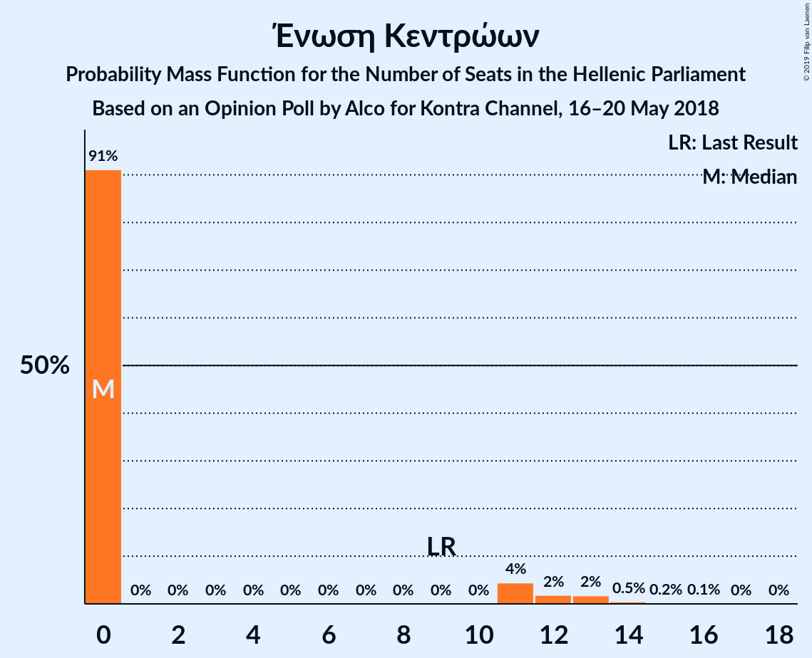
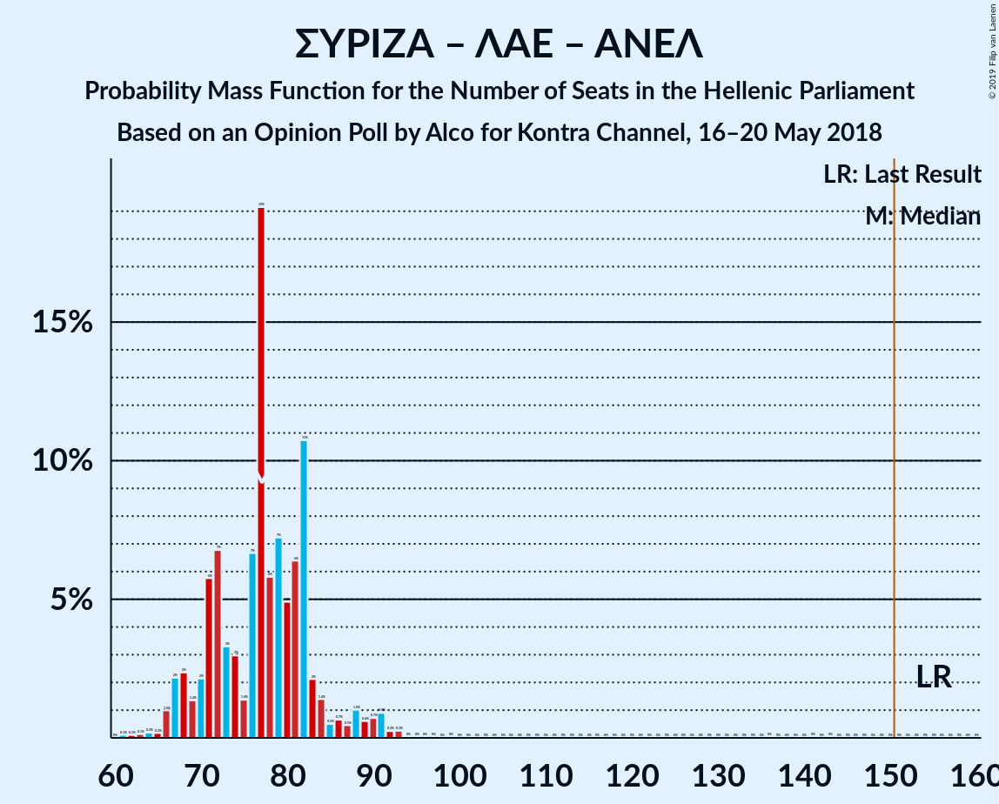

# Opinion Poll by Alco for Kontra Channel, 16–20 May 2018

<a href="#voting-intentions">Voting Intentions</a> | <a href="#seats">Seats</a> | <a href="#coalitions">Coalitions</a> | <a href="#technical-information">Technical Information</a>

## Voting Intentions

### Confidence Intervals

| Party | Last Result | Poll Result | 80% Confidence Interval | 90% Confidence Interval | 95% Confidence Interval | 99% Confidence Interval |
|:-----:|:-----------:|:-----------:|:-----------------------:|:-----------------------:|:-----------------------:|:-----------------------:|
| Νέα Δημοκρατία | 28.1% | 25.7% | 23.8–27.8% |23.3–28.4% |22.8–28.9% |21.9–29.9% |
| Συνασπισμός Ριζοσπαστικής Αριστεράς | 35.5% | 20.1% | 18.4–22.1% |17.9–22.6% |17.5–23.1% |16.7–24.0% |
| Χρυσή Αυγή | 7.0% | 7.0% | 5.9–8.3% |5.6–8.6% |5.4–8.9% |4.9–9.6% |
| Κίνημα Αλλαγής | 6.3% | 6.3% | 5.4–7.6% |5.1–7.9% |4.8–8.3% |4.4–8.9% |
| Κομμουνιστικό Κόμμα Ελλάδας | 5.6% | 6.0% | 5.0–7.2% |4.8–7.5% |4.5–7.8% |4.1–8.5% |
| Ένωση Κεντρώων | 3.4% | 2.2% | 1.7–3.1% |1.5–3.3% |1.4–3.5% |1.2–4.0% |
| Λαϊκή Ενότητα | 2.9% | 2.1% | 1.6–2.9% |1.4–3.2% |1.3–3.4% |1.1–3.8% |
| Ανεξάρτητοι Έλληνες | 3.7% | 1.7% | 1.3–2.5% |1.1–2.7% |1.0–2.9% |0.9–3.3% |
| Ελληνική Λύση | 0.0% | 1.6% | 1.2–2.3% |1.1–2.6% |0.9–2.8% |0.8–3.2% |

*Note:* The poll result column reflects the actual value used in the calculations. Published results may vary slightly, and in addition be rounded to fewer digits.

## Seats

### Confidence Intervals

| Party | Last Result | Median | 80% Confidence Interval | 90% Confidence Interval | 95% Confidence Interval | 99% Confidence Interval |
|:-----:|:-----------:|:------:|:-----------------------:|:-----------------------:|:-----------------------:|:-----------------------:|
| <a href="#νέα-δημοκρατία">Νέα Δημοκρατία</a> | 75 | 101 | 91–155 |89–155 |87–158 |83–162 |
| <a href="#συνασπισμός-ριζοσπαστικής-αριστεράς">Συνασπισμός Ριζοσπαστικής Αριστεράς</a> | 145 | 77 | 70–82 |68–83 |67–86 |63–90 |
| <a href="#χρυσή-αυγή">Χρυσή Αυγή</a> | 18 | 27 | 24–31 |22–32 |21–33 |19–35 |
| <a href="#κίνημα-αλλαγής">Κίνημα Αλλαγής</a> | 17 | 23 | 20–28 |20–30 |18–31 |17–32 |
| <a href="#κομμουνιστικό-κόμμα-ελλάδας">Κομμουνιστικό Κόμμα Ελλάδας</a> | 15 | 23 | 20–26 |19–26 |18–27 |16–31 |
| <a href="#ένωση-κεντρώων">Ένωση Κεντρώων</a> | 9 | 0 | 0 |0–11 |0–13 |0–14 |
| <a href="#λαϊκή-ενότητα">Λαϊκή Ενότητα</a> | 0 | 0 | 0 |0 |0–11 |0–13 |
| <a href="#ανεξάρτητοι-έλληνες">Ανεξάρτητοι Έλληνες</a> | 10 | 0 | 0 |0 |0 |0–12 |
| <a href="#ελληνική-λύση">Ελληνική Λύση</a> | 0 | 0 | 0 |0 |0 |0–11 |

### Νέα Δημοκρατία

*For a full overview of the results for this party, see the [Νέα Δημοκρατία](party-νέαδημοκρατία.html) page.*

| Number of Seats | Probability | Accumulated | Special Marks |
|:---------------:|:-----------:|:-----------:|:-------------:|
| 75 | 0% | 100% | Last Result |
| 76 | 0% | 100% |  |
| 77 | 0% | 100% |  |
| 78 | 0% | 100% |  |
| 79 | 0% | 100% |  |
| 80 | 0.1% | 99.9% |  |
| 81 | 0% | 99.8% |  |
| 82 | 0.1% | 99.8% |  |
| 83 | 0.2% | 99.6% |  |
| 84 | 0.3% | 99.5% |  |
| 85 | 0.3% | 99.2% |  |
| 86 | 0.6% | 98.9% |  |
| 87 | 1.4% | 98% |  |
| 88 | 0.5% | 97% |  |
| 89 | 2% | 96% |  |
| 90 | 0.8% | 95% |  |
| 91 | 6% | 94% |  |
| 92 | 2% | 88% |  |
| 93 | 1.4% | 86% |  |
| 94 | 4% | 85% |  |
| 95 | 4% | 81% |  |
| 96 | 2% | 77% |  |
| 97 | 5% | 75% |  |
| 98 | 14% | 71% |  |
| 99 | 5% | 57% |  |
| 100 | 0.9% | 52% |  |
| 101 | 1.1% | 51% | Median |
| 102 | 2% | 50% |  |
| 103 | 2% | 47% |  |
| 104 | 0.1% | 46% |  |
| 105 | 0.7% | 45% |  |
| 106 | 0.3% | 45% |  |
| 107 | 1.0% | 44% |  |
| 108 | 0.1% | 43% |  |
| 109 | 0.1% | 43% |  |
| 110 | 0.1% | 43% |  |
| 111 | 0.1% | 43% |  |
| 112 | 0% | 43% |  |
| 113 | 0% | 43% |  |
| 114 | 0% | 43% |  |
| 115 | 0% | 43% |  |
| 116 | 0% | 43% |  |
| 117 | 0% | 43% |  |
| 118 | 0% | 43% |  |
| 119 | 0% | 43% |  |
| 120 | 0% | 43% |  |
| 121 | 0% | 43% |  |
| 122 | 0% | 43% |  |
| 123 | 0% | 43% |  |
| 124 | 0% | 43% |  |
| 125 | 0% | 43% |  |
| 126 | 0% | 43% |  |
| 127 | 0% | 43% |  |
| 128 | 0% | 43% |  |
| 129 | 0% | 43% |  |
| 130 | 0% | 43% |  |
| 131 | 0% | 43% |  |
| 132 | 0% | 43% |  |
| 133 | 0% | 43% |  |
| 134 | 0% | 43% |  |
| 135 | 0% | 43% |  |
| 136 | 0% | 43% |  |
| 137 | 0% | 43% |  |
| 138 | 0.1% | 43% |  |
| 139 | 0% | 43% |  |
| 140 | 0.4% | 43% |  |
| 141 | 0.9% | 42% |  |
| 142 | 0.2% | 41% |  |
| 143 | 3% | 41% |  |
| 144 | 0.3% | 39% |  |
| 145 | 0.4% | 38% |  |
| 146 | 2% | 38% |  |
| 147 | 2% | 36% |  |
| 148 | 1.3% | 34% |  |
| 149 | 0.6% | 33% |  |
| 150 | 2% | 32% |  |
| 151 | 11% | 31% | Majority |
| 152 | 2% | 20% |  |
| 153 | 0.6% | 18% |  |
| 154 | 2% | 17% |  |
| 155 | 11% | 15% |  |
| 156 | 0.4% | 4% |  |
| 157 | 0.8% | 4% |  |
| 158 | 0.4% | 3% |  |
| 159 | 0.2% | 2% |  |
| 160 | 1.4% | 2% |  |
| 161 | 0.2% | 0.8% |  |
| 162 | 0.1% | 0.6% |  |
| 163 | 0.4% | 0.5% |  |
| 164 | 0% | 0.1% |  |
| 165 | 0% | 0.1% |  |
| 166 | 0.1% | 0.1% |  |
| 167 | 0% | 0% |  |

### Συνασπισμός Ριζοσπαστικής Αριστεράς

*For a full overview of the results for this party, see the [Συνασπισμός Ριζοσπαστικής Αριστεράς](party-συνασπισμόςριζοσπαστικήςαριστεράς.html) page.*

| Number of Seats | Probability | Accumulated | Special Marks |
|:---------------:|:-----------:|:-----------:|:-------------:|
| 60 | 0% | 100% |  |
| 61 | 0.2% | 99.9% |  |
| 62 | 0.2% | 99.8% |  |
| 63 | 0.2% | 99.6% |  |
| 64 | 0.3% | 99.5% |  |
| 65 | 0.4% | 99.2% |  |
| 66 | 1.1% | 98.8% |  |
| 67 | 2% | 98% |  |
| 68 | 3% | 95% |  |
| 69 | 2% | 92% |  |
| 70 | 2% | 91% |  |
| 71 | 6% | 88% |  |
| 72 | 7% | 82% |  |
| 73 | 4% | 75% |  |
| 74 | 3% | 71% |  |
| 75 | 2% | 68% |  |
| 76 | 7% | 67% |  |
| 77 | 19% | 60% | Median |
| 78 | 6% | 41% |  |
| 79 | 7% | 35% |  |
| 80 | 5% | 28% |  |
| 81 | 6% | 22% |  |
| 82 | 11% | 16% |  |
| 83 | 2% | 5% |  |
| 84 | 0.6% | 3% |  |
| 85 | 0.2% | 3% |  |
| 86 | 0.4% | 3% |  |
| 87 | 0.3% | 2% |  |
| 88 | 0.6% | 2% |  |
| 89 | 0.5% | 1.1% |  |
| 90 | 0.1% | 0.6% |  |
| 91 | 0.1% | 0.5% |  |
| 92 | 0.2% | 0.4% |  |
| 93 | 0% | 0.2% |  |
| 94 | 0% | 0.2% |  |
| 95 | 0% | 0.2% |  |
| 96 | 0% | 0.1% |  |
| 97 | 0% | 0.1% |  |
| 98 | 0% | 0.1% |  |
| 99 | 0% | 0.1% |  |
| 100 | 0% | 0.1% |  |
| 101 | 0% | 0.1% |  |
| 102 | 0% | 0.1% |  |
| 103 | 0% | 0.1% |  |
| 104 | 0% | 0.1% |  |
| 105 | 0% | 0.1% |  |
| 106 | 0% | 0.1% |  |
| 107 | 0% | 0.1% |  |
| 108 | 0% | 0.1% |  |
| 109 | 0% | 0.1% |  |
| 110 | 0% | 0.1% |  |
| 111 | 0% | 0.1% |  |
| 112 | 0% | 0.1% |  |
| 113 | 0% | 0.1% |  |
| 114 | 0% | 0.1% |  |
| 115 | 0% | 0.1% |  |
| 116 | 0% | 0.1% |  |
| 117 | 0% | 0.1% |  |
| 118 | 0% | 0.1% |  |
| 119 | 0% | 0.1% |  |
| 120 | 0% | 0.1% |  |
| 121 | 0% | 0.1% |  |
| 122 | 0% | 0.1% |  |
| 123 | 0% | 0.1% |  |
| 124 | 0% | 0.1% |  |
| 125 | 0% | 0.1% |  |
| 126 | 0% | 0.1% |  |
| 127 | 0% | 0.1% |  |
| 128 | 0% | 0.1% |  |
| 129 | 0% | 0.1% |  |
| 130 | 0% | 0.1% |  |
| 131 | 0% | 0.1% |  |
| 132 | 0% | 0.1% |  |
| 133 | 0% | 0.1% |  |
| 134 | 0% | 0.1% |  |
| 135 | 0% | 0.1% |  |
| 136 | 0% | 0.1% |  |
| 137 | 0% | 0.1% |  |
| 138 | 0% | 0.1% |  |
| 139 | 0% | 0.1% |  |
| 140 | 0% | 0.1% |  |
| 141 | 0% | 0.1% |  |
| 142 | 0% | 0.1% |  |
| 143 | 0% | 0.1% |  |
| 144 | 0% | 0% |  |
| 145 | 0% | 0% | Last Result |

### Χρυσή Αυγή

*For a full overview of the results for this party, see the [Χρυσή Αυγή](party-χρυσήαυγή.html) page.*

| Number of Seats | Probability | Accumulated | Special Marks |
|:---------------:|:-----------:|:-----------:|:-------------:|
| 17 | 0% | 100% |  |
| 18 | 0.4% | 99.9% | Last Result |
| 19 | 0.8% | 99.5% |  |
| 20 | 0.6% | 98.7% |  |
| 21 | 1.5% | 98% |  |
| 22 | 2% | 97% |  |
| 23 | 4% | 95% |  |
| 24 | 11% | 91% |  |
| 25 | 14% | 80% |  |
| 26 | 11% | 65% |  |
| 27 | 7% | 54% | Median |
| 28 | 15% | 48% |  |
| 29 | 12% | 33% |  |
| 30 | 10% | 21% |  |
| 31 | 4% | 10% |  |
| 32 | 3% | 7% |  |
| 33 | 2% | 3% |  |
| 34 | 0.7% | 1.3% |  |
| 35 | 0.2% | 0.5% |  |
| 36 | 0.2% | 0.3% |  |
| 37 | 0.1% | 0.2% |  |
| 38 | 0% | 0.1% |  |
| 39 | 0% | 0% |  |

### Κίνημα Αλλαγής

*For a full overview of the results for this party, see the [Κίνημα Αλλαγής](party-κίνημααλλαγής.html) page.*

| Number of Seats | Probability | Accumulated | Special Marks |
|:---------------:|:-----------:|:-----------:|:-------------:|
| 15 | 0.1% | 100% |  |
| 16 | 0.2% | 99.8% |  |
| 17 | 0.8% | 99.6% | Last Result |
| 18 | 1.3% | 98.8% |  |
| 19 | 1.4% | 97% |  |
| 20 | 16% | 96% |  |
| 21 | 6% | 80% |  |
| 22 | 23% | 74% |  |
| 23 | 6% | 51% | Median |
| 24 | 9% | 45% |  |
| 25 | 14% | 36% |  |
| 26 | 7% | 22% |  |
| 27 | 4% | 15% |  |
| 28 | 3% | 11% |  |
| 29 | 2% | 8% |  |
| 30 | 3% | 6% |  |
| 31 | 1.1% | 3% |  |
| 32 | 1.2% | 2% |  |
| 33 | 0.3% | 0.5% |  |
| 34 | 0.1% | 0.2% |  |
| 35 | 0.1% | 0.1% |  |
| 36 | 0% | 0.1% |  |
| 37 | 0% | 0% |  |

### Κομμουνιστικό Κόμμα Ελλάδας

*For a full overview of the results for this party, see the [Κομμουνιστικό Κόμμα Ελλάδας](party-κομμουνιστικόκόμμαελλάδας.html) page.*

| Number of Seats | Probability | Accumulated | Special Marks |
|:---------------:|:-----------:|:-----------:|:-------------:|
| 14 | 0.1% | 100% |  |
| 15 | 0.1% | 99.9% | Last Result |
| 16 | 0.4% | 99.8% |  |
| 17 | 0.7% | 99.4% |  |
| 18 | 2% | 98.7% |  |
| 19 | 6% | 97% |  |
| 20 | 4% | 91% |  |
| 21 | 15% | 87% |  |
| 22 | 20% | 73% |  |
| 23 | 18% | 53% | Median |
| 24 | 6% | 34% |  |
| 25 | 16% | 29% |  |
| 26 | 8% | 12% |  |
| 27 | 2% | 4% |  |
| 28 | 1.0% | 2% |  |
| 29 | 0.4% | 1.2% |  |
| 30 | 0.3% | 0.8% |  |
| 31 | 0.2% | 0.5% |  |
| 32 | 0.2% | 0.4% |  |
| 33 | 0.1% | 0.2% |  |
| 34 | 0% | 0.1% |  |
| 35 | 0% | 0.1% |  |
| 36 | 0% | 0.1% |  |
| 37 | 0% | 0% |  |

### Ένωση Κεντρώων

*For a full overview of the results for this party, see the [Ένωση Κεντρώων](party-ένωσηκεντρώων.html) page.*

| Number of Seats | Probability | Accumulated | Special Marks |
|:---------------:|:-----------:|:-----------:|:-------------:|
| 0 | 91% | 100% | Median |
| 1 | 0% | 9% |  |
| 2 | 0% | 9% |  |
| 3 | 0% | 9% |  |
| 4 | 0% | 9% |  |
| 5 | 0% | 9% |  |
| 6 | 0% | 9% |  |
| 7 | 0% | 9% |  |
| 8 | 0% | 9% |  |
| 9 | 0% | 9% | Last Result |
| 10 | 0% | 9% |  |
| 11 | 4% | 9% |  |
| 12 | 2% | 4% |  |
| 13 | 2% | 3% |  |
| 14 | 0.5% | 0.8% |  |
| 15 | 0.2% | 0.4% |  |
| 16 | 0.1% | 0.1% |  |
| 17 | 0% | 0% |  |

### Λαϊκή Ενότητα

*For a full overview of the results for this party, see the [Λαϊκή Ενότητα](party-λαϊκήενότητα.html) page.*

| Number of Seats | Probability | Accumulated | Special Marks |
|:---------------:|:-----------:|:-----------:|:-------------:|
| 0 | 96% | 100% | Last Result, Median |
| 1 | 0% | 4% |  |
| 2 | 0% | 4% |  |
| 3 | 0% | 4% |  |
| 4 | 0% | 4% |  |
| 5 | 0% | 4% |  |
| 6 | 0% | 4% |  |
| 7 | 0% | 4% |  |
| 8 | 0% | 4% |  |
| 9 | 0% | 4% |  |
| 10 | 0% | 4% |  |
| 11 | 2% | 4% |  |
| 12 | 2% | 2% |  |
| 13 | 0.3% | 0.8% |  |
| 14 | 0.4% | 0.5% |  |
| 15 | 0% | 0.1% |  |
| 16 | 0% | 0% |  |

### Ανεξάρτητοι Έλληνες

*For a full overview of the results for this party, see the [Ανεξάρτητοι Έλληνες](party-ανεξάρτητοιέλληνες.html) page.*

| Number of Seats | Probability | Accumulated | Special Marks |
|:---------------:|:-----------:|:-----------:|:-------------:|
| 0 | 98% | 100% | Median |
| 1 | 0% | 2% |  |
| 2 | 0% | 2% |  |
| 3 | 0% | 2% |  |
| 4 | 0% | 2% |  |
| 5 | 0% | 2% |  |
| 6 | 0% | 2% |  |
| 7 | 0% | 2% |  |
| 8 | 0% | 2% |  |
| 9 | 0% | 2% |  |
| 10 | 0% | 2% | Last Result |
| 11 | 0.9% | 2% |  |
| 12 | 0.4% | 0.7% |  |
| 13 | 0.2% | 0.3% |  |
| 14 | 0.1% | 0.2% |  |
| 15 | 0% | 0% |  |

### Ελληνική Λύση

*For a full overview of the results for this party, see the [Ελληνική Λύση](party-ελληνικήλύση.html) page.*

| Number of Seats | Probability | Accumulated | Special Marks |
|:---------------:|:-----------:|:-----------:|:-------------:|
| 0 | 99.2% | 100% | Last Result, Median |
| 1 | 0% | 0.8% |  |
| 2 | 0% | 0.8% |  |
| 3 | 0% | 0.8% |  |
| 4 | 0% | 0.8% |  |
| 5 | 0% | 0.8% |  |
| 6 | 0% | 0.8% |  |
| 7 | 0% | 0.8% |  |
| 8 | 0% | 0.8% |  |
| 9 | 0% | 0.8% |  |
| 10 | 0% | 0.8% |  |
| 11 | 0.3% | 0.7% |  |
| 12 | 0.3% | 0.5% |  |
| 13 | 0.2% | 0.2% |  |
| 14 | 0% | 0% |  |

## Coalitions

### Confidence Intervals

| Coalition | Last Result | Median | Majority? | 80% Confidence Interval | 90% Confidence Interval | 95% Confidence Interval | 99% Confidence Interval |
|:---------:|:-----------:|:------:|:---------:|:-----------------------:|:-----------------------:|:-----------------------:|:-----------------------:|
| Νέα Δημοκρατία – Κίνημα Αλλαγής | 92 | 126 | 43% | 117–176 | 114–179 | 111–182 | 106–184 |
| Νέα Δημοκρατία | 75 | 101 | 31% | 91–155 | 89–155 | 87–158 | 83–162 |
| Συνασπισμός Ριζοσπαστικής Αριστεράς – Λαϊκή Ενότητα – Ανεξάρτητοι Έλληνες | 155 | 77 | 0% | 71–82 | 68–86 | 67–89 | 64–93 |
| Συνασπισμός Ριζοσπαστικής Αριστεράς – Λαϊκή Ενότητα | 145 | 77 | 0% | 70–82 | 68–85 | 67–89 | 64–92 |
| Συνασπισμός Ριζοσπαστικής Αριστεράς – Ανεξάρτητοι Έλληνες | 155 | 77 | 0% | 70–82 | 68–83 | 67–86 | 64–92 |
| Συνασπισμός Ριζοσπαστικής Αριστεράς | 145 | 77 | 0% | 70–82 | 68–83 | 67–86 | 63–90 |

### Νέα Δημοκρατία – Κίνημα Αλλαγής

| Number of Seats | Probability | Accumulated | Special Marks |
|:---------------:|:-----------:|:-----------:|:-------------:|
| 92 | 0% | 100% | Last Result |
| 93 | 0% | 100% |  |
| 94 | 0% | 100% |  |
| 95 | 0% | 100% |  |
| 96 | 0% | 100% |  |
| 97 | 0% | 100% |  |
| 98 | 0% | 100% |  |
| 99 | 0% | 100% |  |
| 100 | 0% | 100% |  |
| 101 | 0% | 100% |  |
| 102 | 0.1% | 100% |  |
| 103 | 0% | 99.9% |  |
| 104 | 0% | 99.8% |  |
| 105 | 0.1% | 99.8% |  |
| 106 | 0.2% | 99.6% |  |
| 107 | 0.2% | 99.5% |  |
| 108 | 0.5% | 99.2% |  |
| 109 | 0.2% | 98.8% |  |
| 110 | 0.4% | 98.5% |  |
| 111 | 0.7% | 98% |  |
| 112 | 1.0% | 97% |  |
| 113 | 0.9% | 96% |  |
| 114 | 1.2% | 95% |  |
| 115 | 1.3% | 94% |  |
| 116 | 2% | 93% |  |
| 117 | 10% | 91% |  |
| 118 | 2% | 81% |  |
| 119 | 2% | 79% |  |
| 120 | 13% | 77% |  |
| 121 | 0.8% | 64% |  |
| 122 | 6% | 63% |  |
| 123 | 0.9% | 57% |  |
| 124 | 4% | 56% | Median |
| 125 | 0.8% | 52% |  |
| 126 | 2% | 51% |  |
| 127 | 2% | 49% |  |
| 128 | 0.6% | 47% |  |
| 129 | 0.2% | 47% |  |
| 130 | 2% | 46% |  |
| 131 | 0.1% | 45% |  |
| 132 | 1.4% | 45% |  |
| 133 | 0.1% | 43% |  |
| 134 | 0.1% | 43% |  |
| 135 | 0% | 43% |  |
| 136 | 0% | 43% |  |
| 137 | 0% | 43% |  |
| 138 | 0% | 43% |  |
| 139 | 0% | 43% |  |
| 140 | 0% | 43% |  |
| 141 | 0% | 43% |  |
| 142 | 0% | 43% |  |
| 143 | 0% | 43% |  |
| 144 | 0% | 43% |  |
| 145 | 0% | 43% |  |
| 146 | 0% | 43% |  |
| 147 | 0% | 43% |  |
| 148 | 0% | 43% |  |
| 149 | 0% | 43% |  |
| 150 | 0% | 43% |  |
| 151 | 0% | 43% | Majority |
| 152 | 0% | 43% |  |
| 153 | 0% | 43% |  |
| 154 | 0% | 43% |  |
| 155 | 0% | 43% |  |
| 156 | 0% | 43% |  |
| 157 | 0% | 43% |  |
| 158 | 0% | 43% |  |
| 159 | 0% | 43% |  |
| 160 | 0.1% | 43% |  |
| 161 | 0.3% | 43% |  |
| 162 | 0% | 42% |  |
| 163 | 0% | 42% |  |
| 164 | 0.2% | 42% |  |
| 165 | 2% | 42% |  |
| 166 | 0.8% | 41% |  |
| 167 | 0.2% | 40% |  |
| 168 | 0.3% | 40% |  |
| 169 | 2% | 39% |  |
| 170 | 0.3% | 37% |  |
| 171 | 3% | 37% |  |
| 172 | 0.5% | 33% |  |
| 173 | 6% | 33% |  |
| 174 | 2% | 26% |  |
| 175 | 12% | 24% |  |
| 176 | 6% | 13% |  |
| 177 | 0.9% | 7% |  |
| 178 | 0.5% | 6% |  |
| 179 | 2% | 6% |  |
| 180 | 0.3% | 4% |  |
| 181 | 0.9% | 4% |  |
| 182 | 0.2% | 3% |  |
| 183 | 0.5% | 2% |  |
| 184 | 2% | 2% |  |
| 185 | 0.1% | 0.5% |  |
| 186 | 0.1% | 0.3% |  |
| 187 | 0% | 0.2% |  |
| 188 | 0% | 0.2% |  |
| 189 | 0% | 0.1% |  |
| 190 | 0.1% | 0.1% |  |
| 191 | 0% | 0% |  |

### Νέα Δημοκρατία

| Number of Seats | Probability | Accumulated | Special Marks |
|:---------------:|:-----------:|:-----------:|:-------------:|
| 75 | 0% | 100% | Last Result |
| 76 | 0% | 100% |  |
| 77 | 0% | 100% |  |
| 78 | 0% | 100% |  |
| 79 | 0% | 100% |  |
| 80 | 0.1% | 99.9% |  |
| 81 | 0% | 99.8% |  |
| 82 | 0.1% | 99.8% |  |
| 83 | 0.2% | 99.6% |  |
| 84 | 0.3% | 99.5% |  |
| 85 | 0.3% | 99.2% |  |
| 86 | 0.6% | 98.9% |  |
| 87 | 1.4% | 98% |  |
| 88 | 0.5% | 97% |  |
| 89 | 2% | 96% |  |
| 90 | 0.8% | 95% |  |
| 91 | 6% | 94% |  |
| 92 | 2% | 88% |  |
| 93 | 1.4% | 86% |  |
| 94 | 4% | 85% |  |
| 95 | 4% | 81% |  |
| 96 | 2% | 77% |  |
| 97 | 5% | 75% |  |
| 98 | 14% | 71% |  |
| 99 | 5% | 57% |  |
| 100 | 0.9% | 52% |  |
| 101 | 1.1% | 51% | Median |
| 102 | 2% | 50% |  |
| 103 | 2% | 47% |  |
| 104 | 0.1% | 46% |  |
| 105 | 0.7% | 45% |  |
| 106 | 0.3% | 45% |  |
| 107 | 1.0% | 44% |  |
| 108 | 0.1% | 43% |  |
| 109 | 0.1% | 43% |  |
| 110 | 0.1% | 43% |  |
| 111 | 0.1% | 43% |  |
| 112 | 0% | 43% |  |
| 113 | 0% | 43% |  |
| 114 | 0% | 43% |  |
| 115 | 0% | 43% |  |
| 116 | 0% | 43% |  |
| 117 | 0% | 43% |  |
| 118 | 0% | 43% |  |
| 119 | 0% | 43% |  |
| 120 | 0% | 43% |  |
| 121 | 0% | 43% |  |
| 122 | 0% | 43% |  |
| 123 | 0% | 43% |  |
| 124 | 0% | 43% |  |
| 125 | 0% | 43% |  |
| 126 | 0% | 43% |  |
| 127 | 0% | 43% |  |
| 128 | 0% | 43% |  |
| 129 | 0% | 43% |  |
| 130 | 0% | 43% |  |
| 131 | 0% | 43% |  |
| 132 | 0% | 43% |  |
| 133 | 0% | 43% |  |
| 134 | 0% | 43% |  |
| 135 | 0% | 43% |  |
| 136 | 0% | 43% |  |
| 137 | 0% | 43% |  |
| 138 | 0.1% | 43% |  |
| 139 | 0% | 43% |  |
| 140 | 0.4% | 43% |  |
| 141 | 0.9% | 42% |  |
| 142 | 0.2% | 41% |  |
| 143 | 3% | 41% |  |
| 144 | 0.3% | 39% |  |
| 145 | 0.4% | 38% |  |
| 146 | 2% | 38% |  |
| 147 | 2% | 36% |  |
| 148 | 1.3% | 34% |  |
| 149 | 0.6% | 33% |  |
| 150 | 2% | 32% |  |
| 151 | 11% | 31% | Majority |
| 152 | 2% | 20% |  |
| 153 | 0.6% | 18% |  |
| 154 | 2% | 17% |  |
| 155 | 11% | 15% |  |
| 156 | 0.4% | 4% |  |
| 157 | 0.8% | 4% |  |
| 158 | 0.4% | 3% |  |
| 159 | 0.2% | 2% |  |
| 160 | 1.4% | 2% |  |
| 161 | 0.2% | 0.8% |  |
| 162 | 0.1% | 0.6% |  |
| 163 | 0.4% | 0.5% |  |
| 164 | 0% | 0.1% |  |
| 165 | 0% | 0.1% |  |
| 166 | 0.1% | 0.1% |  |
| 167 | 0% | 0% |  |

### Συνασπισμός Ριζοσπαστικής Αριστεράς – Λαϊκή Ενότητα – Ανεξάρτητοι Έλληνες

| Number of Seats | Probability | Accumulated | Special Marks |
|:---------------:|:-----------:|:-----------:|:-------------:|
| 61 | 0.1% | 100% |  |
| 62 | 0.1% | 99.9% |  |
| 63 | 0.1% | 99.8% |  |
| 64 | 0.2% | 99.6% |  |
| 65 | 0.2% | 99.4% |  |
| 66 | 1.0% | 99.3% |  |
| 67 | 2% | 98% |  |
| 68 | 2% | 96% |  |
| 69 | 1.4% | 94% |  |
| 70 | 2% | 92% |  |
| 71 | 6% | 90% |  |
| 72 | 7% | 84% |  |
| 73 | 3% | 78% |  |
| 74 | 3% | 74% |  |
| 75 | 1.4% | 71% |  |
| 76 | 7% | 70% |  |
| 77 | 19% | 63% | Median |
| 78 | 6% | 44% |  |
| 79 | 7% | 38% |  |
| 80 | 5% | 31% |  |
| 81 | 6% | 26% |  |
| 82 | 11% | 20% |  |
| 83 | 2% | 9% |  |
| 84 | 1.4% | 7% |  |
| 85 | 0.5% | 6% |  |
| 86 | 0.7% | 5% |  |
| 87 | 0.5% | 5% |  |
| 88 | 1.0% | 4% |  |
| 89 | 0.6% | 3% |  |
| 90 | 0.7% | 2% |  |
| 91 | 0.9% | 2% |  |
| 92 | 0.2% | 0.8% |  |
| 93 | 0.3% | 0.6% |  |
| 94 | 0% | 0.3% |  |
| 95 | 0% | 0.3% |  |
| 96 | 0% | 0.3% |  |
| 97 | 0% | 0.2% |  |
| 98 | 0% | 0.2% |  |
| 99 | 0% | 0.2% |  |
| 100 | 0% | 0.2% |  |
| 101 | 0% | 0.1% |  |
| 102 | 0% | 0.1% |  |
| 103 | 0% | 0.1% |  |
| 104 | 0% | 0.1% |  |
| 105 | 0% | 0.1% |  |
| 106 | 0% | 0.1% |  |
| 107 | 0% | 0.1% |  |
| 108 | 0% | 0.1% |  |
| 109 | 0% | 0.1% |  |
| 110 | 0% | 0.1% |  |
| 111 | 0% | 0.1% |  |
| 112 | 0% | 0.1% |  |
| 113 | 0% | 0.1% |  |
| 114 | 0% | 0.1% |  |
| 115 | 0% | 0.1% |  |
| 116 | 0% | 0.1% |  |
| 117 | 0% | 0.1% |  |
| 118 | 0% | 0.1% |  |
| 119 | 0% | 0.1% |  |
| 120 | 0% | 0.1% |  |
| 121 | 0% | 0.1% |  |
| 122 | 0% | 0.1% |  |
| 123 | 0% | 0.1% |  |
| 124 | 0% | 0.1% |  |
| 125 | 0% | 0.1% |  |
| 126 | 0% | 0.1% |  |
| 127 | 0% | 0.1% |  |
| 128 | 0% | 0.1% |  |
| 129 | 0% | 0.1% |  |
| 130 | 0% | 0.1% |  |
| 131 | 0% | 0.1% |  |
| 132 | 0% | 0.1% |  |
| 133 | 0% | 0.1% |  |
| 134 | 0% | 0.1% |  |
| 135 | 0% | 0.1% |  |
| 136 | 0% | 0.1% |  |
| 137 | 0% | 0.1% |  |
| 138 | 0% | 0.1% |  |
| 139 | 0% | 0.1% |  |
| 140 | 0% | 0.1% |  |
| 141 | 0% | 0.1% |  |
| 142 | 0% | 0.1% |  |
| 143 | 0% | 0.1% |  |
| 144 | 0% | 0% |  |
| 145 | 0% | 0% |  |
| 146 | 0% | 0% |  |
| 147 | 0% | 0% |  |
| 148 | 0% | 0% |  |
| 149 | 0% | 0% |  |
| 150 | 0% | 0% |  |
| 151 | 0% | 0% | Majority |
| 152 | 0% | 0% |  |
| 153 | 0% | 0% |  |
| 154 | 0% | 0% |  |
| 155 | 0% | 0% | Last Result |

### Συνασπισμός Ριζοσπαστικής Αριστεράς – Λαϊκή Ενότητα

| Number of Seats | Probability | Accumulated | Special Marks |
|:---------------:|:-----------:|:-----------:|:-------------:|
| 61 | 0.2% | 100% |  |
| 62 | 0.1% | 99.8% |  |
| 63 | 0.1% | 99.7% |  |
| 64 | 0.2% | 99.6% |  |
| 65 | 0.3% | 99.4% |  |
| 66 | 1.0% | 99.1% |  |
| 67 | 2% | 98% |  |
| 68 | 2% | 96% |  |
| 69 | 1.4% | 94% |  |
| 70 | 2% | 92% |  |
| 71 | 6% | 90% |  |
| 72 | 7% | 84% |  |
| 73 | 4% | 77% |  |
| 74 | 3% | 73% |  |
| 75 | 1.4% | 70% |  |
| 76 | 7% | 69% |  |
| 77 | 19% | 62% | Median |
| 78 | 6% | 43% |  |
| 79 | 7% | 37% |  |
| 80 | 5% | 30% |  |
| 81 | 6% | 25% |  |
| 82 | 11% | 19% |  |
| 83 | 2% | 8% |  |
| 84 | 0.7% | 6% |  |
| 85 | 0.4% | 5% |  |
| 86 | 0.6% | 5% |  |
| 87 | 0.4% | 4% |  |
| 88 | 1.0% | 4% |  |
| 89 | 0.6% | 3% |  |
| 90 | 0.7% | 2% |  |
| 91 | 0.9% | 1.5% |  |
| 92 | 0.2% | 0.6% |  |
| 93 | 0.1% | 0.4% |  |
| 94 | 0% | 0.3% |  |
| 95 | 0% | 0.2% |  |
| 96 | 0% | 0.2% |  |
| 97 | 0% | 0.2% |  |
| 98 | 0% | 0.2% |  |
| 99 | 0% | 0.2% |  |
| 100 | 0% | 0.1% |  |
| 101 | 0% | 0.1% |  |
| 102 | 0% | 0.1% |  |
| 103 | 0% | 0.1% |  |
| 104 | 0% | 0.1% |  |
| 105 | 0% | 0.1% |  |
| 106 | 0% | 0.1% |  |
| 107 | 0% | 0.1% |  |
| 108 | 0% | 0.1% |  |
| 109 | 0% | 0.1% |  |
| 110 | 0% | 0.1% |  |
| 111 | 0% | 0.1% |  |
| 112 | 0% | 0.1% |  |
| 113 | 0% | 0.1% |  |
| 114 | 0% | 0.1% |  |
| 115 | 0% | 0.1% |  |
| 116 | 0% | 0.1% |  |
| 117 | 0% | 0.1% |  |
| 118 | 0% | 0.1% |  |
| 119 | 0% | 0.1% |  |
| 120 | 0% | 0.1% |  |
| 121 | 0% | 0.1% |  |
| 122 | 0% | 0.1% |  |
| 123 | 0% | 0.1% |  |
| 124 | 0% | 0.1% |  |
| 125 | 0% | 0.1% |  |
| 126 | 0% | 0.1% |  |
| 127 | 0% | 0.1% |  |
| 128 | 0% | 0.1% |  |
| 129 | 0% | 0.1% |  |
| 130 | 0% | 0.1% |  |
| 131 | 0% | 0.1% |  |
| 132 | 0% | 0.1% |  |
| 133 | 0% | 0.1% |  |
| 134 | 0% | 0.1% |  |
| 135 | 0% | 0.1% |  |
| 136 | 0% | 0.1% |  |
| 137 | 0% | 0.1% |  |
| 138 | 0% | 0.1% |  |
| 139 | 0% | 0.1% |  |
| 140 | 0% | 0.1% |  |
| 141 | 0% | 0.1% |  |
| 142 | 0% | 0.1% |  |
| 143 | 0% | 0.1% |  |
| 144 | 0% | 0% |  |
| 145 | 0% | 0% | Last Result |

### Συνασπισμός Ριζοσπαστικής Αριστεράς – Ανεξάρτητοι Έλληνες

| Number of Seats | Probability | Accumulated | Special Marks |
|:---------------:|:-----------:|:-----------:|:-------------:|
| 60 | 0% | 100% |  |
| 61 | 0.1% | 99.9% |  |
| 62 | 0.2% | 99.8% |  |
| 63 | 0.1% | 99.7% |  |
| 64 | 0.3% | 99.5% |  |
| 65 | 0.3% | 99.2% |  |
| 66 | 1.1% | 98.9% |  |
| 67 | 2% | 98% |  |
| 68 | 3% | 95% |  |
| 69 | 1.4% | 92% |  |
| 70 | 2% | 91% |  |
| 71 | 6% | 89% |  |
| 72 | 7% | 83% |  |
| 73 | 3% | 76% |  |
| 74 | 3% | 72% |  |
| 75 | 1.5% | 69% |  |
| 76 | 7% | 68% |  |
| 77 | 19% | 61% | Median |
| 78 | 6% | 42% |  |
| 79 | 7% | 36% |  |
| 80 | 5% | 29% |  |
| 81 | 6% | 23% |  |
| 82 | 11% | 17% |  |
| 83 | 2% | 7% |  |
| 84 | 1.3% | 5% |  |
| 85 | 0.3% | 3% |  |
| 86 | 0.5% | 3% |  |
| 87 | 0.4% | 2% |  |
| 88 | 0.6% | 2% |  |
| 89 | 0.5% | 1.4% |  |
| 90 | 0.1% | 0.8% |  |
| 91 | 0.1% | 0.7% |  |
| 92 | 0.2% | 0.6% |  |
| 93 | 0.2% | 0.4% |  |
| 94 | 0% | 0.2% |  |
| 95 | 0% | 0.2% |  |
| 96 | 0% | 0.2% |  |
| 97 | 0% | 0.2% |  |
| 98 | 0% | 0.2% |  |
| 99 | 0% | 0.1% |  |
| 100 | 0% | 0.1% |  |
| 101 | 0% | 0.1% |  |
| 102 | 0% | 0.1% |  |
| 103 | 0% | 0.1% |  |
| 104 | 0% | 0.1% |  |
| 105 | 0% | 0.1% |  |
| 106 | 0% | 0.1% |  |
| 107 | 0% | 0.1% |  |
| 108 | 0% | 0.1% |  |
| 109 | 0% | 0.1% |  |
| 110 | 0% | 0.1% |  |
| 111 | 0% | 0.1% |  |
| 112 | 0% | 0.1% |  |
| 113 | 0% | 0.1% |  |
| 114 | 0% | 0.1% |  |
| 115 | 0% | 0.1% |  |
| 116 | 0% | 0.1% |  |
| 117 | 0% | 0.1% |  |
| 118 | 0% | 0.1% |  |
| 119 | 0% | 0.1% |  |
| 120 | 0% | 0.1% |  |
| 121 | 0% | 0.1% |  |
| 122 | 0% | 0.1% |  |
| 123 | 0% | 0.1% |  |
| 124 | 0% | 0.1% |  |
| 125 | 0% | 0.1% |  |
| 126 | 0% | 0.1% |  |
| 127 | 0% | 0.1% |  |
| 128 | 0% | 0.1% |  |
| 129 | 0% | 0.1% |  |
| 130 | 0% | 0.1% |  |
| 131 | 0% | 0.1% |  |
| 132 | 0% | 0.1% |  |
| 133 | 0% | 0.1% |  |
| 134 | 0% | 0.1% |  |
| 135 | 0% | 0.1% |  |
| 136 | 0% | 0.1% |  |
| 137 | 0% | 0.1% |  |
| 138 | 0% | 0.1% |  |
| 139 | 0% | 0.1% |  |
| 140 | 0% | 0.1% |  |
| 141 | 0% | 0.1% |  |
| 142 | 0% | 0.1% |  |
| 143 | 0% | 0.1% |  |
| 144 | 0% | 0% |  |
| 145 | 0% | 0% |  |
| 146 | 0% | 0% |  |
| 147 | 0% | 0% |  |
| 148 | 0% | 0% |  |
| 149 | 0% | 0% |  |
| 150 | 0% | 0% |  |
| 151 | 0% | 0% | Majority |
| 152 | 0% | 0% |  |
| 153 | 0% | 0% |  |
| 154 | 0% | 0% |  |
| 155 | 0% | 0% | Last Result |

### Συνασπισμός Ριζοσπαστικής Αριστεράς

| Number of Seats | Probability | Accumulated | Special Marks |
|:---------------:|:-----------:|:-----------:|:-------------:|
| 60 | 0% | 100% |  |
| 61 | 0.2% | 99.9% |  |
| 62 | 0.2% | 99.8% |  |
| 63 | 0.2% | 99.6% |  |
| 64 | 0.3% | 99.5% |  |
| 65 | 0.4% | 99.2% |  |
| 66 | 1.1% | 98.8% |  |
| 67 | 2% | 98% |  |
| 68 | 3% | 95% |  |
| 69 | 2% | 92% |  |
| 70 | 2% | 91% |  |
| 71 | 6% | 88% |  |
| 72 | 7% | 82% |  |
| 73 | 4% | 75% |  |
| 74 | 3% | 71% |  |
| 75 | 2% | 68% |  |
| 76 | 7% | 67% |  |
| 77 | 19% | 60% | Median |
| 78 | 6% | 41% |  |
| 79 | 7% | 35% |  |
| 80 | 5% | 28% |  |
| 81 | 6% | 22% |  |
| 82 | 11% | 16% |  |
| 83 | 2% | 5% |  |
| 84 | 0.6% | 3% |  |
| 85 | 0.2% | 3% |  |
| 86 | 0.4% | 3% |  |
| 87 | 0.3% | 2% |  |
| 88 | 0.6% | 2% |  |
| 89 | 0.5% | 1.1% |  |
| 90 | 0.1% | 0.6% |  |
| 91 | 0.1% | 0.5% |  |
| 92 | 0.2% | 0.4% |  |
| 93 | 0% | 0.2% |  |
| 94 | 0% | 0.2% |  |
| 95 | 0% | 0.2% |  |
| 96 | 0% | 0.1% |  |
| 97 | 0% | 0.1% |  |
| 98 | 0% | 0.1% |  |
| 99 | 0% | 0.1% |  |
| 100 | 0% | 0.1% |  |
| 101 | 0% | 0.1% |  |
| 102 | 0% | 0.1% |  |
| 103 | 0% | 0.1% |  |
| 104 | 0% | 0.1% |  |
| 105 | 0% | 0.1% |  |
| 106 | 0% | 0.1% |  |
| 107 | 0% | 0.1% |  |
| 108 | 0% | 0.1% |  |
| 109 | 0% | 0.1% |  |
| 110 | 0% | 0.1% |  |
| 111 | 0% | 0.1% |  |
| 112 | 0% | 0.1% |  |
| 113 | 0% | 0.1% |  |
| 114 | 0% | 0.1% |  |
| 115 | 0% | 0.1% |  |
| 116 | 0% | 0.1% |  |
| 117 | 0% | 0.1% |  |
| 118 | 0% | 0.1% |  |
| 119 | 0% | 0.1% |  |
| 120 | 0% | 0.1% |  |
| 121 | 0% | 0.1% |  |
| 122 | 0% | 0.1% |  |
| 123 | 0% | 0.1% |  |
| 124 | 0% | 0.1% |  |
| 125 | 0% | 0.1% |  |
| 126 | 0% | 0.1% |  |
| 127 | 0% | 0.1% |  |
| 128 | 0% | 0.1% |  |
| 129 | 0% | 0.1% |  |
| 130 | 0% | 0.1% |  |
| 131 | 0% | 0.1% |  |
| 132 | 0% | 0.1% |  |
| 133 | 0% | 0.1% |  |
| 134 | 0% | 0.1% |  |
| 135 | 0% | 0.1% |  |
| 136 | 0% | 0.1% |  |
| 137 | 0% | 0.1% |  |
| 138 | 0% | 0.1% |  |
| 139 | 0% | 0.1% |  |
| 140 | 0% | 0.1% |  |
| 141 | 0% | 0.1% |  |
| 142 | 0% | 0.1% |  |
| 143 | 0% | 0.1% |  |
| 144 | 0% | 0% |  |
| 145 | 0% | 0% | Last Result |

## Technical Information

### Opinion Poll

+ **Polling firm:** Alco
+ **Commissioner(s):** Kontra Channel
+ **Fieldwork period:** 16–20 May 2018

### Calculations

+ **Sample size:** 804
+ **Simulations done:** 524,288
+ **Error estimate:** 3.52%

