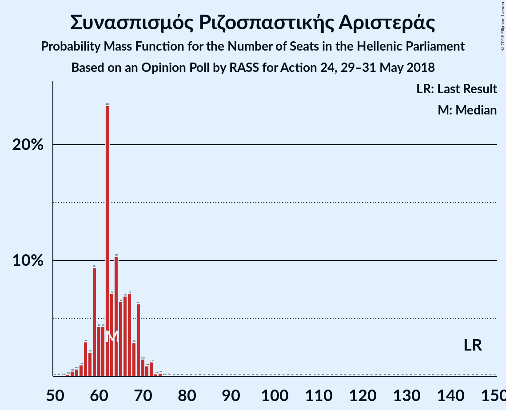
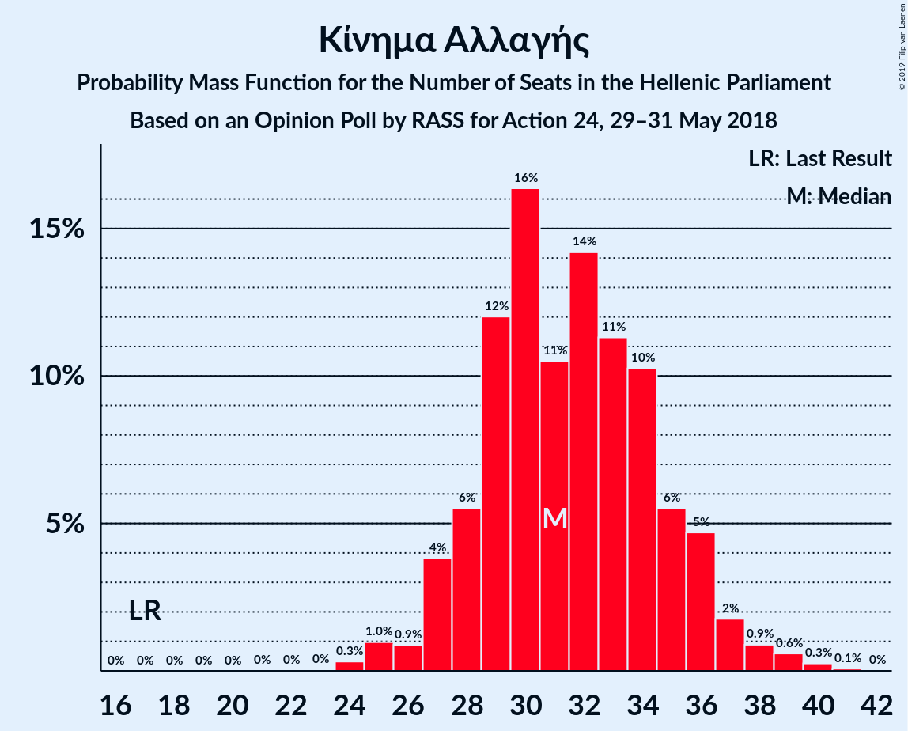

# Opinion Poll by RASS for Action 24, 29–31 May 2018

<a href="#voting-intentions">Voting Intentions</a> | <a href="#seats">Seats</a> | <a href="#coalitions">Coalitions</a> | <a href="#technical-information">Technical Information</a>

## Voting Intentions

### Confidence Intervals

| Party | Last Result | Poll Result | 80% Confidence Interval | 90% Confidence Interval | 95% Confidence Interval | 99% Confidence Interval |
|:-----:|:-----------:|:-----------:|:-----------------------:|:-----------------------:|:-----------------------:|:-----------------------:|
| Νέα Δημοκρατία | 28.1% | 36.2% | 34.3–38.2% |33.8–38.8% |33.3–39.3% |32.4–40.2% |
| Συνασπισμός Ριζοσπαστικής Αριστεράς | 35.5% | 23.7% | 22.0–25.4% |21.5–25.9% |21.1–26.4% |20.3–27.3% |
| Κίνημα Αλλαγής | 6.3% | 11.8% | 10.6–13.2% |10.2–13.6% |9.9–13.9% |9.4–14.6% |
| Χρυσή Αυγή | 7.0% | 8.5% | 7.5–9.7% |7.1–10.1% |6.9–10.4% |6.4–11.0% |
| Κομμουνιστικό Κόμμα Ελλάδας | 5.6% | 8.3% | 7.3–9.5% |7.0–9.9% |6.7–10.2% |6.3–10.8% |
| Ένωση Κεντρώων | 3.4% | 3.4% | 2.8–4.3% |2.6–4.5% |2.4–4.7% |2.2–5.2% |
| Ανεξάρτητοι Έλληνες | 3.7% | 3.0% | 2.4–3.8% |2.2–4.0% |2.1–4.3% |1.8–4.7% |

*Note:* The poll result column reflects the actual value used in the calculations. Published results may vary slightly, and in addition be rounded to fewer digits.

## Seats

### Confidence Intervals

| Party | Last Result | Median | 80% Confidence Interval | 90% Confidence Interval | 95% Confidence Interval | 99% Confidence Interval |
|:-----:|:-----------:|:------:|:-----------------------:|:-----------------------:|:-----------------------:|:-----------------------:|
| <a href="#νέα-δημοκρατία">Νέα Δημοκρατία</a> | 75 | 141 | 136–154 |136–154 |136–154 |136–162 |
| <a href="#συνασπισμός-ριζοσπαστικής-αριστεράς">Συνασπισμός Ριζοσπαστικής Αριστεράς</a> | 145 | 68 | 61–73 |59–73 |57–73 |52–75 |
| <a href="#κίνημα-αλλαγής">Κίνημα Αλλαγής</a> | 17 | 31 | 28–35 |28–35 |28–36 |26–38 |
| <a href="#χρυσή-αυγή">Χρυσή Αυγή</a> | 18 | 26 | 18–28 |15–28 |15–28 |15–33 |
| <a href="#κομμουνιστικό-κόμμα-ελλάδας">Κομμουνιστικό Κόμμα Ελλάδας</a> | 15 | 21 | 18–27 |18–27 |18–28 |15–31 |
| <a href="#ένωση-κεντρώων">Ένωση Κεντρώων</a> | 9 | 8 | 0–11 |0–13 |0–14 |0–14 |
| <a href="#ανεξάρτητοι-έλληνες">Ανεξάρτητοι Έλληνες</a> | 10 | 0 | 0–12 |0–12 |0–12 |0–13 |

### Νέα Δημοκρατία

*For a full overview of the results for this party, see the [Νέα Δημοκρατία](party-νέαδημοκρατία.html) page.*

| Number of Seats | Probability | Accumulated | Special Marks |
|:---------------:|:-----------:|:-----------:|:-------------:|
| 75 | 0% | 100% | Last Result |
| 76 | 0% | 100% |  |
| 77 | 0% | 100% |  |
| 78 | 0% | 100% |  |
| 79 | 0% | 100% |  |
| 80 | 0% | 100% |  |
| 81 | 0% | 100% |  |
| 82 | 0% | 100% |  |
| 83 | 0% | 100% |  |
| 84 | 0% | 100% |  |
| 85 | 0% | 100% |  |
| 86 | 0% | 100% |  |
| 87 | 0% | 100% |  |
| 88 | 0% | 100% |  |
| 89 | 0% | 100% |  |
| 90 | 0% | 100% |  |
| 91 | 0% | 100% |  |
| 92 | 0% | 100% |  |
| 93 | 0% | 100% |  |
| 94 | 0% | 100% |  |
| 95 | 0% | 100% |  |
| 96 | 0% | 100% |  |
| 97 | 0% | 100% |  |
| 98 | 0% | 100% |  |
| 99 | 0% | 100% |  |
| 100 | 0% | 100% |  |
| 101 | 0% | 100% |  |
| 102 | 0% | 100% |  |
| 103 | 0% | 100% |  |
| 104 | 0% | 100% |  |
| 105 | 0% | 100% |  |
| 106 | 0% | 100% |  |
| 107 | 0% | 100% |  |
| 108 | 0% | 100% |  |
| 109 | 0% | 100% |  |
| 110 | 0% | 100% |  |
| 111 | 0% | 100% |  |
| 112 | 0% | 100% |  |
| 113 | 0% | 100% |  |
| 114 | 0% | 100% |  |
| 115 | 0% | 100% |  |
| 116 | 0% | 100% |  |
| 117 | 0% | 100% |  |
| 118 | 0% | 100% |  |
| 119 | 0% | 100% |  |
| 120 | 0% | 100% |  |
| 121 | 0% | 100% |  |
| 122 | 0% | 100% |  |
| 123 | 0% | 100% |  |
| 124 | 0% | 100% |  |
| 125 | 0% | 100% |  |
| 126 | 0% | 100% |  |
| 127 | 0% | 100% |  |
| 128 | 0% | 100% |  |
| 129 | 0% | 100% |  |
| 130 | 0% | 100% |  |
| 131 | 0% | 100% |  |
| 132 | 0% | 100% |  |
| 133 | 0% | 100% |  |
| 134 | 0.1% | 100% |  |
| 135 | 0% | 99.9% |  |
| 136 | 11% | 99.9% |  |
| 137 | 0% | 89% |  |
| 138 | 1.2% | 89% |  |
| 139 | 0.9% | 87% |  |
| 140 | 2% | 87% |  |
| 141 | 44% | 85% | Median |
| 142 | 0% | 41% |  |
| 143 | 0% | 41% |  |
| 144 | 0.4% | 41% |  |
| 145 | 7% | 41% |  |
| 146 | 14% | 34% |  |
| 147 | 5% | 20% |  |
| 148 | 0.1% | 15% |  |
| 149 | 0% | 15% |  |
| 150 | 0% | 15% |  |
| 151 | 1.5% | 15% | Majority |
| 152 | 0% | 13% |  |
| 153 | 0.8% | 13% |  |
| 154 | 11% | 12% |  |
| 155 | 0.1% | 1.5% |  |
| 156 | 0% | 1.4% |  |
| 157 | 0% | 1.4% |  |
| 158 | 0.2% | 1.4% |  |
| 159 | 0% | 1.2% |  |
| 160 | 0% | 1.2% |  |
| 161 | 0% | 1.2% |  |
| 162 | 1.2% | 1.2% |  |
| 163 | 0% | 0% |  |

### Συνασπισμός Ριζοσπαστικής Αριστεράς

*For a full overview of the results for this party, see the [Συνασπισμός Ριζοσπαστικής Αριστεράς](party-συνασπισμόςριζοσπαστικήςαριστεράς.html) page.*

| Number of Seats | Probability | Accumulated | Special Marks |
|:---------------:|:-----------:|:-----------:|:-------------:|
| 52 | 1.5% | 100% |  |
| 53 | 0% | 98.5% |  |
| 54 | 0.1% | 98.5% |  |
| 55 | 0.5% | 98% |  |
| 56 | 0% | 98% |  |
| 57 | 1.5% | 98% |  |
| 58 | 0.2% | 96% |  |
| 59 | 1.3% | 96% |  |
| 60 | 1.2% | 95% |  |
| 61 | 10% | 94% |  |
| 62 | 0.4% | 84% |  |
| 63 | 4% | 84% |  |
| 64 | 5% | 79% |  |
| 65 | 5% | 74% |  |
| 66 | 1.2% | 70% |  |
| 67 | 11% | 68% |  |
| 68 | 10% | 57% | Median |
| 69 | 0% | 47% |  |
| 70 | 7% | 47% |  |
| 71 | 7% | 40% |  |
| 72 | 0.2% | 33% |  |
| 73 | 32% | 33% |  |
| 74 | 0% | 1.1% |  |
| 75 | 0.8% | 1.1% |  |
| 76 | 0.3% | 0.3% |  |
| 77 | 0% | 0% |  |
| 78 | 0% | 0% |  |
| 79 | 0% | 0% |  |
| 80 | 0% | 0% |  |
| 81 | 0% | 0% |  |
| 82 | 0% | 0% |  |
| 83 | 0% | 0% |  |
| 84 | 0% | 0% |  |
| 85 | 0% | 0% |  |
| 86 | 0% | 0% |  |
| 87 | 0% | 0% |  |
| 88 | 0% | 0% |  |
| 89 | 0% | 0% |  |
| 90 | 0% | 0% |  |
| 91 | 0% | 0% |  |
| 92 | 0% | 0% |  |
| 93 | 0% | 0% |  |
| 94 | 0% | 0% |  |
| 95 | 0% | 0% |  |
| 96 | 0% | 0% |  |
| 97 | 0% | 0% |  |
| 98 | 0% | 0% |  |
| 99 | 0% | 0% |  |
| 100 | 0% | 0% |  |
| 101 | 0% | 0% |  |
| 102 | 0% | 0% |  |
| 103 | 0% | 0% |  |
| 104 | 0% | 0% |  |
| 105 | 0% | 0% |  |
| 106 | 0% | 0% |  |
| 107 | 0% | 0% |  |
| 108 | 0% | 0% |  |
| 109 | 0% | 0% |  |
| 110 | 0% | 0% |  |
| 111 | 0% | 0% |  |
| 112 | 0% | 0% |  |
| 113 | 0% | 0% |  |
| 114 | 0% | 0% |  |
| 115 | 0% | 0% |  |
| 116 | 0% | 0% |  |
| 117 | 0% | 0% |  |
| 118 | 0% | 0% |  |
| 119 | 0% | 0% |  |
| 120 | 0% | 0% |  |
| 121 | 0% | 0% |  |
| 122 | 0% | 0% |  |
| 123 | 0% | 0% |  |
| 124 | 0% | 0% |  |
| 125 | 0% | 0% |  |
| 126 | 0% | 0% |  |
| 127 | 0% | 0% |  |
| 128 | 0% | 0% |  |
| 129 | 0% | 0% |  |
| 130 | 0% | 0% |  |
| 131 | 0% | 0% |  |
| 132 | 0% | 0% |  |
| 133 | 0% | 0% |  |
| 134 | 0% | 0% |  |
| 135 | 0% | 0% |  |
| 136 | 0% | 0% |  |
| 137 | 0% | 0% |  |
| 138 | 0% | 0% |  |
| 139 | 0% | 0% |  |
| 140 | 0% | 0% |  |
| 141 | 0% | 0% |  |
| 142 | 0% | 0% |  |
| 143 | 0% | 0% |  |
| 144 | 0% | 0% |  |
| 145 | 0% | 0% | Last Result |

### Κίνημα Αλλαγής

*For a full overview of the results for this party, see the [Κίνημα Αλλαγής](party-κίνημααλλαγής.html) page.*

| Number of Seats | Probability | Accumulated | Special Marks |
|:---------------:|:-----------:|:-----------:|:-------------:|
| 17 | 0% | 100% | Last Result |
| 18 | 0% | 100% |  |
| 19 | 0% | 100% |  |
| 20 | 0% | 100% |  |
| 21 | 0% | 100% |  |
| 22 | 0% | 100% |  |
| 23 | 0% | 100% |  |
| 24 | 0.1% | 100% |  |
| 25 | 0% | 99.9% |  |
| 26 | 1.5% | 99.9% |  |
| 27 | 0% | 98% |  |
| 28 | 13% | 98% |  |
| 29 | 1.2% | 85% |  |
| 30 | 4% | 84% |  |
| 31 | 33% | 80% | Median |
| 32 | 0% | 47% |  |
| 33 | 27% | 47% |  |
| 34 | 0.9% | 20% |  |
| 35 | 16% | 19% |  |
| 36 | 2% | 4% |  |
| 37 | 0% | 2% |  |
| 38 | 2% | 2% |  |
| 39 | 0.1% | 0.3% |  |
| 40 | 0.2% | 0.3% |  |
| 41 | 0% | 0% |  |

### Χρυσή Αυγή

*For a full overview of the results for this party, see the [Χρυσή Αυγή](party-χρυσήαυγή.html) page.*

| Number of Seats | Probability | Accumulated | Special Marks |
|:---------------:|:-----------:|:-----------:|:-------------:|
| 15 | 5% | 100% |  |
| 16 | 1.2% | 95% |  |
| 17 | 0.5% | 94% |  |
| 18 | 14% | 93% | Last Result |
| 19 | 4% | 79% |  |
| 20 | 0% | 75% |  |
| 21 | 9% | 75% |  |
| 22 | 3% | 66% |  |
| 23 | 0.1% | 63% |  |
| 24 | 2% | 63% |  |
| 25 | 0.9% | 61% |  |
| 26 | 32% | 60% | Median |
| 27 | 15% | 28% |  |
| 28 | 11% | 13% |  |
| 29 | 0.5% | 2% |  |
| 30 | 0% | 1.1% |  |
| 31 | 0% | 1.1% |  |
| 32 | 0% | 1.0% |  |
| 33 | 0.6% | 1.0% |  |
| 34 | 0.4% | 0.4% |  |
| 35 | 0% | 0% |  |

### Κομμουνιστικό Κόμμα Ελλάδας

*For a full overview of the results for this party, see the [Κομμουνιστικό Κόμμα Ελλάδας](party-κομμουνιστικόκόμμαελλάδας.html) page.*

| Number of Seats | Probability | Accumulated | Special Marks |
|:---------------:|:-----------:|:-----------:|:-------------:|
| 15 | 1.4% | 100% | Last Result |
| 16 | 0.3% | 98.6% |  |
| 17 | 0% | 98% |  |
| 18 | 20% | 98% |  |
| 19 | 0% | 78% |  |
| 20 | 0% | 78% |  |
| 21 | 39% | 78% | Median |
| 22 | 1.3% | 39% |  |
| 23 | 7% | 38% |  |
| 24 | 0% | 31% |  |
| 25 | 1.5% | 31% |  |
| 26 | 0.7% | 30% |  |
| 27 | 26% | 29% |  |
| 28 | 2% | 3% |  |
| 29 | 0% | 0.9% |  |
| 30 | 0.1% | 0.8% |  |
| 31 | 0.7% | 0.8% |  |
| 32 | 0% | 0% |  |

### Ένωση Κεντρώων

*For a full overview of the results for this party, see the [Ένωση Κεντρώων](party-ένωσηκεντρώων.html) page.*

| Number of Seats | Probability | Accumulated | Special Marks |
|:---------------:|:-----------:|:-----------:|:-------------:|
| 0 | 28% | 100% |  |
| 1 | 0% | 72% |  |
| 2 | 0% | 72% |  |
| 3 | 0% | 72% |  |
| 4 | 0% | 72% |  |
| 5 | 0% | 72% |  |
| 6 | 0% | 72% |  |
| 7 | 0% | 72% |  |
| 8 | 33% | 72% | Median |
| 9 | 1.1% | 39% | Last Result |
| 10 | 8% | 38% |  |
| 11 | 24% | 30% |  |
| 12 | 0.4% | 6% |  |
| 13 | 0.8% | 5% |  |
| 14 | 4% | 4% |  |
| 15 | 0% | 0.1% |  |
| 16 | 0% | 0% |  |

### Ανεξάρτητοι Έλληνες

*For a full overview of the results for this party, see the [Ανεξάρτητοι Έλληνες](party-ανεξάρτητοιέλληνες.html) page.*

| Number of Seats | Probability | Accumulated | Special Marks |
|:---------------:|:-----------:|:-----------:|:-------------:|
| 0 | 64% | 100% | Median |
| 1 | 0% | 36% |  |
| 2 | 0% | 36% |  |
| 3 | 0% | 36% |  |
| 4 | 0% | 36% |  |
| 5 | 0% | 36% |  |
| 6 | 0% | 36% |  |
| 7 | 0% | 36% |  |
| 8 | 11% | 36% |  |
| 9 | 4% | 24% |  |
| 10 | 7% | 20% | Last Result |
| 11 | 0.1% | 12% |  |
| 12 | 12% | 12% |  |
| 13 | 0.7% | 0.8% |  |
| 14 | 0% | 0% |  |

## Coalitions

### Confidence Intervals

| Coalition | Last Result | Median | Majority? | 80% Confidence Interval | 90% Confidence Interval | 95% Confidence Interval | 99% Confidence Interval |
|:---------:|:-----------:|:------:|:---------:|:-----------------------:|:-----------------------:|:-----------------------:|:-----------------------:|
| Νέα Δημοκρατία – Κίνημα Αλλαγής | 92 | 172 | 100% | 169–187 | 166–187 | 166–189 | 166–191 |
| Νέα Δημοκρατία | 75 | 141 | 15% | 136–154 | 136–154 | 136–154 | 136–162 |
| Συνασπισμός Ριζοσπαστικής Αριστεράς – Ανεξάρτητοι Έλληνες | 155 | 73 | 0% | 64–75 | 63–80 | 61–80 | 58–80 |
| Συνασπισμός Ριζοσπαστικής Αριστεράς | 145 | 68 | 0% | 61–73 | 59–73 | 57–73 | 52–75 |

### Νέα Δημοκρατία – Κίνημα Αλλαγής

| Number of Seats | Probability | Accumulated | Special Marks |
|:---------------:|:-----------:|:-----------:|:-------------:|
| 92 | 0% | 100% | Last Result |
| 93 | 0% | 100% |  |
| 94 | 0% | 100% |  |
| 95 | 0% | 100% |  |
| 96 | 0% | 100% |  |
| 97 | 0% | 100% |  |
| 98 | 0% | 100% |  |
| 99 | 0% | 100% |  |
| 100 | 0% | 100% |  |
| 101 | 0% | 100% |  |
| 102 | 0% | 100% |  |
| 103 | 0% | 100% |  |
| 104 | 0% | 100% |  |
| 105 | 0% | 100% |  |
| 106 | 0% | 100% |  |
| 107 | 0% | 100% |  |
| 108 | 0% | 100% |  |
| 109 | 0% | 100% |  |
| 110 | 0% | 100% |  |
| 111 | 0% | 100% |  |
| 112 | 0% | 100% |  |
| 113 | 0% | 100% |  |
| 114 | 0% | 100% |  |
| 115 | 0% | 100% |  |
| 116 | 0% | 100% |  |
| 117 | 0% | 100% |  |
| 118 | 0% | 100% |  |
| 119 | 0% | 100% |  |
| 120 | 0% | 100% |  |
| 121 | 0% | 100% |  |
| 122 | 0% | 100% |  |
| 123 | 0% | 100% |  |
| 124 | 0% | 100% |  |
| 125 | 0% | 100% |  |
| 126 | 0% | 100% |  |
| 127 | 0% | 100% |  |
| 128 | 0% | 100% |  |
| 129 | 0% | 100% |  |
| 130 | 0% | 100% |  |
| 131 | 0% | 100% |  |
| 132 | 0% | 100% |  |
| 133 | 0% | 100% |  |
| 134 | 0% | 100% |  |
| 135 | 0% | 100% |  |
| 136 | 0% | 100% |  |
| 137 | 0% | 100% |  |
| 138 | 0% | 100% |  |
| 139 | 0% | 100% |  |
| 140 | 0% | 100% |  |
| 141 | 0% | 100% |  |
| 142 | 0% | 100% |  |
| 143 | 0% | 100% |  |
| 144 | 0% | 100% |  |
| 145 | 0% | 100% |  |
| 146 | 0% | 100% |  |
| 147 | 0% | 100% |  |
| 148 | 0% | 100% |  |
| 149 | 0% | 100% |  |
| 150 | 0% | 100% |  |
| 151 | 0% | 100% | Majority |
| 152 | 0% | 100% |  |
| 153 | 0% | 100% |  |
| 154 | 0% | 100% |  |
| 155 | 0% | 100% |  |
| 156 | 0% | 100% |  |
| 157 | 0% | 100% |  |
| 158 | 0% | 100% |  |
| 159 | 0% | 100% |  |
| 160 | 0% | 100% |  |
| 161 | 0% | 100% |  |
| 162 | 0% | 100% |  |
| 163 | 0% | 100% |  |
| 164 | 0% | 100% |  |
| 165 | 0% | 100% |  |
| 166 | 5% | 100% |  |
| 167 | 0% | 95% |  |
| 168 | 0% | 95% |  |
| 169 | 18% | 95% |  |
| 170 | 0% | 77% |  |
| 171 | 0% | 77% |  |
| 172 | 32% | 77% | Median |
| 173 | 3% | 45% |  |
| 174 | 1.2% | 42% |  |
| 175 | 0% | 41% |  |
| 176 | 1.4% | 41% |  |
| 177 | 0% | 40% |  |
| 178 | 0.4% | 40% |  |
| 179 | 11% | 39% |  |
| 180 | 4% | 28% |  |
| 181 | 5% | 24% |  |
| 182 | 5% | 19% |  |
| 183 | 0% | 14% |  |
| 184 | 0% | 14% |  |
| 185 | 0.6% | 14% |  |
| 186 | 0% | 13% |  |
| 187 | 10% | 13% |  |
| 188 | 0% | 3% |  |
| 189 | 2% | 3% |  |
| 190 | 0% | 1.2% |  |
| 191 | 1.2% | 1.2% |  |
| 192 | 0% | 0% |  |

### Νέα Δημοκρατία

| Number of Seats | Probability | Accumulated | Special Marks |
|:---------------:|:-----------:|:-----------:|:-------------:|
| 75 | 0% | 100% | Last Result |
| 76 | 0% | 100% |  |
| 77 | 0% | 100% |  |
| 78 | 0% | 100% |  |
| 79 | 0% | 100% |  |
| 80 | 0% | 100% |  |
| 81 | 0% | 100% |  |
| 82 | 0% | 100% |  |
| 83 | 0% | 100% |  |
| 84 | 0% | 100% |  |
| 85 | 0% | 100% |  |
| 86 | 0% | 100% |  |
| 87 | 0% | 100% |  |
| 88 | 0% | 100% |  |
| 89 | 0% | 100% |  |
| 90 | 0% | 100% |  |
| 91 | 0% | 100% |  |
| 92 | 0% | 100% |  |
| 93 | 0% | 100% |  |
| 94 | 0% | 100% |  |
| 95 | 0% | 100% |  |
| 96 | 0% | 100% |  |
| 97 | 0% | 100% |  |
| 98 | 0% | 100% |  |
| 99 | 0% | 100% |  |
| 100 | 0% | 100% |  |
| 101 | 0% | 100% |  |
| 102 | 0% | 100% |  |
| 103 | 0% | 100% |  |
| 104 | 0% | 100% |  |
| 105 | 0% | 100% |  |
| 106 | 0% | 100% |  |
| 107 | 0% | 100% |  |
| 108 | 0% | 100% |  |
| 109 | 0% | 100% |  |
| 110 | 0% | 100% |  |
| 111 | 0% | 100% |  |
| 112 | 0% | 100% |  |
| 113 | 0% | 100% |  |
| 114 | 0% | 100% |  |
| 115 | 0% | 100% |  |
| 116 | 0% | 100% |  |
| 117 | 0% | 100% |  |
| 118 | 0% | 100% |  |
| 119 | 0% | 100% |  |
| 120 | 0% | 100% |  |
| 121 | 0% | 100% |  |
| 122 | 0% | 100% |  |
| 123 | 0% | 100% |  |
| 124 | 0% | 100% |  |
| 125 | 0% | 100% |  |
| 126 | 0% | 100% |  |
| 127 | 0% | 100% |  |
| 128 | 0% | 100% |  |
| 129 | 0% | 100% |  |
| 130 | 0% | 100% |  |
| 131 | 0% | 100% |  |
| 132 | 0% | 100% |  |
| 133 | 0% | 100% |  |
| 134 | 0.1% | 100% |  |
| 135 | 0% | 99.9% |  |
| 136 | 11% | 99.9% |  |
| 137 | 0% | 89% |  |
| 138 | 1.2% | 89% |  |
| 139 | 0.9% | 87% |  |
| 140 | 2% | 87% |  |
| 141 | 44% | 85% | Median |
| 142 | 0% | 41% |  |
| 143 | 0% | 41% |  |
| 144 | 0.4% | 41% |  |
| 145 | 7% | 41% |  |
| 146 | 14% | 34% |  |
| 147 | 5% | 20% |  |
| 148 | 0.1% | 15% |  |
| 149 | 0% | 15% |  |
| 150 | 0% | 15% |  |
| 151 | 1.5% | 15% | Majority |
| 152 | 0% | 13% |  |
| 153 | 0.8% | 13% |  |
| 154 | 11% | 12% |  |
| 155 | 0.1% | 1.5% |  |
| 156 | 0% | 1.4% |  |
| 157 | 0% | 1.4% |  |
| 158 | 0.2% | 1.4% |  |
| 159 | 0% | 1.2% |  |
| 160 | 0% | 1.2% |  |
| 161 | 0% | 1.2% |  |
| 162 | 1.2% | 1.2% |  |
| 163 | 0% | 0% |  |

### Συνασπισμός Ριζοσπαστικής Αριστεράς – Ανεξάρτητοι Έλληνες

| Number of Seats | Probability | Accumulated | Special Marks |
|:---------------:|:-----------:|:-----------:|:-------------:|
| 55 | 0.4% | 100% |  |
| 56 | 0% | 99.6% |  |
| 57 | 0% | 99.6% |  |
| 58 | 0.2% | 99.6% |  |
| 59 | 0.6% | 99.3% |  |
| 60 | 1.2% | 98.7% |  |
| 61 | 0.5% | 98% |  |
| 62 | 0.4% | 97% |  |
| 63 | 4% | 97% |  |
| 64 | 6% | 92% |  |
| 65 | 0% | 86% |  |
| 66 | 0% | 86% |  |
| 67 | 0% | 86% |  |
| 68 | 10% | 86% | Median |
| 69 | 1.4% | 76% |  |
| 70 | 2% | 74% |  |
| 71 | 7% | 72% |  |
| 72 | 0.2% | 65% |  |
| 73 | 41% | 65% |  |
| 74 | 4% | 23% |  |
| 75 | 12% | 19% |  |
| 76 | 1.4% | 7% |  |
| 77 | 0% | 5% |  |
| 78 | 0% | 5% |  |
| 79 | 0% | 5% |  |
| 80 | 5% | 5% |  |
| 81 | 0% | 0% |  |
| 82 | 0% | 0% |  |
| 83 | 0% | 0% |  |
| 84 | 0% | 0% |  |
| 85 | 0% | 0% |  |
| 86 | 0% | 0% |  |
| 87 | 0% | 0% |  |
| 88 | 0% | 0% |  |
| 89 | 0% | 0% |  |
| 90 | 0% | 0% |  |
| 91 | 0% | 0% |  |
| 92 | 0% | 0% |  |
| 93 | 0% | 0% |  |
| 94 | 0% | 0% |  |
| 95 | 0% | 0% |  |
| 96 | 0% | 0% |  |
| 97 | 0% | 0% |  |
| 98 | 0% | 0% |  |
| 99 | 0% | 0% |  |
| 100 | 0% | 0% |  |
| 101 | 0% | 0% |  |
| 102 | 0% | 0% |  |
| 103 | 0% | 0% |  |
| 104 | 0% | 0% |  |
| 105 | 0% | 0% |  |
| 106 | 0% | 0% |  |
| 107 | 0% | 0% |  |
| 108 | 0% | 0% |  |
| 109 | 0% | 0% |  |
| 110 | 0% | 0% |  |
| 111 | 0% | 0% |  |
| 112 | 0% | 0% |  |
| 113 | 0% | 0% |  |
| 114 | 0% | 0% |  |
| 115 | 0% | 0% |  |
| 116 | 0% | 0% |  |
| 117 | 0% | 0% |  |
| 118 | 0% | 0% |  |
| 119 | 0% | 0% |  |
| 120 | 0% | 0% |  |
| 121 | 0% | 0% |  |
| 122 | 0% | 0% |  |
| 123 | 0% | 0% |  |
| 124 | 0% | 0% |  |
| 125 | 0% | 0% |  |
| 126 | 0% | 0% |  |
| 127 | 0% | 0% |  |
| 128 | 0% | 0% |  |
| 129 | 0% | 0% |  |
| 130 | 0% | 0% |  |
| 131 | 0% | 0% |  |
| 132 | 0% | 0% |  |
| 133 | 0% | 0% |  |
| 134 | 0% | 0% |  |
| 135 | 0% | 0% |  |
| 136 | 0% | 0% |  |
| 137 | 0% | 0% |  |
| 138 | 0% | 0% |  |
| 139 | 0% | 0% |  |
| 140 | 0% | 0% |  |
| 141 | 0% | 0% |  |
| 142 | 0% | 0% |  |
| 143 | 0% | 0% |  |
| 144 | 0% | 0% |  |
| 145 | 0% | 0% |  |
| 146 | 0% | 0% |  |
| 147 | 0% | 0% |  |
| 148 | 0% | 0% |  |
| 149 | 0% | 0% |  |
| 150 | 0% | 0% |  |
| 151 | 0% | 0% | Majority |
| 152 | 0% | 0% |  |
| 153 | 0% | 0% |  |
| 154 | 0% | 0% |  |
| 155 | 0% | 0% | Last Result |

### Συνασπισμός Ριζοσπαστικής Αριστεράς

| Number of Seats | Probability | Accumulated | Special Marks |
|:---------------:|:-----------:|:-----------:|:-------------:|
| 52 | 1.5% | 100% |  |
| 53 | 0% | 98.5% |  |
| 54 | 0.1% | 98.5% |  |
| 55 | 0.5% | 98% |  |
| 56 | 0% | 98% |  |
| 57 | 1.5% | 98% |  |
| 58 | 0.2% | 96% |  |
| 59 | 1.3% | 96% |  |
| 60 | 1.2% | 95% |  |
| 61 | 10% | 94% |  |
| 62 | 0.4% | 84% |  |
| 63 | 4% | 84% |  |
| 64 | 5% | 79% |  |
| 65 | 5% | 74% |  |
| 66 | 1.2% | 70% |  |
| 67 | 11% | 68% |  |
| 68 | 10% | 57% | Median |
| 69 | 0% | 47% |  |
| 70 | 7% | 47% |  |
| 71 | 7% | 40% |  |
| 72 | 0.2% | 33% |  |
| 73 | 32% | 33% |  |
| 74 | 0% | 1.1% |  |
| 75 | 0.8% | 1.1% |  |
| 76 | 0.3% | 0.3% |  |
| 77 | 0% | 0% |  |
| 78 | 0% | 0% |  |
| 79 | 0% | 0% |  |
| 80 | 0% | 0% |  |
| 81 | 0% | 0% |  |
| 82 | 0% | 0% |  |
| 83 | 0% | 0% |  |
| 84 | 0% | 0% |  |
| 85 | 0% | 0% |  |
| 86 | 0% | 0% |  |
| 87 | 0% | 0% |  |
| 88 | 0% | 0% |  |
| 89 | 0% | 0% |  |
| 90 | 0% | 0% |  |
| 91 | 0% | 0% |  |
| 92 | 0% | 0% |  |
| 93 | 0% | 0% |  |
| 94 | 0% | 0% |  |
| 95 | 0% | 0% |  |
| 96 | 0% | 0% |  |
| 97 | 0% | 0% |  |
| 98 | 0% | 0% |  |
| 99 | 0% | 0% |  |
| 100 | 0% | 0% |  |
| 101 | 0% | 0% |  |
| 102 | 0% | 0% |  |
| 103 | 0% | 0% |  |
| 104 | 0% | 0% |  |
| 105 | 0% | 0% |  |
| 106 | 0% | 0% |  |
| 107 | 0% | 0% |  |
| 108 | 0% | 0% |  |
| 109 | 0% | 0% |  |
| 110 | 0% | 0% |  |
| 111 | 0% | 0% |  |
| 112 | 0% | 0% |  |
| 113 | 0% | 0% |  |
| 114 | 0% | 0% |  |
| 115 | 0% | 0% |  |
| 116 | 0% | 0% |  |
| 117 | 0% | 0% |  |
| 118 | 0% | 0% |  |
| 119 | 0% | 0% |  |
| 120 | 0% | 0% |  |
| 121 | 0% | 0% |  |
| 122 | 0% | 0% |  |
| 123 | 0% | 0% |  |
| 124 | 0% | 0% |  |
| 125 | 0% | 0% |  |
| 126 | 0% | 0% |  |
| 127 | 0% | 0% |  |
| 128 | 0% | 0% |  |
| 129 | 0% | 0% |  |
| 130 | 0% | 0% |  |
| 131 | 0% | 0% |  |
| 132 | 0% | 0% |  |
| 133 | 0% | 0% |  |
| 134 | 0% | 0% |  |
| 135 | 0% | 0% |  |
| 136 | 0% | 0% |  |
| 137 | 0% | 0% |  |
| 138 | 0% | 0% |  |
| 139 | 0% | 0% |  |
| 140 | 0% | 0% |  |
| 141 | 0% | 0% |  |
| 142 | 0% | 0% |  |
| 143 | 0% | 0% |  |
| 144 | 0% | 0% |  |
| 145 | 0% | 0% | Last Result |

## Technical Information

### Opinion Poll

+ **Polling firm:** RASS
+ **Commissioner(s):** Action 24
+ **Fieldwork period:** 29–31 May 2018

### Calculations

+ **Sample size:** 1002
+ **Simulations done:** 1,024
+ **Error estimate:** 2.83%

