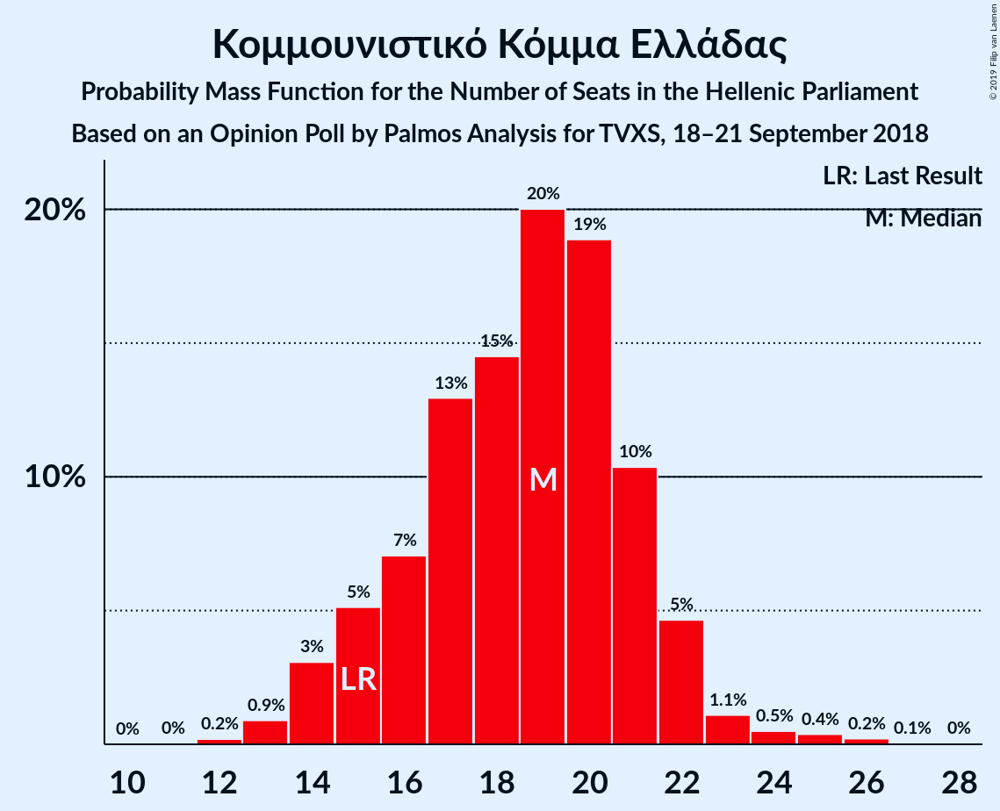
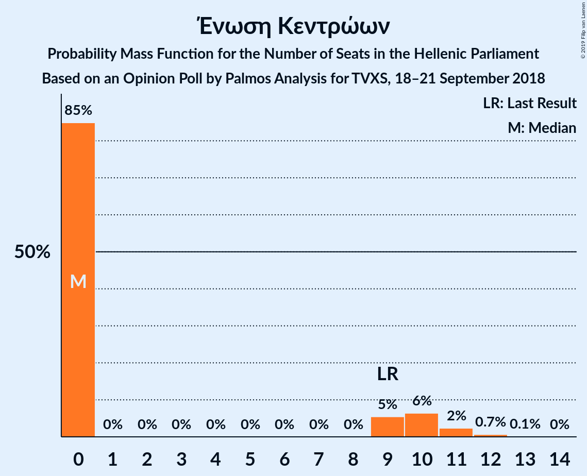

# Opinion Poll by Palmos Analysis for TVXS, 18–21 September 2018

<a href="#voting-intentions">Voting Intentions</a> | <a href="#seats">Seats</a> | <a href="#coalitions">Coalitions</a> | <a href="#technical-information">Technical Information</a>

## Voting Intentions

### Confidence Intervals

| Party | Last Result | Poll Result | 80% Confidence Interval | 90% Confidence Interval | 95% Confidence Interval | 99% Confidence Interval |
|:-----:|:-----------:|:-----------:|:-----------------------:|:-----------------------:|:-----------------------:|:-----------------------:|
| Νέα Δημοκρατία | 28.1% | 34.0% | 32.1–35.9% |31.6–36.5% |31.1–36.9% |30.2–37.9% |
| Συνασπισμός Ριζοσπαστικής Αριστεράς | 35.5% | 28.0% | 26.2–29.8% |25.7–30.3% |25.3–30.8% |24.4–31.7% |
| Κίνημα Αλλαγής | 6.3% | 8.0% | 7.0–9.2% |6.7–9.5% |6.5–9.8% |6.0–10.4% |
| Κομμουνιστικό Κόμμα Ελλάδας | 5.6% | 6.0% | 5.1–7.1% |4.9–7.4% |4.7–7.7% |4.3–8.2% |
| Χρυσή Αυγή | 7.0% | 5.5% | 4.7–6.6% |4.5–6.8% |4.3–7.1% |3.9–7.6% |
| Το Ποτάμι | 4.1% | 2.5% | 1.9–3.2% |1.8–3.4% |1.7–3.6% |1.4–4.0% |
| Ένωση Κεντρώων | 3.4% | 2.5% | 1.9–3.2% |1.8–3.4% |1.7–3.6% |1.4–4.0% |
| Ανεξάρτητοι Έλληνες | 3.7% | 1.5% | 1.1–2.1% |1.0–2.3% |0.9–2.4% |0.7–2.8% |

*Note:* The poll result column reflects the actual value used in the calculations. Published results may vary slightly, and in addition be rounded to fewer digits.

## Seats

### Confidence Intervals

| Party | Last Result | Median | 80% Confidence Interval | 90% Confidence Interval | 95% Confidence Interval | 99% Confidence Interval |
|:-----:|:-----------:|:------:|:-----------------------:|:-----------------------:|:-----------------------:|:-----------------------:|
| <a href="#νέα-δημοκρατία">Νέα Δημοκρατία</a> | 75 | 152 | 146–157 |145–159 |143–161 |92–163 |
| <a href="#συνασπισμός-ριζοσπαστικής-αριστεράς">Συνασπισμός Ριζοσπαστικής Αριστεράς</a> | 145 | 83 | 79–90 |78–93 |77–93 |73–142 |
| <a href="#κίνημα-αλλαγής">Κίνημα Αλλαγής</a> | 17 | 25 | 21–27 |20–30 |20–31 |19–32 |
| <a href="#κομμουνιστικό-κόμμα-ελλάδας">Κομμουνιστικό Κόμμα Ελλάδας</a> | 15 | 19 | 16–21 |15–22 |14–23 |13–25 |
| <a href="#χρυσή-αυγή">Χρυσή Αυγή</a> | 18 | 17 | 14–20 |13–20 |13–21 |12–23 |
| <a href="#το-ποτάμι">Το Ποτάμι</a> | 11 | 0 | 0–10 |0–10 |0–11 |0–12 |
| <a href="#ένωση-κεντρώων">Ένωση Κεντρώων</a> | 9 | 0 | 0–10 |0–10 |0–11 |0–12 |
| <a href="#ανεξάρτητοι-έλληνες">Ανεξάρτητοι Έλληνες</a> | 10 | 0 | 0 |0 |0 |0 |

### Νέα Δημοκρατία

*For a full overview of the results for this party, see the [Νέα Δημοκρατία](party-νέαδημοκρατία.html) page.*

| Number of Seats | Probability | Accumulated | Special Marks |
|:---------------:|:-----------:|:-----------:|:-------------:|
| 75 | 0% | 100% | Last Result |
| 76 | 0% | 100% |  |
| 77 | 0% | 100% |  |
| 78 | 0% | 100% |  |
| 79 | 0% | 100% |  |
| 80 | 0% | 100% |  |
| 81 | 0% | 100% |  |
| 82 | 0% | 100% |  |
| 83 | 0% | 100% |  |
| 84 | 0% | 100% |  |
| 85 | 0% | 100% |  |
| 86 | 0% | 100% |  |
| 87 | 0% | 100% |  |
| 88 | 0% | 100% |  |
| 89 | 0.3% | 99.9% |  |
| 90 | 0% | 99.6% |  |
| 91 | 0% | 99.6% |  |
| 92 | 0.1% | 99.6% |  |
| 93 | 0% | 99.5% |  |
| 94 | 0% | 99.5% |  |
| 95 | 0% | 99.5% |  |
| 96 | 0% | 99.4% |  |
| 97 | 0% | 99.4% |  |
| 98 | 0% | 99.4% |  |
| 99 | 0% | 99.4% |  |
| 100 | 0% | 99.4% |  |
| 101 | 0% | 99.4% |  |
| 102 | 0% | 99.4% |  |
| 103 | 0% | 99.4% |  |
| 104 | 0% | 99.4% |  |
| 105 | 0% | 99.4% |  |
| 106 | 0% | 99.4% |  |
| 107 | 0% | 99.4% |  |
| 108 | 0% | 99.4% |  |
| 109 | 0% | 99.4% |  |
| 110 | 0% | 99.4% |  |
| 111 | 0% | 99.4% |  |
| 112 | 0% | 99.4% |  |
| 113 | 0% | 99.4% |  |
| 114 | 0% | 99.4% |  |
| 115 | 0% | 99.4% |  |
| 116 | 0% | 99.4% |  |
| 117 | 0% | 99.4% |  |
| 118 | 0% | 99.4% |  |
| 119 | 0% | 99.4% |  |
| 120 | 0% | 99.4% |  |
| 121 | 0% | 99.4% |  |
| 122 | 0% | 99.4% |  |
| 123 | 0% | 99.4% |  |
| 124 | 0% | 99.4% |  |
| 125 | 0% | 99.4% |  |
| 126 | 0% | 99.4% |  |
| 127 | 0% | 99.4% |  |
| 128 | 0% | 99.4% |  |
| 129 | 0% | 99.4% |  |
| 130 | 0% | 99.4% |  |
| 131 | 0% | 99.4% |  |
| 132 | 0% | 99.4% |  |
| 133 | 0% | 99.4% |  |
| 134 | 0% | 99.4% |  |
| 135 | 0% | 99.4% |  |
| 136 | 0% | 99.4% |  |
| 137 | 0% | 99.4% |  |
| 138 | 0.4% | 99.3% |  |
| 139 | 0% | 98.9% |  |
| 140 | 0.1% | 98.9% |  |
| 141 | 0.4% | 98.8% |  |
| 142 | 0.5% | 98% |  |
| 143 | 0.3% | 98% |  |
| 144 | 2% | 97% |  |
| 145 | 5% | 96% |  |
| 146 | 5% | 91% |  |
| 147 | 4% | 87% |  |
| 148 | 4% | 83% |  |
| 149 | 10% | 78% |  |
| 150 | 2% | 68% |  |
| 151 | 3% | 67% | Majority |
| 152 | 22% | 64% | Median |
| 153 | 3% | 42% |  |
| 154 | 5% | 39% |  |
| 155 | 14% | 34% |  |
| 156 | 10% | 20% |  |
| 157 | 2% | 10% |  |
| 158 | 2% | 8% |  |
| 159 | 2% | 6% |  |
| 160 | 0.9% | 4% |  |
| 161 | 1.1% | 3% |  |
| 162 | 0.4% | 2% |  |
| 163 | 1.0% | 1.5% |  |
| 164 | 0.1% | 0.5% |  |
| 165 | 0.3% | 0.4% |  |
| 166 | 0.1% | 0.1% |  |
| 167 | 0.1% | 0.1% |  |
| 168 | 0% | 0% |  |

### Συνασπισμός Ριζοσπαστικής Αριστεράς

*For a full overview of the results for this party, see the [Συνασπισμός Ριζοσπαστικής Αριστεράς](party-συνασπισμόςριζοσπαστικήςαριστεράς.html) page.*

| Number of Seats | Probability | Accumulated | Special Marks |
|:---------------:|:-----------:|:-----------:|:-------------:|
| 70 | 0.1% | 100% |  |
| 71 | 0% | 99.8% |  |
| 72 | 0.1% | 99.8% |  |
| 73 | 0.4% | 99.7% |  |
| 74 | 0.1% | 99.3% |  |
| 75 | 0.8% | 99.2% |  |
| 76 | 0.9% | 98% |  |
| 77 | 2% | 98% |  |
| 78 | 1.1% | 95% |  |
| 79 | 17% | 94% |  |
| 80 | 9% | 77% |  |
| 81 | 6% | 68% |  |
| 82 | 3% | 63% |  |
| 83 | 22% | 59% | Median |
| 84 | 2% | 37% |  |
| 85 | 4% | 36% |  |
| 86 | 0.7% | 32% |  |
| 87 | 6% | 31% |  |
| 88 | 2% | 25% |  |
| 89 | 10% | 23% |  |
| 90 | 4% | 14% |  |
| 91 | 2% | 10% |  |
| 92 | 2% | 7% |  |
| 93 | 4% | 5% |  |
| 94 | 0.3% | 1.1% |  |
| 95 | 0% | 0.7% |  |
| 96 | 0% | 0.7% |  |
| 97 | 0.1% | 0.7% |  |
| 98 | 0% | 0.6% |  |
| 99 | 0% | 0.6% |  |
| 100 | 0% | 0.6% |  |
| 101 | 0% | 0.6% |  |
| 102 | 0% | 0.6% |  |
| 103 | 0% | 0.6% |  |
| 104 | 0% | 0.6% |  |
| 105 | 0% | 0.6% |  |
| 106 | 0% | 0.6% |  |
| 107 | 0% | 0.6% |  |
| 108 | 0% | 0.6% |  |
| 109 | 0% | 0.6% |  |
| 110 | 0% | 0.6% |  |
| 111 | 0% | 0.6% |  |
| 112 | 0% | 0.6% |  |
| 113 | 0% | 0.6% |  |
| 114 | 0% | 0.6% |  |
| 115 | 0% | 0.6% |  |
| 116 | 0% | 0.6% |  |
| 117 | 0% | 0.6% |  |
| 118 | 0% | 0.6% |  |
| 119 | 0% | 0.6% |  |
| 120 | 0% | 0.6% |  |
| 121 | 0% | 0.6% |  |
| 122 | 0% | 0.6% |  |
| 123 | 0% | 0.6% |  |
| 124 | 0% | 0.6% |  |
| 125 | 0% | 0.6% |  |
| 126 | 0% | 0.6% |  |
| 127 | 0% | 0.6% |  |
| 128 | 0% | 0.6% |  |
| 129 | 0% | 0.6% |  |
| 130 | 0% | 0.6% |  |
| 131 | 0% | 0.6% |  |
| 132 | 0% | 0.6% |  |
| 133 | 0% | 0.6% |  |
| 134 | 0% | 0.6% |  |
| 135 | 0% | 0.6% |  |
| 136 | 0% | 0.6% |  |
| 137 | 0% | 0.6% |  |
| 138 | 0% | 0.6% |  |
| 139 | 0% | 0.6% |  |
| 140 | 0% | 0.6% |  |
| 141 | 0% | 0.6% |  |
| 142 | 0.1% | 0.6% |  |
| 143 | 0.2% | 0.5% |  |
| 144 | 0.1% | 0.2% |  |
| 145 | 0% | 0.2% | Last Result |
| 146 | 0% | 0.2% |  |
| 147 | 0% | 0.1% |  |
| 148 | 0% | 0.1% |  |
| 149 | 0.1% | 0.1% |  |
| 150 | 0% | 0% |  |

### Κίνημα Αλλαγής

*For a full overview of the results for this party, see the [Κίνημα Αλλαγής](party-κίνημααλλαγής.html) page.*

| Number of Seats | Probability | Accumulated | Special Marks |
|:---------------:|:-----------:|:-----------:|:-------------:|
| 16 | 0.1% | 100% |  |
| 17 | 0.2% | 99.9% | Last Result |
| 18 | 0.2% | 99.7% |  |
| 19 | 0.7% | 99.5% |  |
| 20 | 4% | 98.8% |  |
| 21 | 14% | 95% |  |
| 22 | 22% | 81% |  |
| 23 | 2% | 59% |  |
| 24 | 3% | 56% |  |
| 25 | 12% | 54% | Median |
| 26 | 25% | 42% |  |
| 27 | 8% | 17% |  |
| 28 | 2% | 8% |  |
| 29 | 1.0% | 6% |  |
| 30 | 2% | 5% |  |
| 31 | 2% | 3% |  |
| 32 | 1.1% | 1.2% |  |
| 33 | 0.1% | 0.1% |  |
| 34 | 0% | 0% |  |

### Κομμουνιστικό Κόμμα Ελλάδας

*For a full overview of the results for this party, see the [Κομμουνιστικό Κόμμα Ελλάδας](party-κομμουνιστικόκόμμαελλάδας.html) page.*

| Number of Seats | Probability | Accumulated | Special Marks |
|:---------------:|:-----------:|:-----------:|:-------------:|
| 12 | 0.3% | 100% |  |
| 13 | 0.7% | 99.7% |  |
| 14 | 3% | 99.0% |  |
| 15 | 5% | 96% | Last Result |
| 16 | 13% | 91% |  |
| 17 | 8% | 78% |  |
| 18 | 15% | 71% |  |
| 19 | 26% | 56% | Median |
| 20 | 15% | 29% |  |
| 21 | 7% | 15% |  |
| 22 | 5% | 8% |  |
| 23 | 2% | 3% |  |
| 24 | 0.6% | 1.3% |  |
| 25 | 0.4% | 0.6% |  |
| 26 | 0.2% | 0.3% |  |
| 27 | 0.1% | 0.1% |  |
| 28 | 0% | 0% |  |

### Χρυσή Αυγή

*For a full overview of the results for this party, see the [Χρυσή Αυγή](party-χρυσήαυγή.html) page.*

| Number of Seats | Probability | Accumulated | Special Marks |
|:---------------:|:-----------:|:-----------:|:-------------:|
| 10 | 0.1% | 100% |  |
| 11 | 0.4% | 99.9% |  |
| 12 | 2% | 99.5% |  |
| 13 | 3% | 98% |  |
| 14 | 9% | 95% |  |
| 15 | 11% | 86% |  |
| 16 | 20% | 75% |  |
| 17 | 15% | 54% | Median |
| 18 | 11% | 40% | Last Result |
| 19 | 16% | 29% |  |
| 20 | 9% | 13% |  |
| 21 | 3% | 5% |  |
| 22 | 0.9% | 1.5% |  |
| 23 | 0.3% | 0.6% |  |
| 24 | 0.2% | 0.3% |  |
| 25 | 0% | 0.1% |  |
| 26 | 0% | 0% |  |

### Το Ποτάμι

*For a full overview of the results for this party, see the [Το Ποτάμι](party-τοποτάμι.html) page.*

| Number of Seats | Probability | Accumulated | Special Marks |
|:---------------:|:-----------:|:-----------:|:-------------:|
| 0 | 74% | 100% | Median |
| 1 | 0% | 26% |  |
| 2 | 0% | 26% |  |
| 3 | 0% | 26% |  |
| 4 | 0% | 26% |  |
| 5 | 0% | 26% |  |
| 6 | 0% | 26% |  |
| 7 | 0% | 26% |  |
| 8 | 0% | 26% |  |
| 9 | 13% | 26% |  |
| 10 | 9% | 13% |  |
| 11 | 3% | 4% | Last Result |
| 12 | 0.7% | 0.8% |  |
| 13 | 0.1% | 0.1% |  |
| 14 | 0% | 0% |  |

### Ένωση Κεντρώων

*For a full overview of the results for this party, see the [Ένωση Κεντρώων](party-ένωσηκεντρώων.html) page.*

| Number of Seats | Probability | Accumulated | Special Marks |
|:---------------:|:-----------:|:-----------:|:-------------:|
| 0 | 79% | 100% | Median |
| 1 | 0% | 21% |  |
| 2 | 0% | 21% |  |
| 3 | 0% | 21% |  |
| 4 | 0% | 21% |  |
| 5 | 0% | 21% |  |
| 6 | 0% | 21% |  |
| 7 | 0% | 21% |  |
| 8 | 0% | 21% |  |
| 9 | 7% | 21% | Last Result |
| 10 | 10% | 14% |  |
| 11 | 3% | 4% |  |
| 12 | 0.6% | 0.7% |  |
| 13 | 0.1% | 0.1% |  |
| 14 | 0% | 0% |  |

### Ανεξάρτητοι Έλληνες

*For a full overview of the results for this party, see the [Ανεξάρτητοι Έλληνες](party-ανεξάρτητοιέλληνες.html) page.*

| Number of Seats | Probability | Accumulated | Special Marks |
|:---------------:|:-----------:|:-----------:|:-------------:|
| 0 | 99.8% | 100% | Median |
| 1 | 0% | 0.2% |  |
| 2 | 0% | 0.2% |  |
| 3 | 0% | 0.2% |  |
| 4 | 0% | 0.2% |  |
| 5 | 0% | 0.2% |  |
| 6 | 0% | 0.2% |  |
| 7 | 0% | 0.2% |  |
| 8 | 0% | 0.2% |  |
| 9 | 0.1% | 0.2% |  |
| 10 | 0.1% | 0.1% | Last Result |
| 11 | 0% | 0% |  |

## Coalitions

### Confidence Intervals

| Coalition | Last Result | Median | Majority? | 80% Confidence Interval | 90% Confidence Interval | 95% Confidence Interval | 99% Confidence Interval |
|:---------:|:-----------:|:------:|:---------:|:-----------------------:|:-----------------------:|:-----------------------:|:-----------------------:|
| Νέα Δημοκρατία – Κίνημα Αλλαγής – Το Ποτάμι | 103 | 178 | 99.4% | 171–187 | 171–187 | 169–188 | 122–191 |
| Νέα Δημοκρατία – Κίνημα Αλλαγής | 92 | 176 | 99.4% | 170–182 | 169–184 | 166–187 | 118–190 |
| Νέα Δημοκρατία – Το Ποτάμι | 86 | 154 | 78% | 147–164 | 145–165 | 144–165 | 99–167 |
| Νέα Δημοκρατία | 75 | 152 | 67% | 146–157 | 145–159 | 143–161 | 92–163 |
| Συνασπισμός Ριζοσπαστικής Αριστεράς – Ανεξάρτητοι Έλληνες | 155 | 83 | 0% | 79–90 | 78–93 | 77–93 | 73–142 |
| Συνασπισμός Ριζοσπαστικής Αριστεράς | 145 | 83 | 0% | 79–90 | 78–93 | 77–93 | 73–142 |

### Νέα Δημοκρατία – Κίνημα Αλλαγής – Το Ποτάμι

| Number of Seats | Probability | Accumulated | Special Marks |
|:---------------:|:-----------:|:-----------:|:-------------:|
| 103 | 0% | 100% | Last Result |
| 104 | 0% | 100% |  |
| 105 | 0% | 100% |  |
| 106 | 0% | 100% |  |
| 107 | 0% | 100% |  |
| 108 | 0% | 100% |  |
| 109 | 0% | 100% |  |
| 110 | 0% | 100% |  |
| 111 | 0% | 100% |  |
| 112 | 0% | 100% |  |
| 113 | 0% | 100% |  |
| 114 | 0% | 99.9% |  |
| 115 | 0% | 99.9% |  |
| 116 | 0% | 99.9% |  |
| 117 | 0% | 99.9% |  |
| 118 | 0.1% | 99.9% |  |
| 119 | 0% | 99.8% |  |
| 120 | 0% | 99.8% |  |
| 121 | 0% | 99.8% |  |
| 122 | 0.3% | 99.7% |  |
| 123 | 0% | 99.4% |  |
| 124 | 0% | 99.4% |  |
| 125 | 0% | 99.4% |  |
| 126 | 0% | 99.4% |  |
| 127 | 0% | 99.4% |  |
| 128 | 0% | 99.4% |  |
| 129 | 0% | 99.4% |  |
| 130 | 0% | 99.4% |  |
| 131 | 0% | 99.4% |  |
| 132 | 0% | 99.4% |  |
| 133 | 0% | 99.4% |  |
| 134 | 0% | 99.4% |  |
| 135 | 0% | 99.4% |  |
| 136 | 0% | 99.4% |  |
| 137 | 0% | 99.4% |  |
| 138 | 0% | 99.4% |  |
| 139 | 0% | 99.4% |  |
| 140 | 0% | 99.4% |  |
| 141 | 0% | 99.4% |  |
| 142 | 0% | 99.4% |  |
| 143 | 0% | 99.4% |  |
| 144 | 0% | 99.4% |  |
| 145 | 0% | 99.4% |  |
| 146 | 0% | 99.4% |  |
| 147 | 0% | 99.4% |  |
| 148 | 0% | 99.4% |  |
| 149 | 0% | 99.4% |  |
| 150 | 0% | 99.4% |  |
| 151 | 0% | 99.4% | Majority |
| 152 | 0% | 99.4% |  |
| 153 | 0% | 99.4% |  |
| 154 | 0% | 99.4% |  |
| 155 | 0% | 99.4% |  |
| 156 | 0% | 99.4% |  |
| 157 | 0% | 99.4% |  |
| 158 | 0% | 99.4% |  |
| 159 | 0% | 99.4% |  |
| 160 | 0% | 99.4% |  |
| 161 | 0% | 99.4% |  |
| 162 | 0% | 99.4% |  |
| 163 | 0% | 99.4% |  |
| 164 | 0% | 99.3% |  |
| 165 | 0.1% | 99.3% |  |
| 166 | 0.2% | 99.3% |  |
| 167 | 0.1% | 99.0% |  |
| 168 | 0.1% | 98.9% |  |
| 169 | 2% | 98.8% |  |
| 170 | 1.4% | 97% |  |
| 171 | 6% | 95% |  |
| 172 | 2% | 90% |  |
| 173 | 3% | 88% |  |
| 174 | 8% | 85% |  |
| 175 | 9% | 77% |  |
| 176 | 9% | 68% |  |
| 177 | 2% | 59% | Median |
| 178 | 12% | 57% |  |
| 179 | 4% | 45% |  |
| 180 | 5% | 41% |  |
| 181 | 2% | 36% |  |
| 182 | 7% | 34% |  |
| 183 | 3% | 27% |  |
| 184 | 6% | 23% |  |
| 185 | 3% | 18% |  |
| 186 | 1.0% | 14% |  |
| 187 | 10% | 13% |  |
| 188 | 1.3% | 4% |  |
| 189 | 0.5% | 2% |  |
| 190 | 0.2% | 2% |  |
| 191 | 1.1% | 1.5% |  |
| 192 | 0% | 0.4% |  |
| 193 | 0.3% | 0.3% |  |
| 194 | 0% | 0.1% |  |
| 195 | 0% | 0% |  |

### Νέα Δημοκρατία – Κίνημα Αλλαγής

| Number of Seats | Probability | Accumulated | Special Marks |
|:---------------:|:-----------:|:-----------:|:-------------:|
| 92 | 0% | 100% | Last Result |
| 93 | 0% | 100% |  |
| 94 | 0% | 100% |  |
| 95 | 0% | 100% |  |
| 96 | 0% | 100% |  |
| 97 | 0% | 100% |  |
| 98 | 0% | 100% |  |
| 99 | 0% | 100% |  |
| 100 | 0% | 100% |  |
| 101 | 0% | 100% |  |
| 102 | 0% | 100% |  |
| 103 | 0% | 100% |  |
| 104 | 0% | 100% |  |
| 105 | 0% | 100% |  |
| 106 | 0% | 100% |  |
| 107 | 0% | 100% |  |
| 108 | 0% | 100% |  |
| 109 | 0% | 100% |  |
| 110 | 0% | 100% |  |
| 111 | 0% | 100% |  |
| 112 | 0.2% | 99.9% |  |
| 113 | 0.1% | 99.7% |  |
| 114 | 0% | 99.6% |  |
| 115 | 0% | 99.6% |  |
| 116 | 0% | 99.6% |  |
| 117 | 0% | 99.6% |  |
| 118 | 0.1% | 99.6% |  |
| 119 | 0% | 99.5% |  |
| 120 | 0% | 99.5% |  |
| 121 | 0% | 99.5% |  |
| 122 | 0.1% | 99.4% |  |
| 123 | 0% | 99.4% |  |
| 124 | 0% | 99.4% |  |
| 125 | 0% | 99.4% |  |
| 126 | 0% | 99.4% |  |
| 127 | 0% | 99.4% |  |
| 128 | 0% | 99.4% |  |
| 129 | 0% | 99.4% |  |
| 130 | 0% | 99.4% |  |
| 131 | 0% | 99.4% |  |
| 132 | 0% | 99.4% |  |
| 133 | 0% | 99.4% |  |
| 134 | 0% | 99.4% |  |
| 135 | 0% | 99.4% |  |
| 136 | 0% | 99.4% |  |
| 137 | 0% | 99.4% |  |
| 138 | 0% | 99.4% |  |
| 139 | 0% | 99.4% |  |
| 140 | 0% | 99.4% |  |
| 141 | 0% | 99.4% |  |
| 142 | 0% | 99.4% |  |
| 143 | 0% | 99.4% |  |
| 144 | 0% | 99.4% |  |
| 145 | 0% | 99.4% |  |
| 146 | 0% | 99.4% |  |
| 147 | 0% | 99.4% |  |
| 148 | 0% | 99.4% |  |
| 149 | 0% | 99.4% |  |
| 150 | 0% | 99.4% |  |
| 151 | 0% | 99.4% | Majority |
| 152 | 0% | 99.4% |  |
| 153 | 0% | 99.4% |  |
| 154 | 0% | 99.4% |  |
| 155 | 0% | 99.4% |  |
| 156 | 0% | 99.4% |  |
| 157 | 0% | 99.4% |  |
| 158 | 0% | 99.4% |  |
| 159 | 0% | 99.4% |  |
| 160 | 0% | 99.4% |  |
| 161 | 0.5% | 99.3% |  |
| 162 | 0.1% | 98.8% |  |
| 163 | 0.2% | 98.7% |  |
| 164 | 0.2% | 98% |  |
| 165 | 0.4% | 98% |  |
| 166 | 2% | 98% |  |
| 167 | 0.3% | 96% |  |
| 168 | 0.4% | 96% |  |
| 169 | 4% | 95% |  |
| 170 | 2% | 92% |  |
| 171 | 5% | 90% |  |
| 172 | 3% | 84% |  |
| 173 | 4% | 82% |  |
| 174 | 15% | 78% |  |
| 175 | 8% | 64% |  |
| 176 | 9% | 55% |  |
| 177 | 3% | 46% | Median |
| 178 | 18% | 43% |  |
| 179 | 5% | 25% |  |
| 180 | 4% | 20% |  |
| 181 | 1.1% | 17% |  |
| 182 | 7% | 16% |  |
| 183 | 3% | 8% |  |
| 184 | 0.7% | 6% |  |
| 185 | 0.4% | 5% |  |
| 186 | 0.8% | 4% |  |
| 187 | 3% | 4% |  |
| 188 | 0.2% | 0.7% |  |
| 189 | 0.1% | 0.6% |  |
| 190 | 0.2% | 0.5% |  |
| 191 | 0.3% | 0.3% |  |
| 192 | 0% | 0.1% |  |
| 193 | 0% | 0% |  |

### Νέα Δημοκρατία – Το Ποτάμι

| Number of Seats | Probability | Accumulated | Special Marks |
|:---------------:|:-----------:|:-----------:|:-------------:|
| 86 | 0% | 100% | Last Result |
| 87 | 0% | 100% |  |
| 88 | 0% | 100% |  |
| 89 | 0% | 100% |  |
| 90 | 0% | 99.9% |  |
| 91 | 0% | 99.9% |  |
| 92 | 0.1% | 99.9% |  |
| 93 | 0% | 99.8% |  |
| 94 | 0% | 99.8% |  |
| 95 | 0% | 99.8% |  |
| 96 | 0% | 99.7% |  |
| 97 | 0% | 99.7% |  |
| 98 | 0.1% | 99.7% |  |
| 99 | 0.2% | 99.6% |  |
| 100 | 0% | 99.4% |  |
| 101 | 0% | 99.4% |  |
| 102 | 0% | 99.4% |  |
| 103 | 0% | 99.4% |  |
| 104 | 0% | 99.4% |  |
| 105 | 0% | 99.4% |  |
| 106 | 0% | 99.4% |  |
| 107 | 0% | 99.4% |  |
| 108 | 0% | 99.4% |  |
| 109 | 0% | 99.4% |  |
| 110 | 0% | 99.4% |  |
| 111 | 0% | 99.4% |  |
| 112 | 0% | 99.4% |  |
| 113 | 0% | 99.4% |  |
| 114 | 0% | 99.4% |  |
| 115 | 0% | 99.4% |  |
| 116 | 0% | 99.4% |  |
| 117 | 0% | 99.4% |  |
| 118 | 0% | 99.4% |  |
| 119 | 0% | 99.4% |  |
| 120 | 0% | 99.4% |  |
| 121 | 0% | 99.4% |  |
| 122 | 0% | 99.4% |  |
| 123 | 0% | 99.4% |  |
| 124 | 0% | 99.4% |  |
| 125 | 0% | 99.4% |  |
| 126 | 0% | 99.4% |  |
| 127 | 0% | 99.4% |  |
| 128 | 0% | 99.4% |  |
| 129 | 0% | 99.4% |  |
| 130 | 0% | 99.4% |  |
| 131 | 0% | 99.4% |  |
| 132 | 0% | 99.4% |  |
| 133 | 0% | 99.4% |  |
| 134 | 0% | 99.4% |  |
| 135 | 0% | 99.4% |  |
| 136 | 0% | 99.4% |  |
| 137 | 0% | 99.4% |  |
| 138 | 0% | 99.4% |  |
| 139 | 0% | 99.4% |  |
| 140 | 0.1% | 99.4% |  |
| 141 | 0.2% | 99.3% |  |
| 142 | 0.1% | 99.1% |  |
| 143 | 0.1% | 99.0% |  |
| 144 | 1.4% | 98.8% |  |
| 145 | 3% | 97% |  |
| 146 | 4% | 95% |  |
| 147 | 3% | 91% |  |
| 148 | 3% | 88% |  |
| 149 | 6% | 86% |  |
| 150 | 1.2% | 80% |  |
| 151 | 3% | 78% | Majority |
| 152 | 19% | 76% | Median |
| 153 | 2% | 56% |  |
| 154 | 6% | 54% |  |
| 155 | 13% | 48% |  |
| 156 | 5% | 35% |  |
| 157 | 2% | 30% |  |
| 158 | 4% | 28% |  |
| 159 | 5% | 24% |  |
| 160 | 2% | 19% |  |
| 161 | 2% | 17% |  |
| 162 | 0.9% | 15% |  |
| 163 | 4% | 14% |  |
| 164 | 1.5% | 10% |  |
| 165 | 7% | 9% |  |
| 166 | 0.5% | 1.2% |  |
| 167 | 0.4% | 0.6% |  |
| 168 | 0.1% | 0.3% |  |
| 169 | 0.1% | 0.2% |  |
| 170 | 0% | 0.1% |  |
| 171 | 0% | 0% |  |

### Νέα Δημοκρατία

| Number of Seats | Probability | Accumulated | Special Marks |
|:---------------:|:-----------:|:-----------:|:-------------:|
| 75 | 0% | 100% | Last Result |
| 76 | 0% | 100% |  |
| 77 | 0% | 100% |  |
| 78 | 0% | 100% |  |
| 79 | 0% | 100% |  |
| 80 | 0% | 100% |  |
| 81 | 0% | 100% |  |
| 82 | 0% | 100% |  |
| 83 | 0% | 100% |  |
| 84 | 0% | 100% |  |
| 85 | 0% | 100% |  |
| 86 | 0% | 100% |  |
| 87 | 0% | 100% |  |
| 88 | 0% | 100% |  |
| 89 | 0.3% | 99.9% |  |
| 90 | 0% | 99.6% |  |
| 91 | 0% | 99.6% |  |
| 92 | 0.1% | 99.6% |  |
| 93 | 0% | 99.5% |  |
| 94 | 0% | 99.5% |  |
| 95 | 0% | 99.5% |  |
| 96 | 0% | 99.4% |  |
| 97 | 0% | 99.4% |  |
| 98 | 0% | 99.4% |  |
| 99 | 0% | 99.4% |  |
| 100 | 0% | 99.4% |  |
| 101 | 0% | 99.4% |  |
| 102 | 0% | 99.4% |  |
| 103 | 0% | 99.4% |  |
| 104 | 0% | 99.4% |  |
| 105 | 0% | 99.4% |  |
| 106 | 0% | 99.4% |  |
| 107 | 0% | 99.4% |  |
| 108 | 0% | 99.4% |  |
| 109 | 0% | 99.4% |  |
| 110 | 0% | 99.4% |  |
| 111 | 0% | 99.4% |  |
| 112 | 0% | 99.4% |  |
| 113 | 0% | 99.4% |  |
| 114 | 0% | 99.4% |  |
| 115 | 0% | 99.4% |  |
| 116 | 0% | 99.4% |  |
| 117 | 0% | 99.4% |  |
| 118 | 0% | 99.4% |  |
| 119 | 0% | 99.4% |  |
| 120 | 0% | 99.4% |  |
| 121 | 0% | 99.4% |  |
| 122 | 0% | 99.4% |  |
| 123 | 0% | 99.4% |  |
| 124 | 0% | 99.4% |  |
| 125 | 0% | 99.4% |  |
| 126 | 0% | 99.4% |  |
| 127 | 0% | 99.4% |  |
| 128 | 0% | 99.4% |  |
| 129 | 0% | 99.4% |  |
| 130 | 0% | 99.4% |  |
| 131 | 0% | 99.4% |  |
| 132 | 0% | 99.4% |  |
| 133 | 0% | 99.4% |  |
| 134 | 0% | 99.4% |  |
| 135 | 0% | 99.4% |  |
| 136 | 0% | 99.4% |  |
| 137 | 0% | 99.4% |  |
| 138 | 0.4% | 99.3% |  |
| 139 | 0% | 98.9% |  |
| 140 | 0.1% | 98.9% |  |
| 141 | 0.4% | 98.8% |  |
| 142 | 0.5% | 98% |  |
| 143 | 0.3% | 98% |  |
| 144 | 2% | 97% |  |
| 145 | 5% | 96% |  |
| 146 | 5% | 91% |  |
| 147 | 4% | 87% |  |
| 148 | 4% | 83% |  |
| 149 | 10% | 78% |  |
| 150 | 2% | 68% |  |
| 151 | 3% | 67% | Majority |
| 152 | 22% | 64% | Median |
| 153 | 3% | 42% |  |
| 154 | 5% | 39% |  |
| 155 | 14% | 34% |  |
| 156 | 10% | 20% |  |
| 157 | 2% | 10% |  |
| 158 | 2% | 8% |  |
| 159 | 2% | 6% |  |
| 160 | 0.9% | 4% |  |
| 161 | 1.1% | 3% |  |
| 162 | 0.4% | 2% |  |
| 163 | 1.0% | 1.5% |  |
| 164 | 0.1% | 0.5% |  |
| 165 | 0.3% | 0.4% |  |
| 166 | 0.1% | 0.1% |  |
| 167 | 0.1% | 0.1% |  |
| 168 | 0% | 0% |  |

### Συνασπισμός Ριζοσπαστικής Αριστεράς – Ανεξάρτητοι Έλληνες

| Number of Seats | Probability | Accumulated | Special Marks |
|:---------------:|:-----------:|:-----------:|:-------------:|
| 70 | 0.1% | 100% |  |
| 71 | 0% | 99.8% |  |
| 72 | 0.1% | 99.8% |  |
| 73 | 0.4% | 99.7% |  |
| 74 | 0.1% | 99.3% |  |
| 75 | 0.8% | 99.2% |  |
| 76 | 0.9% | 98% |  |
| 77 | 2% | 98% |  |
| 78 | 1.1% | 95% |  |
| 79 | 17% | 94% |  |
| 80 | 9% | 77% |  |
| 81 | 6% | 68% |  |
| 82 | 3% | 63% |  |
| 83 | 22% | 60% | Median |
| 84 | 2% | 38% |  |
| 85 | 4% | 36% |  |
| 86 | 0.7% | 32% |  |
| 87 | 6% | 31% |  |
| 88 | 2% | 25% |  |
| 89 | 10% | 23% |  |
| 90 | 4% | 14% |  |
| 91 | 2% | 10% |  |
| 92 | 2% | 7% |  |
| 93 | 4% | 5% |  |
| 94 | 0.3% | 1.1% |  |
| 95 | 0% | 0.7% |  |
| 96 | 0% | 0.7% |  |
| 97 | 0.1% | 0.7% |  |
| 98 | 0% | 0.6% |  |
| 99 | 0% | 0.6% |  |
| 100 | 0% | 0.6% |  |
| 101 | 0% | 0.6% |  |
| 102 | 0% | 0.6% |  |
| 103 | 0% | 0.6% |  |
| 104 | 0% | 0.6% |  |
| 105 | 0% | 0.6% |  |
| 106 | 0% | 0.6% |  |
| 107 | 0% | 0.6% |  |
| 108 | 0% | 0.6% |  |
| 109 | 0% | 0.6% |  |
| 110 | 0% | 0.6% |  |
| 111 | 0% | 0.6% |  |
| 112 | 0% | 0.6% |  |
| 113 | 0% | 0.6% |  |
| 114 | 0% | 0.6% |  |
| 115 | 0% | 0.6% |  |
| 116 | 0% | 0.6% |  |
| 117 | 0% | 0.6% |  |
| 118 | 0% | 0.6% |  |
| 119 | 0% | 0.6% |  |
| 120 | 0% | 0.6% |  |
| 121 | 0% | 0.6% |  |
| 122 | 0% | 0.6% |  |
| 123 | 0% | 0.6% |  |
| 124 | 0% | 0.6% |  |
| 125 | 0% | 0.6% |  |
| 126 | 0% | 0.6% |  |
| 127 | 0% | 0.6% |  |
| 128 | 0% | 0.6% |  |
| 129 | 0% | 0.6% |  |
| 130 | 0% | 0.6% |  |
| 131 | 0% | 0.6% |  |
| 132 | 0% | 0.6% |  |
| 133 | 0% | 0.6% |  |
| 134 | 0% | 0.6% |  |
| 135 | 0% | 0.6% |  |
| 136 | 0% | 0.6% |  |
| 137 | 0% | 0.6% |  |
| 138 | 0% | 0.6% |  |
| 139 | 0% | 0.6% |  |
| 140 | 0% | 0.6% |  |
| 141 | 0% | 0.6% |  |
| 142 | 0.1% | 0.6% |  |
| 143 | 0.2% | 0.5% |  |
| 144 | 0.1% | 0.2% |  |
| 145 | 0% | 0.2% |  |
| 146 | 0% | 0.2% |  |
| 147 | 0% | 0.1% |  |
| 148 | 0% | 0.1% |  |
| 149 | 0.1% | 0.1% |  |
| 150 | 0% | 0% |  |
| 151 | 0% | 0% | Majority |
| 152 | 0% | 0% |  |
| 153 | 0% | 0% |  |
| 154 | 0% | 0% |  |
| 155 | 0% | 0% | Last Result |

### Συνασπισμός Ριζοσπαστικής Αριστεράς

| Number of Seats | Probability | Accumulated | Special Marks |
|:---------------:|:-----------:|:-----------:|:-------------:|
| 70 | 0.1% | 100% |  |
| 71 | 0% | 99.8% |  |
| 72 | 0.1% | 99.8% |  |
| 73 | 0.4% | 99.7% |  |
| 74 | 0.1% | 99.3% |  |
| 75 | 0.8% | 99.2% |  |
| 76 | 0.9% | 98% |  |
| 77 | 2% | 98% |  |
| 78 | 1.1% | 95% |  |
| 79 | 17% | 94% |  |
| 80 | 9% | 77% |  |
| 81 | 6% | 68% |  |
| 82 | 3% | 63% |  |
| 83 | 22% | 59% | Median |
| 84 | 2% | 37% |  |
| 85 | 4% | 36% |  |
| 86 | 0.7% | 32% |  |
| 87 | 6% | 31% |  |
| 88 | 2% | 25% |  |
| 89 | 10% | 23% |  |
| 90 | 4% | 14% |  |
| 91 | 2% | 10% |  |
| 92 | 2% | 7% |  |
| 93 | 4% | 5% |  |
| 94 | 0.3% | 1.1% |  |
| 95 | 0% | 0.7% |  |
| 96 | 0% | 0.7% |  |
| 97 | 0.1% | 0.7% |  |
| 98 | 0% | 0.6% |  |
| 99 | 0% | 0.6% |  |
| 100 | 0% | 0.6% |  |
| 101 | 0% | 0.6% |  |
| 102 | 0% | 0.6% |  |
| 103 | 0% | 0.6% |  |
| 104 | 0% | 0.6% |  |
| 105 | 0% | 0.6% |  |
| 106 | 0% | 0.6% |  |
| 107 | 0% | 0.6% |  |
| 108 | 0% | 0.6% |  |
| 109 | 0% | 0.6% |  |
| 110 | 0% | 0.6% |  |
| 111 | 0% | 0.6% |  |
| 112 | 0% | 0.6% |  |
| 113 | 0% | 0.6% |  |
| 114 | 0% | 0.6% |  |
| 115 | 0% | 0.6% |  |
| 116 | 0% | 0.6% |  |
| 117 | 0% | 0.6% |  |
| 118 | 0% | 0.6% |  |
| 119 | 0% | 0.6% |  |
| 120 | 0% | 0.6% |  |
| 121 | 0% | 0.6% |  |
| 122 | 0% | 0.6% |  |
| 123 | 0% | 0.6% |  |
| 124 | 0% | 0.6% |  |
| 125 | 0% | 0.6% |  |
| 126 | 0% | 0.6% |  |
| 127 | 0% | 0.6% |  |
| 128 | 0% | 0.6% |  |
| 129 | 0% | 0.6% |  |
| 130 | 0% | 0.6% |  |
| 131 | 0% | 0.6% |  |
| 132 | 0% | 0.6% |  |
| 133 | 0% | 0.6% |  |
| 134 | 0% | 0.6% |  |
| 135 | 0% | 0.6% |  |
| 136 | 0% | 0.6% |  |
| 137 | 0% | 0.6% |  |
| 138 | 0% | 0.6% |  |
| 139 | 0% | 0.6% |  |
| 140 | 0% | 0.6% |  |
| 141 | 0% | 0.6% |  |
| 142 | 0.1% | 0.6% |  |
| 143 | 0.2% | 0.5% |  |
| 144 | 0.1% | 0.2% |  |
| 145 | 0% | 0.2% | Last Result |
| 146 | 0% | 0.2% |  |
| 147 | 0% | 0.1% |  |
| 148 | 0% | 0.1% |  |
| 149 | 0.1% | 0.1% |  |
| 150 | 0% | 0% |  |

## Technical Information

### Opinion Poll

+ **Polling firm:** Palmos Analysis
+ **Commissioner(s):** TVXS
+ **Fieldwork period:** 18–21 September 2018

### Calculations

+ **Sample size:** 1016
+ **Simulations done:** 131,072
+ **Error estimate:** 1.87%

