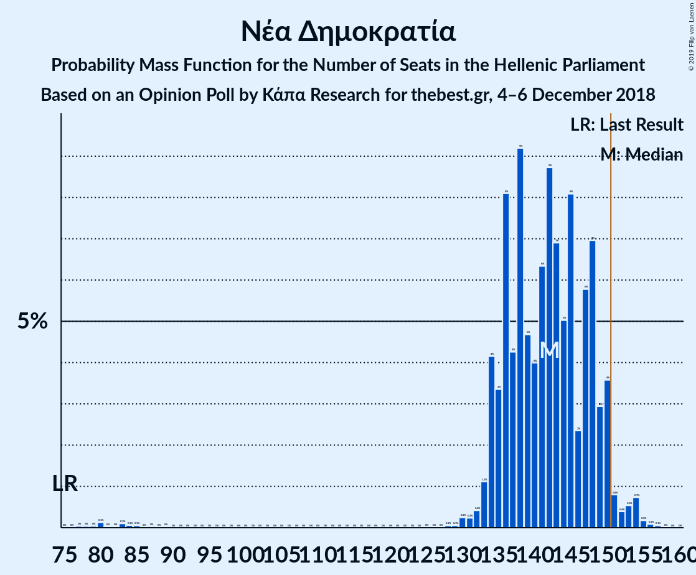
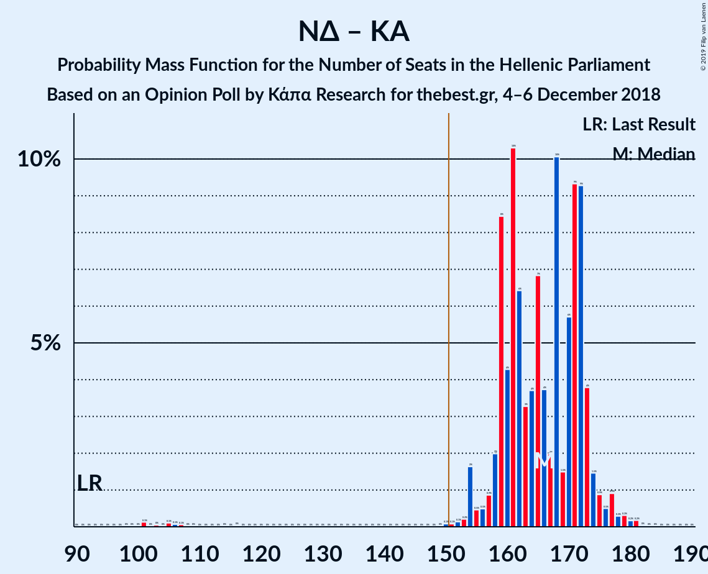
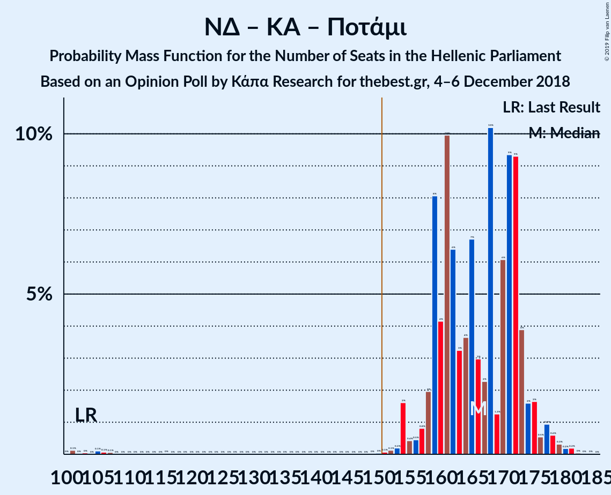
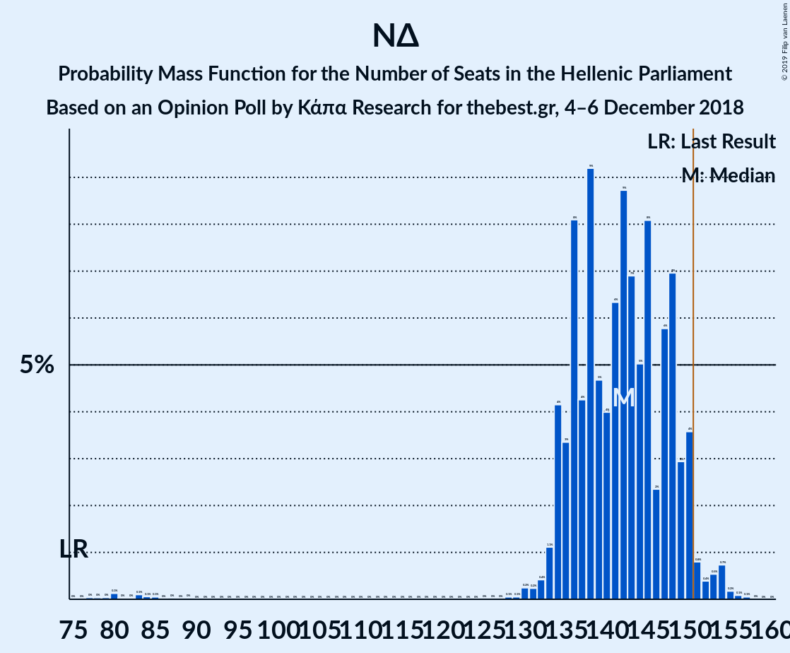
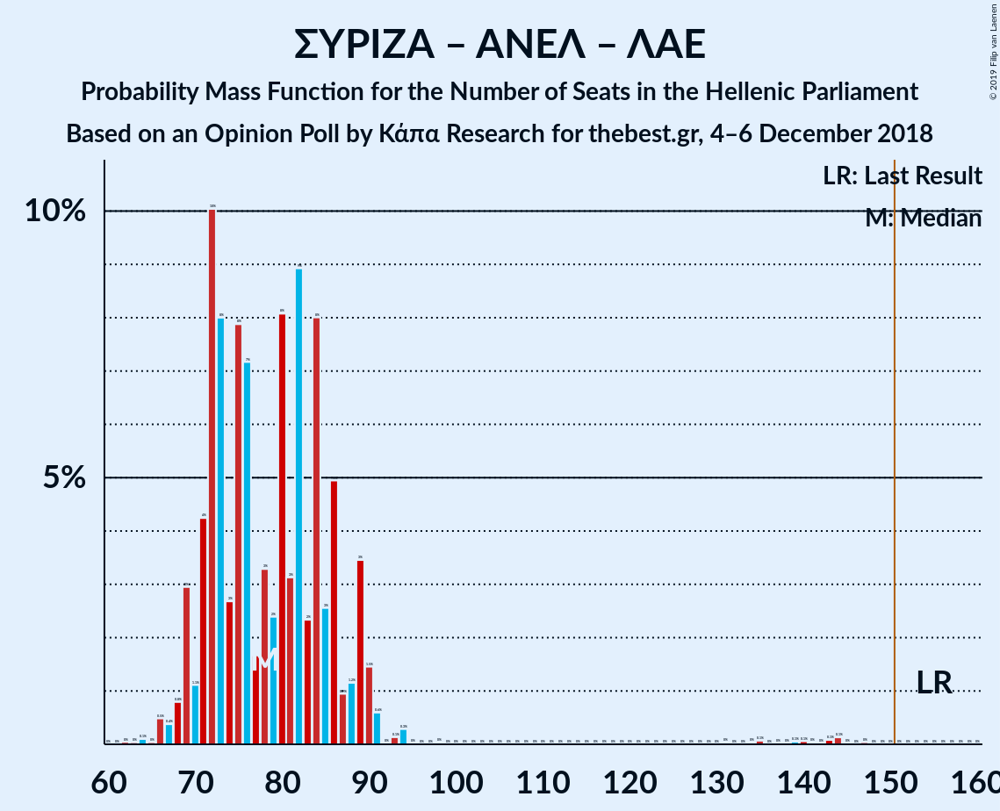

# Opinion Poll by Κάπα Research for thebest.gr, 4–6 December 2018

<a href="#voting-intentions">Voting Intentions</a> | <a href="#seats">Seats</a> | <a href="#coalitions">Coalitions</a> | <a href="#technical-information">Technical Information</a>

## Voting Intentions

### Confidence Intervals

| Party | Last Result | Poll Result | 80% Confidence Interval | 90% Confidence Interval | 95% Confidence Interval | 99% Confidence Interval |
|:-----:|:-----------:|:-----------:|:-----------------------:|:-----------------------:|:-----------------------:|:-----------------------:|
| Νέα Δημοκρατία | 28.1% | 31.7% | 29.8–33.6% |29.3–34.2% |28.9–34.6% |28.0–35.6% |
| Συνασπισμός Ριζοσπαστικής Αριστεράς | 35.5% | 25.7% | 24.0–27.5% |23.5–28.0% |23.1–28.5% |22.3–29.4% |
| Χρυσή Αυγή | 7.0% | 9.5% | 8.4–10.8% |8.1–11.1% |7.8–11.4% |7.3–12.1% |
| Κίνημα Αλλαγής | 6.3% | 8.1% | 7.1–9.3% |6.8–9.6% |6.5–9.9% |6.1–10.5% |
| Κομμουνιστικό Κόμμα Ελλάδας | 5.6% | 7.4% | 6.4–8.5% |6.1–8.9% |5.9–9.2% |5.5–9.8% |
| Ένωση Κεντρώων | 3.4% | 2.9% | 2.3–3.7% |2.1–3.9% |2.0–4.1% |1.8–4.5% |
| Ανεξάρτητοι Έλληνες | 3.7% | 2.8% | 2.2–3.6% |2.1–3.8% |1.9–4.0% |1.7–4.4% |
| Ελληνική Λύση | 0.0% | 2.3% | 1.8–3.0% |1.6–3.2% |1.5–3.4% |1.3–3.8% |
| Το Ποτάμι | 4.1% | 1.9% | 1.4–2.6% |1.3–2.8% |1.2–2.9% |1.0–3.3% |
| Λαϊκή Ενότητα | 2.9% | 1.6% | 1.2–2.2% |1.1–2.4% |1.0–2.6% |0.8–2.9% |

*Note:* The poll result column reflects the actual value used in the calculations. Published results may vary slightly, and in addition be rounded to fewer digits.

## Seats

### Confidence Intervals

| Party | Last Result | Median | 80% Confidence Interval | 90% Confidence Interval | 95% Confidence Interval | 99% Confidence Interval |
|:-----:|:-----------:|:------:|:-----------------------:|:-----------------------:|:-----------------------:|:-----------------------:|
| <a href="#νέα-δημοκρατία">Νέα Δημοκρατία</a> | 75 | 144 | 135–147 |135–147 |89–147 |89–147 |
| <a href="#συνασπισμός-ριζοσπαστικής-αριστεράς">Συνασπισμός Ριζοσπαστικής Αριστεράς</a> | 145 | 63 | 62–69 |62–69 |62–142 |59–142 |
| <a href="#χρυσή-αυγή">Χρυσή Αυγή</a> | 18 | 28 | 24–37 |24–37 |24–37 |23–37 |
| <a href="#κίνημα-αλλαγής">Κίνημα Αλλαγής</a> | 17 | 26 | 25–27 |25–27 |21–27 |19–30 |
| <a href="#κομμουνιστικό-κόμμα-ελλάδας">Κομμουνιστικό Κόμμα Ελλάδας</a> | 15 | 23 | 22–28 |20–28 |19–28 |16–28 |
| <a href="#ένωση-κεντρώων">Ένωση Κεντρώων</a> | 9 | 0 | 0–9 |0–11 |0–11 |0–11 |
| <a href="#ανεξάρτητοι-έλληνες">Ανεξάρτητοι Έλληνες</a> | 10 | 9 | 0–10 |0–10 |0–10 |0–11 |
| <a href="#ελληνική-λύση">Ελληνική Λύση</a> | 0 | 0 | 0–10 |0–10 |0–10 |0–13 |
| <a href="#το-ποτάμι">Το Ποτάμι</a> | 11 | 0 | 0 |0 |0 |0–12 |
| <a href="#λαϊκή-ενότητα">Λαϊκή Ενότητα</a> | 0 | 0 | 0 |0 |0 |0 |

### Νέα Δημοκρατία

*For a full overview of the results for this party, see the [Νέα Δημοκρατία](party-νέαδημοκρατία.html) page.*

| Number of Seats | Probability | Accumulated | Special Marks |
|:---------------:|:-----------:|:-----------:|:-------------:|
| 75 | 0% | 100% | Last Result |
| 76 | 0% | 100% |  |
| 77 | 0% | 100% |  |
| 78 | 0% | 100% |  |
| 79 | 0% | 100% |  |
| 80 | 0% | 100% |  |
| 81 | 0% | 100% |  |
| 82 | 0% | 100% |  |
| 83 | 0% | 100% |  |
| 84 | 0% | 100% |  |
| 85 | 0% | 100% |  |
| 86 | 0% | 100% |  |
| 87 | 0% | 100% |  |
| 88 | 0% | 100% |  |
| 89 | 3% | 100% |  |
| 90 | 0% | 97% |  |
| 91 | 0% | 97% |  |
| 92 | 0% | 97% |  |
| 93 | 0% | 97% |  |
| 94 | 0% | 97% |  |
| 95 | 0% | 97% |  |
| 96 | 0% | 97% |  |
| 97 | 0% | 97% |  |
| 98 | 0% | 97% |  |
| 99 | 0% | 97% |  |
| 100 | 0% | 97% |  |
| 101 | 0% | 97% |  |
| 102 | 0% | 97% |  |
| 103 | 0% | 97% |  |
| 104 | 0% | 97% |  |
| 105 | 0% | 97% |  |
| 106 | 0% | 97% |  |
| 107 | 0% | 97% |  |
| 108 | 0% | 97% |  |
| 109 | 0% | 97% |  |
| 110 | 0% | 97% |  |
| 111 | 0% | 97% |  |
| 112 | 0% | 97% |  |
| 113 | 0% | 97% |  |
| 114 | 0% | 97% |  |
| 115 | 0% | 97% |  |
| 116 | 0% | 97% |  |
| 117 | 0% | 97% |  |
| 118 | 0% | 97% |  |
| 119 | 0% | 97% |  |
| 120 | 0% | 97% |  |
| 121 | 0% | 97% |  |
| 122 | 0% | 97% |  |
| 123 | 0% | 97% |  |
| 124 | 0% | 97% |  |
| 125 | 0% | 97% |  |
| 126 | 0% | 97% |  |
| 127 | 0% | 97% |  |
| 128 | 0% | 97% |  |
| 129 | 0.1% | 97% |  |
| 130 | 0% | 97% |  |
| 131 | 0% | 96% |  |
| 132 | 0% | 96% |  |
| 133 | 0% | 96% |  |
| 134 | 1.0% | 96% |  |
| 135 | 8% | 95% |  |
| 136 | 0.2% | 87% |  |
| 137 | 1.2% | 87% |  |
| 138 | 0% | 86% |  |
| 139 | 0.4% | 86% |  |
| 140 | 22% | 86% |  |
| 141 | 0.3% | 63% |  |
| 142 | 0% | 63% |  |
| 143 | 0% | 63% |  |
| 144 | 39% | 63% | Median |
| 145 | 0.4% | 24% |  |
| 146 | 1.4% | 23% |  |
| 147 | 22% | 22% |  |
| 148 | 0% | 0.3% |  |
| 149 | 0% | 0.3% |  |
| 150 | 0.3% | 0.3% |  |
| 151 | 0% | 0% | Majority |

### Συνασπισμός Ριζοσπαστικής Αριστεράς

*For a full overview of the results for this party, see the [Συνασπισμός Ριζοσπαστικής Αριστεράς](party-συνασπισμόςριζοσπαστικήςαριστεράς.html) page.*

| Number of Seats | Probability | Accumulated | Special Marks |
|:---------------:|:-----------:|:-----------:|:-------------:|
| 59 | 1.3% | 100% |  |
| 60 | 0% | 98.7% |  |
| 61 | 0% | 98.7% |  |
| 62 | 21% | 98.7% |  |
| 63 | 38% | 78% | Median |
| 64 | 1.4% | 40% |  |
| 65 | 0.3% | 38% |  |
| 66 | 25% | 38% |  |
| 67 | 0.4% | 13% |  |
| 68 | 0% | 13% |  |
| 69 | 8% | 13% |  |
| 70 | 0.1% | 5% |  |
| 71 | 0% | 5% |  |
| 72 | 0.4% | 5% |  |
| 73 | 0.9% | 4% |  |
| 74 | 0% | 3% |  |
| 75 | 0% | 3% |  |
| 76 | 0% | 3% |  |
| 77 | 0% | 3% |  |
| 78 | 0% | 3% |  |
| 79 | 0% | 3% |  |
| 80 | 0% | 3% |  |
| 81 | 0% | 3% |  |
| 82 | 0% | 3% |  |
| 83 | 0% | 3% |  |
| 84 | 0% | 3% |  |
| 85 | 0% | 3% |  |
| 86 | 0% | 3% |  |
| 87 | 0% | 3% |  |
| 88 | 0% | 3% |  |
| 89 | 0% | 3% |  |
| 90 | 0% | 3% |  |
| 91 | 0% | 3% |  |
| 92 | 0% | 3% |  |
| 93 | 0% | 3% |  |
| 94 | 0% | 3% |  |
| 95 | 0% | 3% |  |
| 96 | 0% | 3% |  |
| 97 | 0% | 3% |  |
| 98 | 0% | 3% |  |
| 99 | 0% | 3% |  |
| 100 | 0% | 3% |  |
| 101 | 0% | 3% |  |
| 102 | 0% | 3% |  |
| 103 | 0% | 3% |  |
| 104 | 0% | 3% |  |
| 105 | 0% | 3% |  |
| 106 | 0% | 3% |  |
| 107 | 0% | 3% |  |
| 108 | 0% | 3% |  |
| 109 | 0% | 3% |  |
| 110 | 0% | 3% |  |
| 111 | 0% | 3% |  |
| 112 | 0% | 3% |  |
| 113 | 0% | 3% |  |
| 114 | 0% | 3% |  |
| 115 | 0% | 3% |  |
| 116 | 0% | 3% |  |
| 117 | 0% | 3% |  |
| 118 | 0% | 3% |  |
| 119 | 0% | 3% |  |
| 120 | 0% | 3% |  |
| 121 | 0% | 3% |  |
| 122 | 0% | 3% |  |
| 123 | 0% | 3% |  |
| 124 | 0% | 3% |  |
| 125 | 0% | 3% |  |
| 126 | 0% | 3% |  |
| 127 | 0% | 3% |  |
| 128 | 0% | 3% |  |
| 129 | 0% | 3% |  |
| 130 | 0% | 3% |  |
| 131 | 0% | 3% |  |
| 132 | 0% | 3% |  |
| 133 | 0% | 3% |  |
| 134 | 0% | 3% |  |
| 135 | 0% | 3% |  |
| 136 | 0% | 3% |  |
| 137 | 0% | 3% |  |
| 138 | 0% | 3% |  |
| 139 | 0% | 3% |  |
| 140 | 0% | 3% |  |
| 141 | 0% | 3% |  |
| 142 | 3% | 3% |  |
| 143 | 0% | 0% |  |
| 144 | 0% | 0% |  |
| 145 | 0% | 0% | Last Result |

### Χρυσή Αυγή

*For a full overview of the results for this party, see the [Χρυσή Αυγή](party-χρυσήαυγή.html) page.*

| Number of Seats | Probability | Accumulated | Special Marks |
|:---------------:|:-----------:|:-----------:|:-------------:|
| 18 | 0% | 100% | Last Result |
| 19 | 0% | 100% |  |
| 20 | 0.3% | 100% |  |
| 21 | 0% | 99.7% |  |
| 22 | 0% | 99.7% |  |
| 23 | 0.3% | 99.7% |  |
| 24 | 26% | 99.3% |  |
| 25 | 0% | 74% |  |
| 26 | 0.1% | 74% |  |
| 27 | 2% | 74% |  |
| 28 | 38% | 71% | Median |
| 29 | 1.4% | 33% |  |
| 30 | 9% | 32% |  |
| 31 | 0.1% | 23% |  |
| 32 | 0% | 23% |  |
| 33 | 0% | 23% |  |
| 34 | 0% | 23% |  |
| 35 | 0.1% | 23% |  |
| 36 | 0.1% | 23% |  |
| 37 | 22% | 23% |  |
| 38 | 0.3% | 0.3% |  |
| 39 | 0% | 0% |  |

### Κίνημα Αλλαγής

*For a full overview of the results for this party, see the [Κίνημα Αλλαγής](party-κίνημααλλαγής.html) page.*

| Number of Seats | Probability | Accumulated | Special Marks |
|:---------------:|:-----------:|:-----------:|:-------------:|
| 17 | 0.3% | 100% | Last Result |
| 18 | 0% | 99.7% |  |
| 19 | 1.1% | 99.7% |  |
| 20 | 0.1% | 98.5% |  |
| 21 | 1.0% | 98% |  |
| 22 | 0.1% | 97% |  |
| 23 | 0% | 97% |  |
| 24 | 0% | 97% |  |
| 25 | 33% | 97% |  |
| 26 | 25% | 65% | Median |
| 27 | 38% | 39% |  |
| 28 | 0% | 1.3% |  |
| 29 | 0% | 1.3% |  |
| 30 | 0.9% | 1.3% |  |
| 31 | 0.4% | 0.4% |  |
| 32 | 0% | 0% |  |

### Κομμουνιστικό Κόμμα Ελλάδας

*For a full overview of the results for this party, see the [Κομμουνιστικό Κόμμα Ελλάδας](party-κομμουνιστικόκόμμαελλάδας.html) page.*

| Number of Seats | Probability | Accumulated | Special Marks |
|:---------------:|:-----------:|:-----------:|:-------------:|
| 15 | 0% | 100% | Last Result |
| 16 | 1.2% | 99.9% |  |
| 17 | 0.5% | 98.7% |  |
| 18 | 0% | 98% |  |
| 19 | 1.2% | 98% |  |
| 20 | 3% | 97% |  |
| 21 | 0% | 94% |  |
| 22 | 31% | 94% |  |
| 23 | 21% | 63% | Median |
| 24 | 0.2% | 42% |  |
| 25 | 2% | 42% |  |
| 26 | 0% | 40% |  |
| 27 | 2% | 40% |  |
| 28 | 38% | 38% |  |
| 29 | 0% | 0% |  |

### Ένωση Κεντρώων

*For a full overview of the results for this party, see the [Ένωση Κεντρώων](party-ένωσηκεντρώων.html) page.*

| Number of Seats | Probability | Accumulated | Special Marks |
|:---------------:|:-----------:|:-----------:|:-------------:|
| 0 | 66% | 100% | Median |
| 1 | 0% | 34% |  |
| 2 | 0% | 34% |  |
| 3 | 0% | 34% |  |
| 4 | 0% | 34% |  |
| 5 | 0% | 34% |  |
| 6 | 0% | 34% |  |
| 7 | 0% | 34% |  |
| 8 | 0% | 34% |  |
| 9 | 24% | 34% | Last Result |
| 10 | 0.8% | 9% |  |
| 11 | 8% | 9% |  |
| 12 | 0% | 0.1% |  |
| 13 | 0% | 0.1% |  |
| 14 | 0% | 0% |  |

### Ανεξάρτητοι Έλληνες

*For a full overview of the results for this party, see the [Ανεξάρτητοι Έλληνες](party-ανεξάρτητοιέλληνες.html) page.*

| Number of Seats | Probability | Accumulated | Special Marks |
|:---------------:|:-----------:|:-----------:|:-------------:|
| 0 | 28% | 100% |  |
| 1 | 0% | 72% |  |
| 2 | 0% | 72% |  |
| 3 | 0% | 72% |  |
| 4 | 0% | 72% |  |
| 5 | 0% | 72% |  |
| 6 | 0% | 72% |  |
| 7 | 0% | 72% |  |
| 8 | 8% | 72% |  |
| 9 | 22% | 64% | Median |
| 10 | 40% | 42% | Last Result |
| 11 | 2% | 2% |  |
| 12 | 0% | 0% |  |

### Ελληνική Λύση

*For a full overview of the results for this party, see the [Ελληνική Λύση](party-ελληνικήλύση.html) page.*

| Number of Seats | Probability | Accumulated | Special Marks |
|:---------------:|:-----------:|:-----------:|:-------------:|
| 0 | 76% | 100% | Last Result, Median |
| 1 | 0% | 24% |  |
| 2 | 0% | 24% |  |
| 3 | 0% | 24% |  |
| 4 | 0% | 24% |  |
| 5 | 0% | 24% |  |
| 6 | 0% | 24% |  |
| 7 | 0% | 24% |  |
| 8 | 0% | 24% |  |
| 9 | 1.4% | 24% |  |
| 10 | 21% | 23% |  |
| 11 | 0% | 1.3% |  |
| 12 | 0.1% | 1.3% |  |
| 13 | 1.2% | 1.2% |  |
| 14 | 0% | 0% |  |

### Το Ποτάμι

*For a full overview of the results for this party, see the [Το Ποτάμι](party-τοποτάμι.html) page.*

| Number of Seats | Probability | Accumulated | Special Marks |
|:---------------:|:-----------:|:-----------:|:-------------:|
| 0 | 98.7% | 100% | Median |
| 1 | 0% | 1.3% |  |
| 2 | 0% | 1.3% |  |
| 3 | 0% | 1.3% |  |
| 4 | 0% | 1.3% |  |
| 5 | 0% | 1.3% |  |
| 6 | 0% | 1.3% |  |
| 7 | 0% | 1.3% |  |
| 8 | 0% | 1.3% |  |
| 9 | 0% | 1.3% |  |
| 10 | 0% | 1.3% |  |
| 11 | 0% | 1.3% | Last Result |
| 12 | 1.1% | 1.3% |  |
| 13 | 0% | 0.1% |  |
| 14 | 0.1% | 0.1% |  |
| 15 | 0% | 0% |  |

### Λαϊκή Ενότητα

*For a full overview of the results for this party, see the [Λαϊκή Ενότητα](party-λαϊκήενότητα.html) page.*

| Number of Seats | Probability | Accumulated | Special Marks |
|:---------------:|:-----------:|:-----------:|:-------------:|
| 0 | 100% | 100% | Last Result, Median |

## Coalitions

### Confidence Intervals

| Coalition | Last Result | Median | Majority? | 80% Confidence Interval | 90% Confidence Interval | 95% Confidence Interval | 99% Confidence Interval |
|:---------:|:-----------:|:------:|:---------:|:-----------------------:|:-----------------------:|:-----------------------:|:-----------------------:|
| Νέα Δημοκρατία – Κίνημα Αλλαγής | 92 | 171 | 97% | 160–172 | 156–172 | 114–172 | 114–177 |
| Νέα Δημοκρατία – Κίνημα Αλλαγής – Το Ποτάμι | 103 | 171 | 97% | 160–172 | 160–172 | 114–172 | 114–177 |
| Νέα Δημοκρατία | 75 | 144 | 0% | 135–147 | 135–147 | 89–147 | 89–147 |
| Νέα Δημοκρατία – Το Ποτάμι | 86 | 144 | 0% | 135–147 | 135–147 | 89–147 | 89–149 |
| Συνασπισμός Ριζοσπαστικής Αριστεράς – Ανεξάρτητοι Έλληνες – Λαϊκή Ενότητα | 155 | 73 | 0% | 66–77 | 66–77 | 66–142 | 59–142 |
| Συνασπισμός Ριζοσπαστικής Αριστεράς – Ανεξάρτητοι Έλληνες | 155 | 73 | 0% | 66–77 | 66–77 | 66–142 | 59–142 |
| Συνασπισμός Ριζοσπαστικής Αριστεράς – Λαϊκή Ενότητα | 145 | 63 | 0% | 62–69 | 62–69 | 62–142 | 59–142 |
| Συνασπισμός Ριζοσπαστικής Αριστεράς | 145 | 63 | 0% | 62–69 | 62–69 | 62–142 | 59–142 |

### Νέα Δημοκρατία – Κίνημα Αλλαγής

| Number of Seats | Probability | Accumulated | Special Marks |
|:---------------:|:-----------:|:-----------:|:-------------:|
| 92 | 0% | 100% | Last Result |
| 93 | 0% | 100% |  |
| 94 | 0% | 100% |  |
| 95 | 0% | 100% |  |
| 96 | 0% | 100% |  |
| 97 | 0% | 100% |  |
| 98 | 0% | 100% |  |
| 99 | 0% | 100% |  |
| 100 | 0% | 100% |  |
| 101 | 0% | 100% |  |
| 102 | 0% | 100% |  |
| 103 | 0% | 100% |  |
| 104 | 0% | 100% |  |
| 105 | 0% | 100% |  |
| 106 | 0% | 100% |  |
| 107 | 0% | 100% |  |
| 108 | 0% | 100% |  |
| 109 | 0% | 100% |  |
| 110 | 0% | 100% |  |
| 111 | 0% | 100% |  |
| 112 | 0% | 100% |  |
| 113 | 0% | 100% |  |
| 114 | 3% | 100% |  |
| 115 | 0% | 97% |  |
| 116 | 0% | 97% |  |
| 117 | 0% | 97% |  |
| 118 | 0% | 97% |  |
| 119 | 0% | 97% |  |
| 120 | 0% | 97% |  |
| 121 | 0% | 97% |  |
| 122 | 0% | 97% |  |
| 123 | 0% | 97% |  |
| 124 | 0% | 97% |  |
| 125 | 0% | 97% |  |
| 126 | 0% | 97% |  |
| 127 | 0% | 97% |  |
| 128 | 0% | 97% |  |
| 129 | 0% | 97% |  |
| 130 | 0% | 97% |  |
| 131 | 0% | 97% |  |
| 132 | 0% | 97% |  |
| 133 | 0% | 97% |  |
| 134 | 0% | 97% |  |
| 135 | 0% | 97% |  |
| 136 | 0% | 97% |  |
| 137 | 0% | 97% |  |
| 138 | 0% | 97% |  |
| 139 | 0% | 97% |  |
| 140 | 0% | 97% |  |
| 141 | 0% | 97% |  |
| 142 | 0% | 97% |  |
| 143 | 0% | 97% |  |
| 144 | 0% | 97% |  |
| 145 | 0% | 97% |  |
| 146 | 0% | 97% |  |
| 147 | 0% | 97% |  |
| 148 | 0% | 97% |  |
| 149 | 0% | 97% |  |
| 150 | 0% | 97% |  |
| 151 | 0% | 97% | Majority |
| 152 | 0% | 97% |  |
| 153 | 0% | 97% |  |
| 154 | 0.2% | 97% |  |
| 155 | 0.9% | 96% |  |
| 156 | 1.2% | 95% |  |
| 157 | 0% | 94% |  |
| 158 | 0% | 94% |  |
| 159 | 0.1% | 94% |  |
| 160 | 8% | 94% |  |
| 161 | 0% | 86% |  |
| 162 | 0% | 86% |  |
| 163 | 0% | 86% |  |
| 164 | 0% | 86% |  |
| 165 | 0.3% | 86% |  |
| 166 | 23% | 86% |  |
| 167 | 0.3% | 63% |  |
| 168 | 0% | 63% |  |
| 169 | 0% | 63% |  |
| 170 | 1.2% | 63% | Median |
| 171 | 38% | 61% |  |
| 172 | 22% | 24% |  |
| 173 | 0% | 1.1% |  |
| 174 | 0% | 1.1% |  |
| 175 | 0% | 1.1% |  |
| 176 | 0.4% | 1.1% |  |
| 177 | 0.7% | 0.7% |  |
| 178 | 0% | 0% |  |

### Νέα Δημοκρατία – Κίνημα Αλλαγής – Το Ποτάμι

| Number of Seats | Probability | Accumulated | Special Marks |
|:---------------:|:-----------:|:-----------:|:-------------:|
| 103 | 0% | 100% | Last Result |
| 104 | 0% | 100% |  |
| 105 | 0% | 100% |  |
| 106 | 0% | 100% |  |
| 107 | 0% | 100% |  |
| 108 | 0% | 100% |  |
| 109 | 0% | 100% |  |
| 110 | 0% | 100% |  |
| 111 | 0% | 100% |  |
| 112 | 0% | 100% |  |
| 113 | 0% | 100% |  |
| 114 | 3% | 100% |  |
| 115 | 0% | 97% |  |
| 116 | 0% | 97% |  |
| 117 | 0% | 97% |  |
| 118 | 0% | 97% |  |
| 119 | 0% | 97% |  |
| 120 | 0% | 97% |  |
| 121 | 0% | 97% |  |
| 122 | 0% | 97% |  |
| 123 | 0% | 97% |  |
| 124 | 0% | 97% |  |
| 125 | 0% | 97% |  |
| 126 | 0% | 97% |  |
| 127 | 0% | 97% |  |
| 128 | 0% | 97% |  |
| 129 | 0% | 97% |  |
| 130 | 0% | 97% |  |
| 131 | 0% | 97% |  |
| 132 | 0% | 97% |  |
| 133 | 0% | 97% |  |
| 134 | 0% | 97% |  |
| 135 | 0% | 97% |  |
| 136 | 0% | 97% |  |
| 137 | 0% | 97% |  |
| 138 | 0% | 97% |  |
| 139 | 0% | 97% |  |
| 140 | 0% | 97% |  |
| 141 | 0% | 97% |  |
| 142 | 0% | 97% |  |
| 143 | 0% | 97% |  |
| 144 | 0% | 97% |  |
| 145 | 0% | 97% |  |
| 146 | 0% | 97% |  |
| 147 | 0% | 97% |  |
| 148 | 0% | 97% |  |
| 149 | 0% | 97% |  |
| 150 | 0% | 97% |  |
| 151 | 0% | 97% | Majority |
| 152 | 0% | 97% |  |
| 153 | 0% | 97% |  |
| 154 | 0% | 97% |  |
| 155 | 0.9% | 97% |  |
| 156 | 0% | 96% |  |
| 157 | 0% | 96% |  |
| 158 | 0% | 96% |  |
| 159 | 0.1% | 96% |  |
| 160 | 8% | 95% |  |
| 161 | 0% | 87% |  |
| 162 | 0% | 87% |  |
| 163 | 0% | 87% |  |
| 164 | 0% | 87% |  |
| 165 | 0.3% | 87% |  |
| 166 | 23% | 87% |  |
| 167 | 0.3% | 64% |  |
| 168 | 1.3% | 64% |  |
| 169 | 0% | 63% |  |
| 170 | 1.2% | 63% | Median |
| 171 | 38% | 61% |  |
| 172 | 22% | 24% |  |
| 173 | 0% | 1.1% |  |
| 174 | 0% | 1.1% |  |
| 175 | 0% | 1.1% |  |
| 176 | 0.4% | 1.1% |  |
| 177 | 0.7% | 0.7% |  |
| 178 | 0% | 0% |  |

### Νέα Δημοκρατία

| Number of Seats | Probability | Accumulated | Special Marks |
|:---------------:|:-----------:|:-----------:|:-------------:|
| 75 | 0% | 100% | Last Result |
| 76 | 0% | 100% |  |
| 77 | 0% | 100% |  |
| 78 | 0% | 100% |  |
| 79 | 0% | 100% |  |
| 80 | 0% | 100% |  |
| 81 | 0% | 100% |  |
| 82 | 0% | 100% |  |
| 83 | 0% | 100% |  |
| 84 | 0% | 100% |  |
| 85 | 0% | 100% |  |
| 86 | 0% | 100% |  |
| 87 | 0% | 100% |  |
| 88 | 0% | 100% |  |
| 89 | 3% | 100% |  |
| 90 | 0% | 97% |  |
| 91 | 0% | 97% |  |
| 92 | 0% | 97% |  |
| 93 | 0% | 97% |  |
| 94 | 0% | 97% |  |
| 95 | 0% | 97% |  |
| 96 | 0% | 97% |  |
| 97 | 0% | 97% |  |
| 98 | 0% | 97% |  |
| 99 | 0% | 97% |  |
| 100 | 0% | 97% |  |
| 101 | 0% | 97% |  |
| 102 | 0% | 97% |  |
| 103 | 0% | 97% |  |
| 104 | 0% | 97% |  |
| 105 | 0% | 97% |  |
| 106 | 0% | 97% |  |
| 107 | 0% | 97% |  |
| 108 | 0% | 97% |  |
| 109 | 0% | 97% |  |
| 110 | 0% | 97% |  |
| 111 | 0% | 97% |  |
| 112 | 0% | 97% |  |
| 113 | 0% | 97% |  |
| 114 | 0% | 97% |  |
| 115 | 0% | 97% |  |
| 116 | 0% | 97% |  |
| 117 | 0% | 97% |  |
| 118 | 0% | 97% |  |
| 119 | 0% | 97% |  |
| 120 | 0% | 97% |  |
| 121 | 0% | 97% |  |
| 122 | 0% | 97% |  |
| 123 | 0% | 97% |  |
| 124 | 0% | 97% |  |
| 125 | 0% | 97% |  |
| 126 | 0% | 97% |  |
| 127 | 0% | 97% |  |
| 128 | 0% | 97% |  |
| 129 | 0.1% | 97% |  |
| 130 | 0% | 97% |  |
| 131 | 0% | 96% |  |
| 132 | 0% | 96% |  |
| 133 | 0% | 96% |  |
| 134 | 1.0% | 96% |  |
| 135 | 8% | 95% |  |
| 136 | 0.2% | 87% |  |
| 137 | 1.2% | 87% |  |
| 138 | 0% | 86% |  |
| 139 | 0.4% | 86% |  |
| 140 | 22% | 86% |  |
| 141 | 0.3% | 63% |  |
| 142 | 0% | 63% |  |
| 143 | 0% | 63% |  |
| 144 | 39% | 63% | Median |
| 145 | 0.4% | 24% |  |
| 146 | 1.4% | 23% |  |
| 147 | 22% | 22% |  |
| 148 | 0% | 0.3% |  |
| 149 | 0% | 0.3% |  |
| 150 | 0.3% | 0.3% |  |
| 151 | 0% | 0% | Majority |

### Νέα Δημοκρατία – Το Ποτάμι

| Number of Seats | Probability | Accumulated | Special Marks |
|:---------------:|:-----------:|:-----------:|:-------------:|
| 86 | 0% | 100% | Last Result |
| 87 | 0% | 100% |  |
| 88 | 0% | 100% |  |
| 89 | 3% | 100% |  |
| 90 | 0% | 97% |  |
| 91 | 0% | 97% |  |
| 92 | 0% | 97% |  |
| 93 | 0% | 97% |  |
| 94 | 0% | 97% |  |
| 95 | 0% | 97% |  |
| 96 | 0% | 97% |  |
| 97 | 0% | 97% |  |
| 98 | 0% | 97% |  |
| 99 | 0% | 97% |  |
| 100 | 0% | 97% |  |
| 101 | 0% | 97% |  |
| 102 | 0% | 97% |  |
| 103 | 0% | 97% |  |
| 104 | 0% | 97% |  |
| 105 | 0% | 97% |  |
| 106 | 0% | 97% |  |
| 107 | 0% | 97% |  |
| 108 | 0% | 97% |  |
| 109 | 0% | 97% |  |
| 110 | 0% | 97% |  |
| 111 | 0% | 97% |  |
| 112 | 0% | 97% |  |
| 113 | 0% | 97% |  |
| 114 | 0% | 97% |  |
| 115 | 0% | 97% |  |
| 116 | 0% | 97% |  |
| 117 | 0% | 97% |  |
| 118 | 0% | 97% |  |
| 119 | 0% | 97% |  |
| 120 | 0% | 97% |  |
| 121 | 0% | 97% |  |
| 122 | 0% | 97% |  |
| 123 | 0% | 97% |  |
| 124 | 0% | 97% |  |
| 125 | 0% | 97% |  |
| 126 | 0% | 97% |  |
| 127 | 0% | 97% |  |
| 128 | 0% | 97% |  |
| 129 | 0.1% | 97% |  |
| 130 | 0% | 97% |  |
| 131 | 0% | 96% |  |
| 132 | 0% | 96% |  |
| 133 | 0% | 96% |  |
| 134 | 0.9% | 96% |  |
| 135 | 8% | 96% |  |
| 136 | 0.2% | 88% |  |
| 137 | 0.1% | 87% |  |
| 138 | 0% | 87% |  |
| 139 | 0.4% | 87% |  |
| 140 | 22% | 87% |  |
| 141 | 0.3% | 65% |  |
| 142 | 0% | 64% |  |
| 143 | 0% | 64% |  |
| 144 | 39% | 64% | Median |
| 145 | 0.4% | 25% |  |
| 146 | 1.4% | 25% |  |
| 147 | 22% | 23% |  |
| 148 | 0.1% | 2% |  |
| 149 | 1.1% | 1.4% |  |
| 150 | 0.3% | 0.3% |  |
| 151 | 0% | 0% | Majority |

### Συνασπισμός Ριζοσπαστικής Αριστεράς – Ανεξάρτητοι Έλληνες – Λαϊκή Ενότητα

| Number of Seats | Probability | Accumulated | Special Marks |
|:---------------:|:-----------:|:-----------:|:-------------:|
| 59 | 1.1% | 100% |  |
| 60 | 0% | 98.9% |  |
| 61 | 0% | 98.9% |  |
| 62 | 0% | 98.9% |  |
| 63 | 0% | 98.9% |  |
| 64 | 0% | 98.9% |  |
| 65 | 0.3% | 98.9% |  |
| 66 | 22% | 98.6% |  |
| 67 | 0% | 76% |  |
| 68 | 0.2% | 76% |  |
| 69 | 0% | 76% |  |
| 70 | 0% | 76% |  |
| 71 | 21% | 76% |  |
| 72 | 0.3% | 55% | Median |
| 73 | 38% | 55% |  |
| 74 | 1.5% | 17% |  |
| 75 | 1.2% | 15% |  |
| 76 | 0% | 14% |  |
| 77 | 9% | 14% |  |
| 78 | 0.3% | 5% |  |
| 79 | 0% | 5% |  |
| 80 | 0.1% | 5% |  |
| 81 | 0% | 5% |  |
| 82 | 0.1% | 4% |  |
| 83 | 0% | 4% |  |
| 84 | 0.9% | 4% |  |
| 85 | 0% | 3% |  |
| 86 | 0% | 3% |  |
| 87 | 0% | 3% |  |
| 88 | 0% | 3% |  |
| 89 | 0% | 3% |  |
| 90 | 0% | 3% |  |
| 91 | 0% | 3% |  |
| 92 | 0% | 3% |  |
| 93 | 0% | 3% |  |
| 94 | 0% | 3% |  |
| 95 | 0% | 3% |  |
| 96 | 0% | 3% |  |
| 97 | 0% | 3% |  |
| 98 | 0% | 3% |  |
| 99 | 0% | 3% |  |
| 100 | 0% | 3% |  |
| 101 | 0% | 3% |  |
| 102 | 0% | 3% |  |
| 103 | 0% | 3% |  |
| 104 | 0% | 3% |  |
| 105 | 0% | 3% |  |
| 106 | 0% | 3% |  |
| 107 | 0% | 3% |  |
| 108 | 0% | 3% |  |
| 109 | 0% | 3% |  |
| 110 | 0% | 3% |  |
| 111 | 0% | 3% |  |
| 112 | 0% | 3% |  |
| 113 | 0% | 3% |  |
| 114 | 0% | 3% |  |
| 115 | 0% | 3% |  |
| 116 | 0% | 3% |  |
| 117 | 0% | 3% |  |
| 118 | 0% | 3% |  |
| 119 | 0% | 3% |  |
| 120 | 0% | 3% |  |
| 121 | 0% | 3% |  |
| 122 | 0% | 3% |  |
| 123 | 0% | 3% |  |
| 124 | 0% | 3% |  |
| 125 | 0% | 3% |  |
| 126 | 0% | 3% |  |
| 127 | 0% | 3% |  |
| 128 | 0% | 3% |  |
| 129 | 0% | 3% |  |
| 130 | 0% | 3% |  |
| 131 | 0% | 3% |  |
| 132 | 0% | 3% |  |
| 133 | 0% | 3% |  |
| 134 | 0% | 3% |  |
| 135 | 0% | 3% |  |
| 136 | 0% | 3% |  |
| 137 | 0% | 3% |  |
| 138 | 0% | 3% |  |
| 139 | 0% | 3% |  |
| 140 | 0% | 3% |  |
| 141 | 0% | 3% |  |
| 142 | 3% | 3% |  |
| 143 | 0% | 0% |  |
| 144 | 0% | 0% |  |
| 145 | 0% | 0% |  |
| 146 | 0% | 0% |  |
| 147 | 0% | 0% |  |
| 148 | 0% | 0% |  |
| 149 | 0% | 0% |  |
| 150 | 0% | 0% |  |
| 151 | 0% | 0% | Majority |
| 152 | 0% | 0% |  |
| 153 | 0% | 0% |  |
| 154 | 0% | 0% |  |
| 155 | 0% | 0% | Last Result |

### Συνασπισμός Ριζοσπαστικής Αριστεράς – Ανεξάρτητοι Έλληνες

| Number of Seats | Probability | Accumulated | Special Marks |
|:---------------:|:-----------:|:-----------:|:-------------:|
| 59 | 1.1% | 100% |  |
| 60 | 0% | 98.9% |  |
| 61 | 0% | 98.9% |  |
| 62 | 0% | 98.9% |  |
| 63 | 0% | 98.9% |  |
| 64 | 0% | 98.9% |  |
| 65 | 0.3% | 98.9% |  |
| 66 | 22% | 98.6% |  |
| 67 | 0% | 76% |  |
| 68 | 0.2% | 76% |  |
| 69 | 0% | 76% |  |
| 70 | 0% | 76% |  |
| 71 | 21% | 76% |  |
| 72 | 0.3% | 55% | Median |
| 73 | 38% | 55% |  |
| 74 | 1.5% | 17% |  |
| 75 | 1.2% | 15% |  |
| 76 | 0% | 14% |  |
| 77 | 9% | 14% |  |
| 78 | 0.3% | 5% |  |
| 79 | 0% | 5% |  |
| 80 | 0.1% | 5% |  |
| 81 | 0% | 5% |  |
| 82 | 0.1% | 4% |  |
| 83 | 0% | 4% |  |
| 84 | 0.9% | 4% |  |
| 85 | 0% | 3% |  |
| 86 | 0% | 3% |  |
| 87 | 0% | 3% |  |
| 88 | 0% | 3% |  |
| 89 | 0% | 3% |  |
| 90 | 0% | 3% |  |
| 91 | 0% | 3% |  |
| 92 | 0% | 3% |  |
| 93 | 0% | 3% |  |
| 94 | 0% | 3% |  |
| 95 | 0% | 3% |  |
| 96 | 0% | 3% |  |
| 97 | 0% | 3% |  |
| 98 | 0% | 3% |  |
| 99 | 0% | 3% |  |
| 100 | 0% | 3% |  |
| 101 | 0% | 3% |  |
| 102 | 0% | 3% |  |
| 103 | 0% | 3% |  |
| 104 | 0% | 3% |  |
| 105 | 0% | 3% |  |
| 106 | 0% | 3% |  |
| 107 | 0% | 3% |  |
| 108 | 0% | 3% |  |
| 109 | 0% | 3% |  |
| 110 | 0% | 3% |  |
| 111 | 0% | 3% |  |
| 112 | 0% | 3% |  |
| 113 | 0% | 3% |  |
| 114 | 0% | 3% |  |
| 115 | 0% | 3% |  |
| 116 | 0% | 3% |  |
| 117 | 0% | 3% |  |
| 118 | 0% | 3% |  |
| 119 | 0% | 3% |  |
| 120 | 0% | 3% |  |
| 121 | 0% | 3% |  |
| 122 | 0% | 3% |  |
| 123 | 0% | 3% |  |
| 124 | 0% | 3% |  |
| 125 | 0% | 3% |  |
| 126 | 0% | 3% |  |
| 127 | 0% | 3% |  |
| 128 | 0% | 3% |  |
| 129 | 0% | 3% |  |
| 130 | 0% | 3% |  |
| 131 | 0% | 3% |  |
| 132 | 0% | 3% |  |
| 133 | 0% | 3% |  |
| 134 | 0% | 3% |  |
| 135 | 0% | 3% |  |
| 136 | 0% | 3% |  |
| 137 | 0% | 3% |  |
| 138 | 0% | 3% |  |
| 139 | 0% | 3% |  |
| 140 | 0% | 3% |  |
| 141 | 0% | 3% |  |
| 142 | 3% | 3% |  |
| 143 | 0% | 0% |  |
| 144 | 0% | 0% |  |
| 145 | 0% | 0% |  |
| 146 | 0% | 0% |  |
| 147 | 0% | 0% |  |
| 148 | 0% | 0% |  |
| 149 | 0% | 0% |  |
| 150 | 0% | 0% |  |
| 151 | 0% | 0% | Majority |
| 152 | 0% | 0% |  |
| 153 | 0% | 0% |  |
| 154 | 0% | 0% |  |
| 155 | 0% | 0% | Last Result |

### Συνασπισμός Ριζοσπαστικής Αριστεράς – Λαϊκή Ενότητα

| Number of Seats | Probability | Accumulated | Special Marks |
|:---------------:|:-----------:|:-----------:|:-------------:|
| 59 | 1.3% | 100% |  |
| 60 | 0% | 98.7% |  |
| 61 | 0% | 98.7% |  |
| 62 | 21% | 98.7% |  |
| 63 | 38% | 78% | Median |
| 64 | 1.4% | 40% |  |
| 65 | 0.3% | 38% |  |
| 66 | 25% | 38% |  |
| 67 | 0.4% | 13% |  |
| 68 | 0% | 13% |  |
| 69 | 8% | 13% |  |
| 70 | 0.1% | 5% |  |
| 71 | 0% | 5% |  |
| 72 | 0.4% | 5% |  |
| 73 | 0.9% | 4% |  |
| 74 | 0% | 3% |  |
| 75 | 0% | 3% |  |
| 76 | 0% | 3% |  |
| 77 | 0% | 3% |  |
| 78 | 0% | 3% |  |
| 79 | 0% | 3% |  |
| 80 | 0% | 3% |  |
| 81 | 0% | 3% |  |
| 82 | 0% | 3% |  |
| 83 | 0% | 3% |  |
| 84 | 0% | 3% |  |
| 85 | 0% | 3% |  |
| 86 | 0% | 3% |  |
| 87 | 0% | 3% |  |
| 88 | 0% | 3% |  |
| 89 | 0% | 3% |  |
| 90 | 0% | 3% |  |
| 91 | 0% | 3% |  |
| 92 | 0% | 3% |  |
| 93 | 0% | 3% |  |
| 94 | 0% | 3% |  |
| 95 | 0% | 3% |  |
| 96 | 0% | 3% |  |
| 97 | 0% | 3% |  |
| 98 | 0% | 3% |  |
| 99 | 0% | 3% |  |
| 100 | 0% | 3% |  |
| 101 | 0% | 3% |  |
| 102 | 0% | 3% |  |
| 103 | 0% | 3% |  |
| 104 | 0% | 3% |  |
| 105 | 0% | 3% |  |
| 106 | 0% | 3% |  |
| 107 | 0% | 3% |  |
| 108 | 0% | 3% |  |
| 109 | 0% | 3% |  |
| 110 | 0% | 3% |  |
| 111 | 0% | 3% |  |
| 112 | 0% | 3% |  |
| 113 | 0% | 3% |  |
| 114 | 0% | 3% |  |
| 115 | 0% | 3% |  |
| 116 | 0% | 3% |  |
| 117 | 0% | 3% |  |
| 118 | 0% | 3% |  |
| 119 | 0% | 3% |  |
| 120 | 0% | 3% |  |
| 121 | 0% | 3% |  |
| 122 | 0% | 3% |  |
| 123 | 0% | 3% |  |
| 124 | 0% | 3% |  |
| 125 | 0% | 3% |  |
| 126 | 0% | 3% |  |
| 127 | 0% | 3% |  |
| 128 | 0% | 3% |  |
| 129 | 0% | 3% |  |
| 130 | 0% | 3% |  |
| 131 | 0% | 3% |  |
| 132 | 0% | 3% |  |
| 133 | 0% | 3% |  |
| 134 | 0% | 3% |  |
| 135 | 0% | 3% |  |
| 136 | 0% | 3% |  |
| 137 | 0% | 3% |  |
| 138 | 0% | 3% |  |
| 139 | 0% | 3% |  |
| 140 | 0% | 3% |  |
| 141 | 0% | 3% |  |
| 142 | 3% | 3% |  |
| 143 | 0% | 0% |  |
| 144 | 0% | 0% |  |
| 145 | 0% | 0% | Last Result |

### Συνασπισμός Ριζοσπαστικής Αριστεράς

| Number of Seats | Probability | Accumulated | Special Marks |
|:---------------:|:-----------:|:-----------:|:-------------:|
| 59 | 1.3% | 100% |  |
| 60 | 0% | 98.7% |  |
| 61 | 0% | 98.7% |  |
| 62 | 21% | 98.7% |  |
| 63 | 38% | 78% | Median |
| 64 | 1.4% | 40% |  |
| 65 | 0.3% | 38% |  |
| 66 | 25% | 38% |  |
| 67 | 0.4% | 13% |  |
| 68 | 0% | 13% |  |
| 69 | 8% | 13% |  |
| 70 | 0.1% | 5% |  |
| 71 | 0% | 5% |  |
| 72 | 0.4% | 5% |  |
| 73 | 0.9% | 4% |  |
| 74 | 0% | 3% |  |
| 75 | 0% | 3% |  |
| 76 | 0% | 3% |  |
| 77 | 0% | 3% |  |
| 78 | 0% | 3% |  |
| 79 | 0% | 3% |  |
| 80 | 0% | 3% |  |
| 81 | 0% | 3% |  |
| 82 | 0% | 3% |  |
| 83 | 0% | 3% |  |
| 84 | 0% | 3% |  |
| 85 | 0% | 3% |  |
| 86 | 0% | 3% |  |
| 87 | 0% | 3% |  |
| 88 | 0% | 3% |  |
| 89 | 0% | 3% |  |
| 90 | 0% | 3% |  |
| 91 | 0% | 3% |  |
| 92 | 0% | 3% |  |
| 93 | 0% | 3% |  |
| 94 | 0% | 3% |  |
| 95 | 0% | 3% |  |
| 96 | 0% | 3% |  |
| 97 | 0% | 3% |  |
| 98 | 0% | 3% |  |
| 99 | 0% | 3% |  |
| 100 | 0% | 3% |  |
| 101 | 0% | 3% |  |
| 102 | 0% | 3% |  |
| 103 | 0% | 3% |  |
| 104 | 0% | 3% |  |
| 105 | 0% | 3% |  |
| 106 | 0% | 3% |  |
| 107 | 0% | 3% |  |
| 108 | 0% | 3% |  |
| 109 | 0% | 3% |  |
| 110 | 0% | 3% |  |
| 111 | 0% | 3% |  |
| 112 | 0% | 3% |  |
| 113 | 0% | 3% |  |
| 114 | 0% | 3% |  |
| 115 | 0% | 3% |  |
| 116 | 0% | 3% |  |
| 117 | 0% | 3% |  |
| 118 | 0% | 3% |  |
| 119 | 0% | 3% |  |
| 120 | 0% | 3% |  |
| 121 | 0% | 3% |  |
| 122 | 0% | 3% |  |
| 123 | 0% | 3% |  |
| 124 | 0% | 3% |  |
| 125 | 0% | 3% |  |
| 126 | 0% | 3% |  |
| 127 | 0% | 3% |  |
| 128 | 0% | 3% |  |
| 129 | 0% | 3% |  |
| 130 | 0% | 3% |  |
| 131 | 0% | 3% |  |
| 132 | 0% | 3% |  |
| 133 | 0% | 3% |  |
| 134 | 0% | 3% |  |
| 135 | 0% | 3% |  |
| 136 | 0% | 3% |  |
| 137 | 0% | 3% |  |
| 138 | 0% | 3% |  |
| 139 | 0% | 3% |  |
| 140 | 0% | 3% |  |
| 141 | 0% | 3% |  |
| 142 | 3% | 3% |  |
| 143 | 0% | 0% |  |
| 144 | 0% | 0% |  |
| 145 | 0% | 0% | Last Result |

## Technical Information

### Opinion Poll

+ **Polling firm:** Κάπα Research
+ **Commissioner(s):** thebest.gr
+ **Fieldwork period:** 4–6 December 2018

### Calculations

+ **Sample size:** 1004
+ **Simulations done:** 1,024
+ **Error estimate:** 2.90%

