# Opinion Poll by Prorata for Η Εφημερίδα των Συντακτών, 1–4 February 2019

<a href="#voting-intentions">Voting Intentions</a> | <a href="#seats">Seats</a> | <a href="#coalitions">Coalitions</a> | <a href="#technical-information">Technical Information</a>

## Voting Intentions

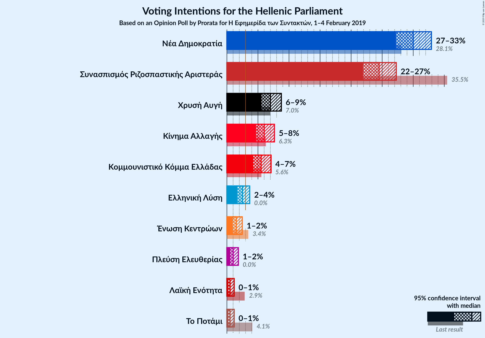

### Confidence Intervals

| Party | Last Result | Poll Result | 80% Confidence Interval | 90% Confidence Interval | 95% Confidence Interval | 99% Confidence Interval |
|:-----:|:-----------:|:-----------:|:-----------------------:|:-----------------------:|:-----------------------:|:-----------------------:|
| Νέα Δημοκρατία | 28.1% | 30.0% | 28.2–31.9% |27.7–32.4% |27.2–32.9% |26.4–33.9% |
| Συνασπισμός Ριζοσπαστικής Αριστεράς | 35.5% | 24.5% | 22.8–26.3% |22.3–26.8% |21.9–27.3% |21.1–28.2% |
| Χρυσή Αυγή | 7.0% | 7.0% | 6.1–8.2% |5.8–8.5% |5.6–8.8% |5.2–9.3% |
| Κίνημα Αλλαγής | 6.3% | 6.0% | 5.1–7.1% |4.9–7.4% |4.7–7.7% |4.3–8.2% |
| Κομμουνιστικό Κόμμα Ελλάδας | 5.6% | 5.5% | 4.7–6.5% |4.4–6.8% |4.3–7.1% |3.9–7.6% |
| Ελληνική Λύση | 0.0% | 2.5% | 2.0–3.3% |1.8–3.5% |1.7–3.7% |1.5–4.1% |
| Ένωση Κεντρώων | 3.4% | 1.5% | 1.1–2.1% |1.0–2.3% |0.9–2.5% |0.7–2.8% |
| Πλεύση Ελευθερίας | 0.0% | 1.0% | 0.7–1.5% |0.6–1.7% |0.5–1.8% |0.4–2.1% |
| Το Ποτάμι | 4.1% | 0.5% | 0.3–0.9% |0.3–1.1% |0.2–1.2% |0.2–1.4% |
| Λαϊκή Ενότητα | 2.9% | 0.5% | 0.3–0.9% |0.3–1.1% |0.2–1.2% |0.2–1.4% |

*Note:* The poll result column reflects the actual value used in the calculations. Published results may vary slightly, and in addition be rounded to fewer digits.

## Seats

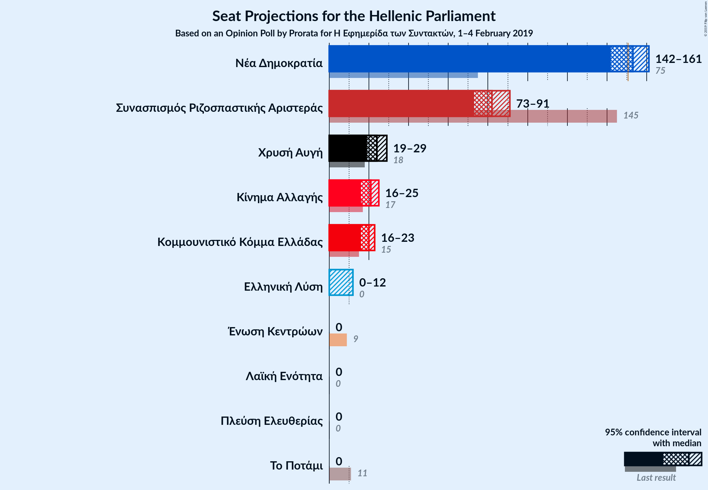

### Confidence Intervals

| Party | Last Result | Median | 80% Confidence Interval | 90% Confidence Interval | 95% Confidence Interval | 99% Confidence Interval |
|:-----:|:-----------:|:------:|:-----------------------:|:-----------------------:|:-----------------------:|:-----------------------:|
| <a href="#νέα-δημοκρατία">Νέα Δημοκρατία</a> | 75 | 153 | 146–157 |145–159 |142–161 |137–163 |
| <a href="#συνασπισμός-ριζοσπαστικής-αριστεράς">Συνασπισμός Ριζοσπαστικής Αριστεράς</a> | 145 | 82 | 76–88 |76–90 |73–91 |73–96 |
| <a href="#χρυσή-αυγή">Χρυσή Αυγή</a> | 18 | 24 | 21–26 |19–28 |19–29 |18–31 |
| <a href="#κίνημα-αλλαγής">Κίνημα Αλλαγής</a> | 17 | 21 | 17–24 |16–24 |16–25 |15–26 |
| <a href="#κομμουνιστικό-κόμμα-ελλάδας">Κομμουνιστικό Κόμμα Ελλάδας</a> | 15 | 20 | 17–22 |16–22 |16–23 |15–23 |
| <a href="#ελληνική-λύση">Ελληνική Λύση</a> | 0 | 0 | 0 |0–12 |0–12 |0–12 |
| <a href="#ένωση-κεντρώων">Ένωση Κεντρώων</a> | 9 | 0 | 0 |0 |0 |0 |
| <a href="#πλεύση-ελευθερίας">Πλεύση Ελευθερίας</a> | 0 | 0 | 0 |0 |0 |0 |
| <a href="#το-ποτάμι">Το Ποτάμι</a> | 11 | 0 | 0 |0 |0 |0 |
| <a href="#λαϊκή-ενότητα">Λαϊκή Ενότητα</a> | 0 | 0 | 0 |0 |0 |0 |

### Νέα Δημοκρατία

*For a full overview of the results for this party, see the [Νέα Δημοκρατία](party-νέαδημοκρατία.html) page.*

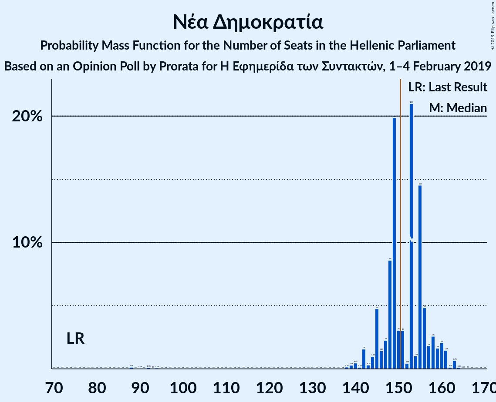

| Number of Seats | Probability | Accumulated | Special Marks |
|:---------------:|:-----------:|:-----------:|:-------------:|
| 75 | 0% | 100% | Last Result |
| 76 | 0% | 100% |  |
| 77 | 0% | 100% |  |
| 78 | 0% | 100% |  |
| 79 | 0% | 100% |  |
| 80 | 0% | 100% |  |
| 81 | 0% | 100% |  |
| 82 | 0% | 100% |  |
| 83 | 0% | 100% |  |
| 84 | 0% | 100% |  |
| 85 | 0% | 100% |  |
| 86 | 0% | 100% |  |
| 87 | 0% | 100% |  |
| 88 | 0.1% | 100% |  |
| 89 | 0% | 99.8% |  |
| 90 | 0.1% | 99.8% |  |
| 91 | 0% | 99.8% |  |
| 92 | 0.1% | 99.7% |  |
| 93 | 0% | 99.6% |  |
| 94 | 0.1% | 99.6% |  |
| 95 | 0% | 99.5% |  |
| 96 | 0% | 99.5% |  |
| 97 | 0% | 99.5% |  |
| 98 | 0% | 99.5% |  |
| 99 | 0% | 99.5% |  |
| 100 | 0% | 99.5% |  |
| 101 | 0% | 99.5% |  |
| 102 | 0% | 99.5% |  |
| 103 | 0% | 99.5% |  |
| 104 | 0% | 99.5% |  |
| 105 | 0% | 99.5% |  |
| 106 | 0% | 99.5% |  |
| 107 | 0% | 99.5% |  |
| 108 | 0% | 99.5% |  |
| 109 | 0% | 99.5% |  |
| 110 | 0% | 99.5% |  |
| 111 | 0% | 99.5% |  |
| 112 | 0% | 99.5% |  |
| 113 | 0% | 99.5% |  |
| 114 | 0% | 99.5% |  |
| 115 | 0% | 99.5% |  |
| 116 | 0% | 99.5% |  |
| 117 | 0% | 99.5% |  |
| 118 | 0% | 99.5% |  |
| 119 | 0% | 99.5% |  |
| 120 | 0% | 99.5% |  |
| 121 | 0% | 99.5% |  |
| 122 | 0% | 99.5% |  |
| 123 | 0% | 99.5% |  |
| 124 | 0% | 99.5% |  |
| 125 | 0% | 99.5% |  |
| 126 | 0% | 99.5% |  |
| 127 | 0% | 99.5% |  |
| 128 | 0% | 99.5% |  |
| 129 | 0% | 99.5% |  |
| 130 | 0% | 99.5% |  |
| 131 | 0% | 99.5% |  |
| 132 | 0% | 99.5% |  |
| 133 | 0% | 99.5% |  |
| 134 | 0% | 99.5% |  |
| 135 | 0% | 99.5% |  |
| 136 | 0% | 99.5% |  |
| 137 | 0% | 99.5% |  |
| 138 | 0.2% | 99.5% |  |
| 139 | 0.3% | 99.3% |  |
| 140 | 0.5% | 99.0% |  |
| 141 | 0.1% | 98.6% |  |
| 142 | 2% | 98% |  |
| 143 | 0.3% | 97% |  |
| 144 | 1.0% | 97% |  |
| 145 | 5% | 96% |  |
| 146 | 1.4% | 91% |  |
| 147 | 2% | 89% |  |
| 148 | 9% | 87% |  |
| 149 | 20% | 78% |  |
| 150 | 3% | 59% |  |
| 151 | 3% | 56% | Majority |
| 152 | 0.5% | 53% |  |
| 153 | 21% | 52% | Median |
| 154 | 1.0% | 31% |  |
| 155 | 15% | 30% |  |
| 156 | 5% | 15% |  |
| 157 | 2% | 11% |  |
| 158 | 3% | 9% |  |
| 159 | 2% | 6% |  |
| 160 | 2% | 5% |  |
| 161 | 1.5% | 3% |  |
| 162 | 0.1% | 1.0% |  |
| 163 | 0.7% | 0.9% |  |
| 164 | 0.1% | 0.2% |  |
| 165 | 0.1% | 0.1% |  |
| 166 | 0% | 0% |  |

### Συνασπισμός Ριζοσπαστικής Αριστεράς

*For a full overview of the results for this party, see the [Συνασπισμός Ριζοσπαστικής Αριστεράς](party-συνασπισμόςριζοσπαστικήςαριστεράς.html) page.*

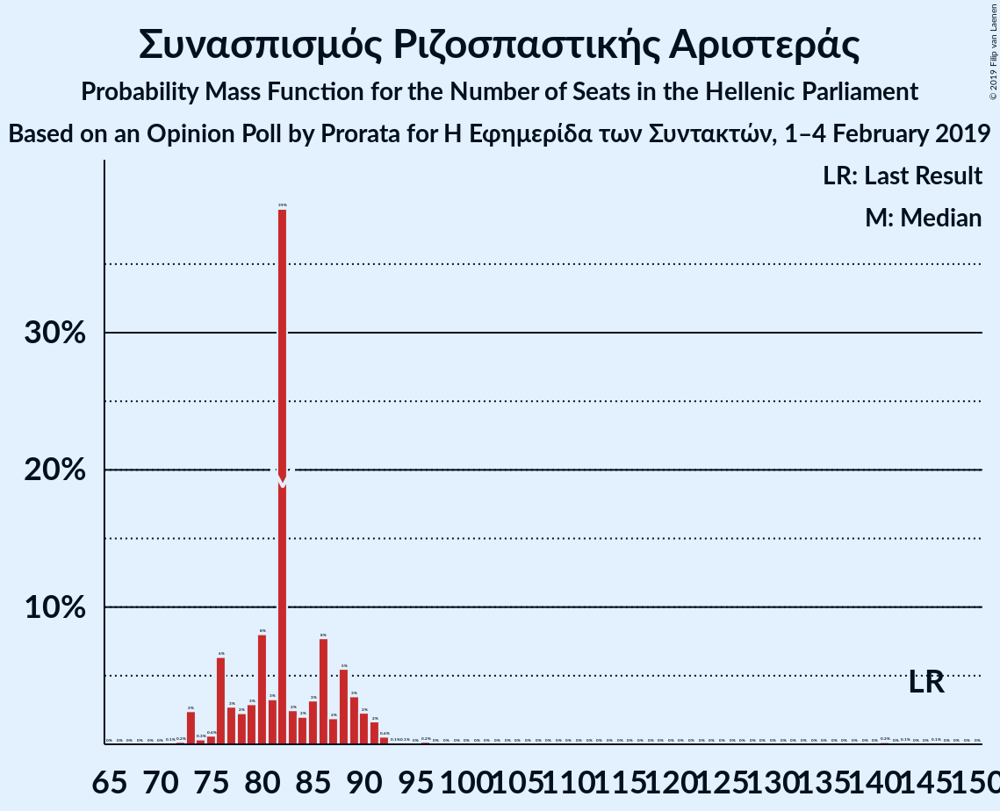

| Number of Seats | Probability | Accumulated | Special Marks |
|:---------------:|:-----------:|:-----------:|:-------------:|
| 69 | 0% | 100% |  |
| 70 | 0% | 99.9% |  |
| 71 | 0.1% | 99.9% |  |
| 72 | 0.2% | 99.8% |  |
| 73 | 2% | 99.6% |  |
| 74 | 0.3% | 97% |  |
| 75 | 0.6% | 97% |  |
| 76 | 6% | 96% |  |
| 77 | 3% | 90% |  |
| 78 | 2% | 87% |  |
| 79 | 3% | 85% |  |
| 80 | 8% | 82% |  |
| 81 | 3% | 74% |  |
| 82 | 39% | 71% | Median |
| 83 | 2% | 32% |  |
| 84 | 2% | 29% |  |
| 85 | 3% | 27% |  |
| 86 | 8% | 24% |  |
| 87 | 2% | 16% |  |
| 88 | 5% | 14% |  |
| 89 | 3% | 9% |  |
| 90 | 2% | 5% |  |
| 91 | 2% | 3% |  |
| 92 | 0.6% | 1.4% |  |
| 93 | 0.1% | 0.9% |  |
| 94 | 0.1% | 0.8% |  |
| 95 | 0% | 0.7% |  |
| 96 | 0.2% | 0.7% |  |
| 97 | 0% | 0.5% |  |
| 98 | 0% | 0.5% |  |
| 99 | 0% | 0.5% |  |
| 100 | 0% | 0.5% |  |
| 101 | 0% | 0.5% |  |
| 102 | 0% | 0.5% |  |
| 103 | 0% | 0.5% |  |
| 104 | 0% | 0.5% |  |
| 105 | 0% | 0.5% |  |
| 106 | 0% | 0.5% |  |
| 107 | 0% | 0.5% |  |
| 108 | 0% | 0.5% |  |
| 109 | 0% | 0.5% |  |
| 110 | 0% | 0.5% |  |
| 111 | 0% | 0.5% |  |
| 112 | 0% | 0.5% |  |
| 113 | 0% | 0.5% |  |
| 114 | 0% | 0.5% |  |
| 115 | 0% | 0.5% |  |
| 116 | 0% | 0.5% |  |
| 117 | 0% | 0.5% |  |
| 118 | 0% | 0.5% |  |
| 119 | 0% | 0.5% |  |
| 120 | 0% | 0.5% |  |
| 121 | 0% | 0.5% |  |
| 122 | 0% | 0.5% |  |
| 123 | 0% | 0.5% |  |
| 124 | 0% | 0.5% |  |
| 125 | 0% | 0.5% |  |
| 126 | 0% | 0.5% |  |
| 127 | 0% | 0.5% |  |
| 128 | 0% | 0.5% |  |
| 129 | 0% | 0.5% |  |
| 130 | 0% | 0.5% |  |
| 131 | 0% | 0.5% |  |
| 132 | 0% | 0.5% |  |
| 133 | 0% | 0.5% |  |
| 134 | 0% | 0.5% |  |
| 135 | 0% | 0.5% |  |
| 136 | 0% | 0.5% |  |
| 137 | 0% | 0.5% |  |
| 138 | 0% | 0.5% |  |
| 139 | 0% | 0.5% |  |
| 140 | 0% | 0.5% |  |
| 141 | 0.2% | 0.5% |  |
| 142 | 0% | 0.3% |  |
| 143 | 0.1% | 0.3% |  |
| 144 | 0% | 0.2% |  |
| 145 | 0% | 0.2% | Last Result |
| 146 | 0.1% | 0.2% |  |
| 147 | 0% | 0.1% |  |
| 148 | 0% | 0% |  |

### Χρυσή Αυγή

*For a full overview of the results for this party, see the [Χρυσή Αυγή](party-χρυσήαυγή.html) page.*

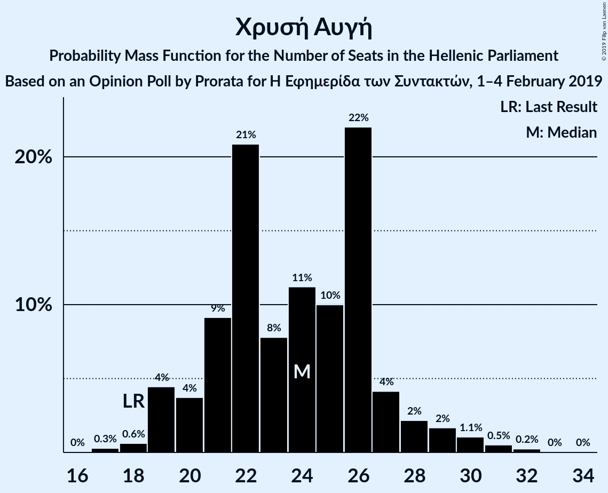

| Number of Seats | Probability | Accumulated | Special Marks |
|:---------------:|:-----------:|:-----------:|:-------------:|
| 17 | 0.3% | 100% |  |
| 18 | 0.6% | 99.7% | Last Result |
| 19 | 4% | 99.1% |  |
| 20 | 4% | 95% |  |
| 21 | 9% | 91% |  |
| 22 | 21% | 82% |  |
| 23 | 8% | 61% |  |
| 24 | 11% | 53% | Median |
| 25 | 10% | 42% |  |
| 26 | 22% | 32% |  |
| 27 | 4% | 10% |  |
| 28 | 2% | 6% |  |
| 29 | 2% | 4% |  |
| 30 | 1.1% | 2% |  |
| 31 | 0.5% | 0.8% |  |
| 32 | 0.2% | 0.3% |  |
| 33 | 0% | 0.1% |  |
| 34 | 0% | 0% |  |

### Κίνημα Αλλαγής

*For a full overview of the results for this party, see the [Κίνημα Αλλαγής](party-κίνημααλλαγής.html) page.*

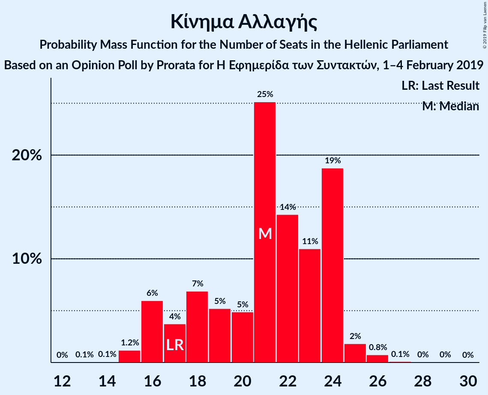

| Number of Seats | Probability | Accumulated | Special Marks |
|:---------------:|:-----------:|:-----------:|:-------------:|
| 13 | 0.1% | 100% |  |
| 14 | 0.1% | 99.9% |  |
| 15 | 1.2% | 99.9% |  |
| 16 | 6% | 98.7% |  |
| 17 | 4% | 93% | Last Result |
| 18 | 7% | 89% |  |
| 19 | 5% | 82% |  |
| 20 | 5% | 77% |  |
| 21 | 25% | 72% | Median |
| 22 | 14% | 47% |  |
| 23 | 11% | 33% |  |
| 24 | 19% | 22% |  |
| 25 | 2% | 3% |  |
| 26 | 0.8% | 1.0% |  |
| 27 | 0.1% | 0.2% |  |
| 28 | 0% | 0.1% |  |
| 29 | 0% | 0.1% |  |
| 30 | 0% | 0% |  |

### Κομμουνιστικό Κόμμα Ελλάδας

*For a full overview of the results for this party, see the [Κομμουνιστικό Κόμμα Ελλάδας](party-κομμουνιστικόκόμμαελλάδας.html) page.*

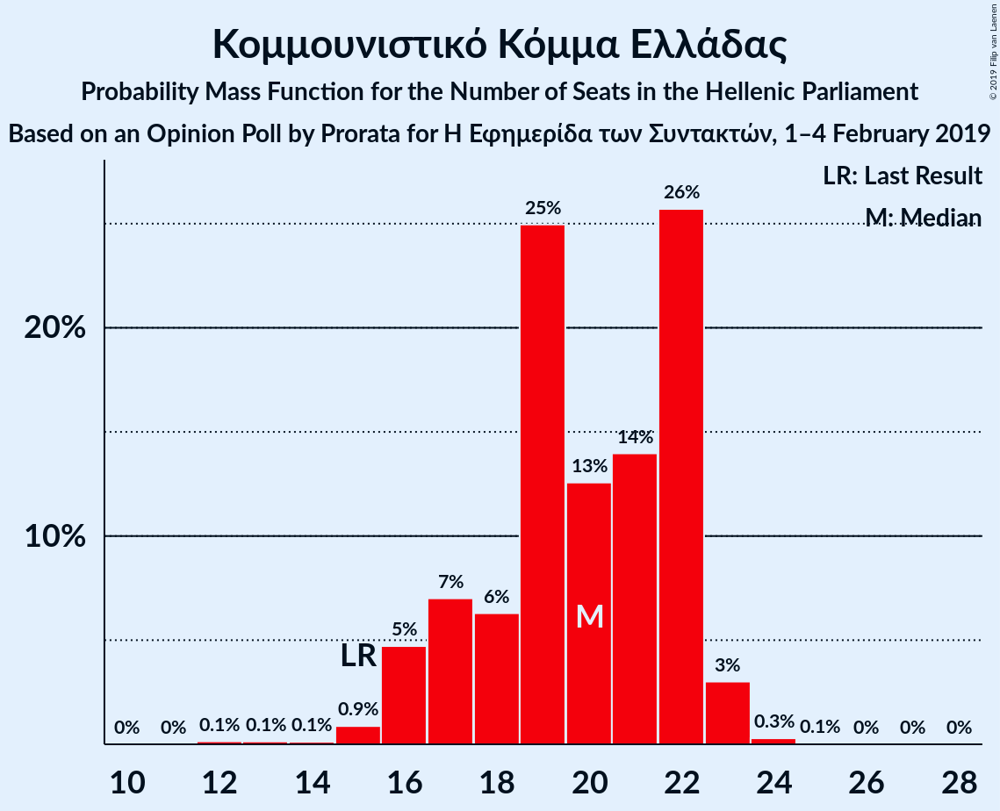

| Number of Seats | Probability | Accumulated | Special Marks |
|:---------------:|:-----------:|:-----------:|:-------------:|
| 12 | 0.1% | 100% |  |
| 13 | 0.1% | 99.8% |  |
| 14 | 0.1% | 99.7% |  |
| 15 | 0.9% | 99.6% | Last Result |
| 16 | 5% | 98.7% |  |
| 17 | 7% | 94% |  |
| 18 | 6% | 87% |  |
| 19 | 25% | 81% |  |
| 20 | 13% | 56% | Median |
| 21 | 14% | 43% |  |
| 22 | 26% | 29% |  |
| 23 | 3% | 3% |  |
| 24 | 0.3% | 0.4% |  |
| 25 | 0.1% | 0.1% |  |
| 26 | 0% | 0.1% |  |
| 27 | 0% | 0.1% |  |
| 28 | 0% | 0% |  |

### Ελληνική Λύση

*For a full overview of the results for this party, see the [Ελληνική Λύση](party-ελληνικήλύση.html) page.*

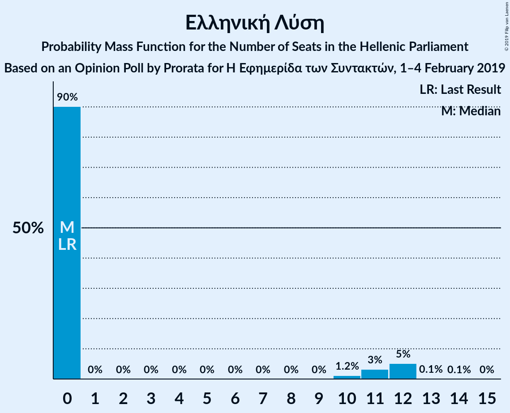

| Number of Seats | Probability | Accumulated | Special Marks |
|:---------------:|:-----------:|:-----------:|:-------------:|
| 0 | 90% | 100% | Last Result, Median |
| 1 | 0% | 10% |  |
| 2 | 0% | 10% |  |
| 3 | 0% | 10% |  |
| 4 | 0% | 10% |  |
| 5 | 0% | 10% |  |
| 6 | 0% | 10% |  |
| 7 | 0% | 10% |  |
| 8 | 0% | 10% |  |
| 9 | 0% | 10% |  |
| 10 | 1.2% | 10% |  |
| 11 | 3% | 9% |  |
| 12 | 5% | 5% |  |
| 13 | 0.1% | 0.2% |  |
| 14 | 0.1% | 0.1% |  |
| 15 | 0% | 0% |  |

### Ένωση Κεντρώων

*For a full overview of the results for this party, see the [Ένωση Κεντρώων](party-ένωσηκεντρώων.html) page.*

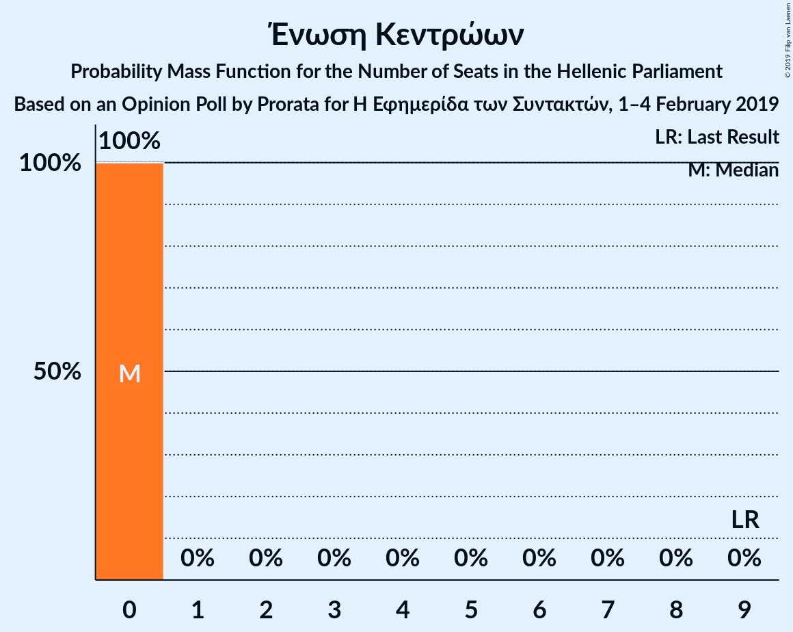

| Number of Seats | Probability | Accumulated | Special Marks |
|:---------------:|:-----------:|:-----------:|:-------------:|
| 0 | 100% | 100% | Median |
| 1 | 0% | 0% |  |
| 2 | 0% | 0% |  |
| 3 | 0% | 0% |  |
| 4 | 0% | 0% |  |
| 5 | 0% | 0% |  |
| 6 | 0% | 0% |  |
| 7 | 0% | 0% |  |
| 8 | 0% | 0% |  |
| 9 | 0% | 0% | Last Result |

### Πλεύση Ελευθερίας

*For a full overview of the results for this party, see the [Πλεύση Ελευθερίας](party-πλεύσηελευθερίας.html) page.*

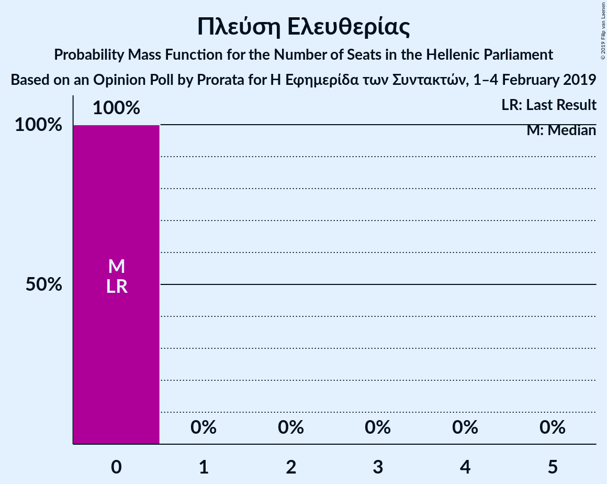

| Number of Seats | Probability | Accumulated | Special Marks |
|:---------------:|:-----------:|:-----------:|:-------------:|
| 0 | 100% | 100% | Last Result, Median |

### Το Ποτάμι

*For a full overview of the results for this party, see the [Το Ποτάμι](party-τοποτάμι.html) page.*

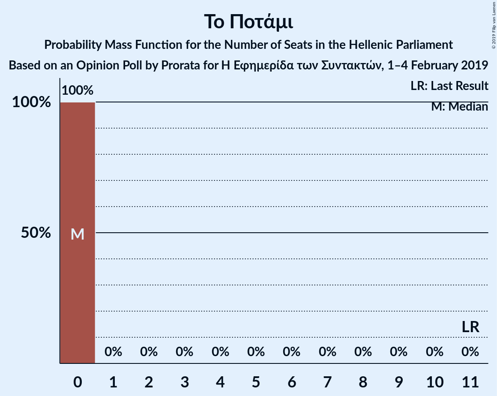

| Number of Seats | Probability | Accumulated | Special Marks |
|:---------------:|:-----------:|:-----------:|:-------------:|
| 0 | 100% | 100% | Median |
| 1 | 0% | 0% |  |
| 2 | 0% | 0% |  |
| 3 | 0% | 0% |  |
| 4 | 0% | 0% |  |
| 5 | 0% | 0% |  |
| 6 | 0% | 0% |  |
| 7 | 0% | 0% |  |
| 8 | 0% | 0% |  |
| 9 | 0% | 0% |  |
| 10 | 0% | 0% |  |
| 11 | 0% | 0% | Last Result |

### Λαϊκή Ενότητα

*For a full overview of the results for this party, see the [Λαϊκή Ενότητα](party-λαϊκήενότητα.html) page.*

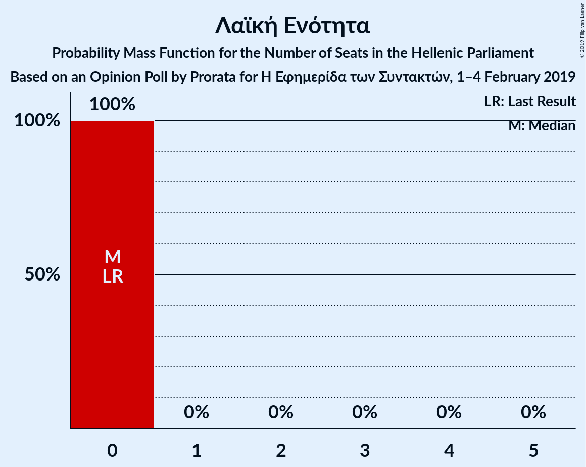

| Number of Seats | Probability | Accumulated | Special Marks |
|:---------------:|:-----------:|:-----------:|:-------------:|
| 0 | 100% | 100% | Last Result, Median |

## Coalitions

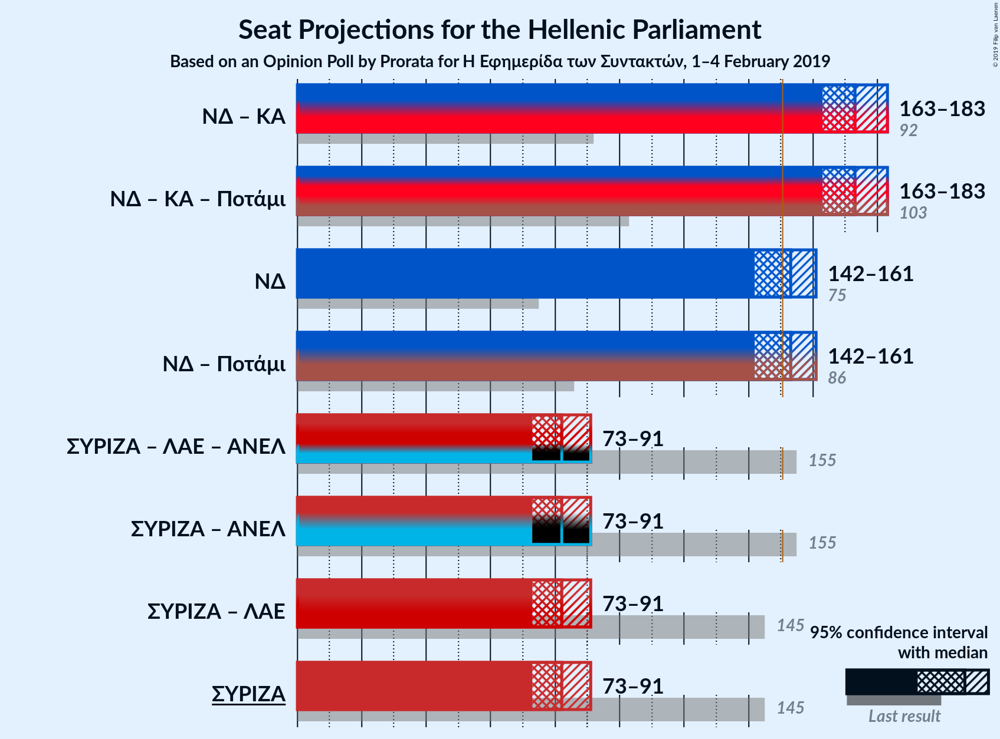

### Confidence Intervals

| Coalition | Last Result | Median | Majority? | 80% Confidence Interval | 90% Confidence Interval | 95% Confidence Interval | 99% Confidence Interval |
|:---------:|:-----------:|:------:|:---------:|:-----------------------:|:-----------------------:|:-----------------------:|:-----------------------:|
| Νέα Δημοκρατία – Κίνημα Αλλαγής | 92 | 173 | 99.5% | 166–178 | 163–180 | 163–183 | 156–183 |
| Νέα Δημοκρατία – Κίνημα Αλλαγής – Το Ποτάμι | 103 | 173 | 99.5% | 166–178 | 163–180 | 163–183 | 156–183 |
| Νέα Δημοκρατία | 75 | 153 | 56% | 146–157 | 145–159 | 142–161 | 137–163 |
| Νέα Δημοκρατία – Το Ποτάμι | 86 | 153 | 56% | 146–157 | 145–159 | 142–161 | 137–163 |
| Συνασπισμός Ριζοσπαστικής Αριστεράς – Λαϊκή Ενότητα | 145 | 82 | 0% | 76–88 | 76–90 | 73–91 | 73–96 |
| Συνασπισμός Ριζοσπαστικής Αριστεράς | 145 | 82 | 0% | 76–88 | 76–90 | 73–91 | 73–96 |

### Νέα Δημοκρατία – Κίνημα Αλλαγής

| Number of Seats | Probability | Accumulated | Special Marks |
|:---------------:|:-----------:|:-----------:|:-------------:|
| 92 | 0% | 100% | Last Result |
| 93 | 0% | 100% |  |
| 94 | 0% | 100% |  |
| 95 | 0% | 100% |  |
| 96 | 0% | 100% |  |
| 97 | 0% | 100% |  |
| 98 | 0% | 100% |  |
| 99 | 0% | 100% |  |
| 100 | 0% | 100% |  |
| 101 | 0% | 100% |  |
| 102 | 0% | 100% |  |
| 103 | 0% | 100% |  |
| 104 | 0% | 100% |  |
| 105 | 0% | 100% |  |
| 106 | 0% | 100% |  |
| 107 | 0.1% | 100% |  |
| 108 | 0% | 99.8% |  |
| 109 | 0.1% | 99.8% |  |
| 110 | 0% | 99.7% |  |
| 111 | 0% | 99.7% |  |
| 112 | 0.1% | 99.7% |  |
| 113 | 0% | 99.6% |  |
| 114 | 0% | 99.5% |  |
| 115 | 0% | 99.5% |  |
| 116 | 0% | 99.5% |  |
| 117 | 0% | 99.5% |  |
| 118 | 0% | 99.5% |  |
| 119 | 0% | 99.5% |  |
| 120 | 0% | 99.5% |  |
| 121 | 0% | 99.5% |  |
| 122 | 0% | 99.5% |  |
| 123 | 0% | 99.5% |  |
| 124 | 0% | 99.5% |  |
| 125 | 0% | 99.5% |  |
| 126 | 0% | 99.5% |  |
| 127 | 0% | 99.5% |  |
| 128 | 0% | 99.5% |  |
| 129 | 0% | 99.5% |  |
| 130 | 0% | 99.5% |  |
| 131 | 0% | 99.5% |  |
| 132 | 0% | 99.5% |  |
| 133 | 0% | 99.5% |  |
| 134 | 0% | 99.5% |  |
| 135 | 0% | 99.5% |  |
| 136 | 0% | 99.5% |  |
| 137 | 0% | 99.5% |  |
| 138 | 0% | 99.5% |  |
| 139 | 0% | 99.5% |  |
| 140 | 0% | 99.5% |  |
| 141 | 0% | 99.5% |  |
| 142 | 0% | 99.5% |  |
| 143 | 0% | 99.5% |  |
| 144 | 0% | 99.5% |  |
| 145 | 0% | 99.5% |  |
| 146 | 0% | 99.5% |  |
| 147 | 0% | 99.5% |  |
| 148 | 0% | 99.5% |  |
| 149 | 0% | 99.5% |  |
| 150 | 0% | 99.5% |  |
| 151 | 0% | 99.5% | Majority |
| 152 | 0% | 99.5% |  |
| 153 | 0% | 99.5% |  |
| 154 | 0% | 99.5% |  |
| 155 | 0% | 99.5% |  |
| 156 | 0% | 99.5% |  |
| 157 | 0% | 99.5% |  |
| 158 | 0.1% | 99.4% |  |
| 159 | 0.5% | 99.3% |  |
| 160 | 0.1% | 98.8% |  |
| 161 | 0.1% | 98.7% |  |
| 162 | 0.3% | 98.6% |  |
| 163 | 4% | 98% |  |
| 164 | 2% | 94% |  |
| 165 | 2% | 92% |  |
| 166 | 1.2% | 91% |  |
| 167 | 2% | 89% |  |
| 168 | 2% | 87% |  |
| 169 | 6% | 86% |  |
| 170 | 20% | 80% |  |
| 171 | 3% | 59% |  |
| 172 | 5% | 56% |  |
| 173 | 1.4% | 51% |  |
| 174 | 4% | 49% | Median |
| 175 | 10% | 45% |  |
| 176 | 2% | 35% |  |
| 177 | 21% | 33% |  |
| 178 | 5% | 12% |  |
| 179 | 1.4% | 6% |  |
| 180 | 0.2% | 5% |  |
| 181 | 0.5% | 5% |  |
| 182 | 2% | 4% |  |
| 183 | 2% | 3% |  |
| 184 | 0.3% | 0.4% |  |
| 185 | 0% | 0.1% |  |
| 186 | 0% | 0.1% |  |
| 187 | 0% | 0% |  |

### Νέα Δημοκρατία – Κίνημα Αλλαγής – Το Ποτάμι

| Number of Seats | Probability | Accumulated | Special Marks |
|:---------------:|:-----------:|:-----------:|:-------------:|
| 103 | 0% | 100% | Last Result |
| 104 | 0% | 100% |  |
| 105 | 0% | 100% |  |
| 106 | 0% | 100% |  |
| 107 | 0.1% | 100% |  |
| 108 | 0% | 99.8% |  |
| 109 | 0.1% | 99.8% |  |
| 110 | 0% | 99.7% |  |
| 111 | 0% | 99.7% |  |
| 112 | 0.1% | 99.7% |  |
| 113 | 0% | 99.6% |  |
| 114 | 0% | 99.5% |  |
| 115 | 0% | 99.5% |  |
| 116 | 0% | 99.5% |  |
| 117 | 0% | 99.5% |  |
| 118 | 0% | 99.5% |  |
| 119 | 0% | 99.5% |  |
| 120 | 0% | 99.5% |  |
| 121 | 0% | 99.5% |  |
| 122 | 0% | 99.5% |  |
| 123 | 0% | 99.5% |  |
| 124 | 0% | 99.5% |  |
| 125 | 0% | 99.5% |  |
| 126 | 0% | 99.5% |  |
| 127 | 0% | 99.5% |  |
| 128 | 0% | 99.5% |  |
| 129 | 0% | 99.5% |  |
| 130 | 0% | 99.5% |  |
| 131 | 0% | 99.5% |  |
| 132 | 0% | 99.5% |  |
| 133 | 0% | 99.5% |  |
| 134 | 0% | 99.5% |  |
| 135 | 0% | 99.5% |  |
| 136 | 0% | 99.5% |  |
| 137 | 0% | 99.5% |  |
| 138 | 0% | 99.5% |  |
| 139 | 0% | 99.5% |  |
| 140 | 0% | 99.5% |  |
| 141 | 0% | 99.5% |  |
| 142 | 0% | 99.5% |  |
| 143 | 0% | 99.5% |  |
| 144 | 0% | 99.5% |  |
| 145 | 0% | 99.5% |  |
| 146 | 0% | 99.5% |  |
| 147 | 0% | 99.5% |  |
| 148 | 0% | 99.5% |  |
| 149 | 0% | 99.5% |  |
| 150 | 0% | 99.5% |  |
| 151 | 0% | 99.5% | Majority |
| 152 | 0% | 99.5% |  |
| 153 | 0% | 99.5% |  |
| 154 | 0% | 99.5% |  |
| 155 | 0% | 99.5% |  |
| 156 | 0% | 99.5% |  |
| 157 | 0% | 99.5% |  |
| 158 | 0.1% | 99.4% |  |
| 159 | 0.5% | 99.3% |  |
| 160 | 0.1% | 98.8% |  |
| 161 | 0.1% | 98.7% |  |
| 162 | 0.3% | 98.6% |  |
| 163 | 4% | 98% |  |
| 164 | 2% | 94% |  |
| 165 | 2% | 92% |  |
| 166 | 1.2% | 91% |  |
| 167 | 2% | 89% |  |
| 168 | 2% | 87% |  |
| 169 | 6% | 86% |  |
| 170 | 20% | 80% |  |
| 171 | 3% | 59% |  |
| 172 | 5% | 56% |  |
| 173 | 1.4% | 51% |  |
| 174 | 4% | 49% | Median |
| 175 | 10% | 45% |  |
| 176 | 2% | 35% |  |
| 177 | 21% | 33% |  |
| 178 | 5% | 12% |  |
| 179 | 1.4% | 6% |  |
| 180 | 0.2% | 5% |  |
| 181 | 0.5% | 5% |  |
| 182 | 2% | 4% |  |
| 183 | 2% | 3% |  |
| 184 | 0.3% | 0.4% |  |
| 185 | 0% | 0.1% |  |
| 186 | 0% | 0.1% |  |
| 187 | 0% | 0% |  |

### Νέα Δημοκρατία

| Number of Seats | Probability | Accumulated | Special Marks |
|:---------------:|:-----------:|:-----------:|:-------------:|
| 75 | 0% | 100% | Last Result |
| 76 | 0% | 100% |  |
| 77 | 0% | 100% |  |
| 78 | 0% | 100% |  |
| 79 | 0% | 100% |  |
| 80 | 0% | 100% |  |
| 81 | 0% | 100% |  |
| 82 | 0% | 100% |  |
| 83 | 0% | 100% |  |
| 84 | 0% | 100% |  |
| 85 | 0% | 100% |  |
| 86 | 0% | 100% |  |
| 87 | 0% | 100% |  |
| 88 | 0.1% | 100% |  |
| 89 | 0% | 99.8% |  |
| 90 | 0.1% | 99.8% |  |
| 91 | 0% | 99.8% |  |
| 92 | 0.1% | 99.7% |  |
| 93 | 0% | 99.6% |  |
| 94 | 0.1% | 99.6% |  |
| 95 | 0% | 99.5% |  |
| 96 | 0% | 99.5% |  |
| 97 | 0% | 99.5% |  |
| 98 | 0% | 99.5% |  |
| 99 | 0% | 99.5% |  |
| 100 | 0% | 99.5% |  |
| 101 | 0% | 99.5% |  |
| 102 | 0% | 99.5% |  |
| 103 | 0% | 99.5% |  |
| 104 | 0% | 99.5% |  |
| 105 | 0% | 99.5% |  |
| 106 | 0% | 99.5% |  |
| 107 | 0% | 99.5% |  |
| 108 | 0% | 99.5% |  |
| 109 | 0% | 99.5% |  |
| 110 | 0% | 99.5% |  |
| 111 | 0% | 99.5% |  |
| 112 | 0% | 99.5% |  |
| 113 | 0% | 99.5% |  |
| 114 | 0% | 99.5% |  |
| 115 | 0% | 99.5% |  |
| 116 | 0% | 99.5% |  |
| 117 | 0% | 99.5% |  |
| 118 | 0% | 99.5% |  |
| 119 | 0% | 99.5% |  |
| 120 | 0% | 99.5% |  |
| 121 | 0% | 99.5% |  |
| 122 | 0% | 99.5% |  |
| 123 | 0% | 99.5% |  |
| 124 | 0% | 99.5% |  |
| 125 | 0% | 99.5% |  |
| 126 | 0% | 99.5% |  |
| 127 | 0% | 99.5% |  |
| 128 | 0% | 99.5% |  |
| 129 | 0% | 99.5% |  |
| 130 | 0% | 99.5% |  |
| 131 | 0% | 99.5% |  |
| 132 | 0% | 99.5% |  |
| 133 | 0% | 99.5% |  |
| 134 | 0% | 99.5% |  |
| 135 | 0% | 99.5% |  |
| 136 | 0% | 99.5% |  |
| 137 | 0% | 99.5% |  |
| 138 | 0.2% | 99.5% |  |
| 139 | 0.3% | 99.3% |  |
| 140 | 0.5% | 99.0% |  |
| 141 | 0.1% | 98.6% |  |
| 142 | 2% | 98% |  |
| 143 | 0.3% | 97% |  |
| 144 | 1.0% | 97% |  |
| 145 | 5% | 96% |  |
| 146 | 1.4% | 91% |  |
| 147 | 2% | 89% |  |
| 148 | 9% | 87% |  |
| 149 | 20% | 78% |  |
| 150 | 3% | 59% |  |
| 151 | 3% | 56% | Majority |
| 152 | 0.5% | 53% |  |
| 153 | 21% | 52% | Median |
| 154 | 1.0% | 31% |  |
| 155 | 15% | 30% |  |
| 156 | 5% | 15% |  |
| 157 | 2% | 11% |  |
| 158 | 3% | 9% |  |
| 159 | 2% | 6% |  |
| 160 | 2% | 5% |  |
| 161 | 1.5% | 3% |  |
| 162 | 0.1% | 1.0% |  |
| 163 | 0.7% | 0.9% |  |
| 164 | 0.1% | 0.2% |  |
| 165 | 0.1% | 0.1% |  |
| 166 | 0% | 0% |  |

### Νέα Δημοκρατία – Το Ποτάμι

| Number of Seats | Probability | Accumulated | Special Marks |
|:---------------:|:-----------:|:-----------:|:-------------:|
| 86 | 0% | 100% | Last Result |
| 87 | 0% | 100% |  |
| 88 | 0.1% | 100% |  |
| 89 | 0% | 99.8% |  |
| 90 | 0.1% | 99.8% |  |
| 91 | 0% | 99.8% |  |
| 92 | 0.1% | 99.7% |  |
| 93 | 0% | 99.6% |  |
| 94 | 0.1% | 99.6% |  |
| 95 | 0% | 99.5% |  |
| 96 | 0% | 99.5% |  |
| 97 | 0% | 99.5% |  |
| 98 | 0% | 99.5% |  |
| 99 | 0% | 99.5% |  |
| 100 | 0% | 99.5% |  |
| 101 | 0% | 99.5% |  |
| 102 | 0% | 99.5% |  |
| 103 | 0% | 99.5% |  |
| 104 | 0% | 99.5% |  |
| 105 | 0% | 99.5% |  |
| 106 | 0% | 99.5% |  |
| 107 | 0% | 99.5% |  |
| 108 | 0% | 99.5% |  |
| 109 | 0% | 99.5% |  |
| 110 | 0% | 99.5% |  |
| 111 | 0% | 99.5% |  |
| 112 | 0% | 99.5% |  |
| 113 | 0% | 99.5% |  |
| 114 | 0% | 99.5% |  |
| 115 | 0% | 99.5% |  |
| 116 | 0% | 99.5% |  |
| 117 | 0% | 99.5% |  |
| 118 | 0% | 99.5% |  |
| 119 | 0% | 99.5% |  |
| 120 | 0% | 99.5% |  |
| 121 | 0% | 99.5% |  |
| 122 | 0% | 99.5% |  |
| 123 | 0% | 99.5% |  |
| 124 | 0% | 99.5% |  |
| 125 | 0% | 99.5% |  |
| 126 | 0% | 99.5% |  |
| 127 | 0% | 99.5% |  |
| 128 | 0% | 99.5% |  |
| 129 | 0% | 99.5% |  |
| 130 | 0% | 99.5% |  |
| 131 | 0% | 99.5% |  |
| 132 | 0% | 99.5% |  |
| 133 | 0% | 99.5% |  |
| 134 | 0% | 99.5% |  |
| 135 | 0% | 99.5% |  |
| 136 | 0% | 99.5% |  |
| 137 | 0% | 99.5% |  |
| 138 | 0.2% | 99.5% |  |
| 139 | 0.3% | 99.3% |  |
| 140 | 0.5% | 99.0% |  |
| 141 | 0.1% | 98.6% |  |
| 142 | 2% | 98% |  |
| 143 | 0.3% | 97% |  |
| 144 | 1.0% | 97% |  |
| 145 | 5% | 96% |  |
| 146 | 1.4% | 91% |  |
| 147 | 2% | 89% |  |
| 148 | 9% | 87% |  |
| 149 | 20% | 78% |  |
| 150 | 3% | 59% |  |
| 151 | 3% | 56% | Majority |
| 152 | 0.5% | 53% |  |
| 153 | 21% | 52% | Median |
| 154 | 1.0% | 31% |  |
| 155 | 15% | 30% |  |
| 156 | 5% | 15% |  |
| 157 | 2% | 11% |  |
| 158 | 3% | 9% |  |
| 159 | 2% | 6% |  |
| 160 | 2% | 5% |  |
| 161 | 1.5% | 3% |  |
| 162 | 0.1% | 1.0% |  |
| 163 | 0.7% | 0.9% |  |
| 164 | 0.1% | 0.2% |  |
| 165 | 0.1% | 0.1% |  |
| 166 | 0% | 0% |  |

### Συνασπισμός Ριζοσπαστικής Αριστεράς – Λαϊκή Ενότητα

| Number of Seats | Probability | Accumulated | Special Marks |
|:---------------:|:-----------:|:-----------:|:-------------:|
| 69 | 0% | 100% |  |
| 70 | 0% | 99.9% |  |
| 71 | 0.1% | 99.9% |  |
| 72 | 0.2% | 99.8% |  |
| 73 | 2% | 99.6% |  |
| 74 | 0.3% | 97% |  |
| 75 | 0.6% | 97% |  |
| 76 | 6% | 96% |  |
| 77 | 3% | 90% |  |
| 78 | 2% | 87% |  |
| 79 | 3% | 85% |  |
| 80 | 8% | 82% |  |
| 81 | 3% | 74% |  |
| 82 | 39% | 71% | Median |
| 83 | 2% | 32% |  |
| 84 | 2% | 29% |  |
| 85 | 3% | 27% |  |
| 86 | 8% | 24% |  |
| 87 | 2% | 16% |  |
| 88 | 5% | 14% |  |
| 89 | 3% | 9% |  |
| 90 | 2% | 5% |  |
| 91 | 2% | 3% |  |
| 92 | 0.6% | 1.4% |  |
| 93 | 0.1% | 0.9% |  |
| 94 | 0.1% | 0.8% |  |
| 95 | 0% | 0.7% |  |
| 96 | 0.2% | 0.7% |  |
| 97 | 0% | 0.5% |  |
| 98 | 0% | 0.5% |  |
| 99 | 0% | 0.5% |  |
| 100 | 0% | 0.5% |  |
| 101 | 0% | 0.5% |  |
| 102 | 0% | 0.5% |  |
| 103 | 0% | 0.5% |  |
| 104 | 0% | 0.5% |  |
| 105 | 0% | 0.5% |  |
| 106 | 0% | 0.5% |  |
| 107 | 0% | 0.5% |  |
| 108 | 0% | 0.5% |  |
| 109 | 0% | 0.5% |  |
| 110 | 0% | 0.5% |  |
| 111 | 0% | 0.5% |  |
| 112 | 0% | 0.5% |  |
| 113 | 0% | 0.5% |  |
| 114 | 0% | 0.5% |  |
| 115 | 0% | 0.5% |  |
| 116 | 0% | 0.5% |  |
| 117 | 0% | 0.5% |  |
| 118 | 0% | 0.5% |  |
| 119 | 0% | 0.5% |  |
| 120 | 0% | 0.5% |  |
| 121 | 0% | 0.5% |  |
| 122 | 0% | 0.5% |  |
| 123 | 0% | 0.5% |  |
| 124 | 0% | 0.5% |  |
| 125 | 0% | 0.5% |  |
| 126 | 0% | 0.5% |  |
| 127 | 0% | 0.5% |  |
| 128 | 0% | 0.5% |  |
| 129 | 0% | 0.5% |  |
| 130 | 0% | 0.5% |  |
| 131 | 0% | 0.5% |  |
| 132 | 0% | 0.5% |  |
| 133 | 0% | 0.5% |  |
| 134 | 0% | 0.5% |  |
| 135 | 0% | 0.5% |  |
| 136 | 0% | 0.5% |  |
| 137 | 0% | 0.5% |  |
| 138 | 0% | 0.5% |  |
| 139 | 0% | 0.5% |  |
| 140 | 0% | 0.5% |  |
| 141 | 0.2% | 0.5% |  |
| 142 | 0% | 0.3% |  |
| 143 | 0.1% | 0.3% |  |
| 144 | 0% | 0.2% |  |
| 145 | 0% | 0.2% | Last Result |
| 146 | 0.1% | 0.2% |  |
| 147 | 0% | 0.1% |  |
| 148 | 0% | 0% |  |

### Συνασπισμός Ριζοσπαστικής Αριστεράς

| Number of Seats | Probability | Accumulated | Special Marks |
|:---------------:|:-----------:|:-----------:|:-------------:|
| 69 | 0% | 100% |  |
| 70 | 0% | 99.9% |  |
| 71 | 0.1% | 99.9% |  |
| 72 | 0.2% | 99.8% |  |
| 73 | 2% | 99.6% |  |
| 74 | 0.3% | 97% |  |
| 75 | 0.6% | 97% |  |
| 76 | 6% | 96% |  |
| 77 | 3% | 90% |  |
| 78 | 2% | 87% |  |
| 79 | 3% | 85% |  |
| 80 | 8% | 82% |  |
| 81 | 3% | 74% |  |
| 82 | 39% | 71% | Median |
| 83 | 2% | 32% |  |
| 84 | 2% | 29% |  |
| 85 | 3% | 27% |  |
| 86 | 8% | 24% |  |
| 87 | 2% | 16% |  |
| 88 | 5% | 14% |  |
| 89 | 3% | 9% |  |
| 90 | 2% | 5% |  |
| 91 | 2% | 3% |  |
| 92 | 0.6% | 1.4% |  |
| 93 | 0.1% | 0.9% |  |
| 94 | 0.1% | 0.8% |  |
| 95 | 0% | 0.7% |  |
| 96 | 0.2% | 0.7% |  |
| 97 | 0% | 0.5% |  |
| 98 | 0% | 0.5% |  |
| 99 | 0% | 0.5% |  |
| 100 | 0% | 0.5% |  |
| 101 | 0% | 0.5% |  |
| 102 | 0% | 0.5% |  |
| 103 | 0% | 0.5% |  |
| 104 | 0% | 0.5% |  |
| 105 | 0% | 0.5% |  |
| 106 | 0% | 0.5% |  |
| 107 | 0% | 0.5% |  |
| 108 | 0% | 0.5% |  |
| 109 | 0% | 0.5% |  |
| 110 | 0% | 0.5% |  |
| 111 | 0% | 0.5% |  |
| 112 | 0% | 0.5% |  |
| 113 | 0% | 0.5% |  |
| 114 | 0% | 0.5% |  |
| 115 | 0% | 0.5% |  |
| 116 | 0% | 0.5% |  |
| 117 | 0% | 0.5% |  |
| 118 | 0% | 0.5% |  |
| 119 | 0% | 0.5% |  |
| 120 | 0% | 0.5% |  |
| 121 | 0% | 0.5% |  |
| 122 | 0% | 0.5% |  |
| 123 | 0% | 0.5% |  |
| 124 | 0% | 0.5% |  |
| 125 | 0% | 0.5% |  |
| 126 | 0% | 0.5% |  |
| 127 | 0% | 0.5% |  |
| 128 | 0% | 0.5% |  |
| 129 | 0% | 0.5% |  |
| 130 | 0% | 0.5% |  |
| 131 | 0% | 0.5% |  |
| 132 | 0% | 0.5% |  |
| 133 | 0% | 0.5% |  |
| 134 | 0% | 0.5% |  |
| 135 | 0% | 0.5% |  |
| 136 | 0% | 0.5% |  |
| 137 | 0% | 0.5% |  |
| 138 | 0% | 0.5% |  |
| 139 | 0% | 0.5% |  |
| 140 | 0% | 0.5% |  |
| 141 | 0.2% | 0.5% |  |
| 142 | 0% | 0.3% |  |
| 143 | 0.1% | 0.3% |  |
| 144 | 0% | 0.2% |  |
| 145 | 0% | 0.2% | Last Result |
| 146 | 0.1% | 0.2% |  |
| 147 | 0% | 0.1% |  |
| 148 | 0% | 0% |  |

## Technical Information

### Opinion Poll

+ **Polling firm:** Prorata
+ **Commissioner(s):** Η Εφημερίδα των Συντακτών
+ **Fieldwork period:** 1–4 February 2019

### Calculations

+ **Sample size:** 1000
+ **Simulations done:** 1,048,576
+ **Error estimate:** 2.04%

