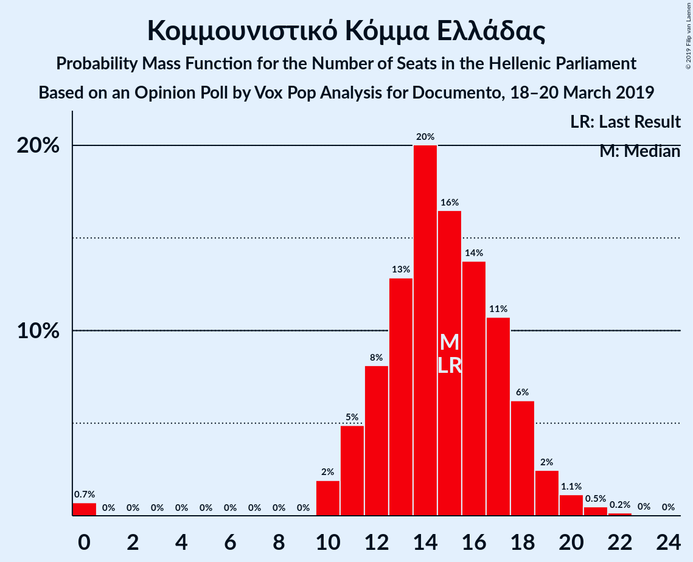
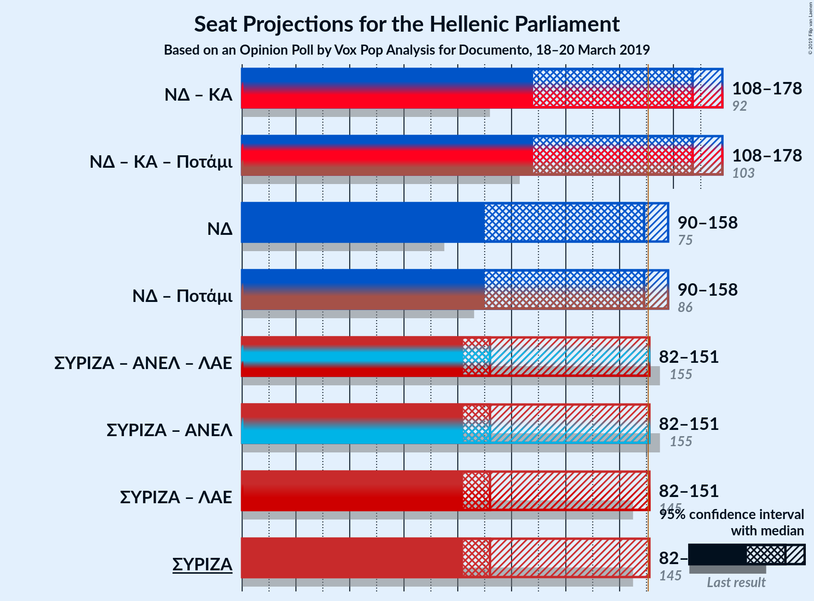
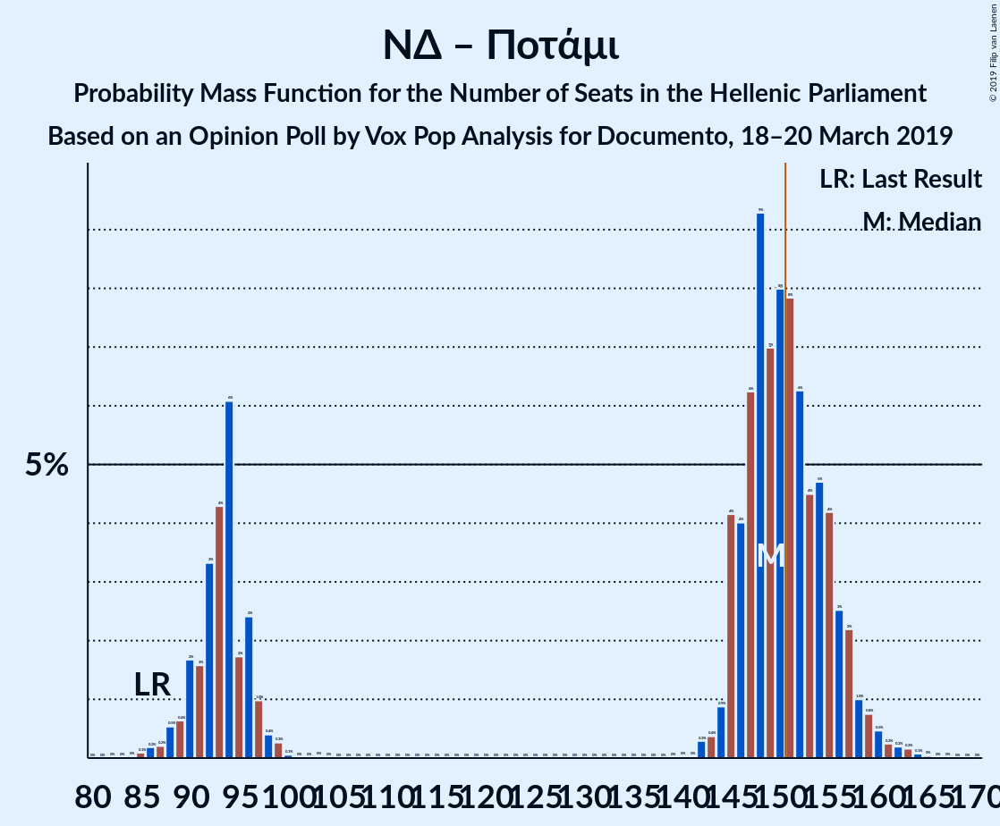
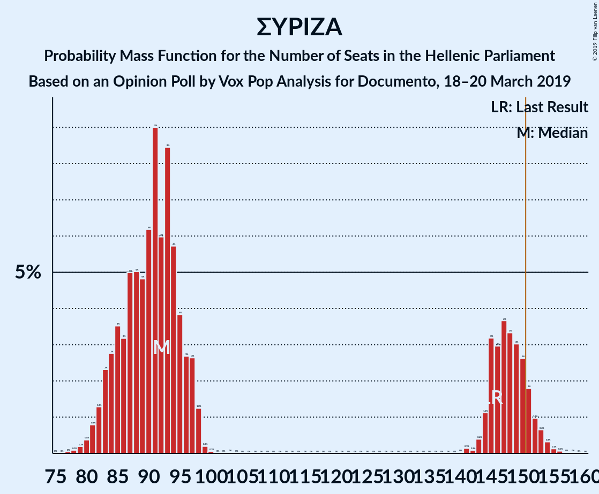

# Opinion Poll by Vox Pop Analysis for Documento, 18–20 March 2019

<a href="#voting-intentions">Voting Intentions</a> | <a href="#seats">Seats</a> | <a href="#coalitions">Coalitions</a> | <a href="#technical-information">Technical Information</a>

## Voting Intentions

### Confidence Intervals

| Party | Last Result | Poll Result | 80% Confidence Interval | 90% Confidence Interval | 95% Confidence Interval | 99% Confidence Interval |
|:-----:|:-----------:|:-----------:|:-----------------------:|:-----------------------:|:-----------------------:|:-----------------------:|
| Νέα Δημοκρατία | 28.1% | 30.5% | 28.7–32.4% |28.2–33.0% |27.7–33.4% |26.9–34.4% |
| Συνασπισμός Ριζοσπαστικής Αριστεράς | 35.5% | 28.2% | 26.4–30.1% |25.9–30.6% |25.5–31.1% |24.7–32.0% |
| Χρυσή Αυγή | 7.0% | 7.8% | 6.8–9.0% |6.5–9.3% |6.3–9.6% |5.8–10.2% |
| Κίνημα Αλλαγής | 6.3% | 5.8% | 5.0–6.9% |4.7–7.2% |4.5–7.4% |4.1–8.0% |
| Κομμουνιστικό Κόμμα Ελλάδας | 5.6% | 4.4% | 3.7–5.3% |3.5–5.6% |3.3–5.9% |3.0–6.4% |
| Το Ποτάμι | 4.1% | 0.8% | 0.5–1.3% |0.5–1.4% |0.4–1.6% |0.3–1.9% |
| Ένωση Κεντρώων | 3.4% | 0.7% | 0.5–1.2% |0.4–1.3% |0.3–1.4% |0.2–1.7% |
| Ανεξάρτητοι Έλληνες | 3.7% | 0.4% | 0.2–0.8% |0.2–0.9% |0.2–1.0% |0.1–1.3% |

*Note:* The poll result column reflects the actual value used in the calculations. Published results may vary slightly, and in addition be rounded to fewer digits.

## Seats

### Confidence Intervals

| Party | Last Result | Median | 80% Confidence Interval | 90% Confidence Interval | 95% Confidence Interval | 99% Confidence Interval |
|:-----:|:-----------:|:------:|:-----------------------:|:-----------------------:|:-----------------------:|:-----------------------:|
| <a href="#νέα-δημοκρατία">Νέα Δημοκρατία</a> | 75 | 149 | 93–155 |92–157 |90–158 |87–161 |
| <a href="#συνασπισμός-ριζοσπαστικής-αριστεράς">Συνασπισμός Ριζοσπαστικής Αριστεράς</a> | 145 | 92 | 85–148 |83–150 |82–151 |80–154 |
| <a href="#χρυσή-αυγή">Χρυσή Αυγή</a> | 18 | 25 | 22–29 |21–30 |20–31 |19–33 |
| <a href="#κίνημα-αλλαγής">Κίνημα Αλλαγής</a> | 17 | 19 | 16–23 |15–23 |14–25 |13–26 |
| <a href="#κομμουνιστικό-κόμμα-ελλάδας">Κομμουνιστικό Κόμμα Ελλάδας</a> | 15 | 15 | 12–18 |11–18 |10–19 |0–21 |
| <a href="#το-ποτάμι">Το Ποτάμι</a> | 11 | 0 | 0 |0 |0 |0 |
| <a href="#ένωση-κεντρώων">Ένωση Κεντρώων</a> | 9 | 0 | 0 |0 |0 |0 |
| <a href="#ανεξάρτητοι-έλληνες">Ανεξάρτητοι Έλληνες</a> | 10 | 0 | 0 |0 |0 |0 |

### Νέα Δημοκρατία

*For a full overview of the results for this party, see the [Νέα Δημοκρατία](party-νέαδημοκρατία.html) page.*

| Number of Seats | Probability | Accumulated | Special Marks |
|:---------------:|:-----------:|:-----------:|:-------------:|
| 75 | 0% | 100% | Last Result |
| 76 | 0% | 100% |  |
| 77 | 0% | 100% |  |
| 78 | 0% | 100% |  |
| 79 | 0% | 100% |  |
| 80 | 0% | 100% |  |
| 81 | 0% | 100% |  |
| 82 | 0% | 100% |  |
| 83 | 0% | 100% |  |
| 84 | 0% | 100% |  |
| 85 | 0.1% | 99.9% |  |
| 86 | 0.2% | 99.9% |  |
| 87 | 0.2% | 99.7% |  |
| 88 | 0.5% | 99.5% |  |
| 89 | 0.6% | 98.9% |  |
| 90 | 2% | 98% |  |
| 91 | 2% | 97% |  |
| 92 | 3% | 95% |  |
| 93 | 4% | 92% |  |
| 94 | 6% | 87% |  |
| 95 | 2% | 81% |  |
| 96 | 2% | 80% |  |
| 97 | 1.0% | 77% |  |
| 98 | 0.4% | 76% |  |
| 99 | 0.3% | 76% |  |
| 100 | 0.1% | 76% |  |
| 101 | 0% | 75% |  |
| 102 | 0% | 75% |  |
| 103 | 0% | 75% |  |
| 104 | 0% | 75% |  |
| 105 | 0% | 75% |  |
| 106 | 0% | 75% |  |
| 107 | 0% | 75% |  |
| 108 | 0% | 75% |  |
| 109 | 0% | 75% |  |
| 110 | 0% | 75% |  |
| 111 | 0% | 75% |  |
| 112 | 0% | 75% |  |
| 113 | 0% | 75% |  |
| 114 | 0% | 75% |  |
| 115 | 0% | 75% |  |
| 116 | 0% | 75% |  |
| 117 | 0% | 75% |  |
| 118 | 0% | 75% |  |
| 119 | 0% | 75% |  |
| 120 | 0% | 75% |  |
| 121 | 0% | 75% |  |
| 122 | 0% | 75% |  |
| 123 | 0% | 75% |  |
| 124 | 0% | 75% |  |
| 125 | 0% | 75% |  |
| 126 | 0% | 75% |  |
| 127 | 0% | 75% |  |
| 128 | 0% | 75% |  |
| 129 | 0% | 75% |  |
| 130 | 0% | 75% |  |
| 131 | 0% | 75% |  |
| 132 | 0% | 75% |  |
| 133 | 0% | 75% |  |
| 134 | 0% | 75% |  |
| 135 | 0% | 75% |  |
| 136 | 0% | 75% |  |
| 137 | 0% | 75% |  |
| 138 | 0% | 75% |  |
| 139 | 0% | 75% |  |
| 140 | 0% | 75% |  |
| 141 | 0% | 75% |  |
| 142 | 0.3% | 75% |  |
| 143 | 0.4% | 75% |  |
| 144 | 0.9% | 75% |  |
| 145 | 4% | 74% |  |
| 146 | 4% | 70% |  |
| 147 | 6% | 66% |  |
| 148 | 9% | 59% |  |
| 149 | 7% | 50% | Median |
| 150 | 8% | 43% |  |
| 151 | 8% | 35% | Majority |
| 152 | 6% | 27% |  |
| 153 | 4% | 21% |  |
| 154 | 5% | 17% |  |
| 155 | 4% | 12% |  |
| 156 | 3% | 8% |  |
| 157 | 2% | 5% |  |
| 158 | 1.0% | 3% |  |
| 159 | 0.8% | 2% |  |
| 160 | 0.5% | 1.2% |  |
| 161 | 0.2% | 0.7% |  |
| 162 | 0.2% | 0.5% |  |
| 163 | 0.2% | 0.3% |  |
| 164 | 0.1% | 0.1% |  |
| 165 | 0% | 0.1% |  |
| 166 | 0% | 0% |  |

### Συνασπισμός Ριζοσπαστικής Αριστεράς

*For a full overview of the results for this party, see the [Συνασπισμός Ριζοσπαστικής Αριστεράς](party-συνασπισμόςριζοσπαστικήςαριστεράς.html) page.*

| Number of Seats | Probability | Accumulated | Special Marks |
|:---------------:|:-----------:|:-----------:|:-------------:|
| 77 | 0% | 100% |  |
| 78 | 0.1% | 99.9% |  |
| 79 | 0.2% | 99.8% |  |
| 80 | 0.4% | 99.6% |  |
| 81 | 0.8% | 99.3% |  |
| 82 | 1.3% | 98% |  |
| 83 | 2% | 97% |  |
| 84 | 3% | 95% |  |
| 85 | 4% | 92% |  |
| 86 | 3% | 89% |  |
| 87 | 5% | 85% |  |
| 88 | 5% | 80% |  |
| 89 | 5% | 75% |  |
| 90 | 6% | 71% |  |
| 91 | 9% | 64% |  |
| 92 | 6% | 55% | Median |
| 93 | 8% | 49% |  |
| 94 | 6% | 41% |  |
| 95 | 4% | 35% |  |
| 96 | 3% | 31% |  |
| 97 | 3% | 29% |  |
| 98 | 1.2% | 26% |  |
| 99 | 0.2% | 25% |  |
| 100 | 0.1% | 25% |  |
| 101 | 0% | 25% |  |
| 102 | 0% | 25% |  |
| 103 | 0% | 25% |  |
| 104 | 0% | 25% |  |
| 105 | 0% | 25% |  |
| 106 | 0% | 25% |  |
| 107 | 0% | 25% |  |
| 108 | 0% | 25% |  |
| 109 | 0% | 25% |  |
| 110 | 0% | 25% |  |
| 111 | 0% | 25% |  |
| 112 | 0% | 25% |  |
| 113 | 0% | 25% |  |
| 114 | 0% | 25% |  |
| 115 | 0% | 25% |  |
| 116 | 0% | 25% |  |
| 117 | 0% | 25% |  |
| 118 | 0% | 25% |  |
| 119 | 0% | 25% |  |
| 120 | 0% | 25% |  |
| 121 | 0% | 25% |  |
| 122 | 0% | 25% |  |
| 123 | 0% | 25% |  |
| 124 | 0% | 25% |  |
| 125 | 0% | 25% |  |
| 126 | 0% | 25% |  |
| 127 | 0% | 25% |  |
| 128 | 0% | 25% |  |
| 129 | 0% | 25% |  |
| 130 | 0% | 25% |  |
| 131 | 0% | 25% |  |
| 132 | 0% | 25% |  |
| 133 | 0% | 25% |  |
| 134 | 0% | 25% |  |
| 135 | 0% | 25% |  |
| 136 | 0% | 25% |  |
| 137 | 0% | 25% |  |
| 138 | 0% | 25% |  |
| 139 | 0% | 25% |  |
| 140 | 0% | 25% |  |
| 141 | 0.1% | 25% |  |
| 142 | 0.1% | 24% |  |
| 143 | 0.4% | 24% |  |
| 144 | 1.1% | 24% |  |
| 145 | 3% | 23% | Last Result |
| 146 | 3% | 20% |  |
| 147 | 4% | 17% |  |
| 148 | 3% | 13% |  |
| 149 | 3% | 10% |  |
| 150 | 3% | 7% |  |
| 151 | 2% | 4% | Majority |
| 152 | 1.0% | 2% |  |
| 153 | 0.6% | 1.2% |  |
| 154 | 0.3% | 0.6% |  |
| 155 | 0.1% | 0.3% |  |
| 156 | 0.1% | 0.1% |  |
| 157 | 0% | 0.1% |  |
| 158 | 0% | 0% |  |

### Χρυσή Αυγή

*For a full overview of the results for this party, see the [Χρυσή Αυγή](party-χρυσήαυγή.html) page.*

| Number of Seats | Probability | Accumulated | Special Marks |
|:---------------:|:-----------:|:-----------:|:-------------:|
| 17 | 0.1% | 100% |  |
| 18 | 0.3% | 99.9% | Last Result |
| 19 | 0.8% | 99.7% |  |
| 20 | 2% | 98.9% |  |
| 21 | 4% | 97% |  |
| 22 | 6% | 93% |  |
| 23 | 11% | 87% |  |
| 24 | 14% | 76% |  |
| 25 | 16% | 62% | Median |
| 26 | 12% | 46% |  |
| 27 | 9% | 34% |  |
| 28 | 9% | 24% |  |
| 29 | 6% | 15% |  |
| 30 | 6% | 9% |  |
| 31 | 2% | 4% |  |
| 32 | 1.0% | 2% |  |
| 33 | 0.4% | 0.8% |  |
| 34 | 0.3% | 0.4% |  |
| 35 | 0.1% | 0.1% |  |
| 36 | 0% | 0% |  |

### Κίνημα Αλλαγής

*For a full overview of the results for this party, see the [Κίνημα Αλλαγής](party-κίνημααλλαγής.html) page.*

| Number of Seats | Probability | Accumulated | Special Marks |
|:---------------:|:-----------:|:-----------:|:-------------:|
| 12 | 0.1% | 100% |  |
| 13 | 0.8% | 99.9% |  |
| 14 | 2% | 99.0% |  |
| 15 | 6% | 97% |  |
| 16 | 7% | 91% |  |
| 17 | 15% | 83% | Last Result |
| 18 | 14% | 69% |  |
| 19 | 13% | 55% | Median |
| 20 | 13% | 42% |  |
| 21 | 11% | 29% |  |
| 22 | 7% | 18% |  |
| 23 | 6% | 11% |  |
| 24 | 2% | 4% |  |
| 25 | 2% | 3% |  |
| 26 | 0.5% | 0.9% |  |
| 27 | 0.3% | 0.4% |  |
| 28 | 0.1% | 0.1% |  |
| 29 | 0% | 0% |  |

### Κομμουνιστικό Κόμμα Ελλάδας

*For a full overview of the results for this party, see the [Κομμουνιστικό Κόμμα Ελλάδας](party-κομμουνιστικόκόμμαελλάδας.html) page.*

| Number of Seats | Probability | Accumulated | Special Marks |
|:---------------:|:-----------:|:-----------:|:-------------:|
| 0 | 0.7% | 100% |  |
| 1 | 0% | 99.3% |  |
| 2 | 0% | 99.3% |  |
| 3 | 0% | 99.3% |  |
| 4 | 0% | 99.3% |  |
| 5 | 0% | 99.3% |  |
| 6 | 0% | 99.3% |  |
| 7 | 0% | 99.3% |  |
| 8 | 0% | 99.3% |  |
| 9 | 0% | 99.3% |  |
| 10 | 2% | 99.3% |  |
| 11 | 5% | 97% |  |
| 12 | 8% | 92% |  |
| 13 | 13% | 84% |  |
| 14 | 20% | 72% |  |
| 15 | 16% | 51% | Last Result, Median |
| 16 | 14% | 35% |  |
| 17 | 11% | 21% |  |
| 18 | 6% | 11% |  |
| 19 | 2% | 4% |  |
| 20 | 1.1% | 2% |  |
| 21 | 0.5% | 0.7% |  |
| 22 | 0.2% | 0.2% |  |
| 23 | 0% | 0.1% |  |
| 24 | 0% | 0% |  |

### Το Ποτάμι

*For a full overview of the results for this party, see the [Το Ποτάμι](party-τοποτάμι.html) page.*

| Number of Seats | Probability | Accumulated | Special Marks |
|:---------------:|:-----------:|:-----------:|:-------------:|
| 0 | 100% | 100% | Median |
| 1 | 0% | 0% |  |
| 2 | 0% | 0% |  |
| 3 | 0% | 0% |  |
| 4 | 0% | 0% |  |
| 5 | 0% | 0% |  |
| 6 | 0% | 0% |  |
| 7 | 0% | 0% |  |
| 8 | 0% | 0% |  |
| 9 | 0% | 0% |  |
| 10 | 0% | 0% |  |
| 11 | 0% | 0% | Last Result |

### Ένωση Κεντρώων

*For a full overview of the results for this party, see the [Ένωση Κεντρώων](party-ένωσηκεντρώων.html) page.*

| Number of Seats | Probability | Accumulated | Special Marks |
|:---------------:|:-----------:|:-----------:|:-------------:|
| 0 | 100% | 100% | Median |
| 1 | 0% | 0% |  |
| 2 | 0% | 0% |  |
| 3 | 0% | 0% |  |
| 4 | 0% | 0% |  |
| 5 | 0% | 0% |  |
| 6 | 0% | 0% |  |
| 7 | 0% | 0% |  |
| 8 | 0% | 0% |  |
| 9 | 0% | 0% | Last Result |

### Ανεξάρτητοι Έλληνες

*For a full overview of the results for this party, see the [Ανεξάρτητοι Έλληνες](party-ανεξάρτητοιέλληνες.html) page.*

| Number of Seats | Probability | Accumulated | Special Marks |
|:---------------:|:-----------:|:-----------:|:-------------:|
| 0 | 100% | 100% | Median |
| 1 | 0% | 0% |  |
| 2 | 0% | 0% |  |
| 3 | 0% | 0% |  |
| 4 | 0% | 0% |  |
| 5 | 0% | 0% |  |
| 6 | 0% | 0% |  |
| 7 | 0% | 0% |  |
| 8 | 0% | 0% |  |
| 9 | 0% | 0% |  |
| 10 | 0% | 0% | Last Result |

## Coalitions

### Confidence Intervals

| Coalition | Last Result | Median | Majority? | 80% Confidence Interval | 90% Confidence Interval | 95% Confidence Interval | 99% Confidence Interval |
|:---------:|:-----------:|:------:|:---------:|:-----------------------:|:-----------------------:|:-----------------------:|:-----------------------:|
| Νέα Δημοκρατία – Κίνημα Αλλαγής | 92 | 167 | 75% | 111–175 | 110–177 | 108–178 | 106–181 |
| Νέα Δημοκρατία – Κίνημα Αλλαγής – Το Ποτάμι | 103 | 167 | 75% | 111–175 | 110–177 | 108–178 | 106–181 |
| Νέα Δημοκρατία | 75 | 149 | 35% | 93–155 | 92–157 | 90–158 | 87–161 |
| Νέα Δημοκρατία – Το Ποτάμι | 86 | 149 | 35% | 93–155 | 92–157 | 90–158 | 87–161 |
| Συνασπισμός Ριζοσπαστικής Αριστεράς – Ανεξάρτητοι Έλληνες | 155 | 92 | 4% | 85–148 | 83–150 | 82–151 | 80–154 |
| Συνασπισμός Ριζοσπαστικής Αριστεράς | 145 | 92 | 4% | 85–148 | 83–150 | 82–151 | 80–154 |

### Νέα Δημοκρατία – Κίνημα Αλλαγής

| Number of Seats | Probability | Accumulated | Special Marks |
|:---------------:|:-----------:|:-----------:|:-------------:|
| 92 | 0% | 100% | Last Result |
| 93 | 0% | 100% |  |
| 94 | 0% | 100% |  |
| 95 | 0% | 100% |  |
| 96 | 0% | 100% |  |
| 97 | 0% | 100% |  |
| 98 | 0% | 100% |  |
| 99 | 0% | 100% |  |
| 100 | 0% | 100% |  |
| 101 | 0% | 100% |  |
| 102 | 0% | 100% |  |
| 103 | 0% | 100% |  |
| 104 | 0.1% | 99.9% |  |
| 105 | 0.1% | 99.8% |  |
| 106 | 0.4% | 99.7% |  |
| 107 | 0.6% | 99.3% |  |
| 108 | 1.4% | 98.7% |  |
| 109 | 2% | 97% |  |
| 110 | 4% | 96% |  |
| 111 | 3% | 92% |  |
| 112 | 3% | 89% |  |
| 113 | 5% | 86% |  |
| 114 | 2% | 81% |  |
| 115 | 1.0% | 79% |  |
| 116 | 2% | 78% |  |
| 117 | 0.3% | 76% |  |
| 118 | 0.2% | 76% |  |
| 119 | 0.2% | 76% |  |
| 120 | 0% | 76% |  |
| 121 | 0% | 75% |  |
| 122 | 0% | 75% |  |
| 123 | 0% | 75% |  |
| 124 | 0% | 75% |  |
| 125 | 0% | 75% |  |
| 126 | 0% | 75% |  |
| 127 | 0% | 75% |  |
| 128 | 0% | 75% |  |
| 129 | 0% | 75% |  |
| 130 | 0% | 75% |  |
| 131 | 0% | 75% |  |
| 132 | 0% | 75% |  |
| 133 | 0% | 75% |  |
| 134 | 0% | 75% |  |
| 135 | 0% | 75% |  |
| 136 | 0% | 75% |  |
| 137 | 0% | 75% |  |
| 138 | 0% | 75% |  |
| 139 | 0% | 75% |  |
| 140 | 0% | 75% |  |
| 141 | 0% | 75% |  |
| 142 | 0% | 75% |  |
| 143 | 0% | 75% |  |
| 144 | 0% | 75% |  |
| 145 | 0% | 75% |  |
| 146 | 0% | 75% |  |
| 147 | 0% | 75% |  |
| 148 | 0% | 75% |  |
| 149 | 0% | 75% |  |
| 150 | 0% | 75% |  |
| 151 | 0% | 75% | Majority |
| 152 | 0% | 75% |  |
| 153 | 0% | 75% |  |
| 154 | 0% | 75% |  |
| 155 | 0% | 75% |  |
| 156 | 0% | 75% |  |
| 157 | 0% | 75% |  |
| 158 | 0% | 75% |  |
| 159 | 0.1% | 75% |  |
| 160 | 0.2% | 75% |  |
| 161 | 0.5% | 75% |  |
| 162 | 1.0% | 75% |  |
| 163 | 2% | 74% |  |
| 164 | 4% | 72% |  |
| 165 | 7% | 68% |  |
| 166 | 3% | 60% |  |
| 167 | 8% | 57% |  |
| 168 | 6% | 48% | Median |
| 169 | 6% | 43% |  |
| 170 | 5% | 36% |  |
| 171 | 6% | 31% |  |
| 172 | 6% | 25% |  |
| 173 | 5% | 19% |  |
| 174 | 4% | 15% |  |
| 175 | 2% | 11% |  |
| 176 | 2% | 8% |  |
| 177 | 2% | 6% |  |
| 178 | 2% | 4% |  |
| 179 | 0.9% | 2% |  |
| 180 | 0.6% | 1.2% |  |
| 181 | 0.3% | 0.7% |  |
| 182 | 0.1% | 0.3% |  |
| 183 | 0.1% | 0.2% |  |
| 184 | 0% | 0.1% |  |
| 185 | 0% | 0% |  |

### Νέα Δημοκρατία – Κίνημα Αλλαγής – Το Ποτάμι

| Number of Seats | Probability | Accumulated | Special Marks |
|:---------------:|:-----------:|:-----------:|:-------------:|
| 103 | 0% | 100% | Last Result |
| 104 | 0.1% | 99.9% |  |
| 105 | 0.1% | 99.8% |  |
| 106 | 0.4% | 99.7% |  |
| 107 | 0.6% | 99.3% |  |
| 108 | 1.4% | 98.7% |  |
| 109 | 2% | 97% |  |
| 110 | 4% | 96% |  |
| 111 | 3% | 92% |  |
| 112 | 3% | 89% |  |
| 113 | 5% | 86% |  |
| 114 | 2% | 81% |  |
| 115 | 1.0% | 79% |  |
| 116 | 2% | 78% |  |
| 117 | 0.3% | 76% |  |
| 118 | 0.2% | 76% |  |
| 119 | 0.2% | 76% |  |
| 120 | 0% | 76% |  |
| 121 | 0% | 75% |  |
| 122 | 0% | 75% |  |
| 123 | 0% | 75% |  |
| 124 | 0% | 75% |  |
| 125 | 0% | 75% |  |
| 126 | 0% | 75% |  |
| 127 | 0% | 75% |  |
| 128 | 0% | 75% |  |
| 129 | 0% | 75% |  |
| 130 | 0% | 75% |  |
| 131 | 0% | 75% |  |
| 132 | 0% | 75% |  |
| 133 | 0% | 75% |  |
| 134 | 0% | 75% |  |
| 135 | 0% | 75% |  |
| 136 | 0% | 75% |  |
| 137 | 0% | 75% |  |
| 138 | 0% | 75% |  |
| 139 | 0% | 75% |  |
| 140 | 0% | 75% |  |
| 141 | 0% | 75% |  |
| 142 | 0% | 75% |  |
| 143 | 0% | 75% |  |
| 144 | 0% | 75% |  |
| 145 | 0% | 75% |  |
| 146 | 0% | 75% |  |
| 147 | 0% | 75% |  |
| 148 | 0% | 75% |  |
| 149 | 0% | 75% |  |
| 150 | 0% | 75% |  |
| 151 | 0% | 75% | Majority |
| 152 | 0% | 75% |  |
| 153 | 0% | 75% |  |
| 154 | 0% | 75% |  |
| 155 | 0% | 75% |  |
| 156 | 0% | 75% |  |
| 157 | 0% | 75% |  |
| 158 | 0% | 75% |  |
| 159 | 0.1% | 75% |  |
| 160 | 0.2% | 75% |  |
| 161 | 0.5% | 75% |  |
| 162 | 1.0% | 75% |  |
| 163 | 2% | 74% |  |
| 164 | 4% | 72% |  |
| 165 | 7% | 68% |  |
| 166 | 3% | 60% |  |
| 167 | 8% | 57% |  |
| 168 | 6% | 48% | Median |
| 169 | 6% | 43% |  |
| 170 | 5% | 36% |  |
| 171 | 6% | 31% |  |
| 172 | 6% | 25% |  |
| 173 | 5% | 19% |  |
| 174 | 4% | 15% |  |
| 175 | 2% | 11% |  |
| 176 | 2% | 8% |  |
| 177 | 2% | 6% |  |
| 178 | 2% | 4% |  |
| 179 | 0.9% | 2% |  |
| 180 | 0.6% | 1.2% |  |
| 181 | 0.3% | 0.7% |  |
| 182 | 0.1% | 0.3% |  |
| 183 | 0.1% | 0.2% |  |
| 184 | 0% | 0.1% |  |
| 185 | 0% | 0% |  |

### Νέα Δημοκρατία

| Number of Seats | Probability | Accumulated | Special Marks |
|:---------------:|:-----------:|:-----------:|:-------------:|
| 75 | 0% | 100% | Last Result |
| 76 | 0% | 100% |  |
| 77 | 0% | 100% |  |
| 78 | 0% | 100% |  |
| 79 | 0% | 100% |  |
| 80 | 0% | 100% |  |
| 81 | 0% | 100% |  |
| 82 | 0% | 100% |  |
| 83 | 0% | 100% |  |
| 84 | 0% | 100% |  |
| 85 | 0.1% | 99.9% |  |
| 86 | 0.2% | 99.9% |  |
| 87 | 0.2% | 99.7% |  |
| 88 | 0.5% | 99.5% |  |
| 89 | 0.6% | 98.9% |  |
| 90 | 2% | 98% |  |
| 91 | 2% | 97% |  |
| 92 | 3% | 95% |  |
| 93 | 4% | 92% |  |
| 94 | 6% | 87% |  |
| 95 | 2% | 81% |  |
| 96 | 2% | 80% |  |
| 97 | 1.0% | 77% |  |
| 98 | 0.4% | 76% |  |
| 99 | 0.3% | 76% |  |
| 100 | 0.1% | 76% |  |
| 101 | 0% | 75% |  |
| 102 | 0% | 75% |  |
| 103 | 0% | 75% |  |
| 104 | 0% | 75% |  |
| 105 | 0% | 75% |  |
| 106 | 0% | 75% |  |
| 107 | 0% | 75% |  |
| 108 | 0% | 75% |  |
| 109 | 0% | 75% |  |
| 110 | 0% | 75% |  |
| 111 | 0% | 75% |  |
| 112 | 0% | 75% |  |
| 113 | 0% | 75% |  |
| 114 | 0% | 75% |  |
| 115 | 0% | 75% |  |
| 116 | 0% | 75% |  |
| 117 | 0% | 75% |  |
| 118 | 0% | 75% |  |
| 119 | 0% | 75% |  |
| 120 | 0% | 75% |  |
| 121 | 0% | 75% |  |
| 122 | 0% | 75% |  |
| 123 | 0% | 75% |  |
| 124 | 0% | 75% |  |
| 125 | 0% | 75% |  |
| 126 | 0% | 75% |  |
| 127 | 0% | 75% |  |
| 128 | 0% | 75% |  |
| 129 | 0% | 75% |  |
| 130 | 0% | 75% |  |
| 131 | 0% | 75% |  |
| 132 | 0% | 75% |  |
| 133 | 0% | 75% |  |
| 134 | 0% | 75% |  |
| 135 | 0% | 75% |  |
| 136 | 0% | 75% |  |
| 137 | 0% | 75% |  |
| 138 | 0% | 75% |  |
| 139 | 0% | 75% |  |
| 140 | 0% | 75% |  |
| 141 | 0% | 75% |  |
| 142 | 0.3% | 75% |  |
| 143 | 0.4% | 75% |  |
| 144 | 0.9% | 75% |  |
| 145 | 4% | 74% |  |
| 146 | 4% | 70% |  |
| 147 | 6% | 66% |  |
| 148 | 9% | 59% |  |
| 149 | 7% | 50% | Median |
| 150 | 8% | 43% |  |
| 151 | 8% | 35% | Majority |
| 152 | 6% | 27% |  |
| 153 | 4% | 21% |  |
| 154 | 5% | 17% |  |
| 155 | 4% | 12% |  |
| 156 | 3% | 8% |  |
| 157 | 2% | 5% |  |
| 158 | 1.0% | 3% |  |
| 159 | 0.8% | 2% |  |
| 160 | 0.5% | 1.2% |  |
| 161 | 0.2% | 0.7% |  |
| 162 | 0.2% | 0.5% |  |
| 163 | 0.2% | 0.3% |  |
| 164 | 0.1% | 0.1% |  |
| 165 | 0% | 0.1% |  |
| 166 | 0% | 0% |  |

### Νέα Δημοκρατία – Το Ποτάμι

| Number of Seats | Probability | Accumulated | Special Marks |
|:---------------:|:-----------:|:-----------:|:-------------:|
| 84 | 0% | 100% |  |
| 85 | 0.1% | 99.9% |  |
| 86 | 0.2% | 99.9% | Last Result |
| 87 | 0.2% | 99.7% |  |
| 88 | 0.5% | 99.5% |  |
| 89 | 0.6% | 98.9% |  |
| 90 | 2% | 98% |  |
| 91 | 2% | 97% |  |
| 92 | 3% | 95% |  |
| 93 | 4% | 92% |  |
| 94 | 6% | 87% |  |
| 95 | 2% | 81% |  |
| 96 | 2% | 80% |  |
| 97 | 1.0% | 77% |  |
| 98 | 0.4% | 76% |  |
| 99 | 0.3% | 76% |  |
| 100 | 0.1% | 76% |  |
| 101 | 0% | 75% |  |
| 102 | 0% | 75% |  |
| 103 | 0% | 75% |  |
| 104 | 0% | 75% |  |
| 105 | 0% | 75% |  |
| 106 | 0% | 75% |  |
| 107 | 0% | 75% |  |
| 108 | 0% | 75% |  |
| 109 | 0% | 75% |  |
| 110 | 0% | 75% |  |
| 111 | 0% | 75% |  |
| 112 | 0% | 75% |  |
| 113 | 0% | 75% |  |
| 114 | 0% | 75% |  |
| 115 | 0% | 75% |  |
| 116 | 0% | 75% |  |
| 117 | 0% | 75% |  |
| 118 | 0% | 75% |  |
| 119 | 0% | 75% |  |
| 120 | 0% | 75% |  |
| 121 | 0% | 75% |  |
| 122 | 0% | 75% |  |
| 123 | 0% | 75% |  |
| 124 | 0% | 75% |  |
| 125 | 0% | 75% |  |
| 126 | 0% | 75% |  |
| 127 | 0% | 75% |  |
| 128 | 0% | 75% |  |
| 129 | 0% | 75% |  |
| 130 | 0% | 75% |  |
| 131 | 0% | 75% |  |
| 132 | 0% | 75% |  |
| 133 | 0% | 75% |  |
| 134 | 0% | 75% |  |
| 135 | 0% | 75% |  |
| 136 | 0% | 75% |  |
| 137 | 0% | 75% |  |
| 138 | 0% | 75% |  |
| 139 | 0% | 75% |  |
| 140 | 0% | 75% |  |
| 141 | 0% | 75% |  |
| 142 | 0.3% | 75% |  |
| 143 | 0.4% | 75% |  |
| 144 | 0.9% | 75% |  |
| 145 | 4% | 74% |  |
| 146 | 4% | 70% |  |
| 147 | 6% | 66% |  |
| 148 | 9% | 59% |  |
| 149 | 7% | 50% | Median |
| 150 | 8% | 43% |  |
| 151 | 8% | 35% | Majority |
| 152 | 6% | 27% |  |
| 153 | 4% | 21% |  |
| 154 | 5% | 17% |  |
| 155 | 4% | 12% |  |
| 156 | 3% | 8% |  |
| 157 | 2% | 5% |  |
| 158 | 1.0% | 3% |  |
| 159 | 0.8% | 2% |  |
| 160 | 0.5% | 1.2% |  |
| 161 | 0.2% | 0.7% |  |
| 162 | 0.2% | 0.5% |  |
| 163 | 0.2% | 0.3% |  |
| 164 | 0.1% | 0.1% |  |
| 165 | 0% | 0.1% |  |
| 166 | 0% | 0% |  |

### Συνασπισμός Ριζοσπαστικής Αριστεράς – Ανεξάρτητοι Έλληνες

| Number of Seats | Probability | Accumulated | Special Marks |
|:---------------:|:-----------:|:-----------:|:-------------:|
| 77 | 0% | 100% |  |
| 78 | 0.1% | 99.9% |  |
| 79 | 0.2% | 99.8% |  |
| 80 | 0.4% | 99.6% |  |
| 81 | 0.8% | 99.3% |  |
| 82 | 1.3% | 98% |  |
| 83 | 2% | 97% |  |
| 84 | 3% | 95% |  |
| 85 | 4% | 92% |  |
| 86 | 3% | 89% |  |
| 87 | 5% | 85% |  |
| 88 | 5% | 80% |  |
| 89 | 5% | 75% |  |
| 90 | 6% | 71% |  |
| 91 | 9% | 64% |  |
| 92 | 6% | 55% | Median |
| 93 | 8% | 49% |  |
| 94 | 6% | 41% |  |
| 95 | 4% | 35% |  |
| 96 | 3% | 31% |  |
| 97 | 3% | 29% |  |
| 98 | 1.2% | 26% |  |
| 99 | 0.2% | 25% |  |
| 100 | 0.1% | 25% |  |
| 101 | 0% | 25% |  |
| 102 | 0% | 25% |  |
| 103 | 0% | 25% |  |
| 104 | 0% | 25% |  |
| 105 | 0% | 25% |  |
| 106 | 0% | 25% |  |
| 107 | 0% | 25% |  |
| 108 | 0% | 25% |  |
| 109 | 0% | 25% |  |
| 110 | 0% | 25% |  |
| 111 | 0% | 25% |  |
| 112 | 0% | 25% |  |
| 113 | 0% | 25% |  |
| 114 | 0% | 25% |  |
| 115 | 0% | 25% |  |
| 116 | 0% | 25% |  |
| 117 | 0% | 25% |  |
| 118 | 0% | 25% |  |
| 119 | 0% | 25% |  |
| 120 | 0% | 25% |  |
| 121 | 0% | 25% |  |
| 122 | 0% | 25% |  |
| 123 | 0% | 25% |  |
| 124 | 0% | 25% |  |
| 125 | 0% | 25% |  |
| 126 | 0% | 25% |  |
| 127 | 0% | 25% |  |
| 128 | 0% | 25% |  |
| 129 | 0% | 25% |  |
| 130 | 0% | 25% |  |
| 131 | 0% | 25% |  |
| 132 | 0% | 25% |  |
| 133 | 0% | 25% |  |
| 134 | 0% | 25% |  |
| 135 | 0% | 25% |  |
| 136 | 0% | 25% |  |
| 137 | 0% | 25% |  |
| 138 | 0% | 25% |  |
| 139 | 0% | 25% |  |
| 140 | 0% | 25% |  |
| 141 | 0.1% | 25% |  |
| 142 | 0.1% | 24% |  |
| 143 | 0.4% | 24% |  |
| 144 | 1.1% | 24% |  |
| 145 | 3% | 23% |  |
| 146 | 3% | 20% |  |
| 147 | 4% | 17% |  |
| 148 | 3% | 13% |  |
| 149 | 3% | 10% |  |
| 150 | 3% | 7% |  |
| 151 | 2% | 4% | Majority |
| 152 | 1.0% | 2% |  |
| 153 | 0.6% | 1.2% |  |
| 154 | 0.3% | 0.6% |  |
| 155 | 0.1% | 0.3% | Last Result |
| 156 | 0.1% | 0.1% |  |
| 157 | 0% | 0.1% |  |
| 158 | 0% | 0% |  |

### Συνασπισμός Ριζοσπαστικής Αριστεράς

| Number of Seats | Probability | Accumulated | Special Marks |
|:---------------:|:-----------:|:-----------:|:-------------:|
| 77 | 0% | 100% |  |
| 78 | 0.1% | 99.9% |  |
| 79 | 0.2% | 99.8% |  |
| 80 | 0.4% | 99.6% |  |
| 81 | 0.8% | 99.3% |  |
| 82 | 1.3% | 98% |  |
| 83 | 2% | 97% |  |
| 84 | 3% | 95% |  |
| 85 | 4% | 92% |  |
| 86 | 3% | 89% |  |
| 87 | 5% | 85% |  |
| 88 | 5% | 80% |  |
| 89 | 5% | 75% |  |
| 90 | 6% | 71% |  |
| 91 | 9% | 64% |  |
| 92 | 6% | 55% | Median |
| 93 | 8% | 49% |  |
| 94 | 6% | 41% |  |
| 95 | 4% | 35% |  |
| 96 | 3% | 31% |  |
| 97 | 3% | 29% |  |
| 98 | 1.2% | 26% |  |
| 99 | 0.2% | 25% |  |
| 100 | 0.1% | 25% |  |
| 101 | 0% | 25% |  |
| 102 | 0% | 25% |  |
| 103 | 0% | 25% |  |
| 104 | 0% | 25% |  |
| 105 | 0% | 25% |  |
| 106 | 0% | 25% |  |
| 107 | 0% | 25% |  |
| 108 | 0% | 25% |  |
| 109 | 0% | 25% |  |
| 110 | 0% | 25% |  |
| 111 | 0% | 25% |  |
| 112 | 0% | 25% |  |
| 113 | 0% | 25% |  |
| 114 | 0% | 25% |  |
| 115 | 0% | 25% |  |
| 116 | 0% | 25% |  |
| 117 | 0% | 25% |  |
| 118 | 0% | 25% |  |
| 119 | 0% | 25% |  |
| 120 | 0% | 25% |  |
| 121 | 0% | 25% |  |
| 122 | 0% | 25% |  |
| 123 | 0% | 25% |  |
| 124 | 0% | 25% |  |
| 125 | 0% | 25% |  |
| 126 | 0% | 25% |  |
| 127 | 0% | 25% |  |
| 128 | 0% | 25% |  |
| 129 | 0% | 25% |  |
| 130 | 0% | 25% |  |
| 131 | 0% | 25% |  |
| 132 | 0% | 25% |  |
| 133 | 0% | 25% |  |
| 134 | 0% | 25% |  |
| 135 | 0% | 25% |  |
| 136 | 0% | 25% |  |
| 137 | 0% | 25% |  |
| 138 | 0% | 25% |  |
| 139 | 0% | 25% |  |
| 140 | 0% | 25% |  |
| 141 | 0.1% | 25% |  |
| 142 | 0.1% | 24% |  |
| 143 | 0.4% | 24% |  |
| 144 | 1.1% | 24% |  |
| 145 | 3% | 23% | Last Result |
| 146 | 3% | 20% |  |
| 147 | 4% | 17% |  |
| 148 | 3% | 13% |  |
| 149 | 3% | 10% |  |
| 150 | 3% | 7% |  |
| 151 | 2% | 4% | Majority |
| 152 | 1.0% | 2% |  |
| 153 | 0.6% | 1.2% |  |
| 154 | 0.3% | 0.6% |  |
| 155 | 0.1% | 0.3% |  |
| 156 | 0.1% | 0.1% |  |
| 157 | 0% | 0.1% |  |
| 158 | 0% | 0% |  |

## Technical Information

### Opinion Poll

+ **Polling firm:** Vox Pop Analysis
+ **Commissioner(s):** Documento
+ **Fieldwork period:** 18–20 March 2019

### Calculations

+ **Sample size:** 1000
+ **Simulations done:** 1,048,576
+ **Error estimate:** 2.56%

