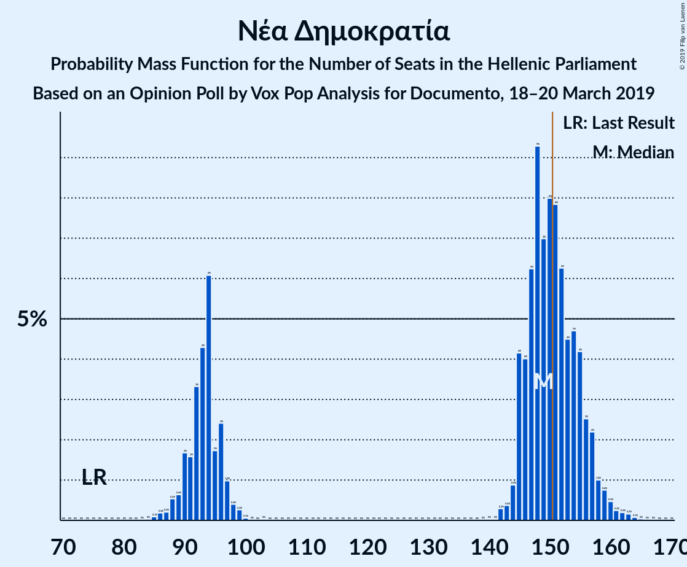
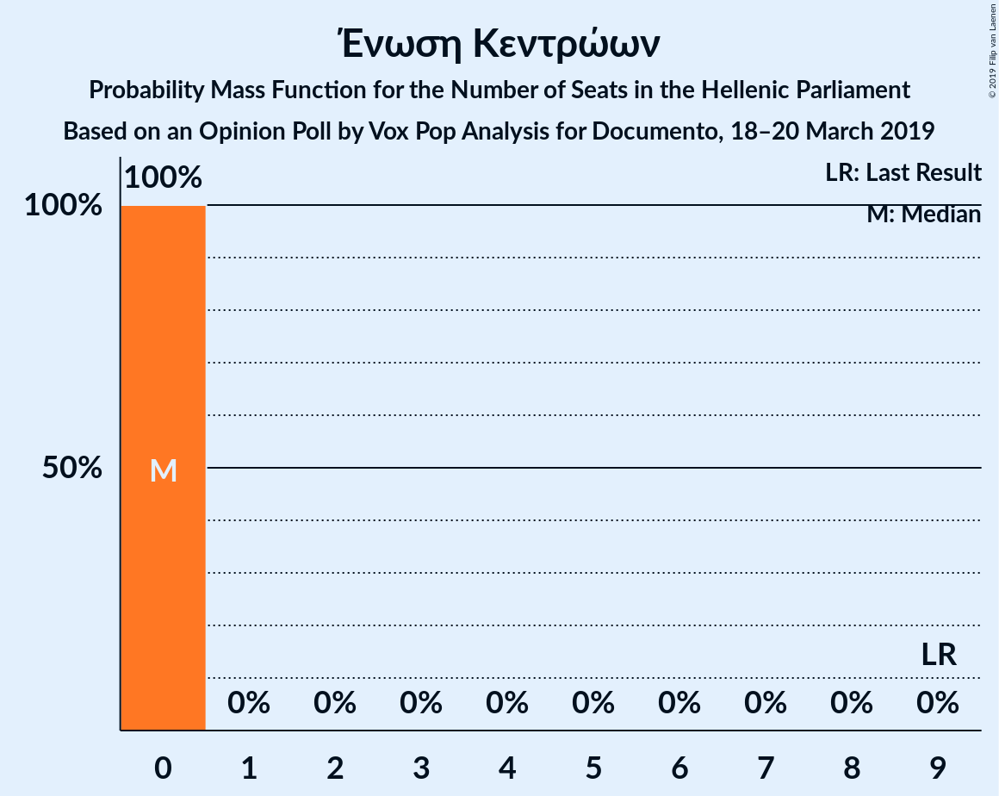
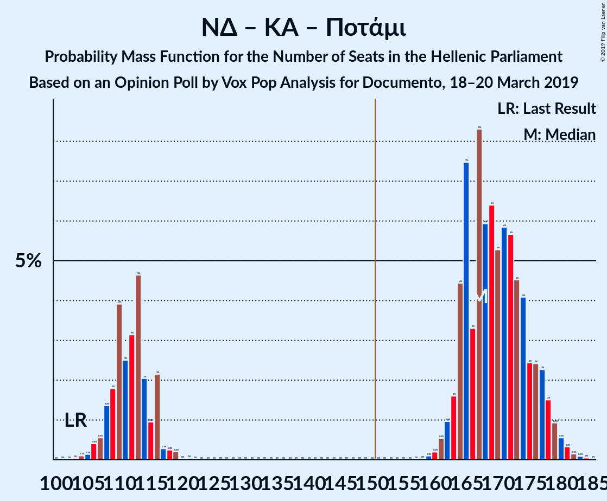

# Opinion Poll by Vox Pop Analysis for Documento, 18–20 March 2019

<a href="#voting-intentions">Voting Intentions</a> | <a href="#seats">Seats</a> | <a href="#coalitions">Coalitions</a> | <a href="#technical-information">Technical Information</a>

## Voting Intentions

### Confidence Intervals

| Party | Last Result | Poll Result | 80% Confidence Interval | 90% Confidence Interval | 95% Confidence Interval | 99% Confidence Interval |
|:-----:|:-----------:|:-----------:|:-----------------------:|:-----------------------:|:-----------------------:|:-----------------------:|
| Νέα Δημοκρατία | 28.1% | 30.5% | 28.7–32.4% |28.2–33.0% |27.7–33.4% |26.9–34.4% |
| Συνασπισμός Ριζοσπαστικής Αριστεράς | 35.5% | 28.2% | 26.4–30.1% |25.9–30.6% |25.5–31.1% |24.7–32.0% |
| Χρυσή Αυγή | 7.0% | 7.8% | 6.8–9.0% |6.5–9.3% |6.3–9.6% |5.8–10.2% |
| Κίνημα Αλλαγής | 6.3% | 5.8% | 5.0–6.9% |4.7–7.2% |4.5–7.4% |4.1–8.0% |
| Κομμουνιστικό Κόμμα Ελλάδας | 5.6% | 4.4% | 3.7–5.3% |3.5–5.6% |3.3–5.9% |3.0–6.4% |
| Το Ποτάμι | 4.1% | 0.8% | 0.5–1.3% |0.5–1.4% |0.4–1.6% |0.3–1.9% |
| Ένωση Κεντρώων | 3.4% | 0.7% | 0.5–1.2% |0.4–1.3% |0.3–1.4% |0.2–1.7% |
| Ανεξάρτητοι Έλληνες | 3.7% | 0.4% | 0.2–0.8% |0.2–0.9% |0.2–1.0% |0.1–1.3% |

*Note:* The poll result column reflects the actual value used in the calculations. Published results may vary slightly, and in addition be rounded to fewer digits.

## Seats

### Confidence Intervals

| Party | Last Result | Median | 80% Confidence Interval | 90% Confidence Interval | 95% Confidence Interval | 99% Confidence Interval |
|:-----:|:-----------:|:------:|:-----------------------:|:-----------------------:|:-----------------------:|:-----------------------:|
| <a href="#νέα-δημοκρατία">Νέα Δημοκρατία</a> | 75 | 149 | 94–157 |86–157 |86–158 |86–162 |
| <a href="#συνασπισμός-ριζοσπαστικής-αριστεράς">Συνασπισμός Ριζοσπαστικής Αριστεράς</a> | 145 | 90 | 86–149 |77–149 |77–150 |77–153 |
| <a href="#χρυσή-αυγή">Χρυσή Αυγή</a> | 18 | 24 | 22–30 |22–32 |21–32 |19–32 |
| <a href="#κίνημα-αλλαγής">Κίνημα Αλλαγής</a> | 17 | 19 | 15–21 |15–23 |14–24 |14–24 |
| <a href="#κομμουνιστικό-κόμμα-ελλάδας">Κομμουνιστικό Κόμμα Ελλάδας</a> | 15 | 15 | 11–18 |11–24 |11–24 |0–24 |
| <a href="#το-ποτάμι">Το Ποτάμι</a> | 11 | 0 | 0 |0 |0 |0 |
| <a href="#ένωση-κεντρώων">Ένωση Κεντρώων</a> | 9 | 0 | 0 |0 |0 |0 |
| <a href="#ανεξάρτητοι-έλληνες">Ανεξάρτητοι Έλληνες</a> | 10 | 0 | 0 |0 |0 |0 |

### Νέα Δημοκρατία

*For a full overview of the results for this party, see the [Νέα Δημοκρατία](party-νέαδημοκρατία.html) page.*

| Number of Seats | Probability | Accumulated | Special Marks |
|:---------------:|:-----------:|:-----------:|:-------------:|
| 75 | 0% | 100% | Last Result |
| 76 | 0% | 100% |  |
| 77 | 0% | 100% |  |
| 78 | 0% | 100% |  |
| 79 | 0% | 100% |  |
| 80 | 0% | 100% |  |
| 81 | 0% | 100% |  |
| 82 | 0% | 100% |  |
| 83 | 0% | 100% |  |
| 84 | 0% | 100% |  |
| 85 | 0% | 100% |  |
| 86 | 5% | 100% |  |
| 87 | 0.8% | 95% |  |
| 88 | 0% | 94% |  |
| 89 | 0% | 94% |  |
| 90 | 0% | 94% |  |
| 91 | 0% | 94% |  |
| 92 | 0% | 94% |  |
| 93 | 0% | 94% |  |
| 94 | 24% | 94% |  |
| 95 | 1.1% | 70% |  |
| 96 | 0.1% | 69% |  |
| 97 | 0% | 69% |  |
| 98 | 0% | 69% |  |
| 99 | 0% | 69% |  |
| 100 | 0% | 69% |  |
| 101 | 0% | 69% |  |
| 102 | 0% | 69% |  |
| 103 | 0% | 69% |  |
| 104 | 0% | 69% |  |
| 105 | 0% | 69% |  |
| 106 | 0% | 69% |  |
| 107 | 0% | 69% |  |
| 108 | 0% | 69% |  |
| 109 | 0% | 69% |  |
| 110 | 0% | 69% |  |
| 111 | 0% | 69% |  |
| 112 | 0% | 69% |  |
| 113 | 0% | 69% |  |
| 114 | 0% | 69% |  |
| 115 | 0% | 69% |  |
| 116 | 0% | 69% |  |
| 117 | 0% | 69% |  |
| 118 | 0% | 69% |  |
| 119 | 0% | 69% |  |
| 120 | 0% | 69% |  |
| 121 | 0% | 69% |  |
| 122 | 0% | 69% |  |
| 123 | 0% | 69% |  |
| 124 | 0% | 69% |  |
| 125 | 0% | 69% |  |
| 126 | 0% | 69% |  |
| 127 | 0% | 69% |  |
| 128 | 0% | 69% |  |
| 129 | 0% | 69% |  |
| 130 | 0% | 69% |  |
| 131 | 0% | 69% |  |
| 132 | 0% | 69% |  |
| 133 | 0% | 69% |  |
| 134 | 0% | 69% |  |
| 135 | 0% | 69% |  |
| 136 | 0% | 69% |  |
| 137 | 0% | 69% |  |
| 138 | 0% | 69% |  |
| 139 | 0% | 69% |  |
| 140 | 0% | 69% |  |
| 141 | 0% | 69% |  |
| 142 | 0% | 69% |  |
| 143 | 0% | 69% |  |
| 144 | 0.1% | 69% |  |
| 145 | 0.1% | 68% |  |
| 146 | 0% | 68% |  |
| 147 | 0.6% | 68% |  |
| 148 | 7% | 68% |  |
| 149 | 19% | 61% | Median |
| 150 | 0.9% | 43% |  |
| 151 | 0% | 42% | Majority |
| 152 | 0.1% | 42% |  |
| 153 | 4% | 42% |  |
| 154 | 2% | 37% |  |
| 155 | 5% | 36% |  |
| 156 | 7% | 31% |  |
| 157 | 21% | 24% |  |
| 158 | 3% | 4% |  |
| 159 | 0% | 0.7% |  |
| 160 | 0% | 0.6% |  |
| 161 | 0% | 0.6% |  |
| 162 | 0.1% | 0.6% |  |
| 163 | 0% | 0.5% |  |
| 164 | 0% | 0.5% |  |
| 165 | 0.4% | 0.4% |  |
| 166 | 0% | 0% |  |

### Συνασπισμός Ριζοσπαστικής Αριστεράς

*For a full overview of the results for this party, see the [Συνασπισμός Ριζοσπαστικής Αριστεράς](party-συνασπισμόςριζοσπαστικήςαριστεράς.html) page.*

| Number of Seats | Probability | Accumulated | Special Marks |
|:---------------:|:-----------:|:-----------:|:-------------:|
| 76 | 0.1% | 100% |  |
| 77 | 5% | 99.9% |  |
| 78 | 0% | 94% |  |
| 79 | 0.2% | 94% |  |
| 80 | 0% | 94% |  |
| 81 | 0% | 94% |  |
| 82 | 0.3% | 94% |  |
| 83 | 0% | 94% |  |
| 84 | 0% | 94% |  |
| 85 | 0.5% | 94% |  |
| 86 | 20% | 93% |  |
| 87 | 3% | 73% |  |
| 88 | 0% | 70% |  |
| 89 | 10% | 70% |  |
| 90 | 19% | 60% | Median |
| 91 | 0.9% | 41% |  |
| 92 | 0% | 40% |  |
| 93 | 0% | 40% |  |
| 94 | 8% | 40% |  |
| 95 | 0.1% | 32% |  |
| 96 | 0% | 32% |  |
| 97 | 0% | 32% |  |
| 98 | 0% | 32% |  |
| 99 | 0% | 32% |  |
| 100 | 0.1% | 32% |  |
| 101 | 0.3% | 32% |  |
| 102 | 0% | 31% |  |
| 103 | 0% | 31% |  |
| 104 | 0% | 31% |  |
| 105 | 0% | 31% |  |
| 106 | 0% | 31% |  |
| 107 | 0% | 31% |  |
| 108 | 0% | 31% |  |
| 109 | 0% | 31% |  |
| 110 | 0% | 31% |  |
| 111 | 0% | 31% |  |
| 112 | 0% | 31% |  |
| 113 | 0% | 31% |  |
| 114 | 0% | 31% |  |
| 115 | 0% | 31% |  |
| 116 | 0% | 31% |  |
| 117 | 0% | 31% |  |
| 118 | 0% | 31% |  |
| 119 | 0% | 31% |  |
| 120 | 0% | 31% |  |
| 121 | 0% | 31% |  |
| 122 | 0% | 31% |  |
| 123 | 0% | 31% |  |
| 124 | 0% | 31% |  |
| 125 | 0% | 31% |  |
| 126 | 0% | 31% |  |
| 127 | 0% | 31% |  |
| 128 | 0% | 31% |  |
| 129 | 0% | 31% |  |
| 130 | 0% | 31% |  |
| 131 | 0% | 31% |  |
| 132 | 0% | 31% |  |
| 133 | 0% | 31% |  |
| 134 | 0% | 31% |  |
| 135 | 0% | 31% |  |
| 136 | 0% | 31% |  |
| 137 | 0% | 31% |  |
| 138 | 0.2% | 31% |  |
| 139 | 5% | 31% |  |
| 140 | 0.8% | 26% |  |
| 141 | 0% | 26% |  |
| 142 | 0% | 26% |  |
| 143 | 0% | 26% |  |
| 144 | 0% | 26% |  |
| 145 | 0% | 26% | Last Result |
| 146 | 0.1% | 26% |  |
| 147 | 0.5% | 26% |  |
| 148 | 0.1% | 25% |  |
| 149 | 21% | 25% |  |
| 150 | 3% | 4% |  |
| 151 | 0% | 0.7% | Majority |
| 152 | 0% | 0.6% |  |
| 153 | 0.6% | 0.6% |  |
| 154 | 0% | 0% |  |

### Χρυσή Αυγή

*For a full overview of the results for this party, see the [Χρυσή Αυγή](party-χρυσήαυγή.html) page.*

| Number of Seats | Probability | Accumulated | Special Marks |
|:---------------:|:-----------:|:-----------:|:-------------:|
| 18 | 0% | 100% | Last Result |
| 19 | 0.6% | 100% |  |
| 20 | 0% | 99.4% |  |
| 21 | 3% | 99.3% |  |
| 22 | 19% | 96% |  |
| 23 | 26% | 77% |  |
| 24 | 8% | 51% | Median |
| 25 | 0.1% | 43% |  |
| 26 | 2% | 43% |  |
| 27 | 19% | 41% |  |
| 28 | 7% | 22% |  |
| 29 | 4% | 15% |  |
| 30 | 5% | 11% |  |
| 31 | 0.1% | 6% |  |
| 32 | 6% | 6% |  |
| 33 | 0.1% | 0.2% |  |
| 34 | 0% | 0.1% |  |
| 35 | 0% | 0.1% |  |
| 36 | 0% | 0.1% |  |
| 37 | 0% | 0.1% |  |
| 38 | 0% | 0.1% |  |
| 39 | 0.1% | 0.1% |  |
| 40 | 0% | 0% |  |

### Κίνημα Αλλαγής

*For a full overview of the results for this party, see the [Κίνημα Αλλαγής](party-κίνημααλλαγής.html) page.*

| Number of Seats | Probability | Accumulated | Special Marks |
|:---------------:|:-----------:|:-----------:|:-------------:|
| 10 | 0.3% | 100% |  |
| 11 | 0.1% | 99.7% |  |
| 12 | 0% | 99.6% |  |
| 13 | 0% | 99.6% |  |
| 14 | 2% | 99.6% |  |
| 15 | 10% | 97% |  |
| 16 | 25% | 87% |  |
| 17 | 0% | 63% | Last Result |
| 18 | 0% | 62% |  |
| 19 | 20% | 62% | Median |
| 20 | 10% | 42% |  |
| 21 | 26% | 32% |  |
| 22 | 0.4% | 6% |  |
| 23 | 1.4% | 6% |  |
| 24 | 4% | 4% |  |
| 25 | 0% | 0.2% |  |
| 26 | 0% | 0.2% |  |
| 27 | 0% | 0.2% |  |
| 28 | 0.1% | 0.1% |  |
| 29 | 0% | 0% |  |

### Κομμουνιστικό Κόμμα Ελλάδας

*For a full overview of the results for this party, see the [Κομμουνιστικό Κόμμα Ελλάδας](party-κομμουνιστικόκόμμαελλάδας.html) page.*

| Number of Seats | Probability | Accumulated | Special Marks |
|:---------------:|:-----------:|:-----------:|:-------------:|
| 0 | 0.6% | 100% |  |
| 1 | 0% | 99.4% |  |
| 2 | 0% | 99.4% |  |
| 3 | 0% | 99.4% |  |
| 4 | 0% | 99.4% |  |
| 5 | 0% | 99.4% |  |
| 6 | 0% | 99.4% |  |
| 7 | 0% | 99.4% |  |
| 8 | 0% | 99.4% |  |
| 9 | 0% | 99.4% |  |
| 10 | 0% | 99.4% |  |
| 11 | 11% | 99.4% |  |
| 12 | 0% | 88% |  |
| 13 | 0.5% | 88% |  |
| 14 | 29% | 88% |  |
| 15 | 27% | 59% | Last Result, Median |
| 16 | 0.1% | 32% |  |
| 17 | 0.5% | 32% |  |
| 18 | 24% | 31% |  |
| 19 | 0.7% | 7% |  |
| 20 | 0.2% | 6% |  |
| 21 | 0% | 6% |  |
| 22 | 0% | 6% |  |
| 23 | 0% | 6% |  |
| 24 | 5% | 6% |  |
| 25 | 0.2% | 0.2% |  |
| 26 | 0% | 0% |  |

### Το Ποτάμι

*For a full overview of the results for this party, see the [Το Ποτάμι](party-τοποτάμι.html) page.*

| Number of Seats | Probability | Accumulated | Special Marks |
|:---------------:|:-----------:|:-----------:|:-------------:|
| 0 | 100% | 100% | Median |
| 1 | 0% | 0% |  |
| 2 | 0% | 0% |  |
| 3 | 0% | 0% |  |
| 4 | 0% | 0% |  |
| 5 | 0% | 0% |  |
| 6 | 0% | 0% |  |
| 7 | 0% | 0% |  |
| 8 | 0% | 0% |  |
| 9 | 0% | 0% |  |
| 10 | 0% | 0% |  |
| 11 | 0% | 0% | Last Result |

### Ένωση Κεντρώων

*For a full overview of the results for this party, see the [Ένωση Κεντρώων](party-ένωσηκεντρώων.html) page.*

| Number of Seats | Probability | Accumulated | Special Marks |
|:---------------:|:-----------:|:-----------:|:-------------:|
| 0 | 100% | 100% | Median |
| 1 | 0% | 0% |  |
| 2 | 0% | 0% |  |
| 3 | 0% | 0% |  |
| 4 | 0% | 0% |  |
| 5 | 0% | 0% |  |
| 6 | 0% | 0% |  |
| 7 | 0% | 0% |  |
| 8 | 0% | 0% |  |
| 9 | 0% | 0% | Last Result |

### Ανεξάρτητοι Έλληνες

*For a full overview of the results for this party, see the [Ανεξάρτητοι Έλληνες](party-ανεξάρτητοιέλληνες.html) page.*

| Number of Seats | Probability | Accumulated | Special Marks |
|:---------------:|:-----------:|:-----------:|:-------------:|
| 0 | 100% | 100% | Median |
| 1 | 0% | 0% |  |
| 2 | 0% | 0% |  |
| 3 | 0% | 0% |  |
| 4 | 0% | 0% |  |
| 5 | 0% | 0% |  |
| 6 | 0% | 0% |  |
| 7 | 0% | 0% |  |
| 8 | 0% | 0% |  |
| 9 | 0% | 0% |  |
| 10 | 0% | 0% | Last Result |

## Coalitions

### Confidence Intervals

| Coalition | Last Result | Median | Majority? | 80% Confidence Interval | 90% Confidence Interval | 95% Confidence Interval | 99% Confidence Interval |
|:---------:|:-----------:|:------:|:---------:|:-----------------------:|:-----------------------:|:-----------------------:|:-----------------------:|
| Νέα Δημοκρατία – Κίνημα Αλλαγής | 92 | 168 | 69% | 110–178 | 107–178 | 107–178 | 107–182 |
| Νέα Δημοκρατία – Κίνημα Αλλαγής – Το Ποτάμι | 103 | 168 | 69% | 110–178 | 107–178 | 107–178 | 107–182 |
| Νέα Δημοκρατία | 75 | 149 | 42% | 94–157 | 86–157 | 86–158 | 86–162 |
| Νέα Δημοκρατία – Το Ποτάμι | 86 | 149 | 42% | 94–157 | 86–157 | 86–158 | 86–162 |
| Συνασπισμός Ριζοσπαστικής Αριστεράς – Ανεξάρτητοι Έλληνες | 155 | 90 | 0.7% | 86–149 | 77–149 | 77–150 | 77–153 |
| Συνασπισμός Ριζοσπαστικής Αριστεράς | 145 | 90 | 0.7% | 86–149 | 77–149 | 77–150 | 77–153 |

### Νέα Δημοκρατία – Κίνημα Αλλαγής

| Number of Seats | Probability | Accumulated | Special Marks |
|:---------------:|:-----------:|:-----------:|:-------------:|
| 92 | 0% | 100% | Last Result |
| 93 | 0% | 100% |  |
| 94 | 0% | 100% |  |
| 95 | 0% | 100% |  |
| 96 | 0% | 100% |  |
| 97 | 0% | 100% |  |
| 98 | 0% | 100% |  |
| 99 | 0% | 100% |  |
| 100 | 0% | 100% |  |
| 101 | 0% | 100% |  |
| 102 | 0.1% | 100% |  |
| 103 | 0% | 99.9% |  |
| 104 | 0% | 99.9% |  |
| 105 | 0% | 99.9% |  |
| 106 | 0% | 99.9% |  |
| 107 | 6% | 99.9% |  |
| 108 | 0% | 94% |  |
| 109 | 4% | 94% |  |
| 110 | 22% | 91% |  |
| 111 | 0.1% | 69% |  |
| 112 | 0% | 69% |  |
| 113 | 0% | 69% |  |
| 114 | 0% | 69% |  |
| 115 | 0% | 69% |  |
| 116 | 0% | 69% |  |
| 117 | 0% | 69% |  |
| 118 | 0% | 69% |  |
| 119 | 0% | 69% |  |
| 120 | 0% | 69% |  |
| 121 | 0% | 69% |  |
| 122 | 0% | 69% |  |
| 123 | 0% | 69% |  |
| 124 | 0% | 69% |  |
| 125 | 0% | 69% |  |
| 126 | 0% | 69% |  |
| 127 | 0% | 69% |  |
| 128 | 0% | 69% |  |
| 129 | 0% | 69% |  |
| 130 | 0% | 69% |  |
| 131 | 0% | 69% |  |
| 132 | 0% | 69% |  |
| 133 | 0% | 69% |  |
| 134 | 0% | 69% |  |
| 135 | 0% | 69% |  |
| 136 | 0% | 69% |  |
| 137 | 0% | 69% |  |
| 138 | 0% | 69% |  |
| 139 | 0% | 69% |  |
| 140 | 0% | 69% |  |
| 141 | 0% | 69% |  |
| 142 | 0% | 69% |  |
| 143 | 0% | 69% |  |
| 144 | 0% | 69% |  |
| 145 | 0% | 69% |  |
| 146 | 0% | 69% |  |
| 147 | 0% | 69% |  |
| 148 | 0% | 69% |  |
| 149 | 0% | 69% |  |
| 150 | 0% | 69% |  |
| 151 | 0% | 69% | Majority |
| 152 | 0% | 69% |  |
| 153 | 0% | 69% |  |
| 154 | 0% | 69% |  |
| 155 | 0% | 69% |  |
| 156 | 0% | 69% |  |
| 157 | 0% | 69% |  |
| 158 | 0% | 69% |  |
| 159 | 0% | 69% |  |
| 160 | 0% | 69% |  |
| 161 | 0% | 69% |  |
| 162 | 0% | 69% |  |
| 163 | 0% | 69% |  |
| 164 | 0.4% | 69% |  |
| 165 | 0% | 68% |  |
| 166 | 0% | 68% |  |
| 167 | 0% | 68% |  |
| 168 | 26% | 68% | Median |
| 169 | 1.1% | 42% |  |
| 170 | 0% | 41% |  |
| 171 | 11% | 41% |  |
| 172 | 0.1% | 30% |  |
| 173 | 0.1% | 30% |  |
| 174 | 0% | 30% |  |
| 175 | 0% | 30% |  |
| 176 | 1.4% | 30% |  |
| 177 | 6% | 29% |  |
| 178 | 22% | 23% |  |
| 179 | 0.1% | 0.6% |  |
| 180 | 0% | 0.5% |  |
| 181 | 0% | 0.5% |  |
| 182 | 0% | 0.5% |  |
| 183 | 0% | 0.5% |  |
| 184 | 0.5% | 0.5% |  |
| 185 | 0% | 0% |  |

### Νέα Δημοκρατία – Κίνημα Αλλαγής – Το Ποτάμι

| Number of Seats | Probability | Accumulated | Special Marks |
|:---------------:|:-----------:|:-----------:|:-------------:|
| 102 | 0.1% | 100% |  |
| 103 | 0% | 99.9% | Last Result |
| 104 | 0% | 99.9% |  |
| 105 | 0% | 99.9% |  |
| 106 | 0% | 99.9% |  |
| 107 | 6% | 99.9% |  |
| 108 | 0% | 94% |  |
| 109 | 4% | 94% |  |
| 110 | 22% | 91% |  |
| 111 | 0.1% | 69% |  |
| 112 | 0% | 69% |  |
| 113 | 0% | 69% |  |
| 114 | 0% | 69% |  |
| 115 | 0% | 69% |  |
| 116 | 0% | 69% |  |
| 117 | 0% | 69% |  |
| 118 | 0% | 69% |  |
| 119 | 0% | 69% |  |
| 120 | 0% | 69% |  |
| 121 | 0% | 69% |  |
| 122 | 0% | 69% |  |
| 123 | 0% | 69% |  |
| 124 | 0% | 69% |  |
| 125 | 0% | 69% |  |
| 126 | 0% | 69% |  |
| 127 | 0% | 69% |  |
| 128 | 0% | 69% |  |
| 129 | 0% | 69% |  |
| 130 | 0% | 69% |  |
| 131 | 0% | 69% |  |
| 132 | 0% | 69% |  |
| 133 | 0% | 69% |  |
| 134 | 0% | 69% |  |
| 135 | 0% | 69% |  |
| 136 | 0% | 69% |  |
| 137 | 0% | 69% |  |
| 138 | 0% | 69% |  |
| 139 | 0% | 69% |  |
| 140 | 0% | 69% |  |
| 141 | 0% | 69% |  |
| 142 | 0% | 69% |  |
| 143 | 0% | 69% |  |
| 144 | 0% | 69% |  |
| 145 | 0% | 69% |  |
| 146 | 0% | 69% |  |
| 147 | 0% | 69% |  |
| 148 | 0% | 69% |  |
| 149 | 0% | 69% |  |
| 150 | 0% | 69% |  |
| 151 | 0% | 69% | Majority |
| 152 | 0% | 69% |  |
| 153 | 0% | 69% |  |
| 154 | 0% | 69% |  |
| 155 | 0% | 69% |  |
| 156 | 0% | 69% |  |
| 157 | 0% | 69% |  |
| 158 | 0% | 69% |  |
| 159 | 0% | 69% |  |
| 160 | 0% | 69% |  |
| 161 | 0% | 69% |  |
| 162 | 0% | 69% |  |
| 163 | 0% | 69% |  |
| 164 | 0.4% | 69% |  |
| 165 | 0% | 68% |  |
| 166 | 0% | 68% |  |
| 167 | 0% | 68% |  |
| 168 | 26% | 68% | Median |
| 169 | 1.1% | 42% |  |
| 170 | 0% | 41% |  |
| 171 | 11% | 41% |  |
| 172 | 0.1% | 30% |  |
| 173 | 0.1% | 30% |  |
| 174 | 0% | 30% |  |
| 175 | 0% | 30% |  |
| 176 | 1.4% | 30% |  |
| 177 | 6% | 29% |  |
| 178 | 22% | 23% |  |
| 179 | 0.1% | 0.6% |  |
| 180 | 0% | 0.5% |  |
| 181 | 0% | 0.5% |  |
| 182 | 0% | 0.5% |  |
| 183 | 0% | 0.5% |  |
| 184 | 0.5% | 0.5% |  |
| 185 | 0% | 0% |  |

### Νέα Δημοκρατία

| Number of Seats | Probability | Accumulated | Special Marks |
|:---------------:|:-----------:|:-----------:|:-------------:|
| 75 | 0% | 100% | Last Result |
| 76 | 0% | 100% |  |
| 77 | 0% | 100% |  |
| 78 | 0% | 100% |  |
| 79 | 0% | 100% |  |
| 80 | 0% | 100% |  |
| 81 | 0% | 100% |  |
| 82 | 0% | 100% |  |
| 83 | 0% | 100% |  |
| 84 | 0% | 100% |  |
| 85 | 0% | 100% |  |
| 86 | 5% | 100% |  |
| 87 | 0.8% | 95% |  |
| 88 | 0% | 94% |  |
| 89 | 0% | 94% |  |
| 90 | 0% | 94% |  |
| 91 | 0% | 94% |  |
| 92 | 0% | 94% |  |
| 93 | 0% | 94% |  |
| 94 | 24% | 94% |  |
| 95 | 1.1% | 70% |  |
| 96 | 0.1% | 69% |  |
| 97 | 0% | 69% |  |
| 98 | 0% | 69% |  |
| 99 | 0% | 69% |  |
| 100 | 0% | 69% |  |
| 101 | 0% | 69% |  |
| 102 | 0% | 69% |  |
| 103 | 0% | 69% |  |
| 104 | 0% | 69% |  |
| 105 | 0% | 69% |  |
| 106 | 0% | 69% |  |
| 107 | 0% | 69% |  |
| 108 | 0% | 69% |  |
| 109 | 0% | 69% |  |
| 110 | 0% | 69% |  |
| 111 | 0% | 69% |  |
| 112 | 0% | 69% |  |
| 113 | 0% | 69% |  |
| 114 | 0% | 69% |  |
| 115 | 0% | 69% |  |
| 116 | 0% | 69% |  |
| 117 | 0% | 69% |  |
| 118 | 0% | 69% |  |
| 119 | 0% | 69% |  |
| 120 | 0% | 69% |  |
| 121 | 0% | 69% |  |
| 122 | 0% | 69% |  |
| 123 | 0% | 69% |  |
| 124 | 0% | 69% |  |
| 125 | 0% | 69% |  |
| 126 | 0% | 69% |  |
| 127 | 0% | 69% |  |
| 128 | 0% | 69% |  |
| 129 | 0% | 69% |  |
| 130 | 0% | 69% |  |
| 131 | 0% | 69% |  |
| 132 | 0% | 69% |  |
| 133 | 0% | 69% |  |
| 134 | 0% | 69% |  |
| 135 | 0% | 69% |  |
| 136 | 0% | 69% |  |
| 137 | 0% | 69% |  |
| 138 | 0% | 69% |  |
| 139 | 0% | 69% |  |
| 140 | 0% | 69% |  |
| 141 | 0% | 69% |  |
| 142 | 0% | 69% |  |
| 143 | 0% | 69% |  |
| 144 | 0.1% | 69% |  |
| 145 | 0.1% | 68% |  |
| 146 | 0% | 68% |  |
| 147 | 0.6% | 68% |  |
| 148 | 7% | 68% |  |
| 149 | 19% | 61% | Median |
| 150 | 0.9% | 43% |  |
| 151 | 0% | 42% | Majority |
| 152 | 0.1% | 42% |  |
| 153 | 4% | 42% |  |
| 154 | 2% | 37% |  |
| 155 | 5% | 36% |  |
| 156 | 7% | 31% |  |
| 157 | 21% | 24% |  |
| 158 | 3% | 4% |  |
| 159 | 0% | 0.7% |  |
| 160 | 0% | 0.6% |  |
| 161 | 0% | 0.6% |  |
| 162 | 0.1% | 0.6% |  |
| 163 | 0% | 0.5% |  |
| 164 | 0% | 0.5% |  |
| 165 | 0.4% | 0.4% |  |
| 166 | 0% | 0% |  |

### Νέα Δημοκρατία – Το Ποτάμι

| Number of Seats | Probability | Accumulated | Special Marks |
|:---------------:|:-----------:|:-----------:|:-------------:|
| 86 | 5% | 100% | Last Result |
| 87 | 0.8% | 95% |  |
| 88 | 0% | 94% |  |
| 89 | 0% | 94% |  |
| 90 | 0% | 94% |  |
| 91 | 0% | 94% |  |
| 92 | 0% | 94% |  |
| 93 | 0% | 94% |  |
| 94 | 24% | 94% |  |
| 95 | 1.1% | 70% |  |
| 96 | 0.1% | 69% |  |
| 97 | 0% | 69% |  |
| 98 | 0% | 69% |  |
| 99 | 0% | 69% |  |
| 100 | 0% | 69% |  |
| 101 | 0% | 69% |  |
| 102 | 0% | 69% |  |
| 103 | 0% | 69% |  |
| 104 | 0% | 69% |  |
| 105 | 0% | 69% |  |
| 106 | 0% | 69% |  |
| 107 | 0% | 69% |  |
| 108 | 0% | 69% |  |
| 109 | 0% | 69% |  |
| 110 | 0% | 69% |  |
| 111 | 0% | 69% |  |
| 112 | 0% | 69% |  |
| 113 | 0% | 69% |  |
| 114 | 0% | 69% |  |
| 115 | 0% | 69% |  |
| 116 | 0% | 69% |  |
| 117 | 0% | 69% |  |
| 118 | 0% | 69% |  |
| 119 | 0% | 69% |  |
| 120 | 0% | 69% |  |
| 121 | 0% | 69% |  |
| 122 | 0% | 69% |  |
| 123 | 0% | 69% |  |
| 124 | 0% | 69% |  |
| 125 | 0% | 69% |  |
| 126 | 0% | 69% |  |
| 127 | 0% | 69% |  |
| 128 | 0% | 69% |  |
| 129 | 0% | 69% |  |
| 130 | 0% | 69% |  |
| 131 | 0% | 69% |  |
| 132 | 0% | 69% |  |
| 133 | 0% | 69% |  |
| 134 | 0% | 69% |  |
| 135 | 0% | 69% |  |
| 136 | 0% | 69% |  |
| 137 | 0% | 69% |  |
| 138 | 0% | 69% |  |
| 139 | 0% | 69% |  |
| 140 | 0% | 69% |  |
| 141 | 0% | 69% |  |
| 142 | 0% | 69% |  |
| 143 | 0% | 69% |  |
| 144 | 0.1% | 69% |  |
| 145 | 0.1% | 68% |  |
| 146 | 0% | 68% |  |
| 147 | 0.6% | 68% |  |
| 148 | 7% | 68% |  |
| 149 | 19% | 61% | Median |
| 150 | 0.9% | 43% |  |
| 151 | 0% | 42% | Majority |
| 152 | 0.1% | 42% |  |
| 153 | 4% | 42% |  |
| 154 | 2% | 37% |  |
| 155 | 5% | 36% |  |
| 156 | 7% | 31% |  |
| 157 | 21% | 24% |  |
| 158 | 3% | 4% |  |
| 159 | 0% | 0.7% |  |
| 160 | 0% | 0.6% |  |
| 161 | 0% | 0.6% |  |
| 162 | 0.1% | 0.6% |  |
| 163 | 0% | 0.5% |  |
| 164 | 0% | 0.5% |  |
| 165 | 0.4% | 0.4% |  |
| 166 | 0% | 0% |  |

### Συνασπισμός Ριζοσπαστικής Αριστεράς – Ανεξάρτητοι Έλληνες

| Number of Seats | Probability | Accumulated | Special Marks |
|:---------------:|:-----------:|:-----------:|:-------------:|
| 76 | 0.1% | 100% |  |
| 77 | 5% | 99.9% |  |
| 78 | 0% | 94% |  |
| 79 | 0.2% | 94% |  |
| 80 | 0% | 94% |  |
| 81 | 0% | 94% |  |
| 82 | 0.3% | 94% |  |
| 83 | 0% | 94% |  |
| 84 | 0% | 94% |  |
| 85 | 0.5% | 94% |  |
| 86 | 20% | 93% |  |
| 87 | 3% | 73% |  |
| 88 | 0% | 70% |  |
| 89 | 10% | 70% |  |
| 90 | 19% | 60% | Median |
| 91 | 0.9% | 41% |  |
| 92 | 0% | 40% |  |
| 93 | 0% | 40% |  |
| 94 | 8% | 40% |  |
| 95 | 0.1% | 32% |  |
| 96 | 0% | 32% |  |
| 97 | 0% | 32% |  |
| 98 | 0% | 32% |  |
| 99 | 0% | 32% |  |
| 100 | 0.1% | 32% |  |
| 101 | 0.3% | 32% |  |
| 102 | 0% | 31% |  |
| 103 | 0% | 31% |  |
| 104 | 0% | 31% |  |
| 105 | 0% | 31% |  |
| 106 | 0% | 31% |  |
| 107 | 0% | 31% |  |
| 108 | 0% | 31% |  |
| 109 | 0% | 31% |  |
| 110 | 0% | 31% |  |
| 111 | 0% | 31% |  |
| 112 | 0% | 31% |  |
| 113 | 0% | 31% |  |
| 114 | 0% | 31% |  |
| 115 | 0% | 31% |  |
| 116 | 0% | 31% |  |
| 117 | 0% | 31% |  |
| 118 | 0% | 31% |  |
| 119 | 0% | 31% |  |
| 120 | 0% | 31% |  |
| 121 | 0% | 31% |  |
| 122 | 0% | 31% |  |
| 123 | 0% | 31% |  |
| 124 | 0% | 31% |  |
| 125 | 0% | 31% |  |
| 126 | 0% | 31% |  |
| 127 | 0% | 31% |  |
| 128 | 0% | 31% |  |
| 129 | 0% | 31% |  |
| 130 | 0% | 31% |  |
| 131 | 0% | 31% |  |
| 132 | 0% | 31% |  |
| 133 | 0% | 31% |  |
| 134 | 0% | 31% |  |
| 135 | 0% | 31% |  |
| 136 | 0% | 31% |  |
| 137 | 0% | 31% |  |
| 138 | 0.2% | 31% |  |
| 139 | 5% | 31% |  |
| 140 | 0.8% | 26% |  |
| 141 | 0% | 26% |  |
| 142 | 0% | 26% |  |
| 143 | 0% | 26% |  |
| 144 | 0% | 26% |  |
| 145 | 0% | 26% |  |
| 146 | 0.1% | 26% |  |
| 147 | 0.5% | 26% |  |
| 148 | 0.1% | 25% |  |
| 149 | 21% | 25% |  |
| 150 | 3% | 4% |  |
| 151 | 0% | 0.7% | Majority |
| 152 | 0% | 0.6% |  |
| 153 | 0.6% | 0.6% |  |
| 154 | 0% | 0% |  |
| 155 | 0% | 0% | Last Result |

### Συνασπισμός Ριζοσπαστικής Αριστεράς

| Number of Seats | Probability | Accumulated | Special Marks |
|:---------------:|:-----------:|:-----------:|:-------------:|
| 76 | 0.1% | 100% |  |
| 77 | 5% | 99.9% |  |
| 78 | 0% | 94% |  |
| 79 | 0.2% | 94% |  |
| 80 | 0% | 94% |  |
| 81 | 0% | 94% |  |
| 82 | 0.3% | 94% |  |
| 83 | 0% | 94% |  |
| 84 | 0% | 94% |  |
| 85 | 0.5% | 94% |  |
| 86 | 20% | 93% |  |
| 87 | 3% | 73% |  |
| 88 | 0% | 70% |  |
| 89 | 10% | 70% |  |
| 90 | 19% | 60% | Median |
| 91 | 0.9% | 41% |  |
| 92 | 0% | 40% |  |
| 93 | 0% | 40% |  |
| 94 | 8% | 40% |  |
| 95 | 0.1% | 32% |  |
| 96 | 0% | 32% |  |
| 97 | 0% | 32% |  |
| 98 | 0% | 32% |  |
| 99 | 0% | 32% |  |
| 100 | 0.1% | 32% |  |
| 101 | 0.3% | 32% |  |
| 102 | 0% | 31% |  |
| 103 | 0% | 31% |  |
| 104 | 0% | 31% |  |
| 105 | 0% | 31% |  |
| 106 | 0% | 31% |  |
| 107 | 0% | 31% |  |
| 108 | 0% | 31% |  |
| 109 | 0% | 31% |  |
| 110 | 0% | 31% |  |
| 111 | 0% | 31% |  |
| 112 | 0% | 31% |  |
| 113 | 0% | 31% |  |
| 114 | 0% | 31% |  |
| 115 | 0% | 31% |  |
| 116 | 0% | 31% |  |
| 117 | 0% | 31% |  |
| 118 | 0% | 31% |  |
| 119 | 0% | 31% |  |
| 120 | 0% | 31% |  |
| 121 | 0% | 31% |  |
| 122 | 0% | 31% |  |
| 123 | 0% | 31% |  |
| 124 | 0% | 31% |  |
| 125 | 0% | 31% |  |
| 126 | 0% | 31% |  |
| 127 | 0% | 31% |  |
| 128 | 0% | 31% |  |
| 129 | 0% | 31% |  |
| 130 | 0% | 31% |  |
| 131 | 0% | 31% |  |
| 132 | 0% | 31% |  |
| 133 | 0% | 31% |  |
| 134 | 0% | 31% |  |
| 135 | 0% | 31% |  |
| 136 | 0% | 31% |  |
| 137 | 0% | 31% |  |
| 138 | 0.2% | 31% |  |
| 139 | 5% | 31% |  |
| 140 | 0.8% | 26% |  |
| 141 | 0% | 26% |  |
| 142 | 0% | 26% |  |
| 143 | 0% | 26% |  |
| 144 | 0% | 26% |  |
| 145 | 0% | 26% | Last Result |
| 146 | 0.1% | 26% |  |
| 147 | 0.5% | 26% |  |
| 148 | 0.1% | 25% |  |
| 149 | 21% | 25% |  |
| 150 | 3% | 4% |  |
| 151 | 0% | 0.7% | Majority |
| 152 | 0% | 0.6% |  |
| 153 | 0.6% | 0.6% |  |
| 154 | 0% | 0% |  |

## Technical Information

### Opinion Poll

+ **Polling firm:** Vox Pop Analysis
+ **Commissioner(s):** Documento
+ **Fieldwork period:** 18–20 March 2019

### Calculations

+ **Sample size:** 1000
+ **Simulations done:** 1,024
+ **Error estimate:** 5.97%

