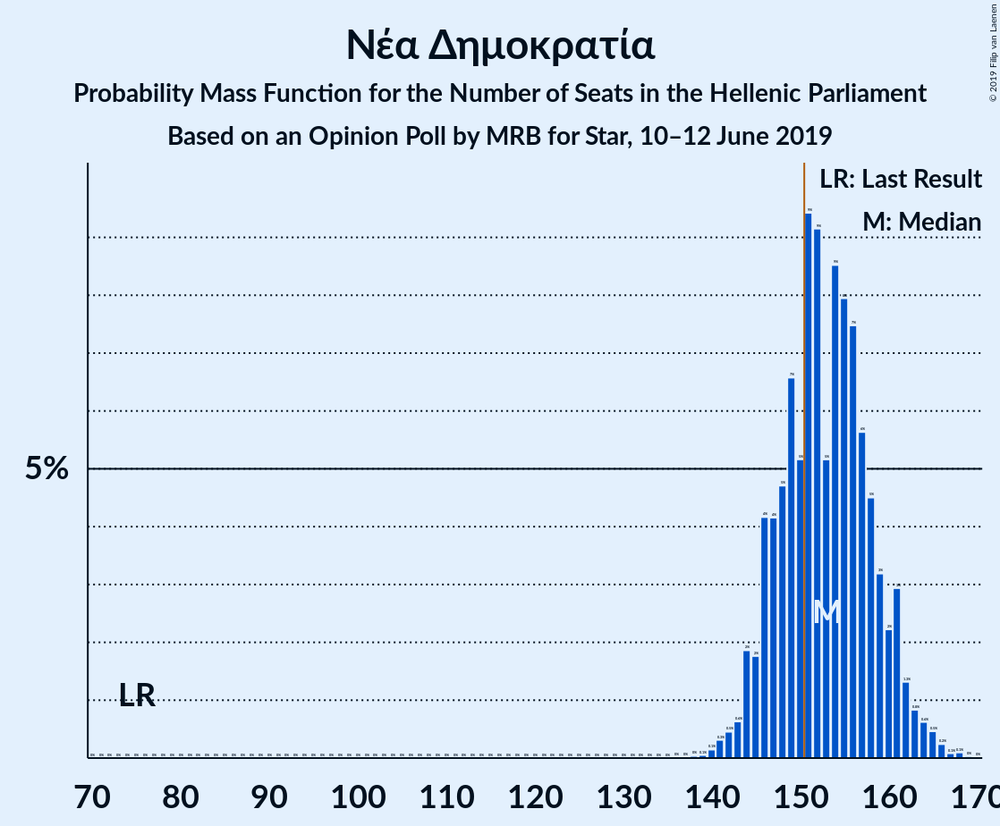
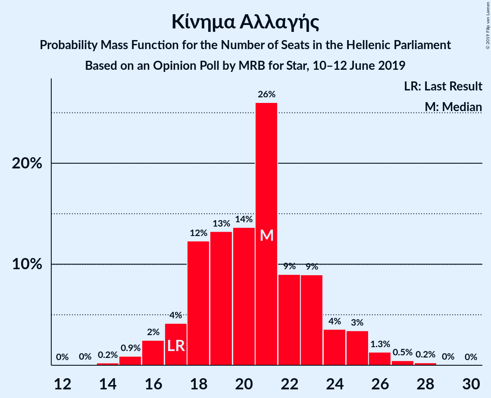
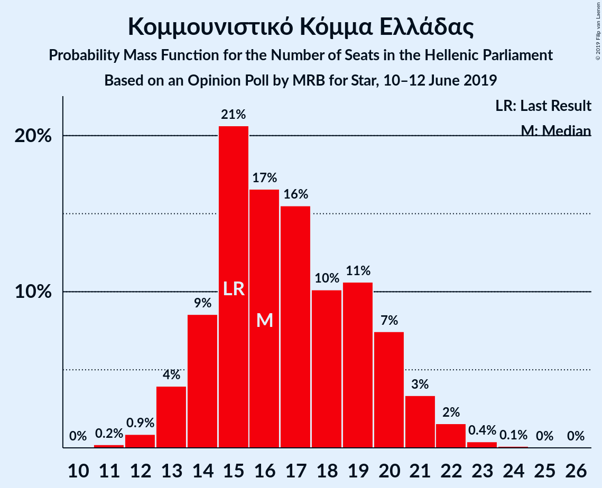
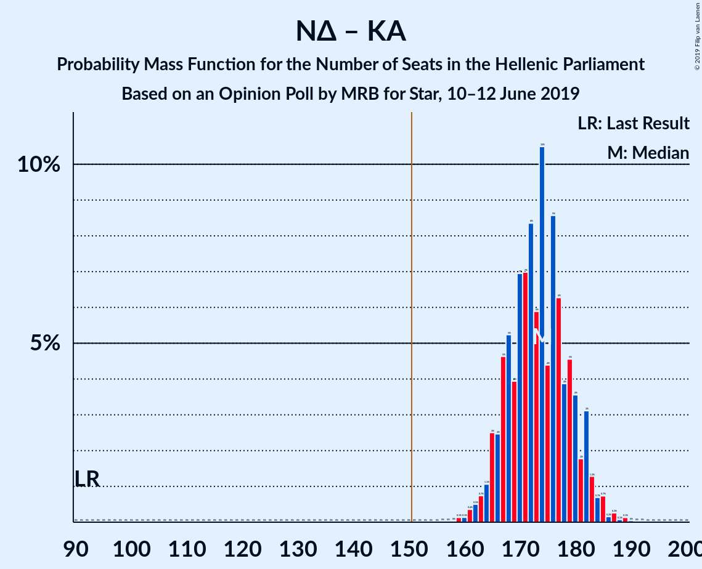
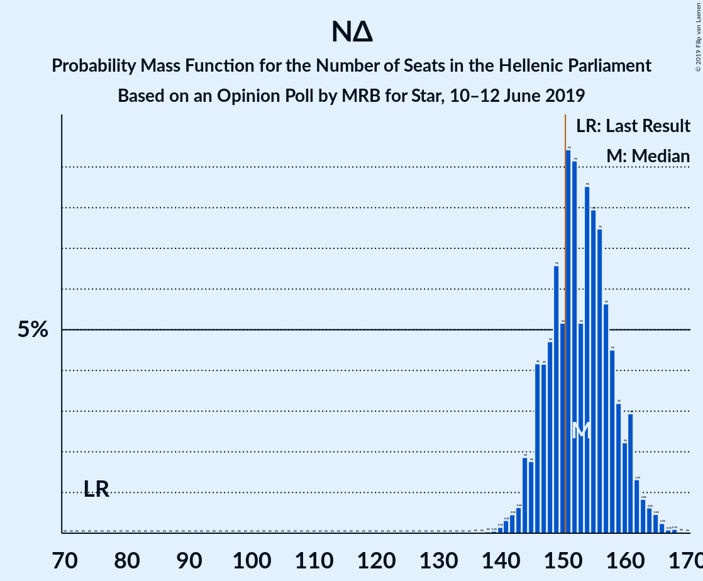
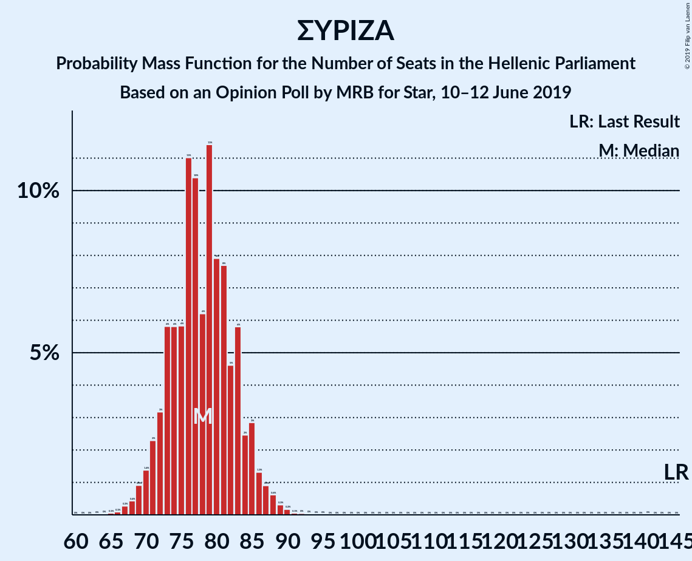

# Opinion Poll by MRB for Star, 10–12 June 2019

<a href="#voting-intentions">Voting Intentions</a> | <a href="#seats">Seats</a> | <a href="#coalitions">Coalitions</a> | <a href="#technical-information">Technical Information</a>

## Voting Intentions

### Confidence Intervals

| Party | Last Result | Poll Result | 80% Confidence Interval | 90% Confidence Interval | 95% Confidence Interval | 99% Confidence Interval |
|:-----:|:-----------:|:-----------:|:-----------------------:|:-----------------------:|:-----------------------:|:-----------------------:|
| Νέα Δημοκρατία | 28.1% | 37.0% | 35.1–39.0% |34.5–39.5% |34.0–40.0% |33.1–41.0% |
| Συνασπισμός Ριζοσπαστικής Αριστεράς | 35.5% | 28.0% | 26.2–29.9% |25.7–30.4% |25.3–30.9% |24.5–31.8% |
| Κίνημα Αλλαγής | 6.3% | 7.3% | 6.3–8.4% |6.1–8.8% |5.8–9.1% |5.4–9.6% |
| Κομμουνιστικό Κόμμα Ελλάδας | 5.6% | 6.0% | 5.1–7.1% |4.9–7.4% |4.7–7.6% |4.3–8.2% |
| Χρυσή Αυγή | 7.0% | 5.4% | 4.6–6.4% |4.3–6.7% |4.1–7.0% |3.8–7.5% |
| Μέτωπο Ευρωπαϊκής Ρεαλιστικής Ανυπακοής | 0.0% | 4.0% | 3.3–4.9% |3.1–5.2% |2.9–5.4% |2.6–5.9% |
| Ελληνική Λύση | 0.0% | 3.0% | 2.4–3.8% |2.2–4.0% |2.1–4.3% |1.8–4.7% |
| Ένωση Κεντρώων | 3.4% | 2.1% | 1.6–2.8% |1.5–3.0% |1.4–3.2% |1.2–3.6% |

*Note:* The poll result column reflects the actual value used in the calculations. Published results may vary slightly, and in addition be rounded to fewer digits.

## Seats

### Confidence Intervals

| Party | Last Result | Median | 80% Confidence Interval | 90% Confidence Interval | 95% Confidence Interval | 99% Confidence Interval |
|:-----:|:-----------:|:------:|:-----------------------:|:-----------------------:|:-----------------------:|:-----------------------:|
| <a href="#νέα-δημοκρατία">Νέα Δημοκρατία</a> | 75 | 154 | 146–158 |145–159 |143–161 |141–165 |
| <a href="#συνασπισμός-ριζοσπαστικής-αριστεράς">Συνασπισμός Ριζοσπαστικής Αριστεράς</a> | 145 | 77 | 73–83 |71–84 |70–85 |67–89 |
| <a href="#κίνημα-αλλαγής">Κίνημα Αλλαγής</a> | 17 | 20 | 18–23 |17–24 |15–25 |15–27 |
| <a href="#κομμουνιστικό-κόμμα-ελλάδας">Κομμουνιστικό Κόμμα Ελλάδας</a> | 15 | 18 | 14–19 |13–19 |12–20 |12–23 |
| <a href="#χρυσή-αυγή">Χρυσή Αυγή</a> | 18 | 15 | 13–18 |12–19 |12–19 |11–21 |
| <a href="#μέτωπο-ευρωπαϊκής-ρεαλιστικής-ανυπακοής">Μέτωπο Ευρωπαϊκής Ρεαλιστικής Ανυπακοής</a> | 0 | 11 | 9–14 |9–14 |9–15 |0–16 |
| <a href="#ελληνική-λύση">Ελληνική Λύση</a> | 0 | 9 | 0–10 |0–11 |0–11 |0–13 |
| <a href="#ένωση-κεντρώων">Ένωση Κεντρώων</a> | 9 | 0 | 0 |0–8 |0–9 |0–10 |

### Νέα Δημοκρατία

*For a full overview of the results for this party, see the [Νέα Δημοκρατία](party-νέαδημοκρατία.html) page.*

| Number of Seats | Probability | Accumulated | Special Marks |
|:---------------:|:-----------:|:-----------:|:-------------:|
| 75 | 0% | 100% | Last Result |
| 76 | 0% | 100% |  |
| 77 | 0% | 100% |  |
| 78 | 0% | 100% |  |
| 79 | 0% | 100% |  |
| 80 | 0% | 100% |  |
| 81 | 0% | 100% |  |
| 82 | 0% | 100% |  |
| 83 | 0% | 100% |  |
| 84 | 0% | 100% |  |
| 85 | 0% | 100% |  |
| 86 | 0% | 100% |  |
| 87 | 0% | 100% |  |
| 88 | 0% | 100% |  |
| 89 | 0% | 100% |  |
| 90 | 0% | 100% |  |
| 91 | 0% | 100% |  |
| 92 | 0% | 100% |  |
| 93 | 0% | 100% |  |
| 94 | 0% | 100% |  |
| 95 | 0% | 100% |  |
| 96 | 0% | 100% |  |
| 97 | 0% | 100% |  |
| 98 | 0% | 100% |  |
| 99 | 0% | 100% |  |
| 100 | 0% | 100% |  |
| 101 | 0% | 100% |  |
| 102 | 0% | 100% |  |
| 103 | 0% | 100% |  |
| 104 | 0% | 100% |  |
| 105 | 0% | 100% |  |
| 106 | 0% | 100% |  |
| 107 | 0% | 100% |  |
| 108 | 0% | 100% |  |
| 109 | 0% | 100% |  |
| 110 | 0% | 100% |  |
| 111 | 0% | 100% |  |
| 112 | 0% | 100% |  |
| 113 | 0% | 100% |  |
| 114 | 0% | 100% |  |
| 115 | 0% | 100% |  |
| 116 | 0% | 100% |  |
| 117 | 0% | 100% |  |
| 118 | 0% | 100% |  |
| 119 | 0% | 100% |  |
| 120 | 0% | 100% |  |
| 121 | 0% | 100% |  |
| 122 | 0% | 100% |  |
| 123 | 0% | 100% |  |
| 124 | 0% | 100% |  |
| 125 | 0% | 100% |  |
| 126 | 0% | 100% |  |
| 127 | 0% | 100% |  |
| 128 | 0% | 100% |  |
| 129 | 0% | 100% |  |
| 130 | 0% | 100% |  |
| 131 | 0% | 100% |  |
| 132 | 0% | 100% |  |
| 133 | 0% | 100% |  |
| 134 | 0% | 100% |  |
| 135 | 0% | 100% |  |
| 136 | 0% | 100% |  |
| 137 | 0% | 100% |  |
| 138 | 0% | 100% |  |
| 139 | 0% | 100% |  |
| 140 | 0.1% | 99.9% |  |
| 141 | 0.6% | 99.9% |  |
| 142 | 0.7% | 99.3% |  |
| 143 | 1.2% | 98.6% |  |
| 144 | 1.5% | 97% |  |
| 145 | 2% | 96% |  |
| 146 | 5% | 94% |  |
| 147 | 8% | 89% |  |
| 148 | 3% | 81% |  |
| 149 | 2% | 78% |  |
| 150 | 3% | 77% |  |
| 151 | 10% | 73% | Majority |
| 152 | 3% | 63% |  |
| 153 | 5% | 60% |  |
| 154 | 16% | 55% | Median |
| 155 | 6% | 39% |  |
| 156 | 6% | 33% |  |
| 157 | 14% | 27% |  |
| 158 | 6% | 14% |  |
| 159 | 3% | 8% |  |
| 160 | 0.5% | 4% |  |
| 161 | 2% | 4% |  |
| 162 | 1.3% | 2% |  |
| 163 | 0.3% | 1.1% |  |
| 164 | 0.3% | 0.8% |  |
| 165 | 0.2% | 0.5% |  |
| 166 | 0.2% | 0.4% |  |
| 167 | 0.1% | 0.2% |  |
| 168 | 0% | 0.1% |  |
| 169 | 0.1% | 0.1% |  |
| 170 | 0% | 0% |  |

### Συνασπισμός Ριζοσπαστικής Αριστεράς

*For a full overview of the results for this party, see the [Συνασπισμός Ριζοσπαστικής Αριστεράς](party-συνασπισμόςριζοσπαστικήςαριστεράς.html) page.*

| Number of Seats | Probability | Accumulated | Special Marks |
|:---------------:|:-----------:|:-----------:|:-------------:|
| 64 | 0.1% | 100% |  |
| 65 | 0% | 99.9% |  |
| 66 | 0% | 99.9% |  |
| 67 | 0.7% | 99.9% |  |
| 68 | 0.3% | 99.1% |  |
| 69 | 0.7% | 98.8% |  |
| 70 | 0.6% | 98% |  |
| 71 | 5% | 97% |  |
| 72 | 2% | 93% |  |
| 73 | 5% | 91% |  |
| 74 | 14% | 86% |  |
| 75 | 3% | 72% |  |
| 76 | 17% | 69% |  |
| 77 | 4% | 52% | Median |
| 78 | 3% | 48% |  |
| 79 | 15% | 45% |  |
| 80 | 13% | 30% |  |
| 81 | 3% | 17% |  |
| 82 | 2% | 14% |  |
| 83 | 5% | 12% |  |
| 84 | 2% | 7% |  |
| 85 | 3% | 5% |  |
| 86 | 0.5% | 2% |  |
| 87 | 0.5% | 2% |  |
| 88 | 0.3% | 1.0% |  |
| 89 | 0.5% | 0.7% |  |
| 90 | 0% | 0.3% |  |
| 91 | 0% | 0.2% |  |
| 92 | 0.1% | 0.2% |  |
| 93 | 0% | 0.1% |  |
| 94 | 0% | 0.1% |  |
| 95 | 0.1% | 0.1% |  |
| 96 | 0% | 0% |  |
| 97 | 0% | 0% |  |
| 98 | 0% | 0% |  |
| 99 | 0% | 0% |  |
| 100 | 0% | 0% |  |
| 101 | 0% | 0% |  |
| 102 | 0% | 0% |  |
| 103 | 0% | 0% |  |
| 104 | 0% | 0% |  |
| 105 | 0% | 0% |  |
| 106 | 0% | 0% |  |
| 107 | 0% | 0% |  |
| 108 | 0% | 0% |  |
| 109 | 0% | 0% |  |
| 110 | 0% | 0% |  |
| 111 | 0% | 0% |  |
| 112 | 0% | 0% |  |
| 113 | 0% | 0% |  |
| 114 | 0% | 0% |  |
| 115 | 0% | 0% |  |
| 116 | 0% | 0% |  |
| 117 | 0% | 0% |  |
| 118 | 0% | 0% |  |
| 119 | 0% | 0% |  |
| 120 | 0% | 0% |  |
| 121 | 0% | 0% |  |
| 122 | 0% | 0% |  |
| 123 | 0% | 0% |  |
| 124 | 0% | 0% |  |
| 125 | 0% | 0% |  |
| 126 | 0% | 0% |  |
| 127 | 0% | 0% |  |
| 128 | 0% | 0% |  |
| 129 | 0% | 0% |  |
| 130 | 0% | 0% |  |
| 131 | 0% | 0% |  |
| 132 | 0% | 0% |  |
| 133 | 0% | 0% |  |
| 134 | 0% | 0% |  |
| 135 | 0% | 0% |  |
| 136 | 0% | 0% |  |
| 137 | 0% | 0% |  |
| 138 | 0% | 0% |  |
| 139 | 0% | 0% |  |
| 140 | 0% | 0% |  |
| 141 | 0% | 0% |  |
| 142 | 0% | 0% |  |
| 143 | 0% | 0% |  |
| 144 | 0% | 0% |  |
| 145 | 0% | 0% | Last Result |

### Κίνημα Αλλαγής

*For a full overview of the results for this party, see the [Κίνημα Αλλαγής](party-κίνημααλλαγής.html) page.*

| Number of Seats | Probability | Accumulated | Special Marks |
|:---------------:|:-----------:|:-----------:|:-------------:|
| 13 | 0.1% | 100% |  |
| 14 | 0.2% | 99.9% |  |
| 15 | 3% | 99.8% |  |
| 16 | 1.5% | 97% |  |
| 17 | 2% | 95% | Last Result |
| 18 | 11% | 93% |  |
| 19 | 10% | 82% |  |
| 20 | 25% | 72% | Median |
| 21 | 21% | 47% |  |
| 22 | 13% | 26% |  |
| 23 | 6% | 13% |  |
| 24 | 2% | 7% |  |
| 25 | 3% | 5% |  |
| 26 | 1.0% | 2% |  |
| 27 | 0.4% | 0.6% |  |
| 28 | 0.1% | 0.2% |  |
| 29 | 0% | 0.1% |  |
| 30 | 0% | 0% |  |

### Κομμουνιστικό Κόμμα Ελλάδας

*For a full overview of the results for this party, see the [Κομμουνιστικό Κόμμα Ελλάδας](party-κομμουνιστικόκόμμαελλάδας.html) page.*

| Number of Seats | Probability | Accumulated | Special Marks |
|:---------------:|:-----------:|:-----------:|:-------------:|
| 11 | 0.4% | 100% |  |
| 12 | 4% | 99.5% |  |
| 13 | 3% | 96% |  |
| 14 | 8% | 92% |  |
| 15 | 2% | 84% | Last Result |
| 16 | 5% | 82% |  |
| 17 | 21% | 77% |  |
| 18 | 35% | 56% | Median |
| 19 | 16% | 21% |  |
| 20 | 3% | 5% |  |
| 21 | 0.6% | 2% |  |
| 22 | 0.2% | 1.0% |  |
| 23 | 0.4% | 0.8% |  |
| 24 | 0.2% | 0.3% |  |
| 25 | 0.1% | 0.1% |  |
| 26 | 0% | 0% |  |

### Χρυσή Αυγή

*For a full overview of the results for this party, see the [Χρυσή Αυγή](party-χρυσήαυγή.html) page.*

| Number of Seats | Probability | Accumulated | Special Marks |
|:---------------:|:-----------:|:-----------:|:-------------:|
| 10 | 0.4% | 100% |  |
| 11 | 1.4% | 99.6% |  |
| 12 | 5% | 98% |  |
| 13 | 15% | 94% |  |
| 14 | 18% | 79% |  |
| 15 | 21% | 61% | Median |
| 16 | 20% | 40% |  |
| 17 | 7% | 20% |  |
| 18 | 5% | 12% | Last Result |
| 19 | 5% | 7% |  |
| 20 | 1.0% | 2% |  |
| 21 | 0.7% | 1.0% |  |
| 22 | 0.2% | 0.3% |  |
| 23 | 0% | 0.1% |  |
| 24 | 0% | 0% |  |

### Μέτωπο Ευρωπαϊκής Ρεαλιστικής Ανυπακοής

*For a full overview of the results for this party, see the [Μέτωπο Ευρωπαϊκής Ρεαλιστικής Ανυπακοής](party-μέτωποευρωπαϊκήςρεαλιστικήςανυπακοής.html) page.*

| Number of Seats | Probability | Accumulated | Special Marks |
|:---------------:|:-----------:|:-----------:|:-------------:|
| 0 | 2% | 100% | Last Result |
| 1 | 0% | 98% |  |
| 2 | 0% | 98% |  |
| 3 | 0% | 98% |  |
| 4 | 0% | 98% |  |
| 5 | 0% | 98% |  |
| 6 | 0% | 98% |  |
| 7 | 0% | 98% |  |
| 8 | 0.2% | 98% |  |
| 9 | 16% | 98% |  |
| 10 | 22% | 81% |  |
| 11 | 23% | 59% | Median |
| 12 | 10% | 36% |  |
| 13 | 17% | 27% |  |
| 14 | 7% | 10% |  |
| 15 | 2% | 3% |  |
| 16 | 1.4% | 2% |  |
| 17 | 0.2% | 0.3% |  |
| 18 | 0.1% | 0.1% |  |
| 19 | 0% | 0% |  |

### Ελληνική Λύση

*For a full overview of the results for this party, see the [Ελληνική Λύση](party-ελληνικήλύση.html) page.*

| Number of Seats | Probability | Accumulated | Special Marks |
|:---------------:|:-----------:|:-----------:|:-------------:|
| 0 | 42% | 100% | Last Result |
| 1 | 0% | 58% |  |
| 2 | 0% | 58% |  |
| 3 | 0% | 58% |  |
| 4 | 0% | 58% |  |
| 5 | 0% | 58% |  |
| 6 | 0% | 58% |  |
| 7 | 0% | 58% |  |
| 8 | 3% | 58% |  |
| 9 | 39% | 55% | Median |
| 10 | 7% | 16% |  |
| 11 | 8% | 10% |  |
| 12 | 0.8% | 1.4% |  |
| 13 | 0.5% | 0.7% |  |
| 14 | 0.1% | 0.1% |  |
| 15 | 0% | 0% |  |

### Ένωση Κεντρώων

*For a full overview of the results for this party, see the [Ένωση Κεντρώων](party-ένωσηκεντρώων.html) page.*

| Number of Seats | Probability | Accumulated | Special Marks |
|:---------------:|:-----------:|:-----------:|:-------------:|
| 0 | 94% | 100% | Median |
| 1 | 0% | 6% |  |
| 2 | 0% | 6% |  |
| 3 | 0% | 6% |  |
| 4 | 0% | 6% |  |
| 5 | 0% | 6% |  |
| 6 | 0% | 6% |  |
| 7 | 0% | 6% |  |
| 8 | 1.1% | 6% |  |
| 9 | 4% | 5% | Last Result |
| 10 | 0.9% | 1.1% |  |
| 11 | 0.2% | 0.2% |  |
| 12 | 0% | 0% |  |

## Coalitions

### Confidence Intervals

| Coalition | Last Result | Median | Majority? | 80% Confidence Interval | 90% Confidence Interval | 95% Confidence Interval | 99% Confidence Interval |
|:---------:|:-----------:|:------:|:---------:|:-----------------------:|:-----------------------:|:-----------------------:|:-----------------------:|
| Νέα Δημοκρατία – Κίνημα Αλλαγής | 92 | 174 | 100% | 167–179 | 165–181 | 163–182 | 161–186 |
| Νέα Δημοκρατία | 75 | 154 | 73% | 146–158 | 145–159 | 143–161 | 141–165 |
| Συνασπισμός Ριζοσπαστικής Αριστεράς – Μέτωπο Ευρωπαϊκής Ρεαλιστικής Ανυπακοής | 145 | 89 | 0% | 83–93 | 81–96 | 81–98 | 78–102 |
| Συνασπισμός Ριζοσπαστικής Αριστεράς | 145 | 77 | 0% | 73–83 | 71–84 | 70–85 | 67–89 |

### Νέα Δημοκρατία – Κίνημα Αλλαγής

| Number of Seats | Probability | Accumulated | Special Marks |
|:---------------:|:-----------:|:-----------:|:-------------:|
| 92 | 0% | 100% | Last Result |
| 93 | 0% | 100% |  |
| 94 | 0% | 100% |  |
| 95 | 0% | 100% |  |
| 96 | 0% | 100% |  |
| 97 | 0% | 100% |  |
| 98 | 0% | 100% |  |
| 99 | 0% | 100% |  |
| 100 | 0% | 100% |  |
| 101 | 0% | 100% |  |
| 102 | 0% | 100% |  |
| 103 | 0% | 100% |  |
| 104 | 0% | 100% |  |
| 105 | 0% | 100% |  |
| 106 | 0% | 100% |  |
| 107 | 0% | 100% |  |
| 108 | 0% | 100% |  |
| 109 | 0% | 100% |  |
| 110 | 0% | 100% |  |
| 111 | 0% | 100% |  |
| 112 | 0% | 100% |  |
| 113 | 0% | 100% |  |
| 114 | 0% | 100% |  |
| 115 | 0% | 100% |  |
| 116 | 0% | 100% |  |
| 117 | 0% | 100% |  |
| 118 | 0% | 100% |  |
| 119 | 0% | 100% |  |
| 120 | 0% | 100% |  |
| 121 | 0% | 100% |  |
| 122 | 0% | 100% |  |
| 123 | 0% | 100% |  |
| 124 | 0% | 100% |  |
| 125 | 0% | 100% |  |
| 126 | 0% | 100% |  |
| 127 | 0% | 100% |  |
| 128 | 0% | 100% |  |
| 129 | 0% | 100% |  |
| 130 | 0% | 100% |  |
| 131 | 0% | 100% |  |
| 132 | 0% | 100% |  |
| 133 | 0% | 100% |  |
| 134 | 0% | 100% |  |
| 135 | 0% | 100% |  |
| 136 | 0% | 100% |  |
| 137 | 0% | 100% |  |
| 138 | 0% | 100% |  |
| 139 | 0% | 100% |  |
| 140 | 0% | 100% |  |
| 141 | 0% | 100% |  |
| 142 | 0% | 100% |  |
| 143 | 0% | 100% |  |
| 144 | 0% | 100% |  |
| 145 | 0% | 100% |  |
| 146 | 0% | 100% |  |
| 147 | 0% | 100% |  |
| 148 | 0% | 100% |  |
| 149 | 0% | 100% |  |
| 150 | 0% | 100% |  |
| 151 | 0% | 100% | Majority |
| 152 | 0% | 100% |  |
| 153 | 0% | 100% |  |
| 154 | 0% | 100% |  |
| 155 | 0% | 100% |  |
| 156 | 0% | 100% |  |
| 157 | 0% | 100% |  |
| 158 | 0% | 100% |  |
| 159 | 0% | 99.9% |  |
| 160 | 0.2% | 99.9% |  |
| 161 | 0.2% | 99.6% |  |
| 162 | 0.8% | 99.4% |  |
| 163 | 2% | 98.7% |  |
| 164 | 0.4% | 97% |  |
| 165 | 4% | 97% |  |
| 166 | 3% | 93% |  |
| 167 | 2% | 90% |  |
| 168 | 10% | 88% |  |
| 169 | 3% | 78% |  |
| 170 | 2% | 75% |  |
| 171 | 10% | 73% |  |
| 172 | 4% | 63% |  |
| 173 | 4% | 59% |  |
| 174 | 12% | 55% | Median |
| 175 | 5% | 43% |  |
| 176 | 9% | 38% |  |
| 177 | 5% | 29% |  |
| 178 | 12% | 23% |  |
| 179 | 3% | 11% |  |
| 180 | 3% | 9% |  |
| 181 | 2% | 5% |  |
| 182 | 0.7% | 3% |  |
| 183 | 0.3% | 2% |  |
| 184 | 0.6% | 2% |  |
| 185 | 0.8% | 1.3% |  |
| 186 | 0.1% | 0.5% |  |
| 187 | 0.2% | 0.4% |  |
| 188 | 0.1% | 0.3% |  |
| 189 | 0% | 0.1% |  |
| 190 | 0% | 0.1% |  |
| 191 | 0.1% | 0.1% |  |
| 192 | 0% | 0% |  |

### Νέα Δημοκρατία

| Number of Seats | Probability | Accumulated | Special Marks |
|:---------------:|:-----------:|:-----------:|:-------------:|
| 75 | 0% | 100% | Last Result |
| 76 | 0% | 100% |  |
| 77 | 0% | 100% |  |
| 78 | 0% | 100% |  |
| 79 | 0% | 100% |  |
| 80 | 0% | 100% |  |
| 81 | 0% | 100% |  |
| 82 | 0% | 100% |  |
| 83 | 0% | 100% |  |
| 84 | 0% | 100% |  |
| 85 | 0% | 100% |  |
| 86 | 0% | 100% |  |
| 87 | 0% | 100% |  |
| 88 | 0% | 100% |  |
| 89 | 0% | 100% |  |
| 90 | 0% | 100% |  |
| 91 | 0% | 100% |  |
| 92 | 0% | 100% |  |
| 93 | 0% | 100% |  |
| 94 | 0% | 100% |  |
| 95 | 0% | 100% |  |
| 96 | 0% | 100% |  |
| 97 | 0% | 100% |  |
| 98 | 0% | 100% |  |
| 99 | 0% | 100% |  |
| 100 | 0% | 100% |  |
| 101 | 0% | 100% |  |
| 102 | 0% | 100% |  |
| 103 | 0% | 100% |  |
| 104 | 0% | 100% |  |
| 105 | 0% | 100% |  |
| 106 | 0% | 100% |  |
| 107 | 0% | 100% |  |
| 108 | 0% | 100% |  |
| 109 | 0% | 100% |  |
| 110 | 0% | 100% |  |
| 111 | 0% | 100% |  |
| 112 | 0% | 100% |  |
| 113 | 0% | 100% |  |
| 114 | 0% | 100% |  |
| 115 | 0% | 100% |  |
| 116 | 0% | 100% |  |
| 117 | 0% | 100% |  |
| 118 | 0% | 100% |  |
| 119 | 0% | 100% |  |
| 120 | 0% | 100% |  |
| 121 | 0% | 100% |  |
| 122 | 0% | 100% |  |
| 123 | 0% | 100% |  |
| 124 | 0% | 100% |  |
| 125 | 0% | 100% |  |
| 126 | 0% | 100% |  |
| 127 | 0% | 100% |  |
| 128 | 0% | 100% |  |
| 129 | 0% | 100% |  |
| 130 | 0% | 100% |  |
| 131 | 0% | 100% |  |
| 132 | 0% | 100% |  |
| 133 | 0% | 100% |  |
| 134 | 0% | 100% |  |
| 135 | 0% | 100% |  |
| 136 | 0% | 100% |  |
| 137 | 0% | 100% |  |
| 138 | 0% | 100% |  |
| 139 | 0% | 100% |  |
| 140 | 0.1% | 99.9% |  |
| 141 | 0.6% | 99.9% |  |
| 142 | 0.7% | 99.3% |  |
| 143 | 1.2% | 98.6% |  |
| 144 | 1.5% | 97% |  |
| 145 | 2% | 96% |  |
| 146 | 5% | 94% |  |
| 147 | 8% | 89% |  |
| 148 | 3% | 81% |  |
| 149 | 2% | 78% |  |
| 150 | 3% | 77% |  |
| 151 | 10% | 73% | Majority |
| 152 | 3% | 63% |  |
| 153 | 5% | 60% |  |
| 154 | 16% | 55% | Median |
| 155 | 6% | 39% |  |
| 156 | 6% | 33% |  |
| 157 | 14% | 27% |  |
| 158 | 6% | 14% |  |
| 159 | 3% | 8% |  |
| 160 | 0.5% | 4% |  |
| 161 | 2% | 4% |  |
| 162 | 1.3% | 2% |  |
| 163 | 0.3% | 1.1% |  |
| 164 | 0.3% | 0.8% |  |
| 165 | 0.2% | 0.5% |  |
| 166 | 0.2% | 0.4% |  |
| 167 | 0.1% | 0.2% |  |
| 168 | 0% | 0.1% |  |
| 169 | 0.1% | 0.1% |  |
| 170 | 0% | 0% |  |

### Συνασπισμός Ριζοσπαστικής Αριστεράς – Μέτωπο Ευρωπαϊκής Ρεαλιστικής Ανυπακοής

| Number of Seats | Probability | Accumulated | Special Marks |
|:---------------:|:-----------:|:-----------:|:-------------:|
| 72 | 0% | 100% |  |
| 73 | 0% | 99.9% |  |
| 74 | 0% | 99.9% |  |
| 75 | 0.1% | 99.9% |  |
| 76 | 0.1% | 99.8% |  |
| 77 | 0.2% | 99.7% |  |
| 78 | 0.2% | 99.5% |  |
| 79 | 0.5% | 99.3% |  |
| 80 | 0.9% | 98.8% |  |
| 81 | 4% | 98% |  |
| 82 | 2% | 94% |  |
| 83 | 14% | 92% |  |
| 84 | 3% | 78% |  |
| 85 | 3% | 75% |  |
| 86 | 1.2% | 71% |  |
| 87 | 13% | 70% |  |
| 88 | 5% | 57% | Median |
| 89 | 4% | 52% |  |
| 90 | 10% | 48% |  |
| 91 | 12% | 38% |  |
| 92 | 13% | 26% |  |
| 93 | 4% | 12% |  |
| 94 | 2% | 9% |  |
| 95 | 0.9% | 7% |  |
| 96 | 3% | 6% |  |
| 97 | 0.7% | 3% |  |
| 98 | 1.3% | 3% |  |
| 99 | 0.5% | 1.3% |  |
| 100 | 0.1% | 0.8% |  |
| 101 | 0.2% | 0.7% |  |
| 102 | 0.4% | 0.5% |  |
| 103 | 0% | 0.1% |  |
| 104 | 0% | 0% |  |
| 105 | 0% | 0% |  |
| 106 | 0% | 0% |  |
| 107 | 0% | 0% |  |
| 108 | 0% | 0% |  |
| 109 | 0% | 0% |  |
| 110 | 0% | 0% |  |
| 111 | 0% | 0% |  |
| 112 | 0% | 0% |  |
| 113 | 0% | 0% |  |
| 114 | 0% | 0% |  |
| 115 | 0% | 0% |  |
| 116 | 0% | 0% |  |
| 117 | 0% | 0% |  |
| 118 | 0% | 0% |  |
| 119 | 0% | 0% |  |
| 120 | 0% | 0% |  |
| 121 | 0% | 0% |  |
| 122 | 0% | 0% |  |
| 123 | 0% | 0% |  |
| 124 | 0% | 0% |  |
| 125 | 0% | 0% |  |
| 126 | 0% | 0% |  |
| 127 | 0% | 0% |  |
| 128 | 0% | 0% |  |
| 129 | 0% | 0% |  |
| 130 | 0% | 0% |  |
| 131 | 0% | 0% |  |
| 132 | 0% | 0% |  |
| 133 | 0% | 0% |  |
| 134 | 0% | 0% |  |
| 135 | 0% | 0% |  |
| 136 | 0% | 0% |  |
| 137 | 0% | 0% |  |
| 138 | 0% | 0% |  |
| 139 | 0% | 0% |  |
| 140 | 0% | 0% |  |
| 141 | 0% | 0% |  |
| 142 | 0% | 0% |  |
| 143 | 0% | 0% |  |
| 144 | 0% | 0% |  |
| 145 | 0% | 0% | Last Result |

### Συνασπισμός Ριζοσπαστικής Αριστεράς

| Number of Seats | Probability | Accumulated | Special Marks |
|:---------------:|:-----------:|:-----------:|:-------------:|
| 64 | 0.1% | 100% |  |
| 65 | 0% | 99.9% |  |
| 66 | 0% | 99.9% |  |
| 67 | 0.7% | 99.9% |  |
| 68 | 0.3% | 99.1% |  |
| 69 | 0.7% | 98.8% |  |
| 70 | 0.6% | 98% |  |
| 71 | 5% | 97% |  |
| 72 | 2% | 93% |  |
| 73 | 5% | 91% |  |
| 74 | 14% | 86% |  |
| 75 | 3% | 72% |  |
| 76 | 17% | 69% |  |
| 77 | 4% | 52% | Median |
| 78 | 3% | 48% |  |
| 79 | 15% | 45% |  |
| 80 | 13% | 30% |  |
| 81 | 3% | 17% |  |
| 82 | 2% | 14% |  |
| 83 | 5% | 12% |  |
| 84 | 2% | 7% |  |
| 85 | 3% | 5% |  |
| 86 | 0.5% | 2% |  |
| 87 | 0.5% | 2% |  |
| 88 | 0.3% | 1.0% |  |
| 89 | 0.5% | 0.7% |  |
| 90 | 0% | 0.3% |  |
| 91 | 0% | 0.2% |  |
| 92 | 0.1% | 0.2% |  |
| 93 | 0% | 0.1% |  |
| 94 | 0% | 0.1% |  |
| 95 | 0.1% | 0.1% |  |
| 96 | 0% | 0% |  |
| 97 | 0% | 0% |  |
| 98 | 0% | 0% |  |
| 99 | 0% | 0% |  |
| 100 | 0% | 0% |  |
| 101 | 0% | 0% |  |
| 102 | 0% | 0% |  |
| 103 | 0% | 0% |  |
| 104 | 0% | 0% |  |
| 105 | 0% | 0% |  |
| 106 | 0% | 0% |  |
| 107 | 0% | 0% |  |
| 108 | 0% | 0% |  |
| 109 | 0% | 0% |  |
| 110 | 0% | 0% |  |
| 111 | 0% | 0% |  |
| 112 | 0% | 0% |  |
| 113 | 0% | 0% |  |
| 114 | 0% | 0% |  |
| 115 | 0% | 0% |  |
| 116 | 0% | 0% |  |
| 117 | 0% | 0% |  |
| 118 | 0% | 0% |  |
| 119 | 0% | 0% |  |
| 120 | 0% | 0% |  |
| 121 | 0% | 0% |  |
| 122 | 0% | 0% |  |
| 123 | 0% | 0% |  |
| 124 | 0% | 0% |  |
| 125 | 0% | 0% |  |
| 126 | 0% | 0% |  |
| 127 | 0% | 0% |  |
| 128 | 0% | 0% |  |
| 129 | 0% | 0% |  |
| 130 | 0% | 0% |  |
| 131 | 0% | 0% |  |
| 132 | 0% | 0% |  |
| 133 | 0% | 0% |  |
| 134 | 0% | 0% |  |
| 135 | 0% | 0% |  |
| 136 | 0% | 0% |  |
| 137 | 0% | 0% |  |
| 138 | 0% | 0% |  |
| 139 | 0% | 0% |  |
| 140 | 0% | 0% |  |
| 141 | 0% | 0% |  |
| 142 | 0% | 0% |  |
| 143 | 0% | 0% |  |
| 144 | 0% | 0% |  |
| 145 | 0% | 0% | Last Result |

## Technical Information

### Opinion Poll

+ **Polling firm:** MRB
+ **Commissioner(s):** Star
+ **Fieldwork period:** 10–12 June 2019

### Calculations

+ **Sample size:** 1003
+ **Simulations done:** 131,072
+ **Error estimate:** 1.31%

