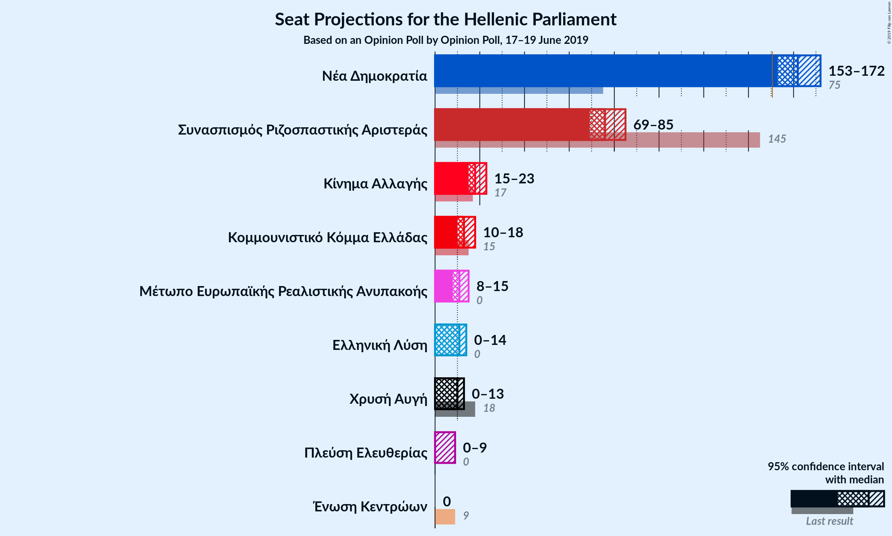
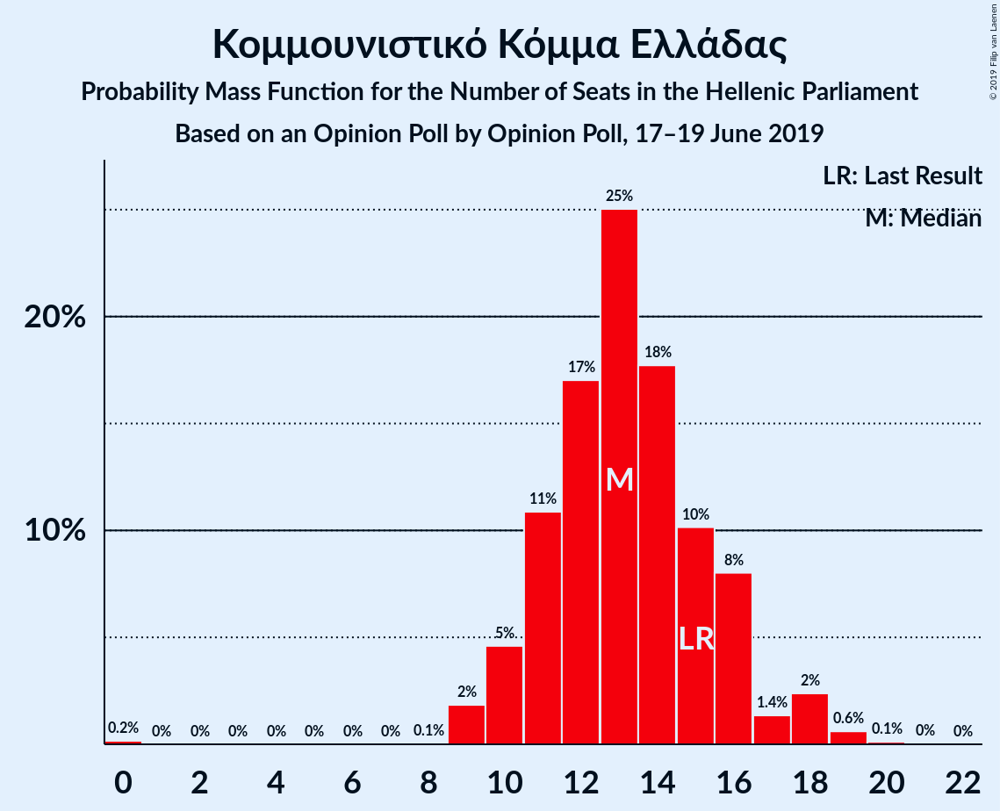
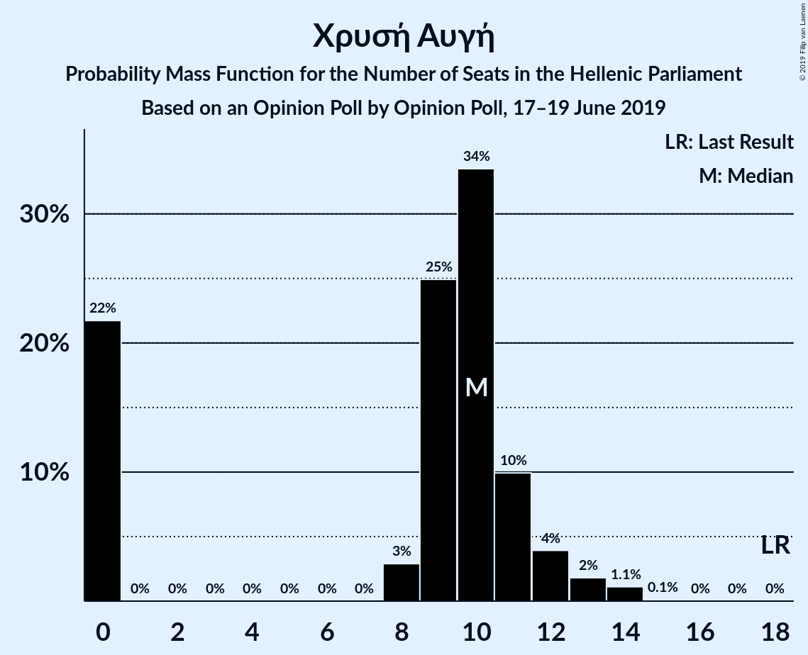
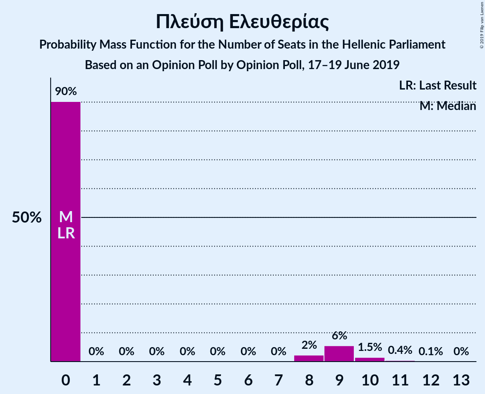
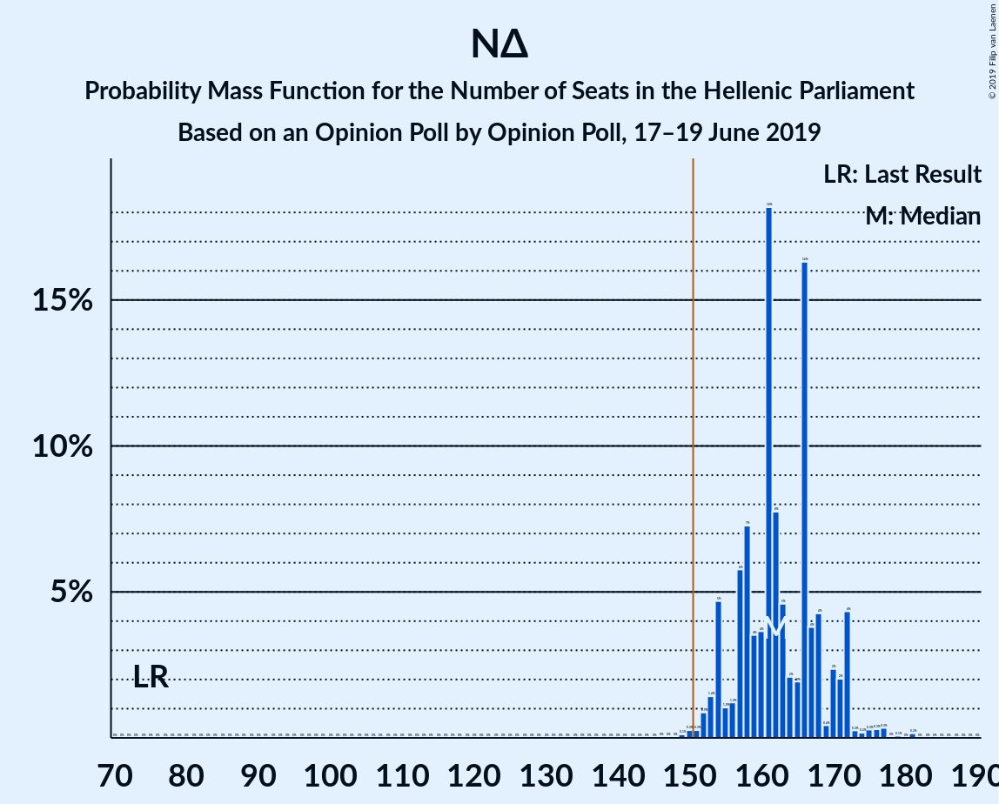
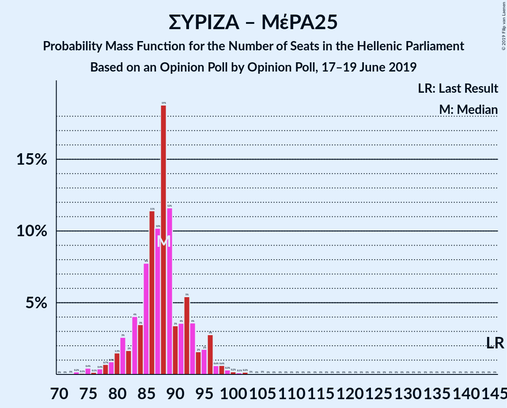

# Opinion Poll by Opinion Poll, 17–19 June 2019

<a href="#voting-intentions">Voting Intentions</a> | <a href="#seats">Seats</a> | <a href="#coalitions">Coalitions</a> | <a href="#technical-information">Technical Information</a>

## Voting Intentions

### Confidence Intervals

| Party | Last Result | Poll Result | 80% Confidence Interval | 90% Confidence Interval | 95% Confidence Interval | 99% Confidence Interval |
|:-----:|:-----------:|:-----------:|:-----------------------:|:-----------------------:|:-----------------------:|:-----------------------:|
| Νέα Δημοκρατία | 28.1% | 39.8% | 37.8–41.8% |37.3–42.4% |36.8–42.9% |35.9–43.9% |
| Συνασπισμός Ριζοσπαστικής Αριστεράς | 35.5% | 27.0% | 25.3–28.9% |24.8–29.4% |24.3–29.8% |23.5–30.7% |
| Κίνημα Αλλαγής | 6.3% | 6.4% | 5.5–7.5% |5.3–7.8% |5.0–8.1% |4.6–8.7% |
| Κομμουνιστικό Κόμμα Ελλάδας | 5.6% | 4.6% | 3.9–5.6% |3.6–5.9% |3.5–6.1% |3.1–6.6% |
| Μέτωπο Ευρωπαϊκής Ρεαλιστικής Ανυπακοής | 0.0% | 4.1% | 3.4–5.0% |3.2–5.3% |3.0–5.5% |2.7–6.0% |
| Ελληνική Λύση | 0.0% | 3.6% | 2.9–4.5% |2.8–4.7% |2.6–5.0% |2.3–5.4% |
| Χρυσή Αυγή | 7.0% | 3.3% | 2.7–4.1% |2.5–4.4% |2.4–4.6% |2.1–5.0% |
| Πλεύση Ελευθερίας | 0.0% | 2.3% | 1.8–3.0% |1.6–3.2% |1.5–3.4% |1.3–3.8% |
| Ένωση Κεντρώων | 3.4% | 1.1% | 0.8–1.7% |0.7–1.8% |0.6–2.0% |0.5–2.3% |

*Note:* The poll result column reflects the actual value used in the calculations. Published results may vary slightly, and in addition be rounded to fewer digits.

## Seats

### Confidence Intervals

| Party | Last Result | Median | 80% Confidence Interval | 90% Confidence Interval | 95% Confidence Interval | 99% Confidence Interval |
|:-----:|:-----------:|:------:|:-----------------------:|:-----------------------:|:-----------------------:|:-----------------------:|
| <a href="#νέα-δημοκρατία">Νέα Δημοκρατία</a> | 75 | 155 | 148–165 |148–165 |148–165 |145–177 |
| <a href="#συνασπισμός-ριζοσπαστικής-αριστεράς">Συνασπισμός Ριζοσπαστικής Αριστεράς</a> | 145 | 77 | 65–85 |65–85 |65–85 |60–98 |
| <a href="#κίνημα-αλλαγής">Κίνημα Αλλαγής</a> | 17 | 19 | 18–23 |17–23 |15–23 |13–28 |
| <a href="#κομμουνιστικό-κόμμα-ελλάδας">Κομμουνιστικό Κόμμα Ελλάδας</a> | 15 | 14 | 12–18 |10–18 |9–18 |0–18 |
| <a href="#μέτωπο-ευρωπαϊκής-ρεαλιστικής-ανυπακοής">Μέτωπο Ευρωπαϊκής Ρεαλιστικής Ανυπακοής</a> | 0 | 12 | 11–16 |10–16 |9–16 |9–16 |
| <a href="#ελληνική-λύση">Ελληνική Λύση</a> | 0 | 9 | 8–11 |0–13 |0–14 |0–14 |
| <a href="#χρυσή-αυγή">Χρυσή Αυγή</a> | 18 | 12 | 10–13 |10–16 |9–16 |0–16 |
| <a href="#πλεύση-ελευθερίας">Πλεύση Ελευθερίας</a> | 0 | 0 | 0 |0–9 |0–11 |0–11 |
| <a href="#ένωση-κεντρώων">Ένωση Κεντρώων</a> | 9 | 0 | 0 |0 |0 |0 |

### Νέα Δημοκρατία

*For a full overview of the results for this party, see the [Νέα Δημοκρατία](party-νέαδημοκρατία.html) page.*

| Number of Seats | Probability | Accumulated | Special Marks |
|:---------------:|:-----------:|:-----------:|:-------------:|
| 75 | 0% | 100% | Last Result |
| 76 | 0% | 100% |  |
| 77 | 0% | 100% |  |
| 78 | 0% | 100% |  |
| 79 | 0% | 100% |  |
| 80 | 0% | 100% |  |
| 81 | 0% | 100% |  |
| 82 | 0% | 100% |  |
| 83 | 0% | 100% |  |
| 84 | 0% | 100% |  |
| 85 | 0% | 100% |  |
| 86 | 0% | 100% |  |
| 87 | 0% | 100% |  |
| 88 | 0% | 100% |  |
| 89 | 0% | 100% |  |
| 90 | 0% | 100% |  |
| 91 | 0% | 100% |  |
| 92 | 0% | 100% |  |
| 93 | 0% | 100% |  |
| 94 | 0% | 100% |  |
| 95 | 0% | 100% |  |
| 96 | 0% | 100% |  |
| 97 | 0% | 100% |  |
| 98 | 0% | 100% |  |
| 99 | 0% | 100% |  |
| 100 | 0% | 100% |  |
| 101 | 0% | 100% |  |
| 102 | 0% | 100% |  |
| 103 | 0% | 100% |  |
| 104 | 0% | 100% |  |
| 105 | 0% | 100% |  |
| 106 | 0% | 100% |  |
| 107 | 0% | 100% |  |
| 108 | 0% | 100% |  |
| 109 | 0% | 100% |  |
| 110 | 0% | 100% |  |
| 111 | 0% | 100% |  |
| 112 | 0% | 100% |  |
| 113 | 0% | 100% |  |
| 114 | 0% | 100% |  |
| 115 | 0% | 100% |  |
| 116 | 0% | 100% |  |
| 117 | 0% | 100% |  |
| 118 | 0% | 100% |  |
| 119 | 0% | 100% |  |
| 120 | 0% | 100% |  |
| 121 | 0% | 100% |  |
| 122 | 0% | 100% |  |
| 123 | 0% | 100% |  |
| 124 | 0% | 100% |  |
| 125 | 0% | 100% |  |
| 126 | 0% | 100% |  |
| 127 | 0% | 100% |  |
| 128 | 0% | 100% |  |
| 129 | 0% | 100% |  |
| 130 | 0% | 100% |  |
| 131 | 0% | 100% |  |
| 132 | 0% | 100% |  |
| 133 | 0% | 100% |  |
| 134 | 0% | 100% |  |
| 135 | 0% | 100% |  |
| 136 | 0% | 100% |  |
| 137 | 0% | 100% |  |
| 138 | 0% | 100% |  |
| 139 | 0% | 100% |  |
| 140 | 0% | 100% |  |
| 141 | 0% | 100% |  |
| 142 | 0% | 100% |  |
| 143 | 0% | 100% |  |
| 144 | 0% | 100% |  |
| 145 | 1.1% | 100% |  |
| 146 | 0% | 98.9% |  |
| 147 | 0% | 98.9% |  |
| 148 | 32% | 98.9% |  |
| 149 | 0% | 67% |  |
| 150 | 4% | 67% |  |
| 151 | 0.1% | 63% | Majority |
| 152 | 0.7% | 63% |  |
| 153 | 0% | 62% |  |
| 154 | 0% | 62% |  |
| 155 | 24% | 62% | Median |
| 156 | 0.2% | 38% |  |
| 157 | 0% | 38% |  |
| 158 | 18% | 38% |  |
| 159 | 0% | 19% |  |
| 160 | 1.1% | 19% |  |
| 161 | 0.6% | 18% |  |
| 162 | 2% | 18% |  |
| 163 | 0.8% | 16% |  |
| 164 | 0% | 15% |  |
| 165 | 13% | 15% |  |
| 166 | 0.3% | 2% |  |
| 167 | 1.1% | 2% |  |
| 168 | 0% | 0.7% |  |
| 169 | 0% | 0.7% |  |
| 170 | 0% | 0.7% |  |
| 171 | 0% | 0.7% |  |
| 172 | 0% | 0.7% |  |
| 173 | 0% | 0.7% |  |
| 174 | 0% | 0.7% |  |
| 175 | 0.2% | 0.7% |  |
| 176 | 0% | 0.5% |  |
| 177 | 0.1% | 0.5% |  |
| 178 | 0% | 0.4% |  |
| 179 | 0% | 0.4% |  |
| 180 | 0% | 0.4% |  |
| 181 | 0.3% | 0.4% |  |
| 182 | 0.1% | 0.1% |  |
| 183 | 0% | 0% |  |

### Συνασπισμός Ριζοσπαστικής Αριστεράς

*For a full overview of the results for this party, see the [Συνασπισμός Ριζοσπαστικής Αριστεράς](party-συνασπισμόςριζοσπαστικήςαριστεράς.html) page.*

| Number of Seats | Probability | Accumulated | Special Marks |
|:---------------:|:-----------:|:-----------:|:-------------:|
| 60 | 1.2% | 100% |  |
| 61 | 0.6% | 98.8% |  |
| 62 | 0% | 98% |  |
| 63 | 0% | 98% |  |
| 64 | 0% | 98% |  |
| 65 | 13% | 98% |  |
| 66 | 0.2% | 86% |  |
| 67 | 0% | 85% |  |
| 68 | 0.1% | 85% |  |
| 69 | 0% | 85% |  |
| 70 | 0.7% | 85% |  |
| 71 | 0.6% | 85% |  |
| 72 | 0% | 84% |  |
| 73 | 0.1% | 84% |  |
| 74 | 12% | 84% |  |
| 75 | 0.3% | 72% |  |
| 76 | 0% | 71% |  |
| 77 | 29% | 71% | Median |
| 78 | 0.9% | 42% |  |
| 79 | 0% | 41% |  |
| 80 | 4% | 41% |  |
| 81 | 1.5% | 38% |  |
| 82 | 1.1% | 36% |  |
| 83 | 0.1% | 35% |  |
| 84 | 1.3% | 35% |  |
| 85 | 32% | 34% |  |
| 86 | 0.1% | 2% |  |
| 87 | 0.2% | 2% |  |
| 88 | 0.1% | 1.3% |  |
| 89 | 0% | 1.2% |  |
| 90 | 0.1% | 1.2% |  |
| 91 | 0% | 1.1% |  |
| 92 | 0% | 1.1% |  |
| 93 | 0% | 1.1% |  |
| 94 | 0% | 1.1% |  |
| 95 | 0% | 1.1% |  |
| 96 | 0% | 1.1% |  |
| 97 | 0% | 1.1% |  |
| 98 | 1.1% | 1.1% |  |
| 99 | 0% | 0% |  |
| 100 | 0% | 0% |  |
| 101 | 0% | 0% |  |
| 102 | 0% | 0% |  |
| 103 | 0% | 0% |  |
| 104 | 0% | 0% |  |
| 105 | 0% | 0% |  |
| 106 | 0% | 0% |  |
| 107 | 0% | 0% |  |
| 108 | 0% | 0% |  |
| 109 | 0% | 0% |  |
| 110 | 0% | 0% |  |
| 111 | 0% | 0% |  |
| 112 | 0% | 0% |  |
| 113 | 0% | 0% |  |
| 114 | 0% | 0% |  |
| 115 | 0% | 0% |  |
| 116 | 0% | 0% |  |
| 117 | 0% | 0% |  |
| 118 | 0% | 0% |  |
| 119 | 0% | 0% |  |
| 120 | 0% | 0% |  |
| 121 | 0% | 0% |  |
| 122 | 0% | 0% |  |
| 123 | 0% | 0% |  |
| 124 | 0% | 0% |  |
| 125 | 0% | 0% |  |
| 126 | 0% | 0% |  |
| 127 | 0% | 0% |  |
| 128 | 0% | 0% |  |
| 129 | 0% | 0% |  |
| 130 | 0% | 0% |  |
| 131 | 0% | 0% |  |
| 132 | 0% | 0% |  |
| 133 | 0% | 0% |  |
| 134 | 0% | 0% |  |
| 135 | 0% | 0% |  |
| 136 | 0% | 0% |  |
| 137 | 0% | 0% |  |
| 138 | 0% | 0% |  |
| 139 | 0% | 0% |  |
| 140 | 0% | 0% |  |
| 141 | 0% | 0% |  |
| 142 | 0% | 0% |  |
| 143 | 0% | 0% |  |
| 144 | 0% | 0% |  |
| 145 | 0% | 0% | Last Result |

### Κίνημα Αλλαγής

*For a full overview of the results for this party, see the [Κίνημα Αλλαγής](party-κίνημααλλαγής.html) page.*

| Number of Seats | Probability | Accumulated | Special Marks |
|:---------------:|:-----------:|:-----------:|:-------------:|
| 12 | 0.5% | 100% |  |
| 13 | 0.2% | 99.5% |  |
| 14 | 0.6% | 99.3% |  |
| 15 | 3% | 98.7% |  |
| 16 | 0.1% | 95% |  |
| 17 | 2% | 95% | Last Result |
| 18 | 38% | 94% |  |
| 19 | 26% | 55% | Median |
| 20 | 15% | 30% |  |
| 21 | 0.2% | 15% |  |
| 22 | 0.7% | 15% |  |
| 23 | 13% | 14% |  |
| 24 | 0.6% | 2% |  |
| 25 | 0% | 1.0% |  |
| 26 | 0.3% | 1.0% |  |
| 27 | 0% | 0.7% |  |
| 28 | 0.7% | 0.7% |  |
| 29 | 0% | 0% |  |

### Κομμουνιστικό Κόμμα Ελλάδας

*For a full overview of the results for this party, see the [Κομμουνιστικό Κόμμα Ελλάδας](party-κομμουνιστικόκόμμαελλάδας.html) page.*

| Number of Seats | Probability | Accumulated | Special Marks |
|:---------------:|:-----------:|:-----------:|:-------------:|
| 0 | 2% | 100% |  |
| 1 | 0% | 98% |  |
| 2 | 0% | 98% |  |
| 3 | 0% | 98% |  |
| 4 | 0% | 98% |  |
| 5 | 0% | 98% |  |
| 6 | 0% | 98% |  |
| 7 | 0% | 98% |  |
| 8 | 0% | 98% |  |
| 9 | 0.3% | 98% |  |
| 10 | 4% | 97% |  |
| 11 | 0.7% | 93% |  |
| 12 | 25% | 92% |  |
| 13 | 2% | 67% |  |
| 14 | 46% | 65% | Median |
| 15 | 0% | 19% | Last Result |
| 16 | 0.1% | 19% |  |
| 17 | 1.4% | 19% |  |
| 18 | 18% | 18% |  |
| 19 | 0% | 0% |  |

### Μέτωπο Ευρωπαϊκής Ρεαλιστικής Ανυπακοής

*For a full overview of the results for this party, see the [Μέτωπο Ευρωπαϊκής Ρεαλιστικής Ανυπακοής](party-μέτωποευρωπαϊκήςρεαλιστικήςανυπακοής.html) page.*

| Number of Seats | Probability | Accumulated | Special Marks |
|:---------------:|:-----------:|:-----------:|:-------------:|
| 0 | 0.1% | 100% | Last Result |
| 1 | 0% | 99.9% |  |
| 2 | 0% | 99.9% |  |
| 3 | 0% | 99.9% |  |
| 4 | 0% | 99.9% |  |
| 5 | 0% | 99.9% |  |
| 6 | 0% | 99.9% |  |
| 7 | 0% | 99.9% |  |
| 8 | 0% | 99.9% |  |
| 9 | 4% | 99.8% |  |
| 10 | 1.5% | 96% |  |
| 11 | 13% | 95% |  |
| 12 | 48% | 82% | Median |
| 13 | 6% | 34% |  |
| 14 | 0.7% | 28% |  |
| 15 | 1.2% | 27% |  |
| 16 | 26% | 26% |  |
| 17 | 0% | 0.3% |  |
| 18 | 0% | 0.3% |  |
| 19 | 0% | 0.3% |  |
| 20 | 0% | 0.3% |  |
| 21 | 0.3% | 0.3% |  |
| 22 | 0% | 0% |  |

### Ελληνική Λύση

*For a full overview of the results for this party, see the [Ελληνική Λύση](party-ελληνικήλύση.html) page.*

| Number of Seats | Probability | Accumulated | Special Marks |
|:---------------:|:-----------:|:-----------:|:-------------:|
| 0 | 9% | 100% | Last Result |
| 1 | 0% | 91% |  |
| 2 | 0% | 91% |  |
| 3 | 0% | 91% |  |
| 4 | 0% | 91% |  |
| 5 | 0% | 91% |  |
| 6 | 0% | 91% |  |
| 7 | 0% | 91% |  |
| 8 | 13% | 91% |  |
| 9 | 36% | 78% | Median |
| 10 | 1.4% | 42% |  |
| 11 | 33% | 40% |  |
| 12 | 2% | 8% |  |
| 13 | 0.9% | 6% |  |
| 14 | 4% | 5% |  |
| 15 | 0% | 0.2% |  |
| 16 | 0.1% | 0.2% |  |
| 17 | 0% | 0.1% |  |
| 18 | 0.1% | 0.1% |  |
| 19 | 0% | 0% |  |

### Χρυσή Αυγή

*For a full overview of the results for this party, see the [Χρυσή Αυγή](party-χρυσήαυγή.html) page.*

| Number of Seats | Probability | Accumulated | Special Marks |
|:---------------:|:-----------:|:-----------:|:-------------:|
| 0 | 1.4% | 100% |  |
| 1 | 0% | 98.6% |  |
| 2 | 0% | 98.6% |  |
| 3 | 0% | 98.6% |  |
| 4 | 0% | 98.6% |  |
| 5 | 0% | 98.6% |  |
| 6 | 0% | 98.6% |  |
| 7 | 0% | 98.6% |  |
| 8 | 0% | 98.6% |  |
| 9 | 1.3% | 98.6% |  |
| 10 | 14% | 97% |  |
| 11 | 5% | 83% |  |
| 12 | 58% | 79% | Median |
| 13 | 14% | 20% |  |
| 14 | 0% | 6% |  |
| 15 | 0.8% | 6% |  |
| 16 | 6% | 6% |  |
| 17 | 0% | 0% |  |
| 18 | 0% | 0% | Last Result |

### Πλεύση Ελευθερίας

*For a full overview of the results for this party, see the [Πλεύση Ελευθερίας](party-πλεύσηελευθερίας.html) page.*

| Number of Seats | Probability | Accumulated | Special Marks |
|:---------------:|:-----------:|:-----------:|:-------------:|
| 0 | 95% | 100% | Last Result, Median |
| 1 | 0% | 5% |  |
| 2 | 0% | 5% |  |
| 3 | 0% | 5% |  |
| 4 | 0% | 5% |  |
| 5 | 0% | 5% |  |
| 6 | 0% | 5% |  |
| 7 | 0% | 5% |  |
| 8 | 0% | 5% |  |
| 9 | 0.9% | 5% |  |
| 10 | 1.2% | 4% |  |
| 11 | 3% | 3% |  |
| 12 | 0% | 0% |  |

### Ένωση Κεντρώων

*For a full overview of the results for this party, see the [Ένωση Κεντρώων](party-ένωσηκεντρώων.html) page.*

| Number of Seats | Probability | Accumulated | Special Marks |
|:---------------:|:-----------:|:-----------:|:-------------:|
| 0 | 100% | 100% | Median |
| 1 | 0% | 0% |  |
| 2 | 0% | 0% |  |
| 3 | 0% | 0% |  |
| 4 | 0% | 0% |  |
| 5 | 0% | 0% |  |
| 6 | 0% | 0% |  |
| 7 | 0% | 0% |  |
| 8 | 0% | 0% |  |
| 9 | 0% | 0% | Last Result |

## Coalitions

### Confidence Intervals

| Coalition | Last Result | Median | Majority? | 80% Confidence Interval | 90% Confidence Interval | 95% Confidence Interval | 99% Confidence Interval |
|:---------:|:-----------:|:------:|:---------:|:-----------------------:|:-----------------------:|:-----------------------:|:-----------------------:|
| Νέα Δημοκρατία – Κίνημα Αλλαγής | 92 | 174 | 100% | 166–188 | 166–188 | 165–188 | 165–195 |
| Νέα Δημοκρατία | 75 | 155 | 63% | 148–165 | 148–165 | 148–165 | 145–177 |
| Συνασπισμός Ριζοσπαστικής Αριστεράς – Μέτωπο Ευρωπαϊκής Ρεαλιστικής Ανυπακοής | 145 | 93 | 0% | 77–97 | 77–97 | 77–97 | 70–110 |
| Συνασπισμός Ριζοσπαστικής Αριστεράς | 145 | 77 | 0% | 65–85 | 65–85 | 65–85 | 60–98 |

### Νέα Δημοκρατία – Κίνημα Αλλαγής

| Number of Seats | Probability | Accumulated | Special Marks |
|:---------------:|:-----------:|:-----------:|:-------------:|
| 92 | 0% | 100% | Last Result |
| 93 | 0% | 100% |  |
| 94 | 0% | 100% |  |
| 95 | 0% | 100% |  |
| 96 | 0% | 100% |  |
| 97 | 0% | 100% |  |
| 98 | 0% | 100% |  |
| 99 | 0% | 100% |  |
| 100 | 0% | 100% |  |
| 101 | 0% | 100% |  |
| 102 | 0% | 100% |  |
| 103 | 0% | 100% |  |
| 104 | 0% | 100% |  |
| 105 | 0% | 100% |  |
| 106 | 0% | 100% |  |
| 107 | 0% | 100% |  |
| 108 | 0% | 100% |  |
| 109 | 0% | 100% |  |
| 110 | 0% | 100% |  |
| 111 | 0% | 100% |  |
| 112 | 0% | 100% |  |
| 113 | 0% | 100% |  |
| 114 | 0% | 100% |  |
| 115 | 0% | 100% |  |
| 116 | 0% | 100% |  |
| 117 | 0% | 100% |  |
| 118 | 0% | 100% |  |
| 119 | 0% | 100% |  |
| 120 | 0% | 100% |  |
| 121 | 0% | 100% |  |
| 122 | 0% | 100% |  |
| 123 | 0% | 100% |  |
| 124 | 0% | 100% |  |
| 125 | 0% | 100% |  |
| 126 | 0% | 100% |  |
| 127 | 0% | 100% |  |
| 128 | 0% | 100% |  |
| 129 | 0% | 100% |  |
| 130 | 0% | 100% |  |
| 131 | 0% | 100% |  |
| 132 | 0% | 100% |  |
| 133 | 0% | 100% |  |
| 134 | 0% | 100% |  |
| 135 | 0% | 100% |  |
| 136 | 0% | 100% |  |
| 137 | 0% | 100% |  |
| 138 | 0% | 100% |  |
| 139 | 0% | 100% |  |
| 140 | 0% | 100% |  |
| 141 | 0% | 100% |  |
| 142 | 0% | 100% |  |
| 143 | 0% | 100% |  |
| 144 | 0% | 100% |  |
| 145 | 0% | 100% |  |
| 146 | 0% | 100% |  |
| 147 | 0% | 100% |  |
| 148 | 0% | 100% |  |
| 149 | 0% | 100% |  |
| 150 | 0% | 100% |  |
| 151 | 0% | 100% | Majority |
| 152 | 0% | 100% |  |
| 153 | 0% | 100% |  |
| 154 | 0% | 100% |  |
| 155 | 0% | 100% |  |
| 156 | 0% | 100% |  |
| 157 | 0% | 100% |  |
| 158 | 0% | 100% |  |
| 159 | 0% | 100% |  |
| 160 | 0% | 100% |  |
| 161 | 0% | 100% |  |
| 162 | 0% | 100% |  |
| 163 | 0% | 100% |  |
| 164 | 0% | 100% |  |
| 165 | 4% | 100% |  |
| 166 | 32% | 96% |  |
| 167 | 0.3% | 63% |  |
| 168 | 0% | 63% |  |
| 169 | 0.1% | 63% |  |
| 170 | 1.1% | 63% |  |
| 171 | 0% | 62% |  |
| 172 | 0.2% | 62% |  |
| 173 | 0% | 62% |  |
| 174 | 24% | 62% | Median |
| 175 | 0% | 38% |  |
| 176 | 6% | 38% |  |
| 177 | 0.7% | 32% |  |
| 178 | 12% | 32% |  |
| 179 | 1.3% | 19% |  |
| 180 | 2% | 18% |  |
| 181 | 0% | 16% |  |
| 182 | 0% | 16% |  |
| 183 | 0% | 16% |  |
| 184 | 0% | 16% |  |
| 185 | 0.4% | 16% |  |
| 186 | 2% | 16% |  |
| 187 | 0% | 14% |  |
| 188 | 13% | 14% |  |
| 189 | 0% | 2% |  |
| 190 | 0% | 2% |  |
| 191 | 0.7% | 2% |  |
| 192 | 0.3% | 0.8% |  |
| 193 | 0% | 0.5% |  |
| 194 | 0% | 0.5% |  |
| 195 | 0.3% | 0.5% |  |
| 196 | 0.1% | 0.2% |  |
| 197 | 0% | 0.1% |  |
| 198 | 0.1% | 0.1% |  |
| 199 | 0% | 0% |  |

### Νέα Δημοκρατία

| Number of Seats | Probability | Accumulated | Special Marks |
|:---------------:|:-----------:|:-----------:|:-------------:|
| 75 | 0% | 100% | Last Result |
| 76 | 0% | 100% |  |
| 77 | 0% | 100% |  |
| 78 | 0% | 100% |  |
| 79 | 0% | 100% |  |
| 80 | 0% | 100% |  |
| 81 | 0% | 100% |  |
| 82 | 0% | 100% |  |
| 83 | 0% | 100% |  |
| 84 | 0% | 100% |  |
| 85 | 0% | 100% |  |
| 86 | 0% | 100% |  |
| 87 | 0% | 100% |  |
| 88 | 0% | 100% |  |
| 89 | 0% | 100% |  |
| 90 | 0% | 100% |  |
| 91 | 0% | 100% |  |
| 92 | 0% | 100% |  |
| 93 | 0% | 100% |  |
| 94 | 0% | 100% |  |
| 95 | 0% | 100% |  |
| 96 | 0% | 100% |  |
| 97 | 0% | 100% |  |
| 98 | 0% | 100% |  |
| 99 | 0% | 100% |  |
| 100 | 0% | 100% |  |
| 101 | 0% | 100% |  |
| 102 | 0% | 100% |  |
| 103 | 0% | 100% |  |
| 104 | 0% | 100% |  |
| 105 | 0% | 100% |  |
| 106 | 0% | 100% |  |
| 107 | 0% | 100% |  |
| 108 | 0% | 100% |  |
| 109 | 0% | 100% |  |
| 110 | 0% | 100% |  |
| 111 | 0% | 100% |  |
| 112 | 0% | 100% |  |
| 113 | 0% | 100% |  |
| 114 | 0% | 100% |  |
| 115 | 0% | 100% |  |
| 116 | 0% | 100% |  |
| 117 | 0% | 100% |  |
| 118 | 0% | 100% |  |
| 119 | 0% | 100% |  |
| 120 | 0% | 100% |  |
| 121 | 0% | 100% |  |
| 122 | 0% | 100% |  |
| 123 | 0% | 100% |  |
| 124 | 0% | 100% |  |
| 125 | 0% | 100% |  |
| 126 | 0% | 100% |  |
| 127 | 0% | 100% |  |
| 128 | 0% | 100% |  |
| 129 | 0% | 100% |  |
| 130 | 0% | 100% |  |
| 131 | 0% | 100% |  |
| 132 | 0% | 100% |  |
| 133 | 0% | 100% |  |
| 134 | 0% | 100% |  |
| 135 | 0% | 100% |  |
| 136 | 0% | 100% |  |
| 137 | 0% | 100% |  |
| 138 | 0% | 100% |  |
| 139 | 0% | 100% |  |
| 140 | 0% | 100% |  |
| 141 | 0% | 100% |  |
| 142 | 0% | 100% |  |
| 143 | 0% | 100% |  |
| 144 | 0% | 100% |  |
| 145 | 1.1% | 100% |  |
| 146 | 0% | 98.9% |  |
| 147 | 0% | 98.9% |  |
| 148 | 32% | 98.9% |  |
| 149 | 0% | 67% |  |
| 150 | 4% | 67% |  |
| 151 | 0.1% | 63% | Majority |
| 152 | 0.7% | 63% |  |
| 153 | 0% | 62% |  |
| 154 | 0% | 62% |  |
| 155 | 24% | 62% | Median |
| 156 | 0.2% | 38% |  |
| 157 | 0% | 38% |  |
| 158 | 18% | 38% |  |
| 159 | 0% | 19% |  |
| 160 | 1.1% | 19% |  |
| 161 | 0.6% | 18% |  |
| 162 | 2% | 18% |  |
| 163 | 0.8% | 16% |  |
| 164 | 0% | 15% |  |
| 165 | 13% | 15% |  |
| 166 | 0.3% | 2% |  |
| 167 | 1.1% | 2% |  |
| 168 | 0% | 0.7% |  |
| 169 | 0% | 0.7% |  |
| 170 | 0% | 0.7% |  |
| 171 | 0% | 0.7% |  |
| 172 | 0% | 0.7% |  |
| 173 | 0% | 0.7% |  |
| 174 | 0% | 0.7% |  |
| 175 | 0.2% | 0.7% |  |
| 176 | 0% | 0.5% |  |
| 177 | 0.1% | 0.5% |  |
| 178 | 0% | 0.4% |  |
| 179 | 0% | 0.4% |  |
| 180 | 0% | 0.4% |  |
| 181 | 0.3% | 0.4% |  |
| 182 | 0.1% | 0.1% |  |
| 183 | 0% | 0% |  |

### Συνασπισμός Ριζοσπαστικής Αριστεράς – Μέτωπο Ευρωπαϊκής Ρεαλιστικής Ανυπακοής

| Number of Seats | Probability | Accumulated | Special Marks |
|:---------------:|:-----------:|:-----------:|:-------------:|
| 68 | 0.1% | 100% |  |
| 69 | 0% | 99.9% |  |
| 70 | 1.1% | 99.9% |  |
| 71 | 0% | 98.8% |  |
| 72 | 0% | 98.8% |  |
| 73 | 0% | 98.8% |  |
| 74 | 0% | 98.8% |  |
| 75 | 0% | 98.8% |  |
| 76 | 0% | 98.8% |  |
| 77 | 13% | 98.7% |  |
| 78 | 0% | 85% |  |
| 79 | 0% | 85% |  |
| 80 | 0% | 85% |  |
| 81 | 0% | 85% |  |
| 82 | 0.1% | 85% |  |
| 83 | 0% | 85% |  |
| 84 | 0.6% | 85% |  |
| 85 | 12% | 85% |  |
| 86 | 0.5% | 72% |  |
| 87 | 0.6% | 72% |  |
| 88 | 0.3% | 71% |  |
| 89 | 3% | 71% | Median |
| 90 | 7% | 68% |  |
| 91 | 0% | 61% |  |
| 92 | 0% | 61% |  |
| 93 | 24% | 61% |  |
| 94 | 0.1% | 38% |  |
| 95 | 0% | 37% |  |
| 96 | 1.3% | 37% |  |
| 97 | 34% | 36% |  |
| 98 | 0.3% | 2% |  |
| 99 | 0% | 1.4% |  |
| 100 | 0% | 1.4% |  |
| 101 | 0.3% | 1.4% |  |
| 102 | 0% | 1.2% |  |
| 103 | 0% | 1.2% |  |
| 104 | 0% | 1.2% |  |
| 105 | 0% | 1.2% |  |
| 106 | 0% | 1.2% |  |
| 107 | 0% | 1.1% |  |
| 108 | 0% | 1.1% |  |
| 109 | 0% | 1.1% |  |
| 110 | 1.1% | 1.1% |  |
| 111 | 0% | 0% |  |
| 112 | 0% | 0% |  |
| 113 | 0% | 0% |  |
| 114 | 0% | 0% |  |
| 115 | 0% | 0% |  |
| 116 | 0% | 0% |  |
| 117 | 0% | 0% |  |
| 118 | 0% | 0% |  |
| 119 | 0% | 0% |  |
| 120 | 0% | 0% |  |
| 121 | 0% | 0% |  |
| 122 | 0% | 0% |  |
| 123 | 0% | 0% |  |
| 124 | 0% | 0% |  |
| 125 | 0% | 0% |  |
| 126 | 0% | 0% |  |
| 127 | 0% | 0% |  |
| 128 | 0% | 0% |  |
| 129 | 0% | 0% |  |
| 130 | 0% | 0% |  |
| 131 | 0% | 0% |  |
| 132 | 0% | 0% |  |
| 133 | 0% | 0% |  |
| 134 | 0% | 0% |  |
| 135 | 0% | 0% |  |
| 136 | 0% | 0% |  |
| 137 | 0% | 0% |  |
| 138 | 0% | 0% |  |
| 139 | 0% | 0% |  |
| 140 | 0% | 0% |  |
| 141 | 0% | 0% |  |
| 142 | 0% | 0% |  |
| 143 | 0% | 0% |  |
| 144 | 0% | 0% |  |
| 145 | 0% | 0% | Last Result |

### Συνασπισμός Ριζοσπαστικής Αριστεράς

| Number of Seats | Probability | Accumulated | Special Marks |
|:---------------:|:-----------:|:-----------:|:-------------:|
| 60 | 1.2% | 100% |  |
| 61 | 0.6% | 98.8% |  |
| 62 | 0% | 98% |  |
| 63 | 0% | 98% |  |
| 64 | 0% | 98% |  |
| 65 | 13% | 98% |  |
| 66 | 0.2% | 86% |  |
| 67 | 0% | 85% |  |
| 68 | 0.1% | 85% |  |
| 69 | 0% | 85% |  |
| 70 | 0.7% | 85% |  |
| 71 | 0.6% | 85% |  |
| 72 | 0% | 84% |  |
| 73 | 0.1% | 84% |  |
| 74 | 12% | 84% |  |
| 75 | 0.3% | 72% |  |
| 76 | 0% | 71% |  |
| 77 | 29% | 71% | Median |
| 78 | 0.9% | 42% |  |
| 79 | 0% | 41% |  |
| 80 | 4% | 41% |  |
| 81 | 1.5% | 38% |  |
| 82 | 1.1% | 36% |  |
| 83 | 0.1% | 35% |  |
| 84 | 1.3% | 35% |  |
| 85 | 32% | 34% |  |
| 86 | 0.1% | 2% |  |
| 87 | 0.2% | 2% |  |
| 88 | 0.1% | 1.3% |  |
| 89 | 0% | 1.2% |  |
| 90 | 0.1% | 1.2% |  |
| 91 | 0% | 1.1% |  |
| 92 | 0% | 1.1% |  |
| 93 | 0% | 1.1% |  |
| 94 | 0% | 1.1% |  |
| 95 | 0% | 1.1% |  |
| 96 | 0% | 1.1% |  |
| 97 | 0% | 1.1% |  |
| 98 | 1.1% | 1.1% |  |
| 99 | 0% | 0% |  |
| 100 | 0% | 0% |  |
| 101 | 0% | 0% |  |
| 102 | 0% | 0% |  |
| 103 | 0% | 0% |  |
| 104 | 0% | 0% |  |
| 105 | 0% | 0% |  |
| 106 | 0% | 0% |  |
| 107 | 0% | 0% |  |
| 108 | 0% | 0% |  |
| 109 | 0% | 0% |  |
| 110 | 0% | 0% |  |
| 111 | 0% | 0% |  |
| 112 | 0% | 0% |  |
| 113 | 0% | 0% |  |
| 114 | 0% | 0% |  |
| 115 | 0% | 0% |  |
| 116 | 0% | 0% |  |
| 117 | 0% | 0% |  |
| 118 | 0% | 0% |  |
| 119 | 0% | 0% |  |
| 120 | 0% | 0% |  |
| 121 | 0% | 0% |  |
| 122 | 0% | 0% |  |
| 123 | 0% | 0% |  |
| 124 | 0% | 0% |  |
| 125 | 0% | 0% |  |
| 126 | 0% | 0% |  |
| 127 | 0% | 0% |  |
| 128 | 0% | 0% |  |
| 129 | 0% | 0% |  |
| 130 | 0% | 0% |  |
| 131 | 0% | 0% |  |
| 132 | 0% | 0% |  |
| 133 | 0% | 0% |  |
| 134 | 0% | 0% |  |
| 135 | 0% | 0% |  |
| 136 | 0% | 0% |  |
| 137 | 0% | 0% |  |
| 138 | 0% | 0% |  |
| 139 | 0% | 0% |  |
| 140 | 0% | 0% |  |
| 141 | 0% | 0% |  |
| 142 | 0% | 0% |  |
| 143 | 0% | 0% |  |
| 144 | 0% | 0% |  |
| 145 | 0% | 0% | Last Result |

## Technical Information

### Opinion Poll

+ **Polling firm:** Opinion Poll
+ **Commissioner(s):** —
+ **Fieldwork period:** 17–19 June 2019

### Calculations

+ **Sample size:** 1000
+ **Simulations done:** 1,024
+ **Error estimate:** 2.90%

