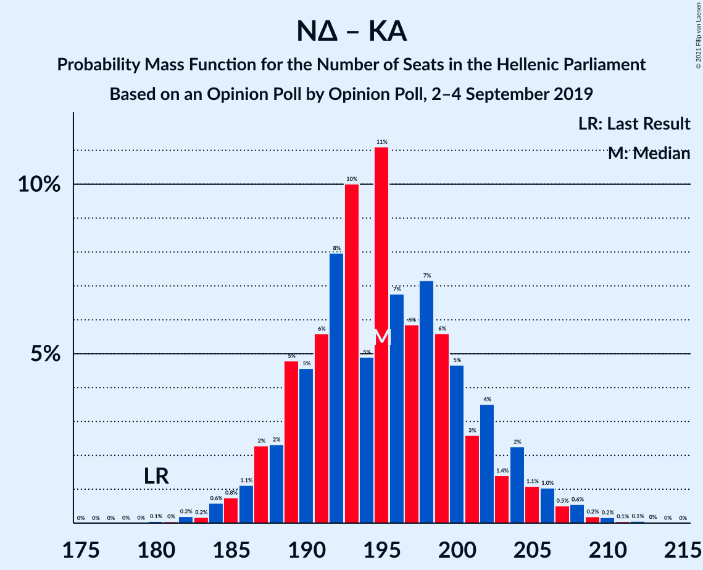
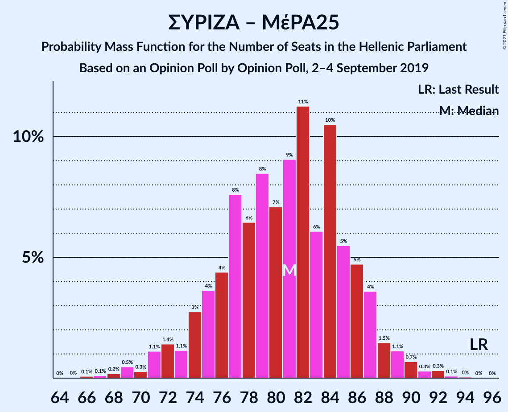
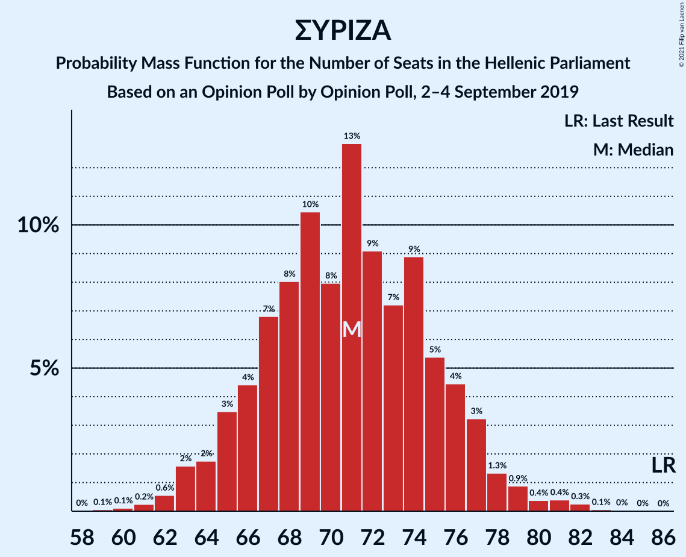

# Opinion Poll by Opinion Poll, 2–4 September 2019

<a href="#voting-intentions">Voting Intentions</a> | <a href="#seats">Seats</a> | <a href="#coalitions">Coalitions</a> | <a href="#technical-information">Technical Information</a>

## Voting Intentions

### Confidence Intervals

| Party | Last Result | Poll Result | 80% Confidence Interval | 90% Confidence Interval | 95% Confidence Interval | 99% Confidence Interval |
|:-----:|:-----------:|:-----------:|:-----------------------:|:-----------------------:|:-----------------------:|:-----------------------:|
| Νέα Δημοκρατία | 39.8% | 48.3% | 46.3–50.2% |45.8–50.8% |45.3–51.2% |44.4–52.2% |
| Συνασπισμός Ριζοσπαστικής Αριστεράς | 31.5% | 26.6% | 24.9–28.3% |24.5–28.9% |24.1–29.3% |23.3–30.1% |
| Κίνημα Αλλαγής | 8.1% | 6.2% | 5.3–7.2% |5.1–7.5% |4.9–7.8% |4.5–8.3% |
| Κομμουνιστικό Κόμμα Ελλάδας | 5.3% | 5.1% | 4.3–6.0% |4.1–6.3% |3.9–6.6% |3.6–7.0% |
| Μέτωπο Ευρωπαϊκής Ρεαλιστικής Ανυπακοής | 3.4% | 3.8% | 3.2–4.7% |3.0–4.9% |2.8–5.1% |2.5–5.6% |
| Ελληνική Λύση | 3.7% | 3.7% | 3.1–4.6% |2.9–4.8% |2.7–5.0% |2.5–5.5% |
| Χρυσή Αυγή | 2.9% | 2.4% | 1.9–3.1% |1.7–3.3% |1.6–3.4% |1.4–3.8% |
| Πλεύση Ελευθερίας | 1.5% | 1.6% | 1.2–2.2% |1.1–2.4% |1.0–2.6% |0.9–2.9% |

*Note:* The poll result column reflects the actual value used in the calculations. Published results may vary slightly, and in addition be rounded to fewer digits.

## Seats

### Confidence Intervals

| Party | Last Result | Median | 80% Confidence Interval | 90% Confidence Interval | 95% Confidence Interval | 99% Confidence Interval |
|:-----:|:-----------:|:------:|:-----------------------:|:-----------------------:|:-----------------------:|:-----------------------:|
| <a href="#νέα-δημοκρατία">Νέα Δημοκρατία</a> | 158 | 178 | 172–185 |171–186 |170–188 |167–191 |
| <a href="#συνασπισμός-ριζοσπαστικής-αριστεράς">Συνασπισμός Ριζοσπαστικής Αριστεράς</a> | 86 | 71 | 66–76 |65–77 |63–78 |62–81 |
| <a href="#κίνημα-αλλαγής">Κίνημα Αλλαγής</a> | 22 | 17 | 14–19 |14–20 |13–21 |12–22 |
| <a href="#κομμουνιστικό-κόμμα-ελλάδας">Κομμουνιστικό Κόμμα Ελλάδας</a> | 15 | 14 | 12–16 |11–17 |10–17 |10–19 |
| <a href="#μέτωπο-ευρωπαϊκής-ρεαλιστικής-ανυπακοής">Μέτωπο Ευρωπαϊκής Ρεαλιστικής Ανυπακοής</a> | 9 | 10 | 8–12 |0–13 |0–14 |0–15 |
| <a href="#ελληνική-λύση">Ελληνική Λύση</a> | 10 | 10 | 0–12 |0–13 |0–14 |0–14 |
| <a href="#χρυσή-αυγή">Χρυσή Αυγή</a> | 0 | 0 | 0–8 |0–9 |0–9 |0–10 |
| <a href="#πλεύση-ελευθερίας">Πλεύση Ελευθερίας</a> | 0 | 0 | 0 |0 |0 |0 |

### Νέα Δημοκρατία

*For a full overview of the results for this party, see the [Νέα Δημοκρατία](party-νέαδημοκρατία.html) page.*

| Number of Seats | Probability | Accumulated | Special Marks |
|:---------------:|:-----------:|:-----------:|:-------------:|
| 158 | 0% | 100% | Last Result |
| 159 | 0% | 100% |  |
| 160 | 0% | 100% |  |
| 161 | 0% | 100% |  |
| 162 | 0% | 100% |  |
| 163 | 0% | 100% |  |
| 164 | 0.1% | 100% |  |
| 165 | 0.1% | 99.9% |  |
| 166 | 0.2% | 99.8% |  |
| 167 | 0.4% | 99.7% |  |
| 168 | 0.5% | 99.3% |  |
| 169 | 1.0% | 98.8% |  |
| 170 | 2% | 98% |  |
| 171 | 4% | 96% |  |
| 172 | 4% | 93% |  |
| 173 | 4% | 89% |  |
| 174 | 6% | 85% |  |
| 175 | 6% | 79% |  |
| 176 | 8% | 73% |  |
| 177 | 11% | 66% |  |
| 178 | 10% | 55% | Median |
| 179 | 8% | 45% |  |
| 180 | 7% | 37% |  |
| 181 | 6% | 30% |  |
| 182 | 5% | 24% |  |
| 183 | 3% | 19% |  |
| 184 | 4% | 15% |  |
| 185 | 4% | 11% |  |
| 186 | 3% | 8% |  |
| 187 | 1.2% | 5% |  |
| 188 | 1.4% | 4% |  |
| 189 | 0.9% | 2% |  |
| 190 | 0.6% | 1.3% |  |
| 191 | 0.3% | 0.7% |  |
| 192 | 0.2% | 0.5% |  |
| 193 | 0.1% | 0.3% |  |
| 194 | 0.1% | 0.1% |  |
| 195 | 0% | 0.1% |  |
| 196 | 0% | 0% |  |

### Συνασπισμός Ριζοσπαστικής Αριστεράς

*For a full overview of the results for this party, see the [Συνασπισμός Ριζοσπαστικής Αριστεράς](party-συνασπισμόςριζοσπαστικήςαριστεράς.html) page.*

| Number of Seats | Probability | Accumulated | Special Marks |
|:---------------:|:-----------:|:-----------:|:-------------:|
| 59 | 0.1% | 100% |  |
| 60 | 0.1% | 99.9% |  |
| 61 | 0.2% | 99.8% |  |
| 62 | 0.6% | 99.6% |  |
| 63 | 2% | 99.0% |  |
| 64 | 2% | 97% |  |
| 65 | 3% | 96% |  |
| 66 | 4% | 92% |  |
| 67 | 7% | 88% |  |
| 68 | 8% | 81% |  |
| 69 | 10% | 73% |  |
| 70 | 8% | 62% |  |
| 71 | 13% | 54% | Median |
| 72 | 9% | 42% |  |
| 73 | 7% | 33% |  |
| 74 | 9% | 25% |  |
| 75 | 5% | 16% |  |
| 76 | 4% | 11% |  |
| 77 | 3% | 7% |  |
| 78 | 1.3% | 3% |  |
| 79 | 0.9% | 2% |  |
| 80 | 0.4% | 1.2% |  |
| 81 | 0.4% | 0.8% |  |
| 82 | 0.3% | 0.4% |  |
| 83 | 0.1% | 0.1% |  |
| 84 | 0% | 0.1% |  |
| 85 | 0% | 0% |  |
| 86 | 0% | 0% | Last Result |

### Κίνημα Αλλαγής

*For a full overview of the results for this party, see the [Κίνημα Αλλαγής](party-κίνημααλλαγής.html) page.*

| Number of Seats | Probability | Accumulated | Special Marks |
|:---------------:|:-----------:|:-----------:|:-------------:|
| 11 | 0.2% | 100% |  |
| 12 | 1.1% | 99.8% |  |
| 13 | 3% | 98.6% |  |
| 14 | 8% | 95% |  |
| 15 | 16% | 88% |  |
| 16 | 16% | 72% |  |
| 17 | 19% | 56% | Median |
| 18 | 18% | 37% |  |
| 19 | 10% | 19% |  |
| 20 | 7% | 9% |  |
| 21 | 2% | 3% |  |
| 22 | 0.7% | 1.0% | Last Result |
| 23 | 0.2% | 0.3% |  |
| 24 | 0% | 0.1% |  |
| 25 | 0% | 0% |  |

### Κομμουνιστικό Κόμμα Ελλάδας

*For a full overview of the results for this party, see the [Κομμουνιστικό Κόμμα Ελλάδας](party-κομμουνιστικόκόμμαελλάδας.html) page.*

| Number of Seats | Probability | Accumulated | Special Marks |
|:---------------:|:-----------:|:-----------:|:-------------:|
| 9 | 0.4% | 100% |  |
| 10 | 2% | 99.6% |  |
| 11 | 6% | 97% |  |
| 12 | 15% | 91% |  |
| 13 | 21% | 76% |  |
| 14 | 23% | 54% | Median |
| 15 | 15% | 32% | Last Result |
| 16 | 8% | 16% |  |
| 17 | 6% | 8% |  |
| 18 | 2% | 2% |  |
| 19 | 0.5% | 0.7% |  |
| 20 | 0.2% | 0.2% |  |
| 21 | 0% | 0% |  |

### Μέτωπο Ευρωπαϊκής Ρεαλιστικής Ανυπακοής

*For a full overview of the results for this party, see the [Μέτωπο Ευρωπαϊκής Ρεαλιστικής Ανυπακοής](party-μέτωποευρωπαϊκήςρεαλιστικήςανυπακοής.html) page.*

| Number of Seats | Probability | Accumulated | Special Marks |
|:---------------:|:-----------:|:-----------:|:-------------:|
| 0 | 7% | 100% |  |
| 1 | 0% | 93% |  |
| 2 | 0% | 93% |  |
| 3 | 0% | 93% |  |
| 4 | 0% | 93% |  |
| 5 | 0% | 93% |  |
| 6 | 0% | 93% |  |
| 7 | 0% | 93% |  |
| 8 | 7% | 93% |  |
| 9 | 15% | 87% | Last Result |
| 10 | 25% | 72% | Median |
| 11 | 25% | 47% |  |
| 12 | 14% | 22% |  |
| 13 | 6% | 9% |  |
| 14 | 2% | 3% |  |
| 15 | 0.7% | 0.8% |  |
| 16 | 0.1% | 0.1% |  |
| 17 | 0% | 0% |  |

### Ελληνική Λύση

*For a full overview of the results for this party, see the [Ελληνική Λύση](party-ελληνικήλύση.html) page.*

| Number of Seats | Probability | Accumulated | Special Marks |
|:---------------:|:-----------:|:-----------:|:-------------:|
| 0 | 10% | 100% |  |
| 1 | 0% | 90% |  |
| 2 | 0% | 90% |  |
| 3 | 0% | 90% |  |
| 4 | 0% | 90% |  |
| 5 | 0% | 90% |  |
| 6 | 0% | 90% |  |
| 7 | 0% | 90% |  |
| 8 | 13% | 90% |  |
| 9 | 16% | 76% |  |
| 10 | 25% | 60% | Last Result, Median |
| 11 | 14% | 36% |  |
| 12 | 16% | 22% |  |
| 13 | 3% | 6% |  |
| 14 | 2% | 3% |  |
| 15 | 0.4% | 0.5% |  |
| 16 | 0.1% | 0.1% |  |
| 17 | 0% | 0% |  |

### Χρυσή Αυγή

*For a full overview of the results for this party, see the [Χρυσή Αυγή](party-χρυσήαυγή.html) page.*

| Number of Seats | Probability | Accumulated | Special Marks |
|:---------------:|:-----------:|:-----------:|:-------------:|
| 0 | 86% | 100% | Last Result, Median |
| 1 | 0% | 14% |  |
| 2 | 0% | 14% |  |
| 3 | 0% | 14% |  |
| 4 | 0% | 14% |  |
| 5 | 0% | 14% |  |
| 6 | 0% | 14% |  |
| 7 | 0% | 14% |  |
| 8 | 8% | 14% |  |
| 9 | 4% | 5% |  |
| 10 | 1.0% | 1.2% |  |
| 11 | 0.1% | 0.2% |  |
| 12 | 0% | 0% |  |

### Πλεύση Ελευθερίας

*For a full overview of the results for this party, see the [Πλεύση Ελευθερίας](party-πλεύσηελευθερίας.html) page.*

| Number of Seats | Probability | Accumulated | Special Marks |
|:---------------:|:-----------:|:-----------:|:-------------:|
| 0 | 99.7% | 100% | Last Result, Median |
| 1 | 0% | 0.3% |  |
| 2 | 0% | 0.3% |  |
| 3 | 0% | 0.3% |  |
| 4 | 0% | 0.3% |  |
| 5 | 0% | 0.3% |  |
| 6 | 0% | 0.3% |  |
| 7 | 0% | 0.3% |  |
| 8 | 0.2% | 0.3% |  |
| 9 | 0.1% | 0.1% |  |
| 10 | 0% | 0% |  |

## Coalitions

### Confidence Intervals

| Coalition | Last Result | Median | Majority? | 80% Confidence Interval | 90% Confidence Interval | 95% Confidence Interval | 99% Confidence Interval |
|:---------:|:-----------:|:------:|:---------:|:-----------------------:|:-----------------------:|:-----------------------:|:-----------------------:|
| Νέα Δημοκρατία – Κίνημα Αλλαγής | 180 | 195 | 100% | 189–202 | 187–204 | 186–206 | 183–209 |
| Νέα Δημοκρατία | 158 | 178 | 100% | 172–185 | 171–186 | 170–188 | 167–191 |
| Συνασπισμός Ριζοσπαστικής Αριστεράς – Μέτωπο Ευρωπαϊκής Ρεαλιστικής Ανυπακοής | 95 | 81 | 0% | 75–86 | 74–87 | 72–89 | 69–91 |
| Συνασπισμός Ριζοσπαστικής Αριστεράς | 86 | 71 | 0% | 66–76 | 65–77 | 63–78 | 62–81 |

### Νέα Δημοκρατία – Κίνημα Αλλαγής

| Number of Seats | Probability | Accumulated | Special Marks |
|:---------------:|:-----------:|:-----------:|:-------------:|
| 180 | 0.1% | 100% | Last Result |
| 181 | 0% | 99.9% |  |
| 182 | 0.2% | 99.9% |  |
| 183 | 0.2% | 99.7% |  |
| 184 | 0.6% | 99.5% |  |
| 185 | 0.8% | 98.9% |  |
| 186 | 1.1% | 98% |  |
| 187 | 2% | 97% |  |
| 188 | 2% | 95% |  |
| 189 | 5% | 92% |  |
| 190 | 5% | 88% |  |
| 191 | 6% | 83% |  |
| 192 | 8% | 77% |  |
| 193 | 10% | 70% |  |
| 194 | 5% | 60% |  |
| 195 | 11% | 55% | Median |
| 196 | 7% | 44% |  |
| 197 | 6% | 37% |  |
| 198 | 7% | 31% |  |
| 199 | 6% | 24% |  |
| 200 | 5% | 18% |  |
| 201 | 3% | 13% |  |
| 202 | 4% | 11% |  |
| 203 | 1.4% | 7% |  |
| 204 | 2% | 6% |  |
| 205 | 1.1% | 4% |  |
| 206 | 1.0% | 3% |  |
| 207 | 0.5% | 2% |  |
| 208 | 0.6% | 1.1% |  |
| 209 | 0.2% | 0.5% |  |
| 210 | 0.2% | 0.3% |  |
| 211 | 0.1% | 0.2% |  |
| 212 | 0.1% | 0.1% |  |
| 213 | 0% | 0% |  |

### Νέα Δημοκρατία

| Number of Seats | Probability | Accumulated | Special Marks |
|:---------------:|:-----------:|:-----------:|:-------------:|
| 158 | 0% | 100% | Last Result |
| 159 | 0% | 100% |  |
| 160 | 0% | 100% |  |
| 161 | 0% | 100% |  |
| 162 | 0% | 100% |  |
| 163 | 0% | 100% |  |
| 164 | 0.1% | 100% |  |
| 165 | 0.1% | 99.9% |  |
| 166 | 0.2% | 99.8% |  |
| 167 | 0.4% | 99.7% |  |
| 168 | 0.5% | 99.3% |  |
| 169 | 1.0% | 98.8% |  |
| 170 | 2% | 98% |  |
| 171 | 4% | 96% |  |
| 172 | 4% | 93% |  |
| 173 | 4% | 89% |  |
| 174 | 6% | 85% |  |
| 175 | 6% | 79% |  |
| 176 | 8% | 73% |  |
| 177 | 11% | 66% |  |
| 178 | 10% | 55% | Median |
| 179 | 8% | 45% |  |
| 180 | 7% | 37% |  |
| 181 | 6% | 30% |  |
| 182 | 5% | 24% |  |
| 183 | 3% | 19% |  |
| 184 | 4% | 15% |  |
| 185 | 4% | 11% |  |
| 186 | 3% | 8% |  |
| 187 | 1.2% | 5% |  |
| 188 | 1.4% | 4% |  |
| 189 | 0.9% | 2% |  |
| 190 | 0.6% | 1.3% |  |
| 191 | 0.3% | 0.7% |  |
| 192 | 0.2% | 0.5% |  |
| 193 | 0.1% | 0.3% |  |
| 194 | 0.1% | 0.1% |  |
| 195 | 0% | 0.1% |  |
| 196 | 0% | 0% |  |

### Συνασπισμός Ριζοσπαστικής Αριστεράς – Μέτωπο Ευρωπαϊκής Ρεαλιστικής Ανυπακοής

| Number of Seats | Probability | Accumulated | Special Marks |
|:---------------:|:-----------:|:-----------:|:-------------:|
| 65 | 0% | 100% |  |
| 66 | 0.1% | 99.9% |  |
| 67 | 0.1% | 99.9% |  |
| 68 | 0.2% | 99.7% |  |
| 69 | 0.5% | 99.6% |  |
| 70 | 0.3% | 99.1% |  |
| 71 | 1.1% | 98.8% |  |
| 72 | 1.4% | 98% |  |
| 73 | 1.1% | 96% |  |
| 74 | 3% | 95% |  |
| 75 | 4% | 92% |  |
| 76 | 4% | 89% |  |
| 77 | 8% | 84% |  |
| 78 | 6% | 77% |  |
| 79 | 8% | 70% |  |
| 80 | 7% | 62% |  |
| 81 | 9% | 55% | Median |
| 82 | 11% | 46% |  |
| 83 | 6% | 34% |  |
| 84 | 10% | 28% |  |
| 85 | 5% | 18% |  |
| 86 | 5% | 12% |  |
| 87 | 4% | 8% |  |
| 88 | 1.5% | 4% |  |
| 89 | 1.1% | 3% |  |
| 90 | 0.7% | 1.5% |  |
| 91 | 0.3% | 0.8% |  |
| 92 | 0.3% | 0.5% |  |
| 93 | 0.1% | 0.2% |  |
| 94 | 0% | 0.1% |  |
| 95 | 0% | 0% | Last Result |

### Συνασπισμός Ριζοσπαστικής Αριστεράς

| Number of Seats | Probability | Accumulated | Special Marks |
|:---------------:|:-----------:|:-----------:|:-------------:|
| 59 | 0.1% | 100% |  |
| 60 | 0.1% | 99.9% |  |
| 61 | 0.2% | 99.8% |  |
| 62 | 0.6% | 99.6% |  |
| 63 | 2% | 99.0% |  |
| 64 | 2% | 97% |  |
| 65 | 3% | 96% |  |
| 66 | 4% | 92% |  |
| 67 | 7% | 88% |  |
| 68 | 8% | 81% |  |
| 69 | 10% | 73% |  |
| 70 | 8% | 62% |  |
| 71 | 13% | 54% | Median |
| 72 | 9% | 42% |  |
| 73 | 7% | 33% |  |
| 74 | 9% | 25% |  |
| 75 | 5% | 16% |  |
| 76 | 4% | 11% |  |
| 77 | 3% | 7% |  |
| 78 | 1.3% | 3% |  |
| 79 | 0.9% | 2% |  |
| 80 | 0.4% | 1.2% |  |
| 81 | 0.4% | 0.8% |  |
| 82 | 0.3% | 0.4% |  |
| 83 | 0.1% | 0.1% |  |
| 84 | 0% | 0.1% |  |
| 85 | 0% | 0% |  |
| 86 | 0% | 0% | Last Result |

## Technical Information

### Opinion Poll

+ **Polling firm:** Opinion Poll
+ **Commissioner(s):** —
+ **Fieldwork period:** 2–4 September 2019

### Calculations

+ **Sample size:** 1102
+ **Simulations done:** 1,048,576
+ **Error estimate:** 1.08%

