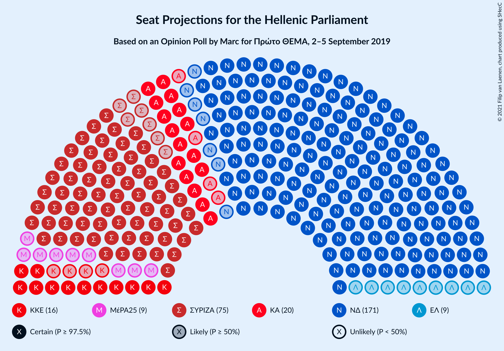
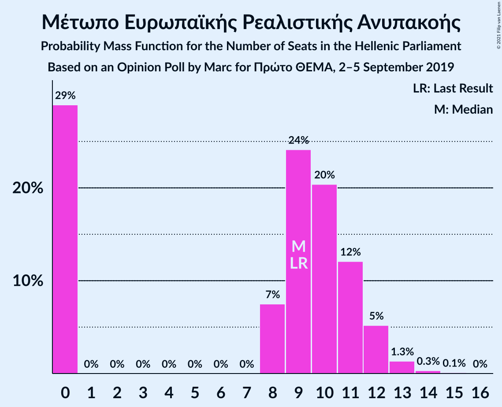

# Opinion Poll by Marc for Πρώτο ΘΕΜΑ, 2–5 September 2019

<a href="#voting-intentions">Voting Intentions</a> | <a href="#seats">Seats</a> | <a href="#coalitions">Coalitions</a> | <a href="#technical-information">Technical Information</a>

## Voting Intentions

### Confidence Intervals

| Party | Last Result | Poll Result | 80% Confidence Interval | 90% Confidence Interval | 95% Confidence Interval | 99% Confidence Interval |
|:-----:|:-----------:|:-----------:|:-----------------------:|:-----------------------:|:-----------------------:|:-----------------------:|
| Νέα Δημοκρατία | 39.8% | 45.9% | 43.8–47.9% |43.3–48.5% |42.8–49.0% |41.8–49.9% |
| Συνασπισμός Ριζοσπαστικής Αριστεράς | 31.5% | 28.2% | 26.4–30.1% |25.9–30.6% |25.5–31.0% |24.6–32.0% |
| Κίνημα Αλλαγής | 8.1% | 7.4% | 6.4–8.6% |6.2–8.9% |5.9–9.2% |5.5–9.8% |
| Κομμουνιστικό Κόμμα Ελλάδας | 5.3% | 5.8% | 4.9–6.9% |4.7–7.2% |4.5–7.4% |4.1–8.0% |
| Ελληνική Λύση | 3.7% | 3.3% | 2.7–4.1% |2.5–4.4% |2.3–4.6% |2.1–5.0% |
| Μέτωπο Ευρωπαϊκής Ρεαλιστικής Ανυπακοής | 3.4% | 3.3% | 2.7–4.1% |2.5–4.4% |2.3–4.6% |2.1–5.0% |
| Χρυσή Αυγή | 2.9% | 1.8% | 1.4–2.5% |1.2–2.7% |1.1–2.8% |1.0–3.2% |
| Πλεύση Ελευθερίας | 1.5% | 1.3% | 0.9–1.9% |0.8–2.1% |0.8–2.2% |0.6–2.5% |

*Note:* The poll result column reflects the actual value used in the calculations. Published results may vary slightly, and in addition be rounded to fewer digits.

## Seats

### Confidence Intervals

| Party | Last Result | Median | 80% Confidence Interval | 90% Confidence Interval | 95% Confidence Interval | 99% Confidence Interval |
|:-----:|:-----------:|:------:|:-----------------------:|:-----------------------:|:-----------------------:|:-----------------------:|
| <a href="#νέα-δημοκρατία">Νέα Δημοκρατία</a> | 158 | 174 | 167–180 |166–182 |164–184 |161–188 |
| <a href="#συνασπισμός-ριζοσπαστικής-αριστεράς">Συνασπισμός Ριζοσπαστικής Αριστεράς</a> | 86 | 76 | 71–82 |69–83 |68–85 |66–87 |
| <a href="#κίνημα-αλλαγής">Κίνημα Αλλαγής</a> | 22 | 20 | 17–23 |16–24 |16–25 |15–27 |
| <a href="#κομμουνιστικό-κόμμα-ελλάδας">Κομμουνιστικό Κόμμα Ελλάδας</a> | 15 | 16 | 13–18 |13–19 |12–20 |11–22 |
| <a href="#ελληνική-λύση">Ελληνική Λύση</a> | 10 | 9 | 0–11 |0–12 |0–12 |0–14 |
| <a href="#μέτωπο-ευρωπαϊκής-ρεαλιστικής-ανυπακοής">Μέτωπο Ευρωπαϊκής Ρεαλιστικής Ανυπακοής</a> | 9 | 9 | 0–11 |0–12 |0–12 |0–13 |
| <a href="#χρυσή-αυγή">Χρυσή Αυγή</a> | 0 | 0 | 0 |0 |0 |0–8 |
| <a href="#πλεύση-ελευθερίας">Πλεύση Ελευθερίας</a> | 0 | 0 | 0 |0 |0 |0 |

### Νέα Δημοκρατία

*For a full overview of the results for this party, see the [Νέα Δημοκρατία](party-νέαδημοκρατία.html) page.*

| Number of Seats | Probability | Accumulated | Special Marks |
|:---------------:|:-----------:|:-----------:|:-------------:|
| 158 | 0% | 100% | Last Result |
| 159 | 0% | 99.9% |  |
| 160 | 0.2% | 99.9% |  |
| 161 | 0.3% | 99.7% |  |
| 162 | 0.4% | 99.4% |  |
| 163 | 0.9% | 99.1% |  |
| 164 | 1.2% | 98% |  |
| 165 | 2% | 97% |  |
| 166 | 2% | 95% |  |
| 167 | 5% | 93% |  |
| 168 | 3% | 88% |  |
| 169 | 3% | 85% |  |
| 170 | 7% | 81% |  |
| 171 | 9% | 75% |  |
| 172 | 6% | 65% |  |
| 173 | 7% | 59% |  |
| 174 | 8% | 52% | Median |
| 175 | 7% | 45% |  |
| 176 | 8% | 37% |  |
| 177 | 8% | 29% |  |
| 178 | 6% | 21% |  |
| 179 | 4% | 15% |  |
| 180 | 3% | 11% |  |
| 181 | 2% | 8% |  |
| 182 | 0.8% | 5% |  |
| 183 | 2% | 5% |  |
| 184 | 0.9% | 3% |  |
| 185 | 0.9% | 2% |  |
| 186 | 0.3% | 1.1% |  |
| 187 | 0.3% | 0.8% |  |
| 188 | 0.2% | 0.6% |  |
| 189 | 0.1% | 0.4% |  |
| 190 | 0.2% | 0.3% |  |
| 191 | 0% | 0.1% |  |
| 192 | 0% | 0.1% |  |
| 193 | 0% | 0.1% |  |
| 194 | 0% | 0% |  |

### Συνασπισμός Ριζοσπαστικής Αριστεράς

*For a full overview of the results for this party, see the [Συνασπισμός Ριζοσπαστικής Αριστεράς](party-συνασπισμόςριζοσπαστικήςαριστεράς.html) page.*

| Number of Seats | Probability | Accumulated | Special Marks |
|:---------------:|:-----------:|:-----------:|:-------------:|
| 63 | 0% | 100% |  |
| 64 | 0.1% | 99.9% |  |
| 65 | 0.3% | 99.9% |  |
| 66 | 0.4% | 99.6% |  |
| 67 | 0.9% | 99.1% |  |
| 68 | 3% | 98% |  |
| 69 | 2% | 95% |  |
| 70 | 3% | 93% |  |
| 71 | 4% | 90% |  |
| 72 | 4% | 86% |  |
| 73 | 6% | 82% |  |
| 74 | 8% | 76% |  |
| 75 | 11% | 68% |  |
| 76 | 11% | 56% | Median |
| 77 | 12% | 45% |  |
| 78 | 7% | 33% |  |
| 79 | 5% | 26% |  |
| 80 | 6% | 21% |  |
| 81 | 4% | 16% |  |
| 82 | 4% | 11% |  |
| 83 | 3% | 8% |  |
| 84 | 1.4% | 5% |  |
| 85 | 2% | 3% |  |
| 86 | 0.9% | 2% | Last Result |
| 87 | 0.3% | 0.7% |  |
| 88 | 0.2% | 0.4% |  |
| 89 | 0.1% | 0.2% |  |
| 90 | 0.1% | 0.1% |  |
| 91 | 0% | 0.1% |  |
| 92 | 0% | 0.1% |  |
| 93 | 0% | 0% |  |

### Κίνημα Αλλαγής

*For a full overview of the results for this party, see the [Κίνημα Αλλαγής](party-κίνημααλλαγής.html) page.*

| Number of Seats | Probability | Accumulated | Special Marks |
|:---------------:|:-----------:|:-----------:|:-------------:|
| 13 | 0.1% | 100% |  |
| 14 | 0.2% | 99.9% |  |
| 15 | 1.2% | 99.7% |  |
| 16 | 3% | 98% |  |
| 17 | 10% | 95% |  |
| 18 | 9% | 85% |  |
| 19 | 17% | 77% |  |
| 20 | 19% | 60% | Median |
| 21 | 14% | 41% |  |
| 22 | 12% | 27% | Last Result |
| 23 | 8% | 15% |  |
| 24 | 4% | 7% |  |
| 25 | 2% | 4% |  |
| 26 | 0.9% | 2% |  |
| 27 | 0.4% | 0.6% |  |
| 28 | 0.1% | 0.2% |  |
| 29 | 0% | 0.1% |  |
| 30 | 0% | 0% |  |

### Κομμουνιστικό Κόμμα Ελλάδας

*For a full overview of the results for this party, see the [Κομμουνιστικό Κόμμα Ελλάδας](party-κομμουνιστικόκόμμαελλάδας.html) page.*

| Number of Seats | Probability | Accumulated | Special Marks |
|:---------------:|:-----------:|:-----------:|:-------------:|
| 10 | 0.2% | 100% |  |
| 11 | 0.7% | 99.8% |  |
| 12 | 3% | 99.1% |  |
| 13 | 9% | 96% |  |
| 14 | 17% | 87% |  |
| 15 | 14% | 70% | Last Result |
| 16 | 20% | 57% | Median |
| 17 | 15% | 37% |  |
| 18 | 12% | 22% |  |
| 19 | 5% | 10% |  |
| 20 | 3% | 4% |  |
| 21 | 1.0% | 2% |  |
| 22 | 0.4% | 0.6% |  |
| 23 | 0.2% | 0.2% |  |
| 24 | 0% | 0% |  |

### Ελληνική Λύση

*For a full overview of the results for this party, see the [Ελληνική Λύση](party-ελληνικήλύση.html) page.*

| Number of Seats | Probability | Accumulated | Special Marks |
|:---------------:|:-----------:|:-----------:|:-------------:|
| 0 | 27% | 100% |  |
| 1 | 0% | 73% |  |
| 2 | 0% | 73% |  |
| 3 | 0% | 73% |  |
| 4 | 0% | 73% |  |
| 5 | 0% | 73% |  |
| 6 | 0% | 73% |  |
| 7 | 0% | 73% |  |
| 8 | 10% | 73% |  |
| 9 | 24% | 63% | Median |
| 10 | 22% | 39% | Last Result |
| 11 | 11% | 17% |  |
| 12 | 4% | 6% |  |
| 13 | 1.2% | 2% |  |
| 14 | 0.4% | 0.5% |  |
| 15 | 0.1% | 0.1% |  |
| 16 | 0% | 0% |  |

### Μέτωπο Ευρωπαϊκής Ρεαλιστικής Ανυπακοής

*For a full overview of the results for this party, see the [Μέτωπο Ευρωπαϊκής Ρεαλιστικής Ανυπακοής](party-μέτωποευρωπαϊκήςρεαλιστικήςανυπακοής.html) page.*

| Number of Seats | Probability | Accumulated | Special Marks |
|:---------------:|:-----------:|:-----------:|:-------------:|
| 0 | 29% | 100% |  |
| 1 | 0% | 71% |  |
| 2 | 0% | 71% |  |
| 3 | 0% | 71% |  |
| 4 | 0% | 71% |  |
| 5 | 0% | 71% |  |
| 6 | 0% | 71% |  |
| 7 | 0% | 71% |  |
| 8 | 7% | 71% |  |
| 9 | 24% | 64% | Last Result, Median |
| 10 | 20% | 39% |  |
| 11 | 12% | 19% |  |
| 12 | 5% | 7% |  |
| 13 | 1.3% | 2% |  |
| 14 | 0.3% | 0.4% |  |
| 15 | 0.1% | 0.1% |  |
| 16 | 0% | 0% |  |

### Χρυσή Αυγή

*For a full overview of the results for this party, see the [Χρυσή Αυγή](party-χρυσήαυγή.html) page.*

| Number of Seats | Probability | Accumulated | Special Marks |
|:---------------:|:-----------:|:-----------:|:-------------:|
| 0 | 98.9% | 100% | Last Result, Median |
| 1 | 0% | 1.1% |  |
| 2 | 0% | 1.1% |  |
| 3 | 0% | 1.1% |  |
| 4 | 0% | 1.1% |  |
| 5 | 0% | 1.1% |  |
| 6 | 0% | 1.1% |  |
| 7 | 0% | 1.1% |  |
| 8 | 0.6% | 1.1% |  |
| 9 | 0.4% | 0.5% |  |
| 10 | 0.1% | 0.1% |  |
| 11 | 0% | 0% |  |

### Πλεύση Ελευθερίας

*For a full overview of the results for this party, see the [Πλεύση Ελευθερίας](party-πλεύσηελευθερίας.html) page.*

| Number of Seats | Probability | Accumulated | Special Marks |
|:---------------:|:-----------:|:-----------:|:-------------:|
| 0 | 100% | 100% | Last Result, Median |

## Coalitions

### Confidence Intervals

| Coalition | Last Result | Median | Majority? | 80% Confidence Interval | 90% Confidence Interval | 95% Confidence Interval | 99% Confidence Interval |
|:---------:|:-----------:|:------:|:---------:|:-----------------------:|:-----------------------:|:-----------------------:|:-----------------------:|
| Νέα Δημοκρατία – Κίνημα Αλλαγής | 180 | 193 | 100% | 187–200 | 186–203 | 185–205 | 181–209 |
| Νέα Δημοκρατία | 158 | 174 | 100% | 167–180 | 166–182 | 164–184 | 161–188 |
| Συνασπισμός Ριζοσπαστικής Αριστεράς – Μέτωπο Ευρωπαϊκής Ρεαλιστικής Ανυπακοής | 95 | 84 | 0% | 76–89 | 74–91 | 73–93 | 71–96 |
| Συνασπισμός Ριζοσπαστικής Αριστεράς | 86 | 76 | 0% | 71–82 | 69–83 | 68–85 | 66–87 |

### Νέα Δημοκρατία – Κίνημα Αλλαγής

| Number of Seats | Probability | Accumulated | Special Marks |
|:---------------:|:-----------:|:-----------:|:-------------:|
| 178 | 0% | 100% |  |
| 179 | 0.1% | 99.9% |  |
| 180 | 0.3% | 99.9% | Last Result |
| 181 | 0.3% | 99.6% |  |
| 182 | 0.4% | 99.3% |  |
| 183 | 0.5% | 98.9% |  |
| 184 | 0.9% | 98% |  |
| 185 | 2% | 98% |  |
| 186 | 2% | 95% |  |
| 187 | 6% | 93% |  |
| 188 | 3% | 87% |  |
| 189 | 3% | 84% |  |
| 190 | 6% | 81% |  |
| 191 | 10% | 75% |  |
| 192 | 7% | 65% |  |
| 193 | 9% | 58% |  |
| 194 | 6% | 48% | Median |
| 195 | 4% | 42% |  |
| 196 | 4% | 38% |  |
| 197 | 9% | 34% |  |
| 198 | 7% | 25% |  |
| 199 | 6% | 18% |  |
| 200 | 3% | 11% |  |
| 201 | 1.2% | 9% |  |
| 202 | 1.3% | 7% |  |
| 203 | 1.3% | 6% |  |
| 204 | 2% | 5% |  |
| 205 | 1.3% | 3% |  |
| 206 | 0.9% | 2% |  |
| 207 | 0.2% | 0.9% |  |
| 208 | 0.1% | 0.7% |  |
| 209 | 0.2% | 0.6% |  |
| 210 | 0.2% | 0.5% |  |
| 211 | 0.2% | 0.3% |  |
| 212 | 0% | 0.1% |  |
| 213 | 0% | 0% |  |

### Νέα Δημοκρατία

| Number of Seats | Probability | Accumulated | Special Marks |
|:---------------:|:-----------:|:-----------:|:-------------:|
| 158 | 0% | 100% | Last Result |
| 159 | 0% | 99.9% |  |
| 160 | 0.2% | 99.9% |  |
| 161 | 0.3% | 99.7% |  |
| 162 | 0.4% | 99.4% |  |
| 163 | 0.9% | 99.1% |  |
| 164 | 1.2% | 98% |  |
| 165 | 2% | 97% |  |
| 166 | 2% | 95% |  |
| 167 | 5% | 93% |  |
| 168 | 3% | 88% |  |
| 169 | 3% | 85% |  |
| 170 | 7% | 81% |  |
| 171 | 9% | 75% |  |
| 172 | 6% | 65% |  |
| 173 | 7% | 59% |  |
| 174 | 8% | 52% | Median |
| 175 | 7% | 45% |  |
| 176 | 8% | 37% |  |
| 177 | 8% | 29% |  |
| 178 | 6% | 21% |  |
| 179 | 4% | 15% |  |
| 180 | 3% | 11% |  |
| 181 | 2% | 8% |  |
| 182 | 0.8% | 5% |  |
| 183 | 2% | 5% |  |
| 184 | 0.9% | 3% |  |
| 185 | 0.9% | 2% |  |
| 186 | 0.3% | 1.1% |  |
| 187 | 0.3% | 0.8% |  |
| 188 | 0.2% | 0.6% |  |
| 189 | 0.1% | 0.4% |  |
| 190 | 0.2% | 0.3% |  |
| 191 | 0% | 0.1% |  |
| 192 | 0% | 0.1% |  |
| 193 | 0% | 0.1% |  |
| 194 | 0% | 0% |  |

### Συνασπισμός Ριζοσπαστικής Αριστεράς – Μέτωπο Ευρωπαϊκής Ρεαλιστικής Ανυπακοής

| Number of Seats | Probability | Accumulated | Special Marks |
|:---------------:|:-----------:|:-----------:|:-------------:|
| 67 | 0% | 100% |  |
| 68 | 0% | 99.9% |  |
| 69 | 0.2% | 99.9% |  |
| 70 | 0.1% | 99.7% |  |
| 71 | 0.7% | 99.6% |  |
| 72 | 0.8% | 98.9% |  |
| 73 | 2% | 98% |  |
| 74 | 3% | 97% |  |
| 75 | 2% | 94% |  |
| 76 | 4% | 91% |  |
| 77 | 3% | 87% |  |
| 78 | 4% | 84% |  |
| 79 | 5% | 80% |  |
| 80 | 5% | 76% |  |
| 81 | 5% | 70% |  |
| 82 | 5% | 65% |  |
| 83 | 5% | 61% |  |
| 84 | 7% | 55% |  |
| 85 | 12% | 48% | Median |
| 86 | 11% | 36% |  |
| 87 | 10% | 25% |  |
| 88 | 5% | 15% |  |
| 89 | 2% | 10% |  |
| 90 | 2% | 8% |  |
| 91 | 2% | 6% |  |
| 92 | 1.0% | 4% |  |
| 93 | 0.7% | 3% |  |
| 94 | 0.9% | 2% |  |
| 95 | 0.5% | 1.1% | Last Result |
| 96 | 0.3% | 0.6% |  |
| 97 | 0.2% | 0.3% |  |
| 98 | 0.1% | 0.1% |  |
| 99 | 0% | 0% |  |

### Συνασπισμός Ριζοσπαστικής Αριστεράς

| Number of Seats | Probability | Accumulated | Special Marks |
|:---------------:|:-----------:|:-----------:|:-------------:|
| 63 | 0% | 100% |  |
| 64 | 0.1% | 99.9% |  |
| 65 | 0.3% | 99.9% |  |
| 66 | 0.4% | 99.6% |  |
| 67 | 0.9% | 99.1% |  |
| 68 | 3% | 98% |  |
| 69 | 2% | 95% |  |
| 70 | 3% | 93% |  |
| 71 | 4% | 90% |  |
| 72 | 4% | 86% |  |
| 73 | 6% | 82% |  |
| 74 | 8% | 76% |  |
| 75 | 11% | 68% |  |
| 76 | 11% | 56% | Median |
| 77 | 12% | 45% |  |
| 78 | 7% | 33% |  |
| 79 | 5% | 26% |  |
| 80 | 6% | 21% |  |
| 81 | 4% | 16% |  |
| 82 | 4% | 11% |  |
| 83 | 3% | 8% |  |
| 84 | 1.4% | 5% |  |
| 85 | 2% | 3% |  |
| 86 | 0.9% | 2% | Last Result |
| 87 | 0.3% | 0.7% |  |
| 88 | 0.2% | 0.4% |  |
| 89 | 0.1% | 0.2% |  |
| 90 | 0.1% | 0.1% |  |
| 91 | 0% | 0.1% |  |
| 92 | 0% | 0.1% |  |
| 93 | 0% | 0% |  |

## Technical Information

### Opinion Poll

+ **Polling firm:** Marc
+ **Commissioner(s):** Πρώτο ΘΕΜΑ
+ **Fieldwork period:** 2–5 September 2019

### Calculations

+ **Sample size:** 1001
+ **Simulations done:** 1,048,576
+ **Error estimate:** 1.66%

