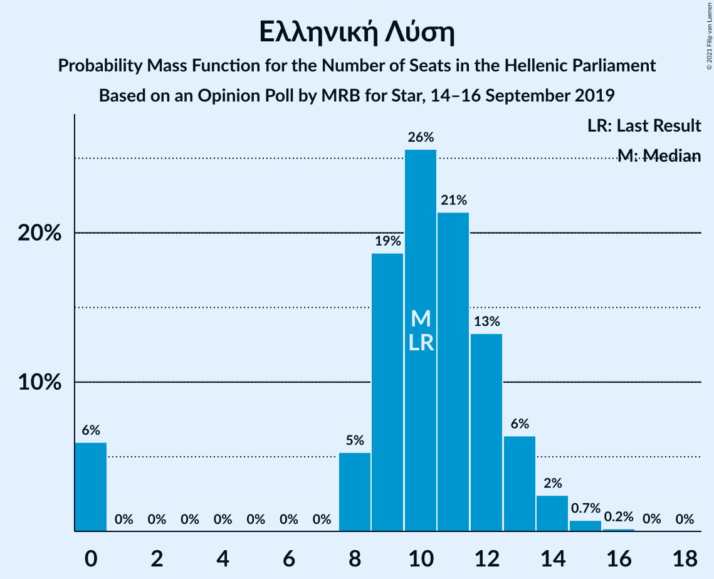

# Opinion Poll by MRB for Star, 14–16 September 2019

<a href="#voting-intentions">Voting Intentions</a> | <a href="#seats">Seats</a> | <a href="#coalitions">Coalitions</a> | <a href="#technical-information">Technical Information</a>

## Voting Intentions

### Confidence Intervals

| Party | Last Result | Poll Result | 80% Confidence Interval | 90% Confidence Interval | 95% Confidence Interval | 99% Confidence Interval |
|:-----:|:-----------:|:-----------:|:-----------------------:|:-----------------------:|:-----------------------:|:-----------------------:|
| Νέα Δημοκρατία | 39.8% | 44.4% | 42.4–46.4% |41.9–47.0% |41.4–47.5% |40.4–48.5% |
| Συνασπισμός Ριζοσπαστικής Αριστεράς | 31.5% | 26.7% | 24.9–28.5% |24.5–29.0% |24.0–29.5% |23.2–30.4% |
| Κίνημα Αλλαγής | 8.1% | 7.8% | 6.9–9.0% |6.6–9.4% |6.3–9.7% |5.9–10.3% |
| Κομμουνιστικό Κόμμα Ελλάδας | 5.3% | 5.9% | 5.0–6.9% |4.8–7.2% |4.6–7.5% |4.2–8.0% |
| Μέτωπο Ευρωπαϊκής Ρεαλιστικής Ανυπακοής | 3.4% | 5.2% | 4.4–6.2% |4.2–6.5% |4.0–6.7% |3.6–7.3% |
| Ελληνική Λύση | 3.7% | 3.8% | 3.2–4.7% |3.0–5.0% |2.8–5.2% |2.5–5.7% |

*Note:* The poll result column reflects the actual value used in the calculations. Published results may vary slightly, and in addition be rounded to fewer digits.

## Seats

### Confidence Intervals

| Party | Last Result | Median | 80% Confidence Interval | 90% Confidence Interval | 95% Confidence Interval | 99% Confidence Interval |
|:-----:|:-----------:|:------:|:-----------------------:|:-----------------------:|:-----------------------:|:-----------------------:|
| <a href="#νέα-δημοκρατία">Νέα Δημοκρατία</a> | 158 | 168 | 163–173 |161–175 |160–177 |158–179 |
| <a href="#συνασπισμός-ριζοσπαστικής-αριστεράς">Συνασπισμός Ριζοσπαστικής Αριστεράς</a> | 86 | 70 | 66–76 |65–77 |65–78 |62–81 |
| <a href="#κίνημα-αλλαγής">Κίνημα Αλλαγής</a> | 22 | 21 | 18–24 |18–25 |17–26 |16–27 |
| <a href="#κομμουνιστικό-κόμμα-ελλάδας">Κομμουνιστικό Κόμμα Ελλάδας</a> | 15 | 16 | 13–18 |13–19 |12–20 |11–21 |
| <a href="#μέτωπο-ευρωπαϊκής-ρεαλιστικής-ανυπακοής">Μέτωπο Ευρωπαϊκής Ρεαλιστικής Ανυπακοής</a> | 9 | 14 | 12–16 |11–17 |11–18 |10–19 |
| <a href="#ελληνική-λύση">Ελληνική Λύση</a> | 10 | 10 | 8–12 |0–13 |0–14 |0–15 |

### Νέα Δημοκρατία

*For a full overview of the results for this party, see the [Νέα Δημοκρατία](party-νέαδημοκρατία.html) page.*

| Number of Seats | Probability | Accumulated | Special Marks |
|:---------------:|:-----------:|:-----------:|:-------------:|
| 155 | 0.1% | 100% |  |
| 156 | 0.1% | 99.9% |  |
| 157 | 0.3% | 99.8% |  |
| 158 | 0.5% | 99.5% | Last Result |
| 159 | 0.8% | 99.0% |  |
| 160 | 1.4% | 98% |  |
| 161 | 2% | 97% |  |
| 162 | 3% | 95% |  |
| 163 | 5% | 91% |  |
| 164 | 6% | 87% |  |
| 165 | 8% | 81% |  |
| 166 | 9% | 73% |  |
| 167 | 9% | 64% |  |
| 168 | 9% | 55% | Median |
| 169 | 10% | 46% |  |
| 170 | 8% | 36% |  |
| 171 | 8% | 28% |  |
| 172 | 6% | 20% |  |
| 173 | 4% | 14% |  |
| 174 | 3% | 10% |  |
| 175 | 2% | 6% |  |
| 176 | 2% | 4% |  |
| 177 | 1.1% | 3% |  |
| 178 | 0.6% | 1.5% |  |
| 179 | 0.4% | 0.8% |  |
| 180 | 0.2% | 0.5% |  |
| 181 | 0.1% | 0.2% |  |
| 182 | 0.1% | 0.1% |  |
| 183 | 0% | 0.1% |  |
| 184 | 0% | 0% |  |

### Συνασπισμός Ριζοσπαστικής Αριστεράς

*For a full overview of the results for this party, see the [Συνασπισμός Ριζοσπαστικής Αριστεράς](party-συνασπισμόςριζοσπαστικήςαριστεράς.html) page.*

| Number of Seats | Probability | Accumulated | Special Marks |
|:---------------:|:-----------:|:-----------:|:-------------:|
| 59 | 0% | 100% |  |
| 60 | 0% | 99.9% |  |
| 61 | 0.2% | 99.9% |  |
| 62 | 1.1% | 99.7% |  |
| 63 | 0.8% | 98.6% |  |
| 64 | 0.3% | 98% |  |
| 65 | 3% | 98% |  |
| 66 | 9% | 94% |  |
| 67 | 4% | 86% |  |
| 68 | 2% | 81% |  |
| 69 | 12% | 80% |  |
| 70 | 21% | 68% | Median |
| 71 | 4% | 47% |  |
| 72 | 4% | 43% |  |
| 73 | 14% | 39% |  |
| 74 | 12% | 26% |  |
| 75 | 2% | 13% |  |
| 76 | 2% | 11% |  |
| 77 | 5% | 9% |  |
| 78 | 2% | 4% |  |
| 79 | 0.4% | 2% |  |
| 80 | 0.6% | 1.4% |  |
| 81 | 0.5% | 0.8% |  |
| 82 | 0.1% | 0.3% |  |
| 83 | 0.1% | 0.1% |  |
| 84 | 0% | 0.1% |  |
| 85 | 0% | 0% |  |
| 86 | 0% | 0% | Last Result |

### Κίνημα Αλλαγής

*For a full overview of the results for this party, see the [Κίνημα Αλλαγής](party-κίνημααλλαγής.html) page.*

| Number of Seats | Probability | Accumulated | Special Marks |
|:---------------:|:-----------:|:-----------:|:-------------:|
| 14 | 0.1% | 100% |  |
| 15 | 0.3% | 99.9% |  |
| 16 | 1.1% | 99.6% |  |
| 17 | 3% | 98% |  |
| 18 | 7% | 95% |  |
| 19 | 12% | 88% |  |
| 20 | 17% | 76% |  |
| 21 | 17% | 59% | Median |
| 22 | 16% | 41% | Last Result |
| 23 | 12% | 25% |  |
| 24 | 7% | 14% |  |
| 25 | 4% | 7% |  |
| 26 | 2% | 3% |  |
| 27 | 0.8% | 1.2% |  |
| 28 | 0.3% | 0.4% |  |
| 29 | 0.1% | 0.1% |  |
| 30 | 0% | 0% |  |

### Κομμουνιστικό Κόμμα Ελλάδας

*For a full overview of the results for this party, see the [Κομμουνιστικό Κόμμα Ελλάδας](party-κομμουνιστικόκόμμαελλάδας.html) page.*

| Number of Seats | Probability | Accumulated | Special Marks |
|:---------------:|:-----------:|:-----------:|:-------------:|
| 10 | 0.1% | 100% |  |
| 11 | 0.7% | 99.9% |  |
| 12 | 3% | 99.2% |  |
| 13 | 7% | 96% |  |
| 14 | 13% | 89% |  |
| 15 | 19% | 75% | Last Result |
| 16 | 21% | 56% | Median |
| 17 | 15% | 36% |  |
| 18 | 11% | 20% |  |
| 19 | 6% | 9% |  |
| 20 | 2% | 4% |  |
| 21 | 1.0% | 1.4% |  |
| 22 | 0.3% | 0.4% |  |
| 23 | 0.1% | 0.1% |  |
| 24 | 0% | 0% |  |

### Μέτωπο Ευρωπαϊκής Ρεαλιστικής Ανυπακοής

*For a full overview of the results for this party, see the [Μέτωπο Ευρωπαϊκής Ρεαλιστικής Ανυπακοής](party-μέτωποευρωπαϊκήςρεαλιστικήςανυπακοής.html) page.*

| Number of Seats | Probability | Accumulated | Special Marks |
|:---------------:|:-----------:|:-----------:|:-------------:|
| 9 | 0.3% | 100% | Last Result |
| 10 | 2% | 99.7% |  |
| 11 | 6% | 98% |  |
| 12 | 13% | 92% |  |
| 13 | 19% | 79% |  |
| 14 | 22% | 60% | Median |
| 15 | 17% | 38% |  |
| 16 | 12% | 21% |  |
| 17 | 6% | 10% |  |
| 18 | 3% | 4% |  |
| 19 | 0.9% | 1.2% |  |
| 20 | 0.3% | 0.4% |  |
| 21 | 0.1% | 0.1% |  |
| 22 | 0% | 0% |  |

### Ελληνική Λύση

*For a full overview of the results for this party, see the [Ελληνική Λύση](party-ελληνικήλύση.html) page.*

| Number of Seats | Probability | Accumulated | Special Marks |
|:---------------:|:-----------:|:-----------:|:-------------:|
| 0 | 6% | 100% |  |
| 1 | 0% | 94% |  |
| 2 | 0% | 94% |  |
| 3 | 0% | 94% |  |
| 4 | 0% | 94% |  |
| 5 | 0% | 94% |  |
| 6 | 0% | 94% |  |
| 7 | 0% | 94% |  |
| 8 | 5% | 94% |  |
| 9 | 19% | 89% |  |
| 10 | 26% | 70% | Last Result, Median |
| 11 | 21% | 44% |  |
| 12 | 13% | 23% |  |
| 13 | 6% | 10% |  |
| 14 | 2% | 3% |  |
| 15 | 0.7% | 1.0% |  |
| 16 | 0.2% | 0.2% |  |
| 17 | 0% | 0% |  |

## Coalitions

### Confidence Intervals

| Coalition | Last Result | Median | Majority? | 80% Confidence Interval | 90% Confidence Interval | 95% Confidence Interval | 99% Confidence Interval |
|:---------:|:-----------:|:------:|:---------:|:-----------------------:|:-----------------------:|:-----------------------:|:-----------------------:|
| Νέα Δημοκρατία – Κίνημα Αλλαγής | 180 | 189 | 100% | 184–195 | 182–196 | 181–198 | 179–201 |
| Νέα Δημοκρατία | 158 | 168 | 100% | 163–173 | 161–175 | 160–177 | 158–179 |
| Συνασπισμός Ριζοσπαστικής Αριστεράς – Μέτωπο Ευρωπαϊκής Ρεαλιστικής Ανυπακοής | 95 | 85 | 0% | 80–90 | 79–92 | 78–93 | 75–95 |
| Συνασπισμός Ριζοσπαστικής Αριστεράς | 86 | 70 | 0% | 66–76 | 65–77 | 65–78 | 62–81 |

### Νέα Δημοκρατία – Κίνημα Αλλαγής

| Number of Seats | Probability | Accumulated | Special Marks |
|:---------------:|:-----------:|:-----------:|:-------------:|
| 176 | 0.1% | 100% |  |
| 177 | 0.1% | 99.9% |  |
| 178 | 0.3% | 99.8% |  |
| 179 | 0.4% | 99.5% |  |
| 180 | 0.9% | 99.1% | Last Result |
| 181 | 1.3% | 98% |  |
| 182 | 2% | 97% |  |
| 183 | 3% | 95% |  |
| 184 | 5% | 91% |  |
| 185 | 5% | 87% |  |
| 186 | 9% | 82% |  |
| 187 | 7% | 72% |  |
| 188 | 11% | 65% |  |
| 189 | 10% | 55% | Median |
| 190 | 9% | 45% |  |
| 191 | 8% | 37% |  |
| 192 | 8% | 29% |  |
| 193 | 5% | 21% |  |
| 194 | 6% | 16% |  |
| 195 | 3% | 10% |  |
| 196 | 3% | 7% |  |
| 197 | 2% | 4% |  |
| 198 | 1.0% | 3% |  |
| 199 | 0.7% | 2% |  |
| 200 | 0.5% | 1.0% |  |
| 201 | 0.2% | 0.6% |  |
| 202 | 0.1% | 0.3% |  |
| 203 | 0.1% | 0.2% |  |
| 204 | 0% | 0.1% |  |
| 205 | 0% | 0.1% |  |
| 206 | 0% | 0% |  |

### Νέα Δημοκρατία

| Number of Seats | Probability | Accumulated | Special Marks |
|:---------------:|:-----------:|:-----------:|:-------------:|
| 155 | 0.1% | 100% |  |
| 156 | 0.1% | 99.9% |  |
| 157 | 0.3% | 99.8% |  |
| 158 | 0.5% | 99.5% | Last Result |
| 159 | 0.8% | 99.0% |  |
| 160 | 1.4% | 98% |  |
| 161 | 2% | 97% |  |
| 162 | 3% | 95% |  |
| 163 | 5% | 91% |  |
| 164 | 6% | 87% |  |
| 165 | 8% | 81% |  |
| 166 | 9% | 73% |  |
| 167 | 9% | 64% |  |
| 168 | 9% | 55% | Median |
| 169 | 10% | 46% |  |
| 170 | 8% | 36% |  |
| 171 | 8% | 28% |  |
| 172 | 6% | 20% |  |
| 173 | 4% | 14% |  |
| 174 | 3% | 10% |  |
| 175 | 2% | 6% |  |
| 176 | 2% | 4% |  |
| 177 | 1.1% | 3% |  |
| 178 | 0.6% | 1.5% |  |
| 179 | 0.4% | 0.8% |  |
| 180 | 0.2% | 0.5% |  |
| 181 | 0.1% | 0.2% |  |
| 182 | 0.1% | 0.1% |  |
| 183 | 0% | 0.1% |  |
| 184 | 0% | 0% |  |

### Συνασπισμός Ριζοσπαστικής Αριστεράς – Μέτωπο Ευρωπαϊκής Ρεαλιστικής Ανυπακοής

| Number of Seats | Probability | Accumulated | Special Marks |
|:---------------:|:-----------:|:-----------:|:-------------:|
| 73 | 0.1% | 100% |  |
| 74 | 0.2% | 99.9% |  |
| 75 | 0.3% | 99.7% |  |
| 76 | 0.6% | 99.4% |  |
| 77 | 1.1% | 98.7% |  |
| 78 | 2% | 98% |  |
| 79 | 3% | 96% |  |
| 80 | 5% | 92% |  |
| 81 | 6% | 88% |  |
| 82 | 8% | 81% |  |
| 83 | 9% | 74% |  |
| 84 | 10% | 65% | Median |
| 85 | 10% | 55% |  |
| 86 | 11% | 46% |  |
| 87 | 10% | 35% |  |
| 88 | 7% | 26% |  |
| 89 | 6% | 18% |  |
| 90 | 4% | 12% |  |
| 91 | 3% | 8% |  |
| 92 | 2% | 5% |  |
| 93 | 1.3% | 3% |  |
| 94 | 0.8% | 2% |  |
| 95 | 0.5% | 1.0% | Last Result |
| 96 | 0.3% | 0.5% |  |
| 97 | 0.1% | 0.2% |  |
| 98 | 0.1% | 0.1% |  |
| 99 | 0% | 0.1% |  |
| 100 | 0% | 0% |  |

### Συνασπισμός Ριζοσπαστικής Αριστεράς

| Number of Seats | Probability | Accumulated | Special Marks |
|:---------------:|:-----------:|:-----------:|:-------------:|
| 59 | 0% | 100% |  |
| 60 | 0% | 99.9% |  |
| 61 | 0.2% | 99.9% |  |
| 62 | 1.1% | 99.7% |  |
| 63 | 0.8% | 98.6% |  |
| 64 | 0.3% | 98% |  |
| 65 | 3% | 98% |  |
| 66 | 9% | 94% |  |
| 67 | 4% | 86% |  |
| 68 | 2% | 81% |  |
| 69 | 12% | 80% |  |
| 70 | 21% | 68% | Median |
| 71 | 4% | 47% |  |
| 72 | 4% | 43% |  |
| 73 | 14% | 39% |  |
| 74 | 12% | 26% |  |
| 75 | 2% | 13% |  |
| 76 | 2% | 11% |  |
| 77 | 5% | 9% |  |
| 78 | 2% | 4% |  |
| 79 | 0.4% | 2% |  |
| 80 | 0.6% | 1.4% |  |
| 81 | 0.5% | 0.8% |  |
| 82 | 0.1% | 0.3% |  |
| 83 | 0.1% | 0.1% |  |
| 84 | 0% | 0.1% |  |
| 85 | 0% | 0% |  |
| 86 | 0% | 0% | Last Result |

## Technical Information

### Opinion Poll

+ **Polling firm:** MRB
+ **Commissioner(s):** Star
+ **Fieldwork period:** 14–16 September 2019

### Calculations

+ **Sample size:** 1020
+ **Simulations done:** 1,048,576
+ **Error estimate:** 1.02%

