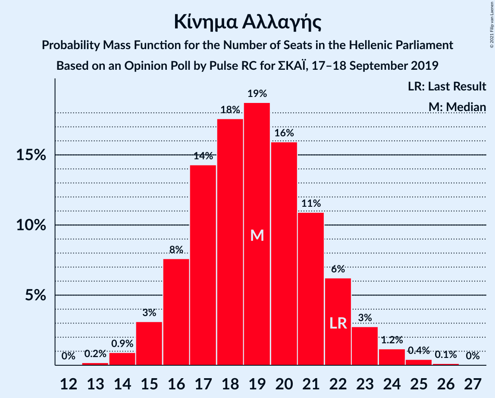
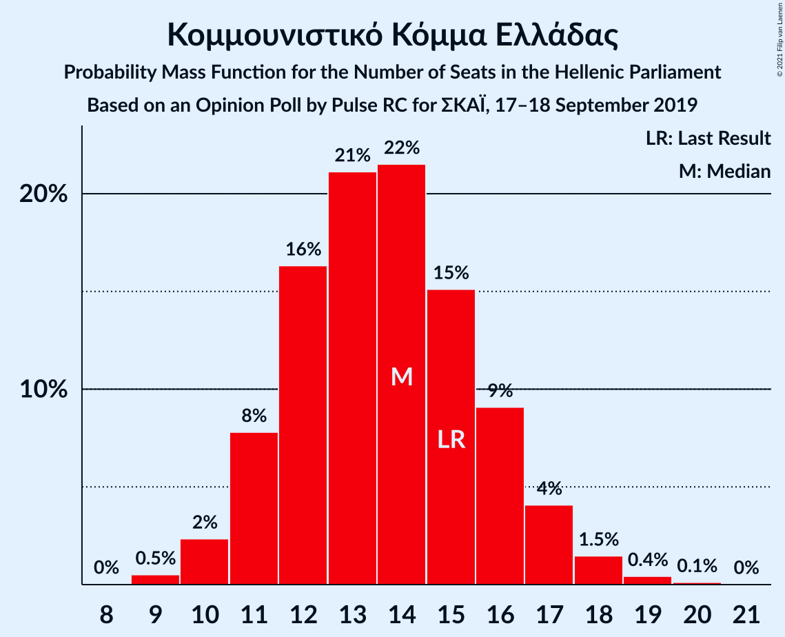
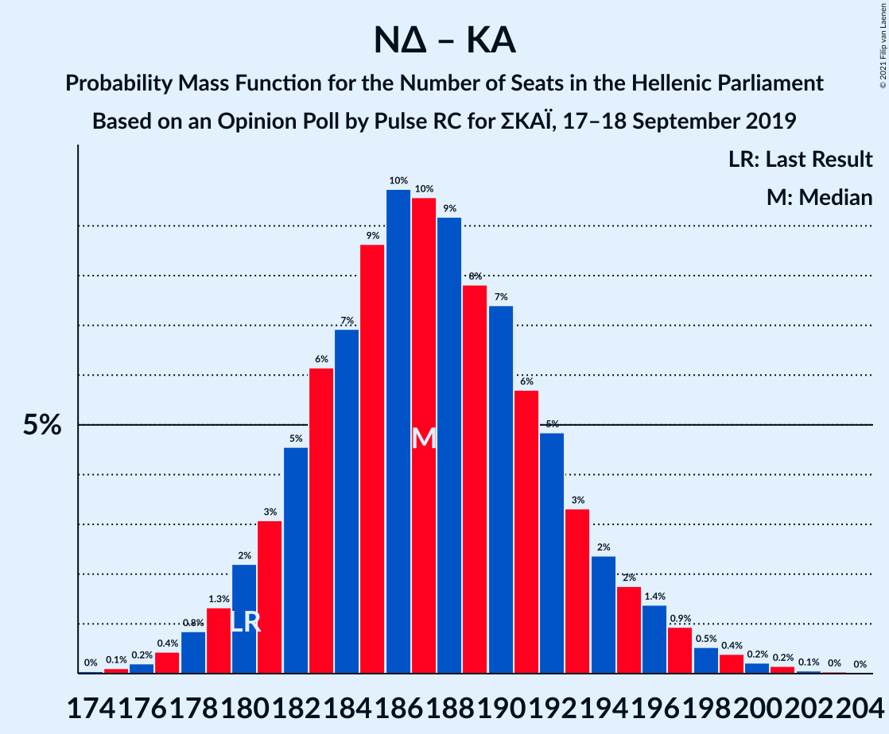
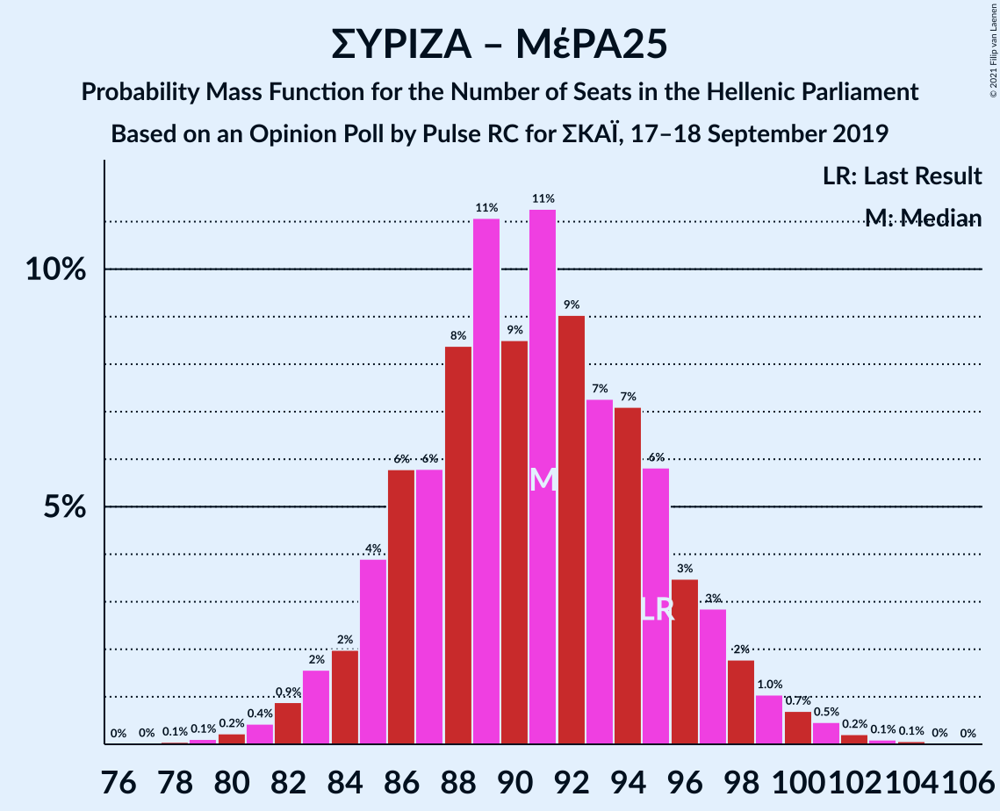

# Opinion Poll by Pulse RC for ΣΚΑΪ, 17–18 September 2019

<a href="#voting-intentions">Voting Intentions</a> | <a href="#seats">Seats</a> | <a href="#coalitions">Coalitions</a> | <a href="#technical-information">Technical Information</a>

## Voting Intentions

### Confidence Intervals

| Party | Last Result | Poll Result | 80% Confidence Interval | 90% Confidence Interval | 95% Confidence Interval | 99% Confidence Interval |
|:-----:|:-----------:|:-----------:|:-----------------------:|:-----------------------:|:-----------------------:|:-----------------------:|
| Νέα Δημοκρατία | 39.8% | 44.5% | 42.6–46.4% |42.1–47.0% |41.6–47.4% |40.7–48.4% |
| Συνασπισμός Ριζοσπαστικής Αριστεράς | 31.5% | 29.5% | 27.7–31.3% |27.3–31.8% |26.8–32.2% |26.0–33.1% |
| Κίνημα Αλλαγής | 8.1% | 7.0% | 6.1–8.1% |5.9–8.4% |5.7–8.7% |5.3–9.2% |
| Κομμουνιστικό Κόμμα Ελλάδας | 5.3% | 5.0% | 4.3–6.0% |4.1–6.3% |3.9–6.5% |3.6–7.0% |
| Μέτωπο Ευρωπαϊκής Ρεαλιστικής Ανυπακοής | 3.4% | 4.5% | 3.8–5.4% |3.6–5.7% |3.4–5.9% |3.1–6.4% |
| Ελληνική Λύση | 3.7% | 3.5% | 2.9–4.3% |2.7–4.6% |2.6–4.8% |2.3–5.2% |

*Note:* The poll result column reflects the actual value used in the calculations. Published results may vary slightly, and in addition be rounded to fewer digits.

## Seats

### Confidence Intervals

| Party | Last Result | Median | 80% Confidence Interval | 90% Confidence Interval | 95% Confidence Interval | 99% Confidence Interval |
|:-----:|:-----------:|:------:|:-----------------------:|:-----------------------:|:-----------------------:|:-----------------------:|
| <a href="#νέα-δημοκρατία">Νέα Δημοκρατία</a> | 158 | 168 | 164–174 |161–175 |161–177 |158–181 |
| <a href="#συνασπισμός-ριζοσπαστικής-αριστεράς">Συνασπισμός Ριζοσπαστικής Αριστεράς</a> | 86 | 78 | 74–83 |72–85 |72–86 |69–88 |
| <a href="#κίνημα-αλλαγής">Κίνημα Αλλαγής</a> | 22 | 19 | 16–22 |16–22 |15–23 |14–24 |
| <a href="#κομμουνιστικό-κόμμα-ελλάδας">Κομμουνιστικό Κόμμα Ελλάδας</a> | 15 | 13 | 11–16 |11–17 |10–17 |9–19 |
| <a href="#μέτωπο-ευρωπαϊκής-ρεαλιστικής-ανυπακοής">Μέτωπο Ευρωπαϊκής Ρεαλιστικής Ανυπακοής</a> | 9 | 12 | 10–14 |10–15 |9–16 |8–17 |
| <a href="#ελληνική-λύση">Ελληνική Λύση</a> | 10 | 9 | 0–11 |0–12 |0–13 |0–14 |

### Νέα Δημοκρατία

*For a full overview of the results for this party, see the [Νέα Δημοκρατία](party-νέαδημοκρατία.html) page.*

| Number of Seats | Probability | Accumulated | Special Marks |
|:---------------:|:-----------:|:-----------:|:-------------:|
| 156 | 0.1% | 100% |  |
| 157 | 0.3% | 99.9% |  |
| 158 | 0.4% | 99.6% | Last Result |
| 159 | 0.3% | 99.3% |  |
| 160 | 1.2% | 98.9% |  |
| 161 | 3% | 98% |  |
| 162 | 3% | 95% |  |
| 163 | 2% | 92% |  |
| 164 | 5% | 90% |  |
| 165 | 11% | 86% |  |
| 166 | 8% | 75% |  |
| 167 | 7% | 67% |  |
| 168 | 11% | 60% | Median |
| 169 | 13% | 48% |  |
| 170 | 8% | 35% |  |
| 171 | 6% | 27% |  |
| 172 | 4% | 21% |  |
| 173 | 6% | 17% |  |
| 174 | 5% | 11% |  |
| 175 | 1.4% | 6% |  |
| 176 | 1.1% | 4% |  |
| 177 | 1.3% | 3% |  |
| 178 | 1.0% | 2% |  |
| 179 | 0.2% | 1.1% |  |
| 180 | 0.4% | 0.9% |  |
| 181 | 0.3% | 0.5% |  |
| 182 | 0.1% | 0.2% |  |
| 183 | 0% | 0.1% |  |
| 184 | 0% | 0% |  |

### Συνασπισμός Ριζοσπαστικής Αριστεράς

*For a full overview of the results for this party, see the [Συνασπισμός Ριζοσπαστικής Αριστεράς](party-συνασπισμόςριζοσπαστικήςαριστεράς.html) page.*

| Number of Seats | Probability | Accumulated | Special Marks |
|:---------------:|:-----------:|:-----------:|:-------------:|
| 67 | 0.1% | 100% |  |
| 68 | 0.2% | 99.9% |  |
| 69 | 0.4% | 99.7% |  |
| 70 | 0.9% | 99.3% |  |
| 71 | 0.8% | 98% |  |
| 72 | 3% | 98% |  |
| 73 | 2% | 95% |  |
| 74 | 10% | 93% |  |
| 75 | 4% | 83% |  |
| 76 | 13% | 79% |  |
| 77 | 3% | 66% |  |
| 78 | 16% | 63% | Median |
| 79 | 6% | 47% |  |
| 80 | 12% | 41% |  |
| 81 | 5% | 29% |  |
| 82 | 12% | 23% |  |
| 83 | 2% | 11% |  |
| 84 | 3% | 9% |  |
| 85 | 2% | 5% |  |
| 86 | 1.3% | 4% | Last Result |
| 87 | 1.0% | 2% |  |
| 88 | 0.7% | 1.2% |  |
| 89 | 0.3% | 0.5% |  |
| 90 | 0.1% | 0.2% |  |
| 91 | 0% | 0.1% |  |
| 92 | 0% | 0.1% |  |
| 93 | 0% | 0% |  |

### Κίνημα Αλλαγής

*For a full overview of the results for this party, see the [Κίνημα Αλλαγής](party-κίνημααλλαγής.html) page.*

| Number of Seats | Probability | Accumulated | Special Marks |
|:---------------:|:-----------:|:-----------:|:-------------:|
| 13 | 0.2% | 100% |  |
| 14 | 1.0% | 99.8% |  |
| 15 | 3% | 98.8% |  |
| 16 | 7% | 96% |  |
| 17 | 16% | 88% |  |
| 18 | 17% | 73% |  |
| 19 | 16% | 56% | Median |
| 20 | 19% | 40% |  |
| 21 | 10% | 21% |  |
| 22 | 7% | 11% | Last Result |
| 23 | 2% | 4% |  |
| 24 | 1.4% | 2% |  |
| 25 | 0.3% | 0.5% |  |
| 26 | 0.1% | 0.2% |  |
| 27 | 0% | 0.1% |  |
| 28 | 0% | 0% |  |

### Κομμουνιστικό Κόμμα Ελλάδας

*For a full overview of the results for this party, see the [Κομμουνιστικό Κόμμα Ελλάδας](party-κομμουνιστικόκόμμαελλάδας.html) page.*

| Number of Seats | Probability | Accumulated | Special Marks |
|:---------------:|:-----------:|:-----------:|:-------------:|
| 9 | 0.5% | 100% |  |
| 10 | 3% | 99.5% |  |
| 11 | 8% | 97% |  |
| 12 | 16% | 89% |  |
| 13 | 24% | 73% | Median |
| 14 | 18% | 49% |  |
| 15 | 16% | 31% | Last Result |
| 16 | 10% | 16% |  |
| 17 | 4% | 6% |  |
| 18 | 1.5% | 2% |  |
| 19 | 0.5% | 0.6% |  |
| 20 | 0.1% | 0.1% |  |
| 21 | 0% | 0% |  |

### Μέτωπο Ευρωπαϊκής Ρεαλιστικής Ανυπακοής

*For a full overview of the results for this party, see the [Μέτωπο Ευρωπαϊκής Ρεαλιστικής Ανυπακοής](party-μέτωποευρωπαϊκήςρεαλιστικήςανυπακοής.html) page.*

| Number of Seats | Probability | Accumulated | Special Marks |
|:---------------:|:-----------:|:-----------:|:-------------:|
| 0 | 0.3% | 100% |  |
| 1 | 0% | 99.7% |  |
| 2 | 0% | 99.7% |  |
| 3 | 0% | 99.7% |  |
| 4 | 0% | 99.7% |  |
| 5 | 0% | 99.7% |  |
| 6 | 0% | 99.7% |  |
| 7 | 0% | 99.7% |  |
| 8 | 0.3% | 99.7% |  |
| 9 | 3% | 99.4% | Last Result |
| 10 | 12% | 96% |  |
| 11 | 25% | 84% |  |
| 12 | 19% | 60% | Median |
| 13 | 20% | 41% |  |
| 14 | 11% | 21% |  |
| 15 | 7% | 10% |  |
| 16 | 2% | 3% |  |
| 17 | 0.7% | 0.9% |  |
| 18 | 0.2% | 0.2% |  |
| 19 | 0% | 0% |  |

### Ελληνική Λύση

*For a full overview of the results for this party, see the [Ελληνική Λύση](party-ελληνικήλύση.html) page.*

| Number of Seats | Probability | Accumulated | Special Marks |
|:---------------:|:-----------:|:-----------:|:-------------:|
| 0 | 13% | 100% |  |
| 1 | 0% | 87% |  |
| 2 | 0% | 87% |  |
| 3 | 0% | 87% |  |
| 4 | 0% | 87% |  |
| 5 | 0% | 87% |  |
| 6 | 0% | 87% |  |
| 7 | 0% | 87% |  |
| 8 | 10% | 87% |  |
| 9 | 30% | 76% | Median |
| 10 | 24% | 46% | Last Result |
| 11 | 13% | 22% |  |
| 12 | 6% | 9% |  |
| 13 | 2% | 3% |  |
| 14 | 0.6% | 0.8% |  |
| 15 | 0.1% | 0.2% |  |
| 16 | 0% | 0% |  |

## Coalitions

### Confidence Intervals

| Coalition | Last Result | Median | Majority? | 80% Confidence Interval | 90% Confidence Interval | 95% Confidence Interval | 99% Confidence Interval |
|:---------:|:-----------:|:------:|:---------:|:-----------------------:|:-----------------------:|:-----------------------:|:-----------------------:|
| Νέα Δημοκρατία – Κίνημα Αλλαγής | 180 | 187 | 100% | 182–193 | 180–195 | 179–196 | 177–200 |
| Νέα Δημοκρατία | 158 | 168 | 100% | 164–174 | 161–175 | 161–177 | 158–181 |
| Συνασπισμός Ριζοσπαστικής Αριστεράς – Μέτωπο Ευρωπαϊκής Ρεαλιστικής Ανυπακοής | 95 | 91 | 0% | 86–95 | 84–97 | 83–99 | 81–101 |
| Συνασπισμός Ριζοσπαστικής Αριστεράς | 86 | 78 | 0% | 74–83 | 72–85 | 72–86 | 69–88 |

### Νέα Δημοκρατία – Κίνημα Αλλαγής

| Number of Seats | Probability | Accumulated | Special Marks |
|:---------------:|:-----------:|:-----------:|:-------------:|
| 174 | 0% | 100% |  |
| 175 | 0.1% | 99.9% |  |
| 176 | 0.1% | 99.8% |  |
| 177 | 0.5% | 99.7% |  |
| 178 | 1.1% | 99.2% |  |
| 179 | 1.0% | 98% |  |
| 180 | 2% | 97% | Last Result |
| 181 | 3% | 95% |  |
| 182 | 4% | 92% |  |
| 183 | 6% | 89% |  |
| 184 | 7% | 83% |  |
| 185 | 8% | 76% |  |
| 186 | 12% | 68% |  |
| 187 | 10% | 55% | Median |
| 188 | 10% | 45% |  |
| 189 | 5% | 35% |  |
| 190 | 9% | 30% |  |
| 191 | 6% | 21% |  |
| 192 | 4% | 15% |  |
| 193 | 4% | 11% |  |
| 194 | 2% | 7% |  |
| 195 | 1.3% | 5% |  |
| 196 | 2% | 4% |  |
| 197 | 0.4% | 2% |  |
| 198 | 0.4% | 1.4% |  |
| 199 | 0.5% | 1.0% |  |
| 200 | 0.3% | 0.5% |  |
| 201 | 0.1% | 0.3% |  |
| 202 | 0.1% | 0.1% |  |
| 203 | 0.1% | 0.1% |  |
| 204 | 0% | 0% |  |

### Νέα Δημοκρατία

| Number of Seats | Probability | Accumulated | Special Marks |
|:---------------:|:-----------:|:-----------:|:-------------:|
| 156 | 0.1% | 100% |  |
| 157 | 0.3% | 99.9% |  |
| 158 | 0.4% | 99.6% | Last Result |
| 159 | 0.3% | 99.3% |  |
| 160 | 1.2% | 98.9% |  |
| 161 | 3% | 98% |  |
| 162 | 3% | 95% |  |
| 163 | 2% | 92% |  |
| 164 | 5% | 90% |  |
| 165 | 11% | 86% |  |
| 166 | 8% | 75% |  |
| 167 | 7% | 67% |  |
| 168 | 11% | 60% | Median |
| 169 | 13% | 48% |  |
| 170 | 8% | 35% |  |
| 171 | 6% | 27% |  |
| 172 | 4% | 21% |  |
| 173 | 6% | 17% |  |
| 174 | 5% | 11% |  |
| 175 | 1.4% | 6% |  |
| 176 | 1.1% | 4% |  |
| 177 | 1.3% | 3% |  |
| 178 | 1.0% | 2% |  |
| 179 | 0.2% | 1.1% |  |
| 180 | 0.4% | 0.9% |  |
| 181 | 0.3% | 0.5% |  |
| 182 | 0.1% | 0.2% |  |
| 183 | 0% | 0.1% |  |
| 184 | 0% | 0% |  |

### Συνασπισμός Ριζοσπαστικής Αριστεράς – Μέτωπο Ευρωπαϊκής Ρεαλιστικής Ανυπακοής

| Number of Seats | Probability | Accumulated | Special Marks |
|:---------------:|:-----------:|:-----------:|:-------------:|
| 78 | 0.1% | 100% |  |
| 79 | 0.1% | 99.9% |  |
| 80 | 0.2% | 99.8% |  |
| 81 | 0.5% | 99.5% |  |
| 82 | 0.9% | 99.1% |  |
| 83 | 1.2% | 98% |  |
| 84 | 2% | 97% |  |
| 85 | 4% | 95% |  |
| 86 | 7% | 91% |  |
| 87 | 4% | 84% |  |
| 88 | 9% | 80% |  |
| 89 | 13% | 71% |  |
| 90 | 6% | 58% | Median |
| 91 | 12% | 52% |  |
| 92 | 9% | 39% |  |
| 93 | 7% | 30% |  |
| 94 | 7% | 23% |  |
| 95 | 6% | 16% | Last Result |
| 96 | 2% | 10% |  |
| 97 | 3% | 7% |  |
| 98 | 2% | 4% |  |
| 99 | 1.2% | 3% |  |
| 100 | 0.5% | 1.5% |  |
| 101 | 0.6% | 1.0% |  |
| 102 | 0.2% | 0.4% |  |
| 103 | 0.1% | 0.2% |  |
| 104 | 0% | 0.1% |  |
| 105 | 0% | 0% |  |

### Συνασπισμός Ριζοσπαστικής Αριστεράς

| Number of Seats | Probability | Accumulated | Special Marks |
|:---------------:|:-----------:|:-----------:|:-------------:|
| 67 | 0.1% | 100% |  |
| 68 | 0.2% | 99.9% |  |
| 69 | 0.4% | 99.7% |  |
| 70 | 0.9% | 99.3% |  |
| 71 | 0.8% | 98% |  |
| 72 | 3% | 98% |  |
| 73 | 2% | 95% |  |
| 74 | 10% | 93% |  |
| 75 | 4% | 83% |  |
| 76 | 13% | 79% |  |
| 77 | 3% | 66% |  |
| 78 | 16% | 63% | Median |
| 79 | 6% | 47% |  |
| 80 | 12% | 41% |  |
| 81 | 5% | 29% |  |
| 82 | 12% | 23% |  |
| 83 | 2% | 11% |  |
| 84 | 3% | 9% |  |
| 85 | 2% | 5% |  |
| 86 | 1.3% | 4% | Last Result |
| 87 | 1.0% | 2% |  |
| 88 | 0.7% | 1.2% |  |
| 89 | 0.3% | 0.5% |  |
| 90 | 0.1% | 0.2% |  |
| 91 | 0% | 0.1% |  |
| 92 | 0% | 0.1% |  |
| 93 | 0% | 0% |  |

## Technical Information

### Opinion Poll

+ **Polling firm:** Pulse RC
+ **Commissioner(s):** ΣΚΑΪ
+ **Fieldwork period:** 17–18 September 2019

### Calculations

+ **Sample size:** 1110
+ **Simulations done:** 131,072
+ **Error estimate:** 2.07%

