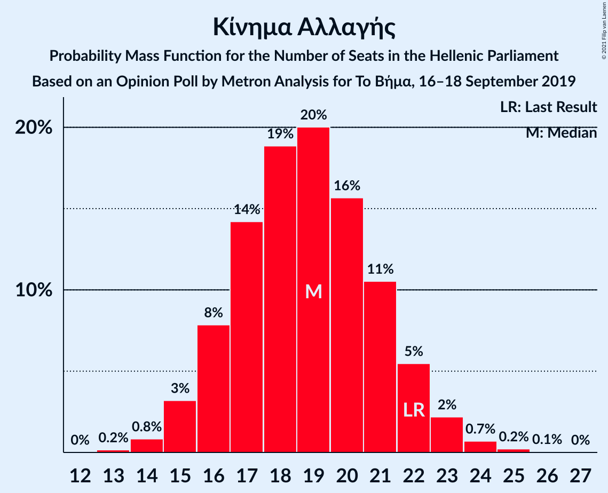
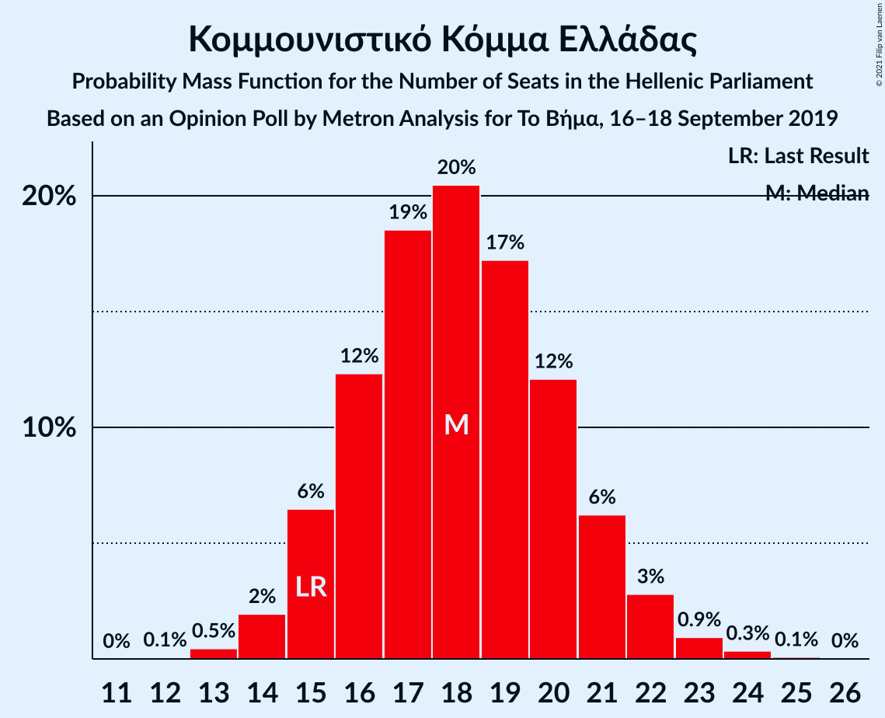
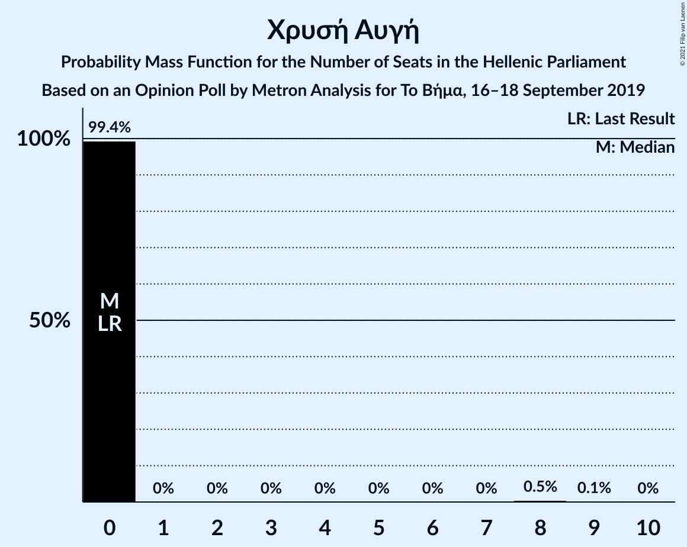
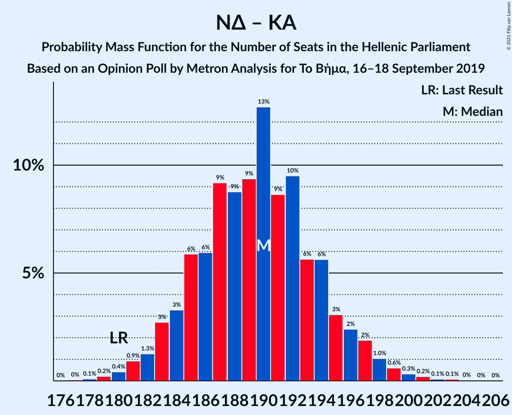
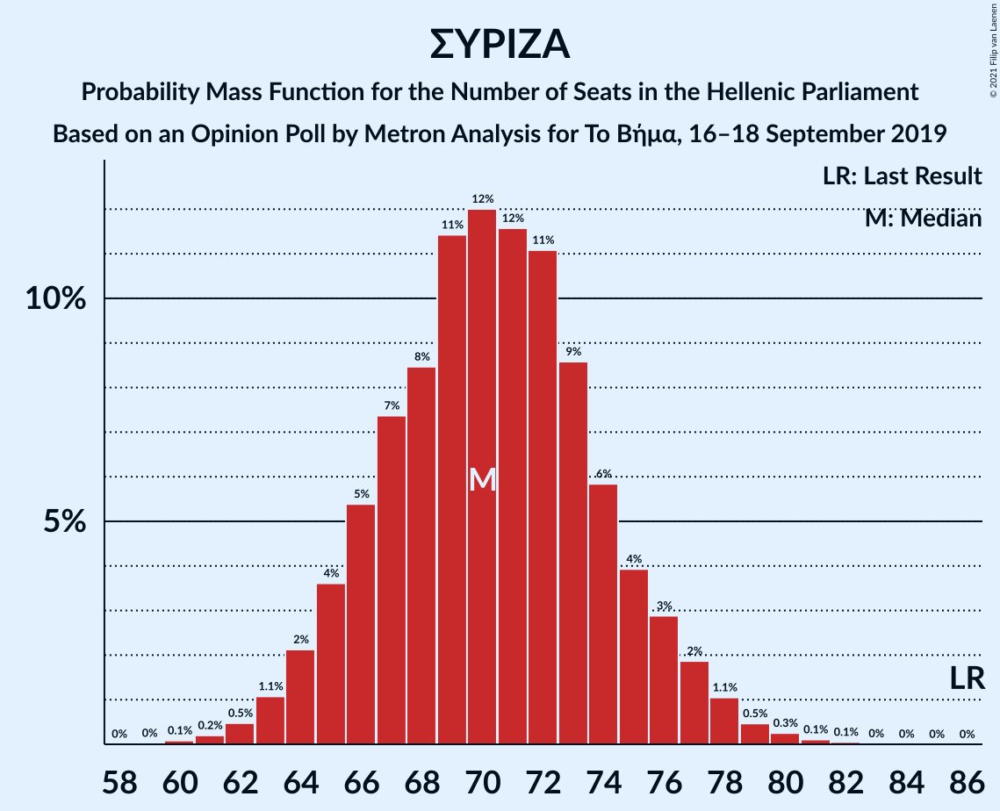

# Opinion Poll by Μetron Analysis for Το Βήμα, 16–18 September 2019

<a href="#voting-intentions">Voting Intentions</a> | <a href="#seats">Seats</a> | <a href="#coalitions">Coalitions</a> | <a href="#technical-information">Technical Information</a>

## Voting Intentions

### Confidence Intervals

| Party | Last Result | Poll Result | 80% Confidence Interval | 90% Confidence Interval | 95% Confidence Interval | 99% Confidence Interval |
|:-----:|:-----------:|:-----------:|:-----------------------:|:-----------------------:|:-----------------------:|:-----------------------:|
| Νέα Δημοκρατία | 39.8% | 46.1% | 44.2–47.9% |43.7–48.5% |43.3–48.9% |42.4–49.8% |
| Συνασπισμός Ριζοσπαστικής Αριστεράς | 31.5% | 26.8% | 25.2–28.5% |24.7–29.0% |24.4–29.4% |23.6–30.2% |
| Κίνημα Αλλαγής | 8.1% | 7.1% | 6.2–8.1% |6.0–8.4% |5.7–8.7% |5.4–9.2% |
| Κομμουνιστικό Κόμμα Ελλάδας | 5.3% | 6.8% | 6.0–7.8% |5.7–8.1% |5.5–8.4% |5.1–8.9% |
| Μέτωπο Ευρωπαϊκής Ρεαλιστικής Ανυπακοής | 3.4% | 4.4% | 3.7–5.3% |3.5–5.5% |3.4–5.7% |3.1–6.2% |
| Ελληνική Λύση | 3.7% | 3.9% | 3.3–4.7% |3.1–5.0% |2.9–5.2% |2.7–5.6% |
| Χρυσή Αυγή | 2.9% | 1.8% | 1.4–2.4% |1.3–2.6% |1.2–2.8% |1.0–3.1% |

*Note:* The poll result column reflects the actual value used in the calculations. Published results may vary slightly, and in addition be rounded to fewer digits.

## Seats

### Confidence Intervals

| Party | Last Result | Median | 80% Confidence Interval | 90% Confidence Interval | 95% Confidence Interval | 99% Confidence Interval |
|:-----:|:-----------:|:------:|:-----------------------:|:-----------------------:|:-----------------------:|:-----------------------:|
| <a href="#νέα-δημοκρατία">Νέα Δημοκρατία</a> | 158 | 171 | 166–176 |165–177 |164–179 |161–181 |
| <a href="#συνασπισμός-ριζοσπαστικής-αριστεράς">Συνασπισμός Ριζοσπαστικής Αριστεράς</a> | 86 | 70 | 66–75 |65–76 |64–77 |62–79 |
| <a href="#κίνημα-αλλαγής">Κίνημα Αλλαγής</a> | 22 | 19 | 16–21 |16–22 |15–23 |14–24 |
| <a href="#κομμουνιστικό-κόμμα-ελλάδας">Κομμουνιστικό Κόμμα Ελλάδας</a> | 15 | 18 | 16–21 |15–21 |15–22 |13–23 |
| <a href="#μέτωπο-ευρωπαϊκής-ρεαλιστικής-ανυπακοής">Μέτωπο Ευρωπαϊκής Ρεαλιστικής Ανυπακοής</a> | 9 | 12 | 10–14 |9–14 |9–15 |8–16 |
| <a href="#ελληνική-λύση">Ελληνική Λύση</a> | 10 | 10 | 9–12 |8–13 |0–13 |0–15 |
| <a href="#χρυσή-αυγή">Χρυσή Αυγή</a> | 0 | 0 | 0 |0 |0 |0–8 |

### Νέα Δημοκρατία

*For a full overview of the results for this party, see the [Νέα Δημοκρατία](party-νέαδημοκρατία.html) page.*

| Number of Seats | Probability | Accumulated | Special Marks |
|:---------------:|:-----------:|:-----------:|:-------------:|
| 158 | 0% | 100% | Last Result |
| 159 | 0.1% | 100% |  |
| 160 | 0.2% | 99.9% |  |
| 161 | 0.3% | 99.7% |  |
| 162 | 0.7% | 99.4% |  |
| 163 | 1.1% | 98.7% |  |
| 164 | 2% | 98% |  |
| 165 | 3% | 95% |  |
| 166 | 4% | 92% |  |
| 167 | 6% | 87% |  |
| 168 | 9% | 81% |  |
| 169 | 9% | 72% |  |
| 170 | 12% | 63% |  |
| 171 | 9% | 51% | Median |
| 172 | 10% | 42% |  |
| 173 | 8% | 32% |  |
| 174 | 8% | 24% |  |
| 175 | 5% | 16% |  |
| 176 | 4% | 11% |  |
| 177 | 3% | 8% |  |
| 178 | 2% | 5% |  |
| 179 | 1.1% | 3% |  |
| 180 | 0.6% | 1.4% |  |
| 181 | 0.4% | 0.8% |  |
| 182 | 0.2% | 0.4% |  |
| 183 | 0.1% | 0.2% |  |
| 184 | 0.1% | 0.1% |  |
| 185 | 0% | 0.1% |  |
| 186 | 0% | 0% |  |

### Συνασπισμός Ριζοσπαστικής Αριστεράς

*For a full overview of the results for this party, see the [Συνασπισμός Ριζοσπαστικής Αριστεράς](party-συνασπισμόςριζοσπαστικήςαριστεράς.html) page.*

| Number of Seats | Probability | Accumulated | Special Marks |
|:---------------:|:-----------:|:-----------:|:-------------:|
| 60 | 0.1% | 100% |  |
| 61 | 0.2% | 99.9% |  |
| 62 | 0.5% | 99.7% |  |
| 63 | 1.1% | 99.2% |  |
| 64 | 2% | 98% |  |
| 65 | 4% | 96% |  |
| 66 | 5% | 92% |  |
| 67 | 7% | 87% |  |
| 68 | 8% | 80% |  |
| 69 | 11% | 71% |  |
| 70 | 12% | 60% | Median |
| 71 | 12% | 48% |  |
| 72 | 11% | 36% |  |
| 73 | 9% | 25% |  |
| 74 | 6% | 16% |  |
| 75 | 4% | 11% |  |
| 76 | 3% | 7% |  |
| 77 | 2% | 4% |  |
| 78 | 1.1% | 2% |  |
| 79 | 0.5% | 0.9% |  |
| 80 | 0.3% | 0.4% |  |
| 81 | 0.1% | 0.2% |  |
| 82 | 0.1% | 0.1% |  |
| 83 | 0% | 0% |  |
| 84 | 0% | 0% |  |
| 85 | 0% | 0% |  |
| 86 | 0% | 0% | Last Result |

### Κίνημα Αλλαγής

*For a full overview of the results for this party, see the [Κίνημα Αλλαγής](party-κίνημααλλαγής.html) page.*

| Number of Seats | Probability | Accumulated | Special Marks |
|:---------------:|:-----------:|:-----------:|:-------------:|
| 13 | 0.2% | 100% |  |
| 14 | 0.8% | 99.8% |  |
| 15 | 3% | 99.0% |  |
| 16 | 8% | 96% |  |
| 17 | 14% | 88% |  |
| 18 | 19% | 74% |  |
| 19 | 20% | 55% | Median |
| 20 | 16% | 35% |  |
| 21 | 11% | 19% |  |
| 22 | 5% | 9% | Last Result |
| 23 | 2% | 3% |  |
| 24 | 0.7% | 1.0% |  |
| 25 | 0.2% | 0.3% |  |
| 26 | 0.1% | 0.1% |  |
| 27 | 0% | 0% |  |

### Κομμουνιστικό Κόμμα Ελλάδας

*For a full overview of the results for this party, see the [Κομμουνιστικό Κόμμα Ελλάδας](party-κομμουνιστικόκόμμαελλάδας.html) page.*

| Number of Seats | Probability | Accumulated | Special Marks |
|:---------------:|:-----------:|:-----------:|:-------------:|
| 12 | 0.1% | 100% |  |
| 13 | 0.5% | 99.9% |  |
| 14 | 2% | 99.5% |  |
| 15 | 6% | 98% | Last Result |
| 16 | 12% | 91% |  |
| 17 | 19% | 79% |  |
| 18 | 20% | 60% | Median |
| 19 | 17% | 40% |  |
| 20 | 12% | 23% |  |
| 21 | 6% | 10% |  |
| 22 | 3% | 4% |  |
| 23 | 0.9% | 1.4% |  |
| 24 | 0.3% | 0.5% |  |
| 25 | 0.1% | 0.1% |  |
| 26 | 0% | 0% |  |

### Μέτωπο Ευρωπαϊκής Ρεαλιστικής Ανυπακοής

*For a full overview of the results for this party, see the [Μέτωπο Ευρωπαϊκής Ρεαλιστικής Ανυπακοής](party-μέτωποευρωπαϊκήςρεαλιστικήςανυπακοής.html) page.*

| Number of Seats | Probability | Accumulated | Special Marks |
|:---------------:|:-----------:|:-----------:|:-------------:|
| 0 | 0.3% | 100% |  |
| 1 | 0% | 99.7% |  |
| 2 | 0% | 99.7% |  |
| 3 | 0% | 99.7% |  |
| 4 | 0% | 99.7% |  |
| 5 | 0% | 99.7% |  |
| 6 | 0% | 99.7% |  |
| 7 | 0% | 99.7% |  |
| 8 | 0.9% | 99.7% |  |
| 9 | 5% | 98.8% | Last Result |
| 10 | 15% | 93% |  |
| 11 | 22% | 78% |  |
| 12 | 24% | 56% | Median |
| 13 | 18% | 32% |  |
| 14 | 9% | 14% |  |
| 15 | 4% | 5% |  |
| 16 | 0.8% | 1.1% |  |
| 17 | 0.2% | 0.3% |  |
| 18 | 0% | 0.1% |  |
| 19 | 0% | 0% |  |

### Ελληνική Λύση

*For a full overview of the results for this party, see the [Ελληνική Λύση](party-ελληνικήλύση.html) page.*

| Number of Seats | Probability | Accumulated | Special Marks |
|:---------------:|:-----------:|:-----------:|:-------------:|
| 0 | 3% | 100% |  |
| 1 | 0% | 97% |  |
| 2 | 0% | 97% |  |
| 3 | 0% | 97% |  |
| 4 | 0% | 97% |  |
| 5 | 0% | 97% |  |
| 6 | 0% | 97% |  |
| 7 | 0% | 97% |  |
| 8 | 6% | 97% |  |
| 9 | 17% | 91% |  |
| 10 | 26% | 74% | Last Result, Median |
| 11 | 23% | 48% |  |
| 12 | 16% | 25% |  |
| 13 | 6% | 9% |  |
| 14 | 2% | 2% |  |
| 15 | 0.4% | 0.6% |  |
| 16 | 0.1% | 0.1% |  |
| 17 | 0% | 0% |  |

### Χρυσή Αυγή

*For a full overview of the results for this party, see the [Χρυσή Αυγή](party-χρυσήαυγή.html) page.*

| Number of Seats | Probability | Accumulated | Special Marks |
|:---------------:|:-----------:|:-----------:|:-------------:|
| 0 | 99.4% | 100% | Last Result, Median |
| 1 | 0% | 0.6% |  |
| 2 | 0% | 0.6% |  |
| 3 | 0% | 0.6% |  |
| 4 | 0% | 0.6% |  |
| 5 | 0% | 0.6% |  |
| 6 | 0% | 0.6% |  |
| 7 | 0% | 0.6% |  |
| 8 | 0.5% | 0.6% |  |
| 9 | 0.1% | 0.1% |  |
| 10 | 0% | 0% |  |

## Coalitions

### Confidence Intervals

| Coalition | Last Result | Median | Majority? | 80% Confidence Interval | 90% Confidence Interval | 95% Confidence Interval | 99% Confidence Interval |
|:---------:|:-----------:|:------:|:---------:|:-----------------------:|:-----------------------:|:-----------------------:|:-----------------------:|
| Νέα Δημοκρατία – Κίνημα Αλλαγής | 180 | 190 | 100% | 185–194 | 183–196 | 182–197 | 180–200 |
| Νέα Δημοκρατία | 158 | 171 | 100% | 166–176 | 165–177 | 164–179 | 161–181 |
| Συνασπισμός Ριζοσπαστικής Αριστεράς – Μέτωπο Ευρωπαϊκής Ρεαλιστικής Ανυπακοής | 95 | 82 | 0% | 77–87 | 76–88 | 75–89 | 73–91 |
| Συνασπισμός Ριζοσπαστικής Αριστεράς | 86 | 70 | 0% | 66–75 | 65–76 | 64–77 | 62–79 |

### Νέα Δημοκρατία – Κίνημα Αλλαγής

| Number of Seats | Probability | Accumulated | Special Marks |
|:---------------:|:-----------:|:-----------:|:-------------:|
| 177 | 0% | 100% |  |
| 178 | 0.1% | 99.9% |  |
| 179 | 0.2% | 99.8% |  |
| 180 | 0.4% | 99.6% | Last Result |
| 181 | 0.9% | 99.2% |  |
| 182 | 1.3% | 98% |  |
| 183 | 3% | 97% |  |
| 184 | 3% | 94% |  |
| 185 | 6% | 91% |  |
| 186 | 6% | 85% |  |
| 187 | 9% | 79% |  |
| 188 | 9% | 70% |  |
| 189 | 9% | 61% |  |
| 190 | 13% | 52% | Median |
| 191 | 9% | 39% |  |
| 192 | 10% | 31% |  |
| 193 | 6% | 21% |  |
| 194 | 6% | 15% |  |
| 195 | 3% | 10% |  |
| 196 | 2% | 7% |  |
| 197 | 2% | 4% |  |
| 198 | 1.0% | 2% |  |
| 199 | 0.6% | 1.4% |  |
| 200 | 0.3% | 0.8% |  |
| 201 | 0.2% | 0.4% |  |
| 202 | 0.1% | 0.2% |  |
| 203 | 0.1% | 0.1% |  |
| 204 | 0% | 0.1% |  |
| 205 | 0% | 0% |  |

### Νέα Δημοκρατία

| Number of Seats | Probability | Accumulated | Special Marks |
|:---------------:|:-----------:|:-----------:|:-------------:|
| 158 | 0% | 100% | Last Result |
| 159 | 0.1% | 100% |  |
| 160 | 0.2% | 99.9% |  |
| 161 | 0.3% | 99.7% |  |
| 162 | 0.7% | 99.4% |  |
| 163 | 1.1% | 98.7% |  |
| 164 | 2% | 98% |  |
| 165 | 3% | 95% |  |
| 166 | 4% | 92% |  |
| 167 | 6% | 87% |  |
| 168 | 9% | 81% |  |
| 169 | 9% | 72% |  |
| 170 | 12% | 63% |  |
| 171 | 9% | 51% | Median |
| 172 | 10% | 42% |  |
| 173 | 8% | 32% |  |
| 174 | 8% | 24% |  |
| 175 | 5% | 16% |  |
| 176 | 4% | 11% |  |
| 177 | 3% | 8% |  |
| 178 | 2% | 5% |  |
| 179 | 1.1% | 3% |  |
| 180 | 0.6% | 1.4% |  |
| 181 | 0.4% | 0.8% |  |
| 182 | 0.2% | 0.4% |  |
| 183 | 0.1% | 0.2% |  |
| 184 | 0.1% | 0.1% |  |
| 185 | 0% | 0.1% |  |
| 186 | 0% | 0% |  |

### Συνασπισμός Ριζοσπαστικής Αριστεράς – Μέτωπο Ευρωπαϊκής Ρεαλιστικής Ανυπακοής

| Number of Seats | Probability | Accumulated | Special Marks |
|:---------------:|:-----------:|:-----------:|:-------------:|
| 70 | 0% | 100% |  |
| 71 | 0.1% | 99.9% |  |
| 72 | 0.2% | 99.8% |  |
| 73 | 0.3% | 99.6% |  |
| 74 | 0.8% | 99.3% |  |
| 75 | 1.4% | 98% |  |
| 76 | 2% | 97% |  |
| 77 | 5% | 95% |  |
| 78 | 6% | 89% |  |
| 79 | 8% | 84% |  |
| 80 | 9% | 76% |  |
| 81 | 9% | 67% |  |
| 82 | 14% | 58% | Median |
| 83 | 9% | 44% |  |
| 84 | 12% | 35% |  |
| 85 | 7% | 23% |  |
| 86 | 5% | 16% |  |
| 87 | 5% | 11% |  |
| 88 | 2% | 6% |  |
| 89 | 2% | 4% |  |
| 90 | 0.9% | 2% |  |
| 91 | 0.6% | 1.1% |  |
| 92 | 0.3% | 0.5% |  |
| 93 | 0.1% | 0.2% |  |
| 94 | 0.1% | 0.1% |  |
| 95 | 0% | 0% | Last Result |

### Συνασπισμός Ριζοσπαστικής Αριστεράς

| Number of Seats | Probability | Accumulated | Special Marks |
|:---------------:|:-----------:|:-----------:|:-------------:|
| 60 | 0.1% | 100% |  |
| 61 | 0.2% | 99.9% |  |
| 62 | 0.5% | 99.7% |  |
| 63 | 1.1% | 99.2% |  |
| 64 | 2% | 98% |  |
| 65 | 4% | 96% |  |
| 66 | 5% | 92% |  |
| 67 | 7% | 87% |  |
| 68 | 8% | 80% |  |
| 69 | 11% | 71% |  |
| 70 | 12% | 60% | Median |
| 71 | 12% | 48% |  |
| 72 | 11% | 36% |  |
| 73 | 9% | 25% |  |
| 74 | 6% | 16% |  |
| 75 | 4% | 11% |  |
| 76 | 3% | 7% |  |
| 77 | 2% | 4% |  |
| 78 | 1.1% | 2% |  |
| 79 | 0.5% | 0.9% |  |
| 80 | 0.3% | 0.4% |  |
| 81 | 0.1% | 0.2% |  |
| 82 | 0.1% | 0.1% |  |
| 83 | 0% | 0% |  |
| 84 | 0% | 0% |  |
| 85 | 0% | 0% |  |
| 86 | 0% | 0% | Last Result |

## Technical Information

### Opinion Poll

+ **Polling firm:** Μetron Analysis
+ **Commissioner(s):** Το Βήμα
+ **Fieldwork period:** 16–18 September 2019

### Calculations

+ **Sample size:** 1202
+ **Simulations done:** 1,048,576
+ **Error estimate:** 0.29%

