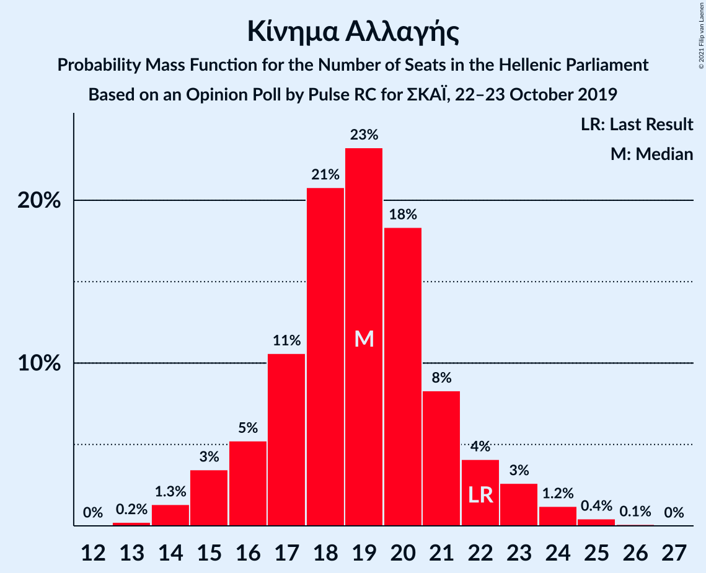
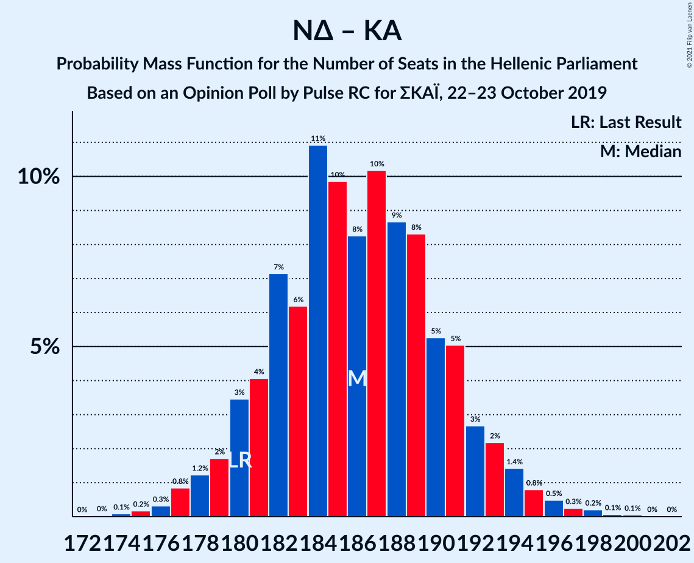
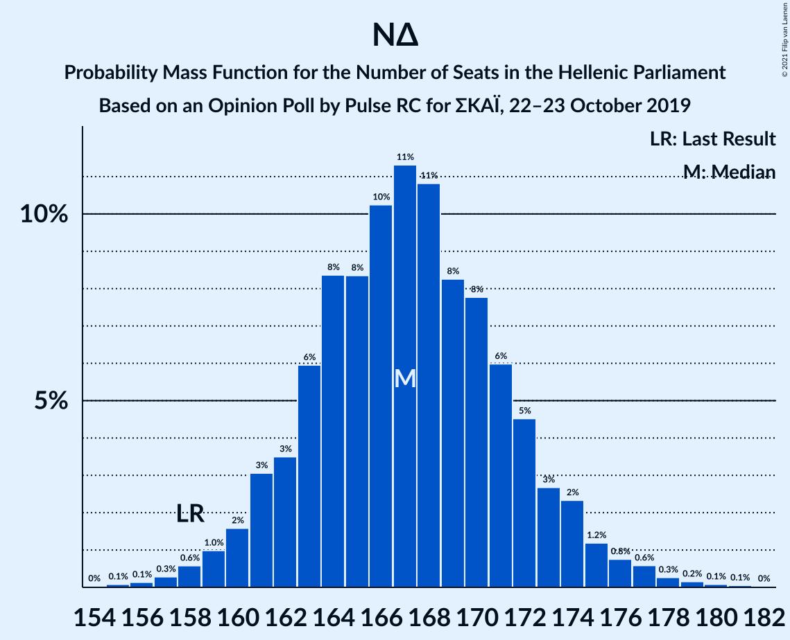
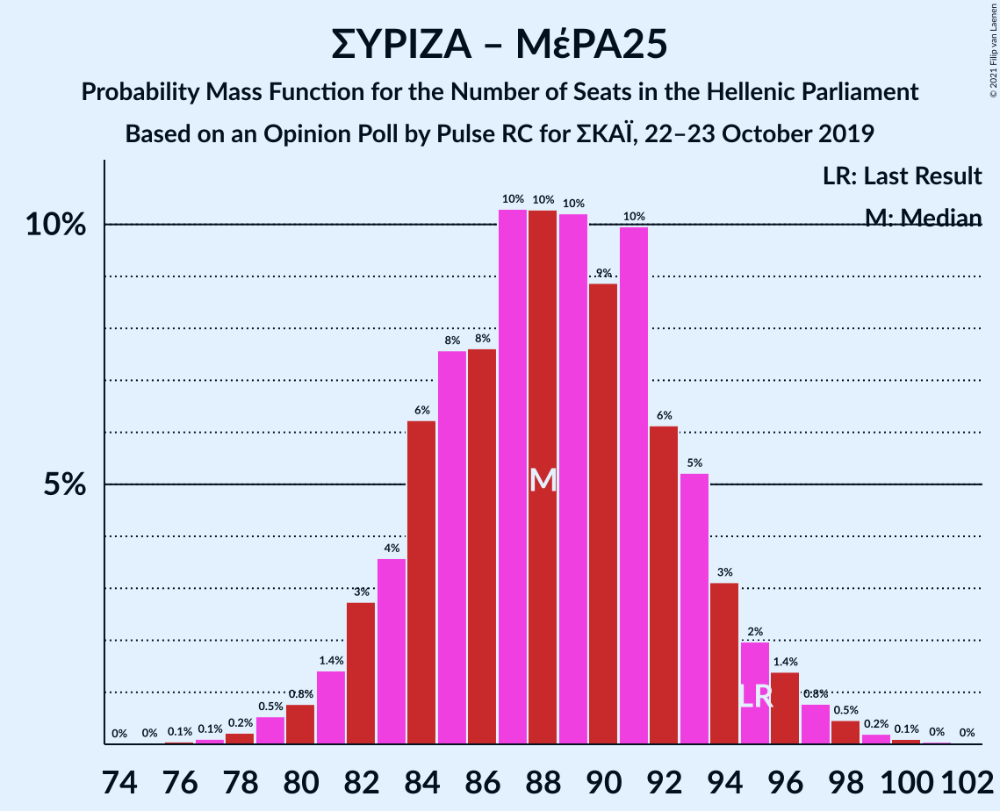

# Opinion Poll by Pulse RC for ΣΚΑΪ, 22–23 October 2019

<a href="#voting-intentions">Voting Intentions</a> | <a href="#seats">Seats</a> | <a href="#coalitions">Coalitions</a> | <a href="#technical-information">Technical Information</a>

## Voting Intentions

### Confidence Intervals

| Party | Last Result | Poll Result | 80% Confidence Interval | 90% Confidence Interval | 95% Confidence Interval | 99% Confidence Interval |
|:-----:|:-----------:|:-----------:|:-----------------------:|:-----------------------:|:-----------------------:|:-----------------------:|
| Νέα Δημοκρατία | 39.8% | 44.0% | 42.1–45.9% |41.5–46.5% |41.1–46.9% |40.1–47.8% |
| Συνασπισμός Ριζοσπαστικής Αριστεράς | 31.5% | 28.5% | 26.8–30.3% |26.3–30.8% |25.9–31.2% |25.1–32.1% |
| Κίνημα Αλλαγής | 8.1% | 7.0% | 6.1–8.1% |5.8–8.4% |5.6–8.6% |5.2–9.2% |
| Κομμουνιστικό Κόμμα Ελλάδας | 5.3% | 5.5% | 4.7–6.5% |4.5–6.8% |4.3–7.0% |4.0–7.5% |
| Μέτωπο Ευρωπαϊκής Ρεαλιστικής Ανυπακοής | 3.4% | 4.5% | 3.8–5.4% |3.6–5.7% |3.4–5.9% |3.1–6.4% |
| Ελληνική Λύση | 3.7% | 4.0% | 3.3–4.9% |3.1–5.1% |3.0–5.3% |2.7–5.8% |
| Χρυσή Αυγή | 2.9% | 1.5% | 1.2–2.1% |1.1–2.3% |1.0–2.5% |0.8–2.8% |

*Note:* The poll result column reflects the actual value used in the calculations. Published results may vary slightly, and in addition be rounded to fewer digits.

## Seats

### Confidence Intervals

| Party | Last Result | Median | 80% Confidence Interval | 90% Confidence Interval | 95% Confidence Interval | 99% Confidence Interval |
|:-----:|:-----------:|:------:|:-----------------------:|:-----------------------:|:-----------------------:|:-----------------------:|
| <a href="#νέα-δημοκρατία">Νέα Δημοκρατία</a> | 158 | 167 | 162–172 |161–174 |160–175 |157–178 |
| <a href="#συνασπισμός-ριζοσπαστικής-αριστεράς">Συνασπισμός Ριζοσπαστικής Αριστεράς</a> | 86 | 76 | 71–80 |70–82 |69–83 |67–86 |
| <a href="#κίνημα-αλλαγής">Κίνημα Αλλαγής</a> | 22 | 19 | 16–21 |15–22 |15–23 |14–25 |
| <a href="#κομμουνιστικό-κόμμα-ελλάδας">Κομμουνιστικό Κόμμα Ελλάδας</a> | 15 | 15 | 13–17 |12–18 |12–19 |11–20 |
| <a href="#μέτωπο-ευρωπαϊκής-ρεαλιστικής-ανυπακοής">Μέτωπο Ευρωπαϊκής Ρεαλιστικής Ανυπακοής</a> | 9 | 12 | 10–14 |10–15 |9–16 |8–17 |
| <a href="#ελληνική-λύση">Ελληνική Λύση</a> | 10 | 11 | 9–13 |8–14 |0–14 |0–15 |
| <a href="#χρυσή-αυγή">Χρυσή Αυγή</a> | 0 | 0 | 0 |0 |0 |0 |

### Νέα Δημοκρατία

*For a full overview of the results for this party, see the [Νέα Δημοκρατία](party-νέαδημοκρατία.html) page.*

| Number of Seats | Probability | Accumulated | Special Marks |
|:---------------:|:-----------:|:-----------:|:-------------:|
| 155 | 0.1% | 100% |  |
| 156 | 0.1% | 99.9% |  |
| 157 | 0.3% | 99.7% |  |
| 158 | 0.6% | 99.4% | Last Result |
| 159 | 1.0% | 98.9% |  |
| 160 | 2% | 98% |  |
| 161 | 3% | 96% |  |
| 162 | 3% | 93% |  |
| 163 | 6% | 90% |  |
| 164 | 8% | 84% |  |
| 165 | 8% | 75% |  |
| 166 | 10% | 67% |  |
| 167 | 11% | 57% | Median |
| 168 | 11% | 46% |  |
| 169 | 8% | 35% |  |
| 170 | 8% | 26% |  |
| 171 | 6% | 19% |  |
| 172 | 5% | 13% |  |
| 173 | 3% | 8% |  |
| 174 | 2% | 5% |  |
| 175 | 1.2% | 3% |  |
| 176 | 0.8% | 2% |  |
| 177 | 0.6% | 1.2% |  |
| 178 | 0.3% | 0.6% |  |
| 179 | 0.2% | 0.3% |  |
| 180 | 0.1% | 0.2% |  |
| 181 | 0.1% | 0.1% |  |
| 182 | 0% | 0% |  |

### Συνασπισμός Ριζοσπαστικής Αριστεράς

*For a full overview of the results for this party, see the [Συνασπισμός Ριζοσπαστικής Αριστεράς](party-συνασπισμόςριζοσπαστικήςαριστεράς.html) page.*

| Number of Seats | Probability | Accumulated | Special Marks |
|:---------------:|:-----------:|:-----------:|:-------------:|
| 65 | 0.1% | 100% |  |
| 66 | 0.2% | 99.9% |  |
| 67 | 0.4% | 99.7% |  |
| 68 | 0.8% | 99.2% |  |
| 69 | 2% | 98% |  |
| 70 | 3% | 97% |  |
| 71 | 4% | 94% |  |
| 72 | 6% | 90% |  |
| 73 | 9% | 84% |  |
| 74 | 10% | 75% |  |
| 75 | 9% | 66% |  |
| 76 | 12% | 57% | Median |
| 77 | 11% | 45% |  |
| 78 | 8% | 34% |  |
| 79 | 8% | 25% |  |
| 80 | 7% | 17% |  |
| 81 | 3% | 10% |  |
| 82 | 3% | 6% |  |
| 83 | 2% | 4% |  |
| 84 | 1.0% | 2% |  |
| 85 | 0.4% | 0.9% |  |
| 86 | 0.2% | 0.5% | Last Result |
| 87 | 0.2% | 0.3% |  |
| 88 | 0.1% | 0.1% |  |
| 89 | 0% | 0% |  |

### Κίνημα Αλλαγής

*For a full overview of the results for this party, see the [Κίνημα Αλλαγής](party-κίνημααλλαγής.html) page.*

| Number of Seats | Probability | Accumulated | Special Marks |
|:---------------:|:-----------:|:-----------:|:-------------:|
| 13 | 0.2% | 100% |  |
| 14 | 1.3% | 99.7% |  |
| 15 | 3% | 98% |  |
| 16 | 5% | 95% |  |
| 17 | 11% | 90% |  |
| 18 | 21% | 79% |  |
| 19 | 23% | 58% | Median |
| 20 | 18% | 35% |  |
| 21 | 8% | 17% |  |
| 22 | 4% | 8% | Last Result |
| 23 | 3% | 4% |  |
| 24 | 1.2% | 2% |  |
| 25 | 0.4% | 0.6% |  |
| 26 | 0.1% | 0.1% |  |
| 27 | 0% | 0% |  |

### Κομμουνιστικό Κόμμα Ελλάδας

*For a full overview of the results for this party, see the [Κομμουνιστικό Κόμμα Ελλάδας](party-κομμουνιστικόκόμμαελλάδας.html) page.*

| Number of Seats | Probability | Accumulated | Special Marks |
|:---------------:|:-----------:|:-----------:|:-------------:|
| 10 | 0.4% | 100% |  |
| 11 | 2% | 99.6% |  |
| 12 | 6% | 98% |  |
| 13 | 14% | 92% |  |
| 14 | 19% | 78% |  |
| 15 | 23% | 59% | Last Result, Median |
| 16 | 17% | 37% |  |
| 17 | 11% | 20% |  |
| 18 | 6% | 9% |  |
| 19 | 2% | 3% |  |
| 20 | 0.7% | 1.0% |  |
| 21 | 0.2% | 0.3% |  |
| 22 | 0.1% | 0.1% |  |
| 23 | 0% | 0% |  |

### Μέτωπο Ευρωπαϊκής Ρεαλιστικής Ανυπακοής

*For a full overview of the results for this party, see the [Μέτωπο Ευρωπαϊκής Ρεαλιστικής Ανυπακοής](party-μέτωποευρωπαϊκήςρεαλιστικήςανυπακοής.html) page.*

| Number of Seats | Probability | Accumulated | Special Marks |
|:---------------:|:-----------:|:-----------:|:-------------:|
| 0 | 0.2% | 100% |  |
| 1 | 0% | 99.8% |  |
| 2 | 0% | 99.8% |  |
| 3 | 0% | 99.8% |  |
| 4 | 0% | 99.8% |  |
| 5 | 0% | 99.8% |  |
| 6 | 0% | 99.8% |  |
| 7 | 0% | 99.8% |  |
| 8 | 0.5% | 99.8% |  |
| 9 | 3% | 99.3% | Last Result |
| 10 | 9% | 96% |  |
| 11 | 19% | 87% |  |
| 12 | 24% | 68% | Median |
| 13 | 20% | 44% |  |
| 14 | 14% | 24% |  |
| 15 | 6% | 10% |  |
| 16 | 3% | 4% |  |
| 17 | 0.7% | 0.9% |  |
| 18 | 0.2% | 0.3% |  |
| 19 | 0% | 0.1% |  |
| 20 | 0% | 0% |  |

### Ελληνική Λύση

*For a full overview of the results for this party, see the [Ελληνική Λύση](party-ελληνικήλύση.html) page.*

| Number of Seats | Probability | Accumulated | Special Marks |
|:---------------:|:-----------:|:-----------:|:-------------:|
| 0 | 3% | 100% |  |
| 1 | 0% | 97% |  |
| 2 | 0% | 97% |  |
| 3 | 0% | 97% |  |
| 4 | 0% | 97% |  |
| 5 | 0% | 97% |  |
| 6 | 0% | 97% |  |
| 7 | 0% | 97% |  |
| 8 | 3% | 97% |  |
| 9 | 14% | 94% |  |
| 10 | 25% | 80% | Last Result |
| 11 | 24% | 55% | Median |
| 12 | 15% | 31% |  |
| 13 | 10% | 16% |  |
| 14 | 4% | 5% |  |
| 15 | 1.4% | 2% |  |
| 16 | 0.3% | 0.4% |  |
| 17 | 0.1% | 0.1% |  |
| 18 | 0% | 0% |  |

### Χρυσή Αυγή

*For a full overview of the results for this party, see the [Χρυσή Αυγή](party-χρυσήαυγή.html) page.*

| Number of Seats | Probability | Accumulated | Special Marks |
|:---------------:|:-----------:|:-----------:|:-------------:|
| 0 | 99.9% | 100% | Last Result, Median |
| 1 | 0% | 0.1% |  |
| 2 | 0% | 0.1% |  |
| 3 | 0% | 0.1% |  |
| 4 | 0% | 0.1% |  |
| 5 | 0% | 0.1% |  |
| 6 | 0% | 0.1% |  |
| 7 | 0% | 0.1% |  |
| 8 | 0.1% | 0.1% |  |
| 9 | 0% | 0% |  |

## Coalitions

### Confidence Intervals

| Coalition | Last Result | Median | Majority? | 80% Confidence Interval | 90% Confidence Interval | 95% Confidence Interval | 99% Confidence Interval |
|:---------:|:-----------:|:------:|:---------:|:-----------------------:|:-----------------------:|:-----------------------:|:-----------------------:|
| Νέα Δημοκρατία – Κίνημα Αλλαγής | 180 | 186 | 100% | 181–191 | 180–193 | 178–194 | 176–197 |
| Νέα Δημοκρατία | 158 | 167 | 100% | 162–172 | 161–174 | 160–175 | 157–178 |
| Συνασπισμός Ριζοσπαστικής Αριστεράς – Μέτωπο Ευρωπαϊκής Ρεαλιστικής Ανυπακοής | 95 | 88 | 0% | 84–93 | 82–95 | 81–96 | 79–98 |
| Συνασπισμός Ριζοσπαστικής Αριστεράς | 86 | 76 | 0% | 71–80 | 70–82 | 69–83 | 67–86 |

### Νέα Δημοκρατία – Κίνημα Αλλαγής

| Number of Seats | Probability | Accumulated | Special Marks |
|:---------------:|:-----------:|:-----------:|:-------------:|
| 173 | 0% | 100% |  |
| 174 | 0.1% | 99.9% |  |
| 175 | 0.2% | 99.8% |  |
| 176 | 0.3% | 99.7% |  |
| 177 | 0.8% | 99.4% |  |
| 178 | 1.2% | 98.5% |  |
| 179 | 2% | 97% |  |
| 180 | 3% | 96% | Last Result |
| 181 | 4% | 92% |  |
| 182 | 7% | 88% |  |
| 183 | 6% | 81% |  |
| 184 | 11% | 75% |  |
| 185 | 10% | 64% |  |
| 186 | 8% | 54% | Median |
| 187 | 10% | 46% |  |
| 188 | 9% | 35% |  |
| 189 | 8% | 27% |  |
| 190 | 5% | 19% |  |
| 191 | 5% | 13% |  |
| 192 | 3% | 8% |  |
| 193 | 2% | 6% |  |
| 194 | 1.4% | 3% |  |
| 195 | 0.8% | 2% |  |
| 196 | 0.5% | 1.1% |  |
| 197 | 0.3% | 0.6% |  |
| 198 | 0.2% | 0.4% |  |
| 199 | 0.1% | 0.2% |  |
| 200 | 0.1% | 0.1% |  |
| 201 | 0% | 0.1% |  |
| 202 | 0% | 0% |  |

### Νέα Δημοκρατία

| Number of Seats | Probability | Accumulated | Special Marks |
|:---------------:|:-----------:|:-----------:|:-------------:|
| 155 | 0.1% | 100% |  |
| 156 | 0.1% | 99.9% |  |
| 157 | 0.3% | 99.7% |  |
| 158 | 0.6% | 99.4% | Last Result |
| 159 | 1.0% | 98.9% |  |
| 160 | 2% | 98% |  |
| 161 | 3% | 96% |  |
| 162 | 3% | 93% |  |
| 163 | 6% | 90% |  |
| 164 | 8% | 84% |  |
| 165 | 8% | 75% |  |
| 166 | 10% | 67% |  |
| 167 | 11% | 57% | Median |
| 168 | 11% | 46% |  |
| 169 | 8% | 35% |  |
| 170 | 8% | 26% |  |
| 171 | 6% | 19% |  |
| 172 | 5% | 13% |  |
| 173 | 3% | 8% |  |
| 174 | 2% | 5% |  |
| 175 | 1.2% | 3% |  |
| 176 | 0.8% | 2% |  |
| 177 | 0.6% | 1.2% |  |
| 178 | 0.3% | 0.6% |  |
| 179 | 0.2% | 0.3% |  |
| 180 | 0.1% | 0.2% |  |
| 181 | 0.1% | 0.1% |  |
| 182 | 0% | 0% |  |

### Συνασπισμός Ριζοσπαστικής Αριστεράς – Μέτωπο Ευρωπαϊκής Ρεαλιστικής Ανυπακοής

| Number of Seats | Probability | Accumulated | Special Marks |
|:---------------:|:-----------:|:-----------:|:-------------:|
| 76 | 0.1% | 100% |  |
| 77 | 0.1% | 99.9% |  |
| 78 | 0.2% | 99.8% |  |
| 79 | 0.5% | 99.6% |  |
| 80 | 0.8% | 99.0% |  |
| 81 | 1.4% | 98% |  |
| 82 | 3% | 97% |  |
| 83 | 4% | 94% |  |
| 84 | 6% | 91% |  |
| 85 | 8% | 84% |  |
| 86 | 8% | 77% |  |
| 87 | 10% | 69% |  |
| 88 | 10% | 59% | Median |
| 89 | 10% | 49% |  |
| 90 | 9% | 38% |  |
| 91 | 10% | 29% |  |
| 92 | 6% | 19% |  |
| 93 | 5% | 13% |  |
| 94 | 3% | 8% |  |
| 95 | 2% | 5% | Last Result |
| 96 | 1.4% | 3% |  |
| 97 | 0.8% | 2% |  |
| 98 | 0.5% | 0.9% |  |
| 99 | 0.2% | 0.4% |  |
| 100 | 0.1% | 0.2% |  |
| 101 | 0% | 0.1% |  |
| 102 | 0% | 0% |  |

### Συνασπισμός Ριζοσπαστικής Αριστεράς

| Number of Seats | Probability | Accumulated | Special Marks |
|:---------------:|:-----------:|:-----------:|:-------------:|
| 65 | 0.1% | 100% |  |
| 66 | 0.2% | 99.9% |  |
| 67 | 0.4% | 99.7% |  |
| 68 | 0.8% | 99.2% |  |
| 69 | 2% | 98% |  |
| 70 | 3% | 97% |  |
| 71 | 4% | 94% |  |
| 72 | 6% | 90% |  |
| 73 | 9% | 84% |  |
| 74 | 10% | 75% |  |
| 75 | 9% | 66% |  |
| 76 | 12% | 57% | Median |
| 77 | 11% | 45% |  |
| 78 | 8% | 34% |  |
| 79 | 8% | 25% |  |
| 80 | 7% | 17% |  |
| 81 | 3% | 10% |  |
| 82 | 3% | 6% |  |
| 83 | 2% | 4% |  |
| 84 | 1.0% | 2% |  |
| 85 | 0.4% | 0.9% |  |
| 86 | 0.2% | 0.5% | Last Result |
| 87 | 0.2% | 0.3% |  |
| 88 | 0.1% | 0.1% |  |
| 89 | 0% | 0% |  |

## Technical Information

### Opinion Poll

+ **Polling firm:** Pulse RC
+ **Commissioner(s):** ΣΚΑΪ
+ **Fieldwork period:** 22–23 October 2019

### Calculations

+ **Sample size:** 1103
+ **Simulations done:** 1,048,576
+ **Error estimate:** 1.04%

