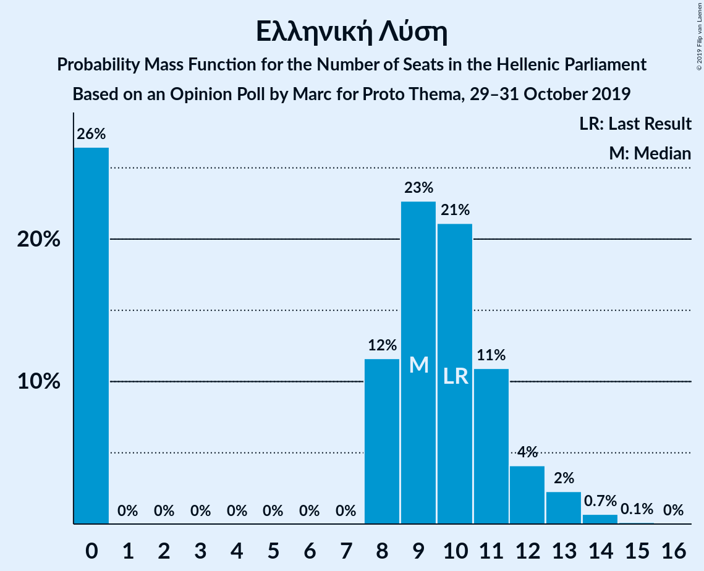

# Opinion Poll by Marc for Proto Thema, 29–31 October 2019

<a href="#voting-intentions">Voting Intentions</a> | <a href="#seats">Seats</a> | <a href="#coalitions">Coalitions</a> | <a href="#technical-information">Technical Information</a>

## Voting Intentions

### Confidence Intervals

| Party | Last Result | Poll Result | 80% Confidence Interval | 90% Confidence Interval | 95% Confidence Interval | 99% Confidence Interval |
|:-----:|:-----------:|:-----------:|:-----------------------:|:-----------------------:|:-----------------------:|:-----------------------:|
| Νέα Δημοκρατία | 39.8% | 47.6% | 45.5–49.6% |45.0–50.2% |44.5–50.7% |43.5–51.6% |
| Συνασπισμός Ριζοσπαστικής Αριστεράς | 31.5% | 27.5% | 25.8–29.4% |25.3–29.9% |24.8–30.4% |24.0–31.3% |
| Κίνημα Αλλαγής | 8.1% | 6.7% | 5.8–7.8% |5.5–8.1% |5.3–8.4% |4.9–9.0% |
| Κομμουνιστικό Κόμμα Ελλάδας | 5.3% | 6.0% | 5.1–7.1% |4.9–7.4% |4.7–7.6% |4.3–8.2% |
| Ελληνική Λύση | 3.7% | 3.4% | 2.8–4.3% |2.6–4.5% |2.4–4.7% |2.2–5.2% |
| Μέτωπο Ευρωπαϊκής Ρεαλιστικής Ανυπακοής | 3.4% | 3.4% | 2.8–4.3% |2.6–4.5% |2.4–4.7% |2.2–5.2% |
| Χρυσή Αυγή | 2.9% | 2.2% | 1.7–2.9% |1.6–3.1% |1.4–3.3% |1.2–3.7% |
| Πλεύση Ελευθερίας | 1.5% | 1.4% | 1.0–2.0% |0.9–2.2% |0.8–2.3% |0.7–2.7% |

*Note:* The poll result column reflects the actual value used in the calculations. Published results may vary slightly, and in addition be rounded to fewer digits.

## Seats

### Confidence Intervals

| Party | Last Result | Median | 80% Confidence Interval | 90% Confidence Interval | 95% Confidence Interval | 99% Confidence Interval |
|:-----:|:-----------:|:------:|:-----------------------:|:-----------------------:|:-----------------------:|:-----------------------:|
| <a href="#νέα-δημοκρατία">Νέα Δημοκρατία</a> | 158 | 177 | 171–183 |169–183 |167–186 |164–191 |
| <a href="#συνασπισμός-ριζοσπαστικής-αριστεράς">Συνασπισμός Ριζοσπαστικής Αριστεράς</a> | 86 | 72 | 69–80 |67–81 |66–82 |63–85 |
| <a href="#κίνημα-αλλαγής">Κίνημα Αλλαγής</a> | 22 | 18 | 15–20 |14–21 |14–22 |13–24 |
| <a href="#κομμουνιστικό-κόμμα-ελλάδας">Κομμουνιστικό Κόμμα Ελλάδας</a> | 15 | 16 | 13–19 |12–19 |12–20 |11–22 |
| <a href="#ελληνική-λύση">Ελληνική Λύση</a> | 10 | 10 | 0–12 |0–12 |0–13 |0–14 |
| <a href="#μέτωπο-ευρωπαϊκής-ρεαλιστικής-ανυπακοής">Μέτωπο Ευρωπαϊκής Ρεαλιστικής Ανυπακοής</a> | 9 | 9 | 0–11 |0–12 |0–12 |0–14 |
| <a href="#χρυσή-αυγή">Χρυσή Αυγή</a> | 0 | 0 | 0 |0–8 |0–9 |0–10 |
| <a href="#πλεύση-ελευθερίας">Πλεύση Ελευθερίας</a> | 0 | 0 | 0 |0 |0 |0 |

### Νέα Δημοκρατία

*For a full overview of the results for this party, see the [Νέα Δημοκρατία](party-νέαδημοκρατία.html) page.*

| Number of Seats | Probability | Accumulated | Special Marks |
|:---------------:|:-----------:|:-----------:|:-------------:|
| 158 | 0% | 100% | Last Result |
| 159 | 0% | 100% |  |
| 160 | 0% | 100% |  |
| 161 | 0% | 100% |  |
| 162 | 0.1% | 100% |  |
| 163 | 0.1% | 99.9% |  |
| 164 | 0.3% | 99.8% |  |
| 165 | 1.1% | 99.4% |  |
| 166 | 0.3% | 98% |  |
| 167 | 1.3% | 98% |  |
| 168 | 1.0% | 97% |  |
| 169 | 4% | 96% |  |
| 170 | 2% | 92% |  |
| 171 | 2% | 90% |  |
| 172 | 14% | 88% |  |
| 173 | 5% | 74% |  |
| 174 | 7% | 69% |  |
| 175 | 3% | 62% |  |
| 176 | 6% | 59% |  |
| 177 | 6% | 53% | Median |
| 178 | 15% | 46% |  |
| 179 | 4% | 31% |  |
| 180 | 7% | 27% |  |
| 181 | 3% | 20% |  |
| 182 | 7% | 17% |  |
| 183 | 6% | 10% |  |
| 184 | 0.8% | 5% |  |
| 185 | 0.7% | 4% |  |
| 186 | 1.2% | 3% |  |
| 187 | 0.7% | 2% |  |
| 188 | 0.3% | 1.2% |  |
| 189 | 0.1% | 0.9% |  |
| 190 | 0.4% | 0.9% |  |
| 191 | 0.4% | 0.5% |  |
| 192 | 0% | 0.1% |  |
| 193 | 0% | 0.1% |  |
| 194 | 0% | 0.1% |  |
| 195 | 0% | 0% |  |

### Συνασπισμός Ριζοσπαστικής Αριστεράς

*For a full overview of the results for this party, see the [Συνασπισμός Ριζοσπαστικής Αριστεράς](party-συνασπισμόςριζοσπαστικήςαριστεράς.html) page.*

| Number of Seats | Probability | Accumulated | Special Marks |
|:---------------:|:-----------:|:-----------:|:-------------:|
| 61 | 0.2% | 100% |  |
| 62 | 0.1% | 99.8% |  |
| 63 | 0.3% | 99.6% |  |
| 64 | 0.9% | 99.3% |  |
| 65 | 0.6% | 98% |  |
| 66 | 2% | 98% |  |
| 67 | 2% | 96% |  |
| 68 | 2% | 94% |  |
| 69 | 14% | 92% |  |
| 70 | 7% | 78% |  |
| 71 | 8% | 71% |  |
| 72 | 14% | 63% | Median |
| 73 | 8% | 50% |  |
| 74 | 7% | 41% |  |
| 75 | 6% | 34% |  |
| 76 | 2% | 28% |  |
| 77 | 5% | 25% |  |
| 78 | 4% | 20% |  |
| 79 | 6% | 16% |  |
| 80 | 4% | 10% |  |
| 81 | 2% | 7% |  |
| 82 | 4% | 5% |  |
| 83 | 0.3% | 1.1% |  |
| 84 | 0.1% | 0.8% |  |
| 85 | 0.5% | 0.7% |  |
| 86 | 0% | 0.2% | Last Result |
| 87 | 0.1% | 0.1% |  |
| 88 | 0% | 0.1% |  |
| 89 | 0% | 0.1% |  |
| 90 | 0% | 0% |  |

### Κίνημα Αλλαγής

*For a full overview of the results for this party, see the [Κίνημα Αλλαγής](party-κίνημααλλαγής.html) page.*

| Number of Seats | Probability | Accumulated | Special Marks |
|:---------------:|:-----------:|:-----------:|:-------------:|
| 12 | 0.1% | 100% |  |
| 13 | 0.8% | 99.8% |  |
| 14 | 5% | 99.0% |  |
| 15 | 12% | 94% |  |
| 16 | 9% | 82% |  |
| 17 | 9% | 73% |  |
| 18 | 15% | 64% | Median |
| 19 | 34% | 48% |  |
| 20 | 8% | 14% |  |
| 21 | 2% | 6% |  |
| 22 | 2% | 4% | Last Result |
| 23 | 1.3% | 2% |  |
| 24 | 0.8% | 1.1% |  |
| 25 | 0.2% | 0.2% |  |
| 26 | 0% | 0% |  |

### Κομμουνιστικό Κόμμα Ελλάδας

*For a full overview of the results for this party, see the [Κομμουνιστικό Κόμμα Ελλάδας](party-κομμουνιστικόκόμμαελλάδας.html) page.*

| Number of Seats | Probability | Accumulated | Special Marks |
|:---------------:|:-----------:|:-----------:|:-------------:|
| 10 | 0.1% | 100% |  |
| 11 | 0.8% | 99.9% |  |
| 12 | 6% | 99.1% |  |
| 13 | 4% | 93% |  |
| 14 | 7% | 89% |  |
| 15 | 17% | 82% | Last Result |
| 16 | 25% | 65% | Median |
| 17 | 18% | 40% |  |
| 18 | 8% | 21% |  |
| 19 | 9% | 13% |  |
| 20 | 3% | 4% |  |
| 21 | 0.8% | 1.3% |  |
| 22 | 0.3% | 0.5% |  |
| 23 | 0.1% | 0.2% |  |
| 24 | 0.1% | 0.1% |  |
| 25 | 0% | 0% |  |

### Ελληνική Λύση

*For a full overview of the results for this party, see the [Ελληνική Λύση](party-ελληνικήλύση.html) page.*

| Number of Seats | Probability | Accumulated | Special Marks |
|:---------------:|:-----------:|:-----------:|:-------------:|
| 0 | 22% | 100% |  |
| 1 | 0% | 78% |  |
| 2 | 0% | 78% |  |
| 3 | 0% | 78% |  |
| 4 | 0% | 78% |  |
| 5 | 0% | 78% |  |
| 6 | 0% | 78% |  |
| 7 | 0% | 78% |  |
| 8 | 10% | 78% |  |
| 9 | 18% | 68% |  |
| 10 | 14% | 50% | Last Result, Median |
| 11 | 25% | 36% |  |
| 12 | 7% | 12% |  |
| 13 | 3% | 5% |  |
| 14 | 1.3% | 1.3% |  |
| 15 | 0.1% | 0.1% |  |
| 16 | 0% | 0% |  |

### Μέτωπο Ευρωπαϊκής Ρεαλιστικής Ανυπακοής

*For a full overview of the results for this party, see the [Μέτωπο Ευρωπαϊκής Ρεαλιστικής Ανυπακοής](party-μέτωποευρωπαϊκήςρεαλιστικήςανυπακοής.html) page.*

| Number of Seats | Probability | Accumulated | Special Marks |
|:---------------:|:-----------:|:-----------:|:-------------:|
| 0 | 21% | 100% |  |
| 1 | 0% | 79% |  |
| 2 | 0% | 79% |  |
| 3 | 0% | 79% |  |
| 4 | 0% | 79% |  |
| 5 | 0% | 79% |  |
| 6 | 0% | 79% |  |
| 7 | 0% | 79% |  |
| 8 | 7% | 79% |  |
| 9 | 42% | 72% | Last Result, Median |
| 10 | 14% | 30% |  |
| 11 | 9% | 16% |  |
| 12 | 5% | 7% |  |
| 13 | 2% | 2% |  |
| 14 | 0.5% | 0.6% |  |
| 15 | 0% | 0.1% |  |
| 16 | 0% | 0% |  |

### Χρυσή Αυγή

*For a full overview of the results for this party, see the [Χρυσή Αυγή](party-χρυσήαυγή.html) page.*

| Number of Seats | Probability | Accumulated | Special Marks |
|:---------------:|:-----------:|:-----------:|:-------------:|
| 0 | 91% | 100% | Last Result, Median |
| 1 | 0% | 9% |  |
| 2 | 0% | 9% |  |
| 3 | 0% | 9% |  |
| 4 | 0% | 9% |  |
| 5 | 0% | 9% |  |
| 6 | 0% | 9% |  |
| 7 | 0% | 9% |  |
| 8 | 4% | 9% |  |
| 9 | 3% | 5% |  |
| 10 | 1.3% | 1.4% |  |
| 11 | 0.1% | 0.2% |  |
| 12 | 0% | 0% |  |

### Πλεύση Ελευθερίας

*For a full overview of the results for this party, see the [Πλεύση Ελευθερίας](party-πλεύσηελευθερίας.html) page.*

| Number of Seats | Probability | Accumulated | Special Marks |
|:---------------:|:-----------:|:-----------:|:-------------:|
| 0 | 99.9% | 100% | Last Result, Median |
| 1 | 0% | 0.1% |  |
| 2 | 0% | 0.1% |  |
| 3 | 0% | 0.1% |  |
| 4 | 0% | 0.1% |  |
| 5 | 0% | 0.1% |  |
| 6 | 0% | 0.1% |  |
| 7 | 0% | 0.1% |  |
| 8 | 0.1% | 0.1% |  |
| 9 | 0% | 0% |  |

## Coalitions

### Confidence Intervals

| Coalition | Last Result | Median | Majority? | 80% Confidence Interval | 90% Confidence Interval | 95% Confidence Interval | 99% Confidence Interval |
|:---------:|:-----------:|:------:|:---------:|:-----------------------:|:-----------------------:|:-----------------------:|:-----------------------:|
| Νέα Δημοκρατία – Κίνημα Αλλαγής | 180 | 195 | 100% | 188–201 | 187–202 | 185–204 | 182–207 |
| Νέα Δημοκρατία | 158 | 177 | 100% | 171–183 | 169–183 | 167–186 | 164–191 |
| Συνασπισμός Ριζοσπαστικής Αριστεράς – Μέτωπο Ευρωπαϊκής Ρεαλιστικής Ανυπακοής | 95 | 81 | 0% | 74–87 | 73–89 | 71–91 | 67–92 |
| Συνασπισμός Ριζοσπαστικής Αριστεράς | 86 | 72 | 0% | 69–80 | 67–81 | 66–82 | 63–85 |

### Νέα Δημοκρατία – Κίνημα Αλλαγής

| Number of Seats | Probability | Accumulated | Special Marks |
|:---------------:|:-----------:|:-----------:|:-------------:|
| 178 | 0.1% | 100% |  |
| 179 | 0.1% | 99.9% |  |
| 180 | 0.1% | 99.8% | Last Result |
| 181 | 0.1% | 99.7% |  |
| 182 | 0.1% | 99.6% |  |
| 183 | 0.9% | 99.5% |  |
| 184 | 0.9% | 98.6% |  |
| 185 | 0.6% | 98% |  |
| 186 | 2% | 97% |  |
| 187 | 4% | 95% |  |
| 188 | 4% | 91% |  |
| 189 | 4% | 87% |  |
| 190 | 4% | 83% |  |
| 191 | 11% | 79% |  |
| 192 | 7% | 69% |  |
| 193 | 2% | 62% |  |
| 194 | 8% | 60% |  |
| 195 | 13% | 53% | Median |
| 196 | 5% | 39% |  |
| 197 | 12% | 35% |  |
| 198 | 6% | 22% |  |
| 199 | 3% | 17% |  |
| 200 | 3% | 14% |  |
| 201 | 1.2% | 10% |  |
| 202 | 5% | 9% |  |
| 203 | 0.5% | 4% |  |
| 204 | 1.0% | 3% |  |
| 205 | 0.9% | 2% |  |
| 206 | 0.5% | 1.3% |  |
| 207 | 0.4% | 0.8% |  |
| 208 | 0.1% | 0.4% |  |
| 209 | 0.2% | 0.3% |  |
| 210 | 0% | 0.1% |  |
| 211 | 0% | 0.1% |  |
| 212 | 0% | 0.1% |  |
| 213 | 0% | 0% |  |

### Νέα Δημοκρατία

| Number of Seats | Probability | Accumulated | Special Marks |
|:---------------:|:-----------:|:-----------:|:-------------:|
| 158 | 0% | 100% | Last Result |
| 159 | 0% | 100% |  |
| 160 | 0% | 100% |  |
| 161 | 0% | 100% |  |
| 162 | 0.1% | 100% |  |
| 163 | 0.1% | 99.9% |  |
| 164 | 0.3% | 99.8% |  |
| 165 | 1.1% | 99.4% |  |
| 166 | 0.3% | 98% |  |
| 167 | 1.3% | 98% |  |
| 168 | 1.0% | 97% |  |
| 169 | 4% | 96% |  |
| 170 | 2% | 92% |  |
| 171 | 2% | 90% |  |
| 172 | 14% | 88% |  |
| 173 | 5% | 74% |  |
| 174 | 7% | 69% |  |
| 175 | 3% | 62% |  |
| 176 | 6% | 59% |  |
| 177 | 6% | 53% | Median |
| 178 | 15% | 46% |  |
| 179 | 4% | 31% |  |
| 180 | 7% | 27% |  |
| 181 | 3% | 20% |  |
| 182 | 7% | 17% |  |
| 183 | 6% | 10% |  |
| 184 | 0.8% | 5% |  |
| 185 | 0.7% | 4% |  |
| 186 | 1.2% | 3% |  |
| 187 | 0.7% | 2% |  |
| 188 | 0.3% | 1.2% |  |
| 189 | 0.1% | 0.9% |  |
| 190 | 0.4% | 0.9% |  |
| 191 | 0.4% | 0.5% |  |
| 192 | 0% | 0.1% |  |
| 193 | 0% | 0.1% |  |
| 194 | 0% | 0.1% |  |
| 195 | 0% | 0% |  |

### Συνασπισμός Ριζοσπαστικής Αριστεράς – Μέτωπο Ευρωπαϊκής Ρεαλιστικής Ανυπακοής

| Number of Seats | Probability | Accumulated | Special Marks |
|:---------------:|:-----------:|:-----------:|:-------------:|
| 64 | 0.1% | 100% |  |
| 65 | 0% | 99.9% |  |
| 66 | 0.1% | 99.9% |  |
| 67 | 0.6% | 99.8% |  |
| 68 | 0.1% | 99.1% |  |
| 69 | 1.1% | 99.0% |  |
| 70 | 0.2% | 98% |  |
| 71 | 0.3% | 98% |  |
| 72 | 0.9% | 97% |  |
| 73 | 5% | 96% |  |
| 74 | 2% | 91% |  |
| 75 | 2% | 90% |  |
| 76 | 1.5% | 87% |  |
| 77 | 4% | 86% |  |
| 78 | 15% | 82% |  |
| 79 | 7% | 67% |  |
| 80 | 3% | 61% |  |
| 81 | 16% | 57% | Median |
| 82 | 10% | 41% |  |
| 83 | 6% | 31% |  |
| 84 | 6% | 26% |  |
| 85 | 2% | 19% |  |
| 86 | 5% | 17% |  |
| 87 | 2% | 12% |  |
| 88 | 0.4% | 10% |  |
| 89 | 5% | 10% |  |
| 90 | 1.0% | 4% |  |
| 91 | 1.3% | 3% |  |
| 92 | 1.4% | 2% |  |
| 93 | 0.2% | 0.4% |  |
| 94 | 0.1% | 0.2% |  |
| 95 | 0% | 0.1% | Last Result |
| 96 | 0% | 0.1% |  |
| 97 | 0% | 0% |  |

### Συνασπισμός Ριζοσπαστικής Αριστεράς

| Number of Seats | Probability | Accumulated | Special Marks |
|:---------------:|:-----------:|:-----------:|:-------------:|
| 61 | 0.2% | 100% |  |
| 62 | 0.1% | 99.8% |  |
| 63 | 0.3% | 99.6% |  |
| 64 | 0.9% | 99.3% |  |
| 65 | 0.6% | 98% |  |
| 66 | 2% | 98% |  |
| 67 | 2% | 96% |  |
| 68 | 2% | 94% |  |
| 69 | 14% | 92% |  |
| 70 | 7% | 78% |  |
| 71 | 8% | 71% |  |
| 72 | 14% | 63% | Median |
| 73 | 8% | 50% |  |
| 74 | 7% | 41% |  |
| 75 | 6% | 34% |  |
| 76 | 2% | 28% |  |
| 77 | 5% | 25% |  |
| 78 | 4% | 20% |  |
| 79 | 6% | 16% |  |
| 80 | 4% | 10% |  |
| 81 | 2% | 7% |  |
| 82 | 4% | 5% |  |
| 83 | 0.3% | 1.1% |  |
| 84 | 0.1% | 0.8% |  |
| 85 | 0.5% | 0.7% |  |
| 86 | 0% | 0.2% | Last Result |
| 87 | 0.1% | 0.1% |  |
| 88 | 0% | 0.1% |  |
| 89 | 0% | 0.1% |  |
| 90 | 0% | 0% |  |

## Technical Information

### Opinion Poll

+ **Polling firm:** Marc
+ **Commissioner(s):** Proto Thema
+ **Fieldwork period:** 29–31 October 2019

### Calculations

+ **Sample size:** 1003
+ **Simulations done:** 131,072
+ **Error estimate:** 2.99%

