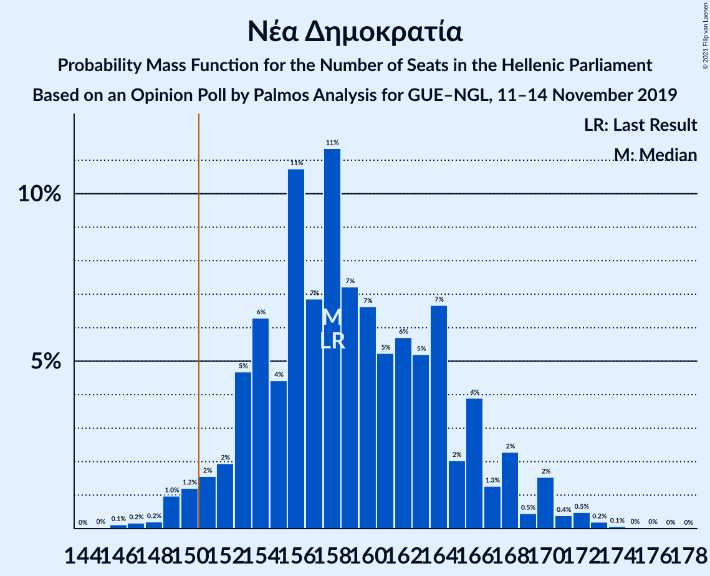
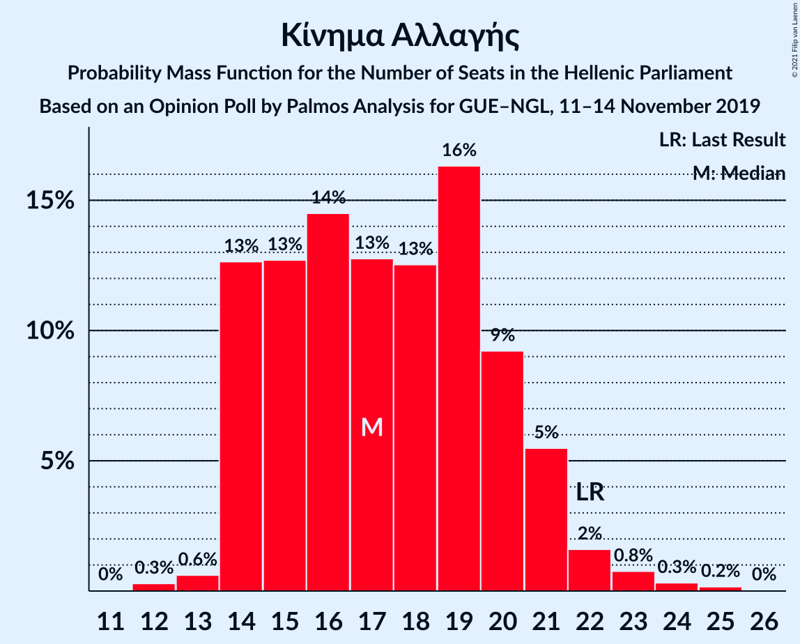
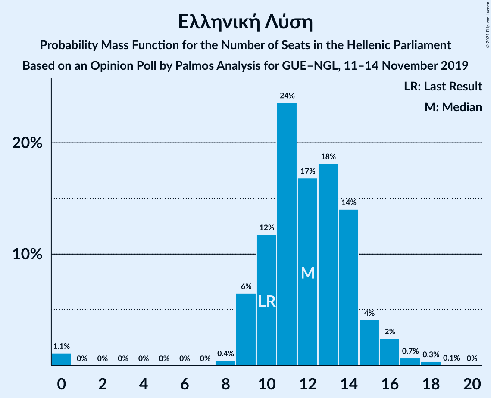
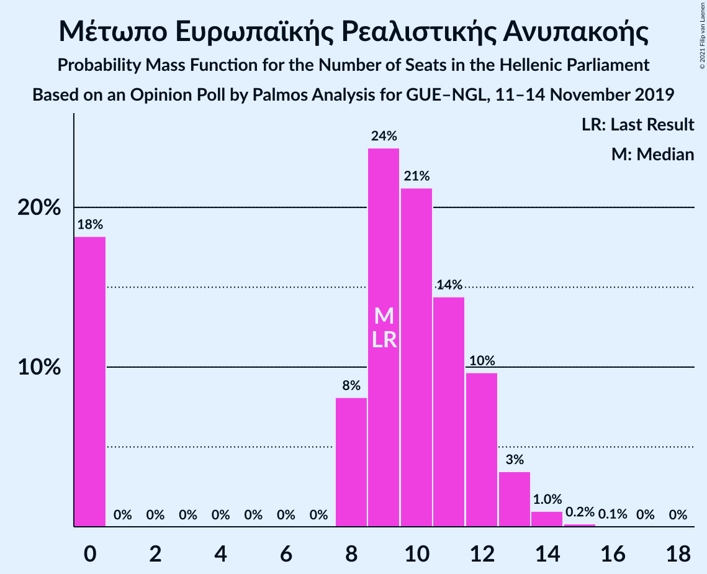
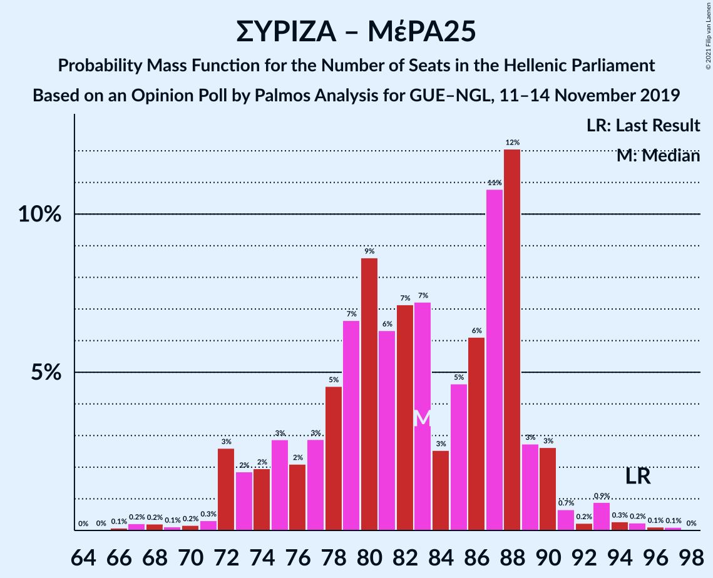

# Opinion Poll by Palmos Analysis for GUE–NGL, 11–14 November 2019

<a href="#voting-intentions">Voting Intentions</a> | <a href="#seats">Seats</a> | <a href="#coalitions">Coalitions</a> | <a href="#technical-information">Technical Information</a>

## Voting Intentions

### Confidence Intervals

| Party | Last Result | Poll Result | 80% Confidence Interval | 90% Confidence Interval | 95% Confidence Interval | 99% Confidence Interval |
|:-----:|:-----------:|:-----------:|:-----------------------:|:-----------------------:|:-----------------------:|:-----------------------:|
| Νέα Δημοκρατία | 39.8% | 40.6% | 38.6–42.6% |38.1–43.1% |37.6–43.6% |36.7–44.6% |
| Συνασπισμός Ριζοσπαστικής Αριστεράς | 31.5% | 27.4% | 25.7–29.3% |25.2–29.8% |24.8–30.3% |24.0–31.2% |
| Κομμουνιστικό Κόμμα Ελλάδας | 5.3% | 6.8% | 5.9–7.9% |5.6–8.3% |5.4–8.5% |5.0–9.1% |
| Κίνημα Αλλαγής | 8.1% | 6.4% | 5.5–7.5% |5.3–7.8% |5.1–8.1% |4.7–8.7% |
| Ελληνική Λύση | 3.7% | 4.3% | 3.6–5.3% |3.4–5.5% |3.2–5.8% |2.9–6.3% |
| Χρυσή Αυγή | 2.9% | 3.9% | 3.3–4.9% |3.1–5.1% |2.9–5.3% |2.6–5.8% |
| Μέτωπο Ευρωπαϊκής Ρεαλιστικής Ανυπακοής | 3.4% | 3.5% | 2.8–4.3% |2.6–4.6% |2.5–4.8% |2.2–5.2% |
| Πλεύση Ελευθερίας | 1.5% | 1.3% | 0.9–1.9% |0.8–2.0% |0.7–2.2% |0.6–2.5% |
| Ένωση Κεντρώων | 1.2% | 0.7% | 0.5–1.2% |0.4–1.3% |0.3–1.4% |0.2–1.7% |

*Note:* The poll result column reflects the actual value used in the calculations. Published results may vary slightly, and in addition be rounded to fewer digits.

## Seats

### Confidence Intervals

| Party | Last Result | Median | 80% Confidence Interval | 90% Confidence Interval | 95% Confidence Interval | 99% Confidence Interval |
|:-----:|:-----------:|:------:|:-----------------------:|:-----------------------:|:-----------------------:|:-----------------------:|
| <a href="#νέα-δημοκρατία">Νέα Δημοκρατία</a> | 158 | 158 | 153–166 |152–168 |150–170 |148–172 |
| <a href="#συνασπισμός-ριζοσπαστικής-αριστεράς">Συνασπισμός Ριζοσπαστικής Αριστεράς</a> | 86 | 75 | 69–80 |68–81 |67–83 |64–85 |
| <a href="#κομμουνιστικό-κόμμα-ελλάδας">Κομμουνιστικό Κόμμα Ελλάδας</a> | 15 | 18 | 16–21 |15–23 |14–23 |13–25 |
| <a href="#κίνημα-αλλαγής">Κίνημα Αλλαγής</a> | 22 | 17 | 14–20 |14–21 |14–22 |13–24 |
| <a href="#ελληνική-λύση">Ελληνική Λύση</a> | 10 | 12 | 10–14 |9–15 |9–16 |0–17 |
| <a href="#χρυσή-αυγή">Χρυσή Αυγή</a> | 0 | 11 | 9–14 |8–14 |0–15 |0–16 |
| <a href="#μέτωπο-ευρωπαϊκής-ρεαλιστικής-ανυπακοής">Μέτωπο Ευρωπαϊκής Ρεαλιστικής Ανυπακοής</a> | 9 | 9 | 0–12 |0–12 |0–13 |0–14 |
| <a href="#πλεύση-ελευθερίας">Πλεύση Ελευθερίας</a> | 0 | 0 | 0 |0 |0 |0 |
| <a href="#ένωση-κεντρώων">Ένωση Κεντρώων</a> | 0 | 0 | 0 |0 |0 |0 |

### Νέα Δημοκρατία

*For a full overview of the results for this party, see the [Νέα Δημοκρατία](party-νέαδημοκρατία.html) page.*

| Number of Seats | Probability | Accumulated | Special Marks |
|:---------------:|:-----------:|:-----------:|:-------------:|
| 145 | 0% | 100% |  |
| 146 | 0.1% | 99.9% |  |
| 147 | 0.2% | 99.8% |  |
| 148 | 0.2% | 99.7% |  |
| 149 | 1.0% | 99.5% |  |
| 150 | 1.2% | 98% |  |
| 151 | 2% | 97% | Majority |
| 152 | 2% | 96% |  |
| 153 | 5% | 94% |  |
| 154 | 6% | 89% |  |
| 155 | 4% | 83% |  |
| 156 | 11% | 78% |  |
| 157 | 7% | 68% |  |
| 158 | 11% | 61% | Last Result, Median |
| 159 | 7% | 49% |  |
| 160 | 7% | 42% |  |
| 161 | 5% | 36% |  |
| 162 | 6% | 30% |  |
| 163 | 5% | 25% |  |
| 164 | 7% | 19% |  |
| 165 | 2% | 13% |  |
| 166 | 4% | 11% |  |
| 167 | 1.3% | 7% |  |
| 168 | 2% | 6% |  |
| 169 | 0.5% | 3% |  |
| 170 | 2% | 3% |  |
| 171 | 0.4% | 1.2% |  |
| 172 | 0.5% | 0.8% |  |
| 173 | 0.2% | 0.4% |  |
| 174 | 0.1% | 0.2% |  |
| 175 | 0% | 0.1% |  |
| 176 | 0% | 0.1% |  |
| 177 | 0% | 0% |  |

### Συνασπισμός Ριζοσπαστικής Αριστεράς

*For a full overview of the results for this party, see the [Συνασπισμός Ριζοσπαστικής Αριστεράς](party-συνασπισμόςριζοσπαστικήςαριστεράς.html) page.*

| Number of Seats | Probability | Accumulated | Special Marks |
|:---------------:|:-----------:|:-----------:|:-------------:|
| 62 | 0.1% | 100% |  |
| 63 | 0.2% | 99.8% |  |
| 64 | 0.4% | 99.6% |  |
| 65 | 0.4% | 99.2% |  |
| 66 | 0.8% | 98.9% |  |
| 67 | 1.4% | 98% |  |
| 68 | 5% | 97% |  |
| 69 | 5% | 91% |  |
| 70 | 8% | 86% |  |
| 71 | 8% | 79% |  |
| 72 | 6% | 71% |  |
| 73 | 7% | 64% |  |
| 74 | 6% | 57% |  |
| 75 | 9% | 52% | Median |
| 76 | 7% | 43% |  |
| 77 | 13% | 36% |  |
| 78 | 8% | 23% |  |
| 79 | 4% | 15% |  |
| 80 | 4% | 10% |  |
| 81 | 2% | 6% |  |
| 82 | 2% | 5% |  |
| 83 | 1.3% | 3% |  |
| 84 | 0.7% | 1.4% |  |
| 85 | 0.4% | 0.7% |  |
| 86 | 0.1% | 0.3% | Last Result |
| 87 | 0.1% | 0.2% |  |
| 88 | 0% | 0.1% |  |
| 89 | 0% | 0% |  |

### Κομμουνιστικό Κόμμα Ελλάδας

*For a full overview of the results for this party, see the [Κομμουνιστικό Κόμμα Ελλάδας](party-κομμουνιστικόκόμμαελλάδας.html) page.*

| Number of Seats | Probability | Accumulated | Special Marks |
|:---------------:|:-----------:|:-----------:|:-------------:|
| 12 | 0.1% | 100% |  |
| 13 | 0.8% | 99.9% |  |
| 14 | 2% | 99.1% |  |
| 15 | 7% | 97% | Last Result |
| 16 | 9% | 90% |  |
| 17 | 13% | 81% |  |
| 18 | 21% | 68% | Median |
| 19 | 14% | 47% |  |
| 20 | 13% | 33% |  |
| 21 | 10% | 20% |  |
| 22 | 4% | 10% |  |
| 23 | 4% | 6% |  |
| 24 | 1.4% | 2% |  |
| 25 | 0.8% | 1.0% |  |
| 26 | 0.2% | 0.2% |  |
| 27 | 0.1% | 0.1% |  |
| 28 | 0% | 0% |  |

### Κίνημα Αλλαγής

*For a full overview of the results for this party, see the [Κίνημα Αλλαγής](party-κίνημααλλαγής.html) page.*

| Number of Seats | Probability | Accumulated | Special Marks |
|:---------------:|:-----------:|:-----------:|:-------------:|
| 11 | 0% | 100% |  |
| 12 | 0.3% | 99.9% |  |
| 13 | 0.6% | 99.7% |  |
| 14 | 13% | 99.0% |  |
| 15 | 13% | 86% |  |
| 16 | 14% | 74% |  |
| 17 | 13% | 59% | Median |
| 18 | 13% | 46% |  |
| 19 | 16% | 34% |  |
| 20 | 9% | 18% |  |
| 21 | 5% | 8% |  |
| 22 | 2% | 3% | Last Result |
| 23 | 0.8% | 1.3% |  |
| 24 | 0.3% | 0.5% |  |
| 25 | 0.2% | 0.2% |  |
| 26 | 0% | 0% |  |

### Ελληνική Λύση

*For a full overview of the results for this party, see the [Ελληνική Λύση](party-ελληνικήλύση.html) page.*

| Number of Seats | Probability | Accumulated | Special Marks |
|:---------------:|:-----------:|:-----------:|:-------------:|
| 0 | 1.1% | 100% |  |
| 1 | 0% | 98.9% |  |
| 2 | 0% | 98.9% |  |
| 3 | 0% | 98.9% |  |
| 4 | 0% | 98.9% |  |
| 5 | 0% | 98.9% |  |
| 6 | 0% | 98.9% |  |
| 7 | 0% | 98.9% |  |
| 8 | 0.4% | 98.9% |  |
| 9 | 6% | 98% |  |
| 10 | 12% | 92% | Last Result |
| 11 | 24% | 80% |  |
| 12 | 17% | 57% | Median |
| 13 | 18% | 40% |  |
| 14 | 14% | 22% |  |
| 15 | 4% | 8% |  |
| 16 | 2% | 3% |  |
| 17 | 0.7% | 1.1% |  |
| 18 | 0.3% | 0.4% |  |
| 19 | 0.1% | 0.1% |  |
| 20 | 0% | 0% |  |

### Χρυσή Αυγή

*For a full overview of the results for this party, see the [Χρυσή Αυγή](party-χρυσήαυγή.html) page.*

| Number of Seats | Probability | Accumulated | Special Marks |
|:---------------:|:-----------:|:-----------:|:-------------:|
| 0 | 5% | 100% | Last Result |
| 1 | 0% | 95% |  |
| 2 | 0% | 95% |  |
| 3 | 0% | 95% |  |
| 4 | 0% | 95% |  |
| 5 | 0% | 95% |  |
| 6 | 0% | 95% |  |
| 7 | 0% | 95% |  |
| 8 | 4% | 95% |  |
| 9 | 13% | 91% |  |
| 10 | 24% | 79% |  |
| 11 | 21% | 54% | Median |
| 12 | 14% | 33% |  |
| 13 | 9% | 20% |  |
| 14 | 7% | 10% |  |
| 15 | 3% | 4% |  |
| 16 | 0.6% | 0.8% |  |
| 17 | 0.1% | 0.1% |  |
| 18 | 0% | 0% |  |

### Μέτωπο Ευρωπαϊκής Ρεαλιστικής Ανυπακοής

*For a full overview of the results for this party, see the [Μέτωπο Ευρωπαϊκής Ρεαλιστικής Ανυπακοής](party-μέτωποευρωπαϊκήςρεαλιστικήςανυπακοής.html) page.*

| Number of Seats | Probability | Accumulated | Special Marks |
|:---------------:|:-----------:|:-----------:|:-------------:|
| 0 | 18% | 100% |  |
| 1 | 0% | 82% |  |
| 2 | 0% | 82% |  |
| 3 | 0% | 82% |  |
| 4 | 0% | 82% |  |
| 5 | 0% | 82% |  |
| 6 | 0% | 82% |  |
| 7 | 0% | 82% |  |
| 8 | 8% | 82% |  |
| 9 | 24% | 74% | Last Result, Median |
| 10 | 21% | 50% |  |
| 11 | 14% | 29% |  |
| 12 | 10% | 14% |  |
| 13 | 3% | 5% |  |
| 14 | 1.0% | 1.2% |  |
| 15 | 0.2% | 0.3% |  |
| 16 | 0.1% | 0.1% |  |
| 17 | 0% | 0% |  |

### Πλεύση Ελευθερίας

*For a full overview of the results for this party, see the [Πλεύση Ελευθερίας](party-πλεύσηελευθερίας.html) page.*

| Number of Seats | Probability | Accumulated | Special Marks |
|:---------------:|:-----------:|:-----------:|:-------------:|
| 0 | 100% | 100% | Last Result, Median |

### Ένωση Κεντρώων

*For a full overview of the results for this party, see the [Ένωση Κεντρώων](party-ένωσηκεντρώων.html) page.*

| Number of Seats | Probability | Accumulated | Special Marks |
|:---------------:|:-----------:|:-----------:|:-------------:|
| 0 | 100% | 100% | Last Result, Median |

## Coalitions

### Confidence Intervals

| Coalition | Last Result | Median | Majority? | 80% Confidence Interval | 90% Confidence Interval | 95% Confidence Interval | 99% Confidence Interval |
|:---------:|:-----------:|:------:|:---------:|:-----------------------:|:-----------------------:|:-----------------------:|:-----------------------:|
| Νέα Δημοκρατία – Κίνημα Αλλαγής | 180 | 176 | 100% | 170–183 | 168–185 | 167–188 | 166–190 |
| Νέα Δημοκρατία | 158 | 158 | 97% | 153–166 | 152–168 | 150–170 | 148–172 |
| Συνασπισμός Ριζοσπαστικής Αριστεράς – Μέτωπο Ευρωπαϊκής Ρεαλιστικής Ανυπακοής | 95 | 83 | 0% | 75–88 | 73–90 | 72–91 | 68–94 |
| Συνασπισμός Ριζοσπαστικής Αριστεράς | 86 | 75 | 0% | 69–80 | 68–81 | 67–83 | 64–85 |

### Νέα Δημοκρατία – Κίνημα Αλλαγής

| Number of Seats | Probability | Accumulated | Special Marks |
|:---------------:|:-----------:|:-----------:|:-------------:|
| 162 | 0% | 100% |  |
| 163 | 0.1% | 99.9% |  |
| 164 | 0.1% | 99.9% |  |
| 165 | 0.2% | 99.7% |  |
| 166 | 0.4% | 99.5% |  |
| 167 | 2% | 99.2% |  |
| 168 | 3% | 97% |  |
| 169 | 3% | 94% |  |
| 170 | 4% | 91% |  |
| 171 | 4% | 88% |  |
| 172 | 10% | 84% |  |
| 173 | 5% | 74% |  |
| 174 | 8% | 69% |  |
| 175 | 6% | 61% | Median |
| 176 | 8% | 55% |  |
| 177 | 8% | 47% |  |
| 178 | 6% | 39% |  |
| 179 | 7% | 34% |  |
| 180 | 5% | 27% | Last Result |
| 181 | 5% | 21% |  |
| 182 | 4% | 16% |  |
| 183 | 4% | 12% |  |
| 184 | 2% | 9% |  |
| 185 | 3% | 7% |  |
| 186 | 0.9% | 4% |  |
| 187 | 0.7% | 3% |  |
| 188 | 0.5% | 3% |  |
| 189 | 1.4% | 2% |  |
| 190 | 0.3% | 0.7% |  |
| 191 | 0.2% | 0.5% |  |
| 192 | 0.1% | 0.3% |  |
| 193 | 0.1% | 0.2% |  |
| 194 | 0.1% | 0.1% |  |
| 195 | 0% | 0% |  |

### Νέα Δημοκρατία

| Number of Seats | Probability | Accumulated | Special Marks |
|:---------------:|:-----------:|:-----------:|:-------------:|
| 145 | 0% | 100% |  |
| 146 | 0.1% | 99.9% |  |
| 147 | 0.2% | 99.8% |  |
| 148 | 0.2% | 99.7% |  |
| 149 | 1.0% | 99.5% |  |
| 150 | 1.2% | 98% |  |
| 151 | 2% | 97% | Majority |
| 152 | 2% | 96% |  |
| 153 | 5% | 94% |  |
| 154 | 6% | 89% |  |
| 155 | 4% | 83% |  |
| 156 | 11% | 78% |  |
| 157 | 7% | 68% |  |
| 158 | 11% | 61% | Last Result, Median |
| 159 | 7% | 49% |  |
| 160 | 7% | 42% |  |
| 161 | 5% | 36% |  |
| 162 | 6% | 30% |  |
| 163 | 5% | 25% |  |
| 164 | 7% | 19% |  |
| 165 | 2% | 13% |  |
| 166 | 4% | 11% |  |
| 167 | 1.3% | 7% |  |
| 168 | 2% | 6% |  |
| 169 | 0.5% | 3% |  |
| 170 | 2% | 3% |  |
| 171 | 0.4% | 1.2% |  |
| 172 | 0.5% | 0.8% |  |
| 173 | 0.2% | 0.4% |  |
| 174 | 0.1% | 0.2% |  |
| 175 | 0% | 0.1% |  |
| 176 | 0% | 0.1% |  |
| 177 | 0% | 0% |  |

### Συνασπισμός Ριζοσπαστικής Αριστεράς – Μέτωπο Ευρωπαϊκής Ρεαλιστικής Ανυπακοής

| Number of Seats | Probability | Accumulated | Special Marks |
|:---------------:|:-----------:|:-----------:|:-------------:|
| 66 | 0.1% | 100% |  |
| 67 | 0.2% | 99.9% |  |
| 68 | 0.2% | 99.7% |  |
| 69 | 0.1% | 99.5% |  |
| 70 | 0.2% | 99.3% |  |
| 71 | 0.3% | 99.2% |  |
| 72 | 3% | 98.9% |  |
| 73 | 2% | 96% |  |
| 74 | 2% | 94% |  |
| 75 | 3% | 92% |  |
| 76 | 2% | 90% |  |
| 77 | 3% | 87% |  |
| 78 | 5% | 85% |  |
| 79 | 7% | 80% |  |
| 80 | 9% | 73% |  |
| 81 | 6% | 65% |  |
| 82 | 7% | 58% |  |
| 83 | 7% | 51% |  |
| 84 | 3% | 44% | Median |
| 85 | 5% | 42% |  |
| 86 | 6% | 37% |  |
| 87 | 11% | 31% |  |
| 88 | 12% | 20% |  |
| 89 | 3% | 8% |  |
| 90 | 3% | 5% |  |
| 91 | 0.7% | 3% |  |
| 92 | 0.2% | 2% |  |
| 93 | 0.9% | 2% |  |
| 94 | 0.3% | 0.8% |  |
| 95 | 0.2% | 0.5% | Last Result |
| 96 | 0.1% | 0.3% |  |
| 97 | 0.1% | 0.1% |  |
| 98 | 0% | 0% |  |

### Συνασπισμός Ριζοσπαστικής Αριστεράς

| Number of Seats | Probability | Accumulated | Special Marks |
|:---------------:|:-----------:|:-----------:|:-------------:|
| 62 | 0.1% | 100% |  |
| 63 | 0.2% | 99.8% |  |
| 64 | 0.4% | 99.6% |  |
| 65 | 0.4% | 99.2% |  |
| 66 | 0.8% | 98.9% |  |
| 67 | 1.4% | 98% |  |
| 68 | 5% | 97% |  |
| 69 | 5% | 91% |  |
| 70 | 8% | 86% |  |
| 71 | 8% | 79% |  |
| 72 | 6% | 71% |  |
| 73 | 7% | 64% |  |
| 74 | 6% | 57% |  |
| 75 | 9% | 52% | Median |
| 76 | 7% | 43% |  |
| 77 | 13% | 36% |  |
| 78 | 8% | 23% |  |
| 79 | 4% | 15% |  |
| 80 | 4% | 10% |  |
| 81 | 2% | 6% |  |
| 82 | 2% | 5% |  |
| 83 | 1.3% | 3% |  |
| 84 | 0.7% | 1.4% |  |
| 85 | 0.4% | 0.7% |  |
| 86 | 0.1% | 0.3% | Last Result |
| 87 | 0.1% | 0.2% |  |
| 88 | 0% | 0.1% |  |
| 89 | 0% | 0% |  |

## Technical Information

### Opinion Poll

+ **Polling firm:** Palmos Analysis
+ **Commissioner(s):** GUE–NGL
+ **Fieldwork period:** 11–14 November 2019

### Calculations

+ **Sample size:** 1013
+ **Simulations done:** 1,048,576
+ **Error estimate:** 0.96%

