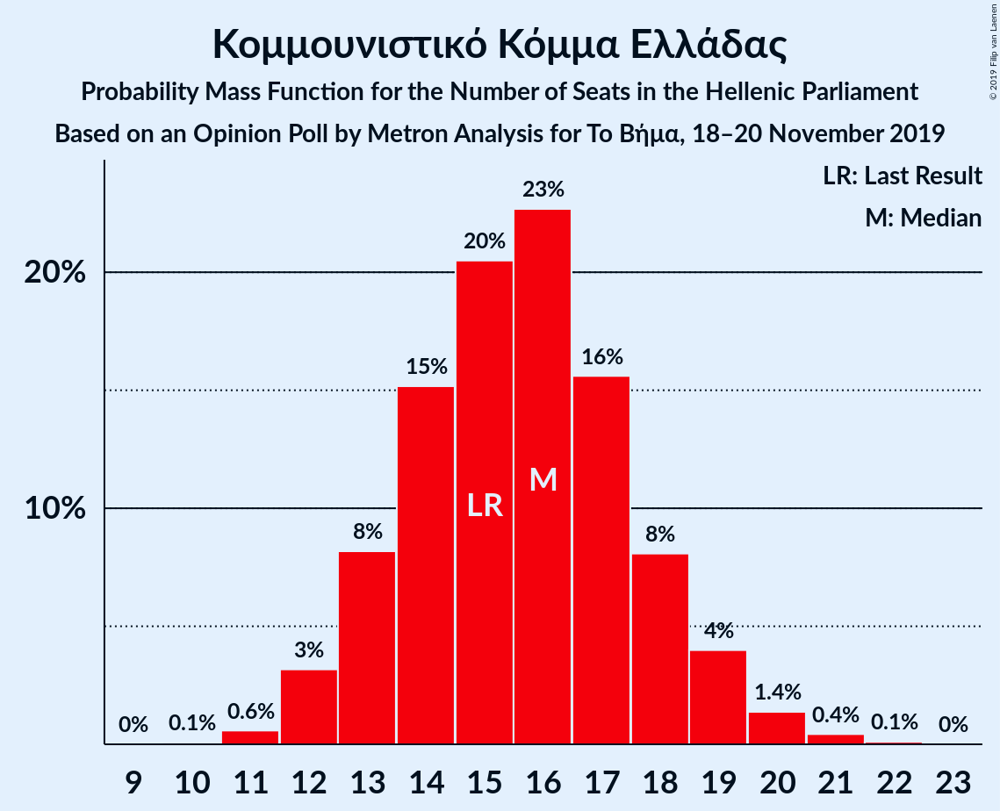

# Opinion Poll by Metron Analysis for Το Βήμα, 18–20 November 2019

<a href="#voting-intentions">Voting Intentions</a> | <a href="#seats">Seats</a> | <a href="#coalitions">Coalitions</a> | <a href="#technical-information">Technical Information</a>

## Voting Intentions

### Confidence Intervals

| Party | Last Result | Poll Result | 80% Confidence Interval | 90% Confidence Interval | 95% Confidence Interval | 99% Confidence Interval |
|:-----:|:-----------:|:-----------:|:-----------------------:|:-----------------------:|:-----------------------:|:-----------------------:|
| Νέα Δημοκρατία | 39.8% | 45.4% | 43.5–47.2% |43.0–47.8% |42.6–48.2% |41.7–49.1% |
| Συνασπισμός Ριζοσπαστικής Αριστεράς | 31.5% | 25.7% | 24.1–27.4% |23.7–27.8% |23.3–28.2% |22.6–29.1% |
| Κίνημα Αλλαγής | 8.1% | 7.5% | 6.6–8.6% |6.3–8.9% |6.1–9.1% |5.7–9.6% |
| Κομμουνιστικό Κόμμα Ελλάδας | 5.3% | 5.8% | 5.0–6.8% |4.8–7.1% |4.6–7.3% |4.3–7.8% |
| Ελληνική Λύση | 3.7% | 5.1% | 4.3–6.0% |4.1–6.2% |4.0–6.5% |3.6–6.9% |
| Μέτωπο Ευρωπαϊκής Ρεαλιστικής Ανυπακοής | 3.4% | 4.6% | 3.9–5.4% |3.7–5.7% |3.5–5.9% |3.2–6.4% |
| Χρυσή Αυγή | 2.9% | 1.7% | 1.3–2.2% |1.2–2.4% |1.1–2.6% |0.9–2.9% |

*Note:* The poll result column reflects the actual value used in the calculations. Published results may vary slightly, and in addition be rounded to fewer digits.

## Seats

### Confidence Intervals

| Party | Last Result | Median | 80% Confidence Interval | 90% Confidence Interval | 95% Confidence Interval | 99% Confidence Interval |
|:-----:|:-----------:|:------:|:-----------------------:|:-----------------------:|:-----------------------:|:-----------------------:|
| <a href="#νέα-δημοκρατία">Νέα Δημοκρατία</a> | 158 | 170 | 166–175 |164–176 |163–178 |161–180 |
| <a href="#συνασπισμός-ριζοσπαστικής-αριστεράς">Συνασπισμός Ριζοσπαστικής Αριστεράς</a> | 86 | 68 | 64–73 |63–74 |62–75 |60–77 |
| <a href="#κίνημα-αλλαγής">Κίνημα Αλλαγής</a> | 22 | 20 | 18–23 |17–23 |16–24 |15–26 |
| <a href="#κομμουνιστικό-κόμμα-ελλάδας">Κομμουνιστικό Κόμμα Ελλάδας</a> | 15 | 16 | 13–18 |13–19 |12–19 |11–21 |
| <a href="#ελληνική-λύση">Ελληνική Λύση</a> | 10 | 14 | 12–16 |11–16 |11–17 |10–18 |
| <a href="#μέτωπο-ευρωπαϊκής-ρεαλιστικής-ανυπακοής">Μέτωπο Ευρωπαϊκής Ρεαλιστικής Ανυπακοής</a> | 9 | 12 | 10–14 |10–15 |9–16 |9–17 |
| <a href="#χρυσή-αυγή">Χρυσή Αυγή</a> | 0 | 0 | 0 |0 |0 |0 |

### Νέα Δημοκρατία

*For a full overview of the results for this party, see the [Νέα Δημοκρατία](party-νέαδημοκρατία.html) page.*

| Number of Seats | Probability | Accumulated | Special Marks |
|:---------------:|:-----------:|:-----------:|:-------------:|
| 158 | 0% | 100% | Last Result |
| 159 | 0.1% | 99.9% |  |
| 160 | 0.2% | 99.8% |  |
| 161 | 0.6% | 99.6% |  |
| 162 | 0.8% | 99.0% |  |
| 163 | 1.4% | 98% |  |
| 164 | 3% | 97% |  |
| 165 | 4% | 94% |  |
| 166 | 5% | 90% |  |
| 167 | 7% | 85% |  |
| 168 | 10% | 78% |  |
| 169 | 12% | 68% |  |
| 170 | 9% | 56% | Median |
| 171 | 12% | 48% |  |
| 172 | 9% | 36% |  |
| 173 | 8% | 27% |  |
| 174 | 6% | 19% |  |
| 175 | 4% | 13% |  |
| 176 | 4% | 8% |  |
| 177 | 2% | 4% |  |
| 178 | 1.3% | 3% |  |
| 179 | 0.9% | 1.4% |  |
| 180 | 0.3% | 0.6% |  |
| 181 | 0.2% | 0.3% |  |
| 182 | 0.1% | 0.1% |  |
| 183 | 0% | 0% |  |

### Συνασπισμός Ριζοσπαστικής Αριστεράς

*For a full overview of the results for this party, see the [Συνασπισμός Ριζοσπαστικής Αριστεράς](party-συνασπισμόςριζοσπαστικήςαριστεράς.html) page.*

| Number of Seats | Probability | Accumulated | Special Marks |
|:---------------:|:-----------:|:-----------:|:-------------:|
| 58 | 0.1% | 100% |  |
| 59 | 0.2% | 99.9% |  |
| 60 | 0.7% | 99.7% |  |
| 61 | 1.1% | 99.0% |  |
| 62 | 2% | 98% |  |
| 63 | 4% | 96% |  |
| 64 | 6% | 92% |  |
| 65 | 6% | 86% |  |
| 66 | 12% | 80% |  |
| 67 | 13% | 69% |  |
| 68 | 9% | 56% | Median |
| 69 | 12% | 47% |  |
| 70 | 13% | 35% |  |
| 71 | 6% | 22% |  |
| 72 | 5% | 15% |  |
| 73 | 5% | 10% |  |
| 74 | 2% | 5% |  |
| 75 | 2% | 3% |  |
| 76 | 0.7% | 1.4% |  |
| 77 | 0.5% | 0.7% |  |
| 78 | 0.2% | 0.3% |  |
| 79 | 0% | 0.1% |  |
| 80 | 0% | 0% |  |
| 81 | 0% | 0% |  |
| 82 | 0% | 0% |  |
| 83 | 0% | 0% |  |
| 84 | 0% | 0% |  |
| 85 | 0% | 0% |  |
| 86 | 0% | 0% | Last Result |

### Κίνημα Αλλαγής

*For a full overview of the results for this party, see the [Κίνημα Αλλαγής](party-κίνημααλλαγής.html) page.*

| Number of Seats | Probability | Accumulated | Special Marks |
|:---------------:|:-----------:|:-----------:|:-------------:|
| 14 | 0.2% | 100% |  |
| 15 | 0.7% | 99.8% |  |
| 16 | 3% | 99.2% |  |
| 17 | 6% | 96% |  |
| 18 | 13% | 90% |  |
| 19 | 15% | 77% |  |
| 20 | 22% | 63% | Median |
| 21 | 17% | 41% |  |
| 22 | 13% | 23% | Last Result |
| 23 | 5% | 10% |  |
| 24 | 3% | 5% |  |
| 25 | 1.0% | 1.5% |  |
| 26 | 0.4% | 0.5% |  |
| 27 | 0.1% | 0.1% |  |
| 28 | 0% | 0% |  |

### Κομμουνιστικό Κόμμα Ελλάδας

*For a full overview of the results for this party, see the [Κομμουνιστικό Κόμμα Ελλάδας](party-κομμουνιστικόκόμμαελλάδας.html) page.*

| Number of Seats | Probability | Accumulated | Special Marks |
|:---------------:|:-----------:|:-----------:|:-------------:|
| 10 | 0.1% | 100% |  |
| 11 | 0.6% | 99.9% |  |
| 12 | 3% | 99.4% |  |
| 13 | 8% | 96% |  |
| 14 | 16% | 89% |  |
| 15 | 21% | 72% | Last Result |
| 16 | 22% | 52% | Median |
| 17 | 16% | 30% |  |
| 18 | 8% | 14% |  |
| 19 | 4% | 6% |  |
| 20 | 1.4% | 2% |  |
| 21 | 0.4% | 0.6% |  |
| 22 | 0.1% | 0.1% |  |
| 23 | 0% | 0% |  |

### Ελληνική Λύση

*For a full overview of the results for this party, see the [Ελληνική Λύση](party-ελληνικήλύση.html) page.*

| Number of Seats | Probability | Accumulated | Special Marks |
|:---------------:|:-----------:|:-----------:|:-------------:|
| 9 | 0.3% | 100% |  |
| 10 | 2% | 99.6% | Last Result |
| 11 | 7% | 98% |  |
| 12 | 17% | 90% |  |
| 13 | 22% | 73% |  |
| 14 | 23% | 51% | Median |
| 15 | 14% | 28% |  |
| 16 | 9% | 14% |  |
| 17 | 3% | 5% |  |
| 18 | 0.9% | 1.3% |  |
| 19 | 0.3% | 0.4% |  |
| 20 | 0.1% | 0.1% |  |
| 21 | 0% | 0% |  |

### Μέτωπο Ευρωπαϊκής Ρεαλιστικής Ανυπακοής

*For a full overview of the results for this party, see the [Μέτωπο Ευρωπαϊκής Ρεαλιστικής Ανυπακοής](party-μέτωποευρωπαϊκήςρεαλιστικήςανυπακοής.html) page.*

| Number of Seats | Probability | Accumulated | Special Marks |
|:---------------:|:-----------:|:-----------:|:-------------:|
| 0 | 0.1% | 100% |  |
| 1 | 0% | 99.9% |  |
| 2 | 0% | 99.9% |  |
| 3 | 0% | 99.9% |  |
| 4 | 0% | 99.9% |  |
| 5 | 0% | 99.9% |  |
| 6 | 0% | 99.9% |  |
| 7 | 0% | 99.9% |  |
| 8 | 0.4% | 99.9% |  |
| 9 | 3% | 99.5% | Last Result |
| 10 | 8% | 97% |  |
| 11 | 18% | 89% |  |
| 12 | 27% | 71% | Median |
| 13 | 22% | 44% |  |
| 14 | 13% | 22% |  |
| 15 | 6% | 9% |  |
| 16 | 2% | 3% |  |
| 17 | 0.6% | 0.8% |  |
| 18 | 0.2% | 0.2% |  |
| 19 | 0% | 0% |  |

### Χρυσή Αυγή

*For a full overview of the results for this party, see the [Χρυσή Αυγή](party-χρυσήαυγή.html) page.*

| Number of Seats | Probability | Accumulated | Special Marks |
|:---------------:|:-----------:|:-----------:|:-------------:|
| 0 | 99.8% | 100% | Last Result, Median |
| 1 | 0% | 0.2% |  |
| 2 | 0% | 0.2% |  |
| 3 | 0% | 0.2% |  |
| 4 | 0% | 0.2% |  |
| 5 | 0% | 0.2% |  |
| 6 | 0% | 0.2% |  |
| 7 | 0% | 0.2% |  |
| 8 | 0.2% | 0.2% |  |
| 9 | 0% | 0% |  |

## Coalitions

### Confidence Intervals

| Coalition | Last Result | Median | Majority? | 80% Confidence Interval | 90% Confidence Interval | 95% Confidence Interval | 99% Confidence Interval |
|:---------:|:-----------:|:------:|:---------:|:-----------------------:|:-----------------------:|:-----------------------:|:-----------------------:|
| Νέα Δημοκρατία – Κίνημα Αλλαγής | 180 | 190 | 100% | 186–195 | 184–196 | 183–198 | 181–200 |
| Νέα Δημοκρατία | 158 | 170 | 100% | 166–175 | 164–176 | 163–178 | 161–180 |
| Συνασπισμός Ριζοσπαστικής Αριστεράς – Μέτωπο Ευρωπαϊκής Ρεαλιστικής Ανυπακοής | 95 | 81 | 0% | 76–85 | 75–86 | 74–87 | 72–89 |
| Συνασπισμός Ριζοσπαστικής Αριστεράς | 86 | 68 | 0% | 64–73 | 63–74 | 62–75 | 60–77 |

### Νέα Δημοκρατία – Κίνημα Αλλαγής

| Number of Seats | Probability | Accumulated | Special Marks |
|:---------------:|:-----------:|:-----------:|:-------------:|
| 178 | 0% | 100% |  |
| 179 | 0.1% | 99.9% |  |
| 180 | 0.3% | 99.8% | Last Result |
| 181 | 0.4% | 99.6% |  |
| 182 | 1.2% | 99.1% |  |
| 183 | 1.3% | 98% |  |
| 184 | 2% | 97% |  |
| 185 | 4% | 94% |  |
| 186 | 5% | 90% |  |
| 187 | 6% | 85% |  |
| 188 | 10% | 79% |  |
| 189 | 12% | 70% |  |
| 190 | 12% | 57% | Median |
| 191 | 9% | 46% |  |
| 192 | 9% | 37% |  |
| 193 | 8% | 28% |  |
| 194 | 7% | 20% |  |
| 195 | 4% | 13% |  |
| 196 | 4% | 9% |  |
| 197 | 2% | 5% |  |
| 198 | 1.5% | 3% |  |
| 199 | 0.7% | 1.3% |  |
| 200 | 0.3% | 0.6% |  |
| 201 | 0.2% | 0.3% |  |
| 202 | 0.1% | 0.1% |  |
| 203 | 0% | 0.1% |  |
| 204 | 0% | 0% |  |

### Νέα Δημοκρατία

| Number of Seats | Probability | Accumulated | Special Marks |
|:---------------:|:-----------:|:-----------:|:-------------:|
| 158 | 0% | 100% | Last Result |
| 159 | 0.1% | 99.9% |  |
| 160 | 0.2% | 99.8% |  |
| 161 | 0.6% | 99.6% |  |
| 162 | 0.8% | 99.0% |  |
| 163 | 1.4% | 98% |  |
| 164 | 3% | 97% |  |
| 165 | 4% | 94% |  |
| 166 | 5% | 90% |  |
| 167 | 7% | 85% |  |
| 168 | 10% | 78% |  |
| 169 | 12% | 68% |  |
| 170 | 9% | 56% | Median |
| 171 | 12% | 48% |  |
| 172 | 9% | 36% |  |
| 173 | 8% | 27% |  |
| 174 | 6% | 19% |  |
| 175 | 4% | 13% |  |
| 176 | 4% | 8% |  |
| 177 | 2% | 4% |  |
| 178 | 1.3% | 3% |  |
| 179 | 0.9% | 1.4% |  |
| 180 | 0.3% | 0.6% |  |
| 181 | 0.2% | 0.3% |  |
| 182 | 0.1% | 0.1% |  |
| 183 | 0% | 0% |  |

### Συνασπισμός Ριζοσπαστικής Αριστεράς – Μέτωπο Ευρωπαϊκής Ρεαλιστικής Ανυπακοής

| Number of Seats | Probability | Accumulated | Special Marks |
|:---------------:|:-----------:|:-----------:|:-------------:|
| 69 | 0% | 100% |  |
| 70 | 0.1% | 99.9% |  |
| 71 | 0.2% | 99.8% |  |
| 72 | 0.8% | 99.6% |  |
| 73 | 0.7% | 98.8% |  |
| 74 | 3% | 98% |  |
| 75 | 2% | 95% |  |
| 76 | 6% | 93% |  |
| 77 | 5% | 87% |  |
| 78 | 10% | 82% |  |
| 79 | 11% | 72% |  |
| 80 | 10% | 62% | Median |
| 81 | 16% | 51% |  |
| 82 | 7% | 35% |  |
| 83 | 11% | 29% |  |
| 84 | 4% | 17% |  |
| 85 | 6% | 13% |  |
| 86 | 3% | 7% |  |
| 87 | 2% | 4% |  |
| 88 | 0.9% | 2% |  |
| 89 | 0.6% | 1.1% |  |
| 90 | 0.3% | 0.5% |  |
| 91 | 0.1% | 0.2% |  |
| 92 | 0.1% | 0.1% |  |
| 93 | 0% | 0% |  |
| 94 | 0% | 0% |  |
| 95 | 0% | 0% | Last Result |

### Συνασπισμός Ριζοσπαστικής Αριστεράς

| Number of Seats | Probability | Accumulated | Special Marks |
|:---------------:|:-----------:|:-----------:|:-------------:|
| 58 | 0.1% | 100% |  |
| 59 | 0.2% | 99.9% |  |
| 60 | 0.7% | 99.7% |  |
| 61 | 1.1% | 99.0% |  |
| 62 | 2% | 98% |  |
| 63 | 4% | 96% |  |
| 64 | 6% | 92% |  |
| 65 | 6% | 86% |  |
| 66 | 12% | 80% |  |
| 67 | 13% | 69% |  |
| 68 | 9% | 56% | Median |
| 69 | 12% | 47% |  |
| 70 | 13% | 35% |  |
| 71 | 6% | 22% |  |
| 72 | 5% | 15% |  |
| 73 | 5% | 10% |  |
| 74 | 2% | 5% |  |
| 75 | 2% | 3% |  |
| 76 | 0.7% | 1.4% |  |
| 77 | 0.5% | 0.7% |  |
| 78 | 0.2% | 0.3% |  |
| 79 | 0% | 0.1% |  |
| 80 | 0% | 0% |  |
| 81 | 0% | 0% |  |
| 82 | 0% | 0% |  |
| 83 | 0% | 0% |  |
| 84 | 0% | 0% |  |
| 85 | 0% | 0% |  |
| 86 | 0% | 0% | Last Result |

## Technical Information

### Opinion Poll

+ **Polling firm:** Metron Analysis
+ **Commissioner(s):** Το Βήμα
+ **Fieldwork period:** 18–20 November 2019

### Calculations

+ **Sample size:** 1203
+ **Simulations done:** 524,288
+ **Error estimate:** 0.73%

