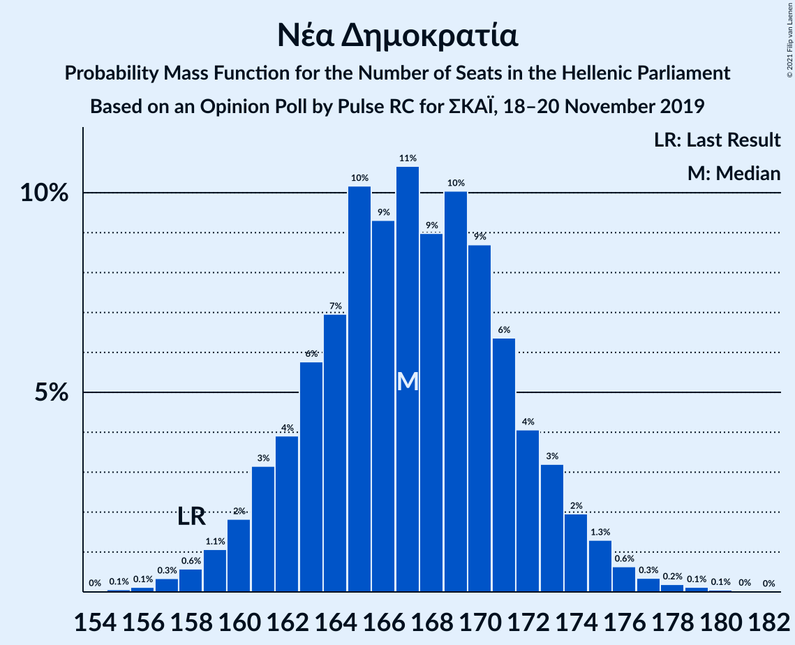
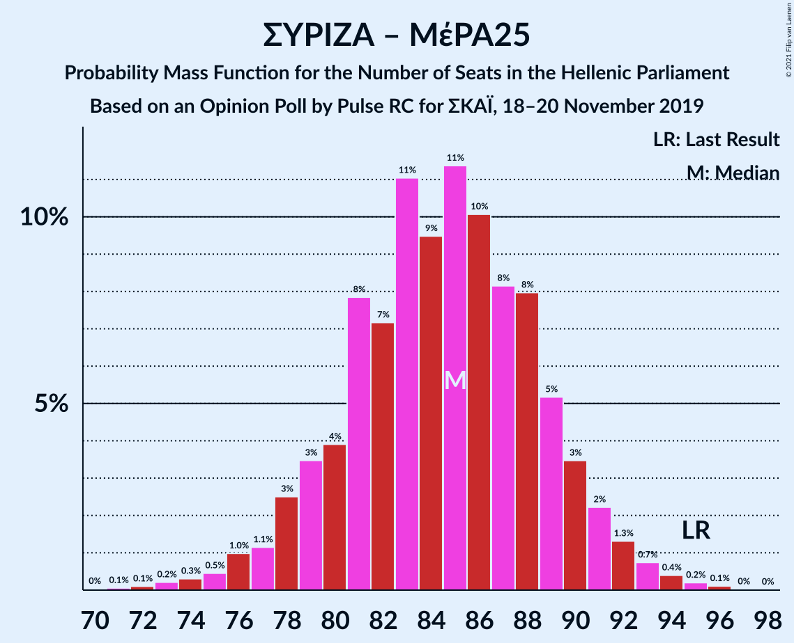

# Opinion Poll by Pulse RC for ΣΚΑΪ, 18–20 November 2019

<a href="#voting-intentions">Voting Intentions</a> | <a href="#seats">Seats</a> | <a href="#coalitions">Coalitions</a> | <a href="#technical-information">Technical Information</a>

## Voting Intentions

### Confidence Intervals

| Party | Last Result | Poll Result | 80% Confidence Interval | 90% Confidence Interval | 95% Confidence Interval | 99% Confidence Interval |
|:-----:|:-----------:|:-----------:|:-----------------------:|:-----------------------:|:-----------------------:|:-----------------------:|
| Νέα Δημοκρατία | 39.8% | 43.7% | 41.9–45.5% |41.4–46.0% |40.9–46.5% |40.0–47.4% |
| Συνασπισμός Ριζοσπαστικής Αριστεράς | 31.5% | 27.6% | 26.0–29.3% |25.5–29.8% |25.1–30.2% |24.4–31.0% |
| Κίνημα Αλλαγής | 8.1% | 6.9% | 6.1–8.0% |5.8–8.3% |5.6–8.5% |5.2–9.0% |
| Κομμουνιστικό Κόμμα Ελλάδας | 5.3% | 6.3% | 5.5–7.3% |5.2–7.5% |5.0–7.8% |4.7–8.3% |
| Ελληνική Λύση | 3.7% | 4.6% | 3.9–5.5% |3.7–5.7% |3.6–6.0% |3.3–6.4% |
| Μέτωπο Ευρωπαϊκής Ρεαλιστικής Ανυπακοής | 3.4% | 4.0% | 3.3–4.8% |3.2–5.0% |3.0–5.2% |2.7–5.6% |
| Χρυσή Αυγή | 2.9% | 1.1% | 0.8–1.6% |0.7–1.7% |0.6–1.8% |0.5–2.1% |

*Note:* The poll result column reflects the actual value used in the calculations. Published results may vary slightly, and in addition be rounded to fewer digits.

## Seats

### Confidence Intervals

| Party | Last Result | Median | 80% Confidence Interval | 90% Confidence Interval | 95% Confidence Interval | 99% Confidence Interval |
|:-----:|:-----------:|:------:|:-----------------------:|:-----------------------:|:-----------------------:|:-----------------------:|
| <a href="#νέα-δημοκρατία">Νέα Δημοκρατία</a> | 158 | 164 | 164–165 |164–170 |164–171 |163–177 |
| <a href="#συνασπισμός-ριζοσπαστικής-αριστεράς">Συνασπισμός Ριζοσπαστικής Αριστεράς</a> | 86 | 73 | 73–74 |69–78 |66–78 |64–78 |
| <a href="#κίνημα-αλλαγής">Κίνημα Αλλαγής</a> | 22 | 18 | 15–18 |15–18 |15–19 |15–22 |
| <a href="#κομμουνιστικό-κόμμα-ελλάδας">Κομμουνιστικό Κόμμα Ελλάδας</a> | 15 | 18 | 17–18 |15–18 |15–19 |12–20 |
| <a href="#ελληνική-λύση">Ελληνική Λύση</a> | 10 | 17 | 15–17 |11–17 |10–17 |10–17 |
| <a href="#μέτωπο-ευρωπαϊκής-ρεαλιστικής-ανυπακοής">Μέτωπο Ευρωπαϊκής Ρεαλιστικής Ανυπακοής</a> | 9 | 10 | 10–12 |10–12 |10–14 |9–15 |
| <a href="#χρυσή-αυγή">Χρυσή Αυγή</a> | 0 | 0 | 0 |0 |0 |0 |

### Νέα Δημοκρατία

*For a full overview of the results for this party, see the [Νέα Δημοκρατία](party-νέαδημοκρατία.html) page.*

| Number of Seats | Probability | Accumulated | Special Marks |
|:---------------:|:-----------:|:-----------:|:-------------:|
| 158 | 0% | 100% | Last Result |
| 159 | 0% | 100% |  |
| 160 | 0% | 100% |  |
| 161 | 0% | 100% |  |
| 162 | 0% | 99.9% |  |
| 163 | 1.3% | 99.9% |  |
| 164 | 82% | 98.6% | Median |
| 165 | 8% | 17% |  |
| 166 | 0% | 8% |  |
| 167 | 2% | 8% |  |
| 168 | 0.1% | 7% |  |
| 169 | 0% | 7% |  |
| 170 | 3% | 6% |  |
| 171 | 3% | 4% |  |
| 172 | 0.1% | 0.8% |  |
| 173 | 0.2% | 0.8% |  |
| 174 | 0% | 0.6% |  |
| 175 | 0% | 0.6% |  |
| 176 | 0% | 0.6% |  |
| 177 | 0.5% | 0.6% |  |
| 178 | 0.1% | 0.1% |  |
| 179 | 0% | 0% |  |

### Συνασπισμός Ριζοσπαστικής Αριστεράς

*For a full overview of the results for this party, see the [Συνασπισμός Ριζοσπαστικής Αριστεράς](party-συνασπισμόςριζοσπαστικήςαριστεράς.html) page.*

| Number of Seats | Probability | Accumulated | Special Marks |
|:---------------:|:-----------:|:-----------:|:-------------:|
| 64 | 2% | 100% |  |
| 65 | 0% | 98% |  |
| 66 | 0.8% | 98% |  |
| 67 | 0.1% | 97% |  |
| 68 | 0% | 97% |  |
| 69 | 3% | 97% |  |
| 70 | 0% | 94% |  |
| 71 | 0.3% | 94% |  |
| 72 | 0% | 94% |  |
| 73 | 83% | 94% | Median |
| 74 | 1.4% | 10% |  |
| 75 | 0.5% | 9% |  |
| 76 | 0% | 8% |  |
| 77 | 0.1% | 8% |  |
| 78 | 8% | 8% |  |
| 79 | 0% | 0.1% |  |
| 80 | 0% | 0.1% |  |
| 81 | 0% | 0.1% |  |
| 82 | 0% | 0.1% |  |
| 83 | 0% | 0.1% |  |
| 84 | 0% | 0% |  |
| 85 | 0% | 0% |  |
| 86 | 0% | 0% | Last Result |

### Κίνημα Αλλαγής

*For a full overview of the results for this party, see the [Κίνημα Αλλαγής](party-κίνημααλλαγής.html) page.*

| Number of Seats | Probability | Accumulated | Special Marks |
|:---------------:|:-----------:|:-----------:|:-------------:|
| 15 | 10% | 100% |  |
| 16 | 0% | 90% |  |
| 17 | 0.7% | 90% |  |
| 18 | 87% | 89% | Median |
| 19 | 0.1% | 3% |  |
| 20 | 0% | 2% |  |
| 21 | 0.1% | 2% |  |
| 22 | 2% | 2% | Last Result |
| 23 | 0.2% | 0.3% |  |
| 24 | 0% | 0% |  |

### Κομμουνιστικό Κόμμα Ελλάδας

*For a full overview of the results for this party, see the [Κομμουνιστικό Κόμμα Ελλάδας](party-κομμουνιστικόκόμμαελλάδας.html) page.*

| Number of Seats | Probability | Accumulated | Special Marks |
|:---------------:|:-----------:|:-----------:|:-------------:|
| 12 | 0.5% | 100% |  |
| 13 | 0.1% | 99.5% |  |
| 14 | 0% | 99.4% |  |
| 15 | 7% | 99.4% | Last Result |
| 16 | 1.3% | 92% |  |
| 17 | 3% | 91% |  |
| 18 | 85% | 88% | Median |
| 19 | 1.0% | 3% |  |
| 20 | 2% | 2% |  |
| 21 | 0% | 0.1% |  |
| 22 | 0% | 0% |  |

### Ελληνική Λύση

*For a full overview of the results for this party, see the [Ελληνική Λύση](party-ελληνικήλύση.html) page.*

| Number of Seats | Probability | Accumulated | Special Marks |
|:---------------:|:-----------:|:-----------:|:-------------:|
| 10 | 3% | 100% | Last Result |
| 11 | 2% | 97% |  |
| 12 | 0% | 94% |  |
| 13 | 0.1% | 94% |  |
| 14 | 1.0% | 94% |  |
| 15 | 7% | 93% |  |
| 16 | 3% | 86% |  |
| 17 | 83% | 83% | Median |
| 18 | 0% | 0.1% |  |
| 19 | 0% | 0% |  |

### Μέτωπο Ευρωπαϊκής Ρεαλιστικής Ανυπακοής

*For a full overview of the results for this party, see the [Μέτωπο Ευρωπαϊκής Ρεαλιστικής Ανυπακοής](party-μέτωποευρωπαϊκήςρεαλιστικήςανυπακοής.html) page.*

| Number of Seats | Probability | Accumulated | Special Marks |
|:---------------:|:-----------:|:-----------:|:-------------:|
| 0 | 0.2% | 100% |  |
| 1 | 0% | 99.8% |  |
| 2 | 0% | 99.8% |  |
| 3 | 0% | 99.8% |  |
| 4 | 0% | 99.8% |  |
| 5 | 0% | 99.8% |  |
| 6 | 0% | 99.8% |  |
| 7 | 0% | 99.8% |  |
| 8 | 0% | 99.8% |  |
| 9 | 2% | 99.8% | Last Result |
| 10 | 82% | 98% | Median |
| 11 | 0% | 16% |  |
| 12 | 12% | 16% |  |
| 13 | 0.8% | 4% |  |
| 14 | 1.0% | 3% |  |
| 15 | 2% | 2% |  |
| 16 | 0% | 0% |  |

### Χρυσή Αυγή

*For a full overview of the results for this party, see the [Χρυσή Αυγή](party-χρυσήαυγή.html) page.*

| Number of Seats | Probability | Accumulated | Special Marks |
|:---------------:|:-----------:|:-----------:|:-------------:|
| 0 | 100% | 100% | Last Result, Median |

## Coalitions

### Confidence Intervals

| Coalition | Last Result | Median | Majority? | 80% Confidence Interval | 90% Confidence Interval | 95% Confidence Interval | 99% Confidence Interval |
|:---------:|:-----------:|:------:|:---------:|:-----------------------:|:-----------------------:|:-----------------------:|:-----------------------:|
| Νέα Δημοκρατία – Κίνημα Αλλαγής | 180 | 182 | 100% | 182 | 180–188 | 180–193 | 178–194 |
| Νέα Δημοκρατία | 158 | 164 | 100% | 164–165 | 164–170 | 164–171 | 163–177 |
| Συνασπισμός Ριζοσπαστικής Αριστεράς – Μέτωπο Ευρωπαϊκής Ρεαλιστικής Ανυπακοής | 95 | 83 | 0% | 83–85 | 83–90 | 79–90 | 76–90 |
| Συνασπισμός Ριζοσπαστικής Αριστεράς | 86 | 73 | 0% | 73–74 | 69–78 | 66–78 | 64–78 |

### Νέα Δημοκρατία – Κίνημα Αλλαγής

| Number of Seats | Probability | Accumulated | Special Marks |
|:---------------:|:-----------:|:-----------:|:-------------:|
| 178 | 1.3% | 100% |  |
| 179 | 0% | 98.7% |  |
| 180 | 7% | 98.7% | Last Result |
| 181 | 0% | 92% |  |
| 182 | 83% | 92% | Median |
| 183 | 1.4% | 8% |  |
| 184 | 0% | 7% |  |
| 185 | 0% | 7% |  |
| 186 | 0.1% | 7% |  |
| 187 | 0.2% | 7% |  |
| 188 | 3% | 7% |  |
| 189 | 1.0% | 4% |  |
| 190 | 0.2% | 3% |  |
| 191 | 0% | 3% |  |
| 192 | 0% | 3% |  |
| 193 | 2% | 3% |  |
| 194 | 0.5% | 0.6% |  |
| 195 | 0% | 0.1% |  |
| 196 | 0% | 0.1% |  |
| 197 | 0% | 0.1% |  |
| 198 | 0% | 0.1% |  |
| 199 | 0.1% | 0.1% |  |
| 200 | 0% | 0% |  |

### Νέα Δημοκρατία

| Number of Seats | Probability | Accumulated | Special Marks |
|:---------------:|:-----------:|:-----------:|:-------------:|
| 158 | 0% | 100% | Last Result |
| 159 | 0% | 100% |  |
| 160 | 0% | 100% |  |
| 161 | 0% | 100% |  |
| 162 | 0% | 99.9% |  |
| 163 | 1.3% | 99.9% |  |
| 164 | 82% | 98.6% | Median |
| 165 | 8% | 17% |  |
| 166 | 0% | 8% |  |
| 167 | 2% | 8% |  |
| 168 | 0.1% | 7% |  |
| 169 | 0% | 7% |  |
| 170 | 3% | 6% |  |
| 171 | 3% | 4% |  |
| 172 | 0.1% | 0.8% |  |
| 173 | 0.2% | 0.8% |  |
| 174 | 0% | 0.6% |  |
| 175 | 0% | 0.6% |  |
| 176 | 0% | 0.6% |  |
| 177 | 0.5% | 0.6% |  |
| 178 | 0.1% | 0.1% |  |
| 179 | 0% | 0% |  |

### Συνασπισμός Ριζοσπαστικής Αριστεράς – Μέτωπο Ευρωπαϊκής Ρεαλιστικής Ανυπακοής

| Number of Seats | Probability | Accumulated | Special Marks |
|:---------------:|:-----------:|:-----------:|:-------------:|
| 75 | 0% | 100% |  |
| 76 | 2% | 99.9% |  |
| 77 | 0.1% | 98% |  |
| 78 | 0% | 98% |  |
| 79 | 1.0% | 98% |  |
| 80 | 0.2% | 97% |  |
| 81 | 0% | 97% |  |
| 82 | 0% | 97% |  |
| 83 | 84% | 97% | Median |
| 84 | 2% | 13% |  |
| 85 | 2% | 10% |  |
| 86 | 0% | 8% |  |
| 87 | 0% | 8% |  |
| 88 | 0% | 8% |  |
| 89 | 0% | 8% |  |
| 90 | 8% | 8% |  |
| 91 | 0% | 0.1% |  |
| 92 | 0% | 0% |  |
| 93 | 0% | 0% |  |
| 94 | 0% | 0% |  |
| 95 | 0% | 0% | Last Result |

### Συνασπισμός Ριζοσπαστικής Αριστεράς

| Number of Seats | Probability | Accumulated | Special Marks |
|:---------------:|:-----------:|:-----------:|:-------------:|
| 64 | 2% | 100% |  |
| 65 | 0% | 98% |  |
| 66 | 0.8% | 98% |  |
| 67 | 0.1% | 97% |  |
| 68 | 0% | 97% |  |
| 69 | 3% | 97% |  |
| 70 | 0% | 94% |  |
| 71 | 0.3% | 94% |  |
| 72 | 0% | 94% |  |
| 73 | 83% | 94% | Median |
| 74 | 1.4% | 10% |  |
| 75 | 0.5% | 9% |  |
| 76 | 0% | 8% |  |
| 77 | 0.1% | 8% |  |
| 78 | 8% | 8% |  |
| 79 | 0% | 0.1% |  |
| 80 | 0% | 0.1% |  |
| 81 | 0% | 0.1% |  |
| 82 | 0% | 0.1% |  |
| 83 | 0% | 0.1% |  |
| 84 | 0% | 0% |  |
| 85 | 0% | 0% |  |
| 86 | 0% | 0% | Last Result |

## Technical Information

### Opinion Poll

+ **Polling firm:** Pulse RC
+ **Commissioner(s):** ΣΚΑΪ
+ **Fieldwork period:** 18–20 November 2019

### Calculations

+ **Sample size:** 1211
+ **Simulations done:** 1,024
+ **Error estimate:** 1.48%

