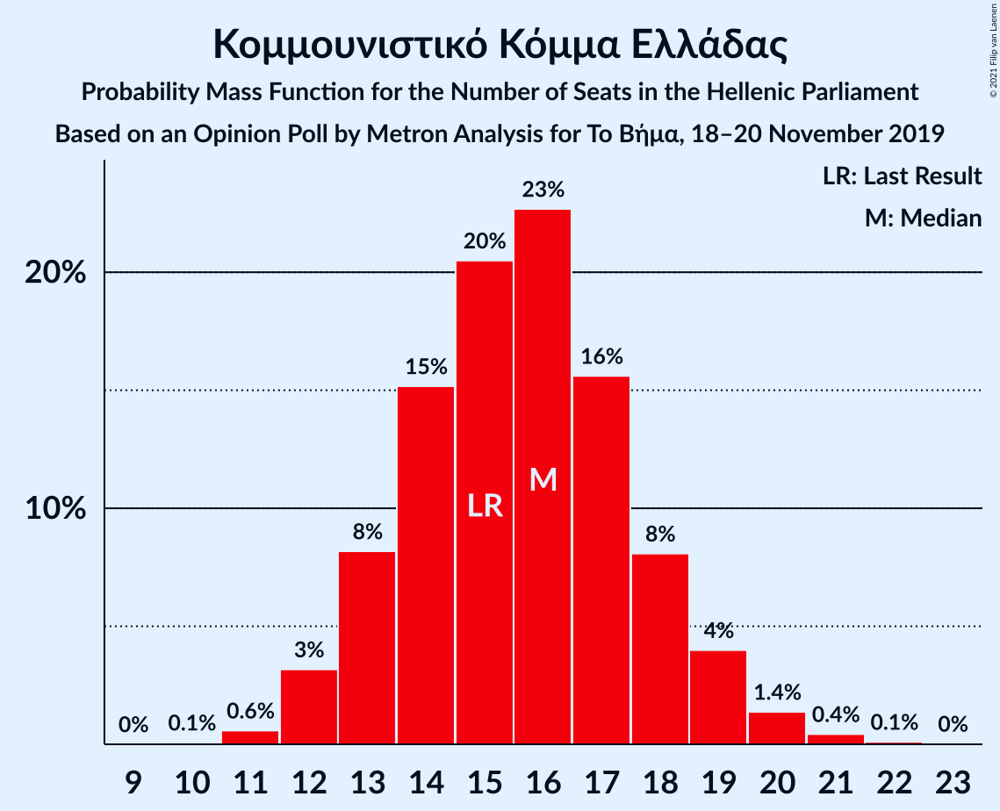
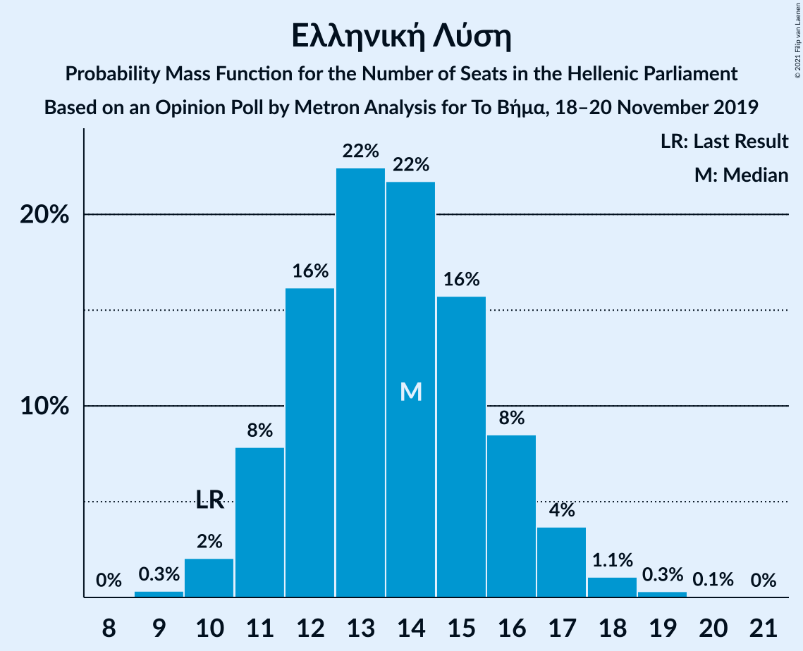
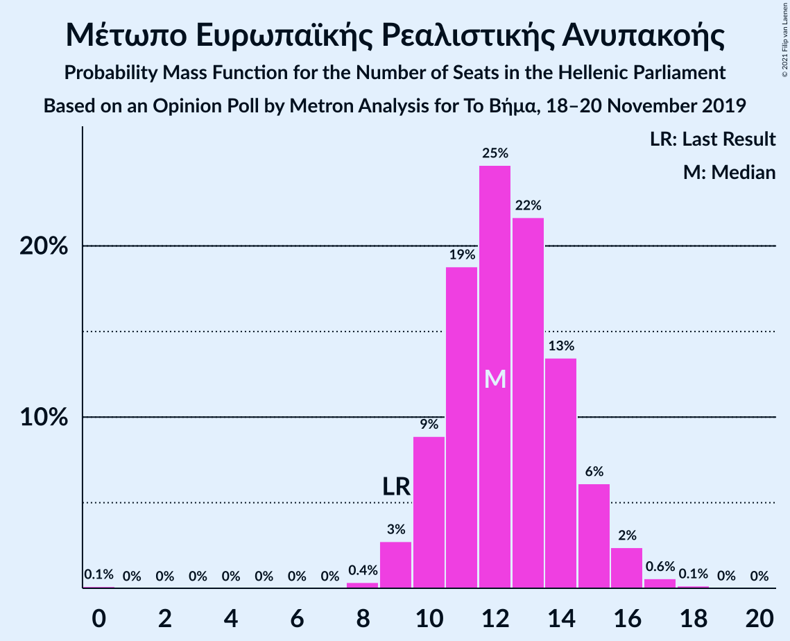
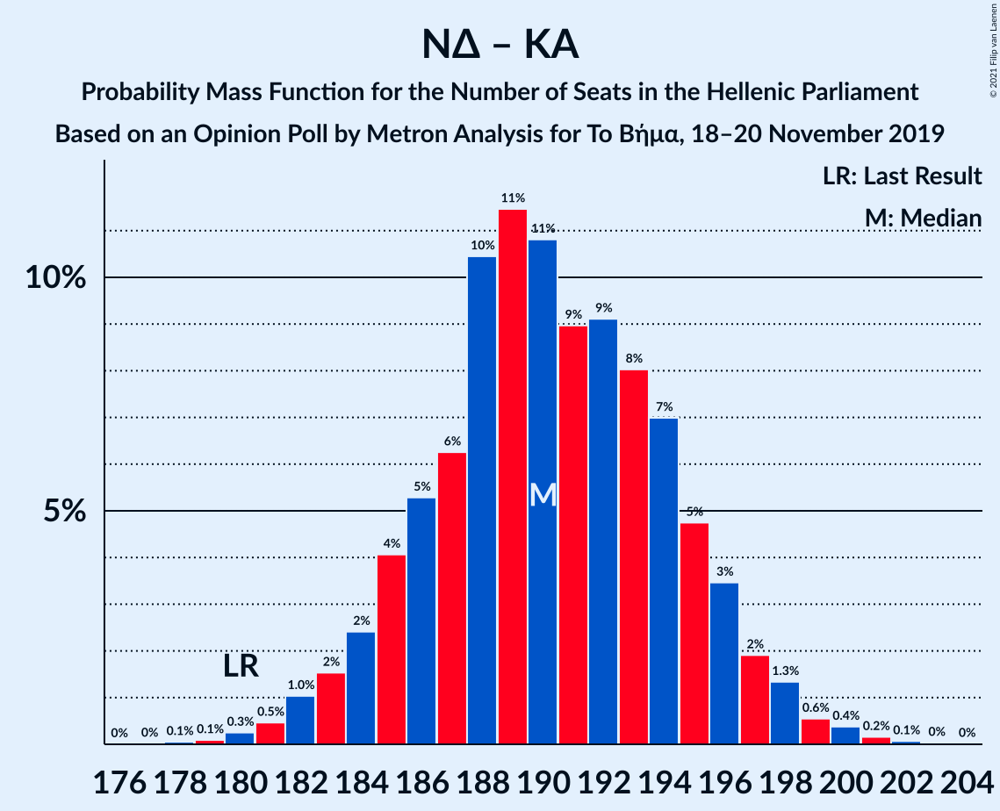
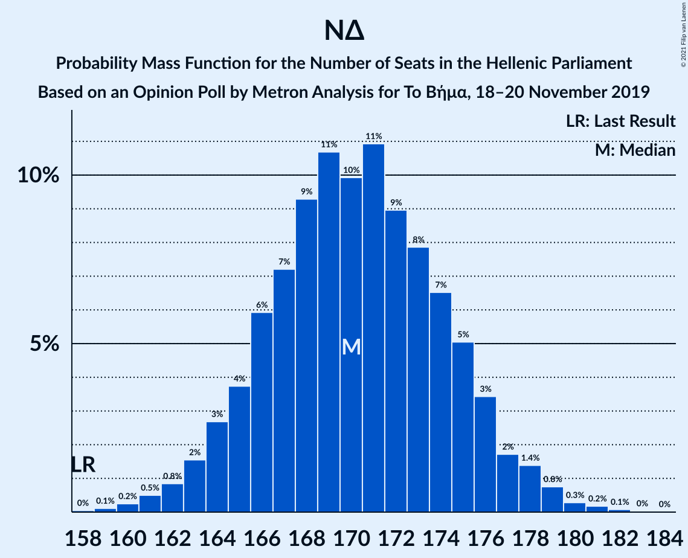
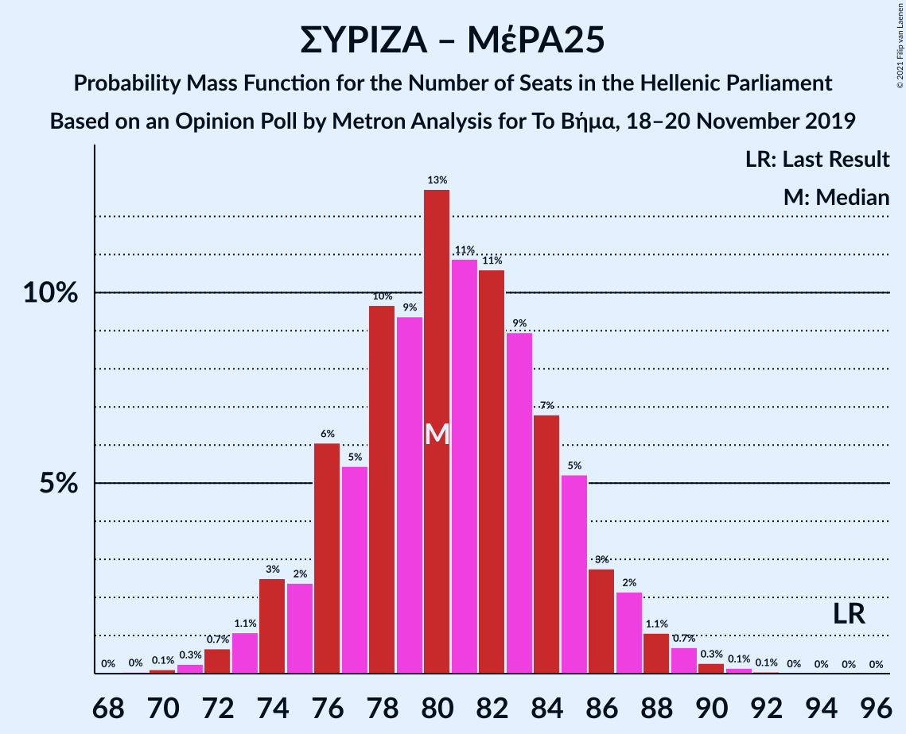
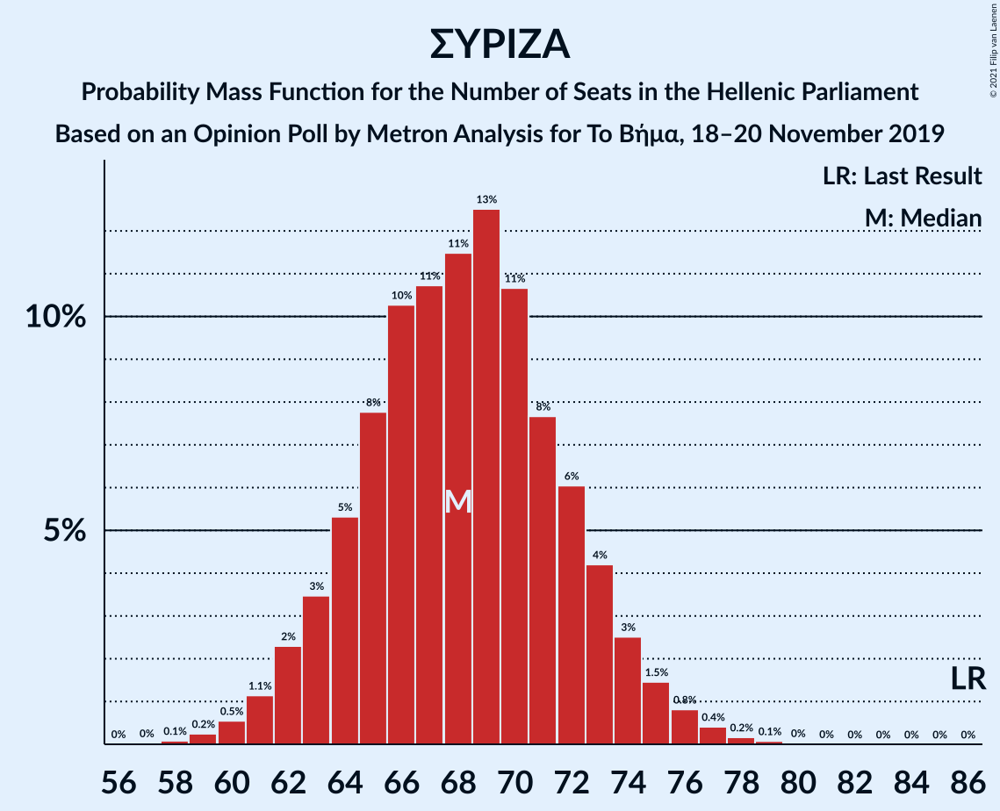

# Opinion Poll by Μetron Analysis for Το Βήμα, 18–20 November 2019

<a href="#voting-intentions">Voting Intentions</a> | <a href="#seats">Seats</a> | <a href="#coalitions">Coalitions</a> | <a href="#technical-information">Technical Information</a>

## Voting Intentions

### Confidence Intervals

| Party | Last Result | Poll Result | 80% Confidence Interval | 90% Confidence Interval | 95% Confidence Interval | 99% Confidence Interval |
|:-----:|:-----------:|:-----------:|:-----------------------:|:-----------------------:|:-----------------------:|:-----------------------:|
| Νέα Δημοκρατία | 39.8% | 45.4% | 43.5–47.2% |43.0–47.8% |42.6–48.2% |41.7–49.1% |
| Συνασπισμός Ριζοσπαστικής Αριστεράς | 31.5% | 25.7% | 24.1–27.4% |23.7–27.8% |23.3–28.2% |22.6–29.1% |
| Κίνημα Αλλαγής | 8.1% | 7.5% | 6.6–8.6% |6.3–8.9% |6.1–9.1% |5.7–9.6% |
| Κομμουνιστικό Κόμμα Ελλάδας | 5.3% | 5.8% | 5.0–6.8% |4.8–7.1% |4.6–7.3% |4.3–7.8% |
| Ελληνική Λύση | 3.7% | 5.1% | 4.3–6.0% |4.1–6.2% |4.0–6.5% |3.6–6.9% |
| Μέτωπο Ευρωπαϊκής Ρεαλιστικής Ανυπακοής | 3.4% | 4.6% | 3.9–5.4% |3.7–5.7% |3.5–5.9% |3.2–6.4% |
| Χρυσή Αυγή | 2.9% | 1.7% | 1.3–2.2% |1.2–2.4% |1.1–2.6% |0.9–2.9% |

*Note:* The poll result column reflects the actual value used in the calculations. Published results may vary slightly, and in addition be rounded to fewer digits.

## Seats

### Confidence Intervals

| Party | Last Result | Median | 80% Confidence Interval | 90% Confidence Interval | 95% Confidence Interval | 99% Confidence Interval |
|:-----:|:-----------:|:------:|:-----------------------:|:-----------------------:|:-----------------------:|:-----------------------:|
| <a href="#νέα-δημοκρατία">Νέα Δημοκρατία</a> | 158 | 166 | 165–166 |165–166 |165–177 |162–177 |
| <a href="#συνασπισμός-ριζοσπαστικής-αριστεράς">Συνασπισμός Ριζοσπαστικής Αριστεράς</a> | 86 | 69 | 69–75 |69–75 |60–77 |60–77 |
| <a href="#κίνημα-αλλαγής">Κίνημα Αλλαγής</a> | 22 | 19 | 18–19 |18–20 |18–20 |18–25 |
| <a href="#κομμουνιστικό-κόμμα-ελλάδας">Κομμουνιστικό Κόμμα Ελλάδας</a> | 15 | 19 | 16–19 |12–19 |12–19 |11–19 |
| <a href="#ελληνική-λύση">Ελληνική Λύση</a> | 10 | 14 | 11–14 |11–14 |11–15 |11–16 |
| <a href="#μέτωπο-ευρωπαϊκής-ρεαλιστικής-ανυπακοής">Μέτωπο Ευρωπαϊκής Ρεαλιστικής Ανυπακοής</a> | 9 | 13 | 13–15 |13–15 |12–15 |9–16 |
| <a href="#χρυσή-αυγή">Χρυσή Αυγή</a> | 0 | 0 | 0 |0 |0 |0 |

### Νέα Δημοκρατία

*For a full overview of the results for this party, see the [Νέα Δημοκρατία](party-νέαδημοκρατία.html) page.*

| Number of Seats | Probability | Accumulated | Special Marks |
|:---------------:|:-----------:|:-----------:|:-------------:|
| 158 | 0% | 100% | Last Result |
| 159 | 0.1% | 100% |  |
| 160 | 0.1% | 99.8% |  |
| 161 | 0.2% | 99.7% |  |
| 162 | 0.2% | 99.6% |  |
| 163 | 0% | 99.4% |  |
| 164 | 0.3% | 99.4% |  |
| 165 | 24% | 99.1% |  |
| 166 | 71% | 75% | Median |
| 167 | 0.1% | 4% |  |
| 168 | 0.2% | 4% |  |
| 169 | 0.2% | 4% |  |
| 170 | 0% | 4% |  |
| 171 | 0.7% | 4% |  |
| 172 | 0% | 3% |  |
| 173 | 0% | 3% |  |
| 174 | 0.1% | 3% |  |
| 175 | 0% | 3% |  |
| 176 | 0% | 3% |  |
| 177 | 3% | 3% |  |
| 178 | 0% | 0.2% |  |
| 179 | 0% | 0.2% |  |
| 180 | 0% | 0.2% |  |
| 181 | 0% | 0.2% |  |
| 182 | 0.1% | 0.2% |  |
| 183 | 0% | 0.1% |  |
| 184 | 0% | 0.1% |  |
| 185 | 0% | 0.1% |  |
| 186 | 0.1% | 0.1% |  |
| 187 | 0% | 0% |  |

### Συνασπισμός Ριζοσπαστικής Αριστεράς

*For a full overview of the results for this party, see the [Συνασπισμός Ριζοσπαστικής Αριστεράς](party-συνασπισμόςριζοσπαστικήςαριστεράς.html) page.*

| Number of Seats | Probability | Accumulated | Special Marks |
|:---------------:|:-----------:|:-----------:|:-------------:|
| 59 | 0.1% | 100% |  |
| 60 | 3% | 99.9% |  |
| 61 | 0% | 97% |  |
| 62 | 0.1% | 97% |  |
| 63 | 0% | 97% |  |
| 64 | 0% | 97% |  |
| 65 | 0% | 97% |  |
| 66 | 0% | 97% |  |
| 67 | 0.4% | 97% |  |
| 68 | 0.2% | 97% |  |
| 69 | 71% | 96% | Median |
| 70 | 0% | 25% |  |
| 71 | 0.1% | 25% |  |
| 72 | 0.1% | 25% |  |
| 73 | 0.1% | 25% |  |
| 74 | 0.3% | 25% |  |
| 75 | 20% | 25% |  |
| 76 | 0.2% | 5% |  |
| 77 | 4% | 4% |  |
| 78 | 0% | 0.1% |  |
| 79 | 0% | 0% |  |
| 80 | 0% | 0% |  |
| 81 | 0% | 0% |  |
| 82 | 0% | 0% |  |
| 83 | 0% | 0% |  |
| 84 | 0% | 0% |  |
| 85 | 0% | 0% |  |
| 86 | 0% | 0% | Last Result |

### Κίνημα Αλλαγής

*For a full overview of the results for this party, see the [Κίνημα Αλλαγής](party-κίνημααλλαγής.html) page.*

| Number of Seats | Probability | Accumulated | Special Marks |
|:---------------:|:-----------:|:-----------:|:-------------:|
| 16 | 0.2% | 100% |  |
| 17 | 0.1% | 99.8% |  |
| 18 | 20% | 99.7% |  |
| 19 | 71% | 80% | Median |
| 20 | 7% | 9% |  |
| 21 | 0.8% | 2% |  |
| 22 | 0.6% | 1.2% | Last Result |
| 23 | 0% | 0.6% |  |
| 24 | 0% | 0.6% |  |
| 25 | 0.1% | 0.6% |  |
| 26 | 0.2% | 0.5% |  |
| 27 | 0% | 0.2% |  |
| 28 | 0.2% | 0.2% |  |
| 29 | 0% | 0% |  |

### Κομμουνιστικό Κόμμα Ελλάδας

*For a full overview of the results for this party, see the [Κομμουνιστικό Κόμμα Ελλάδας](party-κομμουνιστικόκόμμαελλάδας.html) page.*

| Number of Seats | Probability | Accumulated | Special Marks |
|:---------------:|:-----------:|:-----------:|:-------------:|
| 11 | 0.9% | 100% |  |
| 12 | 5% | 99.1% |  |
| 13 | 0.5% | 95% |  |
| 14 | 0.2% | 94% |  |
| 15 | 0.2% | 94% | Last Result |
| 16 | 23% | 94% |  |
| 17 | 0% | 71% |  |
| 18 | 0.2% | 71% |  |
| 19 | 71% | 71% | Median |
| 20 | 0.2% | 0.2% |  |
| 21 | 0% | 0% |  |

### Ελληνική Λύση

*For a full overview of the results for this party, see the [Ελληνική Λύση](party-ελληνικήλύση.html) page.*

| Number of Seats | Probability | Accumulated | Special Marks |
|:---------------:|:-----------:|:-----------:|:-------------:|
| 9 | 0.1% | 100% |  |
| 10 | 0% | 99.9% | Last Result |
| 11 | 20% | 99.9% |  |
| 12 | 0.4% | 80% |  |
| 13 | 5% | 80% |  |
| 14 | 71% | 75% | Median |
| 15 | 3% | 4% |  |
| 16 | 0.5% | 0.7% |  |
| 17 | 0% | 0.2% |  |
| 18 | 0% | 0.2% |  |
| 19 | 0% | 0.2% |  |
| 20 | 0.2% | 0.2% |  |
| 21 | 0% | 0% |  |

### Μέτωπο Ευρωπαϊκής Ρεαλιστικής Ανυπακοής

*For a full overview of the results for this party, see the [Μέτωπο Ευρωπαϊκής Ρεαλιστικής Ανυπακοής](party-μέτωποευρωπαϊκήςρεαλιστικήςανυπακοής.html) page.*

| Number of Seats | Probability | Accumulated | Special Marks |
|:---------------:|:-----------:|:-----------:|:-------------:|
| 9 | 1.0% | 100% | Last Result |
| 10 | 0.3% | 99.0% |  |
| 11 | 0.1% | 98.7% |  |
| 12 | 3% | 98.6% |  |
| 13 | 75% | 96% | Median |
| 14 | 0.1% | 20% |  |
| 15 | 20% | 20% |  |
| 16 | 0.2% | 0.7% |  |
| 17 | 0.5% | 0.5% |  |
| 18 | 0% | 0% |  |

### Χρυσή Αυγή

*For a full overview of the results for this party, see the [Χρυσή Αυγή](party-χρυσήαυγή.html) page.*

| Number of Seats | Probability | Accumulated | Special Marks |
|:---------------:|:-----------:|:-----------:|:-------------:|
| 0 | 99.9% | 100% | Last Result, Median |
| 1 | 0% | 0.1% |  |
| 2 | 0% | 0.1% |  |
| 3 | 0% | 0.1% |  |
| 4 | 0% | 0.1% |  |
| 5 | 0% | 0.1% |  |
| 6 | 0% | 0.1% |  |
| 7 | 0% | 0.1% |  |
| 8 | 0% | 0.1% |  |
| 9 | 0% | 0% |  |

## Coalitions

### Confidence Intervals

| Coalition | Last Result | Median | Majority? | 80% Confidence Interval | 90% Confidence Interval | 95% Confidence Interval | 99% Confidence Interval |
|:---------:|:-----------:|:------:|:---------:|:-----------------------:|:-----------------------:|:-----------------------:|:-----------------------:|
| Νέα Δημοκρατία – Κίνημα Αλλαγής | 180 | 185 | 100% | 183–185 | 183–185 | 183–197 | 183–197 |
| Νέα Δημοκρατία | 158 | 166 | 100% | 165–166 | 165–166 | 165–177 | 162–177 |
| Συνασπισμός Ριζοσπαστικής Αριστεράς – Μέτωπο Ευρωπαϊκής Ρεαλιστικής Ανυπακοής | 95 | 82 | 0% | 82–90 | 82–90 | 72–90 | 72–90 |
| Συνασπισμός Ριζοσπαστικής Αριστεράς | 86 | 69 | 0% | 69–75 | 69–75 | 60–77 | 60–77 |

### Νέα Δημοκρατία – Κίνημα Αλλαγής

| Number of Seats | Probability | Accumulated | Special Marks |
|:---------------:|:-----------:|:-----------:|:-------------:|
| 179 | 0.1% | 100% |  |
| 180 | 0% | 99.9% | Last Result |
| 181 | 0% | 99.9% |  |
| 182 | 0.2% | 99.9% |  |
| 183 | 20% | 99.7% |  |
| 184 | 0.3% | 80% |  |
| 185 | 75% | 80% | Median |
| 186 | 0.1% | 5% |  |
| 187 | 0.5% | 5% |  |
| 188 | 0% | 4% |  |
| 189 | 0% | 4% |  |
| 190 | 0.3% | 4% |  |
| 191 | 0.3% | 4% |  |
| 192 | 0.7% | 4% |  |
| 193 | 0% | 3% |  |
| 194 | 0% | 3% |  |
| 195 | 0% | 3% |  |
| 196 | 0% | 3% |  |
| 197 | 3% | 3% |  |
| 198 | 0% | 0.2% |  |
| 199 | 0% | 0.2% |  |
| 200 | 0.1% | 0.2% |  |
| 201 | 0% | 0.1% |  |
| 202 | 0% | 0.1% |  |
| 203 | 0% | 0.1% |  |
| 204 | 0% | 0.1% |  |
| 205 | 0% | 0.1% |  |
| 206 | 0.1% | 0.1% |  |
| 207 | 0% | 0% |  |

### Νέα Δημοκρατία

| Number of Seats | Probability | Accumulated | Special Marks |
|:---------------:|:-----------:|:-----------:|:-------------:|
| 158 | 0% | 100% | Last Result |
| 159 | 0.1% | 100% |  |
| 160 | 0.1% | 99.8% |  |
| 161 | 0.2% | 99.7% |  |
| 162 | 0.2% | 99.6% |  |
| 163 | 0% | 99.4% |  |
| 164 | 0.3% | 99.4% |  |
| 165 | 24% | 99.1% |  |
| 166 | 71% | 75% | Median |
| 167 | 0.1% | 4% |  |
| 168 | 0.2% | 4% |  |
| 169 | 0.2% | 4% |  |
| 170 | 0% | 4% |  |
| 171 | 0.7% | 4% |  |
| 172 | 0% | 3% |  |
| 173 | 0% | 3% |  |
| 174 | 0.1% | 3% |  |
| 175 | 0% | 3% |  |
| 176 | 0% | 3% |  |
| 177 | 3% | 3% |  |
| 178 | 0% | 0.2% |  |
| 179 | 0% | 0.2% |  |
| 180 | 0% | 0.2% |  |
| 181 | 0% | 0.2% |  |
| 182 | 0.1% | 0.2% |  |
| 183 | 0% | 0.1% |  |
| 184 | 0% | 0.1% |  |
| 185 | 0% | 0.1% |  |
| 186 | 0.1% | 0.1% |  |
| 187 | 0% | 0% |  |

### Συνασπισμός Ριζοσπαστικής Αριστεράς – Μέτωπο Ευρωπαϊκής Ρεαλιστικής Ανυπακοής

| Number of Seats | Probability | Accumulated | Special Marks |
|:---------------:|:-----------:|:-----------:|:-------------:|
| 70 | 0.1% | 100% |  |
| 71 | 0% | 99.9% |  |
| 72 | 3% | 99.9% |  |
| 73 | 0% | 97% |  |
| 74 | 0% | 97% |  |
| 75 | 0% | 97% |  |
| 76 | 0% | 97% |  |
| 77 | 0.1% | 97% |  |
| 78 | 0% | 97% |  |
| 79 | 0% | 97% |  |
| 80 | 0.1% | 97% |  |
| 81 | 0.1% | 97% |  |
| 82 | 71% | 97% | Median |
| 83 | 0.2% | 26% |  |
| 84 | 1.0% | 25% |  |
| 85 | 0.2% | 24% |  |
| 86 | 0.2% | 24% |  |
| 87 | 0.1% | 24% |  |
| 88 | 0.1% | 24% |  |
| 89 | 0% | 24% |  |
| 90 | 24% | 24% |  |
| 91 | 0% | 0% |  |
| 92 | 0% | 0% |  |
| 93 | 0% | 0% |  |
| 94 | 0% | 0% |  |
| 95 | 0% | 0% | Last Result |

### Συνασπισμός Ριζοσπαστικής Αριστεράς

| Number of Seats | Probability | Accumulated | Special Marks |
|:---------------:|:-----------:|:-----------:|:-------------:|
| 59 | 0.1% | 100% |  |
| 60 | 3% | 99.9% |  |
| 61 | 0% | 97% |  |
| 62 | 0.1% | 97% |  |
| 63 | 0% | 97% |  |
| 64 | 0% | 97% |  |
| 65 | 0% | 97% |  |
| 66 | 0% | 97% |  |
| 67 | 0.4% | 97% |  |
| 68 | 0.2% | 97% |  |
| 69 | 71% | 96% | Median |
| 70 | 0% | 25% |  |
| 71 | 0.1% | 25% |  |
| 72 | 0.1% | 25% |  |
| 73 | 0.1% | 25% |  |
| 74 | 0.3% | 25% |  |
| 75 | 20% | 25% |  |
| 76 | 0.2% | 5% |  |
| 77 | 4% | 4% |  |
| 78 | 0% | 0.1% |  |
| 79 | 0% | 0% |  |
| 80 | 0% | 0% |  |
| 81 | 0% | 0% |  |
| 82 | 0% | 0% |  |
| 83 | 0% | 0% |  |
| 84 | 0% | 0% |  |
| 85 | 0% | 0% |  |
| 86 | 0% | 0% | Last Result |

## Technical Information

### Opinion Poll

+ **Polling firm:** Μetron Analysis
+ **Commissioner(s):** Το Βήμα
+ **Fieldwork period:** 18–20 November 2019

### Calculations

+ **Sample size:** 1203
+ **Simulations done:** 1,024
+ **Error estimate:** 3.51%

