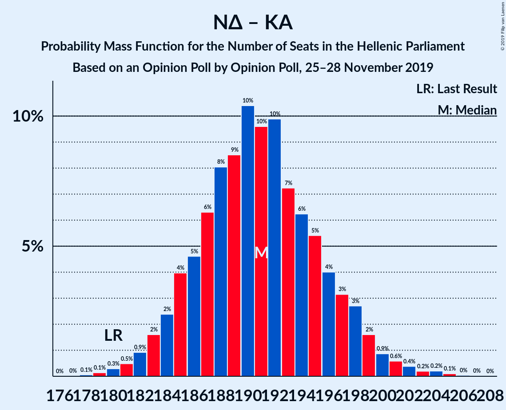
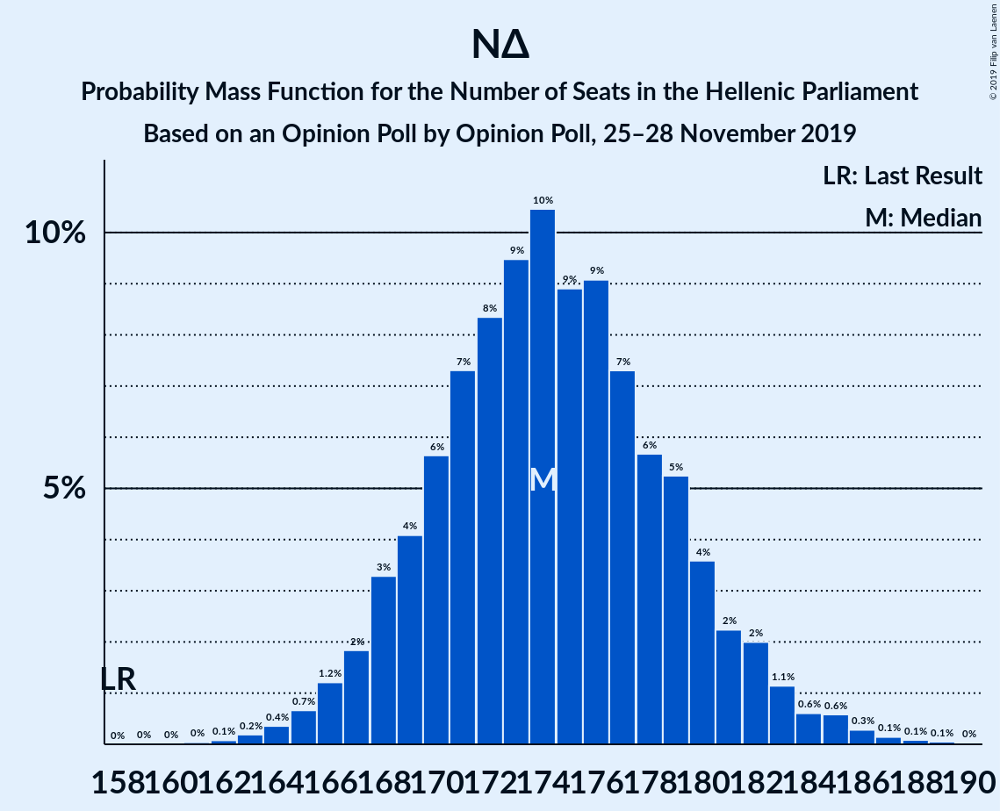

# Opinion Poll by Opinion Poll, 25–28 November 2019

<a href="#voting-intentions">Voting Intentions</a> | <a href="#seats">Seats</a> | <a href="#coalitions">Coalitions</a> | <a href="#technical-information">Technical Information</a>

## Voting Intentions

### Confidence Intervals

| Party | Last Result | Poll Result | 80% Confidence Interval | 90% Confidence Interval | 95% Confidence Interval | 99% Confidence Interval |
|:-----:|:-----------:|:-----------:|:-----------------------:|:-----------------------:|:-----------------------:|:-----------------------:|
| Νέα Δημοκρατία | 39.8% | 49.0% | 47.0–50.9% |46.4–51.5% |46.0–52.0% |45.0–52.9% |
| Συνασπισμός Ριζοσπαστικής Αριστεράς | 31.5% | 27.8% | 26.1–29.6% |25.6–30.1% |25.2–30.6% |24.4–31.5% |
| Κίνημα Αλλαγής | 8.1% | 6.4% | 5.5–7.5% |5.3–7.8% |5.1–8.1% |4.7–8.6% |
| Κομμουνιστικό Κόμμα Ελλάδας | 5.3% | 6.2% | 5.4–7.3% |5.1–7.6% |4.9–7.9% |4.5–8.4% |
| Ελληνική Λύση | 3.7% | 5.4% | 4.6–6.4% |4.4–6.7% |4.2–6.9% |3.8–7.4% |
| Μέτωπο Ευρωπαϊκής Ρεαλιστικής Ανυπακοής | 3.4% | 3.6% | 3.0–4.5% |2.8–4.7% |2.6–4.9% |2.3–5.3% |

*Note:* The poll result column reflects the actual value used in the calculations. Published results may vary slightly, and in addition be rounded to fewer digits.

## Seats

### Confidence Intervals

| Party | Last Result | Median | 80% Confidence Interval | 90% Confidence Interval | 95% Confidence Interval | 99% Confidence Interval |
|:-----:|:-----------:|:------:|:-----------------------:|:-----------------------:|:-----------------------:|:-----------------------:|
| <a href="#νέα-δημοκρατία">Νέα Δημοκρατία</a> | 158 | 174 | 169–180 |168–181 |166–183 |164–186 |
| <a href="#συνασπισμός-ριζοσπαστικής-αριστεράς">Συνασπισμός Ριζοσπαστικής Αριστεράς</a> | 86 | 71 | 66–75 |65–77 |64–78 |62–80 |
| <a href="#κίνημα-αλλαγής">Κίνημα Αλλαγής</a> | 22 | 16 | 14–19 |14–20 |13–21 |12–22 |
| <a href="#κομμουνιστικό-κόμμα-ελλάδας">Κομμουνιστικό Κόμμα Ελλάδας</a> | 15 | 16 | 14–19 |13–19 |12–20 |12–21 |
| <a href="#ελληνική-λύση">Ελληνική Λύση</a> | 10 | 14 | 12–16 |11–17 |11–18 |10–19 |
| <a href="#μέτωπο-ευρωπαϊκής-ρεαλιστικής-ανυπακοής">Μέτωπο Ευρωπαϊκής Ρεαλιστικής Ανυπακοής</a> | 9 | 9 | 0–11 |0–12 |0–12 |0–13 |

### Νέα Δημοκρατία

*For a full overview of the results for this party, see the [Νέα Δημοκρατία](party-νέαδημοκρατία.html) page.*

| Number of Seats | Probability | Accumulated | Special Marks |
|:---------------:|:-----------:|:-----------:|:-------------:|
| 158 | 0% | 100% | Last Result |
| 159 | 0% | 100% |  |
| 160 | 0% | 100% |  |
| 161 | 0% | 100% |  |
| 162 | 0.1% | 99.9% |  |
| 163 | 0.2% | 99.9% |  |
| 164 | 0.4% | 99.7% |  |
| 165 | 0.6% | 99.3% |  |
| 166 | 1.2% | 98.7% |  |
| 167 | 2% | 97% |  |
| 168 | 3% | 96% |  |
| 169 | 4% | 92% |  |
| 170 | 6% | 89% |  |
| 171 | 8% | 83% |  |
| 172 | 8% | 75% |  |
| 173 | 10% | 67% |  |
| 174 | 11% | 57% | Median |
| 175 | 9% | 46% |  |
| 176 | 8% | 37% |  |
| 177 | 8% | 29% |  |
| 178 | 6% | 21% |  |
| 179 | 5% | 15% |  |
| 180 | 4% | 10% |  |
| 181 | 2% | 6% |  |
| 182 | 1.5% | 4% |  |
| 183 | 1.2% | 3% |  |
| 184 | 0.5% | 2% |  |
| 185 | 0.5% | 1.1% |  |
| 186 | 0.3% | 0.6% |  |
| 187 | 0.1% | 0.3% |  |
| 188 | 0.1% | 0.2% |  |
| 189 | 0.1% | 0.1% |  |
| 190 | 0% | 0% |  |

### Συνασπισμός Ριζοσπαστικής Αριστεράς

*For a full overview of the results for this party, see the [Συνασπισμός Ριζοσπαστικής Αριστεράς](party-συνασπισμόςριζοσπαστικήςαριστεράς.html) page.*

| Number of Seats | Probability | Accumulated | Special Marks |
|:---------------:|:-----------:|:-----------:|:-------------:|
| 59 | 0% | 100% |  |
| 60 | 0.1% | 99.9% |  |
| 61 | 0.2% | 99.8% |  |
| 62 | 0.5% | 99.6% |  |
| 63 | 1.0% | 99.1% |  |
| 64 | 2% | 98% |  |
| 65 | 3% | 96% |  |
| 66 | 5% | 93% |  |
| 67 | 6% | 88% |  |
| 68 | 9% | 82% |  |
| 69 | 9% | 73% |  |
| 70 | 12% | 63% |  |
| 71 | 12% | 52% | Median |
| 72 | 10% | 40% |  |
| 73 | 9% | 30% |  |
| 74 | 7% | 21% |  |
| 75 | 5% | 14% |  |
| 76 | 3% | 9% |  |
| 77 | 3% | 6% |  |
| 78 | 1.4% | 3% |  |
| 79 | 0.9% | 2% |  |
| 80 | 0.5% | 0.9% |  |
| 81 | 0.2% | 0.4% |  |
| 82 | 0.1% | 0.2% |  |
| 83 | 0.1% | 0.1% |  |
| 84 | 0% | 0% |  |
| 85 | 0% | 0% |  |
| 86 | 0% | 0% | Last Result |

### Κίνημα Αλλαγής

*For a full overview of the results for this party, see the [Κίνημα Αλλαγής](party-κίνημααλλαγής.html) page.*

| Number of Seats | Probability | Accumulated | Special Marks |
|:---------------:|:-----------:|:-----------:|:-------------:|
| 11 | 0.2% | 100% |  |
| 12 | 1.1% | 99.8% |  |
| 13 | 4% | 98.7% |  |
| 14 | 9% | 95% |  |
| 15 | 16% | 86% |  |
| 16 | 20% | 70% | Median |
| 17 | 21% | 50% |  |
| 18 | 14% | 29% |  |
| 19 | 8% | 15% |  |
| 20 | 4% | 7% |  |
| 21 | 2% | 3% |  |
| 22 | 0.6% | 0.8% | Last Result |
| 23 | 0.2% | 0.2% |  |
| 24 | 0% | 0.1% |  |
| 25 | 0% | 0% |  |

### Κομμουνιστικό Κόμμα Ελλάδας

*For a full overview of the results for this party, see the [Κομμουνιστικό Κόμμα Ελλάδας](party-κομμουνιστικόκόμμαελλάδας.html) page.*

| Number of Seats | Probability | Accumulated | Special Marks |
|:---------------:|:-----------:|:-----------:|:-------------:|
| 10 | 0% | 100% |  |
| 11 | 0.4% | 99.9% |  |
| 12 | 2% | 99.5% |  |
| 13 | 6% | 97% |  |
| 14 | 13% | 92% |  |
| 15 | 18% | 79% | Last Result |
| 16 | 21% | 60% | Median |
| 17 | 18% | 40% |  |
| 18 | 12% | 22% |  |
| 19 | 6% | 11% |  |
| 20 | 3% | 4% |  |
| 21 | 1.1% | 1.5% |  |
| 22 | 0.3% | 0.4% |  |
| 23 | 0.1% | 0.1% |  |
| 24 | 0% | 0% |  |

### Ελληνική Λύση

*For a full overview of the results for this party, see the [Ελληνική Λύση](party-ελληνικήλύση.html) page.*

| Number of Seats | Probability | Accumulated | Special Marks |
|:---------------:|:-----------:|:-----------:|:-------------:|
| 9 | 0.3% | 100% |  |
| 10 | 2% | 99.7% | Last Result |
| 11 | 6% | 98% |  |
| 12 | 14% | 92% |  |
| 13 | 21% | 78% |  |
| 14 | 22% | 57% | Median |
| 15 | 16% | 35% |  |
| 16 | 11% | 19% |  |
| 17 | 5% | 7% |  |
| 18 | 2% | 3% |  |
| 19 | 0.6% | 0.8% |  |
| 20 | 0.2% | 0.2% |  |
| 21 | 0% | 0% |  |

### Μέτωπο Ευρωπαϊκής Ρεαλιστικής Ανυπακοής

*For a full overview of the results for this party, see the [Μέτωπο Ευρωπαϊκής Ρεαλιστικής Ανυπακοής](party-μέτωποευρωπαϊκήςρεαλιστικήςανυπακοής.html) page.*

| Number of Seats | Probability | Accumulated | Special Marks |
|:---------------:|:-----------:|:-----------:|:-------------:|
| 0 | 11% | 100% |  |
| 1 | 0% | 89% |  |
| 2 | 0% | 89% |  |
| 3 | 0% | 89% |  |
| 4 | 0% | 89% |  |
| 5 | 0% | 89% |  |
| 6 | 0% | 89% |  |
| 7 | 0.1% | 89% |  |
| 8 | 20% | 89% |  |
| 9 | 25% | 69% | Last Result, Median |
| 10 | 24% | 44% |  |
| 11 | 13% | 20% |  |
| 12 | 5% | 7% |  |
| 13 | 2% | 2% |  |
| 14 | 0.4% | 0.5% |  |
| 15 | 0.1% | 0.1% |  |
| 16 | 0% | 0% |  |

## Coalitions

### Confidence Intervals

| Coalition | Last Result | Median | Majority? | 80% Confidence Interval | 90% Confidence Interval | 95% Confidence Interval | 99% Confidence Interval |
|:---------:|:-----------:|:------:|:---------:|:-----------------------:|:-----------------------:|:-----------------------:|:-----------------------:|
| Νέα Δημοκρατία – Κίνημα Αλλαγής | 180 | 191 | 100% | 186–196 | 184–198 | 183–199 | 180–203 |
| Νέα Δημοκρατία | 158 | 174 | 100% | 169–180 | 168–181 | 166–183 | 164–186 |
| Συνασπισμός Ριζοσπαστικής Αριστεράς – Μέτωπο Ευρωπαϊκής Ρεαλιστικής Ανυπακοής | 95 | 79 | 0% | 74–84 | 72–86 | 70–87 | 67–89 |
| Συνασπισμός Ριζοσπαστικής Αριστεράς | 86 | 71 | 0% | 66–75 | 65–77 | 64–78 | 62–80 |

### Νέα Δημοκρατία – Κίνημα Αλλαγής

| Number of Seats | Probability | Accumulated | Special Marks |
|:---------------:|:-----------:|:-----------:|:-------------:|
| 178 | 0.1% | 100% |  |
| 179 | 0.1% | 99.9% |  |
| 180 | 0.3% | 99.8% | Last Result |
| 181 | 0.5% | 99.5% |  |
| 182 | 0.9% | 99.0% |  |
| 183 | 2% | 98% |  |
| 184 | 2% | 96% |  |
| 185 | 4% | 94% |  |
| 186 | 5% | 90% |  |
| 187 | 6% | 86% |  |
| 188 | 9% | 79% |  |
| 189 | 8% | 71% |  |
| 190 | 10% | 63% | Median |
| 191 | 11% | 52% |  |
| 192 | 11% | 42% |  |
| 193 | 6% | 31% |  |
| 194 | 6% | 25% |  |
| 195 | 5% | 19% |  |
| 196 | 5% | 14% |  |
| 197 | 3% | 9% |  |
| 198 | 2% | 6% |  |
| 199 | 1.3% | 4% |  |
| 200 | 0.8% | 2% |  |
| 201 | 0.5% | 2% |  |
| 202 | 0.5% | 1.0% |  |
| 203 | 0.2% | 0.6% |  |
| 204 | 0.2% | 0.4% |  |
| 205 | 0.1% | 0.1% |  |
| 206 | 0% | 0.1% |  |
| 207 | 0% | 0% |  |

### Νέα Δημοκρατία

| Number of Seats | Probability | Accumulated | Special Marks |
|:---------------:|:-----------:|:-----------:|:-------------:|
| 158 | 0% | 100% | Last Result |
| 159 | 0% | 100% |  |
| 160 | 0% | 100% |  |
| 161 | 0% | 100% |  |
| 162 | 0.1% | 99.9% |  |
| 163 | 0.2% | 99.9% |  |
| 164 | 0.4% | 99.7% |  |
| 165 | 0.6% | 99.3% |  |
| 166 | 1.2% | 98.7% |  |
| 167 | 2% | 97% |  |
| 168 | 3% | 96% |  |
| 169 | 4% | 92% |  |
| 170 | 6% | 89% |  |
| 171 | 8% | 83% |  |
| 172 | 8% | 75% |  |
| 173 | 10% | 67% |  |
| 174 | 11% | 57% | Median |
| 175 | 9% | 46% |  |
| 176 | 8% | 37% |  |
| 177 | 8% | 29% |  |
| 178 | 6% | 21% |  |
| 179 | 5% | 15% |  |
| 180 | 4% | 10% |  |
| 181 | 2% | 6% |  |
| 182 | 1.5% | 4% |  |
| 183 | 1.2% | 3% |  |
| 184 | 0.5% | 2% |  |
| 185 | 0.5% | 1.1% |  |
| 186 | 0.3% | 0.6% |  |
| 187 | 0.1% | 0.3% |  |
| 188 | 0.1% | 0.2% |  |
| 189 | 0.1% | 0.1% |  |
| 190 | 0% | 0% |  |

### Συνασπισμός Ριζοσπαστικής Αριστεράς – Μέτωπο Ευρωπαϊκής Ρεαλιστικής Ανυπακοής

| Number of Seats | Probability | Accumulated | Special Marks |
|:---------------:|:-----------:|:-----------:|:-------------:|
| 64 | 0.1% | 100% |  |
| 65 | 0.1% | 99.9% |  |
| 66 | 0.2% | 99.8% |  |
| 67 | 0.3% | 99.6% |  |
| 68 | 0.4% | 99.3% |  |
| 69 | 0.7% | 98.9% |  |
| 70 | 1.3% | 98% |  |
| 71 | 2% | 97% |  |
| 72 | 1.4% | 95% |  |
| 73 | 2% | 94% |  |
| 74 | 4% | 91% |  |
| 75 | 4% | 88% |  |
| 76 | 7% | 84% |  |
| 77 | 8% | 77% |  |
| 78 | 8% | 69% |  |
| 79 | 11% | 60% |  |
| 80 | 11% | 49% | Median |
| 81 | 10% | 38% |  |
| 82 | 7% | 28% |  |
| 83 | 7% | 21% |  |
| 84 | 5% | 15% |  |
| 85 | 4% | 9% |  |
| 86 | 2% | 5% |  |
| 87 | 1.4% | 3% |  |
| 88 | 0.9% | 2% |  |
| 89 | 0.4% | 0.8% |  |
| 90 | 0.3% | 0.4% |  |
| 91 | 0.1% | 0.2% |  |
| 92 | 0% | 0.1% |  |
| 93 | 0% | 0% |  |
| 94 | 0% | 0% |  |
| 95 | 0% | 0% | Last Result |

### Συνασπισμός Ριζοσπαστικής Αριστεράς

| Number of Seats | Probability | Accumulated | Special Marks |
|:---------------:|:-----------:|:-----------:|:-------------:|
| 59 | 0% | 100% |  |
| 60 | 0.1% | 99.9% |  |
| 61 | 0.2% | 99.8% |  |
| 62 | 0.5% | 99.6% |  |
| 63 | 1.0% | 99.1% |  |
| 64 | 2% | 98% |  |
| 65 | 3% | 96% |  |
| 66 | 5% | 93% |  |
| 67 | 6% | 88% |  |
| 68 | 9% | 82% |  |
| 69 | 9% | 73% |  |
| 70 | 12% | 63% |  |
| 71 | 12% | 52% | Median |
| 72 | 10% | 40% |  |
| 73 | 9% | 30% |  |
| 74 | 7% | 21% |  |
| 75 | 5% | 14% |  |
| 76 | 3% | 9% |  |
| 77 | 3% | 6% |  |
| 78 | 1.4% | 3% |  |
| 79 | 0.9% | 2% |  |
| 80 | 0.5% | 0.9% |  |
| 81 | 0.2% | 0.4% |  |
| 82 | 0.1% | 0.2% |  |
| 83 | 0.1% | 0.1% |  |
| 84 | 0% | 0% |  |
| 85 | 0% | 0% |  |
| 86 | 0% | 0% | Last Result |

## Technical Information

### Opinion Poll

+ **Polling firm:** Opinion Poll
+ **Commissioner(s):** —
+ **Fieldwork period:** 25–28 November 2019

### Calculations

+ **Sample size:** 1058
+ **Simulations done:** 524,288
+ **Error estimate:** 1.17%

