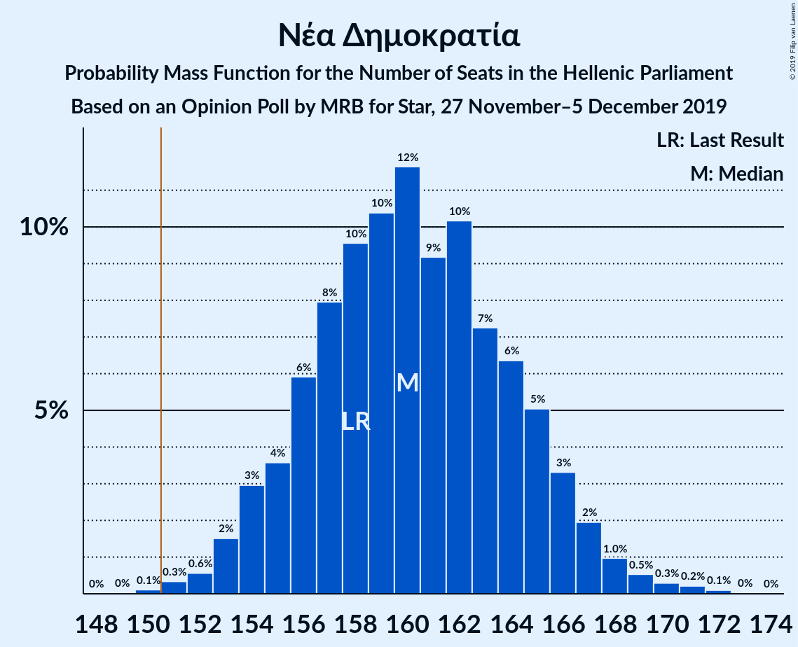
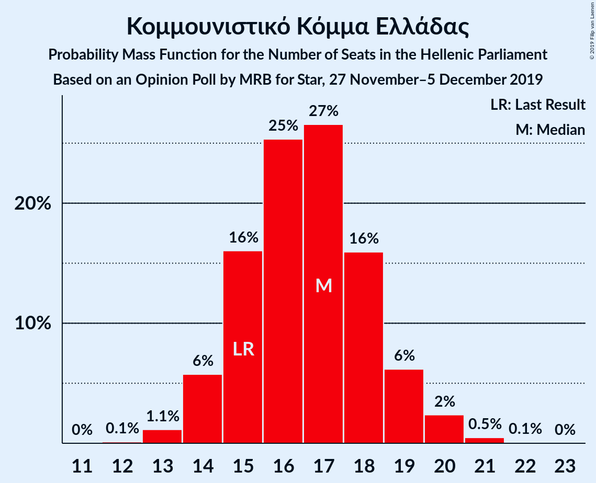
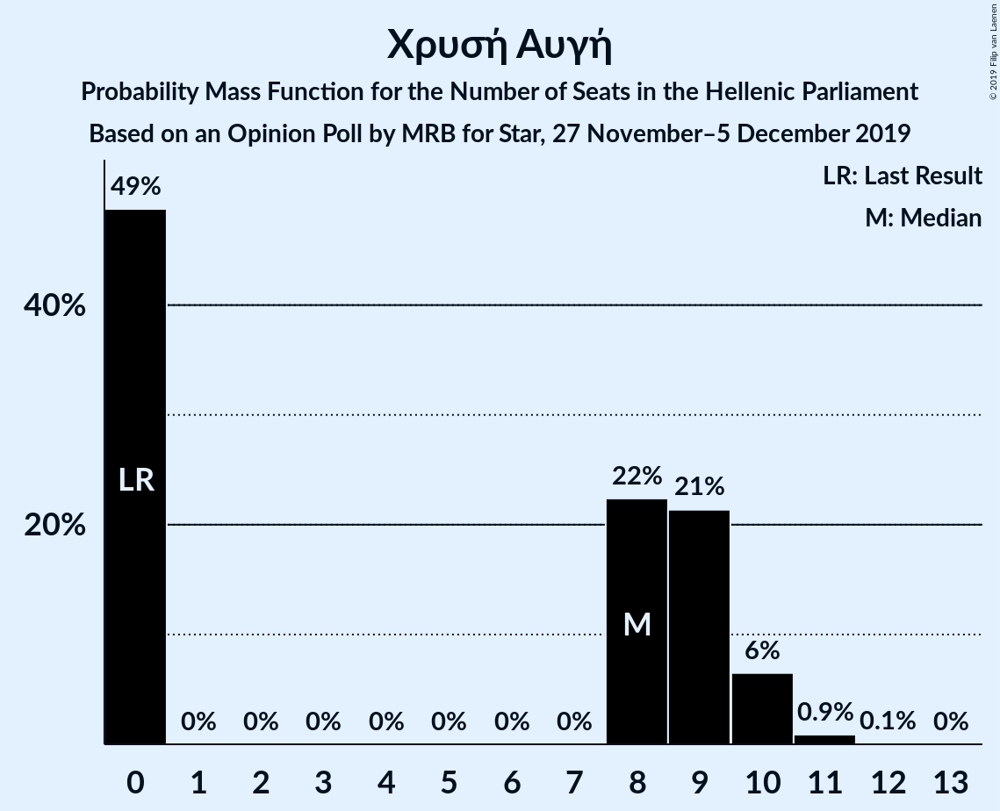
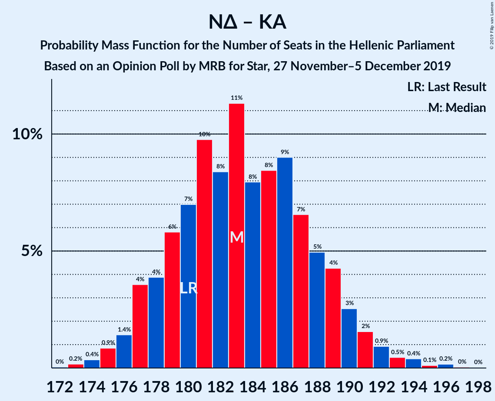
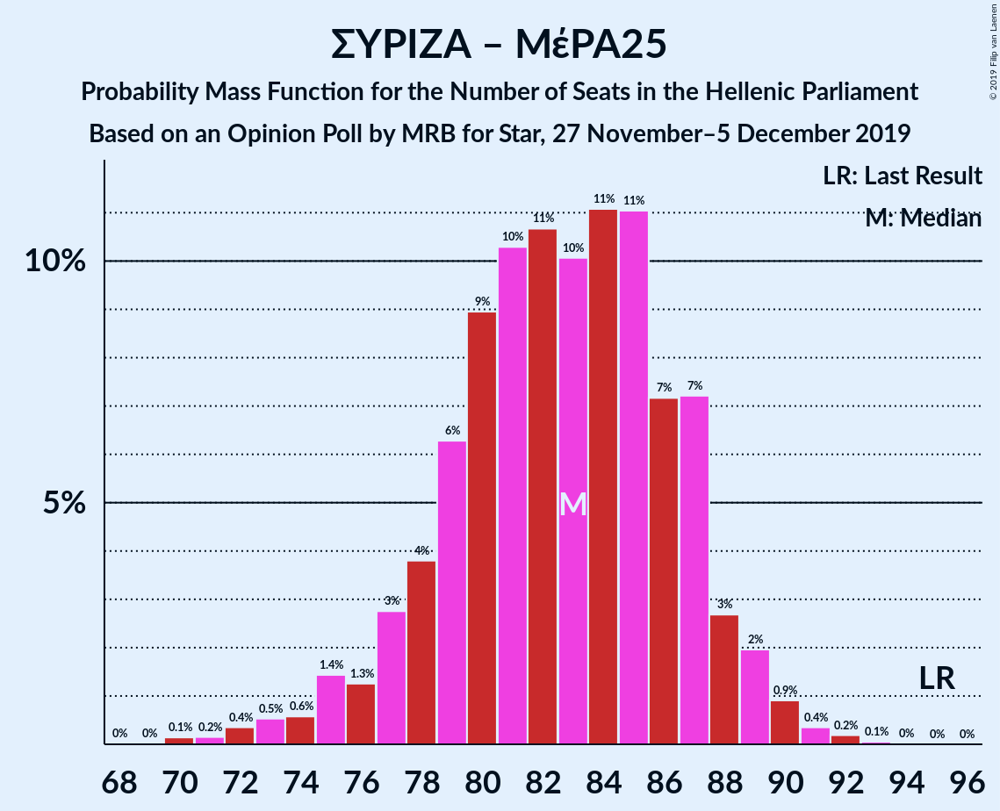

# Opinion Poll by MRB for Star, 27 November–5 December 2019

<a href="#voting-intentions">Voting Intentions</a> | <a href="#seats">Seats</a> | <a href="#coalitions">Coalitions</a> | <a href="#technical-information">Technical Information</a>

## Voting Intentions

### Confidence Intervals

| Party | Last Result | Poll Result | 80% Confidence Interval | 90% Confidence Interval | 95% Confidence Interval | 99% Confidence Interval |
|:-----:|:-----------:|:-----------:|:-----------------------:|:-----------------------:|:-----------------------:|:-----------------------:|
| Νέα Δημοκρατία | 39.8% | 41.5% | 40.1–42.9% |39.7–43.3% |39.4–43.7% |38.7–44.4% |
| Συνασπισμός Ριζοσπαστικής Αριστεράς | 31.5% | 27.6% | 26.3–28.9% |26.0–29.3% |25.7–29.6% |25.1–30.2% |
| Κίνημα Αλλαγής | 8.1% | 8.7% | 7.9–9.6% |7.7–9.8% |7.5–10.0% |7.2–10.5% |
| Κομμουνιστικό Κόμμα Ελλάδας | 5.3% | 6.2% | 5.5–7.0% |5.4–7.2% |5.2–7.3% |4.9–7.7% |
| Ελληνική Λύση | 3.7% | 4.8% | 4.2–5.5% |4.1–5.7% |3.9–5.8% |3.7–6.2% |
| Μέτωπο Ευρωπαϊκής Ρεαλιστικής Ανυπακοής | 3.4% | 3.6% | 3.1–4.2% |3.0–4.4% |2.9–4.5% |2.7–4.8% |
| Χρυσή Αυγή | 2.9% | 3.0% | 2.6–3.6% |2.4–3.7% |2.3–3.9% |2.1–4.1% |

*Note:* The poll result column reflects the actual value used in the calculations. Published results may vary slightly, and in addition be rounded to fewer digits.

## Seats

### Confidence Intervals

| Party | Last Result | Median | 80% Confidence Interval | 90% Confidence Interval | 95% Confidence Interval | 99% Confidence Interval |
|:-----:|:-----------:|:------:|:-----------------------:|:-----------------------:|:-----------------------:|:-----------------------:|
| <a href="#νέα-δημοκρατία">Νέα Δημοκρατία</a> | 158 | 160 | 155–165 |155–165 |154–167 |152–171 |
| <a href="#συνασπισμός-ριζοσπαστικής-αριστεράς">Συνασπισμός Ριζοσπαστικής Αριστεράς</a> | 86 | 72 | 70–77 |70–79 |69–79 |66–82 |
| <a href="#κίνημα-αλλαγής">Κίνημα Αλλαγής</a> | 22 | 23 | 21–25 |20–26 |20–27 |19–27 |
| <a href="#κομμουνιστικό-κόμμα-ελλάδας">Κομμουνιστικό Κόμμα Ελλάδας</a> | 15 | 17 | 15–18 |15–19 |14–19 |13–21 |
| <a href="#ελληνική-λύση">Ελληνική Λύση</a> | 10 | 13 | 11–15 |11–15 |11–16 |10–16 |
| <a href="#μέτωπο-ευρωπαϊκής-ρεαλιστικής-ανυπακοής">Μέτωπο Ευρωπαϊκής Ρεαλιστικής Ανυπακοής</a> | 9 | 10 | 8–11 |0–12 |0–12 |0–13 |
| <a href="#χρυσή-αυγή">Χρυσή Αυγή</a> | 0 | 8 | 0–10 |0–10 |0–10 |0–11 |

### Νέα Δημοκρατία

*For a full overview of the results for this party, see the [Νέα Δημοκρατία](party-νέαδημοκρατία.html) page.*

| Number of Seats | Probability | Accumulated | Special Marks |
|:---------------:|:-----------:|:-----------:|:-------------:|
| 149 | 0% | 100% |  |
| 150 | 0.1% | 99.9% |  |
| 151 | 0.3% | 99.9% | Majority |
| 152 | 1.2% | 99.6% |  |
| 153 | 0.6% | 98% |  |
| 154 | 3% | 98% |  |
| 155 | 7% | 95% |  |
| 156 | 2% | 89% |  |
| 157 | 10% | 87% |  |
| 158 | 18% | 77% | Last Result |
| 159 | 8% | 60% |  |
| 160 | 11% | 52% | Median |
| 161 | 6% | 41% |  |
| 162 | 10% | 35% |  |
| 163 | 5% | 24% |  |
| 164 | 5% | 19% |  |
| 165 | 10% | 15% |  |
| 166 | 1.3% | 5% |  |
| 167 | 2% | 4% |  |
| 168 | 0.8% | 2% |  |
| 169 | 0.2% | 1.1% |  |
| 170 | 0.3% | 0.9% |  |
| 171 | 0.5% | 0.6% |  |
| 172 | 0.1% | 0.1% |  |
| 173 | 0% | 0% |  |

### Συνασπισμός Ριζοσπαστικής Αριστεράς

*For a full overview of the results for this party, see the [Συνασπισμός Ριζοσπαστικής Αριστεράς](party-συνασπισμόςριζοσπαστικήςαριστεράς.html) page.*

| Number of Seats | Probability | Accumulated | Special Marks |
|:---------------:|:-----------:|:-----------:|:-------------:|
| 65 | 0.2% | 100% |  |
| 66 | 0.6% | 99.8% |  |
| 67 | 0.2% | 99.2% |  |
| 68 | 1.2% | 99.0% |  |
| 69 | 2% | 98% |  |
| 70 | 10% | 96% |  |
| 71 | 2% | 86% |  |
| 72 | 47% | 84% | Median |
| 73 | 3% | 37% |  |
| 74 | 8% | 35% |  |
| 75 | 11% | 27% |  |
| 76 | 4% | 16% |  |
| 77 | 2% | 12% |  |
| 78 | 4% | 9% |  |
| 79 | 4% | 6% |  |
| 80 | 0.8% | 2% |  |
| 81 | 0.4% | 1.1% |  |
| 82 | 0.6% | 0.7% |  |
| 83 | 0% | 0.1% |  |
| 84 | 0.1% | 0.1% |  |
| 85 | 0% | 0% |  |
| 86 | 0% | 0% | Last Result |

### Κίνημα Αλλαγής

*For a full overview of the results for this party, see the [Κίνημα Αλλαγής](party-κίνημααλλαγής.html) page.*

| Number of Seats | Probability | Accumulated | Special Marks |
|:---------------:|:-----------:|:-----------:|:-------------:|
| 18 | 0.2% | 100% |  |
| 19 | 1.0% | 99.8% |  |
| 20 | 4% | 98.7% |  |
| 21 | 12% | 95% |  |
| 22 | 16% | 83% | Last Result |
| 23 | 22% | 67% | Median |
| 24 | 27% | 45% |  |
| 25 | 9% | 18% |  |
| 26 | 6% | 9% |  |
| 27 | 3% | 3% |  |
| 28 | 0.3% | 0.4% |  |
| 29 | 0.1% | 0.1% |  |
| 30 | 0% | 0% |  |

### Κομμουνιστικό Κόμμα Ελλάδας

*For a full overview of the results for this party, see the [Κομμουνιστικό Κόμμα Ελλάδας](party-κομμουνιστικόκόμμαελλάδας.html) page.*

| Number of Seats | Probability | Accumulated | Special Marks |
|:---------------:|:-----------:|:-----------:|:-------------:|
| 12 | 0.1% | 100% |  |
| 13 | 0.9% | 99.9% |  |
| 14 | 4% | 99.0% |  |
| 15 | 13% | 95% | Last Result |
| 16 | 22% | 82% |  |
| 17 | 34% | 60% | Median |
| 18 | 18% | 26% |  |
| 19 | 6% | 8% |  |
| 20 | 2% | 2% |  |
| 21 | 0.4% | 0.5% |  |
| 22 | 0.1% | 0.1% |  |
| 23 | 0% | 0% |  |

### Ελληνική Λύση

*For a full overview of the results for this party, see the [Ελληνική Λύση](party-ελληνικήλύση.html) page.*

| Number of Seats | Probability | Accumulated | Special Marks |
|:---------------:|:-----------:|:-----------:|:-------------:|
| 9 | 0.1% | 100% |  |
| 10 | 1.4% | 99.9% | Last Result |
| 11 | 10% | 98.5% |  |
| 12 | 20% | 89% |  |
| 13 | 40% | 68% | Median |
| 14 | 18% | 28% |  |
| 15 | 7% | 10% |  |
| 16 | 3% | 3% |  |
| 17 | 0.4% | 0.4% |  |
| 18 | 0% | 0% |  |

### Μέτωπο Ευρωπαϊκής Ρεαλιστικής Ανυπακοής

*For a full overview of the results for this party, see the [Μέτωπο Ευρωπαϊκής Ρεαλιστικής Ανυπακοής](party-μέτωποευρωπαϊκήςρεαλιστικήςανυπακοής.html) page.*

| Number of Seats | Probability | Accumulated | Special Marks |
|:---------------:|:-----------:|:-----------:|:-------------:|
| 0 | 7% | 100% |  |
| 1 | 0% | 93% |  |
| 2 | 0% | 93% |  |
| 3 | 0% | 93% |  |
| 4 | 0% | 93% |  |
| 5 | 0% | 93% |  |
| 6 | 0% | 93% |  |
| 7 | 0% | 93% |  |
| 8 | 8% | 93% |  |
| 9 | 33% | 85% | Last Result |
| 10 | 33% | 52% | Median |
| 11 | 14% | 19% |  |
| 12 | 5% | 6% |  |
| 13 | 0.5% | 0.6% |  |
| 14 | 0.1% | 0.1% |  |
| 15 | 0% | 0% |  |

### Χρυσή Αυγή

*For a full overview of the results for this party, see the [Χρυσή Αυγή](party-χρυσήαυγή.html) page.*

| Number of Seats | Probability | Accumulated | Special Marks |
|:---------------:|:-----------:|:-----------:|:-------------:|
| 0 | 44% | 100% | Last Result |
| 1 | 0% | 56% |  |
| 2 | 0% | 56% |  |
| 3 | 0% | 56% |  |
| 4 | 0% | 56% |  |
| 5 | 0% | 56% |  |
| 6 | 0% | 56% |  |
| 7 | 0% | 56% |  |
| 8 | 20% | 56% | Median |
| 9 | 25% | 36% |  |
| 10 | 10% | 11% |  |
| 11 | 0.8% | 0.9% |  |
| 12 | 0.1% | 0.1% |  |
| 13 | 0% | 0% |  |

## Coalitions

### Confidence Intervals

| Coalition | Last Result | Median | Majority? | 80% Confidence Interval | 90% Confidence Interval | 95% Confidence Interval | 99% Confidence Interval |
|:---------:|:-----------:|:------:|:---------:|:-----------------------:|:-----------------------:|:-----------------------:|:-----------------------:|
| Νέα Δημοκρατία – Κίνημα Αλλαγής | 180 | 183 | 100% | 178–189 | 177–189 | 177–190 | 175–194 |
| Νέα Δημοκρατία | 158 | 160 | 99.9% | 155–165 | 155–165 | 154–167 | 152–171 |
| Συνασπισμός Ριζοσπαστικής Αριστεράς – Μέτωπο Ευρωπαϊκής Ρεαλιστικής Ανυπακοής | 95 | 82 | 0% | 79–87 | 76–88 | 75–89 | 73–91 |
| Συνασπισμός Ριζοσπαστικής Αριστεράς | 86 | 72 | 0% | 70–77 | 70–79 | 69–79 | 66–82 |

### Νέα Δημοκρατία – Κίνημα Αλλαγής

| Number of Seats | Probability | Accumulated | Special Marks |
|:---------------:|:-----------:|:-----------:|:-------------:|
| 172 | 0% | 100% |  |
| 173 | 0.1% | 99.9% |  |
| 174 | 0.3% | 99.8% |  |
| 175 | 0.8% | 99.5% |  |
| 176 | 0.6% | 98.7% |  |
| 177 | 3% | 98% |  |
| 178 | 6% | 95% |  |
| 179 | 8% | 89% |  |
| 180 | 4% | 80% | Last Result |
| 181 | 20% | 76% |  |
| 182 | 3% | 57% |  |
| 183 | 10% | 54% | Median |
| 184 | 7% | 43% |  |
| 185 | 5% | 36% |  |
| 186 | 9% | 31% |  |
| 187 | 6% | 22% |  |
| 188 | 2% | 16% |  |
| 189 | 10% | 14% |  |
| 190 | 2% | 4% |  |
| 191 | 0.2% | 2% |  |
| 192 | 1.0% | 2% |  |
| 193 | 0.3% | 1.1% |  |
| 194 | 0.3% | 0.7% |  |
| 195 | 0.1% | 0.5% |  |
| 196 | 0.3% | 0.4% |  |
| 197 | 0% | 0.1% |  |
| 198 | 0% | 0% |  |

### Νέα Δημοκρατία

| Number of Seats | Probability | Accumulated | Special Marks |
|:---------------:|:-----------:|:-----------:|:-------------:|
| 149 | 0% | 100% |  |
| 150 | 0.1% | 99.9% |  |
| 151 | 0.3% | 99.9% | Majority |
| 152 | 1.2% | 99.6% |  |
| 153 | 0.6% | 98% |  |
| 154 | 3% | 98% |  |
| 155 | 7% | 95% |  |
| 156 | 2% | 89% |  |
| 157 | 10% | 87% |  |
| 158 | 18% | 77% | Last Result |
| 159 | 8% | 60% |  |
| 160 | 11% | 52% | Median |
| 161 | 6% | 41% |  |
| 162 | 10% | 35% |  |
| 163 | 5% | 24% |  |
| 164 | 5% | 19% |  |
| 165 | 10% | 15% |  |
| 166 | 1.3% | 5% |  |
| 167 | 2% | 4% |  |
| 168 | 0.8% | 2% |  |
| 169 | 0.2% | 1.1% |  |
| 170 | 0.3% | 0.9% |  |
| 171 | 0.5% | 0.6% |  |
| 172 | 0.1% | 0.1% |  |
| 173 | 0% | 0% |  |

### Συνασπισμός Ριζοσπαστικής Αριστεράς – Μέτωπο Ευρωπαϊκής Ρεαλιστικής Ανυπακοής

| Number of Seats | Probability | Accumulated | Special Marks |
|:---------------:|:-----------:|:-----------:|:-------------:|
| 70 | 0.2% | 100% |  |
| 71 | 0% | 99.8% |  |
| 72 | 0.1% | 99.7% |  |
| 73 | 0.2% | 99.6% |  |
| 74 | 0.2% | 99.5% |  |
| 75 | 4% | 99.2% |  |
| 76 | 0.8% | 95% |  |
| 77 | 2% | 94% |  |
| 78 | 2% | 92% |  |
| 79 | 5% | 91% |  |
| 80 | 6% | 85% |  |
| 81 | 22% | 79% |  |
| 82 | 21% | 57% | Median |
| 83 | 9% | 36% |  |
| 84 | 10% | 27% |  |
| 85 | 4% | 17% |  |
| 86 | 3% | 13% |  |
| 87 | 2% | 10% |  |
| 88 | 4% | 8% |  |
| 89 | 3% | 5% |  |
| 90 | 1.2% | 2% |  |
| 91 | 0.5% | 0.7% |  |
| 92 | 0.1% | 0.2% |  |
| 93 | 0% | 0% |  |
| 94 | 0% | 0% |  |
| 95 | 0% | 0% | Last Result |

### Συνασπισμός Ριζοσπαστικής Αριστεράς

| Number of Seats | Probability | Accumulated | Special Marks |
|:---------------:|:-----------:|:-----------:|:-------------:|
| 65 | 0.2% | 100% |  |
| 66 | 0.6% | 99.8% |  |
| 67 | 0.2% | 99.2% |  |
| 68 | 1.2% | 99.0% |  |
| 69 | 2% | 98% |  |
| 70 | 10% | 96% |  |
| 71 | 2% | 86% |  |
| 72 | 47% | 84% | Median |
| 73 | 3% | 37% |  |
| 74 | 8% | 35% |  |
| 75 | 11% | 27% |  |
| 76 | 4% | 16% |  |
| 77 | 2% | 12% |  |
| 78 | 4% | 9% |  |
| 79 | 4% | 6% |  |
| 80 | 0.8% | 2% |  |
| 81 | 0.4% | 1.1% |  |
| 82 | 0.6% | 0.7% |  |
| 83 | 0% | 0.1% |  |
| 84 | 0.1% | 0.1% |  |
| 85 | 0% | 0% |  |
| 86 | 0% | 0% | Last Result |

## Technical Information

### Opinion Poll

+ **Polling firm:** MRB
+ **Commissioner(s):** Star
+ **Fieldwork period:** 27 November–5 December 2019

### Calculations

+ **Sample size:** 2000
+ **Simulations done:** 131,072
+ **Error estimate:** 1.01%

