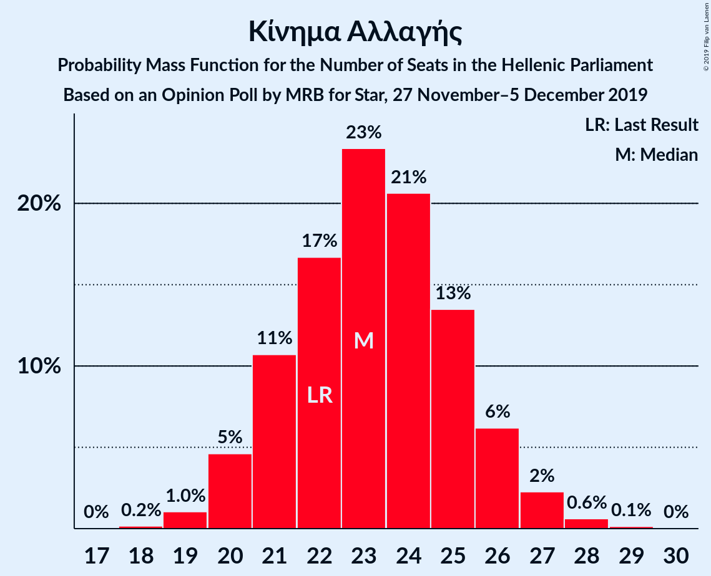

# Opinion Poll by MRB for Star, 27 November–5 December 2019

<a href="#voting-intentions">Voting Intentions</a> | <a href="#seats">Seats</a> | <a href="#coalitions">Coalitions</a> | <a href="#technical-information">Technical Information</a>

## Voting Intentions

### Confidence Intervals

| Party | Last Result | Poll Result | 80% Confidence Interval | 90% Confidence Interval | 95% Confidence Interval | 99% Confidence Interval |
|:-----:|:-----------:|:-----------:|:-----------------------:|:-----------------------:|:-----------------------:|:-----------------------:|
| Νέα Δημοκρατία | 39.8% | 41.5% | 40.1–42.9% |39.7–43.3% |39.4–43.7% |38.7–44.4% |
| Συνασπισμός Ριζοσπαστικής Αριστεράς | 31.5% | 27.6% | 26.3–28.9% |26.0–29.3% |25.7–29.6% |25.1–30.2% |
| Κίνημα Αλλαγής | 8.1% | 8.7% | 7.9–9.6% |7.7–9.8% |7.5–10.0% |7.2–10.5% |
| Κομμουνιστικό Κόμμα Ελλάδας | 5.3% | 6.2% | 5.5–7.0% |5.4–7.2% |5.2–7.3% |4.9–7.7% |
| Ελληνική Λύση | 3.7% | 4.8% | 4.2–5.5% |4.1–5.7% |3.9–5.8% |3.7–6.2% |
| Μέτωπο Ευρωπαϊκής Ρεαλιστικής Ανυπακοής | 3.4% | 3.6% | 3.1–4.2% |3.0–4.4% |2.9–4.5% |2.7–4.8% |
| Χρυσή Αυγή | 2.9% | 3.0% | 2.6–3.6% |2.4–3.7% |2.3–3.9% |2.1–4.1% |

*Note:* The poll result column reflects the actual value used in the calculations. Published results may vary slightly, and in addition be rounded to fewer digits.

## Seats

### Confidence Intervals

| Party | Last Result | Median | 80% Confidence Interval | 90% Confidence Interval | 95% Confidence Interval | 99% Confidence Interval |
|:-----:|:-----------:|:------:|:-----------------------:|:-----------------------:|:-----------------------:|:-----------------------:|
| <a href="#νέα-δημοκρατία">Νέα Δημοκρατία</a> | 158 | 160 | 156–165 |154–166 |153–167 |152–170 |
| <a href="#συνασπισμός-ριζοσπαστικής-αριστεράς">Συνασπισμός Ριζοσπαστικής Αριστεράς</a> | 86 | 73 | 70–77 |69–78 |68–79 |66–81 |
| <a href="#κίνημα-αλλαγής">Κίνημα Αλλαγής</a> | 22 | 23 | 21–25 |20–26 |20–27 |19–28 |
| <a href="#κομμουνιστικό-κόμμα-ελλάδας">Κομμουνιστικό Κόμμα Ελλάδας</a> | 15 | 17 | 15–18 |14–19 |14–20 |13–21 |
| <a href="#ελληνική-λύση">Ελληνική Λύση</a> | 10 | 13 | 11–15 |11–15 |10–16 |10–16 |
| <a href="#μέτωπο-ευρωπαϊκής-ρεαλιστικής-ανυπακοής">Μέτωπο Ευρωπαϊκής Ρεαλιστικής Ανυπακοής</a> | 9 | 10 | 8–11 |0–12 |0–12 |0–13 |
| <a href="#χρυσή-αυγή">Χρυσή Αυγή</a> | 0 | 8 | 0–9 |0–10 |0–10 |0–11 |

### Νέα Δημοκρατία

*For a full overview of the results for this party, see the [Νέα Δημοκρατία](party-νέαδημοκρατία.html) page.*

| Number of Seats | Probability | Accumulated | Special Marks |
|:---------------:|:-----------:|:-----------:|:-------------:|
| 150 | 0.1% | 100% |  |
| 151 | 0.3% | 99.8% | Majority |
| 152 | 0.6% | 99.5% |  |
| 153 | 2% | 98.9% |  |
| 154 | 3% | 97% |  |
| 155 | 4% | 94% |  |
| 156 | 6% | 91% |  |
| 157 | 8% | 85% |  |
| 158 | 10% | 77% | Last Result |
| 159 | 10% | 67% |  |
| 160 | 12% | 57% | Median |
| 161 | 9% | 45% |  |
| 162 | 10% | 36% |  |
| 163 | 7% | 26% |  |
| 164 | 6% | 19% |  |
| 165 | 5% | 12% |  |
| 166 | 3% | 7% |  |
| 167 | 2% | 4% |  |
| 168 | 1.0% | 2% |  |
| 169 | 0.5% | 1.2% |  |
| 170 | 0.3% | 0.7% |  |
| 171 | 0.2% | 0.4% |  |
| 172 | 0.1% | 0.2% |  |
| 173 | 0% | 0.1% |  |
| 174 | 0% | 0% |  |

### Συνασπισμός Ριζοσπαστικής Αριστεράς

*For a full overview of the results for this party, see the [Συνασπισμός Ριζοσπαστικής Αριστεράς](party-συνασπισμόςριζοσπαστικήςαριστεράς.html) page.*

| Number of Seats | Probability | Accumulated | Special Marks |
|:---------------:|:-----------:|:-----------:|:-------------:|
| 64 | 0.1% | 100% |  |
| 65 | 0.2% | 99.9% |  |
| 66 | 0.6% | 99.7% |  |
| 67 | 1.2% | 99.1% |  |
| 68 | 3% | 98% |  |
| 69 | 5% | 95% |  |
| 70 | 7% | 90% |  |
| 71 | 10% | 83% |  |
| 72 | 15% | 73% |  |
| 73 | 9% | 58% | Median |
| 74 | 13% | 49% |  |
| 75 | 10% | 36% |  |
| 76 | 11% | 26% |  |
| 77 | 8% | 15% |  |
| 78 | 3% | 7% |  |
| 79 | 2% | 5% |  |
| 80 | 1.2% | 2% |  |
| 81 | 0.6% | 1.1% |  |
| 82 | 0.3% | 0.5% |  |
| 83 | 0.1% | 0.2% |  |
| 84 | 0% | 0.1% |  |
| 85 | 0% | 0% |  |
| 86 | 0% | 0% | Last Result |

### Κίνημα Αλλαγής

*For a full overview of the results for this party, see the [Κίνημα Αλλαγής](party-κίνημααλλαγής.html) page.*

| Number of Seats | Probability | Accumulated | Special Marks |
|:---------------:|:-----------:|:-----------:|:-------------:|
| 18 | 0.2% | 100% |  |
| 19 | 1.0% | 99.8% |  |
| 20 | 5% | 98.8% |  |
| 21 | 11% | 94% |  |
| 22 | 17% | 83% | Last Result |
| 23 | 23% | 67% | Median |
| 24 | 21% | 43% |  |
| 25 | 13% | 23% |  |
| 26 | 6% | 9% |  |
| 27 | 2% | 3% |  |
| 28 | 0.6% | 0.8% |  |
| 29 | 0.1% | 0.2% |  |
| 30 | 0% | 0% |  |

### Κομμουνιστικό Κόμμα Ελλάδας

*For a full overview of the results for this party, see the [Κομμουνιστικό Κόμμα Ελλάδας](party-κομμουνιστικόκόμμαελλάδας.html) page.*

| Number of Seats | Probability | Accumulated | Special Marks |
|:---------------:|:-----------:|:-----------:|:-------------:|
| 12 | 0.1% | 100% |  |
| 13 | 1.1% | 99.9% |  |
| 14 | 6% | 98.7% |  |
| 15 | 16% | 93% | Last Result |
| 16 | 25% | 77% |  |
| 17 | 27% | 52% | Median |
| 18 | 16% | 25% |  |
| 19 | 6% | 9% |  |
| 20 | 2% | 3% |  |
| 21 | 0.5% | 0.6% |  |
| 22 | 0.1% | 0.1% |  |
| 23 | 0% | 0% |  |

### Ελληνική Λύση

*For a full overview of the results for this party, see the [Ελληνική Λύση](party-ελληνικήλύση.html) page.*

| Number of Seats | Probability | Accumulated | Special Marks |
|:---------------:|:-----------:|:-----------:|:-------------:|
| 9 | 0.3% | 100% |  |
| 10 | 3% | 99.7% | Last Result |
| 11 | 12% | 97% |  |
| 12 | 24% | 85% |  |
| 13 | 31% | 61% | Median |
| 14 | 19% | 30% |  |
| 15 | 8% | 11% |  |
| 16 | 2% | 3% |  |
| 17 | 0.4% | 0.5% |  |
| 18 | 0.1% | 0.1% |  |
| 19 | 0% | 0% |  |

### Μέτωπο Ευρωπαϊκής Ρεαλιστικής Ανυπακοής

*For a full overview of the results for this party, see the [Μέτωπο Ευρωπαϊκής Ρεαλιστικής Ανυπακοής](party-μέτωποευρωπαϊκήςρεαλιστικήςανυπακοής.html) page.*

| Number of Seats | Probability | Accumulated | Special Marks |
|:---------------:|:-----------:|:-----------:|:-------------:|
| 0 | 6% | 100% |  |
| 1 | 0% | 94% |  |
| 2 | 0% | 94% |  |
| 3 | 0% | 94% |  |
| 4 | 0% | 94% |  |
| 5 | 0% | 94% |  |
| 6 | 0% | 94% |  |
| 7 | 0% | 94% |  |
| 8 | 10% | 94% |  |
| 9 | 30% | 85% | Last Result |
| 10 | 30% | 55% | Median |
| 11 | 18% | 24% |  |
| 12 | 5% | 6% |  |
| 13 | 0.9% | 1.0% |  |
| 14 | 0.1% | 0.1% |  |
| 15 | 0% | 0% |  |

### Χρυσή Αυγή

*For a full overview of the results for this party, see the [Χρυσή Αυγή](party-χρυσήαυγή.html) page.*

| Number of Seats | Probability | Accumulated | Special Marks |
|:---------------:|:-----------:|:-----------:|:-------------:|
| 0 | 49% | 100% | Last Result |
| 1 | 0% | 51% |  |
| 2 | 0% | 51% |  |
| 3 | 0% | 51% |  |
| 4 | 0% | 51% |  |
| 5 | 0% | 51% |  |
| 6 | 0% | 51% |  |
| 7 | 0% | 51% |  |
| 8 | 22% | 51% | Median |
| 9 | 21% | 29% |  |
| 10 | 6% | 7% |  |
| 11 | 0.9% | 1.0% |  |
| 12 | 0.1% | 0.1% |  |
| 13 | 0% | 0% |  |

## Coalitions

### Confidence Intervals

| Coalition | Last Result | Median | Majority? | 80% Confidence Interval | 90% Confidence Interval | 95% Confidence Interval | 99% Confidence Interval |
|:---------:|:-----------:|:------:|:---------:|:-----------------------:|:-----------------------:|:-----------------------:|:-----------------------:|
| Νέα Δημοκρατία – Κίνημα Αλλαγής | 180 | 183 | 100% | 178–189 | 177–190 | 176–191 | 174–194 |
| Νέα Δημοκρατία | 158 | 160 | 99.8% | 156–165 | 154–166 | 153–167 | 152–170 |
| Συνασπισμός Ριζοσπαστικής Αριστεράς – Μέτωπο Ευρωπαϊκής Ρεαλιστικής Ανυπακοής | 95 | 83 | 0% | 78–87 | 77–88 | 75–89 | 72–91 |
| Συνασπισμός Ριζοσπαστικής Αριστεράς | 86 | 73 | 0% | 70–77 | 69–78 | 68–79 | 66–81 |

### Νέα Δημοκρατία – Κίνημα Αλλαγής

| Number of Seats | Probability | Accumulated | Special Marks |
|:---------------:|:-----------:|:-----------:|:-------------:|
| 172 | 0% | 100% |  |
| 173 | 0.2% | 99.9% |  |
| 174 | 0.4% | 99.8% |  |
| 175 | 0.9% | 99.4% |  |
| 176 | 1.4% | 98.6% |  |
| 177 | 4% | 97% |  |
| 178 | 4% | 94% |  |
| 179 | 6% | 90% |  |
| 180 | 7% | 84% | Last Result |
| 181 | 10% | 77% |  |
| 182 | 8% | 67% |  |
| 183 | 11% | 59% | Median |
| 184 | 8% | 47% |  |
| 185 | 8% | 39% |  |
| 186 | 9% | 31% |  |
| 187 | 7% | 22% |  |
| 188 | 5% | 15% |  |
| 189 | 4% | 11% |  |
| 190 | 3% | 6% |  |
| 191 | 2% | 4% |  |
| 192 | 0.9% | 2% |  |
| 193 | 0.5% | 1.2% |  |
| 194 | 0.4% | 0.8% |  |
| 195 | 0.1% | 0.4% |  |
| 196 | 0.2% | 0.3% |  |
| 197 | 0% | 0.1% |  |
| 198 | 0% | 0% |  |

### Νέα Δημοκρατία

| Number of Seats | Probability | Accumulated | Special Marks |
|:---------------:|:-----------:|:-----------:|:-------------:|
| 150 | 0.1% | 100% |  |
| 151 | 0.3% | 99.8% | Majority |
| 152 | 0.6% | 99.5% |  |
| 153 | 2% | 98.9% |  |
| 154 | 3% | 97% |  |
| 155 | 4% | 94% |  |
| 156 | 6% | 91% |  |
| 157 | 8% | 85% |  |
| 158 | 10% | 77% | Last Result |
| 159 | 10% | 67% |  |
| 160 | 12% | 57% | Median |
| 161 | 9% | 45% |  |
| 162 | 10% | 36% |  |
| 163 | 7% | 26% |  |
| 164 | 6% | 19% |  |
| 165 | 5% | 12% |  |
| 166 | 3% | 7% |  |
| 167 | 2% | 4% |  |
| 168 | 1.0% | 2% |  |
| 169 | 0.5% | 1.2% |  |
| 170 | 0.3% | 0.7% |  |
| 171 | 0.2% | 0.4% |  |
| 172 | 0.1% | 0.2% |  |
| 173 | 0% | 0.1% |  |
| 174 | 0% | 0% |  |

### Συνασπισμός Ριζοσπαστικής Αριστεράς – Μέτωπο Ευρωπαϊκής Ρεαλιστικής Ανυπακοής

| Number of Seats | Probability | Accumulated | Special Marks |
|:---------------:|:-----------:|:-----------:|:-------------:|
| 69 | 0% | 100% |  |
| 70 | 0.1% | 99.9% |  |
| 71 | 0.2% | 99.8% |  |
| 72 | 0.4% | 99.7% |  |
| 73 | 0.5% | 99.3% |  |
| 74 | 0.6% | 98.8% |  |
| 75 | 1.4% | 98% |  |
| 76 | 1.3% | 97% |  |
| 77 | 3% | 96% |  |
| 78 | 4% | 93% |  |
| 79 | 6% | 89% |  |
| 80 | 9% | 83% |  |
| 81 | 10% | 74% |  |
| 82 | 11% | 63% |  |
| 83 | 10% | 53% | Median |
| 84 | 11% | 43% |  |
| 85 | 11% | 32% |  |
| 86 | 7% | 21% |  |
| 87 | 7% | 13% |  |
| 88 | 3% | 6% |  |
| 89 | 2% | 3% |  |
| 90 | 0.9% | 2% |  |
| 91 | 0.4% | 0.6% |  |
| 92 | 0.2% | 0.3% |  |
| 93 | 0.1% | 0.1% |  |
| 94 | 0% | 0% |  |
| 95 | 0% | 0% | Last Result |

### Συνασπισμός Ριζοσπαστικής Αριστεράς

| Number of Seats | Probability | Accumulated | Special Marks |
|:---------------:|:-----------:|:-----------:|:-------------:|
| 64 | 0.1% | 100% |  |
| 65 | 0.2% | 99.9% |  |
| 66 | 0.6% | 99.7% |  |
| 67 | 1.2% | 99.1% |  |
| 68 | 3% | 98% |  |
| 69 | 5% | 95% |  |
| 70 | 7% | 90% |  |
| 71 | 10% | 83% |  |
| 72 | 15% | 73% |  |
| 73 | 9% | 58% | Median |
| 74 | 13% | 49% |  |
| 75 | 10% | 36% |  |
| 76 | 11% | 26% |  |
| 77 | 8% | 15% |  |
| 78 | 3% | 7% |  |
| 79 | 2% | 5% |  |
| 80 | 1.2% | 2% |  |
| 81 | 0.6% | 1.1% |  |
| 82 | 0.3% | 0.5% |  |
| 83 | 0.1% | 0.2% |  |
| 84 | 0% | 0.1% |  |
| 85 | 0% | 0% |  |
| 86 | 0% | 0% | Last Result |

## Technical Information

### Opinion Poll

+ **Polling firm:** MRB
+ **Commissioner(s):** Star
+ **Fieldwork period:** 27 November–5 December 2019

### Calculations

+ **Sample size:** 2000
+ **Simulations done:** 1,048,576
+ **Error estimate:** 0.52%

