# Opinion Poll by Pulse RC for ΣΚΑΪ, 16–18 December 2019

<a href="#voting-intentions">Voting Intentions</a> | <a href="#seats">Seats</a> | <a href="#coalitions">Coalitions</a> | <a href="#technical-information">Technical Information</a>

## Voting Intentions

### Confidence Intervals

| Party | Last Result | Poll Result | 80% Confidence Interval | 90% Confidence Interval | 95% Confidence Interval | 99% Confidence Interval |
|:-----:|:-----------:|:-----------:|:-----------------------:|:-----------------------:|:-----------------------:|:-----------------------:|
| Νέα Δημοκρατία | 39.8% | 42.5% | 40.7–44.4% |40.2–44.9% |39.7–45.3% |38.9–46.2% |
| Συνασπισμός Ριζοσπαστικής Αριστεράς | 31.5% | 28.0% | 26.4–29.8% |26.0–30.2% |25.6–30.7% |24.8–31.5% |
| Κίνημα Αλλαγής | 8.1% | 7.5% | 6.6–8.6% |6.3–8.9% |6.1–9.1% |5.7–9.7% |
| Κομμουνιστικό Κόμμα Ελλάδας | 5.3% | 6.0% | 5.2–7.0% |5.0–7.2% |4.8–7.5% |4.4–8.0% |
| Ελληνική Λύση | 3.7% | 5.0% | 4.3–5.9% |4.1–6.2% |3.9–6.4% |3.6–6.8% |
| Μέτωπο Ευρωπαϊκής Ρεαλιστικής Ανυπακοής | 3.4% | 3.5% | 2.9–4.3% |2.7–4.5% |2.6–4.7% |2.3–5.1% |
| Χρυσή Αυγή | 2.9% | 2.5% | 2.0–3.2% |1.9–3.4% |1.8–3.6% |1.5–3.9% |

*Note:* The poll result column reflects the actual value used in the calculations. Published results may vary slightly, and in addition be rounded to fewer digits.

## Seats

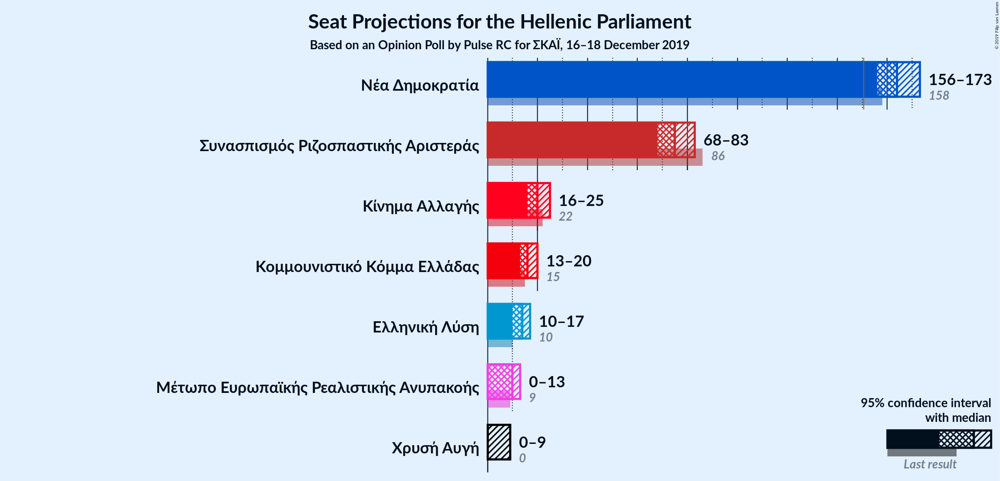

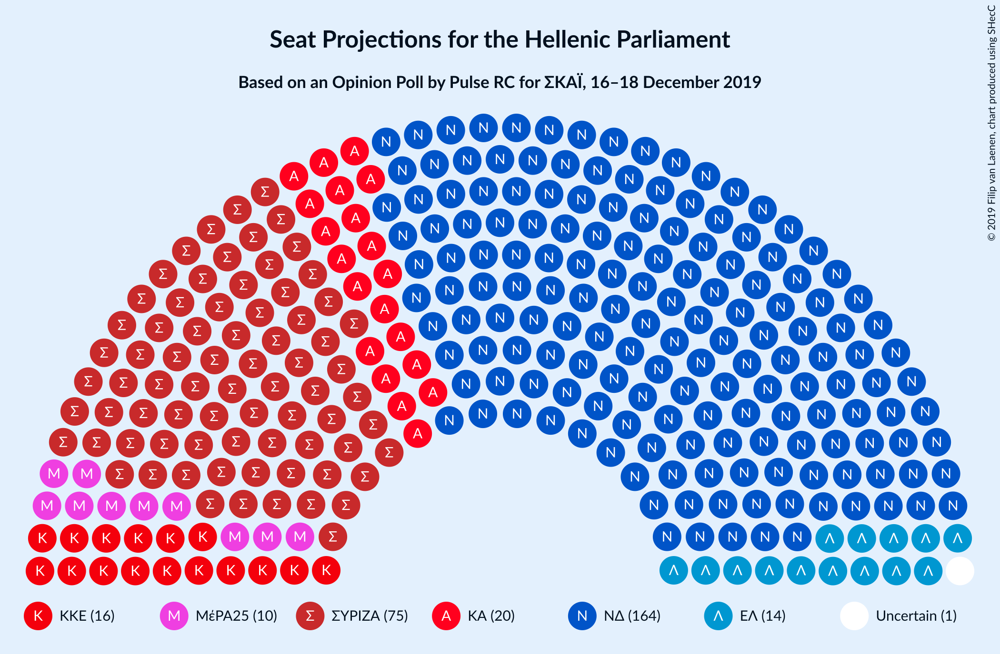

### Confidence Intervals

| Party | Last Result | Median | 80% Confidence Interval | 90% Confidence Interval | 95% Confidence Interval | 99% Confidence Interval |
|:-----:|:-----------:|:------:|:-----------------------:|:-----------------------:|:-----------------------:|:-----------------------:|
| <a href="#νέα-δημοκρατία">Νέα Δημοκρατία</a> | 158 | 164 | 159–170 |157–172 |156–173 |153–176 |
| <a href="#συνασπισμός-ριζοσπαστικής-αριστεράς">Συνασπισμός Ριζοσπαστικής Αριστεράς</a> | 86 | 75 | 71–81 |69–81 |68–82 |66–85 |
| <a href="#κίνημα-αλλαγής">Κίνημα Αλλαγής</a> | 22 | 20 | 18–23 |17–24 |16–25 |15–26 |
| <a href="#κομμουνιστικό-κόμμα-ελλάδας">Κομμουνιστικό Κόμμα Ελλάδας</a> | 15 | 16 | 14–19 |13–19 |13–20 |12–22 |
| <a href="#ελληνική-λύση">Ελληνική Λύση</a> | 10 | 14 | 11–16 |11–17 |10–17 |10–19 |
| <a href="#μέτωπο-ευρωπαϊκής-ρεαλιστικής-ανυπακοής">Μέτωπο Ευρωπαϊκής Ρεαλιστικής Ανυπακοής</a> | 9 | 10 | 0–11 |0–12 |0–12 |0–14 |
| <a href="#χρυσή-αυγή">Χρυσή Αυγή</a> | 0 | 0 | 0–8 |0–9 |0–9 |0–10 |

### Νέα Δημοκρατία

*For a full overview of the results for this party, see the [Νέα Δημοκρατία](party-νέαδημοκρατία.html) page.*

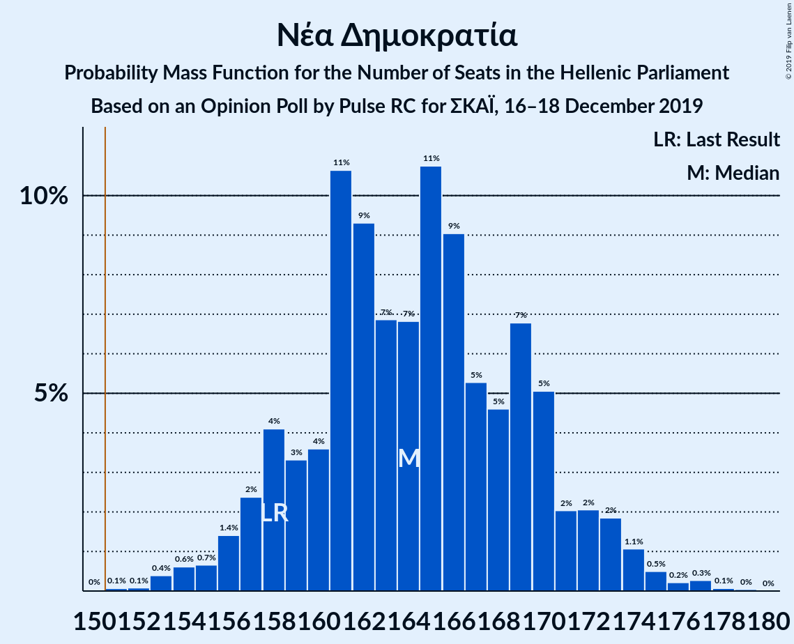

| Number of Seats | Probability | Accumulated | Special Marks |
|:---------------:|:-----------:|:-----------:|:-------------:|
| 151 | 0% | 100% | Majority |
| 152 | 0.1% | 99.9% |  |
| 153 | 0.6% | 99.8% |  |
| 154 | 0.4% | 99.2% |  |
| 155 | 0.2% | 98.8% |  |
| 156 | 2% | 98.6% |  |
| 157 | 3% | 96% |  |
| 158 | 3% | 93% | Last Result |
| 159 | 2% | 90% |  |
| 160 | 5% | 89% |  |
| 161 | 15% | 83% |  |
| 162 | 6% | 69% |  |
| 163 | 3% | 63% |  |
| 164 | 11% | 60% | Median |
| 165 | 14% | 49% |  |
| 166 | 6% | 34% |  |
| 167 | 3% | 28% |  |
| 168 | 7% | 25% |  |
| 169 | 8% | 18% |  |
| 170 | 2% | 11% |  |
| 171 | 1.4% | 9% |  |
| 172 | 3% | 7% |  |
| 173 | 2% | 4% |  |
| 174 | 0.6% | 2% |  |
| 175 | 0.3% | 1.1% |  |
| 176 | 0.3% | 0.8% |  |
| 177 | 0.3% | 0.5% |  |
| 178 | 0% | 0.1% |  |
| 179 | 0% | 0.1% |  |
| 180 | 0% | 0.1% |  |
| 181 | 0% | 0% |  |

### Συνασπισμός Ριζοσπαστικής Αριστεράς

*For a full overview of the results for this party, see the [Συνασπισμός Ριζοσπαστικής Αριστεράς](party-συνασπισμόςριζοσπαστικήςαριστεράς.html) page.*

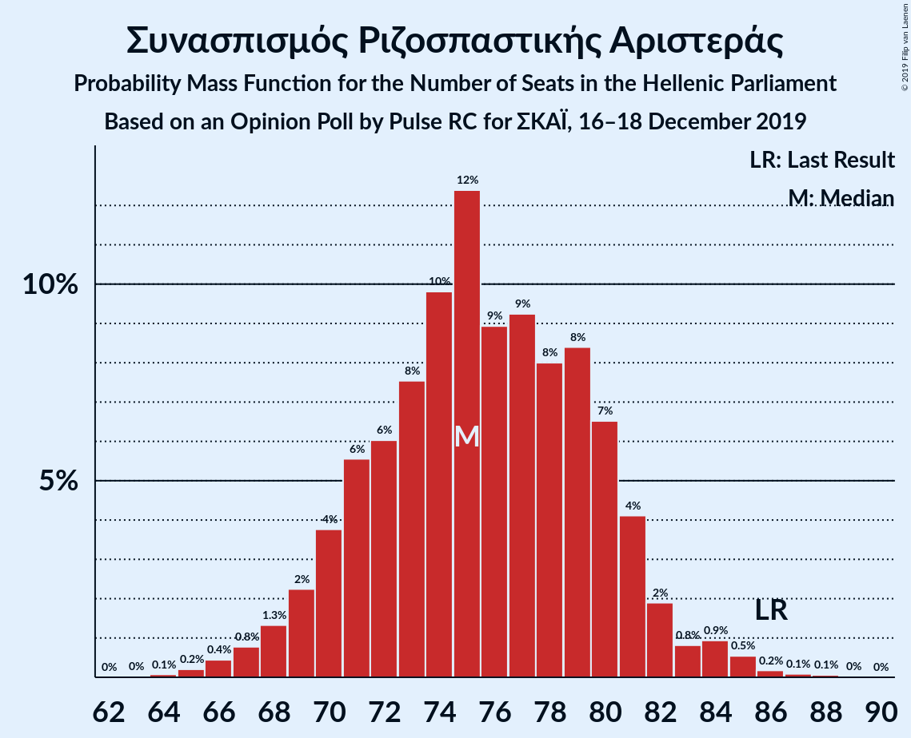

| Number of Seats | Probability | Accumulated | Special Marks |
|:---------------:|:-----------:|:-----------:|:-------------:|
| 64 | 0.1% | 100% |  |
| 65 | 0.2% | 99.9% |  |
| 66 | 0.5% | 99.7% |  |
| 67 | 1.0% | 99.3% |  |
| 68 | 1.4% | 98% |  |
| 69 | 3% | 97% |  |
| 70 | 3% | 94% |  |
| 71 | 4% | 91% |  |
| 72 | 6% | 87% |  |
| 73 | 6% | 81% |  |
| 74 | 12% | 74% |  |
| 75 | 14% | 62% | Median |
| 76 | 11% | 48% |  |
| 77 | 9% | 37% |  |
| 78 | 5% | 28% |  |
| 79 | 5% | 23% |  |
| 80 | 8% | 18% |  |
| 81 | 5% | 10% |  |
| 82 | 2% | 5% |  |
| 83 | 0.7% | 2% |  |
| 84 | 0.5% | 1.5% |  |
| 85 | 0.6% | 1.0% |  |
| 86 | 0.2% | 0.4% | Last Result |
| 87 | 0.1% | 0.2% |  |
| 88 | 0.1% | 0.1% |  |
| 89 | 0% | 0.1% |  |
| 90 | 0% | 0% |  |

### Κίνημα Αλλαγής

*For a full overview of the results for this party, see the [Κίνημα Αλλαγής](party-κίνημααλλαγής.html) page.*

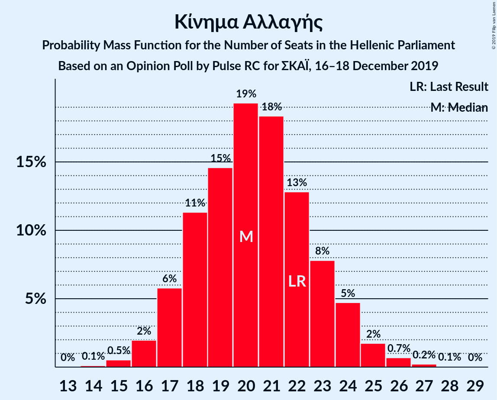

| Number of Seats | Probability | Accumulated | Special Marks |
|:---------------:|:-----------:|:-----------:|:-------------:|
| 14 | 0.1% | 100% |  |
| 15 | 0.6% | 99.9% |  |
| 16 | 2% | 99.3% |  |
| 17 | 5% | 97% |  |
| 18 | 12% | 92% |  |
| 19 | 14% | 80% |  |
| 20 | 18% | 66% | Median |
| 21 | 20% | 48% |  |
| 22 | 13% | 27% | Last Result |
| 23 | 7% | 14% |  |
| 24 | 5% | 7% |  |
| 25 | 2% | 3% |  |
| 26 | 0.6% | 0.9% |  |
| 27 | 0.2% | 0.3% |  |
| 28 | 0.1% | 0.1% |  |
| 29 | 0% | 0% |  |

### Κομμουνιστικό Κόμμα Ελλάδας

*For a full overview of the results for this party, see the [Κομμουνιστικό Κόμμα Ελλάδας](party-κομμουνιστικόκόμμαελλάδας.html) page.*

| Number of Seats | Probability | Accumulated | Special Marks |
|:---------------:|:-----------:|:-----------:|:-------------:|
| 11 | 0.2% | 100% |  |
| 12 | 1.2% | 99.7% |  |
| 13 | 4% | 98% |  |
| 14 | 13% | 95% |  |
| 15 | 16% | 82% | Last Result |
| 16 | 21% | 66% | Median |
| 17 | 20% | 45% |  |
| 18 | 12% | 25% |  |
| 19 | 8% | 13% |  |
| 20 | 3% | 5% |  |
| 21 | 1.4% | 2% |  |
| 22 | 0.4% | 0.5% |  |
| 23 | 0.1% | 0.1% |  |
| 24 | 0% | 0% |  |

### Ελληνική Λύση

*For a full overview of the results for this party, see the [Ελληνική Λύση](party-ελληνικήλύση.html) page.*

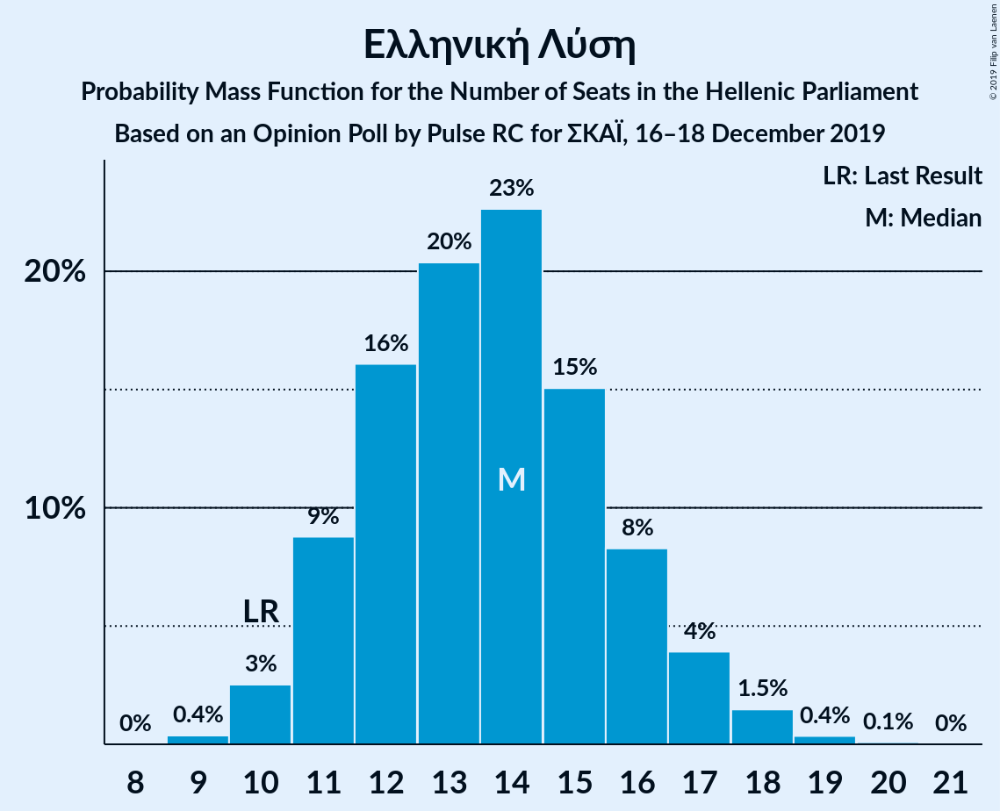

| Number of Seats | Probability | Accumulated | Special Marks |
|:---------------:|:-----------:|:-----------:|:-------------:|
| 9 | 0.4% | 100% |  |
| 10 | 2% | 99.6% | Last Result |
| 11 | 9% | 97% |  |
| 12 | 16% | 88% |  |
| 13 | 21% | 72% |  |
| 14 | 22% | 51% | Median |
| 15 | 15% | 29% |  |
| 16 | 8% | 14% |  |
| 17 | 4% | 6% |  |
| 18 | 1.5% | 2% |  |
| 19 | 0.4% | 0.5% |  |
| 20 | 0.1% | 0.1% |  |
| 21 | 0% | 0% |  |

### Μέτωπο Ευρωπαϊκής Ρεαλιστικής Ανυπακοής

*For a full overview of the results for this party, see the [Μέτωπο Ευρωπαϊκής Ρεαλιστικής Ανυπακοής](party-μέτωποευρωπαϊκήςρεαλιστικήςανυπακοής.html) page.*

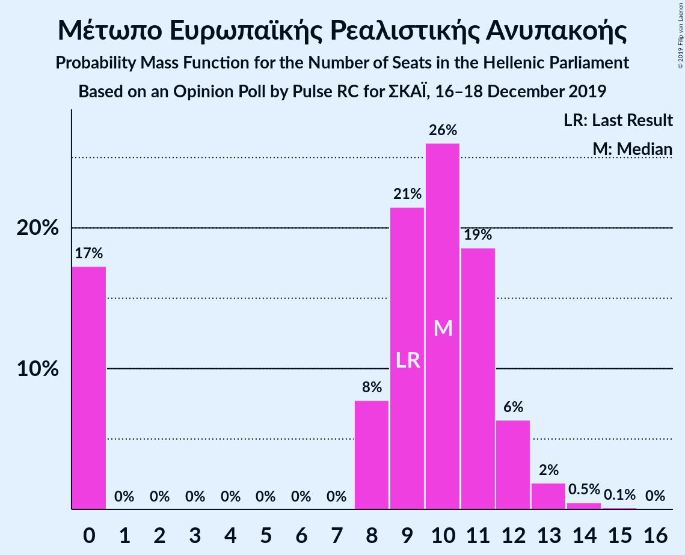

| Number of Seats | Probability | Accumulated | Special Marks |
|:---------------:|:-----------:|:-----------:|:-------------:|
| 0 | 16% | 100% |  |
| 1 | 0% | 84% |  |
| 2 | 0% | 84% |  |
| 3 | 0% | 84% |  |
| 4 | 0% | 84% |  |
| 5 | 0% | 84% |  |
| 6 | 0% | 84% |  |
| 7 | 0% | 84% |  |
| 8 | 8% | 84% |  |
| 9 | 22% | 76% | Last Result |
| 10 | 28% | 54% | Median |
| 11 | 18% | 26% |  |
| 12 | 6% | 8% |  |
| 13 | 2% | 2% |  |
| 14 | 0.5% | 0.6% |  |
| 15 | 0.1% | 0.1% |  |
| 16 | 0% | 0% |  |

### Χρυσή Αυγή

*For a full overview of the results for this party, see the [Χρυσή Αυγή](party-χρυσήαυγή.html) page.*

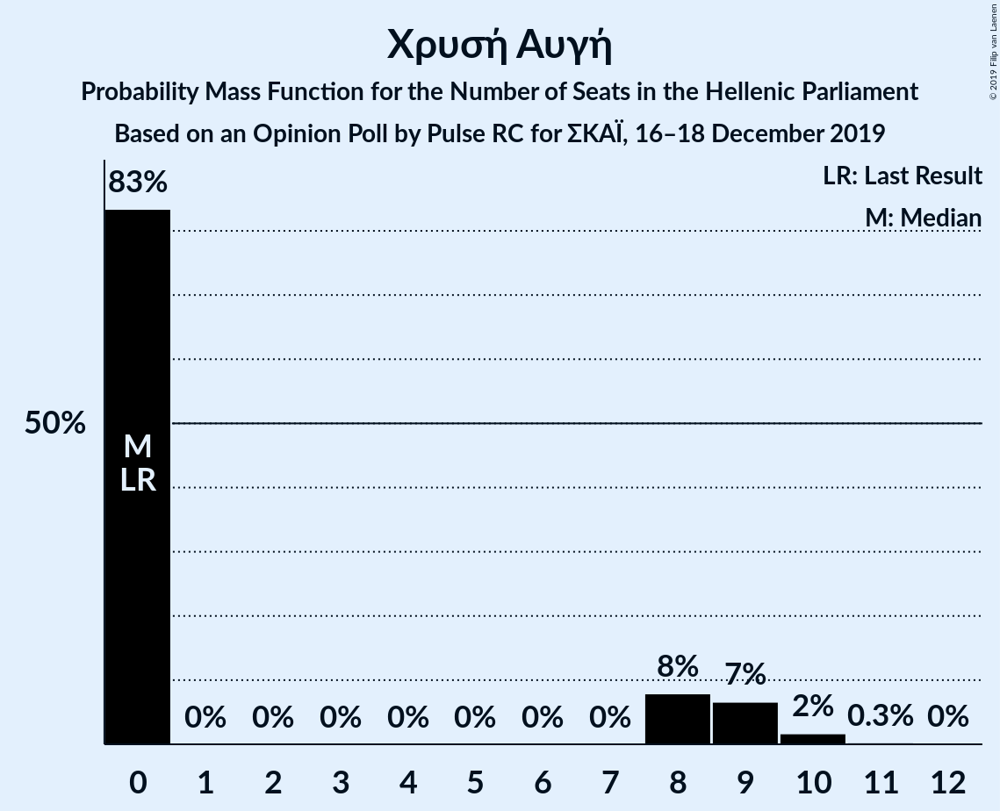

| Number of Seats | Probability | Accumulated | Special Marks |
|:---------------:|:-----------:|:-----------:|:-------------:|
| 0 | 83% | 100% | Last Result, Median |
| 1 | 0% | 17% |  |
| 2 | 0% | 17% |  |
| 3 | 0% | 17% |  |
| 4 | 0% | 17% |  |
| 5 | 0% | 17% |  |
| 6 | 0% | 17% |  |
| 7 | 0% | 17% |  |
| 8 | 8% | 17% |  |
| 9 | 6% | 8% |  |
| 10 | 2% | 2% |  |
| 11 | 0.3% | 0.3% |  |
| 12 | 0% | 0% |  |

## Coalitions

### Confidence Intervals

| Coalition | Last Result | Median | Majority? | 80% Confidence Interval | 90% Confidence Interval | 95% Confidence Interval | 99% Confidence Interval |
|:---------:|:-----------:|:------:|:---------:|:-----------------------:|:-----------------------:|:-----------------------:|:-----------------------:|
| Νέα Δημοκρατία – Κίνημα Αλλαγής | 180 | 185 | 100% | 179–191 | 177–193 | 176–193 | 173–197 |
| Νέα Δημοκρατία | 158 | 164 | 100% | 159–170 | 157–172 | 156–173 | 153–176 |
| Συνασπισμός Ριζοσπαστικής Αριστεράς – Μέτωπο Ευρωπαϊκής Ρεαλιστικής Ανυπακοής | 95 | 85 | 0% | 77–90 | 75–91 | 75–92 | 71–94 |
| Συνασπισμός Ριζοσπαστικής Αριστεράς | 86 | 75 | 0% | 71–81 | 69–81 | 68–82 | 66–85 |

### Νέα Δημοκρατία – Κίνημα Αλλαγής

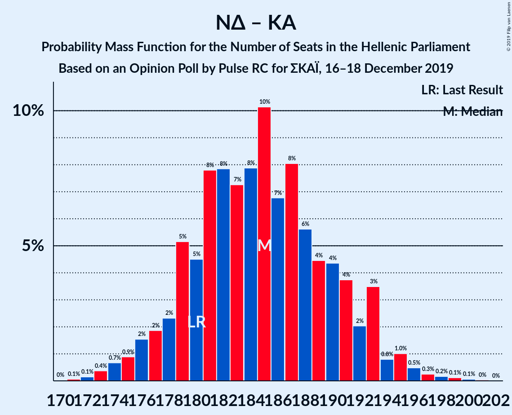

| Number of Seats | Probability | Accumulated | Special Marks |
|:---------------:|:-----------:|:-----------:|:-------------:|
| 170 | 0% | 100% |  |
| 171 | 0.1% | 99.9% |  |
| 172 | 0.2% | 99.9% |  |
| 173 | 0.4% | 99.7% |  |
| 174 | 0.7% | 99.4% |  |
| 175 | 1.0% | 98.7% |  |
| 176 | 1.5% | 98% |  |
| 177 | 2% | 96% |  |
| 178 | 2% | 94% |  |
| 179 | 6% | 92% |  |
| 180 | 4% | 86% | Last Result |
| 181 | 8% | 82% |  |
| 182 | 7% | 74% |  |
| 183 | 8% | 67% |  |
| 184 | 8% | 59% | Median |
| 185 | 11% | 52% |  |
| 186 | 8% | 40% |  |
| 187 | 8% | 33% |  |
| 188 | 6% | 25% |  |
| 189 | 4% | 19% |  |
| 190 | 3% | 15% |  |
| 191 | 4% | 12% |  |
| 192 | 2% | 8% |  |
| 193 | 4% | 6% |  |
| 194 | 0.6% | 2% |  |
| 195 | 0.7% | 2% |  |
| 196 | 0.4% | 1.1% |  |
| 197 | 0.3% | 0.7% |  |
| 198 | 0.2% | 0.5% |  |
| 199 | 0.1% | 0.3% |  |
| 200 | 0.1% | 0.2% |  |
| 201 | 0.1% | 0.1% |  |
| 202 | 0% | 0% |  |

### Νέα Δημοκρατία

| Number of Seats | Probability | Accumulated | Special Marks |
|:---------------:|:-----------:|:-----------:|:-------------:|
| 151 | 0% | 100% | Majority |
| 152 | 0.1% | 99.9% |  |
| 153 | 0.6% | 99.8% |  |
| 154 | 0.4% | 99.2% |  |
| 155 | 0.2% | 98.8% |  |
| 156 | 2% | 98.6% |  |
| 157 | 3% | 96% |  |
| 158 | 3% | 93% | Last Result |
| 159 | 2% | 90% |  |
| 160 | 5% | 89% |  |
| 161 | 15% | 83% |  |
| 162 | 6% | 69% |  |
| 163 | 3% | 63% |  |
| 164 | 11% | 60% | Median |
| 165 | 14% | 49% |  |
| 166 | 6% | 34% |  |
| 167 | 3% | 28% |  |
| 168 | 7% | 25% |  |
| 169 | 8% | 18% |  |
| 170 | 2% | 11% |  |
| 171 | 1.4% | 9% |  |
| 172 | 3% | 7% |  |
| 173 | 2% | 4% |  |
| 174 | 0.6% | 2% |  |
| 175 | 0.3% | 1.1% |  |
| 176 | 0.3% | 0.8% |  |
| 177 | 0.3% | 0.5% |  |
| 178 | 0% | 0.1% |  |
| 179 | 0% | 0.1% |  |
| 180 | 0% | 0.1% |  |
| 181 | 0% | 0% |  |

### Συνασπισμός Ριζοσπαστικής Αριστεράς – Μέτωπο Ευρωπαϊκής Ρεαλιστικής Ανυπακοής

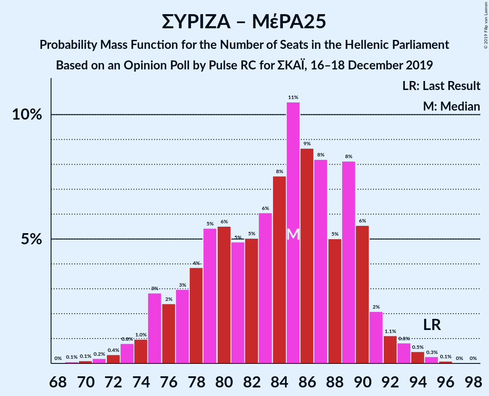

| Number of Seats | Probability | Accumulated | Special Marks |
|:---------------:|:-----------:|:-----------:|:-------------:|
| 69 | 0.1% | 100% |  |
| 70 | 0.1% | 99.9% |  |
| 71 | 0.2% | 99.7% |  |
| 72 | 0.3% | 99.5% |  |
| 73 | 0.6% | 99.2% |  |
| 74 | 1.0% | 98.6% |  |
| 75 | 3% | 98% |  |
| 76 | 3% | 95% |  |
| 77 | 3% | 92% |  |
| 78 | 2% | 89% |  |
| 79 | 3% | 87% |  |
| 80 | 5% | 83% |  |
| 81 | 5% | 78% |  |
| 82 | 6% | 73% |  |
| 83 | 6% | 66% |  |
| 84 | 7% | 60% |  |
| 85 | 13% | 54% | Median |
| 86 | 11% | 41% |  |
| 87 | 10% | 30% |  |
| 88 | 3% | 20% |  |
| 89 | 5% | 17% |  |
| 90 | 6% | 12% |  |
| 91 | 3% | 5% |  |
| 92 | 1.4% | 3% |  |
| 93 | 0.4% | 1.3% |  |
| 94 | 0.4% | 0.9% |  |
| 95 | 0.3% | 0.5% | Last Result |
| 96 | 0.1% | 0.2% |  |
| 97 | 0% | 0% |  |

### Συνασπισμός Ριζοσπαστικής Αριστεράς

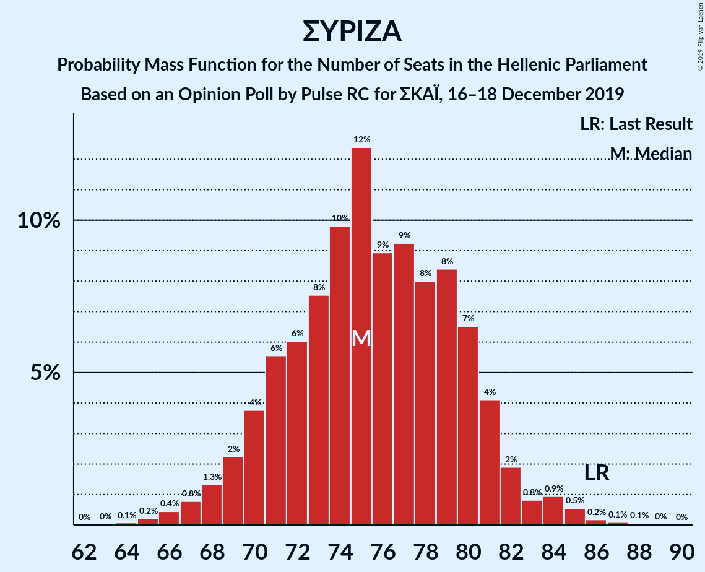

| Number of Seats | Probability | Accumulated | Special Marks |
|:---------------:|:-----------:|:-----------:|:-------------:|
| 64 | 0.1% | 100% |  |
| 65 | 0.2% | 99.9% |  |
| 66 | 0.5% | 99.7% |  |
| 67 | 1.0% | 99.3% |  |
| 68 | 1.4% | 98% |  |
| 69 | 3% | 97% |  |
| 70 | 3% | 94% |  |
| 71 | 4% | 91% |  |
| 72 | 6% | 87% |  |
| 73 | 6% | 81% |  |
| 74 | 12% | 74% |  |
| 75 | 14% | 62% | Median |
| 76 | 11% | 48% |  |
| 77 | 9% | 37% |  |
| 78 | 5% | 28% |  |
| 79 | 5% | 23% |  |
| 80 | 8% | 18% |  |
| 81 | 5% | 10% |  |
| 82 | 2% | 5% |  |
| 83 | 0.7% | 2% |  |
| 84 | 0.5% | 1.5% |  |
| 85 | 0.6% | 1.0% |  |
| 86 | 0.2% | 0.4% | Last Result |
| 87 | 0.1% | 0.2% |  |
| 88 | 0.1% | 0.1% |  |
| 89 | 0% | 0.1% |  |
| 90 | 0% | 0% |  |

## Technical Information

### Opinion Poll

+ **Polling firm:** Pulse RC
+ **Commissioner(s):** ΣΚΑΪ
+ **Fieldwork period:** 16–18 December 2019

### Calculations

+ **Sample size:** 1202
+ **Simulations done:** 524,288
+ **Error estimate:** 1.04%

