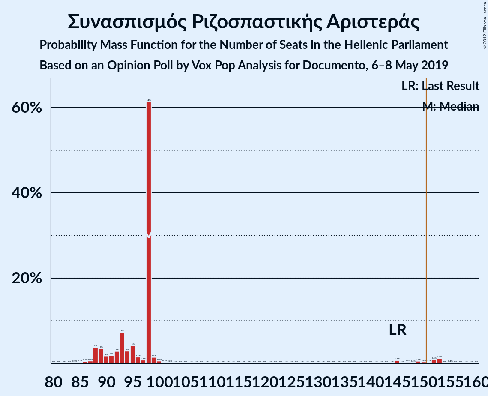
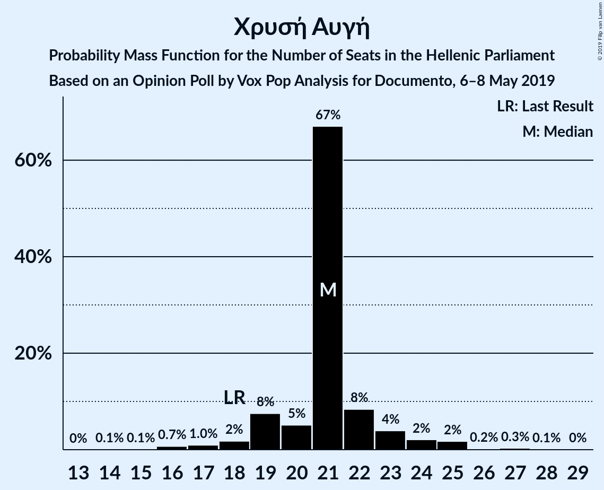
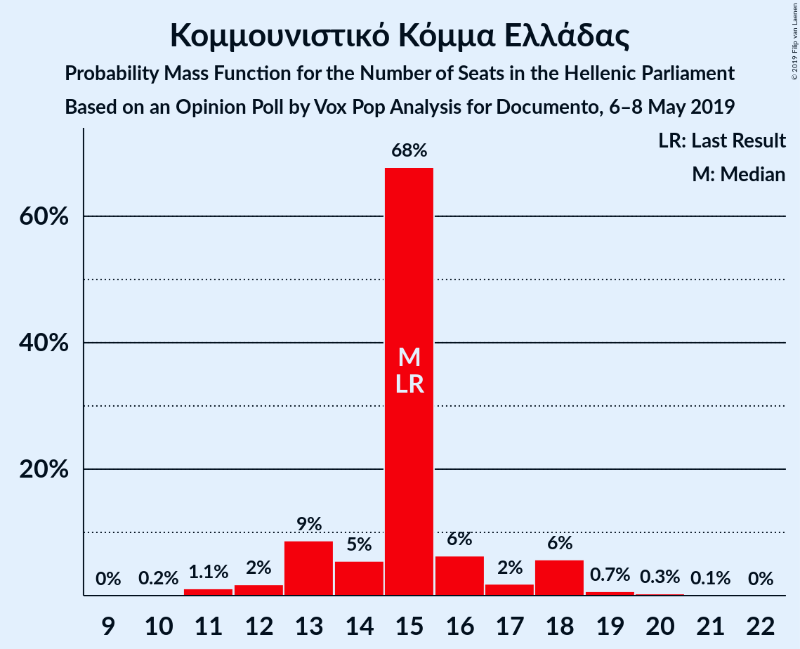
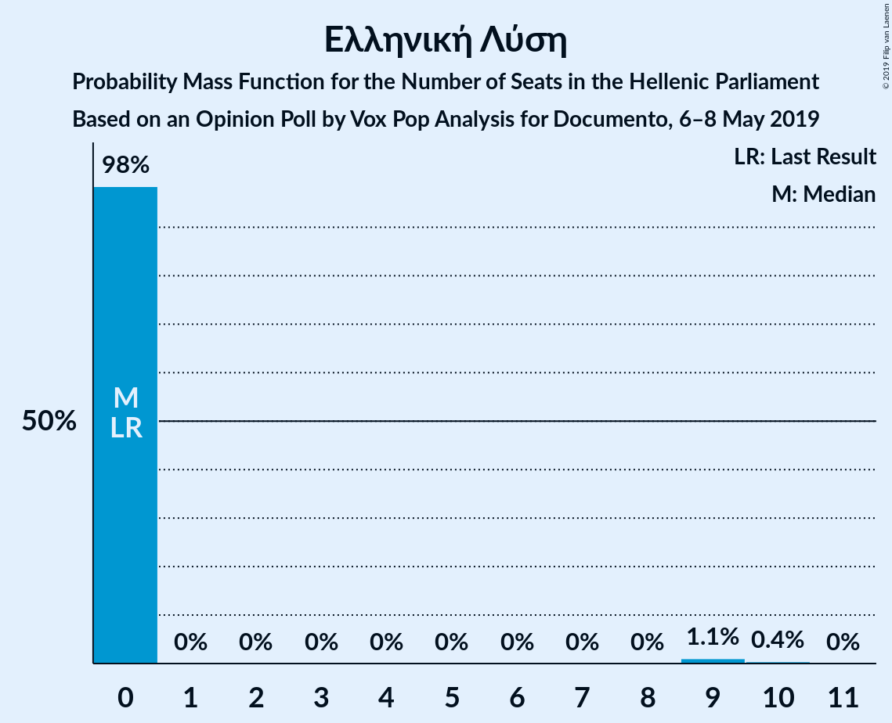
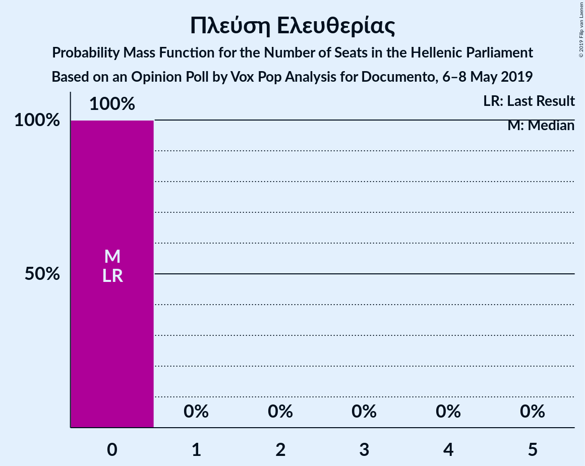
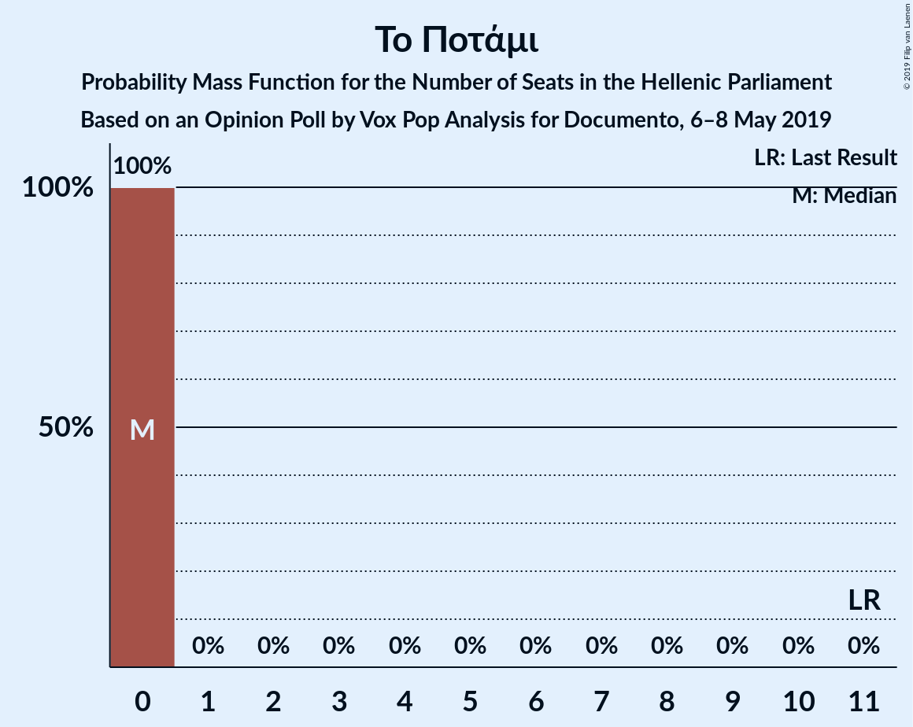
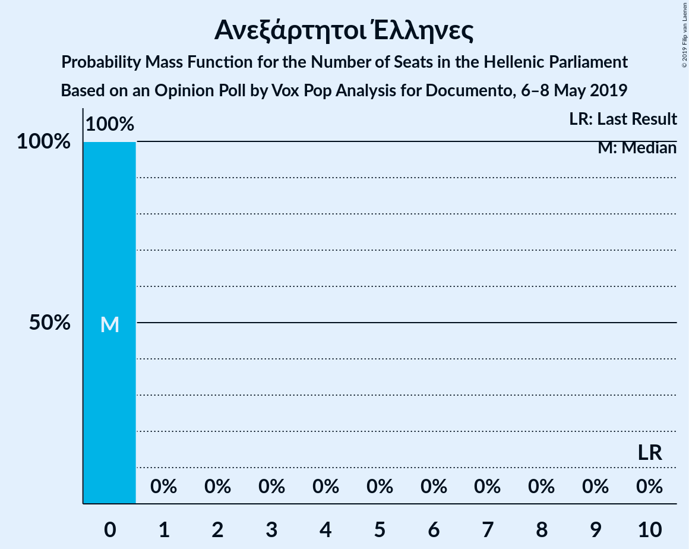
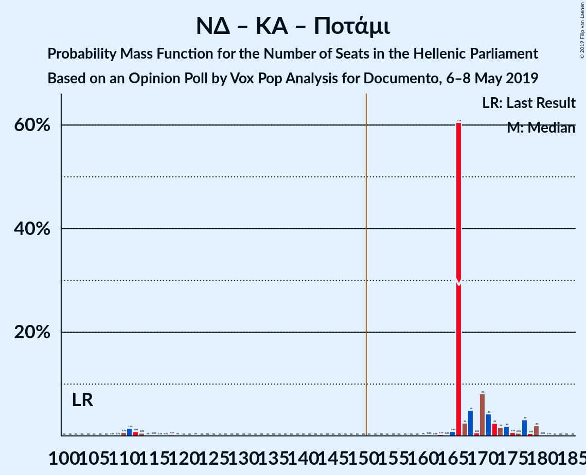
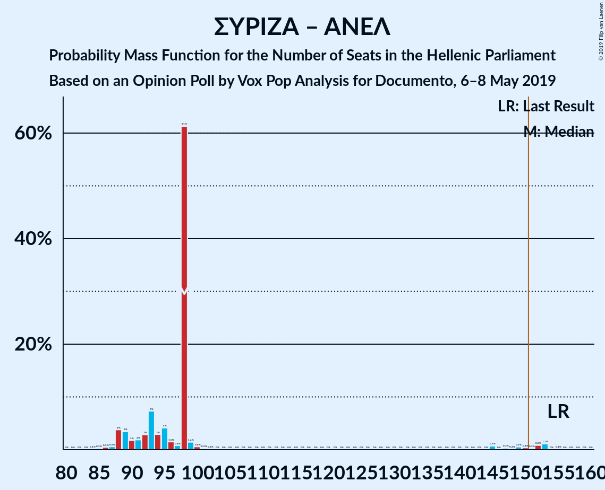

# Opinion Poll by Vox Pop Analysis for Documento, 6–8 May 2019

<a href="#voting-intentions">Voting Intentions</a> | <a href="#seats">Seats</a> | <a href="#coalitions">Coalitions</a> | <a href="#technical-information">Technical Information</a>

## Voting Intentions

### Confidence Intervals

| Party | Last Result | Poll Result | 80% Confidence Interval | 90% Confidence Interval | 95% Confidence Interval | 99% Confidence Interval |
|:-----:|:-----------:|:-----------:|:-----------------------:|:-----------------------:|:-----------------------:|:-----------------------:|
| Νέα Δημοκρατία | 28.1% | 35.0% | 33.3–36.7% |32.8–37.2% |32.4–37.6% |31.6–38.5% |
| Συνασπισμός Ριζοσπαστικής Αριστεράς | 35.5% | 32.0% | 30.4–33.7% |29.9–34.2% |29.5–34.6% |28.8–35.5% |
| Χρυσή Αυγή | 7.0% | 7.0% | 6.2–8.0% |5.9–8.3% |5.7–8.5% |5.3–9.0% |
| Κίνημα Αλλαγής | 6.3% | 6.0% | 5.2–6.9% |5.0–7.2% |4.8–7.4% |4.5–7.9% |
| Κομμουνιστικό Κόμμα Ελλάδας | 5.6% | 5.0% | 4.3–5.9% |4.1–6.1% |3.9–6.3% |3.6–6.8% |
| Ελληνική Λύση | 0.0% | 2.0% | 1.6–2.6% |1.5–2.8% |1.4–3.0% |1.2–3.3% |
| Ένωση Κεντρώων | 3.4% | 1.0% | 0.7–1.5% |0.7–1.6% |0.6–1.7% |0.5–2.0% |
| Λαϊκή Ενότητα | 2.9% | 1.0% | 0.7–1.5% |0.7–1.6% |0.6–1.7% |0.5–2.0% |
| Πλεύση Ελευθερίας | 0.0% | 1.0% | 0.7–1.5% |0.7–1.6% |0.6–1.7% |0.5–2.0% |
| Το Ποτάμι | 4.1% | 0.8% | 0.5–1.2% |0.5–1.3% |0.4–1.4% |0.3–1.7% |
| Ανεξάρτητοι Έλληνες | 3.7% | 0.2% | 0.1–0.5% |0.1–0.6% |0.1–0.7% |0.0–0.9% |

*Note:* The poll result column reflects the actual value used in the calculations. Published results may vary slightly, and in addition be rounded to fewer digits.

## Seats

### Confidence Intervals

| Party | Last Result | Median | 80% Confidence Interval | 90% Confidence Interval | 95% Confidence Interval | 99% Confidence Interval |
|:-----:|:-----------:|:------:|:-----------------------:|:-----------------------:|:-----------------------:|:-----------------------:|
| <a href="#νέα-δημοκρατία">Νέα Δημοκρατία</a> | 75 | 148 | 148–156 |147–157 |95–160 |92–162 |
| <a href="#συνασπισμός-ριζοσπαστικής-αριστεράς">Συνασπισμός Ριζοσπαστικής Αριστεράς</a> | 145 | 98 | 90–98 |88–100 |88–150 |86–153 |
| <a href="#χρυσή-αυγή">Χρυσή Αυγή</a> | 18 | 21 | 19–22 |19–23 |18–24 |16–26 |
| <a href="#κίνημα-αλλαγής">Κίνημα Αλλαγής</a> | 17 | 18 | 16–20 |15–20 |15–22 |13–22 |
| <a href="#κομμουνιστικό-κόμμα-ελλάδας">Κομμουνιστικό Κόμμα Ελλάδας</a> | 15 | 15 | 13–16 |13–18 |12–18 |11–19 |
| <a href="#ελληνική-λύση">Ελληνική Λύση</a> | 0 | 0 | 0 |0 |0 |0–9 |
| <a href="#ένωση-κεντρώων">Ένωση Κεντρώων</a> | 9 | 0 | 0 |0 |0 |0 |
| <a href="#λαϊκή-ενότητα">Λαϊκή Ενότητα</a> | 0 | 0 | 0 |0 |0 |0 |
| <a href="#πλεύση-ελευθερίας">Πλεύση Ελευθερίας</a> | 0 | 0 | 0 |0 |0 |0 |
| <a href="#το-ποτάμι">Το Ποτάμι</a> | 11 | 0 | 0 |0 |0 |0 |
| <a href="#ανεξάρτητοι-έλληνες">Ανεξάρτητοι Έλληνες</a> | 10 | 0 | 0 |0 |0 |0 |

### Νέα Δημοκρατία

*For a full overview of the results for this party, see the [Νέα Δημοκρατία](party-νέαδημοκρατία.html) page.*

| Number of Seats | Probability | Accumulated | Special Marks |
|:---------------:|:-----------:|:-----------:|:-------------:|
| 75 | 0% | 100% | Last Result |
| 76 | 0% | 100% |  |
| 77 | 0% | 100% |  |
| 78 | 0% | 100% |  |
| 79 | 0% | 100% |  |
| 80 | 0% | 100% |  |
| 81 | 0% | 100% |  |
| 82 | 0% | 100% |  |
| 83 | 0% | 100% |  |
| 84 | 0% | 100% |  |
| 85 | 0% | 100% |  |
| 86 | 0% | 100% |  |
| 87 | 0% | 100% |  |
| 88 | 0% | 100% |  |
| 89 | 0% | 100% |  |
| 90 | 0% | 100% |  |
| 91 | 0.1% | 100% |  |
| 92 | 0.7% | 99.8% |  |
| 93 | 0.3% | 99.1% |  |
| 94 | 0.8% | 98.8% |  |
| 95 | 1.2% | 98% |  |
| 96 | 0.5% | 97% |  |
| 97 | 0.2% | 96% |  |
| 98 | 0.2% | 96% |  |
| 99 | 0.4% | 96% |  |
| 100 | 0% | 96% |  |
| 101 | 0% | 96% |  |
| 102 | 0% | 96% |  |
| 103 | 0% | 96% |  |
| 104 | 0% | 96% |  |
| 105 | 0% | 96% |  |
| 106 | 0% | 96% |  |
| 107 | 0% | 96% |  |
| 108 | 0% | 96% |  |
| 109 | 0% | 96% |  |
| 110 | 0% | 96% |  |
| 111 | 0% | 96% |  |
| 112 | 0% | 96% |  |
| 113 | 0% | 96% |  |
| 114 | 0% | 96% |  |
| 115 | 0% | 96% |  |
| 116 | 0% | 96% |  |
| 117 | 0% | 96% |  |
| 118 | 0% | 96% |  |
| 119 | 0% | 96% |  |
| 120 | 0% | 96% |  |
| 121 | 0% | 96% |  |
| 122 | 0% | 96% |  |
| 123 | 0% | 96% |  |
| 124 | 0% | 96% |  |
| 125 | 0% | 96% |  |
| 126 | 0% | 96% |  |
| 127 | 0% | 96% |  |
| 128 | 0% | 96% |  |
| 129 | 0% | 96% |  |
| 130 | 0% | 96% |  |
| 131 | 0% | 96% |  |
| 132 | 0% | 96% |  |
| 133 | 0% | 96% |  |
| 134 | 0% | 96% |  |
| 135 | 0% | 96% |  |
| 136 | 0% | 96% |  |
| 137 | 0% | 96% |  |
| 138 | 0% | 96% |  |
| 139 | 0% | 96% |  |
| 140 | 0% | 96% |  |
| 141 | 0% | 96% |  |
| 142 | 0% | 96% |  |
| 143 | 0% | 96% |  |
| 144 | 0% | 96% |  |
| 145 | 0.1% | 95% |  |
| 146 | 0.2% | 95% |  |
| 147 | 2% | 95% |  |
| 148 | 62% | 93% | Median |
| 149 | 0.7% | 31% |  |
| 150 | 4% | 31% |  |
| 151 | 2% | 27% | Majority |
| 152 | 4% | 25% |  |
| 153 | 6% | 20% |  |
| 154 | 2% | 15% |  |
| 155 | 1.3% | 12% |  |
| 156 | 1.5% | 11% |  |
| 157 | 5% | 10% |  |
| 158 | 0.5% | 4% |  |
| 159 | 0.7% | 4% |  |
| 160 | 2% | 3% |  |
| 161 | 0.2% | 0.8% |  |
| 162 | 0.4% | 0.6% |  |
| 163 | 0.1% | 0.2% |  |
| 164 | 0.1% | 0.1% |  |
| 165 | 0% | 0% |  |

### Συνασπισμός Ριζοσπαστικής Αριστεράς

*For a full overview of the results for this party, see the [Συνασπισμός Ριζοσπαστικής Αριστεράς](party-συνασπισμόςριζοσπαστικήςαριστεράς.html) page.*

| Number of Seats | Probability | Accumulated | Special Marks |
|:---------------:|:-----------:|:-----------:|:-------------:|
| 83 | 0% | 100% |  |
| 84 | 0.1% | 99.9% |  |
| 85 | 0.2% | 99.8% |  |
| 86 | 0.5% | 99.6% |  |
| 87 | 0.6% | 99.1% |  |
| 88 | 4% | 98.5% |  |
| 89 | 3% | 95% |  |
| 90 | 2% | 91% |  |
| 91 | 2% | 90% |  |
| 92 | 3% | 88% |  |
| 93 | 7% | 85% |  |
| 94 | 3% | 77% |  |
| 95 | 4% | 75% |  |
| 96 | 1.5% | 70% |  |
| 97 | 0.8% | 69% |  |
| 98 | 61% | 68% | Median |
| 99 | 1.4% | 7% |  |
| 100 | 0.6% | 5% |  |
| 101 | 0.2% | 5% |  |
| 102 | 0.2% | 5% |  |
| 103 | 0% | 4% |  |
| 104 | 0% | 4% |  |
| 105 | 0% | 4% |  |
| 106 | 0% | 4% |  |
| 107 | 0% | 4% |  |
| 108 | 0% | 4% |  |
| 109 | 0% | 4% |  |
| 110 | 0% | 4% |  |
| 111 | 0% | 4% |  |
| 112 | 0% | 4% |  |
| 113 | 0% | 4% |  |
| 114 | 0% | 4% |  |
| 115 | 0% | 4% |  |
| 116 | 0% | 4% |  |
| 117 | 0% | 4% |  |
| 118 | 0% | 4% |  |
| 119 | 0% | 4% |  |
| 120 | 0% | 4% |  |
| 121 | 0% | 4% |  |
| 122 | 0% | 4% |  |
| 123 | 0% | 4% |  |
| 124 | 0% | 4% |  |
| 125 | 0% | 4% |  |
| 126 | 0% | 4% |  |
| 127 | 0% | 4% |  |
| 128 | 0% | 4% |  |
| 129 | 0% | 4% |  |
| 130 | 0% | 4% |  |
| 131 | 0% | 4% |  |
| 132 | 0% | 4% |  |
| 133 | 0% | 4% |  |
| 134 | 0% | 4% |  |
| 135 | 0% | 4% |  |
| 136 | 0% | 4% |  |
| 137 | 0% | 4% |  |
| 138 | 0% | 4% |  |
| 139 | 0% | 4% |  |
| 140 | 0% | 4% |  |
| 141 | 0% | 4% |  |
| 142 | 0% | 4% |  |
| 143 | 0% | 4% |  |
| 144 | 0% | 4% |  |
| 145 | 0.7% | 4% | Last Result |
| 146 | 0% | 4% |  |
| 147 | 0.3% | 4% |  |
| 148 | 0.2% | 3% |  |
| 149 | 0.5% | 3% |  |
| 150 | 0.4% | 3% |  |
| 151 | 0.2% | 2% | Majority |
| 152 | 0.8% | 2% |  |
| 153 | 1.1% | 1.3% |  |
| 154 | 0% | 0.2% |  |
| 155 | 0.1% | 0.2% |  |
| 156 | 0% | 0.1% |  |
| 157 | 0% | 0% |  |

### Χρυσή Αυγή

*For a full overview of the results for this party, see the [Χρυσή Αυγή](party-χρυσήαυγή.html) page.*

| Number of Seats | Probability | Accumulated | Special Marks |
|:---------------:|:-----------:|:-----------:|:-------------:|
| 14 | 0.1% | 100% |  |
| 15 | 0.1% | 99.9% |  |
| 16 | 0.7% | 99.9% |  |
| 17 | 1.0% | 99.2% |  |
| 18 | 2% | 98% | Last Result |
| 19 | 8% | 96% |  |
| 20 | 5% | 89% |  |
| 21 | 67% | 84% | Median |
| 22 | 8% | 17% |  |
| 23 | 4% | 8% |  |
| 24 | 2% | 4% |  |
| 25 | 2% | 2% |  |
| 26 | 0.2% | 0.6% |  |
| 27 | 0.3% | 0.4% |  |
| 28 | 0.1% | 0.1% |  |
| 29 | 0% | 0% |  |

### Κίνημα Αλλαγής

*For a full overview of the results for this party, see the [Κίνημα Αλλαγής](party-κίνημααλλαγής.html) page.*

| Number of Seats | Probability | Accumulated | Special Marks |
|:---------------:|:-----------:|:-----------:|:-------------:|
| 12 | 0.2% | 100% |  |
| 13 | 0.6% | 99.8% |  |
| 14 | 1.4% | 99.2% |  |
| 15 | 4% | 98% |  |
| 16 | 5% | 94% |  |
| 17 | 9% | 89% | Last Result |
| 18 | 65% | 80% | Median |
| 19 | 4% | 15% |  |
| 20 | 6% | 11% |  |
| 21 | 1.1% | 4% |  |
| 22 | 2% | 3% |  |
| 23 | 0.2% | 0.5% |  |
| 24 | 0.2% | 0.2% |  |
| 25 | 0% | 0.1% |  |
| 26 | 0% | 0% |  |

### Κομμουνιστικό Κόμμα Ελλάδας

*For a full overview of the results for this party, see the [Κομμουνιστικό Κόμμα Ελλάδας](party-κομμουνιστικόκόμμαελλάδας.html) page.*

| Number of Seats | Probability | Accumulated | Special Marks |
|:---------------:|:-----------:|:-----------:|:-------------:|
| 10 | 0.2% | 100% |  |
| 11 | 1.1% | 99.8% |  |
| 12 | 2% | 98.7% |  |
| 13 | 9% | 97% |  |
| 14 | 5% | 88% |  |
| 15 | 68% | 83% | Last Result, Median |
| 16 | 6% | 15% |  |
| 17 | 2% | 9% |  |
| 18 | 6% | 7% |  |
| 19 | 0.7% | 1.1% |  |
| 20 | 0.3% | 0.5% |  |
| 21 | 0.1% | 0.1% |  |
| 22 | 0% | 0% |  |

### Ελληνική Λύση

*For a full overview of the results for this party, see the [Ελληνική Λύση](party-ελληνικήλύση.html) page.*

| Number of Seats | Probability | Accumulated | Special Marks |
|:---------------:|:-----------:|:-----------:|:-------------:|
| 0 | 98% | 100% | Last Result, Median |
| 1 | 0% | 2% |  |
| 2 | 0% | 2% |  |
| 3 | 0% | 2% |  |
| 4 | 0% | 2% |  |
| 5 | 0% | 2% |  |
| 6 | 0% | 2% |  |
| 7 | 0% | 2% |  |
| 8 | 0% | 2% |  |
| 9 | 1.1% | 2% |  |
| 10 | 0.4% | 0.5% |  |
| 11 | 0% | 0% |  |

### Ένωση Κεντρώων

*For a full overview of the results for this party, see the [Ένωση Κεντρώων](party-ένωσηκεντρώων.html) page.*

| Number of Seats | Probability | Accumulated | Special Marks |
|:---------------:|:-----------:|:-----------:|:-------------:|
| 0 | 100% | 100% | Median |
| 1 | 0% | 0% |  |
| 2 | 0% | 0% |  |
| 3 | 0% | 0% |  |
| 4 | 0% | 0% |  |
| 5 | 0% | 0% |  |
| 6 | 0% | 0% |  |
| 7 | 0% | 0% |  |
| 8 | 0% | 0% |  |
| 9 | 0% | 0% | Last Result |

### Λαϊκή Ενότητα

*For a full overview of the results for this party, see the [Λαϊκή Ενότητα](party-λαϊκήενότητα.html) page.*

| Number of Seats | Probability | Accumulated | Special Marks |
|:---------------:|:-----------:|:-----------:|:-------------:|
| 0 | 100% | 100% | Last Result, Median |

### Πλεύση Ελευθερίας

*For a full overview of the results for this party, see the [Πλεύση Ελευθερίας](party-πλεύσηελευθερίας.html) page.*

| Number of Seats | Probability | Accumulated | Special Marks |
|:---------------:|:-----------:|:-----------:|:-------------:|
| 0 | 100% | 100% | Last Result, Median |

### Το Ποτάμι

*For a full overview of the results for this party, see the [Το Ποτάμι](party-τοποτάμι.html) page.*

| Number of Seats | Probability | Accumulated | Special Marks |
|:---------------:|:-----------:|:-----------:|:-------------:|
| 0 | 100% | 100% | Median |
| 1 | 0% | 0% |  |
| 2 | 0% | 0% |  |
| 3 | 0% | 0% |  |
| 4 | 0% | 0% |  |
| 5 | 0% | 0% |  |
| 6 | 0% | 0% |  |
| 7 | 0% | 0% |  |
| 8 | 0% | 0% |  |
| 9 | 0% | 0% |  |
| 10 | 0% | 0% |  |
| 11 | 0% | 0% | Last Result |

### Ανεξάρτητοι Έλληνες

*For a full overview of the results for this party, see the [Ανεξάρτητοι Έλληνες](party-ανεξάρτητοιέλληνες.html) page.*

| Number of Seats | Probability | Accumulated | Special Marks |
|:---------------:|:-----------:|:-----------:|:-------------:|
| 0 | 100% | 100% | Median |
| 1 | 0% | 0% |  |
| 2 | 0% | 0% |  |
| 3 | 0% | 0% |  |
| 4 | 0% | 0% |  |
| 5 | 0% | 0% |  |
| 6 | 0% | 0% |  |
| 7 | 0% | 0% |  |
| 8 | 0% | 0% |  |
| 9 | 0% | 0% |  |
| 10 | 0% | 0% | Last Result |

## Coalitions

### Confidence Intervals

| Coalition | Last Result | Median | Majority? | 80% Confidence Interval | 90% Confidence Interval | 95% Confidence Interval | 99% Confidence Interval |
|:---------:|:-----------:|:------:|:---------:|:-----------------------:|:-----------------------:|:-----------------------:|:-----------------------:|
| Νέα Δημοκρατία – Κίνημα Αλλαγής | 92 | 166 | 96% | 166–173 | 163–177 | 112–178 | 110–179 |
| Νέα Δημοκρατία – Κίνημα Αλλαγής – Το Ποτάμι | 103 | 166 | 96% | 166–173 | 163–177 | 112–178 | 110–179 |
| Νέα Δημοκρατία | 75 | 148 | 27% | 148–156 | 147–157 | 95–160 | 92–162 |
| Νέα Δημοκρατία – Το Ποτάμι | 86 | 148 | 27% | 148–156 | 147–157 | 95–160 | 92–162 |
| Συνασπισμός Ριζοσπαστικής Αριστεράς – Λαϊκή Ενότητα – Ανεξάρτητοι Έλληνες | 155 | 98 | 2% | 90–98 | 88–100 | 88–150 | 86–153 |
| Συνασπισμός Ριζοσπαστικής Αριστεράς – Ανεξάρτητοι Έλληνες | 155 | 98 | 2% | 90–98 | 88–100 | 88–150 | 86–153 |
| Συνασπισμός Ριζοσπαστικής Αριστεράς – Λαϊκή Ενότητα | 145 | 98 | 2% | 90–98 | 88–100 | 88–150 | 86–153 |
| Συνασπισμός Ριζοσπαστικής Αριστεράς | 145 | 98 | 2% | 90–98 | 88–100 | 88–150 | 86–153 |

### Νέα Δημοκρατία – Κίνημα Αλλαγής

| Number of Seats | Probability | Accumulated | Special Marks |
|:---------------:|:-----------:|:-----------:|:-------------:|
| 92 | 0% | 100% | Last Result |
| 93 | 0% | 100% |  |
| 94 | 0% | 100% |  |
| 95 | 0% | 100% |  |
| 96 | 0% | 100% |  |
| 97 | 0% | 100% |  |
| 98 | 0% | 100% |  |
| 99 | 0% | 100% |  |
| 100 | 0% | 100% |  |
| 101 | 0% | 100% |  |
| 102 | 0% | 100% |  |
| 103 | 0% | 100% |  |
| 104 | 0% | 100% |  |
| 105 | 0% | 100% |  |
| 106 | 0% | 100% |  |
| 107 | 0% | 100% |  |
| 108 | 0.1% | 100% |  |
| 109 | 0.1% | 99.9% |  |
| 110 | 0.7% | 99.8% |  |
| 111 | 1.5% | 99.1% |  |
| 112 | 0.8% | 98% |  |
| 113 | 0.5% | 97% |  |
| 114 | 0% | 96% |  |
| 115 | 0.2% | 96% |  |
| 116 | 0.1% | 96% |  |
| 117 | 0.1% | 96% |  |
| 118 | 0.2% | 96% |  |
| 119 | 0% | 96% |  |
| 120 | 0% | 96% |  |
| 121 | 0% | 96% |  |
| 122 | 0% | 96% |  |
| 123 | 0% | 96% |  |
| 124 | 0% | 96% |  |
| 125 | 0% | 96% |  |
| 126 | 0% | 96% |  |
| 127 | 0% | 96% |  |
| 128 | 0% | 96% |  |
| 129 | 0% | 96% |  |
| 130 | 0% | 96% |  |
| 131 | 0% | 96% |  |
| 132 | 0% | 96% |  |
| 133 | 0% | 96% |  |
| 134 | 0% | 96% |  |
| 135 | 0% | 96% |  |
| 136 | 0% | 96% |  |
| 137 | 0% | 96% |  |
| 138 | 0% | 96% |  |
| 139 | 0% | 96% |  |
| 140 | 0% | 96% |  |
| 141 | 0% | 96% |  |
| 142 | 0% | 96% |  |
| 143 | 0% | 96% |  |
| 144 | 0% | 96% |  |
| 145 | 0% | 96% |  |
| 146 | 0% | 96% |  |
| 147 | 0% | 96% |  |
| 148 | 0% | 96% |  |
| 149 | 0% | 96% |  |
| 150 | 0% | 96% |  |
| 151 | 0% | 96% | Majority |
| 152 | 0% | 96% |  |
| 153 | 0% | 96% |  |
| 154 | 0% | 96% |  |
| 155 | 0% | 96% |  |
| 156 | 0% | 96% |  |
| 157 | 0% | 96% |  |
| 158 | 0% | 96% |  |
| 159 | 0% | 96% |  |
| 160 | 0% | 96% |  |
| 161 | 0.2% | 95% |  |
| 162 | 0.1% | 95% |  |
| 163 | 0.3% | 95% |  |
| 164 | 0.2% | 95% |  |
| 165 | 0.8% | 95% |  |
| 166 | 61% | 94% | Median |
| 167 | 2% | 33% |  |
| 168 | 5% | 31% |  |
| 169 | 0.6% | 26% |  |
| 170 | 8% | 25% |  |
| 171 | 4% | 17% |  |
| 172 | 2% | 13% |  |
| 173 | 2% | 11% |  |
| 174 | 2% | 9% |  |
| 175 | 0.7% | 7% |  |
| 176 | 0.5% | 6% |  |
| 177 | 3% | 6% |  |
| 178 | 0.5% | 3% |  |
| 179 | 2% | 2% |  |
| 180 | 0.2% | 0.3% |  |
| 181 | 0.1% | 0.1% |  |
| 182 | 0% | 0% |  |

### Νέα Δημοκρατία – Κίνημα Αλλαγής – Το Ποτάμι

| Number of Seats | Probability | Accumulated | Special Marks |
|:---------------:|:-----------:|:-----------:|:-------------:|
| 103 | 0% | 100% | Last Result |
| 104 | 0% | 100% |  |
| 105 | 0% | 100% |  |
| 106 | 0% | 100% |  |
| 107 | 0% | 100% |  |
| 108 | 0.1% | 100% |  |
| 109 | 0.1% | 99.9% |  |
| 110 | 0.7% | 99.8% |  |
| 111 | 1.5% | 99.1% |  |
| 112 | 0.8% | 98% |  |
| 113 | 0.5% | 97% |  |
| 114 | 0% | 96% |  |
| 115 | 0.2% | 96% |  |
| 116 | 0.1% | 96% |  |
| 117 | 0.1% | 96% |  |
| 118 | 0.2% | 96% |  |
| 119 | 0% | 96% |  |
| 120 | 0% | 96% |  |
| 121 | 0% | 96% |  |
| 122 | 0% | 96% |  |
| 123 | 0% | 96% |  |
| 124 | 0% | 96% |  |
| 125 | 0% | 96% |  |
| 126 | 0% | 96% |  |
| 127 | 0% | 96% |  |
| 128 | 0% | 96% |  |
| 129 | 0% | 96% |  |
| 130 | 0% | 96% |  |
| 131 | 0% | 96% |  |
| 132 | 0% | 96% |  |
| 133 | 0% | 96% |  |
| 134 | 0% | 96% |  |
| 135 | 0% | 96% |  |
| 136 | 0% | 96% |  |
| 137 | 0% | 96% |  |
| 138 | 0% | 96% |  |
| 139 | 0% | 96% |  |
| 140 | 0% | 96% |  |
| 141 | 0% | 96% |  |
| 142 | 0% | 96% |  |
| 143 | 0% | 96% |  |
| 144 | 0% | 96% |  |
| 145 | 0% | 96% |  |
| 146 | 0% | 96% |  |
| 147 | 0% | 96% |  |
| 148 | 0% | 96% |  |
| 149 | 0% | 96% |  |
| 150 | 0% | 96% |  |
| 151 | 0% | 96% | Majority |
| 152 | 0% | 96% |  |
| 153 | 0% | 96% |  |
| 154 | 0% | 96% |  |
| 155 | 0% | 96% |  |
| 156 | 0% | 96% |  |
| 157 | 0% | 96% |  |
| 158 | 0% | 96% |  |
| 159 | 0% | 96% |  |
| 160 | 0% | 96% |  |
| 161 | 0.2% | 95% |  |
| 162 | 0.1% | 95% |  |
| 163 | 0.3% | 95% |  |
| 164 | 0.2% | 95% |  |
| 165 | 0.8% | 95% |  |
| 166 | 61% | 94% | Median |
| 167 | 2% | 33% |  |
| 168 | 5% | 31% |  |
| 169 | 0.6% | 26% |  |
| 170 | 8% | 25% |  |
| 171 | 4% | 17% |  |
| 172 | 2% | 13% |  |
| 173 | 2% | 11% |  |
| 174 | 2% | 9% |  |
| 175 | 0.7% | 7% |  |
| 176 | 0.5% | 6% |  |
| 177 | 3% | 6% |  |
| 178 | 0.5% | 3% |  |
| 179 | 2% | 2% |  |
| 180 | 0.2% | 0.3% |  |
| 181 | 0.1% | 0.1% |  |
| 182 | 0% | 0% |  |

### Νέα Δημοκρατία

| Number of Seats | Probability | Accumulated | Special Marks |
|:---------------:|:-----------:|:-----------:|:-------------:|
| 75 | 0% | 100% | Last Result |
| 76 | 0% | 100% |  |
| 77 | 0% | 100% |  |
| 78 | 0% | 100% |  |
| 79 | 0% | 100% |  |
| 80 | 0% | 100% |  |
| 81 | 0% | 100% |  |
| 82 | 0% | 100% |  |
| 83 | 0% | 100% |  |
| 84 | 0% | 100% |  |
| 85 | 0% | 100% |  |
| 86 | 0% | 100% |  |
| 87 | 0% | 100% |  |
| 88 | 0% | 100% |  |
| 89 | 0% | 100% |  |
| 90 | 0% | 100% |  |
| 91 | 0.1% | 100% |  |
| 92 | 0.7% | 99.8% |  |
| 93 | 0.3% | 99.1% |  |
| 94 | 0.8% | 98.8% |  |
| 95 | 1.2% | 98% |  |
| 96 | 0.5% | 97% |  |
| 97 | 0.2% | 96% |  |
| 98 | 0.2% | 96% |  |
| 99 | 0.4% | 96% |  |
| 100 | 0% | 96% |  |
| 101 | 0% | 96% |  |
| 102 | 0% | 96% |  |
| 103 | 0% | 96% |  |
| 104 | 0% | 96% |  |
| 105 | 0% | 96% |  |
| 106 | 0% | 96% |  |
| 107 | 0% | 96% |  |
| 108 | 0% | 96% |  |
| 109 | 0% | 96% |  |
| 110 | 0% | 96% |  |
| 111 | 0% | 96% |  |
| 112 | 0% | 96% |  |
| 113 | 0% | 96% |  |
| 114 | 0% | 96% |  |
| 115 | 0% | 96% |  |
| 116 | 0% | 96% |  |
| 117 | 0% | 96% |  |
| 118 | 0% | 96% |  |
| 119 | 0% | 96% |  |
| 120 | 0% | 96% |  |
| 121 | 0% | 96% |  |
| 122 | 0% | 96% |  |
| 123 | 0% | 96% |  |
| 124 | 0% | 96% |  |
| 125 | 0% | 96% |  |
| 126 | 0% | 96% |  |
| 127 | 0% | 96% |  |
| 128 | 0% | 96% |  |
| 129 | 0% | 96% |  |
| 130 | 0% | 96% |  |
| 131 | 0% | 96% |  |
| 132 | 0% | 96% |  |
| 133 | 0% | 96% |  |
| 134 | 0% | 96% |  |
| 135 | 0% | 96% |  |
| 136 | 0% | 96% |  |
| 137 | 0% | 96% |  |
| 138 | 0% | 96% |  |
| 139 | 0% | 96% |  |
| 140 | 0% | 96% |  |
| 141 | 0% | 96% |  |
| 142 | 0% | 96% |  |
| 143 | 0% | 96% |  |
| 144 | 0% | 96% |  |
| 145 | 0.1% | 95% |  |
| 146 | 0.2% | 95% |  |
| 147 | 2% | 95% |  |
| 148 | 62% | 93% | Median |
| 149 | 0.7% | 31% |  |
| 150 | 4% | 31% |  |
| 151 | 2% | 27% | Majority |
| 152 | 4% | 25% |  |
| 153 | 6% | 20% |  |
| 154 | 2% | 15% |  |
| 155 | 1.3% | 12% |  |
| 156 | 1.5% | 11% |  |
| 157 | 5% | 10% |  |
| 158 | 0.5% | 4% |  |
| 159 | 0.7% | 4% |  |
| 160 | 2% | 3% |  |
| 161 | 0.2% | 0.8% |  |
| 162 | 0.4% | 0.6% |  |
| 163 | 0.1% | 0.2% |  |
| 164 | 0.1% | 0.1% |  |
| 165 | 0% | 0% |  |

### Νέα Δημοκρατία – Το Ποτάμι

| Number of Seats | Probability | Accumulated | Special Marks |
|:---------------:|:-----------:|:-----------:|:-------------:|
| 86 | 0% | 100% | Last Result |
| 87 | 0% | 100% |  |
| 88 | 0% | 100% |  |
| 89 | 0% | 100% |  |
| 90 | 0% | 100% |  |
| 91 | 0.1% | 100% |  |
| 92 | 0.7% | 99.8% |  |
| 93 | 0.3% | 99.1% |  |
| 94 | 0.8% | 98.8% |  |
| 95 | 1.2% | 98% |  |
| 96 | 0.5% | 97% |  |
| 97 | 0.2% | 96% |  |
| 98 | 0.2% | 96% |  |
| 99 | 0.4% | 96% |  |
| 100 | 0% | 96% |  |
| 101 | 0% | 96% |  |
| 102 | 0% | 96% |  |
| 103 | 0% | 96% |  |
| 104 | 0% | 96% |  |
| 105 | 0% | 96% |  |
| 106 | 0% | 96% |  |
| 107 | 0% | 96% |  |
| 108 | 0% | 96% |  |
| 109 | 0% | 96% |  |
| 110 | 0% | 96% |  |
| 111 | 0% | 96% |  |
| 112 | 0% | 96% |  |
| 113 | 0% | 96% |  |
| 114 | 0% | 96% |  |
| 115 | 0% | 96% |  |
| 116 | 0% | 96% |  |
| 117 | 0% | 96% |  |
| 118 | 0% | 96% |  |
| 119 | 0% | 96% |  |
| 120 | 0% | 96% |  |
| 121 | 0% | 96% |  |
| 122 | 0% | 96% |  |
| 123 | 0% | 96% |  |
| 124 | 0% | 96% |  |
| 125 | 0% | 96% |  |
| 126 | 0% | 96% |  |
| 127 | 0% | 96% |  |
| 128 | 0% | 96% |  |
| 129 | 0% | 96% |  |
| 130 | 0% | 96% |  |
| 131 | 0% | 96% |  |
| 132 | 0% | 96% |  |
| 133 | 0% | 96% |  |
| 134 | 0% | 96% |  |
| 135 | 0% | 96% |  |
| 136 | 0% | 96% |  |
| 137 | 0% | 96% |  |
| 138 | 0% | 96% |  |
| 139 | 0% | 96% |  |
| 140 | 0% | 96% |  |
| 141 | 0% | 96% |  |
| 142 | 0% | 96% |  |
| 143 | 0% | 96% |  |
| 144 | 0% | 96% |  |
| 145 | 0.1% | 95% |  |
| 146 | 0.2% | 95% |  |
| 147 | 2% | 95% |  |
| 148 | 62% | 93% | Median |
| 149 | 0.7% | 31% |  |
| 150 | 4% | 31% |  |
| 151 | 2% | 27% | Majority |
| 152 | 4% | 25% |  |
| 153 | 6% | 20% |  |
| 154 | 2% | 15% |  |
| 155 | 1.3% | 12% |  |
| 156 | 1.5% | 11% |  |
| 157 | 5% | 10% |  |
| 158 | 0.5% | 4% |  |
| 159 | 0.7% | 4% |  |
| 160 | 2% | 3% |  |
| 161 | 0.2% | 0.8% |  |
| 162 | 0.4% | 0.6% |  |
| 163 | 0.1% | 0.2% |  |
| 164 | 0.1% | 0.1% |  |
| 165 | 0% | 0% |  |

### Συνασπισμός Ριζοσπαστικής Αριστεράς – Λαϊκή Ενότητα – Ανεξάρτητοι Έλληνες

| Number of Seats | Probability | Accumulated | Special Marks |
|:---------------:|:-----------:|:-----------:|:-------------:|
| 83 | 0% | 100% |  |
| 84 | 0.1% | 99.9% |  |
| 85 | 0.2% | 99.8% |  |
| 86 | 0.5% | 99.6% |  |
| 87 | 0.6% | 99.1% |  |
| 88 | 4% | 98.5% |  |
| 89 | 3% | 95% |  |
| 90 | 2% | 91% |  |
| 91 | 2% | 90% |  |
| 92 | 3% | 88% |  |
| 93 | 7% | 85% |  |
| 94 | 3% | 77% |  |
| 95 | 4% | 75% |  |
| 96 | 1.5% | 70% |  |
| 97 | 0.8% | 69% |  |
| 98 | 61% | 68% | Median |
| 99 | 1.4% | 7% |  |
| 100 | 0.6% | 5% |  |
| 101 | 0.2% | 5% |  |
| 102 | 0.2% | 5% |  |
| 103 | 0% | 4% |  |
| 104 | 0% | 4% |  |
| 105 | 0% | 4% |  |
| 106 | 0% | 4% |  |
| 107 | 0% | 4% |  |
| 108 | 0% | 4% |  |
| 109 | 0% | 4% |  |
| 110 | 0% | 4% |  |
| 111 | 0% | 4% |  |
| 112 | 0% | 4% |  |
| 113 | 0% | 4% |  |
| 114 | 0% | 4% |  |
| 115 | 0% | 4% |  |
| 116 | 0% | 4% |  |
| 117 | 0% | 4% |  |
| 118 | 0% | 4% |  |
| 119 | 0% | 4% |  |
| 120 | 0% | 4% |  |
| 121 | 0% | 4% |  |
| 122 | 0% | 4% |  |
| 123 | 0% | 4% |  |
| 124 | 0% | 4% |  |
| 125 | 0% | 4% |  |
| 126 | 0% | 4% |  |
| 127 | 0% | 4% |  |
| 128 | 0% | 4% |  |
| 129 | 0% | 4% |  |
| 130 | 0% | 4% |  |
| 131 | 0% | 4% |  |
| 132 | 0% | 4% |  |
| 133 | 0% | 4% |  |
| 134 | 0% | 4% |  |
| 135 | 0% | 4% |  |
| 136 | 0% | 4% |  |
| 137 | 0% | 4% |  |
| 138 | 0% | 4% |  |
| 139 | 0% | 4% |  |
| 140 | 0% | 4% |  |
| 141 | 0% | 4% |  |
| 142 | 0% | 4% |  |
| 143 | 0% | 4% |  |
| 144 | 0% | 4% |  |
| 145 | 0.7% | 4% |  |
| 146 | 0% | 4% |  |
| 147 | 0.3% | 4% |  |
| 148 | 0.2% | 3% |  |
| 149 | 0.5% | 3% |  |
| 150 | 0.4% | 3% |  |
| 151 | 0.2% | 2% | Majority |
| 152 | 0.8% | 2% |  |
| 153 | 1.1% | 1.3% |  |
| 154 | 0% | 0.2% |  |
| 155 | 0.1% | 0.2% | Last Result |
| 156 | 0% | 0.1% |  |
| 157 | 0% | 0% |  |

### Συνασπισμός Ριζοσπαστικής Αριστεράς – Ανεξάρτητοι Έλληνες

| Number of Seats | Probability | Accumulated | Special Marks |
|:---------------:|:-----------:|:-----------:|:-------------:|
| 83 | 0% | 100% |  |
| 84 | 0.1% | 99.9% |  |
| 85 | 0.2% | 99.8% |  |
| 86 | 0.5% | 99.6% |  |
| 87 | 0.6% | 99.1% |  |
| 88 | 4% | 98.5% |  |
| 89 | 3% | 95% |  |
| 90 | 2% | 91% |  |
| 91 | 2% | 90% |  |
| 92 | 3% | 88% |  |
| 93 | 7% | 85% |  |
| 94 | 3% | 77% |  |
| 95 | 4% | 75% |  |
| 96 | 1.5% | 70% |  |
| 97 | 0.8% | 69% |  |
| 98 | 61% | 68% | Median |
| 99 | 1.4% | 7% |  |
| 100 | 0.6% | 5% |  |
| 101 | 0.2% | 5% |  |
| 102 | 0.2% | 5% |  |
| 103 | 0% | 4% |  |
| 104 | 0% | 4% |  |
| 105 | 0% | 4% |  |
| 106 | 0% | 4% |  |
| 107 | 0% | 4% |  |
| 108 | 0% | 4% |  |
| 109 | 0% | 4% |  |
| 110 | 0% | 4% |  |
| 111 | 0% | 4% |  |
| 112 | 0% | 4% |  |
| 113 | 0% | 4% |  |
| 114 | 0% | 4% |  |
| 115 | 0% | 4% |  |
| 116 | 0% | 4% |  |
| 117 | 0% | 4% |  |
| 118 | 0% | 4% |  |
| 119 | 0% | 4% |  |
| 120 | 0% | 4% |  |
| 121 | 0% | 4% |  |
| 122 | 0% | 4% |  |
| 123 | 0% | 4% |  |
| 124 | 0% | 4% |  |
| 125 | 0% | 4% |  |
| 126 | 0% | 4% |  |
| 127 | 0% | 4% |  |
| 128 | 0% | 4% |  |
| 129 | 0% | 4% |  |
| 130 | 0% | 4% |  |
| 131 | 0% | 4% |  |
| 132 | 0% | 4% |  |
| 133 | 0% | 4% |  |
| 134 | 0% | 4% |  |
| 135 | 0% | 4% |  |
| 136 | 0% | 4% |  |
| 137 | 0% | 4% |  |
| 138 | 0% | 4% |  |
| 139 | 0% | 4% |  |
| 140 | 0% | 4% |  |
| 141 | 0% | 4% |  |
| 142 | 0% | 4% |  |
| 143 | 0% | 4% |  |
| 144 | 0% | 4% |  |
| 145 | 0.7% | 4% |  |
| 146 | 0% | 4% |  |
| 147 | 0.3% | 4% |  |
| 148 | 0.2% | 3% |  |
| 149 | 0.5% | 3% |  |
| 150 | 0.4% | 3% |  |
| 151 | 0.2% | 2% | Majority |
| 152 | 0.8% | 2% |  |
| 153 | 1.1% | 1.3% |  |
| 154 | 0% | 0.2% |  |
| 155 | 0.1% | 0.2% | Last Result |
| 156 | 0% | 0.1% |  |
| 157 | 0% | 0% |  |

### Συνασπισμός Ριζοσπαστικής Αριστεράς – Λαϊκή Ενότητα

| Number of Seats | Probability | Accumulated | Special Marks |
|:---------------:|:-----------:|:-----------:|:-------------:|
| 83 | 0% | 100% |  |
| 84 | 0.1% | 99.9% |  |
| 85 | 0.2% | 99.8% |  |
| 86 | 0.5% | 99.6% |  |
| 87 | 0.6% | 99.1% |  |
| 88 | 4% | 98.5% |  |
| 89 | 3% | 95% |  |
| 90 | 2% | 91% |  |
| 91 | 2% | 90% |  |
| 92 | 3% | 88% |  |
| 93 | 7% | 85% |  |
| 94 | 3% | 77% |  |
| 95 | 4% | 75% |  |
| 96 | 1.5% | 70% |  |
| 97 | 0.8% | 69% |  |
| 98 | 61% | 68% | Median |
| 99 | 1.4% | 7% |  |
| 100 | 0.6% | 5% |  |
| 101 | 0.2% | 5% |  |
| 102 | 0.2% | 5% |  |
| 103 | 0% | 4% |  |
| 104 | 0% | 4% |  |
| 105 | 0% | 4% |  |
| 106 | 0% | 4% |  |
| 107 | 0% | 4% |  |
| 108 | 0% | 4% |  |
| 109 | 0% | 4% |  |
| 110 | 0% | 4% |  |
| 111 | 0% | 4% |  |
| 112 | 0% | 4% |  |
| 113 | 0% | 4% |  |
| 114 | 0% | 4% |  |
| 115 | 0% | 4% |  |
| 116 | 0% | 4% |  |
| 117 | 0% | 4% |  |
| 118 | 0% | 4% |  |
| 119 | 0% | 4% |  |
| 120 | 0% | 4% |  |
| 121 | 0% | 4% |  |
| 122 | 0% | 4% |  |
| 123 | 0% | 4% |  |
| 124 | 0% | 4% |  |
| 125 | 0% | 4% |  |
| 126 | 0% | 4% |  |
| 127 | 0% | 4% |  |
| 128 | 0% | 4% |  |
| 129 | 0% | 4% |  |
| 130 | 0% | 4% |  |
| 131 | 0% | 4% |  |
| 132 | 0% | 4% |  |
| 133 | 0% | 4% |  |
| 134 | 0% | 4% |  |
| 135 | 0% | 4% |  |
| 136 | 0% | 4% |  |
| 137 | 0% | 4% |  |
| 138 | 0% | 4% |  |
| 139 | 0% | 4% |  |
| 140 | 0% | 4% |  |
| 141 | 0% | 4% |  |
| 142 | 0% | 4% |  |
| 143 | 0% | 4% |  |
| 144 | 0% | 4% |  |
| 145 | 0.7% | 4% | Last Result |
| 146 | 0% | 4% |  |
| 147 | 0.3% | 4% |  |
| 148 | 0.2% | 3% |  |
| 149 | 0.5% | 3% |  |
| 150 | 0.4% | 3% |  |
| 151 | 0.2% | 2% | Majority |
| 152 | 0.8% | 2% |  |
| 153 | 1.1% | 1.3% |  |
| 154 | 0% | 0.2% |  |
| 155 | 0.1% | 0.2% |  |
| 156 | 0% | 0.1% |  |
| 157 | 0% | 0% |  |

### Συνασπισμός Ριζοσπαστικής Αριστεράς

| Number of Seats | Probability | Accumulated | Special Marks |
|:---------------:|:-----------:|:-----------:|:-------------:|
| 83 | 0% | 100% |  |
| 84 | 0.1% | 99.9% |  |
| 85 | 0.2% | 99.8% |  |
| 86 | 0.5% | 99.6% |  |
| 87 | 0.6% | 99.1% |  |
| 88 | 4% | 98.5% |  |
| 89 | 3% | 95% |  |
| 90 | 2% | 91% |  |
| 91 | 2% | 90% |  |
| 92 | 3% | 88% |  |
| 93 | 7% | 85% |  |
| 94 | 3% | 77% |  |
| 95 | 4% | 75% |  |
| 96 | 1.5% | 70% |  |
| 97 | 0.8% | 69% |  |
| 98 | 61% | 68% | Median |
| 99 | 1.4% | 7% |  |
| 100 | 0.6% | 5% |  |
| 101 | 0.2% | 5% |  |
| 102 | 0.2% | 5% |  |
| 103 | 0% | 4% |  |
| 104 | 0% | 4% |  |
| 105 | 0% | 4% |  |
| 106 | 0% | 4% |  |
| 107 | 0% | 4% |  |
| 108 | 0% | 4% |  |
| 109 | 0% | 4% |  |
| 110 | 0% | 4% |  |
| 111 | 0% | 4% |  |
| 112 | 0% | 4% |  |
| 113 | 0% | 4% |  |
| 114 | 0% | 4% |  |
| 115 | 0% | 4% |  |
| 116 | 0% | 4% |  |
| 117 | 0% | 4% |  |
| 118 | 0% | 4% |  |
| 119 | 0% | 4% |  |
| 120 | 0% | 4% |  |
| 121 | 0% | 4% |  |
| 122 | 0% | 4% |  |
| 123 | 0% | 4% |  |
| 124 | 0% | 4% |  |
| 125 | 0% | 4% |  |
| 126 | 0% | 4% |  |
| 127 | 0% | 4% |  |
| 128 | 0% | 4% |  |
| 129 | 0% | 4% |  |
| 130 | 0% | 4% |  |
| 131 | 0% | 4% |  |
| 132 | 0% | 4% |  |
| 133 | 0% | 4% |  |
| 134 | 0% | 4% |  |
| 135 | 0% | 4% |  |
| 136 | 0% | 4% |  |
| 137 | 0% | 4% |  |
| 138 | 0% | 4% |  |
| 139 | 0% | 4% |  |
| 140 | 0% | 4% |  |
| 141 | 0% | 4% |  |
| 142 | 0% | 4% |  |
| 143 | 0% | 4% |  |
| 144 | 0% | 4% |  |
| 145 | 0.7% | 4% | Last Result |
| 146 | 0% | 4% |  |
| 147 | 0.3% | 4% |  |
| 148 | 0.2% | 3% |  |
| 149 | 0.5% | 3% |  |
| 150 | 0.4% | 3% |  |
| 151 | 0.2% | 2% | Majority |
| 152 | 0.8% | 2% |  |
| 153 | 1.1% | 1.3% |  |
| 154 | 0% | 0.2% |  |
| 155 | 0.1% | 0.2% |  |
| 156 | 0% | 0.1% |  |
| 157 | 0% | 0% |  |

## Technical Information

### Opinion Poll

+ **Polling firm:** Vox Pop Analysis
+ **Commissioner(s):** Documento
+ **Fieldwork period:** 6–8 May 2019

### Calculations

+ **Sample size:** 1286
+ **Simulations done:** 1,048,576
+ **Error estimate:** 2.07%

