# Opinion Poll by Palmos Analysis, 14–17 May 2019

<a href="#voting-intentions">Voting Intentions</a> | <a href="#seats">Seats</a> | <a href="#coalitions">Coalitions</a> | <a href="#technical-information">Technical Information</a>

## Voting Intentions

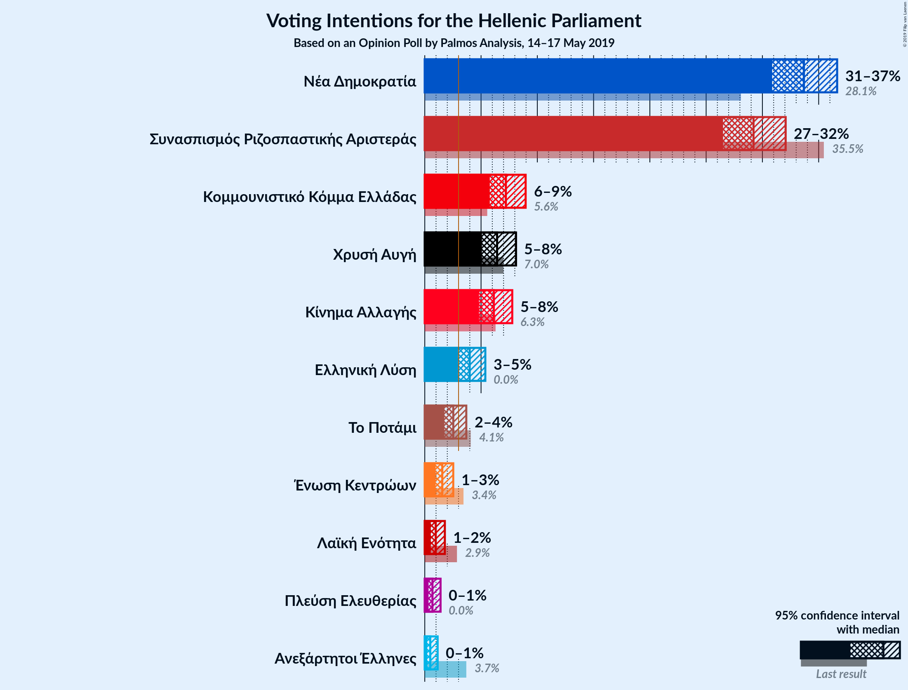

### Confidence Intervals

| Party | Last Result | Poll Result | 80% Confidence Interval | 90% Confidence Interval | 95% Confidence Interval | 99% Confidence Interval |
|:-----:|:-----------:|:-----------:|:-----------------------:|:-----------------------:|:-----------------------:|:-----------------------:|
| Νέα Δημοκρατία | 28.1% | 33.7% | 31.8–35.6% |31.3–36.2% |30.9–36.6% |30.0–37.6% |
| Συνασπισμός Ριζοσπαστικής Αριστεράς | 35.5% | 29.2% | 27.4–31.1% |26.9–31.6% |26.5–32.1% |25.7–33.0% |
| Κομμουνιστικό Κόμμα Ελλάδας | 5.6% | 7.2% | 6.3–8.4% |6.0–8.7% |5.8–9.0% |5.3–9.5% |
| Χρυσή Αυγή | 7.0% | 6.4% | 5.5–7.5% |5.3–7.8% |5.1–8.1% |4.7–8.7% |
| Κίνημα Αλλαγής | 6.3% | 6.1% | 5.3–7.2% |5.0–7.5% |4.8–7.8% |4.4–8.3% |
| Ελληνική Λύση | 0.0% | 4.0% | 3.3–4.9% |3.1–5.2% |3.0–5.4% |2.7–5.8% |
| Το Ποτάμι | 4.1% | 2.5% | 2.0–3.3% |1.9–3.5% |1.7–3.7% |1.5–4.1% |
| Ένωση Κεντρώων | 3.4% | 1.6% | 1.2–2.2% |1.1–2.4% |1.0–2.5% |0.8–2.9% |
| Λαϊκή Ενότητα | 2.9% | 1.0% | 0.7–1.5% |0.6–1.6% |0.5–1.8% |0.4–2.1% |
| Πλεύση Ελευθερίας | 0.0% | 0.7% | 0.4–1.1% |0.4–1.3% |0.3–1.4% |0.2–1.7% |
| Ανεξάρτητοι Έλληνες | 3.7% | 0.5% | 0.3–0.9% |0.2–1.0% |0.2–1.1% |0.1–1.4% |

*Note:* The poll result column reflects the actual value used in the calculations. Published results may vary slightly, and in addition be rounded to fewer digits.

## Seats

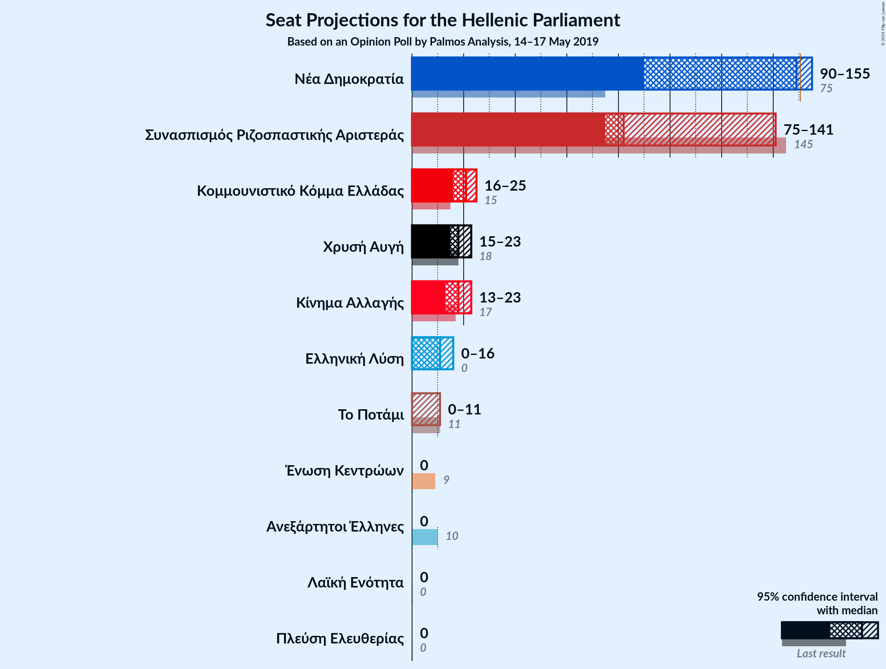

### Confidence Intervals

| Party | Last Result | Median | 80% Confidence Interval | 90% Confidence Interval | 95% Confidence Interval | 99% Confidence Interval |
|:-----:|:-----------:|:------:|:-----------------------:|:-----------------------:|:-----------------------:|:-----------------------:|
| <a href="#νέα-δημοκρατία">Νέα Δημοκρατία</a> | 75 | 149 | 140–153 |137–155 |90–155 |86–160 |
| <a href="#συνασπισμός-ριζοσπαστικής-αριστεράς">Συνασπισμός Ριζοσπαστικής Αριστεράς</a> | 145 | 82 | 79–90 |76–91 |75–141 |73–145 |
| <a href="#κομμουνιστικό-κόμμα-ελλάδας">Κομμουνιστικό Κόμμα Ελλάδας</a> | 15 | 21 | 17–24 |17–25 |16–25 |15–27 |
| <a href="#χρυσή-αυγή">Χρυσή Αυγή</a> | 18 | 18 | 16–21 |15–22 |15–23 |13–25 |
| <a href="#κίνημα-αλλαγής">Κίνημα Αλλαγής</a> | 17 | 18 | 16–20 |14–21 |13–23 |13–25 |
| <a href="#ελληνική-λύση">Ελληνική Λύση</a> | 0 | 11 | 0–15 |0–16 |0–16 |0–17 |
| <a href="#το-ποτάμι">Το Ποτάμι</a> | 11 | 0 | 0–9 |0–10 |0–11 |0–11 |
| <a href="#ένωση-κεντρώων">Ένωση Κεντρώων</a> | 9 | 0 | 0 |0 |0 |0 |
| <a href="#λαϊκή-ενότητα">Λαϊκή Ενότητα</a> | 0 | 0 | 0 |0 |0 |0 |
| <a href="#πλεύση-ελευθερίας">Πλεύση Ελευθερίας</a> | 0 | 0 | 0 |0 |0 |0 |
| <a href="#ανεξάρτητοι-έλληνες">Ανεξάρτητοι Έλληνες</a> | 10 | 0 | 0 |0 |0 |0 |

### Νέα Δημοκρατία

*For a full overview of the results for this party, see the [Νέα Δημοκρατία](party-νέαδημοκρατία.html) page.*

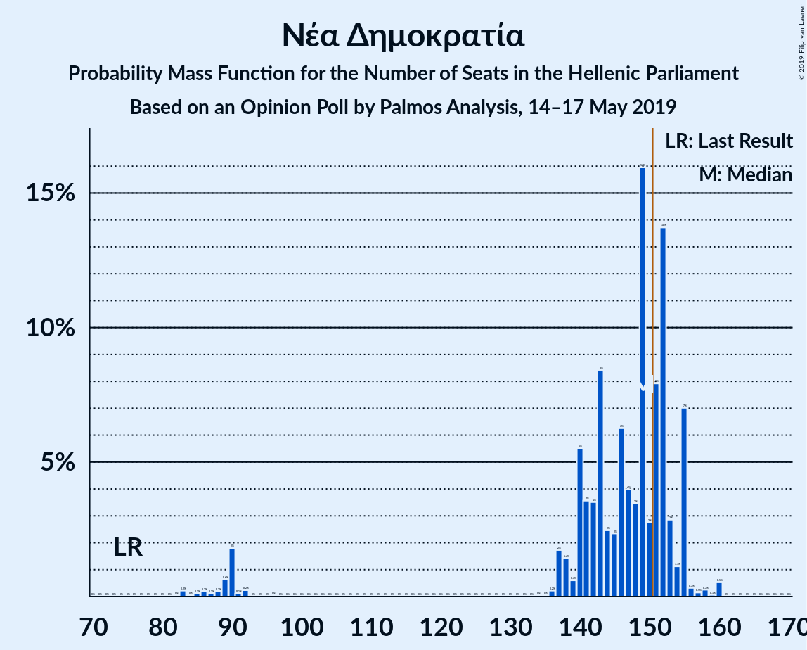

| Number of Seats | Probability | Accumulated | Special Marks |
|:---------------:|:-----------:|:-----------:|:-------------:|
| 75 | 0% | 100% | Last Result |
| 76 | 0% | 100% |  |
| 77 | 0% | 100% |  |
| 78 | 0% | 100% |  |
| 79 | 0% | 100% |  |
| 80 | 0% | 100% |  |
| 81 | 0% | 100% |  |
| 82 | 0% | 100% |  |
| 83 | 0.2% | 99.9% |  |
| 84 | 0% | 99.7% |  |
| 85 | 0.1% | 99.7% |  |
| 86 | 0.2% | 99.6% |  |
| 87 | 0.1% | 99.4% |  |
| 88 | 0.2% | 99.3% |  |
| 89 | 0.6% | 99.1% |  |
| 90 | 2% | 98% |  |
| 91 | 0.1% | 97% |  |
| 92 | 0.2% | 97% |  |
| 93 | 0% | 96% |  |
| 94 | 0% | 96% |  |
| 95 | 0% | 96% |  |
| 96 | 0% | 96% |  |
| 97 | 0% | 96% |  |
| 98 | 0% | 96% |  |
| 99 | 0% | 96% |  |
| 100 | 0% | 96% |  |
| 101 | 0% | 96% |  |
| 102 | 0% | 96% |  |
| 103 | 0% | 96% |  |
| 104 | 0% | 96% |  |
| 105 | 0% | 96% |  |
| 106 | 0% | 96% |  |
| 107 | 0% | 96% |  |
| 108 | 0% | 96% |  |
| 109 | 0% | 96% |  |
| 110 | 0% | 96% |  |
| 111 | 0% | 96% |  |
| 112 | 0% | 96% |  |
| 113 | 0% | 96% |  |
| 114 | 0% | 96% |  |
| 115 | 0% | 96% |  |
| 116 | 0% | 96% |  |
| 117 | 0% | 96% |  |
| 118 | 0% | 96% |  |
| 119 | 0% | 96% |  |
| 120 | 0% | 96% |  |
| 121 | 0% | 96% |  |
| 122 | 0% | 96% |  |
| 123 | 0% | 96% |  |
| 124 | 0% | 96% |  |
| 125 | 0% | 96% |  |
| 126 | 0% | 96% |  |
| 127 | 0% | 96% |  |
| 128 | 0% | 96% |  |
| 129 | 0% | 96% |  |
| 130 | 0% | 96% |  |
| 131 | 0% | 96% |  |
| 132 | 0% | 96% |  |
| 133 | 0% | 96% |  |
| 134 | 0% | 96% |  |
| 135 | 0% | 96% |  |
| 136 | 0.2% | 96% |  |
| 137 | 2% | 96% |  |
| 138 | 1.4% | 94% |  |
| 139 | 0.6% | 93% |  |
| 140 | 6% | 92% |  |
| 141 | 4% | 87% |  |
| 142 | 4% | 83% |  |
| 143 | 8% | 80% |  |
| 144 | 2% | 71% |  |
| 145 | 2% | 69% |  |
| 146 | 6% | 66% |  |
| 147 | 4% | 60% |  |
| 148 | 3% | 56% |  |
| 149 | 16% | 53% | Median |
| 150 | 3% | 37% |  |
| 151 | 8% | 34% | Majority |
| 152 | 14% | 26% |  |
| 153 | 3% | 12% |  |
| 154 | 1.1% | 9% |  |
| 155 | 7% | 8% |  |
| 156 | 0.3% | 1.3% |  |
| 157 | 0.1% | 1.0% |  |
| 158 | 0.3% | 0.9% |  |
| 159 | 0.1% | 0.6% |  |
| 160 | 0.5% | 0.6% |  |
| 161 | 0% | 0% |  |

### Συνασπισμός Ριζοσπαστικής Αριστεράς

*For a full overview of the results for this party, see the [Συνασπισμός Ριζοσπαστικής Αριστεράς](party-συνασπισμόςριζοσπαστικήςαριστεράς.html) page.*

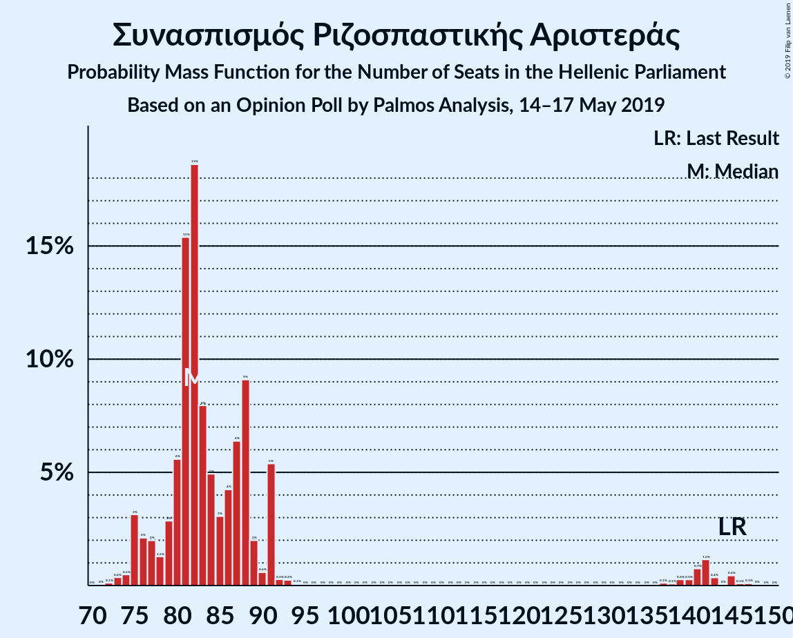

| Number of Seats | Probability | Accumulated | Special Marks |
|:---------------:|:-----------:|:-----------:|:-------------:|
| 71 | 0% | 100% |  |
| 72 | 0.1% | 99.9% |  |
| 73 | 0.4% | 99.8% |  |
| 74 | 0.5% | 99.4% |  |
| 75 | 3% | 99.0% |  |
| 76 | 2% | 96% |  |
| 77 | 2% | 94% |  |
| 78 | 1.3% | 92% |  |
| 79 | 3% | 90% |  |
| 80 | 6% | 88% |  |
| 81 | 15% | 82% |  |
| 82 | 19% | 67% | Median |
| 83 | 8% | 48% |  |
| 84 | 5% | 40% |  |
| 85 | 3% | 35% |  |
| 86 | 4% | 32% |  |
| 87 | 6% | 28% |  |
| 88 | 9% | 21% |  |
| 89 | 2% | 12% |  |
| 90 | 0.6% | 10% |  |
| 91 | 5% | 10% |  |
| 92 | 0.3% | 4% |  |
| 93 | 0.2% | 4% |  |
| 94 | 0.1% | 4% |  |
| 95 | 0% | 4% |  |
| 96 | 0% | 4% |  |
| 97 | 0% | 4% |  |
| 98 | 0% | 4% |  |
| 99 | 0% | 4% |  |
| 100 | 0% | 4% |  |
| 101 | 0% | 4% |  |
| 102 | 0% | 4% |  |
| 103 | 0% | 4% |  |
| 104 | 0% | 4% |  |
| 105 | 0% | 4% |  |
| 106 | 0% | 4% |  |
| 107 | 0% | 4% |  |
| 108 | 0% | 4% |  |
| 109 | 0% | 4% |  |
| 110 | 0% | 4% |  |
| 111 | 0% | 4% |  |
| 112 | 0% | 4% |  |
| 113 | 0% | 4% |  |
| 114 | 0% | 4% |  |
| 115 | 0% | 4% |  |
| 116 | 0% | 4% |  |
| 117 | 0% | 4% |  |
| 118 | 0% | 4% |  |
| 119 | 0% | 4% |  |
| 120 | 0% | 4% |  |
| 121 | 0% | 4% |  |
| 122 | 0% | 4% |  |
| 123 | 0% | 4% |  |
| 124 | 0% | 4% |  |
| 125 | 0% | 4% |  |
| 126 | 0% | 4% |  |
| 127 | 0% | 4% |  |
| 128 | 0% | 4% |  |
| 129 | 0% | 4% |  |
| 130 | 0% | 4% |  |
| 131 | 0% | 4% |  |
| 132 | 0% | 4% |  |
| 133 | 0% | 4% |  |
| 134 | 0% | 4% |  |
| 135 | 0% | 4% |  |
| 136 | 0% | 4% |  |
| 137 | 0.1% | 4% |  |
| 138 | 0.1% | 4% |  |
| 139 | 0.3% | 4% |  |
| 140 | 0.3% | 3% |  |
| 141 | 0.7% | 3% |  |
| 142 | 1.2% | 2% |  |
| 143 | 0.4% | 1.1% |  |
| 144 | 0% | 0.7% |  |
| 145 | 0.4% | 0.7% | Last Result |
| 146 | 0.1% | 0.2% |  |
| 147 | 0.1% | 0.1% |  |
| 148 | 0% | 0.1% |  |
| 149 | 0% | 0% |  |

### Κομμουνιστικό Κόμμα Ελλάδας

*For a full overview of the results for this party, see the [Κομμουνιστικό Κόμμα Ελλάδας](party-κομμουνιστικόκόμμαελλάδας.html) page.*

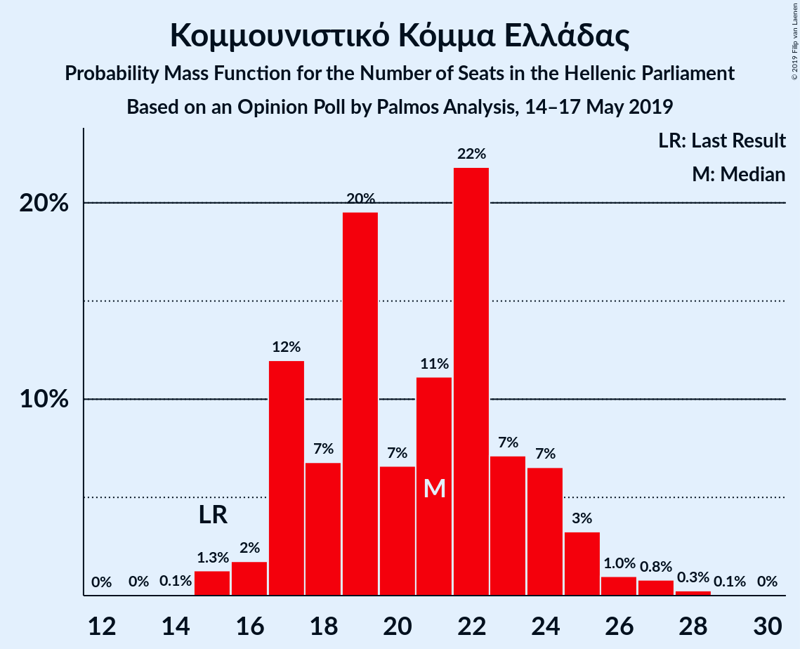

| Number of Seats | Probability | Accumulated | Special Marks |
|:---------------:|:-----------:|:-----------:|:-------------:|
| 14 | 0.1% | 100% |  |
| 15 | 1.3% | 99.9% | Last Result |
| 16 | 2% | 98.6% |  |
| 17 | 12% | 97% |  |
| 18 | 7% | 85% |  |
| 19 | 20% | 78% |  |
| 20 | 7% | 59% |  |
| 21 | 11% | 52% | Median |
| 22 | 22% | 41% |  |
| 23 | 7% | 19% |  |
| 24 | 7% | 12% |  |
| 25 | 3% | 5% |  |
| 26 | 1.0% | 2% |  |
| 27 | 0.8% | 1.1% |  |
| 28 | 0.3% | 0.3% |  |
| 29 | 0.1% | 0.1% |  |
| 30 | 0% | 0% |  |

### Χρυσή Αυγή

*For a full overview of the results for this party, see the [Χρυσή Αυγή](party-χρυσήαυγή.html) page.*

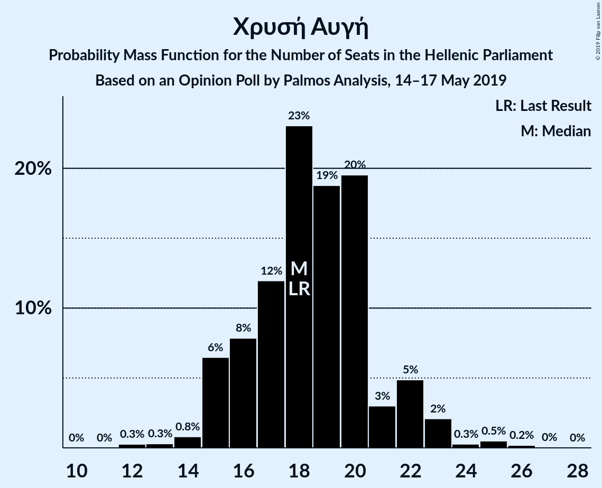

| Number of Seats | Probability | Accumulated | Special Marks |
|:---------------:|:-----------:|:-----------:|:-------------:|
| 12 | 0.3% | 100% |  |
| 13 | 0.3% | 99.7% |  |
| 14 | 0.8% | 99.4% |  |
| 15 | 6% | 98.6% |  |
| 16 | 8% | 92% |  |
| 17 | 12% | 84% |  |
| 18 | 23% | 72% | Last Result, Median |
| 19 | 19% | 49% |  |
| 20 | 20% | 31% |  |
| 21 | 3% | 11% |  |
| 22 | 5% | 8% |  |
| 23 | 2% | 3% |  |
| 24 | 0.3% | 1.0% |  |
| 25 | 0.5% | 0.7% |  |
| 26 | 0.2% | 0.2% |  |
| 27 | 0% | 0.1% |  |
| 28 | 0% | 0% |  |

### Κίνημα Αλλαγής

*For a full overview of the results for this party, see the [Κίνημα Αλλαγής](party-κίνημααλλαγής.html) page.*

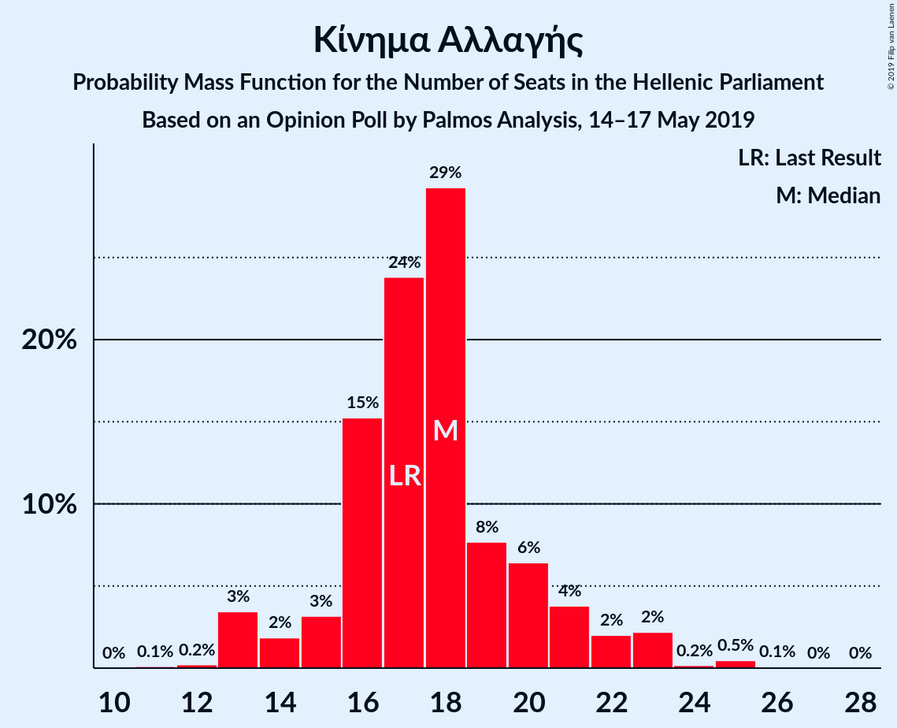

| Number of Seats | Probability | Accumulated | Special Marks |
|:---------------:|:-----------:|:-----------:|:-------------:|
| 11 | 0.1% | 100% |  |
| 12 | 0.2% | 99.9% |  |
| 13 | 3% | 99.7% |  |
| 14 | 2% | 96% |  |
| 15 | 3% | 94% |  |
| 16 | 15% | 91% |  |
| 17 | 24% | 76% | Last Result |
| 18 | 29% | 52% | Median |
| 19 | 8% | 23% |  |
| 20 | 6% | 15% |  |
| 21 | 4% | 9% |  |
| 22 | 2% | 5% |  |
| 23 | 2% | 3% |  |
| 24 | 0.2% | 0.8% |  |
| 25 | 0.5% | 0.6% |  |
| 26 | 0.1% | 0.1% |  |
| 27 | 0% | 0% |  |

### Ελληνική Λύση

*For a full overview of the results for this party, see the [Ελληνική Λύση](party-ελληνικήλύση.html) page.*

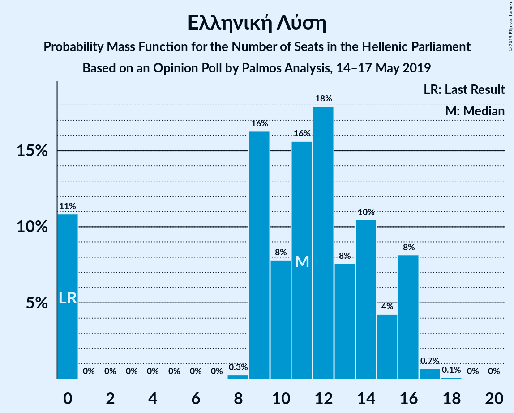

| Number of Seats | Probability | Accumulated | Special Marks |
|:---------------:|:-----------:|:-----------:|:-------------:|
| 0 | 11% | 100% | Last Result |
| 1 | 0% | 89% |  |
| 2 | 0% | 89% |  |
| 3 | 0% | 89% |  |
| 4 | 0% | 89% |  |
| 5 | 0% | 89% |  |
| 6 | 0% | 89% |  |
| 7 | 0% | 89% |  |
| 8 | 0.3% | 89% |  |
| 9 | 16% | 89% |  |
| 10 | 8% | 73% |  |
| 11 | 16% | 65% | Median |
| 12 | 18% | 49% |  |
| 13 | 8% | 31% |  |
| 14 | 10% | 24% |  |
| 15 | 4% | 13% |  |
| 16 | 8% | 9% |  |
| 17 | 0.7% | 0.8% |  |
| 18 | 0.1% | 0.1% |  |
| 19 | 0% | 0% |  |

### Το Ποτάμι

*For a full overview of the results for this party, see the [Το Ποτάμι](party-τοποτάμι.html) page.*

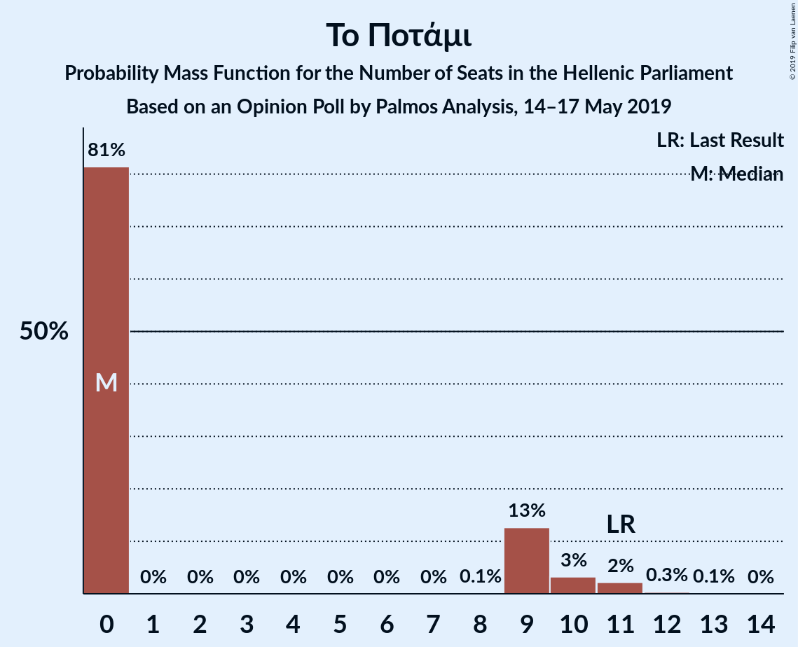

| Number of Seats | Probability | Accumulated | Special Marks |
|:---------------:|:-----------:|:-----------:|:-------------:|
| 0 | 81% | 100% | Median |
| 1 | 0% | 19% |  |
| 2 | 0% | 19% |  |
| 3 | 0% | 19% |  |
| 4 | 0% | 19% |  |
| 5 | 0% | 19% |  |
| 6 | 0% | 19% |  |
| 7 | 0% | 19% |  |
| 8 | 0.1% | 19% |  |
| 9 | 13% | 18% |  |
| 10 | 3% | 6% |  |
| 11 | 2% | 3% | Last Result |
| 12 | 0.3% | 0.4% |  |
| 13 | 0.1% | 0.1% |  |
| 14 | 0% | 0% |  |

### Ένωση Κεντρώων

*For a full overview of the results for this party, see the [Ένωση Κεντρώων](party-ένωσηκεντρώων.html) page.*

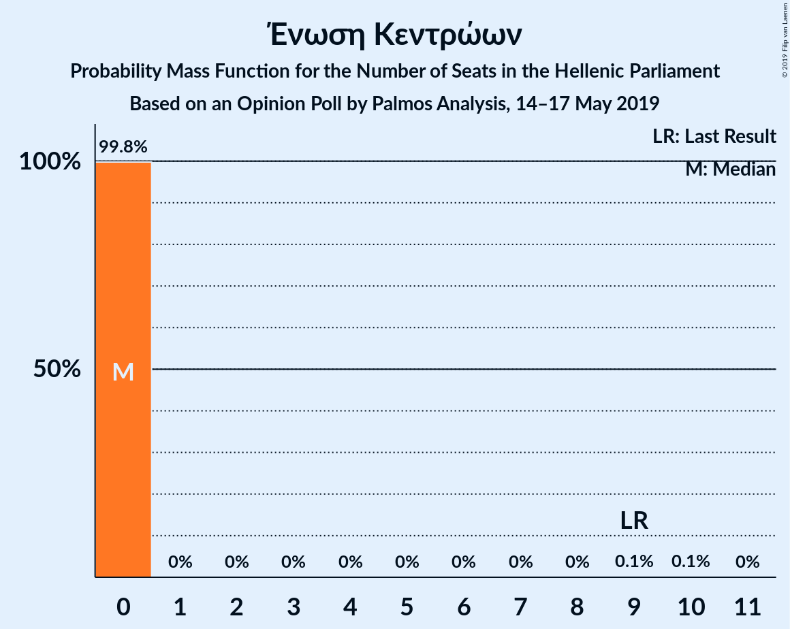

| Number of Seats | Probability | Accumulated | Special Marks |
|:---------------:|:-----------:|:-----------:|:-------------:|
| 0 | 99.8% | 100% | Median |
| 1 | 0% | 0.2% |  |
| 2 | 0% | 0.2% |  |
| 3 | 0% | 0.2% |  |
| 4 | 0% | 0.2% |  |
| 5 | 0% | 0.2% |  |
| 6 | 0% | 0.2% |  |
| 7 | 0% | 0.2% |  |
| 8 | 0% | 0.2% |  |
| 9 | 0.1% | 0.2% | Last Result |
| 10 | 0.1% | 0.1% |  |
| 11 | 0% | 0% |  |

### Λαϊκή Ενότητα

*For a full overview of the results for this party, see the [Λαϊκή Ενότητα](party-λαϊκήενότητα.html) page.*

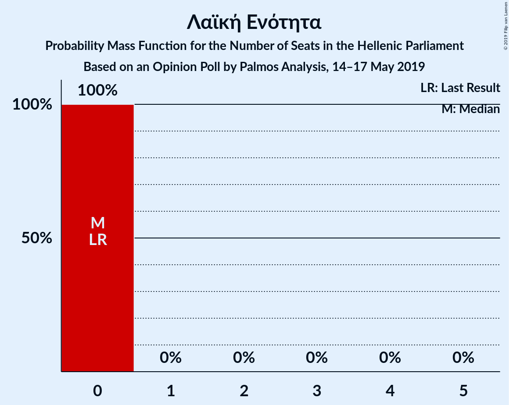

| Number of Seats | Probability | Accumulated | Special Marks |
|:---------------:|:-----------:|:-----------:|:-------------:|
| 0 | 100% | 100% | Last Result, Median |

### Πλεύση Ελευθερίας

*For a full overview of the results for this party, see the [Πλεύση Ελευθερίας](party-πλεύσηελευθερίας.html) page.*

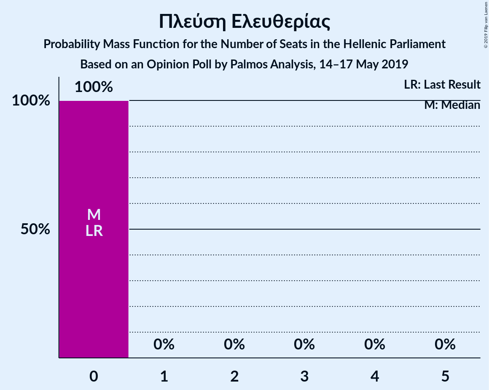

| Number of Seats | Probability | Accumulated | Special Marks |
|:---------------:|:-----------:|:-----------:|:-------------:|
| 0 | 100% | 100% | Last Result, Median |

### Ανεξάρτητοι Έλληνες

*For a full overview of the results for this party, see the [Ανεξάρτητοι Έλληνες](party-ανεξάρτητοιέλληνες.html) page.*

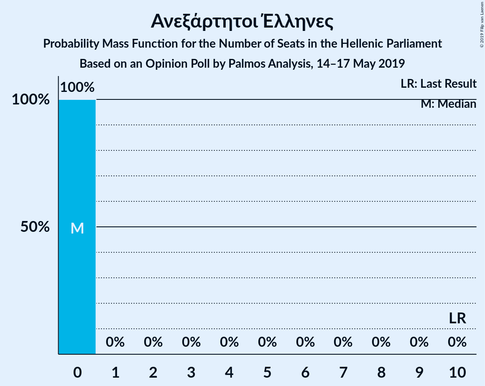

| Number of Seats | Probability | Accumulated | Special Marks |
|:---------------:|:-----------:|:-----------:|:-------------:|
| 0 | 100% | 100% | Median |
| 1 | 0% | 0% |  |
| 2 | 0% | 0% |  |
| 3 | 0% | 0% |  |
| 4 | 0% | 0% |  |
| 5 | 0% | 0% |  |
| 6 | 0% | 0% |  |
| 7 | 0% | 0% |  |
| 8 | 0% | 0% |  |
| 9 | 0% | 0% |  |
| 10 | 0% | 0% | Last Result |

## Coalitions

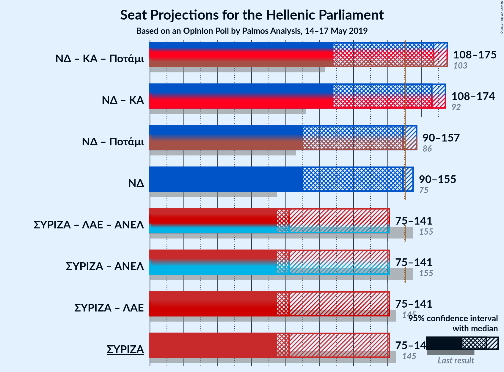

### Confidence Intervals

| Coalition | Last Result | Median | Majority? | 80% Confidence Interval | 90% Confidence Interval | 95% Confidence Interval | 99% Confidence Interval |
|:---------:|:-----------:|:------:|:---------:|:-----------------------:|:-----------------------:|:-----------------------:|:-----------------------:|
| Νέα Δημοκρατία – Κίνημα Αλλαγής – Το Ποτάμι | 103 | 167 | 96% | 159–173 | 157–173 | 108–175 | 105–179 |
| Νέα Δημοκρατία – Κίνημα Αλλαγής | 92 | 166 | 96% | 157–172 | 154–173 | 108–174 | 102–179 |
| Νέα Δημοκρατία – Το Ποτάμι | 86 | 149 | 44% | 142–155 | 139–155 | 90–157 | 89–162 |
| Νέα Δημοκρατία | 75 | 149 | 34% | 140–153 | 137–155 | 90–155 | 86–160 |
| Συνασπισμός Ριζοσπαστικής Αριστεράς – Λαϊκή Ενότητα – Ανεξάρτητοι Έλληνες | 155 | 82 | 0% | 79–90 | 76–91 | 75–141 | 73–145 |
| Συνασπισμός Ριζοσπαστικής Αριστεράς – Ανεξάρτητοι Έλληνες | 155 | 82 | 0% | 79–90 | 76–91 | 75–141 | 73–145 |
| Συνασπισμός Ριζοσπαστικής Αριστεράς – Λαϊκή Ενότητα | 145 | 82 | 0% | 79–90 | 76–91 | 75–141 | 73–145 |
| Συνασπισμός Ριζοσπαστικής Αριστεράς | 145 | 82 | 0% | 79–90 | 76–91 | 75–141 | 73–145 |

### Νέα Δημοκρατία – Κίνημα Αλλαγής – Το Ποτάμι

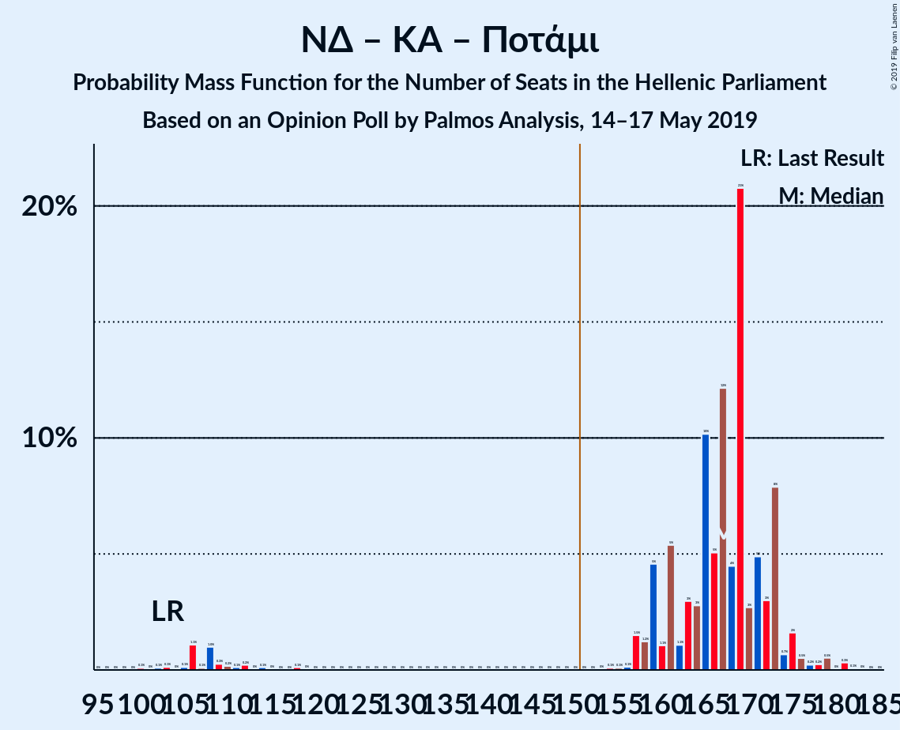

| Number of Seats | Probability | Accumulated | Special Marks |
|:---------------:|:-----------:|:-----------:|:-------------:|
| 100 | 0.1% | 100% |  |
| 101 | 0% | 99.9% |  |
| 102 | 0.1% | 99.9% |  |
| 103 | 0.1% | 99.8% | Last Result |
| 104 | 0% | 99.6% |  |
| 105 | 0.1% | 99.6% |  |
| 106 | 1.1% | 99.5% |  |
| 107 | 0.1% | 98% |  |
| 108 | 1.0% | 98% |  |
| 109 | 0.3% | 97% |  |
| 110 | 0.2% | 97% |  |
| 111 | 0.1% | 97% |  |
| 112 | 0.2% | 97% |  |
| 113 | 0% | 97% |  |
| 114 | 0.1% | 97% |  |
| 115 | 0% | 96% |  |
| 116 | 0% | 96% |  |
| 117 | 0% | 96% |  |
| 118 | 0.1% | 96% |  |
| 119 | 0% | 96% |  |
| 120 | 0% | 96% |  |
| 121 | 0% | 96% |  |
| 122 | 0% | 96% |  |
| 123 | 0% | 96% |  |
| 124 | 0% | 96% |  |
| 125 | 0% | 96% |  |
| 126 | 0% | 96% |  |
| 127 | 0% | 96% |  |
| 128 | 0% | 96% |  |
| 129 | 0% | 96% |  |
| 130 | 0% | 96% |  |
| 131 | 0% | 96% |  |
| 132 | 0% | 96% |  |
| 133 | 0% | 96% |  |
| 134 | 0% | 96% |  |
| 135 | 0% | 96% |  |
| 136 | 0% | 96% |  |
| 137 | 0% | 96% |  |
| 138 | 0% | 96% |  |
| 139 | 0% | 96% |  |
| 140 | 0% | 96% |  |
| 141 | 0% | 96% |  |
| 142 | 0% | 96% |  |
| 143 | 0% | 96% |  |
| 144 | 0% | 96% |  |
| 145 | 0% | 96% |  |
| 146 | 0% | 96% |  |
| 147 | 0% | 96% |  |
| 148 | 0% | 96% |  |
| 149 | 0% | 96% |  |
| 150 | 0% | 96% |  |
| 151 | 0% | 96% | Majority |
| 152 | 0% | 96% |  |
| 153 | 0% | 96% |  |
| 154 | 0.1% | 96% |  |
| 155 | 0.1% | 96% |  |
| 156 | 0.1% | 96% |  |
| 157 | 1.5% | 96% |  |
| 158 | 1.2% | 94% |  |
| 159 | 5% | 93% |  |
| 160 | 1.1% | 89% |  |
| 161 | 5% | 88% |  |
| 162 | 1.1% | 82% |  |
| 163 | 3% | 81% |  |
| 164 | 3% | 78% |  |
| 165 | 10% | 75% |  |
| 166 | 5% | 65% |  |
| 167 | 12% | 60% | Median |
| 168 | 4% | 48% |  |
| 169 | 21% | 43% |  |
| 170 | 3% | 23% |  |
| 171 | 5% | 20% |  |
| 172 | 3% | 15% |  |
| 173 | 8% | 12% |  |
| 174 | 0.7% | 4% |  |
| 175 | 2% | 4% |  |
| 176 | 0.5% | 2% |  |
| 177 | 0.2% | 1.4% |  |
| 178 | 0.2% | 1.2% |  |
| 179 | 0.5% | 1.0% |  |
| 180 | 0% | 0.5% |  |
| 181 | 0.3% | 0.4% |  |
| 182 | 0.1% | 0.1% |  |
| 183 | 0% | 0% |  |

### Νέα Δημοκρατία – Κίνημα Αλλαγής

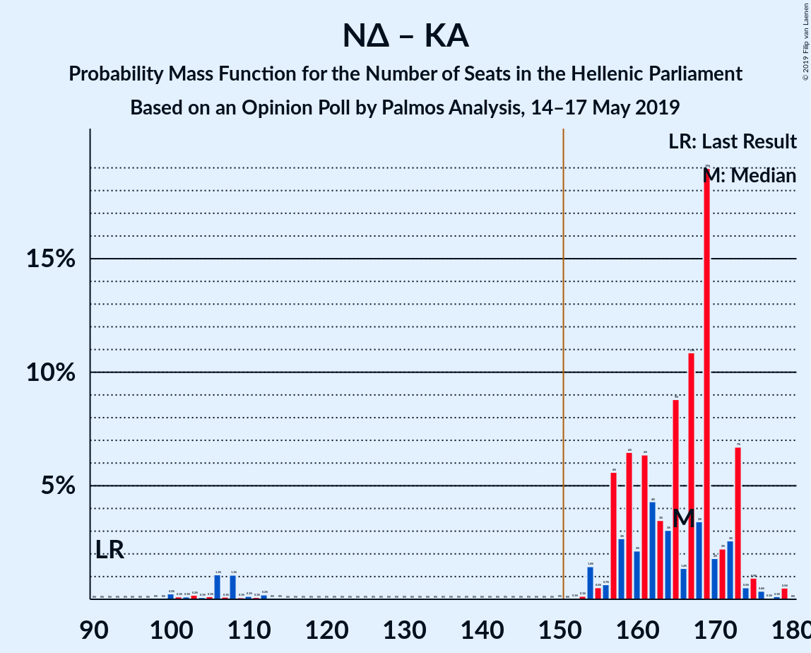

| Number of Seats | Probability | Accumulated | Special Marks |
|:---------------:|:-----------:|:-----------:|:-------------:|
| 92 | 0% | 100% | Last Result |
| 93 | 0% | 100% |  |
| 94 | 0% | 100% |  |
| 95 | 0% | 100% |  |
| 96 | 0% | 100% |  |
| 97 | 0% | 100% |  |
| 98 | 0% | 100% |  |
| 99 | 0% | 100% |  |
| 100 | 0.2% | 99.9% |  |
| 101 | 0.1% | 99.7% |  |
| 102 | 0.1% | 99.6% |  |
| 103 | 0.2% | 99.5% |  |
| 104 | 0.1% | 99.3% |  |
| 105 | 0.1% | 99.2% |  |
| 106 | 1.1% | 99.1% |  |
| 107 | 0.1% | 98% |  |
| 108 | 1.1% | 98% |  |
| 109 | 0.1% | 97% |  |
| 110 | 0.1% | 97% |  |
| 111 | 0.1% | 97% |  |
| 112 | 0.2% | 97% |  |
| 113 | 0% | 96% |  |
| 114 | 0% | 96% |  |
| 115 | 0% | 96% |  |
| 116 | 0% | 96% |  |
| 117 | 0% | 96% |  |
| 118 | 0% | 96% |  |
| 119 | 0% | 96% |  |
| 120 | 0% | 96% |  |
| 121 | 0% | 96% |  |
| 122 | 0% | 96% |  |
| 123 | 0% | 96% |  |
| 124 | 0% | 96% |  |
| 125 | 0% | 96% |  |
| 126 | 0% | 96% |  |
| 127 | 0% | 96% |  |
| 128 | 0% | 96% |  |
| 129 | 0% | 96% |  |
| 130 | 0% | 96% |  |
| 131 | 0% | 96% |  |
| 132 | 0% | 96% |  |
| 133 | 0% | 96% |  |
| 134 | 0% | 96% |  |
| 135 | 0% | 96% |  |
| 136 | 0% | 96% |  |
| 137 | 0% | 96% |  |
| 138 | 0% | 96% |  |
| 139 | 0% | 96% |  |
| 140 | 0% | 96% |  |
| 141 | 0% | 96% |  |
| 142 | 0% | 96% |  |
| 143 | 0% | 96% |  |
| 144 | 0% | 96% |  |
| 145 | 0% | 96% |  |
| 146 | 0% | 96% |  |
| 147 | 0% | 96% |  |
| 148 | 0% | 96% |  |
| 149 | 0% | 96% |  |
| 150 | 0% | 96% |  |
| 151 | 0% | 96% | Majority |
| 152 | 0.1% | 96% |  |
| 153 | 0.1% | 96% |  |
| 154 | 1.4% | 96% |  |
| 155 | 0.5% | 95% |  |
| 156 | 0.7% | 94% |  |
| 157 | 6% | 93% |  |
| 158 | 3% | 88% |  |
| 159 | 6% | 85% |  |
| 160 | 2% | 79% |  |
| 161 | 6% | 77% |  |
| 162 | 4% | 70% |  |
| 163 | 3% | 66% |  |
| 164 | 3% | 62% |  |
| 165 | 9% | 59% |  |
| 166 | 1.4% | 51% |  |
| 167 | 11% | 49% | Median |
| 168 | 3% | 38% |  |
| 169 | 19% | 35% |  |
| 170 | 2% | 16% |  |
| 171 | 2% | 14% |  |
| 172 | 3% | 12% |  |
| 173 | 7% | 9% |  |
| 174 | 0.5% | 3% |  |
| 175 | 0.9% | 2% |  |
| 176 | 0.4% | 1.1% |  |
| 177 | 0.1% | 0.7% |  |
| 178 | 0.1% | 0.7% |  |
| 179 | 0.5% | 0.5% |  |
| 180 | 0% | 0% |  |

### Νέα Δημοκρατία – Το Ποτάμι

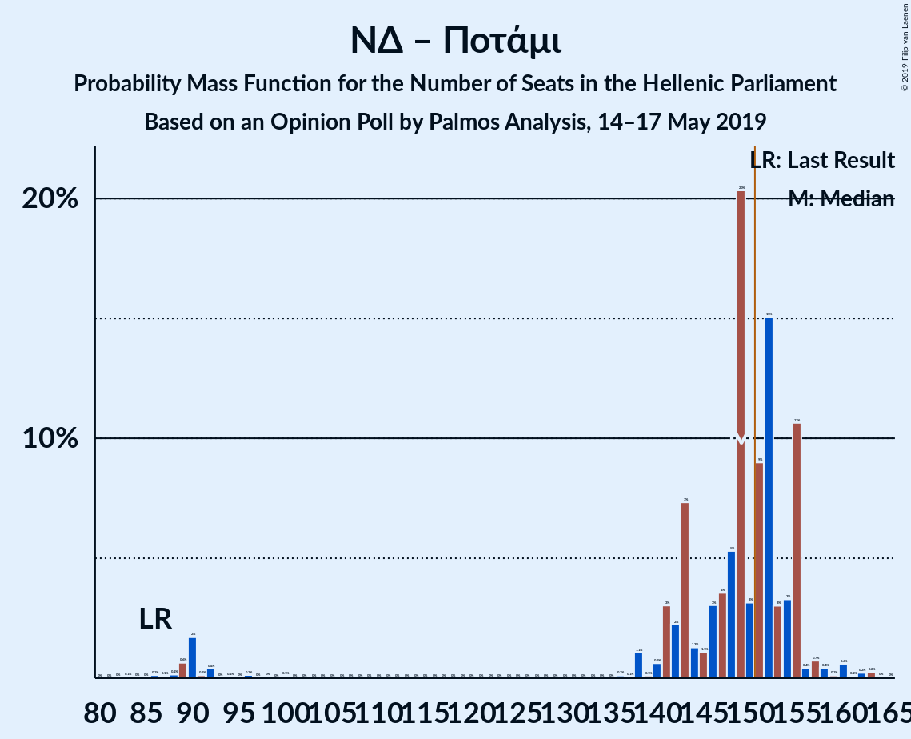

| Number of Seats | Probability | Accumulated | Special Marks |
|:---------------:|:-----------:|:-----------:|:-------------:|
| 83 | 0.1% | 100% |  |
| 84 | 0% | 99.9% |  |
| 85 | 0% | 99.9% |  |
| 86 | 0.1% | 99.9% | Last Result |
| 87 | 0.1% | 99.8% |  |
| 88 | 0.1% | 99.7% |  |
| 89 | 0.6% | 99.5% |  |
| 90 | 2% | 98.9% |  |
| 91 | 0.1% | 97% |  |
| 92 | 0.4% | 97% |  |
| 93 | 0% | 97% |  |
| 94 | 0.1% | 97% |  |
| 95 | 0% | 97% |  |
| 96 | 0.1% | 97% |  |
| 97 | 0% | 96% |  |
| 98 | 0% | 96% |  |
| 99 | 0% | 96% |  |
| 100 | 0.1% | 96% |  |
| 101 | 0% | 96% |  |
| 102 | 0% | 96% |  |
| 103 | 0% | 96% |  |
| 104 | 0% | 96% |  |
| 105 | 0% | 96% |  |
| 106 | 0% | 96% |  |
| 107 | 0% | 96% |  |
| 108 | 0% | 96% |  |
| 109 | 0% | 96% |  |
| 110 | 0% | 96% |  |
| 111 | 0% | 96% |  |
| 112 | 0% | 96% |  |
| 113 | 0% | 96% |  |
| 114 | 0% | 96% |  |
| 115 | 0% | 96% |  |
| 116 | 0% | 96% |  |
| 117 | 0% | 96% |  |
| 118 | 0% | 96% |  |
| 119 | 0% | 96% |  |
| 120 | 0% | 96% |  |
| 121 | 0% | 96% |  |
| 122 | 0% | 96% |  |
| 123 | 0% | 96% |  |
| 124 | 0% | 96% |  |
| 125 | 0% | 96% |  |
| 126 | 0% | 96% |  |
| 127 | 0% | 96% |  |
| 128 | 0% | 96% |  |
| 129 | 0% | 96% |  |
| 130 | 0% | 96% |  |
| 131 | 0% | 96% |  |
| 132 | 0% | 96% |  |
| 133 | 0% | 96% |  |
| 134 | 0% | 96% |  |
| 135 | 0% | 96% |  |
| 136 | 0.1% | 96% |  |
| 137 | 0.1% | 96% |  |
| 138 | 1.1% | 96% |  |
| 139 | 0.1% | 95% |  |
| 140 | 0.6% | 95% |  |
| 141 | 3% | 94% |  |
| 142 | 2% | 91% |  |
| 143 | 7% | 89% |  |
| 144 | 1.3% | 82% |  |
| 145 | 1.1% | 80% |  |
| 146 | 3% | 79% |  |
| 147 | 4% | 76% |  |
| 148 | 5% | 73% |  |
| 149 | 20% | 67% | Median |
| 150 | 3% | 47% |  |
| 151 | 9% | 44% | Majority |
| 152 | 15% | 35% |  |
| 153 | 3% | 20% |  |
| 154 | 3% | 17% |  |
| 155 | 11% | 14% |  |
| 156 | 0.4% | 3% |  |
| 157 | 0.7% | 3% |  |
| 158 | 0.4% | 2% |  |
| 159 | 0.1% | 1.3% |  |
| 160 | 0.6% | 1.2% |  |
| 161 | 0.1% | 0.6% |  |
| 162 | 0.2% | 0.6% |  |
| 163 | 0.2% | 0.3% |  |
| 164 | 0% | 0.1% |  |
| 165 | 0% | 0% |  |

### Νέα Δημοκρατία

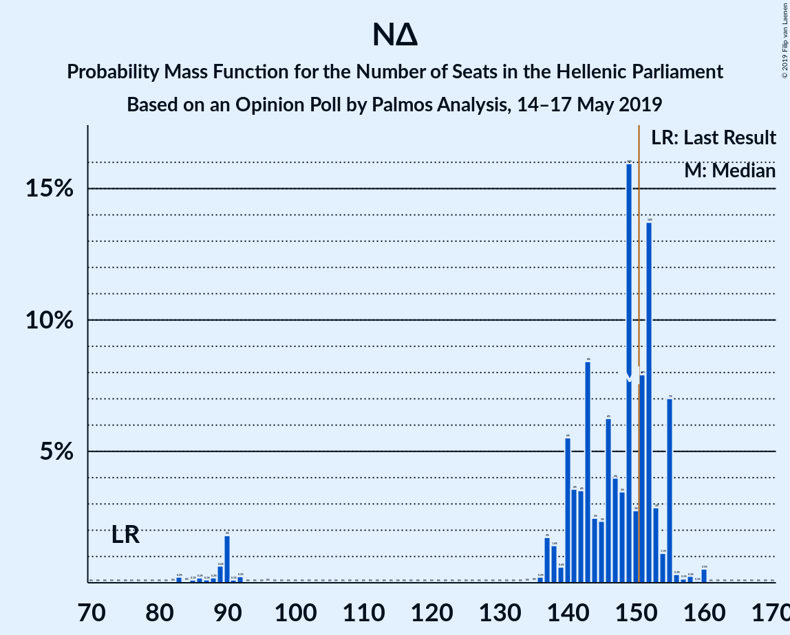

| Number of Seats | Probability | Accumulated | Special Marks |
|:---------------:|:-----------:|:-----------:|:-------------:|
| 75 | 0% | 100% | Last Result |
| 76 | 0% | 100% |  |
| 77 | 0% | 100% |  |
| 78 | 0% | 100% |  |
| 79 | 0% | 100% |  |
| 80 | 0% | 100% |  |
| 81 | 0% | 100% |  |
| 82 | 0% | 100% |  |
| 83 | 0.2% | 99.9% |  |
| 84 | 0% | 99.7% |  |
| 85 | 0.1% | 99.7% |  |
| 86 | 0.2% | 99.6% |  |
| 87 | 0.1% | 99.4% |  |
| 88 | 0.2% | 99.3% |  |
| 89 | 0.6% | 99.1% |  |
| 90 | 2% | 98% |  |
| 91 | 0.1% | 97% |  |
| 92 | 0.2% | 97% |  |
| 93 | 0% | 96% |  |
| 94 | 0% | 96% |  |
| 95 | 0% | 96% |  |
| 96 | 0% | 96% |  |
| 97 | 0% | 96% |  |
| 98 | 0% | 96% |  |
| 99 | 0% | 96% |  |
| 100 | 0% | 96% |  |
| 101 | 0% | 96% |  |
| 102 | 0% | 96% |  |
| 103 | 0% | 96% |  |
| 104 | 0% | 96% |  |
| 105 | 0% | 96% |  |
| 106 | 0% | 96% |  |
| 107 | 0% | 96% |  |
| 108 | 0% | 96% |  |
| 109 | 0% | 96% |  |
| 110 | 0% | 96% |  |
| 111 | 0% | 96% |  |
| 112 | 0% | 96% |  |
| 113 | 0% | 96% |  |
| 114 | 0% | 96% |  |
| 115 | 0% | 96% |  |
| 116 | 0% | 96% |  |
| 117 | 0% | 96% |  |
| 118 | 0% | 96% |  |
| 119 | 0% | 96% |  |
| 120 | 0% | 96% |  |
| 121 | 0% | 96% |  |
| 122 | 0% | 96% |  |
| 123 | 0% | 96% |  |
| 124 | 0% | 96% |  |
| 125 | 0% | 96% |  |
| 126 | 0% | 96% |  |
| 127 | 0% | 96% |  |
| 128 | 0% | 96% |  |
| 129 | 0% | 96% |  |
| 130 | 0% | 96% |  |
| 131 | 0% | 96% |  |
| 132 | 0% | 96% |  |
| 133 | 0% | 96% |  |
| 134 | 0% | 96% |  |
| 135 | 0% | 96% |  |
| 136 | 0.2% | 96% |  |
| 137 | 2% | 96% |  |
| 138 | 1.4% | 94% |  |
| 139 | 0.6% | 93% |  |
| 140 | 6% | 92% |  |
| 141 | 4% | 87% |  |
| 142 | 4% | 83% |  |
| 143 | 8% | 80% |  |
| 144 | 2% | 71% |  |
| 145 | 2% | 69% |  |
| 146 | 6% | 66% |  |
| 147 | 4% | 60% |  |
| 148 | 3% | 56% |  |
| 149 | 16% | 53% | Median |
| 150 | 3% | 37% |  |
| 151 | 8% | 34% | Majority |
| 152 | 14% | 26% |  |
| 153 | 3% | 12% |  |
| 154 | 1.1% | 9% |  |
| 155 | 7% | 8% |  |
| 156 | 0.3% | 1.3% |  |
| 157 | 0.1% | 1.0% |  |
| 158 | 0.3% | 0.9% |  |
| 159 | 0.1% | 0.6% |  |
| 160 | 0.5% | 0.6% |  |
| 161 | 0% | 0% |  |

### Συνασπισμός Ριζοσπαστικής Αριστεράς – Λαϊκή Ενότητα – Ανεξάρτητοι Έλληνες

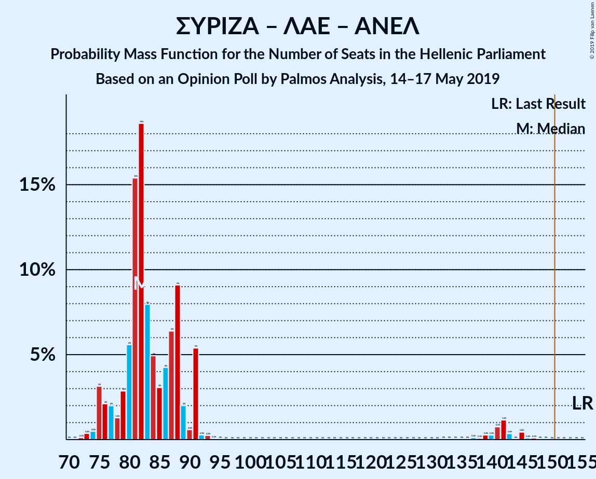

| Number of Seats | Probability | Accumulated | Special Marks |
|:---------------:|:-----------:|:-----------:|:-------------:|
| 71 | 0% | 100% |  |
| 72 | 0.1% | 99.9% |  |
| 73 | 0.4% | 99.8% |  |
| 74 | 0.5% | 99.4% |  |
| 75 | 3% | 99.0% |  |
| 76 | 2% | 96% |  |
| 77 | 2% | 94% |  |
| 78 | 1.3% | 92% |  |
| 79 | 3% | 90% |  |
| 80 | 6% | 88% |  |
| 81 | 15% | 82% |  |
| 82 | 19% | 67% | Median |
| 83 | 8% | 48% |  |
| 84 | 5% | 40% |  |
| 85 | 3% | 35% |  |
| 86 | 4% | 32% |  |
| 87 | 6% | 28% |  |
| 88 | 9% | 21% |  |
| 89 | 2% | 12% |  |
| 90 | 0.6% | 10% |  |
| 91 | 5% | 10% |  |
| 92 | 0.3% | 4% |  |
| 93 | 0.2% | 4% |  |
| 94 | 0.1% | 4% |  |
| 95 | 0% | 4% |  |
| 96 | 0% | 4% |  |
| 97 | 0% | 4% |  |
| 98 | 0% | 4% |  |
| 99 | 0% | 4% |  |
| 100 | 0% | 4% |  |
| 101 | 0% | 4% |  |
| 102 | 0% | 4% |  |
| 103 | 0% | 4% |  |
| 104 | 0% | 4% |  |
| 105 | 0% | 4% |  |
| 106 | 0% | 4% |  |
| 107 | 0% | 4% |  |
| 108 | 0% | 4% |  |
| 109 | 0% | 4% |  |
| 110 | 0% | 4% |  |
| 111 | 0% | 4% |  |
| 112 | 0% | 4% |  |
| 113 | 0% | 4% |  |
| 114 | 0% | 4% |  |
| 115 | 0% | 4% |  |
| 116 | 0% | 4% |  |
| 117 | 0% | 4% |  |
| 118 | 0% | 4% |  |
| 119 | 0% | 4% |  |
| 120 | 0% | 4% |  |
| 121 | 0% | 4% |  |
| 122 | 0% | 4% |  |
| 123 | 0% | 4% |  |
| 124 | 0% | 4% |  |
| 125 | 0% | 4% |  |
| 126 | 0% | 4% |  |
| 127 | 0% | 4% |  |
| 128 | 0% | 4% |  |
| 129 | 0% | 4% |  |
| 130 | 0% | 4% |  |
| 131 | 0% | 4% |  |
| 132 | 0% | 4% |  |
| 133 | 0% | 4% |  |
| 134 | 0% | 4% |  |
| 135 | 0% | 4% |  |
| 136 | 0% | 4% |  |
| 137 | 0.1% | 4% |  |
| 138 | 0.1% | 4% |  |
| 139 | 0.3% | 4% |  |
| 140 | 0.3% | 3% |  |
| 141 | 0.7% | 3% |  |
| 142 | 1.2% | 2% |  |
| 143 | 0.4% | 1.1% |  |
| 144 | 0% | 0.7% |  |
| 145 | 0.4% | 0.7% |  |
| 146 | 0.1% | 0.2% |  |
| 147 | 0.1% | 0.1% |  |
| 148 | 0% | 0.1% |  |
| 149 | 0% | 0% |  |
| 150 | 0% | 0% |  |
| 151 | 0% | 0% | Majority |
| 152 | 0% | 0% |  |
| 153 | 0% | 0% |  |
| 154 | 0% | 0% |  |
| 155 | 0% | 0% | Last Result |

### Συνασπισμός Ριζοσπαστικής Αριστεράς – Ανεξάρτητοι Έλληνες

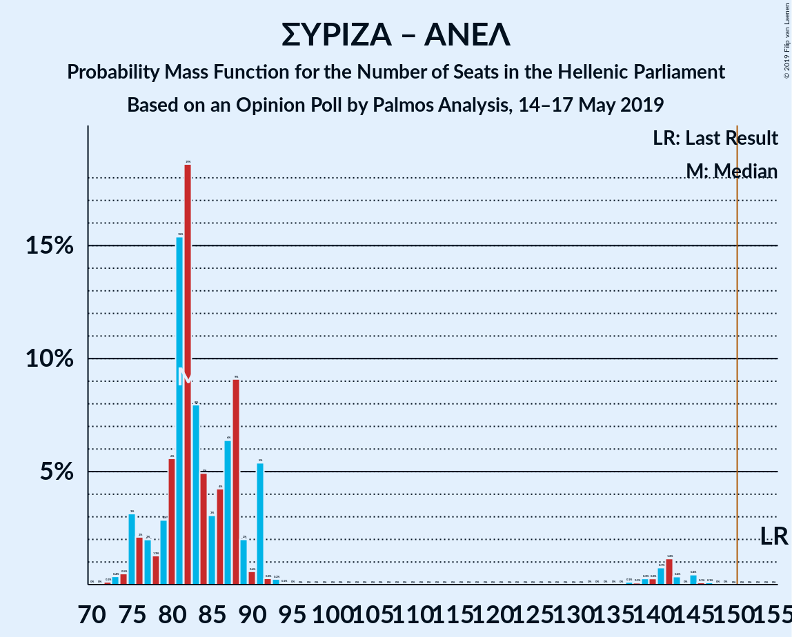

| Number of Seats | Probability | Accumulated | Special Marks |
|:---------------:|:-----------:|:-----------:|:-------------:|
| 71 | 0% | 100% |  |
| 72 | 0.1% | 99.9% |  |
| 73 | 0.4% | 99.8% |  |
| 74 | 0.5% | 99.4% |  |
| 75 | 3% | 99.0% |  |
| 76 | 2% | 96% |  |
| 77 | 2% | 94% |  |
| 78 | 1.3% | 92% |  |
| 79 | 3% | 90% |  |
| 80 | 6% | 88% |  |
| 81 | 15% | 82% |  |
| 82 | 19% | 67% | Median |
| 83 | 8% | 48% |  |
| 84 | 5% | 40% |  |
| 85 | 3% | 35% |  |
| 86 | 4% | 32% |  |
| 87 | 6% | 28% |  |
| 88 | 9% | 21% |  |
| 89 | 2% | 12% |  |
| 90 | 0.6% | 10% |  |
| 91 | 5% | 10% |  |
| 92 | 0.3% | 4% |  |
| 93 | 0.2% | 4% |  |
| 94 | 0.1% | 4% |  |
| 95 | 0% | 4% |  |
| 96 | 0% | 4% |  |
| 97 | 0% | 4% |  |
| 98 | 0% | 4% |  |
| 99 | 0% | 4% |  |
| 100 | 0% | 4% |  |
| 101 | 0% | 4% |  |
| 102 | 0% | 4% |  |
| 103 | 0% | 4% |  |
| 104 | 0% | 4% |  |
| 105 | 0% | 4% |  |
| 106 | 0% | 4% |  |
| 107 | 0% | 4% |  |
| 108 | 0% | 4% |  |
| 109 | 0% | 4% |  |
| 110 | 0% | 4% |  |
| 111 | 0% | 4% |  |
| 112 | 0% | 4% |  |
| 113 | 0% | 4% |  |
| 114 | 0% | 4% |  |
| 115 | 0% | 4% |  |
| 116 | 0% | 4% |  |
| 117 | 0% | 4% |  |
| 118 | 0% | 4% |  |
| 119 | 0% | 4% |  |
| 120 | 0% | 4% |  |
| 121 | 0% | 4% |  |
| 122 | 0% | 4% |  |
| 123 | 0% | 4% |  |
| 124 | 0% | 4% |  |
| 125 | 0% | 4% |  |
| 126 | 0% | 4% |  |
| 127 | 0% | 4% |  |
| 128 | 0% | 4% |  |
| 129 | 0% | 4% |  |
| 130 | 0% | 4% |  |
| 131 | 0% | 4% |  |
| 132 | 0% | 4% |  |
| 133 | 0% | 4% |  |
| 134 | 0% | 4% |  |
| 135 | 0% | 4% |  |
| 136 | 0% | 4% |  |
| 137 | 0.1% | 4% |  |
| 138 | 0.1% | 4% |  |
| 139 | 0.3% | 4% |  |
| 140 | 0.3% | 3% |  |
| 141 | 0.7% | 3% |  |
| 142 | 1.2% | 2% |  |
| 143 | 0.4% | 1.1% |  |
| 144 | 0% | 0.7% |  |
| 145 | 0.4% | 0.7% |  |
| 146 | 0.1% | 0.2% |  |
| 147 | 0.1% | 0.1% |  |
| 148 | 0% | 0.1% |  |
| 149 | 0% | 0% |  |
| 150 | 0% | 0% |  |
| 151 | 0% | 0% | Majority |
| 152 | 0% | 0% |  |
| 153 | 0% | 0% |  |
| 154 | 0% | 0% |  |
| 155 | 0% | 0% | Last Result |

### Συνασπισμός Ριζοσπαστικής Αριστεράς – Λαϊκή Ενότητα

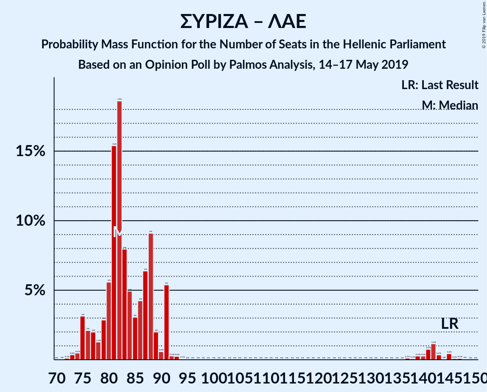

| Number of Seats | Probability | Accumulated | Special Marks |
|:---------------:|:-----------:|:-----------:|:-------------:|
| 71 | 0% | 100% |  |
| 72 | 0.1% | 99.9% |  |
| 73 | 0.4% | 99.8% |  |
| 74 | 0.5% | 99.4% |  |
| 75 | 3% | 99.0% |  |
| 76 | 2% | 96% |  |
| 77 | 2% | 94% |  |
| 78 | 1.3% | 92% |  |
| 79 | 3% | 90% |  |
| 80 | 6% | 88% |  |
| 81 | 15% | 82% |  |
| 82 | 19% | 67% | Median |
| 83 | 8% | 48% |  |
| 84 | 5% | 40% |  |
| 85 | 3% | 35% |  |
| 86 | 4% | 32% |  |
| 87 | 6% | 28% |  |
| 88 | 9% | 21% |  |
| 89 | 2% | 12% |  |
| 90 | 0.6% | 10% |  |
| 91 | 5% | 10% |  |
| 92 | 0.3% | 4% |  |
| 93 | 0.2% | 4% |  |
| 94 | 0.1% | 4% |  |
| 95 | 0% | 4% |  |
| 96 | 0% | 4% |  |
| 97 | 0% | 4% |  |
| 98 | 0% | 4% |  |
| 99 | 0% | 4% |  |
| 100 | 0% | 4% |  |
| 101 | 0% | 4% |  |
| 102 | 0% | 4% |  |
| 103 | 0% | 4% |  |
| 104 | 0% | 4% |  |
| 105 | 0% | 4% |  |
| 106 | 0% | 4% |  |
| 107 | 0% | 4% |  |
| 108 | 0% | 4% |  |
| 109 | 0% | 4% |  |
| 110 | 0% | 4% |  |
| 111 | 0% | 4% |  |
| 112 | 0% | 4% |  |
| 113 | 0% | 4% |  |
| 114 | 0% | 4% |  |
| 115 | 0% | 4% |  |
| 116 | 0% | 4% |  |
| 117 | 0% | 4% |  |
| 118 | 0% | 4% |  |
| 119 | 0% | 4% |  |
| 120 | 0% | 4% |  |
| 121 | 0% | 4% |  |
| 122 | 0% | 4% |  |
| 123 | 0% | 4% |  |
| 124 | 0% | 4% |  |
| 125 | 0% | 4% |  |
| 126 | 0% | 4% |  |
| 127 | 0% | 4% |  |
| 128 | 0% | 4% |  |
| 129 | 0% | 4% |  |
| 130 | 0% | 4% |  |
| 131 | 0% | 4% |  |
| 132 | 0% | 4% |  |
| 133 | 0% | 4% |  |
| 134 | 0% | 4% |  |
| 135 | 0% | 4% |  |
| 136 | 0% | 4% |  |
| 137 | 0.1% | 4% |  |
| 138 | 0.1% | 4% |  |
| 139 | 0.3% | 4% |  |
| 140 | 0.3% | 3% |  |
| 141 | 0.7% | 3% |  |
| 142 | 1.2% | 2% |  |
| 143 | 0.4% | 1.1% |  |
| 144 | 0% | 0.7% |  |
| 145 | 0.4% | 0.7% | Last Result |
| 146 | 0.1% | 0.2% |  |
| 147 | 0.1% | 0.1% |  |
| 148 | 0% | 0.1% |  |
| 149 | 0% | 0% |  |

### Συνασπισμός Ριζοσπαστικής Αριστεράς

| Number of Seats | Probability | Accumulated | Special Marks |
|:---------------:|:-----------:|:-----------:|:-------------:|
| 71 | 0% | 100% |  |
| 72 | 0.1% | 99.9% |  |
| 73 | 0.4% | 99.8% |  |
| 74 | 0.5% | 99.4% |  |
| 75 | 3% | 99.0% |  |
| 76 | 2% | 96% |  |
| 77 | 2% | 94% |  |
| 78 | 1.3% | 92% |  |
| 79 | 3% | 90% |  |
| 80 | 6% | 88% |  |
| 81 | 15% | 82% |  |
| 82 | 19% | 67% | Median |
| 83 | 8% | 48% |  |
| 84 | 5% | 40% |  |
| 85 | 3% | 35% |  |
| 86 | 4% | 32% |  |
| 87 | 6% | 28% |  |
| 88 | 9% | 21% |  |
| 89 | 2% | 12% |  |
| 90 | 0.6% | 10% |  |
| 91 | 5% | 10% |  |
| 92 | 0.3% | 4% |  |
| 93 | 0.2% | 4% |  |
| 94 | 0.1% | 4% |  |
| 95 | 0% | 4% |  |
| 96 | 0% | 4% |  |
| 97 | 0% | 4% |  |
| 98 | 0% | 4% |  |
| 99 | 0% | 4% |  |
| 100 | 0% | 4% |  |
| 101 | 0% | 4% |  |
| 102 | 0% | 4% |  |
| 103 | 0% | 4% |  |
| 104 | 0% | 4% |  |
| 105 | 0% | 4% |  |
| 106 | 0% | 4% |  |
| 107 | 0% | 4% |  |
| 108 | 0% | 4% |  |
| 109 | 0% | 4% |  |
| 110 | 0% | 4% |  |
| 111 | 0% | 4% |  |
| 112 | 0% | 4% |  |
| 113 | 0% | 4% |  |
| 114 | 0% | 4% |  |
| 115 | 0% | 4% |  |
| 116 | 0% | 4% |  |
| 117 | 0% | 4% |  |
| 118 | 0% | 4% |  |
| 119 | 0% | 4% |  |
| 120 | 0% | 4% |  |
| 121 | 0% | 4% |  |
| 122 | 0% | 4% |  |
| 123 | 0% | 4% |  |
| 124 | 0% | 4% |  |
| 125 | 0% | 4% |  |
| 126 | 0% | 4% |  |
| 127 | 0% | 4% |  |
| 128 | 0% | 4% |  |
| 129 | 0% | 4% |  |
| 130 | 0% | 4% |  |
| 131 | 0% | 4% |  |
| 132 | 0% | 4% |  |
| 133 | 0% | 4% |  |
| 134 | 0% | 4% |  |
| 135 | 0% | 4% |  |
| 136 | 0% | 4% |  |
| 137 | 0.1% | 4% |  |
| 138 | 0.1% | 4% |  |
| 139 | 0.3% | 4% |  |
| 140 | 0.3% | 3% |  |
| 141 | 0.7% | 3% |  |
| 142 | 1.2% | 2% |  |
| 143 | 0.4% | 1.1% |  |
| 144 | 0% | 0.7% |  |
| 145 | 0.4% | 0.7% | Last Result |
| 146 | 0.1% | 0.2% |  |
| 147 | 0.1% | 0.1% |  |
| 148 | 0% | 0.1% |  |
| 149 | 0% | 0% |  |

## Technical Information

### Opinion Poll

+ **Polling firm:** Palmos Analysis
+ **Commissioner(s):** —
+ **Fieldwork period:** 14–17 May 2019

### Calculations

+ **Sample size:** 1027
+ **Simulations done:** 1,048,576
+ **Error estimate:** 1.02%

