# Opinion Poll by Prorata, 15–18 May 2019

<a href="#voting-intentions">Voting Intentions</a> | <a href="#seats">Seats</a> | <a href="#coalitions">Coalitions</a> | <a href="#technical-information">Technical Information</a>

## Voting Intentions

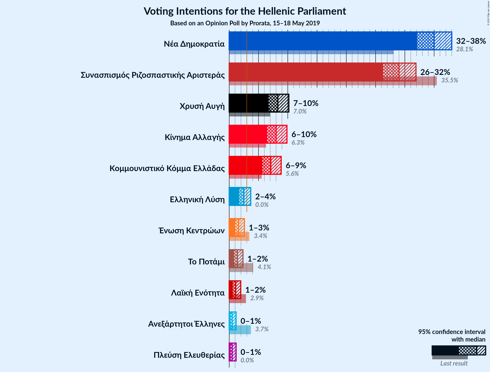

### Confidence Intervals

| Party | Last Result | Poll Result | 80% Confidence Interval | 90% Confidence Interval | 95% Confidence Interval | 99% Confidence Interval |
|:-----:|:-----------:|:-----------:|:-----------------------:|:-----------------------:|:-----------------------:|:-----------------------:|
| Νέα Δημοκρατία | 28.1% | 35.0% | 33.1–37.0% |32.6–37.5% |32.1–38.0% |31.2–39.0% |
| Συνασπισμός Ριζοσπαστικής Αριστεράς | 35.5% | 29.0% | 27.2–30.9% |26.7–31.4% |26.3–31.9% |25.4–32.8% |
| Χρυσή Αυγή | 7.0% | 8.3% | 7.3–9.5% |7.0–9.9% |6.7–10.2% |6.3–10.8% |
| Κίνημα Αλλαγής | 6.3% | 8.0% | 7.0–9.2% |6.7–9.6% |6.5–9.9% |6.0–10.5% |
| Κομμουνιστικό Κόμμα Ελλάδας | 5.6% | 7.1% | 6.2–8.3% |5.9–8.6% |5.7–8.9% |5.2–9.4% |
| Ελληνική Λύση | 0.0% | 2.5% | 2.0–3.3% |1.8–3.5% |1.7–3.7% |1.5–4.1% |
| Ένωση Κεντρώων | 3.4% | 1.6% | 1.2–2.2% |1.1–2.4% |1.0–2.6% |0.8–2.9% |
| Το Ποτάμι | 4.1% | 1.4% | 1.0–2.0% |0.9–2.2% |0.8–2.3% |0.7–2.7% |
| Λαϊκή Ενότητα | 2.9% | 1.1% | 0.8–1.7% |0.7–1.8% |0.6–2.0% |0.5–2.3% |
| Ανεξάρτητοι Έλληνες | 3.7% | 0.5% | 0.3–0.9% |0.3–1.1% |0.2–1.2% |0.2–1.4% |
| Πλεύση Ελευθερίας | 0.0% | 0.5% | 0.3–0.9% |0.3–1.1% |0.2–1.2% |0.2–1.4% |

*Note:* The poll result column reflects the actual value used in the calculations. Published results may vary slightly, and in addition be rounded to fewer digits.

## Seats

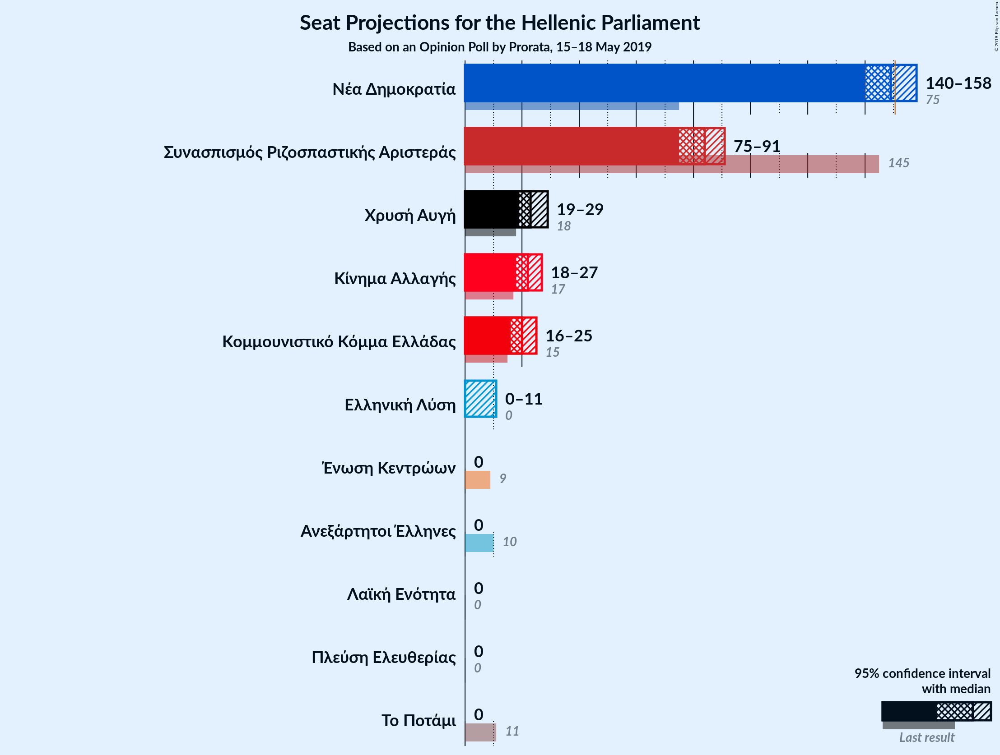

### Confidence Intervals

| Party | Last Result | Median | 80% Confidence Interval | 90% Confidence Interval | 95% Confidence Interval | 99% Confidence Interval |
|:-----:|:-----------:|:------:|:-----------------------:|:-----------------------:|:-----------------------:|:-----------------------:|
| <a href="#νέα-δημοκρατία">Νέα Δημοκρατία</a> | 75 | 149 | 143–154 |141–156 |140–158 |135–160 |
| <a href="#συνασπισμός-ριζοσπαστικής-αριστεράς">Συνασπισμός Ριζοσπαστικής Αριστεράς</a> | 145 | 84 | 79–88 |77–89 |75–91 |72–95 |
| <a href="#χρυσή-αυγή">Χρυσή Αυγή</a> | 18 | 23 | 21–27 |20–28 |19–29 |18–30 |
| <a href="#κίνημα-αλλαγής">Κίνημα Αλλαγής</a> | 17 | 22 | 18–26 |18–26 |18–27 |17–30 |
| <a href="#κομμουνιστικό-κόμμα-ελλάδας">Κομμουνιστικό Κόμμα Ελλάδας</a> | 15 | 20 | 17–23 |16–24 |16–25 |15–27 |
| <a href="#ελληνική-λύση">Ελληνική Λύση</a> | 0 | 0 | 0–9 |0–10 |0–11 |0–12 |
| <a href="#ένωση-κεντρώων">Ένωση Κεντρώων</a> | 9 | 0 | 0 |0 |0 |0 |
| <a href="#το-ποτάμι">Το Ποτάμι</a> | 11 | 0 | 0 |0 |0 |0 |
| <a href="#λαϊκή-ενότητα">Λαϊκή Ενότητα</a> | 0 | 0 | 0 |0 |0 |0 |
| <a href="#ανεξάρτητοι-έλληνες">Ανεξάρτητοι Έλληνες</a> | 10 | 0 | 0 |0 |0 |0 |
| <a href="#πλεύση-ελευθερίας">Πλεύση Ελευθερίας</a> | 0 | 0 | 0 |0 |0 |0 |

### Νέα Δημοκρατία

*For a full overview of the results for this party, see the [Νέα Δημοκρατία](party-νέαδημοκρατία.html) page.*

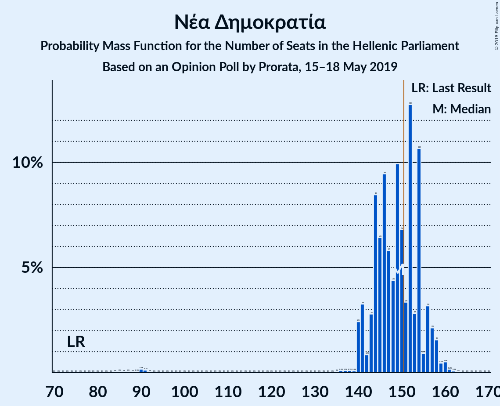

| Number of Seats | Probability | Accumulated | Special Marks |
|:---------------:|:-----------:|:-----------:|:-------------:|
| 75 | 0% | 100% | Last Result |
| 76 | 0% | 100% |  |
| 77 | 0% | 100% |  |
| 78 | 0% | 100% |  |
| 79 | 0% | 100% |  |
| 80 | 0% | 100% |  |
| 81 | 0% | 100% |  |
| 82 | 0% | 100% |  |
| 83 | 0% | 100% |  |
| 84 | 0% | 100% |  |
| 85 | 0% | 100% |  |
| 86 | 0% | 99.9% |  |
| 87 | 0% | 99.9% |  |
| 88 | 0% | 99.9% |  |
| 89 | 0.1% | 99.9% |  |
| 90 | 0.2% | 99.8% |  |
| 91 | 0.1% | 99.6% |  |
| 92 | 0% | 99.5% |  |
| 93 | 0% | 99.5% |  |
| 94 | 0% | 99.5% |  |
| 95 | 0% | 99.5% |  |
| 96 | 0% | 99.5% |  |
| 97 | 0% | 99.5% |  |
| 98 | 0% | 99.5% |  |
| 99 | 0% | 99.5% |  |
| 100 | 0% | 99.5% |  |
| 101 | 0% | 99.5% |  |
| 102 | 0% | 99.5% |  |
| 103 | 0% | 99.5% |  |
| 104 | 0% | 99.5% |  |
| 105 | 0% | 99.5% |  |
| 106 | 0% | 99.5% |  |
| 107 | 0% | 99.5% |  |
| 108 | 0% | 99.5% |  |
| 109 | 0% | 99.5% |  |
| 110 | 0% | 99.5% |  |
| 111 | 0% | 99.5% |  |
| 112 | 0% | 99.5% |  |
| 113 | 0% | 99.5% |  |
| 114 | 0% | 99.5% |  |
| 115 | 0% | 99.5% |  |
| 116 | 0% | 99.5% |  |
| 117 | 0% | 99.5% |  |
| 118 | 0% | 99.5% |  |
| 119 | 0% | 99.5% |  |
| 120 | 0% | 99.5% |  |
| 121 | 0% | 99.5% |  |
| 122 | 0% | 99.5% |  |
| 123 | 0% | 99.5% |  |
| 124 | 0% | 99.5% |  |
| 125 | 0% | 99.5% |  |
| 126 | 0% | 99.5% |  |
| 127 | 0% | 99.5% |  |
| 128 | 0% | 99.5% |  |
| 129 | 0% | 99.5% |  |
| 130 | 0% | 99.5% |  |
| 131 | 0% | 99.5% |  |
| 132 | 0% | 99.5% |  |
| 133 | 0% | 99.5% |  |
| 134 | 0% | 99.5% |  |
| 135 | 0% | 99.5% |  |
| 136 | 0.1% | 99.5% |  |
| 137 | 0.1% | 99.4% |  |
| 138 | 0.1% | 99.3% |  |
| 139 | 0.1% | 99.2% |  |
| 140 | 2% | 99.1% |  |
| 141 | 3% | 97% |  |
| 142 | 0.9% | 93% |  |
| 143 | 3% | 93% |  |
| 144 | 8% | 90% |  |
| 145 | 6% | 81% |  |
| 146 | 9% | 75% |  |
| 147 | 6% | 65% |  |
| 148 | 4% | 60% |  |
| 149 | 10% | 55% | Median |
| 150 | 7% | 45% |  |
| 151 | 3% | 39% | Majority |
| 152 | 13% | 35% |  |
| 153 | 3% | 22% |  |
| 154 | 11% | 20% |  |
| 155 | 0.9% | 9% |  |
| 156 | 3% | 8% |  |
| 157 | 2% | 5% |  |
| 158 | 2% | 3% |  |
| 159 | 0.5% | 1.2% |  |
| 160 | 0.5% | 0.8% |  |
| 161 | 0.2% | 0.3% |  |
| 162 | 0.1% | 0.1% |  |
| 163 | 0% | 0% |  |

### Συνασπισμός Ριζοσπαστικής Αριστεράς

*For a full overview of the results for this party, see the [Συνασπισμός Ριζοσπαστικής Αριστεράς](party-συνασπισμόςριζοσπαστικήςαριστεράς.html) page.*

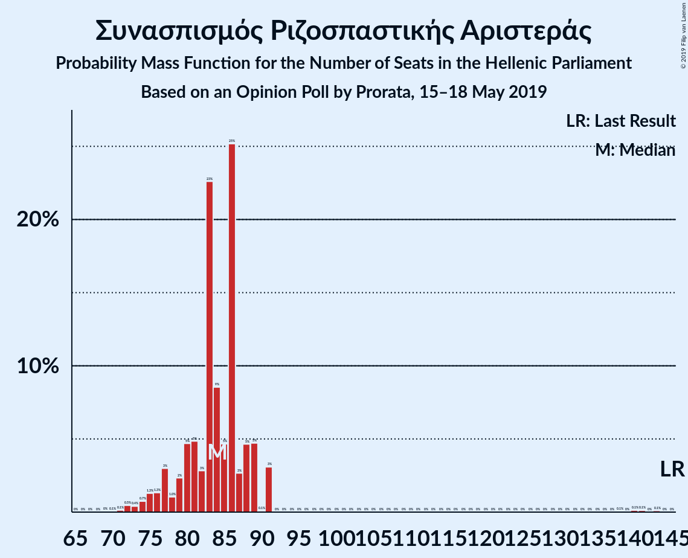

| Number of Seats | Probability | Accumulated | Special Marks |
|:---------------:|:-----------:|:-----------:|:-------------:|
| 69 | 0% | 100% |  |
| 70 | 0.1% | 99.9% |  |
| 71 | 0.1% | 99.9% |  |
| 72 | 0.5% | 99.8% |  |
| 73 | 0.4% | 99.3% |  |
| 74 | 0.7% | 98.9% |  |
| 75 | 1.3% | 98% |  |
| 76 | 1.3% | 97% |  |
| 77 | 3% | 96% |  |
| 78 | 1.0% | 93% |  |
| 79 | 2% | 91% |  |
| 80 | 5% | 89% |  |
| 81 | 5% | 84% |  |
| 82 | 3% | 80% |  |
| 83 | 23% | 77% |  |
| 84 | 9% | 54% | Median |
| 85 | 5% | 46% |  |
| 86 | 25% | 41% |  |
| 87 | 3% | 16% |  |
| 88 | 5% | 13% |  |
| 89 | 5% | 8% |  |
| 90 | 0.1% | 4% |  |
| 91 | 3% | 4% |  |
| 92 | 0% | 0.6% |  |
| 93 | 0% | 0.6% |  |
| 94 | 0% | 0.5% |  |
| 95 | 0% | 0.5% |  |
| 96 | 0% | 0.5% |  |
| 97 | 0% | 0.5% |  |
| 98 | 0% | 0.5% |  |
| 99 | 0% | 0.5% |  |
| 100 | 0% | 0.5% |  |
| 101 | 0% | 0.5% |  |
| 102 | 0% | 0.5% |  |
| 103 | 0% | 0.5% |  |
| 104 | 0% | 0.5% |  |
| 105 | 0% | 0.5% |  |
| 106 | 0% | 0.5% |  |
| 107 | 0% | 0.5% |  |
| 108 | 0% | 0.5% |  |
| 109 | 0% | 0.5% |  |
| 110 | 0% | 0.5% |  |
| 111 | 0% | 0.5% |  |
| 112 | 0% | 0.5% |  |
| 113 | 0% | 0.5% |  |
| 114 | 0% | 0.5% |  |
| 115 | 0% | 0.5% |  |
| 116 | 0% | 0.5% |  |
| 117 | 0% | 0.5% |  |
| 118 | 0% | 0.5% |  |
| 119 | 0% | 0.5% |  |
| 120 | 0% | 0.5% |  |
| 121 | 0% | 0.5% |  |
| 122 | 0% | 0.5% |  |
| 123 | 0% | 0.5% |  |
| 124 | 0% | 0.5% |  |
| 125 | 0% | 0.5% |  |
| 126 | 0% | 0.5% |  |
| 127 | 0% | 0.5% |  |
| 128 | 0% | 0.5% |  |
| 129 | 0% | 0.5% |  |
| 130 | 0% | 0.5% |  |
| 131 | 0% | 0.5% |  |
| 132 | 0% | 0.5% |  |
| 133 | 0% | 0.5% |  |
| 134 | 0% | 0.5% |  |
| 135 | 0% | 0.5% |  |
| 136 | 0% | 0.5% |  |
| 137 | 0% | 0.5% |  |
| 138 | 0.1% | 0.5% |  |
| 139 | 0% | 0.4% |  |
| 140 | 0.1% | 0.4% |  |
| 141 | 0.1% | 0.3% |  |
| 142 | 0% | 0.2% |  |
| 143 | 0.1% | 0.2% |  |
| 144 | 0% | 0% |  |
| 145 | 0% | 0% | Last Result |

### Χρυσή Αυγή

*For a full overview of the results for this party, see the [Χρυσή Αυγή](party-χρυσήαυγή.html) page.*

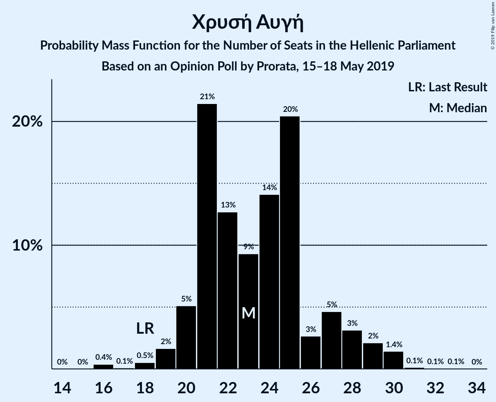

| Number of Seats | Probability | Accumulated | Special Marks |
|:---------------:|:-----------:|:-----------:|:-------------:|
| 16 | 0.4% | 100% |  |
| 17 | 0.1% | 99.6% |  |
| 18 | 0.5% | 99.5% | Last Result |
| 19 | 2% | 99.0% |  |
| 20 | 5% | 97% |  |
| 21 | 21% | 92% |  |
| 22 | 13% | 71% |  |
| 23 | 9% | 58% | Median |
| 24 | 14% | 49% |  |
| 25 | 20% | 35% |  |
| 26 | 3% | 14% |  |
| 27 | 5% | 12% |  |
| 28 | 3% | 7% |  |
| 29 | 2% | 4% |  |
| 30 | 1.4% | 2% |  |
| 31 | 0.1% | 0.3% |  |
| 32 | 0.1% | 0.1% |  |
| 33 | 0.1% | 0.1% |  |
| 34 | 0% | 0% |  |

### Κίνημα Αλλαγής

*For a full overview of the results for this party, see the [Κίνημα Αλλαγής](party-κίνημααλλαγής.html) page.*

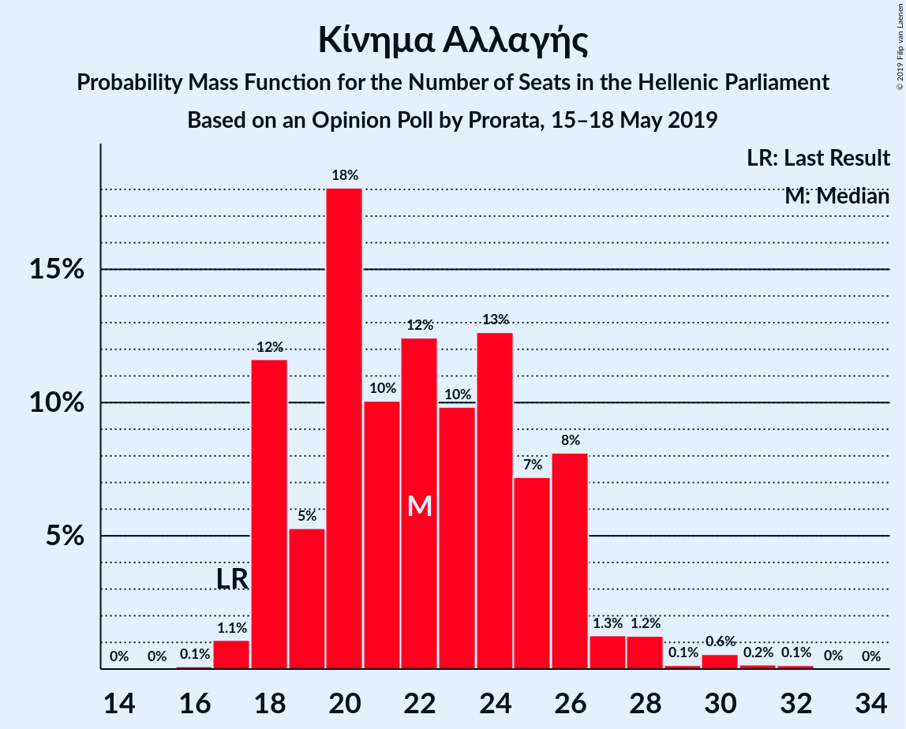

| Number of Seats | Probability | Accumulated | Special Marks |
|:---------------:|:-----------:|:-----------:|:-------------:|
| 16 | 0.1% | 100% |  |
| 17 | 1.1% | 99.9% | Last Result |
| 18 | 12% | 98.8% |  |
| 19 | 5% | 87% |  |
| 20 | 18% | 82% |  |
| 21 | 10% | 64% |  |
| 22 | 12% | 54% | Median |
| 23 | 10% | 41% |  |
| 24 | 13% | 31% |  |
| 25 | 7% | 19% |  |
| 26 | 8% | 12% |  |
| 27 | 1.3% | 4% |  |
| 28 | 1.2% | 2% |  |
| 29 | 0.1% | 1.0% |  |
| 30 | 0.6% | 0.9% |  |
| 31 | 0.2% | 0.3% |  |
| 32 | 0.1% | 0.2% |  |
| 33 | 0% | 0% |  |

### Κομμουνιστικό Κόμμα Ελλάδας

*For a full overview of the results for this party, see the [Κομμουνιστικό Κόμμα Ελλάδας](party-κομμουνιστικόκόμμαελλάδας.html) page.*

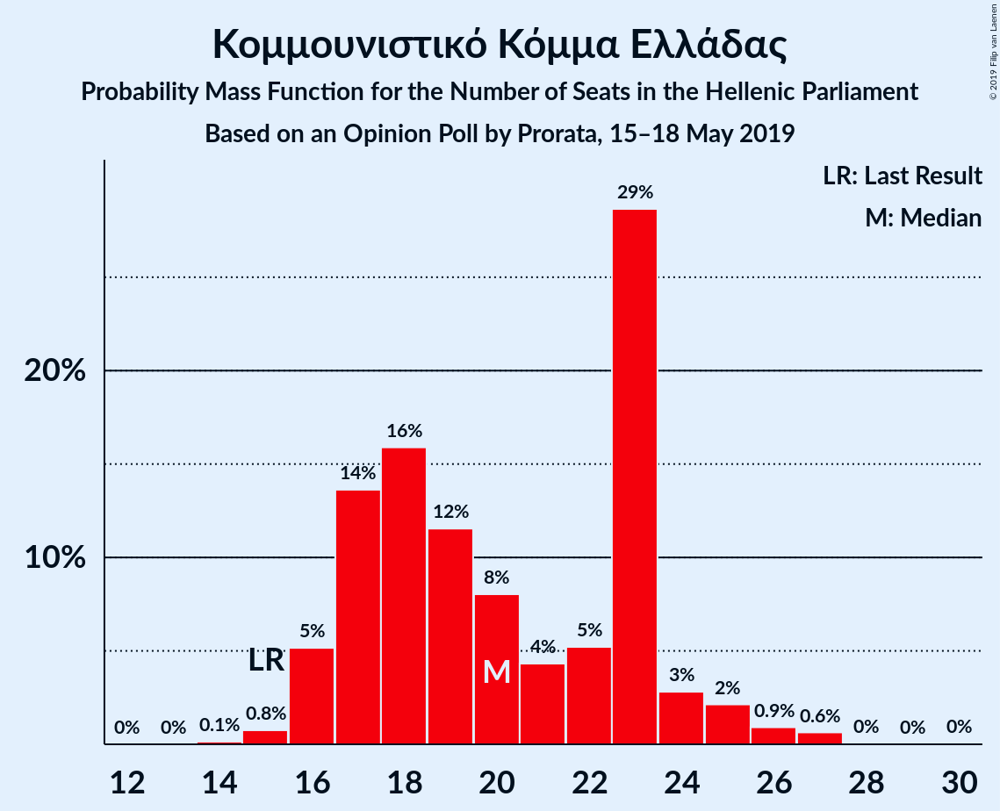

| Number of Seats | Probability | Accumulated | Special Marks |
|:---------------:|:-----------:|:-----------:|:-------------:|
| 14 | 0.1% | 100% |  |
| 15 | 0.8% | 99.8% | Last Result |
| 16 | 5% | 99.1% |  |
| 17 | 14% | 94% |  |
| 18 | 16% | 80% |  |
| 19 | 12% | 64% |  |
| 20 | 8% | 53% | Median |
| 21 | 4% | 45% |  |
| 22 | 5% | 40% |  |
| 23 | 29% | 35% |  |
| 24 | 3% | 7% |  |
| 25 | 2% | 4% |  |
| 26 | 0.9% | 2% |  |
| 27 | 0.6% | 0.8% |  |
| 28 | 0% | 0.1% |  |
| 29 | 0% | 0.1% |  |
| 30 | 0% | 0% |  |

### Ελληνική Λύση

*For a full overview of the results for this party, see the [Ελληνική Λύση](party-ελληνικήλύση.html) page.*

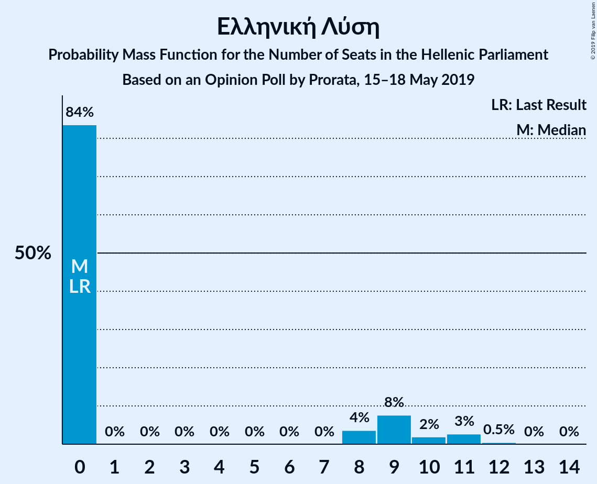

| Number of Seats | Probability | Accumulated | Special Marks |
|:---------------:|:-----------:|:-----------:|:-------------:|
| 0 | 84% | 100% | Last Result, Median |
| 1 | 0% | 16% |  |
| 2 | 0% | 16% |  |
| 3 | 0% | 16% |  |
| 4 | 0% | 16% |  |
| 5 | 0% | 16% |  |
| 6 | 0% | 16% |  |
| 7 | 0% | 16% |  |
| 8 | 4% | 16% |  |
| 9 | 8% | 13% |  |
| 10 | 2% | 5% |  |
| 11 | 3% | 3% |  |
| 12 | 0.5% | 0.5% |  |
| 13 | 0% | 0.1% |  |
| 14 | 0% | 0% |  |

### Ένωση Κεντρώων

*For a full overview of the results for this party, see the [Ένωση Κεντρώων](party-ένωσηκεντρώων.html) page.*

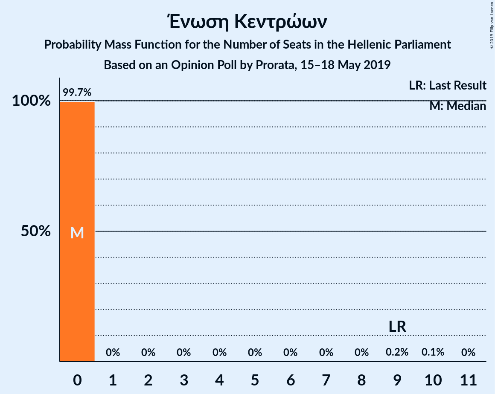

| Number of Seats | Probability | Accumulated | Special Marks |
|:---------------:|:-----------:|:-----------:|:-------------:|
| 0 | 99.7% | 100% | Median |
| 1 | 0% | 0.3% |  |
| 2 | 0% | 0.3% |  |
| 3 | 0% | 0.3% |  |
| 4 | 0% | 0.3% |  |
| 5 | 0% | 0.3% |  |
| 6 | 0% | 0.3% |  |
| 7 | 0% | 0.3% |  |
| 8 | 0% | 0.3% |  |
| 9 | 0.2% | 0.2% | Last Result |
| 10 | 0.1% | 0.1% |  |
| 11 | 0% | 0% |  |

### Το Ποτάμι

*For a full overview of the results for this party, see the [Το Ποτάμι](party-τοποτάμι.html) page.*

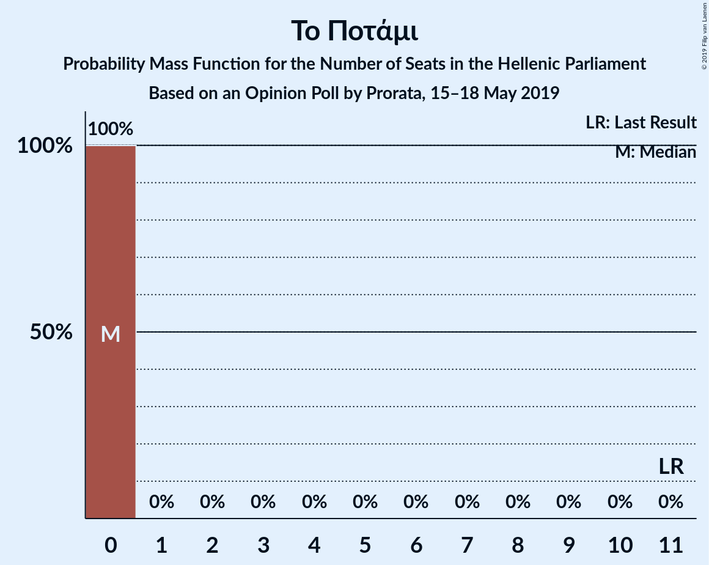

| Number of Seats | Probability | Accumulated | Special Marks |
|:---------------:|:-----------:|:-----------:|:-------------:|
| 0 | 100% | 100% | Median |
| 1 | 0% | 0% |  |
| 2 | 0% | 0% |  |
| 3 | 0% | 0% |  |
| 4 | 0% | 0% |  |
| 5 | 0% | 0% |  |
| 6 | 0% | 0% |  |
| 7 | 0% | 0% |  |
| 8 | 0% | 0% |  |
| 9 | 0% | 0% |  |
| 10 | 0% | 0% |  |
| 11 | 0% | 0% | Last Result |

### Λαϊκή Ενότητα

*For a full overview of the results for this party, see the [Λαϊκή Ενότητα](party-λαϊκήενότητα.html) page.*

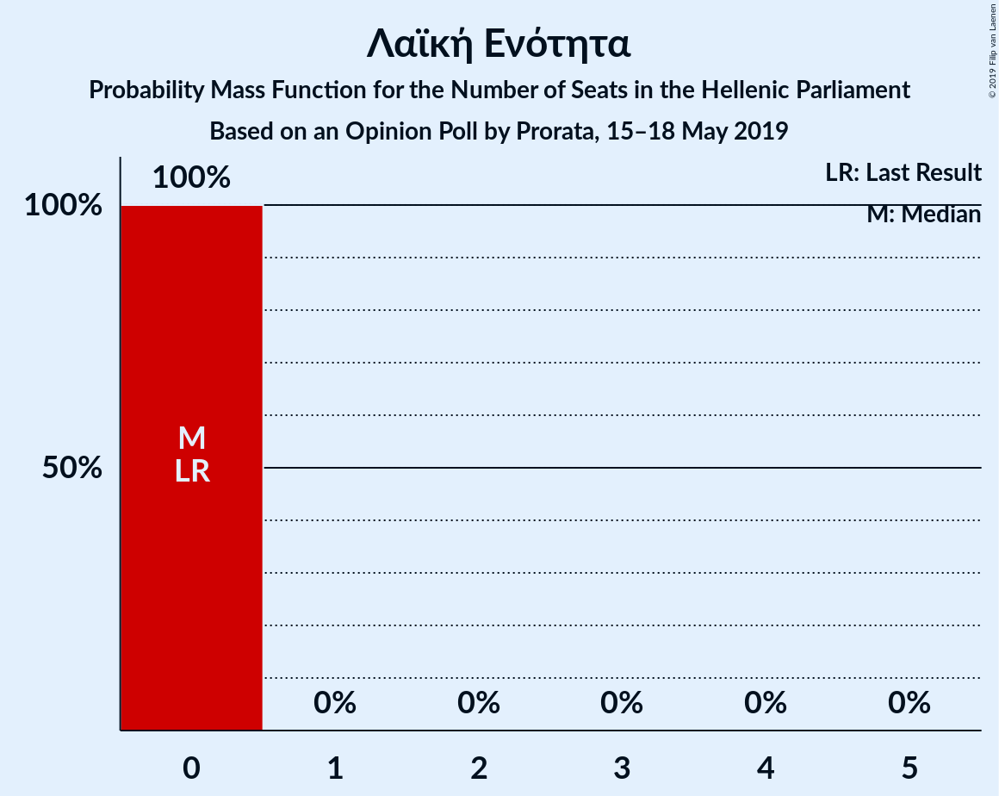

| Number of Seats | Probability | Accumulated | Special Marks |
|:---------------:|:-----------:|:-----------:|:-------------:|
| 0 | 100% | 100% | Last Result, Median |

### Ανεξάρτητοι Έλληνες

*For a full overview of the results for this party, see the [Ανεξάρτητοι Έλληνες](party-ανεξάρτητοιέλληνες.html) page.*

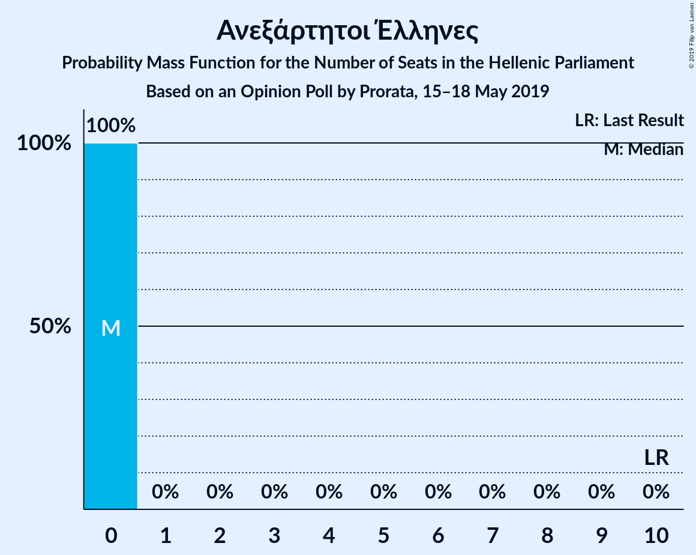

| Number of Seats | Probability | Accumulated | Special Marks |
|:---------------:|:-----------:|:-----------:|:-------------:|
| 0 | 100% | 100% | Median |
| 1 | 0% | 0% |  |
| 2 | 0% | 0% |  |
| 3 | 0% | 0% |  |
| 4 | 0% | 0% |  |
| 5 | 0% | 0% |  |
| 6 | 0% | 0% |  |
| 7 | 0% | 0% |  |
| 8 | 0% | 0% |  |
| 9 | 0% | 0% |  |
| 10 | 0% | 0% | Last Result |

### Πλεύση Ελευθερίας

*For a full overview of the results for this party, see the [Πλεύση Ελευθερίας](party-πλεύσηελευθερίας.html) page.*

| Number of Seats | Probability | Accumulated | Special Marks |
|:---------------:|:-----------:|:-----------:|:-------------:|
| 0 | 100% | 100% | Last Result, Median |

## Coalitions

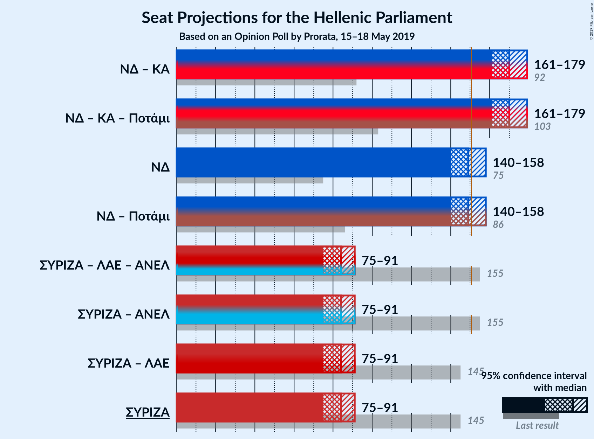

### Confidence Intervals

| Coalition | Last Result | Median | Majority? | 80% Confidence Interval | 90% Confidence Interval | 95% Confidence Interval | 99% Confidence Interval |
|:---------:|:-----------:|:------:|:---------:|:-----------------------:|:-----------------------:|:-----------------------:|:-----------------------:|
| Νέα Δημοκρατία – Κίνημα Αλλαγής | 92 | 170 | 99.5% | 166–176 | 164–179 | 161–179 | 155–182 |
| Νέα Δημοκρατία – Κίνημα Αλλαγής – Το Ποτάμι | 103 | 170 | 99.5% | 166–176 | 164–179 | 161–179 | 155–182 |
| Νέα Δημοκρατία | 75 | 149 | 39% | 143–154 | 141–156 | 140–158 | 135–160 |
| Νέα Δημοκρατία – Το Ποτάμι | 86 | 149 | 39% | 143–154 | 141–156 | 140–158 | 135–160 |
| Συνασπισμός Ριζοσπαστικής Αριστεράς – Λαϊκή Ενότητα – Ανεξάρτητοι Έλληνες | 155 | 84 | 0% | 79–88 | 77–89 | 75–91 | 72–95 |
| Συνασπισμός Ριζοσπαστικής Αριστεράς – Ανεξάρτητοι Έλληνες | 155 | 84 | 0% | 79–88 | 77–89 | 75–91 | 72–95 |
| Συνασπισμός Ριζοσπαστικής Αριστεράς – Λαϊκή Ενότητα | 145 | 84 | 0% | 79–88 | 77–89 | 75–91 | 72–95 |
| Συνασπισμός Ριζοσπαστικής Αριστεράς | 145 | 84 | 0% | 79–88 | 77–89 | 75–91 | 72–95 |

### Νέα Δημοκρατία – Κίνημα Αλλαγής

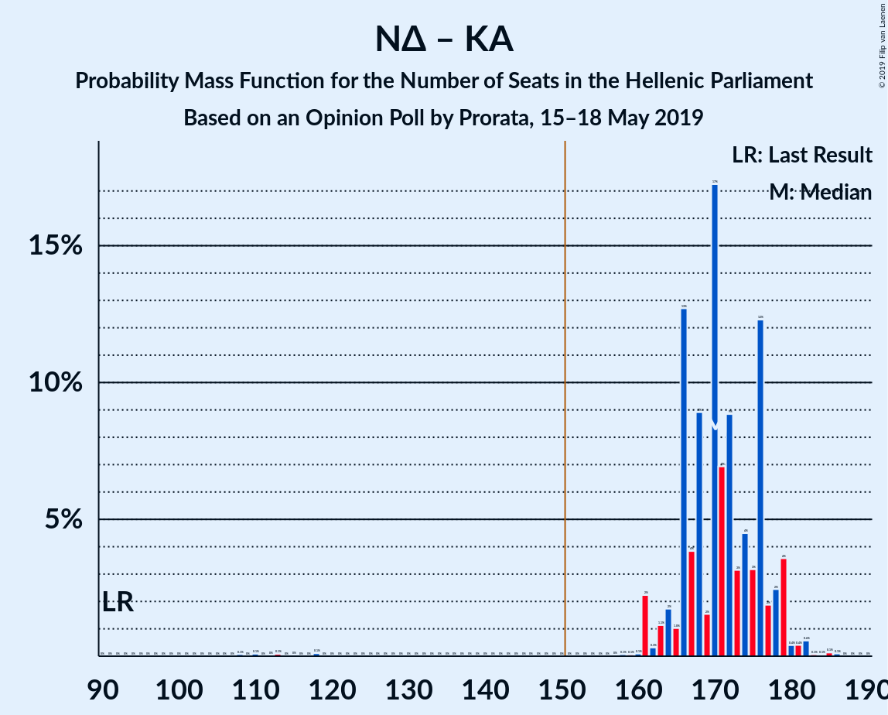

| Number of Seats | Probability | Accumulated | Special Marks |
|:---------------:|:-----------:|:-----------:|:-------------:|
| 92 | 0% | 100% | Last Result |
| 93 | 0% | 100% |  |
| 94 | 0% | 100% |  |
| 95 | 0% | 100% |  |
| 96 | 0% | 100% |  |
| 97 | 0% | 100% |  |
| 98 | 0% | 100% |  |
| 99 | 0% | 100% |  |
| 100 | 0% | 100% |  |
| 101 | 0% | 100% |  |
| 102 | 0% | 100% |  |
| 103 | 0% | 100% |  |
| 104 | 0% | 100% |  |
| 105 | 0% | 100% |  |
| 106 | 0% | 100% |  |
| 107 | 0% | 100% |  |
| 108 | 0.1% | 100% |  |
| 109 | 0% | 99.9% |  |
| 110 | 0.1% | 99.9% |  |
| 111 | 0% | 99.8% |  |
| 112 | 0% | 99.8% |  |
| 113 | 0.1% | 99.8% |  |
| 114 | 0% | 99.7% |  |
| 115 | 0% | 99.7% |  |
| 116 | 0% | 99.6% |  |
| 117 | 0% | 99.6% |  |
| 118 | 0.1% | 99.6% |  |
| 119 | 0% | 99.5% |  |
| 120 | 0% | 99.5% |  |
| 121 | 0% | 99.5% |  |
| 122 | 0% | 99.5% |  |
| 123 | 0% | 99.5% |  |
| 124 | 0% | 99.5% |  |
| 125 | 0% | 99.5% |  |
| 126 | 0% | 99.5% |  |
| 127 | 0% | 99.5% |  |
| 128 | 0% | 99.5% |  |
| 129 | 0% | 99.5% |  |
| 130 | 0% | 99.5% |  |
| 131 | 0% | 99.5% |  |
| 132 | 0% | 99.5% |  |
| 133 | 0% | 99.5% |  |
| 134 | 0% | 99.5% |  |
| 135 | 0% | 99.5% |  |
| 136 | 0% | 99.5% |  |
| 137 | 0% | 99.5% |  |
| 138 | 0% | 99.5% |  |
| 139 | 0% | 99.5% |  |
| 140 | 0% | 99.5% |  |
| 141 | 0% | 99.5% |  |
| 142 | 0% | 99.5% |  |
| 143 | 0% | 99.5% |  |
| 144 | 0% | 99.5% |  |
| 145 | 0% | 99.5% |  |
| 146 | 0% | 99.5% |  |
| 147 | 0% | 99.5% |  |
| 148 | 0% | 99.5% |  |
| 149 | 0% | 99.5% |  |
| 150 | 0% | 99.5% |  |
| 151 | 0% | 99.5% | Majority |
| 152 | 0% | 99.5% |  |
| 153 | 0% | 99.5% |  |
| 154 | 0% | 99.5% |  |
| 155 | 0% | 99.5% |  |
| 156 | 0% | 99.5% |  |
| 157 | 0% | 99.5% |  |
| 158 | 0.1% | 99.5% |  |
| 159 | 0.1% | 99.4% |  |
| 160 | 0.1% | 99.3% |  |
| 161 | 2% | 99.2% |  |
| 162 | 0.3% | 97% |  |
| 163 | 1.1% | 97% |  |
| 164 | 2% | 96% |  |
| 165 | 1.0% | 94% |  |
| 166 | 13% | 93% |  |
| 167 | 4% | 80% |  |
| 168 | 9% | 76% |  |
| 169 | 2% | 67% |  |
| 170 | 17% | 66% |  |
| 171 | 7% | 49% | Median |
| 172 | 9% | 42% |  |
| 173 | 3% | 33% |  |
| 174 | 4% | 30% |  |
| 175 | 3% | 25% |  |
| 176 | 12% | 22% |  |
| 177 | 2% | 10% |  |
| 178 | 2% | 8% |  |
| 179 | 4% | 5% |  |
| 180 | 0.4% | 2% |  |
| 181 | 0.4% | 1.3% |  |
| 182 | 0.6% | 0.9% |  |
| 183 | 0.1% | 0.4% |  |
| 184 | 0.1% | 0.3% |  |
| 185 | 0.1% | 0.2% |  |
| 186 | 0.1% | 0.1% |  |
| 187 | 0% | 0% |  |

### Νέα Δημοκρατία – Κίνημα Αλλαγής – Το Ποτάμι

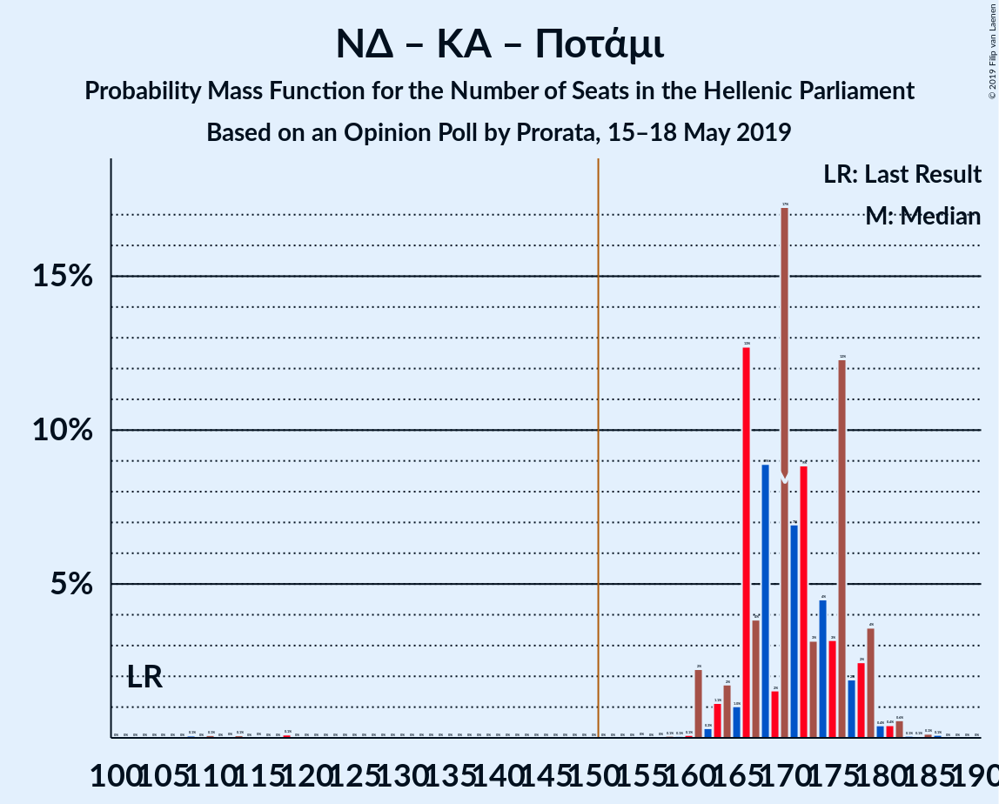

| Number of Seats | Probability | Accumulated | Special Marks |
|:---------------:|:-----------:|:-----------:|:-------------:|
| 103 | 0% | 100% | Last Result |
| 104 | 0% | 100% |  |
| 105 | 0% | 100% |  |
| 106 | 0% | 100% |  |
| 107 | 0% | 100% |  |
| 108 | 0.1% | 100% |  |
| 109 | 0% | 99.9% |  |
| 110 | 0.1% | 99.9% |  |
| 111 | 0% | 99.8% |  |
| 112 | 0% | 99.8% |  |
| 113 | 0.1% | 99.8% |  |
| 114 | 0% | 99.7% |  |
| 115 | 0% | 99.7% |  |
| 116 | 0% | 99.6% |  |
| 117 | 0% | 99.6% |  |
| 118 | 0.1% | 99.6% |  |
| 119 | 0% | 99.5% |  |
| 120 | 0% | 99.5% |  |
| 121 | 0% | 99.5% |  |
| 122 | 0% | 99.5% |  |
| 123 | 0% | 99.5% |  |
| 124 | 0% | 99.5% |  |
| 125 | 0% | 99.5% |  |
| 126 | 0% | 99.5% |  |
| 127 | 0% | 99.5% |  |
| 128 | 0% | 99.5% |  |
| 129 | 0% | 99.5% |  |
| 130 | 0% | 99.5% |  |
| 131 | 0% | 99.5% |  |
| 132 | 0% | 99.5% |  |
| 133 | 0% | 99.5% |  |
| 134 | 0% | 99.5% |  |
| 135 | 0% | 99.5% |  |
| 136 | 0% | 99.5% |  |
| 137 | 0% | 99.5% |  |
| 138 | 0% | 99.5% |  |
| 139 | 0% | 99.5% |  |
| 140 | 0% | 99.5% |  |
| 141 | 0% | 99.5% |  |
| 142 | 0% | 99.5% |  |
| 143 | 0% | 99.5% |  |
| 144 | 0% | 99.5% |  |
| 145 | 0% | 99.5% |  |
| 146 | 0% | 99.5% |  |
| 147 | 0% | 99.5% |  |
| 148 | 0% | 99.5% |  |
| 149 | 0% | 99.5% |  |
| 150 | 0% | 99.5% |  |
| 151 | 0% | 99.5% | Majority |
| 152 | 0% | 99.5% |  |
| 153 | 0% | 99.5% |  |
| 154 | 0% | 99.5% |  |
| 155 | 0% | 99.5% |  |
| 156 | 0% | 99.5% |  |
| 157 | 0% | 99.5% |  |
| 158 | 0.1% | 99.5% |  |
| 159 | 0.1% | 99.4% |  |
| 160 | 0.1% | 99.3% |  |
| 161 | 2% | 99.2% |  |
| 162 | 0.3% | 97% |  |
| 163 | 1.1% | 97% |  |
| 164 | 2% | 96% |  |
| 165 | 1.0% | 94% |  |
| 166 | 13% | 93% |  |
| 167 | 4% | 80% |  |
| 168 | 9% | 76% |  |
| 169 | 2% | 67% |  |
| 170 | 17% | 66% |  |
| 171 | 7% | 49% | Median |
| 172 | 9% | 42% |  |
| 173 | 3% | 33% |  |
| 174 | 4% | 30% |  |
| 175 | 3% | 25% |  |
| 176 | 12% | 22% |  |
| 177 | 2% | 10% |  |
| 178 | 2% | 8% |  |
| 179 | 4% | 5% |  |
| 180 | 0.4% | 2% |  |
| 181 | 0.4% | 1.3% |  |
| 182 | 0.6% | 0.9% |  |
| 183 | 0.1% | 0.4% |  |
| 184 | 0.1% | 0.3% |  |
| 185 | 0.1% | 0.2% |  |
| 186 | 0.1% | 0.1% |  |
| 187 | 0% | 0% |  |

### Νέα Δημοκρατία

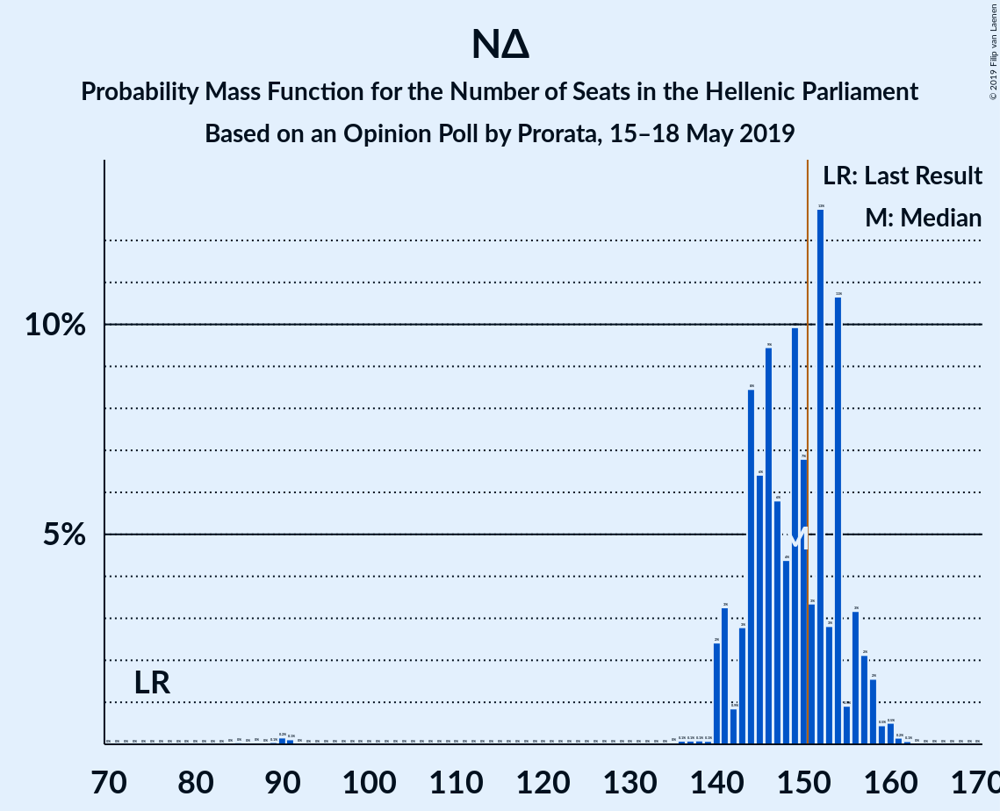

| Number of Seats | Probability | Accumulated | Special Marks |
|:---------------:|:-----------:|:-----------:|:-------------:|
| 75 | 0% | 100% | Last Result |
| 76 | 0% | 100% |  |
| 77 | 0% | 100% |  |
| 78 | 0% | 100% |  |
| 79 | 0% | 100% |  |
| 80 | 0% | 100% |  |
| 81 | 0% | 100% |  |
| 82 | 0% | 100% |  |
| 83 | 0% | 100% |  |
| 84 | 0% | 100% |  |
| 85 | 0% | 100% |  |
| 86 | 0% | 99.9% |  |
| 87 | 0% | 99.9% |  |
| 88 | 0% | 99.9% |  |
| 89 | 0.1% | 99.9% |  |
| 90 | 0.2% | 99.8% |  |
| 91 | 0.1% | 99.6% |  |
| 92 | 0% | 99.5% |  |
| 93 | 0% | 99.5% |  |
| 94 | 0% | 99.5% |  |
| 95 | 0% | 99.5% |  |
| 96 | 0% | 99.5% |  |
| 97 | 0% | 99.5% |  |
| 98 | 0% | 99.5% |  |
| 99 | 0% | 99.5% |  |
| 100 | 0% | 99.5% |  |
| 101 | 0% | 99.5% |  |
| 102 | 0% | 99.5% |  |
| 103 | 0% | 99.5% |  |
| 104 | 0% | 99.5% |  |
| 105 | 0% | 99.5% |  |
| 106 | 0% | 99.5% |  |
| 107 | 0% | 99.5% |  |
| 108 | 0% | 99.5% |  |
| 109 | 0% | 99.5% |  |
| 110 | 0% | 99.5% |  |
| 111 | 0% | 99.5% |  |
| 112 | 0% | 99.5% |  |
| 113 | 0% | 99.5% |  |
| 114 | 0% | 99.5% |  |
| 115 | 0% | 99.5% |  |
| 116 | 0% | 99.5% |  |
| 117 | 0% | 99.5% |  |
| 118 | 0% | 99.5% |  |
| 119 | 0% | 99.5% |  |
| 120 | 0% | 99.5% |  |
| 121 | 0% | 99.5% |  |
| 122 | 0% | 99.5% |  |
| 123 | 0% | 99.5% |  |
| 124 | 0% | 99.5% |  |
| 125 | 0% | 99.5% |  |
| 126 | 0% | 99.5% |  |
| 127 | 0% | 99.5% |  |
| 128 | 0% | 99.5% |  |
| 129 | 0% | 99.5% |  |
| 130 | 0% | 99.5% |  |
| 131 | 0% | 99.5% |  |
| 132 | 0% | 99.5% |  |
| 133 | 0% | 99.5% |  |
| 134 | 0% | 99.5% |  |
| 135 | 0% | 99.5% |  |
| 136 | 0.1% | 99.5% |  |
| 137 | 0.1% | 99.4% |  |
| 138 | 0.1% | 99.3% |  |
| 139 | 0.1% | 99.2% |  |
| 140 | 2% | 99.1% |  |
| 141 | 3% | 97% |  |
| 142 | 0.9% | 93% |  |
| 143 | 3% | 93% |  |
| 144 | 8% | 90% |  |
| 145 | 6% | 81% |  |
| 146 | 9% | 75% |  |
| 147 | 6% | 65% |  |
| 148 | 4% | 60% |  |
| 149 | 10% | 55% | Median |
| 150 | 7% | 45% |  |
| 151 | 3% | 39% | Majority |
| 152 | 13% | 35% |  |
| 153 | 3% | 22% |  |
| 154 | 11% | 20% |  |
| 155 | 0.9% | 9% |  |
| 156 | 3% | 8% |  |
| 157 | 2% | 5% |  |
| 158 | 2% | 3% |  |
| 159 | 0.5% | 1.2% |  |
| 160 | 0.5% | 0.8% |  |
| 161 | 0.2% | 0.3% |  |
| 162 | 0.1% | 0.1% |  |
| 163 | 0% | 0% |  |

### Νέα Δημοκρατία – Το Ποτάμι

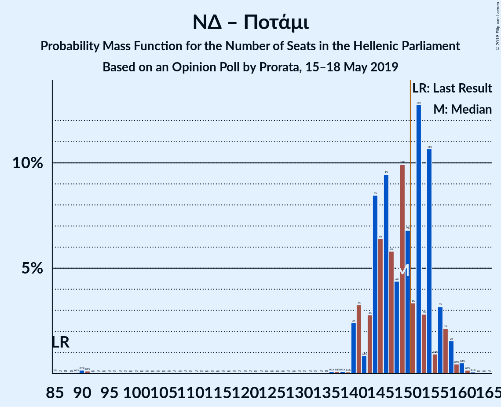

| Number of Seats | Probability | Accumulated | Special Marks |
|:---------------:|:-----------:|:-----------:|:-------------:|
| 85 | 0% | 100% |  |
| 86 | 0% | 99.9% | Last Result |
| 87 | 0% | 99.9% |  |
| 88 | 0% | 99.9% |  |
| 89 | 0.1% | 99.9% |  |
| 90 | 0.2% | 99.8% |  |
| 91 | 0.1% | 99.6% |  |
| 92 | 0% | 99.5% |  |
| 93 | 0% | 99.5% |  |
| 94 | 0% | 99.5% |  |
| 95 | 0% | 99.5% |  |
| 96 | 0% | 99.5% |  |
| 97 | 0% | 99.5% |  |
| 98 | 0% | 99.5% |  |
| 99 | 0% | 99.5% |  |
| 100 | 0% | 99.5% |  |
| 101 | 0% | 99.5% |  |
| 102 | 0% | 99.5% |  |
| 103 | 0% | 99.5% |  |
| 104 | 0% | 99.5% |  |
| 105 | 0% | 99.5% |  |
| 106 | 0% | 99.5% |  |
| 107 | 0% | 99.5% |  |
| 108 | 0% | 99.5% |  |
| 109 | 0% | 99.5% |  |
| 110 | 0% | 99.5% |  |
| 111 | 0% | 99.5% |  |
| 112 | 0% | 99.5% |  |
| 113 | 0% | 99.5% |  |
| 114 | 0% | 99.5% |  |
| 115 | 0% | 99.5% |  |
| 116 | 0% | 99.5% |  |
| 117 | 0% | 99.5% |  |
| 118 | 0% | 99.5% |  |
| 119 | 0% | 99.5% |  |
| 120 | 0% | 99.5% |  |
| 121 | 0% | 99.5% |  |
| 122 | 0% | 99.5% |  |
| 123 | 0% | 99.5% |  |
| 124 | 0% | 99.5% |  |
| 125 | 0% | 99.5% |  |
| 126 | 0% | 99.5% |  |
| 127 | 0% | 99.5% |  |
| 128 | 0% | 99.5% |  |
| 129 | 0% | 99.5% |  |
| 130 | 0% | 99.5% |  |
| 131 | 0% | 99.5% |  |
| 132 | 0% | 99.5% |  |
| 133 | 0% | 99.5% |  |
| 134 | 0% | 99.5% |  |
| 135 | 0% | 99.5% |  |
| 136 | 0.1% | 99.5% |  |
| 137 | 0.1% | 99.4% |  |
| 138 | 0.1% | 99.3% |  |
| 139 | 0.1% | 99.2% |  |
| 140 | 2% | 99.1% |  |
| 141 | 3% | 97% |  |
| 142 | 0.8% | 93% |  |
| 143 | 3% | 93% |  |
| 144 | 8% | 90% |  |
| 145 | 6% | 81% |  |
| 146 | 9% | 75% |  |
| 147 | 6% | 66% |  |
| 148 | 4% | 60% |  |
| 149 | 10% | 55% | Median |
| 150 | 7% | 45% |  |
| 151 | 3% | 39% | Majority |
| 152 | 13% | 35% |  |
| 153 | 3% | 22% |  |
| 154 | 11% | 20% |  |
| 155 | 0.9% | 9% |  |
| 156 | 3% | 8% |  |
| 157 | 2% | 5% |  |
| 158 | 2% | 3% |  |
| 159 | 0.5% | 1.2% |  |
| 160 | 0.5% | 0.8% |  |
| 161 | 0.2% | 0.3% |  |
| 162 | 0.1% | 0.1% |  |
| 163 | 0% | 0% |  |

### Συνασπισμός Ριζοσπαστικής Αριστεράς – Λαϊκή Ενότητα – Ανεξάρτητοι Έλληνες

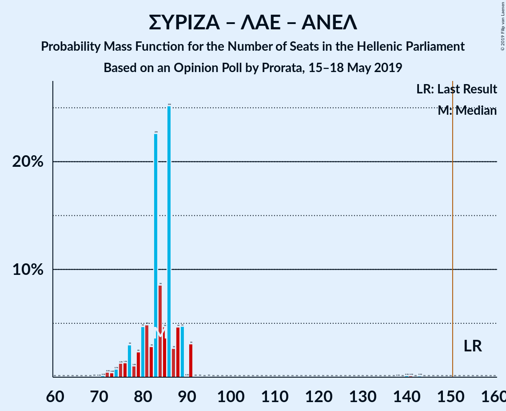

| Number of Seats | Probability | Accumulated | Special Marks |
|:---------------:|:-----------:|:-----------:|:-------------:|
| 69 | 0% | 100% |  |
| 70 | 0.1% | 99.9% |  |
| 71 | 0.1% | 99.9% |  |
| 72 | 0.5% | 99.8% |  |
| 73 | 0.4% | 99.3% |  |
| 74 | 0.7% | 98.9% |  |
| 75 | 1.3% | 98% |  |
| 76 | 1.3% | 97% |  |
| 77 | 3% | 96% |  |
| 78 | 1.0% | 93% |  |
| 79 | 2% | 91% |  |
| 80 | 5% | 89% |  |
| 81 | 5% | 84% |  |
| 82 | 3% | 80% |  |
| 83 | 23% | 77% |  |
| 84 | 9% | 54% | Median |
| 85 | 5% | 46% |  |
| 86 | 25% | 41% |  |
| 87 | 3% | 16% |  |
| 88 | 5% | 13% |  |
| 89 | 5% | 8% |  |
| 90 | 0.1% | 4% |  |
| 91 | 3% | 4% |  |
| 92 | 0% | 0.6% |  |
| 93 | 0% | 0.6% |  |
| 94 | 0% | 0.5% |  |
| 95 | 0% | 0.5% |  |
| 96 | 0% | 0.5% |  |
| 97 | 0% | 0.5% |  |
| 98 | 0% | 0.5% |  |
| 99 | 0% | 0.5% |  |
| 100 | 0% | 0.5% |  |
| 101 | 0% | 0.5% |  |
| 102 | 0% | 0.5% |  |
| 103 | 0% | 0.5% |  |
| 104 | 0% | 0.5% |  |
| 105 | 0% | 0.5% |  |
| 106 | 0% | 0.5% |  |
| 107 | 0% | 0.5% |  |
| 108 | 0% | 0.5% |  |
| 109 | 0% | 0.5% |  |
| 110 | 0% | 0.5% |  |
| 111 | 0% | 0.5% |  |
| 112 | 0% | 0.5% |  |
| 113 | 0% | 0.5% |  |
| 114 | 0% | 0.5% |  |
| 115 | 0% | 0.5% |  |
| 116 | 0% | 0.5% |  |
| 117 | 0% | 0.5% |  |
| 118 | 0% | 0.5% |  |
| 119 | 0% | 0.5% |  |
| 120 | 0% | 0.5% |  |
| 121 | 0% | 0.5% |  |
| 122 | 0% | 0.5% |  |
| 123 | 0% | 0.5% |  |
| 124 | 0% | 0.5% |  |
| 125 | 0% | 0.5% |  |
| 126 | 0% | 0.5% |  |
| 127 | 0% | 0.5% |  |
| 128 | 0% | 0.5% |  |
| 129 | 0% | 0.5% |  |
| 130 | 0% | 0.5% |  |
| 131 | 0% | 0.5% |  |
| 132 | 0% | 0.5% |  |
| 133 | 0% | 0.5% |  |
| 134 | 0% | 0.5% |  |
| 135 | 0% | 0.5% |  |
| 136 | 0% | 0.5% |  |
| 137 | 0% | 0.5% |  |
| 138 | 0.1% | 0.5% |  |
| 139 | 0% | 0.4% |  |
| 140 | 0.1% | 0.4% |  |
| 141 | 0.1% | 0.3% |  |
| 142 | 0% | 0.2% |  |
| 143 | 0.1% | 0.2% |  |
| 144 | 0% | 0% |  |
| 145 | 0% | 0% |  |
| 146 | 0% | 0% |  |
| 147 | 0% | 0% |  |
| 148 | 0% | 0% |  |
| 149 | 0% | 0% |  |
| 150 | 0% | 0% |  |
| 151 | 0% | 0% | Majority |
| 152 | 0% | 0% |  |
| 153 | 0% | 0% |  |
| 154 | 0% | 0% |  |
| 155 | 0% | 0% | Last Result |

### Συνασπισμός Ριζοσπαστικής Αριστεράς – Ανεξάρτητοι Έλληνες

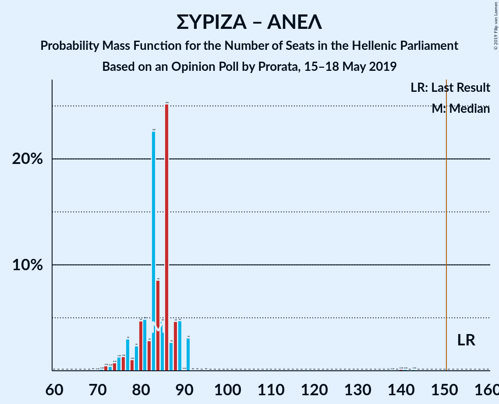

| Number of Seats | Probability | Accumulated | Special Marks |
|:---------------:|:-----------:|:-----------:|:-------------:|
| 69 | 0% | 100% |  |
| 70 | 0.1% | 99.9% |  |
| 71 | 0.1% | 99.9% |  |
| 72 | 0.5% | 99.8% |  |
| 73 | 0.4% | 99.3% |  |
| 74 | 0.7% | 98.9% |  |
| 75 | 1.3% | 98% |  |
| 76 | 1.3% | 97% |  |
| 77 | 3% | 96% |  |
| 78 | 1.0% | 93% |  |
| 79 | 2% | 91% |  |
| 80 | 5% | 89% |  |
| 81 | 5% | 84% |  |
| 82 | 3% | 80% |  |
| 83 | 23% | 77% |  |
| 84 | 9% | 54% | Median |
| 85 | 5% | 46% |  |
| 86 | 25% | 41% |  |
| 87 | 3% | 16% |  |
| 88 | 5% | 13% |  |
| 89 | 5% | 8% |  |
| 90 | 0.1% | 4% |  |
| 91 | 3% | 4% |  |
| 92 | 0% | 0.6% |  |
| 93 | 0% | 0.6% |  |
| 94 | 0% | 0.5% |  |
| 95 | 0% | 0.5% |  |
| 96 | 0% | 0.5% |  |
| 97 | 0% | 0.5% |  |
| 98 | 0% | 0.5% |  |
| 99 | 0% | 0.5% |  |
| 100 | 0% | 0.5% |  |
| 101 | 0% | 0.5% |  |
| 102 | 0% | 0.5% |  |
| 103 | 0% | 0.5% |  |
| 104 | 0% | 0.5% |  |
| 105 | 0% | 0.5% |  |
| 106 | 0% | 0.5% |  |
| 107 | 0% | 0.5% |  |
| 108 | 0% | 0.5% |  |
| 109 | 0% | 0.5% |  |
| 110 | 0% | 0.5% |  |
| 111 | 0% | 0.5% |  |
| 112 | 0% | 0.5% |  |
| 113 | 0% | 0.5% |  |
| 114 | 0% | 0.5% |  |
| 115 | 0% | 0.5% |  |
| 116 | 0% | 0.5% |  |
| 117 | 0% | 0.5% |  |
| 118 | 0% | 0.5% |  |
| 119 | 0% | 0.5% |  |
| 120 | 0% | 0.5% |  |
| 121 | 0% | 0.5% |  |
| 122 | 0% | 0.5% |  |
| 123 | 0% | 0.5% |  |
| 124 | 0% | 0.5% |  |
| 125 | 0% | 0.5% |  |
| 126 | 0% | 0.5% |  |
| 127 | 0% | 0.5% |  |
| 128 | 0% | 0.5% |  |
| 129 | 0% | 0.5% |  |
| 130 | 0% | 0.5% |  |
| 131 | 0% | 0.5% |  |
| 132 | 0% | 0.5% |  |
| 133 | 0% | 0.5% |  |
| 134 | 0% | 0.5% |  |
| 135 | 0% | 0.5% |  |
| 136 | 0% | 0.5% |  |
| 137 | 0% | 0.5% |  |
| 138 | 0.1% | 0.5% |  |
| 139 | 0% | 0.4% |  |
| 140 | 0.1% | 0.4% |  |
| 141 | 0.1% | 0.3% |  |
| 142 | 0% | 0.2% |  |
| 143 | 0.1% | 0.2% |  |
| 144 | 0% | 0% |  |
| 145 | 0% | 0% |  |
| 146 | 0% | 0% |  |
| 147 | 0% | 0% |  |
| 148 | 0% | 0% |  |
| 149 | 0% | 0% |  |
| 150 | 0% | 0% |  |
| 151 | 0% | 0% | Majority |
| 152 | 0% | 0% |  |
| 153 | 0% | 0% |  |
| 154 | 0% | 0% |  |
| 155 | 0% | 0% | Last Result |

### Συνασπισμός Ριζοσπαστικής Αριστεράς – Λαϊκή Ενότητα

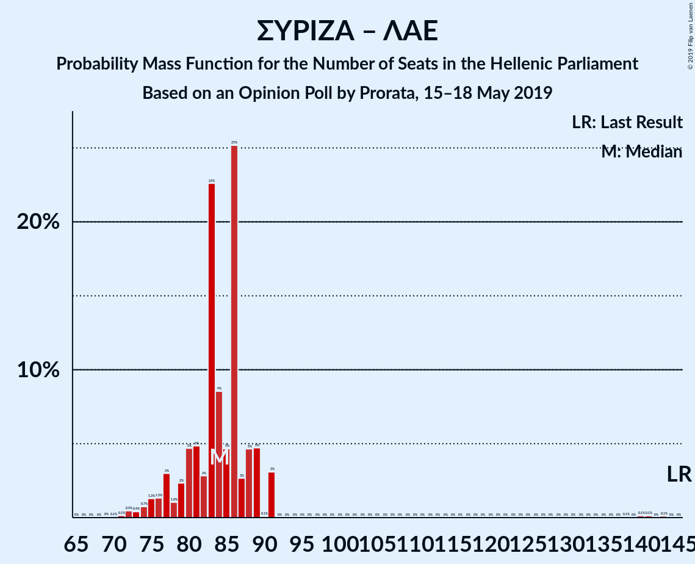

| Number of Seats | Probability | Accumulated | Special Marks |
|:---------------:|:-----------:|:-----------:|:-------------:|
| 69 | 0% | 100% |  |
| 70 | 0.1% | 99.9% |  |
| 71 | 0.1% | 99.9% |  |
| 72 | 0.5% | 99.8% |  |
| 73 | 0.4% | 99.3% |  |
| 74 | 0.7% | 98.9% |  |
| 75 | 1.3% | 98% |  |
| 76 | 1.3% | 97% |  |
| 77 | 3% | 96% |  |
| 78 | 1.0% | 93% |  |
| 79 | 2% | 91% |  |
| 80 | 5% | 89% |  |
| 81 | 5% | 84% |  |
| 82 | 3% | 80% |  |
| 83 | 23% | 77% |  |
| 84 | 9% | 54% | Median |
| 85 | 5% | 46% |  |
| 86 | 25% | 41% |  |
| 87 | 3% | 16% |  |
| 88 | 5% | 13% |  |
| 89 | 5% | 8% |  |
| 90 | 0.1% | 4% |  |
| 91 | 3% | 4% |  |
| 92 | 0% | 0.6% |  |
| 93 | 0% | 0.6% |  |
| 94 | 0% | 0.5% |  |
| 95 | 0% | 0.5% |  |
| 96 | 0% | 0.5% |  |
| 97 | 0% | 0.5% |  |
| 98 | 0% | 0.5% |  |
| 99 | 0% | 0.5% |  |
| 100 | 0% | 0.5% |  |
| 101 | 0% | 0.5% |  |
| 102 | 0% | 0.5% |  |
| 103 | 0% | 0.5% |  |
| 104 | 0% | 0.5% |  |
| 105 | 0% | 0.5% |  |
| 106 | 0% | 0.5% |  |
| 107 | 0% | 0.5% |  |
| 108 | 0% | 0.5% |  |
| 109 | 0% | 0.5% |  |
| 110 | 0% | 0.5% |  |
| 111 | 0% | 0.5% |  |
| 112 | 0% | 0.5% |  |
| 113 | 0% | 0.5% |  |
| 114 | 0% | 0.5% |  |
| 115 | 0% | 0.5% |  |
| 116 | 0% | 0.5% |  |
| 117 | 0% | 0.5% |  |
| 118 | 0% | 0.5% |  |
| 119 | 0% | 0.5% |  |
| 120 | 0% | 0.5% |  |
| 121 | 0% | 0.5% |  |
| 122 | 0% | 0.5% |  |
| 123 | 0% | 0.5% |  |
| 124 | 0% | 0.5% |  |
| 125 | 0% | 0.5% |  |
| 126 | 0% | 0.5% |  |
| 127 | 0% | 0.5% |  |
| 128 | 0% | 0.5% |  |
| 129 | 0% | 0.5% |  |
| 130 | 0% | 0.5% |  |
| 131 | 0% | 0.5% |  |
| 132 | 0% | 0.5% |  |
| 133 | 0% | 0.5% |  |
| 134 | 0% | 0.5% |  |
| 135 | 0% | 0.5% |  |
| 136 | 0% | 0.5% |  |
| 137 | 0% | 0.5% |  |
| 138 | 0.1% | 0.5% |  |
| 139 | 0% | 0.4% |  |
| 140 | 0.1% | 0.4% |  |
| 141 | 0.1% | 0.3% |  |
| 142 | 0% | 0.2% |  |
| 143 | 0.1% | 0.2% |  |
| 144 | 0% | 0% |  |
| 145 | 0% | 0% | Last Result |

### Συνασπισμός Ριζοσπαστικής Αριστεράς

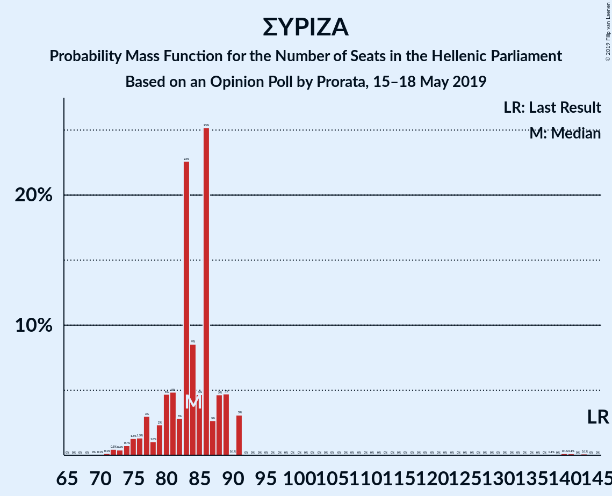

| Number of Seats | Probability | Accumulated | Special Marks |
|:---------------:|:-----------:|:-----------:|:-------------:|
| 69 | 0% | 100% |  |
| 70 | 0.1% | 99.9% |  |
| 71 | 0.1% | 99.9% |  |
| 72 | 0.5% | 99.8% |  |
| 73 | 0.4% | 99.3% |  |
| 74 | 0.7% | 98.9% |  |
| 75 | 1.3% | 98% |  |
| 76 | 1.3% | 97% |  |
| 77 | 3% | 96% |  |
| 78 | 1.0% | 93% |  |
| 79 | 2% | 91% |  |
| 80 | 5% | 89% |  |
| 81 | 5% | 84% |  |
| 82 | 3% | 80% |  |
| 83 | 23% | 77% |  |
| 84 | 9% | 54% | Median |
| 85 | 5% | 46% |  |
| 86 | 25% | 41% |  |
| 87 | 3% | 16% |  |
| 88 | 5% | 13% |  |
| 89 | 5% | 8% |  |
| 90 | 0.1% | 4% |  |
| 91 | 3% | 4% |  |
| 92 | 0% | 0.6% |  |
| 93 | 0% | 0.6% |  |
| 94 | 0% | 0.5% |  |
| 95 | 0% | 0.5% |  |
| 96 | 0% | 0.5% |  |
| 97 | 0% | 0.5% |  |
| 98 | 0% | 0.5% |  |
| 99 | 0% | 0.5% |  |
| 100 | 0% | 0.5% |  |
| 101 | 0% | 0.5% |  |
| 102 | 0% | 0.5% |  |
| 103 | 0% | 0.5% |  |
| 104 | 0% | 0.5% |  |
| 105 | 0% | 0.5% |  |
| 106 | 0% | 0.5% |  |
| 107 | 0% | 0.5% |  |
| 108 | 0% | 0.5% |  |
| 109 | 0% | 0.5% |  |
| 110 | 0% | 0.5% |  |
| 111 | 0% | 0.5% |  |
| 112 | 0% | 0.5% |  |
| 113 | 0% | 0.5% |  |
| 114 | 0% | 0.5% |  |
| 115 | 0% | 0.5% |  |
| 116 | 0% | 0.5% |  |
| 117 | 0% | 0.5% |  |
| 118 | 0% | 0.5% |  |
| 119 | 0% | 0.5% |  |
| 120 | 0% | 0.5% |  |
| 121 | 0% | 0.5% |  |
| 122 | 0% | 0.5% |  |
| 123 | 0% | 0.5% |  |
| 124 | 0% | 0.5% |  |
| 125 | 0% | 0.5% |  |
| 126 | 0% | 0.5% |  |
| 127 | 0% | 0.5% |  |
| 128 | 0% | 0.5% |  |
| 129 | 0% | 0.5% |  |
| 130 | 0% | 0.5% |  |
| 131 | 0% | 0.5% |  |
| 132 | 0% | 0.5% |  |
| 133 | 0% | 0.5% |  |
| 134 | 0% | 0.5% |  |
| 135 | 0% | 0.5% |  |
| 136 | 0% | 0.5% |  |
| 137 | 0% | 0.5% |  |
| 138 | 0.1% | 0.5% |  |
| 139 | 0% | 0.4% |  |
| 140 | 0.1% | 0.4% |  |
| 141 | 0.1% | 0.3% |  |
| 142 | 0% | 0.2% |  |
| 143 | 0.1% | 0.2% |  |
| 144 | 0% | 0% |  |
| 145 | 0% | 0% | Last Result |

## Technical Information

### Opinion Poll

+ **Polling firm:** Prorata
+ **Commissioner(s):** —
+ **Fieldwork period:** 15–18 May 2019

### Calculations

+ **Sample size:** 1000
+ **Simulations done:** 1,048,576
+ **Error estimate:** 1.95%

