# Opinion Poll by Alco, 15–19 May 2019

<a href="#voting-intentions">Voting Intentions</a> | <a href="#seats">Seats</a> | <a href="#coalitions">Coalitions</a> | <a href="#technical-information">Technical Information</a>

## Voting Intentions

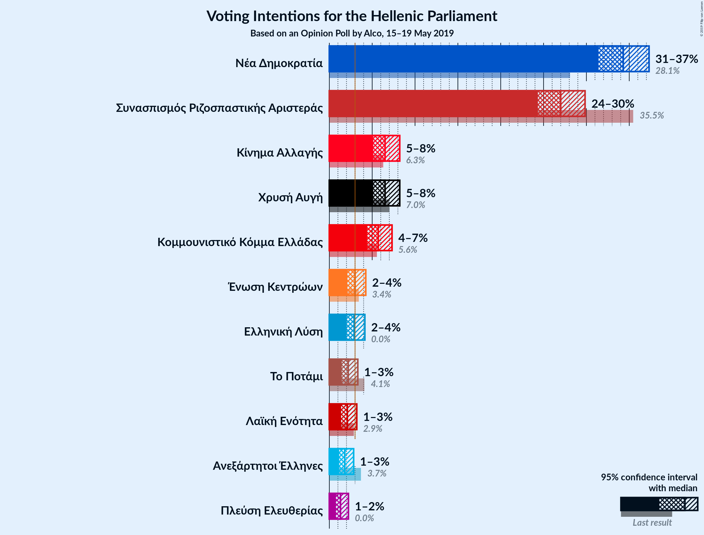

### Confidence Intervals

| Party | Last Result | Poll Result | 80% Confidence Interval | 90% Confidence Interval | 95% Confidence Interval | 99% Confidence Interval |
|:-----:|:-----------:|:-----------:|:-----------------------:|:-----------------------:|:-----------------------:|:-----------------------:|
| Νέα Δημοκρατία | 28.1% | 34.3% | 32.4–36.3% |31.9–36.8% |31.4–37.3% |30.5–38.3% |
| Συνασπισμός Ριζοσπαστικής Αριστεράς | 35.5% | 27.0% | 25.3–28.9% |24.8–29.4% |24.3–29.8% |23.5–30.7% |
| Χρυσή Αυγή | 7.0% | 6.5% | 5.6–7.6% |5.3–7.9% |5.1–8.2% |4.7–8.8% |
| Κίνημα Αλλαγής | 6.3% | 6.5% | 5.6–7.6% |5.3–7.9% |5.1–8.2% |4.7–8.8% |
| Κομμουνιστικό Κόμμα Ελλάδας | 5.6% | 5.7% | 4.9–6.8% |4.6–7.1% |4.4–7.3% |4.1–7.9% |
| Ένωση Κεντρώων | 3.4% | 3.0% | 2.4–3.8% |2.2–4.1% |2.1–4.3% |1.9–4.7% |
| Ελληνική Λύση | 0.0% | 2.9% | 2.3–3.7% |2.2–3.9% |2.0–4.1% |1.8–4.6% |
| Το Ποτάμι | 4.1% | 2.2% | 1.7–2.9% |1.6–3.1% |1.4–3.3% |1.2–3.7% |
| Λαϊκή Ενότητα | 2.9% | 2.1% | 1.6–2.8% |1.5–3.0% |1.4–3.2% |1.2–3.6% |
| Ανεξάρτητοι Έλληνες | 3.7% | 1.8% | 1.4–2.5% |1.2–2.7% |1.1–2.8% |1.0–3.2% |
| Πλεύση Ελευθερίας | 0.0% | 1.3% | 0.9–1.9% |0.8–2.1% |0.8–2.2% |0.6–2.5% |

*Note:* The poll result column reflects the actual value used in the calculations. Published results may vary slightly, and in addition be rounded to fewer digits.

## Seats

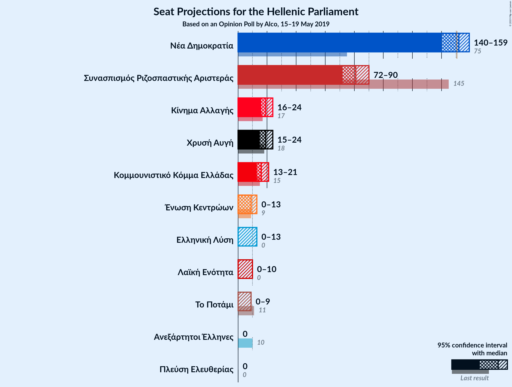

### Confidence Intervals

| Party | Last Result | Median | 80% Confidence Interval | 90% Confidence Interval | 95% Confidence Interval | 99% Confidence Interval |
|:-----:|:-----------:|:------:|:-----------------------:|:-----------------------:|:-----------------------:|:-----------------------:|
| <a href="#νέα-δημοκρατία">Νέα Δημοκρατία</a> | 75 | 152 | 143–158 |141–158 |140–159 |136–162 |
| <a href="#συνασπισμός-ριζοσπαστικής-αριστεράς">Συνασπισμός Ριζοσπαστικής Αριστεράς</a> | 145 | 81 | 74–87 |73–89 |72–90 |68–96 |
| <a href="#χρυσή-αυγή">Χρυσή Αυγή</a> | 18 | 19 | 16–22 |16–23 |15–24 |14–25 |
| <a href="#κίνημα-αλλαγής">Κίνημα Αλλαγής</a> | 17 | 19 | 16–23 |16–24 |16–24 |14–26 |
| <a href="#κομμουνιστικό-κόμμα-ελλάδας">Κομμουνιστικό Κόμμα Ελλάδας</a> | 15 | 16 | 13–20 |13–21 |13–21 |12–23 |
| <a href="#ένωση-κεντρώων">Ένωση Κεντρώων</a> | 9 | 9 | 0–12 |0–12 |0–13 |0–14 |
| <a href="#ελληνική-λύση">Ελληνική Λύση</a> | 0 | 0 | 0–11 |0–11 |0–13 |0–14 |
| <a href="#το-ποτάμι">Το Ποτάμι</a> | 11 | 0 | 0 |0–9 |0–9 |0–12 |
| <a href="#λαϊκή-ενότητα">Λαϊκή Ενότητα</a> | 0 | 0 | 0–9 |0–9 |0–10 |0–11 |
| <a href="#ανεξάρτητοι-έλληνες">Ανεξάρτητοι Έλληνες</a> | 10 | 0 | 0 |0 |0 |0–9 |
| <a href="#πλεύση-ελευθερίας">Πλεύση Ελευθερίας</a> | 0 | 0 | 0 |0 |0 |0 |

### Νέα Δημοκρατία

*For a full overview of the results for this party, see the [Νέα Δημοκρατία](party-νέαδημοκρατία.html) page.*

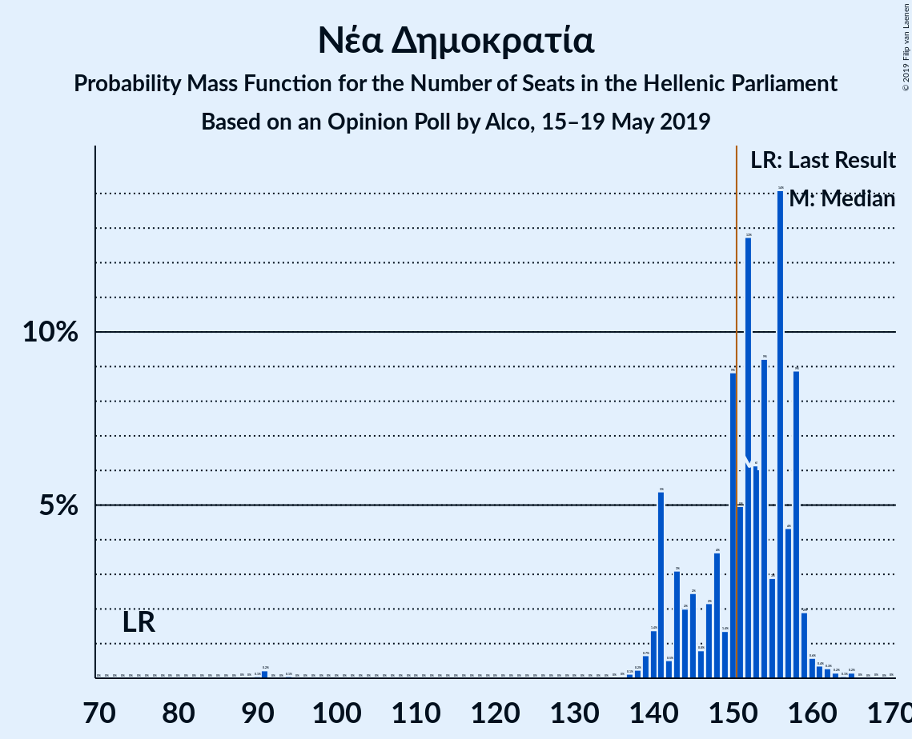

| Number of Seats | Probability | Accumulated | Special Marks |
|:---------------:|:-----------:|:-----------:|:-------------:|
| 75 | 0% | 100% | Last Result |
| 76 | 0% | 100% |  |
| 77 | 0% | 100% |  |
| 78 | 0% | 100% |  |
| 79 | 0% | 100% |  |
| 80 | 0% | 100% |  |
| 81 | 0% | 100% |  |
| 82 | 0% | 100% |  |
| 83 | 0% | 100% |  |
| 84 | 0% | 100% |  |
| 85 | 0% | 100% |  |
| 86 | 0% | 100% |  |
| 87 | 0% | 100% |  |
| 88 | 0% | 100% |  |
| 89 | 0% | 99.9% |  |
| 90 | 0.1% | 99.9% |  |
| 91 | 0.2% | 99.9% |  |
| 92 | 0% | 99.6% |  |
| 93 | 0% | 99.6% |  |
| 94 | 0.1% | 99.6% |  |
| 95 | 0% | 99.6% |  |
| 96 | 0% | 99.6% |  |
| 97 | 0% | 99.6% |  |
| 98 | 0% | 99.6% |  |
| 99 | 0% | 99.6% |  |
| 100 | 0% | 99.6% |  |
| 101 | 0% | 99.6% |  |
| 102 | 0% | 99.6% |  |
| 103 | 0% | 99.6% |  |
| 104 | 0% | 99.6% |  |
| 105 | 0% | 99.6% |  |
| 106 | 0% | 99.6% |  |
| 107 | 0% | 99.6% |  |
| 108 | 0% | 99.6% |  |
| 109 | 0% | 99.6% |  |
| 110 | 0% | 99.6% |  |
| 111 | 0% | 99.6% |  |
| 112 | 0% | 99.6% |  |
| 113 | 0% | 99.6% |  |
| 114 | 0% | 99.6% |  |
| 115 | 0% | 99.6% |  |
| 116 | 0% | 99.6% |  |
| 117 | 0% | 99.6% |  |
| 118 | 0% | 99.6% |  |
| 119 | 0% | 99.6% |  |
| 120 | 0% | 99.6% |  |
| 121 | 0% | 99.6% |  |
| 122 | 0% | 99.6% |  |
| 123 | 0% | 99.6% |  |
| 124 | 0% | 99.6% |  |
| 125 | 0% | 99.6% |  |
| 126 | 0% | 99.6% |  |
| 127 | 0% | 99.6% |  |
| 128 | 0% | 99.6% |  |
| 129 | 0% | 99.6% |  |
| 130 | 0% | 99.6% |  |
| 131 | 0% | 99.6% |  |
| 132 | 0% | 99.6% |  |
| 133 | 0% | 99.6% |  |
| 134 | 0% | 99.6% |  |
| 135 | 0% | 99.6% |  |
| 136 | 0% | 99.5% |  |
| 137 | 0.1% | 99.5% |  |
| 138 | 0.2% | 99.4% |  |
| 139 | 0.7% | 99.1% |  |
| 140 | 1.4% | 98% |  |
| 141 | 5% | 97% |  |
| 142 | 0.5% | 92% |  |
| 143 | 3% | 91% |  |
| 144 | 2% | 88% |  |
| 145 | 2% | 86% |  |
| 146 | 0.8% | 84% |  |
| 147 | 2% | 83% |  |
| 148 | 4% | 81% |  |
| 149 | 1.4% | 77% |  |
| 150 | 9% | 76% |  |
| 151 | 5% | 67% | Majority |
| 152 | 13% | 62% | Median |
| 153 | 6% | 49% |  |
| 154 | 9% | 43% |  |
| 155 | 3% | 34% |  |
| 156 | 14% | 31% |  |
| 157 | 4% | 17% |  |
| 158 | 9% | 12% |  |
| 159 | 2% | 4% |  |
| 160 | 0.6% | 2% |  |
| 161 | 0.4% | 1.1% |  |
| 162 | 0.3% | 0.7% |  |
| 163 | 0.2% | 0.5% |  |
| 164 | 0.1% | 0.3% |  |
| 165 | 0.2% | 0.3% |  |
| 166 | 0% | 0.1% |  |
| 167 | 0% | 0.1% |  |
| 168 | 0% | 0.1% |  |
| 169 | 0% | 0% |  |

### Συνασπισμός Ριζοσπαστικής Αριστεράς

*For a full overview of the results for this party, see the [Συνασπισμός Ριζοσπαστικής Αριστεράς](party-συνασπισμόςριζοσπαστικήςαριστεράς.html) page.*

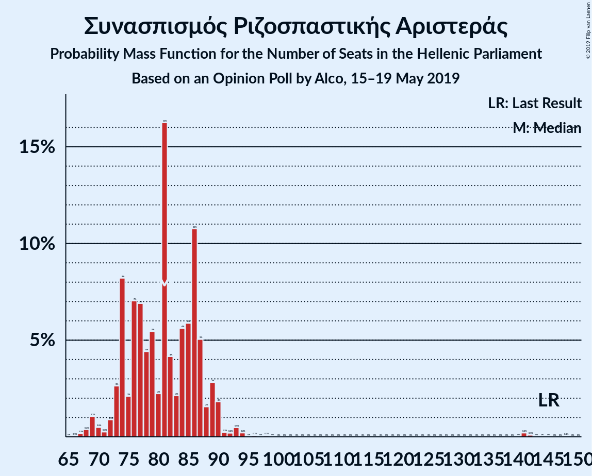

| Number of Seats | Probability | Accumulated | Special Marks |
|:---------------:|:-----------:|:-----------:|:-------------:|
| 66 | 0.1% | 100% |  |
| 67 | 0.2% | 99.9% |  |
| 68 | 0.4% | 99.7% |  |
| 69 | 1.1% | 99.4% |  |
| 70 | 0.5% | 98% |  |
| 71 | 0.3% | 98% |  |
| 72 | 0.9% | 98% |  |
| 73 | 3% | 97% |  |
| 74 | 8% | 94% |  |
| 75 | 2% | 86% |  |
| 76 | 7% | 84% |  |
| 77 | 7% | 77% |  |
| 78 | 4% | 70% |  |
| 79 | 5% | 65% |  |
| 80 | 2% | 60% |  |
| 81 | 16% | 58% | Median |
| 82 | 4% | 41% |  |
| 83 | 2% | 37% |  |
| 84 | 6% | 35% |  |
| 85 | 6% | 30% |  |
| 86 | 11% | 24% |  |
| 87 | 5% | 13% |  |
| 88 | 2% | 8% |  |
| 89 | 3% | 6% |  |
| 90 | 2% | 4% |  |
| 91 | 0.2% | 2% |  |
| 92 | 0.2% | 1.4% |  |
| 93 | 0.5% | 1.3% |  |
| 94 | 0.2% | 0.8% |  |
| 95 | 0% | 0.6% |  |
| 96 | 0.1% | 0.6% |  |
| 97 | 0% | 0.5% |  |
| 98 | 0.1% | 0.5% |  |
| 99 | 0% | 0.4% |  |
| 100 | 0% | 0.4% |  |
| 101 | 0% | 0.4% |  |
| 102 | 0% | 0.4% |  |
| 103 | 0% | 0.4% |  |
| 104 | 0% | 0.4% |  |
| 105 | 0% | 0.4% |  |
| 106 | 0% | 0.4% |  |
| 107 | 0% | 0.4% |  |
| 108 | 0% | 0.4% |  |
| 109 | 0% | 0.4% |  |
| 110 | 0% | 0.4% |  |
| 111 | 0% | 0.4% |  |
| 112 | 0% | 0.4% |  |
| 113 | 0% | 0.4% |  |
| 114 | 0% | 0.4% |  |
| 115 | 0% | 0.4% |  |
| 116 | 0% | 0.4% |  |
| 117 | 0% | 0.4% |  |
| 118 | 0% | 0.4% |  |
| 119 | 0% | 0.4% |  |
| 120 | 0% | 0.4% |  |
| 121 | 0% | 0.4% |  |
| 122 | 0% | 0.4% |  |
| 123 | 0% | 0.4% |  |
| 124 | 0% | 0.4% |  |
| 125 | 0% | 0.4% |  |
| 126 | 0% | 0.4% |  |
| 127 | 0% | 0.4% |  |
| 128 | 0% | 0.4% |  |
| 129 | 0% | 0.4% |  |
| 130 | 0% | 0.4% |  |
| 131 | 0% | 0.4% |  |
| 132 | 0% | 0.4% |  |
| 133 | 0% | 0.4% |  |
| 134 | 0% | 0.4% |  |
| 135 | 0% | 0.4% |  |
| 136 | 0% | 0.4% |  |
| 137 | 0% | 0.4% |  |
| 138 | 0% | 0.4% |  |
| 139 | 0% | 0.4% |  |
| 140 | 0% | 0.4% |  |
| 141 | 0.2% | 0.4% |  |
| 142 | 0.1% | 0.2% |  |
| 143 | 0% | 0.1% |  |
| 144 | 0% | 0.1% |  |
| 145 | 0% | 0.1% | Last Result |
| 146 | 0% | 0.1% |  |
| 147 | 0% | 0.1% |  |
| 148 | 0.1% | 0.1% |  |
| 149 | 0% | 0% |  |

### Χρυσή Αυγή

*For a full overview of the results for this party, see the [Χρυσή Αυγή](party-χρυσήαυγή.html) page.*

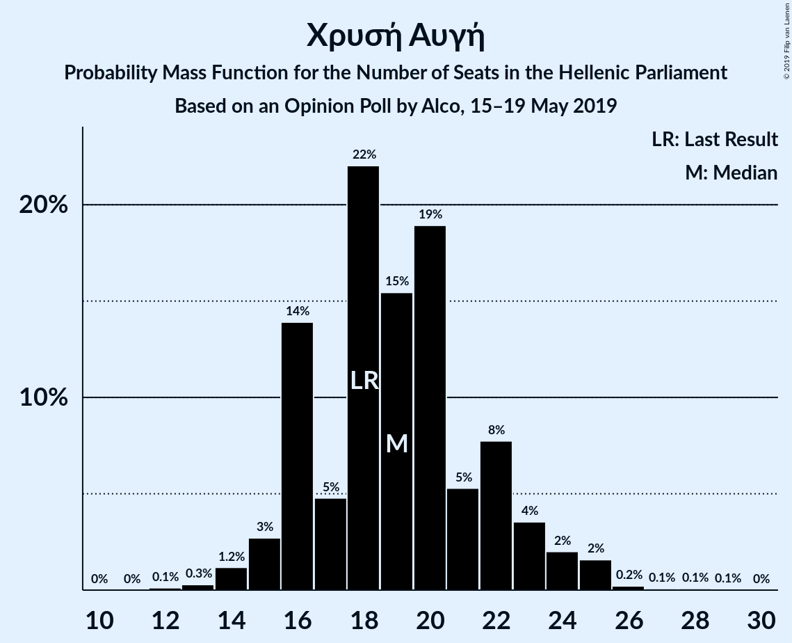

| Number of Seats | Probability | Accumulated | Special Marks |
|:---------------:|:-----------:|:-----------:|:-------------:|
| 12 | 0.1% | 100% |  |
| 13 | 0.3% | 99.9% |  |
| 14 | 1.2% | 99.6% |  |
| 15 | 3% | 98% |  |
| 16 | 14% | 96% |  |
| 17 | 5% | 82% |  |
| 18 | 22% | 77% | Last Result |
| 19 | 15% | 55% | Median |
| 20 | 19% | 40% |  |
| 21 | 5% | 21% |  |
| 22 | 8% | 15% |  |
| 23 | 4% | 8% |  |
| 24 | 2% | 4% |  |
| 25 | 2% | 2% |  |
| 26 | 0.2% | 0.4% |  |
| 27 | 0.1% | 0.2% |  |
| 28 | 0.1% | 0.1% |  |
| 29 | 0.1% | 0.1% |  |
| 30 | 0% | 0% |  |

### Κίνημα Αλλαγής

*For a full overview of the results for this party, see the [Κίνημα Αλλαγής](party-κίνημααλλαγής.html) page.*

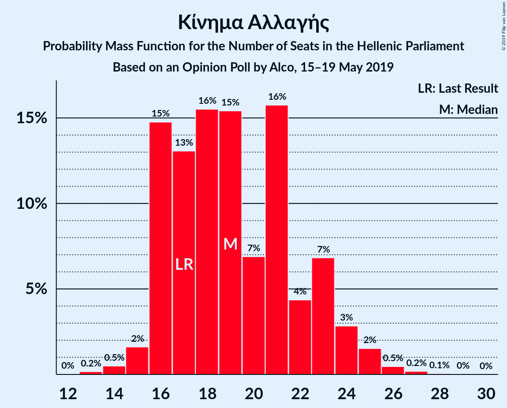

| Number of Seats | Probability | Accumulated | Special Marks |
|:---------------:|:-----------:|:-----------:|:-------------:|
| 13 | 0.2% | 100% |  |
| 14 | 0.5% | 99.8% |  |
| 15 | 2% | 99.3% |  |
| 16 | 15% | 98% |  |
| 17 | 13% | 83% | Last Result |
| 18 | 16% | 70% |  |
| 19 | 15% | 54% | Median |
| 20 | 7% | 39% |  |
| 21 | 16% | 32% |  |
| 22 | 4% | 16% |  |
| 23 | 7% | 12% |  |
| 24 | 3% | 5% |  |
| 25 | 2% | 2% |  |
| 26 | 0.5% | 0.7% |  |
| 27 | 0.2% | 0.3% |  |
| 28 | 0.1% | 0.1% |  |
| 29 | 0% | 0% |  |

### Κομμουνιστικό Κόμμα Ελλάδας

*For a full overview of the results for this party, see the [Κομμουνιστικό Κόμμα Ελλάδας](party-κομμουνιστικόκόμμαελλάδας.html) page.*

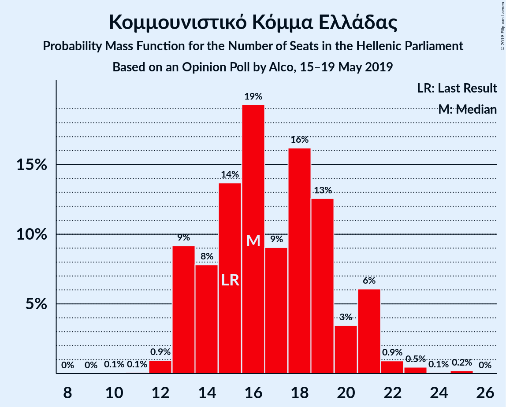

| Number of Seats | Probability | Accumulated | Special Marks |
|:---------------:|:-----------:|:-----------:|:-------------:|
| 10 | 0.1% | 100% |  |
| 11 | 0.1% | 99.9% |  |
| 12 | 0.9% | 99.9% |  |
| 13 | 9% | 98.9% |  |
| 14 | 8% | 90% |  |
| 15 | 14% | 82% | Last Result |
| 16 | 19% | 68% | Median |
| 17 | 9% | 49% |  |
| 18 | 16% | 40% |  |
| 19 | 13% | 24% |  |
| 20 | 3% | 11% |  |
| 21 | 6% | 8% |  |
| 22 | 0.9% | 2% |  |
| 23 | 0.5% | 0.8% |  |
| 24 | 0.1% | 0.3% |  |
| 25 | 0.2% | 0.2% |  |
| 26 | 0% | 0% |  |

### Ένωση Κεντρώων

*For a full overview of the results for this party, see the [Ένωση Κεντρώων](party-ένωσηκεντρώων.html) page.*

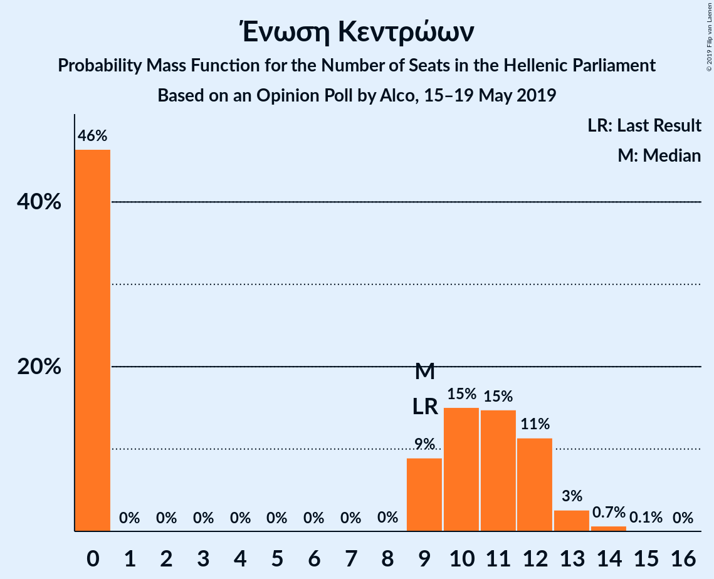

| Number of Seats | Probability | Accumulated | Special Marks |
|:---------------:|:-----------:|:-----------:|:-------------:|
| 0 | 46% | 100% |  |
| 1 | 0% | 54% |  |
| 2 | 0% | 54% |  |
| 3 | 0% | 54% |  |
| 4 | 0% | 54% |  |
| 5 | 0% | 54% |  |
| 6 | 0% | 54% |  |
| 7 | 0% | 54% |  |
| 8 | 0% | 54% |  |
| 9 | 9% | 54% | Last Result, Median |
| 10 | 15% | 45% |  |
| 11 | 15% | 30% |  |
| 12 | 11% | 15% |  |
| 13 | 3% | 3% |  |
| 14 | 0.7% | 0.8% |  |
| 15 | 0.1% | 0.1% |  |
| 16 | 0% | 0% |  |

### Ελληνική Λύση

*For a full overview of the results for this party, see the [Ελληνική Λύση](party-ελληνικήλύση.html) page.*

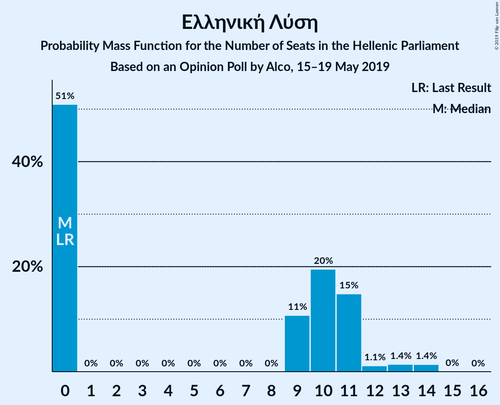

| Number of Seats | Probability | Accumulated | Special Marks |
|:---------------:|:-----------:|:-----------:|:-------------:|
| 0 | 51% | 100% | Last Result, Median |
| 1 | 0% | 49% |  |
| 2 | 0% | 49% |  |
| 3 | 0% | 49% |  |
| 4 | 0% | 49% |  |
| 5 | 0% | 49% |  |
| 6 | 0% | 49% |  |
| 7 | 0% | 49% |  |
| 8 | 0% | 49% |  |
| 9 | 11% | 49% |  |
| 10 | 20% | 38% |  |
| 11 | 15% | 19% |  |
| 12 | 1.1% | 4% |  |
| 13 | 1.4% | 3% |  |
| 14 | 1.4% | 1.4% |  |
| 15 | 0% | 0.1% |  |
| 16 | 0% | 0% |  |

### Το Ποτάμι

*For a full overview of the results for this party, see the [Το Ποτάμι](party-τοποτάμι.html) page.*

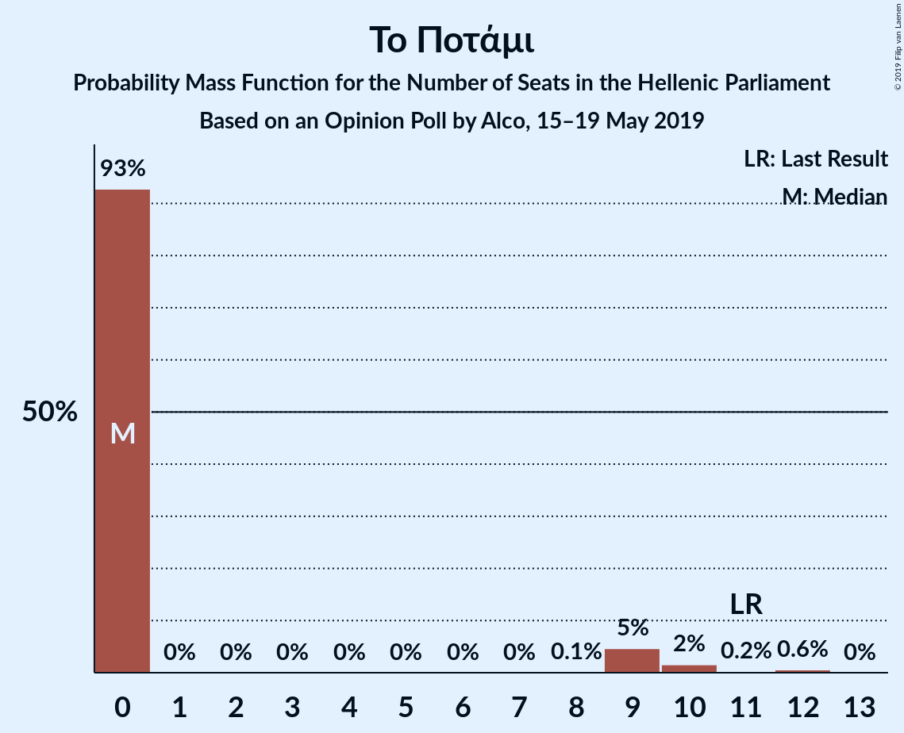

| Number of Seats | Probability | Accumulated | Special Marks |
|:---------------:|:-----------:|:-----------:|:-------------:|
| 0 | 93% | 100% | Median |
| 1 | 0% | 7% |  |
| 2 | 0% | 7% |  |
| 3 | 0% | 7% |  |
| 4 | 0% | 7% |  |
| 5 | 0% | 7% |  |
| 6 | 0% | 7% |  |
| 7 | 0% | 7% |  |
| 8 | 0.1% | 7% |  |
| 9 | 5% | 7% |  |
| 10 | 2% | 2% |  |
| 11 | 0.2% | 0.9% | Last Result |
| 12 | 0.6% | 0.7% |  |
| 13 | 0% | 0% |  |

### Λαϊκή Ενότητα

*For a full overview of the results for this party, see the [Λαϊκή Ενότητα](party-λαϊκήενότητα.html) page.*

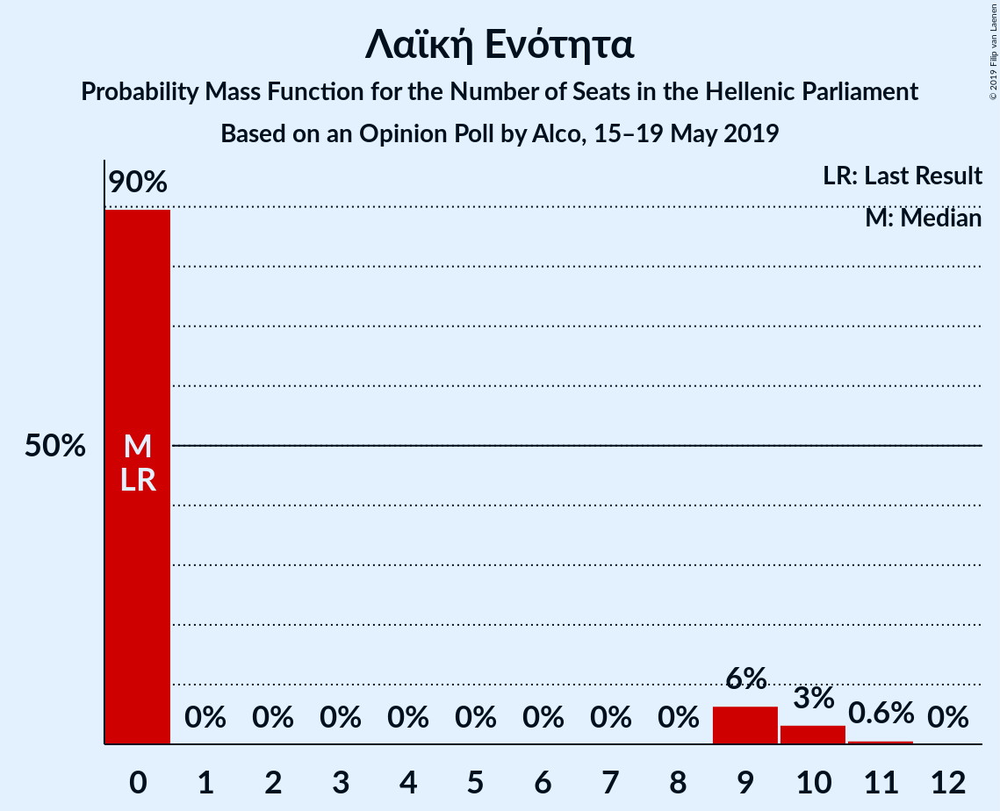

| Number of Seats | Probability | Accumulated | Special Marks |
|:---------------:|:-----------:|:-----------:|:-------------:|
| 0 | 90% | 100% | Last Result, Median |
| 1 | 0% | 10% |  |
| 2 | 0% | 10% |  |
| 3 | 0% | 10% |  |
| 4 | 0% | 10% |  |
| 5 | 0% | 10% |  |
| 6 | 0% | 10% |  |
| 7 | 0% | 10% |  |
| 8 | 0% | 10% |  |
| 9 | 6% | 10% |  |
| 10 | 3% | 4% |  |
| 11 | 0.6% | 0.6% |  |
| 12 | 0% | 0% |  |

### Ανεξάρτητοι Έλληνες

*For a full overview of the results for this party, see the [Ανεξάρτητοι Έλληνες](party-ανεξάρτητοιέλληνες.html) page.*

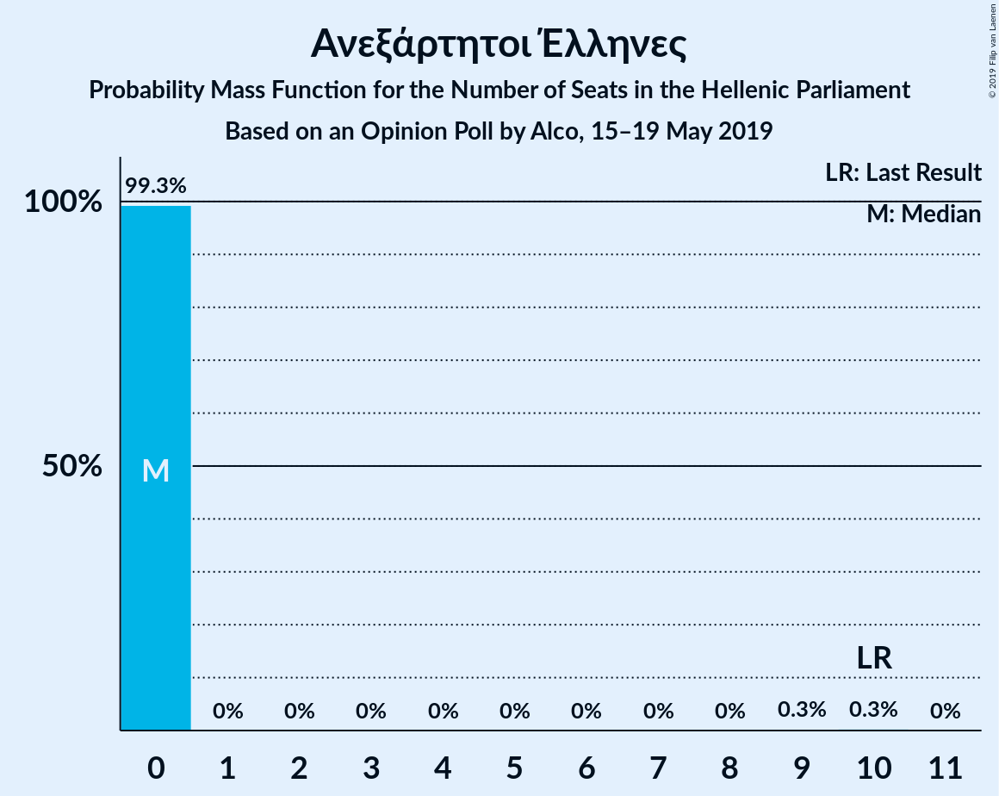

| Number of Seats | Probability | Accumulated | Special Marks |
|:---------------:|:-----------:|:-----------:|:-------------:|
| 0 | 99.3% | 100% | Median |
| 1 | 0% | 0.7% |  |
| 2 | 0% | 0.7% |  |
| 3 | 0% | 0.7% |  |
| 4 | 0% | 0.7% |  |
| 5 | 0% | 0.7% |  |
| 6 | 0% | 0.7% |  |
| 7 | 0% | 0.7% |  |
| 8 | 0% | 0.7% |  |
| 9 | 0.3% | 0.7% |  |
| 10 | 0.3% | 0.4% | Last Result |
| 11 | 0% | 0% |  |

### Πλεύση Ελευθερίας

*For a full overview of the results for this party, see the [Πλεύση Ελευθερίας](party-πλεύσηελευθερίας.html) page.*

| Number of Seats | Probability | Accumulated | Special Marks |
|:---------------:|:-----------:|:-----------:|:-------------:|
| 0 | 99.8% | 100% | Last Result, Median |
| 1 | 0% | 0.2% |  |
| 2 | 0% | 0.2% |  |
| 3 | 0% | 0.2% |  |
| 4 | 0% | 0.2% |  |
| 5 | 0% | 0.2% |  |
| 6 | 0% | 0.2% |  |
| 7 | 0% | 0.2% |  |
| 8 | 0% | 0.2% |  |
| 9 | 0.2% | 0.2% |  |
| 10 | 0% | 0% |  |

## Coalitions

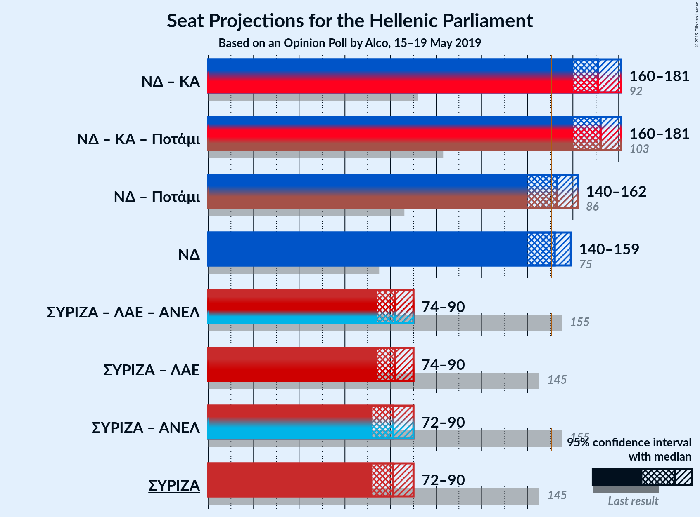

### Confidence Intervals

| Coalition | Last Result | Median | Majority? | 80% Confidence Interval | 90% Confidence Interval | 95% Confidence Interval | 99% Confidence Interval |
|:---------:|:-----------:|:------:|:---------:|:-----------------------:|:-----------------------:|:-----------------------:|:-----------------------:|
| Νέα Δημοκρατία – Κίνημα Αλλαγής | 92 | 171 | 99.6% | 163–178 | 160–180 | 160–181 | 154–183 |
| Νέα Δημοκρατία – Κίνημα Αλλαγής – Το Ποτάμι | 103 | 172 | 99.6% | 164–179 | 160–181 | 160–181 | 154–188 |
| Νέα Δημοκρατία – Το Ποτάμι | 86 | 153 | 71% | 143–158 | 141–160 | 140–162 | 137–166 |
| Νέα Δημοκρατία | 75 | 152 | 67% | 143–158 | 141–158 | 140–159 | 136–162 |
| Συνασπισμός Ριζοσπαστικής Αριστεράς – Λαϊκή Ενότητα – Ανεξάρτητοι Έλληνες | 155 | 82 | 0% | 76–87 | 74–89 | 74–90 | 68–97 |
| Συνασπισμός Ριζοσπαστικής Αριστεράς – Λαϊκή Ενότητα | 145 | 82 | 0% | 76–87 | 74–89 | 74–90 | 68–96 |
| Συνασπισμός Ριζοσπαστικής Αριστεράς – Ανεξάρτητοι Έλληνες | 155 | 81 | 0% | 74–87 | 73–89 | 72–90 | 68–96 |
| Συνασπισμός Ριζοσπαστικής Αριστεράς | 145 | 81 | 0% | 74–87 | 73–89 | 72–90 | 68–96 |

### Νέα Δημοκρατία – Κίνημα Αλλαγής

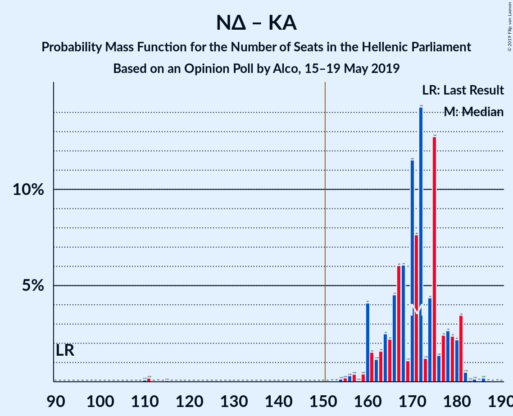

| Number of Seats | Probability | Accumulated | Special Marks |
|:---------------:|:-----------:|:-----------:|:-------------:|
| 92 | 0% | 100% | Last Result |
| 93 | 0% | 100% |  |
| 94 | 0% | 100% |  |
| 95 | 0% | 100% |  |
| 96 | 0% | 100% |  |
| 97 | 0% | 100% |  |
| 98 | 0% | 100% |  |
| 99 | 0% | 100% |  |
| 100 | 0% | 100% |  |
| 101 | 0% | 100% |  |
| 102 | 0% | 100% |  |
| 103 | 0% | 100% |  |
| 104 | 0% | 100% |  |
| 105 | 0% | 100% |  |
| 106 | 0% | 100% |  |
| 107 | 0% | 100% |  |
| 108 | 0% | 100% |  |
| 109 | 0% | 100% |  |
| 110 | 0.1% | 99.9% |  |
| 111 | 0.2% | 99.9% |  |
| 112 | 0% | 99.7% |  |
| 113 | 0% | 99.7% |  |
| 114 | 0% | 99.6% |  |
| 115 | 0.1% | 99.6% |  |
| 116 | 0% | 99.6% |  |
| 117 | 0% | 99.6% |  |
| 118 | 0% | 99.6% |  |
| 119 | 0% | 99.6% |  |
| 120 | 0% | 99.6% |  |
| 121 | 0% | 99.6% |  |
| 122 | 0% | 99.6% |  |
| 123 | 0% | 99.6% |  |
| 124 | 0% | 99.6% |  |
| 125 | 0% | 99.6% |  |
| 126 | 0% | 99.6% |  |
| 127 | 0% | 99.6% |  |
| 128 | 0% | 99.6% |  |
| 129 | 0% | 99.6% |  |
| 130 | 0% | 99.6% |  |
| 131 | 0% | 99.6% |  |
| 132 | 0% | 99.6% |  |
| 133 | 0% | 99.6% |  |
| 134 | 0% | 99.6% |  |
| 135 | 0% | 99.6% |  |
| 136 | 0% | 99.6% |  |
| 137 | 0% | 99.6% |  |
| 138 | 0% | 99.6% |  |
| 139 | 0% | 99.6% |  |
| 140 | 0% | 99.6% |  |
| 141 | 0% | 99.6% |  |
| 142 | 0% | 99.6% |  |
| 143 | 0% | 99.6% |  |
| 144 | 0% | 99.6% |  |
| 145 | 0% | 99.6% |  |
| 146 | 0% | 99.6% |  |
| 147 | 0% | 99.6% |  |
| 148 | 0% | 99.6% |  |
| 149 | 0% | 99.6% |  |
| 150 | 0% | 99.6% |  |
| 151 | 0% | 99.6% | Majority |
| 152 | 0% | 99.6% |  |
| 153 | 0% | 99.5% |  |
| 154 | 0.1% | 99.5% |  |
| 155 | 0.2% | 99.4% |  |
| 156 | 0.3% | 99.2% |  |
| 157 | 0.4% | 98.9% |  |
| 158 | 0.1% | 98% |  |
| 159 | 0.4% | 98% |  |
| 160 | 4% | 98% |  |
| 161 | 2% | 94% |  |
| 162 | 1.2% | 92% |  |
| 163 | 2% | 91% |  |
| 164 | 2% | 90% |  |
| 165 | 2% | 87% |  |
| 166 | 5% | 85% |  |
| 167 | 6% | 80% |  |
| 168 | 6% | 74% |  |
| 169 | 1.1% | 68% |  |
| 170 | 12% | 67% |  |
| 171 | 8% | 56% | Median |
| 172 | 14% | 48% |  |
| 173 | 1.2% | 34% |  |
| 174 | 4% | 33% |  |
| 175 | 13% | 28% |  |
| 176 | 1.4% | 15% |  |
| 177 | 2% | 14% |  |
| 178 | 3% | 12% |  |
| 179 | 2% | 9% |  |
| 180 | 2% | 7% |  |
| 181 | 3% | 4% |  |
| 182 | 0.5% | 1.0% |  |
| 183 | 0.1% | 0.5% |  |
| 184 | 0.1% | 0.5% |  |
| 185 | 0% | 0.3% |  |
| 186 | 0.2% | 0.3% |  |
| 187 | 0% | 0.1% |  |
| 188 | 0% | 0.1% |  |
| 189 | 0% | 0.1% |  |
| 190 | 0% | 0% |  |

### Νέα Δημοκρατία – Κίνημα Αλλαγής – Το Ποτάμι

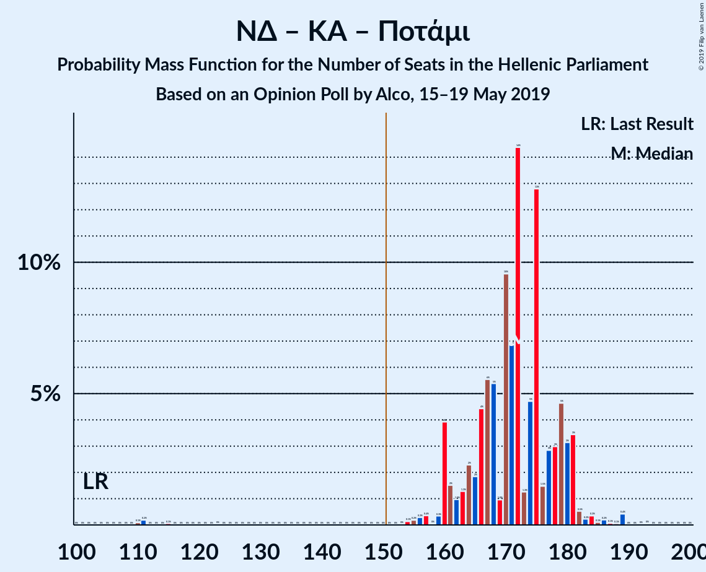

| Number of Seats | Probability | Accumulated | Special Marks |
|:---------------:|:-----------:|:-----------:|:-------------:|
| 103 | 0% | 100% | Last Result |
| 104 | 0% | 100% |  |
| 105 | 0% | 100% |  |
| 106 | 0% | 100% |  |
| 107 | 0% | 100% |  |
| 108 | 0% | 100% |  |
| 109 | 0% | 100% |  |
| 110 | 0.1% | 99.9% |  |
| 111 | 0.2% | 99.9% |  |
| 112 | 0% | 99.7% |  |
| 113 | 0% | 99.7% |  |
| 114 | 0% | 99.7% |  |
| 115 | 0.1% | 99.7% |  |
| 116 | 0% | 99.6% |  |
| 117 | 0% | 99.6% |  |
| 118 | 0% | 99.6% |  |
| 119 | 0% | 99.6% |  |
| 120 | 0% | 99.6% |  |
| 121 | 0% | 99.6% |  |
| 122 | 0% | 99.6% |  |
| 123 | 0% | 99.6% |  |
| 124 | 0% | 99.6% |  |
| 125 | 0% | 99.6% |  |
| 126 | 0% | 99.6% |  |
| 127 | 0% | 99.6% |  |
| 128 | 0% | 99.6% |  |
| 129 | 0% | 99.6% |  |
| 130 | 0% | 99.6% |  |
| 131 | 0% | 99.6% |  |
| 132 | 0% | 99.6% |  |
| 133 | 0% | 99.6% |  |
| 134 | 0% | 99.6% |  |
| 135 | 0% | 99.6% |  |
| 136 | 0% | 99.6% |  |
| 137 | 0% | 99.6% |  |
| 138 | 0% | 99.6% |  |
| 139 | 0% | 99.6% |  |
| 140 | 0% | 99.6% |  |
| 141 | 0% | 99.6% |  |
| 142 | 0% | 99.6% |  |
| 143 | 0% | 99.6% |  |
| 144 | 0% | 99.6% |  |
| 145 | 0% | 99.6% |  |
| 146 | 0% | 99.6% |  |
| 147 | 0% | 99.6% |  |
| 148 | 0% | 99.6% |  |
| 149 | 0% | 99.6% |  |
| 150 | 0% | 99.6% |  |
| 151 | 0% | 99.6% | Majority |
| 152 | 0% | 99.6% |  |
| 153 | 0% | 99.6% |  |
| 154 | 0.1% | 99.6% |  |
| 155 | 0.2% | 99.4% |  |
| 156 | 0.3% | 99.2% |  |
| 157 | 0.4% | 99.0% |  |
| 158 | 0% | 98.6% |  |
| 159 | 0.3% | 98.6% |  |
| 160 | 4% | 98% |  |
| 161 | 2% | 94% |  |
| 162 | 1.0% | 93% |  |
| 163 | 1.3% | 92% |  |
| 164 | 2% | 91% |  |
| 165 | 2% | 88% |  |
| 166 | 4% | 86% |  |
| 167 | 6% | 82% |  |
| 168 | 5% | 76% |  |
| 169 | 1.0% | 71% |  |
| 170 | 10% | 70% |  |
| 171 | 7% | 61% | Median |
| 172 | 14% | 54% |  |
| 173 | 1.3% | 39% |  |
| 174 | 5% | 38% |  |
| 175 | 13% | 33% |  |
| 176 | 1.5% | 21% |  |
| 177 | 3% | 19% |  |
| 178 | 3% | 16% |  |
| 179 | 5% | 13% |  |
| 180 | 3% | 9% |  |
| 181 | 3% | 5% |  |
| 182 | 0.5% | 2% |  |
| 183 | 0.2% | 1.5% |  |
| 184 | 0.3% | 1.3% |  |
| 185 | 0.1% | 0.9% |  |
| 186 | 0.2% | 0.8% |  |
| 187 | 0.1% | 0.6% |  |
| 188 | 0.1% | 0.5% |  |
| 189 | 0.4% | 0.5% |  |
| 190 | 0% | 0.1% |  |
| 191 | 0% | 0.1% |  |
| 192 | 0% | 0.1% |  |
| 193 | 0% | 0% |  |

### Νέα Δημοκρατία – Το Ποτάμι

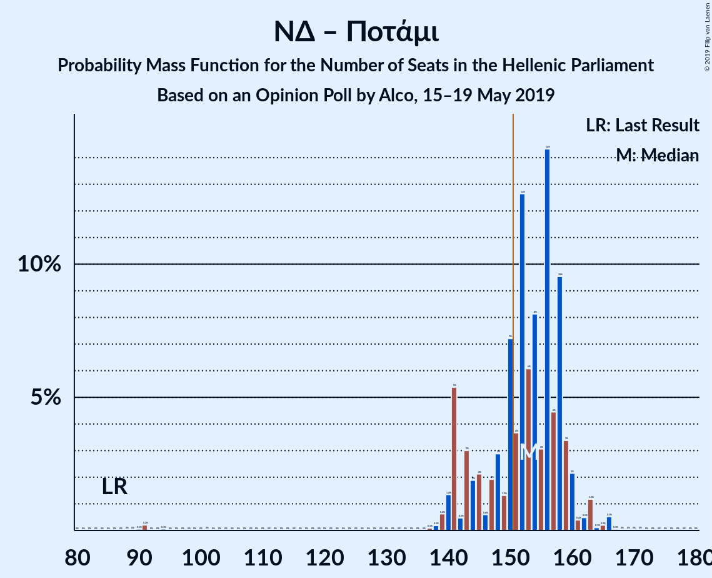

| Number of Seats | Probability | Accumulated | Special Marks |
|:---------------:|:-----------:|:-----------:|:-------------:|
| 86 | 0% | 100% | Last Result |
| 87 | 0% | 100% |  |
| 88 | 0% | 100% |  |
| 89 | 0% | 99.9% |  |
| 90 | 0.1% | 99.9% |  |
| 91 | 0.2% | 99.9% |  |
| 92 | 0% | 99.7% |  |
| 93 | 0% | 99.7% |  |
| 94 | 0.1% | 99.7% |  |
| 95 | 0% | 99.6% |  |
| 96 | 0% | 99.6% |  |
| 97 | 0% | 99.6% |  |
| 98 | 0% | 99.6% |  |
| 99 | 0% | 99.6% |  |
| 100 | 0% | 99.6% |  |
| 101 | 0% | 99.6% |  |
| 102 | 0% | 99.6% |  |
| 103 | 0% | 99.6% |  |
| 104 | 0% | 99.6% |  |
| 105 | 0% | 99.6% |  |
| 106 | 0% | 99.6% |  |
| 107 | 0% | 99.6% |  |
| 108 | 0% | 99.6% |  |
| 109 | 0% | 99.6% |  |
| 110 | 0% | 99.6% |  |
| 111 | 0% | 99.6% |  |
| 112 | 0% | 99.6% |  |
| 113 | 0% | 99.6% |  |
| 114 | 0% | 99.6% |  |
| 115 | 0% | 99.6% |  |
| 116 | 0% | 99.6% |  |
| 117 | 0% | 99.6% |  |
| 118 | 0% | 99.6% |  |
| 119 | 0% | 99.6% |  |
| 120 | 0% | 99.6% |  |
| 121 | 0% | 99.6% |  |
| 122 | 0% | 99.6% |  |
| 123 | 0% | 99.6% |  |
| 124 | 0% | 99.6% |  |
| 125 | 0% | 99.6% |  |
| 126 | 0% | 99.6% |  |
| 127 | 0% | 99.6% |  |
| 128 | 0% | 99.6% |  |
| 129 | 0% | 99.6% |  |
| 130 | 0% | 99.6% |  |
| 131 | 0% | 99.6% |  |
| 132 | 0% | 99.6% |  |
| 133 | 0% | 99.6% |  |
| 134 | 0% | 99.6% |  |
| 135 | 0% | 99.6% |  |
| 136 | 0% | 99.6% |  |
| 137 | 0.1% | 99.6% |  |
| 138 | 0.2% | 99.5% |  |
| 139 | 0.6% | 99.3% |  |
| 140 | 1.4% | 98.7% |  |
| 141 | 5% | 97% |  |
| 142 | 0.5% | 92% |  |
| 143 | 3% | 91% |  |
| 144 | 2% | 88% |  |
| 145 | 2% | 87% |  |
| 146 | 0.6% | 84% |  |
| 147 | 2% | 84% |  |
| 148 | 3% | 82% |  |
| 149 | 1.3% | 79% |  |
| 150 | 7% | 78% |  |
| 151 | 4% | 71% | Majority |
| 152 | 13% | 67% | Median |
| 153 | 6% | 54% |  |
| 154 | 8% | 48% |  |
| 155 | 3% | 40% |  |
| 156 | 14% | 37% |  |
| 157 | 4% | 23% |  |
| 158 | 10% | 18% |  |
| 159 | 3% | 9% |  |
| 160 | 2% | 5% |  |
| 161 | 0.4% | 3% |  |
| 162 | 0.5% | 3% |  |
| 163 | 1.2% | 2% |  |
| 164 | 0.1% | 1.0% |  |
| 165 | 0.2% | 0.9% |  |
| 166 | 0.5% | 0.7% |  |
| 167 | 0.1% | 0.2% |  |
| 168 | 0% | 0.1% |  |
| 169 | 0% | 0.1% |  |
| 170 | 0% | 0.1% |  |
| 171 | 0% | 0.1% |  |
| 172 | 0% | 0% |  |

### Νέα Δημοκρατία

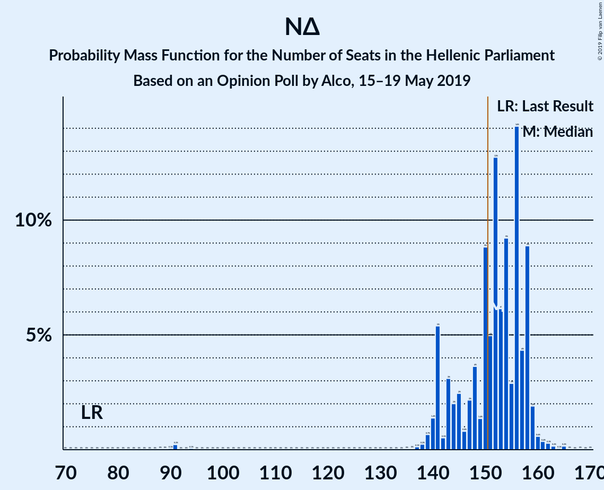

| Number of Seats | Probability | Accumulated | Special Marks |
|:---------------:|:-----------:|:-----------:|:-------------:|
| 75 | 0% | 100% | Last Result |
| 76 | 0% | 100% |  |
| 77 | 0% | 100% |  |
| 78 | 0% | 100% |  |
| 79 | 0% | 100% |  |
| 80 | 0% | 100% |  |
| 81 | 0% | 100% |  |
| 82 | 0% | 100% |  |
| 83 | 0% | 100% |  |
| 84 | 0% | 100% |  |
| 85 | 0% | 100% |  |
| 86 | 0% | 100% |  |
| 87 | 0% | 100% |  |
| 88 | 0% | 100% |  |
| 89 | 0% | 99.9% |  |
| 90 | 0.1% | 99.9% |  |
| 91 | 0.2% | 99.9% |  |
| 92 | 0% | 99.6% |  |
| 93 | 0% | 99.6% |  |
| 94 | 0.1% | 99.6% |  |
| 95 | 0% | 99.6% |  |
| 96 | 0% | 99.6% |  |
| 97 | 0% | 99.6% |  |
| 98 | 0% | 99.6% |  |
| 99 | 0% | 99.6% |  |
| 100 | 0% | 99.6% |  |
| 101 | 0% | 99.6% |  |
| 102 | 0% | 99.6% |  |
| 103 | 0% | 99.6% |  |
| 104 | 0% | 99.6% |  |
| 105 | 0% | 99.6% |  |
| 106 | 0% | 99.6% |  |
| 107 | 0% | 99.6% |  |
| 108 | 0% | 99.6% |  |
| 109 | 0% | 99.6% |  |
| 110 | 0% | 99.6% |  |
| 111 | 0% | 99.6% |  |
| 112 | 0% | 99.6% |  |
| 113 | 0% | 99.6% |  |
| 114 | 0% | 99.6% |  |
| 115 | 0% | 99.6% |  |
| 116 | 0% | 99.6% |  |
| 117 | 0% | 99.6% |  |
| 118 | 0% | 99.6% |  |
| 119 | 0% | 99.6% |  |
| 120 | 0% | 99.6% |  |
| 121 | 0% | 99.6% |  |
| 122 | 0% | 99.6% |  |
| 123 | 0% | 99.6% |  |
| 124 | 0% | 99.6% |  |
| 125 | 0% | 99.6% |  |
| 126 | 0% | 99.6% |  |
| 127 | 0% | 99.6% |  |
| 128 | 0% | 99.6% |  |
| 129 | 0% | 99.6% |  |
| 130 | 0% | 99.6% |  |
| 131 | 0% | 99.6% |  |
| 132 | 0% | 99.6% |  |
| 133 | 0% | 99.6% |  |
| 134 | 0% | 99.6% |  |
| 135 | 0% | 99.6% |  |
| 136 | 0% | 99.5% |  |
| 137 | 0.1% | 99.5% |  |
| 138 | 0.2% | 99.4% |  |
| 139 | 0.7% | 99.1% |  |
| 140 | 1.4% | 98% |  |
| 141 | 5% | 97% |  |
| 142 | 0.5% | 92% |  |
| 143 | 3% | 91% |  |
| 144 | 2% | 88% |  |
| 145 | 2% | 86% |  |
| 146 | 0.8% | 84% |  |
| 147 | 2% | 83% |  |
| 148 | 4% | 81% |  |
| 149 | 1.4% | 77% |  |
| 150 | 9% | 76% |  |
| 151 | 5% | 67% | Majority |
| 152 | 13% | 62% | Median |
| 153 | 6% | 49% |  |
| 154 | 9% | 43% |  |
| 155 | 3% | 34% |  |
| 156 | 14% | 31% |  |
| 157 | 4% | 17% |  |
| 158 | 9% | 12% |  |
| 159 | 2% | 4% |  |
| 160 | 0.6% | 2% |  |
| 161 | 0.4% | 1.1% |  |
| 162 | 0.3% | 0.7% |  |
| 163 | 0.2% | 0.5% |  |
| 164 | 0.1% | 0.3% |  |
| 165 | 0.2% | 0.3% |  |
| 166 | 0% | 0.1% |  |
| 167 | 0% | 0.1% |  |
| 168 | 0% | 0.1% |  |
| 169 | 0% | 0% |  |

### Συνασπισμός Ριζοσπαστικής Αριστεράς – Λαϊκή Ενότητα – Ανεξάρτητοι Έλληνες

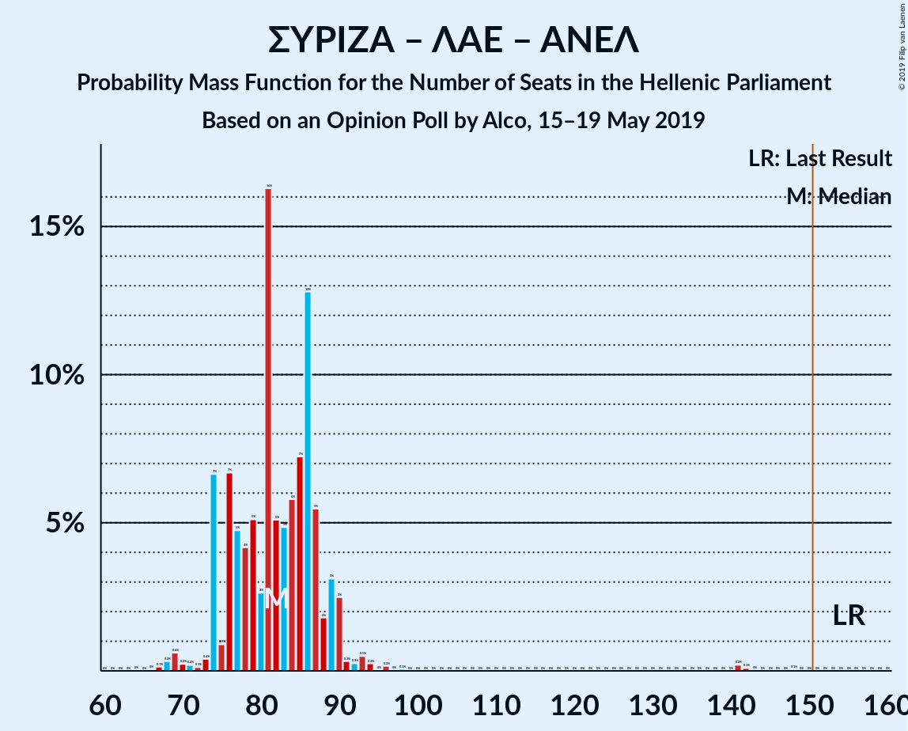

| Number of Seats | Probability | Accumulated | Special Marks |
|:---------------:|:-----------:|:-----------:|:-------------:|
| 66 | 0% | 100% |  |
| 67 | 0.1% | 99.9% |  |
| 68 | 0.3% | 99.8% |  |
| 69 | 0.6% | 99.5% |  |
| 70 | 0.2% | 98.8% |  |
| 71 | 0.2% | 98.6% |  |
| 72 | 0.1% | 98% |  |
| 73 | 0.4% | 98% |  |
| 74 | 7% | 98% |  |
| 75 | 0.9% | 91% |  |
| 76 | 7% | 90% |  |
| 77 | 5% | 84% |  |
| 78 | 4% | 79% |  |
| 79 | 5% | 75% |  |
| 80 | 3% | 70% |  |
| 81 | 16% | 67% | Median |
| 82 | 5% | 51% |  |
| 83 | 5% | 46% |  |
| 84 | 6% | 41% |  |
| 85 | 7% | 35% |  |
| 86 | 13% | 28% |  |
| 87 | 5% | 15% |  |
| 88 | 2% | 9% |  |
| 89 | 3% | 8% |  |
| 90 | 2% | 5% |  |
| 91 | 0.3% | 2% |  |
| 92 | 0.3% | 2% |  |
| 93 | 0.5% | 1.5% |  |
| 94 | 0.3% | 1.0% |  |
| 95 | 0% | 0.7% |  |
| 96 | 0.2% | 0.7% |  |
| 97 | 0% | 0.5% |  |
| 98 | 0.1% | 0.5% |  |
| 99 | 0% | 0.4% |  |
| 100 | 0% | 0.4% |  |
| 101 | 0% | 0.4% |  |
| 102 | 0% | 0.4% |  |
| 103 | 0% | 0.4% |  |
| 104 | 0% | 0.4% |  |
| 105 | 0% | 0.4% |  |
| 106 | 0% | 0.4% |  |
| 107 | 0% | 0.4% |  |
| 108 | 0% | 0.4% |  |
| 109 | 0% | 0.4% |  |
| 110 | 0% | 0.4% |  |
| 111 | 0% | 0.4% |  |
| 112 | 0% | 0.4% |  |
| 113 | 0% | 0.4% |  |
| 114 | 0% | 0.4% |  |
| 115 | 0% | 0.4% |  |
| 116 | 0% | 0.4% |  |
| 117 | 0% | 0.4% |  |
| 118 | 0% | 0.4% |  |
| 119 | 0% | 0.4% |  |
| 120 | 0% | 0.4% |  |
| 121 | 0% | 0.4% |  |
| 122 | 0% | 0.4% |  |
| 123 | 0% | 0.4% |  |
| 124 | 0% | 0.4% |  |
| 125 | 0% | 0.4% |  |
| 126 | 0% | 0.4% |  |
| 127 | 0% | 0.4% |  |
| 128 | 0% | 0.4% |  |
| 129 | 0% | 0.4% |  |
| 130 | 0% | 0.4% |  |
| 131 | 0% | 0.4% |  |
| 132 | 0% | 0.4% |  |
| 133 | 0% | 0.4% |  |
| 134 | 0% | 0.4% |  |
| 135 | 0% | 0.4% |  |
| 136 | 0% | 0.4% |  |
| 137 | 0% | 0.4% |  |
| 138 | 0% | 0.4% |  |
| 139 | 0% | 0.4% |  |
| 140 | 0% | 0.4% |  |
| 141 | 0.2% | 0.4% |  |
| 142 | 0.1% | 0.2% |  |
| 143 | 0% | 0.1% |  |
| 144 | 0% | 0.1% |  |
| 145 | 0% | 0.1% |  |
| 146 | 0% | 0.1% |  |
| 147 | 0% | 0.1% |  |
| 148 | 0.1% | 0.1% |  |
| 149 | 0% | 0% |  |
| 150 | 0% | 0% |  |
| 151 | 0% | 0% | Majority |
| 152 | 0% | 0% |  |
| 153 | 0% | 0% |  |
| 154 | 0% | 0% |  |
| 155 | 0% | 0% | Last Result |

### Συνασπισμός Ριζοσπαστικής Αριστεράς – Λαϊκή Ενότητα

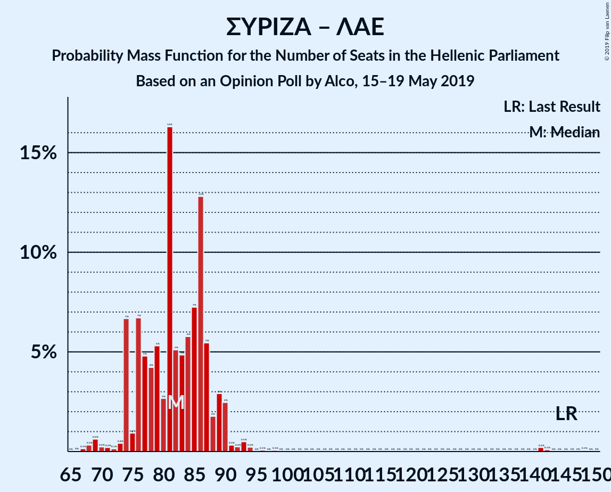

| Number of Seats | Probability | Accumulated | Special Marks |
|:---------------:|:-----------:|:-----------:|:-------------:|
| 66 | 0% | 100% |  |
| 67 | 0.1% | 99.9% |  |
| 68 | 0.3% | 99.8% |  |
| 69 | 0.6% | 99.5% |  |
| 70 | 0.2% | 98.8% |  |
| 71 | 0.2% | 98.6% |  |
| 72 | 0.1% | 98% |  |
| 73 | 0.4% | 98% |  |
| 74 | 7% | 98% |  |
| 75 | 0.9% | 91% |  |
| 76 | 7% | 90% |  |
| 77 | 5% | 84% |  |
| 78 | 4% | 79% |  |
| 79 | 5% | 75% |  |
| 80 | 3% | 69% |  |
| 81 | 16% | 67% | Median |
| 82 | 5% | 50% |  |
| 83 | 5% | 45% |  |
| 84 | 6% | 40% |  |
| 85 | 7% | 35% |  |
| 86 | 13% | 27% |  |
| 87 | 5% | 14% |  |
| 88 | 2% | 9% |  |
| 89 | 3% | 7% |  |
| 90 | 2% | 4% |  |
| 91 | 0.3% | 2% |  |
| 92 | 0.2% | 2% |  |
| 93 | 0.5% | 1.3% |  |
| 94 | 0.2% | 0.8% |  |
| 95 | 0% | 0.6% |  |
| 96 | 0.1% | 0.6% |  |
| 97 | 0% | 0.5% |  |
| 98 | 0.1% | 0.5% |  |
| 99 | 0% | 0.4% |  |
| 100 | 0% | 0.4% |  |
| 101 | 0% | 0.4% |  |
| 102 | 0% | 0.4% |  |
| 103 | 0% | 0.4% |  |
| 104 | 0% | 0.4% |  |
| 105 | 0% | 0.4% |  |
| 106 | 0% | 0.4% |  |
| 107 | 0% | 0.4% |  |
| 108 | 0% | 0.4% |  |
| 109 | 0% | 0.4% |  |
| 110 | 0% | 0.4% |  |
| 111 | 0% | 0.4% |  |
| 112 | 0% | 0.4% |  |
| 113 | 0% | 0.4% |  |
| 114 | 0% | 0.4% |  |
| 115 | 0% | 0.4% |  |
| 116 | 0% | 0.4% |  |
| 117 | 0% | 0.4% |  |
| 118 | 0% | 0.4% |  |
| 119 | 0% | 0.4% |  |
| 120 | 0% | 0.4% |  |
| 121 | 0% | 0.4% |  |
| 122 | 0% | 0.4% |  |
| 123 | 0% | 0.4% |  |
| 124 | 0% | 0.4% |  |
| 125 | 0% | 0.4% |  |
| 126 | 0% | 0.4% |  |
| 127 | 0% | 0.4% |  |
| 128 | 0% | 0.4% |  |
| 129 | 0% | 0.4% |  |
| 130 | 0% | 0.4% |  |
| 131 | 0% | 0.4% |  |
| 132 | 0% | 0.4% |  |
| 133 | 0% | 0.4% |  |
| 134 | 0% | 0.4% |  |
| 135 | 0% | 0.4% |  |
| 136 | 0% | 0.4% |  |
| 137 | 0% | 0.4% |  |
| 138 | 0% | 0.4% |  |
| 139 | 0% | 0.4% |  |
| 140 | 0% | 0.4% |  |
| 141 | 0.2% | 0.4% |  |
| 142 | 0.1% | 0.2% |  |
| 143 | 0% | 0.1% |  |
| 144 | 0% | 0.1% |  |
| 145 | 0% | 0.1% | Last Result |
| 146 | 0% | 0.1% |  |
| 147 | 0% | 0.1% |  |
| 148 | 0.1% | 0.1% |  |
| 149 | 0% | 0% |  |

### Συνασπισμός Ριζοσπαστικής Αριστεράς – Ανεξάρτητοι Έλληνες

| Number of Seats | Probability | Accumulated | Special Marks |
|:---------------:|:-----------:|:-----------:|:-------------:|
| 66 | 0.1% | 100% |  |
| 67 | 0.2% | 99.9% |  |
| 68 | 0.4% | 99.7% |  |
| 69 | 1.0% | 99.4% |  |
| 70 | 0.5% | 98% |  |
| 71 | 0.2% | 98% |  |
| 72 | 0.9% | 98% |  |
| 73 | 3% | 97% |  |
| 74 | 8% | 94% |  |
| 75 | 2% | 86% |  |
| 76 | 7% | 84% |  |
| 77 | 7% | 77% |  |
| 78 | 4% | 70% |  |
| 79 | 5% | 66% |  |
| 80 | 2% | 60% |  |
| 81 | 16% | 58% | Median |
| 82 | 4% | 42% |  |
| 83 | 2% | 38% |  |
| 84 | 6% | 36% |  |
| 85 | 6% | 30% |  |
| 86 | 11% | 24% |  |
| 87 | 5% | 13% |  |
| 88 | 2% | 8% |  |
| 89 | 3% | 7% |  |
| 90 | 2% | 4% |  |
| 91 | 0.2% | 2% |  |
| 92 | 0.2% | 2% |  |
| 93 | 0.5% | 1.4% |  |
| 94 | 0.2% | 0.9% |  |
| 95 | 0% | 0.7% |  |
| 96 | 0.2% | 0.7% |  |
| 97 | 0% | 0.5% |  |
| 98 | 0.1% | 0.5% |  |
| 99 | 0% | 0.4% |  |
| 100 | 0% | 0.4% |  |
| 101 | 0% | 0.4% |  |
| 102 | 0% | 0.4% |  |
| 103 | 0% | 0.4% |  |
| 104 | 0% | 0.4% |  |
| 105 | 0% | 0.4% |  |
| 106 | 0% | 0.4% |  |
| 107 | 0% | 0.4% |  |
| 108 | 0% | 0.4% |  |
| 109 | 0% | 0.4% |  |
| 110 | 0% | 0.4% |  |
| 111 | 0% | 0.4% |  |
| 112 | 0% | 0.4% |  |
| 113 | 0% | 0.4% |  |
| 114 | 0% | 0.4% |  |
| 115 | 0% | 0.4% |  |
| 116 | 0% | 0.4% |  |
| 117 | 0% | 0.4% |  |
| 118 | 0% | 0.4% |  |
| 119 | 0% | 0.4% |  |
| 120 | 0% | 0.4% |  |
| 121 | 0% | 0.4% |  |
| 122 | 0% | 0.4% |  |
| 123 | 0% | 0.4% |  |
| 124 | 0% | 0.4% |  |
| 125 | 0% | 0.4% |  |
| 126 | 0% | 0.4% |  |
| 127 | 0% | 0.4% |  |
| 128 | 0% | 0.4% |  |
| 129 | 0% | 0.4% |  |
| 130 | 0% | 0.4% |  |
| 131 | 0% | 0.4% |  |
| 132 | 0% | 0.4% |  |
| 133 | 0% | 0.4% |  |
| 134 | 0% | 0.4% |  |
| 135 | 0% | 0.4% |  |
| 136 | 0% | 0.4% |  |
| 137 | 0% | 0.4% |  |
| 138 | 0% | 0.4% |  |
| 139 | 0% | 0.4% |  |
| 140 | 0% | 0.4% |  |
| 141 | 0.2% | 0.4% |  |
| 142 | 0.1% | 0.2% |  |
| 143 | 0% | 0.1% |  |
| 144 | 0% | 0.1% |  |
| 145 | 0% | 0.1% |  |
| 146 | 0% | 0.1% |  |
| 147 | 0% | 0.1% |  |
| 148 | 0.1% | 0.1% |  |
| 149 | 0% | 0% |  |
| 150 | 0% | 0% |  |
| 151 | 0% | 0% | Majority |
| 152 | 0% | 0% |  |
| 153 | 0% | 0% |  |
| 154 | 0% | 0% |  |
| 155 | 0% | 0% | Last Result |

### Συνασπισμός Ριζοσπαστικής Αριστεράς

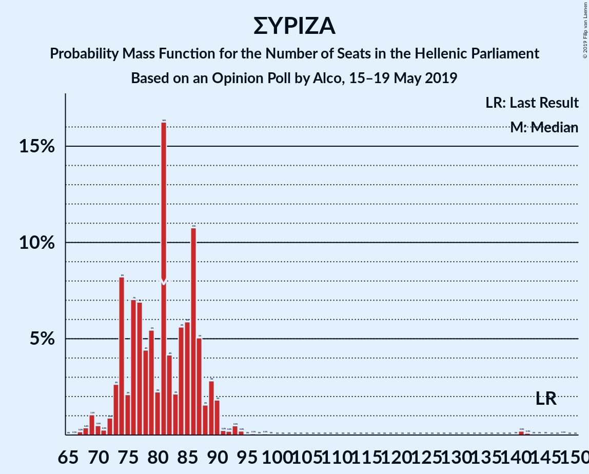

| Number of Seats | Probability | Accumulated | Special Marks |
|:---------------:|:-----------:|:-----------:|:-------------:|
| 66 | 0.1% | 100% |  |
| 67 | 0.2% | 99.9% |  |
| 68 | 0.4% | 99.7% |  |
| 69 | 1.1% | 99.4% |  |
| 70 | 0.5% | 98% |  |
| 71 | 0.3% | 98% |  |
| 72 | 0.9% | 98% |  |
| 73 | 3% | 97% |  |
| 74 | 8% | 94% |  |
| 75 | 2% | 86% |  |
| 76 | 7% | 84% |  |
| 77 | 7% | 77% |  |
| 78 | 4% | 70% |  |
| 79 | 5% | 65% |  |
| 80 | 2% | 60% |  |
| 81 | 16% | 58% | Median |
| 82 | 4% | 41% |  |
| 83 | 2% | 37% |  |
| 84 | 6% | 35% |  |
| 85 | 6% | 30% |  |
| 86 | 11% | 24% |  |
| 87 | 5% | 13% |  |
| 88 | 2% | 8% |  |
| 89 | 3% | 6% |  |
| 90 | 2% | 4% |  |
| 91 | 0.2% | 2% |  |
| 92 | 0.2% | 1.4% |  |
| 93 | 0.5% | 1.3% |  |
| 94 | 0.2% | 0.8% |  |
| 95 | 0% | 0.6% |  |
| 96 | 0.1% | 0.6% |  |
| 97 | 0% | 0.5% |  |
| 98 | 0.1% | 0.5% |  |
| 99 | 0% | 0.4% |  |
| 100 | 0% | 0.4% |  |
| 101 | 0% | 0.4% |  |
| 102 | 0% | 0.4% |  |
| 103 | 0% | 0.4% |  |
| 104 | 0% | 0.4% |  |
| 105 | 0% | 0.4% |  |
| 106 | 0% | 0.4% |  |
| 107 | 0% | 0.4% |  |
| 108 | 0% | 0.4% |  |
| 109 | 0% | 0.4% |  |
| 110 | 0% | 0.4% |  |
| 111 | 0% | 0.4% |  |
| 112 | 0% | 0.4% |  |
| 113 | 0% | 0.4% |  |
| 114 | 0% | 0.4% |  |
| 115 | 0% | 0.4% |  |
| 116 | 0% | 0.4% |  |
| 117 | 0% | 0.4% |  |
| 118 | 0% | 0.4% |  |
| 119 | 0% | 0.4% |  |
| 120 | 0% | 0.4% |  |
| 121 | 0% | 0.4% |  |
| 122 | 0% | 0.4% |  |
| 123 | 0% | 0.4% |  |
| 124 | 0% | 0.4% |  |
| 125 | 0% | 0.4% |  |
| 126 | 0% | 0.4% |  |
| 127 | 0% | 0.4% |  |
| 128 | 0% | 0.4% |  |
| 129 | 0% | 0.4% |  |
| 130 | 0% | 0.4% |  |
| 131 | 0% | 0.4% |  |
| 132 | 0% | 0.4% |  |
| 133 | 0% | 0.4% |  |
| 134 | 0% | 0.4% |  |
| 135 | 0% | 0.4% |  |
| 136 | 0% | 0.4% |  |
| 137 | 0% | 0.4% |  |
| 138 | 0% | 0.4% |  |
| 139 | 0% | 0.4% |  |
| 140 | 0% | 0.4% |  |
| 141 | 0.2% | 0.4% |  |
| 142 | 0.1% | 0.2% |  |
| 143 | 0% | 0.1% |  |
| 144 | 0% | 0.1% |  |
| 145 | 0% | 0.1% | Last Result |
| 146 | 0% | 0.1% |  |
| 147 | 0% | 0.1% |  |
| 148 | 0.1% | 0.1% |  |
| 149 | 0% | 0% |  |

## Technical Information

### Opinion Poll

+ **Polling firm:** Alco
+ **Commissioner(s):** —
+ **Fieldwork period:** 15–19 May 2019

### Calculations

+ **Sample size:** 1000
+ **Simulations done:** 1,048,576
+ **Error estimate:** 1.54%

