# Opinion Poll by Palmos Analysis, 21–23 May 2019

<a href="#voting-intentions">Voting Intentions</a> | <a href="#seats">Seats</a> | <a href="#coalitions">Coalitions</a> | <a href="#technical-information">Technical Information</a>

## Voting Intentions

### Confidence Intervals

| Party | Last Result | Poll Result | 80% Confidence Interval | 90% Confidence Interval | 95% Confidence Interval | 99% Confidence Interval |
|:-----:|:-----------:|:-----------:|:-----------------------:|:-----------------------:|:-----------------------:|:-----------------------:|
| Νέα Δημοκρατία | 28.1% | 31.9% | 30.1–33.9% |29.6–34.4% |29.2–34.9% |28.3–35.8% |
| Συνασπισμός Ριζοσπαστικής Αριστεράς | 35.5% | 27.5% | 25.8–29.3% |25.3–29.9% |24.8–30.3% |24.0–31.2% |
| Χρυσή Αυγή | 7.0% | 8.1% | 7.1–9.3% |6.8–9.7% |6.6–10.0% |6.2–10.6% |
| Κίνημα Αλλαγής | 6.3% | 7.4% | 6.4–8.5% |6.1–8.8% |5.9–9.1% |5.5–9.7% |
| Κομμουνιστικό Κόμμα Ελλάδας | 5.6% | 7.3% | 6.3–8.4% |6.1–8.7% |5.8–9.0% |5.4–9.6% |
| Ελληνική Λύση | 0.0% | 4.0% | 3.3–4.9% |3.1–5.1% |2.9–5.3% |2.6–5.8% |
| Το Ποτάμι | 4.1% | 2.3% | 1.8–3.0% |1.7–3.3% |1.6–3.4% |1.4–3.8% |
| Λαϊκή Ενότητα | 2.9% | 1.0% | 0.7–1.5% |0.6–1.6% |0.5–1.8% |0.4–2.1% |
| Ανεξάρτητοι Έλληνες | 3.7% | 0.8% | 0.5–1.3% |0.4–1.4% |0.4–1.5% |0.3–1.8% |
| Ένωση Κεντρώων | 3.4% | 0.8% | 0.5–1.3% |0.4–1.4% |0.4–1.5% |0.3–1.8% |

*Note:* The poll result column reflects the actual value used in the calculations. Published results may vary slightly, and in addition be rounded to fewer digits.

## Seats

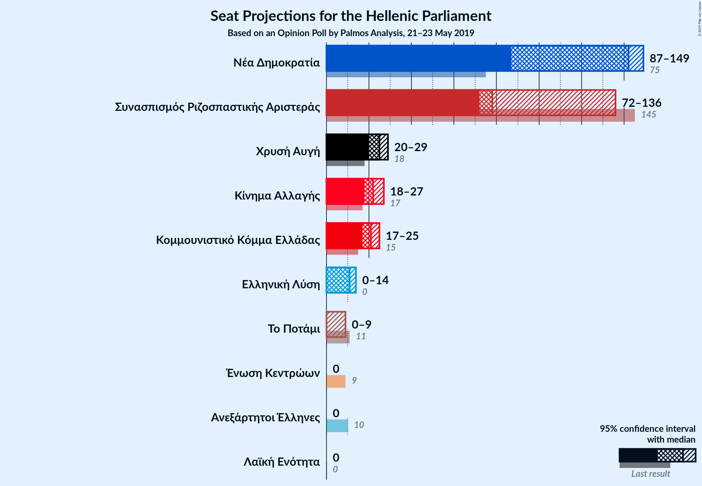

### Confidence Intervals

| Party | Last Result | Median | 80% Confidence Interval | 90% Confidence Interval | 95% Confidence Interval | 99% Confidence Interval |
|:-----:|:-----------:|:------:|:-----------------------:|:-----------------------:|:-----------------------:|:-----------------------:|
| <a href="#νέα-δημοκρατία">Νέα Δημοκρατία</a> | 75 | 142 | 136–146 |134–148 |87–149 |82–151 |
| <a href="#συνασπισμός-ριζοσπαστικής-αριστεράς">Συνασπισμός Ριζοσπαστικής Αριστεράς</a> | 145 | 78 | 74–85 |73–86 |72–136 |70–140 |
| <a href="#χρυσή-αυγή">Χρυσή Αυγή</a> | 18 | 25 | 21–28 |20–28 |20–29 |18–30 |
| <a href="#κίνημα-αλλαγής">Κίνημα Αλλαγής</a> | 17 | 22 | 19–25 |18–26 |18–27 |17–27 |
| <a href="#κομμουνιστικό-κόμμα-ελλάδας">Κομμουνιστικό Κόμμα Ελλάδας</a> | 15 | 21 | 18–24 |17–25 |17–25 |16–28 |
| <a href="#ελληνική-λύση">Ελληνική Λύση</a> | 0 | 11 | 9–13 |9–14 |0–14 |0–16 |
| <a href="#το-ποτάμι">Το Ποτάμι</a> | 11 | 0 | 0 |0–9 |0–9 |0–10 |
| <a href="#λαϊκή-ενότητα">Λαϊκή Ενότητα</a> | 0 | 0 | 0 |0 |0 |0 |
| <a href="#ανεξάρτητοι-έλληνες">Ανεξάρτητοι Έλληνες</a> | 10 | 0 | 0 |0 |0 |0 |
| <a href="#ένωση-κεντρώων">Ένωση Κεντρώων</a> | 9 | 0 | 0 |0 |0 |0 |

### Νέα Δημοκρατία

*For a full overview of the results for this party, see the [Νέα Δημοκρατία](party-νέαδημοκρατία.html) page.*

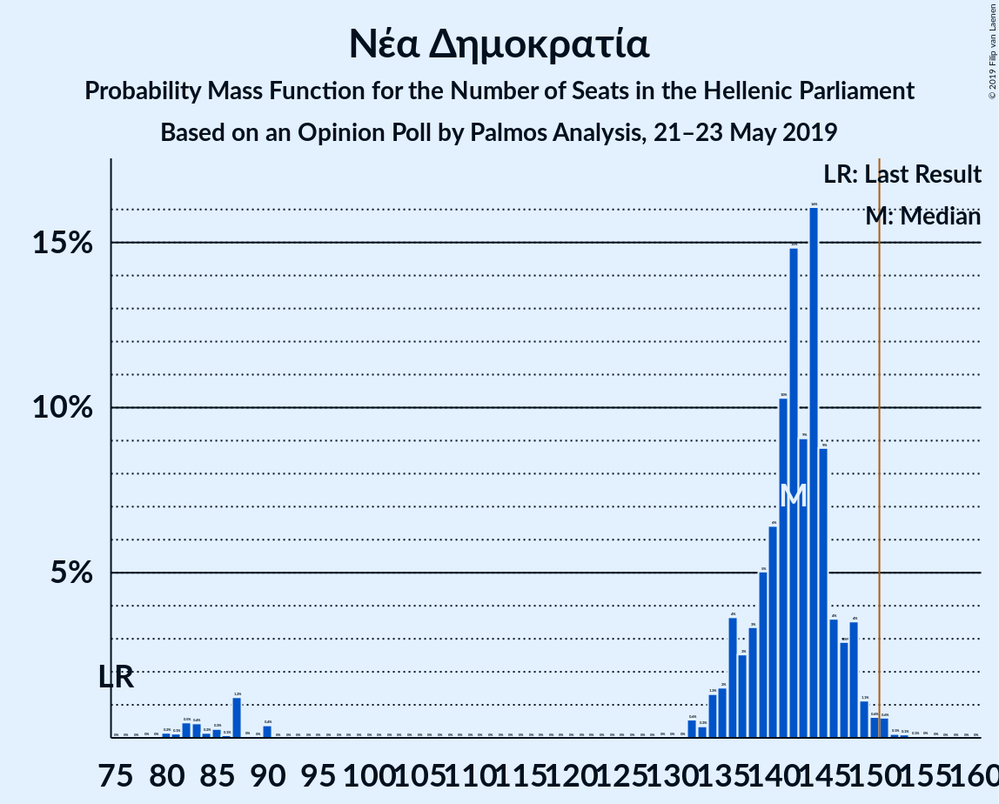

| Number of Seats | Probability | Accumulated | Special Marks |
|:---------------:|:-----------:|:-----------:|:-------------:|
| 75 | 0% | 100% | Last Result |
| 76 | 0% | 100% |  |
| 77 | 0% | 100% |  |
| 78 | 0% | 100% |  |
| 79 | 0% | 100% |  |
| 80 | 0.2% | 100% |  |
| 81 | 0.1% | 99.8% |  |
| 82 | 0.5% | 99.7% |  |
| 83 | 0.4% | 99.2% |  |
| 84 | 0.2% | 98.8% |  |
| 85 | 0.3% | 98.6% |  |
| 86 | 0.1% | 98% |  |
| 87 | 1.2% | 98% |  |
| 88 | 0% | 97% |  |
| 89 | 0% | 97% |  |
| 90 | 0.4% | 97% |  |
| 91 | 0% | 97% |  |
| 92 | 0% | 97% |  |
| 93 | 0% | 97% |  |
| 94 | 0% | 97% |  |
| 95 | 0% | 97% |  |
| 96 | 0% | 97% |  |
| 97 | 0% | 97% |  |
| 98 | 0% | 97% |  |
| 99 | 0% | 97% |  |
| 100 | 0% | 97% |  |
| 101 | 0% | 97% |  |
| 102 | 0% | 97% |  |
| 103 | 0% | 97% |  |
| 104 | 0% | 97% |  |
| 105 | 0% | 97% |  |
| 106 | 0% | 97% |  |
| 107 | 0% | 97% |  |
| 108 | 0% | 97% |  |
| 109 | 0% | 97% |  |
| 110 | 0% | 97% |  |
| 111 | 0% | 97% |  |
| 112 | 0% | 97% |  |
| 113 | 0% | 97% |  |
| 114 | 0% | 97% |  |
| 115 | 0% | 97% |  |
| 116 | 0% | 97% |  |
| 117 | 0% | 97% |  |
| 118 | 0% | 97% |  |
| 119 | 0% | 97% |  |
| 120 | 0% | 97% |  |
| 121 | 0% | 97% |  |
| 122 | 0% | 97% |  |
| 123 | 0% | 97% |  |
| 124 | 0% | 97% |  |
| 125 | 0% | 97% |  |
| 126 | 0% | 97% |  |
| 127 | 0% | 97% |  |
| 128 | 0% | 97% |  |
| 129 | 0% | 97% |  |
| 130 | 0% | 97% |  |
| 131 | 0% | 97% |  |
| 132 | 0.6% | 97% |  |
| 133 | 0.3% | 96% |  |
| 134 | 1.3% | 96% |  |
| 135 | 2% | 94% |  |
| 136 | 4% | 93% |  |
| 137 | 3% | 89% |  |
| 138 | 3% | 87% |  |
| 139 | 5% | 83% |  |
| 140 | 6% | 78% |  |
| 141 | 10% | 72% |  |
| 142 | 15% | 62% | Median |
| 143 | 9% | 47% |  |
| 144 | 16% | 38% |  |
| 145 | 9% | 22% |  |
| 146 | 4% | 13% |  |
| 147 | 3% | 9% |  |
| 148 | 4% | 6% |  |
| 149 | 1.1% | 3% |  |
| 150 | 0.6% | 2% |  |
| 151 | 0.6% | 1.0% | Majority |
| 152 | 0.1% | 0.3% |  |
| 153 | 0.1% | 0.2% |  |
| 154 | 0.1% | 0.1% |  |
| 155 | 0% | 0.1% |  |
| 156 | 0% | 0% |  |

### Συνασπισμός Ριζοσπαστικής Αριστεράς

*For a full overview of the results for this party, see the [Συνασπισμός Ριζοσπαστικής Αριστεράς](party-συνασπισμόςριζοσπαστικήςαριστεράς.html) page.*

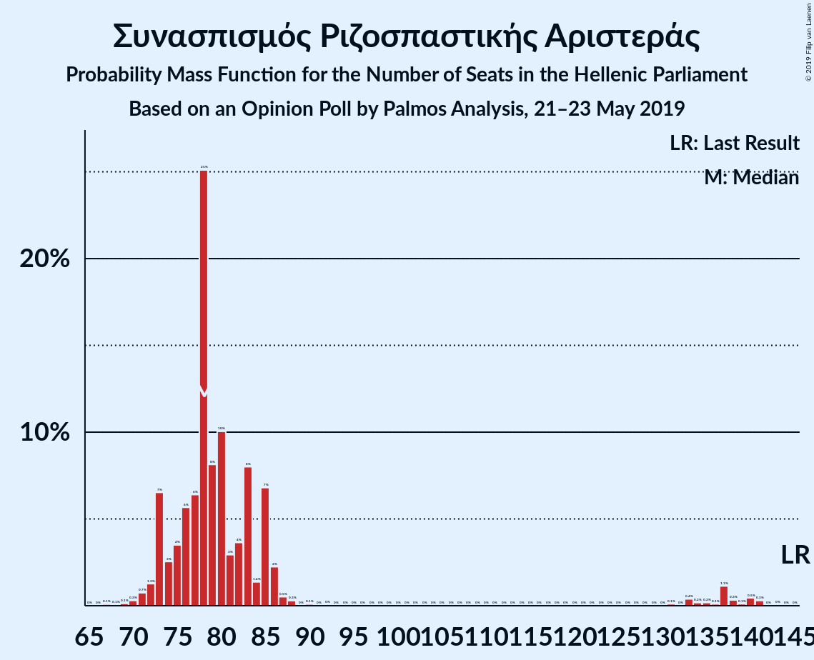

| Number of Seats | Probability | Accumulated | Special Marks |
|:---------------:|:-----------:|:-----------:|:-------------:|
| 67 | 0.1% | 100% |  |
| 68 | 0.1% | 99.9% |  |
| 69 | 0.1% | 99.8% |  |
| 70 | 0.3% | 99.7% |  |
| 71 | 0.7% | 99.4% |  |
| 72 | 1.3% | 98.6% |  |
| 73 | 7% | 97% |  |
| 74 | 3% | 91% |  |
| 75 | 4% | 88% |  |
| 76 | 6% | 85% |  |
| 77 | 6% | 79% |  |
| 78 | 25% | 73% | Median |
| 79 | 8% | 48% |  |
| 80 | 10% | 39% |  |
| 81 | 3% | 29% |  |
| 82 | 4% | 26% |  |
| 83 | 8% | 23% |  |
| 84 | 1.4% | 15% |  |
| 85 | 7% | 13% |  |
| 86 | 2% | 7% |  |
| 87 | 0.5% | 4% |  |
| 88 | 0.3% | 4% |  |
| 89 | 0% | 4% |  |
| 90 | 0.1% | 4% |  |
| 91 | 0% | 3% |  |
| 92 | 0% | 3% |  |
| 93 | 0% | 3% |  |
| 94 | 0% | 3% |  |
| 95 | 0% | 3% |  |
| 96 | 0% | 3% |  |
| 97 | 0% | 3% |  |
| 98 | 0% | 3% |  |
| 99 | 0% | 3% |  |
| 100 | 0% | 3% |  |
| 101 | 0% | 3% |  |
| 102 | 0% | 3% |  |
| 103 | 0% | 3% |  |
| 104 | 0% | 3% |  |
| 105 | 0% | 3% |  |
| 106 | 0% | 3% |  |
| 107 | 0% | 3% |  |
| 108 | 0% | 3% |  |
| 109 | 0% | 3% |  |
| 110 | 0% | 3% |  |
| 111 | 0% | 3% |  |
| 112 | 0% | 3% |  |
| 113 | 0% | 3% |  |
| 114 | 0% | 3% |  |
| 115 | 0% | 3% |  |
| 116 | 0% | 3% |  |
| 117 | 0% | 3% |  |
| 118 | 0% | 3% |  |
| 119 | 0% | 3% |  |
| 120 | 0% | 3% |  |
| 121 | 0% | 3% |  |
| 122 | 0% | 3% |  |
| 123 | 0% | 3% |  |
| 124 | 0% | 3% |  |
| 125 | 0% | 3% |  |
| 126 | 0% | 3% |  |
| 127 | 0% | 3% |  |
| 128 | 0% | 3% |  |
| 129 | 0% | 3% |  |
| 130 | 0% | 3% |  |
| 131 | 0.1% | 3% |  |
| 132 | 0% | 3% |  |
| 133 | 0.4% | 3% |  |
| 134 | 0.2% | 3% |  |
| 135 | 0.2% | 3% |  |
| 136 | 0.1% | 3% |  |
| 137 | 1.1% | 2% |  |
| 138 | 0.3% | 1.3% |  |
| 139 | 0.1% | 0.9% |  |
| 140 | 0.5% | 0.8% |  |
| 141 | 0.3% | 0.4% |  |
| 142 | 0% | 0.1% |  |
| 143 | 0% | 0.1% |  |
| 144 | 0% | 0% |  |
| 145 | 0% | 0% | Last Result |

### Χρυσή Αυγή

*For a full overview of the results for this party, see the [Χρυσή Αυγή](party-χρυσήαυγή.html) page.*

| Number of Seats | Probability | Accumulated | Special Marks |
|:---------------:|:-----------:|:-----------:|:-------------:|
| 17 | 0.1% | 100% |  |
| 18 | 0.6% | 99.9% | Last Result |
| 19 | 1.2% | 99.3% |  |
| 20 | 4% | 98% |  |
| 21 | 7% | 94% |  |
| 22 | 11% | 87% |  |
| 23 | 11% | 76% |  |
| 24 | 14% | 65% |  |
| 25 | 21% | 51% | Median |
| 26 | 12% | 30% |  |
| 27 | 7% | 18% |  |
| 28 | 7% | 12% |  |
| 29 | 4% | 5% |  |
| 30 | 0.8% | 1.0% |  |
| 31 | 0.1% | 0.2% |  |
| 32 | 0.1% | 0.1% |  |
| 33 | 0% | 0% |  |

### Κίνημα Αλλαγής

*For a full overview of the results for this party, see the [Κίνημα Αλλαγής](party-κίνημααλλαγής.html) page.*

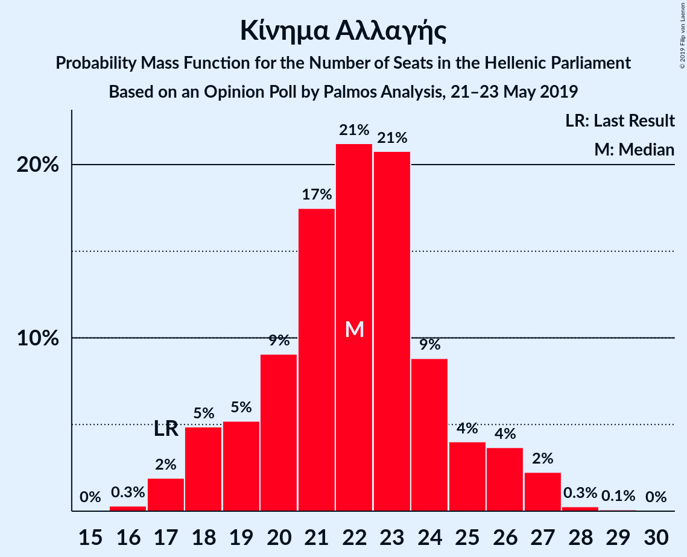

| Number of Seats | Probability | Accumulated | Special Marks |
|:---------------:|:-----------:|:-----------:|:-------------:|
| 15 | 0% | 100% |  |
| 16 | 0.3% | 99.9% |  |
| 17 | 2% | 99.6% | Last Result |
| 18 | 5% | 98% |  |
| 19 | 5% | 93% |  |
| 20 | 9% | 88% |  |
| 21 | 17% | 79% |  |
| 22 | 21% | 61% | Median |
| 23 | 21% | 40% |  |
| 24 | 9% | 19% |  |
| 25 | 4% | 10% |  |
| 26 | 4% | 6% |  |
| 27 | 2% | 3% |  |
| 28 | 0.3% | 0.4% |  |
| 29 | 0.1% | 0.1% |  |
| 30 | 0% | 0% |  |

### Κομμουνιστικό Κόμμα Ελλάδας

*For a full overview of the results for this party, see the [Κομμουνιστικό Κόμμα Ελλάδας](party-κομμουνιστικόκόμμαελλάδας.html) page.*

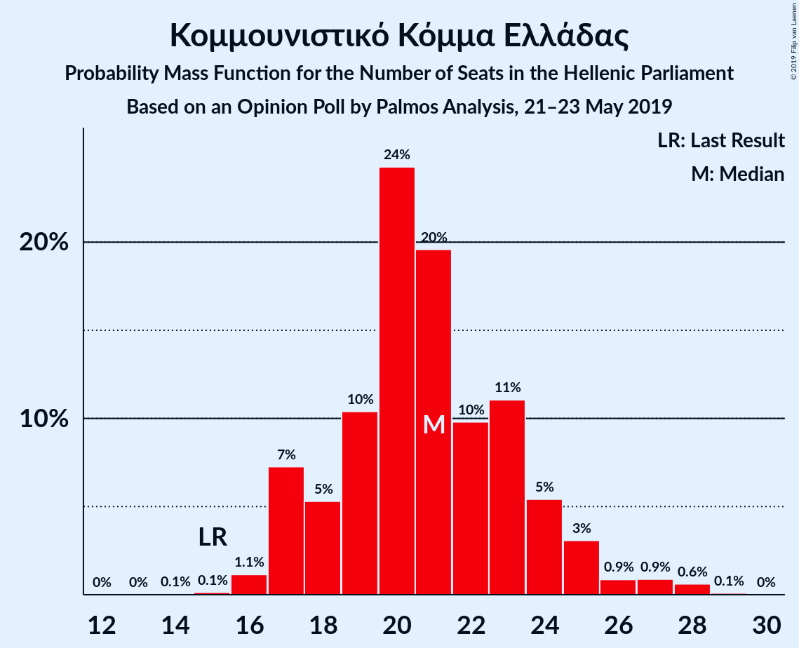

| Number of Seats | Probability | Accumulated | Special Marks |
|:---------------:|:-----------:|:-----------:|:-------------:|
| 14 | 0.1% | 100% |  |
| 15 | 0.1% | 99.9% | Last Result |
| 16 | 1.1% | 99.8% |  |
| 17 | 7% | 98.7% |  |
| 18 | 5% | 91% |  |
| 19 | 10% | 86% |  |
| 20 | 24% | 76% |  |
| 21 | 20% | 51% | Median |
| 22 | 10% | 32% |  |
| 23 | 11% | 22% |  |
| 24 | 5% | 11% |  |
| 25 | 3% | 6% |  |
| 26 | 0.9% | 2% |  |
| 27 | 0.9% | 2% |  |
| 28 | 0.6% | 0.7% |  |
| 29 | 0.1% | 0.1% |  |
| 30 | 0% | 0% |  |

### Ελληνική Λύση

*For a full overview of the results for this party, see the [Ελληνική Λύση](party-ελληνικήλύση.html) page.*

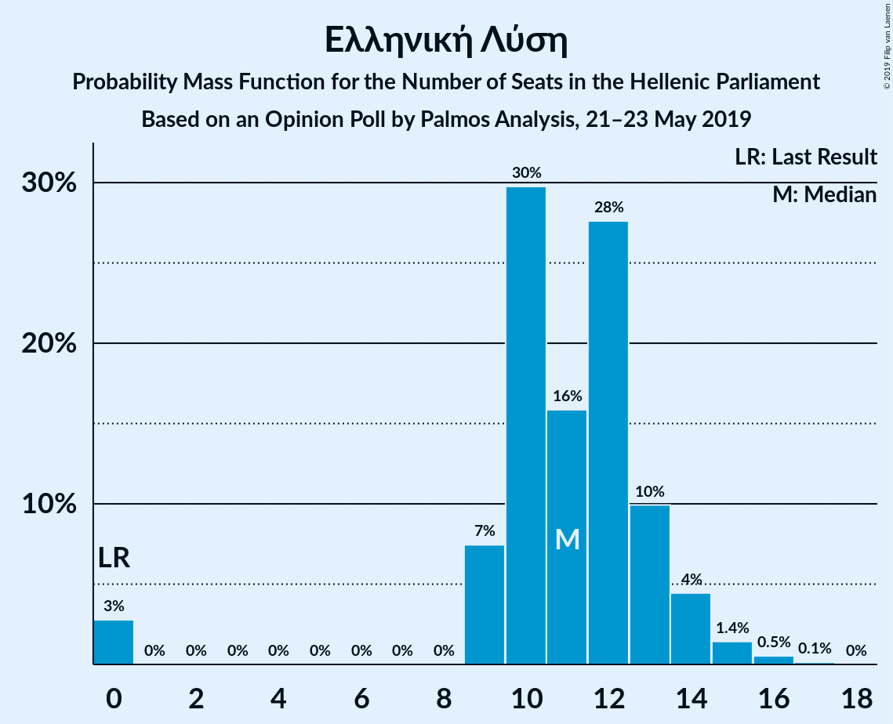

| Number of Seats | Probability | Accumulated | Special Marks |
|:---------------:|:-----------:|:-----------:|:-------------:|
| 0 | 3% | 100% | Last Result |
| 1 | 0% | 97% |  |
| 2 | 0% | 97% |  |
| 3 | 0% | 97% |  |
| 4 | 0% | 97% |  |
| 5 | 0% | 97% |  |
| 6 | 0% | 97% |  |
| 7 | 0% | 97% |  |
| 8 | 0% | 97% |  |
| 9 | 7% | 97% |  |
| 10 | 30% | 90% |  |
| 11 | 16% | 60% | Median |
| 12 | 28% | 44% |  |
| 13 | 10% | 17% |  |
| 14 | 4% | 7% |  |
| 15 | 1.4% | 2% |  |
| 16 | 0.5% | 0.7% |  |
| 17 | 0.1% | 0.2% |  |
| 18 | 0% | 0% |  |

### Το Ποτάμι

*For a full overview of the results for this party, see the [Το Ποτάμι](party-τοποτάμι.html) page.*

| Number of Seats | Probability | Accumulated | Special Marks |
|:---------------:|:-----------:|:-----------:|:-------------:|
| 0 | 92% | 100% | Median |
| 1 | 0% | 8% |  |
| 2 | 0% | 8% |  |
| 3 | 0% | 8% |  |
| 4 | 0% | 8% |  |
| 5 | 0% | 8% |  |
| 6 | 0% | 8% |  |
| 7 | 0% | 8% |  |
| 8 | 0.2% | 8% |  |
| 9 | 7% | 8% |  |
| 10 | 1.3% | 1.4% |  |
| 11 | 0.1% | 0.2% | Last Result |
| 12 | 0% | 0% |  |

### Λαϊκή Ενότητα

*For a full overview of the results for this party, see the [Λαϊκή Ενότητα](party-λαϊκήενότητα.html) page.*

| Number of Seats | Probability | Accumulated | Special Marks |
|:---------------:|:-----------:|:-----------:|:-------------:|
| 0 | 100% | 100% | Last Result, Median |

### Ανεξάρτητοι Έλληνες

*For a full overview of the results for this party, see the [Ανεξάρτητοι Έλληνες](party-ανεξάρτητοιέλληνες.html) page.*

| Number of Seats | Probability | Accumulated | Special Marks |
|:---------------:|:-----------:|:-----------:|:-------------:|
| 0 | 100% | 100% | Median |
| 1 | 0% | 0% |  |
| 2 | 0% | 0% |  |
| 3 | 0% | 0% |  |
| 4 | 0% | 0% |  |
| 5 | 0% | 0% |  |
| 6 | 0% | 0% |  |
| 7 | 0% | 0% |  |
| 8 | 0% | 0% |  |
| 9 | 0% | 0% |  |
| 10 | 0% | 0% | Last Result |

### Ένωση Κεντρώων

*For a full overview of the results for this party, see the [Ένωση Κεντρώων](party-ένωσηκεντρώων.html) page.*

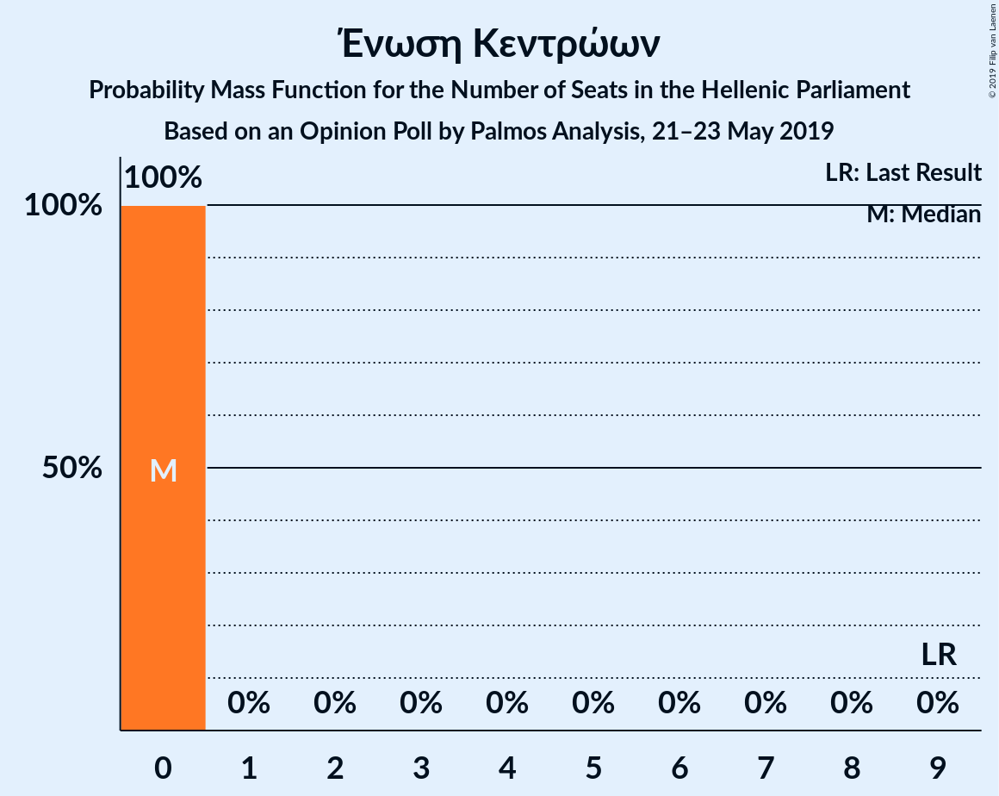

| Number of Seats | Probability | Accumulated | Special Marks |
|:---------------:|:-----------:|:-----------:|:-------------:|
| 0 | 100% | 100% | Median |
| 1 | 0% | 0% |  |
| 2 | 0% | 0% |  |
| 3 | 0% | 0% |  |
| 4 | 0% | 0% |  |
| 5 | 0% | 0% |  |
| 6 | 0% | 0% |  |
| 7 | 0% | 0% |  |
| 8 | 0% | 0% |  |
| 9 | 0% | 0% | Last Result |

## Coalitions

### Confidence Intervals

| Coalition | Last Result | Median | Majority? | 80% Confidence Interval | 90% Confidence Interval | 95% Confidence Interval | 99% Confidence Interval |
|:---------:|:-----------:|:------:|:---------:|:-----------------------:|:-----------------------:|:-----------------------:|:-----------------------:|
| Νέα Δημοκρατία – Κίνημα Αλλαγής – Το Ποτάμι | 103 | 165 | 97% | 159–169 | 156–171 | 112–172 | 105–176 |
| Νέα Δημοκρατία – Κίνημα Αλλαγής | 92 | 164 | 97% | 157–169 | 154–170 | 108–171 | 103–175 |
| Νέα Δημοκρατία – Το Ποτάμι | 86 | 143 | 1.4% | 138–147 | 136–148 | 90–149 | 84–153 |
| Νέα Δημοκρατία | 75 | 142 | 1.0% | 136–146 | 134–148 | 87–149 | 82–151 |
| Συνασπισμός Ριζοσπαστικής Αριστεράς – Λαϊκή Ενότητα – Ανεξάρτητοι Έλληνες | 155 | 78 | 0% | 74–85 | 73–86 | 72–136 | 70–140 |
| Συνασπισμός Ριζοσπαστικής Αριστεράς – Ανεξάρτητοι Έλληνες | 155 | 78 | 0% | 74–85 | 73–86 | 72–136 | 70–140 |
| Συνασπισμός Ριζοσπαστικής Αριστεράς – Λαϊκή Ενότητα | 145 | 78 | 0% | 74–85 | 73–86 | 72–136 | 70–140 |
| Συνασπισμός Ριζοσπαστικής Αριστεράς | 145 | 78 | 0% | 74–85 | 73–86 | 72–136 | 70–140 |

### Νέα Δημοκρατία – Κίνημα Αλλαγής – Το Ποτάμι

| Number of Seats | Probability | Accumulated | Special Marks |
|:---------------:|:-----------:|:-----------:|:-------------:|
| 101 | 0% | 100% |  |
| 102 | 0.1% | 99.9% |  |
| 103 | 0.1% | 99.8% | Last Result |
| 104 | 0.1% | 99.7% |  |
| 105 | 0.3% | 99.6% |  |
| 106 | 0.4% | 99.4% |  |
| 107 | 0.1% | 98.9% |  |
| 108 | 0.9% | 98.8% |  |
| 109 | 0.2% | 98% |  |
| 110 | 0.1% | 98% |  |
| 111 | 0% | 98% |  |
| 112 | 0.4% | 98% |  |
| 113 | 0.5% | 97% |  |
| 114 | 0% | 97% |  |
| 115 | 0% | 97% |  |
| 116 | 0% | 97% |  |
| 117 | 0% | 97% |  |
| 118 | 0% | 97% |  |
| 119 | 0% | 97% |  |
| 120 | 0% | 97% |  |
| 121 | 0% | 97% |  |
| 122 | 0% | 97% |  |
| 123 | 0% | 97% |  |
| 124 | 0% | 97% |  |
| 125 | 0% | 97% |  |
| 126 | 0% | 97% |  |
| 127 | 0% | 97% |  |
| 128 | 0% | 97% |  |
| 129 | 0% | 97% |  |
| 130 | 0% | 97% |  |
| 131 | 0% | 97% |  |
| 132 | 0% | 97% |  |
| 133 | 0% | 97% |  |
| 134 | 0% | 97% |  |
| 135 | 0% | 97% |  |
| 136 | 0% | 97% |  |
| 137 | 0% | 97% |  |
| 138 | 0% | 97% |  |
| 139 | 0% | 97% |  |
| 140 | 0% | 97% |  |
| 141 | 0% | 97% |  |
| 142 | 0% | 97% |  |
| 143 | 0% | 97% |  |
| 144 | 0% | 97% |  |
| 145 | 0% | 97% |  |
| 146 | 0% | 97% |  |
| 147 | 0% | 97% |  |
| 148 | 0% | 97% |  |
| 149 | 0% | 97% |  |
| 150 | 0% | 97% |  |
| 151 | 0% | 97% | Majority |
| 152 | 0% | 97% |  |
| 153 | 0% | 97% |  |
| 154 | 0.7% | 97% |  |
| 155 | 0.1% | 96% |  |
| 156 | 2% | 96% |  |
| 157 | 0.9% | 94% |  |
| 158 | 2% | 93% |  |
| 159 | 3% | 91% |  |
| 160 | 4% | 89% |  |
| 161 | 3% | 85% |  |
| 162 | 5% | 82% |  |
| 163 | 9% | 77% |  |
| 164 | 16% | 68% | Median |
| 165 | 8% | 52% |  |
| 166 | 9% | 44% |  |
| 167 | 17% | 35% |  |
| 168 | 4% | 19% |  |
| 169 | 5% | 15% |  |
| 170 | 4% | 10% |  |
| 171 | 2% | 5% |  |
| 172 | 0.6% | 3% |  |
| 173 | 0.8% | 2% |  |
| 174 | 0.6% | 1.4% |  |
| 175 | 0.2% | 0.8% |  |
| 176 | 0.4% | 0.6% |  |
| 177 | 0.1% | 0.3% |  |
| 178 | 0.1% | 0.1% |  |
| 179 | 0% | 0.1% |  |
| 180 | 0% | 0% |  |

### Νέα Δημοκρατία – Κίνημα Αλλαγής

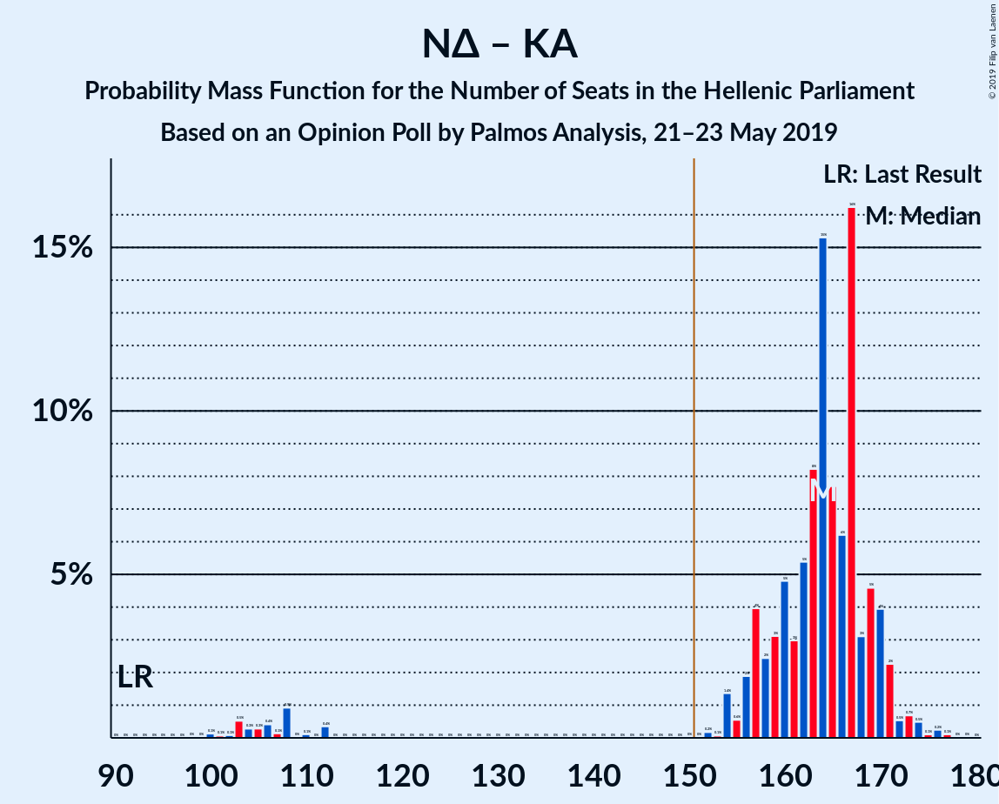

| Number of Seats | Probability | Accumulated | Special Marks |
|:---------------:|:-----------:|:-----------:|:-------------:|
| 92 | 0% | 100% | Last Result |
| 93 | 0% | 100% |  |
| 94 | 0% | 100% |  |
| 95 | 0% | 100% |  |
| 96 | 0% | 100% |  |
| 97 | 0% | 100% |  |
| 98 | 0% | 100% |  |
| 99 | 0% | 100% |  |
| 100 | 0.1% | 99.9% |  |
| 101 | 0.1% | 99.8% |  |
| 102 | 0.1% | 99.7% |  |
| 103 | 0.5% | 99.7% |  |
| 104 | 0.3% | 99.1% |  |
| 105 | 0.3% | 98.9% |  |
| 106 | 0.4% | 98.6% |  |
| 107 | 0.1% | 98% |  |
| 108 | 0.9% | 98% |  |
| 109 | 0% | 97% |  |
| 110 | 0.1% | 97% |  |
| 111 | 0% | 97% |  |
| 112 | 0.4% | 97% |  |
| 113 | 0% | 97% |  |
| 114 | 0% | 97% |  |
| 115 | 0% | 97% |  |
| 116 | 0% | 97% |  |
| 117 | 0% | 97% |  |
| 118 | 0% | 97% |  |
| 119 | 0% | 97% |  |
| 120 | 0% | 97% |  |
| 121 | 0% | 97% |  |
| 122 | 0% | 97% |  |
| 123 | 0% | 97% |  |
| 124 | 0% | 97% |  |
| 125 | 0% | 97% |  |
| 126 | 0% | 97% |  |
| 127 | 0% | 97% |  |
| 128 | 0% | 97% |  |
| 129 | 0% | 97% |  |
| 130 | 0% | 97% |  |
| 131 | 0% | 97% |  |
| 132 | 0% | 97% |  |
| 133 | 0% | 97% |  |
| 134 | 0% | 97% |  |
| 135 | 0% | 97% |  |
| 136 | 0% | 97% |  |
| 137 | 0% | 97% |  |
| 138 | 0% | 97% |  |
| 139 | 0% | 97% |  |
| 140 | 0% | 97% |  |
| 141 | 0% | 97% |  |
| 142 | 0% | 97% |  |
| 143 | 0% | 97% |  |
| 144 | 0% | 97% |  |
| 145 | 0% | 97% |  |
| 146 | 0% | 97% |  |
| 147 | 0% | 97% |  |
| 148 | 0% | 97% |  |
| 149 | 0% | 97% |  |
| 150 | 0% | 97% |  |
| 151 | 0% | 97% | Majority |
| 152 | 0.2% | 97% |  |
| 153 | 0.1% | 96% |  |
| 154 | 1.4% | 96% |  |
| 155 | 0.6% | 95% |  |
| 156 | 2% | 94% |  |
| 157 | 4% | 92% |  |
| 158 | 2% | 89% |  |
| 159 | 3% | 86% |  |
| 160 | 5% | 83% |  |
| 161 | 3% | 78% |  |
| 162 | 5% | 75% |  |
| 163 | 8% | 70% |  |
| 164 | 15% | 62% | Median |
| 165 | 8% | 46% |  |
| 166 | 6% | 39% |  |
| 167 | 16% | 32% |  |
| 168 | 3% | 16% |  |
| 169 | 5% | 13% |  |
| 170 | 4% | 8% |  |
| 171 | 2% | 4% |  |
| 172 | 0.5% | 2% |  |
| 173 | 0.7% | 2% |  |
| 174 | 0.5% | 1.0% |  |
| 175 | 0.1% | 0.5% |  |
| 176 | 0.2% | 0.4% |  |
| 177 | 0.1% | 0.2% |  |
| 178 | 0% | 0.1% |  |
| 179 | 0% | 0% |  |

### Νέα Δημοκρατία – Το Ποτάμι

| Number of Seats | Probability | Accumulated | Special Marks |
|:---------------:|:-----------:|:-----------:|:-------------:|
| 81 | 0% | 100% |  |
| 82 | 0.1% | 99.9% |  |
| 83 | 0.3% | 99.8% |  |
| 84 | 0.1% | 99.5% |  |
| 85 | 0.3% | 99.4% |  |
| 86 | 0.1% | 99.2% | Last Result |
| 87 | 1.2% | 99.1% |  |
| 88 | 0.1% | 98% |  |
| 89 | 0.1% | 98% |  |
| 90 | 0.5% | 98% |  |
| 91 | 0.1% | 97% |  |
| 92 | 0.5% | 97% |  |
| 93 | 0% | 97% |  |
| 94 | 0% | 97% |  |
| 95 | 0% | 97% |  |
| 96 | 0% | 97% |  |
| 97 | 0% | 97% |  |
| 98 | 0% | 97% |  |
| 99 | 0% | 97% |  |
| 100 | 0% | 97% |  |
| 101 | 0% | 97% |  |
| 102 | 0% | 97% |  |
| 103 | 0% | 97% |  |
| 104 | 0% | 97% |  |
| 105 | 0% | 97% |  |
| 106 | 0% | 97% |  |
| 107 | 0% | 97% |  |
| 108 | 0% | 97% |  |
| 109 | 0% | 97% |  |
| 110 | 0% | 97% |  |
| 111 | 0% | 97% |  |
| 112 | 0% | 97% |  |
| 113 | 0% | 97% |  |
| 114 | 0% | 97% |  |
| 115 | 0% | 97% |  |
| 116 | 0% | 97% |  |
| 117 | 0% | 97% |  |
| 118 | 0% | 97% |  |
| 119 | 0% | 97% |  |
| 120 | 0% | 97% |  |
| 121 | 0% | 97% |  |
| 122 | 0% | 97% |  |
| 123 | 0% | 97% |  |
| 124 | 0% | 97% |  |
| 125 | 0% | 97% |  |
| 126 | 0% | 97% |  |
| 127 | 0% | 97% |  |
| 128 | 0% | 97% |  |
| 129 | 0% | 97% |  |
| 130 | 0% | 97% |  |
| 131 | 0% | 97% |  |
| 132 | 0% | 97% |  |
| 133 | 0.1% | 97% |  |
| 134 | 0.7% | 96% |  |
| 135 | 0.6% | 96% |  |
| 136 | 0.7% | 95% |  |
| 137 | 2% | 94% |  |
| 138 | 3% | 92% |  |
| 139 | 4% | 89% |  |
| 140 | 6% | 85% |  |
| 141 | 11% | 79% |  |
| 142 | 15% | 68% | Median |
| 143 | 10% | 53% |  |
| 144 | 17% | 43% |  |
| 145 | 12% | 27% |  |
| 146 | 4% | 15% |  |
| 147 | 3% | 11% |  |
| 148 | 4% | 8% |  |
| 149 | 1.2% | 3% |  |
| 150 | 0.7% | 2% |  |
| 151 | 0.7% | 1.4% | Majority |
| 152 | 0.2% | 0.8% |  |
| 153 | 0.2% | 0.6% |  |
| 154 | 0.1% | 0.3% |  |
| 155 | 0.1% | 0.2% |  |
| 156 | 0.1% | 0.2% |  |
| 157 | 0% | 0.1% |  |
| 158 | 0% | 0.1% |  |
| 159 | 0% | 0% |  |

### Νέα Δημοκρατία

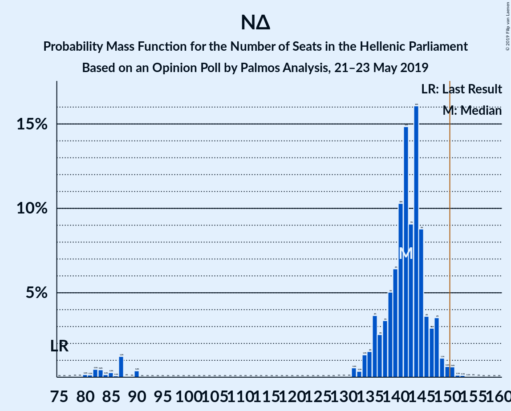

| Number of Seats | Probability | Accumulated | Special Marks |
|:---------------:|:-----------:|:-----------:|:-------------:|
| 75 | 0% | 100% | Last Result |
| 76 | 0% | 100% |  |
| 77 | 0% | 100% |  |
| 78 | 0% | 100% |  |
| 79 | 0% | 100% |  |
| 80 | 0.2% | 100% |  |
| 81 | 0.1% | 99.8% |  |
| 82 | 0.5% | 99.7% |  |
| 83 | 0.4% | 99.2% |  |
| 84 | 0.2% | 98.8% |  |
| 85 | 0.3% | 98.6% |  |
| 86 | 0.1% | 98% |  |
| 87 | 1.2% | 98% |  |
| 88 | 0% | 97% |  |
| 89 | 0% | 97% |  |
| 90 | 0.4% | 97% |  |
| 91 | 0% | 97% |  |
| 92 | 0% | 97% |  |
| 93 | 0% | 97% |  |
| 94 | 0% | 97% |  |
| 95 | 0% | 97% |  |
| 96 | 0% | 97% |  |
| 97 | 0% | 97% |  |
| 98 | 0% | 97% |  |
| 99 | 0% | 97% |  |
| 100 | 0% | 97% |  |
| 101 | 0% | 97% |  |
| 102 | 0% | 97% |  |
| 103 | 0% | 97% |  |
| 104 | 0% | 97% |  |
| 105 | 0% | 97% |  |
| 106 | 0% | 97% |  |
| 107 | 0% | 97% |  |
| 108 | 0% | 97% |  |
| 109 | 0% | 97% |  |
| 110 | 0% | 97% |  |
| 111 | 0% | 97% |  |
| 112 | 0% | 97% |  |
| 113 | 0% | 97% |  |
| 114 | 0% | 97% |  |
| 115 | 0% | 97% |  |
| 116 | 0% | 97% |  |
| 117 | 0% | 97% |  |
| 118 | 0% | 97% |  |
| 119 | 0% | 97% |  |
| 120 | 0% | 97% |  |
| 121 | 0% | 97% |  |
| 122 | 0% | 97% |  |
| 123 | 0% | 97% |  |
| 124 | 0% | 97% |  |
| 125 | 0% | 97% |  |
| 126 | 0% | 97% |  |
| 127 | 0% | 97% |  |
| 128 | 0% | 97% |  |
| 129 | 0% | 97% |  |
| 130 | 0% | 97% |  |
| 131 | 0% | 97% |  |
| 132 | 0.6% | 97% |  |
| 133 | 0.3% | 96% |  |
| 134 | 1.3% | 96% |  |
| 135 | 2% | 94% |  |
| 136 | 4% | 93% |  |
| 137 | 3% | 89% |  |
| 138 | 3% | 87% |  |
| 139 | 5% | 83% |  |
| 140 | 6% | 78% |  |
| 141 | 10% | 72% |  |
| 142 | 15% | 62% | Median |
| 143 | 9% | 47% |  |
| 144 | 16% | 38% |  |
| 145 | 9% | 22% |  |
| 146 | 4% | 13% |  |
| 147 | 3% | 9% |  |
| 148 | 4% | 6% |  |
| 149 | 1.1% | 3% |  |
| 150 | 0.6% | 2% |  |
| 151 | 0.6% | 1.0% | Majority |
| 152 | 0.1% | 0.3% |  |
| 153 | 0.1% | 0.2% |  |
| 154 | 0.1% | 0.1% |  |
| 155 | 0% | 0.1% |  |
| 156 | 0% | 0% |  |

### Συνασπισμός Ριζοσπαστικής Αριστεράς – Λαϊκή Ενότητα – Ανεξάρτητοι Έλληνες

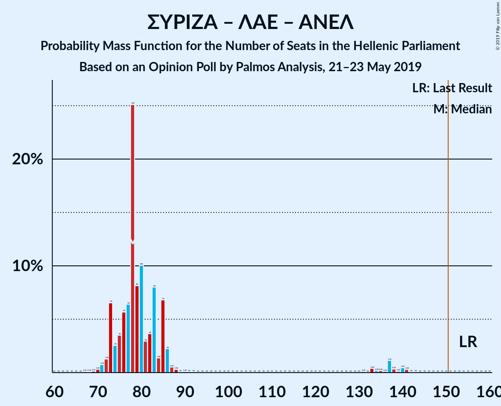

| Number of Seats | Probability | Accumulated | Special Marks |
|:---------------:|:-----------:|:-----------:|:-------------:|
| 67 | 0.1% | 100% |  |
| 68 | 0.1% | 99.9% |  |
| 69 | 0.1% | 99.8% |  |
| 70 | 0.3% | 99.7% |  |
| 71 | 0.7% | 99.4% |  |
| 72 | 1.3% | 98.6% |  |
| 73 | 7% | 97% |  |
| 74 | 3% | 91% |  |
| 75 | 4% | 88% |  |
| 76 | 6% | 85% |  |
| 77 | 6% | 79% |  |
| 78 | 25% | 73% | Median |
| 79 | 8% | 48% |  |
| 80 | 10% | 39% |  |
| 81 | 3% | 29% |  |
| 82 | 4% | 26% |  |
| 83 | 8% | 23% |  |
| 84 | 1.4% | 15% |  |
| 85 | 7% | 13% |  |
| 86 | 2% | 7% |  |
| 87 | 0.5% | 4% |  |
| 88 | 0.3% | 4% |  |
| 89 | 0% | 4% |  |
| 90 | 0.1% | 4% |  |
| 91 | 0% | 3% |  |
| 92 | 0% | 3% |  |
| 93 | 0% | 3% |  |
| 94 | 0% | 3% |  |
| 95 | 0% | 3% |  |
| 96 | 0% | 3% |  |
| 97 | 0% | 3% |  |
| 98 | 0% | 3% |  |
| 99 | 0% | 3% |  |
| 100 | 0% | 3% |  |
| 101 | 0% | 3% |  |
| 102 | 0% | 3% |  |
| 103 | 0% | 3% |  |
| 104 | 0% | 3% |  |
| 105 | 0% | 3% |  |
| 106 | 0% | 3% |  |
| 107 | 0% | 3% |  |
| 108 | 0% | 3% |  |
| 109 | 0% | 3% |  |
| 110 | 0% | 3% |  |
| 111 | 0% | 3% |  |
| 112 | 0% | 3% |  |
| 113 | 0% | 3% |  |
| 114 | 0% | 3% |  |
| 115 | 0% | 3% |  |
| 116 | 0% | 3% |  |
| 117 | 0% | 3% |  |
| 118 | 0% | 3% |  |
| 119 | 0% | 3% |  |
| 120 | 0% | 3% |  |
| 121 | 0% | 3% |  |
| 122 | 0% | 3% |  |
| 123 | 0% | 3% |  |
| 124 | 0% | 3% |  |
| 125 | 0% | 3% |  |
| 126 | 0% | 3% |  |
| 127 | 0% | 3% |  |
| 128 | 0% | 3% |  |
| 129 | 0% | 3% |  |
| 130 | 0% | 3% |  |
| 131 | 0.1% | 3% |  |
| 132 | 0% | 3% |  |
| 133 | 0.4% | 3% |  |
| 134 | 0.2% | 3% |  |
| 135 | 0.2% | 3% |  |
| 136 | 0.1% | 3% |  |
| 137 | 1.1% | 2% |  |
| 138 | 0.3% | 1.3% |  |
| 139 | 0.1% | 0.9% |  |
| 140 | 0.5% | 0.8% |  |
| 141 | 0.3% | 0.4% |  |
| 142 | 0% | 0.1% |  |
| 143 | 0% | 0.1% |  |
| 144 | 0% | 0% |  |
| 145 | 0% | 0% |  |
| 146 | 0% | 0% |  |
| 147 | 0% | 0% |  |
| 148 | 0% | 0% |  |
| 149 | 0% | 0% |  |
| 150 | 0% | 0% |  |
| 151 | 0% | 0% | Majority |
| 152 | 0% | 0% |  |
| 153 | 0% | 0% |  |
| 154 | 0% | 0% |  |
| 155 | 0% | 0% | Last Result |

### Συνασπισμός Ριζοσπαστικής Αριστεράς – Ανεξάρτητοι Έλληνες

| Number of Seats | Probability | Accumulated | Special Marks |
|:---------------:|:-----------:|:-----------:|:-------------:|
| 67 | 0.1% | 100% |  |
| 68 | 0.1% | 99.9% |  |
| 69 | 0.1% | 99.8% |  |
| 70 | 0.3% | 99.7% |  |
| 71 | 0.7% | 99.4% |  |
| 72 | 1.3% | 98.6% |  |
| 73 | 7% | 97% |  |
| 74 | 3% | 91% |  |
| 75 | 4% | 88% |  |
| 76 | 6% | 85% |  |
| 77 | 6% | 79% |  |
| 78 | 25% | 73% | Median |
| 79 | 8% | 48% |  |
| 80 | 10% | 39% |  |
| 81 | 3% | 29% |  |
| 82 | 4% | 26% |  |
| 83 | 8% | 23% |  |
| 84 | 1.4% | 15% |  |
| 85 | 7% | 13% |  |
| 86 | 2% | 7% |  |
| 87 | 0.5% | 4% |  |
| 88 | 0.3% | 4% |  |
| 89 | 0% | 4% |  |
| 90 | 0.1% | 4% |  |
| 91 | 0% | 3% |  |
| 92 | 0% | 3% |  |
| 93 | 0% | 3% |  |
| 94 | 0% | 3% |  |
| 95 | 0% | 3% |  |
| 96 | 0% | 3% |  |
| 97 | 0% | 3% |  |
| 98 | 0% | 3% |  |
| 99 | 0% | 3% |  |
| 100 | 0% | 3% |  |
| 101 | 0% | 3% |  |
| 102 | 0% | 3% |  |
| 103 | 0% | 3% |  |
| 104 | 0% | 3% |  |
| 105 | 0% | 3% |  |
| 106 | 0% | 3% |  |
| 107 | 0% | 3% |  |
| 108 | 0% | 3% |  |
| 109 | 0% | 3% |  |
| 110 | 0% | 3% |  |
| 111 | 0% | 3% |  |
| 112 | 0% | 3% |  |
| 113 | 0% | 3% |  |
| 114 | 0% | 3% |  |
| 115 | 0% | 3% |  |
| 116 | 0% | 3% |  |
| 117 | 0% | 3% |  |
| 118 | 0% | 3% |  |
| 119 | 0% | 3% |  |
| 120 | 0% | 3% |  |
| 121 | 0% | 3% |  |
| 122 | 0% | 3% |  |
| 123 | 0% | 3% |  |
| 124 | 0% | 3% |  |
| 125 | 0% | 3% |  |
| 126 | 0% | 3% |  |
| 127 | 0% | 3% |  |
| 128 | 0% | 3% |  |
| 129 | 0% | 3% |  |
| 130 | 0% | 3% |  |
| 131 | 0.1% | 3% |  |
| 132 | 0% | 3% |  |
| 133 | 0.4% | 3% |  |
| 134 | 0.2% | 3% |  |
| 135 | 0.2% | 3% |  |
| 136 | 0.1% | 3% |  |
| 137 | 1.1% | 2% |  |
| 138 | 0.3% | 1.3% |  |
| 139 | 0.1% | 0.9% |  |
| 140 | 0.5% | 0.8% |  |
| 141 | 0.3% | 0.4% |  |
| 142 | 0% | 0.1% |  |
| 143 | 0% | 0.1% |  |
| 144 | 0% | 0% |  |
| 145 | 0% | 0% |  |
| 146 | 0% | 0% |  |
| 147 | 0% | 0% |  |
| 148 | 0% | 0% |  |
| 149 | 0% | 0% |  |
| 150 | 0% | 0% |  |
| 151 | 0% | 0% | Majority |
| 152 | 0% | 0% |  |
| 153 | 0% | 0% |  |
| 154 | 0% | 0% |  |
| 155 | 0% | 0% | Last Result |

### Συνασπισμός Ριζοσπαστικής Αριστεράς – Λαϊκή Ενότητα

| Number of Seats | Probability | Accumulated | Special Marks |
|:---------------:|:-----------:|:-----------:|:-------------:|
| 67 | 0.1% | 100% |  |
| 68 | 0.1% | 99.9% |  |
| 69 | 0.1% | 99.8% |  |
| 70 | 0.3% | 99.7% |  |
| 71 | 0.7% | 99.4% |  |
| 72 | 1.3% | 98.6% |  |
| 73 | 7% | 97% |  |
| 74 | 3% | 91% |  |
| 75 | 4% | 88% |  |
| 76 | 6% | 85% |  |
| 77 | 6% | 79% |  |
| 78 | 25% | 73% | Median |
| 79 | 8% | 48% |  |
| 80 | 10% | 39% |  |
| 81 | 3% | 29% |  |
| 82 | 4% | 26% |  |
| 83 | 8% | 23% |  |
| 84 | 1.4% | 15% |  |
| 85 | 7% | 13% |  |
| 86 | 2% | 7% |  |
| 87 | 0.5% | 4% |  |
| 88 | 0.3% | 4% |  |
| 89 | 0% | 4% |  |
| 90 | 0.1% | 4% |  |
| 91 | 0% | 3% |  |
| 92 | 0% | 3% |  |
| 93 | 0% | 3% |  |
| 94 | 0% | 3% |  |
| 95 | 0% | 3% |  |
| 96 | 0% | 3% |  |
| 97 | 0% | 3% |  |
| 98 | 0% | 3% |  |
| 99 | 0% | 3% |  |
| 100 | 0% | 3% |  |
| 101 | 0% | 3% |  |
| 102 | 0% | 3% |  |
| 103 | 0% | 3% |  |
| 104 | 0% | 3% |  |
| 105 | 0% | 3% |  |
| 106 | 0% | 3% |  |
| 107 | 0% | 3% |  |
| 108 | 0% | 3% |  |
| 109 | 0% | 3% |  |
| 110 | 0% | 3% |  |
| 111 | 0% | 3% |  |
| 112 | 0% | 3% |  |
| 113 | 0% | 3% |  |
| 114 | 0% | 3% |  |
| 115 | 0% | 3% |  |
| 116 | 0% | 3% |  |
| 117 | 0% | 3% |  |
| 118 | 0% | 3% |  |
| 119 | 0% | 3% |  |
| 120 | 0% | 3% |  |
| 121 | 0% | 3% |  |
| 122 | 0% | 3% |  |
| 123 | 0% | 3% |  |
| 124 | 0% | 3% |  |
| 125 | 0% | 3% |  |
| 126 | 0% | 3% |  |
| 127 | 0% | 3% |  |
| 128 | 0% | 3% |  |
| 129 | 0% | 3% |  |
| 130 | 0% | 3% |  |
| 131 | 0.1% | 3% |  |
| 132 | 0% | 3% |  |
| 133 | 0.4% | 3% |  |
| 134 | 0.2% | 3% |  |
| 135 | 0.2% | 3% |  |
| 136 | 0.1% | 3% |  |
| 137 | 1.1% | 2% |  |
| 138 | 0.3% | 1.3% |  |
| 139 | 0.1% | 0.9% |  |
| 140 | 0.5% | 0.8% |  |
| 141 | 0.3% | 0.4% |  |
| 142 | 0% | 0.1% |  |
| 143 | 0% | 0.1% |  |
| 144 | 0% | 0% |  |
| 145 | 0% | 0% | Last Result |

### Συνασπισμός Ριζοσπαστικής Αριστεράς

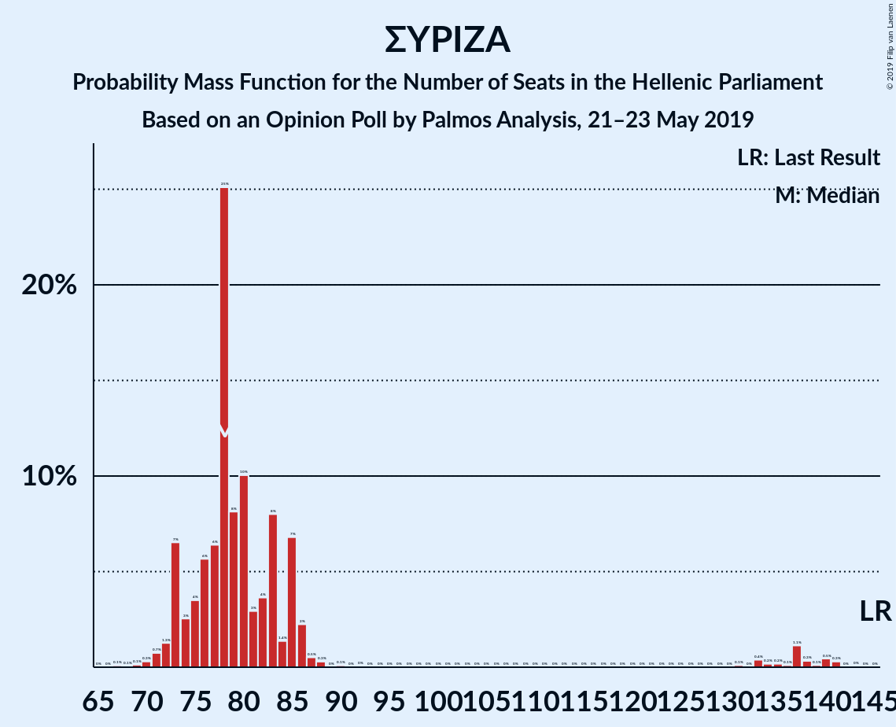

| Number of Seats | Probability | Accumulated | Special Marks |
|:---------------:|:-----------:|:-----------:|:-------------:|
| 67 | 0.1% | 100% |  |
| 68 | 0.1% | 99.9% |  |
| 69 | 0.1% | 99.8% |  |
| 70 | 0.3% | 99.7% |  |
| 71 | 0.7% | 99.4% |  |
| 72 | 1.3% | 98.6% |  |
| 73 | 7% | 97% |  |
| 74 | 3% | 91% |  |
| 75 | 4% | 88% |  |
| 76 | 6% | 85% |  |
| 77 | 6% | 79% |  |
| 78 | 25% | 73% | Median |
| 79 | 8% | 48% |  |
| 80 | 10% | 39% |  |
| 81 | 3% | 29% |  |
| 82 | 4% | 26% |  |
| 83 | 8% | 23% |  |
| 84 | 1.4% | 15% |  |
| 85 | 7% | 13% |  |
| 86 | 2% | 7% |  |
| 87 | 0.5% | 4% |  |
| 88 | 0.3% | 4% |  |
| 89 | 0% | 4% |  |
| 90 | 0.1% | 4% |  |
| 91 | 0% | 3% |  |
| 92 | 0% | 3% |  |
| 93 | 0% | 3% |  |
| 94 | 0% | 3% |  |
| 95 | 0% | 3% |  |
| 96 | 0% | 3% |  |
| 97 | 0% | 3% |  |
| 98 | 0% | 3% |  |
| 99 | 0% | 3% |  |
| 100 | 0% | 3% |  |
| 101 | 0% | 3% |  |
| 102 | 0% | 3% |  |
| 103 | 0% | 3% |  |
| 104 | 0% | 3% |  |
| 105 | 0% | 3% |  |
| 106 | 0% | 3% |  |
| 107 | 0% | 3% |  |
| 108 | 0% | 3% |  |
| 109 | 0% | 3% |  |
| 110 | 0% | 3% |  |
| 111 | 0% | 3% |  |
| 112 | 0% | 3% |  |
| 113 | 0% | 3% |  |
| 114 | 0% | 3% |  |
| 115 | 0% | 3% |  |
| 116 | 0% | 3% |  |
| 117 | 0% | 3% |  |
| 118 | 0% | 3% |  |
| 119 | 0% | 3% |  |
| 120 | 0% | 3% |  |
| 121 | 0% | 3% |  |
| 122 | 0% | 3% |  |
| 123 | 0% | 3% |  |
| 124 | 0% | 3% |  |
| 125 | 0% | 3% |  |
| 126 | 0% | 3% |  |
| 127 | 0% | 3% |  |
| 128 | 0% | 3% |  |
| 129 | 0% | 3% |  |
| 130 | 0% | 3% |  |
| 131 | 0.1% | 3% |  |
| 132 | 0% | 3% |  |
| 133 | 0.4% | 3% |  |
| 134 | 0.2% | 3% |  |
| 135 | 0.2% | 3% |  |
| 136 | 0.1% | 3% |  |
| 137 | 1.1% | 2% |  |
| 138 | 0.3% | 1.3% |  |
| 139 | 0.1% | 0.9% |  |
| 140 | 0.5% | 0.8% |  |
| 141 | 0.3% | 0.4% |  |
| 142 | 0% | 0.1% |  |
| 143 | 0% | 0.1% |  |
| 144 | 0% | 0% |  |
| 145 | 0% | 0% | Last Result |

## Technical Information

### Opinion Poll

+ **Polling firm:** Palmos Analysis
+ **Commissioner(s):** —
+ **Fieldwork period:** 21–23 May 2019

### Calculations

+ **Sample size:** 1033
+ **Simulations done:** 1,048,576
+ **Error estimate:** 1.33%

