# Poll Average

<a href="#voting-intentions">Voting Intentions</a> | <a href="#seats">Seats</a> | <a href="#coalitions">Coalitions</a> | <a href="#technical-information">Technical Information</a>

## Summary

The table below lists the polls on which the average is based. They are the most recent polls (less than 90 days old) registered and analyzed so far.

| Period     | Polling firm/Commissioner(s) | ΣΥΡΙΖΑ | ΝΔ | ΧΑ | ΚΑ | ΚΚΕ | Ποτάμι | ΑΝΕΛ | ΕΚ | ΛΑΕ | ΠΕ | ΕΛ | ΜέΡΑ25 |
|:----------:|:----------------------------:|:--:|:--:|:--:|:--:|:--:|:--:|:--:|:--:|:--:|:--:|:--:|:--:|
| 20 September 2015 | General Election | 35.5%   145 | 28.1%   75 | 7.0%   18 | 6.3%   17 | 5.6%   15 | 4.1%   11 | 3.7%   10 | 3.4%   9 | 2.9%   0 | 0.0%   0 | 0.0%   0 | 0.0%   0 |
| N/A | Poll Average | 24–31%   69–87 | 35–44%   150–174 | 2–5%   0–15 | 6–10%   16–27 | 4–7%   11–20 | N/A   N/A | N/A   N/A | 1–3%   0 | N/A   N/A | 1–3%   0 | 2–5%   0–14 | 2–5%   0–14 |
| [1–5 July 2019](2019-07-05-ΚάπαResearch.html) | Κάπα Research   ΕΘΝΟΣ | 26–31%   71–86 | 37–43%   153–171 | 3–5%   0–14 | 6–9%   17–25 | 4–7%   12–19 | N/A   N/A | N/A   N/A | 1–2%   0 | N/A   N/A | 1–2%   0 | 2–4%   0–11 | 3–5%   0–13 |
| [1–5 July 2019](2019-07-05-MetronAnalysis.html) | Metron Analysis | 26–30%   70–83 | 38–43%   151–167 | 4–6%   10–15 | 6–9%   18–25 | 4–7%   12–19 | N/A   N/A | N/A   N/A | 1–2%   0 | N/A   N/A | N/A   N/A | 2–4%   0–11 | 3–5%   8–14 |
| [1–4 July 2019](2019-07-04-RASS.html) | RASS   Action24 | 25–31%   70–90 | 36–42%   153–176 | 2–4%   0–11 | 7–10%   19–29 | 5–8%   13–22 | N/A   N/A | N/A   N/A | 1–3%   0–8 | N/A   N/A | 1–3%   0 | 2–4%   0–13 | 2–4%   0–12 |
| [2–4 July 2019](2019-07-04-Marc.html) | Marc   ANT1 | 25–30%   70–84 | 36–41%   150–166 | 3–5%   0–13 | 6–8%   16–24 | 4–7%   12–19 | N/A   N/A | N/A   N/A | 1–2%   0 | N/A   N/A | 1–3%   0 | 3–5%   0–14 | 3–5%   0–13 |
| [1–4 July 2019](2019-07-04-MRB.html) | MRB   Star | 26–31%   70–85 | 36–42%   147–163 | 3–5%   0–14 | 6–9%   18–26 | 5–7%   12–20 | N/A   N/A | N/A   N/A | 2–3%   0–9 | N/A   N/A | 1–3%   0 | 3–5%   0–12 | 3–5%   0–15 |
| [2–3 July 2019](2019-07-03-PulseRC.html) | Pulse RC   ΣΚΑΪ | 28–33%   75–91 | 36–42%   148–165 | 3–6%   9–15 | 6–9%   17–25 | 4–7%   12–19 | N/A   N/A | N/A   N/A | 1–2%   0 | N/A   N/A | 1–2%   0 | 2–4%   0–12 | 2–4%   0–12 |
| [18 June–3 July 2019](2019-07-03-PublicIssue.html) | Public Issue | 24–30%   67–84 | 39–46%   157–180 | 3–5%   0–13 | 6–10%   18–27 | 4–7%   12–20 | N/A   N/A | N/A   N/A | 1–3%   0–8 | N/A   N/A | N/A   N/A | 2–4%   0–12 | 2–4%   0–12 |
| [1–3 July 2019](2019-07-03-Interview.html) | Interview   Βεργίνα TV | 22–28%   68–85 | 33–39%   149–168 | 3–6%   10–17 | 6–9%   17–27 | 4–7%   12–21 | N/A   N/A | N/A   N/A | 1–3%   0 | N/A   N/A | N/A   N/A | 3–5%   0–16 | 2–4%   0–10 |
| [28 June–2 July 2019](2019-07-02-Alco.html) | Alco   Open TV | 25–31%   70–86 | 36–42%   150–169 | 3–6%   0–15 | 6–10%   18–27 | 4–6%   10–18 | N/A   N/A | N/A   N/A | 1–3%   0 | N/A   N/A | 1–2%   0 | 3–5%   0–14 | 2–4%   0–12 |
| [28 June–1 July 2019](2019-07-01-Prorata.html) | Prorata | 24–29%   68–86 | 37–43%   154–176 | 3–5%   0–14 | 6–9%   16–26 | 4–7%   12–21 | N/A   N/A | N/A   N/A | N/A   N/A | N/A   N/A | N/A   N/A | 2–4%   0–12 | 2–4%   0–13 |
| [17–19 June 2019](2019-06-19-OpinionPoll.html) | Opinion Poll | 24–30%   69–85 | 37–43%   153–172 | 2–5%   0–13 | 5–8%   15–23 | 3–6%   10–18 | N/A   N/A | N/A   N/A | 1–2%   0 | N/A   N/A | 2–3%   0–9 | 3–5%   0–14 | 3–6%   8–15 |
| 20 September 2015 | General Election | 35.5%   145 | 28.1%   75 | 7.0%   18 | 6.3%   17 | 5.6%   15 | 4.1%   11 | 3.7%   10 | 3.4%   9 | 2.9%   0 | 0.0%   0 | 0.0%   0 | 0.0%   0 |

Only polls for which at least the sample size has been published are included in the table above.

**Legend:**
+ **Top half of each row:** Voting intentions (95% confidence interval)
+ **Bottom half of each row:** Seat projections for the Hellenic Parliament (95% confidence interval)
+ **ΣΥΡΙΖΑ:** Συνασπισμός Ριζοσπαστικής Αριστεράς
+ **ΝΔ:** Νέα Δημοκρατία
+ **ΧΑ:** Χρυσή Αυγή
+ **ΚΑ:** Κίνημα Αλλαγής
+ **ΚΚΕ:** Κομμουνιστικό Κόμμα Ελλάδας
+ **Ποτάμι:** Το Ποτάμι
+ **ΑΝΕΛ:** Ανεξάρτητοι Έλληνες
+ **ΕΚ:** Ένωση Κεντρώων
+ **ΛΑΕ:** Λαϊκή Ενότητα
+ **ΠΕ:** Πλεύση Ελευθερίας
+ **ΕΛ:** Ελληνική Λύση
+ **ΜέΡΑ25:** Μέτωπο Ευρωπαϊκής Ρεαλιστικής Ανυπακοής
+ **N/A (single party):** Party not included the published results
+ **N/A (entire row):** Calculation for this opinion poll not started yet

## Voting Intentions

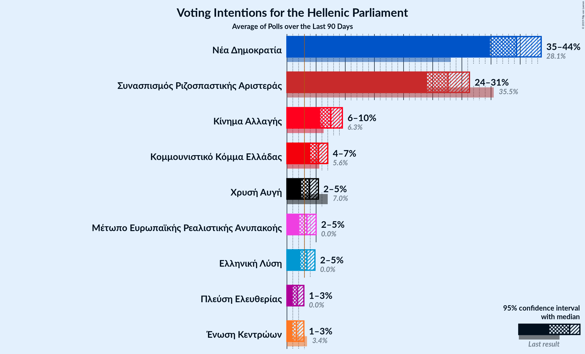

### Confidence Intervals

| Party | Last Result | Median | 80% Confidence Interval | 90% Confidence Interval | 95% Confidence Interval | 99% Confidence Interval |
|:-----:|:-----------:|:------:|:-----------------------:|:-----------------------:|:-----------------------:|:-----------------------:|
| <a href="#συνασπισμός-ριζοσπαστικής-αριστεράς">Συνασπισμός Ριζοσπαστικής Αριστεράς</a> | 35.5% | 27.6% | 25.3–29.9% |24.6–30.6% | 24.0–31.3% | 22.9–32.5% |
| <a href="#νέα-δημοκρατία">Νέα Δημοκρατία</a> | 28.1% | 39.4% | 36.7–41.9% |35.7–42.8% | 34.8–43.6% | 33.4–45.0% |
| <a href="#χρυσή-αυγή">Χρυσή Αυγή</a> | 7.0% | 3.9% | 2.9–4.8% |2.6–5.1% | 2.4–5.4% | 2.0–5.8% |
| <a href="#κίνημα-αλλαγής">Κίνημα Αλλαγής</a> | 6.3% | 7.5% | 6.3–8.8% |6.0–9.1% | 5.7–9.5% | 5.2–10.1% |
| <a href="#κομμουνιστικό-κόμμα-ελλάδας">Κομμουνιστικό Κόμμα Ελλάδας</a> | 5.6% | 5.4% | 4.5–6.4% |4.2–6.7% | 4.0–7.0% | 3.6–7.5% |
| <a href="#το-ποτάμι">Το Ποτάμι</a> | 4.1% | N/A | N/A |N/A | N/A | N/A |
| <a href="#ανεξάρτητοι-έλληνες">Ανεξάρτητοι Έλληνες</a> | 3.7% | N/A | N/A |N/A | N/A | N/A |
| <a href="#ένωση-κεντρώων">Ένωση Κεντρώων</a> | 3.4% | 1.7% | 1.1–2.5% |1.0–2.7% | 0.9–2.9% | 0.7–3.4% |
| <a href="#λαϊκή-ενότητα">Λαϊκή Ενότητα</a> | 2.9% | N/A | N/A |N/A | N/A | N/A |
| <a href="#πλεύση-ελευθερίας">Πλεύση Ελευθερίας</a> | 0.0% | 1.8% | 1.3–2.5% |1.2–2.7% | 1.0–2.9% | 0.9–3.4% |
| <a href="#ελληνική-λύση">Ελληνική Λύση</a> | 0.0% | 3.4% | 2.7–4.3% |2.5–4.6% | 2.3–4.8% | 2.1–5.3% |
| <a href="#μέτωπο-ευρωπαϊκής-ρεαλιστικής-ανυπακοής">Μέτωπο Ευρωπαϊκής Ρεαλιστικής Ανυπακοής</a> | 0.0% | 3.4% | 2.5–4.4% |2.3–4.7% | 2.1–5.0% | 1.7–5.5% |

### Συνασπισμός Ριζοσπαστικής Αριστεράς

*For a full overview of the results for this party, see the [Συνασπισμός Ριζοσπαστικής Αριστεράς](party-συνασπισμόςριζοσπαστικήςαριστεράς.html) page.*

| Voting Intentions | Probability | Accumulated | Special Marks |
|:-----------------:|:-----------:|:-----------:|:-------------:|
| 20.5–21.5% | 0% | 100% |  |
| 21.5–22.5% | 0.2% | 100% |  |
| 22.5–23.5% | 1.1% | 99.7% |  |
| 23.5–24.5% | 3% | 98.6% |  |
| 24.5–25.5% | 8% | 95% |  |
| 25.5–26.5% | 15% | 88% |  |
| 26.5–27.5% | 22% | 73% |  |
| 27.5–28.5% | 22% | 51% | Median |
| 28.5–29.5% | 16% | 29% |  |
| 29.5–30.5% | 8% | 14% |  |
| 30.5–31.5% | 4% | 5% |  |
| 31.5–32.5% | 1.4% | 2% |  |
| 32.5–33.5% | 0.4% | 0.4% |  |
| 33.5–34.5% | 0.1% | 0.1% |  |
| 34.5–35.5% | 0% | 0% | Last Result |

### Νέα Δημοκρατία

*For a full overview of the results for this party, see the [Νέα Δημοκρατία](party-νέαδημοκρατία.html) page.*

| Voting Intentions | Probability | Accumulated | Special Marks |
|:-----------------:|:-----------:|:-----------:|:-------------:|
| 27.5–28.5% | 0% | 100% | Last Result |
| 28.5–29.5% | 0% | 100% |  |
| 29.5–30.5% | 0% | 100% |  |
| 30.5–31.5% | 0% | 100% |  |
| 31.5–32.5% | 0.1% | 100% |  |
| 32.5–33.5% | 0.5% | 99.9% |  |
| 33.5–34.5% | 1.4% | 99.3% |  |
| 34.5–35.5% | 3% | 98% |  |
| 35.5–36.5% | 4% | 95% |  |
| 36.5–37.5% | 9% | 91% |  |
| 37.5–38.5% | 15% | 83% |  |
| 38.5–39.5% | 21% | 67% | Median |
| 39.5–40.5% | 20% | 46% |  |
| 40.5–41.5% | 13% | 26% |  |
| 41.5–42.5% | 7% | 13% |  |
| 42.5–43.5% | 3% | 6% |  |
| 43.5–44.5% | 2% | 3% |  |
| 44.5–45.5% | 0.6% | 0.9% |  |
| 45.5–46.5% | 0.2% | 0.2% |  |
| 46.5–47.5% | 0% | 0% |  |

### Χρυσή Αυγή

*For a full overview of the results for this party, see the [Χρυσή Αυγή](party-χρυσήαυγή.html) page.*

| Voting Intentions | Probability | Accumulated | Special Marks |
|:-----------------:|:-----------:|:-----------:|:-------------:|
| 0.5–1.5% | 0% | 100% |  |
| 1.5–2.5% | 4% | 100% |  |
| 2.5–3.5% | 30% | 96% |  |
| 3.5–4.5% | 48% | 66% | Median |
| 4.5–5.5% | 17% | 18% |  |
| 5.5–6.5% | 1.3% | 1.4% |  |
| 6.5–7.5% | 0% | 0% | Last Result |

### Κίνημα Αλλαγής

*For a full overview of the results for this party, see the [Κίνημα Αλλαγής](party-κίνημααλλαγής.html) page.*

| Voting Intentions | Probability | Accumulated | Special Marks |
|:-----------------:|:-----------:|:-----------:|:-------------:|
| 3.5–4.5% | 0% | 100% |  |
| 4.5–5.5% | 1.4% | 100% |  |
| 5.5–6.5% | 13% | 98.5% | Last Result |
| 6.5–7.5% | 36% | 86% |  |
| 7.5–8.5% | 35% | 50% | Median |
| 8.5–9.5% | 12% | 14% |  |
| 9.5–10.5% | 2% | 2% |  |
| 10.5–11.5% | 0.1% | 0.1% |  |
| 11.5–12.5% | 0% | 0% |  |

### Κομμουνιστικό Κόμμα Ελλάδας

*For a full overview of the results for this party, see the [Κομμουνιστικό Κόμμα Ελλάδας](party-κομμουνιστικόκόμμαελλάδας.html) page.*

| Voting Intentions | Probability | Accumulated | Special Marks |
|:-----------------:|:-----------:|:-----------:|:-------------:|
| 1.5–2.5% | 0% | 100% |  |
| 2.5–3.5% | 0.5% | 100% |  |
| 3.5–4.5% | 11% | 99.5% |  |
| 4.5–5.5% | 44% | 89% | Median |
| 5.5–6.5% | 37% | 45% | Last Result |
| 6.5–7.5% | 7% | 8% |  |
| 7.5–8.5% | 0.5% | 0.5% |  |
| 8.5–9.5% | 0% | 0% |  |

### Ένωση Κεντρώων

*For a full overview of the results for this party, see the [Ένωση Κεντρώων](party-ένωσηκεντρώων.html) page.*

| Voting Intentions | Probability | Accumulated | Special Marks |
|:-----------------:|:-----------:|:-----------:|:-------------:|
| 0.0–0.5% | 0.1% | 100% |  |
| 0.5–1.5% | 40% | 99.9% |  |
| 1.5–2.5% | 52% | 60% | Median |
| 2.5–3.5% | 8% | 8% | Last Result |
| 3.5–4.5% | 0.2% | 0.2% |  |
| 4.5–5.5% | 0% | 0% |  |

### Πλεύση Ελευθερίας

*For a full overview of the results for this party, see the [Πλεύση Ελευθερίας](party-πλεύσηελευθερίας.html) page.*

| Voting Intentions | Probability | Accumulated | Special Marks |
|:-----------------:|:-----------:|:-----------:|:-------------:|
| 0.0–0.5% | 0% | 100% | Last Result |
| 0.5–1.5% | 30% | 100% |  |
| 1.5–2.5% | 62% | 70% | Median |
| 2.5–3.5% | 8% | 8% |  |
| 3.5–4.5% | 0.2% | 0.2% |  |
| 4.5–5.5% | 0% | 0% |  |

### Ελληνική Λύση

*For a full overview of the results for this party, see the [Ελληνική Λύση](party-ελληνικήλύση.html) page.*

| Voting Intentions | Probability | Accumulated | Special Marks |
|:-----------------:|:-----------:|:-----------:|:-------------:|
| 0.0–0.5% | 0% | 100% | Last Result |
| 0.5–1.5% | 0% | 100% |  |
| 1.5–2.5% | 6% | 100% |  |
| 2.5–3.5% | 52% | 94% | Median |
| 3.5–4.5% | 36% | 42% |  |
| 4.5–5.5% | 5% | 5% |  |
| 5.5–6.5% | 0.2% | 0.2% |  |
| 6.5–7.5% | 0% | 0% |  |

### Μέτωπο Ευρωπαϊκής Ρεαλιστικής Ανυπακοής

*For a full overview of the results for this party, see the [Μέτωπο Ευρωπαϊκής Ρεαλιστικής Ανυπακοής](party-μέτωποευρωπαϊκήςρεαλιστικήςανυπακοής.html) page.*

| Voting Intentions | Probability | Accumulated | Special Marks |
|:-----------------:|:-----------:|:-----------:|:-------------:|
| 0.0–0.5% | 0% | 100% | Last Result |
| 0.5–1.5% | 0.2% | 100% |  |
| 1.5–2.5% | 11% | 99.8% |  |
| 2.5–3.5% | 45% | 89% | Median |
| 3.5–4.5% | 36% | 44% |  |
| 4.5–5.5% | 7% | 7% |  |
| 5.5–6.5% | 0.4% | 0.4% |  |
| 6.5–7.5% | 0% | 0% |  |

## Seats

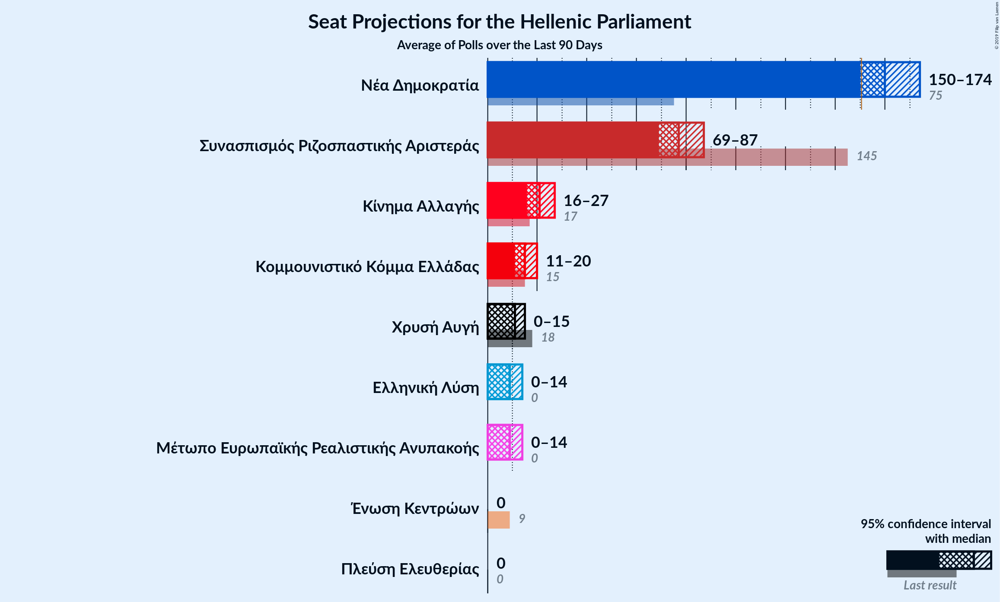

### Confidence Intervals

| Party | Last Result | Median | 80% Confidence Interval | 90% Confidence Interval | 95% Confidence Interval | 99% Confidence Interval |
|:-----:|:-----------:|:------:|:-----------------------:|:-----------------------:|:-----------------------:|:-----------------------:|
| <a href="#συνασπισμός-ριζοσπαστικής-αριστεράς">Συνασπισμός Ριζοσπαστικής Αριστεράς</a> | 145 | 77 | 72–84 |70–85 | 69–87 | 67–90 |
| <a href="#νέα-δημοκρατία">Νέα Δημοκρατία</a> | 75 | 160 | 153–169 |151–172 | 150–174 | 147–179 |
| <a href="#χρυσή-αυγή">Χρυσή Αυγή</a> | 18 | 11 | 0–14 |0–14 | 0–15 | 0–17 |
| <a href="#κίνημα-αλλαγής">Κίνημα Αλλαγής</a> | 17 | 21 | 18–25 |17–26 | 16–27 | 15–29 |
| <a href="#κομμουνιστικό-κόμμα-ελλάδας">Κομμουνιστικό Κόμμα Ελλάδας</a> | 15 | 15 | 13–18 |12–19 | 11–20 | 10–22 |
| <a href="#το-ποτάμι">Το Ποτάμι</a> | 11 | N/A | N/A |N/A | N/A | N/A |
| <a href="#ανεξάρτητοι-έλληνες">Ανεξάρτητοι Έλληνες</a> | 10 | N/A | N/A |N/A | N/A | N/A |
| <a href="#ένωση-κεντρώων">Ένωση Κεντρώων</a> | 9 | 0 | 0 |0 | 0 | 0–9 |
| <a href="#λαϊκή-ενότητα">Λαϊκή Ενότητα</a> | 0 | N/A | N/A |N/A | N/A | N/A |
| <a href="#πλεύση-ελευθερίας">Πλεύση Ελευθερίας</a> | 0 | 0 | 0 |0 | 0 | 0–9 |
| <a href="#ελληνική-λύση">Ελληνική Λύση</a> | 0 | 9 | 0–12 |0–13 | 0–14 | 0–16 |
| <a href="#μέτωπο-ευρωπαϊκής-ρεαλιστικής-ανυπακοής">Μέτωπο Ευρωπαϊκής Ρεαλιστικής Ανυπακοής</a> | 0 | 9 | 0–12 |0–13 | 0–14 | 0–15 |

### Συνασπισμός Ριζοσπαστικής Αριστεράς

*For a full overview of the results for this party, see the [Συνασπισμός Ριζοσπαστικής Αριστεράς](party-συνασπισμόςριζοσπαστικήςαριστεράς.html) page.*

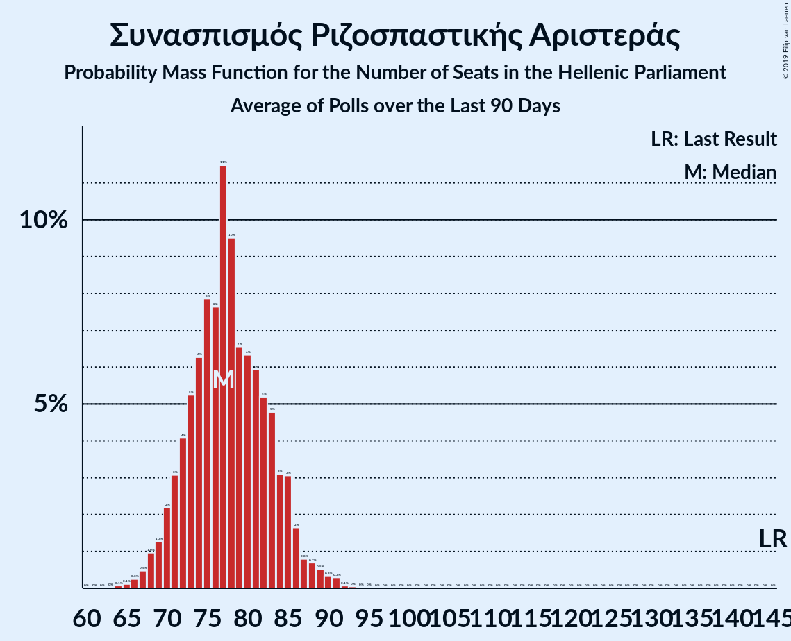

| Number of Seats | Probability | Accumulated | Special Marks |
|:---------------:|:-----------:|:-----------:|:-------------:|
| 64 | 0.1% | 100% |  |
| 65 | 0.1% | 99.9% |  |
| 66 | 0.3% | 99.8% |  |
| 67 | 0.5% | 99.5% |  |
| 68 | 1.0% | 99.0% |  |
| 69 | 1.3% | 98% |  |
| 70 | 2% | 97% |  |
| 71 | 3% | 95% |  |
| 72 | 4% | 92% |  |
| 73 | 5% | 87% |  |
| 74 | 6% | 82% |  |
| 75 | 8% | 76% |  |
| 76 | 8% | 68% |  |
| 77 | 11% | 60% | Median |
| 78 | 10% | 49% |  |
| 79 | 7% | 39% |  |
| 80 | 6% | 33% |  |
| 81 | 6% | 27% |  |
| 82 | 5% | 21% |  |
| 83 | 5% | 15% |  |
| 84 | 3% | 11% |  |
| 85 | 3% | 8% |  |
| 86 | 2% | 4% |  |
| 87 | 0.8% | 3% |  |
| 88 | 0.7% | 2% |  |
| 89 | 0.5% | 1.3% |  |
| 90 | 0.3% | 0.8% |  |
| 91 | 0.3% | 0.5% |  |
| 92 | 0.1% | 0.2% |  |
| 93 | 0% | 0.1% |  |
| 94 | 0% | 0.1% |  |
| 95 | 0% | 0% |  |
| 96 | 0% | 0% |  |
| 97 | 0% | 0% |  |
| 98 | 0% | 0% |  |
| 99 | 0% | 0% |  |
| 100 | 0% | 0% |  |
| 101 | 0% | 0% |  |
| 102 | 0% | 0% |  |
| 103 | 0% | 0% |  |
| 104 | 0% | 0% |  |
| 105 | 0% | 0% |  |
| 106 | 0% | 0% |  |
| 107 | 0% | 0% |  |
| 108 | 0% | 0% |  |
| 109 | 0% | 0% |  |
| 110 | 0% | 0% |  |
| 111 | 0% | 0% |  |
| 112 | 0% | 0% |  |
| 113 | 0% | 0% |  |
| 114 | 0% | 0% |  |
| 115 | 0% | 0% |  |
| 116 | 0% | 0% |  |
| 117 | 0% | 0% |  |
| 118 | 0% | 0% |  |
| 119 | 0% | 0% |  |
| 120 | 0% | 0% |  |
| 121 | 0% | 0% |  |
| 122 | 0% | 0% |  |
| 123 | 0% | 0% |  |
| 124 | 0% | 0% |  |
| 125 | 0% | 0% |  |
| 126 | 0% | 0% |  |
| 127 | 0% | 0% |  |
| 128 | 0% | 0% |  |
| 129 | 0% | 0% |  |
| 130 | 0% | 0% |  |
| 131 | 0% | 0% |  |
| 132 | 0% | 0% |  |
| 133 | 0% | 0% |  |
| 134 | 0% | 0% |  |
| 135 | 0% | 0% |  |
| 136 | 0% | 0% |  |
| 137 | 0% | 0% |  |
| 138 | 0% | 0% |  |
| 139 | 0% | 0% |  |
| 140 | 0% | 0% |  |
| 141 | 0% | 0% |  |
| 142 | 0% | 0% |  |
| 143 | 0% | 0% |  |
| 144 | 0% | 0% |  |
| 145 | 0% | 0% | Last Result |

### Νέα Δημοκρατία

*For a full overview of the results for this party, see the [Νέα Δημοκρατία](party-νέαδημοκρατία.html) page.*

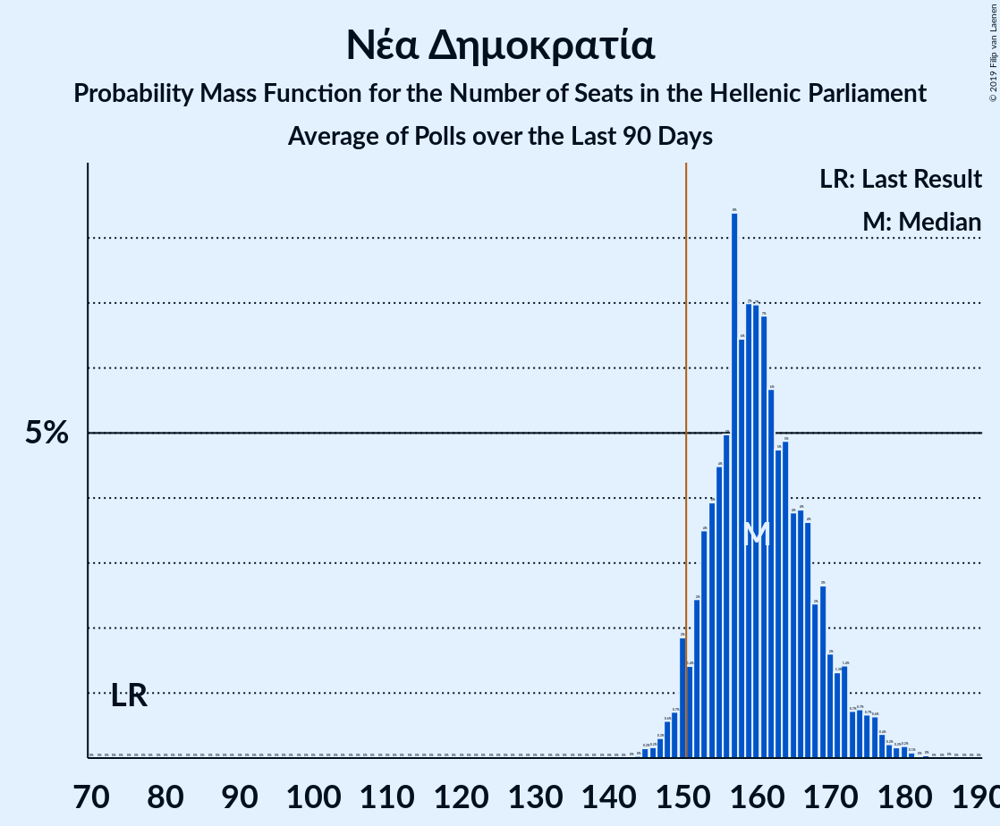

| Number of Seats | Probability | Accumulated | Special Marks |
|:---------------:|:-----------:|:-----------:|:-------------:|
| 75 | 0% | 100% | Last Result |
| 76 | 0% | 100% |  |
| 77 | 0% | 100% |  |
| 78 | 0% | 100% |  |
| 79 | 0% | 100% |  |
| 80 | 0% | 100% |  |
| 81 | 0% | 100% |  |
| 82 | 0% | 100% |  |
| 83 | 0% | 100% |  |
| 84 | 0% | 100% |  |
| 85 | 0% | 100% |  |
| 86 | 0% | 100% |  |
| 87 | 0% | 100% |  |
| 88 | 0% | 100% |  |
| 89 | 0% | 100% |  |
| 90 | 0% | 100% |  |
| 91 | 0% | 100% |  |
| 92 | 0% | 100% |  |
| 93 | 0% | 100% |  |
| 94 | 0% | 100% |  |
| 95 | 0% | 100% |  |
| 96 | 0% | 100% |  |
| 97 | 0% | 100% |  |
| 98 | 0% | 100% |  |
| 99 | 0% | 100% |  |
| 100 | 0% | 100% |  |
| 101 | 0% | 100% |  |
| 102 | 0% | 100% |  |
| 103 | 0% | 100% |  |
| 104 | 0% | 100% |  |
| 105 | 0% | 100% |  |
| 106 | 0% | 100% |  |
| 107 | 0% | 100% |  |
| 108 | 0% | 100% |  |
| 109 | 0% | 100% |  |
| 110 | 0% | 100% |  |
| 111 | 0% | 100% |  |
| 112 | 0% | 100% |  |
| 113 | 0% | 100% |  |
| 114 | 0% | 100% |  |
| 115 | 0% | 100% |  |
| 116 | 0% | 100% |  |
| 117 | 0% | 100% |  |
| 118 | 0% | 100% |  |
| 119 | 0% | 100% |  |
| 120 | 0% | 100% |  |
| 121 | 0% | 100% |  |
| 122 | 0% | 100% |  |
| 123 | 0% | 100% |  |
| 124 | 0% | 100% |  |
| 125 | 0% | 100% |  |
| 126 | 0% | 100% |  |
| 127 | 0% | 100% |  |
| 128 | 0% | 100% |  |
| 129 | 0% | 100% |  |
| 130 | 0% | 100% |  |
| 131 | 0% | 100% |  |
| 132 | 0% | 100% |  |
| 133 | 0% | 100% |  |
| 134 | 0% | 100% |  |
| 135 | 0% | 100% |  |
| 136 | 0% | 100% |  |
| 137 | 0% | 100% |  |
| 138 | 0% | 100% |  |
| 139 | 0% | 100% |  |
| 140 | 0% | 100% |  |
| 141 | 0% | 100% |  |
| 142 | 0% | 100% |  |
| 143 | 0% | 100% |  |
| 144 | 0% | 100% |  |
| 145 | 0.2% | 99.9% |  |
| 146 | 0.2% | 99.8% |  |
| 147 | 0.3% | 99.6% |  |
| 148 | 0.6% | 99.3% |  |
| 149 | 0.7% | 98.7% |  |
| 150 | 2% | 98% |  |
| 151 | 1.4% | 96% | Majority |
| 152 | 2% | 95% |  |
| 153 | 4% | 92% |  |
| 154 | 4% | 89% |  |
| 155 | 4% | 85% |  |
| 156 | 5% | 80% |  |
| 157 | 8% | 75% |  |
| 158 | 6% | 67% |  |
| 159 | 7% | 61% |  |
| 160 | 7% | 54% | Median |
| 161 | 7% | 47% |  |
| 162 | 6% | 40% |  |
| 163 | 5% | 34% |  |
| 164 | 5% | 29% |  |
| 165 | 4% | 25% |  |
| 166 | 4% | 21% |  |
| 167 | 4% | 17% |  |
| 168 | 2% | 13% |  |
| 169 | 3% | 11% |  |
| 170 | 2% | 8% |  |
| 171 | 1.3% | 7% |  |
| 172 | 1.4% | 5% |  |
| 173 | 0.7% | 4% |  |
| 174 | 0.7% | 3% |  |
| 175 | 0.7% | 2% |  |
| 176 | 0.6% | 2% |  |
| 177 | 0.4% | 1.1% |  |
| 178 | 0.2% | 0.8% |  |
| 179 | 0.2% | 0.5% |  |
| 180 | 0.2% | 0.4% |  |
| 181 | 0.1% | 0.2% |  |
| 182 | 0% | 0.1% |  |
| 183 | 0% | 0.1% |  |
| 184 | 0% | 0% |  |

### Χρυσή Αυγή

*For a full overview of the results for this party, see the [Χρυσή Αυγή](party-χρυσήαυγή.html) page.*

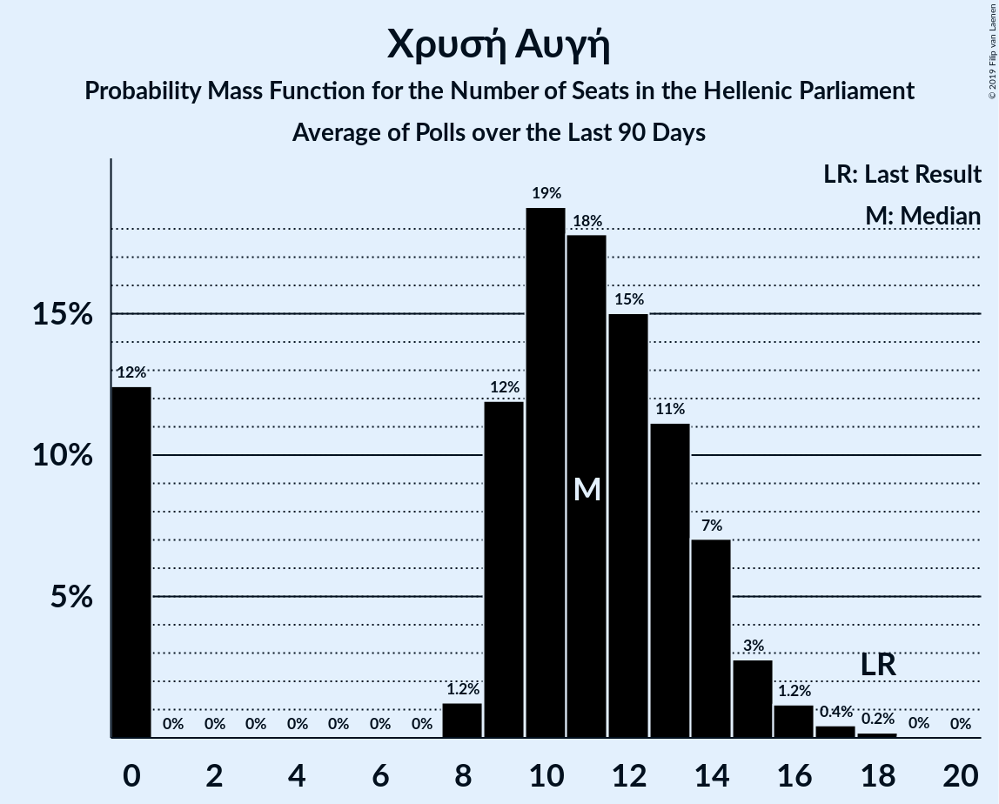

| Number of Seats | Probability | Accumulated | Special Marks |
|:---------------:|:-----------:|:-----------:|:-------------:|
| 0 | 12% | 100% |  |
| 1 | 0% | 88% |  |
| 2 | 0% | 88% |  |
| 3 | 0% | 88% |  |
| 4 | 0% | 88% |  |
| 5 | 0% | 88% |  |
| 6 | 0% | 88% |  |
| 7 | 0% | 88% |  |
| 8 | 1.2% | 88% |  |
| 9 | 12% | 86% |  |
| 10 | 19% | 74% |  |
| 11 | 18% | 56% | Median |
| 12 | 15% | 38% |  |
| 13 | 11% | 23% |  |
| 14 | 7% | 12% |  |
| 15 | 3% | 5% |  |
| 16 | 1.2% | 2% |  |
| 17 | 0.4% | 0.7% |  |
| 18 | 0.2% | 0.3% | Last Result |
| 19 | 0% | 0.1% |  |
| 20 | 0% | 0% |  |

### Κίνημα Αλλαγής

*For a full overview of the results for this party, see the [Κίνημα Αλλαγής](party-κίνημααλλαγής.html) page.*

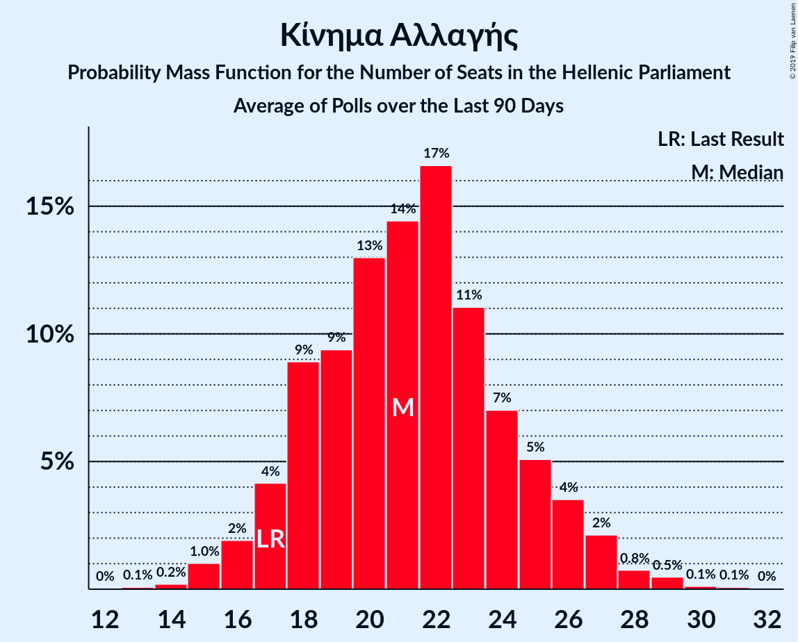

| Number of Seats | Probability | Accumulated | Special Marks |
|:---------------:|:-----------:|:-----------:|:-------------:|
| 13 | 0.1% | 100% |  |
| 14 | 0.2% | 99.9% |  |
| 15 | 1.0% | 99.7% |  |
| 16 | 2% | 98.7% |  |
| 17 | 4% | 97% | Last Result |
| 18 | 9% | 93% |  |
| 19 | 9% | 84% |  |
| 20 | 13% | 74% |  |
| 21 | 14% | 61% | Median |
| 22 | 17% | 47% |  |
| 23 | 11% | 30% |  |
| 24 | 7% | 19% |  |
| 25 | 5% | 12% |  |
| 26 | 4% | 7% |  |
| 27 | 2% | 4% |  |
| 28 | 0.8% | 1.5% |  |
| 29 | 0.5% | 0.7% |  |
| 30 | 0.1% | 0.2% |  |
| 31 | 0.1% | 0.1% |  |
| 32 | 0% | 0% |  |

### Κομμουνιστικό Κόμμα Ελλάδας

*For a full overview of the results for this party, see the [Κομμουνιστικό Κόμμα Ελλάδας](party-κομμουνιστικόκόμμαελλάδας.html) page.*

| Number of Seats | Probability | Accumulated | Special Marks |
|:---------------:|:-----------:|:-----------:|:-------------:|
| 9 | 0.2% | 100% |  |
| 10 | 0.8% | 99.8% |  |
| 11 | 2% | 99.0% |  |
| 12 | 5% | 97% |  |
| 13 | 12% | 92% |  |
| 14 | 16% | 80% |  |
| 15 | 18% | 64% | Last Result, Median |
| 16 | 18% | 46% |  |
| 17 | 12% | 28% |  |
| 18 | 8% | 16% |  |
| 19 | 4% | 8% |  |
| 20 | 2% | 4% |  |
| 21 | 1.2% | 2% |  |
| 22 | 0.4% | 0.7% |  |
| 23 | 0.2% | 0.2% |  |
| 24 | 0.1% | 0.1% |  |
| 25 | 0% | 0% |  |

### Ένωση Κεντρώων

*For a full overview of the results for this party, see the [Ένωση Κεντρώων](party-ένωσηκεντρώων.html) page.*

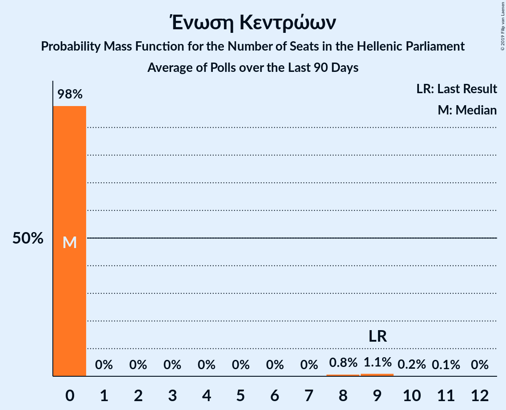

| Number of Seats | Probability | Accumulated | Special Marks |
|:---------------:|:-----------:|:-----------:|:-------------:|
| 0 | 98% | 100% | Median |
| 1 | 0% | 2% |  |
| 2 | 0% | 2% |  |
| 3 | 0% | 2% |  |
| 4 | 0% | 2% |  |
| 5 | 0% | 2% |  |
| 6 | 0% | 2% |  |
| 7 | 0% | 2% |  |
| 8 | 0.8% | 2% |  |
| 9 | 1.1% | 1.3% | Last Result |
| 10 | 0.2% | 0.3% |  |
| 11 | 0.1% | 0.1% |  |
| 12 | 0% | 0% |  |

### Πλεύση Ελευθερίας

*For a full overview of the results for this party, see the [Πλεύση Ελευθερίας](party-πλεύσηελευθερίας.html) page.*

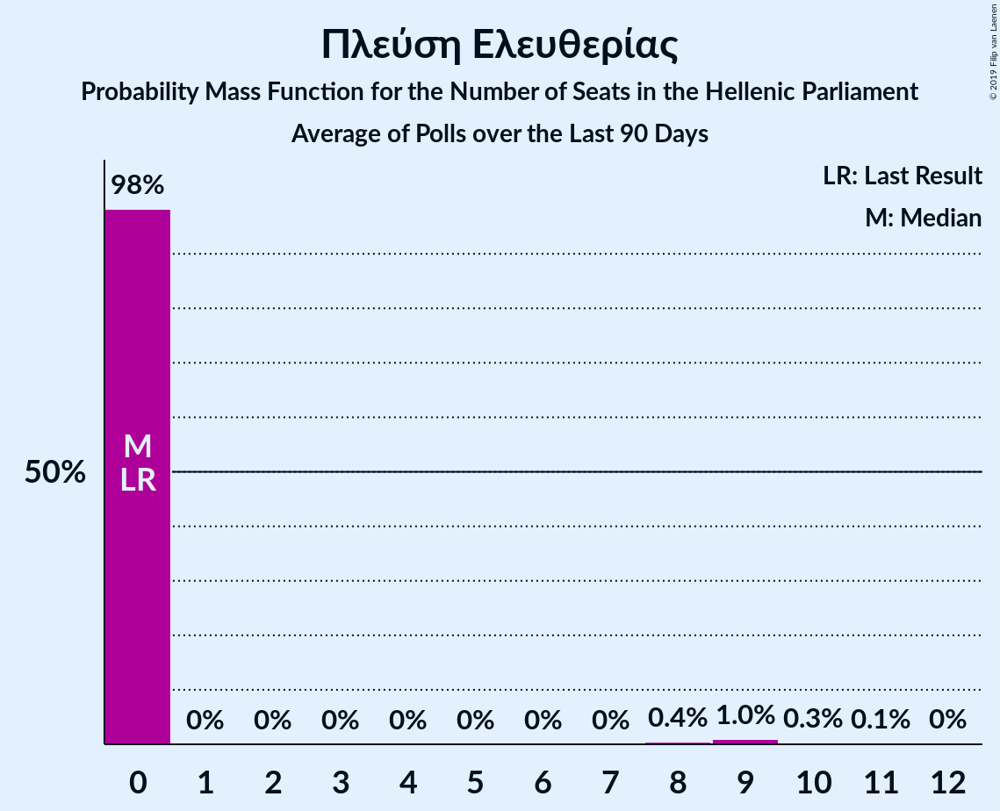

| Number of Seats | Probability | Accumulated | Special Marks |
|:---------------:|:-----------:|:-----------:|:-------------:|
| 0 | 98% | 100% | Last Result, Median |
| 1 | 0% | 2% |  |
| 2 | 0% | 2% |  |
| 3 | 0% | 2% |  |
| 4 | 0% | 2% |  |
| 5 | 0% | 2% |  |
| 6 | 0% | 2% |  |
| 7 | 0% | 2% |  |
| 8 | 0.4% | 2% |  |
| 9 | 1.0% | 1.3% |  |
| 10 | 0.3% | 0.3% |  |
| 11 | 0.1% | 0.1% |  |
| 12 | 0% | 0% |  |

### Ελληνική Λύση

*For a full overview of the results for this party, see the [Ελληνική Λύση](party-ελληνικήλύση.html) page.*

| Number of Seats | Probability | Accumulated | Special Marks |
|:---------------:|:-----------:|:-----------:|:-------------:|
| 0 | 28% | 100% | Last Result |
| 1 | 0% | 72% |  |
| 2 | 0% | 72% |  |
| 3 | 0% | 72% |  |
| 4 | 0% | 72% |  |
| 5 | 0% | 72% |  |
| 6 | 0% | 72% |  |
| 7 | 0% | 72% |  |
| 8 | 4% | 72% |  |
| 9 | 19% | 68% | Median |
| 10 | 18% | 49% |  |
| 11 | 15% | 31% |  |
| 12 | 7% | 16% |  |
| 13 | 5% | 9% |  |
| 14 | 2% | 4% |  |
| 15 | 1.1% | 2% |  |
| 16 | 0.4% | 0.6% |  |
| 17 | 0.2% | 0.2% |  |
| 18 | 0% | 0.1% |  |
| 19 | 0% | 0% |  |

### Μέτωπο Ευρωπαϊκής Ρεαλιστικής Ανυπακοής

*For a full overview of the results for this party, see the [Μέτωπο Ευρωπαϊκής Ρεαλιστικής Ανυπακοής](party-μέτωποευρωπαϊκήςρεαλιστικήςανυπακοής.html) page.*

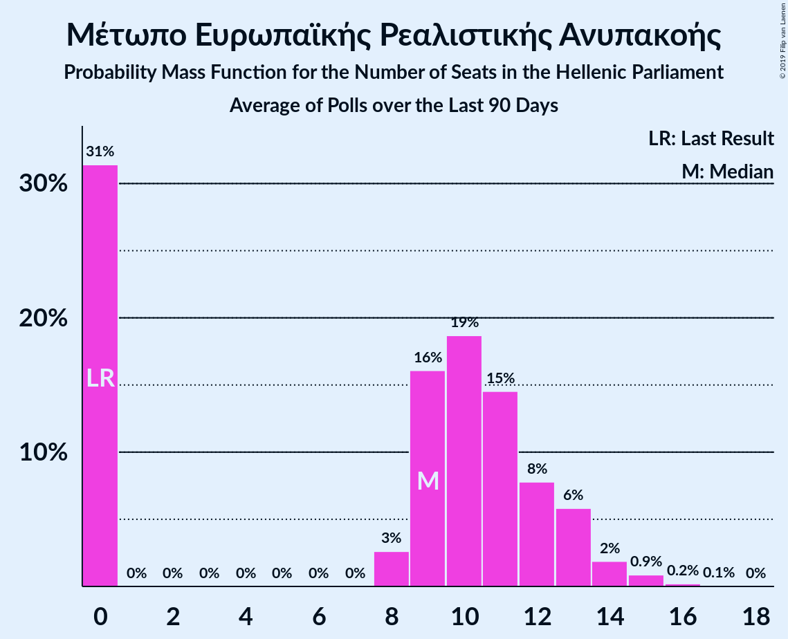

| Number of Seats | Probability | Accumulated | Special Marks |
|:---------------:|:-----------:|:-----------:|:-------------:|
| 0 | 31% | 100% | Last Result |
| 1 | 0% | 69% |  |
| 2 | 0% | 69% |  |
| 3 | 0% | 69% |  |
| 4 | 0% | 69% |  |
| 5 | 0% | 69% |  |
| 6 | 0% | 69% |  |
| 7 | 0% | 69% |  |
| 8 | 3% | 69% |  |
| 9 | 16% | 66% | Median |
| 10 | 19% | 50% |  |
| 11 | 15% | 31% |  |
| 12 | 8% | 17% |  |
| 13 | 6% | 9% |  |
| 14 | 2% | 3% |  |
| 15 | 0.9% | 1.2% |  |
| 16 | 0.2% | 0.3% |  |
| 17 | 0.1% | 0.1% |  |
| 18 | 0% | 0% |  |

## Coalitions

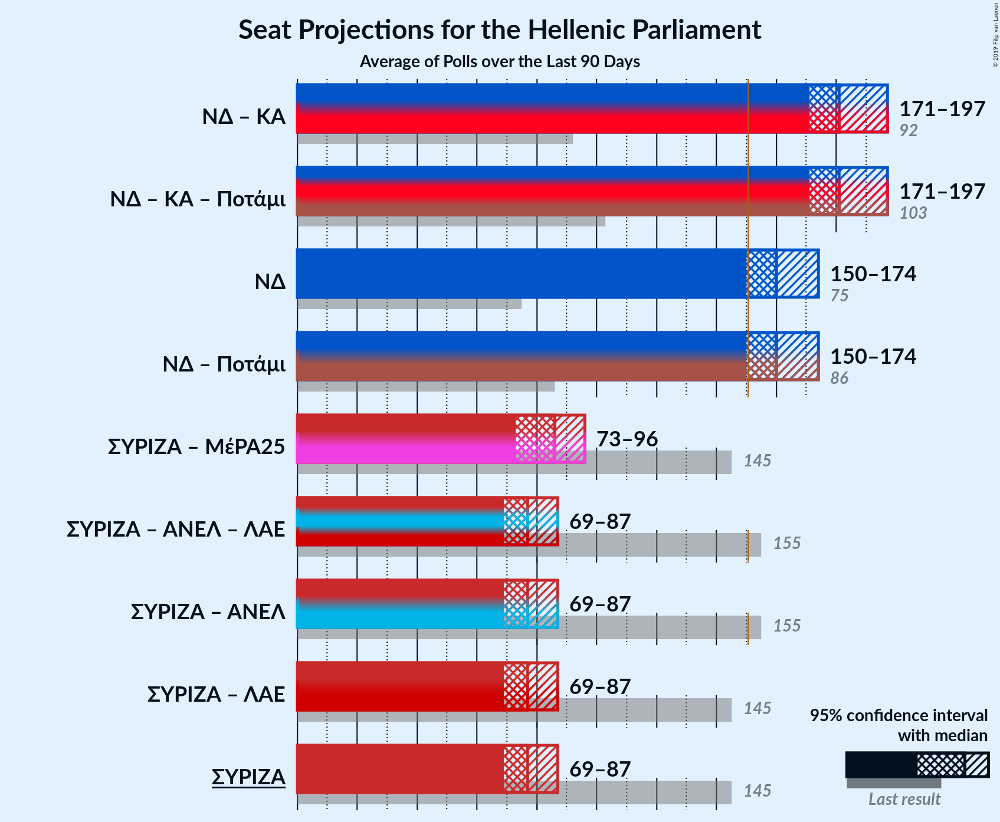

### Confidence Intervals

| Coalition | Last Result | Median | Majority? | 80% Confidence Interval | 90% Confidence Interval | 95% Confidence Interval | 99% Confidence Interval |
|:---------:|:-----------:|:------:|:---------:|:-----------------------:|:-----------------------:|:-----------------------:|:-----------------------:|
| Νέα Δημοκρατία – Κίνημα Αλλαγής | 92 | 181 | 100% | 174–191 | 172–194 | 171–197 | 167–203 |
| Νέα Δημοκρατία – Κίνημα Αλλαγής – Το Ποτάμι | 103 | 181 | 100% | 174–191 | 172–194 | 171–197 | 167–203 |
| Νέα Δημοκρατία | 75 | 160 | 96% | 153–169 | 151–172 | 150–174 | 147–179 |
| Νέα Δημοκρατία – Το Ποτάμι | 86 | 160 | 96% | 153–169 | 151–172 | 150–174 | 147–179 |
| Συνασπισμός Ριζοσπαστικής Αριστεράς – Μέτωπο Ευρωπαϊκής Ρεαλιστικής Ανυπακοής | 145 | 86 | 0% | 77–92 | 75–94 | 73–96 | 69–99 |
| Συνασπισμός Ριζοσπαστικής Αριστεράς – Ανεξάρτητοι Έλληνες – Λαϊκή Ενότητα | 155 | 77 | 0% | 72–84 | 70–85 | 69–87 | 67–90 |
| Συνασπισμός Ριζοσπαστικής Αριστεράς – Ανεξάρτητοι Έλληνες | 155 | 77 | 0% | 72–84 | 70–85 | 69–87 | 67–90 |
| Συνασπισμός Ριζοσπαστικής Αριστεράς – Λαϊκή Ενότητα | 145 | 77 | 0% | 72–84 | 70–85 | 69–87 | 67–90 |
| Συνασπισμός Ριζοσπαστικής Αριστεράς | 145 | 77 | 0% | 72–84 | 70–85 | 69–87 | 67–90 |

### Νέα Δημοκρατία – Κίνημα Αλλαγής

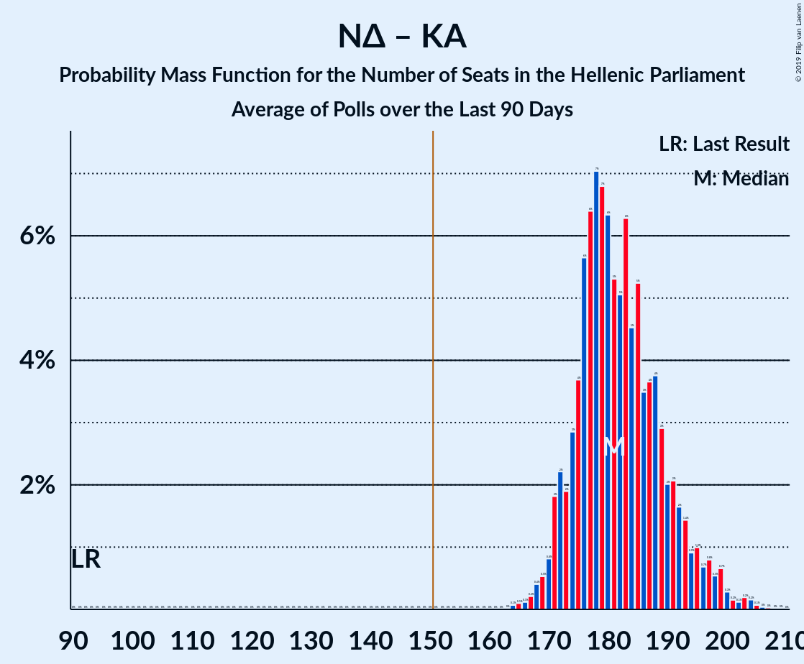

| Number of Seats | Probability | Accumulated | Special Marks |
|:---------------:|:-----------:|:-----------:|:-------------:|
| 92 | 0% | 100% | Last Result |
| 93 | 0% | 100% |  |
| 94 | 0% | 100% |  |
| 95 | 0% | 100% |  |
| 96 | 0% | 100% |  |
| 97 | 0% | 100% |  |
| 98 | 0% | 100% |  |
| 99 | 0% | 100% |  |
| 100 | 0% | 100% |  |
| 101 | 0% | 100% |  |
| 102 | 0% | 100% |  |
| 103 | 0% | 100% |  |
| 104 | 0% | 100% |  |
| 105 | 0% | 100% |  |
| 106 | 0% | 100% |  |
| 107 | 0% | 100% |  |
| 108 | 0% | 100% |  |
| 109 | 0% | 100% |  |
| 110 | 0% | 100% |  |
| 111 | 0% | 100% |  |
| 112 | 0% | 100% |  |
| 113 | 0% | 100% |  |
| 114 | 0% | 100% |  |
| 115 | 0% | 100% |  |
| 116 | 0% | 100% |  |
| 117 | 0% | 100% |  |
| 118 | 0% | 100% |  |
| 119 | 0% | 100% |  |
| 120 | 0% | 100% |  |
| 121 | 0% | 100% |  |
| 122 | 0% | 100% |  |
| 123 | 0% | 100% |  |
| 124 | 0% | 100% |  |
| 125 | 0% | 100% |  |
| 126 | 0% | 100% |  |
| 127 | 0% | 100% |  |
| 128 | 0% | 100% |  |
| 129 | 0% | 100% |  |
| 130 | 0% | 100% |  |
| 131 | 0% | 100% |  |
| 132 | 0% | 100% |  |
| 133 | 0% | 100% |  |
| 134 | 0% | 100% |  |
| 135 | 0% | 100% |  |
| 136 | 0% | 100% |  |
| 137 | 0% | 100% |  |
| 138 | 0% | 100% |  |
| 139 | 0% | 100% |  |
| 140 | 0% | 100% |  |
| 141 | 0% | 100% |  |
| 142 | 0% | 100% |  |
| 143 | 0% | 100% |  |
| 144 | 0% | 100% |  |
| 145 | 0% | 100% |  |
| 146 | 0% | 100% |  |
| 147 | 0% | 100% |  |
| 148 | 0% | 100% |  |
| 149 | 0% | 100% |  |
| 150 | 0% | 100% |  |
| 151 | 0% | 100% | Majority |
| 152 | 0% | 100% |  |
| 153 | 0% | 100% |  |
| 154 | 0% | 100% |  |
| 155 | 0% | 100% |  |
| 156 | 0% | 100% |  |
| 157 | 0% | 100% |  |
| 158 | 0% | 100% |  |
| 159 | 0% | 100% |  |
| 160 | 0% | 100% |  |
| 161 | 0% | 100% |  |
| 162 | 0% | 100% |  |
| 163 | 0% | 100% |  |
| 164 | 0.1% | 100% |  |
| 165 | 0.1% | 99.9% |  |
| 166 | 0.1% | 99.8% |  |
| 167 | 0.2% | 99.7% |  |
| 168 | 0.4% | 99.5% |  |
| 169 | 0.5% | 99.1% |  |
| 170 | 0.8% | 98.5% |  |
| 171 | 2% | 98% |  |
| 172 | 2% | 96% |  |
| 173 | 2% | 94% |  |
| 174 | 3% | 92% |  |
| 175 | 4% | 89% |  |
| 176 | 6% | 85% |  |
| 177 | 6% | 80% |  |
| 178 | 7% | 73% |  |
| 179 | 7% | 66% |  |
| 180 | 6% | 59% |  |
| 181 | 5% | 53% | Median |
| 182 | 5% | 48% |  |
| 183 | 6% | 43% |  |
| 184 | 5% | 36% |  |
| 185 | 5% | 32% |  |
| 186 | 3% | 27% |  |
| 187 | 4% | 23% |  |
| 188 | 4% | 19% |  |
| 189 | 3% | 16% |  |
| 190 | 2% | 13% |  |
| 191 | 2% | 11% |  |
| 192 | 2% | 9% |  |
| 193 | 1.4% | 7% |  |
| 194 | 0.9% | 6% |  |
| 195 | 1.0% | 5% |  |
| 196 | 0.7% | 4% |  |
| 197 | 0.8% | 3% |  |
| 198 | 0.5% | 2% |  |
| 199 | 0.7% | 2% |  |
| 200 | 0.3% | 1.1% |  |
| 201 | 0.2% | 0.8% |  |
| 202 | 0.1% | 0.6% |  |
| 203 | 0.2% | 0.5% |  |
| 204 | 0.2% | 0.3% |  |
| 205 | 0.1% | 0.2% |  |
| 206 | 0% | 0.1% |  |
| 207 | 0% | 0.1% |  |
| 208 | 0% | 0% |  |

### Νέα Δημοκρατία – Κίνημα Αλλαγής – Το Ποτάμι

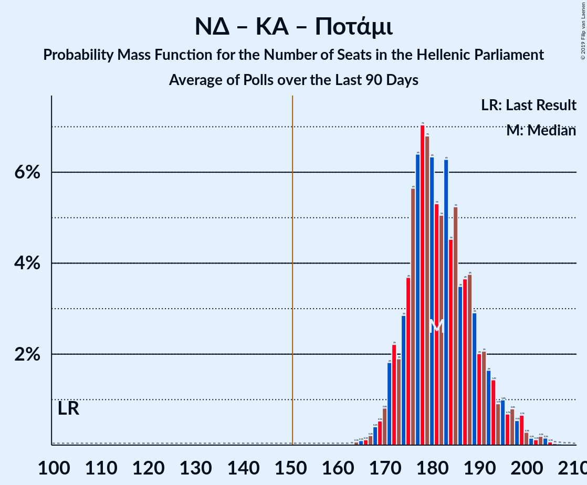

| Number of Seats | Probability | Accumulated | Special Marks |
|:---------------:|:-----------:|:-----------:|:-------------:|
| 103 | 0% | 100% | Last Result |
| 104 | 0% | 100% |  |
| 105 | 0% | 100% |  |
| 106 | 0% | 100% |  |
| 107 | 0% | 100% |  |
| 108 | 0% | 100% |  |
| 109 | 0% | 100% |  |
| 110 | 0% | 100% |  |
| 111 | 0% | 100% |  |
| 112 | 0% | 100% |  |
| 113 | 0% | 100% |  |
| 114 | 0% | 100% |  |
| 115 | 0% | 100% |  |
| 116 | 0% | 100% |  |
| 117 | 0% | 100% |  |
| 118 | 0% | 100% |  |
| 119 | 0% | 100% |  |
| 120 | 0% | 100% |  |
| 121 | 0% | 100% |  |
| 122 | 0% | 100% |  |
| 123 | 0% | 100% |  |
| 124 | 0% | 100% |  |
| 125 | 0% | 100% |  |
| 126 | 0% | 100% |  |
| 127 | 0% | 100% |  |
| 128 | 0% | 100% |  |
| 129 | 0% | 100% |  |
| 130 | 0% | 100% |  |
| 131 | 0% | 100% |  |
| 132 | 0% | 100% |  |
| 133 | 0% | 100% |  |
| 134 | 0% | 100% |  |
| 135 | 0% | 100% |  |
| 136 | 0% | 100% |  |
| 137 | 0% | 100% |  |
| 138 | 0% | 100% |  |
| 139 | 0% | 100% |  |
| 140 | 0% | 100% |  |
| 141 | 0% | 100% |  |
| 142 | 0% | 100% |  |
| 143 | 0% | 100% |  |
| 144 | 0% | 100% |  |
| 145 | 0% | 100% |  |
| 146 | 0% | 100% |  |
| 147 | 0% | 100% |  |
| 148 | 0% | 100% |  |
| 149 | 0% | 100% |  |
| 150 | 0% | 100% |  |
| 151 | 0% | 100% | Majority |
| 152 | 0% | 100% |  |
| 153 | 0% | 100% |  |
| 154 | 0% | 100% |  |
| 155 | 0% | 100% |  |
| 156 | 0% | 100% |  |
| 157 | 0% | 100% |  |
| 158 | 0% | 100% |  |
| 159 | 0% | 100% |  |
| 160 | 0% | 100% |  |
| 161 | 0% | 100% |  |
| 162 | 0% | 100% |  |
| 163 | 0% | 100% |  |
| 164 | 0.1% | 100% |  |
| 165 | 0.1% | 99.9% |  |
| 166 | 0.1% | 99.8% |  |
| 167 | 0.2% | 99.7% |  |
| 168 | 0.4% | 99.5% |  |
| 169 | 0.5% | 99.1% |  |
| 170 | 0.8% | 98.5% |  |
| 171 | 2% | 98% |  |
| 172 | 2% | 96% |  |
| 173 | 2% | 94% |  |
| 174 | 3% | 92% |  |
| 175 | 4% | 89% |  |
| 176 | 6% | 85% |  |
| 177 | 6% | 80% |  |
| 178 | 7% | 73% |  |
| 179 | 7% | 66% |  |
| 180 | 6% | 59% |  |
| 181 | 5% | 53% | Median |
| 182 | 5% | 48% |  |
| 183 | 6% | 43% |  |
| 184 | 5% | 36% |  |
| 185 | 5% | 32% |  |
| 186 | 3% | 27% |  |
| 187 | 4% | 23% |  |
| 188 | 4% | 19% |  |
| 189 | 3% | 16% |  |
| 190 | 2% | 13% |  |
| 191 | 2% | 11% |  |
| 192 | 2% | 9% |  |
| 193 | 1.4% | 7% |  |
| 194 | 0.9% | 6% |  |
| 195 | 1.0% | 5% |  |
| 196 | 0.7% | 4% |  |
| 197 | 0.8% | 3% |  |
| 198 | 0.5% | 2% |  |
| 199 | 0.7% | 2% |  |
| 200 | 0.3% | 1.1% |  |
| 201 | 0.2% | 0.8% |  |
| 202 | 0.1% | 0.6% |  |
| 203 | 0.2% | 0.5% |  |
| 204 | 0.2% | 0.3% |  |
| 205 | 0.1% | 0.2% |  |
| 206 | 0% | 0.1% |  |
| 207 | 0% | 0.1% |  |
| 208 | 0% | 0% |  |

### Νέα Δημοκρατία

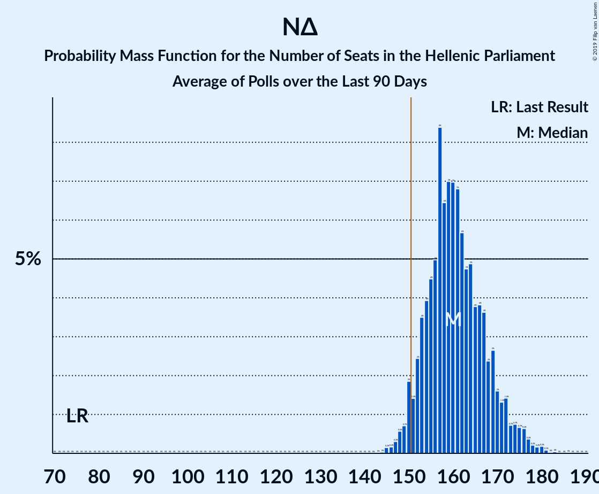

| Number of Seats | Probability | Accumulated | Special Marks |
|:---------------:|:-----------:|:-----------:|:-------------:|
| 75 | 0% | 100% | Last Result |
| 76 | 0% | 100% |  |
| 77 | 0% | 100% |  |
| 78 | 0% | 100% |  |
| 79 | 0% | 100% |  |
| 80 | 0% | 100% |  |
| 81 | 0% | 100% |  |
| 82 | 0% | 100% |  |
| 83 | 0% | 100% |  |
| 84 | 0% | 100% |  |
| 85 | 0% | 100% |  |
| 86 | 0% | 100% |  |
| 87 | 0% | 100% |  |
| 88 | 0% | 100% |  |
| 89 | 0% | 100% |  |
| 90 | 0% | 100% |  |
| 91 | 0% | 100% |  |
| 92 | 0% | 100% |  |
| 93 | 0% | 100% |  |
| 94 | 0% | 100% |  |
| 95 | 0% | 100% |  |
| 96 | 0% | 100% |  |
| 97 | 0% | 100% |  |
| 98 | 0% | 100% |  |
| 99 | 0% | 100% |  |
| 100 | 0% | 100% |  |
| 101 | 0% | 100% |  |
| 102 | 0% | 100% |  |
| 103 | 0% | 100% |  |
| 104 | 0% | 100% |  |
| 105 | 0% | 100% |  |
| 106 | 0% | 100% |  |
| 107 | 0% | 100% |  |
| 108 | 0% | 100% |  |
| 109 | 0% | 100% |  |
| 110 | 0% | 100% |  |
| 111 | 0% | 100% |  |
| 112 | 0% | 100% |  |
| 113 | 0% | 100% |  |
| 114 | 0% | 100% |  |
| 115 | 0% | 100% |  |
| 116 | 0% | 100% |  |
| 117 | 0% | 100% |  |
| 118 | 0% | 100% |  |
| 119 | 0% | 100% |  |
| 120 | 0% | 100% |  |
| 121 | 0% | 100% |  |
| 122 | 0% | 100% |  |
| 123 | 0% | 100% |  |
| 124 | 0% | 100% |  |
| 125 | 0% | 100% |  |
| 126 | 0% | 100% |  |
| 127 | 0% | 100% |  |
| 128 | 0% | 100% |  |
| 129 | 0% | 100% |  |
| 130 | 0% | 100% |  |
| 131 | 0% | 100% |  |
| 132 | 0% | 100% |  |
| 133 | 0% | 100% |  |
| 134 | 0% | 100% |  |
| 135 | 0% | 100% |  |
| 136 | 0% | 100% |  |
| 137 | 0% | 100% |  |
| 138 | 0% | 100% |  |
| 139 | 0% | 100% |  |
| 140 | 0% | 100% |  |
| 141 | 0% | 100% |  |
| 142 | 0% | 100% |  |
| 143 | 0% | 100% |  |
| 144 | 0% | 100% |  |
| 145 | 0.2% | 99.9% |  |
| 146 | 0.2% | 99.8% |  |
| 147 | 0.3% | 99.6% |  |
| 148 | 0.6% | 99.3% |  |
| 149 | 0.7% | 98.7% |  |
| 150 | 2% | 98% |  |
| 151 | 1.4% | 96% | Majority |
| 152 | 2% | 95% |  |
| 153 | 4% | 92% |  |
| 154 | 4% | 89% |  |
| 155 | 4% | 85% |  |
| 156 | 5% | 80% |  |
| 157 | 8% | 75% |  |
| 158 | 6% | 67% |  |
| 159 | 7% | 61% |  |
| 160 | 7% | 54% | Median |
| 161 | 7% | 47% |  |
| 162 | 6% | 40% |  |
| 163 | 5% | 34% |  |
| 164 | 5% | 29% |  |
| 165 | 4% | 25% |  |
| 166 | 4% | 21% |  |
| 167 | 4% | 17% |  |
| 168 | 2% | 13% |  |
| 169 | 3% | 11% |  |
| 170 | 2% | 8% |  |
| 171 | 1.3% | 7% |  |
| 172 | 1.4% | 5% |  |
| 173 | 0.7% | 4% |  |
| 174 | 0.7% | 3% |  |
| 175 | 0.7% | 2% |  |
| 176 | 0.6% | 2% |  |
| 177 | 0.4% | 1.1% |  |
| 178 | 0.2% | 0.8% |  |
| 179 | 0.2% | 0.5% |  |
| 180 | 0.2% | 0.4% |  |
| 181 | 0.1% | 0.2% |  |
| 182 | 0% | 0.1% |  |
| 183 | 0% | 0.1% |  |
| 184 | 0% | 0% |  |

### Νέα Δημοκρατία – Το Ποτάμι

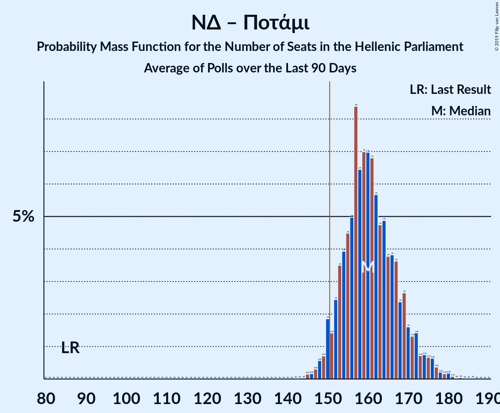

| Number of Seats | Probability | Accumulated | Special Marks |
|:---------------:|:-----------:|:-----------:|:-------------:|
| 86 | 0% | 100% | Last Result |
| 87 | 0% | 100% |  |
| 88 | 0% | 100% |  |
| 89 | 0% | 100% |  |
| 90 | 0% | 100% |  |
| 91 | 0% | 100% |  |
| 92 | 0% | 100% |  |
| 93 | 0% | 100% |  |
| 94 | 0% | 100% |  |
| 95 | 0% | 100% |  |
| 96 | 0% | 100% |  |
| 97 | 0% | 100% |  |
| 98 | 0% | 100% |  |
| 99 | 0% | 100% |  |
| 100 | 0% | 100% |  |
| 101 | 0% | 100% |  |
| 102 | 0% | 100% |  |
| 103 | 0% | 100% |  |
| 104 | 0% | 100% |  |
| 105 | 0% | 100% |  |
| 106 | 0% | 100% |  |
| 107 | 0% | 100% |  |
| 108 | 0% | 100% |  |
| 109 | 0% | 100% |  |
| 110 | 0% | 100% |  |
| 111 | 0% | 100% |  |
| 112 | 0% | 100% |  |
| 113 | 0% | 100% |  |
| 114 | 0% | 100% |  |
| 115 | 0% | 100% |  |
| 116 | 0% | 100% |  |
| 117 | 0% | 100% |  |
| 118 | 0% | 100% |  |
| 119 | 0% | 100% |  |
| 120 | 0% | 100% |  |
| 121 | 0% | 100% |  |
| 122 | 0% | 100% |  |
| 123 | 0% | 100% |  |
| 124 | 0% | 100% |  |
| 125 | 0% | 100% |  |
| 126 | 0% | 100% |  |
| 127 | 0% | 100% |  |
| 128 | 0% | 100% |  |
| 129 | 0% | 100% |  |
| 130 | 0% | 100% |  |
| 131 | 0% | 100% |  |
| 132 | 0% | 100% |  |
| 133 | 0% | 100% |  |
| 134 | 0% | 100% |  |
| 135 | 0% | 100% |  |
| 136 | 0% | 100% |  |
| 137 | 0% | 100% |  |
| 138 | 0% | 100% |  |
| 139 | 0% | 100% |  |
| 140 | 0% | 100% |  |
| 141 | 0% | 100% |  |
| 142 | 0% | 100% |  |
| 143 | 0% | 100% |  |
| 144 | 0% | 100% |  |
| 145 | 0.2% | 99.9% |  |
| 146 | 0.2% | 99.8% |  |
| 147 | 0.3% | 99.6% |  |
| 148 | 0.6% | 99.3% |  |
| 149 | 0.7% | 98.7% |  |
| 150 | 2% | 98% |  |
| 151 | 1.4% | 96% | Majority |
| 152 | 2% | 95% |  |
| 153 | 4% | 92% |  |
| 154 | 4% | 89% |  |
| 155 | 4% | 85% |  |
| 156 | 5% | 80% |  |
| 157 | 8% | 75% |  |
| 158 | 6% | 67% |  |
| 159 | 7% | 61% |  |
| 160 | 7% | 54% | Median |
| 161 | 7% | 47% |  |
| 162 | 6% | 40% |  |
| 163 | 5% | 34% |  |
| 164 | 5% | 29% |  |
| 165 | 4% | 25% |  |
| 166 | 4% | 21% |  |
| 167 | 4% | 17% |  |
| 168 | 2% | 13% |  |
| 169 | 3% | 11% |  |
| 170 | 2% | 8% |  |
| 171 | 1.3% | 7% |  |
| 172 | 1.4% | 5% |  |
| 173 | 0.7% | 4% |  |
| 174 | 0.7% | 3% |  |
| 175 | 0.7% | 2% |  |
| 176 | 0.6% | 2% |  |
| 177 | 0.4% | 1.1% |  |
| 178 | 0.2% | 0.8% |  |
| 179 | 0.2% | 0.5% |  |
| 180 | 0.2% | 0.4% |  |
| 181 | 0.1% | 0.2% |  |
| 182 | 0% | 0.1% |  |
| 183 | 0% | 0.1% |  |
| 184 | 0% | 0% |  |

### Συνασπισμός Ριζοσπαστικής Αριστεράς – Μέτωπο Ευρωπαϊκής Ρεαλιστικής Ανυπακοής

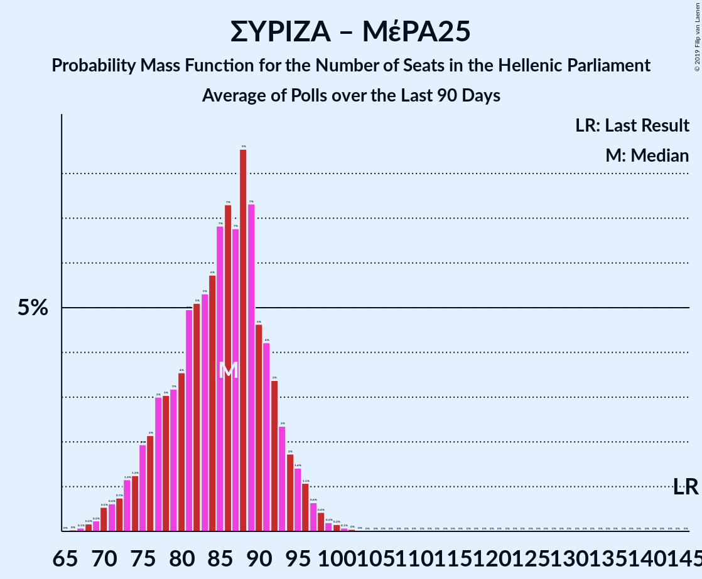

| Number of Seats | Probability | Accumulated | Special Marks |
|:---------------:|:-----------:|:-----------:|:-------------:|
| 66 | 0% | 100% |  |
| 67 | 0.1% | 99.9% |  |
| 68 | 0.2% | 99.9% |  |
| 69 | 0.2% | 99.7% |  |
| 70 | 0.5% | 99.4% |  |
| 71 | 0.6% | 98.9% |  |
| 72 | 0.7% | 98% |  |
| 73 | 1.2% | 98% |  |
| 74 | 1.2% | 96% |  |
| 75 | 2% | 95% |  |
| 76 | 2% | 93% |  |
| 77 | 3% | 91% |  |
| 78 | 3% | 88% |  |
| 79 | 3% | 85% |  |
| 80 | 4% | 82% |  |
| 81 | 5% | 78% |  |
| 82 | 5% | 73% |  |
| 83 | 5% | 68% |  |
| 84 | 6% | 63% |  |
| 85 | 7% | 57% |  |
| 86 | 7% | 50% | Median |
| 87 | 7% | 43% |  |
| 88 | 9% | 36% |  |
| 89 | 7% | 28% |  |
| 90 | 5% | 20% |  |
| 91 | 4% | 16% |  |
| 92 | 3% | 12% |  |
| 93 | 2% | 8% |  |
| 94 | 2% | 6% |  |
| 95 | 1.4% | 4% |  |
| 96 | 1.1% | 3% |  |
| 97 | 0.6% | 2% |  |
| 98 | 0.4% | 0.9% |  |
| 99 | 0.2% | 0.5% |  |
| 100 | 0.2% | 0.3% |  |
| 101 | 0.1% | 0.2% |  |
| 102 | 0% | 0.1% |  |
| 103 | 0% | 0% |  |
| 104 | 0% | 0% |  |
| 105 | 0% | 0% |  |
| 106 | 0% | 0% |  |
| 107 | 0% | 0% |  |
| 108 | 0% | 0% |  |
| 109 | 0% | 0% |  |
| 110 | 0% | 0% |  |
| 111 | 0% | 0% |  |
| 112 | 0% | 0% |  |
| 113 | 0% | 0% |  |
| 114 | 0% | 0% |  |
| 115 | 0% | 0% |  |
| 116 | 0% | 0% |  |
| 117 | 0% | 0% |  |
| 118 | 0% | 0% |  |
| 119 | 0% | 0% |  |
| 120 | 0% | 0% |  |
| 121 | 0% | 0% |  |
| 122 | 0% | 0% |  |
| 123 | 0% | 0% |  |
| 124 | 0% | 0% |  |
| 125 | 0% | 0% |  |
| 126 | 0% | 0% |  |
| 127 | 0% | 0% |  |
| 128 | 0% | 0% |  |
| 129 | 0% | 0% |  |
| 130 | 0% | 0% |  |
| 131 | 0% | 0% |  |
| 132 | 0% | 0% |  |
| 133 | 0% | 0% |  |
| 134 | 0% | 0% |  |
| 135 | 0% | 0% |  |
| 136 | 0% | 0% |  |
| 137 | 0% | 0% |  |
| 138 | 0% | 0% |  |
| 139 | 0% | 0% |  |
| 140 | 0% | 0% |  |
| 141 | 0% | 0% |  |
| 142 | 0% | 0% |  |
| 143 | 0% | 0% |  |
| 144 | 0% | 0% |  |
| 145 | 0% | 0% | Last Result |

### Συνασπισμός Ριζοσπαστικής Αριστεράς – Ανεξάρτητοι Έλληνες – Λαϊκή Ενότητα

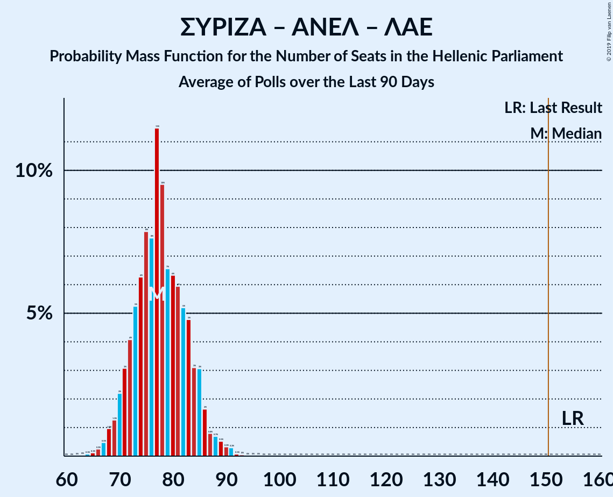

| Number of Seats | Probability | Accumulated | Special Marks |
|:---------------:|:-----------:|:-----------:|:-------------:|
| 64 | 0.1% | 100% |  |
| 65 | 0.1% | 99.9% |  |
| 66 | 0.3% | 99.8% |  |
| 67 | 0.5% | 99.5% |  |
| 68 | 1.0% | 99.0% |  |
| 69 | 1.3% | 98% |  |
| 70 | 2% | 97% |  |
| 71 | 3% | 95% |  |
| 72 | 4% | 92% |  |
| 73 | 5% | 87% |  |
| 74 | 6% | 82% |  |
| 75 | 8% | 76% |  |
| 76 | 8% | 68% |  |
| 77 | 11% | 60% | Median |
| 78 | 10% | 49% |  |
| 79 | 7% | 39% |  |
| 80 | 6% | 33% |  |
| 81 | 6% | 27% |  |
| 82 | 5% | 21% |  |
| 83 | 5% | 15% |  |
| 84 | 3% | 11% |  |
| 85 | 3% | 8% |  |
| 86 | 2% | 4% |  |
| 87 | 0.8% | 3% |  |
| 88 | 0.7% | 2% |  |
| 89 | 0.5% | 1.3% |  |
| 90 | 0.3% | 0.8% |  |
| 91 | 0.3% | 0.5% |  |
| 92 | 0.1% | 0.2% |  |
| 93 | 0% | 0.1% |  |
| 94 | 0% | 0.1% |  |
| 95 | 0% | 0% |  |
| 96 | 0% | 0% |  |
| 97 | 0% | 0% |  |
| 98 | 0% | 0% |  |
| 99 | 0% | 0% |  |
| 100 | 0% | 0% |  |
| 101 | 0% | 0% |  |
| 102 | 0% | 0% |  |
| 103 | 0% | 0% |  |
| 104 | 0% | 0% |  |
| 105 | 0% | 0% |  |
| 106 | 0% | 0% |  |
| 107 | 0% | 0% |  |
| 108 | 0% | 0% |  |
| 109 | 0% | 0% |  |
| 110 | 0% | 0% |  |
| 111 | 0% | 0% |  |
| 112 | 0% | 0% |  |
| 113 | 0% | 0% |  |
| 114 | 0% | 0% |  |
| 115 | 0% | 0% |  |
| 116 | 0% | 0% |  |
| 117 | 0% | 0% |  |
| 118 | 0% | 0% |  |
| 119 | 0% | 0% |  |
| 120 | 0% | 0% |  |
| 121 | 0% | 0% |  |
| 122 | 0% | 0% |  |
| 123 | 0% | 0% |  |
| 124 | 0% | 0% |  |
| 125 | 0% | 0% |  |
| 126 | 0% | 0% |  |
| 127 | 0% | 0% |  |
| 128 | 0% | 0% |  |
| 129 | 0% | 0% |  |
| 130 | 0% | 0% |  |
| 131 | 0% | 0% |  |
| 132 | 0% | 0% |  |
| 133 | 0% | 0% |  |
| 134 | 0% | 0% |  |
| 135 | 0% | 0% |  |
| 136 | 0% | 0% |  |
| 137 | 0% | 0% |  |
| 138 | 0% | 0% |  |
| 139 | 0% | 0% |  |
| 140 | 0% | 0% |  |
| 141 | 0% | 0% |  |
| 142 | 0% | 0% |  |
| 143 | 0% | 0% |  |
| 144 | 0% | 0% |  |
| 145 | 0% | 0% |  |
| 146 | 0% | 0% |  |
| 147 | 0% | 0% |  |
| 148 | 0% | 0% |  |
| 149 | 0% | 0% |  |
| 150 | 0% | 0% |  |
| 151 | 0% | 0% | Majority |
| 152 | 0% | 0% |  |
| 153 | 0% | 0% |  |
| 154 | 0% | 0% |  |
| 155 | 0% | 0% | Last Result |

### Συνασπισμός Ριζοσπαστικής Αριστεράς – Ανεξάρτητοι Έλληνες

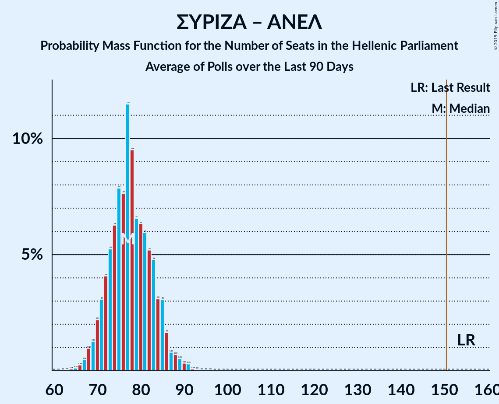

| Number of Seats | Probability | Accumulated | Special Marks |
|:---------------:|:-----------:|:-----------:|:-------------:|
| 64 | 0.1% | 100% |  |
| 65 | 0.1% | 99.9% |  |
| 66 | 0.3% | 99.8% |  |
| 67 | 0.5% | 99.5% |  |
| 68 | 1.0% | 99.0% |  |
| 69 | 1.3% | 98% |  |
| 70 | 2% | 97% |  |
| 71 | 3% | 95% |  |
| 72 | 4% | 92% |  |
| 73 | 5% | 87% |  |
| 74 | 6% | 82% |  |
| 75 | 8% | 76% |  |
| 76 | 8% | 68% |  |
| 77 | 11% | 60% | Median |
| 78 | 10% | 49% |  |
| 79 | 7% | 39% |  |
| 80 | 6% | 33% |  |
| 81 | 6% | 27% |  |
| 82 | 5% | 21% |  |
| 83 | 5% | 15% |  |
| 84 | 3% | 11% |  |
| 85 | 3% | 8% |  |
| 86 | 2% | 4% |  |
| 87 | 0.8% | 3% |  |
| 88 | 0.7% | 2% |  |
| 89 | 0.5% | 1.3% |  |
| 90 | 0.3% | 0.8% |  |
| 91 | 0.3% | 0.5% |  |
| 92 | 0.1% | 0.2% |  |
| 93 | 0% | 0.1% |  |
| 94 | 0% | 0.1% |  |
| 95 | 0% | 0% |  |
| 96 | 0% | 0% |  |
| 97 | 0% | 0% |  |
| 98 | 0% | 0% |  |
| 99 | 0% | 0% |  |
| 100 | 0% | 0% |  |
| 101 | 0% | 0% |  |
| 102 | 0% | 0% |  |
| 103 | 0% | 0% |  |
| 104 | 0% | 0% |  |
| 105 | 0% | 0% |  |
| 106 | 0% | 0% |  |
| 107 | 0% | 0% |  |
| 108 | 0% | 0% |  |
| 109 | 0% | 0% |  |
| 110 | 0% | 0% |  |
| 111 | 0% | 0% |  |
| 112 | 0% | 0% |  |
| 113 | 0% | 0% |  |
| 114 | 0% | 0% |  |
| 115 | 0% | 0% |  |
| 116 | 0% | 0% |  |
| 117 | 0% | 0% |  |
| 118 | 0% | 0% |  |
| 119 | 0% | 0% |  |
| 120 | 0% | 0% |  |
| 121 | 0% | 0% |  |
| 122 | 0% | 0% |  |
| 123 | 0% | 0% |  |
| 124 | 0% | 0% |  |
| 125 | 0% | 0% |  |
| 126 | 0% | 0% |  |
| 127 | 0% | 0% |  |
| 128 | 0% | 0% |  |
| 129 | 0% | 0% |  |
| 130 | 0% | 0% |  |
| 131 | 0% | 0% |  |
| 132 | 0% | 0% |  |
| 133 | 0% | 0% |  |
| 134 | 0% | 0% |  |
| 135 | 0% | 0% |  |
| 136 | 0% | 0% |  |
| 137 | 0% | 0% |  |
| 138 | 0% | 0% |  |
| 139 | 0% | 0% |  |
| 140 | 0% | 0% |  |
| 141 | 0% | 0% |  |
| 142 | 0% | 0% |  |
| 143 | 0% | 0% |  |
| 144 | 0% | 0% |  |
| 145 | 0% | 0% |  |
| 146 | 0% | 0% |  |
| 147 | 0% | 0% |  |
| 148 | 0% | 0% |  |
| 149 | 0% | 0% |  |
| 150 | 0% | 0% |  |
| 151 | 0% | 0% | Majority |
| 152 | 0% | 0% |  |
| 153 | 0% | 0% |  |
| 154 | 0% | 0% |  |
| 155 | 0% | 0% | Last Result |

### Συνασπισμός Ριζοσπαστικής Αριστεράς – Λαϊκή Ενότητα

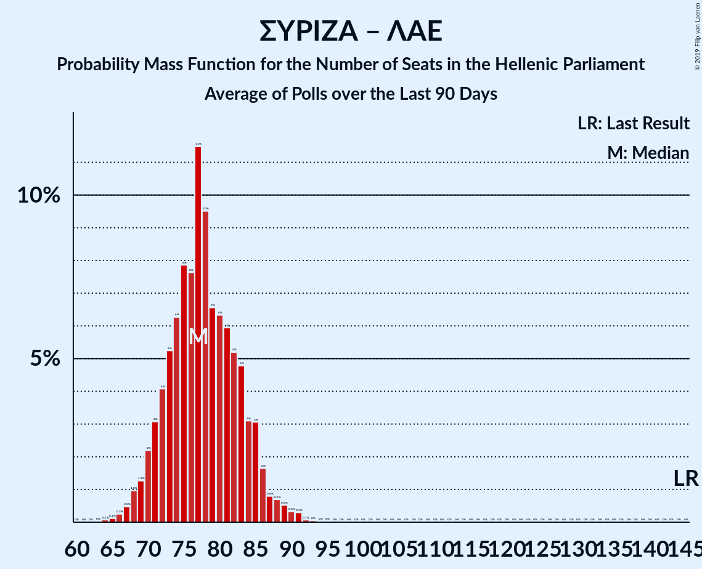

| Number of Seats | Probability | Accumulated | Special Marks |
|:---------------:|:-----------:|:-----------:|:-------------:|
| 64 | 0.1% | 100% |  |
| 65 | 0.1% | 99.9% |  |
| 66 | 0.3% | 99.8% |  |
| 67 | 0.5% | 99.5% |  |
| 68 | 1.0% | 99.0% |  |
| 69 | 1.3% | 98% |  |
| 70 | 2% | 97% |  |
| 71 | 3% | 95% |  |
| 72 | 4% | 92% |  |
| 73 | 5% | 87% |  |
| 74 | 6% | 82% |  |
| 75 | 8% | 76% |  |
| 76 | 8% | 68% |  |
| 77 | 11% | 60% | Median |
| 78 | 10% | 49% |  |
| 79 | 7% | 39% |  |
| 80 | 6% | 33% |  |
| 81 | 6% | 27% |  |
| 82 | 5% | 21% |  |
| 83 | 5% | 15% |  |
| 84 | 3% | 11% |  |
| 85 | 3% | 8% |  |
| 86 | 2% | 4% |  |
| 87 | 0.8% | 3% |  |
| 88 | 0.7% | 2% |  |
| 89 | 0.5% | 1.3% |  |
| 90 | 0.3% | 0.8% |  |
| 91 | 0.3% | 0.5% |  |
| 92 | 0.1% | 0.2% |  |
| 93 | 0% | 0.1% |  |
| 94 | 0% | 0.1% |  |
| 95 | 0% | 0% |  |
| 96 | 0% | 0% |  |
| 97 | 0% | 0% |  |
| 98 | 0% | 0% |  |
| 99 | 0% | 0% |  |
| 100 | 0% | 0% |  |
| 101 | 0% | 0% |  |
| 102 | 0% | 0% |  |
| 103 | 0% | 0% |  |
| 104 | 0% | 0% |  |
| 105 | 0% | 0% |  |
| 106 | 0% | 0% |  |
| 107 | 0% | 0% |  |
| 108 | 0% | 0% |  |
| 109 | 0% | 0% |  |
| 110 | 0% | 0% |  |
| 111 | 0% | 0% |  |
| 112 | 0% | 0% |  |
| 113 | 0% | 0% |  |
| 114 | 0% | 0% |  |
| 115 | 0% | 0% |  |
| 116 | 0% | 0% |  |
| 117 | 0% | 0% |  |
| 118 | 0% | 0% |  |
| 119 | 0% | 0% |  |
| 120 | 0% | 0% |  |
| 121 | 0% | 0% |  |
| 122 | 0% | 0% |  |
| 123 | 0% | 0% |  |
| 124 | 0% | 0% |  |
| 125 | 0% | 0% |  |
| 126 | 0% | 0% |  |
| 127 | 0% | 0% |  |
| 128 | 0% | 0% |  |
| 129 | 0% | 0% |  |
| 130 | 0% | 0% |  |
| 131 | 0% | 0% |  |
| 132 | 0% | 0% |  |
| 133 | 0% | 0% |  |
| 134 | 0% | 0% |  |
| 135 | 0% | 0% |  |
| 136 | 0% | 0% |  |
| 137 | 0% | 0% |  |
| 138 | 0% | 0% |  |
| 139 | 0% | 0% |  |
| 140 | 0% | 0% |  |
| 141 | 0% | 0% |  |
| 142 | 0% | 0% |  |
| 143 | 0% | 0% |  |
| 144 | 0% | 0% |  |
| 145 | 0% | 0% | Last Result |

### Συνασπισμός Ριζοσπαστικής Αριστεράς

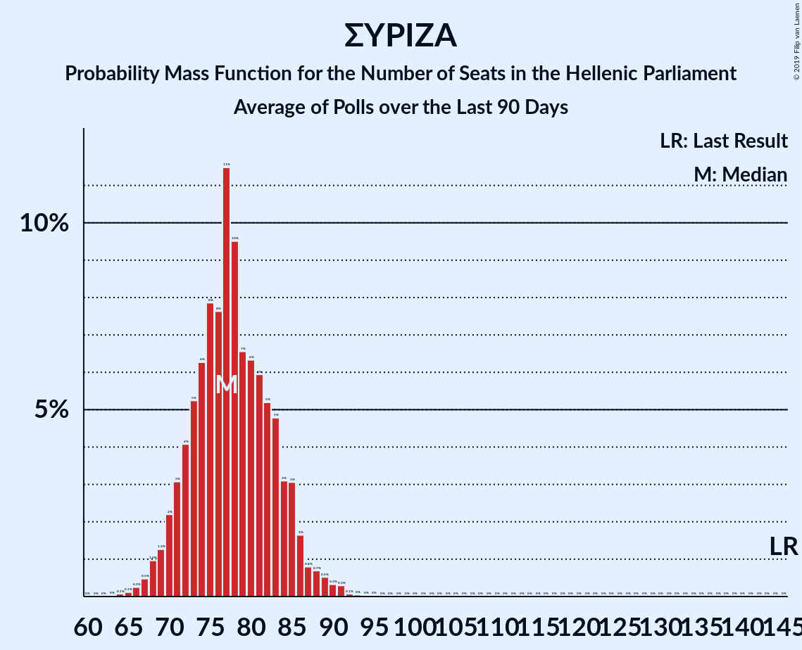

| Number of Seats | Probability | Accumulated | Special Marks |
|:---------------:|:-----------:|:-----------:|:-------------:|
| 64 | 0.1% | 100% |  |
| 65 | 0.1% | 99.9% |  |
| 66 | 0.3% | 99.8% |  |
| 67 | 0.5% | 99.5% |  |
| 68 | 1.0% | 99.0% |  |
| 69 | 1.3% | 98% |  |
| 70 | 2% | 97% |  |
| 71 | 3% | 95% |  |
| 72 | 4% | 92% |  |
| 73 | 5% | 87% |  |
| 74 | 6% | 82% |  |
| 75 | 8% | 76% |  |
| 76 | 8% | 68% |  |
| 77 | 11% | 60% | Median |
| 78 | 10% | 49% |  |
| 79 | 7% | 39% |  |
| 80 | 6% | 33% |  |
| 81 | 6% | 27% |  |
| 82 | 5% | 21% |  |
| 83 | 5% | 15% |  |
| 84 | 3% | 11% |  |
| 85 | 3% | 8% |  |
| 86 | 2% | 4% |  |
| 87 | 0.8% | 3% |  |
| 88 | 0.7% | 2% |  |
| 89 | 0.5% | 1.3% |  |
| 90 | 0.3% | 0.8% |  |
| 91 | 0.3% | 0.5% |  |
| 92 | 0.1% | 0.2% |  |
| 93 | 0% | 0.1% |  |
| 94 | 0% | 0.1% |  |
| 95 | 0% | 0% |  |
| 96 | 0% | 0% |  |
| 97 | 0% | 0% |  |
| 98 | 0% | 0% |  |
| 99 | 0% | 0% |  |
| 100 | 0% | 0% |  |
| 101 | 0% | 0% |  |
| 102 | 0% | 0% |  |
| 103 | 0% | 0% |  |
| 104 | 0% | 0% |  |
| 105 | 0% | 0% |  |
| 106 | 0% | 0% |  |
| 107 | 0% | 0% |  |
| 108 | 0% | 0% |  |
| 109 | 0% | 0% |  |
| 110 | 0% | 0% |  |
| 111 | 0% | 0% |  |
| 112 | 0% | 0% |  |
| 113 | 0% | 0% |  |
| 114 | 0% | 0% |  |
| 115 | 0% | 0% |  |
| 116 | 0% | 0% |  |
| 117 | 0% | 0% |  |
| 118 | 0% | 0% |  |
| 119 | 0% | 0% |  |
| 120 | 0% | 0% |  |
| 121 | 0% | 0% |  |
| 122 | 0% | 0% |  |
| 123 | 0% | 0% |  |
| 124 | 0% | 0% |  |
| 125 | 0% | 0% |  |
| 126 | 0% | 0% |  |
| 127 | 0% | 0% |  |
| 128 | 0% | 0% |  |
| 129 | 0% | 0% |  |
| 130 | 0% | 0% |  |
| 131 | 0% | 0% |  |
| 132 | 0% | 0% |  |
| 133 | 0% | 0% |  |
| 134 | 0% | 0% |  |
| 135 | 0% | 0% |  |
| 136 | 0% | 0% |  |
| 137 | 0% | 0% |  |
| 138 | 0% | 0% |  |
| 139 | 0% | 0% |  |
| 140 | 0% | 0% |  |
| 141 | 0% | 0% |  |
| 142 | 0% | 0% |  |
| 143 | 0% | 0% |  |
| 144 | 0% | 0% |  |
| 145 | 0% | 0% | Last Result |

## Technical Information

+ **Number of polls included in this average:** 11
+ **Lowest number of simulations done in a poll included in this average:** 1,048,576
+ **Total number of simulations done in the polls included in this average:** 11,534,336
+ **Error estimate:** 3.83%
