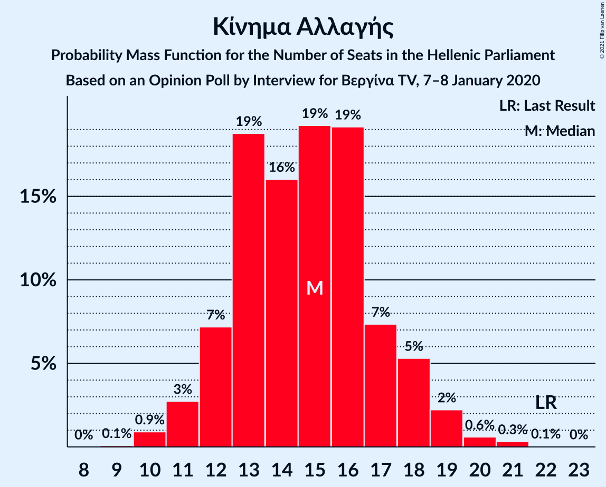

# Opinion Poll by Interview for Βεργίνα TV, 7–8 January 2020

<a href="#voting-intentions">Voting Intentions</a> | <a href="#seats">Seats</a> | <a href="#coalitions">Coalitions</a> | <a href="#technical-information">Technical Information</a>

## Voting Intentions

### Confidence Intervals

| Party | Last Result | Poll Result | 80% Confidence Interval | 90% Confidence Interval | 95% Confidence Interval | 99% Confidence Interval |
|:-----:|:-----------:|:-----------:|:-----------------------:|:-----------------------:|:-----------------------:|:-----------------------:|
| Νέα Δημοκρατία | 39.8% | 45.8% | 43.8–47.8% |43.2–48.4% |42.7–48.9% |41.7–49.8% |
| Συνασπισμός Ριζοσπαστικής Αριστεράς | 31.5% | 28.1% | 26.3–29.9% |25.8–30.5% |25.4–30.9% |24.5–31.8% |
| Κίνημα Αλλαγής | 8.1% | 5.4% | 4.6–6.4% |4.3–6.7% |4.1–7.0% |3.8–7.5% |
| Κομμουνιστικό Κόμμα Ελλάδας | 5.3% | 5.4% | 4.6–6.4% |4.3–6.7% |4.1–7.0% |3.8–7.5% |
| Ελληνική Λύση | 3.7% | 4.7% | 3.9–5.7% |3.7–5.9% |3.5–6.2% |3.2–6.7% |
| Μέτωπο Ευρωπαϊκής Ρεαλιστικής Ανυπακοής | 3.4% | 3.5% | 2.8–4.3% |2.7–4.6% |2.5–4.8% |2.2–5.3% |

*Note:* The poll result column reflects the actual value used in the calculations. Published results may vary slightly, and in addition be rounded to fewer digits.

## Seats

### Confidence Intervals

| Party | Last Result | Median | 80% Confidence Interval | 90% Confidence Interval | 95% Confidence Interval | 99% Confidence Interval |
|:-----:|:-----------:|:------:|:-----------------------:|:-----------------------:|:-----------------------:|:-----------------------:|
| <a href="#νέα-δημοκρατία">Νέα Δημοκρατία</a> | 158 | 172 | 170–176 |169–179 |168–183 |162–187 |
| <a href="#συνασπισμός-ριζοσπαστικής-αριστεράς">Συνασπισμός Ριζοσπαστικής Αριστεράς</a> | 86 | 76 | 72–81 |70–82 |69–83 |67–86 |
| <a href="#κίνημα-αλλαγής">Κίνημα Αλλαγής</a> | 22 | 15 | 12–17 |12–18 |11–19 |10–20 |
| <a href="#κομμουνιστικό-κόμμα-ελλάδας">Κομμουνιστικό Κόμμα Ελλάδας</a> | 15 | 15 | 12–17 |12–18 |11–19 |10–20 |
| <a href="#ελληνική-λύση">Ελληνική Λύση</a> | 10 | 13 | 11–15 |10–16 |10–17 |9–18 |
| <a href="#μέτωπο-ευρωπαϊκής-ρεαλιστικής-ανυπακοής">Μέτωπο Ευρωπαϊκής Ρεαλιστικής Ανυπακοής</a> | 9 | 10 | 0–12 |0–12 |0–13 |0–14 |

### Νέα Δημοκρατία

*For a full overview of the results for this party, see the [Νέα Δημοκρατία](party-νέαδημοκρατία.html) page.*

| Number of Seats | Probability | Accumulated | Special Marks |
|:---------------:|:-----------:|:-----------:|:-------------:|
| 158 | 0% | 100% | Last Result |
| 159 | 0% | 100% |  |
| 160 | 0.1% | 99.9% |  |
| 161 | 0.2% | 99.8% |  |
| 162 | 0.2% | 99.6% |  |
| 163 | 0.3% | 99.4% |  |
| 164 | 0.2% | 99.1% |  |
| 165 | 0.1% | 98.9% |  |
| 166 | 0.3% | 98.9% |  |
| 167 | 0.1% | 98.6% |  |
| 168 | 1.4% | 98.5% |  |
| 169 | 5% | 97% |  |
| 170 | 12% | 93% |  |
| 171 | 15% | 80% |  |
| 172 | 17% | 65% | Median |
| 173 | 18% | 48% |  |
| 174 | 11% | 30% |  |
| 175 | 6% | 19% |  |
| 176 | 4% | 13% |  |
| 177 | 3% | 9% |  |
| 178 | 0.8% | 6% |  |
| 179 | 0.5% | 5% |  |
| 180 | 0.1% | 5% |  |
| 181 | 0.3% | 4% |  |
| 182 | 0.8% | 4% |  |
| 183 | 0.9% | 3% |  |
| 184 | 0.9% | 2% |  |
| 185 | 0.7% | 2% |  |
| 186 | 0.2% | 0.8% |  |
| 187 | 0.4% | 0.6% |  |
| 188 | 0.1% | 0.2% |  |
| 189 | 0.1% | 0.1% |  |
| 190 | 0% | 0% |  |

### Συνασπισμός Ριζοσπαστικής Αριστεράς

*For a full overview of the results for this party, see the [Συνασπισμός Ριζοσπαστικής Αριστεράς](party-συνασπισμόςριζοσπαστικήςαριστεράς.html) page.*

| Number of Seats | Probability | Accumulated | Special Marks |
|:---------------:|:-----------:|:-----------:|:-------------:|
| 64 | 0.1% | 100% |  |
| 65 | 0.2% | 99.9% |  |
| 66 | 0.2% | 99.8% |  |
| 67 | 0.4% | 99.6% |  |
| 68 | 0.8% | 99.1% |  |
| 69 | 2% | 98% |  |
| 70 | 3% | 97% |  |
| 71 | 3% | 93% |  |
| 72 | 4% | 90% |  |
| 73 | 10% | 86% |  |
| 74 | 11% | 76% |  |
| 75 | 9% | 65% |  |
| 76 | 11% | 56% | Median |
| 77 | 9% | 46% |  |
| 78 | 10% | 37% |  |
| 79 | 10% | 27% |  |
| 80 | 4% | 16% |  |
| 81 | 5% | 12% |  |
| 82 | 3% | 7% |  |
| 83 | 2% | 5% |  |
| 84 | 0.9% | 2% |  |
| 85 | 0.6% | 1.4% |  |
| 86 | 0.4% | 0.8% | Last Result |
| 87 | 0.3% | 0.4% |  |
| 88 | 0% | 0.1% |  |
| 89 | 0% | 0.1% |  |
| 90 | 0% | 0% |  |

### Κίνημα Αλλαγής

*For a full overview of the results for this party, see the [Κίνημα Αλλαγής](party-κίνημααλλαγής.html) page.*

| Number of Seats | Probability | Accumulated | Special Marks |
|:---------------:|:-----------:|:-----------:|:-------------:|
| 9 | 0.1% | 100% |  |
| 10 | 0.7% | 99.9% |  |
| 11 | 2% | 99.2% |  |
| 12 | 9% | 97% |  |
| 13 | 10% | 88% |  |
| 14 | 21% | 78% |  |
| 15 | 21% | 57% | Median |
| 16 | 21% | 35% |  |
| 17 | 7% | 14% |  |
| 18 | 4% | 7% |  |
| 19 | 2% | 3% |  |
| 20 | 0.6% | 1.0% |  |
| 21 | 0.3% | 0.4% |  |
| 22 | 0.1% | 0.1% | Last Result |
| 23 | 0% | 0% |  |

### Κομμουνιστικό Κόμμα Ελλάδας

*For a full overview of the results for this party, see the [Κομμουνιστικό Κόμμα Ελλάδας](party-κομμουνιστικόκόμμαελλάδας.html) page.*

| Number of Seats | Probability | Accumulated | Special Marks |
|:---------------:|:-----------:|:-----------:|:-------------:|
| 9 | 0.1% | 100% |  |
| 10 | 0.8% | 99.9% |  |
| 11 | 3% | 99.1% |  |
| 12 | 9% | 96% |  |
| 13 | 13% | 87% |  |
| 14 | 21% | 73% |  |
| 15 | 14% | 52% | Last Result, Median |
| 16 | 18% | 38% |  |
| 17 | 11% | 20% |  |
| 18 | 6% | 9% |  |
| 19 | 2% | 3% |  |
| 20 | 0.9% | 1.2% |  |
| 21 | 0.2% | 0.3% |  |
| 22 | 0.1% | 0.1% |  |
| 23 | 0% | 0% |  |

### Ελληνική Λύση

*For a full overview of the results for this party, see the [Ελληνική Λύση](party-ελληνικήλύση.html) page.*

| Number of Seats | Probability | Accumulated | Special Marks |
|:---------------:|:-----------:|:-----------:|:-------------:|
| 0 | 0.1% | 100% |  |
| 1 | 0% | 99.9% |  |
| 2 | 0% | 99.9% |  |
| 3 | 0% | 99.9% |  |
| 4 | 0% | 99.9% |  |
| 5 | 0% | 99.9% |  |
| 6 | 0% | 99.9% |  |
| 7 | 0% | 99.9% |  |
| 8 | 0.1% | 99.9% |  |
| 9 | 1.3% | 99.8% |  |
| 10 | 4% | 98.5% | Last Result |
| 11 | 10% | 94% |  |
| 12 | 25% | 84% |  |
| 13 | 28% | 59% | Median |
| 14 | 16% | 30% |  |
| 15 | 9% | 14% |  |
| 16 | 2% | 6% |  |
| 17 | 2% | 3% |  |
| 18 | 0.8% | 1.0% |  |
| 19 | 0.2% | 0.2% |  |
| 20 | 0.1% | 0.1% |  |
| 21 | 0% | 0% |  |

### Μέτωπο Ευρωπαϊκής Ρεαλιστικής Ανυπακοής

*For a full overview of the results for this party, see the [Μέτωπο Ευρωπαϊκής Ρεαλιστικής Ανυπακοής](party-μέτωποευρωπαϊκήςρεαλιστικήςανυπακοής.html) page.*

| Number of Seats | Probability | Accumulated | Special Marks |
|:---------------:|:-----------:|:-----------:|:-------------:|
| 0 | 15% | 100% |  |
| 1 | 0% | 85% |  |
| 2 | 0% | 85% |  |
| 3 | 0% | 85% |  |
| 4 | 0% | 85% |  |
| 5 | 0% | 85% |  |
| 6 | 0% | 85% |  |
| 7 | 0% | 85% |  |
| 8 | 8% | 85% |  |
| 9 | 27% | 77% | Last Result |
| 10 | 22% | 50% | Median |
| 11 | 17% | 29% |  |
| 12 | 9% | 12% |  |
| 13 | 2% | 3% |  |
| 14 | 0.9% | 1.1% |  |
| 15 | 0.2% | 0.2% |  |
| 16 | 0% | 0% |  |

## Coalitions

### Confidence Intervals

| Coalition | Last Result | Median | Majority? | 80% Confidence Interval | 90% Confidence Interval | 95% Confidence Interval | 99% Confidence Interval |
|:---------:|:-----------:|:------:|:---------:|:-----------------------:|:-----------------------:|:-----------------------:|:-----------------------:|
| Νέα Δημοκρατία – Κίνημα Αλλαγής | 180 | 187 | 100% | 183–192 | 182–195 | 181–198 | 178–201 |
| Νέα Δημοκρατία | 158 | 172 | 100% | 170–176 | 169–179 | 168–183 | 162–187 |
| Συνασπισμός Ριζοσπαστικής Αριστεράς – Μέτωπο Ευρωπαϊκής Ρεαλιστικής Ανυπακοής | 95 | 85 | 0% | 79–90 | 78–91 | 75–92 | 72–95 |
| Συνασπισμός Ριζοσπαστικής Αριστεράς | 86 | 76 | 0% | 72–81 | 70–82 | 69–83 | 67–86 |

### Νέα Δημοκρατία – Κίνημα Αλλαγής

| Number of Seats | Probability | Accumulated | Special Marks |
|:---------------:|:-----------:|:-----------:|:-------------:|
| 174 | 0.1% | 100% |  |
| 175 | 0% | 99.9% |  |
| 176 | 0.1% | 99.9% |  |
| 177 | 0.2% | 99.8% |  |
| 178 | 0.2% | 99.6% |  |
| 179 | 0.5% | 99.4% |  |
| 180 | 0.6% | 98.9% | Last Result |
| 181 | 1.3% | 98% |  |
| 182 | 3% | 97% |  |
| 183 | 6% | 94% |  |
| 184 | 5% | 88% |  |
| 185 | 9% | 83% |  |
| 186 | 16% | 74% |  |
| 187 | 12% | 58% | Median |
| 188 | 9% | 46% |  |
| 189 | 11% | 37% |  |
| 190 | 8% | 26% |  |
| 191 | 6% | 18% |  |
| 192 | 3% | 11% |  |
| 193 | 1.5% | 8% |  |
| 194 | 1.4% | 7% |  |
| 195 | 2% | 5% |  |
| 196 | 0.7% | 4% |  |
| 197 | 0.4% | 3% |  |
| 198 | 0.6% | 3% |  |
| 199 | 0.8% | 2% |  |
| 200 | 0.5% | 1.2% |  |
| 201 | 0.5% | 0.7% |  |
| 202 | 0% | 0.2% |  |
| 203 | 0% | 0.1% |  |
| 204 | 0% | 0.1% |  |
| 205 | 0% | 0.1% |  |
| 206 | 0% | 0% |  |

### Νέα Δημοκρατία

| Number of Seats | Probability | Accumulated | Special Marks |
|:---------------:|:-----------:|:-----------:|:-------------:|
| 158 | 0% | 100% | Last Result |
| 159 | 0% | 100% |  |
| 160 | 0.1% | 99.9% |  |
| 161 | 0.2% | 99.8% |  |
| 162 | 0.2% | 99.6% |  |
| 163 | 0.3% | 99.4% |  |
| 164 | 0.2% | 99.1% |  |
| 165 | 0.1% | 98.9% |  |
| 166 | 0.3% | 98.9% |  |
| 167 | 0.1% | 98.6% |  |
| 168 | 1.4% | 98.5% |  |
| 169 | 5% | 97% |  |
| 170 | 12% | 93% |  |
| 171 | 15% | 80% |  |
| 172 | 17% | 65% | Median |
| 173 | 18% | 48% |  |
| 174 | 11% | 30% |  |
| 175 | 6% | 19% |  |
| 176 | 4% | 13% |  |
| 177 | 3% | 9% |  |
| 178 | 0.8% | 6% |  |
| 179 | 0.5% | 5% |  |
| 180 | 0.1% | 5% |  |
| 181 | 0.3% | 4% |  |
| 182 | 0.8% | 4% |  |
| 183 | 0.9% | 3% |  |
| 184 | 0.9% | 2% |  |
| 185 | 0.7% | 2% |  |
| 186 | 0.2% | 0.8% |  |
| 187 | 0.4% | 0.6% |  |
| 188 | 0.1% | 0.2% |  |
| 189 | 0.1% | 0.1% |  |
| 190 | 0% | 0% |  |

### Συνασπισμός Ριζοσπαστικής Αριστεράς – Μέτωπο Ευρωπαϊκής Ρεαλιστικής Ανυπακοής

| Number of Seats | Probability | Accumulated | Special Marks |
|:---------------:|:-----------:|:-----------:|:-------------:|
| 68 | 0% | 100% |  |
| 69 | 0.1% | 99.9% |  |
| 70 | 0.1% | 99.9% |  |
| 71 | 0.3% | 99.8% |  |
| 72 | 0.7% | 99.5% |  |
| 73 | 0.3% | 98.8% |  |
| 74 | 0.9% | 98.5% |  |
| 75 | 1.1% | 98% |  |
| 76 | 0.8% | 97% |  |
| 77 | 0.6% | 96% |  |
| 78 | 2% | 95% |  |
| 79 | 4% | 93% |  |
| 80 | 3% | 89% |  |
| 81 | 4% | 86% |  |
| 82 | 9% | 82% |  |
| 83 | 11% | 73% |  |
| 84 | 9% | 62% |  |
| 85 | 10% | 53% |  |
| 86 | 6% | 42% | Median |
| 87 | 8% | 37% |  |
| 88 | 11% | 29% |  |
| 89 | 7% | 18% |  |
| 90 | 3% | 11% |  |
| 91 | 5% | 8% |  |
| 92 | 2% | 3% |  |
| 93 | 0.5% | 1.1% |  |
| 94 | 0.1% | 0.7% |  |
| 95 | 0.2% | 0.5% | Last Result |
| 96 | 0.2% | 0.3% |  |
| 97 | 0.1% | 0.1% |  |
| 98 | 0% | 0.1% |  |
| 99 | 0% | 0% |  |

### Συνασπισμός Ριζοσπαστικής Αριστεράς

| Number of Seats | Probability | Accumulated | Special Marks |
|:---------------:|:-----------:|:-----------:|:-------------:|
| 64 | 0.1% | 100% |  |
| 65 | 0.2% | 99.9% |  |
| 66 | 0.2% | 99.8% |  |
| 67 | 0.4% | 99.6% |  |
| 68 | 0.8% | 99.1% |  |
| 69 | 2% | 98% |  |
| 70 | 3% | 97% |  |
| 71 | 3% | 93% |  |
| 72 | 4% | 90% |  |
| 73 | 10% | 86% |  |
| 74 | 11% | 76% |  |
| 75 | 9% | 65% |  |
| 76 | 11% | 56% | Median |
| 77 | 9% | 46% |  |
| 78 | 10% | 37% |  |
| 79 | 10% | 27% |  |
| 80 | 4% | 16% |  |
| 81 | 5% | 12% |  |
| 82 | 3% | 7% |  |
| 83 | 2% | 5% |  |
| 84 | 0.9% | 2% |  |
| 85 | 0.6% | 1.4% |  |
| 86 | 0.4% | 0.8% | Last Result |
| 87 | 0.3% | 0.4% |  |
| 88 | 0% | 0.1% |  |
| 89 | 0% | 0.1% |  |
| 90 | 0% | 0% |  |

## Technical Information

### Opinion Poll

+ **Polling firm:** Interview
+ **Commissioner(s):** Βεργίνα TV
+ **Fieldwork period:** 7–8 January 2020

### Calculations

+ **Sample size:** 1005
+ **Simulations done:** 131,072
+ **Error estimate:** 1.33%

