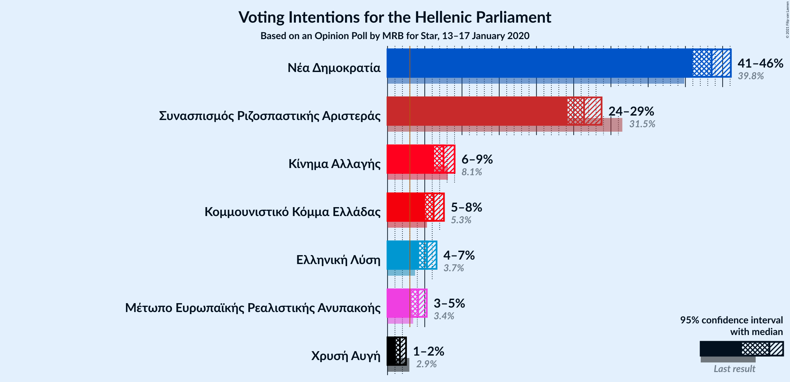
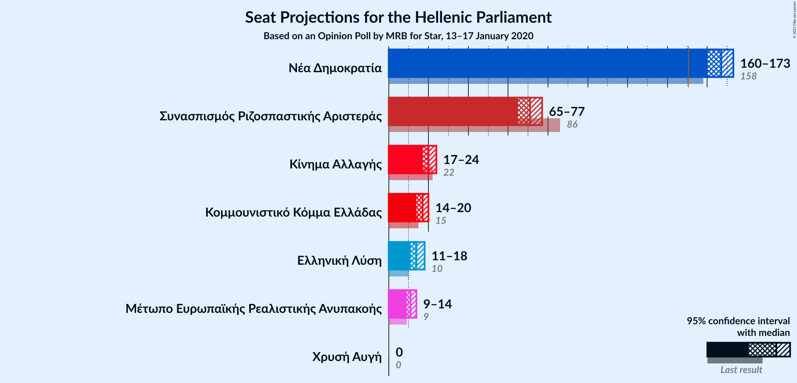
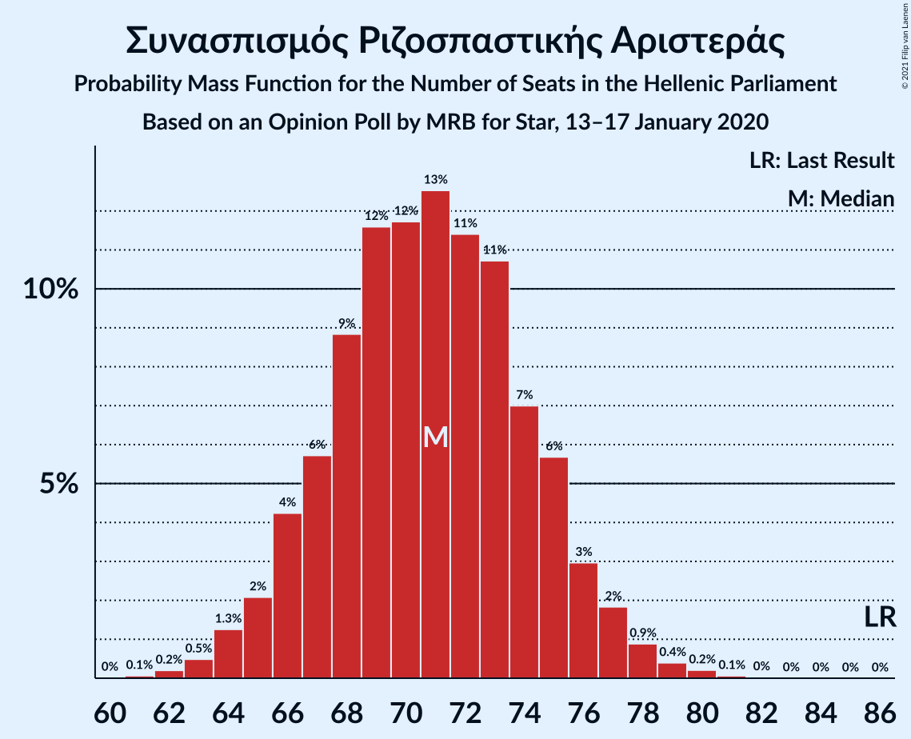
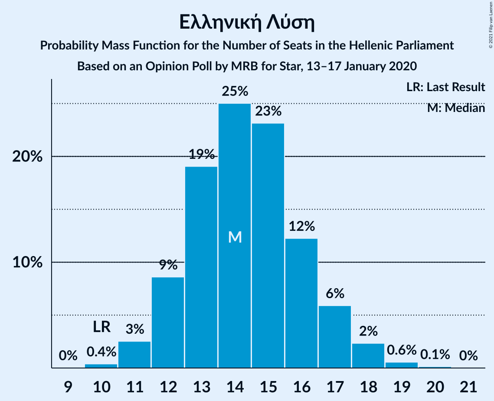
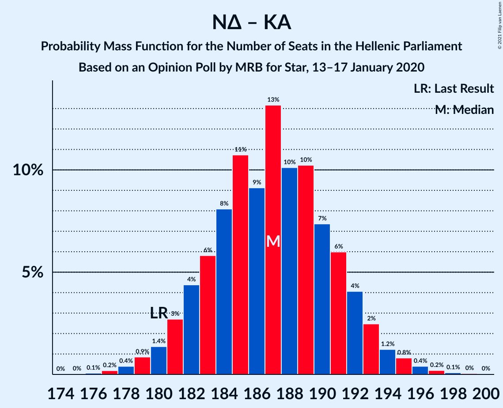
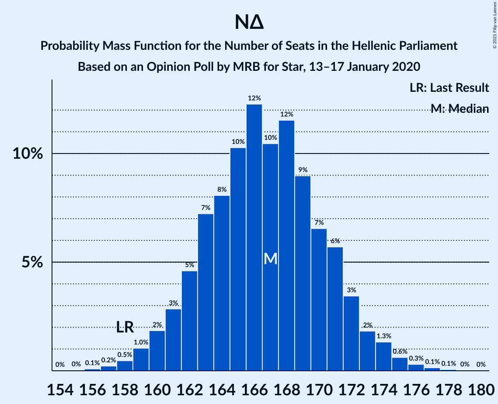
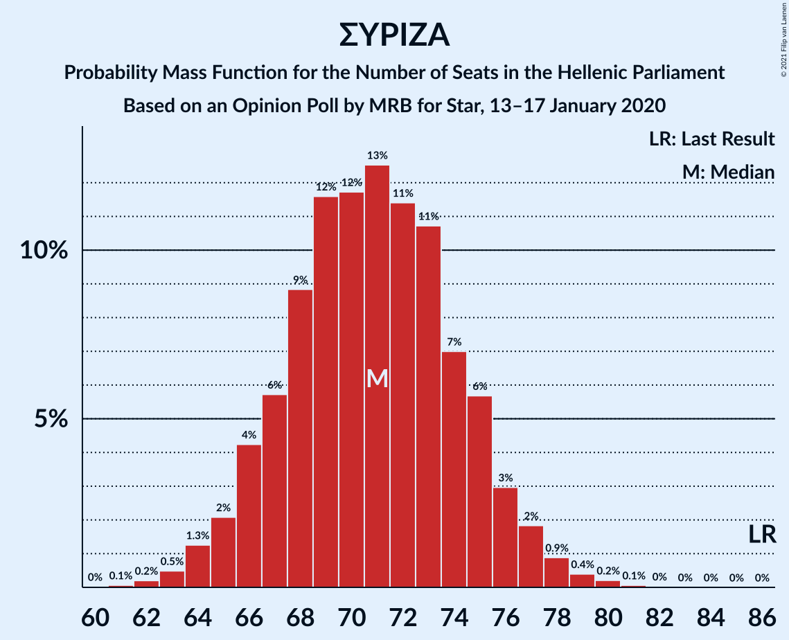

# Opinion Poll by MRB for Star, 13–17 January 2020

<a href="#voting-intentions">Voting Intentions</a> | <a href="#seats">Seats</a> | <a href="#coalitions">Coalitions</a> | <a href="#technical-information">Technical Information</a>

## Voting Intentions

### Confidence Intervals

| Party | Last Result | Poll Result | 80% Confidence Interval | 90% Confidence Interval | 95% Confidence Interval | 99% Confidence Interval |
|:-----:|:-----------:|:-----------:|:-----------------------:|:-----------------------:|:-----------------------:|:-----------------------:|
| Νέα Δημοκρατία | 39.8% | 43.5% | 41.9–45.2% |41.4–45.7% |41.0–46.1% |40.2–46.9% |
| Συνασπισμός Ριζοσπαστικής Αριστεράς | 31.5% | 26.4% | 24.9–27.9% |24.5–28.4% |24.2–28.7% |23.5–29.5% |
| Κίνημα Αλλαγής | 8.1% | 7.5% | 6.7–8.5% |6.5–8.8% |6.3–9.0% |5.9–9.5% |
| Κομμουνιστικό Κόμμα Ελλάδας | 5.3% | 6.2% | 5.4–7.1% |5.2–7.3% |5.1–7.6% |4.7–8.0% |
| Ελληνική Λύση | 3.7% | 5.3% | 4.6–6.1% |4.4–6.4% |4.2–6.6% |3.9–7.0% |
| Μέτωπο Ευρωπαϊκής Ρεαλιστικής Ανυπακοής | 3.4% | 4.1% | 3.5–4.9% |3.3–5.1% |3.2–5.3% |2.9–5.7% |
| Χρυσή Αυγή | 2.9% | 1.7% | 1.3–2.2% |1.2–2.3% |1.1–2.5% |1.0–2.8% |

*Note:* The poll result column reflects the actual value used in the calculations. Published results may vary slightly, and in addition be rounded to fewer digits.

## Seats

### Confidence Intervals

| Party | Last Result | Median | 80% Confidence Interval | 90% Confidence Interval | 95% Confidence Interval | 99% Confidence Interval |
|:-----:|:-----------:|:------:|:-----------------------:|:-----------------------:|:-----------------------:|:-----------------------:|
| <a href="#νέα-δημοκρατία">Νέα Δημοκρατία</a> | 158 | 166 | 162–171 |161–172 |160–173 |158–176 |
| <a href="#συνασπισμός-ριζοσπαστικής-αριστεράς">Συνασπισμός Ριζοσπαστικής Αριστεράς</a> | 86 | 71 | 67–75 |66–76 |65–77 |63–79 |
| <a href="#κίνημα-αλλαγής">Κίνημα Αλλαγής</a> | 22 | 21 | 18–23 |17–23 |17–24 |16–25 |
| <a href="#κομμουνιστικό-κόμμα-ελλάδας">Κομμουνιστικό Κόμμα Ελλάδας</a> | 15 | 17 | 15–19 |14–20 |13–21 |13–21 |
| <a href="#ελληνική-λύση">Ελληνική Λύση</a> | 10 | 14 | 12–17 |12–17 |11–18 |11–19 |
| <a href="#μέτωπο-ευρωπαϊκής-ρεαλιστικής-ανυπακοής">Μέτωπο Ευρωπαϊκής Ρεαλιστικής Ανυπακοής</a> | 9 | 11 | 9–13 |9–13 |8–14 |0–15 |
| <a href="#χρυσή-αυγή">Χρυσή Αυγή</a> | 0 | 0 | 0 |0 |0 |0 |

### Νέα Δημοκρατία

*For a full overview of the results for this party, see the [Νέα Δημοκρατία](party-νέαδημοκρατία.html) page.*

| Number of Seats | Probability | Accumulated | Special Marks |
|:---------------:|:-----------:|:-----------:|:-------------:|
| 155 | 0% | 100% |  |
| 156 | 0.1% | 99.9% |  |
| 157 | 0.2% | 99.9% |  |
| 158 | 0.6% | 99.7% | Last Result |
| 159 | 0.8% | 99.0% |  |
| 160 | 2% | 98% |  |
| 161 | 2% | 97% |  |
| 162 | 6% | 95% |  |
| 163 | 10% | 89% |  |
| 164 | 7% | 78% |  |
| 165 | 9% | 72% |  |
| 166 | 14% | 63% | Median |
| 167 | 12% | 49% |  |
| 168 | 10% | 36% |  |
| 169 | 10% | 26% |  |
| 170 | 4% | 16% |  |
| 171 | 5% | 12% |  |
| 172 | 4% | 7% |  |
| 173 | 2% | 4% |  |
| 174 | 0.6% | 2% |  |
| 175 | 0.4% | 1.1% |  |
| 176 | 0.4% | 0.7% |  |
| 177 | 0.2% | 0.3% |  |
| 178 | 0.1% | 0.1% |  |
| 179 | 0% | 0.1% |  |
| 180 | 0% | 0% |  |

### Συνασπισμός Ριζοσπαστικής Αριστεράς

*For a full overview of the results for this party, see the [Συνασπισμός Ριζοσπαστικής Αριστεράς](party-συνασπισμόςριζοσπαστικήςαριστεράς.html) page.*

| Number of Seats | Probability | Accumulated | Special Marks |
|:---------------:|:-----------:|:-----------:|:-------------:|
| 61 | 0.1% | 100% |  |
| 62 | 0.1% | 99.9% |  |
| 63 | 0.4% | 99.8% |  |
| 64 | 1.3% | 99.3% |  |
| 65 | 2% | 98% |  |
| 66 | 4% | 96% |  |
| 67 | 7% | 92% |  |
| 68 | 6% | 85% |  |
| 69 | 15% | 79% |  |
| 70 | 9% | 64% |  |
| 71 | 20% | 55% | Median |
| 72 | 8% | 36% |  |
| 73 | 8% | 28% |  |
| 74 | 8% | 20% |  |
| 75 | 5% | 11% |  |
| 76 | 4% | 7% |  |
| 77 | 1.2% | 3% |  |
| 78 | 0.9% | 2% |  |
| 79 | 0.5% | 0.8% |  |
| 80 | 0.3% | 0.3% |  |
| 81 | 0% | 0.1% |  |
| 82 | 0% | 0% |  |
| 83 | 0% | 0% |  |
| 84 | 0% | 0% |  |
| 85 | 0% | 0% |  |
| 86 | 0% | 0% | Last Result |

### Κίνημα Αλλαγής

*For a full overview of the results for this party, see the [Κίνημα Αλλαγής](party-κίνημααλλαγής.html) page.*

| Number of Seats | Probability | Accumulated | Special Marks |
|:---------------:|:-----------:|:-----------:|:-------------:|
| 15 | 0.3% | 100% |  |
| 16 | 2% | 99.7% |  |
| 17 | 3% | 98% |  |
| 18 | 10% | 95% |  |
| 19 | 20% | 85% |  |
| 20 | 12% | 65% |  |
| 21 | 23% | 53% | Median |
| 22 | 17% | 30% | Last Result |
| 23 | 9% | 14% |  |
| 24 | 3% | 5% |  |
| 25 | 2% | 2% |  |
| 26 | 0.2% | 0.3% |  |
| 27 | 0.1% | 0.1% |  |
| 28 | 0% | 0% |  |

### Κομμουνιστικό Κόμμα Ελλάδας

*For a full overview of the results for this party, see the [Κομμουνιστικό Κόμμα Ελλάδας](party-κομμουνιστικόκόμμαελλάδας.html) page.*

| Number of Seats | Probability | Accumulated | Special Marks |
|:---------------:|:-----------:|:-----------:|:-------------:|
| 12 | 0.3% | 100% |  |
| 13 | 3% | 99.7% |  |
| 14 | 6% | 97% |  |
| 15 | 14% | 91% | Last Result |
| 16 | 25% | 78% |  |
| 17 | 17% | 53% | Median |
| 18 | 18% | 36% |  |
| 19 | 10% | 18% |  |
| 20 | 5% | 7% |  |
| 21 | 2% | 3% |  |
| 22 | 0.2% | 0.3% |  |
| 23 | 0.1% | 0.1% |  |
| 24 | 0% | 0% |  |

### Ελληνική Λύση

*For a full overview of the results for this party, see the [Ελληνική Λύση](party-ελληνικήλύση.html) page.*

| Number of Seats | Probability | Accumulated | Special Marks |
|:---------------:|:-----------:|:-----------:|:-------------:|
| 10 | 0.4% | 100% | Last Result |
| 11 | 3% | 99.6% |  |
| 12 | 9% | 97% |  |
| 13 | 16% | 88% |  |
| 14 | 27% | 71% | Median |
| 15 | 26% | 44% |  |
| 16 | 8% | 19% |  |
| 17 | 7% | 10% |  |
| 18 | 2% | 3% |  |
| 19 | 0.6% | 0.9% |  |
| 20 | 0.2% | 0.3% |  |
| 21 | 0% | 0% |  |

### Μέτωπο Ευρωπαϊκής Ρεαλιστικής Ανυπακοής

*For a full overview of the results for this party, see the [Μέτωπο Ευρωπαϊκής Ρεαλιστικής Ανυπακοής](party-μέτωποευρωπαϊκήςρεαλιστικήςανυπακοής.html) page.*

| Number of Seats | Probability | Accumulated | Special Marks |
|:---------------:|:-----------:|:-----------:|:-------------:|
| 0 | 0.7% | 100% |  |
| 1 | 0% | 99.3% |  |
| 2 | 0% | 99.3% |  |
| 3 | 0% | 99.3% |  |
| 4 | 0% | 99.3% |  |
| 5 | 0% | 99.3% |  |
| 6 | 0% | 99.3% |  |
| 7 | 0% | 99.3% |  |
| 8 | 2% | 99.3% |  |
| 9 | 8% | 97% | Last Result |
| 10 | 23% | 89% |  |
| 11 | 20% | 66% | Median |
| 12 | 26% | 46% |  |
| 13 | 15% | 20% |  |
| 14 | 4% | 5% |  |
| 15 | 1.0% | 1.3% |  |
| 16 | 0.2% | 0.3% |  |
| 17 | 0% | 0% |  |

### Χρυσή Αυγή

*For a full overview of the results for this party, see the [Χρυσή Αυγή](party-χρυσήαυγή.html) page.*

| Number of Seats | Probability | Accumulated | Special Marks |
|:---------------:|:-----------:|:-----------:|:-------------:|
| 0 | 99.9% | 100% | Last Result, Median |
| 1 | 0% | 0.1% |  |
| 2 | 0% | 0.1% |  |
| 3 | 0% | 0.1% |  |
| 4 | 0% | 0.1% |  |
| 5 | 0% | 0.1% |  |
| 6 | 0% | 0.1% |  |
| 7 | 0% | 0.1% |  |
| 8 | 0.1% | 0.1% |  |
| 9 | 0% | 0% |  |

## Coalitions

### Confidence Intervals

| Coalition | Last Result | Median | Majority? | 80% Confidence Interval | 90% Confidence Interval | 95% Confidence Interval | 99% Confidence Interval |
|:---------:|:-----------:|:------:|:---------:|:-----------------------:|:-----------------------:|:-----------------------:|:-----------------------:|
| Νέα Δημοκρατία – Κίνημα Αλλαγής | 180 | 187 | 100% | 183–191 | 182–193 | 180–193 | 178–197 |
| Νέα Δημοκρατία | 158 | 166 | 100% | 162–171 | 161–172 | 160–173 | 158–176 |
| Συνασπισμός Ριζοσπαστικής Αριστεράς – Μέτωπο Ευρωπαϊκής Ρεαλιστικής Ανυπακοής | 95 | 82 | 0% | 78–87 | 77–87 | 76–88 | 74–90 |
| Συνασπισμός Ριζοσπαστικής Αριστεράς | 86 | 71 | 0% | 67–75 | 66–76 | 65–77 | 63–79 |

### Νέα Δημοκρατία – Κίνημα Αλλαγής

| Number of Seats | Probability | Accumulated | Special Marks |
|:---------------:|:-----------:|:-----------:|:-------------:|
| 176 | 0.1% | 100% |  |
| 177 | 0.2% | 99.9% |  |
| 178 | 0.5% | 99.7% |  |
| 179 | 0.9% | 99.2% |  |
| 180 | 1.3% | 98% | Last Result |
| 181 | 2% | 97% |  |
| 182 | 4% | 95% |  |
| 183 | 6% | 91% |  |
| 184 | 4% | 85% |  |
| 185 | 14% | 80% |  |
| 186 | 10% | 66% |  |
| 187 | 13% | 56% | Median |
| 188 | 14% | 43% |  |
| 189 | 11% | 30% |  |
| 190 | 8% | 19% |  |
| 191 | 4% | 11% |  |
| 192 | 2% | 7% |  |
| 193 | 3% | 5% |  |
| 194 | 0.6% | 2% |  |
| 195 | 0.7% | 2% |  |
| 196 | 0.5% | 1.0% |  |
| 197 | 0.2% | 0.5% |  |
| 198 | 0.1% | 0.3% |  |
| 199 | 0.1% | 0.2% |  |
| 200 | 0.1% | 0.1% |  |
| 201 | 0% | 0% |  |

### Νέα Δημοκρατία

| Number of Seats | Probability | Accumulated | Special Marks |
|:---------------:|:-----------:|:-----------:|:-------------:|
| 155 | 0% | 100% |  |
| 156 | 0.1% | 99.9% |  |
| 157 | 0.2% | 99.9% |  |
| 158 | 0.6% | 99.7% | Last Result |
| 159 | 0.8% | 99.0% |  |
| 160 | 2% | 98% |  |
| 161 | 2% | 97% |  |
| 162 | 6% | 95% |  |
| 163 | 10% | 89% |  |
| 164 | 7% | 78% |  |
| 165 | 9% | 72% |  |
| 166 | 14% | 63% | Median |
| 167 | 12% | 49% |  |
| 168 | 10% | 36% |  |
| 169 | 10% | 26% |  |
| 170 | 4% | 16% |  |
| 171 | 5% | 12% |  |
| 172 | 4% | 7% |  |
| 173 | 2% | 4% |  |
| 174 | 0.6% | 2% |  |
| 175 | 0.4% | 1.1% |  |
| 176 | 0.4% | 0.7% |  |
| 177 | 0.2% | 0.3% |  |
| 178 | 0.1% | 0.1% |  |
| 179 | 0% | 0.1% |  |
| 180 | 0% | 0% |  |

### Συνασπισμός Ριζοσπαστικής Αριστεράς – Μέτωπο Ευρωπαϊκής Ρεαλιστικής Ανυπακοής

| Number of Seats | Probability | Accumulated | Special Marks |
|:---------------:|:-----------:|:-----------:|:-------------:|
| 69 | 0% | 100% |  |
| 70 | 0% | 99.9% |  |
| 71 | 0.1% | 99.9% |  |
| 72 | 0.1% | 99.8% |  |
| 73 | 0.2% | 99.7% |  |
| 74 | 0.3% | 99.5% |  |
| 75 | 1.3% | 99.2% |  |
| 76 | 3% | 98% |  |
| 77 | 5% | 95% |  |
| 78 | 3% | 90% |  |
| 79 | 12% | 87% |  |
| 80 | 9% | 75% |  |
| 81 | 12% | 66% |  |
| 82 | 14% | 54% | Median |
| 83 | 10% | 40% |  |
| 84 | 3% | 30% |  |
| 85 | 12% | 28% |  |
| 86 | 4% | 16% |  |
| 87 | 8% | 12% |  |
| 88 | 1.0% | 3% |  |
| 89 | 1.3% | 2% |  |
| 90 | 0.6% | 1.0% |  |
| 91 | 0.3% | 0.4% |  |
| 92 | 0.1% | 0.1% |  |
| 93 | 0% | 0.1% |  |
| 94 | 0% | 0% |  |
| 95 | 0% | 0% | Last Result |

### Συνασπισμός Ριζοσπαστικής Αριστεράς

| Number of Seats | Probability | Accumulated | Special Marks |
|:---------------:|:-----------:|:-----------:|:-------------:|
| 61 | 0.1% | 100% |  |
| 62 | 0.1% | 99.9% |  |
| 63 | 0.4% | 99.8% |  |
| 64 | 1.3% | 99.3% |  |
| 65 | 2% | 98% |  |
| 66 | 4% | 96% |  |
| 67 | 7% | 92% |  |
| 68 | 6% | 85% |  |
| 69 | 15% | 79% |  |
| 70 | 9% | 64% |  |
| 71 | 20% | 55% | Median |
| 72 | 8% | 36% |  |
| 73 | 8% | 28% |  |
| 74 | 8% | 20% |  |
| 75 | 5% | 11% |  |
| 76 | 4% | 7% |  |
| 77 | 1.2% | 3% |  |
| 78 | 0.9% | 2% |  |
| 79 | 0.5% | 0.8% |  |
| 80 | 0.3% | 0.3% |  |
| 81 | 0% | 0.1% |  |
| 82 | 0% | 0% |  |
| 83 | 0% | 0% |  |
| 84 | 0% | 0% |  |
| 85 | 0% | 0% |  |
| 86 | 0% | 0% | Last Result |

## Technical Information

### Opinion Poll

+ **Polling firm:** MRB
+ **Commissioner(s):** Star
+ **Fieldwork period:** 13–17 January 2020

### Calculations

+ **Sample size:** 1436
+ **Simulations done:** 131,072
+ **Error estimate:** 1.05%

