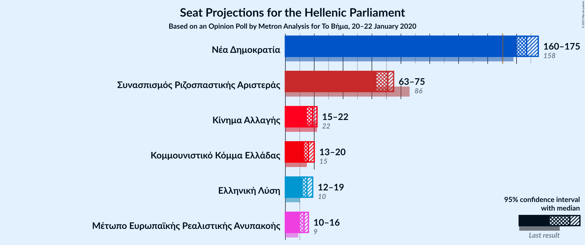
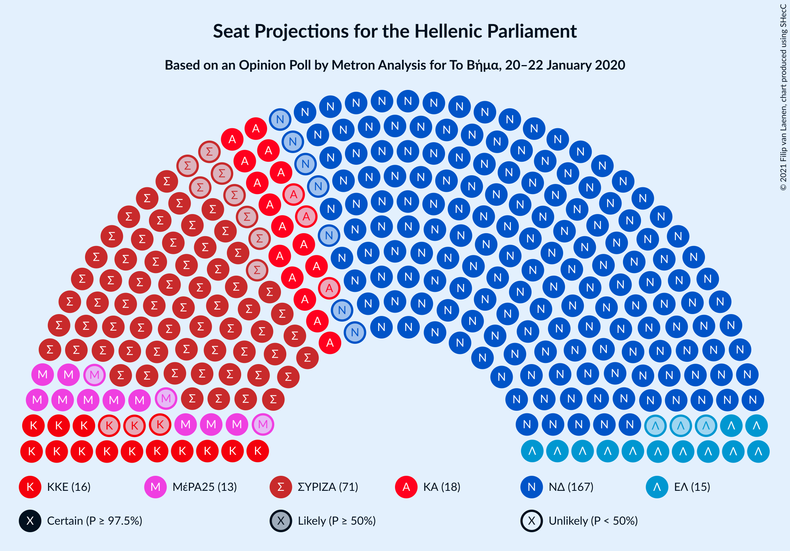
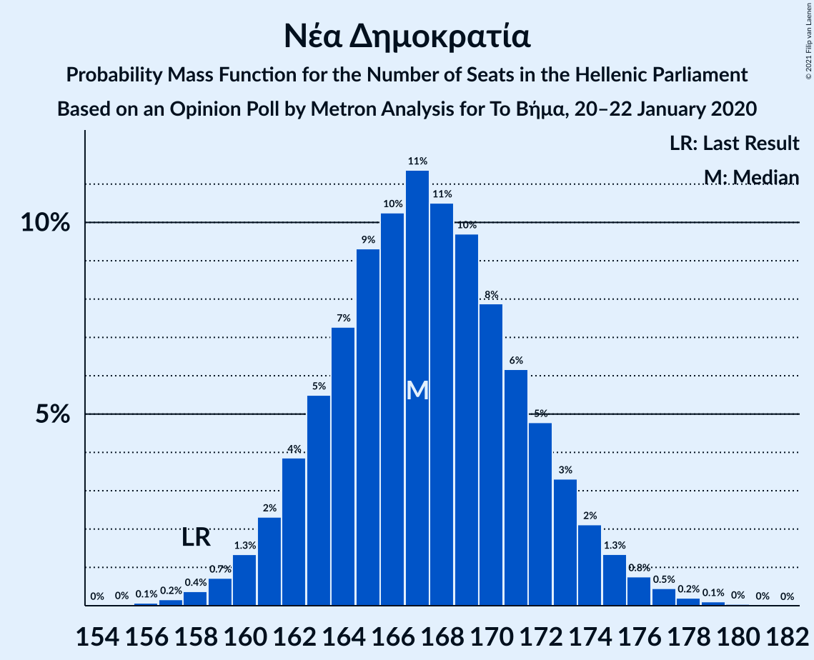
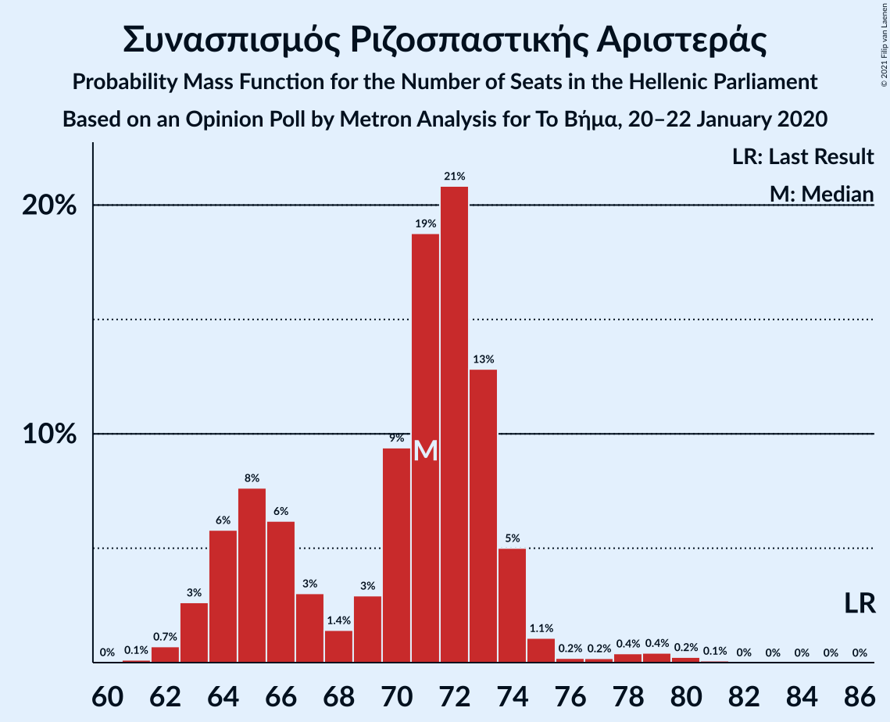
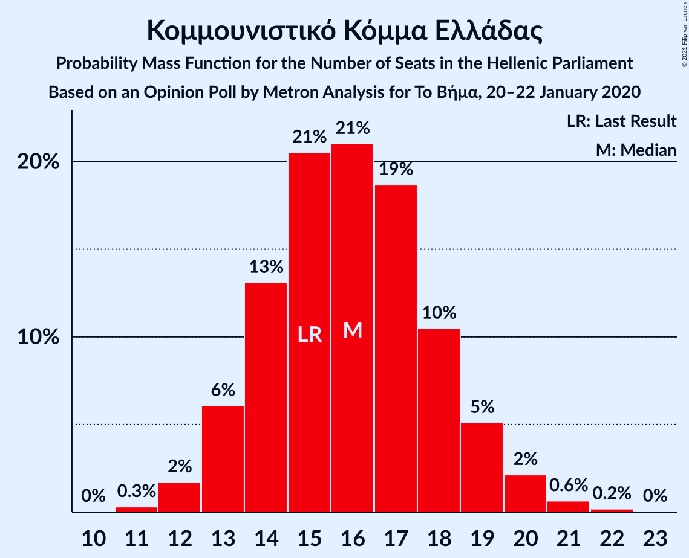
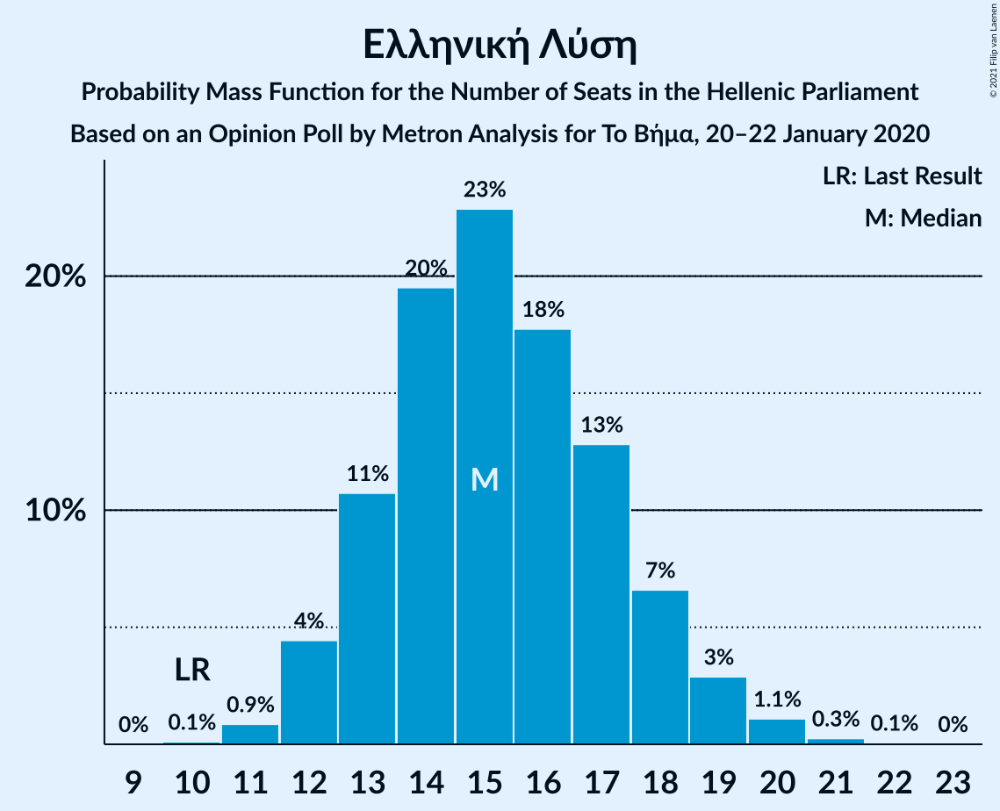
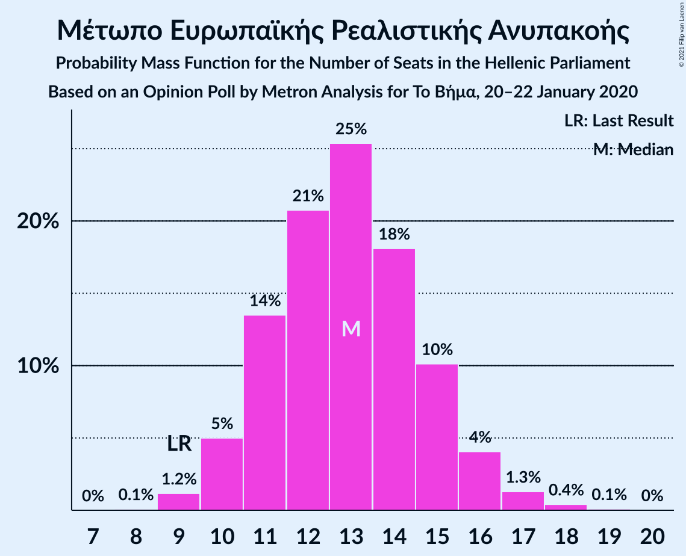
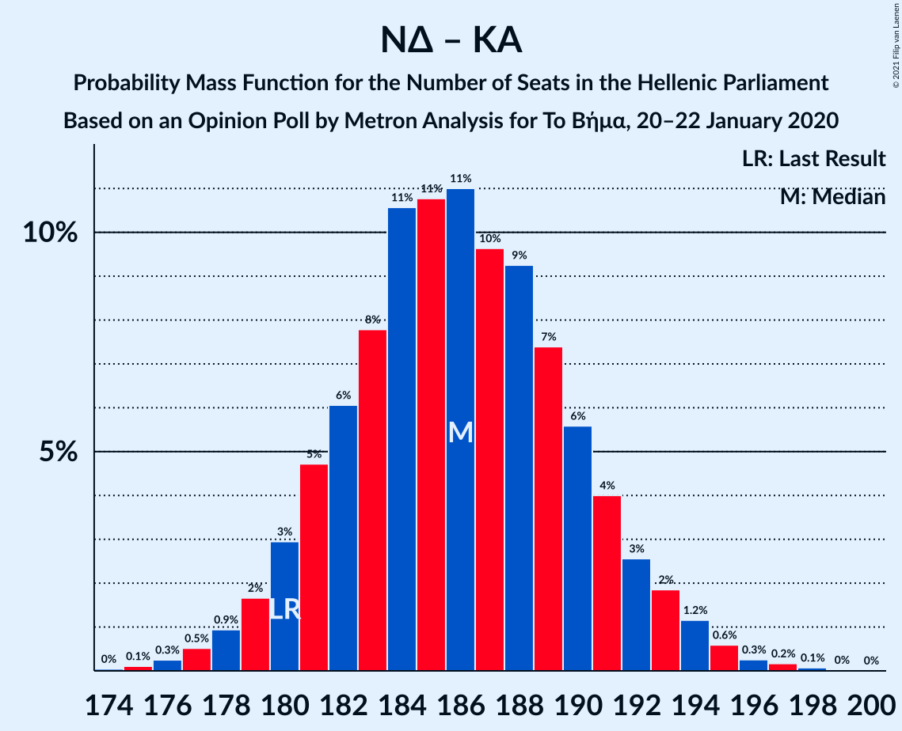
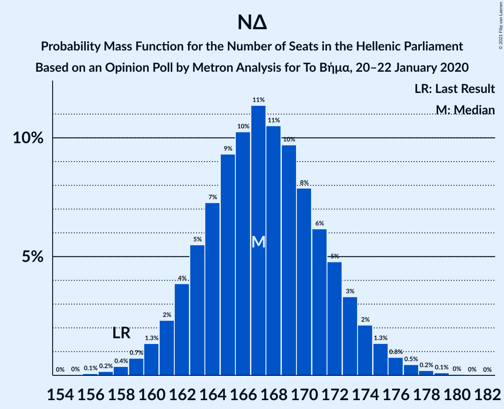

# Opinion Poll by Metron Analysis for Το Βήμα, 20–22 January 2020

<a href="#voting-intentions">Voting Intentions</a> | <a href="#seats">Seats</a> | <a href="#coalitions">Coalitions</a> | <a href="#technical-information">Technical Information</a>

## Voting Intentions

### Confidence Intervals

| Party | Last Result | Poll Result | 80% Confidence Interval | 90% Confidence Interval | 95% Confidence Interval | 99% Confidence Interval |
|:-----:|:-----------:|:-----------:|:-----------------------:|:-----------------------:|:-----------------------:|:-----------------------:|
| Νέα Δημοκρατία | 39.8% | 45.2% | 43.4–47.1% |42.9–47.6% |42.4–48.1% |41.5–48.9% |
| Συνασπισμός Ριζοσπαστικής Αριστεράς | 31.5% | 26.8% | 25.2–28.5% |24.7–28.9% |24.3–29.4% |23.6–30.2% |
| Κίνημα Αλλαγής | 8.1% | 7.1% | 6.2–8.1% |5.9–8.4% |5.7–8.7% |5.3–9.2% |
| Κομμουνιστικό Κόμμα Ελλάδας | 5.3% | 6.1% | 5.3–7.0% |5.0–7.3% |4.8–7.6% |4.5–8.1% |
| Ελληνική Λύση | 3.7% | 5.8% | 5.0–6.8% |4.8–7.1% |4.6–7.3% |4.3–7.8% |
| Μέτωπο Ευρωπαϊκής Ρεαλιστικής Ανυπακοής | 3.4% | 4.9% | 4.2–5.8% |4.0–6.1% |3.8–6.3% |3.5–6.7% |

*Note:* The poll result column reflects the actual value used in the calculations. Published results may vary slightly, and in addition be rounded to fewer digits.

## Seats

### Confidence Intervals

| Party | Last Result | Median | 80% Confidence Interval | 90% Confidence Interval | 95% Confidence Interval | 99% Confidence Interval |
|:-----:|:-----------:|:------:|:-----------------------:|:-----------------------:|:-----------------------:|:-----------------------:|
| <a href="#νέα-δημοκρατία">Νέα Δημοκρατία</a> | 158 | 167 | 163–172 |161–173 |160–175 |158–177 |
| <a href="#συνασπισμός-ριζοσπαστικής-αριστεράς">Συνασπισμός Ριζοσπαστικής Αριστεράς</a> | 86 | 71 | 65–73 |64–74 |63–75 |62–79 |
| <a href="#κίνημα-αλλαγής">Κίνημα Αλλαγής</a> | 22 | 19 | 16–21 |16–22 |15–22 |14–24 |
| <a href="#κομμουνιστικό-κόμμα-ελλάδας">Κομμουνιστικό Κόμμα Ελλάδας</a> | 15 | 16 | 14–18 |13–19 |13–20 |12–21 |
| <a href="#ελληνική-λύση">Ελληνική Λύση</a> | 10 | 15 | 13–18 |12–18 |12–19 |11–20 |
| <a href="#μέτωπο-ευρωπαϊκής-ρεαλιστικής-ανυπακοής">Μέτωπο Ευρωπαϊκής Ρεαλιστικής Ανυπακοής</a> | 9 | 13 | 11–15 |10–16 |10–16 |9–17 |

### Νέα Δημοκρατία

*For a full overview of the results for this party, see the [Νέα Δημοκρατία](party-νέαδημοκρατία.html) page.*

| Number of Seats | Probability | Accumulated | Special Marks |
|:---------------:|:-----------:|:-----------:|:-------------:|
| 156 | 0.1% | 100% |  |
| 157 | 0.2% | 99.9% |  |
| 158 | 0.4% | 99.7% | Last Result |
| 159 | 0.7% | 99.3% |  |
| 160 | 1.4% | 98.7% |  |
| 161 | 2% | 97% |  |
| 162 | 4% | 95% |  |
| 163 | 5% | 91% |  |
| 164 | 8% | 86% |  |
| 165 | 9% | 78% |  |
| 166 | 10% | 69% |  |
| 167 | 11% | 58% | Median |
| 168 | 11% | 47% |  |
| 169 | 10% | 37% |  |
| 170 | 8% | 27% |  |
| 171 | 6% | 19% |  |
| 172 | 5% | 13% |  |
| 173 | 3% | 8% |  |
| 174 | 2% | 5% |  |
| 175 | 1.4% | 3% |  |
| 176 | 0.8% | 2% |  |
| 177 | 0.4% | 0.8% |  |
| 178 | 0.2% | 0.4% |  |
| 179 | 0.1% | 0.2% |  |
| 180 | 0% | 0.1% |  |
| 181 | 0% | 0% |  |

### Συνασπισμός Ριζοσπαστικής Αριστεράς

*For a full overview of the results for this party, see the [Συνασπισμός Ριζοσπαστικής Αριστεράς](party-συνασπισμόςριζοσπαστικήςαριστεράς.html) page.*

| Number of Seats | Probability | Accumulated | Special Marks |
|:---------------:|:-----------:|:-----------:|:-------------:|
| 60 | 0% | 100% |  |
| 61 | 0.1% | 99.9% |  |
| 62 | 0.7% | 99.8% |  |
| 63 | 3% | 99.1% |  |
| 64 | 6% | 97% |  |
| 65 | 8% | 91% |  |
| 66 | 6% | 83% |  |
| 67 | 3% | 77% |  |
| 68 | 1.5% | 74% |  |
| 69 | 3% | 72% |  |
| 70 | 9% | 69% |  |
| 71 | 18% | 60% | Median |
| 72 | 21% | 42% |  |
| 73 | 13% | 21% |  |
| 74 | 5% | 8% |  |
| 75 | 1.1% | 3% |  |
| 76 | 0.2% | 2% |  |
| 77 | 0.2% | 1.4% |  |
| 78 | 0.4% | 1.2% |  |
| 79 | 0.4% | 0.8% |  |
| 80 | 0.2% | 0.4% |  |
| 81 | 0.1% | 0.1% |  |
| 82 | 0% | 0% |  |
| 83 | 0% | 0% |  |
| 84 | 0% | 0% |  |
| 85 | 0% | 0% |  |
| 86 | 0% | 0% | Last Result |

### Κίνημα Αλλαγής

*For a full overview of the results for this party, see the [Κίνημα Αλλαγής](party-κίνημααλλαγής.html) page.*

| Number of Seats | Probability | Accumulated | Special Marks |
|:---------------:|:-----------:|:-----------:|:-------------:|
| 13 | 0.2% | 100% |  |
| 14 | 1.0% | 99.8% |  |
| 15 | 4% | 98.7% |  |
| 16 | 9% | 95% |  |
| 17 | 16% | 86% |  |
| 18 | 20% | 70% |  |
| 19 | 20% | 50% | Median |
| 20 | 15% | 30% |  |
| 21 | 9% | 16% |  |
| 22 | 5% | 7% | Last Result |
| 23 | 2% | 2% |  |
| 24 | 0.5% | 0.7% |  |
| 25 | 0.2% | 0.2% |  |
| 26 | 0% | 0% |  |

### Κομμουνιστικό Κόμμα Ελλάδας

*For a full overview of the results for this party, see the [Κομμουνιστικό Κόμμα Ελλάδας](party-κομμουνιστικόκόμμαελλάδας.html) page.*

| Number of Seats | Probability | Accumulated | Special Marks |
|:---------------:|:-----------:|:-----------:|:-------------:|
| 11 | 0.3% | 100% |  |
| 12 | 2% | 99.7% |  |
| 13 | 6% | 98% |  |
| 14 | 13% | 92% |  |
| 15 | 21% | 79% | Last Result |
| 16 | 21% | 58% | Median |
| 17 | 18% | 37% |  |
| 18 | 11% | 19% |  |
| 19 | 5% | 8% |  |
| 20 | 2% | 3% |  |
| 21 | 0.6% | 0.8% |  |
| 22 | 0.2% | 0.2% |  |
| 23 | 0% | 0% |  |

### Ελληνική Λύση

*For a full overview of the results for this party, see the [Ελληνική Λύση](party-ελληνικήλύση.html) page.*

| Number of Seats | Probability | Accumulated | Special Marks |
|:---------------:|:-----------:|:-----------:|:-------------:|
| 10 | 0.1% | 100% | Last Result |
| 11 | 0.9% | 99.9% |  |
| 12 | 4% | 99.0% |  |
| 13 | 11% | 94% |  |
| 14 | 20% | 84% |  |
| 15 | 22% | 64% | Median |
| 16 | 18% | 42% |  |
| 17 | 13% | 24% |  |
| 18 | 6% | 11% |  |
| 19 | 3% | 4% |  |
| 20 | 1.1% | 1.4% |  |
| 21 | 0.2% | 0.3% |  |
| 22 | 0.1% | 0.1% |  |
| 23 | 0% | 0% |  |

### Μέτωπο Ευρωπαϊκής Ρεαλιστικής Ανυπακοής

*For a full overview of the results for this party, see the [Μέτωπο Ευρωπαϊκής Ρεαλιστικής Ανυπακοής](party-μέτωποευρωπαϊκήςρεαλιστικήςανυπακοής.html) page.*

| Number of Seats | Probability | Accumulated | Special Marks |
|:---------------:|:-----------:|:-----------:|:-------------:|
| 8 | 0.1% | 100% |  |
| 9 | 1.2% | 99.9% | Last Result |
| 10 | 5% | 98.7% |  |
| 11 | 13% | 94% |  |
| 12 | 20% | 80% |  |
| 13 | 24% | 60% | Median |
| 14 | 19% | 36% |  |
| 15 | 11% | 16% |  |
| 16 | 4% | 6% |  |
| 17 | 1.3% | 2% |  |
| 18 | 0.4% | 0.5% |  |
| 19 | 0.1% | 0.1% |  |
| 20 | 0% | 0% |  |

## Coalitions

### Confidence Intervals

| Coalition | Last Result | Median | Majority? | 80% Confidence Interval | 90% Confidence Interval | 95% Confidence Interval | 99% Confidence Interval |
|:---------:|:-----------:|:------:|:---------:|:-----------------------:|:-----------------------:|:-----------------------:|:-----------------------:|
| Νέα Δημοκρατία – Κίνημα Αλλαγής | 180 | 186 | 100% | 181–191 | 180–192 | 179–193 | 177–196 |
| Νέα Δημοκρατία | 158 | 167 | 100% | 163–172 | 161–173 | 160–175 | 158–177 |
| Συνασπισμός Ριζοσπαστικής Αριστεράς – Μέτωπο Ευρωπαϊκής Ρεαλιστικής Ανυπακοής | 95 | 83 | 0% | 78–87 | 76–88 | 75–89 | 74–92 |
| Συνασπισμός Ριζοσπαστικής Αριστεράς | 86 | 71 | 0% | 65–73 | 64–74 | 63–75 | 62–79 |

### Νέα Δημοκρατία – Κίνημα Αλλαγής

| Number of Seats | Probability | Accumulated | Special Marks |
|:---------------:|:-----------:|:-----------:|:-------------:|
| 174 | 0% | 100% |  |
| 175 | 0.1% | 99.9% |  |
| 176 | 0.3% | 99.8% |  |
| 177 | 0.5% | 99.6% |  |
| 178 | 0.9% | 99.0% |  |
| 179 | 2% | 98% |  |
| 180 | 3% | 96% | Last Result |
| 181 | 4% | 93% |  |
| 182 | 7% | 89% |  |
| 183 | 8% | 82% |  |
| 184 | 10% | 74% |  |
| 185 | 10% | 64% |  |
| 186 | 10% | 54% | Median |
| 187 | 11% | 44% |  |
| 188 | 9% | 32% |  |
| 189 | 7% | 23% |  |
| 190 | 5% | 16% |  |
| 191 | 4% | 11% |  |
| 192 | 3% | 7% |  |
| 193 | 2% | 4% |  |
| 194 | 1.2% | 2% |  |
| 195 | 0.6% | 1.1% |  |
| 196 | 0.3% | 0.5% |  |
| 197 | 0.2% | 0.3% |  |
| 198 | 0.1% | 0.1% |  |
| 199 | 0% | 0% |  |

### Νέα Δημοκρατία

| Number of Seats | Probability | Accumulated | Special Marks |
|:---------------:|:-----------:|:-----------:|:-------------:|
| 156 | 0.1% | 100% |  |
| 157 | 0.2% | 99.9% |  |
| 158 | 0.4% | 99.7% | Last Result |
| 159 | 0.7% | 99.3% |  |
| 160 | 1.4% | 98.7% |  |
| 161 | 2% | 97% |  |
| 162 | 4% | 95% |  |
| 163 | 5% | 91% |  |
| 164 | 8% | 86% |  |
| 165 | 9% | 78% |  |
| 166 | 10% | 69% |  |
| 167 | 11% | 58% | Median |
| 168 | 11% | 47% |  |
| 169 | 10% | 37% |  |
| 170 | 8% | 27% |  |
| 171 | 6% | 19% |  |
| 172 | 5% | 13% |  |
| 173 | 3% | 8% |  |
| 174 | 2% | 5% |  |
| 175 | 1.4% | 3% |  |
| 176 | 0.8% | 2% |  |
| 177 | 0.4% | 0.8% |  |
| 178 | 0.2% | 0.4% |  |
| 179 | 0.1% | 0.2% |  |
| 180 | 0% | 0.1% |  |
| 181 | 0% | 0% |  |

### Συνασπισμός Ριζοσπαστικής Αριστεράς – Μέτωπο Ευρωπαϊκής Ρεαλιστικής Ανυπακοής

| Number of Seats | Probability | Accumulated | Special Marks |
|:---------------:|:-----------:|:-----------:|:-------------:|
| 72 | 0.1% | 100% |  |
| 73 | 0.3% | 99.9% |  |
| 74 | 0.8% | 99.6% |  |
| 75 | 2% | 98.9% |  |
| 76 | 2% | 97% |  |
| 77 | 3% | 95% |  |
| 78 | 5% | 92% |  |
| 79 | 5% | 87% |  |
| 80 | 6% | 82% |  |
| 81 | 8% | 76% |  |
| 82 | 8% | 68% |  |
| 83 | 11% | 60% |  |
| 84 | 12% | 49% | Median |
| 85 | 13% | 37% |  |
| 86 | 11% | 24% |  |
| 87 | 6% | 13% |  |
| 88 | 3% | 7% |  |
| 89 | 2% | 4% |  |
| 90 | 0.9% | 2% |  |
| 91 | 0.4% | 1.0% |  |
| 92 | 0.3% | 0.6% |  |
| 93 | 0.1% | 0.2% |  |
| 94 | 0.1% | 0.1% |  |
| 95 | 0% | 0% | Last Result |

### Συνασπισμός Ριζοσπαστικής Αριστεράς

| Number of Seats | Probability | Accumulated | Special Marks |
|:---------------:|:-----------:|:-----------:|:-------------:|
| 60 | 0% | 100% |  |
| 61 | 0.1% | 99.9% |  |
| 62 | 0.7% | 99.8% |  |
| 63 | 3% | 99.1% |  |
| 64 | 6% | 97% |  |
| 65 | 8% | 91% |  |
| 66 | 6% | 83% |  |
| 67 | 3% | 77% |  |
| 68 | 1.5% | 74% |  |
| 69 | 3% | 72% |  |
| 70 | 9% | 69% |  |
| 71 | 18% | 60% | Median |
| 72 | 21% | 42% |  |
| 73 | 13% | 21% |  |
| 74 | 5% | 8% |  |
| 75 | 1.1% | 3% |  |
| 76 | 0.2% | 2% |  |
| 77 | 0.2% | 1.4% |  |
| 78 | 0.4% | 1.2% |  |
| 79 | 0.4% | 0.8% |  |
| 80 | 0.2% | 0.4% |  |
| 81 | 0.1% | 0.1% |  |
| 82 | 0% | 0% |  |
| 83 | 0% | 0% |  |
| 84 | 0% | 0% |  |
| 85 | 0% | 0% |  |
| 86 | 0% | 0% | Last Result |

## Technical Information

### Opinion Poll

+ **Polling firm:** Metron Analysis
+ **Commissioner(s):** Το Βήμα
+ **Fieldwork period:** 20–22 January 2020

### Calculations

+ **Sample size:** 1203
+ **Simulations done:** 524,288
+ **Error estimate:** 0.56%

