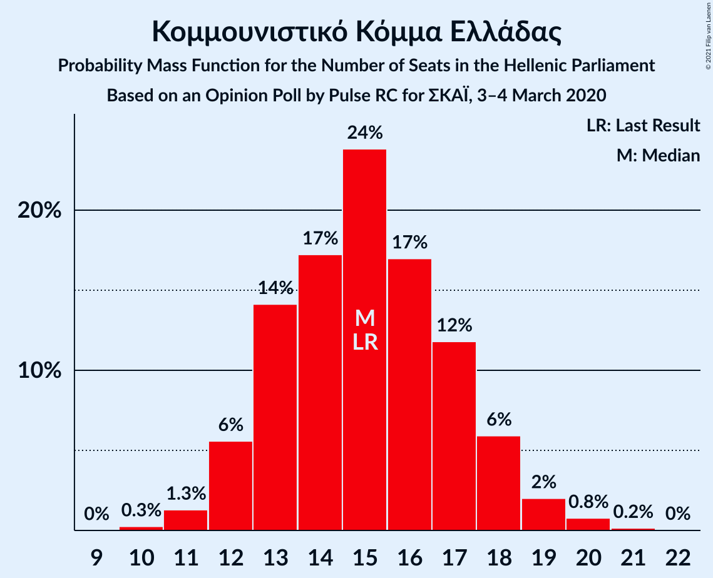

# Opinion Poll by Pulse RC for ΣΚΑΪ, 3–4 March 2020

<a href="#voting-intentions">Voting Intentions</a> | <a href="#seats">Seats</a> | <a href="#coalitions">Coalitions</a> | <a href="#technical-information">Technical Information</a>

## Voting Intentions

### Confidence Intervals

| Party | Last Result | Poll Result | 80% Confidence Interval | 90% Confidence Interval | 95% Confidence Interval | 99% Confidence Interval |
|:-----:|:-----------:|:-----------:|:-----------------------:|:-----------------------:|:-----------------------:|:-----------------------:|
| Νέα Δημοκρατία | 39.8% | 43.5% | 41.7–45.3% |41.2–45.8% |40.8–46.2% |39.9–47.1% |
| Συνασπισμός Ριζοσπαστικής Αριστεράς | 31.5% | 28.0% | 26.4–29.6% |25.9–30.1% |25.6–30.5% |24.8–31.3% |
| Κίνημα Αλλαγής | 8.1% | 7.5% | 6.6–8.5% |6.4–8.8% |6.1–9.1% |5.7–9.6% |
| Ελληνική Λύση | 3.7% | 6.0% | 5.2–6.9% |5.0–7.2% |4.8–7.4% |4.4–7.9% |
| Κομμουνιστικό Κόμμα Ελλάδας | 5.3% | 5.5% | 4.7–6.4% |4.5–6.7% |4.4–6.9% |4.0–7.4% |
| Μέτωπο Ευρωπαϊκής Ρεαλιστικής Ανυπακοής | 3.4% | 3.0% | 2.5–3.7% |2.3–3.9% |2.2–4.1% |2.0–4.5% |
| Χρυσή Αυγή | 2.9% | 1.5% | 1.1–2.1% |1.1–2.2% |1.0–2.3% |0.8–2.6% |

*Note:* The poll result column reflects the actual value used in the calculations. Published results may vary slightly, and in addition be rounded to fewer digits.

## Seats

### Confidence Intervals

| Party | Last Result | Median | 80% Confidence Interval | 90% Confidence Interval | 95% Confidence Interval | 99% Confidence Interval |
|:-----:|:-----------:|:------:|:-----------------------:|:-----------------------:|:-----------------------:|:-----------------------:|
| <a href="#νέα-δημοκρατία">Νέα Δημοκρατία</a> | 158 | 167 | 162–173 |161–175 |159–176 |157–178 |
| <a href="#συνασπισμός-ριζοσπαστικής-αριστεράς">Συνασπισμός Ριζοσπαστικής Αριστεράς</a> | 86 | 76 | 71–80 |70–82 |69–83 |67–85 |
| <a href="#κίνημα-αλλαγής">Κίνημα Αλλαγής</a> | 22 | 20 | 18–23 |17–24 |17–25 |16–26 |
| <a href="#ελληνική-λύση">Ελληνική Λύση</a> | 10 | 16 | 14–19 |13–19 |13–20 |12–21 |
| <a href="#κομμουνιστικό-κόμμα-ελλάδας">Κομμουνιστικό Κόμμα Ελλάδας</a> | 15 | 15 | 13–17 |12–18 |12–19 |11–20 |
| <a href="#μέτωπο-ευρωπαϊκής-ρεαλιστικής-ανυπακοής">Μέτωπο Ευρωπαϊκής Ρεαλιστικής Ανυπακοής</a> | 9 | 8 | 0–10 |0–11 |0–11 |0–12 |
| <a href="#χρυσή-αυγή">Χρυσή Αυγή</a> | 0 | 0 | 0 |0 |0 |0 |

### Νέα Δημοκρατία

*For a full overview of the results for this party, see the [Νέα Δημοκρατία](party-νέαδημοκρατία.html) page.*

| Number of Seats | Probability | Accumulated | Special Marks |
|:---------------:|:-----------:|:-----------:|:-------------:|
| 154 | 0% | 100% |  |
| 155 | 0.1% | 99.9% |  |
| 156 | 0.2% | 99.9% |  |
| 157 | 0.3% | 99.7% |  |
| 158 | 0.7% | 99.4% | Last Result |
| 159 | 1.4% | 98.7% |  |
| 160 | 2% | 97% |  |
| 161 | 3% | 95% |  |
| 162 | 4% | 92% |  |
| 163 | 6% | 88% |  |
| 164 | 7% | 82% |  |
| 165 | 8% | 75% |  |
| 166 | 9% | 67% |  |
| 167 | 9% | 58% | Median |
| 168 | 8% | 49% |  |
| 169 | 9% | 41% |  |
| 170 | 6% | 32% |  |
| 171 | 8% | 26% |  |
| 172 | 4% | 18% |  |
| 173 | 5% | 14% |  |
| 174 | 3% | 9% |  |
| 175 | 3% | 6% |  |
| 176 | 0.9% | 3% |  |
| 177 | 1.1% | 2% |  |
| 178 | 0.4% | 0.8% |  |
| 179 | 0.2% | 0.4% |  |
| 180 | 0.1% | 0.2% |  |
| 181 | 0.1% | 0.1% |  |
| 182 | 0% | 0% |  |

### Συνασπισμός Ριζοσπαστικής Αριστεράς

*For a full overview of the results for this party, see the [Συνασπισμός Ριζοσπαστικής Αριστεράς](party-συνασπισμόςριζοσπαστικήςαριστεράς.html) page.*

| Number of Seats | Probability | Accumulated | Special Marks |
|:---------------:|:-----------:|:-----------:|:-------------:|
| 65 | 0.1% | 100% |  |
| 66 | 0.3% | 99.9% |  |
| 67 | 0.6% | 99.6% |  |
| 68 | 1.2% | 99.0% |  |
| 69 | 1.5% | 98% |  |
| 70 | 3% | 96% |  |
| 71 | 4% | 93% |  |
| 72 | 7% | 89% |  |
| 73 | 9% | 82% |  |
| 74 | 9% | 73% |  |
| 75 | 12% | 64% |  |
| 76 | 14% | 52% | Median |
| 77 | 8% | 39% |  |
| 78 | 8% | 30% |  |
| 79 | 6% | 22% |  |
| 80 | 5% | 15% |  |
| 81 | 4% | 10% |  |
| 82 | 2% | 6% |  |
| 83 | 2% | 4% |  |
| 84 | 1.1% | 2% |  |
| 85 | 0.4% | 0.8% |  |
| 86 | 0.3% | 0.4% | Last Result |
| 87 | 0.1% | 0.2% |  |
| 88 | 0% | 0.1% |  |
| 89 | 0% | 0% |  |

### Κίνημα Αλλαγής

*For a full overview of the results for this party, see the [Κίνημα Αλλαγής](party-κίνημααλλαγής.html) page.*

| Number of Seats | Probability | Accumulated | Special Marks |
|:---------------:|:-----------:|:-----------:|:-------------:|
| 14 | 0.1% | 100% |  |
| 15 | 0.4% | 99.9% |  |
| 16 | 2% | 99.5% |  |
| 17 | 5% | 98% |  |
| 18 | 10% | 92% |  |
| 19 | 18% | 83% |  |
| 20 | 18% | 65% | Median |
| 21 | 21% | 46% |  |
| 22 | 11% | 26% | Last Result |
| 23 | 8% | 14% |  |
| 24 | 4% | 7% |  |
| 25 | 2% | 3% |  |
| 26 | 0.7% | 0.9% |  |
| 27 | 0.2% | 0.3% |  |
| 28 | 0.1% | 0.1% |  |
| 29 | 0% | 0% |  |

### Ελληνική Λύση

*For a full overview of the results for this party, see the [Ελληνική Λύση](party-ελληνικήλύση.html) page.*

| Number of Seats | Probability | Accumulated | Special Marks |
|:---------------:|:-----------:|:-----------:|:-------------:|
| 10 | 0% | 100% | Last Result |
| 11 | 0.2% | 100% |  |
| 12 | 1.3% | 99.8% |  |
| 13 | 4% | 98.5% |  |
| 14 | 9% | 94% |  |
| 15 | 20% | 85% |  |
| 16 | 19% | 65% | Median |
| 17 | 20% | 45% |  |
| 18 | 13% | 25% |  |
| 19 | 7% | 12% |  |
| 20 | 3% | 5% |  |
| 21 | 1.0% | 1.5% |  |
| 22 | 0.3% | 0.4% |  |
| 23 | 0.1% | 0.1% |  |
| 24 | 0% | 0% |  |

### Κομμουνιστικό Κόμμα Ελλάδας

*For a full overview of the results for this party, see the [Κομμουνιστικό Κόμμα Ελλάδας](party-κομμουνιστικόκόμμαελλάδας.html) page.*

| Number of Seats | Probability | Accumulated | Special Marks |
|:---------------:|:-----------:|:-----------:|:-------------:|
| 10 | 0.3% | 100% |  |
| 11 | 1.3% | 99.7% |  |
| 12 | 6% | 98% |  |
| 13 | 14% | 93% |  |
| 14 | 17% | 79% |  |
| 15 | 24% | 61% | Last Result, Median |
| 16 | 17% | 38% |  |
| 17 | 12% | 21% |  |
| 18 | 6% | 9% |  |
| 19 | 2% | 3% |  |
| 20 | 0.8% | 1.0% |  |
| 21 | 0.2% | 0.2% |  |
| 22 | 0% | 0% |  |

### Μέτωπο Ευρωπαϊκής Ρεαλιστικής Ανυπακοής

*For a full overview of the results for this party, see the [Μέτωπο Ευρωπαϊκής Ρεαλιστικής Ανυπακοής](party-μέτωποευρωπαϊκήςρεαλιστικήςανυπακοής.html) page.*

| Number of Seats | Probability | Accumulated | Special Marks |
|:---------------:|:-----------:|:-----------:|:-------------:|
| 0 | 46% | 100% |  |
| 1 | 0% | 54% |  |
| 2 | 0% | 54% |  |
| 3 | 0% | 54% |  |
| 4 | 0% | 54% |  |
| 5 | 0% | 54% |  |
| 6 | 0% | 54% |  |
| 7 | 0% | 54% |  |
| 8 | 10% | 54% | Median |
| 9 | 26% | 44% | Last Result |
| 10 | 13% | 18% |  |
| 11 | 4% | 5% |  |
| 12 | 0.9% | 1.1% |  |
| 13 | 0.2% | 0.2% |  |
| 14 | 0% | 0% |  |

### Χρυσή Αυγή

*For a full overview of the results for this party, see the [Χρυσή Αυγή](party-χρυσήαυγή.html) page.*

| Number of Seats | Probability | Accumulated | Special Marks |
|:---------------:|:-----------:|:-----------:|:-------------:|
| 0 | 100% | 100% | Last Result, Median |

## Coalitions

### Confidence Intervals

| Coalition | Last Result | Median | Majority? | 80% Confidence Interval | 90% Confidence Interval | 95% Confidence Interval | 99% Confidence Interval |
|:---------:|:-----------:|:------:|:---------:|:-----------------------:|:-----------------------:|:-----------------------:|:-----------------------:|
| Νέα Δημοκρατία – Κίνημα Αλλαγής | 180 | 188 | 100% | 182–194 | 181–195 | 179–197 | 177–199 |
| Νέα Δημοκρατία | 158 | 167 | 100% | 162–173 | 161–175 | 159–176 | 157–178 |
| Συνασπισμός Ριζοσπαστικής Αριστεράς – Μέτωπο Ευρωπαϊκής Ρεαλιστικής Ανυπακοής | 95 | 81 | 0% | 74–87 | 73–88 | 72–89 | 70–92 |
| Συνασπισμός Ριζοσπαστικής Αριστεράς | 86 | 76 | 0% | 71–80 | 70–82 | 69–83 | 67–85 |

### Νέα Δημοκρατία – Κίνημα Αλλαγής

| Number of Seats | Probability | Accumulated | Special Marks |
|:---------------:|:-----------:|:-----------:|:-------------:|
| 174 | 0% | 100% |  |
| 175 | 0.1% | 99.9% |  |
| 176 | 0.1% | 99.9% |  |
| 177 | 0.3% | 99.7% |  |
| 178 | 0.6% | 99.4% |  |
| 179 | 1.4% | 98.8% |  |
| 180 | 2% | 97% | Last Result |
| 181 | 3% | 95% |  |
| 182 | 4% | 93% |  |
| 183 | 6% | 89% |  |
| 184 | 8% | 83% |  |
| 185 | 7% | 75% |  |
| 186 | 9% | 68% |  |
| 187 | 7% | 59% | Median |
| 188 | 8% | 52% |  |
| 189 | 7% | 44% |  |
| 190 | 8% | 37% |  |
| 191 | 5% | 28% |  |
| 192 | 5% | 23% |  |
| 193 | 5% | 18% |  |
| 194 | 5% | 13% |  |
| 195 | 4% | 8% |  |
| 196 | 2% | 4% |  |
| 197 | 1.1% | 3% |  |
| 198 | 0.7% | 1.4% |  |
| 199 | 0.4% | 0.7% |  |
| 200 | 0.2% | 0.3% |  |
| 201 | 0.1% | 0.1% |  |
| 202 | 0% | 0.1% |  |
| 203 | 0% | 0% |  |

### Νέα Δημοκρατία

| Number of Seats | Probability | Accumulated | Special Marks |
|:---------------:|:-----------:|:-----------:|:-------------:|
| 154 | 0% | 100% |  |
| 155 | 0.1% | 99.9% |  |
| 156 | 0.2% | 99.9% |  |
| 157 | 0.3% | 99.7% |  |
| 158 | 0.7% | 99.4% | Last Result |
| 159 | 1.4% | 98.7% |  |
| 160 | 2% | 97% |  |
| 161 | 3% | 95% |  |
| 162 | 4% | 92% |  |
| 163 | 6% | 88% |  |
| 164 | 7% | 82% |  |
| 165 | 8% | 75% |  |
| 166 | 9% | 67% |  |
| 167 | 9% | 58% | Median |
| 168 | 8% | 49% |  |
| 169 | 9% | 41% |  |
| 170 | 6% | 32% |  |
| 171 | 8% | 26% |  |
| 172 | 4% | 18% |  |
| 173 | 5% | 14% |  |
| 174 | 3% | 9% |  |
| 175 | 3% | 6% |  |
| 176 | 0.9% | 3% |  |
| 177 | 1.1% | 2% |  |
| 178 | 0.4% | 0.8% |  |
| 179 | 0.2% | 0.4% |  |
| 180 | 0.1% | 0.2% |  |
| 181 | 0.1% | 0.1% |  |
| 182 | 0% | 0% |  |

### Συνασπισμός Ριζοσπαστικής Αριστεράς – Μέτωπο Ευρωπαϊκής Ρεαλιστικής Ανυπακοής

| Number of Seats | Probability | Accumulated | Special Marks |
|:---------------:|:-----------:|:-----------:|:-------------:|
| 67 | 0% | 100% |  |
| 68 | 0.2% | 99.9% |  |
| 69 | 0.2% | 99.8% |  |
| 70 | 0.6% | 99.6% |  |
| 71 | 0.8% | 99.0% |  |
| 72 | 1.2% | 98% |  |
| 73 | 3% | 97% |  |
| 74 | 4% | 93% |  |
| 75 | 5% | 90% |  |
| 76 | 7% | 85% |  |
| 77 | 4% | 78% |  |
| 78 | 6% | 73% |  |
| 79 | 7% | 68% |  |
| 80 | 8% | 61% |  |
| 81 | 9% | 53% |  |
| 82 | 6% | 45% |  |
| 83 | 7% | 39% |  |
| 84 | 9% | 32% | Median |
| 85 | 7% | 23% |  |
| 86 | 5% | 16% |  |
| 87 | 4% | 11% |  |
| 88 | 3% | 7% |  |
| 89 | 1.5% | 4% |  |
| 90 | 1.3% | 2% |  |
| 91 | 0.6% | 1.1% |  |
| 92 | 0.3% | 0.5% |  |
| 93 | 0.1% | 0.2% |  |
| 94 | 0.1% | 0.1% |  |
| 95 | 0% | 0% | Last Result |

### Συνασπισμός Ριζοσπαστικής Αριστεράς

| Number of Seats | Probability | Accumulated | Special Marks |
|:---------------:|:-----------:|:-----------:|:-------------:|
| 65 | 0.1% | 100% |  |
| 66 | 0.3% | 99.9% |  |
| 67 | 0.6% | 99.6% |  |
| 68 | 1.2% | 99.0% |  |
| 69 | 1.5% | 98% |  |
| 70 | 3% | 96% |  |
| 71 | 4% | 93% |  |
| 72 | 7% | 89% |  |
| 73 | 9% | 82% |  |
| 74 | 9% | 73% |  |
| 75 | 12% | 64% |  |
| 76 | 14% | 52% | Median |
| 77 | 8% | 39% |  |
| 78 | 8% | 30% |  |
| 79 | 6% | 22% |  |
| 80 | 5% | 15% |  |
| 81 | 4% | 10% |  |
| 82 | 2% | 6% |  |
| 83 | 2% | 4% |  |
| 84 | 1.1% | 2% |  |
| 85 | 0.4% | 0.8% |  |
| 86 | 0.3% | 0.4% | Last Result |
| 87 | 0.1% | 0.2% |  |
| 88 | 0% | 0.1% |  |
| 89 | 0% | 0% |  |

## Technical Information

### Opinion Poll

+ **Polling firm:** Pulse RC
+ **Commissioner(s):** ΣΚΑΪ
+ **Fieldwork period:** 3–4 March 2020

### Calculations

+ **Sample size:** 1258
+ **Simulations done:** 1,048,576
+ **Error estimate:** 0.70%

