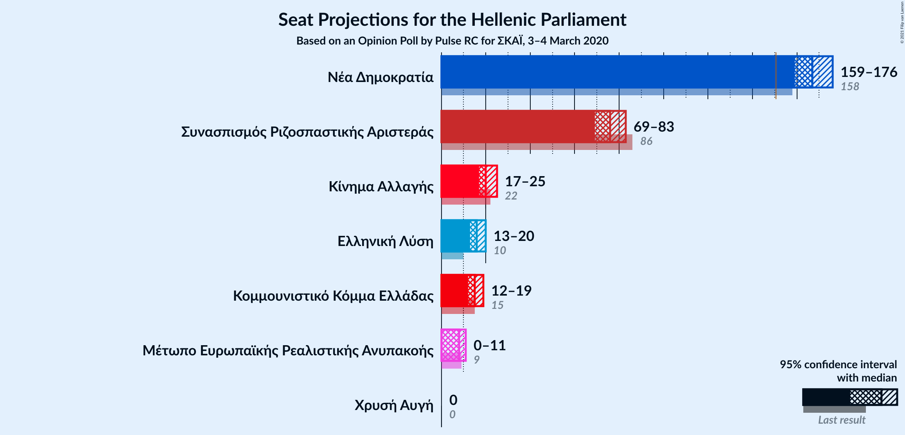
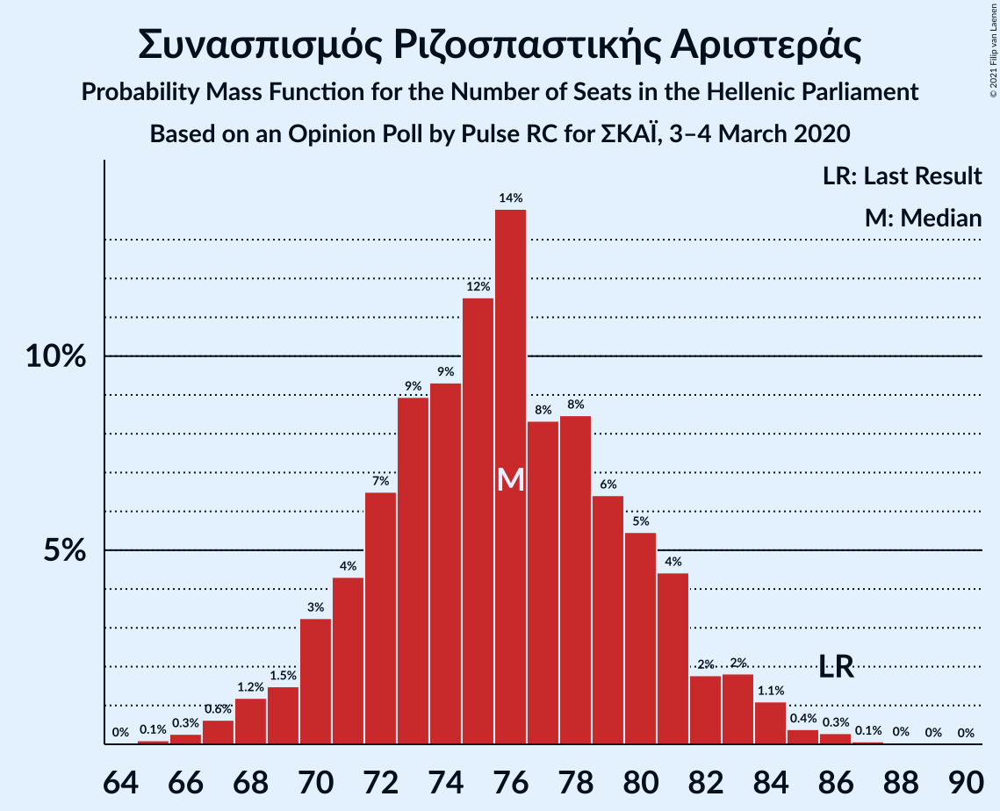
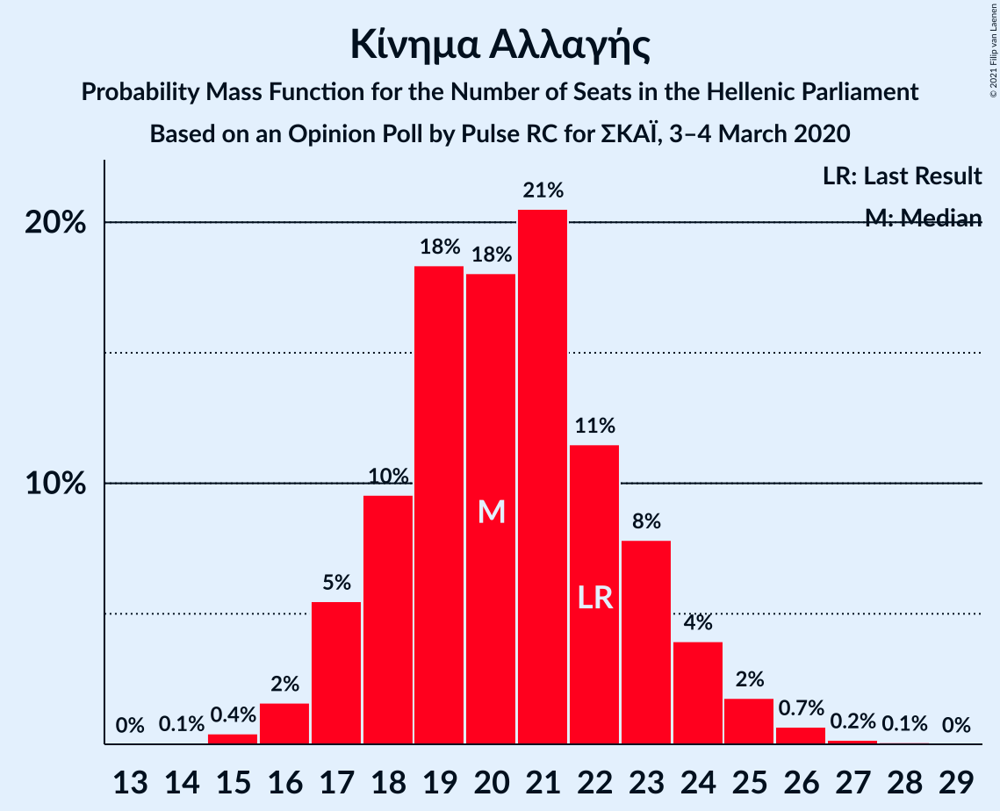
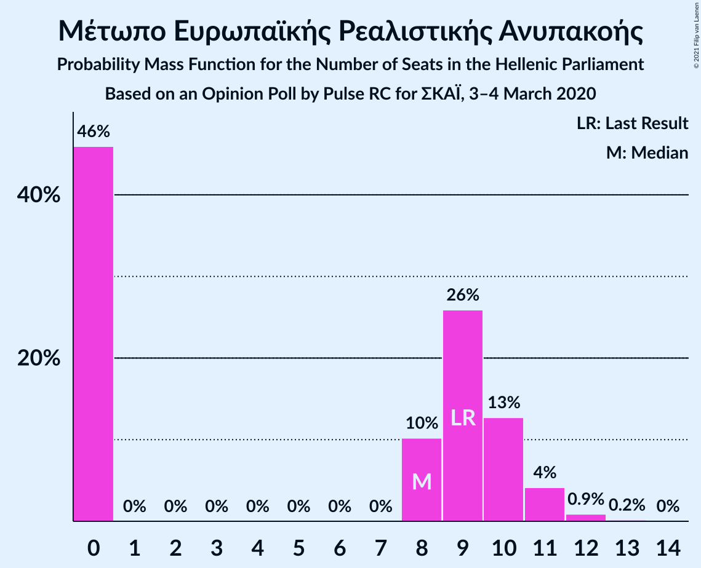
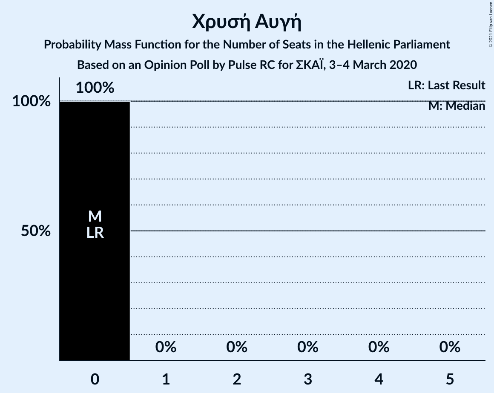
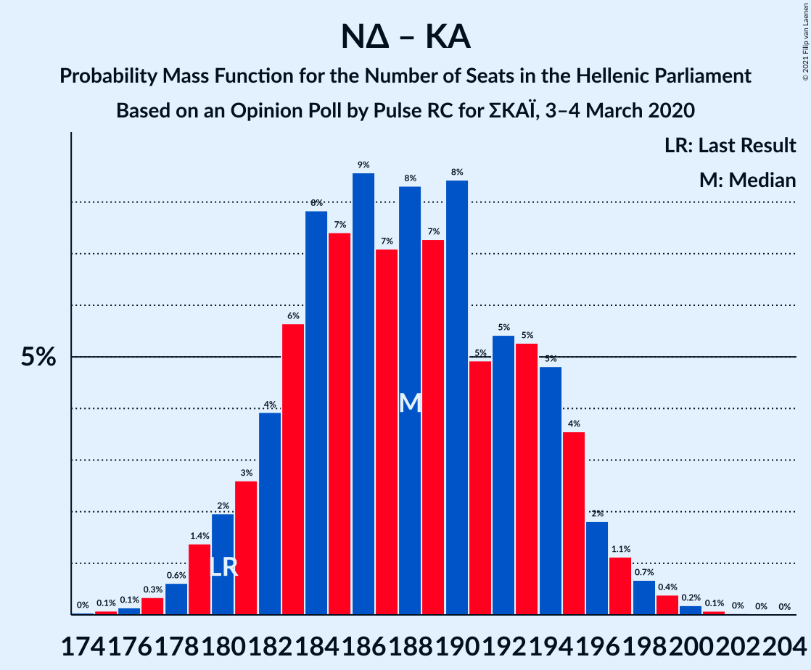

# Opinion Poll by Pulse RC for ΣΚΑΪ, 3–4 March 2020

<a href="#voting-intentions">Voting Intentions</a> | <a href="#seats">Seats</a> | <a href="#coalitions">Coalitions</a> | <a href="#technical-information">Technical Information</a>

## Voting Intentions

### Confidence Intervals

| Party | Last Result | Poll Result | 80% Confidence Interval | 90% Confidence Interval | 95% Confidence Interval | 99% Confidence Interval |
|:-----:|:-----------:|:-----------:|:-----------------------:|:-----------------------:|:-----------------------:|:-----------------------:|
| Νέα Δημοκρατία | 39.8% | 43.5% | 41.7–45.3% |41.2–45.8% |40.8–46.2% |39.9–47.1% |
| Συνασπισμός Ριζοσπαστικής Αριστεράς | 31.5% | 28.0% | 26.4–29.6% |25.9–30.1% |25.6–30.5% |24.8–31.3% |
| Κίνημα Αλλαγής | 8.1% | 7.5% | 6.6–8.5% |6.4–8.8% |6.1–9.1% |5.7–9.6% |
| Ελληνική Λύση | 3.7% | 6.0% | 5.2–6.9% |5.0–7.2% |4.8–7.4% |4.4–7.9% |
| Κομμουνιστικό Κόμμα Ελλάδας | 5.3% | 5.5% | 4.7–6.4% |4.5–6.7% |4.4–6.9% |4.0–7.4% |
| Μέτωπο Ευρωπαϊκής Ρεαλιστικής Ανυπακοής | 3.4% | 3.0% | 2.5–3.7% |2.3–3.9% |2.2–4.1% |2.0–4.5% |
| Χρυσή Αυγή | 2.9% | 1.5% | 1.1–2.1% |1.1–2.2% |1.0–2.3% |0.8–2.6% |

*Note:* The poll result column reflects the actual value used in the calculations. Published results may vary slightly, and in addition be rounded to fewer digits.

## Seats

### Confidence Intervals

| Party | Last Result | Median | 80% Confidence Interval | 90% Confidence Interval | 95% Confidence Interval | 99% Confidence Interval |
|:-----:|:-----------:|:------:|:-----------------------:|:-----------------------:|:-----------------------:|:-----------------------:|
| <a href="#νέα-δημοκρατία">Νέα Δημοκρατία</a> | 158 | 167 | 163–174 |160–175 |159–176 |158–178 |
| <a href="#συνασπισμός-ριζοσπαστικής-αριστεράς">Συνασπισμός Ριζοσπαστικής Αριστεράς</a> | 86 | 75 | 72–80 |69–81 |68–84 |67–85 |
| <a href="#κίνημα-αλλαγής">Κίνημα Αλλαγής</a> | 22 | 21 | 18–23 |17–24 |16–25 |15–26 |
| <a href="#ελληνική-λύση">Ελληνική Λύση</a> | 10 | 16 | 14–19 |14–20 |13–20 |12–21 |
| <a href="#κομμουνιστικό-κόμμα-ελλάδας">Κομμουνιστικό Κόμμα Ελλάδας</a> | 15 | 15 | 13–17 |12–18 |12–19 |11–20 |
| <a href="#μέτωπο-ευρωπαϊκής-ρεαλιστικής-ανυπακοής">Μέτωπο Ευρωπαϊκής Ρεαλιστικής Ανυπακοής</a> | 9 | 8 | 0–10 |0–11 |0–11 |0–12 |
| <a href="#χρυσή-αυγή">Χρυσή Αυγή</a> | 0 | 0 | 0 |0 |0 |0 |

### Νέα Δημοκρατία

*For a full overview of the results for this party, see the [Νέα Δημοκρατία](party-νέαδημοκρατία.html) page.*

| Number of Seats | Probability | Accumulated | Special Marks |
|:---------------:|:-----------:|:-----------:|:-------------:|
| 154 | 0% | 100% |  |
| 155 | 0% | 99.9% |  |
| 156 | 0.1% | 99.9% |  |
| 157 | 0.3% | 99.8% |  |
| 158 | 0.4% | 99.5% | Last Result |
| 159 | 3% | 99.1% |  |
| 160 | 2% | 96% |  |
| 161 | 2% | 94% |  |
| 162 | 2% | 92% |  |
| 163 | 6% | 90% |  |
| 164 | 5% | 84% |  |
| 165 | 12% | 79% |  |
| 166 | 11% | 68% |  |
| 167 | 8% | 57% | Median |
| 168 | 7% | 49% |  |
| 169 | 7% | 43% |  |
| 170 | 4% | 36% |  |
| 171 | 10% | 32% |  |
| 172 | 6% | 22% |  |
| 173 | 2% | 16% |  |
| 174 | 7% | 14% |  |
| 175 | 3% | 6% |  |
| 176 | 1.3% | 3% |  |
| 177 | 0.6% | 2% |  |
| 178 | 1.1% | 1.4% |  |
| 179 | 0.1% | 0.3% |  |
| 180 | 0.2% | 0.2% |  |
| 181 | 0% | 0.1% |  |
| 182 | 0% | 0% |  |

### Συνασπισμός Ριζοσπαστικής Αριστεράς

*For a full overview of the results for this party, see the [Συνασπισμός Ριζοσπαστικής Αριστεράς](party-συνασπισμόςριζοσπαστικήςαριστεράς.html) page.*

| Number of Seats | Probability | Accumulated | Special Marks |
|:---------------:|:-----------:|:-----------:|:-------------:|
| 64 | 0.1% | 100% |  |
| 65 | 0% | 99.9% |  |
| 66 | 0.1% | 99.9% |  |
| 67 | 1.0% | 99.8% |  |
| 68 | 2% | 98.8% |  |
| 69 | 3% | 97% |  |
| 70 | 2% | 94% |  |
| 71 | 0.6% | 92% |  |
| 72 | 6% | 91% |  |
| 73 | 8% | 85% |  |
| 74 | 18% | 77% |  |
| 75 | 18% | 59% | Median |
| 76 | 5% | 40% |  |
| 77 | 5% | 35% |  |
| 78 | 4% | 31% |  |
| 79 | 8% | 26% |  |
| 80 | 12% | 18% |  |
| 81 | 1.3% | 6% |  |
| 82 | 0.9% | 4% |  |
| 83 | 0.7% | 4% |  |
| 84 | 1.4% | 3% |  |
| 85 | 1.3% | 1.5% |  |
| 86 | 0.1% | 0.2% | Last Result |
| 87 | 0% | 0.1% |  |
| 88 | 0% | 0.1% |  |
| 89 | 0% | 0.1% |  |
| 90 | 0% | 0% |  |

### Κίνημα Αλλαγής

*For a full overview of the results for this party, see the [Κίνημα Αλλαγής](party-κίνημααλλαγής.html) page.*

| Number of Seats | Probability | Accumulated | Special Marks |
|:---------------:|:-----------:|:-----------:|:-------------:|
| 14 | 0.1% | 100% |  |
| 15 | 0.6% | 99.9% |  |
| 16 | 3% | 99.3% |  |
| 17 | 5% | 97% |  |
| 18 | 5% | 92% |  |
| 19 | 14% | 86% |  |
| 20 | 18% | 73% |  |
| 21 | 23% | 54% | Median |
| 22 | 19% | 32% | Last Result |
| 23 | 6% | 12% |  |
| 24 | 3% | 6% |  |
| 25 | 1.3% | 3% |  |
| 26 | 0.9% | 1.2% |  |
| 27 | 0.2% | 0.3% |  |
| 28 | 0.1% | 0.1% |  |
| 29 | 0% | 0% |  |

### Ελληνική Λύση

*For a full overview of the results for this party, see the [Ελληνική Λύση](party-ελληνικήλύση.html) page.*

| Number of Seats | Probability | Accumulated | Special Marks |
|:---------------:|:-----------:|:-----------:|:-------------:|
| 10 | 0% | 100% | Last Result |
| 11 | 0.2% | 100% |  |
| 12 | 1.1% | 99.8% |  |
| 13 | 4% | 98.7% |  |
| 14 | 9% | 95% |  |
| 15 | 19% | 86% |  |
| 16 | 25% | 67% | Median |
| 17 | 13% | 42% |  |
| 18 | 15% | 28% |  |
| 19 | 5% | 13% |  |
| 20 | 6% | 8% |  |
| 21 | 1.4% | 2% |  |
| 22 | 0.3% | 0.4% |  |
| 23 | 0.1% | 0.1% |  |
| 24 | 0% | 0% |  |

### Κομμουνιστικό Κόμμα Ελλάδας

*For a full overview of the results for this party, see the [Κομμουνιστικό Κόμμα Ελλάδας](party-κομμουνιστικόκόμμαελλάδας.html) page.*

| Number of Seats | Probability | Accumulated | Special Marks |
|:---------------:|:-----------:|:-----------:|:-------------:|
| 10 | 0.1% | 100% |  |
| 11 | 2% | 99.9% |  |
| 12 | 8% | 98% |  |
| 13 | 14% | 91% |  |
| 14 | 22% | 77% |  |
| 15 | 18% | 55% | Last Result, Median |
| 16 | 15% | 37% |  |
| 17 | 15% | 23% |  |
| 18 | 4% | 7% |  |
| 19 | 2% | 3% |  |
| 20 | 1.0% | 1.2% |  |
| 21 | 0.2% | 0.2% |  |
| 22 | 0% | 0.1% |  |
| 23 | 0% | 0% |  |

### Μέτωπο Ευρωπαϊκής Ρεαλιστικής Ανυπακοής

*For a full overview of the results for this party, see the [Μέτωπο Ευρωπαϊκής Ρεαλιστικής Ανυπακοής](party-μέτωποευρωπαϊκήςρεαλιστικήςανυπακοής.html) page.*

| Number of Seats | Probability | Accumulated | Special Marks |
|:---------------:|:-----------:|:-----------:|:-------------:|
| 0 | 50% | 100% |  |
| 1 | 0% | 50% |  |
| 2 | 0% | 50% |  |
| 3 | 0% | 50% |  |
| 4 | 0% | 50% |  |
| 5 | 0% | 50% |  |
| 6 | 0% | 50% |  |
| 7 | 0% | 50% |  |
| 8 | 12% | 50% | Median |
| 9 | 20% | 39% | Last Result |
| 10 | 12% | 18% |  |
| 11 | 5% | 6% |  |
| 12 | 0.9% | 1.1% |  |
| 13 | 0.2% | 0.2% |  |
| 14 | 0% | 0% |  |

### Χρυσή Αυγή

*For a full overview of the results for this party, see the [Χρυσή Αυγή](party-χρυσήαυγή.html) page.*

| Number of Seats | Probability | Accumulated | Special Marks |
|:---------------:|:-----------:|:-----------:|:-------------:|
| 0 | 99.9% | 100% | Last Result, Median |
| 1 | 0% | 0.1% |  |
| 2 | 0% | 0.1% |  |
| 3 | 0% | 0.1% |  |
| 4 | 0% | 0.1% |  |
| 5 | 0% | 0.1% |  |
| 6 | 0% | 0.1% |  |
| 7 | 0% | 0.1% |  |
| 8 | 0.1% | 0.1% |  |
| 9 | 0% | 0% |  |

## Coalitions

### Confidence Intervals

| Coalition | Last Result | Median | Majority? | 80% Confidence Interval | 90% Confidence Interval | 95% Confidence Interval | 99% Confidence Interval |
|:---------:|:-----------:|:------:|:---------:|:-----------------------:|:-----------------------:|:-----------------------:|:-----------------------:|
| Νέα Δημοκρατία – Κίνημα Αλλαγής | 180 | 189 | 100% | 183–195 | 181–196 | 179–197 | 178–199 |
| Νέα Δημοκρατία | 158 | 167 | 100% | 163–174 | 160–175 | 159–176 | 158–178 |
| Συνασπισμός Ριζοσπαστικής Αριστεράς – Μέτωπο Ευρωπαϊκής Ρεαλιστικής Ανυπακοής | 95 | 80 | 0% | 75–87 | 74–88 | 71–89 | 69–91 |
| Συνασπισμός Ριζοσπαστικής Αριστεράς | 86 | 75 | 0% | 72–80 | 69–81 | 68–84 | 67–85 |

### Νέα Δημοκρατία – Κίνημα Αλλαγής

| Number of Seats | Probability | Accumulated | Special Marks |
|:---------------:|:-----------:|:-----------:|:-------------:|
| 174 | 0.1% | 100% |  |
| 175 | 0.1% | 99.9% |  |
| 176 | 0.1% | 99.9% |  |
| 177 | 0.2% | 99.7% |  |
| 178 | 0.7% | 99.5% |  |
| 179 | 2% | 98.8% |  |
| 180 | 1.3% | 97% | Last Result |
| 181 | 2% | 96% |  |
| 182 | 4% | 94% |  |
| 183 | 5% | 90% |  |
| 184 | 7% | 85% |  |
| 185 | 10% | 78% |  |
| 186 | 5% | 68% |  |
| 187 | 8% | 63% |  |
| 188 | 4% | 55% | Median |
| 189 | 10% | 50% |  |
| 190 | 7% | 41% |  |
| 191 | 7% | 34% |  |
| 192 | 4% | 27% |  |
| 193 | 7% | 23% |  |
| 194 | 4% | 16% |  |
| 195 | 8% | 13% |  |
| 196 | 1.2% | 5% |  |
| 197 | 2% | 4% |  |
| 198 | 0.3% | 2% |  |
| 199 | 1.1% | 2% |  |
| 200 | 0.3% | 0.4% |  |
| 201 | 0.1% | 0.1% |  |
| 202 | 0% | 0.1% |  |
| 203 | 0% | 0% |  |

### Νέα Δημοκρατία

| Number of Seats | Probability | Accumulated | Special Marks |
|:---------------:|:-----------:|:-----------:|:-------------:|
| 154 | 0% | 100% |  |
| 155 | 0% | 99.9% |  |
| 156 | 0.1% | 99.9% |  |
| 157 | 0.3% | 99.8% |  |
| 158 | 0.4% | 99.5% | Last Result |
| 159 | 3% | 99.1% |  |
| 160 | 2% | 96% |  |
| 161 | 2% | 94% |  |
| 162 | 2% | 92% |  |
| 163 | 6% | 90% |  |
| 164 | 5% | 84% |  |
| 165 | 12% | 79% |  |
| 166 | 11% | 68% |  |
| 167 | 8% | 57% | Median |
| 168 | 7% | 49% |  |
| 169 | 7% | 43% |  |
| 170 | 4% | 36% |  |
| 171 | 10% | 32% |  |
| 172 | 6% | 22% |  |
| 173 | 2% | 16% |  |
| 174 | 7% | 14% |  |
| 175 | 3% | 6% |  |
| 176 | 1.3% | 3% |  |
| 177 | 0.6% | 2% |  |
| 178 | 1.1% | 1.4% |  |
| 179 | 0.1% | 0.3% |  |
| 180 | 0.2% | 0.2% |  |
| 181 | 0% | 0.1% |  |
| 182 | 0% | 0% |  |

### Συνασπισμός Ριζοσπαστικής Αριστεράς – Μέτωπο Ευρωπαϊκής Ρεαλιστικής Ανυπακοής

| Number of Seats | Probability | Accumulated | Special Marks |
|:---------------:|:-----------:|:-----------:|:-------------:|
| 68 | 0% | 100% |  |
| 69 | 0.6% | 99.9% |  |
| 70 | 2% | 99.4% |  |
| 71 | 0.6% | 98% |  |
| 72 | 0.1% | 97% |  |
| 73 | 0.1% | 97% |  |
| 74 | 4% | 97% |  |
| 75 | 17% | 93% |  |
| 76 | 6% | 76% |  |
| 77 | 2% | 70% |  |
| 78 | 2% | 68% |  |
| 79 | 5% | 66% |  |
| 80 | 15% | 62% |  |
| 81 | 5% | 46% |  |
| 82 | 8% | 42% |  |
| 83 | 9% | 33% | Median |
| 84 | 6% | 24% |  |
| 85 | 4% | 19% |  |
| 86 | 4% | 14% |  |
| 87 | 3% | 10% |  |
| 88 | 3% | 7% |  |
| 89 | 2% | 4% |  |
| 90 | 1.2% | 2% |  |
| 91 | 0.7% | 1.1% |  |
| 92 | 0.1% | 0.4% |  |
| 93 | 0.2% | 0.3% |  |
| 94 | 0.1% | 0.1% |  |
| 95 | 0% | 0.1% | Last Result |
| 96 | 0% | 0% |  |

### Συνασπισμός Ριζοσπαστικής Αριστεράς

| Number of Seats | Probability | Accumulated | Special Marks |
|:---------------:|:-----------:|:-----------:|:-------------:|
| 64 | 0.1% | 100% |  |
| 65 | 0% | 99.9% |  |
| 66 | 0.1% | 99.9% |  |
| 67 | 1.0% | 99.8% |  |
| 68 | 2% | 98.8% |  |
| 69 | 3% | 97% |  |
| 70 | 2% | 94% |  |
| 71 | 0.6% | 92% |  |
| 72 | 6% | 91% |  |
| 73 | 8% | 85% |  |
| 74 | 18% | 77% |  |
| 75 | 18% | 59% | Median |
| 76 | 5% | 40% |  |
| 77 | 5% | 35% |  |
| 78 | 4% | 31% |  |
| 79 | 8% | 26% |  |
| 80 | 12% | 18% |  |
| 81 | 1.3% | 6% |  |
| 82 | 0.9% | 4% |  |
| 83 | 0.7% | 4% |  |
| 84 | 1.4% | 3% |  |
| 85 | 1.3% | 1.5% |  |
| 86 | 0.1% | 0.2% | Last Result |
| 87 | 0% | 0.1% |  |
| 88 | 0% | 0.1% |  |
| 89 | 0% | 0.1% |  |
| 90 | 0% | 0% |  |

## Technical Information

### Opinion Poll

+ **Polling firm:** Pulse RC
+ **Commissioner(s):** ΣΚΑΪ
+ **Fieldwork period:** 3–4 March 2020

### Calculations

+ **Sample size:** 1258
+ **Simulations done:** 131,072
+ **Error estimate:** 1.28%

