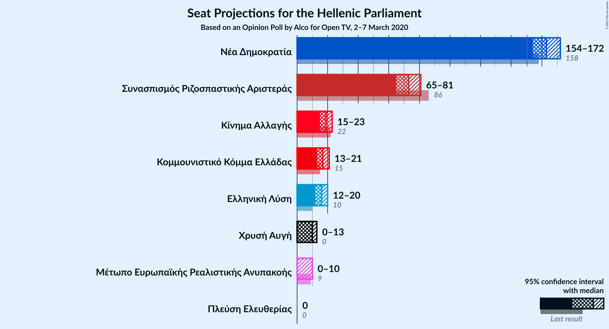
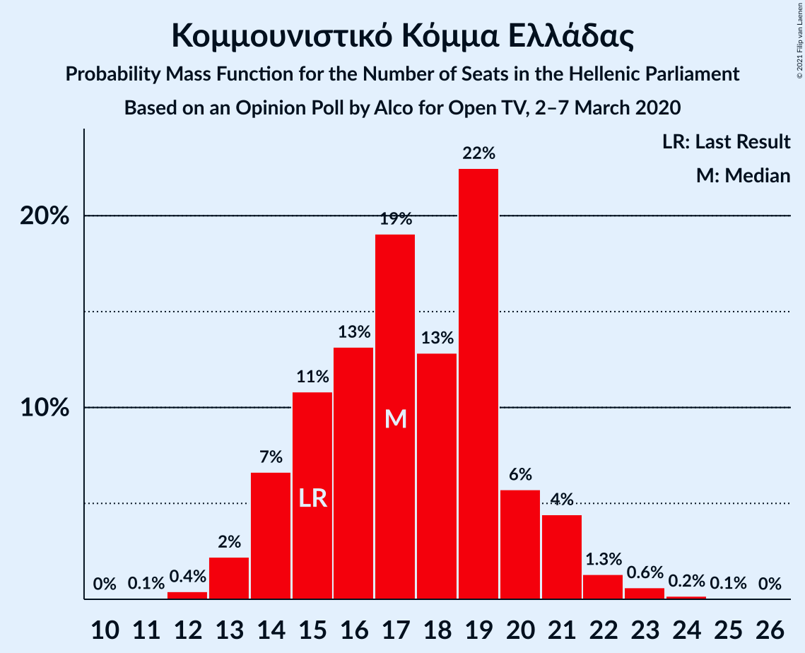

# Opinion Poll by Alco for Open TV, 2–7 March 2020

<a href="#voting-intentions">Voting Intentions</a> | <a href="#seats">Seats</a> | <a href="#coalitions">Coalitions</a> | <a href="#technical-information">Technical Information</a>

## Voting Intentions

### Confidence Intervals

| Party | Last Result | Poll Result | 80% Confidence Interval | 90% Confidence Interval | 95% Confidence Interval | 99% Confidence Interval |
|:-----:|:-----------:|:-----------:|:-----------------------:|:-----------------------:|:-----------------------:|:-----------------------:|
| Νέα Δημοκρατία | 39.8% | 43.9% | 41.9–45.9% |41.3–46.5% |40.8–47.0% |39.9–48.0% |
| Συνασπισμός Ριζοσπαστικής Αριστεράς | 31.5% | 28.1% | 26.3–30.0% |25.8–30.5% |25.4–31.0% |24.6–31.9% |
| Κίνημα Αλλαγής | 8.1% | 7.2% | 6.2–8.4% |6.0–8.7% |5.7–9.0% |5.3–9.6% |
| Κομμουνιστικό Κόμμα Ελλάδας | 5.3% | 6.6% | 5.7–7.7% |5.4–8.0% |5.2–8.3% |4.8–8.9% |
| Ελληνική Λύση | 3.7% | 6.2% | 5.3–7.3% |5.1–7.6% |4.9–7.9% |4.5–8.4% |
| Χρυσή Αυγή | 2.9% | 3.6% | 2.9–4.5% |2.8–4.7% |2.6–5.0% |2.3–5.4% |
| Μέτωπο Ευρωπαϊκής Ρεαλιστικής Ανυπακοής | 3.4% | 2.7% | 2.1–3.5% |2.0–3.7% |1.9–3.9% |1.6–4.3% |
| Πλεύση Ελευθερίας | 1.5% | 1.5% | 1.1–2.1% |1.0–2.3% |0.9–2.5% |0.7–2.8% |

*Note:* The poll result column reflects the actual value used in the calculations. Published results may vary slightly, and in addition be rounded to fewer digits.

## Seats

### Confidence Intervals

| Party | Last Result | Median | 80% Confidence Interval | 90% Confidence Interval | 95% Confidence Interval | 99% Confidence Interval |
|:-----:|:-----------:|:------:|:-----------------------:|:-----------------------:|:-----------------------:|:-----------------------:|
| <a href="#νέα-δημοκρατία">Νέα Δημοκρατία</a> | 158 | 164 | 156–168 |156–171 |156–173 |152–175 |
| <a href="#συνασπισμός-ριζοσπαστικής-αριστεράς">Συνασπισμός Ριζοσπαστικής Αριστεράς</a> | 86 | 72 | 69–77 |66–80 |66–81 |62–83 |
| <a href="#κίνημα-αλλαγής">Κίνημα Αλλαγής</a> | 22 | 20 | 17–21 |16–22 |15–23 |14–24 |
| <a href="#κομμουνιστικό-κόμμα-ελλάδας">Κομμουνιστικό Κόμμα Ελλάδας</a> | 15 | 17 | 15–21 |15–21 |14–21 |13–23 |
| <a href="#ελληνική-λύση">Ελληνική Λύση</a> | 10 | 16 | 15–18 |14–19 |13–19 |12–23 |
| <a href="#χρυσή-αυγή">Χρυσή Αυγή</a> | 0 | 9 | 0–11 |0–12 |0–12 |0–14 |
| <a href="#μέτωπο-ευρωπαϊκής-ρεαλιστικής-ανυπακοής">Μέτωπο Ευρωπαϊκής Ρεαλιστικής Ανυπακοής</a> | 9 | 0 | 0–9 |0–9 |0–9 |0–11 |
| <a href="#πλεύση-ελευθερίας">Πλεύση Ελευθερίας</a> | 0 | 0 | 0 |0 |0 |0 |

### Νέα Δημοκρατία

*For a full overview of the results for this party, see the [Νέα Δημοκρατία](party-νέαδημοκρατία.html) page.*

| Number of Seats | Probability | Accumulated | Special Marks |
|:---------------:|:-----------:|:-----------:|:-------------:|
| 150 | 0.1% | 100% |  |
| 151 | 0.1% | 99.9% | Majority |
| 152 | 0.7% | 99.8% |  |
| 153 | 0.2% | 99.1% |  |
| 154 | 0.3% | 98.9% |  |
| 155 | 0.3% | 98.6% |  |
| 156 | 11% | 98% |  |
| 157 | 4% | 88% |  |
| 158 | 2% | 84% | Last Result |
| 159 | 2% | 82% |  |
| 160 | 0.9% | 81% |  |
| 161 | 2% | 80% |  |
| 162 | 5% | 78% |  |
| 163 | 14% | 73% |  |
| 164 | 32% | 59% | Median |
| 165 | 11% | 27% |  |
| 166 | 2% | 16% |  |
| 167 | 4% | 14% |  |
| 168 | 1.2% | 10% |  |
| 169 | 2% | 9% |  |
| 170 | 1.4% | 7% |  |
| 171 | 1.1% | 5% |  |
| 172 | 0.4% | 4% |  |
| 173 | 1.3% | 4% |  |
| 174 | 1.5% | 2% |  |
| 175 | 0.7% | 1.0% |  |
| 176 | 0% | 0.3% |  |
| 177 | 0.1% | 0.3% |  |
| 178 | 0.1% | 0.1% |  |
| 179 | 0% | 0.1% |  |
| 180 | 0.1% | 0.1% |  |
| 181 | 0% | 0% |  |

### Συνασπισμός Ριζοσπαστικής Αριστεράς

*For a full overview of the results for this party, see the [Συνασπισμός Ριζοσπαστικής Αριστεράς](party-συνασπισμόςριζοσπαστικήςαριστεράς.html) page.*

| Number of Seats | Probability | Accumulated | Special Marks |
|:---------------:|:-----------:|:-----------:|:-------------:|
| 60 | 0.1% | 100% |  |
| 61 | 0% | 99.9% |  |
| 62 | 0.6% | 99.8% |  |
| 63 | 0.1% | 99.2% |  |
| 64 | 0.6% | 99.1% |  |
| 65 | 0.4% | 98% |  |
| 66 | 4% | 98% |  |
| 67 | 1.0% | 94% |  |
| 68 | 2% | 93% |  |
| 69 | 6% | 91% |  |
| 70 | 11% | 85% |  |
| 71 | 3% | 75% |  |
| 72 | 30% | 72% | Median |
| 73 | 2% | 42% |  |
| 74 | 8% | 40% |  |
| 75 | 2% | 32% |  |
| 76 | 16% | 29% |  |
| 77 | 4% | 13% |  |
| 78 | 2% | 9% |  |
| 79 | 0.9% | 7% |  |
| 80 | 3% | 6% |  |
| 81 | 0.3% | 3% |  |
| 82 | 2% | 2% |  |
| 83 | 0.3% | 0.6% |  |
| 84 | 0.1% | 0.3% |  |
| 85 | 0.1% | 0.1% |  |
| 86 | 0.1% | 0.1% | Last Result |
| 87 | 0% | 0% |  |

### Κίνημα Αλλαγής

*For a full overview of the results for this party, see the [Κίνημα Αλλαγής](party-κίνημααλλαγής.html) page.*

| Number of Seats | Probability | Accumulated | Special Marks |
|:---------------:|:-----------:|:-----------:|:-------------:|
| 13 | 0.2% | 100% |  |
| 14 | 2% | 99.8% |  |
| 15 | 2% | 98% |  |
| 16 | 4% | 96% |  |
| 17 | 3% | 92% |  |
| 18 | 17% | 89% |  |
| 19 | 16% | 72% |  |
| 20 | 35% | 56% | Median |
| 21 | 16% | 21% |  |
| 22 | 1.0% | 5% | Last Result |
| 23 | 3% | 4% |  |
| 24 | 1.3% | 2% |  |
| 25 | 0.2% | 0.3% |  |
| 26 | 0% | 0.1% |  |
| 27 | 0% | 0.1% |  |
| 28 | 0% | 0% |  |

### Κομμουνιστικό Κόμμα Ελλάδας

*For a full overview of the results for this party, see the [Κομμουνιστικό Κόμμα Ελλάδας](party-κομμουνιστικόκόμμαελλάδας.html) page.*

| Number of Seats | Probability | Accumulated | Special Marks |
|:---------------:|:-----------:|:-----------:|:-------------:|
| 11 | 0% | 100% |  |
| 12 | 0.2% | 99.9% |  |
| 13 | 0.6% | 99.7% |  |
| 14 | 4% | 99.2% |  |
| 15 | 22% | 95% | Last Result |
| 16 | 11% | 73% |  |
| 17 | 14% | 62% | Median |
| 18 | 2% | 48% |  |
| 19 | 32% | 47% |  |
| 20 | 2% | 15% |  |
| 21 | 11% | 13% |  |
| 22 | 1.5% | 2% |  |
| 23 | 0.5% | 0.7% |  |
| 24 | 0.1% | 0.1% |  |
| 25 | 0% | 0% |  |

### Ελληνική Λύση

*For a full overview of the results for this party, see the [Ελληνική Λύση](party-ελληνικήλύση.html) page.*

| Number of Seats | Probability | Accumulated | Special Marks |
|:---------------:|:-----------:|:-----------:|:-------------:|
| 10 | 0.1% | 100% | Last Result |
| 11 | 0.3% | 99.9% |  |
| 12 | 2% | 99.7% |  |
| 13 | 2% | 98% |  |
| 14 | 5% | 96% |  |
| 15 | 23% | 91% |  |
| 16 | 21% | 67% | Median |
| 17 | 36% | 47% |  |
| 18 | 5% | 11% |  |
| 19 | 4% | 6% |  |
| 20 | 1.2% | 2% |  |
| 21 | 0.3% | 1.2% |  |
| 22 | 0.3% | 0.9% |  |
| 23 | 0.7% | 0.7% |  |
| 24 | 0% | 0% |  |

### Χρυσή Αυγή

*For a full overview of the results for this party, see the [Χρυσή Αυγή](party-χρυσήαυγή.html) page.*

| Number of Seats | Probability | Accumulated | Special Marks |
|:---------------:|:-----------:|:-----------:|:-------------:|
| 0 | 10% | 100% | Last Result |
| 1 | 0% | 90% |  |
| 2 | 0% | 90% |  |
| 3 | 0% | 90% |  |
| 4 | 0% | 90% |  |
| 5 | 0% | 90% |  |
| 6 | 0% | 90% |  |
| 7 | 0% | 90% |  |
| 8 | 32% | 90% |  |
| 9 | 10% | 57% | Median |
| 10 | 37% | 48% |  |
| 11 | 3% | 10% |  |
| 12 | 5% | 7% |  |
| 13 | 0.9% | 2% |  |
| 14 | 0.2% | 0.7% |  |
| 15 | 0.4% | 0.4% |  |
| 16 | 0% | 0% |  |

### Μέτωπο Ευρωπαϊκής Ρεαλιστικής Ανυπακοής

*For a full overview of the results for this party, see the [Μέτωπο Ευρωπαϊκής Ρεαλιστικής Ανυπακοής](party-μέτωποευρωπαϊκήςρεαλιστικήςανυπακοής.html) page.*

| Number of Seats | Probability | Accumulated | Special Marks |
|:---------------:|:-----------:|:-----------:|:-------------:|
| 0 | 73% | 100% | Median |
| 1 | 0% | 27% |  |
| 2 | 0% | 27% |  |
| 3 | 0% | 27% |  |
| 4 | 0% | 27% |  |
| 5 | 0% | 27% |  |
| 6 | 0% | 27% |  |
| 7 | 0% | 27% |  |
| 8 | 10% | 27% |  |
| 9 | 15% | 17% | Last Result |
| 10 | 1.4% | 2% |  |
| 11 | 0.7% | 0.8% |  |
| 12 | 0.1% | 0.1% |  |
| 13 | 0% | 0% |  |

### Πλεύση Ελευθερίας

*For a full overview of the results for this party, see the [Πλεύση Ελευθερίας](party-πλεύσηελευθερίας.html) page.*

| Number of Seats | Probability | Accumulated | Special Marks |
|:---------------:|:-----------:|:-----------:|:-------------:|
| 0 | 99.9% | 100% | Last Result, Median |
| 1 | 0% | 0.1% |  |
| 2 | 0% | 0.1% |  |
| 3 | 0% | 0.1% |  |
| 4 | 0% | 0.1% |  |
| 5 | 0% | 0.1% |  |
| 6 | 0% | 0.1% |  |
| 7 | 0% | 0.1% |  |
| 8 | 0.1% | 0.1% |  |
| 9 | 0% | 0% |  |

## Coalitions

### Confidence Intervals

| Coalition | Last Result | Median | Majority? | 80% Confidence Interval | 90% Confidence Interval | 95% Confidence Interval | 99% Confidence Interval |
|:---------:|:-----------:|:------:|:---------:|:-----------------------:|:-----------------------:|:-----------------------:|:-----------------------:|
| Νέα Δημοκρατία – Κίνημα Αλλαγής | 180 | 184 | 100% | 174–186 | 174–190 | 174–192 | 169–193 |
| Νέα Δημοκρατία | 158 | 164 | 99.9% | 156–168 | 156–171 | 156–173 | 152–175 |
| Συνασπισμός Ριζοσπαστικής Αριστεράς – Μέτωπο Ευρωπαϊκής Ρεαλιστικής Ανυπακοής | 95 | 74 | 0% | 70–85 | 70–85 | 68–85 | 66–89 |
| Συνασπισμός Ριζοσπαστικής Αριστεράς | 86 | 72 | 0% | 69–77 | 66–80 | 66–81 | 62–83 |

### Νέα Δημοκρατία – Κίνημα Αλλαγής

| Number of Seats | Probability | Accumulated | Special Marks |
|:---------------:|:-----------:|:-----------:|:-------------:|
| 168 | 0.3% | 100% |  |
| 169 | 0.3% | 99.7% |  |
| 170 | 0.3% | 99.4% |  |
| 171 | 0.1% | 99.1% |  |
| 172 | 0.2% | 99.0% |  |
| 173 | 0.1% | 98.8% |  |
| 174 | 10% | 98.7% |  |
| 175 | 0.7% | 89% |  |
| 176 | 5% | 88% |  |
| 177 | 2% | 83% |  |
| 178 | 0.5% | 81% |  |
| 179 | 4% | 80% |  |
| 180 | 1.3% | 77% | Last Result |
| 181 | 0.2% | 75% |  |
| 182 | 3% | 75% |  |
| 183 | 14% | 73% |  |
| 184 | 42% | 58% | Median |
| 185 | 0.5% | 17% |  |
| 186 | 6% | 16% |  |
| 187 | 0.4% | 10% |  |
| 188 | 0.1% | 9% |  |
| 189 | 1.3% | 9% |  |
| 190 | 3% | 8% |  |
| 191 | 0.7% | 5% |  |
| 192 | 2% | 4% |  |
| 193 | 1.4% | 2% |  |
| 194 | 0% | 0.3% |  |
| 195 | 0.2% | 0.3% |  |
| 196 | 0% | 0.2% |  |
| 197 | 0% | 0.1% |  |
| 198 | 0% | 0.1% |  |
| 199 | 0% | 0.1% |  |
| 200 | 0.1% | 0.1% |  |
| 201 | 0% | 0% |  |

### Νέα Δημοκρατία

| Number of Seats | Probability | Accumulated | Special Marks |
|:---------------:|:-----------:|:-----------:|:-------------:|
| 150 | 0.1% | 100% |  |
| 151 | 0.1% | 99.9% | Majority |
| 152 | 0.7% | 99.8% |  |
| 153 | 0.2% | 99.1% |  |
| 154 | 0.3% | 98.9% |  |
| 155 | 0.3% | 98.6% |  |
| 156 | 11% | 98% |  |
| 157 | 4% | 88% |  |
| 158 | 2% | 84% | Last Result |
| 159 | 2% | 82% |  |
| 160 | 0.9% | 81% |  |
| 161 | 2% | 80% |  |
| 162 | 5% | 78% |  |
| 163 | 14% | 73% |  |
| 164 | 32% | 59% | Median |
| 165 | 11% | 27% |  |
| 166 | 2% | 16% |  |
| 167 | 4% | 14% |  |
| 168 | 1.2% | 10% |  |
| 169 | 2% | 9% |  |
| 170 | 1.4% | 7% |  |
| 171 | 1.1% | 5% |  |
| 172 | 0.4% | 4% |  |
| 173 | 1.3% | 4% |  |
| 174 | 1.5% | 2% |  |
| 175 | 0.7% | 1.0% |  |
| 176 | 0% | 0.3% |  |
| 177 | 0.1% | 0.3% |  |
| 178 | 0.1% | 0.1% |  |
| 179 | 0% | 0.1% |  |
| 180 | 0.1% | 0.1% |  |
| 181 | 0% | 0% |  |

### Συνασπισμός Ριζοσπαστικής Αριστεράς – Μέτωπο Ευρωπαϊκής Ρεαλιστικής Ανυπακοής

| Number of Seats | Probability | Accumulated | Special Marks |
|:---------------:|:-----------:|:-----------:|:-------------:|
| 63 | 0% | 100% |  |
| 64 | 0.1% | 99.9% |  |
| 65 | 0.1% | 99.8% |  |
| 66 | 0.7% | 99.8% |  |
| 67 | 0.8% | 99.1% |  |
| 68 | 2% | 98% |  |
| 69 | 0.8% | 96% |  |
| 70 | 9% | 96% |  |
| 71 | 2% | 87% |  |
| 72 | 30% | 85% | Median |
| 73 | 2% | 55% |  |
| 74 | 10% | 53% |  |
| 75 | 2% | 43% |  |
| 76 | 7% | 41% |  |
| 77 | 8% | 34% |  |
| 78 | 5% | 27% |  |
| 79 | 1.3% | 21% |  |
| 80 | 4% | 20% |  |
| 81 | 0.5% | 16% |  |
| 82 | 4% | 16% |  |
| 83 | 0.3% | 12% |  |
| 84 | 0.3% | 12% |  |
| 85 | 11% | 12% |  |
| 86 | 0.2% | 1.1% |  |
| 87 | 0% | 0.9% |  |
| 88 | 0.2% | 0.8% |  |
| 89 | 0.3% | 0.7% |  |
| 90 | 0% | 0.4% |  |
| 91 | 0% | 0.4% |  |
| 92 | 0.3% | 0.3% |  |
| 93 | 0% | 0% |  |
| 94 | 0% | 0% |  |
| 95 | 0% | 0% | Last Result |

### Συνασπισμός Ριζοσπαστικής Αριστεράς

| Number of Seats | Probability | Accumulated | Special Marks |
|:---------------:|:-----------:|:-----------:|:-------------:|
| 60 | 0.1% | 100% |  |
| 61 | 0% | 99.9% |  |
| 62 | 0.6% | 99.8% |  |
| 63 | 0.1% | 99.2% |  |
| 64 | 0.6% | 99.1% |  |
| 65 | 0.4% | 98% |  |
| 66 | 4% | 98% |  |
| 67 | 1.0% | 94% |  |
| 68 | 2% | 93% |  |
| 69 | 6% | 91% |  |
| 70 | 11% | 85% |  |
| 71 | 3% | 75% |  |
| 72 | 30% | 72% | Median |
| 73 | 2% | 42% |  |
| 74 | 8% | 40% |  |
| 75 | 2% | 32% |  |
| 76 | 16% | 29% |  |
| 77 | 4% | 13% |  |
| 78 | 2% | 9% |  |
| 79 | 0.9% | 7% |  |
| 80 | 3% | 6% |  |
| 81 | 0.3% | 3% |  |
| 82 | 2% | 2% |  |
| 83 | 0.3% | 0.6% |  |
| 84 | 0.1% | 0.3% |  |
| 85 | 0.1% | 0.1% |  |
| 86 | 0.1% | 0.1% | Last Result |
| 87 | 0% | 0% |  |

## Technical Information

### Opinion Poll

+ **Polling firm:** Alco
+ **Commissioner(s):** Open TV
+ **Fieldwork period:** 2–7 March 2020

### Calculations

+ **Sample size:** 1000
+ **Simulations done:** 131,072
+ **Error estimate:** 2.61%

