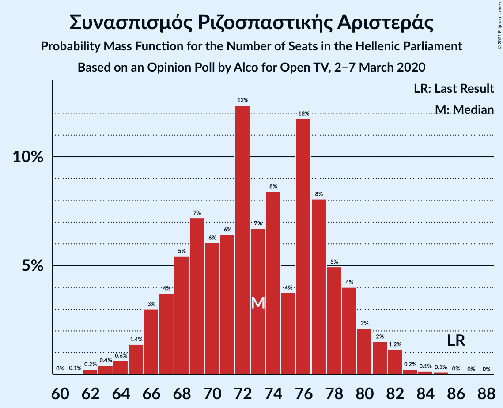
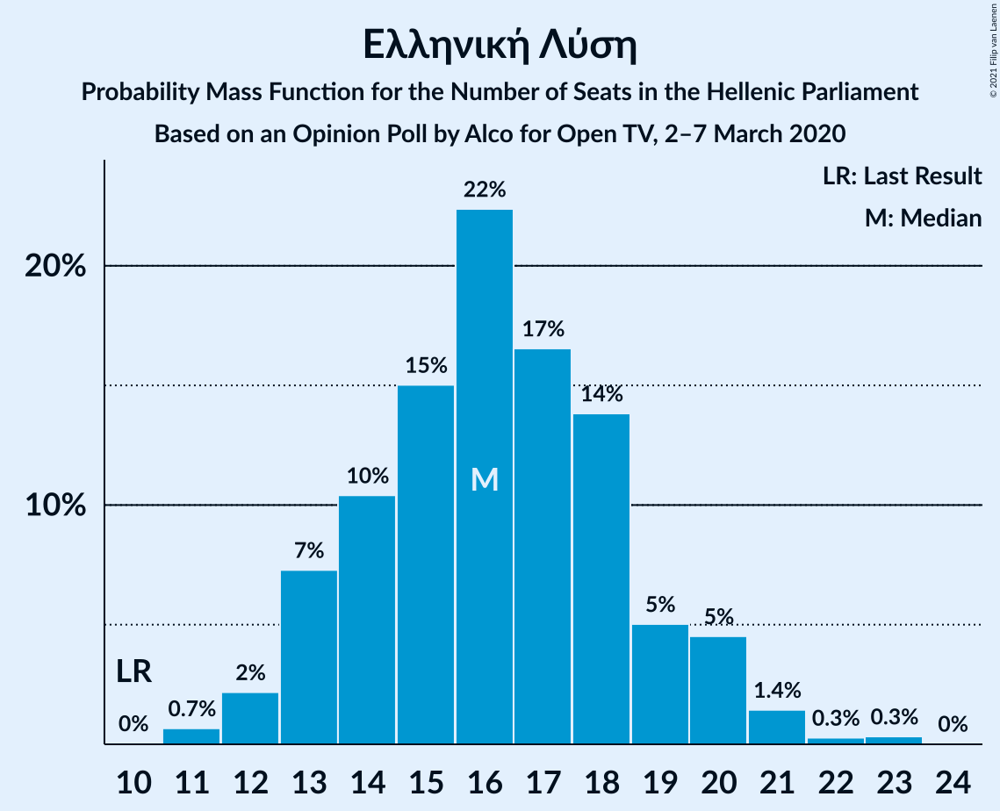
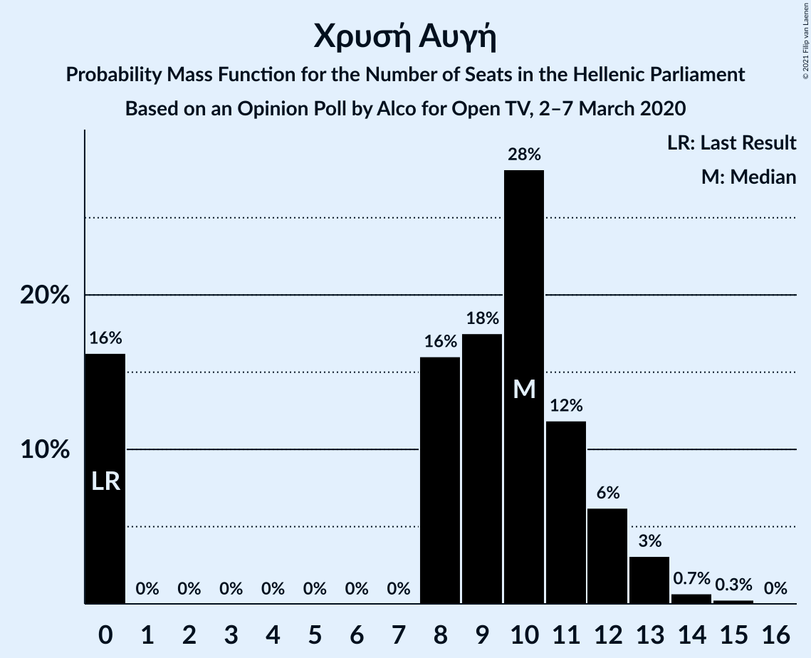
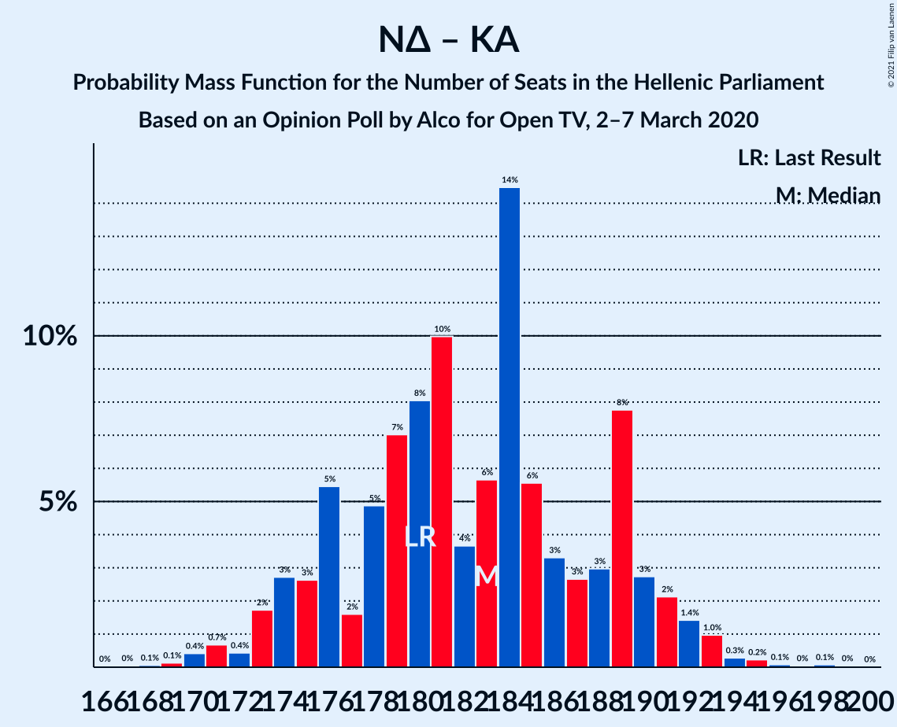

# Opinion Poll by Alco for Open TV, 2–7 March 2020

<a href="#voting-intentions">Voting Intentions</a> | <a href="#seats">Seats</a> | <a href="#coalitions">Coalitions</a> | <a href="#technical-information">Technical Information</a>

## Voting Intentions

### Confidence Intervals

| Party | Last Result | Poll Result | 80% Confidence Interval | 90% Confidence Interval | 95% Confidence Interval | 99% Confidence Interval |
|:-----:|:-----------:|:-----------:|:-----------------------:|:-----------------------:|:-----------------------:|:-----------------------:|
| Νέα Δημοκρατία | 39.8% | 43.9% | 41.9–45.9% |41.3–46.5% |40.8–47.0% |39.9–48.0% |
| Συνασπισμός Ριζοσπαστικής Αριστεράς | 31.5% | 28.1% | 26.3–30.0% |25.8–30.5% |25.4–31.0% |24.6–31.9% |
| Κίνημα Αλλαγής | 8.1% | 7.2% | 6.2–8.4% |6.0–8.7% |5.7–9.0% |5.3–9.6% |
| Κομμουνιστικό Κόμμα Ελλάδας | 5.3% | 6.6% | 5.7–7.7% |5.4–8.0% |5.2–8.3% |4.8–8.9% |
| Ελληνική Λύση | 3.7% | 6.2% | 5.3–7.3% |5.1–7.6% |4.9–7.9% |4.5–8.4% |
| Χρυσή Αυγή | 2.9% | 3.6% | 2.9–4.5% |2.8–4.7% |2.6–5.0% |2.3–5.4% |
| Μέτωπο Ευρωπαϊκής Ρεαλιστικής Ανυπακοής | 3.4% | 2.7% | 2.1–3.5% |2.0–3.7% |1.9–3.9% |1.6–4.3% |
| Πλεύση Ελευθερίας | 1.5% | 1.5% | 1.1–2.1% |1.0–2.3% |0.9–2.5% |0.7–2.8% |

*Note:* The poll result column reflects the actual value used in the calculations. Published results may vary slightly, and in addition be rounded to fewer digits.

## Seats

### Confidence Intervals

| Party | Last Result | Median | 80% Confidence Interval | 90% Confidence Interval | 95% Confidence Interval | 99% Confidence Interval |
|:-----:|:-----------:|:------:|:-----------------------:|:-----------------------:|:-----------------------:|:-----------------------:|
| <a href="#νέα-δημοκρατία">Νέα Δημοκρατία</a> | 158 | 164 | 157–170 |156–171 |155–172 |152–175 |
| <a href="#συνασπισμός-ριζοσπαστικής-αριστεράς">Συνασπισμός Ριζοσπαστικής Αριστεράς</a> | 86 | 74 | 68–78 |67–79 |65–80 |63–83 |
| <a href="#κίνημα-αλλαγής">Κίνημα Αλλαγής</a> | 22 | 19 | 16–22 |16–22 |15–23 |14–25 |
| <a href="#κομμουνιστικό-κόμμα-ελλάδας">Κομμουνιστικό Κόμμα Ελλάδας</a> | 15 | 18 | 15–20 |14–21 |14–21 |13–23 |
| <a href="#ελληνική-λύση">Ελληνική Λύση</a> | 10 | 16 | 14–19 |13–20 |13–20 |12–22 |
| <a href="#χρυσή-αυγή">Χρυσή Αυγή</a> | 0 | 9 | 0–12 |0–12 |0–13 |0–14 |
| <a href="#μέτωπο-ευρωπαϊκής-ρεαλιστικής-ανυπακοής">Μέτωπο Ευρωπαϊκής Ρεαλιστικής Ανυπακοής</a> | 9 | 0 | 0–9 |0–9 |0–10 |0–11 |
| <a href="#πλεύση-ελευθερίας">Πλεύση Ελευθερίας</a> | 0 | 0 | 0 |0 |0 |0 |

### Νέα Δημοκρατία

*For a full overview of the results for this party, see the [Νέα Δημοκρατία](party-νέαδημοκρατία.html) page.*

| Number of Seats | Probability | Accumulated | Special Marks |
|:---------------:|:-----------:|:-----------:|:-------------:|
| 149 | 0% | 100% |  |
| 150 | 0.1% | 99.9% |  |
| 151 | 0.1% | 99.8% | Majority |
| 152 | 0.3% | 99.7% |  |
| 153 | 0.7% | 99.4% |  |
| 154 | 0.6% | 98.7% |  |
| 155 | 0.8% | 98% |  |
| 156 | 7% | 97% |  |
| 157 | 4% | 90% |  |
| 158 | 2% | 87% | Last Result |
| 159 | 7% | 85% |  |
| 160 | 2% | 78% |  |
| 161 | 5% | 76% |  |
| 162 | 5% | 71% |  |
| 163 | 12% | 66% |  |
| 164 | 13% | 54% | Median |
| 165 | 6% | 40% |  |
| 166 | 6% | 35% |  |
| 167 | 12% | 29% |  |
| 168 | 2% | 16% |  |
| 169 | 2% | 14% |  |
| 170 | 7% | 13% |  |
| 171 | 1.4% | 5% |  |
| 172 | 2% | 4% |  |
| 173 | 1.0% | 2% |  |
| 174 | 0.7% | 1.3% |  |
| 175 | 0.4% | 0.7% |  |
| 176 | 0.1% | 0.3% |  |
| 177 | 0.1% | 0.2% |  |
| 178 | 0.1% | 0.2% |  |
| 179 | 0% | 0.1% |  |
| 180 | 0% | 0% |  |

### Συνασπισμός Ριζοσπαστικής Αριστεράς

*For a full overview of the results for this party, see the [Συνασπισμός Ριζοσπαστικής Αριστεράς](party-συνασπισμόςριζοσπαστικήςαριστεράς.html) page.*

| Number of Seats | Probability | Accumulated | Special Marks |
|:---------------:|:-----------:|:-----------:|:-------------:|
| 60 | 0% | 100% |  |
| 61 | 0% | 99.9% |  |
| 62 | 0.3% | 99.9% |  |
| 63 | 0.4% | 99.6% |  |
| 64 | 0.6% | 99.2% |  |
| 65 | 2% | 98.6% |  |
| 66 | 2% | 97% |  |
| 67 | 3% | 95% |  |
| 68 | 6% | 92% |  |
| 69 | 5% | 87% |  |
| 70 | 5% | 81% |  |
| 71 | 4% | 76% |  |
| 72 | 15% | 72% |  |
| 73 | 6% | 57% |  |
| 74 | 4% | 51% | Median |
| 75 | 3% | 47% |  |
| 76 | 17% | 43% |  |
| 77 | 13% | 27% |  |
| 78 | 6% | 14% |  |
| 79 | 4% | 7% |  |
| 80 | 1.2% | 4% |  |
| 81 | 0.5% | 2% |  |
| 82 | 1.2% | 2% |  |
| 83 | 0.3% | 0.6% |  |
| 84 | 0.2% | 0.3% |  |
| 85 | 0.1% | 0.2% |  |
| 86 | 0% | 0.1% | Last Result |
| 87 | 0% | 0% |  |

### Κίνημα Αλλαγής

*For a full overview of the results for this party, see the [Κίνημα Αλλαγής](party-κίνημααλλαγής.html) page.*

| Number of Seats | Probability | Accumulated | Special Marks |
|:---------------:|:-----------:|:-----------:|:-------------:|
| 13 | 0.2% | 100% |  |
| 14 | 1.3% | 99.8% |  |
| 15 | 3% | 98% |  |
| 16 | 6% | 96% |  |
| 17 | 15% | 90% |  |
| 18 | 14% | 75% |  |
| 19 | 19% | 60% | Median |
| 20 | 17% | 41% |  |
| 21 | 7% | 24% |  |
| 22 | 13% | 17% | Last Result |
| 23 | 2% | 4% |  |
| 24 | 1.0% | 2% |  |
| 25 | 0.5% | 0.7% |  |
| 26 | 0.1% | 0.2% |  |
| 27 | 0.1% | 0.1% |  |
| 28 | 0% | 0% |  |

### Κομμουνιστικό Κόμμα Ελλάδας

*For a full overview of the results for this party, see the [Κομμουνιστικό Κόμμα Ελλάδας](party-κομμουνιστικόκόμμαελλάδας.html) page.*

| Number of Seats | Probability | Accumulated | Special Marks |
|:---------------:|:-----------:|:-----------:|:-------------:|
| 11 | 0% | 100% |  |
| 12 | 0.4% | 99.9% |  |
| 13 | 1.3% | 99.5% |  |
| 14 | 7% | 98% |  |
| 15 | 10% | 92% | Last Result |
| 16 | 14% | 81% |  |
| 17 | 13% | 68% |  |
| 18 | 18% | 55% | Median |
| 19 | 25% | 37% |  |
| 20 | 5% | 12% |  |
| 21 | 5% | 7% |  |
| 22 | 1.4% | 2% |  |
| 23 | 0.6% | 0.8% |  |
| 24 | 0.2% | 0.2% |  |
| 25 | 0.1% | 0.1% |  |
| 26 | 0% | 0% |  |

### Ελληνική Λύση

*For a full overview of the results for this party, see the [Ελληνική Λύση](party-ελληνικήλύση.html) page.*

| Number of Seats | Probability | Accumulated | Special Marks |
|:---------------:|:-----------:|:-----------:|:-------------:|
| 10 | 0% | 100% | Last Result |
| 11 | 0.4% | 100% |  |
| 12 | 1.4% | 99.6% |  |
| 13 | 7% | 98% |  |
| 14 | 10% | 91% |  |
| 15 | 16% | 81% |  |
| 16 | 24% | 65% | Median |
| 17 | 21% | 41% |  |
| 18 | 8% | 19% |  |
| 19 | 5% | 12% |  |
| 20 | 5% | 7% |  |
| 21 | 1.2% | 2% |  |
| 22 | 0.3% | 0.7% |  |
| 23 | 0.3% | 0.4% |  |
| 24 | 0% | 0% |  |

### Χρυσή Αυγή

*For a full overview of the results for this party, see the [Χρυσή Αυγή](party-χρυσήαυγή.html) page.*

| Number of Seats | Probability | Accumulated | Special Marks |
|:---------------:|:-----------:|:-----------:|:-------------:|
| 0 | 20% | 100% | Last Result |
| 1 | 0% | 80% |  |
| 2 | 0% | 80% |  |
| 3 | 0% | 80% |  |
| 4 | 0% | 80% |  |
| 5 | 0% | 80% |  |
| 6 | 0% | 80% |  |
| 7 | 0% | 80% |  |
| 8 | 14% | 80% |  |
| 9 | 18% | 65% | Median |
| 10 | 29% | 47% |  |
| 11 | 8% | 18% |  |
| 12 | 7% | 10% |  |
| 13 | 3% | 4% |  |
| 14 | 0.5% | 0.8% |  |
| 15 | 0.3% | 0.3% |  |
| 16 | 0% | 0% |  |

### Μέτωπο Ευρωπαϊκής Ρεαλιστικής Ανυπακοής

*For a full overview of the results for this party, see the [Μέτωπο Ευρωπαϊκής Ρεαλιστικής Ανυπακοής](party-μέτωποευρωπαϊκήςρεαλιστικήςανυπακοής.html) page.*

| Number of Seats | Probability | Accumulated | Special Marks |
|:---------------:|:-----------:|:-----------:|:-------------:|
| 0 | 74% | 100% | Median |
| 1 | 0% | 26% |  |
| 2 | 0% | 26% |  |
| 3 | 0% | 26% |  |
| 4 | 0% | 26% |  |
| 5 | 0% | 26% |  |
| 6 | 0% | 26% |  |
| 7 | 0% | 26% |  |
| 8 | 11% | 26% |  |
| 9 | 11% | 15% | Last Result |
| 10 | 3% | 4% |  |
| 11 | 1.1% | 1.2% |  |
| 12 | 0.1% | 0.1% |  |
| 13 | 0% | 0% |  |

### Πλεύση Ελευθερίας

*For a full overview of the results for this party, see the [Πλεύση Ελευθερίας](party-πλεύσηελευθερίας.html) page.*

| Number of Seats | Probability | Accumulated | Special Marks |
|:---------------:|:-----------:|:-----------:|:-------------:|
| 0 | 99.9% | 100% | Last Result, Median |
| 1 | 0% | 0.1% |  |
| 2 | 0% | 0.1% |  |
| 3 | 0% | 0.1% |  |
| 4 | 0% | 0.1% |  |
| 5 | 0% | 0.1% |  |
| 6 | 0% | 0.1% |  |
| 7 | 0% | 0.1% |  |
| 8 | 0.1% | 0.1% |  |
| 9 | 0% | 0% |  |

## Coalitions

### Confidence Intervals

| Coalition | Last Result | Median | Majority? | 80% Confidence Interval | 90% Confidence Interval | 95% Confidence Interval | 99% Confidence Interval |
|:---------:|:-----------:|:------:|:---------:|:-----------------------:|:-----------------------:|:-----------------------:|:-----------------------:|
| Νέα Δημοκρατία – Κίνημα Αλλαγής | 180 | 184 | 100% | 176–189 | 174–190 | 173–192 | 170–194 |
| Νέα Δημοκρατία | 158 | 164 | 99.8% | 157–170 | 156–171 | 155–172 | 152–175 |
| Συνασπισμός Ριζοσπαστικής Αριστεράς – Μέτωπο Ευρωπαϊκής Ρεαλιστικής Ανυπακοής | 95 | 76 | 0% | 70–82 | 68–85 | 68–85 | 65–88 |
| Συνασπισμός Ριζοσπαστικής Αριστεράς | 86 | 74 | 0% | 68–78 | 67–79 | 65–80 | 63–83 |

### Νέα Δημοκρατία – Κίνημα Αλλαγής

| Number of Seats | Probability | Accumulated | Special Marks |
|:---------------:|:-----------:|:-----------:|:-------------:|
| 167 | 0% | 100% |  |
| 168 | 0.1% | 99.9% |  |
| 169 | 0.2% | 99.9% |  |
| 170 | 0.3% | 99.7% |  |
| 171 | 0.1% | 99.4% |  |
| 172 | 0.3% | 99.3% |  |
| 173 | 2% | 99.0% |  |
| 174 | 4% | 97% |  |
| 175 | 2% | 93% |  |
| 176 | 5% | 91% |  |
| 177 | 1.5% | 86% |  |
| 178 | 7% | 84% |  |
| 179 | 5% | 77% |  |
| 180 | 9% | 72% | Last Result |
| 181 | 3% | 62% |  |
| 182 | 3% | 60% |  |
| 183 | 6% | 57% | Median |
| 184 | 19% | 50% |  |
| 185 | 3% | 31% |  |
| 186 | 3% | 28% |  |
| 187 | 4% | 26% |  |
| 188 | 3% | 22% |  |
| 189 | 13% | 19% |  |
| 190 | 1.2% | 6% |  |
| 191 | 1.3% | 4% |  |
| 192 | 2% | 3% |  |
| 193 | 0.6% | 1.1% |  |
| 194 | 0.1% | 0.6% |  |
| 195 | 0.2% | 0.5% |  |
| 196 | 0.1% | 0.3% |  |
| 197 | 0% | 0.2% |  |
| 198 | 0.1% | 0.2% |  |
| 199 | 0.1% | 0.1% |  |
| 200 | 0% | 0% |  |

### Νέα Δημοκρατία

| Number of Seats | Probability | Accumulated | Special Marks |
|:---------------:|:-----------:|:-----------:|:-------------:|
| 149 | 0% | 100% |  |
| 150 | 0.1% | 99.9% |  |
| 151 | 0.1% | 99.8% | Majority |
| 152 | 0.3% | 99.7% |  |
| 153 | 0.7% | 99.4% |  |
| 154 | 0.6% | 98.7% |  |
| 155 | 0.8% | 98% |  |
| 156 | 7% | 97% |  |
| 157 | 4% | 90% |  |
| 158 | 2% | 87% | Last Result |
| 159 | 7% | 85% |  |
| 160 | 2% | 78% |  |
| 161 | 5% | 76% |  |
| 162 | 5% | 71% |  |
| 163 | 12% | 66% |  |
| 164 | 13% | 54% | Median |
| 165 | 6% | 40% |  |
| 166 | 6% | 35% |  |
| 167 | 12% | 29% |  |
| 168 | 2% | 16% |  |
| 169 | 2% | 14% |  |
| 170 | 7% | 13% |  |
| 171 | 1.4% | 5% |  |
| 172 | 2% | 4% |  |
| 173 | 1.0% | 2% |  |
| 174 | 0.7% | 1.3% |  |
| 175 | 0.4% | 0.7% |  |
| 176 | 0.1% | 0.3% |  |
| 177 | 0.1% | 0.2% |  |
| 178 | 0.1% | 0.2% |  |
| 179 | 0% | 0.1% |  |
| 180 | 0% | 0% |  |

### Συνασπισμός Ριζοσπαστικής Αριστεράς – Μέτωπο Ευρωπαϊκής Ρεαλιστικής Ανυπακοής

| Number of Seats | Probability | Accumulated | Special Marks |
|:---------------:|:-----------:|:-----------:|:-------------:|
| 62 | 0.1% | 100% |  |
| 63 | 0.2% | 99.9% |  |
| 64 | 0.2% | 99.8% |  |
| 65 | 0.6% | 99.6% |  |
| 66 | 0.3% | 99.0% |  |
| 67 | 1.0% | 98.7% |  |
| 68 | 3% | 98% |  |
| 69 | 3% | 94% |  |
| 70 | 3% | 91% |  |
| 71 | 3% | 88% |  |
| 72 | 12% | 85% |  |
| 73 | 5% | 73% |  |
| 74 | 4% | 68% | Median |
| 75 | 5% | 64% |  |
| 76 | 16% | 60% |  |
| 77 | 14% | 43% |  |
| 78 | 8% | 29% |  |
| 79 | 4% | 21% |  |
| 80 | 3% | 17% |  |
| 81 | 4% | 14% |  |
| 82 | 2% | 10% |  |
| 83 | 0.5% | 8% |  |
| 84 | 2% | 7% |  |
| 85 | 3% | 5% |  |
| 86 | 0.5% | 2% |  |
| 87 | 0.9% | 1.4% |  |
| 88 | 0.2% | 0.5% |  |
| 89 | 0.2% | 0.3% |  |
| 90 | 0% | 0.2% |  |
| 91 | 0% | 0.1% |  |
| 92 | 0.1% | 0.1% |  |
| 93 | 0% | 0% |  |
| 94 | 0% | 0% |  |
| 95 | 0% | 0% | Last Result |

### Συνασπισμός Ριζοσπαστικής Αριστεράς

| Number of Seats | Probability | Accumulated | Special Marks |
|:---------------:|:-----------:|:-----------:|:-------------:|
| 60 | 0% | 100% |  |
| 61 | 0% | 99.9% |  |
| 62 | 0.3% | 99.9% |  |
| 63 | 0.4% | 99.6% |  |
| 64 | 0.6% | 99.2% |  |
| 65 | 2% | 98.6% |  |
| 66 | 2% | 97% |  |
| 67 | 3% | 95% |  |
| 68 | 6% | 92% |  |
| 69 | 5% | 87% |  |
| 70 | 5% | 81% |  |
| 71 | 4% | 76% |  |
| 72 | 15% | 72% |  |
| 73 | 6% | 57% |  |
| 74 | 4% | 51% | Median |
| 75 | 3% | 47% |  |
| 76 | 17% | 43% |  |
| 77 | 13% | 27% |  |
| 78 | 6% | 14% |  |
| 79 | 4% | 7% |  |
| 80 | 1.2% | 4% |  |
| 81 | 0.5% | 2% |  |
| 82 | 1.2% | 2% |  |
| 83 | 0.3% | 0.6% |  |
| 84 | 0.2% | 0.3% |  |
| 85 | 0.1% | 0.2% |  |
| 86 | 0% | 0.1% | Last Result |
| 87 | 0% | 0% |  |

## Technical Information

### Opinion Poll

+ **Polling firm:** Alco
+ **Commissioner(s):** Open TV
+ **Fieldwork period:** 2–7 March 2020

### Calculations

+ **Sample size:** 1000
+ **Simulations done:** 524,288
+ **Error estimate:** 1.23%

