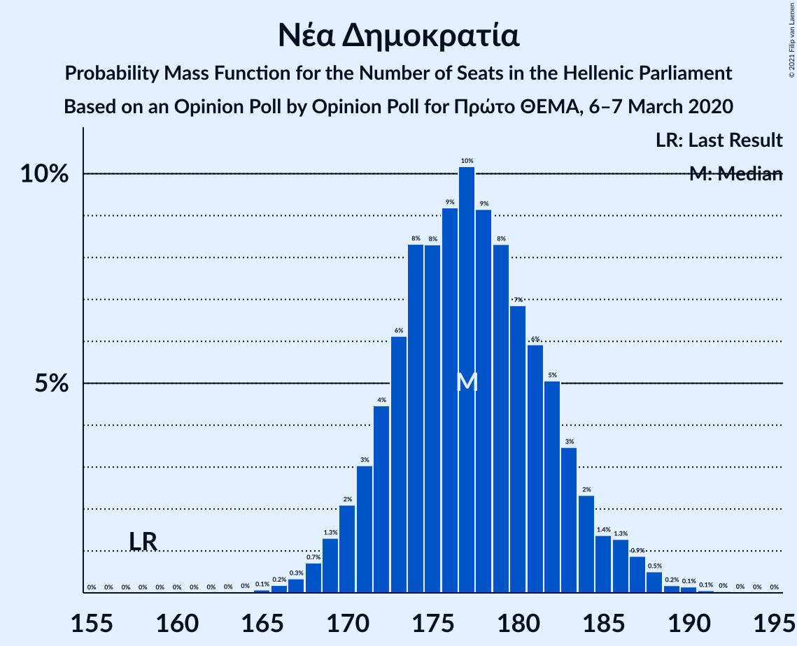
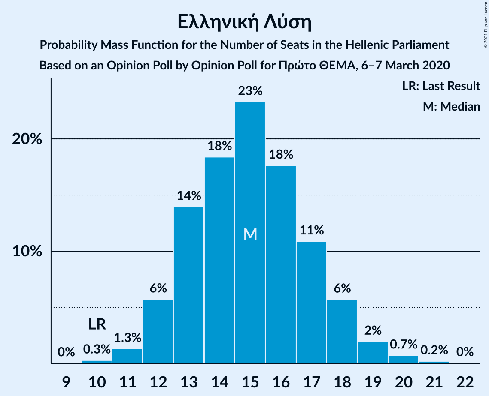
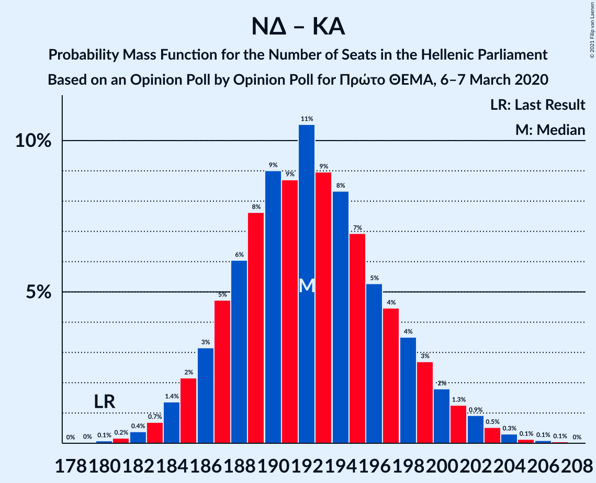

# Opinion Poll by Opinion Poll for Πρώτο ΘΕΜΑ, 6–7 March 2020

<a href="#voting-intentions">Voting Intentions</a> | <a href="#seats">Seats</a> | <a href="#coalitions">Coalitions</a> | <a href="#technical-information">Technical Information</a>

## Voting Intentions

### Confidence Intervals

| Party | Last Result | Poll Result | 80% Confidence Interval | 90% Confidence Interval | 95% Confidence Interval | 99% Confidence Interval |
|:-----:|:-----------:|:-----------:|:-----------------------:|:-----------------------:|:-----------------------:|:-----------------------:|
| Νέα Δημοκρατία | 39.8% | 48.7% | 46.8–50.5% |46.3–51.0% |45.8–51.5% |45.0–52.4% |
| Συνασπισμός Ριζοσπαστικής Αριστεράς | 31.5% | 26.1% | 24.5–27.8% |24.1–28.2% |23.7–28.7% |22.9–29.5% |
| Κομμουνιστικό Κόμμα Ελλάδας | 5.3% | 6.3% | 5.5–7.3% |5.3–7.6% |5.1–7.9% |4.7–8.4% |
| Κίνημα Αλλαγής | 8.1% | 5.7% | 4.9–6.6% |4.7–6.9% |4.5–7.1% |4.1–7.6% |
| Ελληνική Λύση | 3.7% | 5.7% | 4.9–6.6% |4.7–6.9% |4.5–7.1% |4.1–7.6% |
| Μέτωπο Ευρωπαϊκής Ρεαλιστικής Ανυπακοής | 3.4% | 3.4% | 2.8–4.2% |2.7–4.4% |2.5–4.6% |2.3–5.0% |

*Note:* The poll result column reflects the actual value used in the calculations. Published results may vary slightly, and in addition be rounded to fewer digits.

## Seats

### Confidence Intervals

| Party | Last Result | Median | 80% Confidence Interval | 90% Confidence Interval | 95% Confidence Interval | 99% Confidence Interval |
|:-----:|:-----------:|:------:|:-----------------------:|:-----------------------:|:-----------------------:|:-----------------------:|
| <a href="#νέα-δημοκρατία">Νέα Δημοκρατία</a> | 158 | 177 | 172–183 |171–184 |169–186 |167–188 |
| <a href="#συνασπισμός-ριζοσπαστικής-αριστεράς">Συνασπισμός Ριζοσπαστικής Αριστεράς</a> | 86 | 68 | 64–73 |63–74 |62–75 |60–78 |
| <a href="#κομμουνιστικό-κόμμα-ελλάδας">Κομμουνιστικό Κόμμα Ελλάδας</a> | 15 | 17 | 14–19 |14–20 |13–21 |12–22 |
| <a href="#κίνημα-αλλαγής">Κίνημα Αλλαγής</a> | 22 | 15 | 13–17 |12–18 |12–19 |11–20 |
| <a href="#ελληνική-λύση">Ελληνική Λύση</a> | 10 | 15 | 13–17 |12–18 |12–19 |11–20 |
| <a href="#μέτωπο-ευρωπαϊκής-ρεαλιστικής-ανυπακοής">Μέτωπο Ευρωπαϊκής Ρεαλιστικής Ανυπακοής</a> | 9 | 9 | 0–11 |0–11 |0–12 |0–13 |

### Νέα Δημοκρατία

*For a full overview of the results for this party, see the [Νέα Δημοκρατία](party-νέαδημοκρατία.html) page.*

| Number of Seats | Probability | Accumulated | Special Marks |
|:---------------:|:-----------:|:-----------:|:-------------:|
| 158 | 0% | 100% | Last Result |
| 159 | 0% | 100% |  |
| 160 | 0% | 100% |  |
| 161 | 0% | 100% |  |
| 162 | 0% | 100% |  |
| 163 | 0% | 100% |  |
| 164 | 0% | 100% |  |
| 165 | 0.1% | 99.9% |  |
| 166 | 0.2% | 99.9% |  |
| 167 | 0.3% | 99.7% |  |
| 168 | 0.7% | 99.4% |  |
| 169 | 1.3% | 98.6% |  |
| 170 | 2% | 97% |  |
| 171 | 3% | 95% |  |
| 172 | 4% | 92% |  |
| 173 | 6% | 88% |  |
| 174 | 8% | 82% |  |
| 175 | 8% | 73% |  |
| 176 | 9% | 65% |  |
| 177 | 10% | 56% | Median |
| 178 | 9% | 46% |  |
| 179 | 8% | 36% |  |
| 180 | 7% | 28% |  |
| 181 | 6% | 21% |  |
| 182 | 5% | 15% |  |
| 183 | 3% | 10% |  |
| 184 | 2% | 7% |  |
| 185 | 1.4% | 4% |  |
| 186 | 1.3% | 3% |  |
| 187 | 0.9% | 2% |  |
| 188 | 0.5% | 1.0% |  |
| 189 | 0.2% | 0.4% |  |
| 190 | 0.1% | 0.3% |  |
| 191 | 0.1% | 0.1% |  |
| 192 | 0% | 0.1% |  |
| 193 | 0% | 0% |  |

### Συνασπισμός Ριζοσπαστικής Αριστεράς

*For a full overview of the results for this party, see the [Συνασπισμός Ριζοσπαστικής Αριστεράς](party-συνασπισμόςριζοσπαστικήςαριστεράς.html) page.*

| Number of Seats | Probability | Accumulated | Special Marks |
|:---------------:|:-----------:|:-----------:|:-------------:|
| 58 | 0.1% | 100% |  |
| 59 | 0.2% | 99.9% |  |
| 60 | 0.6% | 99.6% |  |
| 61 | 1.2% | 99.1% |  |
| 62 | 2% | 98% |  |
| 63 | 3% | 96% |  |
| 64 | 5% | 92% |  |
| 65 | 7% | 87% |  |
| 66 | 10% | 79% |  |
| 67 | 11% | 70% |  |
| 68 | 12% | 58% | Median |
| 69 | 11% | 46% |  |
| 70 | 10% | 35% |  |
| 71 | 8% | 25% |  |
| 72 | 6% | 17% |  |
| 73 | 4% | 11% |  |
| 74 | 3% | 7% |  |
| 75 | 2% | 4% |  |
| 76 | 0.9% | 2% |  |
| 77 | 0.6% | 1.1% |  |
| 78 | 0.3% | 0.5% |  |
| 79 | 0.1% | 0.2% |  |
| 80 | 0.1% | 0.1% |  |
| 81 | 0% | 0% |  |
| 82 | 0% | 0% |  |
| 83 | 0% | 0% |  |
| 84 | 0% | 0% |  |
| 85 | 0% | 0% |  |
| 86 | 0% | 0% | Last Result |

### Κομμουνιστικό Κόμμα Ελλάδας

*For a full overview of the results for this party, see the [Κομμουνιστικό Κόμμα Ελλάδας](party-κομμουνιστικόκόμμαελλάδας.html) page.*

| Number of Seats | Probability | Accumulated | Special Marks |
|:---------------:|:-----------:|:-----------:|:-------------:|
| 11 | 0.1% | 100% |  |
| 12 | 0.7% | 99.9% |  |
| 13 | 3% | 99.3% |  |
| 14 | 7% | 96% |  |
| 15 | 15% | 89% | Last Result |
| 16 | 20% | 74% |  |
| 17 | 20% | 54% | Median |
| 18 | 17% | 34% |  |
| 19 | 9% | 17% |  |
| 20 | 5% | 8% |  |
| 21 | 2% | 3% |  |
| 22 | 0.5% | 0.8% |  |
| 23 | 0.2% | 0.2% |  |
| 24 | 0% | 0.1% |  |
| 25 | 0% | 0% |  |

### Κίνημα Αλλαγής

*For a full overview of the results for this party, see the [Κίνημα Αλλαγής](party-κίνημααλλαγής.html) page.*

| Number of Seats | Probability | Accumulated | Special Marks |
|:---------------:|:-----------:|:-----------:|:-------------:|
| 10 | 0.2% | 100% |  |
| 11 | 1.3% | 99.7% |  |
| 12 | 5% | 98% |  |
| 13 | 14% | 93% |  |
| 14 | 20% | 79% |  |
| 15 | 21% | 60% | Median |
| 16 | 19% | 39% |  |
| 17 | 12% | 20% |  |
| 18 | 5% | 8% |  |
| 19 | 2% | 3% |  |
| 20 | 0.7% | 0.9% |  |
| 21 | 0.2% | 0.2% |  |
| 22 | 0% | 0% | Last Result |

### Ελληνική Λύση

*For a full overview of the results for this party, see the [Ελληνική Λύση](party-ελληνικήλύση.html) page.*

| Number of Seats | Probability | Accumulated | Special Marks |
|:---------------:|:-----------:|:-----------:|:-------------:|
| 10 | 0.3% | 100% | Last Result |
| 11 | 1.3% | 99.7% |  |
| 12 | 6% | 98% |  |
| 13 | 14% | 93% |  |
| 14 | 18% | 79% |  |
| 15 | 23% | 60% | Median |
| 16 | 18% | 37% |  |
| 17 | 11% | 19% |  |
| 18 | 6% | 9% |  |
| 19 | 2% | 3% |  |
| 20 | 0.7% | 0.9% |  |
| 21 | 0.2% | 0.2% |  |
| 22 | 0% | 0% |  |

### Μέτωπο Ευρωπαϊκής Ρεαλιστικής Ανυπακοής

*For a full overview of the results for this party, see the [Μέτωπο Ευρωπαϊκής Ρεαλιστικής Ανυπακοής](party-μέτωποευρωπαϊκήςρεαλιστικήςανυπακοής.html) page.*

| Number of Seats | Probability | Accumulated | Special Marks |
|:---------------:|:-----------:|:-----------:|:-------------:|
| 0 | 19% | 100% |  |
| 1 | 0% | 81% |  |
| 2 | 0% | 81% |  |
| 3 | 0% | 81% |  |
| 4 | 0% | 81% |  |
| 5 | 0% | 81% |  |
| 6 | 0% | 81% |  |
| 7 | 0% | 81% |  |
| 8 | 16% | 81% |  |
| 9 | 27% | 65% | Last Result, Median |
| 10 | 22% | 37% |  |
| 11 | 10% | 15% |  |
| 12 | 4% | 5% |  |
| 13 | 0.9% | 1.1% |  |
| 14 | 0.2% | 0.2% |  |
| 15 | 0% | 0% |  |

## Coalitions

### Confidence Intervals

| Coalition | Last Result | Median | Majority? | 80% Confidence Interval | 90% Confidence Interval | 95% Confidence Interval | 99% Confidence Interval |
|:---------:|:-----------:|:------:|:---------:|:-----------------------:|:-----------------------:|:-----------------------:|:-----------------------:|
| Νέα Δημοκρατία – Κίνημα Αλλαγής | 180 | 192 | 100% | 187–198 | 186–200 | 184–201 | 182–204 |
| Νέα Δημοκρατία | 158 | 177 | 100% | 172–183 | 171–184 | 169–186 | 167–188 |
| Συνασπισμός Ριζοσπαστικής Αριστεράς – Μέτωπο Ευρωπαϊκής Ρεαλιστικής Ανυπακοής | 95 | 76 | 0% | 70–81 | 68–83 | 67–84 | 64–86 |
| Συνασπισμός Ριζοσπαστικής Αριστεράς | 86 | 68 | 0% | 64–73 | 63–74 | 62–75 | 60–78 |

### Νέα Δημοκρατία – Κίνημα Αλλαγής

| Number of Seats | Probability | Accumulated | Special Marks |
|:---------------:|:-----------:|:-----------:|:-------------:|
| 179 | 0% | 100% |  |
| 180 | 0.1% | 99.9% | Last Result |
| 181 | 0.2% | 99.9% |  |
| 182 | 0.4% | 99.7% |  |
| 183 | 0.7% | 99.3% |  |
| 184 | 1.4% | 98.6% |  |
| 185 | 2% | 97% |  |
| 186 | 3% | 95% |  |
| 187 | 5% | 92% |  |
| 188 | 6% | 87% |  |
| 189 | 8% | 81% |  |
| 190 | 9% | 74% |  |
| 191 | 9% | 65% |  |
| 192 | 11% | 56% | Median |
| 193 | 9% | 45% |  |
| 194 | 8% | 36% |  |
| 195 | 7% | 28% |  |
| 196 | 5% | 21% |  |
| 197 | 4% | 16% |  |
| 198 | 4% | 11% |  |
| 199 | 3% | 8% |  |
| 200 | 2% | 5% |  |
| 201 | 1.3% | 3% |  |
| 202 | 0.9% | 2% |  |
| 203 | 0.5% | 1.1% |  |
| 204 | 0.3% | 0.6% |  |
| 205 | 0.1% | 0.3% |  |
| 206 | 0.1% | 0.2% |  |
| 207 | 0.1% | 0.1% |  |
| 208 | 0% | 0% |  |

### Νέα Δημοκρατία

| Number of Seats | Probability | Accumulated | Special Marks |
|:---------------:|:-----------:|:-----------:|:-------------:|
| 158 | 0% | 100% | Last Result |
| 159 | 0% | 100% |  |
| 160 | 0% | 100% |  |
| 161 | 0% | 100% |  |
| 162 | 0% | 100% |  |
| 163 | 0% | 100% |  |
| 164 | 0% | 100% |  |
| 165 | 0.1% | 99.9% |  |
| 166 | 0.2% | 99.9% |  |
| 167 | 0.3% | 99.7% |  |
| 168 | 0.7% | 99.4% |  |
| 169 | 1.3% | 98.6% |  |
| 170 | 2% | 97% |  |
| 171 | 3% | 95% |  |
| 172 | 4% | 92% |  |
| 173 | 6% | 88% |  |
| 174 | 8% | 82% |  |
| 175 | 8% | 73% |  |
| 176 | 9% | 65% |  |
| 177 | 10% | 56% | Median |
| 178 | 9% | 46% |  |
| 179 | 8% | 36% |  |
| 180 | 7% | 28% |  |
| 181 | 6% | 21% |  |
| 182 | 5% | 15% |  |
| 183 | 3% | 10% |  |
| 184 | 2% | 7% |  |
| 185 | 1.4% | 4% |  |
| 186 | 1.3% | 3% |  |
| 187 | 0.9% | 2% |  |
| 188 | 0.5% | 1.0% |  |
| 189 | 0.2% | 0.4% |  |
| 190 | 0.1% | 0.3% |  |
| 191 | 0.1% | 0.1% |  |
| 192 | 0% | 0.1% |  |
| 193 | 0% | 0% |  |

### Συνασπισμός Ριζοσπαστικής Αριστεράς – Μέτωπο Ευρωπαϊκής Ρεαλιστικής Ανυπακοής

| Number of Seats | Probability | Accumulated | Special Marks |
|:---------------:|:-----------:|:-----------:|:-------------:|
| 61 | 0% | 100% |  |
| 62 | 0.1% | 99.9% |  |
| 63 | 0.2% | 99.9% |  |
| 64 | 0.3% | 99.7% |  |
| 65 | 0.6% | 99.4% |  |
| 66 | 0.9% | 98.7% |  |
| 67 | 2% | 98% |  |
| 68 | 2% | 96% |  |
| 69 | 2% | 94% |  |
| 70 | 3% | 92% |  |
| 71 | 4% | 89% |  |
| 72 | 5% | 85% |  |
| 73 | 6% | 80% |  |
| 74 | 7% | 75% |  |
| 75 | 9% | 67% |  |
| 76 | 9% | 58% |  |
| 77 | 10% | 49% | Median |
| 78 | 9% | 39% |  |
| 79 | 9% | 30% |  |
| 80 | 6% | 20% |  |
| 81 | 6% | 14% |  |
| 82 | 3% | 8% |  |
| 83 | 2% | 5% |  |
| 84 | 1.3% | 3% |  |
| 85 | 0.7% | 1.4% |  |
| 86 | 0.4% | 0.7% |  |
| 87 | 0.2% | 0.3% |  |
| 88 | 0.1% | 0.1% |  |
| 89 | 0% | 0% |  |
| 90 | 0% | 0% |  |
| 91 | 0% | 0% |  |
| 92 | 0% | 0% |  |
| 93 | 0% | 0% |  |
| 94 | 0% | 0% |  |
| 95 | 0% | 0% | Last Result |

### Συνασπισμός Ριζοσπαστικής Αριστεράς

| Number of Seats | Probability | Accumulated | Special Marks |
|:---------------:|:-----------:|:-----------:|:-------------:|
| 58 | 0.1% | 100% |  |
| 59 | 0.2% | 99.9% |  |
| 60 | 0.6% | 99.6% |  |
| 61 | 1.2% | 99.1% |  |
| 62 | 2% | 98% |  |
| 63 | 3% | 96% |  |
| 64 | 5% | 92% |  |
| 65 | 7% | 87% |  |
| 66 | 10% | 79% |  |
| 67 | 11% | 70% |  |
| 68 | 12% | 58% | Median |
| 69 | 11% | 46% |  |
| 70 | 10% | 35% |  |
| 71 | 8% | 25% |  |
| 72 | 6% | 17% |  |
| 73 | 4% | 11% |  |
| 74 | 3% | 7% |  |
| 75 | 2% | 4% |  |
| 76 | 0.9% | 2% |  |
| 77 | 0.6% | 1.1% |  |
| 78 | 0.3% | 0.5% |  |
| 79 | 0.1% | 0.2% |  |
| 80 | 0.1% | 0.1% |  |
| 81 | 0% | 0% |  |
| 82 | 0% | 0% |  |
| 83 | 0% | 0% |  |
| 84 | 0% | 0% |  |
| 85 | 0% | 0% |  |
| 86 | 0% | 0% | Last Result |

## Technical Information

### Opinion Poll

+ **Polling firm:** Opinion Poll
+ **Commissioner(s):** Πρώτο ΘΕΜΑ
+ **Fieldwork period:** 6–7 March 2020

### Calculations

+ **Sample size:** 1200
+ **Simulations done:** 1,048,576
+ **Error estimate:** 0.58%

