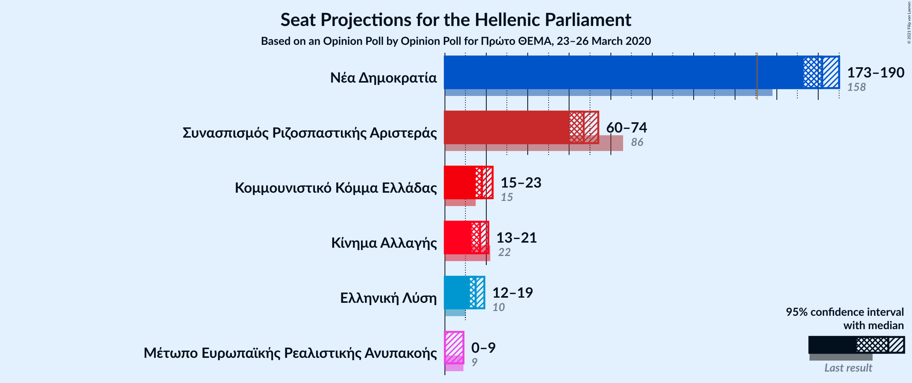
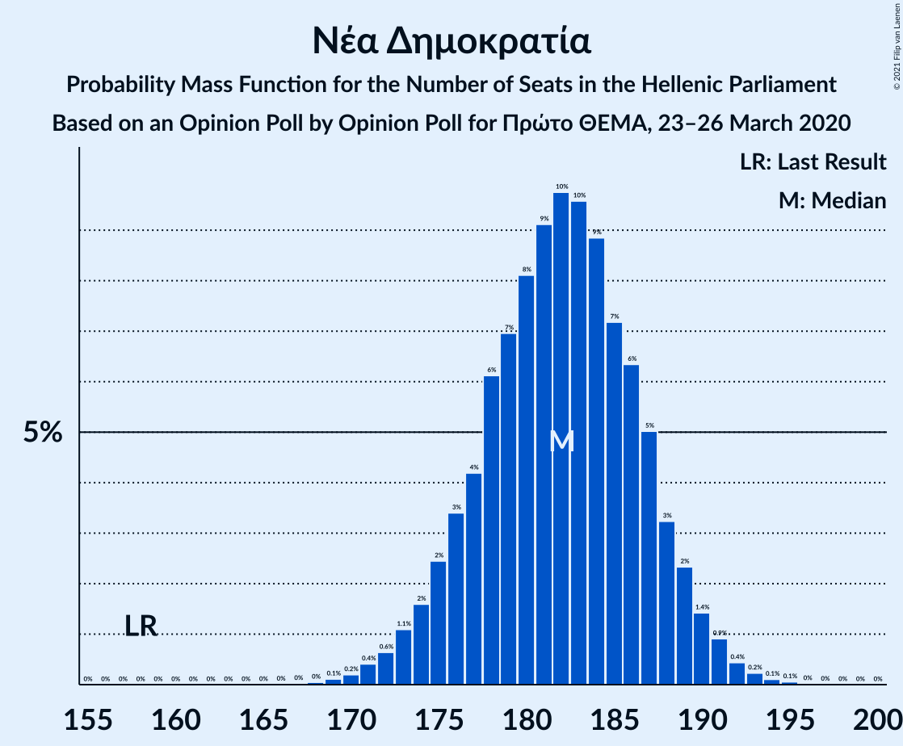
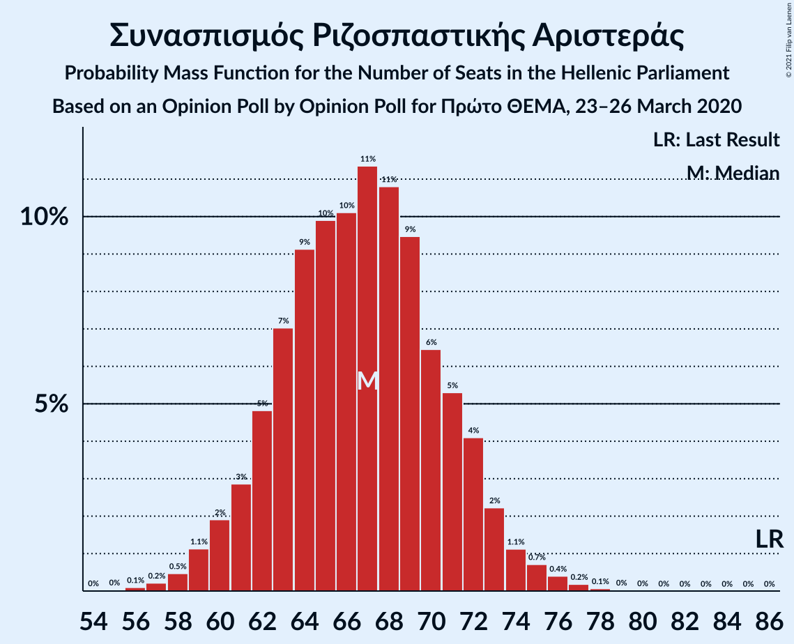
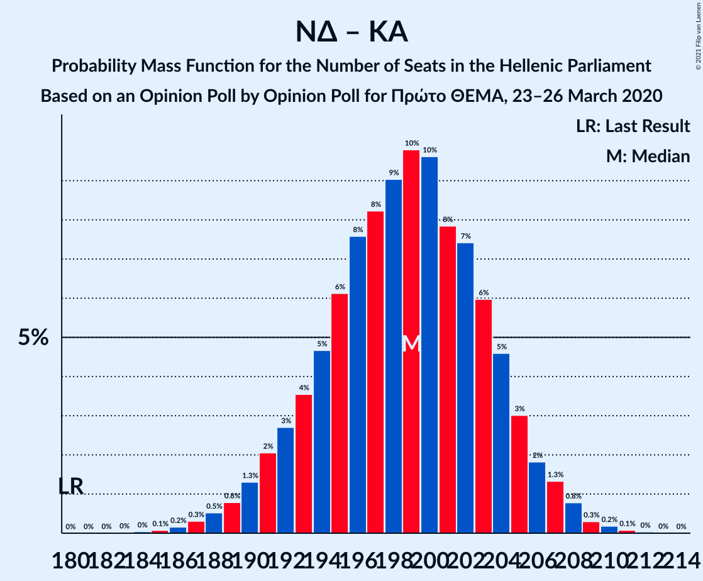

# Opinion Poll by Opinion Poll for Πρώτο ΘΕΜΑ, 23–26 March 2020

<a href="#voting-intentions">Voting Intentions</a> | <a href="#seats">Seats</a> | <a href="#coalitions">Coalitions</a> | <a href="#technical-information">Technical Information</a>

## Voting Intentions

### Confidence Intervals

| Party | Last Result | Poll Result | 80% Confidence Interval | 90% Confidence Interval | 95% Confidence Interval | 99% Confidence Interval |
|:-----:|:-----------:|:-----------:|:-----------------------:|:-----------------------:|:-----------------------:|:-----------------------:|
| Νέα Δημοκρατία | 39.8% | 50.5% | 48.6–52.4% |48.0–53.0% |47.5–53.5% |46.6–54.4% |
| Συνασπισμός Ριζοσπαστικής Αριστεράς | 31.5% | 25.5% | 23.8–27.2% |23.4–27.7% |23.0–28.2% |22.2–29.0% |
| Κομμουνιστικό Κόμμα Ελλάδας | 5.3% | 6.9% | 6.0–8.0% |5.8–8.3% |5.6–8.6% |5.2–9.2% |
| Κίνημα Αλλαγής | 8.1% | 6.3% | 5.4–7.3% |5.2–7.7% |5.0–7.9% |4.6–8.4% |
| Ελληνική Λύση | 3.7% | 5.7% | 4.8–6.7% |4.6–7.0% |4.4–7.2% |4.1–7.7% |
| Μέτωπο Ευρωπαϊκής Ρεαλιστικής Ανυπακοής | 3.4% | 2.5% | 2.0–3.2% |1.8–3.4% |1.7–3.6% |1.5–3.9% |

*Note:* The poll result column reflects the actual value used in the calculations. Published results may vary slightly, and in addition be rounded to fewer digits.

## Seats

### Confidence Intervals

| Party | Last Result | Median | 80% Confidence Interval | 90% Confidence Interval | 95% Confidence Interval | 99% Confidence Interval |
|:-----:|:-----------:|:------:|:-----------------------:|:-----------------------:|:-----------------------:|:-----------------------:|
| <a href="#νέα-δημοκρατία">Νέα Δημοκρατία</a> | 158 | 182 | 177–187 |175–189 |173–190 |171–192 |
| <a href="#συνασπισμός-ριζοσπαστικής-αριστεράς">Συνασπισμός Ριζοσπαστικής Αριστεράς</a> | 86 | 67 | 62–71 |61–72 |60–74 |58–76 |
| <a href="#κομμουνιστικό-κόμμα-ελλάδας">Κομμουνιστικό Κόμμα Ελλάδας</a> | 15 | 18 | 16–21 |15–22 |15–23 |13–24 |
| <a href="#κίνημα-αλλαγής">Κίνημα Αλλαγής</a> | 22 | 17 | 14–19 |14–20 |13–21 |12–22 |
| <a href="#ελληνική-λύση">Ελληνική Λύση</a> | 10 | 15 | 13–17 |12–18 |12–19 |11–20 |
| <a href="#μέτωπο-ευρωπαϊκής-ρεαλιστικής-ανυπακοής">Μέτωπο Ευρωπαϊκής Ρεαλιστικής Ανυπακοής</a> | 9 | 0 | 0–8 |0–9 |0–9 |0–10 |

### Νέα Δημοκρατία

*For a full overview of the results for this party, see the [Νέα Δημοκρατία](party-νέαδημοκρατία.html) page.*

| Number of Seats | Probability | Accumulated | Special Marks |
|:---------------:|:-----------:|:-----------:|:-------------:|
| 158 | 0% | 100% | Last Result |
| 159 | 0% | 100% |  |
| 160 | 0% | 100% |  |
| 161 | 0% | 100% |  |
| 162 | 0% | 100% |  |
| 163 | 0% | 100% |  |
| 164 | 0% | 100% |  |
| 165 | 0% | 100% |  |
| 166 | 0% | 100% |  |
| 167 | 0% | 100% |  |
| 168 | 0% | 100% |  |
| 169 | 0.1% | 99.9% |  |
| 170 | 0.2% | 99.8% |  |
| 171 | 0.4% | 99.6% |  |
| 172 | 0.6% | 99.2% |  |
| 173 | 1.1% | 98.5% |  |
| 174 | 2% | 97% |  |
| 175 | 2% | 96% |  |
| 176 | 3% | 93% |  |
| 177 | 4% | 90% |  |
| 178 | 6% | 86% |  |
| 179 | 7% | 80% |  |
| 180 | 8% | 73% |  |
| 181 | 9% | 65% |  |
| 182 | 10% | 56% | Median |
| 183 | 10% | 46% |  |
| 184 | 9% | 36% |  |
| 185 | 7% | 27% |  |
| 186 | 6% | 20% |  |
| 187 | 5% | 14% |  |
| 188 | 3% | 9% |  |
| 189 | 2% | 6% |  |
| 190 | 1.4% | 3% |  |
| 191 | 0.9% | 2% |  |
| 192 | 0.4% | 0.9% |  |
| 193 | 0.2% | 0.4% |  |
| 194 | 0.1% | 0.2% |  |
| 195 | 0.1% | 0.1% |  |
| 196 | 0% | 0% |  |

### Συνασπισμός Ριζοσπαστικής Αριστεράς

*For a full overview of the results for this party, see the [Συνασπισμός Ριζοσπαστικής Αριστεράς](party-συνασπισμόςριζοσπαστικήςαριστεράς.html) page.*

| Number of Seats | Probability | Accumulated | Special Marks |
|:---------------:|:-----------:|:-----------:|:-------------:|
| 55 | 0% | 100% |  |
| 56 | 0.1% | 99.9% |  |
| 57 | 0.2% | 99.8% |  |
| 58 | 0.5% | 99.6% |  |
| 59 | 1.1% | 99.2% |  |
| 60 | 2% | 98% |  |
| 61 | 3% | 96% |  |
| 62 | 5% | 93% |  |
| 63 | 7% | 88% |  |
| 64 | 9% | 81% |  |
| 65 | 10% | 72% |  |
| 66 | 10% | 62% |  |
| 67 | 11% | 52% | Median |
| 68 | 11% | 41% |  |
| 69 | 9% | 30% |  |
| 70 | 6% | 21% |  |
| 71 | 5% | 14% |  |
| 72 | 4% | 9% |  |
| 73 | 2% | 5% |  |
| 74 | 1.1% | 3% |  |
| 75 | 0.7% | 1.4% |  |
| 76 | 0.4% | 0.7% |  |
| 77 | 0.2% | 0.3% |  |
| 78 | 0.1% | 0.1% |  |
| 79 | 0% | 0% |  |
| 80 | 0% | 0% |  |
| 81 | 0% | 0% |  |
| 82 | 0% | 0% |  |
| 83 | 0% | 0% |  |
| 84 | 0% | 0% |  |
| 85 | 0% | 0% |  |
| 86 | 0% | 0% | Last Result |

### Κομμουνιστικό Κόμμα Ελλάδας

*For a full overview of the results for this party, see the [Κομμουνιστικό Κόμμα Ελλάδας](party-κομμουνιστικόκόμμαελλάδας.html) page.*

| Number of Seats | Probability | Accumulated | Special Marks |
|:---------------:|:-----------:|:-----------:|:-------------:|
| 12 | 0.1% | 100% |  |
| 13 | 0.4% | 99.9% |  |
| 14 | 2% | 99.5% |  |
| 15 | 5% | 98% | Last Result |
| 16 | 10% | 92% |  |
| 17 | 18% | 82% |  |
| 18 | 19% | 64% | Median |
| 19 | 18% | 45% |  |
| 20 | 13% | 27% |  |
| 21 | 8% | 14% |  |
| 22 | 4% | 7% |  |
| 23 | 2% | 3% |  |
| 24 | 0.6% | 0.8% |  |
| 25 | 0.2% | 0.2% |  |
| 26 | 0% | 0.1% |  |
| 27 | 0% | 0% |  |

### Κίνημα Αλλαγής

*For a full overview of the results for this party, see the [Κίνημα Αλλαγής](party-κίνημααλλαγής.html) page.*

| Number of Seats | Probability | Accumulated | Special Marks |
|:---------------:|:-----------:|:-----------:|:-------------:|
| 11 | 0.2% | 100% |  |
| 12 | 0.9% | 99.8% |  |
| 13 | 3% | 98.9% |  |
| 14 | 9% | 96% |  |
| 15 | 15% | 87% |  |
| 16 | 20% | 72% |  |
| 17 | 20% | 52% | Median |
| 18 | 15% | 32% |  |
| 19 | 9% | 17% |  |
| 20 | 5% | 8% |  |
| 21 | 2% | 3% |  |
| 22 | 0.7% | 1.0% | Last Result |
| 23 | 0.2% | 0.3% |  |
| 24 | 0.1% | 0.1% |  |
| 25 | 0% | 0% |  |

### Ελληνική Λύση

*For a full overview of the results for this party, see the [Ελληνική Λύση](party-ελληνικήλύση.html) page.*

| Number of Seats | Probability | Accumulated | Special Marks |
|:---------------:|:-----------:|:-----------:|:-------------:|
| 10 | 0.3% | 100% | Last Result |
| 11 | 2% | 99.6% |  |
| 12 | 6% | 98% |  |
| 13 | 12% | 92% |  |
| 14 | 21% | 79% |  |
| 15 | 21% | 58% | Median |
| 16 | 17% | 38% |  |
| 17 | 12% | 21% |  |
| 18 | 6% | 9% |  |
| 19 | 2% | 3% |  |
| 20 | 0.8% | 1.1% |  |
| 21 | 0.2% | 0.3% |  |
| 22 | 0.1% | 0.1% |  |
| 23 | 0% | 0% |  |

### Μέτωπο Ευρωπαϊκής Ρεαλιστικής Ανυπακοής

*For a full overview of the results for this party, see the [Μέτωπο Ευρωπαϊκής Ρεαλιστικής Ανυπακοής](party-μέτωποευρωπαϊκήςρεαλιστικήςανυπακοής.html) page.*

| Number of Seats | Probability | Accumulated | Special Marks |
|:---------------:|:-----------:|:-----------:|:-------------:|
| 0 | 84% | 100% | Median |
| 1 | 0% | 16% |  |
| 2 | 0% | 16% |  |
| 3 | 0% | 16% |  |
| 4 | 0% | 16% |  |
| 5 | 0% | 16% |  |
| 6 | 0% | 16% |  |
| 7 | 0% | 16% |  |
| 8 | 10% | 16% |  |
| 9 | 5% | 6% | Last Result |
| 10 | 1.2% | 1.4% |  |
| 11 | 0.2% | 0.2% |  |
| 12 | 0% | 0% |  |

## Coalitions

### Confidence Intervals

| Coalition | Last Result | Median | Majority? | 80% Confidence Interval | 90% Confidence Interval | 95% Confidence Interval | 99% Confidence Interval |
|:---------:|:-----------:|:------:|:---------:|:-----------------------:|:-----------------------:|:-----------------------:|:-----------------------:|
| Νέα Δημοκρατία – Κίνημα Αλλαγής | 180 | 199 | 100% | 193–204 | 191–205 | 190–207 | 187–209 |
| Νέα Δημοκρατία | 158 | 182 | 100% | 177–187 | 175–189 | 173–190 | 171–192 |
| Συνασπισμός Ριζοσπαστικής Αριστεράς – Μέτωπο Ευρωπαϊκής Ρεαλιστικής Ανυπακοής | 95 | 68 | 0% | 63–73 | 62–75 | 61–77 | 59–80 |
| Συνασπισμός Ριζοσπαστικής Αριστεράς | 86 | 67 | 0% | 62–71 | 61–72 | 60–74 | 58–76 |

### Νέα Δημοκρατία – Κίνημα Αλλαγής

| Number of Seats | Probability | Accumulated | Special Marks |
|:---------------:|:-----------:|:-----------:|:-------------:|
| 180 | 0% | 100% | Last Result |
| 181 | 0% | 100% |  |
| 182 | 0% | 100% |  |
| 183 | 0% | 100% |  |
| 184 | 0% | 100% |  |
| 185 | 0.1% | 99.9% |  |
| 186 | 0.2% | 99.8% |  |
| 187 | 0.3% | 99.7% |  |
| 188 | 0.5% | 99.4% |  |
| 189 | 0.8% | 98.9% |  |
| 190 | 1.3% | 98% |  |
| 191 | 2% | 97% |  |
| 192 | 3% | 95% |  |
| 193 | 4% | 92% |  |
| 194 | 5% | 88% |  |
| 195 | 6% | 84% |  |
| 196 | 8% | 78% |  |
| 197 | 8% | 70% |  |
| 198 | 9% | 62% |  |
| 199 | 10% | 53% | Median |
| 200 | 10% | 43% |  |
| 201 | 8% | 33% |  |
| 202 | 7% | 26% |  |
| 203 | 6% | 18% |  |
| 204 | 5% | 12% |  |
| 205 | 3% | 8% |  |
| 206 | 2% | 5% |  |
| 207 | 1.3% | 3% |  |
| 208 | 0.8% | 1.4% |  |
| 209 | 0.3% | 0.6% |  |
| 210 | 0.2% | 0.3% |  |
| 211 | 0.1% | 0.1% |  |
| 212 | 0% | 0.1% |  |
| 213 | 0% | 0% |  |

### Νέα Δημοκρατία

| Number of Seats | Probability | Accumulated | Special Marks |
|:---------------:|:-----------:|:-----------:|:-------------:|
| 158 | 0% | 100% | Last Result |
| 159 | 0% | 100% |  |
| 160 | 0% | 100% |  |
| 161 | 0% | 100% |  |
| 162 | 0% | 100% |  |
| 163 | 0% | 100% |  |
| 164 | 0% | 100% |  |
| 165 | 0% | 100% |  |
| 166 | 0% | 100% |  |
| 167 | 0% | 100% |  |
| 168 | 0% | 100% |  |
| 169 | 0.1% | 99.9% |  |
| 170 | 0.2% | 99.8% |  |
| 171 | 0.4% | 99.6% |  |
| 172 | 0.6% | 99.2% |  |
| 173 | 1.1% | 98.5% |  |
| 174 | 2% | 97% |  |
| 175 | 2% | 96% |  |
| 176 | 3% | 93% |  |
| 177 | 4% | 90% |  |
| 178 | 6% | 86% |  |
| 179 | 7% | 80% |  |
| 180 | 8% | 73% |  |
| 181 | 9% | 65% |  |
| 182 | 10% | 56% | Median |
| 183 | 10% | 46% |  |
| 184 | 9% | 36% |  |
| 185 | 7% | 27% |  |
| 186 | 6% | 20% |  |
| 187 | 5% | 14% |  |
| 188 | 3% | 9% |  |
| 189 | 2% | 6% |  |
| 190 | 1.4% | 3% |  |
| 191 | 0.9% | 2% |  |
| 192 | 0.4% | 0.9% |  |
| 193 | 0.2% | 0.4% |  |
| 194 | 0.1% | 0.2% |  |
| 195 | 0.1% | 0.1% |  |
| 196 | 0% | 0% |  |

### Συνασπισμός Ριζοσπαστικής Αριστεράς – Μέτωπο Ευρωπαϊκής Ρεαλιστικής Ανυπακοής

| Number of Seats | Probability | Accumulated | Special Marks |
|:---------------:|:-----------:|:-----------:|:-------------:|
| 56 | 0% | 100% |  |
| 57 | 0.1% | 99.9% |  |
| 58 | 0.3% | 99.8% |  |
| 59 | 0.6% | 99.6% |  |
| 60 | 1.2% | 98.9% |  |
| 61 | 2% | 98% |  |
| 62 | 3% | 96% |  |
| 63 | 5% | 92% |  |
| 64 | 7% | 87% |  |
| 65 | 8% | 80% |  |
| 66 | 9% | 72% |  |
| 67 | 10% | 63% | Median |
| 68 | 10% | 53% |  |
| 69 | 9% | 43% |  |
| 70 | 7% | 34% |  |
| 71 | 6% | 26% |  |
| 72 | 6% | 20% |  |
| 73 | 4% | 14% |  |
| 74 | 3% | 10% |  |
| 75 | 2% | 7% |  |
| 76 | 2% | 5% |  |
| 77 | 1.3% | 3% |  |
| 78 | 0.6% | 2% |  |
| 79 | 0.5% | 1.1% |  |
| 80 | 0.3% | 0.6% |  |
| 81 | 0.1% | 0.3% |  |
| 82 | 0.1% | 0.1% |  |
| 83 | 0% | 0.1% |  |
| 84 | 0% | 0% |  |
| 85 | 0% | 0% |  |
| 86 | 0% | 0% |  |
| 87 | 0% | 0% |  |
| 88 | 0% | 0% |  |
| 89 | 0% | 0% |  |
| 90 | 0% | 0% |  |
| 91 | 0% | 0% |  |
| 92 | 0% | 0% |  |
| 93 | 0% | 0% |  |
| 94 | 0% | 0% |  |
| 95 | 0% | 0% | Last Result |

### Συνασπισμός Ριζοσπαστικής Αριστεράς

| Number of Seats | Probability | Accumulated | Special Marks |
|:---------------:|:-----------:|:-----------:|:-------------:|
| 55 | 0% | 100% |  |
| 56 | 0.1% | 99.9% |  |
| 57 | 0.2% | 99.8% |  |
| 58 | 0.5% | 99.6% |  |
| 59 | 1.1% | 99.2% |  |
| 60 | 2% | 98% |  |
| 61 | 3% | 96% |  |
| 62 | 5% | 93% |  |
| 63 | 7% | 88% |  |
| 64 | 9% | 81% |  |
| 65 | 10% | 72% |  |
| 66 | 10% | 62% |  |
| 67 | 11% | 52% | Median |
| 68 | 11% | 41% |  |
| 69 | 9% | 30% |  |
| 70 | 6% | 21% |  |
| 71 | 5% | 14% |  |
| 72 | 4% | 9% |  |
| 73 | 2% | 5% |  |
| 74 | 1.1% | 3% |  |
| 75 | 0.7% | 1.4% |  |
| 76 | 0.4% | 0.7% |  |
| 77 | 0.2% | 0.3% |  |
| 78 | 0.1% | 0.1% |  |
| 79 | 0% | 0% |  |
| 80 | 0% | 0% |  |
| 81 | 0% | 0% |  |
| 82 | 0% | 0% |  |
| 83 | 0% | 0% |  |
| 84 | 0% | 0% |  |
| 85 | 0% | 0% |  |
| 86 | 0% | 0% | Last Result |

## Technical Information

### Opinion Poll

+ **Polling firm:** Opinion Poll
+ **Commissioner(s):** Πρώτο ΘΕΜΑ
+ **Fieldwork period:** 23–26 March 2020

### Calculations

+ **Sample size:** 1095
+ **Simulations done:** 1,048,576
+ **Error estimate:** 0.40%

