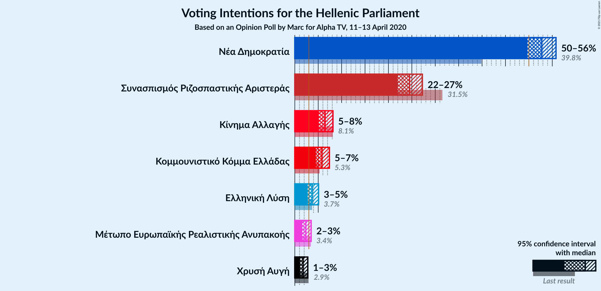
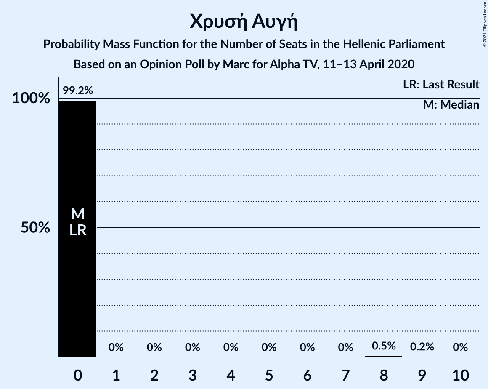
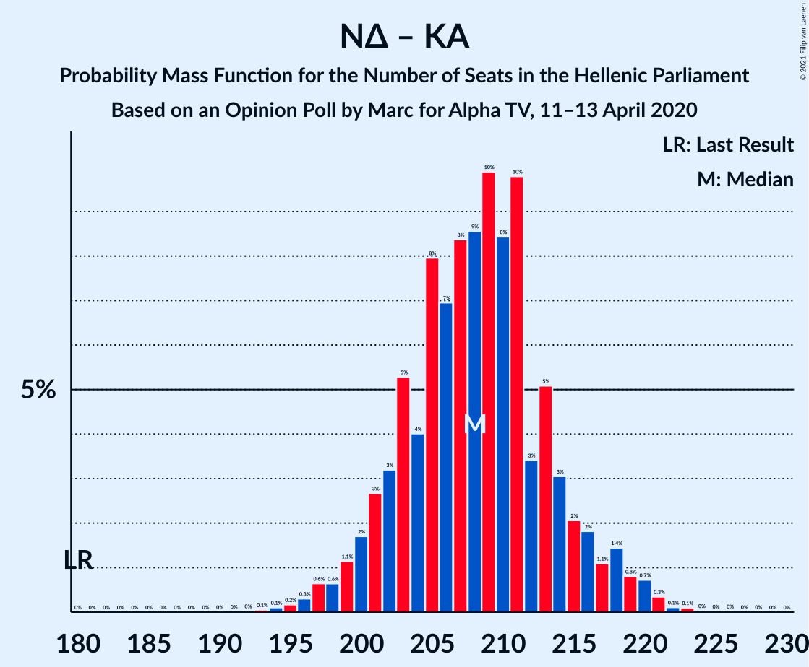
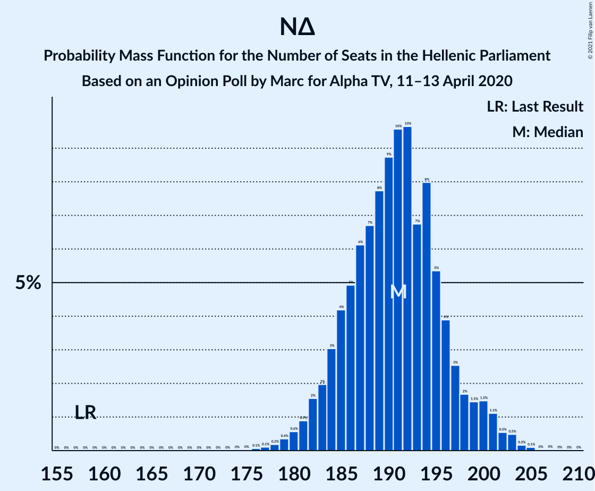
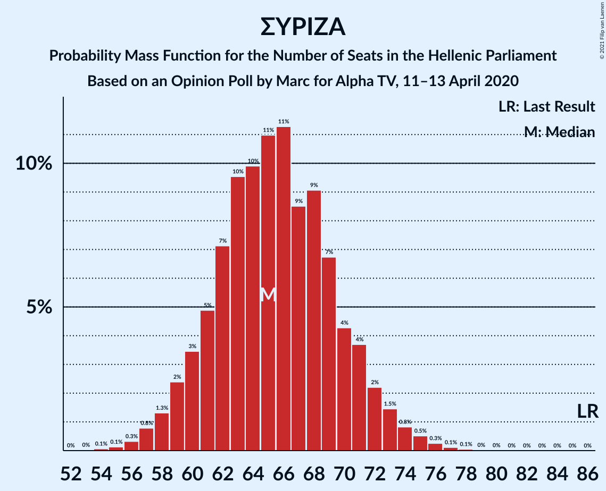

# Opinion Poll by Marc for Alpha TV, 11–13 April 2020

<a href="#voting-intentions">Voting Intentions</a> | <a href="#seats">Seats</a> | <a href="#coalitions">Coalitions</a> | <a href="#technical-information">Technical Information</a>

## Voting Intentions

### Confidence Intervals

| Party | Last Result | Poll Result | 80% Confidence Interval | 90% Confidence Interval | 95% Confidence Interval | 99% Confidence Interval |
|:-----:|:-----------:|:-----------:|:-----------------------:|:-----------------------:|:-----------------------:|:-----------------------:|
| Νέα Δημοκρατία | 39.8% | 52.7% | 50.7–54.7% |50.2–55.3% |49.7–55.8% |48.7–56.8% |
| Συνασπισμός Ριζοσπαστικής Αριστεράς | 31.5% | 24.5% | 22.8–26.3% |22.4–26.8% |22.0–27.3% |21.2–28.1% |
| Κίνημα Αλλαγής | 8.1% | 6.5% | 5.6–7.6% |5.3–7.9% |5.1–8.2% |4.7–8.7% |
| Κομμουνιστικό Κόμμα Ελλάδας | 5.3% | 5.8% | 4.9–6.8% |4.7–7.1% |4.5–7.4% |4.1–7.9% |
| Ελληνική Λύση | 3.7% | 3.7% | 3.1–4.6% |2.9–4.9% |2.7–5.1% |2.4–5.5% |
| Μέτωπο Ευρωπαϊκής Ρεαλιστικής Ανυπακοής | 3.4% | 2.4% | 1.8–3.1% |1.7–3.3% |1.6–3.5% |1.4–3.9% |
| Χρυσή Αυγή | 2.9% | 1.8% | 1.3–2.4% |1.2–2.6% |1.1–2.8% |0.9–3.1% |

*Note:* The poll result column reflects the actual value used in the calculations. Published results may vary slightly, and in addition be rounded to fewer digits.

## Seats

### Confidence Intervals

| Party | Last Result | Median | 80% Confidence Interval | 90% Confidence Interval | 95% Confidence Interval | 99% Confidence Interval |
|:-----:|:-----------:|:------:|:-----------------------:|:-----------------------:|:-----------------------:|:-----------------------:|
| <a href="#νέα-δημοκρατία">Νέα Δημοκρατία</a> | 158 | 191 | 185–196 |183–199 |182–200 |179–203 |
| <a href="#συνασπισμός-ριζοσπαστικής-αριστεράς">Συνασπισμός Ριζοσπαστικής Αριστεράς</a> | 86 | 65 | 61–70 |59–72 |58–73 |56–75 |
| <a href="#κίνημα-αλλαγής">Κίνημα Αλλαγής</a> | 22 | 17 | 15–20 |14–21 |14–22 |13–23 |
| <a href="#κομμουνιστικό-κόμμα-ελλάδας">Κομμουνιστικό Κόμμα Ελλάδας</a> | 15 | 16 | 13–18 |13–19 |12–20 |11–21 |
| <a href="#ελληνική-λύση">Ελληνική Λύση</a> | 10 | 10 | 8–12 |0–13 |0–14 |0–15 |
| <a href="#μέτωπο-ευρωπαϊκής-ρεαλιστικής-ανυπακοής">Μέτωπο Ευρωπαϊκής Ρεαλιστικής Ανυπακοής</a> | 9 | 0 | 0–8 |0–9 |0–9 |0–10 |
| <a href="#χρυσή-αυγή">Χρυσή Αυγή</a> | 0 | 0 | 0 |0 |0 |0–8 |

### Νέα Δημοκρατία

*For a full overview of the results for this party, see the [Νέα Δημοκρατία](party-νέαδημοκρατία.html) page.*

| Number of Seats | Probability | Accumulated | Special Marks |
|:---------------:|:-----------:|:-----------:|:-------------:|
| 158 | 0% | 100% | Last Result |
| 159 | 0% | 100% |  |
| 160 | 0% | 100% |  |
| 161 | 0% | 100% |  |
| 162 | 0% | 100% |  |
| 163 | 0% | 100% |  |
| 164 | 0% | 100% |  |
| 165 | 0% | 100% |  |
| 166 | 0% | 100% |  |
| 167 | 0% | 100% |  |
| 168 | 0% | 100% |  |
| 169 | 0% | 100% |  |
| 170 | 0% | 100% |  |
| 171 | 0% | 100% |  |
| 172 | 0% | 100% |  |
| 173 | 0% | 100% |  |
| 174 | 0% | 100% |  |
| 175 | 0% | 100% |  |
| 176 | 0.1% | 99.9% |  |
| 177 | 0.1% | 99.9% |  |
| 178 | 0.2% | 99.8% |  |
| 179 | 0.4% | 99.6% |  |
| 180 | 0.6% | 99.2% |  |
| 181 | 0.9% | 98.7% |  |
| 182 | 2% | 98% |  |
| 183 | 2% | 96% |  |
| 184 | 3% | 94% |  |
| 185 | 4% | 91% |  |
| 186 | 5% | 87% |  |
| 187 | 6% | 82% |  |
| 188 | 7% | 76% |  |
| 189 | 8% | 69% |  |
| 190 | 9% | 62% |  |
| 191 | 10% | 53% | Median |
| 192 | 10% | 43% |  |
| 193 | 7% | 34% |  |
| 194 | 8% | 27% |  |
| 195 | 5% | 19% |  |
| 196 | 4% | 14% |  |
| 197 | 3% | 10% |  |
| 198 | 2% | 7% |  |
| 199 | 1.5% | 5% |  |
| 200 | 1.5% | 4% |  |
| 201 | 1.1% | 2% |  |
| 202 | 0.5% | 1.4% |  |
| 203 | 0.5% | 0.8% |  |
| 204 | 0.2% | 0.3% |  |
| 205 | 0.1% | 0.2% |  |
| 206 | 0% | 0.1% |  |
| 207 | 0% | 0.1% |  |
| 208 | 0% | 0% |  |

### Συνασπισμός Ριζοσπαστικής Αριστεράς

*For a full overview of the results for this party, see the [Συνασπισμός Ριζοσπαστικής Αριστεράς](party-συνασπισμόςριζοσπαστικήςαριστεράς.html) page.*

| Number of Seats | Probability | Accumulated | Special Marks |
|:---------------:|:-----------:|:-----------:|:-------------:|
| 54 | 0.1% | 100% |  |
| 55 | 0.1% | 99.9% |  |
| 56 | 0.3% | 99.8% |  |
| 57 | 0.8% | 99.4% |  |
| 58 | 1.3% | 98.7% |  |
| 59 | 2% | 97% |  |
| 60 | 3% | 95% |  |
| 61 | 5% | 91% |  |
| 62 | 7% | 87% |  |
| 63 | 10% | 79% |  |
| 64 | 10% | 70% |  |
| 65 | 11% | 60% | Median |
| 66 | 11% | 49% |  |
| 67 | 9% | 38% |  |
| 68 | 9% | 29% |  |
| 69 | 7% | 20% |  |
| 70 | 4% | 13% |  |
| 71 | 4% | 9% |  |
| 72 | 2% | 5% |  |
| 73 | 1.5% | 3% |  |
| 74 | 0.8% | 2% |  |
| 75 | 0.5% | 1.0% |  |
| 76 | 0.3% | 0.5% |  |
| 77 | 0.1% | 0.2% |  |
| 78 | 0.1% | 0.1% |  |
| 79 | 0% | 0% |  |
| 80 | 0% | 0% |  |
| 81 | 0% | 0% |  |
| 82 | 0% | 0% |  |
| 83 | 0% | 0% |  |
| 84 | 0% | 0% |  |
| 85 | 0% | 0% |  |
| 86 | 0% | 0% | Last Result |

### Κίνημα Αλλαγής

*For a full overview of the results for this party, see the [Κίνημα Αλλαγής](party-κίνημααλλαγής.html) page.*

| Number of Seats | Probability | Accumulated | Special Marks |
|:---------------:|:-----------:|:-----------:|:-------------:|
| 11 | 0.1% | 100% |  |
| 12 | 0.4% | 99.9% |  |
| 13 | 2% | 99.6% |  |
| 14 | 5% | 98% |  |
| 15 | 11% | 93% |  |
| 16 | 14% | 82% |  |
| 17 | 20% | 68% | Median |
| 18 | 18% | 48% |  |
| 19 | 14% | 30% |  |
| 20 | 8% | 16% |  |
| 21 | 5% | 8% |  |
| 22 | 2% | 3% | Last Result |
| 23 | 0.8% | 1.2% |  |
| 24 | 0.3% | 0.4% |  |
| 25 | 0.1% | 0.1% |  |
| 26 | 0% | 0% |  |

### Κομμουνιστικό Κόμμα Ελλάδας

*For a full overview of the results for this party, see the [Κομμουνιστικό Κόμμα Ελλάδας](party-κομμουνιστικόκόμμαελλάδας.html) page.*

| Number of Seats | Probability | Accumulated | Special Marks |
|:---------------:|:-----------:|:-----------:|:-------------:|
| 10 | 0.2% | 100% |  |
| 11 | 0.9% | 99.8% |  |
| 12 | 4% | 98.9% |  |
| 13 | 8% | 95% |  |
| 14 | 15% | 87% |  |
| 15 | 19% | 72% | Last Result |
| 16 | 21% | 53% | Median |
| 17 | 15% | 32% |  |
| 18 | 8% | 17% |  |
| 19 | 5% | 8% |  |
| 20 | 2% | 3% |  |
| 21 | 0.8% | 1.1% |  |
| 22 | 0.2% | 0.3% |  |
| 23 | 0.1% | 0.1% |  |
| 24 | 0% | 0% |  |

### Ελληνική Λύση

*For a full overview of the results for this party, see the [Ελληνική Λύση](party-ελληνικήλύση.html) page.*

| Number of Seats | Probability | Accumulated | Special Marks |
|:---------------:|:-----------:|:-----------:|:-------------:|
| 0 | 9% | 100% |  |
| 1 | 0% | 91% |  |
| 2 | 0% | 91% |  |
| 3 | 0% | 91% |  |
| 4 | 0% | 91% |  |
| 5 | 0% | 91% |  |
| 6 | 0% | 91% |  |
| 7 | 0% | 91% |  |
| 8 | 6% | 91% |  |
| 9 | 21% | 85% |  |
| 10 | 24% | 64% | Last Result, Median |
| 11 | 20% | 40% |  |
| 12 | 11% | 20% |  |
| 13 | 6% | 8% |  |
| 14 | 2% | 3% |  |
| 15 | 0.5% | 0.7% |  |
| 16 | 0.1% | 0.2% |  |
| 17 | 0% | 0% |  |

### Μέτωπο Ευρωπαϊκής Ρεαλιστικής Ανυπακοής

*For a full overview of the results for this party, see the [Μέτωπο Ευρωπαϊκής Ρεαλιστικής Ανυπακοής](party-μέτωποευρωπαϊκήςρεαλιστικήςανυπακοής.html) page.*

| Number of Seats | Probability | Accumulated | Special Marks |
|:---------------:|:-----------:|:-----------:|:-------------:|
| 0 | 88% | 100% | Median |
| 1 | 0% | 12% |  |
| 2 | 0% | 12% |  |
| 3 | 0% | 12% |  |
| 4 | 0% | 12% |  |
| 5 | 0% | 12% |  |
| 6 | 0% | 12% |  |
| 7 | 0% | 12% |  |
| 8 | 6% | 12% |  |
| 9 | 4% | 6% | Last Result |
| 10 | 1.1% | 1.3% |  |
| 11 | 0.2% | 0.2% |  |
| 12 | 0% | 0% |  |

### Χρυσή Αυγή

*For a full overview of the results for this party, see the [Χρυσή Αυγή](party-χρυσήαυγή.html) page.*

| Number of Seats | Probability | Accumulated | Special Marks |
|:---------------:|:-----------:|:-----------:|:-------------:|
| 0 | 99.2% | 100% | Last Result, Median |
| 1 | 0% | 0.8% |  |
| 2 | 0% | 0.8% |  |
| 3 | 0% | 0.8% |  |
| 4 | 0% | 0.8% |  |
| 5 | 0% | 0.8% |  |
| 6 | 0% | 0.8% |  |
| 7 | 0% | 0.8% |  |
| 8 | 0.5% | 0.8% |  |
| 9 | 0.2% | 0.3% |  |
| 10 | 0% | 0% |  |

## Coalitions

### Confidence Intervals

| Coalition | Last Result | Median | Majority? | 80% Confidence Interval | 90% Confidence Interval | 95% Confidence Interval | 99% Confidence Interval |
|:---------:|:-----------:|:------:|:---------:|:-----------------------:|:-----------------------:|:-----------------------:|:-----------------------:|
| Νέα Δημοκρατία – Κίνημα Αλλαγής | 180 | 208 | 100% | 202–214 | 201–216 | 199–218 | 196–221 |
| Νέα Δημοκρατία | 158 | 191 | 100% | 185–196 | 183–199 | 182–200 | 179–203 |
| Συνασπισμός Ριζοσπαστικής Αριστεράς – Μέτωπο Ευρωπαϊκής Ρεαλιστικής Ανυπακοής | 95 | 66 | 0% | 62–72 | 60–74 | 59–76 | 57–79 |
| Συνασπισμός Ριζοσπαστικής Αριστεράς | 86 | 65 | 0% | 61–70 | 59–72 | 58–73 | 56–75 |

### Νέα Δημοκρατία – Κίνημα Αλλαγής

| Number of Seats | Probability | Accumulated | Special Marks |
|:---------------:|:-----------:|:-----------:|:-------------:|
| 180 | 0% | 100% | Last Result |
| 181 | 0% | 100% |  |
| 182 | 0% | 100% |  |
| 183 | 0% | 100% |  |
| 184 | 0% | 100% |  |
| 185 | 0% | 100% |  |
| 186 | 0% | 100% |  |
| 187 | 0% | 100% |  |
| 188 | 0% | 100% |  |
| 189 | 0% | 100% |  |
| 190 | 0% | 100% |  |
| 191 | 0% | 100% |  |
| 192 | 0% | 100% |  |
| 193 | 0.1% | 100% |  |
| 194 | 0.1% | 99.9% |  |
| 195 | 0.2% | 99.8% |  |
| 196 | 0.3% | 99.6% |  |
| 197 | 0.6% | 99.3% |  |
| 198 | 0.6% | 98.7% |  |
| 199 | 1.1% | 98% |  |
| 200 | 2% | 97% |  |
| 201 | 3% | 95% |  |
| 202 | 3% | 93% |  |
| 203 | 5% | 89% |  |
| 204 | 4% | 84% |  |
| 205 | 8% | 80% |  |
| 206 | 7% | 72% |  |
| 207 | 8% | 65% |  |
| 208 | 9% | 57% | Median |
| 209 | 10% | 48% |  |
| 210 | 8% | 38% |  |
| 211 | 10% | 30% |  |
| 212 | 3% | 20% |  |
| 213 | 5% | 17% |  |
| 214 | 3% | 12% |  |
| 215 | 2% | 9% |  |
| 216 | 2% | 7% |  |
| 217 | 1.1% | 5% |  |
| 218 | 1.4% | 4% |  |
| 219 | 0.8% | 2% |  |
| 220 | 0.7% | 1.4% |  |
| 221 | 0.3% | 0.6% |  |
| 222 | 0.1% | 0.3% |  |
| 223 | 0.1% | 0.2% |  |
| 224 | 0% | 0.1% |  |
| 225 | 0% | 0.1% |  |
| 226 | 0% | 0% |  |

### Νέα Δημοκρατία

| Number of Seats | Probability | Accumulated | Special Marks |
|:---------------:|:-----------:|:-----------:|:-------------:|
| 158 | 0% | 100% | Last Result |
| 159 | 0% | 100% |  |
| 160 | 0% | 100% |  |
| 161 | 0% | 100% |  |
| 162 | 0% | 100% |  |
| 163 | 0% | 100% |  |
| 164 | 0% | 100% |  |
| 165 | 0% | 100% |  |
| 166 | 0% | 100% |  |
| 167 | 0% | 100% |  |
| 168 | 0% | 100% |  |
| 169 | 0% | 100% |  |
| 170 | 0% | 100% |  |
| 171 | 0% | 100% |  |
| 172 | 0% | 100% |  |
| 173 | 0% | 100% |  |
| 174 | 0% | 100% |  |
| 175 | 0% | 100% |  |
| 176 | 0.1% | 99.9% |  |
| 177 | 0.1% | 99.9% |  |
| 178 | 0.2% | 99.8% |  |
| 179 | 0.4% | 99.6% |  |
| 180 | 0.6% | 99.2% |  |
| 181 | 0.9% | 98.7% |  |
| 182 | 2% | 98% |  |
| 183 | 2% | 96% |  |
| 184 | 3% | 94% |  |
| 185 | 4% | 91% |  |
| 186 | 5% | 87% |  |
| 187 | 6% | 82% |  |
| 188 | 7% | 76% |  |
| 189 | 8% | 69% |  |
| 190 | 9% | 62% |  |
| 191 | 10% | 53% | Median |
| 192 | 10% | 43% |  |
| 193 | 7% | 34% |  |
| 194 | 8% | 27% |  |
| 195 | 5% | 19% |  |
| 196 | 4% | 14% |  |
| 197 | 3% | 10% |  |
| 198 | 2% | 7% |  |
| 199 | 1.5% | 5% |  |
| 200 | 1.5% | 4% |  |
| 201 | 1.1% | 2% |  |
| 202 | 0.5% | 1.4% |  |
| 203 | 0.5% | 0.8% |  |
| 204 | 0.2% | 0.3% |  |
| 205 | 0.1% | 0.2% |  |
| 206 | 0% | 0.1% |  |
| 207 | 0% | 0.1% |  |
| 208 | 0% | 0% |  |

### Συνασπισμός Ριζοσπαστικής Αριστεράς – Μέτωπο Ευρωπαϊκής Ρεαλιστικής Ανυπακοής

| Number of Seats | Probability | Accumulated | Special Marks |
|:---------------:|:-----------:|:-----------:|:-------------:|
| 54 | 0% | 100% |  |
| 55 | 0.1% | 99.9% |  |
| 56 | 0.2% | 99.9% |  |
| 57 | 0.5% | 99.7% |  |
| 58 | 1.0% | 99.2% |  |
| 59 | 2% | 98% |  |
| 60 | 2% | 97% |  |
| 61 | 4% | 94% |  |
| 62 | 6% | 90% |  |
| 63 | 8% | 84% |  |
| 64 | 9% | 76% |  |
| 65 | 10% | 67% | Median |
| 66 | 10% | 57% |  |
| 67 | 8% | 47% |  |
| 68 | 10% | 39% |  |
| 69 | 7% | 29% |  |
| 70 | 5% | 22% |  |
| 71 | 5% | 17% |  |
| 72 | 3% | 12% |  |
| 73 | 3% | 9% |  |
| 74 | 2% | 6% |  |
| 75 | 1.3% | 4% |  |
| 76 | 1.1% | 3% |  |
| 77 | 0.7% | 1.5% |  |
| 78 | 0.3% | 0.8% |  |
| 79 | 0.3% | 0.5% |  |
| 80 | 0.1% | 0.3% |  |
| 81 | 0.1% | 0.1% |  |
| 82 | 0% | 0.1% |  |
| 83 | 0% | 0% |  |
| 84 | 0% | 0% |  |
| 85 | 0% | 0% |  |
| 86 | 0% | 0% |  |
| 87 | 0% | 0% |  |
| 88 | 0% | 0% |  |
| 89 | 0% | 0% |  |
| 90 | 0% | 0% |  |
| 91 | 0% | 0% |  |
| 92 | 0% | 0% |  |
| 93 | 0% | 0% |  |
| 94 | 0% | 0% |  |
| 95 | 0% | 0% | Last Result |

### Συνασπισμός Ριζοσπαστικής Αριστεράς

| Number of Seats | Probability | Accumulated | Special Marks |
|:---------------:|:-----------:|:-----------:|:-------------:|
| 54 | 0.1% | 100% |  |
| 55 | 0.1% | 99.9% |  |
| 56 | 0.3% | 99.8% |  |
| 57 | 0.8% | 99.4% |  |
| 58 | 1.3% | 98.7% |  |
| 59 | 2% | 97% |  |
| 60 | 3% | 95% |  |
| 61 | 5% | 91% |  |
| 62 | 7% | 87% |  |
| 63 | 10% | 79% |  |
| 64 | 10% | 70% |  |
| 65 | 11% | 60% | Median |
| 66 | 11% | 49% |  |
| 67 | 9% | 38% |  |
| 68 | 9% | 29% |  |
| 69 | 7% | 20% |  |
| 70 | 4% | 13% |  |
| 71 | 4% | 9% |  |
| 72 | 2% | 5% |  |
| 73 | 1.5% | 3% |  |
| 74 | 0.8% | 2% |  |
| 75 | 0.5% | 1.0% |  |
| 76 | 0.3% | 0.5% |  |
| 77 | 0.1% | 0.2% |  |
| 78 | 0.1% | 0.1% |  |
| 79 | 0% | 0% |  |
| 80 | 0% | 0% |  |
| 81 | 0% | 0% |  |
| 82 | 0% | 0% |  |
| 83 | 0% | 0% |  |
| 84 | 0% | 0% |  |
| 85 | 0% | 0% |  |
| 86 | 0% | 0% | Last Result |

## Technical Information

### Opinion Poll

+ **Polling firm:** Marc
+ **Commissioner(s):** Alpha TV
+ **Fieldwork period:** 11–13 April 2020

### Calculations

+ **Sample size:** 1020
+ **Simulations done:** 1,048,576
+ **Error estimate:** 1.13%

