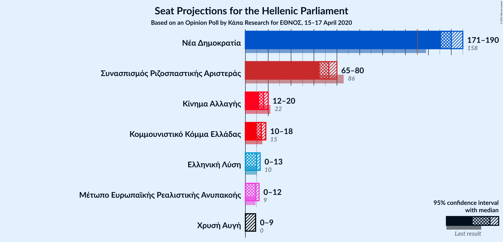
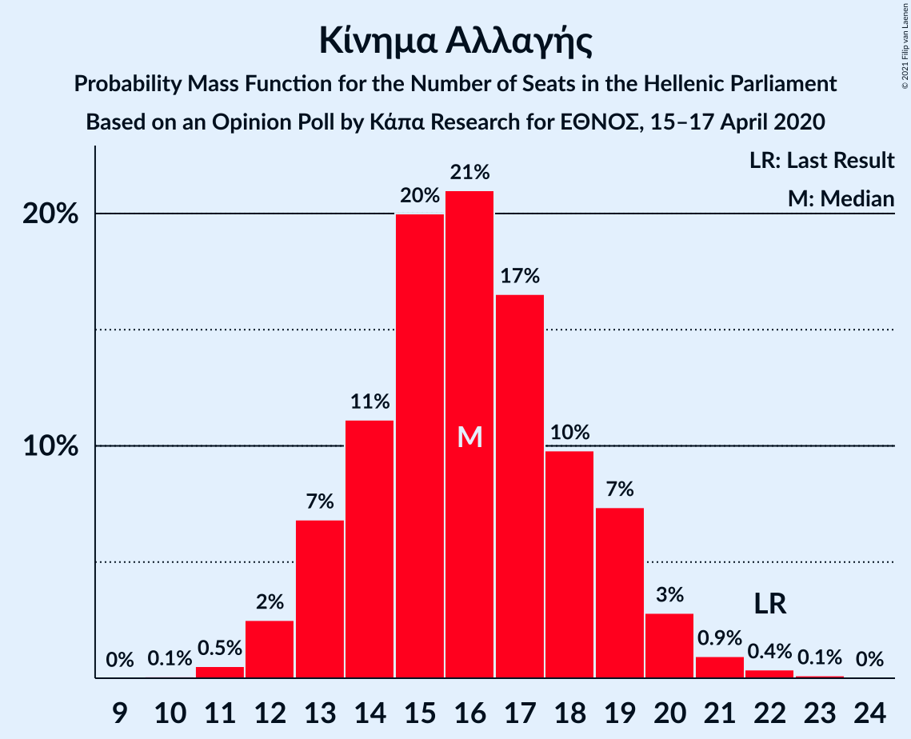
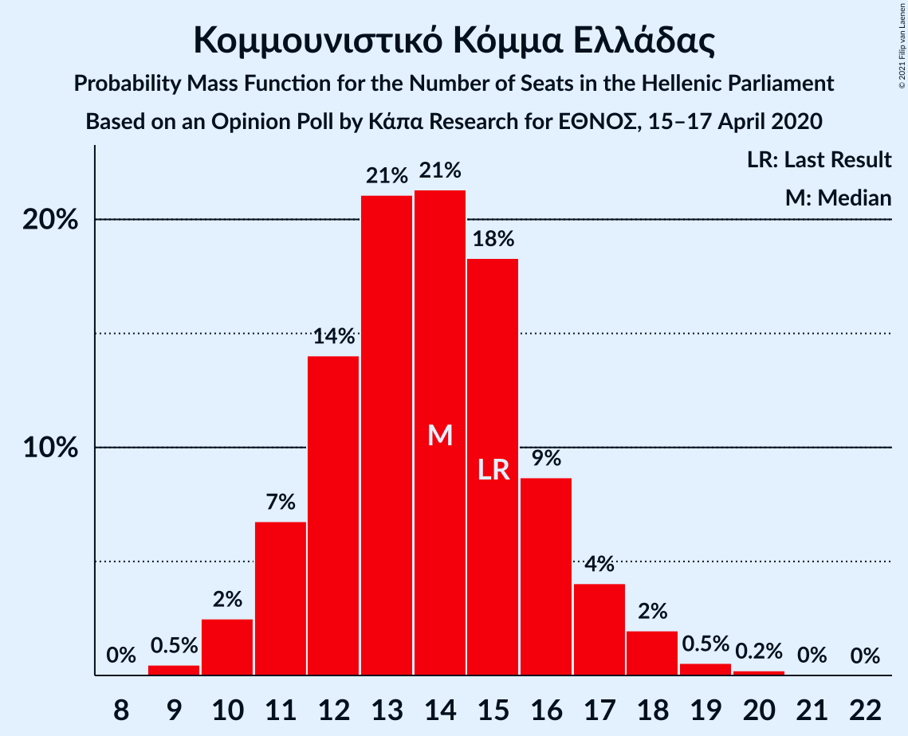

# Opinion Poll by Κάπα Research for ΕΘΝΟΣ, 15–17 April 2020

<a href="#voting-intentions">Voting Intentions</a> | <a href="#seats">Seats</a> | <a href="#coalitions">Coalitions</a> | <a href="#technical-information">Technical Information</a>

## Voting Intentions

### Confidence Intervals

| Party | Last Result | Poll Result | 80% Confidence Interval | 90% Confidence Interval | 95% Confidence Interval | 99% Confidence Interval |
|:-----:|:-----------:|:-----------:|:-----------------------:|:-----------------------:|:-----------------------:|:-----------------------:|
| Νέα Δημοκρατία | 39.8% | 49.0% | 47.0–50.9% |46.4–51.5% |46.0–52.0% |45.0–52.9% |
| Συνασπισμός Ριζοσπαστικής Αριστεράς | 31.5% | 27.3% | 25.6–29.1% |25.1–29.6% |24.7–30.0% |23.9–30.9% |
| Κίνημα Αλλαγής | 8.1% | 5.9% | 5.1–7.0% |4.9–7.3% |4.7–7.5% |4.3–8.1% |
| Κομμουνιστικό Κόμμα Ελλάδας | 5.3% | 5.1% | 4.3–6.1% |4.1–6.4% |3.9–6.6% |3.6–7.1% |
| Ελληνική Λύση | 3.7% | 3.8% | 3.1–4.6% |2.9–4.9% |2.8–5.1% |2.5–5.5% |
| Μέτωπο Ευρωπαϊκής Ρεαλιστικής Ανυπακοής | 3.4% | 3.3% | 2.7–4.1% |2.5–4.4% |2.4–4.6% |2.1–5.0% |
| Χρυσή Αυγή | 2.9% | 2.4% | 1.9–3.1% |1.7–3.3% |1.6–3.5% |1.4–3.8% |

*Note:* The poll result column reflects the actual value used in the calculations. Published results may vary slightly, and in addition be rounded to fewer digits.

## Seats

### Confidence Intervals

| Party | Last Result | Median | 80% Confidence Interval | 90% Confidence Interval | 95% Confidence Interval | 99% Confidence Interval |
|:-----:|:-----------:|:------:|:-----------------------:|:-----------------------:|:-----------------------:|:-----------------------:|
| <a href="#νέα-δημοκρατία">Νέα Δημοκρατία</a> | 158 | 180 | 174–186 |171–189 |170–192 |168–193 |
| <a href="#συνασπισμός-ριζοσπαστικής-αριστεράς">Συνασπισμός Ριζοσπαστικής Αριστεράς</a> | 86 | 73 | 67–78 |66–80 |64–81 |63–83 |
| <a href="#κίνημα-αλλαγής">Κίνημα Αλλαγής</a> | 22 | 16 | 14–19 |13–19 |12–20 |11–22 |
| <a href="#κομμουνιστικό-κόμμα-ελλάδας">Κομμουνιστικό Κόμμα Ελλάδας</a> | 15 | 14 | 11–16 |11–16 |10–17 |9–19 |
| <a href="#ελληνική-λύση">Ελληνική Λύση</a> | 10 | 10 | 8–12 |0–13 |0–13 |0–15 |
| <a href="#μέτωπο-ευρωπαϊκής-ρεαλιστικής-ανυπακοής">Μέτωπο Ευρωπαϊκής Ρεαλιστικής Ανυπακοής</a> | 9 | 9 | 0–11 |0–11 |0–12 |0–13 |
| <a href="#χρυσή-αυγή">Χρυσή Αυγή</a> | 0 | 0 | 0–8 |0–8 |0–9 |0–10 |

### Νέα Δημοκρατία

*For a full overview of the results for this party, see the [Νέα Δημοκρατία](party-νέαδημοκρατία.html) page.*

| Number of Seats | Probability | Accumulated | Special Marks |
|:---------------:|:-----------:|:-----------:|:-------------:|
| 158 | 0% | 100% | Last Result |
| 159 | 0% | 100% |  |
| 160 | 0% | 100% |  |
| 161 | 0% | 100% |  |
| 162 | 0% | 100% |  |
| 163 | 0% | 100% |  |
| 164 | 0.1% | 100% |  |
| 165 | 0% | 99.9% |  |
| 166 | 0.1% | 99.9% |  |
| 167 | 0.1% | 99.8% |  |
| 168 | 0.3% | 99.7% |  |
| 169 | 0.8% | 99.4% |  |
| 170 | 1.3% | 98.6% |  |
| 171 | 2% | 97% |  |
| 172 | 2% | 95% |  |
| 173 | 2% | 93% |  |
| 174 | 3% | 91% |  |
| 175 | 5% | 89% |  |
| 176 | 7% | 84% |  |
| 177 | 10% | 77% |  |
| 178 | 6% | 67% |  |
| 179 | 6% | 62% |  |
| 180 | 7% | 56% | Median |
| 181 | 11% | 49% |  |
| 182 | 5% | 39% |  |
| 183 | 5% | 33% |  |
| 184 | 4% | 28% |  |
| 185 | 4% | 24% |  |
| 186 | 12% | 21% |  |
| 187 | 3% | 9% |  |
| 188 | 1.5% | 7% |  |
| 189 | 0.9% | 5% |  |
| 190 | 1.1% | 4% |  |
| 191 | 0.3% | 3% |  |
| 192 | 0.4% | 3% |  |
| 193 | 2% | 2% |  |
| 194 | 0.2% | 0.4% |  |
| 195 | 0.1% | 0.3% |  |
| 196 | 0% | 0.2% |  |
| 197 | 0.1% | 0.2% |  |
| 198 | 0% | 0.1% |  |
| 199 | 0% | 0% |  |

### Συνασπισμός Ριζοσπαστικής Αριστεράς

*For a full overview of the results for this party, see the [Συνασπισμός Ριζοσπαστικής Αριστεράς](party-συνασπισμόςριζοσπαστικήςαριστεράς.html) page.*

| Number of Seats | Probability | Accumulated | Special Marks |
|:---------------:|:-----------:|:-----------:|:-------------:|
| 61 | 0.1% | 100% |  |
| 62 | 0.3% | 99.8% |  |
| 63 | 0.8% | 99.5% |  |
| 64 | 1.3% | 98.7% |  |
| 65 | 1.3% | 97% |  |
| 66 | 2% | 96% |  |
| 67 | 6% | 94% |  |
| 68 | 4% | 87% |  |
| 69 | 6% | 84% |  |
| 70 | 7% | 78% |  |
| 71 | 10% | 71% |  |
| 72 | 10% | 61% |  |
| 73 | 13% | 51% | Median |
| 74 | 9% | 37% |  |
| 75 | 8% | 28% |  |
| 76 | 5% | 20% |  |
| 77 | 4% | 16% |  |
| 78 | 3% | 12% |  |
| 79 | 3% | 8% |  |
| 80 | 2% | 5% |  |
| 81 | 1.5% | 3% |  |
| 82 | 1.0% | 2% |  |
| 83 | 0.2% | 0.6% |  |
| 84 | 0.2% | 0.3% |  |
| 85 | 0.1% | 0.2% |  |
| 86 | 0% | 0.1% | Last Result |
| 87 | 0% | 0.1% |  |
| 88 | 0% | 0% |  |

### Κίνημα Αλλαγής

*For a full overview of the results for this party, see the [Κίνημα Αλλαγής](party-κίνημααλλαγής.html) page.*

| Number of Seats | Probability | Accumulated | Special Marks |
|:---------------:|:-----------:|:-----------:|:-------------:|
| 10 | 0.1% | 100% |  |
| 11 | 0.5% | 99.9% |  |
| 12 | 3% | 99.5% |  |
| 13 | 5% | 96% |  |
| 14 | 12% | 92% |  |
| 15 | 23% | 80% |  |
| 16 | 21% | 56% | Median |
| 17 | 11% | 35% |  |
| 18 | 14% | 24% |  |
| 19 | 5% | 10% |  |
| 20 | 3% | 5% |  |
| 21 | 1.0% | 2% |  |
| 22 | 0.3% | 0.6% | Last Result |
| 23 | 0.2% | 0.2% |  |
| 24 | 0% | 0% |  |

### Κομμουνιστικό Κόμμα Ελλάδας

*For a full overview of the results for this party, see the [Κομμουνιστικό Κόμμα Ελλάδας](party-κομμουνιστικόκόμμαελλάδας.html) page.*

| Number of Seats | Probability | Accumulated | Special Marks |
|:---------------:|:-----------:|:-----------:|:-------------:|
| 9 | 0.7% | 100% |  |
| 10 | 3% | 99.2% |  |
| 11 | 10% | 96% |  |
| 12 | 9% | 86% |  |
| 13 | 11% | 76% |  |
| 14 | 17% | 66% | Median |
| 15 | 24% | 49% | Last Result |
| 16 | 20% | 25% |  |
| 17 | 3% | 5% |  |
| 18 | 1.0% | 2% |  |
| 19 | 0.3% | 0.8% |  |
| 20 | 0.3% | 0.5% |  |
| 21 | 0.1% | 0.1% |  |
| 22 | 0% | 0% |  |

### Ελληνική Λύση

*For a full overview of the results for this party, see the [Ελληνική Λύση](party-ελληνικήλύση.html) page.*

| Number of Seats | Probability | Accumulated | Special Marks |
|:---------------:|:-----------:|:-----------:|:-------------:|
| 0 | 10% | 100% |  |
| 1 | 0% | 90% |  |
| 2 | 0% | 90% |  |
| 3 | 0% | 90% |  |
| 4 | 0% | 90% |  |
| 5 | 0% | 90% |  |
| 6 | 0% | 90% |  |
| 7 | 0% | 90% |  |
| 8 | 7% | 90% |  |
| 9 | 12% | 83% |  |
| 10 | 31% | 71% | Last Result, Median |
| 11 | 16% | 40% |  |
| 12 | 14% | 24% |  |
| 13 | 8% | 10% |  |
| 14 | 1.1% | 2% |  |
| 15 | 0.7% | 0.9% |  |
| 16 | 0.1% | 0.1% |  |
| 17 | 0% | 0% |  |

### Μέτωπο Ευρωπαϊκής Ρεαλιστικής Ανυπακοής

*For a full overview of the results for this party, see the [Μέτωπο Ευρωπαϊκής Ρεαλιστικής Ανυπακοής](party-μέτωποευρωπαϊκήςρεαλιστικήςανυπακοής.html) page.*

| Number of Seats | Probability | Accumulated | Special Marks |
|:---------------:|:-----------:|:-----------:|:-------------:|
| 0 | 31% | 100% |  |
| 1 | 0% | 69% |  |
| 2 | 0% | 69% |  |
| 3 | 0% | 69% |  |
| 4 | 0% | 69% |  |
| 5 | 0% | 69% |  |
| 6 | 0% | 69% |  |
| 7 | 0% | 69% |  |
| 8 | 12% | 69% |  |
| 9 | 22% | 57% | Last Result, Median |
| 10 | 21% | 35% |  |
| 11 | 9% | 14% |  |
| 12 | 3% | 5% |  |
| 13 | 1.2% | 1.5% |  |
| 14 | 0.2% | 0.3% |  |
| 15 | 0.1% | 0.1% |  |
| 16 | 0% | 0% |  |

### Χρυσή Αυγή

*For a full overview of the results for this party, see the [Χρυσή Αυγή](party-χρυσήαυγή.html) page.*

| Number of Seats | Probability | Accumulated | Special Marks |
|:---------------:|:-----------:|:-----------:|:-------------:|
| 0 | 89% | 100% | Last Result, Median |
| 1 | 0% | 11% |  |
| 2 | 0% | 11% |  |
| 3 | 0% | 11% |  |
| 4 | 0% | 11% |  |
| 5 | 0% | 11% |  |
| 6 | 0% | 11% |  |
| 7 | 0% | 11% |  |
| 8 | 6% | 11% |  |
| 9 | 4% | 5% |  |
| 10 | 1.2% | 1.4% |  |
| 11 | 0.1% | 0.2% |  |
| 12 | 0% | 0% |  |

## Coalitions

### Confidence Intervals

| Coalition | Last Result | Median | Majority? | 80% Confidence Interval | 90% Confidence Interval | 95% Confidence Interval | 99% Confidence Interval |
|:---------:|:-----------:|:------:|:---------:|:-----------------------:|:-----------------------:|:-----------------------:|:-----------------------:|
| Νέα Δημοκρατία – Κίνημα Αλλαγής | 180 | 196 | 100% | 190–203 | 188–206 | 186–208 | 184–209 |
| Νέα Δημοκρατία | 158 | 180 | 100% | 174–186 | 171–189 | 170–192 | 168–193 |
| Συνασπισμός Ριζοσπαστικής Αριστεράς – Μέτωπο Ευρωπαϊκής Ρεαλιστικής Ανυπακοής | 95 | 80 | 0% | 72–86 | 70–88 | 69–90 | 66–92 |
| Συνασπισμός Ριζοσπαστικής Αριστεράς | 86 | 73 | 0% | 67–78 | 66–80 | 64–81 | 63–83 |

### Νέα Δημοκρατία – Κίνημα Αλλαγής

| Number of Seats | Probability | Accumulated | Special Marks |
|:---------------:|:-----------:|:-----------:|:-------------:|
| 180 | 0% | 100% | Last Result |
| 181 | 0.1% | 99.9% |  |
| 182 | 0.1% | 99.9% |  |
| 183 | 0.1% | 99.8% |  |
| 184 | 0.6% | 99.7% |  |
| 185 | 0.8% | 99.1% |  |
| 186 | 2% | 98% |  |
| 187 | 1.3% | 97% |  |
| 188 | 4% | 95% |  |
| 189 | 1.0% | 92% |  |
| 190 | 3% | 91% |  |
| 191 | 3% | 87% |  |
| 192 | 11% | 84% |  |
| 193 | 8% | 73% |  |
| 194 | 7% | 65% |  |
| 195 | 6% | 58% |  |
| 196 | 5% | 52% | Median |
| 197 | 3% | 47% |  |
| 198 | 8% | 44% |  |
| 199 | 8% | 36% |  |
| 200 | 2% | 28% |  |
| 201 | 3% | 26% |  |
| 202 | 13% | 23% |  |
| 203 | 2% | 11% |  |
| 204 | 2% | 9% |  |
| 205 | 2% | 7% |  |
| 206 | 1.1% | 5% |  |
| 207 | 2% | 4% |  |
| 208 | 2% | 3% |  |
| 209 | 0.4% | 0.9% |  |
| 210 | 0% | 0.5% |  |
| 211 | 0.1% | 0.4% |  |
| 212 | 0.1% | 0.3% |  |
| 213 | 0.1% | 0.2% |  |
| 214 | 0% | 0.1% |  |
| 215 | 0.1% | 0.1% |  |
| 216 | 0% | 0% |  |

### Νέα Δημοκρατία

| Number of Seats | Probability | Accumulated | Special Marks |
|:---------------:|:-----------:|:-----------:|:-------------:|
| 158 | 0% | 100% | Last Result |
| 159 | 0% | 100% |  |
| 160 | 0% | 100% |  |
| 161 | 0% | 100% |  |
| 162 | 0% | 100% |  |
| 163 | 0% | 100% |  |
| 164 | 0.1% | 100% |  |
| 165 | 0% | 99.9% |  |
| 166 | 0.1% | 99.9% |  |
| 167 | 0.1% | 99.8% |  |
| 168 | 0.3% | 99.7% |  |
| 169 | 0.8% | 99.4% |  |
| 170 | 1.3% | 98.6% |  |
| 171 | 2% | 97% |  |
| 172 | 2% | 95% |  |
| 173 | 2% | 93% |  |
| 174 | 3% | 91% |  |
| 175 | 5% | 89% |  |
| 176 | 7% | 84% |  |
| 177 | 10% | 77% |  |
| 178 | 6% | 67% |  |
| 179 | 6% | 62% |  |
| 180 | 7% | 56% | Median |
| 181 | 11% | 49% |  |
| 182 | 5% | 39% |  |
| 183 | 5% | 33% |  |
| 184 | 4% | 28% |  |
| 185 | 4% | 24% |  |
| 186 | 12% | 21% |  |
| 187 | 3% | 9% |  |
| 188 | 1.5% | 7% |  |
| 189 | 0.9% | 5% |  |
| 190 | 1.1% | 4% |  |
| 191 | 0.3% | 3% |  |
| 192 | 0.4% | 3% |  |
| 193 | 2% | 2% |  |
| 194 | 0.2% | 0.4% |  |
| 195 | 0.1% | 0.3% |  |
| 196 | 0% | 0.2% |  |
| 197 | 0.1% | 0.2% |  |
| 198 | 0% | 0.1% |  |
| 199 | 0% | 0% |  |

### Συνασπισμός Ριζοσπαστικής Αριστεράς – Μέτωπο Ευρωπαϊκής Ρεαλιστικής Ανυπακοής

| Number of Seats | Probability | Accumulated | Special Marks |
|:---------------:|:-----------:|:-----------:|:-------------:|
| 64 | 0% | 100% |  |
| 65 | 0.2% | 99.9% |  |
| 66 | 0.3% | 99.7% |  |
| 67 | 0.7% | 99.5% |  |
| 68 | 0.5% | 98.8% |  |
| 69 | 2% | 98% |  |
| 70 | 2% | 97% |  |
| 71 | 4% | 95% |  |
| 72 | 2% | 91% |  |
| 73 | 12% | 89% |  |
| 74 | 2% | 78% |  |
| 75 | 5% | 75% |  |
| 76 | 3% | 71% |  |
| 77 | 5% | 67% |  |
| 78 | 6% | 63% |  |
| 79 | 4% | 56% |  |
| 80 | 10% | 52% |  |
| 81 | 4% | 41% |  |
| 82 | 7% | 37% | Median |
| 83 | 8% | 30% |  |
| 84 | 6% | 23% |  |
| 85 | 4% | 17% |  |
| 86 | 6% | 13% |  |
| 87 | 1.4% | 7% |  |
| 88 | 1.3% | 6% |  |
| 89 | 1.0% | 4% |  |
| 90 | 3% | 3% |  |
| 91 | 0.2% | 0.7% |  |
| 92 | 0.4% | 0.5% |  |
| 93 | 0.1% | 0.1% |  |
| 94 | 0% | 0.1% |  |
| 95 | 0% | 0% | Last Result |

### Συνασπισμός Ριζοσπαστικής Αριστεράς

| Number of Seats | Probability | Accumulated | Special Marks |
|:---------------:|:-----------:|:-----------:|:-------------:|
| 61 | 0.1% | 100% |  |
| 62 | 0.3% | 99.8% |  |
| 63 | 0.8% | 99.5% |  |
| 64 | 1.3% | 98.7% |  |
| 65 | 1.3% | 97% |  |
| 66 | 2% | 96% |  |
| 67 | 6% | 94% |  |
| 68 | 4% | 87% |  |
| 69 | 6% | 84% |  |
| 70 | 7% | 78% |  |
| 71 | 10% | 71% |  |
| 72 | 10% | 61% |  |
| 73 | 13% | 51% | Median |
| 74 | 9% | 37% |  |
| 75 | 8% | 28% |  |
| 76 | 5% | 20% |  |
| 77 | 4% | 16% |  |
| 78 | 3% | 12% |  |
| 79 | 3% | 8% |  |
| 80 | 2% | 5% |  |
| 81 | 1.5% | 3% |  |
| 82 | 1.0% | 2% |  |
| 83 | 0.2% | 0.6% |  |
| 84 | 0.2% | 0.3% |  |
| 85 | 0.1% | 0.2% |  |
| 86 | 0% | 0.1% | Last Result |
| 87 | 0% | 0.1% |  |
| 88 | 0% | 0% |  |

## Technical Information

### Opinion Poll

+ **Polling firm:** Κάπα Research
+ **Commissioner(s):** ΕΘΝΟΣ
+ **Fieldwork period:** 15–17 April 2020

### Calculations

+ **Sample size:** 1060
+ **Simulations done:** 131,072
+ **Error estimate:** 2.09%

