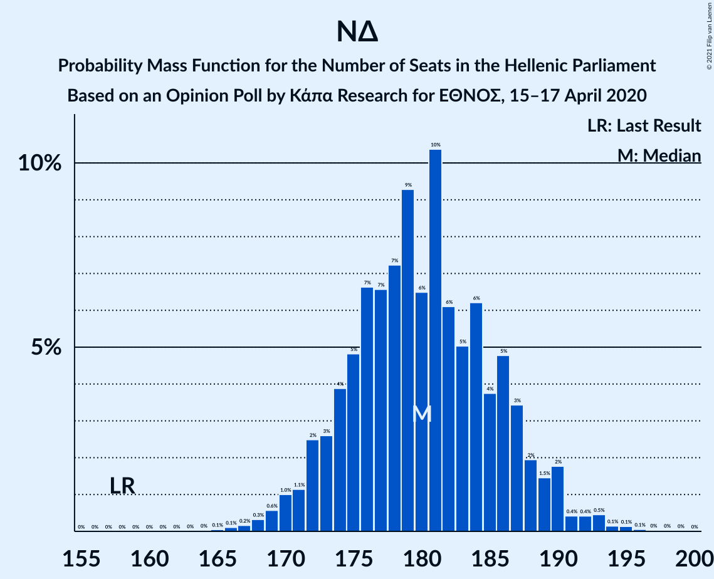
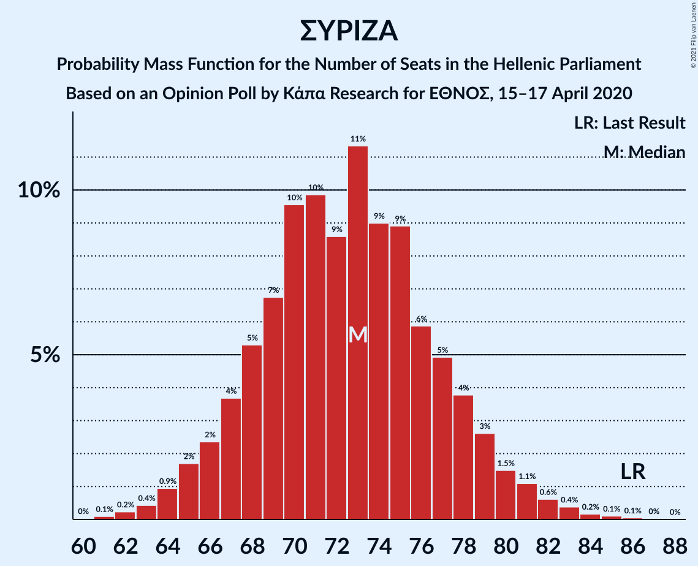

# Opinion Poll by Κάπα Research for ΕΘΝΟΣ, 15–17 April 2020

<a href="#voting-intentions">Voting Intentions</a> | <a href="#seats">Seats</a> | <a href="#coalitions">Coalitions</a> | <a href="#technical-information">Technical Information</a>

## Voting Intentions

### Confidence Intervals

| Party | Last Result | Poll Result | 80% Confidence Interval | 90% Confidence Interval | 95% Confidence Interval | 99% Confidence Interval |
|:-----:|:-----------:|:-----------:|:-----------------------:|:-----------------------:|:-----------------------:|:-----------------------:|
| Νέα Δημοκρατία | 39.8% | 49.0% | 47.0–50.9% |46.4–51.5% |46.0–52.0% |45.0–52.9% |
| Συνασπισμός Ριζοσπαστικής Αριστεράς | 31.5% | 27.3% | 25.6–29.1% |25.1–29.6% |24.7–30.0% |23.9–30.9% |
| Κίνημα Αλλαγής | 8.1% | 5.9% | 5.1–7.0% |4.9–7.3% |4.7–7.5% |4.3–8.1% |
| Κομμουνιστικό Κόμμα Ελλάδας | 5.3% | 5.1% | 4.3–6.1% |4.1–6.4% |3.9–6.6% |3.6–7.1% |
| Ελληνική Λύση | 3.7% | 3.8% | 3.1–4.6% |2.9–4.9% |2.8–5.1% |2.5–5.5% |
| Μέτωπο Ευρωπαϊκής Ρεαλιστικής Ανυπακοής | 3.4% | 3.3% | 2.7–4.1% |2.5–4.4% |2.4–4.6% |2.1–5.0% |
| Χρυσή Αυγή | 2.9% | 2.4% | 1.9–3.1% |1.7–3.3% |1.6–3.5% |1.4–3.8% |

*Note:* The poll result column reflects the actual value used in the calculations. Published results may vary slightly, and in addition be rounded to fewer digits.

## Seats

### Confidence Intervals

| Party | Last Result | Median | 80% Confidence Interval | 90% Confidence Interval | 95% Confidence Interval | 99% Confidence Interval |
|:-----:|:-----------:|:------:|:-----------------------:|:-----------------------:|:-----------------------:|:-----------------------:|
| <a href="#νέα-δημοκρατία">Νέα Δημοκρατία</a> | 158 | 180 | 174–187 |172–188 |171–190 |168–193 |
| <a href="#συνασπισμός-ριζοσπαστικής-αριστεράς">Συνασπισμός Ριζοσπαστικής Αριστεράς</a> | 86 | 73 | 68–78 |66–79 |65–80 |63–83 |
| <a href="#κίνημα-αλλαγής">Κίνημα Αλλαγής</a> | 22 | 16 | 14–19 |13–19 |12–20 |11–22 |
| <a href="#κομμουνιστικό-κόμμα-ελλάδας">Κομμουνιστικό Κόμμα Ελλάδας</a> | 15 | 14 | 12–16 |11–17 |10–18 |9–19 |
| <a href="#ελληνική-λύση">Ελληνική Λύση</a> | 10 | 10 | 8–12 |0–13 |0–13 |0–15 |
| <a href="#μέτωπο-ευρωπαϊκής-ρεαλιστικής-ανυπακοής">Μέτωπο Ευρωπαϊκής Ρεαλιστικής Ανυπακοής</a> | 9 | 9 | 0–11 |0–11 |0–12 |0–13 |
| <a href="#χρυσή-αυγή">Χρυσή Αυγή</a> | 0 | 0 | 0–8 |0–8 |0–9 |0–10 |

### Νέα Δημοκρατία

*For a full overview of the results for this party, see the [Νέα Δημοκρατία](party-νέαδημοκρατία.html) page.*

| Number of Seats | Probability | Accumulated | Special Marks |
|:---------------:|:-----------:|:-----------:|:-------------:|
| 158 | 0% | 100% | Last Result |
| 159 | 0% | 100% |  |
| 160 | 0% | 100% |  |
| 161 | 0% | 100% |  |
| 162 | 0% | 100% |  |
| 163 | 0% | 100% |  |
| 164 | 0% | 100% |  |
| 165 | 0.1% | 100% |  |
| 166 | 0.1% | 99.9% |  |
| 167 | 0.2% | 99.8% |  |
| 168 | 0.3% | 99.6% |  |
| 169 | 0.6% | 99.3% |  |
| 170 | 1.0% | 98.7% |  |
| 171 | 1.1% | 98% |  |
| 172 | 2% | 97% |  |
| 173 | 3% | 94% |  |
| 174 | 4% | 91% |  |
| 175 | 5% | 88% |  |
| 176 | 7% | 83% |  |
| 177 | 7% | 76% |  |
| 178 | 7% | 70% |  |
| 179 | 9% | 62% |  |
| 180 | 6% | 53% | Median |
| 181 | 10% | 47% |  |
| 182 | 6% | 36% |  |
| 183 | 5% | 30% |  |
| 184 | 6% | 25% |  |
| 185 | 4% | 19% |  |
| 186 | 5% | 15% |  |
| 187 | 3% | 10% |  |
| 188 | 2% | 7% |  |
| 189 | 1.5% | 5% |  |
| 190 | 2% | 3% |  |
| 191 | 0.4% | 2% |  |
| 192 | 0.4% | 1.3% |  |
| 193 | 0.5% | 0.9% |  |
| 194 | 0.1% | 0.4% |  |
| 195 | 0.1% | 0.3% |  |
| 196 | 0.1% | 0.1% |  |
| 197 | 0% | 0.1% |  |
| 198 | 0% | 0.1% |  |
| 199 | 0% | 0% |  |

### Συνασπισμός Ριζοσπαστικής Αριστεράς

*For a full overview of the results for this party, see the [Συνασπισμός Ριζοσπαστικής Αριστεράς](party-συνασπισμόςριζοσπαστικήςαριστεράς.html) page.*

| Number of Seats | Probability | Accumulated | Special Marks |
|:---------------:|:-----------:|:-----------:|:-------------:|
| 60 | 0% | 100% |  |
| 61 | 0.1% | 99.9% |  |
| 62 | 0.2% | 99.8% |  |
| 63 | 0.4% | 99.6% |  |
| 64 | 0.9% | 99.2% |  |
| 65 | 2% | 98% |  |
| 66 | 2% | 97% |  |
| 67 | 4% | 94% |  |
| 68 | 5% | 90% |  |
| 69 | 7% | 85% |  |
| 70 | 10% | 78% |  |
| 71 | 10% | 69% |  |
| 72 | 9% | 59% |  |
| 73 | 11% | 50% | Median |
| 74 | 9% | 39% |  |
| 75 | 9% | 30% |  |
| 76 | 6% | 21% |  |
| 77 | 5% | 15% |  |
| 78 | 4% | 10% |  |
| 79 | 3% | 7% |  |
| 80 | 1.5% | 4% |  |
| 81 | 1.1% | 2% |  |
| 82 | 0.6% | 1.4% |  |
| 83 | 0.4% | 0.8% |  |
| 84 | 0.2% | 0.4% |  |
| 85 | 0.1% | 0.2% |  |
| 86 | 0.1% | 0.1% | Last Result |
| 87 | 0% | 0% |  |

### Κίνημα Αλλαγής

*For a full overview of the results for this party, see the [Κίνημα Αλλαγής](party-κίνημααλλαγής.html) page.*

| Number of Seats | Probability | Accumulated | Special Marks |
|:---------------:|:-----------:|:-----------:|:-------------:|
| 10 | 0.1% | 100% |  |
| 11 | 0.5% | 99.9% |  |
| 12 | 2% | 99.4% |  |
| 13 | 7% | 97% |  |
| 14 | 11% | 90% |  |
| 15 | 20% | 79% |  |
| 16 | 21% | 59% | Median |
| 17 | 17% | 38% |  |
| 18 | 10% | 21% |  |
| 19 | 7% | 12% |  |
| 20 | 3% | 4% |  |
| 21 | 0.9% | 1.5% |  |
| 22 | 0.4% | 0.5% | Last Result |
| 23 | 0.1% | 0.2% |  |
| 24 | 0% | 0% |  |

### Κομμουνιστικό Κόμμα Ελλάδας

*For a full overview of the results for this party, see the [Κομμουνιστικό Κόμμα Ελλάδας](party-κομμουνιστικόκόμμαελλάδας.html) page.*

| Number of Seats | Probability | Accumulated | Special Marks |
|:---------------:|:-----------:|:-----------:|:-------------:|
| 8 | 0% | 100% |  |
| 9 | 0.5% | 99.9% |  |
| 10 | 2% | 99.5% |  |
| 11 | 7% | 97% |  |
| 12 | 14% | 90% |  |
| 13 | 21% | 76% |  |
| 14 | 21% | 55% | Median |
| 15 | 18% | 34% | Last Result |
| 16 | 9% | 16% |  |
| 17 | 4% | 7% |  |
| 18 | 2% | 3% |  |
| 19 | 0.5% | 0.8% |  |
| 20 | 0.2% | 0.3% |  |
| 21 | 0% | 0.1% |  |
| 22 | 0% | 0% |  |

### Ελληνική Λύση

*For a full overview of the results for this party, see the [Ελληνική Λύση](party-ελληνικήλύση.html) page.*

| Number of Seats | Probability | Accumulated | Special Marks |
|:---------------:|:-----------:|:-----------:|:-------------:|
| 0 | 7% | 100% |  |
| 1 | 0% | 93% |  |
| 2 | 0% | 93% |  |
| 3 | 0% | 93% |  |
| 4 | 0% | 93% |  |
| 5 | 0% | 93% |  |
| 6 | 0% | 93% |  |
| 7 | 0% | 93% |  |
| 8 | 7% | 93% |  |
| 9 | 18% | 86% |  |
| 10 | 27% | 68% | Last Result, Median |
| 11 | 20% | 40% |  |
| 12 | 11% | 20% |  |
| 13 | 6% | 9% |  |
| 14 | 2% | 2% |  |
| 15 | 0.5% | 0.7% |  |
| 16 | 0.1% | 0.2% |  |
| 17 | 0% | 0% |  |

### Μέτωπο Ευρωπαϊκής Ρεαλιστικής Ανυπακοής

*For a full overview of the results for this party, see the [Μέτωπο Ευρωπαϊκής Ρεαλιστικής Ανυπακοής](party-μέτωποευρωπαϊκήςρεαλιστικήςανυπακοής.html) page.*

| Number of Seats | Probability | Accumulated | Special Marks |
|:---------------:|:-----------:|:-----------:|:-------------:|
| 0 | 28% | 100% |  |
| 1 | 0% | 72% |  |
| 2 | 0% | 72% |  |
| 3 | 0% | 72% |  |
| 4 | 0% | 72% |  |
| 5 | 0% | 72% |  |
| 6 | 0% | 72% |  |
| 7 | 0% | 72% |  |
| 8 | 11% | 72% |  |
| 9 | 27% | 61% | Last Result, Median |
| 10 | 21% | 35% |  |
| 11 | 9% | 14% |  |
| 12 | 3% | 4% |  |
| 13 | 1.0% | 1.3% |  |
| 14 | 0.2% | 0.3% |  |
| 15 | 0% | 0.1% |  |
| 16 | 0% | 0% |  |

### Χρυσή Αυγή

*For a full overview of the results for this party, see the [Χρυσή Αυγή](party-χρυσήαυγή.html) page.*

| Number of Seats | Probability | Accumulated | Special Marks |
|:---------------:|:-----------:|:-----------:|:-------------:|
| 0 | 89% | 100% | Last Result, Median |
| 1 | 0% | 11% |  |
| 2 | 0% | 11% |  |
| 3 | 0% | 11% |  |
| 4 | 0% | 11% |  |
| 5 | 0% | 11% |  |
| 6 | 0% | 11% |  |
| 7 | 0% | 11% |  |
| 8 | 6% | 11% |  |
| 9 | 4% | 5% |  |
| 10 | 1.1% | 1.2% |  |
| 11 | 0.2% | 0.2% |  |
| 12 | 0% | 0% |  |

## Coalitions

### Confidence Intervals

| Coalition | Last Result | Median | Majority? | 80% Confidence Interval | 90% Confidence Interval | 95% Confidence Interval | 99% Confidence Interval |
|:---------:|:-----------:|:------:|:---------:|:-----------------------:|:-----------------------:|:-----------------------:|:-----------------------:|
| Νέα Δημοκρατία – Κίνημα Αλλαγής | 180 | 196 | 100% | 190–203 | 188–205 | 187–207 | 184–210 |
| Νέα Δημοκρατία | 158 | 180 | 100% | 174–187 | 172–188 | 171–190 | 168–193 |
| Συνασπισμός Ριζοσπαστικής Αριστεράς – Μέτωπο Ευρωπαϊκής Ρεαλιστικής Ανυπακοής | 95 | 80 | 0% | 73–85 | 71–87 | 70–89 | 67–91 |
| Συνασπισμός Ριζοσπαστικής Αριστεράς | 86 | 73 | 0% | 68–78 | 66–79 | 65–80 | 63–83 |

### Νέα Δημοκρατία – Κίνημα Αλλαγής

| Number of Seats | Probability | Accumulated | Special Marks |
|:---------------:|:-----------:|:-----------:|:-------------:|
| 180 | 0% | 100% | Last Result |
| 181 | 0.1% | 99.9% |  |
| 182 | 0.1% | 99.9% |  |
| 183 | 0.2% | 99.7% |  |
| 184 | 0.4% | 99.5% |  |
| 185 | 0.5% | 99.1% |  |
| 186 | 1.0% | 98.5% |  |
| 187 | 1.3% | 98% |  |
| 188 | 3% | 96% |  |
| 189 | 3% | 94% |  |
| 190 | 4% | 91% |  |
| 191 | 5% | 87% |  |
| 192 | 6% | 82% |  |
| 193 | 8% | 76% |  |
| 194 | 8% | 68% |  |
| 195 | 7% | 61% |  |
| 196 | 9% | 53% | Median |
| 197 | 5% | 44% |  |
| 198 | 8% | 39% |  |
| 199 | 5% | 31% |  |
| 200 | 6% | 26% |  |
| 201 | 4% | 20% |  |
| 202 | 5% | 16% |  |
| 203 | 3% | 11% |  |
| 204 | 2% | 8% |  |
| 205 | 2% | 6% |  |
| 206 | 2% | 4% |  |
| 207 | 1.1% | 3% |  |
| 208 | 0.6% | 2% |  |
| 209 | 0.4% | 0.9% |  |
| 210 | 0.2% | 0.5% |  |
| 211 | 0.1% | 0.3% |  |
| 212 | 0.1% | 0.2% |  |
| 213 | 0% | 0.1% |  |
| 214 | 0% | 0.1% |  |
| 215 | 0% | 0% |  |

### Νέα Δημοκρατία

| Number of Seats | Probability | Accumulated | Special Marks |
|:---------------:|:-----------:|:-----------:|:-------------:|
| 158 | 0% | 100% | Last Result |
| 159 | 0% | 100% |  |
| 160 | 0% | 100% |  |
| 161 | 0% | 100% |  |
| 162 | 0% | 100% |  |
| 163 | 0% | 100% |  |
| 164 | 0% | 100% |  |
| 165 | 0.1% | 100% |  |
| 166 | 0.1% | 99.9% |  |
| 167 | 0.2% | 99.8% |  |
| 168 | 0.3% | 99.6% |  |
| 169 | 0.6% | 99.3% |  |
| 170 | 1.0% | 98.7% |  |
| 171 | 1.1% | 98% |  |
| 172 | 2% | 97% |  |
| 173 | 3% | 94% |  |
| 174 | 4% | 91% |  |
| 175 | 5% | 88% |  |
| 176 | 7% | 83% |  |
| 177 | 7% | 76% |  |
| 178 | 7% | 70% |  |
| 179 | 9% | 62% |  |
| 180 | 6% | 53% | Median |
| 181 | 10% | 47% |  |
| 182 | 6% | 36% |  |
| 183 | 5% | 30% |  |
| 184 | 6% | 25% |  |
| 185 | 4% | 19% |  |
| 186 | 5% | 15% |  |
| 187 | 3% | 10% |  |
| 188 | 2% | 7% |  |
| 189 | 1.5% | 5% |  |
| 190 | 2% | 3% |  |
| 191 | 0.4% | 2% |  |
| 192 | 0.4% | 1.3% |  |
| 193 | 0.5% | 0.9% |  |
| 194 | 0.1% | 0.4% |  |
| 195 | 0.1% | 0.3% |  |
| 196 | 0.1% | 0.1% |  |
| 197 | 0% | 0.1% |  |
| 198 | 0% | 0.1% |  |
| 199 | 0% | 0% |  |

### Συνασπισμός Ριζοσπαστικής Αριστεράς – Μέτωπο Ευρωπαϊκής Ρεαλιστικής Ανυπακοής

| Number of Seats | Probability | Accumulated | Special Marks |
|:---------------:|:-----------:|:-----------:|:-------------:|
| 64 | 0.1% | 100% |  |
| 65 | 0.1% | 99.9% |  |
| 66 | 0.2% | 99.8% |  |
| 67 | 0.4% | 99.6% |  |
| 68 | 0.6% | 99.2% |  |
| 69 | 1.0% | 98.5% |  |
| 70 | 1.4% | 98% |  |
| 71 | 2% | 96% |  |
| 72 | 3% | 94% |  |
| 73 | 4% | 91% |  |
| 74 | 4% | 87% |  |
| 75 | 5% | 83% |  |
| 76 | 5% | 78% |  |
| 77 | 6% | 73% |  |
| 78 | 6% | 67% |  |
| 79 | 11% | 61% |  |
| 80 | 7% | 51% |  |
| 81 | 8% | 44% |  |
| 82 | 8% | 36% | Median |
| 83 | 7% | 28% |  |
| 84 | 5% | 20% |  |
| 85 | 5% | 15% |  |
| 86 | 4% | 10% |  |
| 87 | 2% | 6% |  |
| 88 | 1.4% | 4% |  |
| 89 | 0.9% | 3% |  |
| 90 | 0.9% | 2% |  |
| 91 | 0.3% | 0.7% |  |
| 92 | 0.2% | 0.4% |  |
| 93 | 0.1% | 0.2% |  |
| 94 | 0% | 0.1% |  |
| 95 | 0% | 0.1% | Last Result |
| 96 | 0% | 0% |  |

### Συνασπισμός Ριζοσπαστικής Αριστεράς

| Number of Seats | Probability | Accumulated | Special Marks |
|:---------------:|:-----------:|:-----------:|:-------------:|
| 60 | 0% | 100% |  |
| 61 | 0.1% | 99.9% |  |
| 62 | 0.2% | 99.8% |  |
| 63 | 0.4% | 99.6% |  |
| 64 | 0.9% | 99.2% |  |
| 65 | 2% | 98% |  |
| 66 | 2% | 97% |  |
| 67 | 4% | 94% |  |
| 68 | 5% | 90% |  |
| 69 | 7% | 85% |  |
| 70 | 10% | 78% |  |
| 71 | 10% | 69% |  |
| 72 | 9% | 59% |  |
| 73 | 11% | 50% | Median |
| 74 | 9% | 39% |  |
| 75 | 9% | 30% |  |
| 76 | 6% | 21% |  |
| 77 | 5% | 15% |  |
| 78 | 4% | 10% |  |
| 79 | 3% | 7% |  |
| 80 | 1.5% | 4% |  |
| 81 | 1.1% | 2% |  |
| 82 | 0.6% | 1.4% |  |
| 83 | 0.4% | 0.8% |  |
| 84 | 0.2% | 0.4% |  |
| 85 | 0.1% | 0.2% |  |
| 86 | 0.1% | 0.1% | Last Result |
| 87 | 0% | 0% |  |

## Technical Information

### Opinion Poll

+ **Polling firm:** Κάπα Research
+ **Commissioner(s):** ΕΘΝΟΣ
+ **Fieldwork period:** 15–17 April 2020

### Calculations

+ **Sample size:** 1060
+ **Simulations done:** 1,048,576
+ **Error estimate:** 1.17%

