# Opinion Poll by GPO for Παραπολιτικά, 14–22 April 2020

<a href="#voting-intentions">Voting Intentions</a> | <a href="#seats">Seats</a> | <a href="#coalitions">Coalitions</a> | <a href="#technical-information">Technical Information</a>

## Voting Intentions

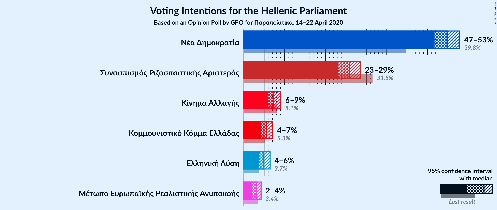

### Confidence Intervals

| Party | Last Result | Poll Result | 80% Confidence Interval | 90% Confidence Interval | 95% Confidence Interval | 99% Confidence Interval |
|:-----:|:-----------:|:-----------:|:-----------------------:|:-----------------------:|:-----------------------:|:-----------------------:|
| Νέα Δημοκρατία | 39.8% | 49.8% | 47.8–51.8% |47.2–52.4% |46.7–52.9% |45.7–53.9% |
| Συνασπισμός Ριζοσπαστικής Αριστεράς | 31.5% | 25.8% | 24.1–27.6% |23.6–28.2% |23.2–28.6% |22.4–29.5% |
| Κίνημα Αλλαγής | 8.1% | 7.3% | 6.3–8.5% |6.1–8.8% |5.8–9.1% |5.4–9.7% |
| Κομμουνιστικό Κόμμα Ελλάδας | 5.3% | 5.5% | 4.7–6.5% |4.4–6.8% |4.3–7.1% |3.9–7.6% |
| Ελληνική Λύση | 3.7% | 4.9% | 4.1–5.9% |3.9–6.2% |3.7–6.4% |3.4–6.9% |
| Μέτωπο Ευρωπαϊκής Ρεαλιστικής Ανυπακοής | 3.4% | 3.0% | 2.4–3.8% |2.2–4.1% |2.1–4.3% |1.9–4.7% |

*Note:* The poll result column reflects the actual value used in the calculations. Published results may vary slightly, and in addition be rounded to fewer digits.

## Seats

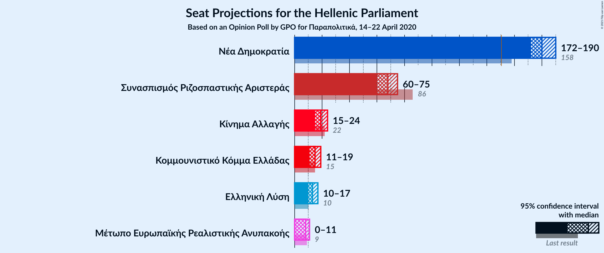

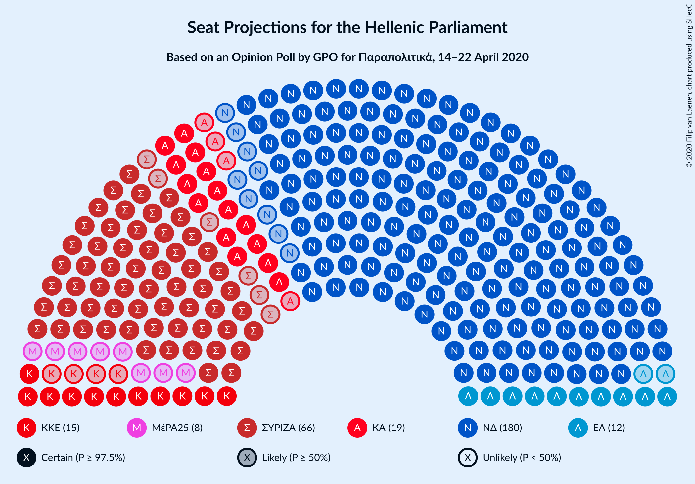

### Confidence Intervals

| Party | Last Result | Median | 80% Confidence Interval | 90% Confidence Interval | 95% Confidence Interval | 99% Confidence Interval |
|:-----:|:-----------:|:------:|:-----------------------:|:-----------------------:|:-----------------------:|:-----------------------:|
| <a href="#νέα-δημοκρατία">Νέα Δημοκρατία</a> | 158 | 180 | 175–187 |173–189 |171–189 |169–192 |
| <a href="#συνασπισμός-ριζοσπαστικής-αριστεράς">Συνασπισμός Ριζοσπαστικής Αριστεράς</a> | 86 | 68 | 63–73 |62–74 |60–75 |58–78 |
| <a href="#κίνημα-αλλαγής">Κίνημα Αλλαγής</a> | 22 | 19 | 17–22 |16–23 |15–24 |14–25 |
| <a href="#κομμουνιστικό-κόμμα-ελλάδας">Κομμουνιστικό Κόμμα Ελλάδας</a> | 15 | 15 | 12–17 |12–18 |11–19 |10–20 |
| <a href="#ελληνική-λύση">Ελληνική Λύση</a> | 10 | 13 | 11–16 |10–16 |10–17 |9–18 |
| <a href="#μέτωπο-ευρωπαϊκής-ρεαλιστικής-ανυπακοής">Μέτωπο Ευρωπαϊκής Ρεαλιστικής Ανυπακοής</a> | 9 | 8 | 0–10 |0–11 |0–11 |0–12 |

### Νέα Δημοκρατία

*For a full overview of the results for this party, see the [Νέα Δημοκρατία](party-νέαδημοκρατία.html) page.*

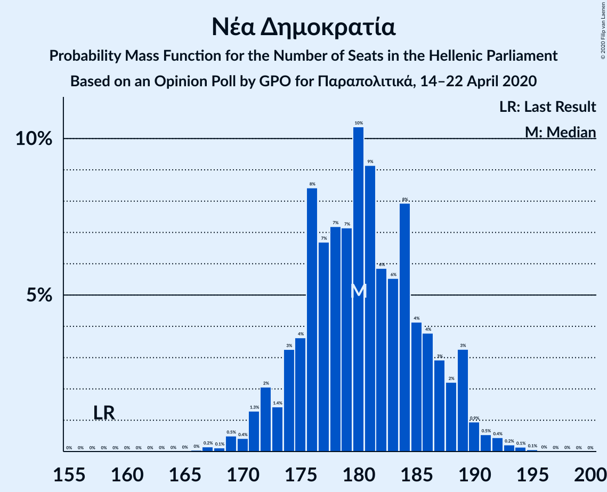

| Number of Seats | Probability | Accumulated | Special Marks |
|:---------------:|:-----------:|:-----------:|:-------------:|
| 158 | 0% | 100% | Last Result |
| 159 | 0% | 100% |  |
| 160 | 0% | 100% |  |
| 161 | 0% | 100% |  |
| 162 | 0% | 100% |  |
| 163 | 0% | 100% |  |
| 164 | 0% | 100% |  |
| 165 | 0% | 100% |  |
| 166 | 0% | 100% |  |
| 167 | 0.2% | 99.9% |  |
| 168 | 0.1% | 99.8% |  |
| 169 | 0.5% | 99.6% |  |
| 170 | 0.4% | 99.2% |  |
| 171 | 1.3% | 98.7% |  |
| 172 | 2% | 97% |  |
| 173 | 1.4% | 95% |  |
| 174 | 3% | 94% |  |
| 175 | 4% | 91% |  |
| 176 | 8% | 87% |  |
| 177 | 7% | 79% |  |
| 178 | 7% | 72% |  |
| 179 | 7% | 65% |  |
| 180 | 10% | 58% | Median |
| 181 | 9% | 47% |  |
| 182 | 6% | 38% |  |
| 183 | 6% | 32% |  |
| 184 | 8% | 27% |  |
| 185 | 4% | 19% |  |
| 186 | 4% | 15% |  |
| 187 | 3% | 11% |  |
| 188 | 2% | 8% |  |
| 189 | 3% | 6% |  |
| 190 | 0.9% | 2% |  |
| 191 | 0.5% | 1.4% |  |
| 192 | 0.4% | 0.9% |  |
| 193 | 0.2% | 0.5% |  |
| 194 | 0.1% | 0.2% |  |
| 195 | 0.1% | 0.1% |  |
| 196 | 0% | 0% |  |

### Συνασπισμός Ριζοσπαστικής Αριστεράς

*For a full overview of the results for this party, see the [Συνασπισμός Ριζοσπαστικής Αριστεράς](party-συνασπισμόςριζοσπαστικήςαριστεράς.html) page.*

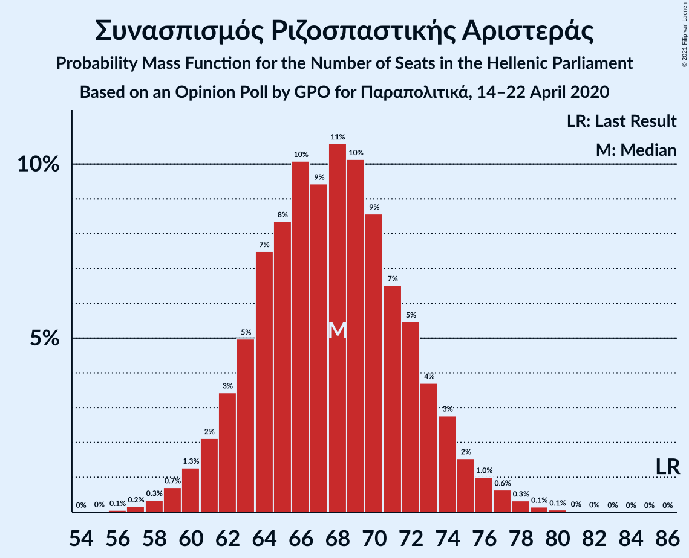

| Number of Seats | Probability | Accumulated | Special Marks |
|:---------------:|:-----------:|:-----------:|:-------------:|
| 56 | 0% | 100% |  |
| 57 | 0.2% | 99.9% |  |
| 58 | 0.3% | 99.7% |  |
| 59 | 0.8% | 99.5% |  |
| 60 | 1.4% | 98.6% |  |
| 61 | 2% | 97% |  |
| 62 | 4% | 95% |  |
| 63 | 3% | 91% |  |
| 64 | 10% | 88% |  |
| 65 | 7% | 78% |  |
| 66 | 13% | 71% |  |
| 67 | 8% | 58% |  |
| 68 | 9% | 50% | Median |
| 69 | 10% | 41% |  |
| 70 | 9% | 31% |  |
| 71 | 6% | 22% |  |
| 72 | 6% | 16% |  |
| 73 | 3% | 10% |  |
| 74 | 3% | 7% |  |
| 75 | 1.5% | 4% |  |
| 76 | 0.8% | 2% |  |
| 77 | 0.8% | 1.4% |  |
| 78 | 0.3% | 0.6% |  |
| 79 | 0.2% | 0.3% |  |
| 80 | 0% | 0.1% |  |
| 81 | 0% | 0.1% |  |
| 82 | 0% | 0% |  |
| 83 | 0% | 0% |  |
| 84 | 0% | 0% |  |
| 85 | 0% | 0% |  |
| 86 | 0% | 0% | Last Result |

### Κίνημα Αλλαγής

*For a full overview of the results for this party, see the [Κίνημα Αλλαγής](party-κίνημααλλαγής.html) page.*

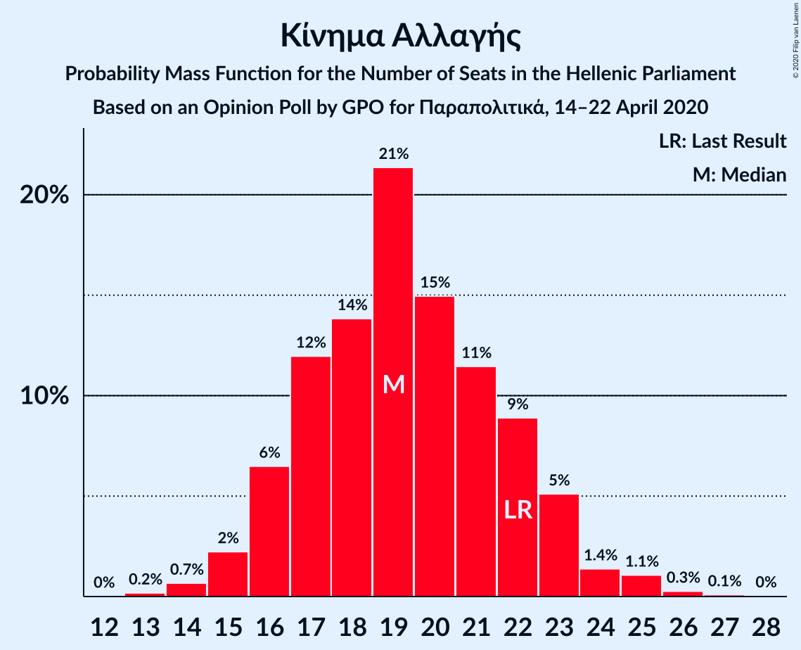

| Number of Seats | Probability | Accumulated | Special Marks |
|:---------------:|:-----------:|:-----------:|:-------------:|
| 13 | 0.2% | 100% |  |
| 14 | 0.7% | 99.8% |  |
| 15 | 2% | 99.1% |  |
| 16 | 6% | 97% |  |
| 17 | 12% | 90% |  |
| 18 | 14% | 78% |  |
| 19 | 21% | 65% | Median |
| 20 | 15% | 43% |  |
| 21 | 11% | 28% |  |
| 22 | 9% | 17% | Last Result |
| 23 | 5% | 8% |  |
| 24 | 1.4% | 3% |  |
| 25 | 1.1% | 1.5% |  |
| 26 | 0.3% | 0.4% |  |
| 27 | 0.1% | 0.1% |  |
| 28 | 0% | 0% |  |

### Κομμουνιστικό Κόμμα Ελλάδας

*For a full overview of the results for this party, see the [Κομμουνιστικό Κόμμα Ελλάδας](party-κομμουνιστικόκόμμαελλάδας.html) page.*

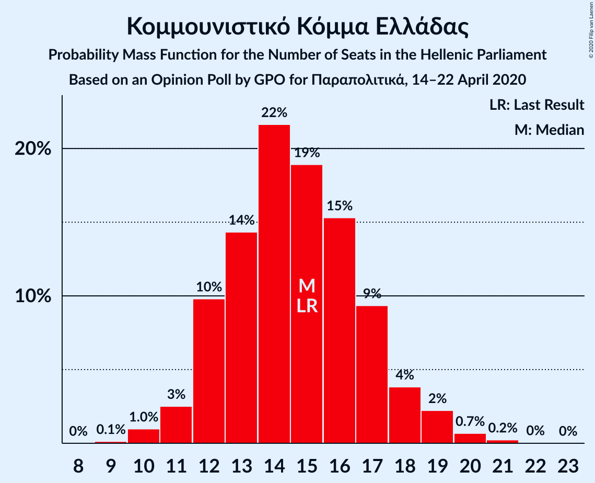

| Number of Seats | Probability | Accumulated | Special Marks |
|:---------------:|:-----------:|:-----------:|:-------------:|
| 9 | 0.1% | 100% |  |
| 10 | 1.0% | 99.9% |  |
| 11 | 3% | 98.9% |  |
| 12 | 10% | 96% |  |
| 13 | 14% | 87% |  |
| 14 | 22% | 72% |  |
| 15 | 19% | 51% | Last Result, Median |
| 16 | 15% | 32% |  |
| 17 | 9% | 16% |  |
| 18 | 4% | 7% |  |
| 19 | 2% | 3% |  |
| 20 | 0.7% | 1.0% |  |
| 21 | 0.2% | 0.3% |  |
| 22 | 0% | 0.1% |  |
| 23 | 0% | 0% |  |

### Ελληνική Λύση

*For a full overview of the results for this party, see the [Ελληνική Λύση](party-ελληνικήλύση.html) page.*

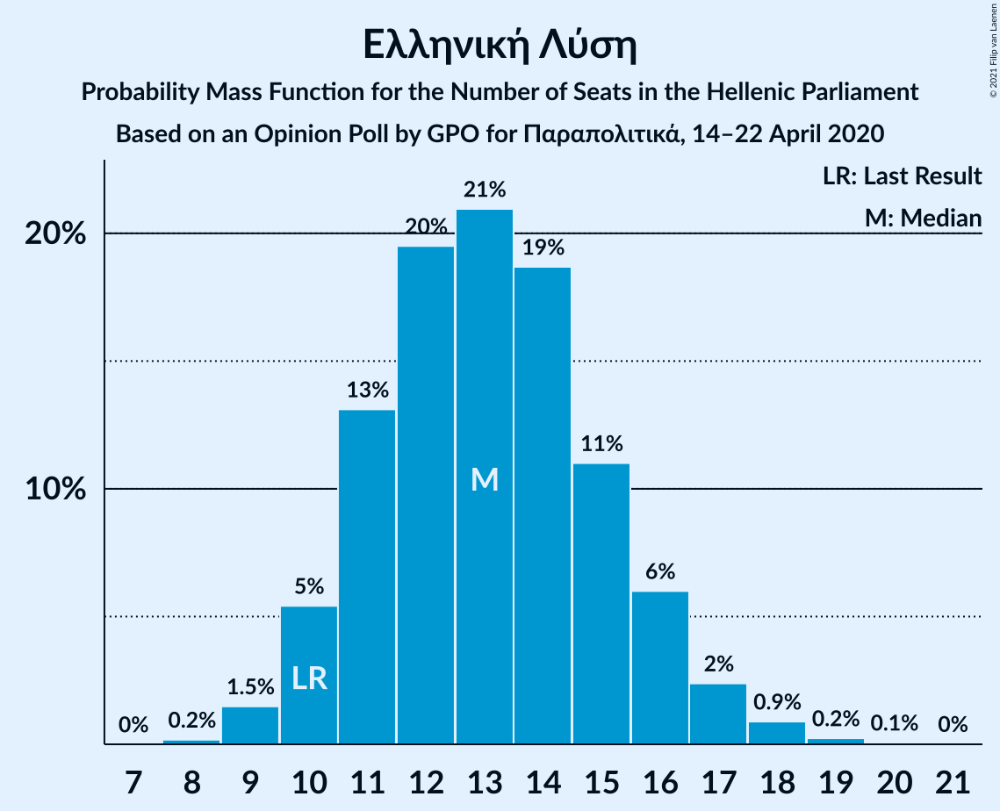

| Number of Seats | Probability | Accumulated | Special Marks |
|:---------------:|:-----------:|:-----------:|:-------------:|
| 8 | 0.3% | 100% |  |
| 9 | 0.9% | 99.6% |  |
| 10 | 7% | 98.7% | Last Result |
| 11 | 10% | 91% |  |
| 12 | 23% | 81% |  |
| 13 | 17% | 58% | Median |
| 14 | 23% | 41% |  |
| 15 | 7% | 18% |  |
| 16 | 8% | 11% |  |
| 17 | 2% | 3% |  |
| 18 | 1.0% | 1.3% |  |
| 19 | 0.2% | 0.3% |  |
| 20 | 0.1% | 0.1% |  |
| 21 | 0% | 0% |  |

### Μέτωπο Ευρωπαϊκής Ρεαλιστικής Ανυπακοής

*For a full overview of the results for this party, see the [Μέτωπο Ευρωπαϊκής Ρεαλιστικής Ανυπακοής](party-μέτωποευρωπαϊκήςρεαλιστικήςανυπακοής.html) page.*

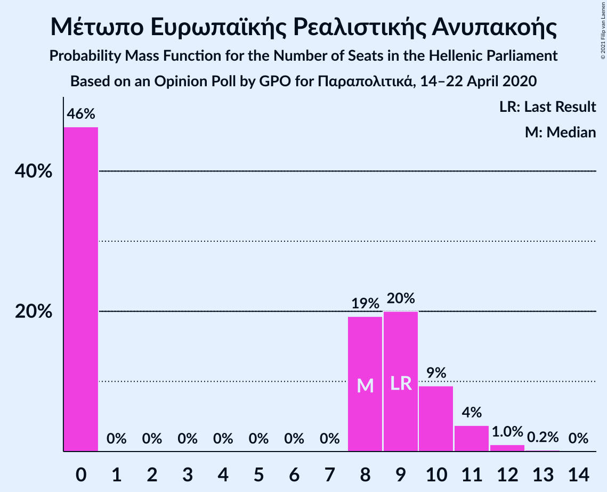

| Number of Seats | Probability | Accumulated | Special Marks |
|:---------------:|:-----------:|:-----------:|:-------------:|
| 0 | 45% | 100% |  |
| 1 | 0% | 55% |  |
| 2 | 0% | 55% |  |
| 3 | 0% | 55% |  |
| 4 | 0% | 55% |  |
| 5 | 0% | 55% |  |
| 6 | 0% | 55% |  |
| 7 | 0% | 55% |  |
| 8 | 19% | 55% | Median |
| 9 | 21% | 36% | Last Result |
| 10 | 9% | 14% |  |
| 11 | 4% | 5% |  |
| 12 | 1.2% | 1.5% |  |
| 13 | 0.2% | 0.3% |  |
| 14 | 0% | 0% |  |

## Coalitions

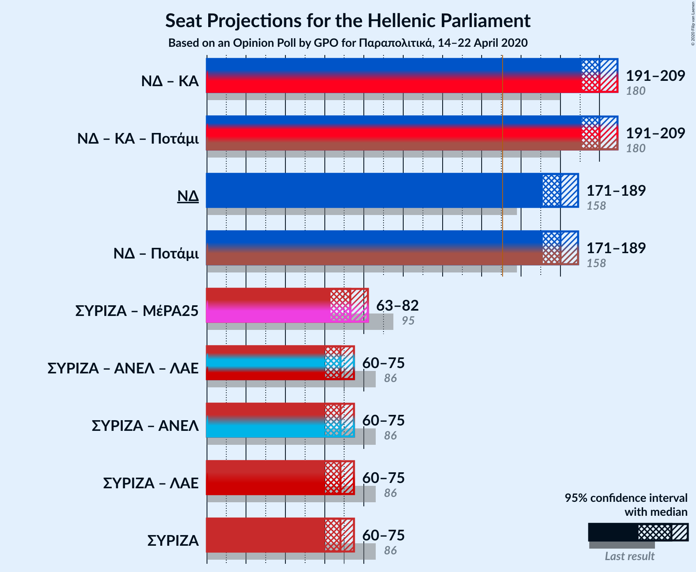

### Confidence Intervals

| Coalition | Last Result | Median | Majority? | 80% Confidence Interval | 90% Confidence Interval | 95% Confidence Interval | 99% Confidence Interval |
|:---------:|:-----------:|:------:|:---------:|:-----------------------:|:-----------------------:|:-----------------------:|:-----------------------:|
| Νέα Δημοκρατία – Κίνημα Αλλαγής | 180 | 200 | 100% | 194–206 | 192–208 | 191–209 | 188–212 |
| Νέα Δημοκρατία | 158 | 180 | 100% | 175–187 | 173–189 | 171–189 | 169–192 |
| Συνασπισμός Ριζοσπαστικής Αριστεράς – Μέτωπο Ευρωπαϊκής Ρεαλιστικής Ανυπακοής | 95 | 73 | 0% | 66–79 | 65–80 | 63–82 | 61–84 |
| Συνασπισμός Ριζοσπαστικής Αριστεράς | 86 | 68 | 0% | 63–73 | 62–74 | 60–75 | 58–78 |

### Νέα Δημοκρατία – Κίνημα Αλλαγής

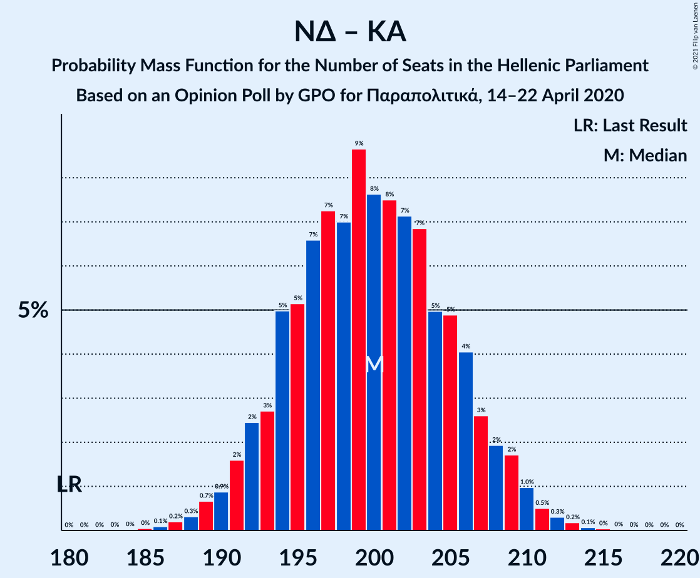

| Number of Seats | Probability | Accumulated | Special Marks |
|:---------------:|:-----------:|:-----------:|:-------------:|
| 180 | 0% | 100% | Last Result |
| 181 | 0% | 100% |  |
| 182 | 0% | 100% |  |
| 183 | 0% | 100% |  |
| 184 | 0% | 100% |  |
| 185 | 0% | 100% |  |
| 186 | 0.1% | 99.9% |  |
| 187 | 0.2% | 99.8% |  |
| 188 | 0.2% | 99.6% |  |
| 189 | 0.9% | 99.4% |  |
| 190 | 0.8% | 98.5% |  |
| 191 | 1.3% | 98% |  |
| 192 | 3% | 96% |  |
| 193 | 3% | 94% |  |
| 194 | 4% | 90% |  |
| 195 | 7% | 86% |  |
| 196 | 5% | 79% |  |
| 197 | 8% | 74% |  |
| 198 | 7% | 66% |  |
| 199 | 9% | 59% | Median |
| 200 | 7% | 50% |  |
| 201 | 9% | 43% |  |
| 202 | 4% | 34% |  |
| 203 | 8% | 30% |  |
| 204 | 5% | 23% |  |
| 205 | 5% | 17% |  |
| 206 | 4% | 13% |  |
| 207 | 3% | 8% |  |
| 208 | 3% | 6% |  |
| 209 | 0.8% | 3% |  |
| 210 | 1.0% | 2% |  |
| 211 | 0.5% | 1.1% |  |
| 212 | 0.2% | 0.6% |  |
| 213 | 0.2% | 0.4% |  |
| 214 | 0.1% | 0.1% |  |
| 215 | 0% | 0.1% |  |
| 216 | 0% | 0% |  |

### Νέα Δημοκρατία

| Number of Seats | Probability | Accumulated | Special Marks |
|:---------------:|:-----------:|:-----------:|:-------------:|
| 158 | 0% | 100% | Last Result |
| 159 | 0% | 100% |  |
| 160 | 0% | 100% |  |
| 161 | 0% | 100% |  |
| 162 | 0% | 100% |  |
| 163 | 0% | 100% |  |
| 164 | 0% | 100% |  |
| 165 | 0% | 100% |  |
| 166 | 0% | 100% |  |
| 167 | 0.2% | 99.9% |  |
| 168 | 0.1% | 99.8% |  |
| 169 | 0.5% | 99.6% |  |
| 170 | 0.4% | 99.2% |  |
| 171 | 1.3% | 98.7% |  |
| 172 | 2% | 97% |  |
| 173 | 1.4% | 95% |  |
| 174 | 3% | 94% |  |
| 175 | 4% | 91% |  |
| 176 | 8% | 87% |  |
| 177 | 7% | 79% |  |
| 178 | 7% | 72% |  |
| 179 | 7% | 65% |  |
| 180 | 10% | 58% | Median |
| 181 | 9% | 47% |  |
| 182 | 6% | 38% |  |
| 183 | 6% | 32% |  |
| 184 | 8% | 27% |  |
| 185 | 4% | 19% |  |
| 186 | 4% | 15% |  |
| 187 | 3% | 11% |  |
| 188 | 2% | 8% |  |
| 189 | 3% | 6% |  |
| 190 | 0.9% | 2% |  |
| 191 | 0.5% | 1.4% |  |
| 192 | 0.4% | 0.9% |  |
| 193 | 0.2% | 0.5% |  |
| 194 | 0.1% | 0.2% |  |
| 195 | 0.1% | 0.1% |  |
| 196 | 0% | 0% |  |

### Συνασπισμός Ριζοσπαστικής Αριστεράς – Μέτωπο Ευρωπαϊκής Ρεαλιστικής Ανυπακοής

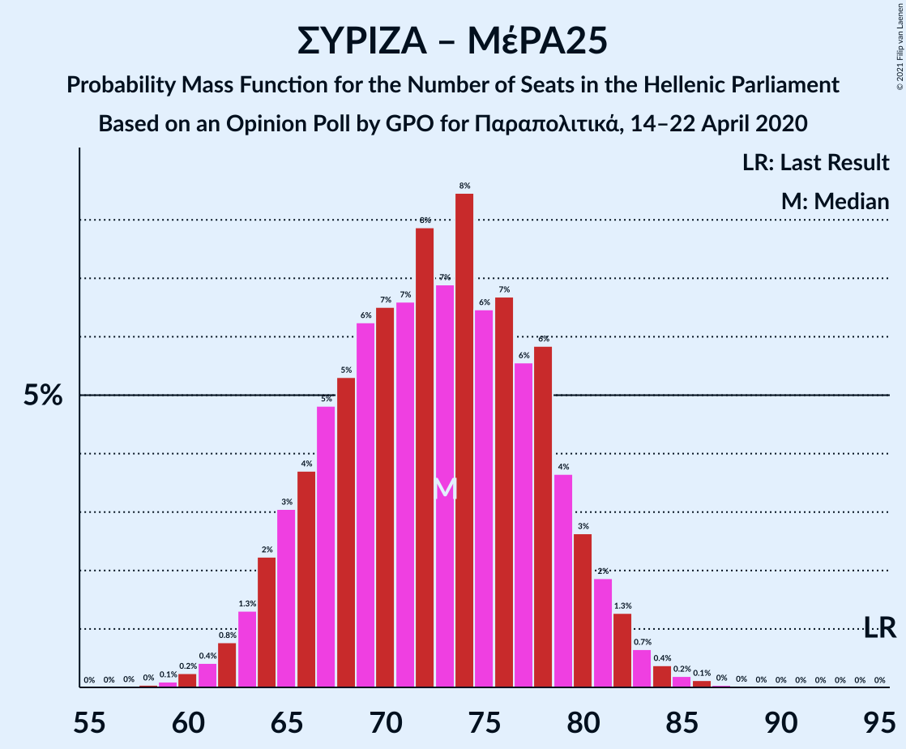

| Number of Seats | Probability | Accumulated | Special Marks |
|:---------------:|:-----------:|:-----------:|:-------------:|
| 58 | 0.1% | 100% |  |
| 59 | 0.1% | 99.9% |  |
| 60 | 0.3% | 99.9% |  |
| 61 | 0.3% | 99.5% |  |
| 62 | 0.6% | 99.3% |  |
| 63 | 2% | 98.7% |  |
| 64 | 2% | 97% |  |
| 65 | 5% | 95% |  |
| 66 | 2% | 91% |  |
| 67 | 6% | 89% |  |
| 68 | 4% | 83% |  |
| 69 | 6% | 79% |  |
| 70 | 8% | 73% |  |
| 71 | 4% | 65% |  |
| 72 | 10% | 61% |  |
| 73 | 6% | 51% |  |
| 74 | 11% | 45% |  |
| 75 | 6% | 34% |  |
| 76 | 7% | 29% | Median |
| 77 | 4% | 22% |  |
| 78 | 5% | 17% |  |
| 79 | 4% | 12% |  |
| 80 | 3% | 8% |  |
| 81 | 2% | 5% |  |
| 82 | 1.3% | 3% |  |
| 83 | 0.4% | 1.2% |  |
| 84 | 0.4% | 0.8% |  |
| 85 | 0.2% | 0.3% |  |
| 86 | 0.1% | 0.2% |  |
| 87 | 0% | 0.1% |  |
| 88 | 0% | 0% |  |
| 89 | 0% | 0% |  |
| 90 | 0% | 0% |  |
| 91 | 0% | 0% |  |
| 92 | 0% | 0% |  |
| 93 | 0% | 0% |  |
| 94 | 0% | 0% |  |
| 95 | 0% | 0% | Last Result |

### Συνασπισμός Ριζοσπαστικής Αριστεράς

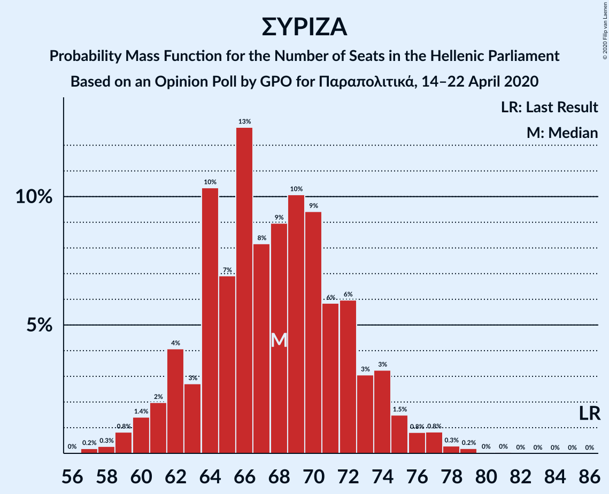

| Number of Seats | Probability | Accumulated | Special Marks |
|:---------------:|:-----------:|:-----------:|:-------------:|
| 56 | 0% | 100% |  |
| 57 | 0.2% | 99.9% |  |
| 58 | 0.3% | 99.7% |  |
| 59 | 0.8% | 99.5% |  |
| 60 | 1.4% | 98.6% |  |
| 61 | 2% | 97% |  |
| 62 | 4% | 95% |  |
| 63 | 3% | 91% |  |
| 64 | 10% | 88% |  |
| 65 | 7% | 78% |  |
| 66 | 13% | 71% |  |
| 67 | 8% | 58% |  |
| 68 | 9% | 50% | Median |
| 69 | 10% | 41% |  |
| 70 | 9% | 31% |  |
| 71 | 6% | 22% |  |
| 72 | 6% | 16% |  |
| 73 | 3% | 10% |  |
| 74 | 3% | 7% |  |
| 75 | 1.5% | 4% |  |
| 76 | 0.8% | 2% |  |
| 77 | 0.8% | 1.4% |  |
| 78 | 0.3% | 0.6% |  |
| 79 | 0.2% | 0.3% |  |
| 80 | 0% | 0.1% |  |
| 81 | 0% | 0.1% |  |
| 82 | 0% | 0% |  |
| 83 | 0% | 0% |  |
| 84 | 0% | 0% |  |
| 85 | 0% | 0% |  |
| 86 | 0% | 0% | Last Result |

## Technical Information

### Opinion Poll

+ **Polling firm:** GPO
+ **Commissioner(s):** Παραπολιτικά
+ **Fieldwork period:** 14–22 April 2020

### Calculations

+ **Sample size:** 1000
+ **Simulations done:** 131,072
+ **Error estimate:** 1.95%

