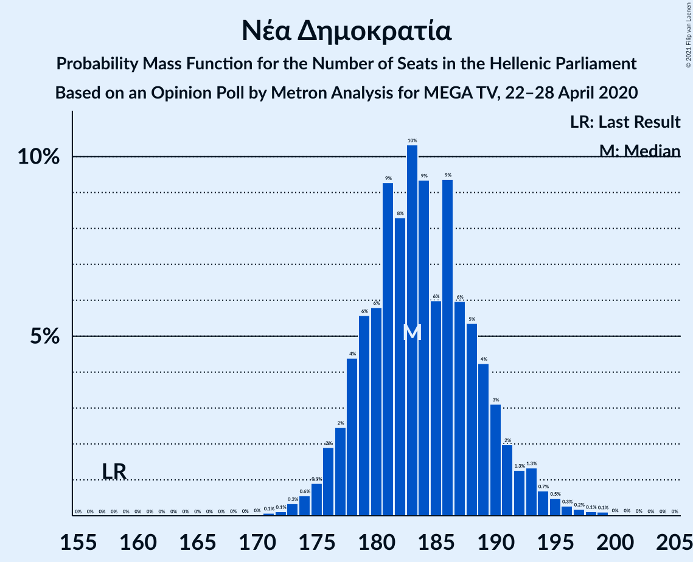
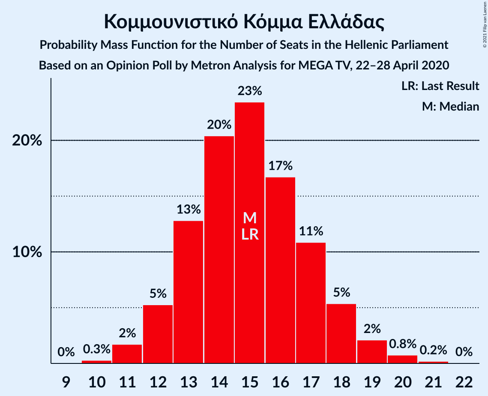

# Opinion Poll by Metron Analysis for MEGA TV, 22–28 April 2020

<a href="#voting-intentions">Voting Intentions</a> | <a href="#seats">Seats</a> | <a href="#coalitions">Coalitions</a> | <a href="#technical-information">Technical Information</a>

## Voting Intentions

### Confidence Intervals

| Party | Last Result | Poll Result | 80% Confidence Interval | 90% Confidence Interval | 95% Confidence Interval | 99% Confidence Interval |
|:-----:|:-----------:|:-----------:|:-----------------------:|:-----------------------:|:-----------------------:|:-----------------------:|
| Νέα Δημοκρατία | 39.8% | 50.4% | 48.6–52.3% |48.0–52.8% |47.6–53.2% |46.7–54.1% |
| Συνασπισμός Ριζοσπαστικής Αριστεράς | 31.5% | 25.4% | 23.9–27.1% |23.4–27.5% |23.0–28.0% |22.3–28.8% |
| Κίνημα Αλλαγής | 8.1% | 5.9% | 5.1–6.9% |4.9–7.1% |4.7–7.4% |4.3–7.9% |
| Κομμουνιστικό Κόμμα Ελλάδας | 5.3% | 5.6% | 4.8–6.5% |4.6–6.8% |4.4–7.0% |4.1–7.5% |
| Μέτωπο Ευρωπαϊκής Ρεαλιστικής Ανυπακοής | 3.4% | 3.8% | 3.2–4.6% |3.0–4.9% |2.9–5.1% |2.6–5.5% |
| Ελληνική Λύση | 3.7% | 3.4% | 2.8–4.2% |2.7–4.4% |2.5–4.6% |2.3–5.0% |
| Χρυσή Αυγή | 2.9% | 1.8% | 1.4–2.4% |1.3–2.6% |1.2–2.8% |1.0–3.1% |

*Note:* The poll result column reflects the actual value used in the calculations. Published results may vary slightly, and in addition be rounded to fewer digits.

## Seats

### Confidence Intervals

| Party | Last Result | Median | 80% Confidence Interval | 90% Confidence Interval | 95% Confidence Interval | 99% Confidence Interval |
|:-----:|:-----------:|:------:|:-----------------------:|:-----------------------:|:-----------------------:|:-----------------------:|
| <a href="#νέα-δημοκρατία">Νέα Δημοκρατία</a> | 158 | 183 | 178–189 |177–191 |176–193 |173–196 |
| <a href="#συνασπισμός-ριζοσπαστικής-αριστεράς">Συνασπισμός Ριζοσπαστικής Αριστεράς</a> | 86 | 68 | 63–72 |62–74 |61–75 |59–77 |
| <a href="#κίνημα-αλλαγής">Κίνημα Αλλαγής</a> | 22 | 16 | 14–18 |13–19 |12–20 |11–21 |
| <a href="#κομμουνιστικό-κόμμα-ελλάδας">Κομμουνιστικό Κόμμα Ελλάδας</a> | 15 | 15 | 13–17 |12–18 |12–19 |11–20 |
| <a href="#μέτωπο-ευρωπαϊκής-ρεαλιστικής-ανυπακοής">Μέτωπο Ευρωπαϊκής Ρεαλιστικής Ανυπακοής</a> | 9 | 10 | 8–12 |8–13 |0–13 |0–15 |
| <a href="#ελληνική-λύση">Ελληνική Λύση</a> | 10 | 9 | 0–11 |0–12 |0–12 |0–13 |
| <a href="#χρυσή-αυγή">Χρυσή Αυγή</a> | 0 | 0 | 0 |0 |0 |0 |

### Νέα Δημοκρατία

*For a full overview of the results for this party, see the [Νέα Δημοκρατία](party-νέαδημοκρατία.html) page.*

| Number of Seats | Probability | Accumulated | Special Marks |
|:---------------:|:-----------:|:-----------:|:-------------:|
| 158 | 0% | 100% | Last Result |
| 159 | 0% | 100% |  |
| 160 | 0% | 100% |  |
| 161 | 0% | 100% |  |
| 162 | 0% | 100% |  |
| 163 | 0% | 100% |  |
| 164 | 0% | 100% |  |
| 165 | 0% | 100% |  |
| 166 | 0% | 100% |  |
| 167 | 0% | 100% |  |
| 168 | 0% | 100% |  |
| 169 | 0% | 100% |  |
| 170 | 0% | 100% |  |
| 171 | 0.1% | 100% |  |
| 172 | 0.1% | 99.9% |  |
| 173 | 0.3% | 99.8% |  |
| 174 | 0.6% | 99.4% |  |
| 175 | 0.9% | 98.9% |  |
| 176 | 2% | 98% |  |
| 177 | 2% | 96% |  |
| 178 | 4% | 94% |  |
| 179 | 6% | 89% |  |
| 180 | 6% | 84% |  |
| 181 | 9% | 78% |  |
| 182 | 8% | 69% |  |
| 183 | 10% | 60% | Median |
| 184 | 9% | 50% |  |
| 185 | 6% | 41% |  |
| 186 | 9% | 35% |  |
| 187 | 6% | 25% |  |
| 188 | 5% | 19% |  |
| 189 | 4% | 14% |  |
| 190 | 3% | 10% |  |
| 191 | 2% | 7% |  |
| 192 | 1.3% | 5% |  |
| 193 | 1.3% | 3% |  |
| 194 | 0.7% | 2% |  |
| 195 | 0.5% | 1.2% |  |
| 196 | 0.3% | 0.8% |  |
| 197 | 0.2% | 0.5% |  |
| 198 | 0.1% | 0.3% |  |
| 199 | 0.1% | 0.2% |  |
| 200 | 0% | 0.1% |  |
| 201 | 0% | 0% |  |

### Συνασπισμός Ριζοσπαστικής Αριστεράς

*For a full overview of the results for this party, see the [Συνασπισμός Ριζοσπαστικής Αριστεράς](party-συνασπισμόςριζοσπαστικήςαριστεράς.html) page.*

| Number of Seats | Probability | Accumulated | Special Marks |
|:---------------:|:-----------:|:-----------:|:-------------:|
| 57 | 0.1% | 100% |  |
| 58 | 0.2% | 99.9% |  |
| 59 | 0.6% | 99.6% |  |
| 60 | 0.9% | 99.1% |  |
| 61 | 2% | 98% |  |
| 62 | 4% | 96% |  |
| 63 | 5% | 93% |  |
| 64 | 7% | 87% |  |
| 65 | 8% | 80% |  |
| 66 | 11% | 72% |  |
| 67 | 10% | 61% |  |
| 68 | 12% | 51% | Median |
| 69 | 11% | 39% |  |
| 70 | 8% | 27% |  |
| 71 | 6% | 20% |  |
| 72 | 5% | 13% |  |
| 73 | 3% | 8% |  |
| 74 | 2% | 5% |  |
| 75 | 1.2% | 3% |  |
| 76 | 0.7% | 1.4% |  |
| 77 | 0.4% | 0.8% |  |
| 78 | 0.2% | 0.4% |  |
| 79 | 0.1% | 0.2% |  |
| 80 | 0% | 0.1% |  |
| 81 | 0% | 0% |  |
| 82 | 0% | 0% |  |
| 83 | 0% | 0% |  |
| 84 | 0% | 0% |  |
| 85 | 0% | 0% |  |
| 86 | 0% | 0% | Last Result |

### Κίνημα Αλλαγής

*For a full overview of the results for this party, see the [Κίνημα Αλλαγής](party-κίνημααλλαγής.html) page.*

| Number of Seats | Probability | Accumulated | Special Marks |
|:---------------:|:-----------:|:-----------:|:-------------:|
| 10 | 0% | 100% |  |
| 11 | 0.6% | 99.9% |  |
| 12 | 2% | 99.4% |  |
| 13 | 5% | 97% |  |
| 14 | 12% | 92% |  |
| 15 | 23% | 79% |  |
| 16 | 25% | 56% | Median |
| 17 | 16% | 32% |  |
| 18 | 7% | 15% |  |
| 19 | 5% | 9% |  |
| 20 | 3% | 4% |  |
| 21 | 0.6% | 0.9% |  |
| 22 | 0.2% | 0.2% | Last Result |
| 23 | 0% | 0% |  |

### Κομμουνιστικό Κόμμα Ελλάδας

*For a full overview of the results for this party, see the [Κομμουνιστικό Κόμμα Ελλάδας](party-κομμουνιστικόκόμμαελλάδας.html) page.*

| Number of Seats | Probability | Accumulated | Special Marks |
|:---------------:|:-----------:|:-----------:|:-------------:|
| 10 | 0.3% | 100% |  |
| 11 | 2% | 99.7% |  |
| 12 | 5% | 98% |  |
| 13 | 13% | 93% |  |
| 14 | 20% | 80% |  |
| 15 | 23% | 59% | Last Result, Median |
| 16 | 17% | 36% |  |
| 17 | 11% | 19% |  |
| 18 | 5% | 8% |  |
| 19 | 2% | 3% |  |
| 20 | 0.8% | 1.0% |  |
| 21 | 0.2% | 0.2% |  |
| 22 | 0% | 0% |  |

### Μέτωπο Ευρωπαϊκής Ρεαλιστικής Ανυπακοής

*For a full overview of the results for this party, see the [Μέτωπο Ευρωπαϊκής Ρεαλιστικής Ανυπακοής](party-μέτωποευρωπαϊκήςρεαλιστικήςανυπακοής.html) page.*

| Number of Seats | Probability | Accumulated | Special Marks |
|:---------------:|:-----------:|:-----------:|:-------------:|
| 0 | 5% | 100% |  |
| 1 | 0% | 95% |  |
| 2 | 0% | 95% |  |
| 3 | 0% | 95% |  |
| 4 | 0% | 95% |  |
| 5 | 0% | 95% |  |
| 6 | 0% | 95% |  |
| 7 | 0% | 95% |  |
| 8 | 6% | 95% |  |
| 9 | 20% | 90% | Last Result |
| 10 | 25% | 69% | Median |
| 11 | 23% | 44% |  |
| 12 | 13% | 21% |  |
| 13 | 6% | 8% |  |
| 14 | 2% | 2% |  |
| 15 | 0.4% | 0.5% |  |
| 16 | 0.1% | 0.1% |  |
| 17 | 0% | 0% |  |

### Ελληνική Λύση

*For a full overview of the results for this party, see the [Ελληνική Λύση](party-ελληνικήλύση.html) page.*

| Number of Seats | Probability | Accumulated | Special Marks |
|:---------------:|:-----------:|:-----------:|:-------------:|
| 0 | 18% | 100% |  |
| 1 | 0% | 82% |  |
| 2 | 0% | 82% |  |
| 3 | 0% | 82% |  |
| 4 | 0% | 82% |  |
| 5 | 0% | 82% |  |
| 6 | 0% | 82% |  |
| 7 | 0% | 82% |  |
| 8 | 14% | 82% |  |
| 9 | 28% | 67% | Median |
| 10 | 23% | 39% | Last Result |
| 11 | 11% | 17% |  |
| 12 | 4% | 5% |  |
| 13 | 1.2% | 1.5% |  |
| 14 | 0.2% | 0.3% |  |
| 15 | 0% | 0% |  |

### Χρυσή Αυγή

*For a full overview of the results for this party, see the [Χρυσή Αυγή](party-χρυσήαυγή.html) page.*

| Number of Seats | Probability | Accumulated | Special Marks |
|:---------------:|:-----------:|:-----------:|:-------------:|
| 0 | 99.5% | 100% | Last Result, Median |
| 1 | 0% | 0.5% |  |
| 2 | 0% | 0.5% |  |
| 3 | 0% | 0.5% |  |
| 4 | 0% | 0.5% |  |
| 5 | 0% | 0.5% |  |
| 6 | 0% | 0.5% |  |
| 7 | 0% | 0.5% |  |
| 8 | 0.3% | 0.5% |  |
| 9 | 0.2% | 0.2% |  |
| 10 | 0% | 0% |  |

## Coalitions

### Confidence Intervals

| Coalition | Last Result | Median | Majority? | 80% Confidence Interval | 90% Confidence Interval | 95% Confidence Interval | 99% Confidence Interval |
|:---------:|:-----------:|:------:|:---------:|:-----------------------:|:-----------------------:|:-----------------------:|:-----------------------:|
| Νέα Δημοκρατία – Κίνημα Αλλαγής | 180 | 199 | 100% | 194–206 | 193–207 | 191–209 | 189–213 |
| Νέα Δημοκρατία | 158 | 183 | 100% | 178–189 | 177–191 | 176–193 | 173–196 |
| Συνασπισμός Ριζοσπαστικής Αριστεράς – Μέτωπο Ευρωπαϊκής Ρεαλιστικής Ανυπακοής | 95 | 78 | 0% | 72–82 | 71–84 | 69–85 | 66–88 |
| Συνασπισμός Ριζοσπαστικής Αριστεράς | 86 | 68 | 0% | 63–72 | 62–74 | 61–75 | 59–77 |

### Νέα Δημοκρατία – Κίνημα Αλλαγής

| Number of Seats | Probability | Accumulated | Special Marks |
|:---------------:|:-----------:|:-----------:|:-------------:|
| 180 | 0% | 100% | Last Result |
| 181 | 0% | 100% |  |
| 182 | 0% | 100% |  |
| 183 | 0% | 100% |  |
| 184 | 0% | 100% |  |
| 185 | 0% | 100% |  |
| 186 | 0% | 100% |  |
| 187 | 0.1% | 99.9% |  |
| 188 | 0.2% | 99.9% |  |
| 189 | 0.4% | 99.7% |  |
| 190 | 0.6% | 99.3% |  |
| 191 | 1.3% | 98.7% |  |
| 192 | 2% | 97% |  |
| 193 | 3% | 95% |  |
| 194 | 4% | 93% |  |
| 195 | 6% | 88% |  |
| 196 | 8% | 83% |  |
| 197 | 7% | 75% |  |
| 198 | 10% | 68% |  |
| 199 | 10% | 58% | Median |
| 200 | 8% | 47% |  |
| 201 | 7% | 39% |  |
| 202 | 8% | 32% |  |
| 203 | 6% | 25% |  |
| 204 | 5% | 19% |  |
| 205 | 4% | 14% |  |
| 206 | 4% | 10% |  |
| 207 | 2% | 7% |  |
| 208 | 1.5% | 5% |  |
| 209 | 1.0% | 3% |  |
| 210 | 0.8% | 2% |  |
| 211 | 0.5% | 1.4% |  |
| 212 | 0.4% | 0.9% |  |
| 213 | 0.2% | 0.6% |  |
| 214 | 0.1% | 0.4% |  |
| 215 | 0.1% | 0.3% |  |
| 216 | 0.1% | 0.1% |  |
| 217 | 0% | 0.1% |  |
| 218 | 0% | 0% |  |

### Νέα Δημοκρατία

| Number of Seats | Probability | Accumulated | Special Marks |
|:---------------:|:-----------:|:-----------:|:-------------:|
| 158 | 0% | 100% | Last Result |
| 159 | 0% | 100% |  |
| 160 | 0% | 100% |  |
| 161 | 0% | 100% |  |
| 162 | 0% | 100% |  |
| 163 | 0% | 100% |  |
| 164 | 0% | 100% |  |
| 165 | 0% | 100% |  |
| 166 | 0% | 100% |  |
| 167 | 0% | 100% |  |
| 168 | 0% | 100% |  |
| 169 | 0% | 100% |  |
| 170 | 0% | 100% |  |
| 171 | 0.1% | 100% |  |
| 172 | 0.1% | 99.9% |  |
| 173 | 0.3% | 99.8% |  |
| 174 | 0.6% | 99.4% |  |
| 175 | 0.9% | 98.9% |  |
| 176 | 2% | 98% |  |
| 177 | 2% | 96% |  |
| 178 | 4% | 94% |  |
| 179 | 6% | 89% |  |
| 180 | 6% | 84% |  |
| 181 | 9% | 78% |  |
| 182 | 8% | 69% |  |
| 183 | 10% | 60% | Median |
| 184 | 9% | 50% |  |
| 185 | 6% | 41% |  |
| 186 | 9% | 35% |  |
| 187 | 6% | 25% |  |
| 188 | 5% | 19% |  |
| 189 | 4% | 14% |  |
| 190 | 3% | 10% |  |
| 191 | 2% | 7% |  |
| 192 | 1.3% | 5% |  |
| 193 | 1.3% | 3% |  |
| 194 | 0.7% | 2% |  |
| 195 | 0.5% | 1.2% |  |
| 196 | 0.3% | 0.8% |  |
| 197 | 0.2% | 0.5% |  |
| 198 | 0.1% | 0.3% |  |
| 199 | 0.1% | 0.2% |  |
| 200 | 0% | 0.1% |  |
| 201 | 0% | 0% |  |

### Συνασπισμός Ριζοσπαστικής Αριστεράς – Μέτωπο Ευρωπαϊκής Ρεαλιστικής Ανυπακοής

| Number of Seats | Probability | Accumulated | Special Marks |
|:---------------:|:-----------:|:-----------:|:-------------:|
| 62 | 0% | 100% |  |
| 63 | 0% | 99.9% |  |
| 64 | 0.1% | 99.9% |  |
| 65 | 0.2% | 99.8% |  |
| 66 | 0.4% | 99.6% |  |
| 67 | 0.3% | 99.2% |  |
| 68 | 0.4% | 98.9% |  |
| 69 | 1.0% | 98.5% |  |
| 70 | 2% | 97% |  |
| 71 | 2% | 96% |  |
| 72 | 5% | 94% |  |
| 73 | 4% | 89% |  |
| 74 | 6% | 85% |  |
| 75 | 9% | 79% |  |
| 76 | 9% | 70% |  |
| 77 | 9% | 62% |  |
| 78 | 14% | 53% | Median |
| 79 | 9% | 39% |  |
| 80 | 7% | 30% |  |
| 81 | 7% | 23% |  |
| 82 | 5% | 15% |  |
| 83 | 4% | 10% |  |
| 84 | 2% | 6% |  |
| 85 | 1.2% | 3% |  |
| 86 | 1.1% | 2% |  |
| 87 | 0.5% | 1.0% |  |
| 88 | 0.3% | 0.5% |  |
| 89 | 0.1% | 0.2% |  |
| 90 | 0.1% | 0.1% |  |
| 91 | 0% | 0% |  |
| 92 | 0% | 0% |  |
| 93 | 0% | 0% |  |
| 94 | 0% | 0% |  |
| 95 | 0% | 0% | Last Result |

### Συνασπισμός Ριζοσπαστικής Αριστεράς

| Number of Seats | Probability | Accumulated | Special Marks |
|:---------------:|:-----------:|:-----------:|:-------------:|
| 57 | 0.1% | 100% |  |
| 58 | 0.2% | 99.9% |  |
| 59 | 0.6% | 99.6% |  |
| 60 | 0.9% | 99.1% |  |
| 61 | 2% | 98% |  |
| 62 | 4% | 96% |  |
| 63 | 5% | 93% |  |
| 64 | 7% | 87% |  |
| 65 | 8% | 80% |  |
| 66 | 11% | 72% |  |
| 67 | 10% | 61% |  |
| 68 | 12% | 51% | Median |
| 69 | 11% | 39% |  |
| 70 | 8% | 27% |  |
| 71 | 6% | 20% |  |
| 72 | 5% | 13% |  |
| 73 | 3% | 8% |  |
| 74 | 2% | 5% |  |
| 75 | 1.2% | 3% |  |
| 76 | 0.7% | 1.4% |  |
| 77 | 0.4% | 0.8% |  |
| 78 | 0.2% | 0.4% |  |
| 79 | 0.1% | 0.2% |  |
| 80 | 0% | 0.1% |  |
| 81 | 0% | 0% |  |
| 82 | 0% | 0% |  |
| 83 | 0% | 0% |  |
| 84 | 0% | 0% |  |
| 85 | 0% | 0% |  |
| 86 | 0% | 0% | Last Result |

## Technical Information

### Opinion Poll

+ **Polling firm:** Metron Analysis
+ **Commissioner(s):** MEGA TV
+ **Fieldwork period:** 22–28 April 2020

### Calculations

+ **Sample size:** 1204
+ **Simulations done:** 1,048,576
+ **Error estimate:** 0.59%

