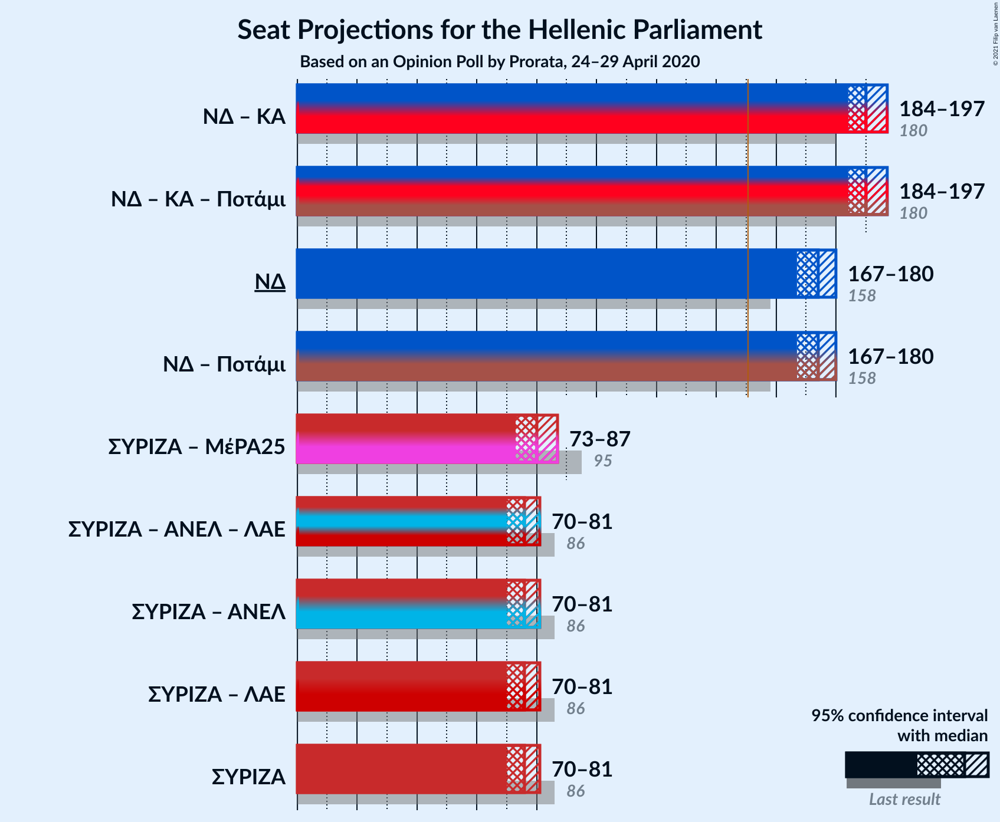
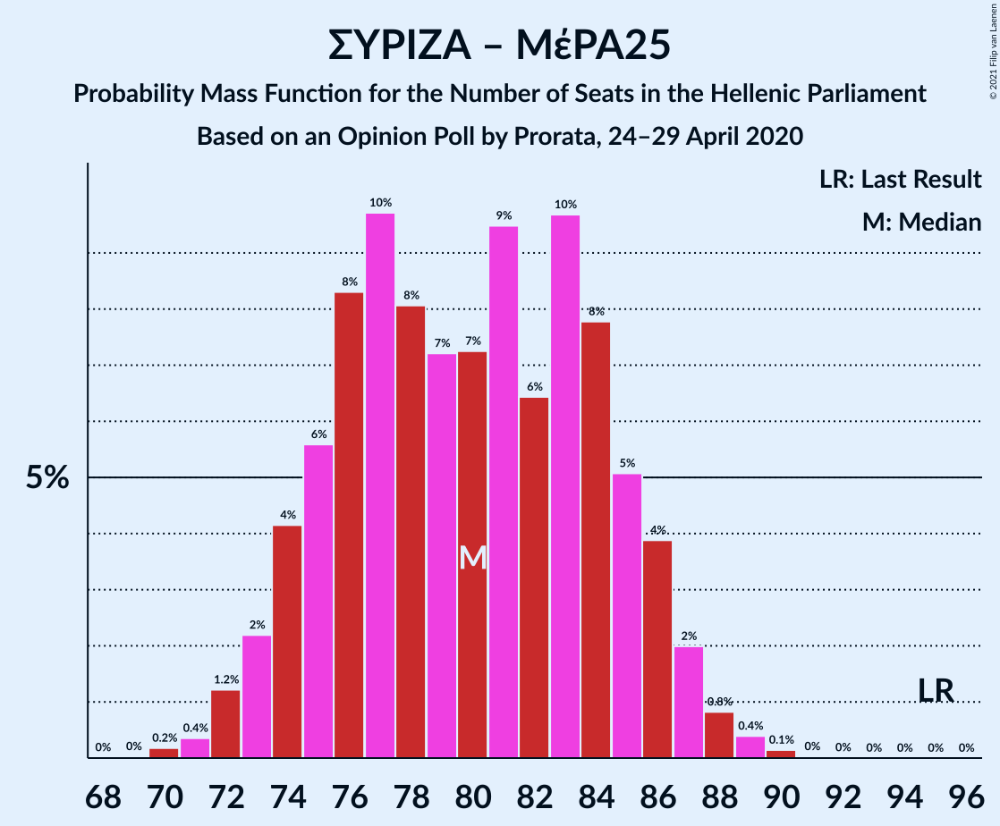
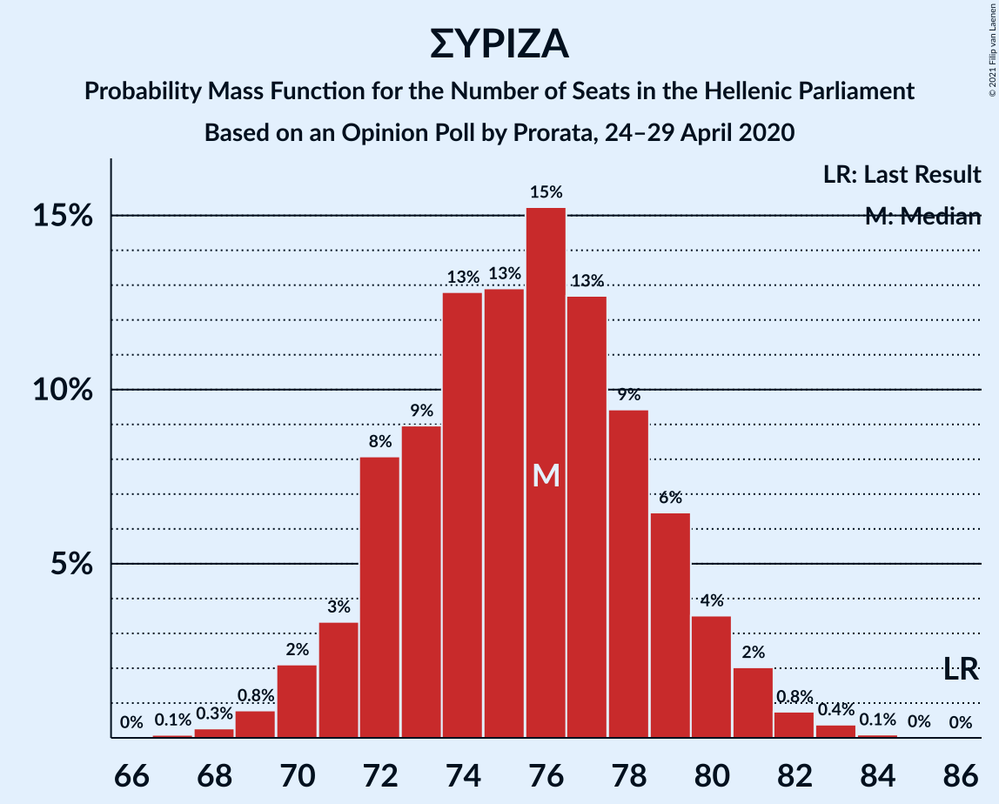

# Opinion Poll by Prorata, 24–29 April 2020

<a href="#voting-intentions">Voting Intentions</a> | <a href="#seats">Seats</a> | <a href="#coalitions">Coalitions</a> | <a href="#technical-information">Technical Information</a>

## Voting Intentions

### Confidence Intervals

| Party | Last Result | Poll Result | 80% Confidence Interval | 90% Confidence Interval | 95% Confidence Interval | 99% Confidence Interval |
|:-----:|:-----------:|:-----------:|:-----------------------:|:-----------------------:|:-----------------------:|:-----------------------:|
| Νέα Δημοκρατία | 39.8% | 46.0% | 44.7–47.3% |44.4–47.6% |44.0–48.0% |43.4–48.6% |
| Συνασπισμός Ριζοσπαστικής Αριστεράς | 31.5% | 28.0% | 26.9–29.2% |26.6–29.5% |26.3–29.8% |25.7–30.4% |
| Κίνημα Αλλαγής | 8.1% | 6.0% | 5.4–6.7% |5.3–6.8% |5.1–7.0% |4.9–7.3% |
| Κομμουνιστικό Κόμμα Ελλάδας | 5.3% | 6.0% | 5.4–6.7% |5.3–6.8% |5.1–7.0% |4.9–7.3% |
| Ελληνική Λύση | 3.7% | 5.0% | 4.5–5.6% |4.3–5.8% |4.2–5.9% |4.0–6.2% |
| Μέτωπο Ευρωπαϊκής Ρεαλιστικής Ανυπακοής | 3.4% | 3.0% | 2.6–3.5% |2.5–3.6% |2.4–3.7% |2.2–4.0% |
| Χρυσή Αυγή | 2.9% | 2.0% | 1.7–2.4% |1.6–2.5% |1.5–2.6% |1.4–2.9% |

*Note:* The poll result column reflects the actual value used in the calculations. Published results may vary slightly, and in addition be rounded to fewer digits.

## Seats

### Confidence Intervals

| Party | Last Result | Median | 80% Confidence Interval | 90% Confidence Interval | 95% Confidence Interval | 99% Confidence Interval |
|:-----:|:-----------:|:------:|:-----------------------:|:-----------------------:|:-----------------------:|:-----------------------:|
| <a href="#νέα-δημοκρατία">Νέα Δημοκρατία</a> | 158 | 174 | 169–178 |169–179 |168–181 |166–182 |
| <a href="#συνασπισμός-ριζοσπαστικής-αριστεράς">Συνασπισμός Ριζοσπαστικής Αριστεράς</a> | 86 | 75 | 72–79 |71–80 |70–81 |68–82 |
| <a href="#κίνημα-αλλαγής">Κίνημα Αλλαγής</a> | 22 | 16 | 15–18 |14–18 |14–19 |13–20 |
| <a href="#κομμουνιστικό-κόμμα-ελλάδας">Κομμουνιστικό Κόμμα Ελλάδας</a> | 15 | 16 | 15–18 |14–19 |14–19 |13–20 |
| <a href="#ελληνική-λύση">Ελληνική Λύση</a> | 10 | 13 | 12–15 |12–15 |12–16 |10–17 |
| <a href="#μέτωπο-ευρωπαϊκής-ρεαλιστικής-ανυπακοής">Μέτωπο Ευρωπαϊκής Ρεαλιστικής Ανυπακοής</a> | 9 | 8 | 0–9 |0–10 |0–10 |0–11 |
| <a href="#χρυσή-αυγή">Χρυσή Αυγή</a> | 0 | 0 | 0 |0 |0 |0 |

### Νέα Δημοκρατία

*For a full overview of the results for this party, see the [Νέα Δημοκρατία](party-νέαδημοκρατία.html) page.*

| Number of Seats | Probability | Accumulated | Special Marks |
|:---------------:|:-----------:|:-----------:|:-------------:|
| 158 | 0% | 100% | Last Result |
| 159 | 0% | 100% |  |
| 160 | 0% | 100% |  |
| 161 | 0% | 100% |  |
| 162 | 0% | 100% |  |
| 163 | 0% | 100% |  |
| 164 | 0.1% | 100% |  |
| 165 | 0.2% | 99.9% |  |
| 166 | 0.4% | 99.7% |  |
| 167 | 0.6% | 99.3% |  |
| 168 | 2% | 98.6% |  |
| 169 | 9% | 97% |  |
| 170 | 10% | 88% |  |
| 171 | 3% | 78% |  |
| 172 | 9% | 74% |  |
| 173 | 10% | 65% |  |
| 174 | 18% | 55% | Median |
| 175 | 5% | 37% |  |
| 176 | 3% | 33% |  |
| 177 | 13% | 30% |  |
| 178 | 9% | 17% |  |
| 179 | 4% | 8% |  |
| 180 | 1.2% | 4% |  |
| 181 | 2% | 3% |  |
| 182 | 0.6% | 0.8% |  |
| 183 | 0.1% | 0.2% |  |
| 184 | 0% | 0.1% |  |
| 185 | 0% | 0% |  |

### Συνασπισμός Ριζοσπαστικής Αριστεράς

*For a full overview of the results for this party, see the [Συνασπισμός Ριζοσπαστικής Αριστεράς](party-συνασπισμόςριζοσπαστικήςαριστεράς.html) page.*

| Number of Seats | Probability | Accumulated | Special Marks |
|:---------------:|:-----------:|:-----------:|:-------------:|
| 67 | 0.1% | 100% |  |
| 68 | 0.5% | 99.9% |  |
| 69 | 0.6% | 99.4% |  |
| 70 | 1.4% | 98.8% |  |
| 71 | 3% | 97% |  |
| 72 | 9% | 94% |  |
| 73 | 16% | 85% |  |
| 74 | 9% | 70% |  |
| 75 | 12% | 61% | Median |
| 76 | 19% | 48% |  |
| 77 | 10% | 30% |  |
| 78 | 6% | 20% |  |
| 79 | 6% | 13% |  |
| 80 | 5% | 8% |  |
| 81 | 1.4% | 3% |  |
| 82 | 1.1% | 1.4% |  |
| 83 | 0.2% | 0.4% |  |
| 84 | 0.1% | 0.1% |  |
| 85 | 0% | 0.1% |  |
| 86 | 0% | 0% | Last Result |

### Κίνημα Αλλαγής

*For a full overview of the results for this party, see the [Κίνημα Αλλαγής](party-κίνημααλλαγής.html) page.*

| Number of Seats | Probability | Accumulated | Special Marks |
|:---------------:|:-----------:|:-----------:|:-------------:|
| 12 | 0.1% | 100% |  |
| 13 | 1.0% | 99.9% |  |
| 14 | 6% | 98.8% |  |
| 15 | 11% | 93% |  |
| 16 | 41% | 82% | Median |
| 17 | 27% | 41% |  |
| 18 | 10% | 14% |  |
| 19 | 4% | 5% |  |
| 20 | 0.6% | 0.7% |  |
| 21 | 0% | 0.1% |  |
| 22 | 0% | 0% | Last Result |

### Κομμουνιστικό Κόμμα Ελλάδας

*For a full overview of the results for this party, see the [Κομμουνιστικό Κόμμα Ελλάδας](party-κομμουνιστικόκόμμαελλάδας.html) page.*

| Number of Seats | Probability | Accumulated | Special Marks |
|:---------------:|:-----------:|:-----------:|:-------------:|
| 12 | 0.1% | 100% |  |
| 13 | 1.3% | 99.9% |  |
| 14 | 5% | 98.6% |  |
| 15 | 18% | 94% | Last Result |
| 16 | 43% | 76% | Median |
| 17 | 17% | 33% |  |
| 18 | 10% | 16% |  |
| 19 | 5% | 7% |  |
| 20 | 1.0% | 1.1% |  |
| 21 | 0.1% | 0.1% |  |
| 22 | 0% | 0% |  |

### Ελληνική Λύση

*For a full overview of the results for this party, see the [Ελληνική Λύση](party-ελληνικήλύση.html) page.*

| Number of Seats | Probability | Accumulated | Special Marks |
|:---------------:|:-----------:|:-----------:|:-------------:|
| 10 | 0.7% | 100% | Last Result |
| 11 | 0.4% | 99.3% |  |
| 12 | 23% | 98.9% |  |
| 13 | 26% | 76% | Median |
| 14 | 25% | 50% |  |
| 15 | 21% | 25% |  |
| 16 | 2% | 3% |  |
| 17 | 1.5% | 1.5% |  |
| 18 | 0% | 0% |  |

### Μέτωπο Ευρωπαϊκής Ρεαλιστικής Ανυπακοής

*For a full overview of the results for this party, see the [Μέτωπο Ευρωπαϊκής Ρεαλιστικής Ανυπακοής](party-μέτωποευρωπαϊκήςρεαλιστικήςανυπακοής.html) page.*

| Number of Seats | Probability | Accumulated | Special Marks |
|:---------------:|:-----------:|:-----------:|:-------------:|
| 0 | 46% | 100% |  |
| 1 | 0% | 54% |  |
| 2 | 0% | 54% |  |
| 3 | 0% | 54% |  |
| 4 | 0% | 54% |  |
| 5 | 0% | 54% |  |
| 6 | 0% | 54% |  |
| 7 | 0% | 54% |  |
| 8 | 24% | 54% | Median |
| 9 | 25% | 30% | Last Result |
| 10 | 4% | 5% |  |
| 11 | 0.9% | 0.9% |  |
| 12 | 0% | 0% |  |

### Χρυσή Αυγή

*For a full overview of the results for this party, see the [Χρυσή Αυγή](party-χρυσήαυγή.html) page.*

| Number of Seats | Probability | Accumulated | Special Marks |
|:---------------:|:-----------:|:-----------:|:-------------:|
| 0 | 99.8% | 100% | Last Result, Median |
| 1 | 0% | 0.2% |  |
| 2 | 0% | 0.2% |  |
| 3 | 0% | 0.2% |  |
| 4 | 0% | 0.2% |  |
| 5 | 0% | 0.2% |  |
| 6 | 0% | 0.2% |  |
| 7 | 0% | 0.2% |  |
| 8 | 0.1% | 0.2% |  |
| 9 | 0% | 0% |  |

## Coalitions

### Confidence Intervals

| Coalition | Last Result | Median | Majority? | 80% Confidence Interval | 90% Confidence Interval | 95% Confidence Interval | 99% Confidence Interval |
|:---------:|:-----------:|:------:|:---------:|:-----------------------:|:-----------------------:|:-----------------------:|:-----------------------:|
| Νέα Δημοκρατία – Κίνημα Αλλαγής | 180 | 190 | 100% | 186–195 | 185–196 | 184–197 | 182–199 |
| Νέα Δημοκρατία | 158 | 174 | 100% | 169–178 | 169–179 | 168–181 | 166–182 |
| Συνασπισμός Ριζοσπαστικής Αριστεράς – Μέτωπο Ευρωπαϊκής Ρεαλιστικής Ανυπακοής | 95 | 81 | 0% | 75–85 | 74–86 | 72–87 | 71–89 |
| Συνασπισμός Ριζοσπαστικής Αριστεράς | 86 | 75 | 0% | 72–79 | 71–80 | 70–81 | 68–82 |

### Νέα Δημοκρατία – Κίνημα Αλλαγής

| Number of Seats | Probability | Accumulated | Special Marks |
|:---------------:|:-----------:|:-----------:|:-------------:|
| 180 | 0.1% | 100% | Last Result |
| 181 | 0.3% | 99.9% |  |
| 182 | 0.3% | 99.6% |  |
| 183 | 1.1% | 99.4% |  |
| 184 | 2% | 98% |  |
| 185 | 5% | 96% |  |
| 186 | 7% | 91% |  |
| 187 | 10% | 84% |  |
| 188 | 11% | 75% |  |
| 189 | 6% | 64% |  |
| 190 | 15% | 58% | Median |
| 191 | 6% | 43% |  |
| 192 | 6% | 36% |  |
| 193 | 12% | 31% |  |
| 194 | 4% | 18% |  |
| 195 | 8% | 15% |  |
| 196 | 3% | 6% |  |
| 197 | 2% | 4% |  |
| 198 | 0.6% | 1.1% |  |
| 199 | 0.4% | 0.5% |  |
| 200 | 0.1% | 0.2% |  |
| 201 | 0% | 0% |  |

### Νέα Δημοκρατία

| Number of Seats | Probability | Accumulated | Special Marks |
|:---------------:|:-----------:|:-----------:|:-------------:|
| 158 | 0% | 100% | Last Result |
| 159 | 0% | 100% |  |
| 160 | 0% | 100% |  |
| 161 | 0% | 100% |  |
| 162 | 0% | 100% |  |
| 163 | 0% | 100% |  |
| 164 | 0.1% | 100% |  |
| 165 | 0.2% | 99.9% |  |
| 166 | 0.4% | 99.7% |  |
| 167 | 0.6% | 99.3% |  |
| 168 | 2% | 98.6% |  |
| 169 | 9% | 97% |  |
| 170 | 10% | 88% |  |
| 171 | 3% | 78% |  |
| 172 | 9% | 74% |  |
| 173 | 10% | 65% |  |
| 174 | 18% | 55% | Median |
| 175 | 5% | 37% |  |
| 176 | 3% | 33% |  |
| 177 | 13% | 30% |  |
| 178 | 9% | 17% |  |
| 179 | 4% | 8% |  |
| 180 | 1.2% | 4% |  |
| 181 | 2% | 3% |  |
| 182 | 0.6% | 0.8% |  |
| 183 | 0.1% | 0.2% |  |
| 184 | 0% | 0.1% |  |
| 185 | 0% | 0% |  |

### Συνασπισμός Ριζοσπαστικής Αριστεράς – Μέτωπο Ευρωπαϊκής Ρεαλιστικής Ανυπακοής

| Number of Seats | Probability | Accumulated | Special Marks |
|:---------------:|:-----------:|:-----------:|:-------------:|
| 70 | 0.2% | 100% |  |
| 71 | 0.3% | 99.8% |  |
| 72 | 2% | 99.5% |  |
| 73 | 1.3% | 97% |  |
| 74 | 3% | 96% |  |
| 75 | 5% | 93% |  |
| 76 | 13% | 89% |  |
| 77 | 7% | 76% |  |
| 78 | 4% | 69% |  |
| 79 | 7% | 65% |  |
| 80 | 7% | 58% |  |
| 81 | 18% | 51% |  |
| 82 | 5% | 34% |  |
| 83 | 9% | 29% | Median |
| 84 | 9% | 20% |  |
| 85 | 4% | 11% |  |
| 86 | 4% | 7% |  |
| 87 | 2% | 3% |  |
| 88 | 0.7% | 1.3% |  |
| 89 | 0.4% | 0.6% |  |
| 90 | 0.2% | 0.2% |  |
| 91 | 0% | 0% |  |
| 92 | 0% | 0% |  |
| 93 | 0% | 0% |  |
| 94 | 0% | 0% |  |
| 95 | 0% | 0% | Last Result |

### Συνασπισμός Ριζοσπαστικής Αριστεράς

| Number of Seats | Probability | Accumulated | Special Marks |
|:---------------:|:-----------:|:-----------:|:-------------:|
| 67 | 0.1% | 100% |  |
| 68 | 0.5% | 99.9% |  |
| 69 | 0.6% | 99.4% |  |
| 70 | 1.4% | 98.8% |  |
| 71 | 3% | 97% |  |
| 72 | 9% | 94% |  |
| 73 | 16% | 85% |  |
| 74 | 9% | 70% |  |
| 75 | 12% | 61% | Median |
| 76 | 19% | 48% |  |
| 77 | 10% | 30% |  |
| 78 | 6% | 20% |  |
| 79 | 6% | 13% |  |
| 80 | 5% | 8% |  |
| 81 | 1.4% | 3% |  |
| 82 | 1.1% | 1.4% |  |
| 83 | 0.2% | 0.4% |  |
| 84 | 0.1% | 0.1% |  |
| 85 | 0% | 0.1% |  |
| 86 | 0% | 0% | Last Result |

## Technical Information

### Opinion Poll

+ **Polling firm:** Prorata
+ **Commissioner(s):** —
+ **Fieldwork period:** 24–29 April 2020

### Calculations

+ **Sample size:** 2500
+ **Simulations done:** 131,072
+ **Error estimate:** 0.76%

