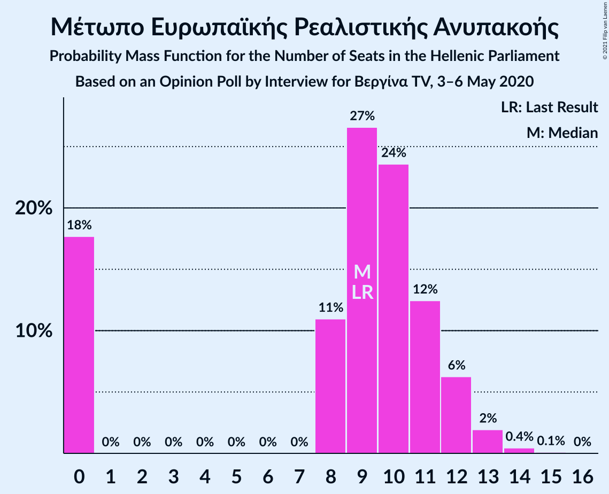
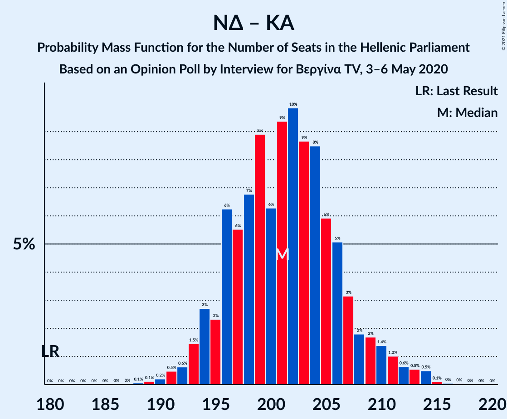
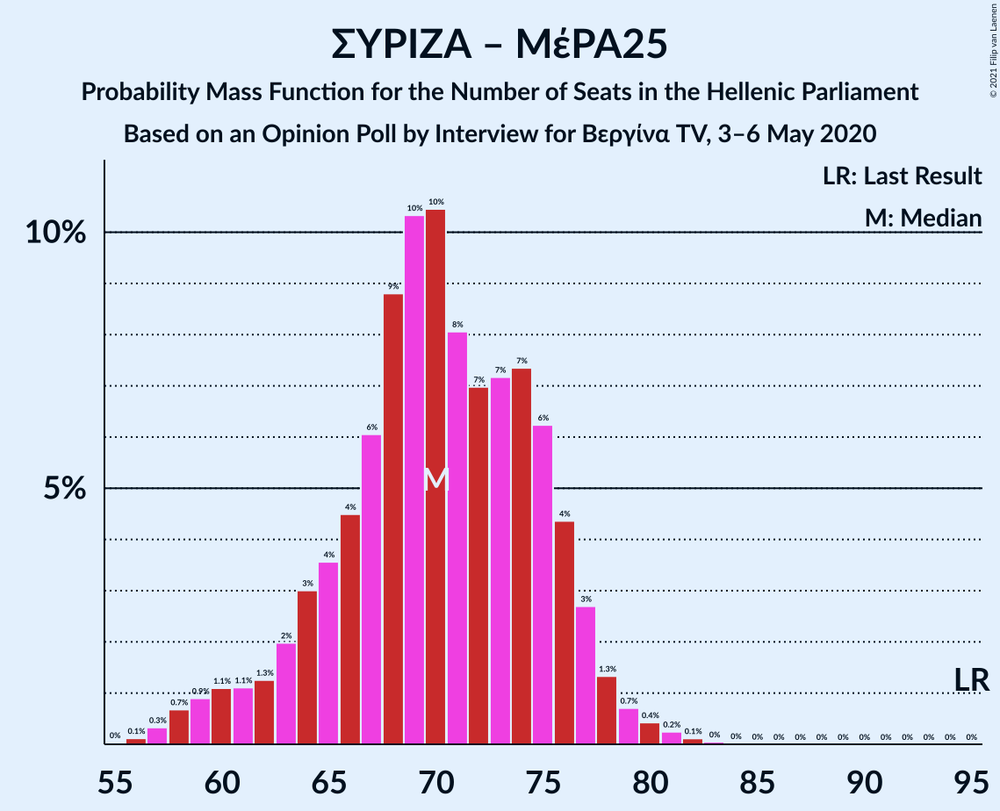

# Opinion Poll by Interview for Βεργίνα TV, 3–6 May 2020

<a href="#voting-intentions">Voting Intentions</a> | <a href="#seats">Seats</a> | <a href="#coalitions">Coalitions</a> | <a href="#technical-information">Technical Information</a>

## Voting Intentions

### Confidence Intervals

| Party | Last Result | Poll Result | 80% Confidence Interval | 90% Confidence Interval | 95% Confidence Interval | 99% Confidence Interval |
|:-----:|:-----------:|:-----------:|:-----------------------:|:-----------------------:|:-----------------------:|:-----------------------:|
| Νέα Δημοκρατία | 39.8% | 49.0% | 47.0–50.9% |46.5–51.4% |46.0–51.9% |45.1–52.8% |
| Συνασπισμός Ριζοσπαστικής Αριστεράς | 31.5% | 23.1% | 21.5–24.8% |21.1–25.2% |20.7–25.7% |20.0–26.5% |
| Κίνημα Αλλαγής | 8.1% | 7.4% | 6.5–8.5% |6.2–8.9% |6.0–9.1% |5.6–9.7% |
| Κομμουνιστικό Κόμμα Ελλάδας | 5.3% | 5.3% | 4.6–6.3% |4.3–6.6% |4.2–6.8% |3.8–7.3% |
| Ελληνική Λύση | 3.7% | 5.2% | 4.4–6.1% |4.2–6.4% |4.0–6.6% |3.7–7.1% |
| Μέτωπο Ευρωπαϊκής Ρεαλιστικής Ανυπακοής | 3.4% | 3.4% | 2.8–4.3% |2.7–4.5% |2.5–4.7% |2.2–5.1% |

*Note:* The poll result column reflects the actual value used in the calculations. Published results may vary slightly, and in addition be rounded to fewer digits.

## Seats

### Confidence Intervals

| Party | Last Result | Median | 80% Confidence Interval | 90% Confidence Interval | 95% Confidence Interval | 99% Confidence Interval |
|:-----:|:-----------:|:------:|:-----------------------:|:-----------------------:|:-----------------------:|:-----------------------:|
| <a href="#νέα-δημοκρατία">Νέα Δημοκρατία</a> | 158 | 181 | 176–187 |174–188 |173–190 |170–193 |
| <a href="#συνασπισμός-ριζοσπαστικής-αριστεράς">Συνασπισμός Ριζοσπαστικής Αριστεράς</a> | 86 | 62 | 58–66 |57–68 |56–69 |53–72 |
| <a href="#κίνημα-αλλαγής">Κίνημα Αλλαγής</a> | 22 | 20 | 17–23 |17–24 |16–24 |15–26 |
| <a href="#κομμουνιστικό-κόμμα-ελλάδας">Κομμουνιστικό Κόμμα Ελλάδας</a> | 15 | 15 | 12–16 |12–18 |11–19 |10–19 |
| <a href="#ελληνική-λύση">Ελληνική Λύση</a> | 10 | 14 | 12–16 |11–17 |11–18 |10–19 |
| <a href="#μέτωπο-ευρωπαϊκής-ρεαλιστικής-ανυπακοής">Μέτωπο Ευρωπαϊκής Ρεαλιστικής Ανυπακοής</a> | 9 | 9 | 0–11 |0–12 |0–13 |0–13 |

### Νέα Δημοκρατία

*For a full overview of the results for this party, see the [Νέα Δημοκρατία](party-νέαδημοκρατία.html) page.*

| Number of Seats | Probability | Accumulated | Special Marks |
|:---------------:|:-----------:|:-----------:|:-------------:|
| 158 | 0% | 100% | Last Result |
| 159 | 0% | 100% |  |
| 160 | 0% | 100% |  |
| 161 | 0% | 100% |  |
| 162 | 0% | 100% |  |
| 163 | 0% | 100% |  |
| 164 | 0% | 100% |  |
| 165 | 0% | 100% |  |
| 166 | 0% | 100% |  |
| 167 | 0% | 100% |  |
| 168 | 0.1% | 100% |  |
| 169 | 0.1% | 99.9% |  |
| 170 | 0.3% | 99.8% |  |
| 171 | 0.4% | 99.5% |  |
| 172 | 0.7% | 99.1% |  |
| 173 | 1.5% | 98% |  |
| 174 | 2% | 97% |  |
| 175 | 5% | 95% |  |
| 176 | 6% | 90% |  |
| 177 | 6% | 84% |  |
| 178 | 5% | 78% |  |
| 179 | 7% | 73% |  |
| 180 | 7% | 67% |  |
| 181 | 11% | 59% | Median |
| 182 | 11% | 48% |  |
| 183 | 8% | 37% |  |
| 184 | 7% | 29% |  |
| 185 | 5% | 22% |  |
| 186 | 4% | 16% |  |
| 187 | 4% | 12% |  |
| 188 | 3% | 8% |  |
| 189 | 2% | 5% |  |
| 190 | 1.0% | 3% |  |
| 191 | 0.9% | 2% |  |
| 192 | 0.5% | 1.4% |  |
| 193 | 0.4% | 0.9% |  |
| 194 | 0.3% | 0.5% |  |
| 195 | 0.1% | 0.2% |  |
| 196 | 0% | 0.1% |  |
| 197 | 0% | 0% |  |

### Συνασπισμός Ριζοσπαστικής Αριστεράς

*For a full overview of the results for this party, see the [Συνασπισμός Ριζοσπαστικής Αριστεράς](party-συνασπισμόςριζοσπαστικήςαριστεράς.html) page.*

| Number of Seats | Probability | Accumulated | Special Marks |
|:---------------:|:-----------:|:-----------:|:-------------:|
| 51 | 0.1% | 100% |  |
| 52 | 0.2% | 99.9% |  |
| 53 | 0.5% | 99.8% |  |
| 54 | 0.7% | 99.3% |  |
| 55 | 0.7% | 98.7% |  |
| 56 | 2% | 98% |  |
| 57 | 5% | 96% |  |
| 58 | 6% | 91% |  |
| 59 | 9% | 85% |  |
| 60 | 11% | 76% |  |
| 61 | 8% | 64% |  |
| 62 | 7% | 57% | Median |
| 63 | 12% | 50% |  |
| 64 | 14% | 38% |  |
| 65 | 10% | 24% |  |
| 66 | 5% | 14% |  |
| 67 | 4% | 9% |  |
| 68 | 2% | 5% |  |
| 69 | 1.0% | 3% |  |
| 70 | 0.7% | 2% |  |
| 71 | 0.7% | 1.3% |  |
| 72 | 0.5% | 0.7% |  |
| 73 | 0.1% | 0.2% |  |
| 74 | 0% | 0.1% |  |
| 75 | 0% | 0% |  |
| 76 | 0% | 0% |  |
| 77 | 0% | 0% |  |
| 78 | 0% | 0% |  |
| 79 | 0% | 0% |  |
| 80 | 0% | 0% |  |
| 81 | 0% | 0% |  |
| 82 | 0% | 0% |  |
| 83 | 0% | 0% |  |
| 84 | 0% | 0% |  |
| 85 | 0% | 0% |  |
| 86 | 0% | 0% | Last Result |

### Κίνημα Αλλαγής

*For a full overview of the results for this party, see the [Κίνημα Αλλαγής](party-κίνημααλλαγής.html) page.*

| Number of Seats | Probability | Accumulated | Special Marks |
|:---------------:|:-----------:|:-----------:|:-------------:|
| 14 | 0.2% | 100% |  |
| 15 | 0.8% | 99.8% |  |
| 16 | 2% | 98.9% |  |
| 17 | 7% | 96% |  |
| 18 | 13% | 89% |  |
| 19 | 18% | 76% |  |
| 20 | 17% | 58% | Median |
| 21 | 14% | 42% |  |
| 22 | 12% | 27% | Last Result |
| 23 | 8% | 15% |  |
| 24 | 4% | 7% |  |
| 25 | 1.5% | 2% |  |
| 26 | 0.6% | 0.9% |  |
| 27 | 0.2% | 0.3% |  |
| 28 | 0% | 0.1% |  |
| 29 | 0% | 0% |  |

### Κομμουνιστικό Κόμμα Ελλάδας

*For a full overview of the results for this party, see the [Κομμουνιστικό Κόμμα Ελλάδας](party-κομμουνιστικόκόμμαελλάδας.html) page.*

| Number of Seats | Probability | Accumulated | Special Marks |
|:---------------:|:-----------:|:-----------:|:-------------:|
| 9 | 0.2% | 100% |  |
| 10 | 1.0% | 99.8% |  |
| 11 | 2% | 98.8% |  |
| 12 | 10% | 97% |  |
| 13 | 24% | 87% |  |
| 14 | 10% | 63% |  |
| 15 | 15% | 53% | Last Result, Median |
| 16 | 29% | 39% |  |
| 17 | 4% | 10% |  |
| 18 | 2% | 6% |  |
| 19 | 3% | 3% |  |
| 20 | 0.2% | 0.3% |  |
| 21 | 0.1% | 0.1% |  |
| 22 | 0.1% | 0.1% |  |
| 23 | 0% | 0% |  |

### Ελληνική Λύση

*For a full overview of the results for this party, see the [Ελληνική Λύση](party-ελληνικήλύση.html) page.*

| Number of Seats | Probability | Accumulated | Special Marks |
|:---------------:|:-----------:|:-----------:|:-------------:|
| 9 | 0.3% | 100% |  |
| 10 | 2% | 99.7% | Last Result |
| 11 | 6% | 98% |  |
| 12 | 12% | 92% |  |
| 13 | 19% | 80% |  |
| 14 | 18% | 62% | Median |
| 15 | 23% | 43% |  |
| 16 | 11% | 20% |  |
| 17 | 6% | 9% |  |
| 18 | 2% | 3% |  |
| 19 | 0.6% | 0.8% |  |
| 20 | 0.2% | 0.3% |  |
| 21 | 0.1% | 0.1% |  |
| 22 | 0% | 0% |  |

### Μέτωπο Ευρωπαϊκής Ρεαλιστικής Ανυπακοής

*For a full overview of the results for this party, see the [Μέτωπο Ευρωπαϊκής Ρεαλιστικής Ανυπακοής](party-μέτωποευρωπαϊκήςρεαλιστικήςανυπακοής.html) page.*

| Number of Seats | Probability | Accumulated | Special Marks |
|:---------------:|:-----------:|:-----------:|:-------------:|
| 0 | 21% | 100% |  |
| 1 | 0% | 79% |  |
| 2 | 0% | 79% |  |
| 3 | 0% | 79% |  |
| 4 | 0% | 79% |  |
| 5 | 0% | 79% |  |
| 6 | 0% | 79% |  |
| 7 | 0% | 79% |  |
| 8 | 10% | 79% |  |
| 9 | 20% | 69% | Last Result, Median |
| 10 | 28% | 49% |  |
| 11 | 12% | 20% |  |
| 12 | 5% | 9% |  |
| 13 | 3% | 3% |  |
| 14 | 0.4% | 0.5% |  |
| 15 | 0.1% | 0.1% |  |
| 16 | 0% | 0% |  |

## Coalitions

### Confidence Intervals

| Coalition | Last Result | Median | Majority? | 80% Confidence Interval | 90% Confidence Interval | 95% Confidence Interval | 99% Confidence Interval |
|:---------:|:-----------:|:------:|:---------:|:-----------------------:|:-----------------------:|:-----------------------:|:-----------------------:|
| Νέα Δημοκρατία – Κίνημα Αλλαγής | 180 | 201 | 100% | 196–207 | 194–208 | 193–211 | 191–214 |
| Νέα Δημοκρατία | 158 | 181 | 100% | 176–187 | 174–188 | 173–190 | 170–193 |
| Συνασπισμός Ριζοσπαστικής Αριστεράς – Μέτωπο Ευρωπαϊκής Ρεαλιστικής Ανυπακοής | 95 | 70 | 0% | 64–75 | 63–76 | 60–78 | 57–80 |
| Συνασπισμός Ριζοσπαστικής Αριστεράς | 86 | 62 | 0% | 58–66 | 57–68 | 56–69 | 53–72 |

### Νέα Δημοκρατία – Κίνημα Αλλαγής

| Number of Seats | Probability | Accumulated | Special Marks |
|:---------------:|:-----------:|:-----------:|:-------------:|
| 180 | 0% | 100% | Last Result |
| 181 | 0% | 100% |  |
| 182 | 0% | 100% |  |
| 183 | 0% | 100% |  |
| 184 | 0% | 100% |  |
| 185 | 0% | 100% |  |
| 186 | 0% | 100% |  |
| 187 | 0% | 100% |  |
| 188 | 0.1% | 100% |  |
| 189 | 0.1% | 99.9% |  |
| 190 | 0.2% | 99.8% |  |
| 191 | 0.9% | 99.7% |  |
| 192 | 0.2% | 98.8% |  |
| 193 | 2% | 98.6% |  |
| 194 | 2% | 97% |  |
| 195 | 1.1% | 95% |  |
| 196 | 11% | 94% |  |
| 197 | 2% | 83% |  |
| 198 | 8% | 81% |  |
| 199 | 14% | 72% |  |
| 200 | 2% | 59% |  |
| 201 | 10% | 57% | Median |
| 202 | 6% | 46% |  |
| 203 | 5% | 41% |  |
| 204 | 10% | 35% |  |
| 205 | 3% | 25% |  |
| 206 | 10% | 22% |  |
| 207 | 5% | 12% |  |
| 208 | 3% | 8% |  |
| 209 | 1.2% | 5% |  |
| 210 | 0.6% | 4% |  |
| 211 | 0.9% | 3% |  |
| 212 | 0.6% | 2% |  |
| 213 | 0.9% | 2% |  |
| 214 | 0.5% | 0.7% |  |
| 215 | 0.1% | 0.2% |  |
| 216 | 0.1% | 0.1% |  |
| 217 | 0% | 0% |  |

### Νέα Δημοκρατία

| Number of Seats | Probability | Accumulated | Special Marks |
|:---------------:|:-----------:|:-----------:|:-------------:|
| 158 | 0% | 100% | Last Result |
| 159 | 0% | 100% |  |
| 160 | 0% | 100% |  |
| 161 | 0% | 100% |  |
| 162 | 0% | 100% |  |
| 163 | 0% | 100% |  |
| 164 | 0% | 100% |  |
| 165 | 0% | 100% |  |
| 166 | 0% | 100% |  |
| 167 | 0% | 100% |  |
| 168 | 0.1% | 100% |  |
| 169 | 0.1% | 99.9% |  |
| 170 | 0.3% | 99.8% |  |
| 171 | 0.4% | 99.5% |  |
| 172 | 0.7% | 99.1% |  |
| 173 | 1.5% | 98% |  |
| 174 | 2% | 97% |  |
| 175 | 5% | 95% |  |
| 176 | 6% | 90% |  |
| 177 | 6% | 84% |  |
| 178 | 5% | 78% |  |
| 179 | 7% | 73% |  |
| 180 | 7% | 67% |  |
| 181 | 11% | 59% | Median |
| 182 | 11% | 48% |  |
| 183 | 8% | 37% |  |
| 184 | 7% | 29% |  |
| 185 | 5% | 22% |  |
| 186 | 4% | 16% |  |
| 187 | 4% | 12% |  |
| 188 | 3% | 8% |  |
| 189 | 2% | 5% |  |
| 190 | 1.0% | 3% |  |
| 191 | 0.9% | 2% |  |
| 192 | 0.5% | 1.4% |  |
| 193 | 0.4% | 0.9% |  |
| 194 | 0.3% | 0.5% |  |
| 195 | 0.1% | 0.2% |  |
| 196 | 0% | 0.1% |  |
| 197 | 0% | 0% |  |

### Συνασπισμός Ριζοσπαστικής Αριστεράς – Μέτωπο Ευρωπαϊκής Ρεαλιστικής Ανυπακοής

| Number of Seats | Probability | Accumulated | Special Marks |
|:---------------:|:-----------:|:-----------:|:-------------:|
| 55 | 0.1% | 100% |  |
| 56 | 0.2% | 99.9% |  |
| 57 | 0.6% | 99.7% |  |
| 58 | 0.7% | 99.1% |  |
| 59 | 0.7% | 98% |  |
| 60 | 0.5% | 98% |  |
| 61 | 0.8% | 97% |  |
| 62 | 1.0% | 96% |  |
| 63 | 4% | 95% |  |
| 64 | 6% | 91% |  |
| 65 | 4% | 85% |  |
| 66 | 5% | 82% |  |
| 67 | 6% | 77% |  |
| 68 | 8% | 70% |  |
| 69 | 6% | 62% |  |
| 70 | 7% | 56% |  |
| 71 | 6% | 49% | Median |
| 72 | 7% | 43% |  |
| 73 | 12% | 36% |  |
| 74 | 10% | 24% |  |
| 75 | 6% | 15% |  |
| 76 | 4% | 9% |  |
| 77 | 2% | 5% |  |
| 78 | 1.0% | 3% |  |
| 79 | 0.9% | 2% |  |
| 80 | 0.7% | 1.1% |  |
| 81 | 0.2% | 0.3% |  |
| 82 | 0.1% | 0.1% |  |
| 83 | 0% | 0.1% |  |
| 84 | 0% | 0% |  |
| 85 | 0% | 0% |  |
| 86 | 0% | 0% |  |
| 87 | 0% | 0% |  |
| 88 | 0% | 0% |  |
| 89 | 0% | 0% |  |
| 90 | 0% | 0% |  |
| 91 | 0% | 0% |  |
| 92 | 0% | 0% |  |
| 93 | 0% | 0% |  |
| 94 | 0% | 0% |  |
| 95 | 0% | 0% | Last Result |

### Συνασπισμός Ριζοσπαστικής Αριστεράς

| Number of Seats | Probability | Accumulated | Special Marks |
|:---------------:|:-----------:|:-----------:|:-------------:|
| 51 | 0.1% | 100% |  |
| 52 | 0.2% | 99.9% |  |
| 53 | 0.5% | 99.8% |  |
| 54 | 0.7% | 99.3% |  |
| 55 | 0.7% | 98.7% |  |
| 56 | 2% | 98% |  |
| 57 | 5% | 96% |  |
| 58 | 6% | 91% |  |
| 59 | 9% | 85% |  |
| 60 | 11% | 76% |  |
| 61 | 8% | 64% |  |
| 62 | 7% | 57% | Median |
| 63 | 12% | 50% |  |
| 64 | 14% | 38% |  |
| 65 | 10% | 24% |  |
| 66 | 5% | 14% |  |
| 67 | 4% | 9% |  |
| 68 | 2% | 5% |  |
| 69 | 1.0% | 3% |  |
| 70 | 0.7% | 2% |  |
| 71 | 0.7% | 1.3% |  |
| 72 | 0.5% | 0.7% |  |
| 73 | 0.1% | 0.2% |  |
| 74 | 0% | 0.1% |  |
| 75 | 0% | 0% |  |
| 76 | 0% | 0% |  |
| 77 | 0% | 0% |  |
| 78 | 0% | 0% |  |
| 79 | 0% | 0% |  |
| 80 | 0% | 0% |  |
| 81 | 0% | 0% |  |
| 82 | 0% | 0% |  |
| 83 | 0% | 0% |  |
| 84 | 0% | 0% |  |
| 85 | 0% | 0% |  |
| 86 | 0% | 0% | Last Result |

## Technical Information

### Opinion Poll

+ **Polling firm:** Interview
+ **Commissioner(s):** Βεργίνα TV
+ **Fieldwork period:** 3–6 May 2020

### Calculations

+ **Sample size:** 1105
+ **Simulations done:** 131,072
+ **Error estimate:** 0.96%

