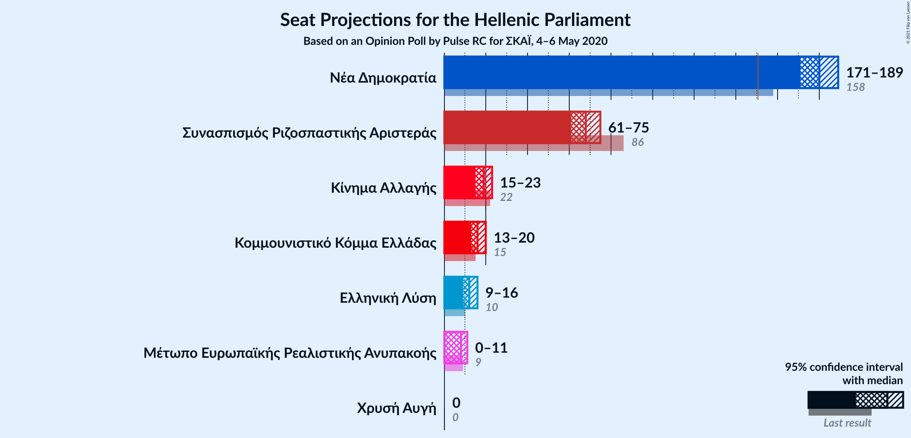
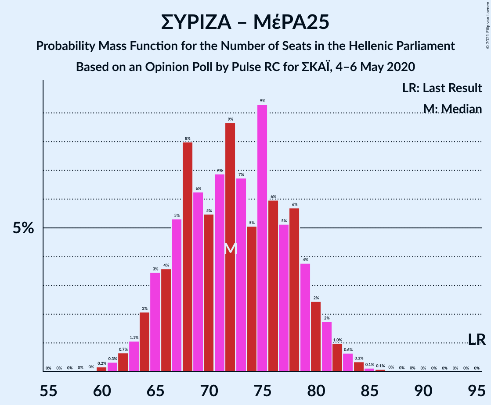

# Opinion Poll by Pulse RC for ΣΚΑΪ, 4–6 May 2020

<a href="#voting-intentions">Voting Intentions</a> | <a href="#seats">Seats</a> | <a href="#coalitions">Coalitions</a> | <a href="#technical-information">Technical Information</a>

## Voting Intentions

### Confidence Intervals

| Party | Last Result | Poll Result | 80% Confidence Interval | 90% Confidence Interval | 95% Confidence Interval | 99% Confidence Interval |
|:-----:|:-----------:|:-----------:|:-----------------------:|:-----------------------:|:-----------------------:|:-----------------------:|
| Νέα Δημοκρατία | 39.8% | 48.0% | 46.1–49.8% |45.6–50.3% |45.2–50.8% |44.3–51.7% |
| Συνασπισμός Ριζοσπαστικής Αριστεράς | 31.5% | 25.0% | 23.5–26.7% |23.0–27.1% |22.6–27.6% |21.9–28.3% |
| Κίνημα Αλλαγής | 8.1% | 7.0% | 6.1–8.0% |5.9–8.3% |5.7–8.6% |5.3–9.1% |
| Κομμουνιστικό Κόμμα Ελλάδας | 5.3% | 6.0% | 5.2–6.9% |5.0–7.2% |4.8–7.5% |4.4–7.9% |
| Ελληνική Λύση | 3.7% | 4.5% | 3.8–5.3% |3.6–5.6% |3.4–5.8% |3.1–6.2% |
| Μέτωπο Ευρωπαϊκής Ρεαλιστικής Ανυπακοής | 3.4% | 3.0% | 2.4–3.7% |2.3–3.9% |2.2–4.1% |1.9–4.5% |
| Χρυσή Αυγή | 2.9% | 1.5% | 1.1–2.1% |1.0–2.2% |0.9–2.3% |0.8–2.7% |

*Note:* The poll result column reflects the actual value used in the calculations. Published results may vary slightly, and in addition be rounded to fewer digits.

## Seats

### Confidence Intervals

| Party | Last Result | Median | 80% Confidence Interval | 90% Confidence Interval | 95% Confidence Interval | 99% Confidence Interval |
|:-----:|:-----------:|:------:|:-----------------------:|:-----------------------:|:-----------------------:|:-----------------------:|
| <a href="#νέα-δημοκρατία">Νέα Δημοκρατία</a> | 158 | 180 | 173–186 |172–187 |171–189 |168–191 |
| <a href="#συνασπισμός-ριζοσπαστικής-αριστεράς">Συνασπισμός Ριζοσπαστικής Αριστεράς</a> | 86 | 68 | 64–73 |62–74 |61–76 |59–78 |
| <a href="#κίνημα-αλλαγής">Κίνημα Αλλαγής</a> | 22 | 19 | 16–21 |16–22 |15–23 |14–25 |
| <a href="#κομμουνιστικό-κόμμα-ελλάδας">Κομμουνιστικό Κόμμα Ελλάδας</a> | 15 | 16 | 14–19 |13–20 |13–20 |12–22 |
| <a href="#ελληνική-λύση">Ελληνική Λύση</a> | 10 | 12 | 10–15 |9–15 |9–16 |8–17 |
| <a href="#μέτωπο-ευρωπαϊκής-ρεαλιστικής-ανυπακοής">Μέτωπο Ευρωπαϊκής Ρεαλιστικής Ανυπακοής</a> | 9 | 8 | 0–10 |0–11 |0–11 |0–12 |
| <a href="#χρυσή-αυγή">Χρυσή Αυγή</a> | 0 | 0 | 0 |0 |0 |0 |

### Νέα Δημοκρατία

*For a full overview of the results for this party, see the [Νέα Δημοκρατία](party-νέαδημοκρατία.html) page.*

| Number of Seats | Probability | Accumulated | Special Marks |
|:---------------:|:-----------:|:-----------:|:-------------:|
| 158 | 0% | 100% | Last Result |
| 159 | 0% | 100% |  |
| 160 | 0% | 100% |  |
| 161 | 0% | 100% |  |
| 162 | 0% | 100% |  |
| 163 | 0% | 100% |  |
| 164 | 0% | 100% |  |
| 165 | 0% | 100% |  |
| 166 | 0.1% | 100% |  |
| 167 | 0.1% | 99.9% |  |
| 168 | 0.4% | 99.8% |  |
| 169 | 0.4% | 99.4% |  |
| 170 | 1.2% | 99.0% |  |
| 171 | 2% | 98% |  |
| 172 | 3% | 96% |  |
| 173 | 3% | 93% |  |
| 174 | 5% | 90% |  |
| 175 | 4% | 85% |  |
| 176 | 6% | 80% |  |
| 177 | 7% | 74% |  |
| 178 | 8% | 67% |  |
| 179 | 7% | 60% |  |
| 180 | 5% | 53% | Median |
| 181 | 10% | 48% |  |
| 182 | 5% | 37% |  |
| 183 | 9% | 33% |  |
| 184 | 7% | 23% |  |
| 185 | 4% | 17% |  |
| 186 | 7% | 13% |  |
| 187 | 1.3% | 6% |  |
| 188 | 2% | 4% |  |
| 189 | 0.8% | 3% |  |
| 190 | 0.8% | 2% |  |
| 191 | 0.4% | 0.8% |  |
| 192 | 0.3% | 0.5% |  |
| 193 | 0.1% | 0.2% |  |
| 194 | 0.1% | 0.1% |  |
| 195 | 0% | 0% |  |

### Συνασπισμός Ριζοσπαστικής Αριστεράς

*For a full overview of the results for this party, see the [Συνασπισμός Ριζοσπαστικής Αριστεράς](party-συνασπισμόςριζοσπαστικήςαριστεράς.html) page.*

| Number of Seats | Probability | Accumulated | Special Marks |
|:---------------:|:-----------:|:-----------:|:-------------:|
| 56 | 0.1% | 100% |  |
| 57 | 0.1% | 99.9% |  |
| 58 | 0.1% | 99.8% |  |
| 59 | 0.6% | 99.7% |  |
| 60 | 1.4% | 99.1% |  |
| 61 | 2% | 98% |  |
| 62 | 3% | 96% |  |
| 63 | 2% | 93% |  |
| 64 | 6% | 91% |  |
| 65 | 11% | 85% |  |
| 66 | 9% | 74% |  |
| 67 | 8% | 65% |  |
| 68 | 12% | 56% | Median |
| 69 | 7% | 44% |  |
| 70 | 8% | 38% |  |
| 71 | 10% | 29% |  |
| 72 | 5% | 19% |  |
| 73 | 7% | 14% |  |
| 74 | 3% | 8% |  |
| 75 | 1.2% | 5% |  |
| 76 | 2% | 4% |  |
| 77 | 1.4% | 2% |  |
| 78 | 0.3% | 0.7% |  |
| 79 | 0.1% | 0.4% |  |
| 80 | 0.3% | 0.3% |  |
| 81 | 0% | 0% |  |
| 82 | 0% | 0% |  |
| 83 | 0% | 0% |  |
| 84 | 0% | 0% |  |
| 85 | 0% | 0% |  |
| 86 | 0% | 0% | Last Result |

### Κίνημα Αλλαγής

*For a full overview of the results for this party, see the [Κίνημα Αλλαγής](party-κίνημααλλαγής.html) page.*

| Number of Seats | Probability | Accumulated | Special Marks |
|:---------------:|:-----------:|:-----------:|:-------------:|
| 13 | 0.1% | 100% |  |
| 14 | 0.9% | 99.9% |  |
| 15 | 4% | 99.0% |  |
| 16 | 7% | 95% |  |
| 17 | 9% | 88% |  |
| 18 | 23% | 79% |  |
| 19 | 23% | 56% | Median |
| 20 | 14% | 33% |  |
| 21 | 9% | 19% |  |
| 22 | 5% | 10% | Last Result |
| 23 | 3% | 5% |  |
| 24 | 1.2% | 2% |  |
| 25 | 0.7% | 0.9% |  |
| 26 | 0.1% | 0.2% |  |
| 27 | 0% | 0% |  |

### Κομμουνιστικό Κόμμα Ελλάδας

*For a full overview of the results for this party, see the [Κομμουνιστικό Κόμμα Ελλάδας](party-κομμουνιστικόκόμμαελλάδας.html) page.*

| Number of Seats | Probability | Accumulated | Special Marks |
|:---------------:|:-----------:|:-----------:|:-------------:|
| 11 | 0.3% | 100% |  |
| 12 | 1.3% | 99.7% |  |
| 13 | 6% | 98% |  |
| 14 | 10% | 92% |  |
| 15 | 22% | 82% | Last Result |
| 16 | 19% | 60% | Median |
| 17 | 16% | 41% |  |
| 18 | 10% | 25% |  |
| 19 | 9% | 15% |  |
| 20 | 4% | 5% |  |
| 21 | 1.0% | 2% |  |
| 22 | 0.7% | 0.9% |  |
| 23 | 0.1% | 0.2% |  |
| 24 | 0% | 0% |  |

### Ελληνική Λύση

*For a full overview of the results for this party, see the [Ελληνική Λύση](party-ελληνικήλύση.html) page.*

| Number of Seats | Probability | Accumulated | Special Marks |
|:---------------:|:-----------:|:-----------:|:-------------:|
| 0 | 0.3% | 100% |  |
| 1 | 0% | 99.7% |  |
| 2 | 0% | 99.7% |  |
| 3 | 0% | 99.7% |  |
| 4 | 0% | 99.7% |  |
| 5 | 0% | 99.7% |  |
| 6 | 0% | 99.7% |  |
| 7 | 0% | 99.7% |  |
| 8 | 0.7% | 99.7% |  |
| 9 | 7% | 99.0% |  |
| 10 | 17% | 92% | Last Result |
| 11 | 18% | 75% |  |
| 12 | 18% | 57% | Median |
| 13 | 11% | 39% |  |
| 14 | 11% | 28% |  |
| 15 | 13% | 18% |  |
| 16 | 3% | 5% |  |
| 17 | 2% | 2% |  |
| 18 | 0.2% | 0.3% |  |
| 19 | 0% | 0% |  |

### Μέτωπο Ευρωπαϊκής Ρεαλιστικής Ανυπακοής

*For a full overview of the results for this party, see the [Μέτωπο Ευρωπαϊκής Ρεαλιστικής Ανυπακοής](party-μέτωποευρωπαϊκήςρεαλιστικήςανυπακοής.html) page.*

| Number of Seats | Probability | Accumulated | Special Marks |
|:---------------:|:-----------:|:-----------:|:-------------:|
| 0 | 49% | 100% |  |
| 1 | 0% | 51% |  |
| 2 | 0% | 51% |  |
| 3 | 0% | 51% |  |
| 4 | 0% | 51% |  |
| 5 | 0% | 51% |  |
| 6 | 0% | 51% |  |
| 7 | 0% | 51% |  |
| 8 | 8% | 51% | Median |
| 9 | 25% | 43% | Last Result |
| 10 | 11% | 18% |  |
| 11 | 5% | 7% |  |
| 12 | 2% | 2% |  |
| 13 | 0.3% | 0.4% |  |
| 14 | 0.1% | 0.1% |  |
| 15 | 0% | 0% |  |

### Χρυσή Αυγή

*For a full overview of the results for this party, see the [Χρυσή Αυγή](party-χρυσήαυγή.html) page.*

| Number of Seats | Probability | Accumulated | Special Marks |
|:---------------:|:-----------:|:-----------:|:-------------:|
| 0 | 100% | 100% | Last Result, Median |

## Coalitions

### Confidence Intervals

| Coalition | Last Result | Median | Majority? | 80% Confidence Interval | 90% Confidence Interval | 95% Confidence Interval | 99% Confidence Interval |
|:---------:|:-----------:|:------:|:---------:|:-----------------------:|:-----------------------:|:-----------------------:|:-----------------------:|
| Νέα Δημοκρατία – Κίνημα Αλλαγής | 180 | 199 | 100% | 193–205 | 191–206 | 190–207 | 187–211 |
| Νέα Δημοκρατία | 158 | 180 | 100% | 173–186 | 172–187 | 171–189 | 168–191 |
| Συνασπισμός Ριζοσπαστικής Αριστεράς – Μέτωπο Ευρωπαϊκής Ρεαλιστικής Ανυπακοής | 95 | 73 | 0% | 66–80 | 65–81 | 64–83 | 61–84 |
| Συνασπισμός Ριζοσπαστικής Αριστεράς | 86 | 68 | 0% | 64–73 | 62–74 | 61–76 | 59–78 |

### Νέα Δημοκρατία – Κίνημα Αλλαγής

| Number of Seats | Probability | Accumulated | Special Marks |
|:---------------:|:-----------:|:-----------:|:-------------:|
| 180 | 0% | 100% | Last Result |
| 181 | 0% | 100% |  |
| 182 | 0% | 100% |  |
| 183 | 0% | 100% |  |
| 184 | 0% | 100% |  |
| 185 | 0% | 100% |  |
| 186 | 0.2% | 99.9% |  |
| 187 | 0.3% | 99.7% |  |
| 188 | 0.9% | 99.4% |  |
| 189 | 0.8% | 98.5% |  |
| 190 | 0.9% | 98% |  |
| 191 | 3% | 97% |  |
| 192 | 3% | 94% |  |
| 193 | 6% | 91% |  |
| 194 | 5% | 85% |  |
| 195 | 9% | 80% |  |
| 196 | 7% | 72% |  |
| 197 | 5% | 64% |  |
| 198 | 9% | 59% |  |
| 199 | 5% | 50% | Median |
| 200 | 8% | 46% |  |
| 201 | 7% | 37% |  |
| 202 | 6% | 30% |  |
| 203 | 7% | 23% |  |
| 204 | 6% | 16% |  |
| 205 | 4% | 10% |  |
| 206 | 3% | 6% |  |
| 207 | 1.1% | 4% |  |
| 208 | 0.7% | 2% |  |
| 209 | 0.9% | 2% |  |
| 210 | 0.2% | 0.8% |  |
| 211 | 0.4% | 0.6% |  |
| 212 | 0.1% | 0.2% |  |
| 213 | 0% | 0.1% |  |
| 214 | 0% | 0% |  |

### Νέα Δημοκρατία

| Number of Seats | Probability | Accumulated | Special Marks |
|:---------------:|:-----------:|:-----------:|:-------------:|
| 158 | 0% | 100% | Last Result |
| 159 | 0% | 100% |  |
| 160 | 0% | 100% |  |
| 161 | 0% | 100% |  |
| 162 | 0% | 100% |  |
| 163 | 0% | 100% |  |
| 164 | 0% | 100% |  |
| 165 | 0% | 100% |  |
| 166 | 0.1% | 100% |  |
| 167 | 0.1% | 99.9% |  |
| 168 | 0.4% | 99.8% |  |
| 169 | 0.4% | 99.4% |  |
| 170 | 1.2% | 99.0% |  |
| 171 | 2% | 98% |  |
| 172 | 3% | 96% |  |
| 173 | 3% | 93% |  |
| 174 | 5% | 90% |  |
| 175 | 4% | 85% |  |
| 176 | 6% | 80% |  |
| 177 | 7% | 74% |  |
| 178 | 8% | 67% |  |
| 179 | 7% | 60% |  |
| 180 | 5% | 53% | Median |
| 181 | 10% | 48% |  |
| 182 | 5% | 37% |  |
| 183 | 9% | 33% |  |
| 184 | 7% | 23% |  |
| 185 | 4% | 17% |  |
| 186 | 7% | 13% |  |
| 187 | 1.3% | 6% |  |
| 188 | 2% | 4% |  |
| 189 | 0.8% | 3% |  |
| 190 | 0.8% | 2% |  |
| 191 | 0.4% | 0.8% |  |
| 192 | 0.3% | 0.5% |  |
| 193 | 0.1% | 0.2% |  |
| 194 | 0.1% | 0.1% |  |
| 195 | 0% | 0% |  |

### Συνασπισμός Ριζοσπαστικής Αριστεράς – Μέτωπο Ευρωπαϊκής Ρεαλιστικής Ανυπακοής

| Number of Seats | Probability | Accumulated | Special Marks |
|:---------------:|:-----------:|:-----------:|:-------------:|
| 59 | 0.1% | 100% |  |
| 60 | 0.2% | 99.9% |  |
| 61 | 0.5% | 99.7% |  |
| 62 | 0.6% | 99.1% |  |
| 63 | 0.6% | 98.6% |  |
| 64 | 2% | 98% |  |
| 65 | 5% | 96% |  |
| 66 | 4% | 91% |  |
| 67 | 3% | 87% |  |
| 68 | 8% | 84% |  |
| 69 | 4% | 76% |  |
| 70 | 4% | 72% |  |
| 71 | 7% | 68% |  |
| 72 | 6% | 61% |  |
| 73 | 9% | 55% |  |
| 74 | 4% | 46% |  |
| 75 | 9% | 42% |  |
| 76 | 6% | 33% | Median |
| 77 | 7% | 28% |  |
| 78 | 4% | 21% |  |
| 79 | 5% | 17% |  |
| 80 | 7% | 12% |  |
| 81 | 2% | 6% |  |
| 82 | 0.6% | 4% |  |
| 83 | 2% | 3% |  |
| 84 | 0.6% | 1.0% |  |
| 85 | 0.1% | 0.4% |  |
| 86 | 0.2% | 0.3% |  |
| 87 | 0.1% | 0.1% |  |
| 88 | 0% | 0% |  |
| 89 | 0% | 0% |  |
| 90 | 0% | 0% |  |
| 91 | 0% | 0% |  |
| 92 | 0% | 0% |  |
| 93 | 0% | 0% |  |
| 94 | 0% | 0% |  |
| 95 | 0% | 0% | Last Result |

### Συνασπισμός Ριζοσπαστικής Αριστεράς

| Number of Seats | Probability | Accumulated | Special Marks |
|:---------------:|:-----------:|:-----------:|:-------------:|
| 56 | 0.1% | 100% |  |
| 57 | 0.1% | 99.9% |  |
| 58 | 0.1% | 99.8% |  |
| 59 | 0.6% | 99.7% |  |
| 60 | 1.4% | 99.1% |  |
| 61 | 2% | 98% |  |
| 62 | 3% | 96% |  |
| 63 | 2% | 93% |  |
| 64 | 6% | 91% |  |
| 65 | 11% | 85% |  |
| 66 | 9% | 74% |  |
| 67 | 8% | 65% |  |
| 68 | 12% | 56% | Median |
| 69 | 7% | 44% |  |
| 70 | 8% | 38% |  |
| 71 | 10% | 29% |  |
| 72 | 5% | 19% |  |
| 73 | 7% | 14% |  |
| 74 | 3% | 8% |  |
| 75 | 1.2% | 5% |  |
| 76 | 2% | 4% |  |
| 77 | 1.4% | 2% |  |
| 78 | 0.3% | 0.7% |  |
| 79 | 0.1% | 0.4% |  |
| 80 | 0.3% | 0.3% |  |
| 81 | 0% | 0% |  |
| 82 | 0% | 0% |  |
| 83 | 0% | 0% |  |
| 84 | 0% | 0% |  |
| 85 | 0% | 0% |  |
| 86 | 0% | 0% | Last Result |

## Technical Information

### Opinion Poll

+ **Polling firm:** Pulse RC
+ **Commissioner(s):** ΣΚΑΪ
+ **Fieldwork period:** 4–6 May 2020

### Calculations

+ **Sample size:** 1207
+ **Simulations done:** 131,072
+ **Error estimate:** 1.39%

